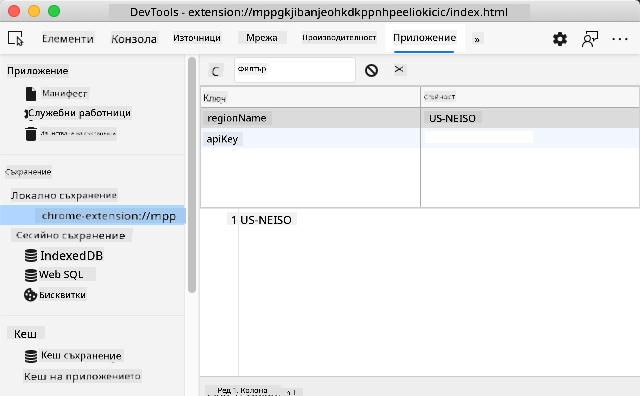

<!--
CO_OP_TRANSLATOR_METADATA:
{
  "original_hash": "a7587943d38d095de8613e1b508609f5",
  "translation_date": "2025-08-29T11:49:23+00:00",
  "source_file": "5-browser-extension/2-forms-browsers-local-storage/README.md",
  "language_code": "bg"
}
-->
# Проект за браузърно разширение, част 2: Извикване на API, използване на локално хранилище

## Тест преди лекцията

[Тест преди лекцията](https://ff-quizzes.netlify.app/web/quiz/25)

### Въведение

В този урок ще извикате API, като изпратите формата на вашето браузърно разширение и покажете резултатите в него. Освен това ще научите как да съхранявате данни в локалното хранилище на браузъра за бъдеща употреба.

✅ Следвайте номерираните сегменти в съответните файлове, за да знаете къде да поставите кода си.

### Настройка на елементите за манипулиране в разширението:

До този момент сте създали HTML за формата и `<div>` за резултатите в браузърното разширение. Оттук нататък ще работите във файла `/src/index.js` и ще изграждате разширението си стъпка по стъпка. Вижте [предишния урок](../1-about-browsers/README.md) за настройка на проекта и процеса на изграждане.

Работейки във файла `index.js`, започнете, като създадете някои `const` променливи, които да държат стойностите, свързани с различни полета:

```JavaScript
// form fields
const form = document.querySelector('.form-data');
const region = document.querySelector('.region-name');
const apiKey = document.querySelector('.api-key');

// results
const errors = document.querySelector('.errors');
const loading = document.querySelector('.loading');
const results = document.querySelector('.result-container');
const usage = document.querySelector('.carbon-usage');
const fossilfuel = document.querySelector('.fossil-fuel');
const myregion = document.querySelector('.my-region');
const clearBtn = document.querySelector('.clear-btn');
```

Всички тези полета са реферирани чрез техния CSS клас, както сте ги настроили в HTML в предишния урок.

### Добавяне на слушатели

След това добавете слушатели на събития към формата и бутона за изчистване, който нулира формата, така че ако потребителят изпрати формата или кликне върху бутона за нулиране, да се случи нещо. Добавете и извикване за инициализация на приложението в края на файла:

```JavaScript
form.addEventListener('submit', (e) => handleSubmit(e));
clearBtn.addEventListener('click', (e) => reset(e));
init();
```

✅ Обърнете внимание на съкратената форма, използвана за слушане на събития за изпращане или кликване, и как събитието се предава на функциите `handleSubmit` или `reset`. Можете ли да напишете еквивалента на тази съкратена форма в по-дълъг формат? Кой предпочитате?

### Изграждане на функциите init() и reset():

Сега ще изградите функцията, която инициализира разширението, наречена init():

```JavaScript
function init() {
	//if anything is in localStorage, pick it up
	const storedApiKey = localStorage.getItem('apiKey');
	const storedRegion = localStorage.getItem('regionName');

	//set icon to be generic green
	//todo

	if (storedApiKey === null || storedRegion === null) {
		//if we don't have the keys, show the form
		form.style.display = 'block';
		results.style.display = 'none';
		loading.style.display = 'none';
		clearBtn.style.display = 'none';
		errors.textContent = '';
	} else {
        //if we have saved keys/regions in localStorage, show results when they load
        displayCarbonUsage(storedApiKey, storedRegion);
		results.style.display = 'none';
		form.style.display = 'none';
		clearBtn.style.display = 'block';
	}
};

function reset(e) {
	e.preventDefault();
	//clear local storage for region only
	localStorage.removeItem('regionName');
	init();
}

```

В тази функция има интересна логика. Прочитайки я, можете ли да видите какво се случва?

- Две `const` променливи се създават, за да проверят дали потребителят е съхранил APIKey и регионален код в локалното хранилище.
- Ако някоя от тях е null, формата се показва, като стилът ѝ се променя на 'block'.
- Скриват се резултатите, зареждането и clearBtn, а текстът за грешка се задава като празен низ.
- Ако има ключ и регион, започва рутина за:
  - извикване на API за получаване на данни за въглеродната употреба,
  - скриване на областта за резултати,
  - скриване на формата,
  - показване на бутона за нулиране.

Преди да продължите, е полезно да научите за много важна концепция, налична в браузърите: [LocalStorage](https://developer.mozilla.org/docs/Web/API/Window/localStorage). LocalStorage е полезен начин за съхраняване на низове в браузъра като двойки `ключ-стойност`. Този тип уеб хранилище може да бъде манипулиран чрез JavaScript за управление на данни в браузъра. LocalStorage не изтича, докато SessionStorage, друг вид уеб хранилище, се изчиства при затваряне на браузъра. Различните видове хранилища имат своите плюсове и минуси.

> Забележка - вашето браузърно разширение има собствено локално хранилище; основният прозорец на браузъра е отделен екземпляр и се държи независимо.

Задавате стойност на вашия APIKey, например, и можете да видите, че той е зададен в Edge, като "инспектирате" уеб страница (можете да кликнете с десния бутон върху браузъра, за да инспектирате) и отидете в раздела Applications, за да видите хранилището.



✅ Помислете за ситуации, в които НЕ бихте искали да съхранявате някои данни в LocalStorage. Като цяло, поставянето на API ключове в LocalStorage е лоша идея! Можете ли да видите защо? В нашия случай, тъй като приложението ни е само за обучение и няма да бъде публикувано в магазин за приложения, ще използваме този метод.

Обърнете внимание, че използвате Web API за манипулиране на LocalStorage, като използвате `getItem()`, `setItem()` или `removeItem()`. Той е широко поддържан в браузърите.

Преди да изградите функцията `displayCarbonUsage()`, която се извиква в `init()`, нека изградим функционалността за обработка на първоначалното изпращане на формата.

### Обработка на изпращането на формата

Създайте функция, наречена `handleSubmit`, която приема аргумент за събитие `(e)`. Спрете разпространението на събитието (в този случай искаме да спрем браузъра от обновяване) и извикайте нова функция, `setUpUser`, като предадете аргументите `apiKey.value` и `region.value`. По този начин използвате двете стойности, които се въвеждат чрез първоначалната форма, когато съответните полета са попълнени.

```JavaScript
function handleSubmit(e) {
	e.preventDefault();
	setUpUser(apiKey.value, region.value);
}
```

✅ Освежете паметта си - HTML, който сте настроили в последния урок, има две полета за въвеждане, чиито `values` се улавят чрез `const`, които сте създали в началото на файла, и те са `required`, така че браузърът спира потребителите от въвеждане на null стойности.

### Настройка на потребителя

Продължавайки към функцията `setUpUser`, тук задавате стойности в локалното хранилище за apiKey и regionName. Добавете нова функция:

```JavaScript
function setUpUser(apiKey, regionName) {
	localStorage.setItem('apiKey', apiKey);
	localStorage.setItem('regionName', regionName);
	loading.style.display = 'block';
	errors.textContent = '';
	clearBtn.style.display = 'block';
	//make initial call
	displayCarbonUsage(apiKey, regionName);
}
```

Тази функция показва съобщение за зареждане, докато се извиква API. На този етап сте стигнали до създаването на най-важната функция на това браузърно разширение!

### Показване на въглеродната употреба

Накрая е време да направите заявка към API!

Преди да продължим, трябва да обсъдим API. API, или [Application Programming Interfaces](https://www.webopedia.com/TERM/A/API.html), са критичен елемент в инструментариума на уеб разработчика. Те предоставят стандартни начини за взаимодействие и интерфейс между програми. Например, ако изграждате уеб сайт, който трябва да направи заявка към база данни, някой може да е създал API, който да използвате. Докато има много видове API, един от най-популярните е [REST API](https://www.smashingmagazine.com/2018/01/understanding-using-rest-api/).

✅ Терминът 'REST' означава 'Representational State Transfer' и включва използването на различно конфигурирани URL адреси за извличане на данни. Направете малко проучване за различните видове API, достъпни за разработчиците. Кой формат ви допада?

Има важни неща, които трябва да отбележите за тази функция. Първо, обърнете внимание на [`async` ключовата дума](https://developer.mozilla.org/docs/Web/JavaScript/Reference/Statements/async_function). Писането на вашите функции така, че да работят асинхронно, означава, че те изчакват дадено действие, като например връщане на данни, да бъде завършено, преди да продължат.

Ето кратко видео за `async`:

[](https://youtube.com/watch?v=YwmlRkrxvkk "Async и Await за управление на обещания")

> 🎥 Кликнете върху изображението по-горе за видео за async/await.

Създайте нова функция за заявка към C02Signal API:

```JavaScript
import axios from '../node_modules/axios';

async function displayCarbonUsage(apiKey, region) {
	try {
		await axios
			.get('https://api.co2signal.com/v1/latest', {
				params: {
					countryCode: region,
				},
				headers: {
					'auth-token': apiKey,
				},
			})
			.then((response) => {
				let CO2 = Math.floor(response.data.data.carbonIntensity);

				//calculateColor(CO2);

				loading.style.display = 'none';
				form.style.display = 'none';
				myregion.textContent = region;
				usage.textContent =
					Math.round(response.data.data.carbonIntensity) + ' grams (grams C02 emitted per kilowatt hour)';
				fossilfuel.textContent =
					response.data.data.fossilFuelPercentage.toFixed(2) +
					'% (percentage of fossil fuels used to generate electricity)';
				results.style.display = 'block';
			});
	} catch (error) {
		console.log(error);
		loading.style.display = 'none';
		results.style.display = 'none';
		errors.textContent = 'Sorry, we have no data for the region you have requested.';
	}
}
```

Това е голяма функция. Какво се случва тук?

- Следвайки добрите практики, използвате ключовата дума `async`, за да направите тази функция асинхронна. Функцията съдържа блок `try/catch`, тъй като ще върне обещание, когато API върне данни. Тъй като нямате контрол върху скоростта, с която API ще отговори (може изобщо да не отговори!), трябва да се справите с тази несигурност, като я извикате асинхронно.
- Правите заявка към co2signal API, за да получите данни за вашия регион, използвайки вашия API ключ. За да използвате този ключ, трябва да използвате вид автентикация в параметрите на заглавката.
- След като API отговори, присвоявате различни елементи от неговите данни за отговор на частите от екрана, които сте настроили да показват тези данни.
- Ако има грешка или няма резултат, показвате съобщение за грешка.

✅ Използването на асинхронни програмни модели е още един много полезен инструмент във вашия арсенал. Прочетете [за различните начини](https://developer.mozilla.org/docs/Web/JavaScript/Reference/Statements/async_function), по които можете да конфигурирате този тип код.

Поздравления! Ако изградите разширението си (`npm run build`) и го обновите в панела за разширения, имате работещо разширение! Единственото нещо, което не работи, е иконата, и ще го поправите в следващия урок.

---

## 🚀 Предизвикателство

Обсъдихме няколко типа API досега в тези уроци. Изберете уеб API и проучете подробно какво предлага. Например, разгледайте API, достъпни в браузърите, като [HTML Drag and Drop API](https://developer.mozilla.org/docs/Web/API/HTML_Drag_and_Drop_API). Какво според вас прави един API страхотен?

## Тест след лекцията

[Тест след лекцията](https://ff-quizzes.netlify.app/web/quiz/26)

## Преглед и самостоятелно обучение

В този урок научихте за LocalStorage и API, и двете са много полезни за професионалния уеб разработчик. Можете ли да помислите как тези две неща работят заедно? Помислете как бихте проектирали уеб сайт, който съхранява елементи, които да се използват от API.

## Задание

[Осиновете API](assignment.md)

---

**Отказ от отговорност**:  
Този документ е преведен с помощта на AI услуга за превод [Co-op Translator](https://github.com/Azure/co-op-translator). Въпреки че се стремим към точност, моля, имайте предвид, че автоматичните преводи може да съдържат грешки или неточности. Оригиналният документ на неговия изходен език трябва да се счита за авторитетен източник. За критична информация се препоръчва професионален превод от човек. Ние не носим отговорност за каквито и да е недоразумения или погрешни интерпретации, произтичащи от използването на този превод.