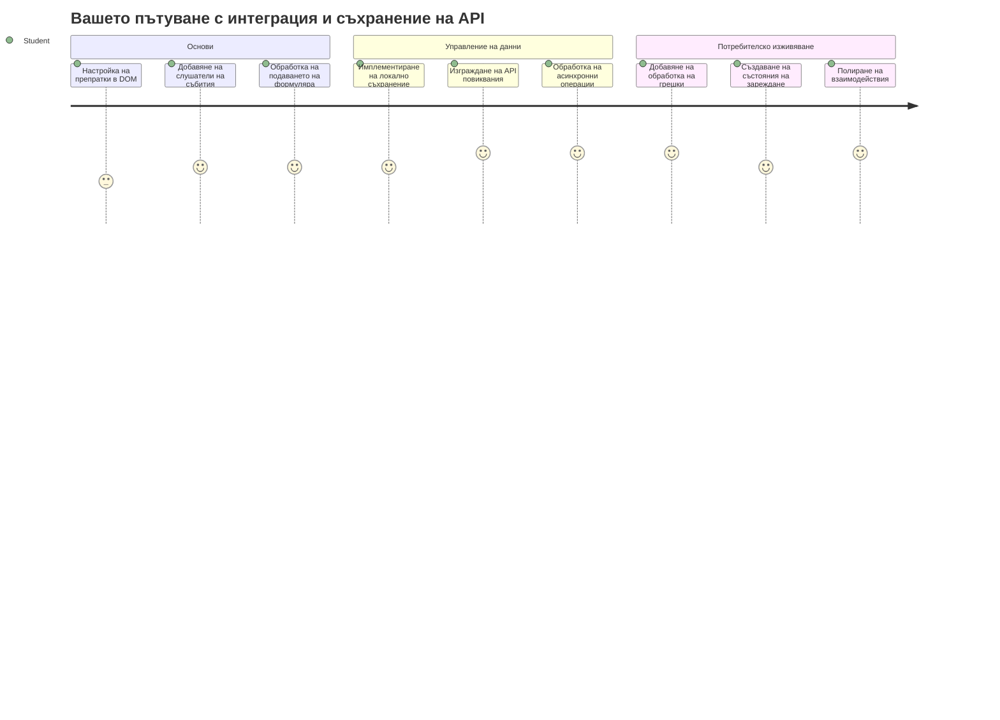
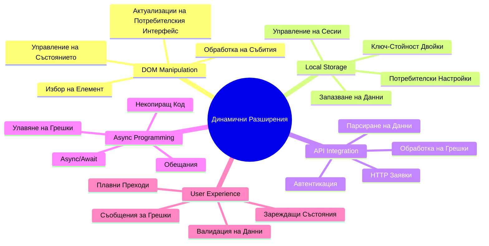
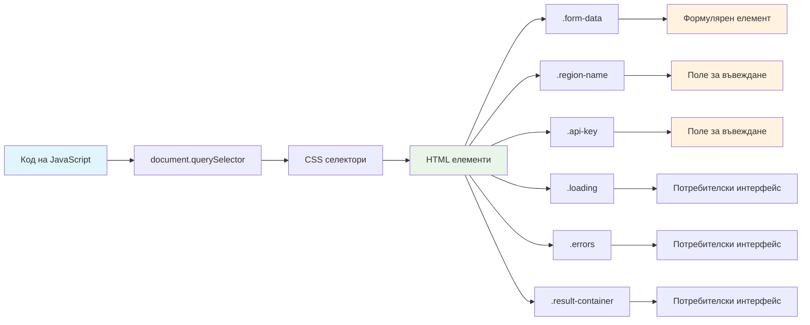
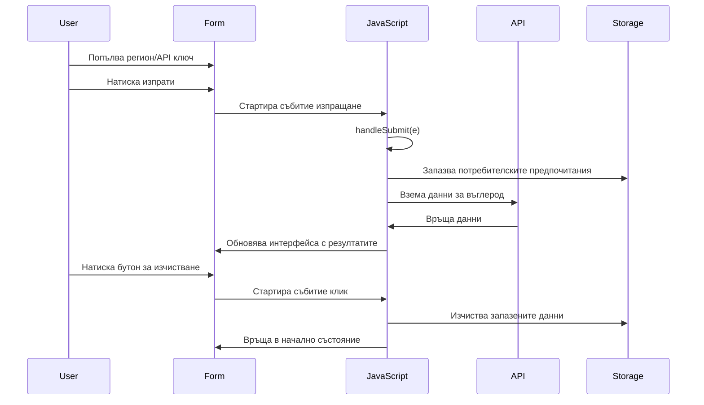
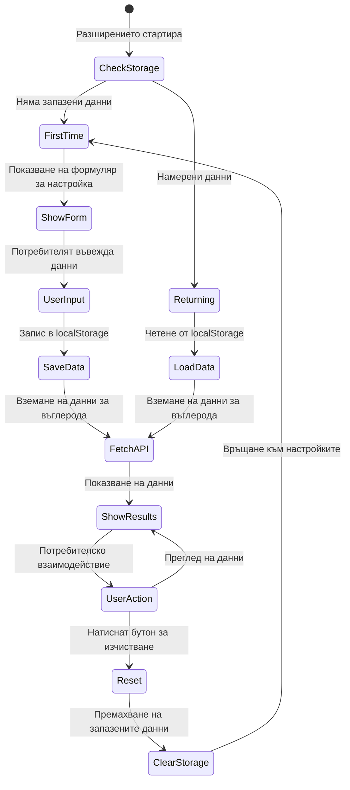
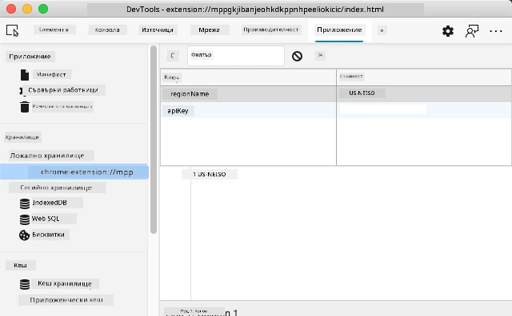
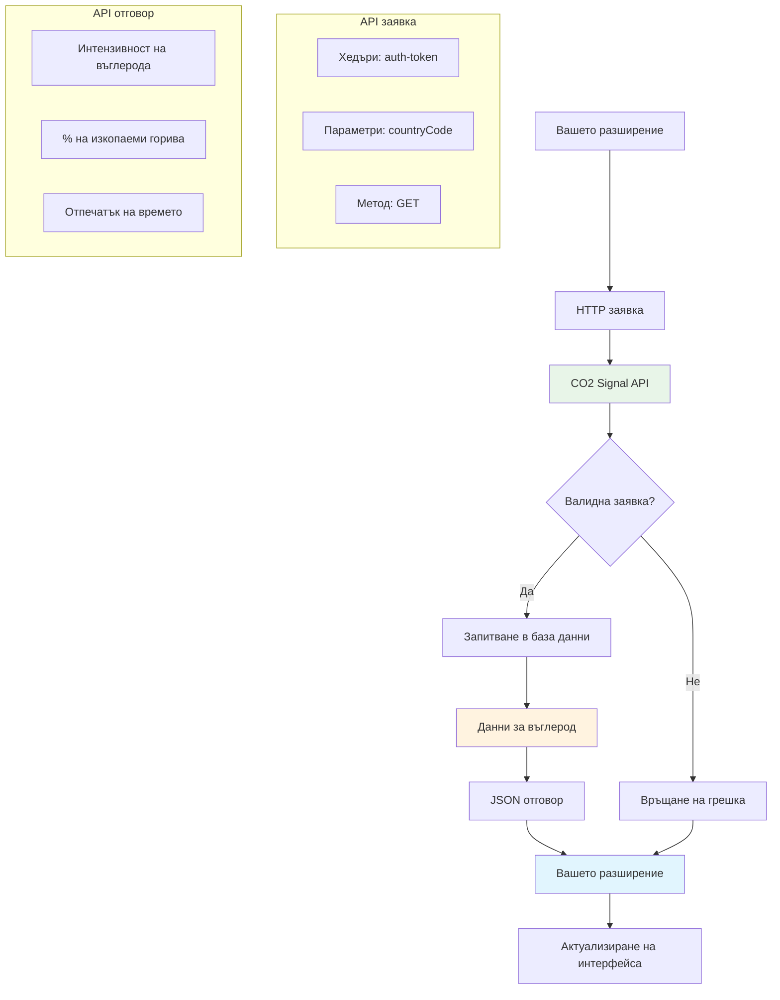
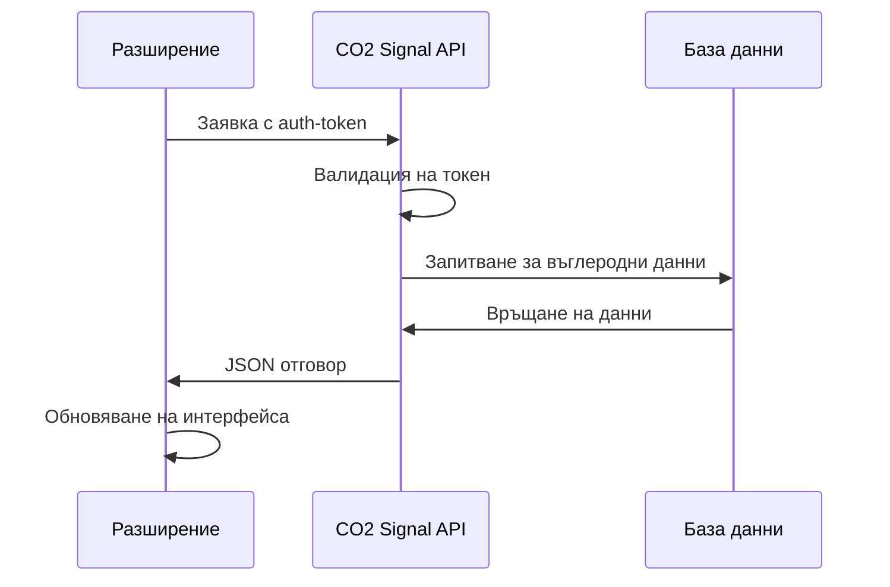
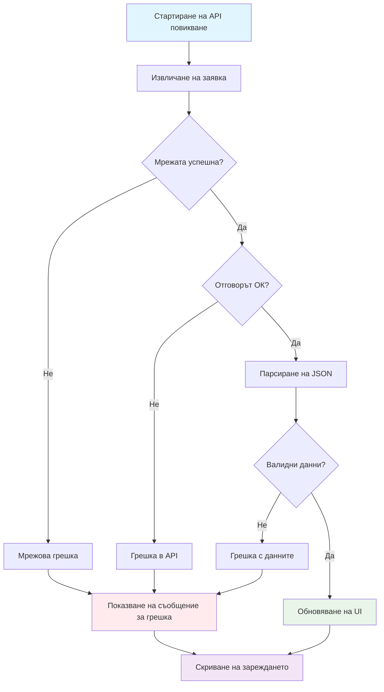
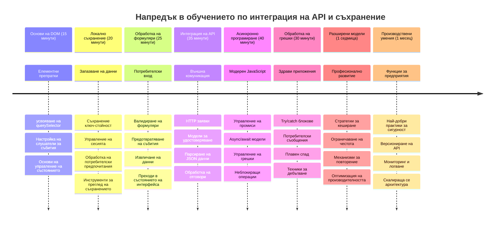

# Browser Extension Project Part 2: Call an API, use Local Storage


## Предварителен тест преди лекция

[Pre-lecture quiz](https://ff-quizzes.netlify.app/web/quiz/25)

## Увод

Помните ли разширението за браузър, което започнахте да изграждате? В момента имате хубава форма, но тя всъщност е статична. Днес ще я вдъхнем живот, като я свържем с реални данни и ѝ дадем памет.

Помислете за компютрите в контролната зала на мисията Аполо – те не просто показваха фиксирана информация. Те постоянно комуникираха с космическите кораби, актуализираха се с телеметрични данни и помнеха критични параметри на мисията. Това е видът динамично поведение, което изграждаме днес. Вашето разширение ще се свързва с интернет, ще извлича реални екологични данни и ще помни вашите настройки за следващия път.

Интеграцията с API може да звучи сложно, но на практика това е просто да научите кода си как да комуникира с други услуги. Независимо дали извличате данни за времето, социални медии или информация за въглеродния отпечатък, както ще правим днес, целта е да създадете тези дигитални връзки. Ще проучим също как браузърите могат да запазват информация – подобно на картотеките в библиотеките, които помнят къде принадлежат книгите.

До края на този урок ще имате разширение за браузър, което извлича реални данни, съхранява предпочитания на потребителя и осигурява гладко преживяване. Да започваме!


✅ Следвайте номерираните сегменти в съответните файлове, за да знаете къде да поставите кода си

## Настройка на елементите за манипулиране в разширението

Преди вашият JavaScript да може да манипулира интерфейса, той има нужда от препратки към конкретни HTML елементи. Помислете за това като за телескоп, който трябва да се насочи към определени звезди – преди Галилео да изучава спътниците на Юпитер, той трябваше да открие и фокусира самия Юпитер.

Във вашия файл `index.js` ще създадем `const` променливи, които записват препратки към всеки важен елемент от формата. Това е подобно на начина, по който учените етикетират оборудването си – вместо да търсят из цялата лаборатория всеки път, могат директно да достъпват това, което им трябва.


```javascript
// полета на формуляра
const form = document.querySelector('.form-data');
const region = document.querySelector('.region-name');
const apiKey = document.querySelector('.api-key');

// резултати
const errors = document.querySelector('.errors');
const loading = document.querySelector('.loading');
const results = document.querySelector('.result-container');
const usage = document.querySelector('.carbon-usage');
const fossilfuel = document.querySelector('.fossil-fuel');
const myregion = document.querySelector('.my-region');
const clearBtn = document.querySelector('.clear-btn');
```

**Ето какво прави този код:**
- **Записва** елементи от формата чрез `document.querySelector()` с CSS селектори по класове
- **Създава** препратки към полета за въвеждане за името на региона и API ключа
- **Установява** връзки към елементи за показване на резултати с данни за използване на въглерод
- **Настройва** достъп до UI елементи като индикатори за зареждане и съобщения за грешки
- **Съхранява** всяка препратка в `const` променлива за лесно повторно използване в целия ви код

## Добавяне на слушатели на събития

Сега ще накараме разширението ви да реагира на действия от потребителя. Слушателите на събития са начинът, по който кодът ви наблюдава взаимодействията на потребителя. Помислете за тях като за операторите в ранните телефонни централи – те слушаха входящи повиквания и свързваха правилните вериги, когато някой искаше да осъществи връзка.


```javascript
form.addEventListener('submit', (e) => handleSubmit(e));
clearBtn.addEventListener('click', (e) => reset(e));
init();
```

**Разбиране на тези концепции:**
- **Прикачва** слушател за „submit“ към формата, който се задейства, когато потребителите натиснат Enter или изпратят формата
- **Свързва** слушател за „click“ към бутона за изчистване, за нулиране на формата
- **Пуска** обекта на събитието `(e)` към обработващите функции за допълнителен контрол
- **Извиква** функцията `init()` веднага, за да настрои началното състояние на разширението

✅ Обърнете внимание на съкратения синтаксис с функционален стрелков израз (arrow function), използван тук. Този модерен JavaScript подход е по-четим от традиционните изрази с функции, но и двата работят еднакво добре!

### 🔄 **Педагогическа проверка**
**Разбиране на обработката на събития**: Преди да преминете към инициализацията, уверете се, че можете да:
- ✅ Обясните как `addEventListener` свързва действията на потребителя с JavaScript функции
- ✅ Разберете защо подаваме обекта на събитието `(e)` към обработващите функции
- ✅ Разпознаете разликата между събитията `submit` и `click`
- ✅ Описвате кога се изпълнява функцията `init()` и защо

**Бърз тест за себе си**: Какво би се случило, ако забравите `e.preventDefault()` при изпращане на формата?
*Отговор: Страницата ще се презареди, което ще загуби цялото състояние на JavaScript и ще прекъсне потребителското преживяване*

## Изграждане на функциите за инициализация и нулиране

Нека създадем логиката за инициализация на вашето разширение. Функцията `init()` е като навигационната система на кораб, която проверява инструментите си – тя определя текущото състояние и настройва интерфейса според него. Проверява дали някой е използвал разширението преди и зарежда предишните му настройки.

Функцията `reset()` дава на потребителя нов старт – подобно на това как учените нулират инструментите си между експерименти, за да осигурят чисти данни.

```javascript
function init() {
	// Проверете дали потребителят е запазил API данни преди
	const storedApiKey = localStorage.getItem('apiKey');
	const storedRegion = localStorage.getItem('regionName');

	// Задайте иконата на разширението на общ зелен цвят (заместител за бъдещ урок)
	// TODO: Имплементирайте обновяване на иконата в следващия урок

	if (storedApiKey === null || storedRegion === null) {
		// Потребител за първи път: покажете формата за настройка
		form.style.display = 'block';
		results.style.display = 'none';
		loading.style.display = 'none';
		clearBtn.style.display = 'none';
		errors.textContent = '';
	} else {
		// Връщащ се потребител: заредете автоматично запазените му данни
		displayCarbonUsage(storedApiKey, storedRegion);
		results.style.display = 'none';
		form.style.display = 'none';
		clearBtn.style.display = 'block';
	}
}

function reset(e) {
	e.preventDefault();
	// Изчистете запазения регион, за да позволите на потребителя да избере ново място
	localStorage.removeItem('regionName');
	// Рестартирайте процеса на инициализация
	init();
}
```

**Разграждане на случващото се тук:**
- **Извлича** запазения API ключ и регион от локалното хранилище на браузъра
- **Проверява** дали това е първократен потребител (без запазени данни) или връщащ се
- **Показва** формата за настройка за нови потребители и скрива други елементи на интерфейса
- **Автоматично зарежда** запазените данни за връщащите се потребители и показва опцията за нулиране
- **Управлява** състоянието на потребителския интерфейс в зависимост от наличните данни

**Основни понятия за Local Storage:**
- **Запазва** данните между сесиите на браузъра (за разлика от session storage)
- **Съхранява** данните като ключ-стойност с помощта на `getItem()` и `setItem()`
- **Връща** `null`, когато няма данни за даден ключ
- **Осигурява** лесен начин за запомняне на предпочитанията и настройките на потребителя

> 💡 **Разбиране на браузърното съхранение**: [LocalStorage](https://developer.mozilla.org/docs/Web/API/Window/localStorage) е като предоставяне на разширението ви постоянна памет. Помислете как древната Александрийска библиотека съхранявала свитъци – информацията оставала налична, дори когато учените напускаха и после се връщаха.
>
> **Основни характеристики:**
> - **Запазва** данните и след като затворите браузъра
> - **Устойчива** на рестартиране на компютъра и сривове на браузъра
> - **Осигурява** значително пространство за съхранение на предпочитания
> - **Предлага** бърз достъп без мрежови закъснения

> **Важно:** Вашето браузърно разширение има собствено изолирано локално хранилище, отделно от редовните уебстраници. Това осигурява сигурност и предотвратява конфликти с други сайтове.

Можете да разглеждате съхранените данни чрез отваряне на инструменти за разработчици в браузъра (F12), навигация до таба **Application** и разширяване на секцията **Local Storage**.




> ⚠️ **Съображения за сигурността**: В продукционни приложения съхраняването на API ключове в LocalStorage представлява риск за сигурността, защото JavaScript може да има достъп до тези данни. За учебни цели този подход е приемлив, но реалните приложения трябва да използват защитено сървърно съхранение за чувствителни данни.

## Обработка на изпращане на формата

Сега ще обработим какво се случва при изпращане на вашата форма. По подразбиране браузърите презареждат страницата при изпращане на формуляри, но ние ще прекъснем това поведение, за да осигурим по-гладко преживяване.

Този подход е подобен на начина, по който контролната зала управлява комуникацията с космическите кораби – вместо да нулират цялата система при всяка трансмисия, те поддържат непрекъсната работа, докато обработват новата информация.

Създайте функция, която хваща събитието за изпращане на формата и извлича въведените от потребителя данни:

```javascript
function handleSubmit(e) {
	e.preventDefault();
	setUpUser(apiKey.value, region.value);
}
```

**По-горе сме:**
- **Предотвратили** стандартното поведение на изпращане на формата, което иначе би презаредило страницата
- **Извлекли** стойностите на потребителския вход от полетата за API ключ и регион
- **Подали** формулярните данни към функцията `setUpUser()` за обработка
- **Поддържали** поведението на SPA (single-page application) чрез избягване на презареждане

✅ Помнете, че HTML полетата във вашата форма съдържат атрибута `required`, така че браузърът автоматично проверява дали API ключът и регионът са предоставени, преди тази функция да се изпълни.

## Настройване на потребителските предпочитания

Функцията `setUpUser` отговаря за запазване на данните на потребителя и стартира първото извикване на API. Това създава плавен преход от настройка към показване на резултати.

```javascript
function setUpUser(apiKey, regionName) {
	// Запазване на потребителските данни за следващи сесии
	localStorage.setItem('apiKey', apiKey);
	localStorage.setItem('regionName', regionName);
	
	// Актуализирайте интерфейса за показване на състоянието на зареждане
	loading.style.display = 'block';
	errors.textContent = '';
	clearBtn.style.display = 'block';
	
	// Вземете данни за използването на въглерод с потребителските данни
	displayCarbonUsage(apiKey, regionName);
}
```

**Стъпка по стъпка се случва:**
- **Записва** API ключа и името на региона в локалното хранилище за по-късна употреба
- **Показва** индикатор за зареждане, за да информира потребителите, че данни се извличат
- **Изчиства** всякакви предишни съобщения за грешки от дисплея
- **Показва** бутона за изчистване, за да могат потребителите да нулират настройките си по-късно
- **Инициира** извикване на API за получаване на реални данни за използване на въглерод

Тази функция създава безпроблемно потребителско преживяване, като управлява както съхранението на данни, така и актуализацията на интерфейса в едно координирано действие.

## Показване на данни за използване на въглерод

Сега ще свържем разширението ви с външни източници на данни чрез API-та. Това превръща разширението ви от самостоятелен инструмент в нещо, което може да достъпва актуална информация от интернет.

**Разбиране на API-та**

[API-тата](https://www.webopedia.com/TERM/A/API.html) са начинът, по който различните приложения комуникират помежду си. Помислете ги като телеграфната система от 19-ти век, която свързвала отдалечени градове – операторите изпращали заявки до далечни станции и получавали отговори с исканата информация. Всеки път, когато проверявате социални медии, питате гласов асистент или използвате приложение за доставка, API-тата осъществяват тези обмен на данни.


**Основни понятия за REST API:**
- **REST** означава "Representational State Transfer"
- **Използва** стандартни HTTP методи (GET, POST, PUT, DELETE) за взаимодействие с данни
- **Връща** данни в предвидими формати, обикновено JSON
- **Осигурява** стабилни, базирани на URL крайни точки за различни видове заявки

✅ [API-то CO2 Signal](https://www.co2signal.com/), което ще ползваме, предоставя данни в реално време за въглеродната интензивност на електроенергията по света. Това помага на потребителите да разберат екологичния ефект от използването на електричество!

> 💡 **Разбиране на асинхронния JavaScript**: Ключовата дума [`async`](https://developer.mozilla.org/docs/Web/JavaScript/Reference/Statements/async_function) позволява на кода ви да управлява множество операции едновременно. Когато искате данни от сървър, не искате цялото разширение да се "замразява" – това би било като въздушен контрол, който спира всички операции, докато един самолет отговори.
>
> **Основни предимства:**
> - **Поддържа** отзивчивост на разширението докато зареждат данни
> - **Позволява** друг код да продължи да се изпълнява докато има мрежови заявки
> - **Подобрява** четимостта на кода спрямо традиционните callback модели
> - **Позволява** гладко обработване на грешки при мрежови проблеми

Ето кратко видео за `async`:

[](https://youtube.com/watch?v=YwmlRkrxvkk "Async and Await for managing promises")

> 🎥 Кликнете върху изображението по-горе за видео за async/await.

### 🔄 **Педагогическа проверка**
**Разбиране на асинхронното програмиране**: Преди да се потопите във функцията за API, уверете се, че разбирате:
- ✅ Защо използваме `async/await` вместо блокиране на цялото разширение
- ✅ Как блоковете `try/catch` обработват мрежовите грешки плавно
- ✅ Разликата между синхронни и асинхронни операции
- ✅ Защо API повикванията могат да се провалят и как да се справите с тези провали

**Реални връзки**: Помислете за тези всекидневни async примери:
- **Поръчване на храна**: Не чакате в кухнята – получавате бележка и продължавате други дейности
- **Изпращане на имейли**: Приложението не замръзва при изпращане – можете да пишете още имейли
- **Зареждане на уеб страници**: Картинките се зареждат постепенно, докато вече можете да четете текста

**Поток на API автентикация**:

Създайте функцията за извличане и показване на данни за използването на въглерод:

```javascript
// Съвременен подход с fetch API (без външни зависимости)
async function displayCarbonUsage(apiKey, region) {
	try {
		// Извличане на данни за интензивност на въглерода от CO2 Signal API
		const response = await fetch('https://api.co2signal.com/v1/latest', {
			method: 'GET',
			headers: {
				'auth-token': apiKey,
				'Content-Type': 'application/json'
			},
			// Добавяне на параметри за заявка за конкретния регион
			...new URLSearchParams({ countryCode: region }) && {
				url: `https://api.co2signal.com/v1/latest?countryCode=${region}`
			}
		});

		// Проверка дали заявката към API е успешна
		if (!response.ok) {
			throw new Error(`API request failed: ${response.status}`);
		}

		const data = await response.json();
		const carbonData = data.data;

		// Изчисляване на закръглена стойност на интензивността на въглерода
		const carbonIntensity = Math.round(carbonData.carbonIntensity);

		// Актуализиране на потребителския интерфейс с извлечените данни
		loading.style.display = 'none';
		form.style.display = 'none';
		myregion.textContent = region.toUpperCase();
		usage.textContent = `${carbonIntensity} grams (grams CO₂ emitted per kilowatt hour)`;
		fossilfuel.textContent = `${carbonData.fossilFuelPercentage.toFixed(2)}% (percentage of fossil fuels used to generate electricity)`;
		results.style.display = 'block';

		// TODO: calculateColor(carbonIntensity) - да се реализира в следващия урок

	} catch (error) {
		console.error('Error fetching carbon data:', error);
		
		// Показване на удобен за потребителя съобщение за грешка
		loading.style.display = 'none';
		results.style.display = 'none';
		errors.textContent = 'Sorry, we couldn\'t fetch data for that region. Please check your API key and region code.';
	}
}
```

**Разграждане на случващото се тук:**
- **Използва** модерния API `fetch()`, вместо външни библиотеки като Axios, за по-чист код без зависимости
- **Прилага** правилна проверка за грешки с `response.ok` за ранно засичане на откази на API
- **Обработва** асинхронни операции с `async/await` за по-четлив ход на кода
- **Автентикира** с CO2 Signal API чрез хедъра `auth-token`
- **Парсира** JSON данните от отговора и извлича информация за въглеродната интензивност
- **Обновява** няколко UI елемента с форматирана екологична информация
- **Осигурява** потребителски разбираеми съобщения за грешки при провали на API повиквания

**Основни модерни JavaScript концепции:**
- **Template literals** с `${}` синтаксис за чисто форматиране на низове
- **Обработка на грешки** с try/catch блокове за стабилни приложения
- **Async/await** модел за плавно управление на мрежови заявки
- **Деструктуриране на обекти** за извличане на конкретни данни от отговори
- **Верижно извикване** за множество манипулации на DOM

✅ Тази функция демонстрира няколко важни концепции при уеб разработка – комуникация с външни сървъри, управление на автентикация, обработка на данни, обновяване на интерфейса и държане на грешки под контрол. Това са фундаментални умения, с които професионалните разработчици работят постоянно.


### 🔄 **Педагогическа проверка**
**Пълно разбиране на системата**: Уверете се, че овладявате целия поток:
- ✅ Как препратките към DOM позволяват на JavaScript да контролира интерфейса
- ✅ Защо локалното хранилище осигурява постоянство между сесиите на браузъра
- ✅ Как async/await прави API повиквания без да замразява разширението
- ✅ Какво се случва при провал на API повиквания и как се обработват грешките
- ✅ Защо потребителското преживяване включва състояния за зареждане и съобщения за грешки

🎉 **Какво постигнахте:** Създадохте разширение, което:
- **Свързва** се с интернет и извлича реални екологични данни
- **Запазва** потребителските настройки между сесиите
- **Обработва** грешки без сривове
- **Осигурява** плавно и професионално потребителско изживяване

Тествайте работата си, като стартирате `npm run build` и обновите разширението в браузъра. Сега имате функционален тракер за въглероден отпечатък. Следващият урок ще добави динамична иконка, за да завърши разширението.

---

## GitHub Copilot Agent Challenge 🚀

Използвайтережим Agent, за да изпълните следното предизвикателство:
**Описание:** Подобрете разширението за браузър, като добавите подобрения в управлението на грешки и функции за по-добро потребителско изживяване. Това предизвикателство ще ви помогне да упражните работа с API, локално съхранение и манипулация на DOM, използвайки съвременни JavaScript подходи.

**Задача:** Създайте разширена версия на функцията displayCarbonUsage, която включва: 1) Механизъм за повторен опит при неуспешни API заявки с експоненциално забавяне, 2) Валидация на входа за регионален код преди извършване на API заявката, 3) Анимация за зареждане с индикатори за напредъка, 4) Кеширане на отговорите от API в localStorage с времеви марки за изтичане (кеширане за 30 минути) и 5) Функция за показване на исторически данни от предишни API повиквания. Също така добавете подходящи JSDoc коментари в стила на TypeScript за документиране на всички параметри на функцията и типове на връщаните стойности.

Научете повече за [режим агент](https://code.visualstudio.com/blogs/2025/02/24/introducing-copilot-agent-mode) тук.

## 🚀 Предизвикателство

Разширете знанията си за API, като изследвате богатството от браузър-базирани API, достъпни за уеб разработка. Изберете един от тези браузър API-та и създайте малка демонстрация:

- [Geolocation API](https://developer.mozilla.org/docs/Web/API/Geolocation_API) - Вземете текущото местоположение на потребителя
- [Notification API](https://developer.mozilla.org/docs/Web/API/Notifications_API) - Изпращайте настолни известия
- [HTML Drag and Drop API](https://developer.mozilla.org/docs/Web/API/HTML_Drag_and_Drop_API) - Създайте интерактивни интерфейси за плъзгане
- [Web Storage API](https://developer.mozilla.org/docs/Web/API/Web_Storage_API) - Разширени техники за локално съхранение
- [Fetch API](https://developer.mozilla.org/docs/Web/API/Fetch_API) - Съвременна алтернатива на XMLHttpRequest

**Изследователски въпроси за разглеждане:**
- Какви реални проблеми решава този API?
- Как API-то се справя с грешки и гранични случаи?
- Какви са съображенията за сигурност при използването на този API?
- Колко широко е поддържан този API в различните браузъри?

След вашето изследване, определете какви характеристики правят един API удобен за разработчици и надежден.

## Викторина след лекцията

[Викторина след лекция](https://ff-quizzes.netlify.app/web/quiz/26)

## Преглед и Самостоятелно обучение

Научихте за LocalStorage и API-тата в този урок, които са много полезни за професионалния уеб разработчик. Можете ли да помислите как тези две неща работят заедно? Помислете как бихте архитектурирали уеб сайт, който съхранява елементи, използвани от API.

### ⚡ **Какво можете да направите в следващите 5 минути**
- [ ] Отворете раздела Application в DevTools и разгледайте localStorage на някой уебсайт
- [ ] Създайте прост HTML формуляр и тествайте валидацията му в браузъра
- [ ] Опитайте да съхранявате и извличате данни с localStorage в конзолата на браузъра
- [ ] Прегледайте данните от формуляр, които се изпращат, използвайки раздела Network

### 🎯 **Какво можете да постигнете в този час**
- [ ] Попълнете викторината след урока и разберете концепциите за обработка на формуляри
- [ ] Създайте формуляр за разширение на браузър, който запазва потребителските предпочитания
- [ ] Реализирайте валидация на страна клиент с полезни съобщения за грешки
- [ ] Практикувайте използването на chrome.storage API за съхранение на данни в разширението
- [ ] Създайте потребителски интерфейс, който реагира на съхранените потребителски настройки

### 📅 **Вашето седмично изграждане на разширение**
- [ ] Завършете разширение за браузър с пълна функционалност за формуляри
- [ ] Усъвършенствайте различни опции за съхранение: local, sync и session storage
- [ ] Реализирайте разширени функции за формуляри като автозавършване и валидация
- [ ] Добавете функция за импортиране/експортиране на потребителски данни
- [ ] Тествайте разширението си обстойно в различни браузъри
- [ ] Изгладете потребителското изживяване и управлението на грешки

### 🌟 **Вашето месечно усвояване на уеб API**
- [ ] Изграждайте сложни приложения, използвайки различни API-та за браузърно съхранение
- [ ] Научете за модели за разработка offline-first
- [ ] Допринасяйте за проекти с отворен код, свързани със съхранение на данни
- [ ] Усъвършенстване на разработката със защита на личните данни и съответствие с GDPR
- [ ] Създавайте многократно използваеми библиотеки за обработка на формуляри и управление на данни
- [ ] Споделяйте знания за уеб API-та и разработка на разширения

## 🎯 Вашият времеви график за овладяване на разработката на разширения


### 🛠️ Резюме на вашия инструментариум за Full-Stack разработка

След завършването на този урок вече имате:
- **Владеене на DOM**: Прецизно насочване и манипулация на елементи
- **Експертиза в съхранението**: Управление на устойчиви данни с localStorage
- **Интеграция с API**: Взимане на данни в реално време и удостоверяване
- **Асинхронно програмиране**: Асинхронни операции с модерния JavaScript
- **Обработка на грешки**: Надеждни приложения, които грациозно се справят с повреди
- **Потребителско изживяване**: Състояния на зареждане, валидация и плавни взаимодействия
- **Модерни модели**: fetch API, async/await и ES6+ функции

**Професионални умения, придобити**: Използвали сте модели в:
- **Уеб приложения**: Single-page apps с външни източници на данни
- **Мобилна разработка**: API-зависими приложения с офлайн възможности
- **Настолен софтуер**: Electron приложения с постоянно съхранение
- **Корпоративни системи**: Удостоверяване, кеширане и управление на грешки
- **Модерни рамки**: React/Vue/Angular модели за управление на данни

**Следващо ниво**: Готови сте да изследвате напреднали теми като стратегии за кеширане, WebSocket връзки в реално време или комплексно управление на състояния!

## Задача

[Adopt an API](assignment.md)

---

<!-- CO-OP TRANSLATOR DISCLAIMER START -->
**Отказ от отговорност**:
Този документ е преведен с помощта на AI преводаческа услуга [Co-op Translator](https://github.com/Azure/co-op-translator). Въпреки че се стремим към точност, моля, имайте предвид, че автоматизираните преводи могат да съдържат грешки или неточности. Оригиналният документ на неговия роден език трябва да се счита за авторитетен източник. За критична информация се препоръчва професионален човешки превод. Ние не носим отговорност за каквито и да е недоразумения или неправилни тълкувания, произтичащи от използването на този превод.
<!-- CO-OP TRANSLATOR DISCLAIMER END -->