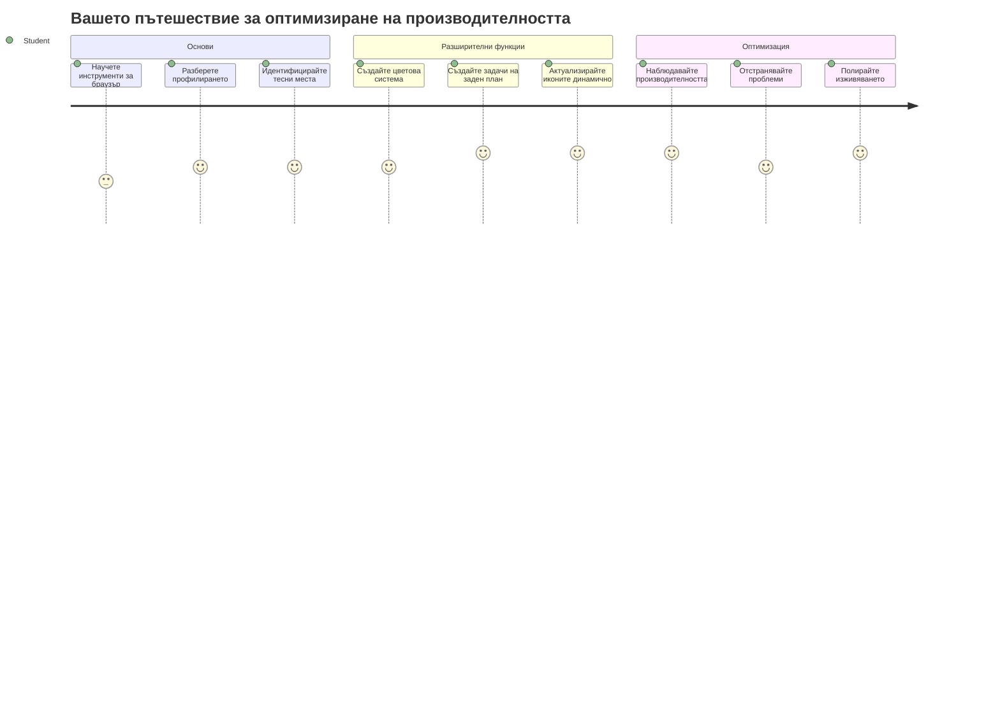
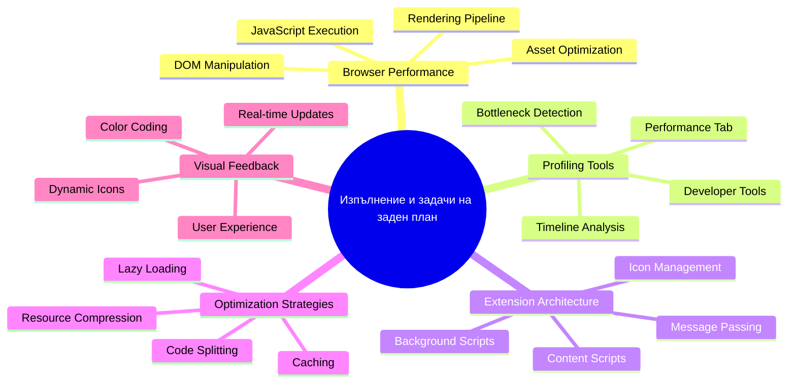
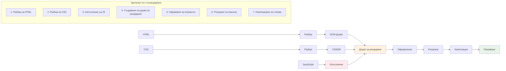
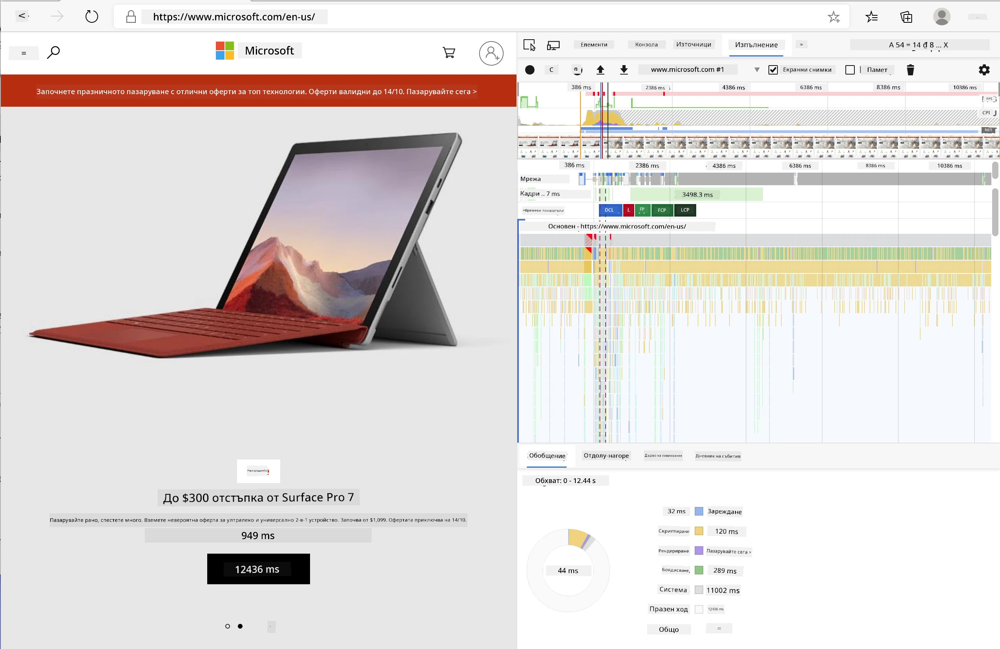
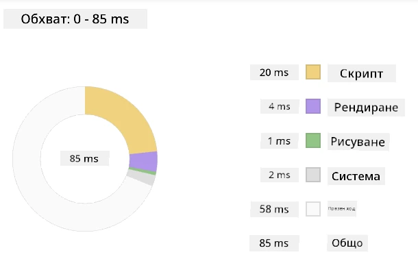
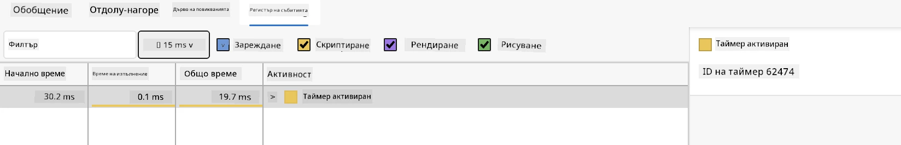
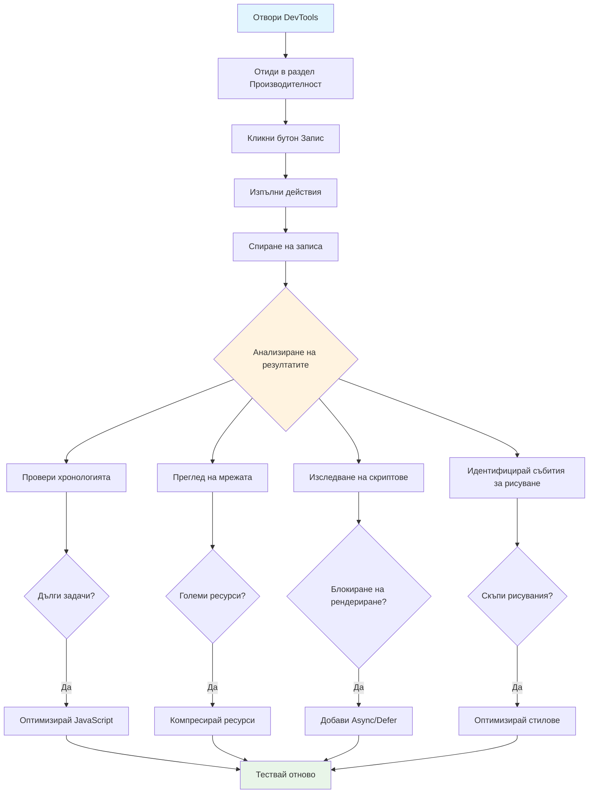
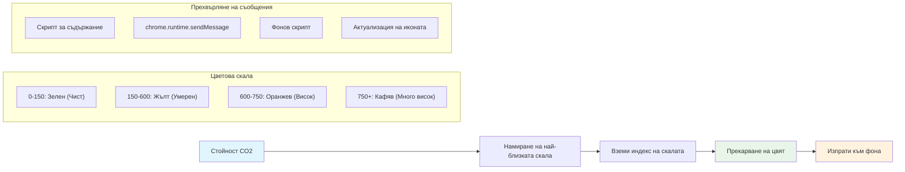
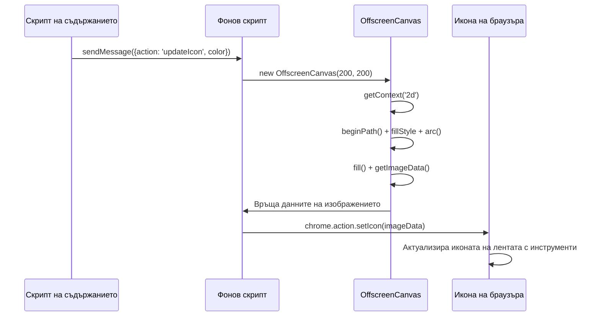
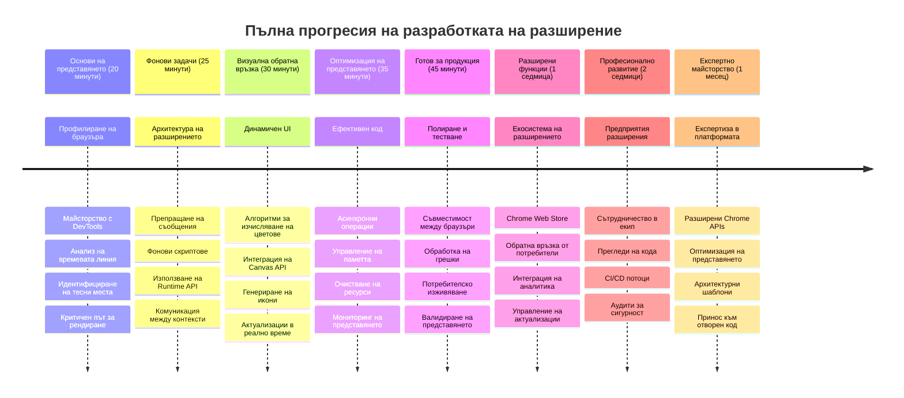

<!--
CO_OP_TRANSLATOR_METADATA:
{
  "original_hash": "b275fed2c6fc90d2b9b6661a3225faa2",
  "translation_date": "2026-01-07T06:58:26+00:00",
  "source_file": "5-browser-extension/3-background-tasks-and-performance/README.md",
  "language_code": "bg"
}
-->
# Проект за браузър разширение Част 3: Научете за фонови задачи и производителност


Някога чудили ли сте се как някои браузърни разширения изглеждат бързи и отзивчиви, докато други сякаш се забавят? Тайното се крие в това, което се случва зад кадър. Докато потребителите кликат из интерфейса на разширението ви, зад сцената има цял свят от фонови процеси, които тихо управляват извличането на данни, обновяването на иконите и системните ресурси.

Това е нашият последен урок в серията за браузърни разширения и ще направим вашия тракер за въглеродния отпечатък да работи гладко. Ще добавите динамично обновяване на иконите и ще научите как да откривате проблеми с производителността преди да станат сериозни. Това е като настройка на състезателна кола - малките оптимизации могат да направят голяма разлика в начина, по който всичко работи.

Когато свършим, ще имате полиранo разширение и ще разбирате принципите на производителността, които разделят добрите уеб приложения от страхотните. Нека се гмурнем в света на оптимизацията в браузъра.

## Предварителен квиз

[Предварителен квиз](https://ff-quizzes.netlify.app/web/quiz/27)

### Въведение

В предишните ни уроци изградихте форма, свързахте я с API и се справихте с асинхронно извличане на данни. Вашето разширение се оформя чудесно.

Сега трябва да добавим финалните щрихи - като например да направим иконата на разширението да променя цветовете си въз основа на въглеродните данни. Това ми напомня за начина, по който НАСА трябваше да оптимизира всяка система на космическия апарат Аполо. Те не можеха да си позволят никакви загубени цикли или памет, защото животи зависеха от производителността. Макар нашето браузърно разширение да не е чак толкова критично, същите принципи важат - ефективният код създава по-добри потребителски преживявания.


## Основи на уеб производителността

Когато кодът ви работи ефективно, хората наистина могат да *усетят* разликата. Познавате онзи момент, когато страница се зарежда мигновено или анимация тече гладко? Това е добра производителност на работа.

Производителността не е само за скорост - а да създаваш уеб преживявания, които се чувстват естествени, а не тромави и разочароващи. В ранните дни на компютрите Грейс Хопър известно време държала наносекунда (парче проводник с дължина около една фут) на бюрото си, за да покаже колко далеч пътува светлината за една милиардна от секундата. Това бил нейният начин да обясни защо всеки микросекунд е важен в изчисленията. Нека разгледаме инструментите-детективи, които ще ви помогнат да разберете какво забавя нещата.

> "Производителността на уебсайта зависи от две неща: колко бързо се зарежда страницата и колко бързо работи кодът върху нея." -- [Зак Гросбарт](https://www.smashingmagazine.com/2012/06/javascript-profiling-chrome-developer-tools/)

Темата как да направите уебсайтовете си бързи на всякакви устройства, за всякакви потребители и във всякакви ситуации, разбира се е много обширна. Ето някои точки, които да имате предвид, докато изграждате стандартен уеб проект или браузърно разширение.

Първата стъпка в оптимизацията на сайта ви е да разберете какво всъщност се случва "под капака". За щастие, браузърът ви идва с мощни инструменти-детективи, вградени директно в него.


За да отворите Developer Tools в Edge, кликнете върху трите точки горе вдясно, след това отидете на More Tools > Developer Tools. Или използвайте клавишната комбинация: `Ctrl` + `Shift` + `I` в Windows или `Option` + `Command` + `I` в Mac. След като сте там, кликнете на таб Performance - тук ще правите вашето разследване.

**Ето вашия комплект за разследване на производителността:**
- **Отворете** Developer Tools (ще ги използвате постоянно като разработчици!)
- **Отидете** в таб Performance - помислете за него като фитнес тракер за вашето уеб приложение
- **Натиснете** бутона Record и наблюдавайте страницата в действие
- **Изучете** резултатите, за да откриете какво забавя нещата

Нека опитаме. Отворете уебсайт (Microsoft.com е добър пример) и кликнете бутона 'Record'. Сега обновете страницата и гледайте профайлъра как улавя всичко, което се случва. Когато спрете записа, ще видите детайлно разграфяване на това как браузърът „изпълнява скриптове“, „рендерира“ и „рисува“ сайта. Това ми напомня за начина, по който мисия контрол следи всяка система по време на изстрелване на ракета - получавате данни в реално време за точно какво и кога се случва.



✅ Документацията на [Microsoft](https://docs.microsoft.com/microsoft-edge/devtools-guide/performance/?WT.mc_id=academic-77807-sagibbon) има много повече подробности, ако искате да навлезете по-дълбоко

> Професионален съвет: Изчистете кеша на браузъра си преди теста, за да видите как се представя сайтът за първи път посетителите - обикновено е доста различно от повторните посещения!

Изберете части от хронологията на профила, за да приближите събития, които се случват докато страницата се зарежда.

Вземете моментна снимка на производителността на страницата, като изберете част от хронологията на профила и погледнете обобщения прозорец:



Проверете прозореца с журнал на събития, за да видите дали някое събитие е продължило повече от 15 ms:



✅ Запознайте се с профайлъра! Отворете developer tools на този сайт и вижте дали има тесни места. Кой е най-бавно зареждащият се ресурс? Най-бързият?


## Какво да търсим при профилиране

Стартирането на профайлъра е само началото - истинското умение е да разбирате какво всъщност ви казват тези цветни графики. Не се притеснявайте, ще свикнете с четенето им. Опитните разработчици са научили да откриват предупредителните знаци, преди те да се превърнат в големи проблеми.

Нека поговорим за типичните заподозрени - нарушителите на производителността, които обикновено се промъкват в уеб проектите. Както Мария Кюри внимателно наблюдавала нивата на радиация в лабораторията си, така и ние трябва да следим за определени модели, които показват разрастващи се проблеми. Ако ги хванете рано, ще спестите много фрустрация на себе си и на потребителите.

**Размер на ресурсите**: Уебсайтовете стават „по-тежки“ с времето, и голяма част от този допълнителен товар идва от изображения. Все едно, че пълним повече и повече дигитални куфари.

✅ Вижте [Internet Archive](https://httparchive.org/reports/page-weight), за да видите как размерите на страниците са се увеличили с времето - доста показателно.

**Как да поддържате ресурсите си оптимизирани:**
- **Компресирайте** изображенията! Модерни формати като WebP могат значително да намалят размера на файловете
- **Сервирайте** правилния размер изображение за всяко устройство - няма нужда огромни десктоп изображения да се изпращат на телефони
- **Минимизирайте** CSS и JavaScript - всеки байт има значение
- **Използвайте** lazy loading, така че изображенията да се свалят само когато потребителят ги достигне с превъртане

**Обхождане на DOM**: Браузърът трябва да изгради своя Document Object Model въз основа на кода, който пишете, затова е в интерес на добрата производителност да запазите минимално използването на тагове, като прилагате стилизиране само за нужното малко. Към тази тема може да се оптимизира излишния CSS; стилове, използвани само за една страница, не е нужно да са в главния стилов файл, например.

**Основни стратегии за оптимизация на DOM:**
- **Минимизира** броя на HTML елементите и нивата на вложеност
- **Премахва** неизползваните CSS правила и консолидира стиловете ефективно
- **Организира** CSS така, че да се зарежда само необходимото за всяка страница
- **Структурира** HTML семантично за по-добро парсиране от браузъра

**JavaScript**: Всеки JavaScript разработчик трябва да наблюдава за 'render-blocking' скриптове, които трябва да се заредят преди останалата част от DOM да може да се обходи и нарисува в браузъра. Помислете да използвате `defer` при вашите inline скриптове (както е направено в Terrarium модула).

**Модерни техники за оптимизация на JavaScript:**
- **Използва** атрибута `defer` за зареждане на скриптове след парсиране на DOM
- **Прилага** разделяне на код (code splitting), за да зарежда само необходимия JavaScript
- **Използва** lazy loading за некритична функционалност
- **Минимизира** използването на тежки библиотеки и фреймворци когато е възможно

✅ Изпробвайте някои сайтове в [Site Speed Test сайт](https://www.webpagetest.org/), за да научите повече за често правените проверки за определяне на производителността.

### 🔄 **Педагогическа проверка**
**Разбиране на производителността**: Преди да започнете с функциите на разширението, уверете се, че можете:
- ✅ Да обясните критичния път на рендериране от HTML до пикселите
- ✅ Да идентифицирате често срещани задържания на производителността в уеб приложения
- ✅ Да използвате инструменти за разработчици в браузъра за профилиране на производителността на страницата
- ✅ Да разбирате как размерът на ресурсите и сложността на DOM влияят на скоростта

**Бърз тест**: Какво се случва, когато имате render-blocking JavaScript?
*Отговор: Браузърът трябва да изтегли и изпълни скрипта, преди да може да продължи с парсирането на HTML и рендерирането на страницата*

**Реално въздействие върху производителността:**
- **100 ms забавяне**: Потребителите усещат забавянето
- **1 секунда забавяне**: Потребителите започват да губят фокус
- **3+ секунди**: 40% от потребителите изоставят страницата
- **Мобилни мрежи**: Производителността има още по-голямо значение

Сега, когато имате представа как браузърът рендерира ресурсите, които му изпращате, нека разгледаме последните няколко неща, които трябва да направите, за да завършите разширението си:

### Създайте функция за изчисляване на цветове

Сега ще създадем функция, която превръща числови данни в смислени цветове. Помислете за това като за система със светофар - зелено за чиста енергия, червено за висока въглеродна интензивност.

Тази функция ще вземе CO2 данните от нашето API и ще определи кой цвят най-добре отразява екологичното въздействие. Това е подобно на начина, по който учените използват цветово кодиране в топлинни карти за визуализация на сложни модели на данни - от температурите на океаните до формирането на звезди. Нека добавим това в `/src/index.js`, точно след онези `const` променливи, които зададохме по-рано:


```javascript
function calculateColor(value) {
	// Дефинирайте скала за интензитет на CO2 (грама на kWh)
	const co2Scale = [0, 150, 600, 750, 800];
	// Съответстващи цветове от зелено (чисто) до тъмнокафяво (високо съдържание на въглерод)
	const colors = ['#2AA364', '#F5EB4D', '#9E4229', '#381D02', '#381D02'];

	// Намерете най-близката стойност на скалата до нашия вход
	const closestNum = co2Scale.sort((a, b) => {
		return Math.abs(a - value) - Math.abs(b - value);
	})[0];
	
	console.log(`${value} is closest to ${closestNum}`);
	
	// Намерете индекс за цветно картографиране
	const num = (element) => element > closestNum;
	const scaleIndex = co2Scale.findIndex(num);

	const closestColor = colors[scaleIndex];
	console.log(scaleIndex, closestColor);

	// Изпратете съобщение за актуализация на цвета към фоновия скрипт
	chrome.runtime.sendMessage({ action: 'updateIcon', value: { color: closestColor } });
}
```

**Нека разгледаме тази умна малка функция:**
- **Настройва** два масива - един за нивата на CO2, друг за цветове (зелено = чисто, кафяво = замърсено!)
- **Намира** най-близкото съвпадение с нашата реална стойност на CO2 чрез подредба на масив
- **Взима** съответния цвят чрез метода findIndex()
- **Изпраща** съобщение към фоновия скрипт на Chrome с избрания цвят
- **Използва** шаблонни низове (тези обратни кавички) за по-чисто форматиране на текст
- **Поддържа** всичко организирано с const декларирания

API-то на `chrome.runtime` е като нервната система на вашето разширение - то управлява цялата комуникация и задачи зад кулисите:

> "Използвайте chrome.runtime API за достъп до страницата на фона, връщане на детайли за манифеста и слушане и отговор на събития в жизнения цикъл на приложението или разширението. Можете също да използвате това API за конвертиране на относителни пътища на URL адреси в пълни URL адреси."

**Защо Chrome Runtime API е толкова удобен:**
- **Позволява** различните части на разширението да си говорят
- **Обработва** фоновата работа без да блокира потребителския интерфейс
- **Управлява** събитията от жизнения цикъл на разширението
- **Прави** предаването на съобщения между скриптове много лесно

✅ Ако разработвате това браузърно разширение за Edge, може да ви изненада, че използвате chrome API. По-новите версии на Edge ползват Chromium браузърното ядро, затова можете да използвате тези инструменти.


> **Професионален съвет**: Ако искате да профилирате браузърно разширение, стартирайте developer tools от самото разширение, тъй като то е отделен браузър енстанс. Това ви дава достъп до специфични за разширението метрики за производителност.

### Задайте подразбиращ се цвят на иконата

Преди да започнем да изтегляме реални данни, нека дадем на разширението начална точка. Никой не обича да гледа празна или "счупена" икона. Ще започнем със зелен цвят, за да знаят потребителите, че разширението работи от момента на инсталиране.

Във функцията `init()` нека настроим тази подразбираща се зелена икона:

```javascript
chrome.runtime.sendMessage({
	action: 'updateIcon',
	value: {
		color: 'green',
	},
});
```

**Какво постига тази инициализация:**
- **Настройва** неутрален зелен цвят като подразбиращо се състояние
- **Осигурява** незабавна визуална обратна връзка, когато се зарежда разширението
- **Установява** образец на комуникация с фоновия скрипт
- **Гарантира** че потребителите виждат работещо разширение преди данните да се заредят

### Извикайте функцията, изпълнете повикването

Сега нека свържим всичко така, че когато получим нови CO2 данни, иконата ви автоматично да се обновява с правилния цвят. Това е като свързване на последната верига в електронно устройство - изведнъж всички компоненти работят като една система.

Добавете този ред веднага след като получите CO2 данните от API-то:

```javascript
// След извличане на данни за CO2 от API-то
// нека CO2 = data.data[0].intensity.actual;
calculateColor(CO2);
```

**Тази интеграция постига:**
- **Свързва** потока от API данни с визуалната индикация
- **Задейства** обновявания на иконата автоматично при пристигане на нови данни
- **Гарантира** визуална обратна връзка в реално време въз основа на текущата въглеродна интензивност
- **Поддържа** разделението между логиката за извличане на данни и показване

И накрая, в `/dist/background.js` добавете слушателя за тези повиквания към фоновата задача:

```javascript
// Слушайте за съобщения от скрипта на съдържанието
chrome.runtime.onMessage.addListener(function (msg, sender, sendResponse) {
	if (msg.action === 'updateIcon') {
		chrome.action.setIcon({ imageData: drawIcon(msg.value) });
	}
});

// Рисувайте динамичен икон с помощта на Canvas API
// Взето назаем от разширението energy lollipop - хубава функция!
function drawIcon(value) {
	// Създайте офскрийн платно за по-добра производителност
	const canvas = new OffscreenCanvas(200, 200);
	const context = canvas.getContext('2d');

	// Нарисувайте цветен кръг, представляващ интензивността на въглерода
	context.beginPath();
	context.fillStyle = value.color;
	context.arc(100, 100, 50, 0, 2 * Math.PI);
	context.fill();

	// Върнете данните на изображението за иконата на браузъра
	return context.getImageData(50, 50, 100, 100);
}
```

**Ето какво прави този фонов скрипт:**
- **Слуша** за съобщения от основния ви скрипт (като рецепционист, който приема обаждания)
- **Обработва** заявките 'updateIcon' за промяна на вашата икона на лентата с инструменти
- **Създава** нови икони в движение, използвайки Canvas API
- **Рисува** прост цветен кръг, който показва текущата въглеродна интензивност
- **Обновява** лентата с инструменти на браузъра с новата икона
- **Използва** OffscreenCanvas за гладка производителност (без блокиране на UI)

✅ Ще научите повече за Canvas API в уроците за [Space Game](../../6-space-game/2-drawing-to-canvas/README.md).


### 🔄 **Педагогическа проверка**
**Пълно разбиране на разширението**: Уверете се, че владеете цялата система:
- ✅ Как работи предаването на съобщения между различни скриптове на разширението?
- ✅ Защо използваме OffscreenCanvas вместо обикновения Canvas за производителност?
- ✅ Каква роля играе Chrome Runtime API в архитектурата на разширението?
- ✅ Как алгоритъмът за изчисляване на цветовете свързва данните с визуалната обратна връзка?

**Съображения за производителността**: Вашето разширение сега демонстрира:
- **Ефективно съобщаване**: Чиста комуникация между скриптовите контексти
- **Оптимизирано изобразяване**: OffscreenCanvas предотвратява блокирането на интерфейса
- **Актуализации в реално време**: Динамична промяна на иконата въз основа на живи данни
- **Управление на паметта**: Подходящо почистване и обработка на ресурсите

**Време е да тествате вашето разширение:**
- **Постройте** всичко с `npm run build`
- **Презаредете** разширението в браузъра (не забравяйте този важен етап)
- **Отворете** разширението и наблюдавайте как иконата променя цветовете си
- **Проверете** как реагира на реални данни за въглерод от целия свят

Сега ще разберете мигновено дали е подходящо време за това пране или трябва да изчакате по-чиста енергия. Току-що създадохте нещо наистина полезно и научихте за производителността на браузъра по пътя.

## GitHub Copilot Agent Предизвикателство 🚀

Използвайте Agent режима, за да изпълните следното предизвикателство:

**Описание:** Подобрете възможностите за следене на производителността на браузърното разширение, като добавите функция, която следи и показва времето за зареждане на различните компоненти на разширението.

**Задание:** Създайте система за мониторинг на производителността на разширението, която измерва и записва времето за зареждане на CO2 данни от API, изчисляване на цветовете и актуализиране на иконата. Добавете функция, наречена `performanceTracker`, която използва Performance API за измерване на тези операции и показва резултатите в конзолата на браузъра с времеви отметки и метрики за продължителност.

Научете повече за [agent mode](https://code.visualstudio.com/blogs/2025/02/24/introducing-copilot-agent-mode) тук.

## 🚀 Предизвикателство

Ето интересна детективска задача: изберете няколко популярни уебсайта с отворен код, които съществуват от години (например Wikipedia, GitHub или Stack Overflow) и разгледайте историята на техните комити. Можете ли да откриете къде са направени подобрения на производителността? Какви проблеми се появяват отново и отново?

**Вашият подход за разследване:**
- **Търсете** в съобщенията на комитите думи като „optimize“, „performance“ или „faster“
- **Наблюдавайте** модели – поправят ли едни и същи типове проблеми
- **Идентифицирайте** често срещаните причини за забавяне на уебсайтовете
- **Споделете** откритията си – други разработчици могат да се учат от реални примери

## Тест след лекцията

[Тест след лекцията](https://ff-quizzes.netlify.app/web/quiz/28)

## Преглед и Самообучение

Помислете да се абонирате за [бюлетин за производителност](https://perf.email/)

Разгледайте някои от начините, по които браузърите оценяват уеб производителността, като използвате табовете за производителност в уеб инструментите им. Сблъсквате ли се с големи разлики?

### ⚡ **Какво можете да направите в следващите 5 минути**
- [ ] Отворете Task Manager на браузъра (Shift+Esc в Chrome), за да видите използването на ресурси от разширенията
- [ ] Използвайте таба Performance в DevTools, за да запишете и анализирате производителността на страницата
- [ ] Проверете страницата Extensions на браузъра, за да видите кои разширения влияят на времето за стартиране
- [ ] Опитайте временно да деактивирате разширения, за да видите разликата в производителността

### 🎯 **Какво можете да постигнете този час**
- [ ] Попълнете теста след урока и разберете концепциите за производителност
- [ ] Имплементирайте background скрипт за вашето браузърно разширение
- [ ] Научете как да използвате browser.alarms за ефективни задачи в бекграунд
- [ ] Практикувайте съобщения между content скриптове и background скриптове
- [ ] Измерете и оптимизирайте използването на ресурси на вашето разширение

### 📅 **Вашето пътуване към оптимизация през седмицата**
- [ ] Създайте високопроизводително браузърно разширение с бекграунд функционалност
- [ ] Усвоете service workers и модерната архитектура на разширения
- [ ] Имплементирайте ефективна синхронизация на данни и кеширане
- [ ] Научете напреднали техники за дебъг на производителността на разширения
- [ ] Оптимизирайте разширението и за функционалност, и за използване на ресурси
- [ ] Създайте комплексни тестове за различни сценарии на производителност

### 🌟 **Вашето месечно майсторство в оптимизацията**
- [ ] Създавайте разширения за браузъри на ниво предприятие с оптимална производителност
- [ ] Научете за Web Workers, Service Workers и съвременната уеб производителност
- [ ] Приносете в проекти с отворен код, фокусирани върху оптимизацията на производителността
- [ ] Усвоете вътрешната архитектура на браузърите и напреднали дебъг техники
- [ ] Създавайте инструменти за мониторинг на производителността и ги документирайте
- [ ] Станете експерт по производителност, който помага да се оптимизират уеб приложения

## 🎯 Вашият график за овладяване на браузърните разширения


### 🛠️ Вашият пълен комплект за разработване на разширения

След като завършихте тази трилогия, вие вече сте овладели:
- **Архитектура на браузъра**: Дълбоко разбиране как разширенията се интегрират с браузърните системи
- **Профилиране на производителността**: Умения за идентифициране и коригиране на „врати на бутилка“ с помощта на инструменти за разработчици
- **Асинхронно програмиране**: Модерни JavaScript модели за отзивчиви, неблокиращи операции
- **Интеграция с API**: Извличане на външни данни с автентикация и обработка на грешки
- **Визуален дизайн**: Динамични актуализации на потребителския интерфейс и графики базирани на Canvas
- **Препращане на съобщения**: Комуникация между скриптове в архитектура на разширения
- **Потребителски опит**: Показване на състояния на зареждане, управление на грешки и интуитивни взаимодействия
- **Производствени умения**: Тестване, дебъг и оптимизация за реално приложение

**Приложения в реалния свят**: Вашите умения за разработка на разширения се прилагат директно в:
- **Прогресивни уеб приложения**: Подобна архитектура и модели на производителност
- **Electron настолни приложения**: Кросплатформени приложения с уеб технологии
- **Мобилни хибридни приложения**: Разработка с Cordova/PhoneGap, използвайки уеб API
- **Предприятия уеб приложения**: Комплексни табла и инструменти за продуктивност
- **Разширения за Chrome DevTools**: Разширена разработка и дебъг инструменти
- **Интеграция с уеб API**: Всяко приложение, което използва външни услуги

**Професионално въздействие**: Вече можете:
- **Да създавате** разширения за браузъри, готови за продукция, от концепция до внедряване
- **Да оптимизирате** уеб приложение по отношение на производителността с индустриални инструменти за профилиране
- **Да архитектурирате** мащабируеми системи с правилно разделение на отговорностите
- **Да дебъгвате** сложни асинхронни операции и комуникация между контексти
- **Да допринасяте** за проекти с отворен код и стандарти на браузърите

**Възможности за следващото ниво**:
- **Разработчик за Chrome Web Store**: Публикувайте разширения за милиони потребители
- **Инженер по уеб производителността**: Специализирайте в оптимизация и потребителски опит
- **Разработчик на браузърни платформи**: Допринасяйте за развитието на браузърните ядра
- **Създател на рамки за разширения**: Създавайте инструменти, които помагат на други разработчици
- **Отношения с разработчици**: Споделяйте знания чрез обучение и създаване на съдържание

🌟 **Постижение отключено**: Създадохте пълноценно, функционално браузърно разширение, което демонстрира професионални практики и съвременни уеб стандарти!

## Задача

[Анализирайте сайт за производителност](assignment.md)

---

<!-- CO-OP TRANSLATOR DISCLAIMER START -->
**Отказ от отговорност**:  
Този документ е преведен с помощта на AI преводаческа услуга [Co-op Translator](https://github.com/Azure/co-op-translator). Въпреки че се стремим към точност, имайте предвид, че автоматизираните преводи могат да съдържат грешки или неточности. Оригиналният документ на неговия език трябва да се счита за авторитетен източник. За критична информация се препоръчва професионален превод от човешки преводач. Ние не носим отговорност за недоразумения или неправилни тълкувания, произтичащи от използването на този превод.
<!-- CO-OP TRANSLATOR DISCLAIMER END -->