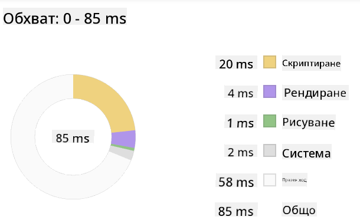
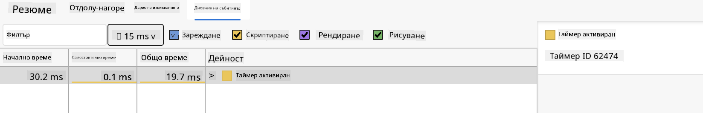

<!--
CO_OP_TRANSLATOR_METADATA:
{
  "original_hash": "eb358f3f4c2c082f9f3a4f98efa1d337",
  "translation_date": "2025-10-24T22:57:20+00:00",
  "source_file": "5-browser-extension/3-background-tasks-and-performance/README.md",
  "language_code": "bg"
}
-->
# Проект за браузър разширение, част 3: Научете за фоновите задачи и производителността

Чудили ли сте се какво прави някои браузър разширения бързи и отзивчиви, докато други изглеждат бавни? Тайната се крие в това, което се случва зад кулисите. Докато потребителите кликат из интерфейса на вашето разширение, има цял свят от фонови процеси, които тихо управляват извличането на данни, актуализациите на иконите и системните ресурси.

Това е последният ни урок от серията за браузър разширения, и ще направим вашия тракер за въглероден отпечатък да работи гладко. Ще добавите динамични актуализации на иконите и ще научите как да откривате проблеми с производителността, преди да се превърнат в проблеми. Това е като настройка на състезателна кола - малките оптимизации могат да направят огромна разлика в начина, по който всичко работи.

До края на урока ще имате полирано разширение и ще разберете принципите на производителността, които отличават добрите уеб приложения от страхотните. Нека се потопим в света на оптимизацията на браузъра.

## Тест преди лекцията

[Тест преди лекцията](https://ff-quizzes.netlify.app/web/quiz/27)

### Въведение

В предишните ни уроци създадохте форма, свързахте я с API и се справихте с асинхронното извличане на данни. Вашето разширение се оформя добре.

Сега трябва да добавим последните щрихи - като например да направим така, че иконата на разширението да променя цвета си в зависимост от данните за въглерода. Това ми напомня как НАСА трябваше да оптимизира всяка система на космическия кораб Аполо. Те не можеха да си позволят никакви загуби на цикли или памет, защото животът зависеше от производителността. Макар че нашето браузър разширение не е толкова критично, същите принципи важат - ефективният код създава по-добро потребителско изживяване.

## Основи на уеб производителността

Когато кодът ви работи ефективно, хората могат действително *да усетят* разликата. Знаете онзи момент, когато страницата се зарежда мигновено или анимацията протича гладко? Това е добрата производителност в действие.

Производителността не е само въпрос на скорост - тя е за създаване на уеб изживявания, които се чувстват естествени, а не тромави и разочароващи. В ранните дни на компютърните технологии, Грейс Хопър известна с това, че държала наносекунда (парче жица около един фут дълго) на бюрото си, за да покаже колко далеч светлината пътува за една милиардна от секундата. Това било нейният начин да обясни защо всеки микросекунда има значение в компютърните технологии. Нека разгледаме инструментите за разследване, които ви помагат да разберете какво забавя нещата.

> "Производителността на уебсайта се отнася до две неща: колко бързо се зарежда страницата и колко бързо работи кодът на нея." -- [Zack Grossbart](https://www.smashingmagazine.com/2012/06/javascript-profiling-chrome-developer-tools/)

Темата за това как да направите вашите уебсайтове изключително бързи на всякакви устройства, за всякакви потребители, в всякакви ситуации, е очаквано обширна. Ето някои точки, които трябва да имате предвид, докато изграждате стандартен уеб проект или браузър разширение.

Първата стъпка в оптимизирането на вашия сайт е да разберете какво всъщност се случва зад кулисите. За щастие, вашият браузър разполага с мощни инструменти за разследване, вградени в него.

За да отворите Developer Tools в Edge, кликнете върху трите точки в горния десен ъгъл, след това отидете на More Tools > Developer Tools. Или използвайте клавишната комбинация: `Ctrl` + `Shift` + `I` на Windows или `Option` + `Command` + `I` на Mac. След като сте там, кликнете върху раздела Performance - това е мястото, където ще проведете вашето разследване.

**Ето вашия инструментариум за разследване на производителността:**
- **Отворете** Developer Tools (ще ги използвате постоянно като разработчик!)
- **Отидете** на раздела Performance - мислете за него като за фитнес тракер на вашето уеб приложение
- **Натиснете** бутона Record и наблюдавайте страницата в действие
- **Изучете** резултатите, за да откриете какво забавя нещата

Нека опитаме това. Отворете уебсайт (Microsoft.com работи добре за тази цел) и кликнете върху бутона 'Record'. Сега обновете страницата и наблюдавайте как профайлърът улавя всичко, което се случва. Когато спрете записа, ще видите подробен анализ на това как браузърът 'скриптира', 'рендва' и 'рисува' сайта. Това ми напомня как контролният център следи всяка система по време на изстрелване на ракета - получавате данни в реално време за точно какво се случва и кога.

✅ [Документацията на Microsoft](https://docs.microsoft.com/microsoft-edge/devtools-guide/performance/?WT.mc_id=academic-77807-sagibbon) има много повече подробности, ако искате да се задълбочите.

> Съвет: Изчистете кеша на браузъра си преди тестване, за да видите как вашият сайт се представя за първоначални посетители - обикновено е доста различно от повторните посещения!

Изберете елементи от времевата линия на профила, за да увеличите събитията, които се случват, докато страницата ви се зарежда.

Вземете моментна снимка на производителността на страницата си, като изберете част от времевата линия на профила и погледнете панела за обобщение:



Проверете панела Event Log, за да видите дали някое събитие е отнело повече от 15 ms:



✅ Запознайте се с вашия профайлър! Отворете инструментите за разработчици на този сайт и вижте дали има някакви затруднения. Кой е най-бавно зареждащият се ресурс? Най-бързият?

## Какво да търсите при профайлиране

Изпълнението на профайлъра е само началото - истинското умение е да разберете какво всъщност ви казват тези цветни графики. Не се притеснявайте, ще се научите да ги разчитате. Опитните разработчици са се научили да разпознават предупредителните знаци, преди да се превърнат в сериозни проблеми.

Нека поговорим за обичайните заподозрени - проблемите с производителността, които често се промъкват в уеб проектите. Както Мария Кюри трябваше внимателно да следи нивата на радиация в лабораторията си, така и ние трябва да следим за определени модели, които показват, че се задават проблеми. Ранното им откриване ще ви спести (и на вашите потребители) много разочарование.

**Размери на ресурсите**: Уебсайтовете стават все "по-тежки" през годините, и голяма част от този допълнителен товар идва от изображенията. Това е като да пълним все повече и повече в нашите дигитални куфари.

✅ Разгледайте [Internet Archive](https://httparchive.org/reports/page-weight), за да видите как размерите на страниците са се увеличили с времето - това е доста показателно.

**Ето как да поддържате оптимизирани ресурсите си:**
- **Компресирайте** изображенията! Съвременни формати като WebP могат значително да намалят размера на файловете
- **Сервирайте** правилния размер на изображението за всяко устройство - няма нужда да изпращате огромни изображения за десктоп на телефони
- **Минимизирайте** вашия CSS и JavaScript - всеки байт има значение
- **Използвайте** lazy loading, за да се изтеглят изображенията само когато потребителите действително превъртат до тях

**Обхождане на DOM**: Браузърът трябва да изгради своя Document Object Model въз основа на кода, който пишете, така че в интерес на добрата производителност на страницата е да поддържате таговете си минимални, като използвате и стилизирате само това, което е необходимо за страницата. Например, излишният CSS, свързан със страницата, може да бъде оптимизиран; стиловете, които трябва да се използват само на една страница, не трябва да бъдат включени в основния стилов файл.

**Основни стратегии за оптимизация на DOM:**
- **Минимизирайте** броя на HTML елементите и нивата на вложеност
- **Премахнете** неизползваните CSS правила и ефективно консолидирайте стиловите файлове
- **Организирайте** CSS така, че да зарежда само необходимото за всяка страница
- **Структурирайте** HTML семантично за по-добро парсиране от браузъра

**JavaScript**: Всеки разработчик на JavaScript трябва да следи за скриптове, които блокират рендирането и трябва да бъдат заредени преди останалата част от DOM да може да бъде обходена и нарисувана в браузъра. Помислете за използването на `defer` с вашите inline скриптове (както е направено в модула Terrarium).

**Съвременни техники за оптимизация на JavaScript:**
- **Използвайте** атрибута `defer`, за да зареждате скриптове след парсиране на DOM
- **Прилагайте** разделяне на код, за да зареждате само необходимия JavaScript
- **Използвайте** lazy loading за некритична функционалност
- **Минимизирайте** използването на тежки библиотеки и рамки, когато е възможно

✅ Опитайте някои сайтове на [Site Speed Test website](https://www.webpagetest.org/), за да научите повече за общите проверки, които се правят за определяне на производителността на сайта.

Сега, когато имате представа как браузърът рендира ресурсите, които му изпращате, нека разгледаме последните няколко неща, които трябва да направите, за да завършите вашето разширение:

### Създайте функция за изчисляване на цвят

Сега ще създадем функция, която превръща числовите данни в значими цветове. Мислете за това като за система със светофар - зелено за чиста енергия, червено за висока въглеродна интензивност.

Тази функция ще вземе данните за CO2 от нашия API и ще определи кой цвят най-добре представя въздействието върху околната среда. Това е подобно на начина, по който учените използват цветово кодиране в топлинни карти, за да визуализират сложни модели на данни - от температурите на океаните до формирането на звезди. Нека добавим това в `/src/index.js`, точно след тези `const` променливи, които настроихме по-рано:

```javascript
function calculateColor(value) {
	// Define CO2 intensity scale (grams per kWh)
	const co2Scale = [0, 150, 600, 750, 800];
	// Corresponding colors from green (clean) to dark brown (high carbon)
	const colors = ['#2AA364', '#F5EB4D', '#9E4229', '#381D02', '#381D02'];

	// Find the closest scale value to our input
	const closestNum = co2Scale.sort((a, b) => {
		return Math.abs(a - value) - Math.abs(b - value);
	})[0];
	
	console.log(`${value} is closest to ${closestNum}`);
	
	// Find the index for color mapping
	const num = (element) => element > closestNum;
	const scaleIndex = co2Scale.findIndex(num);

	const closestColor = colors[scaleIndex];
	console.log(scaleIndex, closestColor);

	// Send color update message to background script
	chrome.runtime.sendMessage({ action: 'updateIcon', value: { color: closestColor } });
}
```

**Нека разгледаме тази умна малка функция:**
- **Настройва** два масива - един за нивата на CO2, друг за цветовете (зелено = чисто, кафяво = мръсно!)
- **Намира** най-близкото съответствие на нашата реална стойност на CO2, използвайки интересен метод за сортиране на масиви
- **Взема** съответстващия цвят, използвайки метода findIndex()
- **Изпраща** съобщение до фоновия скрипт на Chrome с избрания от нас цвят
- **Използва** шаблонни литерали (тези обратни кавички) за по-чисто форматиране на стрингове
- **Организира** всичко с декларации const

API-то `chrome.runtime` [API](https://developer.chrome.com/extensions/runtime) е като нервната система на вашето разширение - то управлява цялата комуникация и задачи зад кулисите:

> "Използвайте API-то chrome.runtime, за да извлечете фоновата страница, да върнете подробности за манифеста и да слушате и отговаряте на събития в жизнения цикъл на приложението или разширението. Можете също така да използвате този API, за да конвертирате относителния път на URL адресите в напълно квалифицирани URL адреси."

**Защо API-то Chrome Runtime е толкова полезно:**
- **Позволява** различните части на вашето разширение да комуникират помежду си
- **Управлява** фоновата работа без да блокира потребителския интерфейс
- **Контролира** събитията от жизнения цикъл на вашето разширение
- **Улеснява** предаването на съобщения между скриптовете

✅ Ако разработвате това браузър разширение за Edge, може да ви изненада, че използвате API на Chrome. Новите версии на браузъра Edge работят на браузърния двигател Chromium, така че можете да се възползвате от тези инструменти.

> **Съвет**: Ако искате да профайлирате браузър разширение, стартирайте инструментите за разработчици от самото разширение, тъй като то е отделен браузърен инстанс. Това ви дава достъп до специфични за разширението метрики за производителност.

### Задайте цвят по подразбиране за иконата

Преди да започнем да извличаме реални данни, нека дадем на нашето разширение начална точка. Никой не обича да гледа празна или счупена икона. Ще започнем със зелен цвят, за да знаят потребителите, че разширението работи от момента на инсталирането му.

Във вашата функция `init()`, нека настроим тази зелена икона по подразбиране:

```javascript
chrome.runtime.sendMessage({
	action: 'updateIcon',
	value: {
		color: 'green',
	},
});
```

**Какво постига тази инициализация:**
- **Задава** неутрален зелен цвят като състояние по подразбиране
- **Осигурява** незабавна визуална обратна връзка, когато разширението се зарежда
- **Установява** модела на комуникация с фоновия скрипт
- **Гарантира**, че потребителите виждат функционално разширение преди зареждането на данни

### Извикайте функцията, изпълнете извикването

Сега нека свържем всичко заедно, така че когато пристигнат нови данни за CO2, вашата икона автоматично да се актуализира с правилния цвят. Това е като свързване на последния кръг в електронно устройство - изведнъж всички отделни компоненти работят като една система.

Добавете този ред точно след като получите данните за CO2 от API-то:

```javascript
// After retrieving CO2 data from the API
// let CO2 = data.data[0].intensity.actual;
calculateColor(CO2);
```

**Тази интеграция постига:**
- **Свързва** потока от данни на API с визуалната индикаторна система
- **Задейства** автоматични актуализации на иконите, когато пристигнат нови данни
- **Осигурява** визуална обратна връзка в реално време въз основа на текущата въглеродна интензивност
- **Поддържа** разделението на отговорностите между извличането на данни и логиката на дисплея

И накрая, в `/dist/background.js`, добавете слушател за тези фонови действия:

```javascript
// Listen for messages from the content script
chrome.runtime.onMessage.addListener(function (msg, sender, sendResponse) {
	if (msg.action === 'updateIcon') {
		chrome.action.setIcon({ imageData: drawIcon(msg.value) });
	}
});

// Draw dynamic icon using Canvas API
// Borrowed from energy lollipop extension - nice feature!
function drawIcon(value) {
	// Create an offscreen canvas for better performance
	const canvas = new OffscreenCanvas(200, 200);
	const context = canvas.getContext('2d');

	// Draw a colored circle representing carbon intensity
	context.beginPath();
	context.fillStyle = value.color;
	context.arc(100, 100, 50, 0, 2 * Math.PI);
	context.fill();

	// Return the image data for the browser icon
	return context.getImageData(50, 50, 100, 100);
}
```

**Ето какво прави този фонов скрипт:**
- **Слуша** за съобщения от вашия основен скрипт (като рецепционист, който приема обаждания)
- **Обработва** тези заявки 'updateIcon', за да промени иконата на вашата лента с инструменти
- **Създава** нови икони в движение
Ето една интересна детективска мисия: изберете няколко уебсайта с отворен код, които съществуват от години (като Wikipedia, GitHub или Stack Overflow) и разгледайте тяхната история на комитите. Можете ли да откриете къде са направили подобрения в производителността? Какви проблеми са се появявали многократно?

**Вашият подход за разследване:**
- **Търсете** в съобщенията на комитите думи като "оптимизиране", "производителност" или "по-бързо"
- **Наблюдавайте** за модели - дали постоянно поправят едни и същи типове проблеми?
- **Идентифицирайте** общите причини за забавяне на уебсайтовете
- **Споделете** какво сте открили - други разработчици могат да се учат от примери от реалния свят

## Тест след лекцията

[Тест след лекцията](https://ff-quizzes.netlify.app/web/quiz/28)

## Преглед и самостоятелно обучение

Помислете дали да се абонирате за [бюлетин за производителност](https://perf.email/)

Разгледайте някои от начините, по които браузърите измерват уеб производителността, като прегледате разделите за производителност в техните инструменти за разработчици. Откривате ли някакви съществени разлики?

## Задача

[Анализирайте сайт за производителност](assignment.md)

---

**Отказ от отговорност**:  
Този документ е преведен с помощта на AI услуга за превод [Co-op Translator](https://github.com/Azure/co-op-translator). Въпреки че се стремим към точност, моля, имайте предвид, че автоматизираните преводи може да съдържат грешки или неточности. Оригиналният документ на неговия роден език трябва да се счита за авторитетен източник. За критична информация се препоръчва професионален човешки превод. Ние не носим отговорност за каквито и да било недоразумения или погрешни интерпретации, произтичащи от използването на този превод.