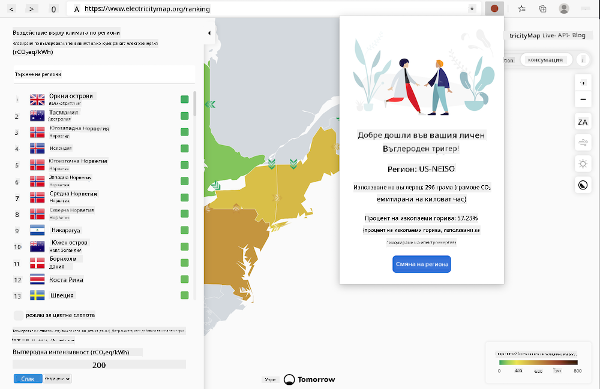
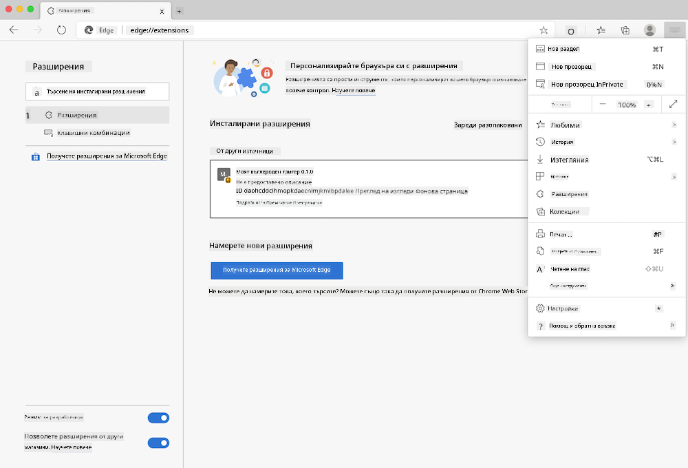

<!--
CO_OP_TRANSLATOR_METADATA:
{
  "original_hash": "dd58ae1b7707034f055718c1b68bc8de",
  "translation_date": "2025-08-28T07:47:52+00:00",
  "source_file": "5-browser-extension/solution/translation/README.hi.md",
  "language_code": "bg"
}
-->
# Carbon Trigger Browser Extension: Завършен код

Използване на API на CO2 Signal от tmrow за проследяване на потреблението на електроенергия, създаване на браузър разширение, което да ви напомня колко натоварено е потреблението на електроенергия във вашия регион. Използването на това разширение ще ви помогне да вземате решения за вашите дейности въз основа на тази информация.



## Започване

Трябва да инсталирате [npm](https://npmjs.com). Изтеглете копие на този код в папка на вашия компютър.

Инсталирайте всички необходими пакети:

```
npm install
```

Създайте разширението с помощта на webpack:

```
npm run build
```

За да го инсталирате в Edge, използвайте менюто „три точки“ в горния десен ъгъл на браузъра, за да намерите панела за разширения. Оттам изберете „Load unpacked“, за да заредите ново разширение. В подканата отворете папката „dist“ и разширението ще бъде заредено. За да го използвате, ще ви е необходим API ключ за CO2 Signal ([получете го тук чрез имейл](https://www.co2signal.com/) – въведете вашия имейл в полето на страницата) и [код за вашия регион](http://api.electricitymap.org/v3/zones) от [Electricity Map](https://www.electricitymap.org/map) (например, за Бостън използвам „US-NEISO“).



След като въведете API ключа и региона в интерфейса на разширението, цветната точка в лентата на браузър разширението трябва да се промени, за да отразява потреблението на енергия във вашия регион и да ви даде индикатор за това кои енергоемки дейности са подходящи за изпълнение. Концепцията за тази система с „точка“ ми беше вдъхновена от [Energy Lollipop Extension](https://energylollipop.com/) за емисиите в Калифорния.

---

**Отказ от отговорност**:  
Този документ е преведен с помощта на AI услуга за превод [Co-op Translator](https://github.com/Azure/co-op-translator). Въпреки че се стремим към точност, моля, имайте предвид, че автоматизираните преводи може да съдържат грешки или неточности. Оригиналният документ на неговия роден език трябва да се счита за авторитетен източник. За критична информация се препоръчва професионален човешки превод. Ние не носим отговорност за недоразумения или погрешни интерпретации, произтичащи от използването на този превод.