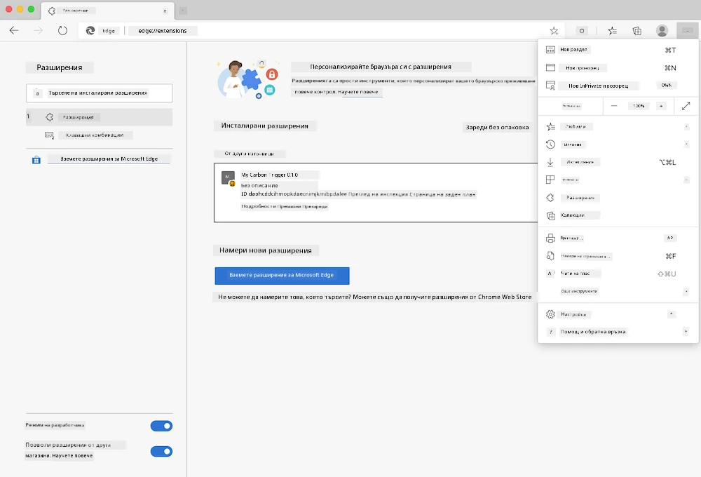

# Разширение за браузър Carbon Trigger: код за стартиране

Ще използваме API-то Signal CO2 на tmrow, за да следим потреблението на електричество и да създадем разширение за браузър, което да ви напомня директно в браузъра колко интензивно е използването на електричество във вашия регион. Използването на това специално разширение ще ви помогне да оцените дейностите си въз основа на тази информация.


## Начало

Необходимо е [npm](https://npmjs.com) да бъде инсталиран. Изтеглете копие на този код в папка на вашия компютър.

Инсталирайте всички необходими пакети:

```
npm install
```

Създайте разширението с помощта на webpack:

```
npm run build
```

За да го инсталирате в Edge, използвайте менюто с "три точки" в горния десен ъгъл на браузъра, за да намерите панела за разширения. Ако не е активиран, включете Режим за разработчици (в долния ляв ъгъл). Изберете "Зареди разархивирано", за да добавите ново разширение. Отворете папката "dist" в подканата и разширението ще бъде заредено. За да го използвате, ще ви е необходим API ключ за CO2 Signal API (можете да го [получите тук чрез имейл](https://www.co2signal.com/) - въведете своя имейл в полето на тази страница) и [код за вашия регион](http://api.electricitymap.org/v3/zones), съответстващ на [електрическата карта](https://www.electricitymap.org/map) (например за Бостън, "US-NEISO").



След като въведете API ключа и региона в интерфейса на разширението, цветната точка в лентата на разширението на браузъра трябва да се промени, за да отрази енергийното потребление на региона и да предостави насоки за това кои дейности с висока енергийна консумация са подходящи за изпълнение. Концепцията зад тази система с "точки" е вдъхновена от [разширението Energy Lollipop](https://energylollipop.com/) за емисиите в Калифорния.

---

**Отказ от отговорност**:  
Този документ е преведен с помощта на AI услуга за превод [Co-op Translator](https://github.com/Azure/co-op-translator). Въпреки че се стремим към точност, моля, имайте предвид, че автоматизираните преводи може да съдържат грешки или неточности. Оригиналният документ на неговия роден език трябва да се счита за авторитетен източник. За критична информация се препоръчва професионален човешки превод. Ние не носим отговорност за недоразумения или погрешни интерпретации, произтичащи от използването на този превод.