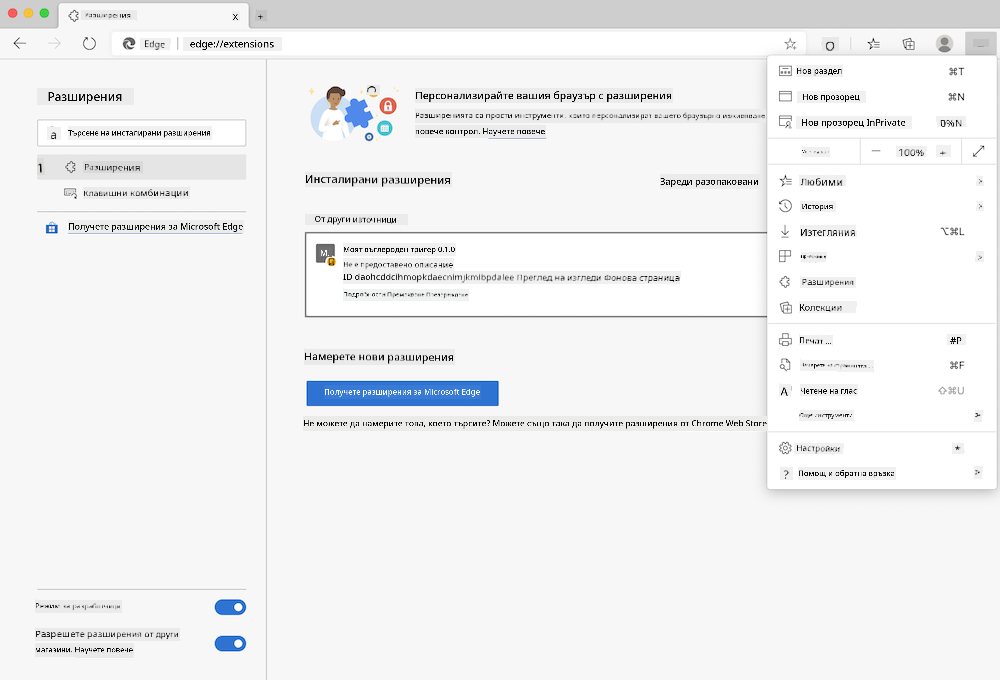

<!--
CO_OP_TRANSLATOR_METADATA:
{
  "original_hash": "9a6b22a2eff0f499b66236be973b24ad",
  "translation_date": "2025-08-27T22:53:43+00:00",
  "source_file": "5-browser-extension/solution/translation/README.it.md",
  "language_code": "bg"
}
-->
# Разширение за браузър Carbon Trigger: код за стартиране

Ще използваме API Signal CO2 на tmrow, за да следим потреблението на електричество и да създадем разширение за браузър, което да предоставя директно напомняне в браузъра за това колко интензивно е потреблението на електричество в даден регион. Използването на това специално разширение ще помогне да се оценят дейностите въз основа на тази информация.


## Начало

Необходимо е [npm](https://npmjs.com) да бъде инсталиран. Изтеглете копие на този код в папка на вашия компютър.

Инсталирайте всички необходими пакети:

```
npm install
```

Създайте разширението с помощта на webpack:

```
npm run build
```

За да го инсталирате в Edge, използвайте менюто с "три точки" в горния десен ъгъл на браузъра, за да намерите панела за разширения. Ако не е активиран, включете Режим за разработчици (в долния ляв ъгъл). Изберете "Зареди разархивирано", за да добавите ново разширение. Отворете папката "dist" в диалоговия прозорец и разширението ще бъде заредено. За да го използвате, ще ви е необходим API ключ за CO2 Signal API (можете [да го получите тук чрез имейл](https://www.co2signal.com/) - въведете вашия имейл в полето на тази страница) и [код за вашия регион](http://api.electricitymap.org/v3/zones), съответстващ на [електрическата карта](https://www.electricitymap.org/map) (например в Бостън, "US-NEISO").



След като API ключът и регионът бъдат въведени в интерфейса на разширението, цветната точка в лентата на разширението на браузъра трябва да се промени, за да отразява потреблението на енергия в региона и да предостави насоки за това кои дейности с висока консумация на енергия биха били подходящи за изпълнение. Концепцията зад тази система с "точки" е вдъхновена от [разширението Energy Lollipop](https://energylollipop.com/) за емисиите в Калифорния.

---

**Отказ от отговорност**:  
Този документ е преведен с помощта на AI услуга за превод [Co-op Translator](https://github.com/Azure/co-op-translator). Въпреки че се стремим към точност, моля, имайте предвид, че автоматичните преводи може да съдържат грешки или неточности. Оригиналният документ на неговия изходен език трябва да се счита за авторитетен източник. За критична информация се препоръчва професионален превод от човек. Не носим отговорност за каквито и да било недоразумения или погрешни интерпретации, произтичащи от използването на този превод.