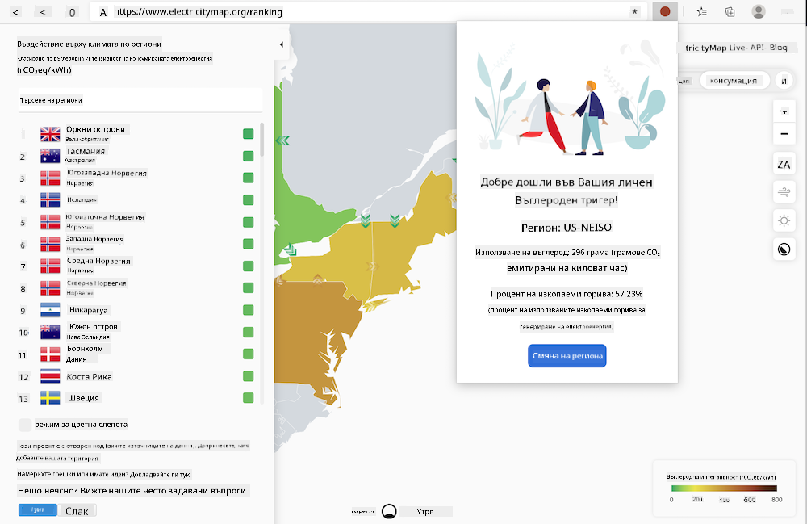

<!--
CO_OP_TRANSLATOR_METADATA:
{
  "original_hash": "21b364c158c8e4f698de65eeac16c9fe",
  "translation_date": "2025-08-27T22:52:39+00:00",
  "source_file": "5-browser-extension/solution/translation/README.ms.md",
  "language_code": "bg"
}
-->
# Разширение за браузър Carbon Trigger: Пълен код

Използвайки API на CO2 Signal от tmrow за проследяване на електрическата консумация, създайте разширение за браузър, което ще ви предупреждава за нивото на електрическа консумация във вашия регион. Това разширение ще ви помогне да вземате информирани решения относно вашите дейности въз основа на тази информация.



## Как да започнете

Трябва да имате инсталиран [npm](https://npmjs.com). Изтеглете копие на този код в папка на вашия компютър.

Инсталирайте всички необходими пакети:

```
npm install
```

Създайте разширението с помощта на webpack:

```
npm run build
```

За да го инсталирате в Edge, използвайте менюто с „три точки“ в горния десен ъгъл на браузъра, за да намерите панела „Разширения“. Оттам изберете „Load Unpacked“, за да заредите новото разширение. Отворете папката 'dist', когато бъдете подканени, и разширението ще бъде заредено. За да го използвате, ще ви е необходим API ключ за CO2 Signal API ([вземете го тук чрез имейл](https://www.co2signal.com/) - въведете вашия имейл в полето на страницата) и [код за вашия регион](http://api.electricitymap.org/v3/zones), който съответства на [Electricity Map](https://www.electricitymap.org/map) (например за Бостън използвам 'US-NEISO').


След като въведете API ключа и региона в интерфейса на разширението, цветната точка в лентата на разширението на браузъра ще се променя, за да отразява енергийната консумация във вашия регион и ще ви дава насоки за подходящи дейности с висока консумация. Концепцията за системата с „точки“ ми беше вдъхновена от [разширението за браузър Energy Lollipop](https://energylollipop.com/) за емисиите в Калифорния.

---

**Отказ от отговорност**:  
Този документ е преведен с помощта на AI услуга за превод [Co-op Translator](https://github.com/Azure/co-op-translator). Въпреки че се стремим към точност, моля, имайте предвид, че автоматизираните преводи може да съдържат грешки или неточности. Оригиналният документ на неговия роден език трябва да се счита за авторитетен източник. За критична информация се препоръчва професионален човешки превод. Ние не носим отговорност за недоразумения или погрешни интерпретации, произтичащи от използването на този превод.