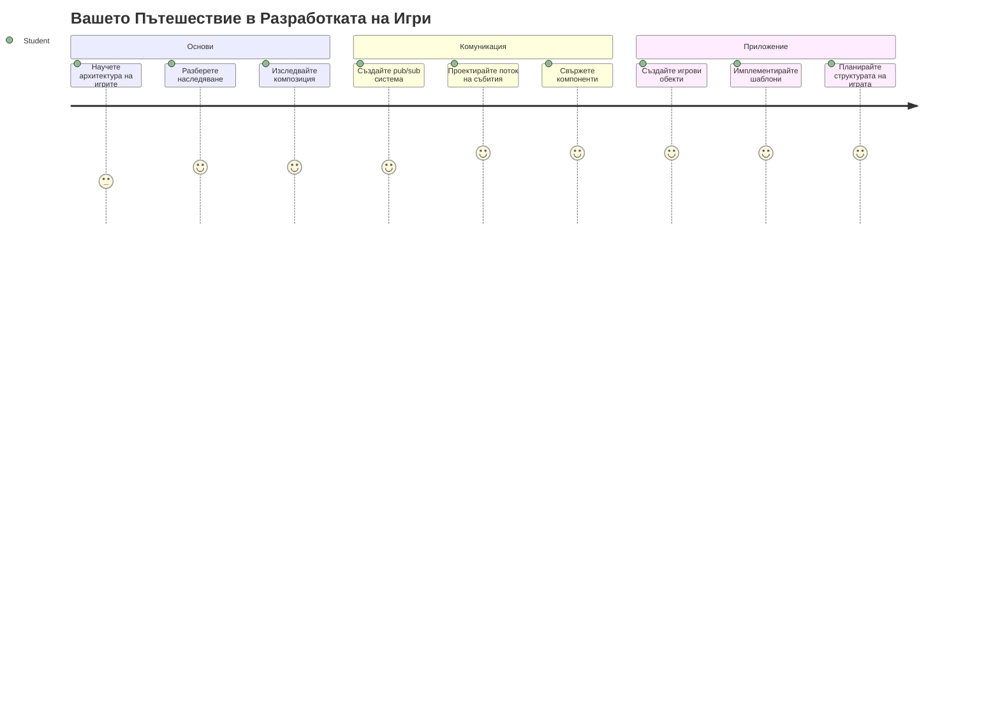
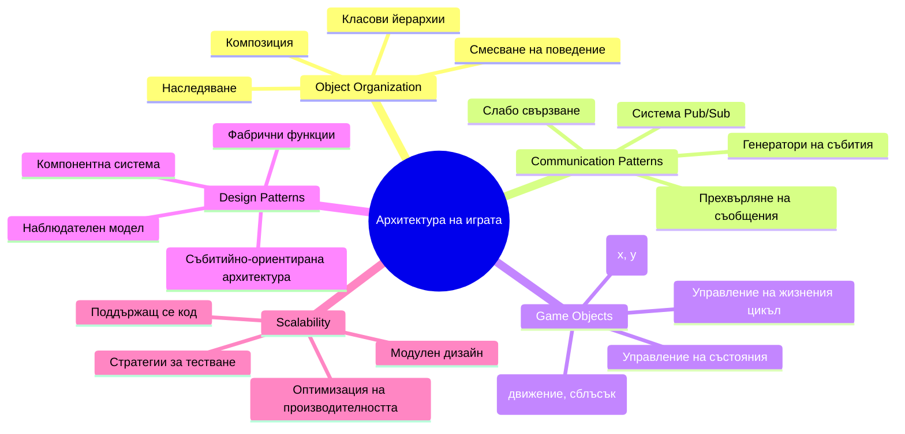
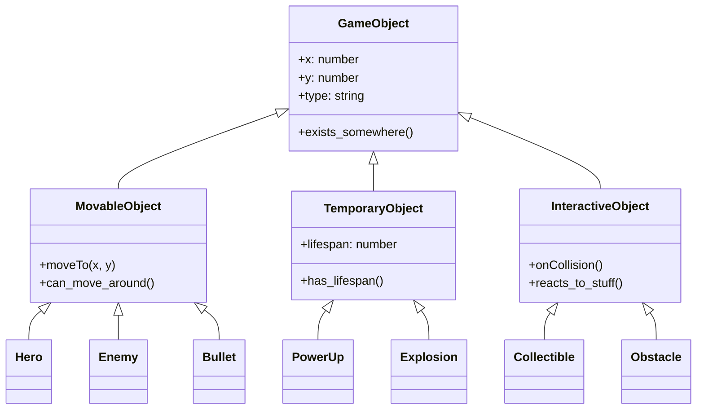
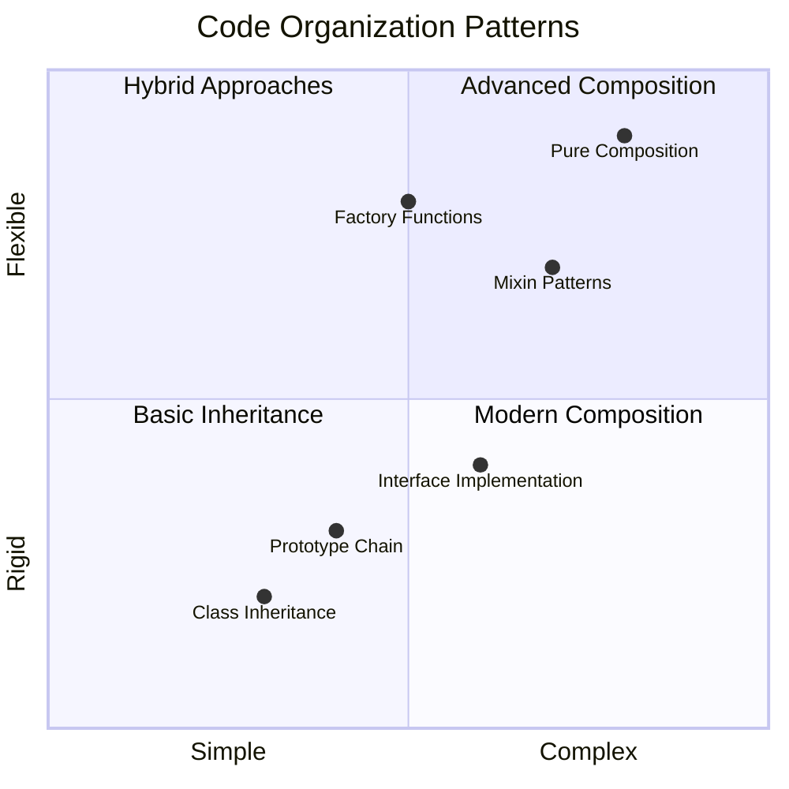
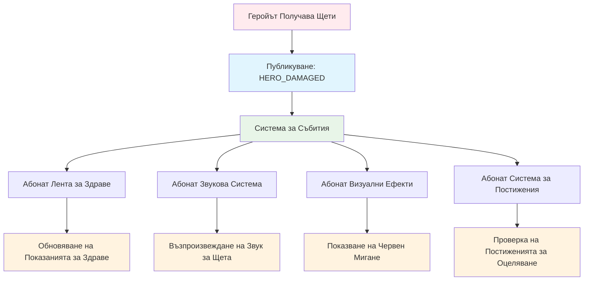
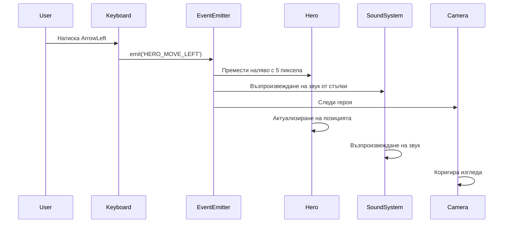
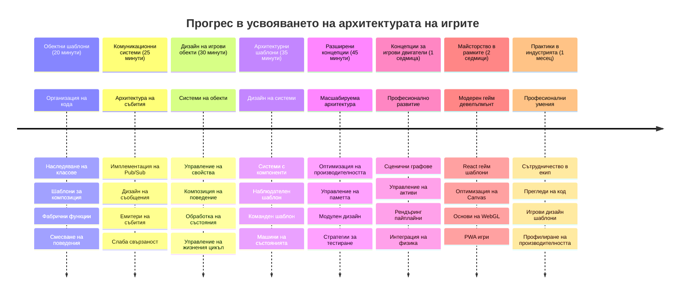

# Създаване на космическа игра Част 1: Въведение




Точно както контролният център на NASA координира няколко системи по време на изстрелване в космоса, ние ще създадем космическа игра, която демонстрира как различни части на една програма могат да работят безпроблемно заедно. Докато създавате нещо, което действително можете да играете, ще научите основни концепции на програмирането, които се прилагат към всеки софтуерен проект.

Ще разгледаме два фундаментални подхода за организиране на кода: наследяване и композиция. Те не са просто академични концепции – това са същите модели, които захранват всичко от видеоигри до банкови системи. Ще имплементираме и комуникационна система, наречена pub/sub, която работи като комуникационните мрежи, използвани в космически кораби, позволявайки на различни компоненти да споделят информация без да създават зависимости.

Към края на тази серия ще разберете как да изграждате приложения, които могат да се разрастват и развиват – независимо дали разработвате игри, уеб приложения или която и да е друга софтуерна система.


## Квиз преди лекцията

[Квиз преди лекцията](https://ff-quizzes.netlify.app/web/quiz/29)

## Наследяване и Композиция в разработката на игри

С нарастването на сложността на проектите, организацията на кода става критична. Това, което започва като прост скрипт, може да стане трудно за поддръжка без подходяща структура – точно както мисии Аполо изискваха внимателна координация между хиляди компоненти.

Ще разгледаме два фундаментални подхода за организиране на кода: наследяване и композиция. Всеки има различни предимства и разбирането и на двата ви помага да изберете правилния подход за различни ситуации. Ще демонстрираме тези концепции чрез нашата космическа игра, където герои, врагове, power-ups и други обекти трябва да взаимодействат ефективно.

✅ Една от най-известните книги за програмиране някога написани е свързана с [дизайнерски шаблони](https://en.wikipedia.org/wiki/Design_Patterns).

Във всяка игра имате `игрови обекти` – интерактивните елементи, които населяват игровия ви свят. Герои, врагове, power-ups и визуални ефекти са всички игрови обекти. Всеки съществува на специфични екранни координати, използвайки стойности `x` и `y`, подобно на поставянето на точки върху координатна равнина.

Въпреки визуалните си различия, тези обекти често споделят основни поведения:

- **Съществуват някъде** – Всеки обект има x и y координати, за да знае играта къде да го изобрази
- **Мнозина могат да се движат** – Герои тичат, врагове гонят, куршуми летят по екрана
- **Имат жизнен цикъл** – Някои остават вечно, други (като експлозии) се появяват за кратко и изчезват
- **Реагират на неща** – Когато неща се сблъскват, power-ups се събират, житейските ленти се обновяват

✅ Помислете за игра като Pac-Man. Можете ли да разпознаете четирите вида обекти, изброени по-горе в тази игра?


### Изразяване на поведение чрез код

Сега, след като разбирате общите поведения, които споделят игровите обекти, нека разгледаме как да имплементираме тези поведения в JavaScript. Можете да изразите поведението на обект чрез методи, прикачени към класове или отделни обекти, а има няколко подхода за избор.

**Подходът базиран на класове**

Класовете и наследяването предоставят структурен подход за организиране на игрови обекти. Подобно на таксономичната система разработена от Карл Линей, започвате с базов клас, съдържащ общи свойства, след което създавате специализирани класове, които наследяват тези основи, като добавят специфични възможности.

✅ Наследяването е важна концепция за разбиране. Научете повече в [статията на MDN за наследяване](https://developer.mozilla.org/docs/Web/JavaScript/Inheritance_and_the_prototype_chain).

Ето как можете да имплементирате игрови обекти, използвайки класове и наследяване:

```javascript
// Стъпка 1: Създайте базовия клас GameObject
class GameObject {
  constructor(x, y, type) {
    this.x = x;
    this.y = y;
    this.type = type;
  }
}
```

**Нека разбием това стъпка по стъпка:**
- Създаваме основен шаблон, който всеки игрови обект може да използва
- Конструкторът записва къде се намира обектът (`x`, `y`) и какъв е типът му
- Това става основата, върху която ще строят всички ваши игрови обекти

```javascript
// Стъпка 2: Добавяне на възможност за движение чрез наследяване
class Movable extends GameObject {
  constructor(x, y, type) {
    super(x, y, type); // Извикване на конструктора на родителския клас
  }

  // Добавяне на възможност за преместване на нова позиция
  moveTo(x, y) {
    this.x = x;
    this.y = y;
  }
}
```

**В горния код сме:**
- **Разширили** класа GameObject, за да добавим функционалност за движение
- **Извикали** конструктора на родителя с `super()` за инициализиране на наследените свойства
- **Добавили** метод `moveTo()`, който обновява позицията на обекта

```javascript
// Стъпка 3: Създайте специфични типове игрови обекти
class Hero extends Movable {
  constructor(x, y) {
    super(x, y, 'Hero'); // Задайте тип автоматично
  }
}

class Tree extends GameObject {
  constructor(x, y) {
    super(x, y, 'Tree'); // Дърветата не се нуждаят от движение
  }
}

// Стъпка 4: Използвайте вашите игрови обекти
const hero = new Hero(0, 0);
hero.moveTo(5, 5); // Героят може да се движи!

const tree = new Tree(10, 15);
// tree.moveTo() би причинило грешка - дърветата не могат да се движат
```

**Разбиране на тези концепции:**
- **Създава** специализирани типове обекти, които наследяват подходящо поведение
- **Демонстрира** как наследяването позволява селективно включване на функции
- **Показва** че героите могат да се движат, докато дърветата са неподвижни
- **Илюстрира** как йерархията на класовете предотвратява неподходящи действия

✅ Отделете няколко минути да си представите как би бил написан герой от Pac-Man (напр. Инки, Пинки или Блинки) на JavaScript.

**Подходът с композиция**

Композицията следва модулна дизайнерска философия, подобно на начина, по който инженерите проектират космически кораби с взаимно заменяеми компоненти. Вместо да се наследявате от родителски клас, комбинирате специфични поведения, за да създадете обекти с точно функционалността, от която се нуждаят. Този подход предлага гъвкавост без стриктни йерархични ограничения.

```javascript
// Стъпка 1: Създайте основни обекти за поведение
const gameObject = {
  x: 0,
  y: 0,
  type: ''
};

const movable = {
  moveTo(x, y) {
    this.x = x;
    this.y = y;
  }
};
```

**Ето какво прави този код:**
- **Дефинира** основен `gameObject` с позиция и тип
- **Създава** отделен обект поведение `movable` с функция за движение
- **Разделя** отговорностите, като запазва данните за позиция и логиката за движение независими

```javascript
// Стъпка 2: Създайте обекти чрез комбиниране на поведения
const movableObject = { ...gameObject, ...movable };

// Стъпка 3: Създайте фабрични функции за различни типове обекти
function createHero(x, y) {
  return {
    ...movableObject,
    x,
    y,
    type: 'Hero'
  };
}

function createStatic(x, y, type) {
  return {
    ...gameObject,
    x,
    y,
    type
  };
}
```

**В горния код сме:**
- **Комбинирали** свойствата на базовия обект с поведението за движение с помощта на spread синтаксис
- **Създавали** фабрични функции, които връщат персонализирани обекти
- **Позволили** гъвкаво създаване на обекти без стриктна йерархия на класовете
- **Дали** възможност обектите да имат точно необходимите им поведения

```javascript
// Стъпка 4: Създайте и използвайте вашите композирани обекти
const hero = createHero(10, 10);
hero.moveTo(5, 5); // Работи перфектно!

const tree = createStatic(0, 0, 'Tree');
// tree.moveTo() не е дефинирано - не е композирано поведение за движение
```

**Ключови точки за запомняне:**
- **Комбинира** обекти чрез смесване на поведения, а не чрез наследяване
- **Осигурява** повече гъвкавост от стриктните йерархии на наследяване
- **Позволява** обектите да имат точно необходимите си функции
- **Използва** модерен JavaScript spread синтаксис за чисто комбиниране на обекти 
```

**Which Pattern Should You Choose?**

**Which Pattern Should You Choose?**



> 💡 **Професионален съвет**: И двата модела имат място в съвременната JavaScript разработка. Класовете работят добре при ясно дефинирани йерархии, докато композицията блести, когато ви трябва максимална гъвкавост.
> 
**Ето кога да използвате всеки подход:**
- **Изберете** наследяване, когато имате ясни "е-един-от" отношения (например герой *е-един-от* подвижен обект)
- **Изберете** композиция, когато имате "има" отношения (например герой *има* способности за движение)
- **Вземете под внимание** предпочитанията на екипа и изискванията на проекта
- **Помнете**, че можете да смесвате двата подхода в едно приложение

### 🔄 **Педагогическа проверка**
**Разбиране на организацията на обекти**: Преди да преминете към комуникационни модели, уверете се, че можете:
- ✅ Да обясните разликата между наследяване и композиция
- ✅ Да определите кога да използвате класове срещу фабрични функции
- ✅ Да разберете как ключовата дума `super()` работи в наследяването
- ✅ Да разпознаете предимствата на всеки подход за разработка на игри

**Бърз самотест**: Как бихте създали летящ враг, който може както да се движи, така и да лети?
- **Подход с наследяване**: `class FlyingEnemy extends Movable`
- **Подход с композиция**: `{ ...movable, ...flyable, ...gameObject }`

**Връзка с реалния свят**: Тези модели се използват навсякъде:
- **React компоненти**: Props (композиция) срещу наследяване на класове
- **Игрови двигатели**: Entity-component системи използват композиция
- **Мобилни приложения**: UI фреймуъркове често използват йерархии на наследяване

## Комуникационни модели: Системата Pub/Sub

С нарастването на сложността на приложенията, управлението на комуникацията между компонентите става предизвикателство. Моделът publish-subscribe (pub/sub) решава този проблем, използвайки принципи, подобни на радиопредаване – един предавател може да достигне множество приемници, без да знае кой слуша.

Помислете какво се случва, когато герой получи щета: лентата за здраве се обновява, звукови ефекти звучат, визуална обратна връзка се появява. Вместо да свързвате герой обекта директно с тези системи, pub/sub позволява на героя да излъчи съобщение „взета щета“. Всяка система, която трябва да реагира, може да се абонира за този тип съобщение и да реагира съответно.

✅ **Pub/Sub** означава 'публикувай-абонирай се'


### Разбиране на архитектурата Pub/Sub

Моделът pub/sub държи различните части на приложението ви слабо свързани, което означава, че те могат да работят заедно без да са пряко зависими една от друга. Това разделяне прави кода ви по-лесен за поддръжка, тестване и по-гъвкав към промени.

**Основните играчи в pub/sub:**
- **Съобщения** – Прости текстови етикети като `'PLAYER_SCORED'`, които описват какво се е случило (плюс допълнителна информация)
- **Публикуващи** – Обекти, които викат „Нещо се случи!“ на всеки, който слуша
- **Абонати** – Обекти, които казват „Интересувам се от това събитие“ и реагират при настъпването му
- **Система за събития** – Съединителят, който гарантира, че съобщенията достигат до правилните слушатели

### Създаване на система за събития

Нека създадем проста, но мощна система за събития, която демонстрира тези концепции:

```javascript
// Стъпка 1: Създайте класа EventEmitter
class EventEmitter {
  constructor() {
    this.listeners = {}; // Съхранявайте всички слушатели на събития
  }
  
  // Регистрирайте слушател за конкретен тип съобщение
  on(message, listener) {
    if (!this.listeners[message]) {
      this.listeners[message] = [];
    }
    this.listeners[message].push(listener);
  }
  
  // Изпратете съобщение до всички регистрирани слушатели
  emit(message, payload = null) {
    if (this.listeners[message]) {
      this.listeners[message].forEach(listener => {
        listener(message, payload);
      });
    }
  }
}
```

**Разбиване на това, което се случва тук:**
- **Създава** централизирана система за управление на събитията чрез прост клас
- **Съхранява** слушатели в обект, организиран по типове съобщения
- **Регистрира** нови слушатели чрез метода `on()`
- **Излъчва** съобщения до всички заинтересовани слушатели чрез `emit()`
- **Поддържа** опционални данни за предаване на релевантна информация

### Събиране на всичко: Практически пример

Добре, нека го видим на практика! Ще създадем проста система за движение, която показва колко чист и гъвкав може да бъде pub/sub:

```javascript
// Стъпка 1: Дефинирайте типовете си съобщения
const Messages = {
  HERO_MOVE_LEFT: 'HERO_MOVE_LEFT',
  HERO_MOVE_RIGHT: 'HERO_MOVE_RIGHT',
  ENEMY_SPOTTED: 'ENEMY_SPOTTED'
};

// Стъпка 2: Създайте вашата система за събития и игрови обекти
const eventEmitter = new EventEmitter();
const hero = createHero(0, 0);
```

**Ето какво прави този код:**
- **Дефинира** обект с константи, за да предотврати грешки при изписване на имена на съобщения
- **Създава** инстанция на event emitter за обработка на цялата комуникация
- **Инициализира** герой обект на началната позиция

```javascript
// Стъпка 3: Настройте слушатели на събития (абонати)
eventEmitter.on(Messages.HERO_MOVE_LEFT, () => {
  hero.moveTo(hero.x - 5, hero.y);
  console.log(`Hero moved to position: ${hero.x}, ${hero.y}`);
});

eventEmitter.on(Messages.HERO_MOVE_RIGHT, () => {
  hero.moveTo(hero.x + 5, hero.y);
  console.log(`Hero moved to position: ${hero.x}, ${hero.y}`);
});
```

**В горния код сме:**
- **Регистрирали** слушатели на събития, които реагират на съобщения за движение
- **Обновили** позицията на героя според посоката на движение
- **Добавили** лог в конзолата, за да следим промените в позицията на героя
- **Отделили** логиката за движение от обработката на входа

```javascript
// Стъпка 4: Свържете клавиатурния вход със събития (публикации)
window.addEventListener('keydown', (event) => {
  switch(event.key) {
    case 'ArrowLeft':
      eventEmitter.emit(Messages.HERO_MOVE_LEFT);
      break;
    case 'ArrowRight':
      eventEmitter.emit(Messages.HERO_MOVE_RIGHT);
      break;
  }
});
```

**Разбиране на тези концепции:**
- **Свързва** клавиатурния вход с игрови събития без стегната връзка
- **Позволява** на системата за вход да комуникира с игрови обекти непряко
- **Да позволява** множество системи да реагират на едни и същи клавиатурни събития
- **Прави** лесно променянето на клавишните настройки или добавянето на нови методи за вход


> 💡 **Професионален съвет**: Красотата на този модел е в гъвкавостта! Лесно можете да добавите звукови ефекти, разклащане на екрана или ефекти с частици, просто добавяйки още слушатели на събития – без нужда да модифицирате съществуващия код за клавиатура или движение.
> 
**Ето защо ще харесате този подход:**
- Добавянето на нови функции става много лесно – просто слушайте събитията, които ви интересуват
- Множество елементи могат да реагират на едно и също събитие без да си пречат
- Тестовете са много по-лесни, защото всяка част работи независимо
- Когато нещо се счупи, знаете точно къде да търсите

### Защо Pub/Sub мащабира ефективно

Моделът pub/sub запазва простотата, докато приложенията растат в сложност. Независимо дали управлявате десетки врагове, динамични UI обновявания или звукови системи, моделът обработва увеличаващия се мащаб без архитектурни промени. Новите функции се интегрират в съществуващата система за събития без да повлияват на установената функционалност.

> ⚠️ **Честа грешка**: Не създавайте твърде много специфични типове съобщения в началото. Започнете с широки категории и ги уточнявайте, когато нуждите на вашата игра станат по-ясни.
> 
**Добри практики, които да следвате:**
- **Групирайте** свързаните съобщения в логически категории
- **Използвайте** описателни имена, които ясно указват какво се е случило
- **Поддържайте** полезния товар на съобщенията прост и фокусиран
- **Документирайте** типовете съобщения за екипна колаборация

### 🔄 **Педагогическа проверка**
**Разбиране на архитектурата, управлявана от събития**: Проверете разбирането си на цялата система:
- ✅ Как моделът pub/sub предотвратява стегнати връзки между компонентите?
- ✅ Защо е по-лесно да добавяте нови функции със събитийно-ориентирана архитектура?
- ✅ Каква роля играе EventEmitter в потока на комуникацията?
- ✅ Как константите за съобщенията предотвратяват грешки и подобряват поддръжката?

**Дизайнерско предизвикателство**: Как бихте управлявали тези игрови сценарии с pub/sub?
1. **Враг умира**: Обновяване на резултата, пускане на звук, появяване на power-up, премахване от екрана
2. **Завършен ниво**: Спиране на музиката, показване на UI, запазване на прогрес, зареждане на следващото ниво
3. **Събран power-up**: Подобряване на умения, обновяване на UI, пускане на ефект, стартиране на таймер

**Професионална връзка**: Този модел се използва в:
- **Frontend фреймуъркове**: React/Vue системи за събития
- **Backend услуги**: Микросервизни комуникации
- **Игрови двигатели**: Системата за събития на Unity
- **Мобилна разработка**: Системи за известия в iOS/Android

---

## Предизвикателство GitHub Copilot Agent 🚀

Използвайте режим Agent, за да завършите следното предизвикателство:

**Описание:** Създайте проста система за игрови обекти, използваща както наследяване, така и модела pub/sub. Ще реализирате базова игра, в която различни обекти могат да комуникират чрез събития, без да се познават директно.

**Подсказка:** Създайте JavaScript игрова система със следните изисквания: 1) Създайте базов клас GameObject с координати x, y и свойство тип. 2) Създайте клас Hero, който наследява GameObject и може да се движи. 3) Създайте клас Enemy, който наследява GameObject и може да преследва героя. 4) Реализирайте клас EventEmitter за модела pub/sub. 5) Настройте слушатели на събития така, че когато герой се движи, близките врагове получават събитие 'HERO_MOVED' и актуализират позицията си, за да се движат към героя. Включете изход в конзолата, за да показвате комуникацията между обектите.

Научете повече за [режим agent](https://code.visualstudio.com/blogs/2025/02/24/introducing-copilot-agent-mode) тук.

## 🚀 Предизвикателство
Обмислете как моделът pub-sub може да подобри архитектурата на играта. Определете кои компоненти трябва да излъчват събития и как системата трябва да реагира. Проектирайте концепция за игра и очертайте комуникационните модели между нейните компоненти.

## Post-Lecture Quiz

[Post-lecture quiz](https://ff-quizzes.netlify.app/web/quiz/30)

## Review & Self Study

Научете повече за Pub/Sub като [прочетете за него](https://docs.microsoft.com/azure/architecture/patterns/publisher-subscriber/?WT.mc_id=academic-77807-sagibbon).

### ⚡ **Какво можете да направите през следващите 5 минути**
- [ ] Отворете всяка онлайн HTML5 игра и инспектирайте кода ѝ с DevTools
- [ ] Създайте прост HTML5 Canvas елемент и нарисувайте базова форма
- [ ] Опитайте да използвате `setInterval` за създаване на прост анимационен цикъл
- [ ] Разгледайте документацията на Canvas API и опитайте някой метод за рисуване

### 🎯 **Какво можете да постигнете този час**
- [ ] Завършете теста след урока и разберете концепциите за разработка на игри
- [ ] Настройте структурата на проекта за вашата игра с HTML, CSS и JavaScript файлове
- [ ] Създайте основен геймплей цикъл, който обновява и изобразява непрекъснато
- [ ] Нарисувайте първите си игрови спрайтове върху канваса
- [ ] Имплементирайте основно зареждане на ресурси за изображения и звуци

### 📅 **Вашият седмичен процес по създаване на игра**
- [ ] Завършете цялата космическа игра с всички планирани функции
- [ ] Добавете издържана графика, звукови ефекти и плавни анимации
- [ ] Имплементирайте игрови състояния (начален екран, геймплей, игра приключи)
- [ ] Създайте система за резултати и проследяване на напредъка на играча
- [ ] Направете играта си отзивчива и достъпна на различни устройства
- [ ] Споделете играта си онлайн и съберете обратна връзка от играчите

### 🌟 **Вашият месечен процес за разработка на игри**
- [ ] Създайте няколко игри изследващи различни жанрове и механики
- [ ] Научете игрови framework като Phaser или Three.js
- [ ] Приносете към проекти с отворен код за разработка на игри
- [ ] Усъвършенствайте напреднали модели за програмиране на игри и оптимизация
- [ ] Създайте портфолио, демонстриращо вашите умения по разработка на игри
- [ ] Наставлявайте други, интересуващи се от разработка на игри и интерактивни медии

## 🎯 Вашата времева линия за майсторство в разработката на игри


### 🛠️ Резюме на вашия комплект за архитектура на игри

След завършване на този урок, вече имате:
- **Майсторство на дизайн патерни**: Разбиране на компромисите между наследяване и композиция
- **Събитийно-ориентирана архитектура**: Имплементация на pub/sub за мащабируема комуникация
- **Обектно-ориентиран дизайн**: Класови йерархии и поведение чрез композиция
- **Модерен JavaScript**: Фабрични функции, spread синтаксис и ES6+ модели
- **Мащабируема архитектура**: Принципи за слабо свързване и модулен дизайн
- **Основи на разработка на игри**: Системи с ентити и компонентни модели
- **Професионални модели**: Стандартизирани подходи за организация на кода

**Приложения в реалния свят**: Тези модели се прилагат директно в:
- **Frontend фреймуъркове**: React/Vue архитектура на компоненти и управление на състоянието
- **Backend услуги**: Комуникация между микросървиси и събитийно-ориентирани системи
- **Мобилна разработка**: Архитектура на iOS/Android приложения и системи за известия
- **Игрални енджини**: Unity, Unreal и уеб-базирана разработка на игри
- **Корпоративен софтуер**: Event sourcing и дизайн на разпределени системи
- **API дизайн**: RESTful услуги и комуникация в реално време

**Професионални умения, придобити от вас**: Вече можете:
- **Проектиране** на мащабируеми софтуерни архитектури с доказани модели
- **Имплементиране** на събитийно-ориентирани системи, които управляват сложни взаимодействия
- **Избор** на подходящи стратегии за организация на кода според различни ситуации
- **Отстраняване на проблеми** и поддръжка на слабо свързани системи ефективно
- **Комуникация** на технически решения с използване на индустриално стандартизирана терминология

**Следващо ниво**: Готови сте да имплементирате тези модели в реална игра, да изследвате напреднали теми за разработка на игри или да приложите тези архитектурни концепции в уеб приложения!

🌟 **Постижение Открито**: Успешно овладяхте фундаментални модели за софтуерна архитектура, които захранват всичко - от прости игри до сложни корпоративни системи!

## Assignment

[Mock up a game](assignment.md)

---

<!-- CO-OP TRANSLATOR DISCLAIMER START -->
**Отказ от отговорност**:  
Този документ е преведен с помощта на AI преводаческа услуга [Co-op Translator](https://github.com/Azure/co-op-translator). Въпреки че се стремим към точност, моля, имайте предвид, че автоматизираните преводи могат да съдържат грешки или неточности. Оригиналният документ на неговия роден език трябва да се счита за авторитетен източник. За критична информация се препоръчва професионален превод от човек. Ние не носим отговорност за никакви недоразумения или неправилни интерпретации, произтичащи от използването на този превод.
<!-- CO-OP TRANSLATOR DISCLAIMER END -->