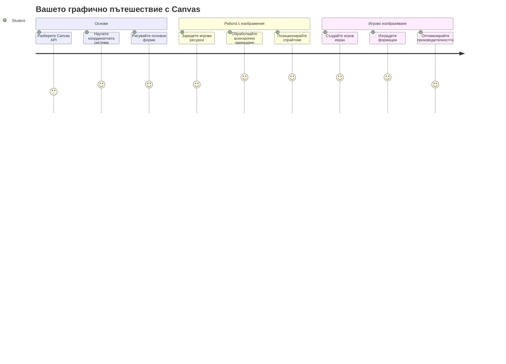
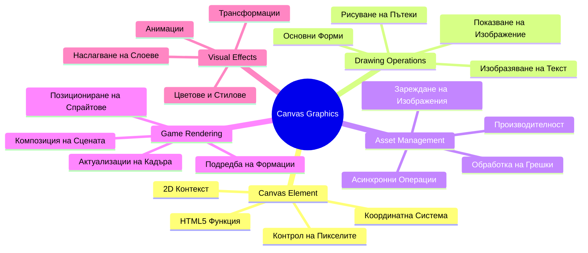
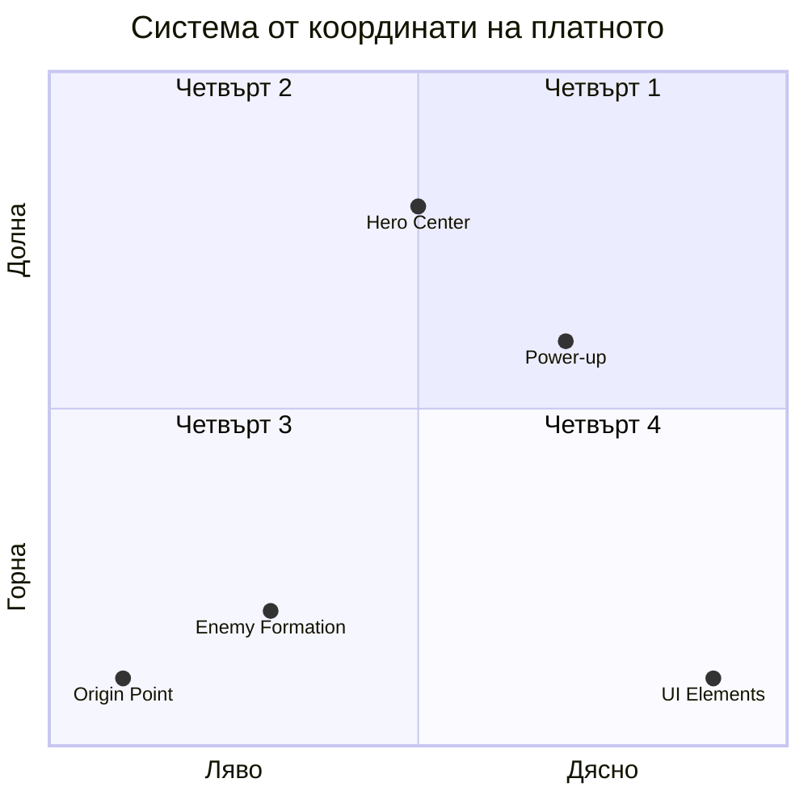
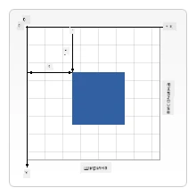
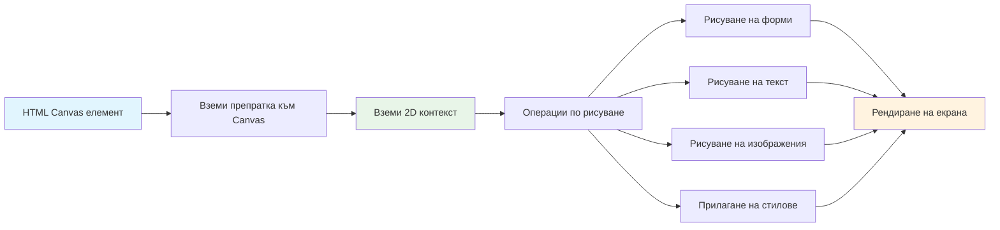
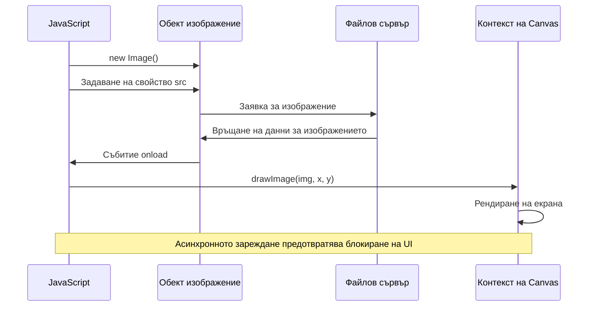
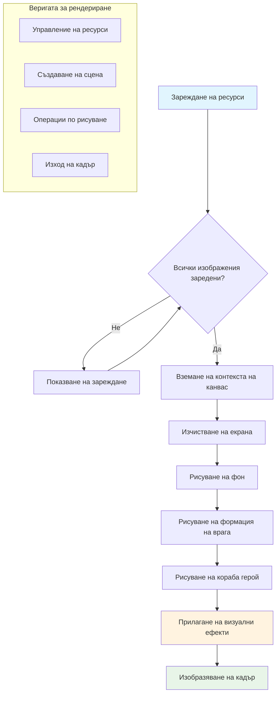
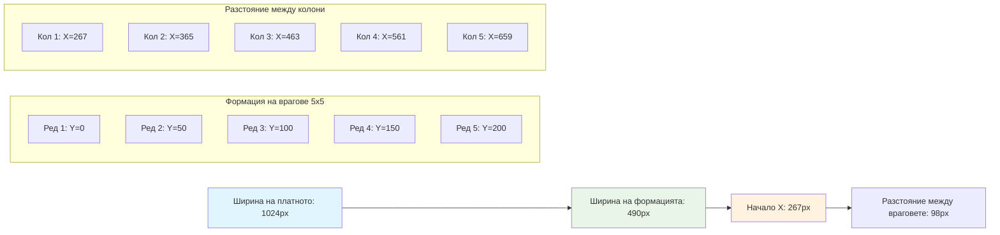
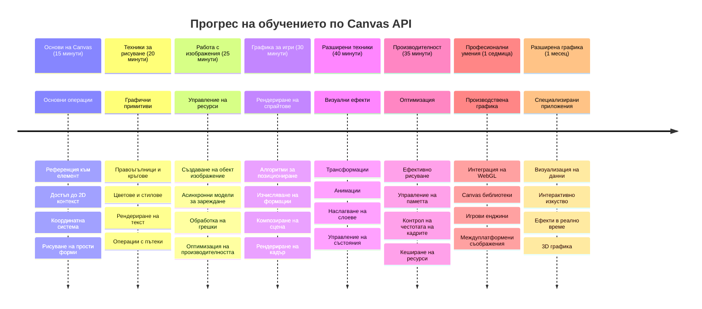

<!--
CO_OP_TRANSLATOR_METADATA:
{
  "original_hash": "7994743c5b21fdcceb36307916ef249a",
  "translation_date": "2026-01-07T06:46:50+00:00",
  "source_file": "6-space-game/2-drawing-to-canvas/README.md",
  "language_code": "bg"
}
-->
# Изградете космическа игра Част 2: Рисувайте героя и чудовищата върху Canvas


Canvas API е една от най-мощните функции в уеб разработката за създаване на динамична, интерактивна графика директно в браузъра ви. В този урок ще превърнем празния HTML `<canvas>` елемент в игров свят, пълен с герои и чудовища. Мислете за canvas като за вашето дигитално художествено платно, където кодът се превръща във визуална графика.

Строим върху това, което научихте в предишния урок, и сега ще навлезем в визуалната част. Ще научите как да зареждате и показвате игрови спрайтове, да позиционирате елементи точно и да създадете визуалната основа за вашата космическа игра. Това създава мост между статичните уеб страници и динамичните, интерактивни преживявания.

В края на този урок ще имате пълна игрова сцена с правилно позициониран вашия герой и вражески формации, готови за битка. Ще разберете как модерните игри рисуват графиката в браузърите и ще придобиете умения за създаване на собствени интерактивни визуални преживявания. Нека изследваме графиката в canvas и да вдъхнем живот на вашата космическа игра!


## Предварителен тест преди лекцията

[Предварителен тест преди лекцията](https://ff-quizzes.netlify.app/web/quiz/31)

## Canvas

И така, какво точно представлява този `<canvas>` елемент? Това е решението на HTML5 за създаване на динамична графика и анимации в уеб браузърите. За разлика от обикновените изображения или видеа, които са статични, canvas ви дава контрол на нивото на пикселите върху всичко, което се появява на екрана. Това го прави перфектен за игри, визуализации на данни и интерактивно изкуство. Мислете го като програмируемо рисувателно платно, където JavaScript е вашата четка.

По подразбиране, canvas елементът изглежда като празен, прозрачен правоъгълник на страницата ви. Но именно в това крие потенциалът! Истинската му мощ се проявява, когато използвате JavaScript, за да рисувате форми, да зареждате изображения, да създавате анимации и да правите нещата реактивни към действията на потребителя. Това е подобно на начина, по който ранните пионери на компютърната графика в Bell Labs през 60-те години на миналия век трябваше да програмират всеки пиксел, за да създадат първите дигитални анимации.

✅ Прочетете [повече за Canvas API](https://developer.mozilla.org/docs/Web/API/Canvas_API) в MDN.

Ето как обикновено се декларира като част от тялото на страницата:

```html
<canvas id="myCanvas" width="200" height="100"></canvas>
```

**Ето какво прави този код:**
- **Задава** атрибута `id`, за да можете да препращате към този конкретен canvas елемент в JavaScript
- **Определя** `width` в пиксели, за да контролира хоризонталния размер на canvas
- **Установява** `height` в пиксели, за да определи вертикалните размери на canvas

## Рисуване на проста геометрия

Сега, когато знаете какво представлява canvas елементът, нека разгледаме как всъщност да рисуваме върху него! Canvas използва координатна система, която може да ви е позната от часовете по математика, но има една важна особеност, специфична за компютърната графика.

Canvas използва декартова координатна система с x-ос (хоризонтална) и y-ос (вертикална) за позициониране на всичко, което рисувате. Но тук е ключовата разлика: за разлика от координатната система в математиката, началната точка `(0,0)` започва от горния ляв ъгъл, като x-стойностите нарастват, когато се движите надясно, а y-стойностите се увеличават, когато се движите надолу. Този подход произлиза от ранните компютърни дисплеи, където електронният лъч сканираше отгоре надолу, правейки горния ляв ъгъл естествена начална точка.



> Изображение от [MDN](https://developer.mozilla.org/docs/Web/API/Canvas_API/Tutorial/Drawing_shapes)

За да рисувате върху canvas елемента, ще следвате същия тристепенен процес, който образува основата на цялата canvas графика. След като го направите няколко пъти, това ще стане втора природа:


1. **Вземете препратка** към вашия Canvas елемент от DOM (като всеки друг HTML елемент)
2. **Вземете 2D рендеринг контекст** – това предоставя всички методи за рисуване
3. **Започнете да рисувате!** Използвайте вградените методи на контекста, за да създадете графиката си

Ето как изглежда това в код:

```javascript
// Стъпка 1: Вземете елемента canvas
const canvas = document.getElementById("myCanvas");

// Стъпка 2: Вземете 2D рендеринг контекста
const ctx = canvas.getContext("2d");

// Стъпка 3: Задайте цвета за запълване и нарисувайте правоъгълник
ctx.fillStyle = 'red';
ctx.fillRect(0, 0, 200, 200); // x, y, ширина, височина
```

**Нека разчленим това стъпка по стъпка:**
- **Вземаме** канваса чрез неговия ID и го съхраняваме в променлива
- **Вземаме** 2D рендеринг контекста – това е нашият комплект с инструменти с методи за рисуване
- **Указваме** на canvas да запълва с червен цвят чрез свойството `fillStyle`
- **Рисуваме** правоъгълник, започващ от горния ляв ъгъл (0,0) с ширина и височина 200 пиксела

✅ Canvas API основно се фокусира върху 2D форми, но можете също да рисувате 3D елементи в уебсайт; за това може да използвате [WebGL API](https://developer.mozilla.org/docs/Web/API/WebGL_API).

Можете да рисувате всякакви неща с Canvas API, като например:

- **Геометрични фигури**, вече сме показали как да рисуваме правоъгълник, но има много повече неща, които можете да нарисувате.
- **Текст**, можете да рисувате текст със всякакъв шрифт и цвят.
- **Изображения**, можете да рисувате изображение, базирано на изображение като .jpg или .png например.

✅ Опитайте! Знаете как да рисувате правоъгълник, може ли да нарисувате кръг на страницата? Вижте някои интересни рисувания на Canvas в CodePen. Ето един [особено впечатляващ пример](https://codepen.io/dissimulate/pen/KrAwx).

### 🔄 **Педагогическа проверка**
**Разбиране на основите на Canvas**: Преди да преминете към зареждане на изображения, уверете се, че можете:
- ✅ Да обясните как координатната система на canvas се различава от математическите координати
- ✅ Да разберете тристепения процес на операции за рисуване на canvas
- ✅ Да идентифицирате какво предоставя 2D рендеринг контекста
- ✅ Да опишете как fillStyle и fillRect работят заедно

**Бърз само-тест**: Как бихте нарисували син кръг на позиция (100, 50) с радиус 25?
```javascript
ctx.fillStyle = 'blue';
ctx.beginPath();
ctx.arc(100, 50, 25, 0, 2 * Math.PI);
ctx.fill();
```

**Методите за рисуване с Canvas, които вече знаете**:
- **fillRect()**: Рисува запълнени правоъгълници
- **fillStyle**: Задава цветове и шаблони
- **beginPath()**: Започва нови пътища за рисуване
- **arc()**: Създава кръгове и криви

## Заредете и нарисувайте изображение

Рисуването на основни форми е полезно за начало, но повечето игри се нуждаят от реални изображения! Спрайтове, фон и текстури са онова, което придава визуалния чар на игрите. Зареждането и показването на изображения върху canvas работи по-различно от рисуването на геометрични фигури, но е лесно след като разберете процеса.

Трябва да създадем обект `Image`, да заредим нашия файл с изображението (това се случва асинхронно, което означава "на заден план"), и след това да го нарисуваме върху canvas, когато е готово. Този подход гарантира, че вашите изображения ще се показват правилно, без да блокират приложението, докато се зареждат.


### Основно зареждане на изображение

```javascript
const img = new Image();
img.src = 'path/to/my/image.png';
img.onload = () => {
  // Изображението е заредено и готово за използване
  console.log('Image loaded successfully!');
};
```

**Ето какво се случва в този код:**
- Създаваме нов обект Image, който да държи спрайта или текстурата
- Посочваме източника на изображението чрез задаване на пътя
- Слушаме за събитието „load“, за да знаем точно кога изображението е готово за използване

### Един по-добър начин за зареждане на изображения

Ето един по-стабилен начин за зареждане на изображения, който професионалните разработчици често използват. Обграждаме зареждането на изображение във функция базирана на Promise – този подход, станал популярен с появата на JavaScript Promises в ES6, прави кода ви по-организиран и обработва грешките по-елегантно:

```javascript
function loadAsset(path) {
  return new Promise((resolve, reject) => {
    const img = new Image();
    img.src = path;
    img.onload = () => {
      resolve(img);
    };
    img.onerror = () => {
      reject(new Error(`Failed to load image: ${path}`));
    };
  });
}

// Съвременна употреба с async/await
async function initializeGame() {
  try {
    const heroImg = await loadAsset('hero.png');
    const monsterImg = await loadAsset('monster.png');
    // Снимките вече са готови за употреба
  } catch (error) {
    console.error('Failed to load game assets:', error);
  }
}
```

**Какво направихме тук:**
- Обгърнахме цялата логика за зареждане на изображения в Promise, за да го обработваме по-добре
- Добавихме обработка на грешки, която ни казва кога нещо се обърква
- Използвахме съвременния синтаксис async/await, защото е много по-лесен за четене
- Включихме блокове try/catch, за да се справяме елегантно с евентуални проблеми при зареждането

След като изображенията са заредени, рисуването им върху canvas е сравнително просто:

```javascript
async function renderGameScreen() {
  try {
    // Зареди игрови ресурси
    const heroImg = await loadAsset('hero.png');
    const monsterImg = await loadAsset('monster.png');

    // Вземи canvas и контекст
    const canvas = document.getElementById("myCanvas");
    const ctx = canvas.getContext("2d");

    // Начертай изображения на определени позиции
    ctx.drawImage(heroImg, canvas.width / 2, canvas.height / 2);
    ctx.drawImage(monsterImg, 0, 0);
  } catch (error) {
    console.error('Failed to render game screen:', error);
  }
}
```

**Нека преминем през това стъпка по стъпка:**
- Зареждаме както изображението на героя, така и на чудовището на заден план с await
- Вземаме canvas елемента и нужния 2D рендеринг контекст
- Позиционираме образа на героя точно в центъра, използвайки бързи изчисления с координатите
- Поставяме изображението на чудовището в горния ляв ъгъл, за да започнем формацията на враговете
- Хващаме евентуални грешки, които могат да възникнат по време на зареждането или изобразяването


## Време е да започнете изграждането на играта

Сега ще обединим всичко, за да създадем визуалната основа на вашата космическа игра. Вече притежавате солидни знания за основите на canvas и техники за зареждане на изображения, така че тази практическа част ще ви преведе през изграждането на пълния гейм екран с правилно позиционирани спрайтове.

### Какво да изградите

Ще създадете уеб страница с Canvas елемент. Тя трябва да изобразява черен екран с размери `1024*768`. Ние ви предоставяме две изображения:

- Геройски кораб

   

- 5*5 чудовища

   

### Препоръчителни стъпки за започване на разработка

Намерете стартовите файлове, които са създадени за вас в подпапката `your-work`. Структурата на вашия проект трябва да съдържа:

```bash
your-work/
├── assets/
│   ├── enemyShip.png
│   └── player.png
├── index.html
├── app.js
└── package.json
```

**Ето с какво работите:**
- **Игровите спрайтове** се намират в папката `assets/`, за да поддържате всичко организирано
- **Вашият основен HTML файл** настройва canvas елемента и подготвя всичко
- **JavaScript файл**, където ще пишете цялата магия за рендериране на играта
- **package.json**, който настройва сървър за разработка, за да можете да тествате локално

Отворете тази папка във Visual Studio Code, за да започнете разработката. Ще ви трябва локална среда с Visual Studio Code, NPM и Node.js инсталирани. Ако нямате `npm` настроен на компютъра си, [ето как да го инсталирате](https://www.npmjs.com/get-npm).

Стартирайте сървъра за разработка като отидете в папката `your-work`:

```bash
cd your-work
npm start
```

**Тази команда прави няколко много полезни неща:**
- Стартира локален сървър на адрес `http://localhost:5000`, за да може да тествате вашата игра
- Сървира всичките ви файлове правилно, така че браузърът да ги зарежда коректно
- Следи промените във файловете ви, за да разработвате гладко
- Ви дава професионална среда за разработка, за да проверите всичко

> 💡 **Забележка**: Браузърът ви ще покаже празна страница първоначално – това е нормално! Докато добавяте код, обновявайте браузъра, за да видите промените. Този итеративен подход на разработка е подобен на начина, по който НАСА е изграждала компютър за управление на Аполо – тествайки всяка част преди да я интегрира в по-голямата система.

### Добавете код

Добавете необходимия код в `your-work/app.js`, за да изпълните следните задачи:

1. **Рисувайте canvas с черен фон**
   > 💡 **Ето как**: Намерете TODO в `/app.js` и добавете само две линии. Задайте `ctx.fillStyle` на черно, след което използвайте `ctx.fillRect()` започвайки от (0,0) с размерите на canvas. Лесно!

2. **Заредете игрови текстури**
   > 💡 **Ето как**: Използвайте `await loadAsset()` за зареждане на изображението на героя и врага. Запазете ги в променливи, за да ги използвате по-късно. Помнете – те няма да се покажат, докато не ги нарисувате!

3. **Рисувайте кораб на героя в център-долната позиция**
   > 💡 **Ето как**: Използвайте `ctx.drawImage()` за позициониране на героя. За x-координатата, пробвайте `canvas.width / 2 - 45`, за да го центрирате, а за y-координатата използвайте `canvas.height - canvas.height / 4`, за да го поставите долу.

4. **Рисувайте 5×5 формация от вражески кораби**
   > 💡 **Ето как**: Намерете функцията `createEnemies` и настройте вложен цикъл. Ще трябва да направите някои изчисления за разстоянията и позиционирането, но не се притеснявайте – ще ви покажа точно как!

Първо, задайте константи за правилното оформление на вражеската формация:

```javascript
const ENEMY_TOTAL = 5;
const ENEMY_SPACING = 98;
const FORMATION_WIDTH = ENEMY_TOTAL * ENEMY_SPACING;
const START_X = (canvas.width - FORMATION_WIDTH) / 2;
const STOP_X = START_X + FORMATION_WIDTH;
```

**Нека разберем какво правят тези константи:**
- Задаваме 5 врагове на ред и колона (уютна 5×5 мрежа)
- Определяме колко разстояние да има между враговете, за да не изглеждат притиснати
- Изчисляваме колко широка ще бъде цялата формация
- Изчисляваме откъде да започнем и къде да свършим, така че формацията да изглежда центрирана


След това, създайте вложени цикли за рисуване на вражеската формация:

```javascript
for (let x = START_X; x < STOP_X; x += ENEMY_SPACING) {
  for (let y = 0; y < 50 * 5; y += 50) {
    ctx.drawImage(enemyImg, x, y);
  }
}
```

**Ето какво прави този вложен цикъл:**
- Външният цикъл преминава от ляво надясно през формацията
- Вътрешният цикъл преминава отгоре надолу, за да създаде подредени редове
- Рисуваме всеки враг на точно изчислените x,y координати
- Всичко е равномерно разпределено, за да изглежда професионално и организирано

### 🔄 **Педагогическа проверка**
**Майсторство в рендерирането на играта**: Проверете разбирането си за цялата рендеринг система:
- ✅ Как асинхронното зареждане на изображения предотвратява блокиране на интерфейса при стартиране на играта?
- ✅ Защо изчисляваме позициите на формацията на враговете с помощта на константи, вместо да ги втвърдяваме в кода?
- ✅ Каква роля играе 2D рендеринг контекстът при операциите по рисуване?
- ✅ Как вложените цикли създават организирани спрайт формации?

**Съображения за производителност**: Вашата игра сега демонстрира:
- **Ефективно зареждане на ресурси**: Управление на изображения чрез Promise
- **Организирано рендериране**: Структурирани операции по рисуване
- **Математическо позициониране**: Изчислено разполагане на спрайтове
- **Обработка на грешки**: Меко управление на неуспехи

**Концепции на визуалното програмиране**: Научихте:
- **Координатни системи**: Превръщане на математиката в позиции на екрана  
- **Управление на спрайтове**: Зареждане и показване на графики за играта  
- **Алгоритми за формации**: Математически модели за организирани разположения  
- **Асинхронни операции**: Модерен JavaScript за плавно потребителско изживяване  

## Резултат

Крайният резултат трябва да изглежда така:


## Решение

Моля, опитайте да го решите самите вие първо, но ако се затрудните, разгледайте [решението](../../../../6-space-game/2-drawing-to-canvas/solution/app.js)

---

## Предизвикателство с GitHub Copilot Agent 🚀

Използвайте режим Agent, за да изпълните следното предизвикателство:

**Описание:** Подобрете вашата космическа игра на canvas, като добавите визуални ефекти и интерактивни елементи, използвайки научените техники на Canvas API.

**Задача:** Създайте нов файл на име `enhanced-canvas.html` с canvas, който показва анимирани звезди на заден план, пулсиращ здравен бар за кораба герой и вражески кораби, които бавно се движат надолу. Включете JavaScript код, който рисува блестящи звезди с произволни позиции и прозрачност, реализира здравен бар, който променя цвета си в зависимост от нивото на здраве (зелен > жълт > червен), и анимира враговете да се движат надолу по екрана с различни скорости.

Научете повече за [Agent режим](https://code.visualstudio.com/blogs/2025/02/24/introducing-copilot-agent-mode) тук.

## 🚀 Предизвикателство

Вече сте научили как да рисувате с Canvas API, фокусирано върху 2D; разгледайте [WebGL API](https://developer.mozilla.org/docs/Web/API/WebGL_API) и опитайте да нарисувате 3D обект.

## Квиз след лекцията

[Квиз след лекцията](https://ff-quizzes.netlify.app/web/quiz/32)

## Преглед & Самообучение

Научете повече за Canvas API, като [прочетете за него](https://developer.mozilla.org/docs/Web/API/Canvas_API).

### ⚡ **Какво можете да направите през следващите 5 минути**
- [ ] Отворете конзолата на браузъра и създайте canvas елемент с `document.createElement('canvas')`
- [ ] Опитайте да нарисувате правоъгълник с `fillRect()` върху контекст на canvas
- [ ] Експериментирайте с различни цветове чрез свойството `fillStyle`
- [ ] Нарисувайте прост кръг с метода `arc()`

### 🎯 **Какво можете да постигнете този час**
- [ ] Завършете пост-урочния квиз и разберете основите на canvas
- [ ] Създайте приложение за рисуване върху canvas с различни форми и цветове
- [ ] Реализирайте зареждане на изображения и рендериране на спрайтове за играта
- [ ] Направете проста анимация, която движи обекти по canvas
- [ ] Практикувайте трансформации на canvas като мащабиране, въртене и транслация

### 📅 **Вашето седмично пътешествие с Canvas**
- [ ] Завършете космическата игра с изчистена графика и анимации на спрайтове
- [ ] Усъвършенствайте техники за работа с canvas като градиенти, шарки и композиране
- [ ] Създайте интерактивни визуализации с canvas за представяне на данни
- [ ] Научете оптимизационни техники за плавна производителност
- [ ] Създайте приложение за рисуване или изобразяване с различни инструменти
- [ ] Изследвайте творчески модели за кодиране и генеративно изкуство с canvas

### 🌟 **Вашият месечен път към овладяване на графиката**
- [ ] Изградете сложни визуални приложения с Canvas 2D и WebGL
- [ ] Научете концепции за графично програмиране и основи на шейдъри
- [ ] Допринасяйте за отворени графични библиотеки и инструменти за визуализация
- [ ] Усъвършенствайте оптимизацията на производителността за графично интензивни приложения
- [ ] Създавайте образователно съдържание за програмиране на canvas и компютърна графика
- [ ] Станете експерт по графично програмиране, който помага на други да създават визуални преживявания

## 🎯 Времева линия за овладяване на графиката с Canvas


### 🛠️ Обобщение на вашия набор от инструменти за Canvas графика

След завършване на този урок вече имате:  
- **Майсторство на Canvas API**: Пълно разбиране на 2D графичното програмиране  
- **Координатна математика**: Точно позициониране и алгоритми за разположение  
- **Управление на ресурси**: Професионално зареждане на изображения и обработка на грешки  
- **Rendering pipeline**: Структуриран подход към композирането на сцени  
- **Графика за игри**: Позициониране на спрайтове и изчисляване на формации  
- **Асинхронно програмиране**: Модерни JavaScript модели за плавна работа  
- **Визуално програмиране**: Превръщане на математически концепции в екранна графика  

**Приложения в реалния свят**: Вашите умения с Canvas се използват директно за:  
- **Визуализация на данни**: Диаграми, графики и интерактивни табла  
- **Разработка на игри**: 2D игри, симулации и интерактивни преживявания  
- **Дигитално изкуство**: Творческо кодиране и генеративни арт проекти  
- **Дизайн на интерфейси**: Персонализирана графика и интерактивни елементи  
- **Образователен софтуер**: Визуални учебни помощници и симулации  
- **Уеб приложения**: Динамична графика и визуализации в реално време  

**Професионални умения, придобити чрез курса**: Вече можете да:  
- **Създавате** персонализирани графични решения без външни библиотеки  
- **Оптимизирате** производителността при рендериране за плавно изживяване  
- **Отстранявате грешки** при сложни визуални проблеми с инструменти за разработчици  
- **Проектирате** скалируеми графични системи с помощта на математически принципи  
- **Интегрирате** Canvas графики с модерни уеб рамки  

**Методи на Canvas API, които сте усвоили**:  
- **Управление на елементи**: getElementById, getContext  
- **Операции по рисуване**: fillRect, drawImage, fillStyle  
- **Зареждане на активи**: Обекти Image, Promise модели  
- **Математическо позициониране**: Изчисления на координати, алгоритми за формации  

**Следващо ниво**: Готови сте да добавяте анимации, интерактивност, откриване на сблъсъци или да изследвате WebGL за 3D графика!

🌟 **Постижение отключено**: Построихте цяла система за рендериране на игра, използвайки основни техники на Canvas API!

## Задача

[Играйте с Canvas API](assignment.md)

---

<!-- CO-OP TRANSLATOR DISCLAIMER START -->
**Отказ от отговорност**:  
Този документ е преведен с помощта на AI преводаческа услуга [Co-op Translator](https://github.com/Azure/co-op-translator). Въпреки че се стремим към точност, моля, имайте предвид, че автоматизираните преводи могат да съдържат грешки или неточности. Оригиналният документ на неговия собствен език трябва да се счита за авторитетен източник. За критична информация се препоръчва професионален човешки превод. Ние не носим отговорност за каквито и да е недоразумения или неправилни тълкувания, произтичащи от използването на този превод.
<!-- CO-OP TRANSLATOR DISCLAIMER END -->