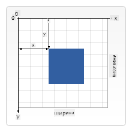

<!--
CO_OP_TRANSLATOR_METADATA:
{
  "original_hash": "84053695dca714e16ed064366503ebd5",
  "translation_date": "2025-10-24T22:53:55+00:00",
  "source_file": "6-space-game/2-drawing-to-canvas/README.md",
  "language_code": "bg"
}
-->
# Създаване на Космическа Игра Част 2: Рисуване на Герои и Чудовища върху Canvas

API-то на Canvas е една от най-мощните функции в уеб разработката за създаване на динамична, интерактивна графика директно в браузъра. В този урок ще преобразим празния HTML елемент `<canvas>` в игрови свят, изпълнен с герои и чудовища. Помислете за canvas като за вашата дигитална арт дъска, където кодът става визуален.

Ще надградим наученото в предишния урок и ще се потопим във визуалните аспекти. Ще научите как да зареждате и показвате игрови спрайтове, да позиционирате елементи прецизно и да създавате визуалната основа за вашата космическа игра. Това свързва статичните уеб страници с динамични, интерактивни преживявания.

До края на този урок ще имате завършена игрова сцена с правилно позициониран кораб на героя и формации на врагове, готови за битка. Ще разберете как съвременните игри рендират графики в браузъри и ще придобиете умения да създавате свои собствени интерактивни визуални преживявания. Нека изследваме графиките на canvas и да вдъхнем живот на вашата космическа игра!

## Тест преди лекцията

[Тест преди лекцията](https://ff-quizzes.netlify.app/web/quiz/31)

## Canvas

Какво точно представлява елементът `<canvas>`? Това е решението на HTML5 за създаване на динамична графика и анимации в уеб браузъри. За разлика от обикновените изображения или видеа, които са статични, canvas ви дава контрол на ниво пиксел върху всичко, което се появява на екрана. Това го прави идеален за игри, визуализация на данни и интерактивно изкуство. Помислете за него като за програмируема повърхност за рисуване, където JavaScript е вашата четка.

По подразбиране, елементът canvas изглежда като празен, прозрачен правоъгълник на вашата страница. Но именно тук се крие потенциалът! Истинската му сила се проявява, когато използвате JavaScript за рисуване на форми, зареждане на изображения, създаване на анимации и правене на неща, които реагират на взаимодействията на потребителя. Това е подобно на начина, по който пионерите в компютърната графика от Bell Labs през 60-те години са програмирали всеки пиксел, за да създадат първите цифрови анимации.

✅ Прочетете [повече за Canvas API](https://developer.mozilla.org/docs/Web/API/Canvas_API) на MDN.

Ето как обикновено се декларира като част от тялото на страницата:

```html
<canvas id="myCanvas" width="200" height="100"></canvas>
```

**Какво прави този код:**
- **Задава** атрибута `id`, за да можете да се позовавате на този конкретен елемент canvas в JavaScript
- **Определя** ширината в пиксели, за да контролира хоризонталния размер на canvas
- **Установява** височината в пиксели, за да определи вертикалните размери на canvas

## Рисуване на прости геометрични фигури

Сега, когато знаете какво представлява елементът canvas, нека разгледаме как всъщност да рисуваме върху него! Canvas използва координатна система, която може да ви се стори позната от часовете по математика, но има една важна особеност, специфична за компютърната графика.

Canvas използва картезиански координати с ос x (хоризонтална) и ос y (вертикална), за да позиционира всичко, което рисувате. Но ето ключовата разлика: за разлика от координатната система от часовете по математика, началната точка `(0,0)` започва в горния ляв ъгъл, като стойностите на x се увеличават, когато се движите надясно, а стойностите на y се увеличават, когато се движите надолу. Този подход датира от ранните компютърни дисплеи, където електронните лъчи сканират отгоре надолу, правейки горния ляв ъгъл естествена начална точка.


> Изображение от [MDN](https://developer.mozilla.org/docs/Web/API/Canvas_API/Tutorial/Drawing_shapes)

За да рисувате върху елемента canvas, ще следвате същия тристепенен процес, който формира основата на всички графики на canvas. След като го направите няколко пъти, това става естествено:

1. **Получете референция** към вашия елемент Canvas от DOM (точно както всеки друг HTML елемент)
2. **Получете 2D контекст за рендиране** – това предоставя всички методи за рисуване
3. **Започнете да рисувате!** Използвайте вградените методи на контекста, за да създадете вашата графика

Ето как изглежда това в код:

```javascript
// Step 1: Get the canvas element
const canvas = document.getElementById("myCanvas");

// Step 2: Get the 2D rendering context
const ctx = canvas.getContext("2d");

// Step 3: Set fill color and draw a rectangle
ctx.fillStyle = 'red';
ctx.fillRect(0, 0, 200, 200); // x, y, width, height
```

**Нека разгледаме това стъпка по стъпка:**
- **Вземаме** нашия елемент canvas, използвайки неговия ID, и го съхраняваме в променлива
- **Получаваме** 2D контекст за рендиране – това е нашият инструментариум, пълен с методи за рисуване
- **Указваме** на canvas, че искаме да запълним нещата с червено, използвайки свойството `fillStyle`
- **Рисуваме** правоъгълник, започващ от горния ляв ъгъл (0,0), който е широк и висок 200 пиксела

✅ Canvas API се фокусира предимно върху 2D форми, но можете също така да рисувате 3D елементи на уеб сайт; за това може да използвате [WebGL API](https://developer.mozilla.org/docs/Web/API/WebGL_API).

Можете да рисувате всякакви неща с Canvas API като:

- **Геометрични фигури**, вече показахме как да нарисувате правоъгълник, но има много повече, което можете да нарисувате.
- **Текст**, можете да нарисувате текст с какъвто и да е шрифт и цвят, който пожелаете.
- **Изображения**, можете да нарисувате изображение, базирано на актив като .jpg или .png например.

✅ Опитайте! Знаете как да нарисувате правоъгълник, можете ли да нарисувате кръг на страницата? Разгледайте някои интересни рисунки с Canvas в CodePen. Ето един [особено впечатляващ пример](https://codepen.io/dissimulate/pen/KrAwx).

## Зареждане и рисуване на изображение

Рисуването на основни форми е полезно за начало, но повечето игри се нуждаят от реални изображения! Спрайтове, фонове и текстури са това, което придава визуална привлекателност на игрите. Зареждането и показването на изображения върху canvas работи по различен начин от рисуването на геометрични фигури, но е лесно, след като разберете процеса.

Трябва да създадем обект `Image`, да заредим файла с изображението (това се случва асинхронно, което означава "на заден план") и след това да го нарисуваме върху canvas, когато е готов. Този подход гарантира, че изображенията ви се показват правилно, без да блокират приложението ви, докато се зареждат.

### Основно зареждане на изображения

```javascript
const img = new Image();
img.src = 'path/to/my/image.png';
img.onload = () => {
  // Image loaded and ready to be used
  console.log('Image loaded successfully!');
};
```

**Какво се случва в този код:**
- **Създаваме** чисто нов обект Image, за да съхраним нашия спрайт или текстура
- **Указваме** кой файл с изображение да се зареди, като задаваме пътя към източника
- **Слушаме** събитието за зареждане, за да знаем точно кога изображението е готово за използване

### По-добър начин за зареждане на изображения

Ето по-стабилен начин за обработка на зареждането на изображения, който професионалните разработчици често използват. Ще обгърнем логиката за зареждане на изображения във функция, базирана на Promise – този подход, популяризиран, когато JavaScript Promises станаха стандарт в ES6, прави кода ви по-организиран и обработва грешките по-елегантно:

```javascript
function loadAsset(path) {
  return new Promise((resolve, reject) => {
    const img = new Image();
    img.src = path;
    img.onload = () => {
      resolve(img);
    };
    img.onerror = () => {
      reject(new Error(`Failed to load image: ${path}`));
    };
  });
}

// Modern usage with async/await
async function initializeGame() {
  try {
    const heroImg = await loadAsset('hero.png');
    const monsterImg = await loadAsset('monster.png');
    // Images are now ready to use
  } catch (error) {
    console.error('Failed to load game assets:', error);
  }
}
```

**Какво направихме тук:**
- **Обгърнахме** цялата логика за зареждане на изображения в Promise, за да я обработим по-добре
- **Добавихме** обработка на грешки, която всъщност ни казва кога нещо се обърка
- **Използвахме** съвременен синтаксис async/await, защото е много по-четим
- **Включихме** блокове try/catch, за да обработим елегантно всякакви проблеми при зареждането

След като изображенията ви са заредени, рисуването им върху canvas всъщност е доста лесно:

```javascript
async function renderGameScreen() {
  try {
    // Load game assets
    const heroImg = await loadAsset('hero.png');
    const monsterImg = await loadAsset('monster.png');

    // Get canvas and context
    const canvas = document.getElementById("myCanvas");
    const ctx = canvas.getContext("2d");

    // Draw images to specific positions
    ctx.drawImage(heroImg, canvas.width / 2, canvas.height / 2);
    ctx.drawImage(monsterImg, 0, 0);
  } catch (error) {
    console.error('Failed to render game screen:', error);
  }
}
```

**Нека разгледаме това стъпка по стъпка:**
- **Зареждаме** както изображенията на героя, така и на чудовището на заден план, използвайки await
- **Вземаме** нашия елемент canvas и получаваме необходимия 2D контекст за рендиране
- **Позиционираме** изображението на героя точно в центъра, използвайки бърза координатна математика
- **Поставяме** изображението на чудовището в горния ляв ъгъл, за да започнем формацията на врага
- **Улавяме** всякакви грешки, които могат да се случат по време на зареждането или рендирането

## Време е да започнете да изграждате вашата игра

Сега ще съберем всичко заедно, за да създадем визуалната основа на вашата космическа игра. Вече имате солидно разбиране за основите на canvas и техниките за зареждане на изображения, така че тази практическа част ще ви насочи към изграждането на завършен екран на играта с правилно позиционирани спрайтове.

### Какво да изградите

Ще създадете уеб страница с елемент Canvas. Тя трябва да рендира черен екран с размери `1024*768`. Предоставили сме ви две изображения:

- Кораб на героя

   

- 5*5 чудовища

   

### Препоръчителни стъпки за започване на разработката

Намерете стартовите файлове, които са създадени за вас в подпапката `your-work`. Структурата на проекта ви трябва да съдържа:

```bash
your-work/
├── assets/
│   ├── enemyShip.png
│   └── player.png
├── index.html
├── app.js
└── package.json
```

**С какво разполагате:**
- **Игровите спрайтове** се намират в папката `assets/`, за да остане всичко организирано
- **Вашият основен HTML файл** настройва елемента canvas и подготвя всичко
- **JavaScript файл**, където ще напишете цялата магия за рендиране на играта
- **package.json**, който настройва сървър за разработка, за да можете да тествате локално

Отворете тази папка във Visual Studio Code, за да започнете разработката. Ще ви е необходима локална среда за разработка с инсталирани Visual Studio Code, NPM и Node.js. Ако нямате `npm` настроен на компютъра си, [ето как да го инсталирате](https://www.npmjs.com/get-npm).

Стартирайте сървъра за разработка, като навигирате до папката `your-work`:

```bash
cd your-work
npm start
```

**Тази команда прави някои доста интересни неща:**
- **Стартира** локален сървър на `http://localhost:5000`, за да можете да тествате играта си
- **Сервира** всички ваши файлове правилно, за да може браузърът ви да ги зареди коректно
- **Следи** за промени във файловете ви, за да можете да разработвате гладко
- **Осигурява** професионална среда за разработка, за да тествате всичко

> 💡 **Забележка**: Браузърът ви първоначално ще покаже празна страница – това е очаквано! Докато добавяте код, обновявайте браузъра си, за да видите промените. Този итеративен подход към разработката е подобен на начина, по който NASA създаде компютъра за управление на Apollo – тестване на всеки компонент преди интегрирането му в по-голямата система.

### Добавете код

Добавете необходимия код в `your-work/app.js`, за да изпълните следните задачи:

1. **Нарисувайте canvas с черен фон**
   > 💡 **Ето как**: Намерете TODO в `/app.js` и добавете само два реда. Задайте `ctx.fillStyle` на черно, след това използвайте `ctx.fillRect()` започвайки от (0,0) с размерите на вашия canvas. Лесно!

2. **Заредете текстурите на играта**
   > 💡 **Ето как**: Използвайте `await loadAsset()`, за да заредите изображенията на играча и врага. Съхранете ги в променливи, за да можете да ги използвате по-късно. Запомнете – те няма да се покажат, докато всъщност не ги нарисувате!

3. **Нарисувайте кораба на героя в централно-долна позиция**
   > 💡 **Ето как**: Използвайте `ctx.drawImage()`, за да позиционирате героя. За координатата x опитайте с `canvas.width / 2 - 45`, за да го центрирате, а за координатата y използвайте `canvas.height - canvas.height / 4`, за да го поставите в долната част.

4. **Нарисувайте формация от 5×5 вражески кораби**
   > 💡 **Ето как**: Намерете функцията `createEnemies` и настройте вложен цикъл. Ще трябва да направите малко математика за разстоянията и позиционирането, но не се притеснявайте – ще ви покажа точно как!

Първо, установете константи за правилно оформление на формацията на враговете:

```javascript
const ENEMY_TOTAL = 5;
const ENEMY_SPACING = 98;
const FORMATION_WIDTH = ENEMY_TOTAL * ENEMY_SPACING;
const START_X = (canvas.width - FORMATION_WIDTH) / 2;
const STOP_X = START_X + FORMATION_WIDTH;
```

**Нека разгледаме какво правят тези константи:**
- **Задаваме** 5 врагове на ред и колона (приятна 5×5 мрежа)
- **Определяме** колко пространство да оставим между враговете, за да не изглеждат претъпкани
- **Изчисляваме** колко широка ще бъде цялата формация
- **Определяме** откъде да започнем и къде да спрем, за да изглежда формацията центрирана

След това създайте вложени цикли, за да нарисувате формацията на враговете:

```javascript
for (let x = START_X; x < STOP_X; x += ENEMY_SPACING) {
  for (let y = 0; y < 50 * 5; y += 50) {
    ctx.drawImage(enemyImg, x, y);
  }
}
```

**Ето какво прави този вложен цикъл:**
- Външният цикъл **се движи** отляво надясно през формацията
- Вътрешният цикъл **минава** отгоре надолу, за да създаде подредени редове
- **Рисуваме** всеки спрайт на врага на точните x,y координати, които сме изчислили
- Всичко остава **равномерно разположено**, за да изглежда професионално и организирано

## Резултат

Завършеният резултат трябва да изглежда така:


## Решение

Опитайте първо сами да решите задачата, но ако се затрудните, погледнете [решението](../../../../6-space-game/2-drawing-to-canvas/solution/app.js).

---

## Предизвикателство с GitHub Copilot Agent 🚀

Използвайте режим Agent, за да изпълните следното предизвикателство:

**Описание:** Подобрете canvas на вашата космическа игра, като добавите визуални ефекти и интерактивни елементи, използвайки техниките на Canvas API, които сте научили.

**Задача

---

**Отказ от отговорност**:  
Този документ е преведен с помощта на AI услуга за превод [Co-op Translator](https://github.com/Azure/co-op-translator). Въпреки че се стремим към точност, моля, имайте предвид, че автоматизираните преводи може да съдържат грешки или неточности. Оригиналният документ на неговия роден език трябва да се счита за авторитетен източник. За критична информация се препоръчва професионален човешки превод. Не носим отговорност за недоразумения или погрешни интерпретации, произтичащи от използването на този превод.