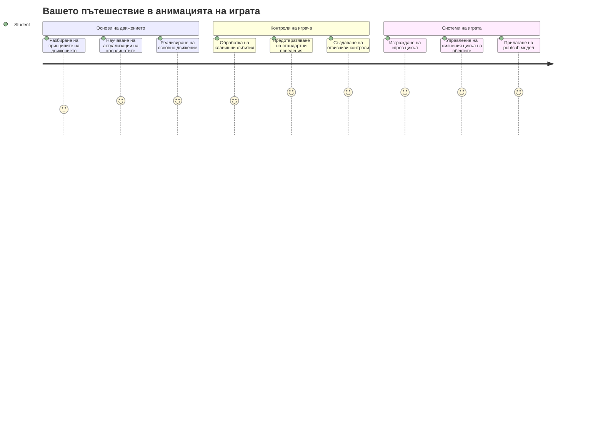
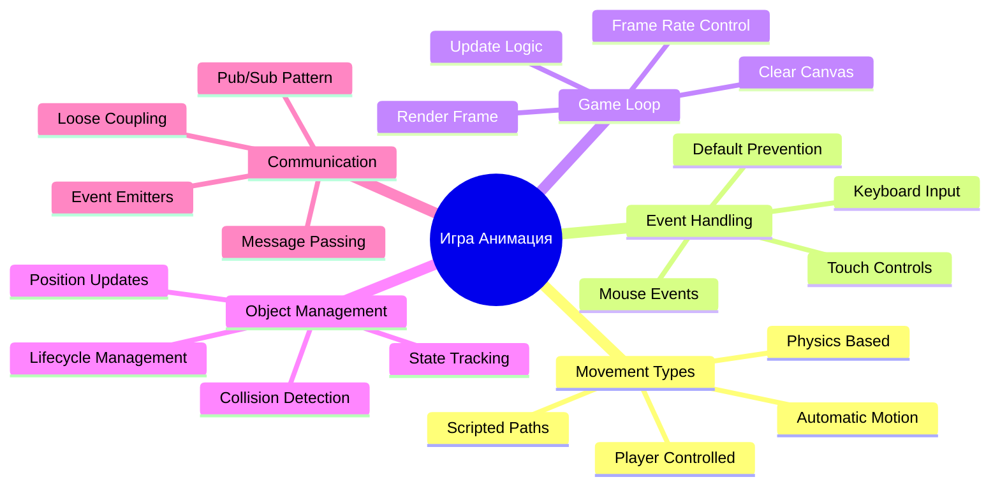
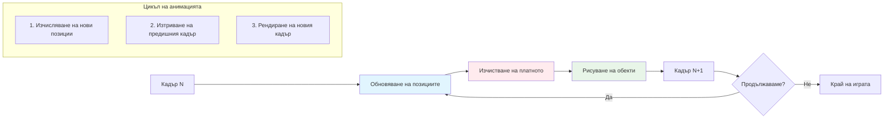
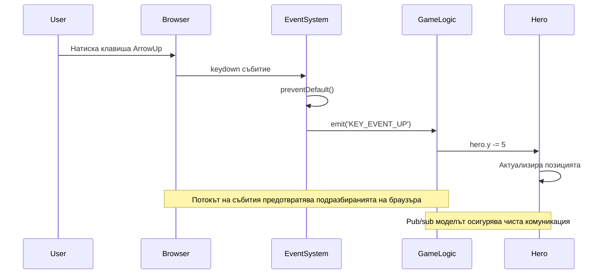
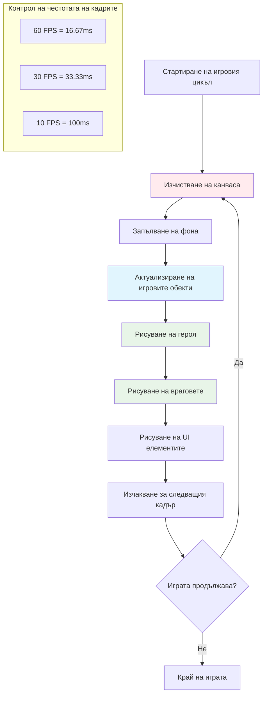
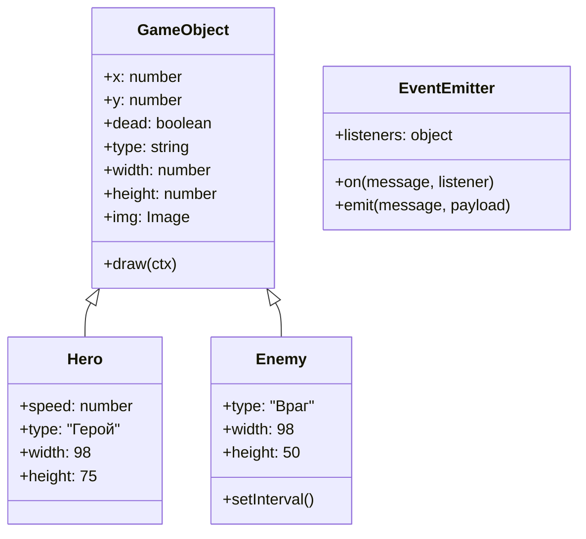
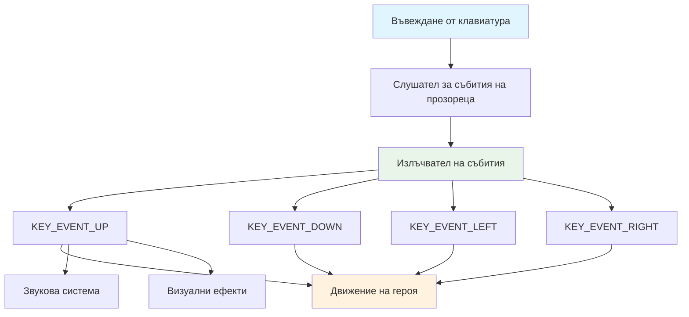
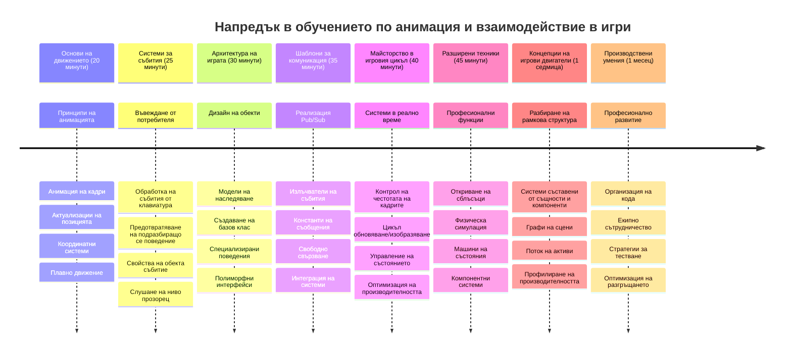

<!--
CO_OP_TRANSLATOR_METADATA:
{
  "original_hash": "8c55a2bd4bc0ebe4c88198fd563a9e09",
  "translation_date": "2026-01-07T06:54:00+00:00",
  "source_file": "6-space-game/3-moving-elements-around/README.md",
  "language_code": "bg"
}
-->
# Създаване на космическа игра Част 3: Добавяне на движение


Помислете за любимите си игри – това, което ги прави увлекателни, не са само красивите графики, а начинът, по който всичко се движи и реагира на вашите действия. В момента вашата космическа игра е като красива картина, но ще добавим движение, което ще я вдъхне живот.

Когато инженерите на NASA програмираха компютъра за управление на мисията „Аполо“, те се сблъскаха със сходно предизвикателство: как да накарат космическия кораб да реагира на командите на пилота, докато автоматично поддържа корекции на курса? Принципите, които ще научим днес, отразяват тези същите концепции – управление на движение под контрол на играча заедно с автоматични системни поведения.

В този урок ще научите как да накарате космическите кораби да се плъзгат по екрана, да реагират на заповедите на играча и да създават плавни модели на движение. Ще разгледаме всичко на управляеми концепции, които естествено се изграждат една върху друга.

В края на урока ще можете да накарате играчите да управляват своя герой върху екрана, докато вражеските кораби патрулират над главите им. Още по-важно е, че ще разберете основните принципи, които движат системите за движение в игрите.


## Предварителен тест преди лекцията

[Предварителен тест преди лекцията](https://ff-quizzes.netlify.app/web/quiz/33)

## Разбиране на игровото движение

Игрите оживяват, когато нещата започнат да се движат, и има основно два начина как това се случва:

- **Движение, контролирано от играча**: Когато натиснете клавиш или щракнете с мишката, нещо се движи. Това е директната връзка между вас и игровия свят.
- **Автоматично движение**: Когато самата игра решава да движи неща – като онези вражески кораби, които трябва да патрулират по екрана, независимо дали вие правите нещо или не.

Движението на обекти по компютърен екран е по-просто, отколкото може би мислите. Помните ли онези x и y координати от часовете по математика? Това е точно това, с което работим тук. Когато Галилео наблюдава луните на Юпитер през 1610 г., той всъщност правеше същото – чертаеше позиции във времето, за да разбере моделите на движение.

Движението на екрана е като създаване на анимация от въртящи се картинки – трябва да следвате тези три прости стъпки:


1. **Актуализирайте позицията** – Променете къде трябва да бъде обектът (може би го преместете 5 пиксела надясно)
2. **Изтрийте стария кадър** – Изчистете екрана, за да не виждате призрачни следи навсякъде
3. **Начертайте новия кадър** – Поставете обекта си на новото място

Направите ли го достатъчно бързо, и бац! Получавате плавно движение, което се усеща естествено за играчите.

Ето как би могло да изглежда това в код:

```javascript
// Задайте местоположението на героя
hero.x += 5;
// Изчистете правоъгълника, в който се намира героят
ctx.clearRect(0, 0, canvas.width, canvas.height);
// Прерисувайте фона на играта и героя
ctx.fillRect(0, 0, canvas.width, canvas.height);
ctx.fillStyle = "black";
ctx.drawImage(heroImg, hero.x, hero.y);
```

**Ето какво прави този код:**
- **Актуализира** x-координатата на героя с 5 пиксела, за да го премести хоризонтално
- **Изчиства** цялата платно област, за да премахне предишния кадър
- **Запълва** платното с черен фон
- **Начертава отново** образа на героя на новата му позиция

✅ Можете ли да помислите защо многократно изчертаване на героя много кадри в секунда може да повиши разходите за производителност? Прочетете за [алтернативите на този подход](https://developer.mozilla.org/en-US/docs/Web/API/Canvas_API/Tutorial/Optimizing_canvas).

## Обработване на събития от клавиатурата

Тук свързваме входа от играча с действията в играта. Когато някой натисне интервала, за да стреля лазер, или докосне стрелка, за да избегне астероид, играта трябва да засече и реагира на този вход.

Събитията от клавиатурата се улавят на ниво прозорец, което означава, че целият ви браузър слуша тези натискания. Щракванията с мишката, от друга страна, могат да бъдат свързани с конкретни елементи (като натискане на бутон). За нашата космическа игра ще се фокусираме върху клавиатурните контроли, тъй като те дават онази класическа аркадна атмосфера.

Това ми напомня за операторите на телеграф в 1800-те години, които трябваше да превеждат морзов код в смислени съобщения – ние правим нещо подобно, превеждаме натискания на клавиши в игрални команди.

За да обработите събитие, трябва да използвате метода `addEventListener()` на прозореца и да му подадете два входни параметъра. Първият е името на събитието, например `keyup`. Вторият е функцията, която трябва да се извика в резултат на настъпването на събитието.

Ето един пример:

```javascript
window.addEventListener('keyup', (evt) => {
  // evt.key = низово представяне на клавиша
  if (evt.key === 'ArrowUp') {
    // направи нещо
  }
});
```

**Разглобяване на това, което става тук:**
- **Слуша** за събития от клавиатурата върху целия прозорец
- **Улавя** обект на събитието, който съдържа информация за това кой клавиш е натиснат
- **Проверява** дали натиснатият клавиш съвпада с конкретен (в този случай стрелка нагоре)
- **Изпълнява** код, когато условието е истинско

За ключови събития има две свойства в обекта на събитието, които можете да използвате, за да видите кой клавиш е натиснат:

- `key` - това е низово представяне на натиснатия клавиш, например `'ArrowUp'`
- `keyCode` - това е числово представяне, например `37`, което съответства на `ArrowLeft`

✅ Манипулирането на ключови събития е полезно и извън разработването на игри. За какви други приложения се сещате за тази техника?


### Специални клавиши: предупреждение!

Някои клавиши имат вградени браузърни поведения, които могат да се намесят в играта ви. Стрелките превъртат страницата и интервалът прескача надолу – поведения, които не искате, когато някой се опитва да управлява космическия си кораб.

Можем да предотвратим тези стандартни поведения и да оставим играта да се справи с входа вместо това. Това е подобно на начина, по който ранните програмисти на компютри са трябвало да отменят системни прекъсвания, за да създадат собствени поведения – просто го правим на ниво браузър. Ето как:

```javascript
const onKeyDown = function (e) {
  console.log(e.keyCode);
  switch (e.keyCode) {
    case 37:
    case 39:
    case 38:
    case 40: // Стрелки на клавиатурата
    case 32:
      e.preventDefault();
      break; // Интервал
    default:
      break; // не блокирайте други клавиши
  }
};

window.addEventListener('keydown', onKeyDown);
```

**Разбиране на този код за предотвратяване:**
- **Проверява** за конкретни кодове на клавиши, които могат да причинят нежелано браузърно поведение
- **Предотвратява** стандартното действие на браузъра за стрелките и интервала
- **Позволява** на други клавиши да функционират нормално
- **Използва** `e.preventDefault()`, за да спре вграденото поведение на браузъра

### 🔄 **Педагогическа проверка**
**Разбиране на обработката на събития**: Преди да преминете към автоматично движение, уверете се, че можете да:
- ✅ Обясните разликата между събитията `keydown` и `keyup`
- ✅ Разберете защо предотвратяваме стандартните браузърни поведения
- ✅ Опишете как слушателите на събития свързват потребителския вход с логиката на играта
- ✅ Идентифицирате кои клавиши може да се намесят в управлението на играта

**Бърз само тест**: Какво би станало, ако не предотвратите стандартното поведение за стрелките?
*Отговор: Браузърът ще превърта страницата, което пречи на движението в играта*

**Архитектура на системата за събития**: Вече разбирате:
- **Слушане на ниво прозорец**: Засичане на събития на ниво браузър
- **Свойства на обекта събитие**: низове `key` спрямо числа `keyCode`
- **Предотвратяване на действие по подразбиране**: Спиране на нежелани браузърни поведения
- **Условна логика**: Реакция на конкретни комбинации от клавиши

## Движение, предизвикано от играта

Сега нека говорим за обекти, които се движат без вход от играча. Помислете за вражески кораби, които кръстосват екрана, куршуми, летящи в прави линии, или облаци, носени на заден план. Това автономно движение прави света на играта да изглежда жив, дори когато никой не докосва контролите.

Използваме вградените таймери на JavaScript, за да актуализираме позициите на редовни интервали. Този концепт е подобен на начина, по който работят махаловите часовници – редовен механизъм, който задейства последователни, времево контролирани действия. Ето колко просто може да бъде:

```javascript
const id = setInterval(() => {
  // Преместете врага по оста y
  enemy.y += 10;
}, 100);
```

**Ето какво прави този код за движение:**
- **Създава** таймер, който се изпълнява на всеки 100 милисекунди
- **Актуализира** y-координатата на врага с 10 пиксела всеки път
- **Съхранява** ID на интервала, за да можем да го спрем по-късно при нужда
- **Движи** врага надолу по екрана автоматично

## Игровият цикъл

Ето концепцията, която свързва всичко заедно – игровият цикъл. Ако вашата игра беше филм, игровият цикъл щеше да бъде прожекционният апарат, който показва кадър след кадър толкова бързо, че всичко изглежда да се движи плавно.

Всяка игра има един такъв цикъл, работещ зад кулисите. Това е функция, която актуализира всички игрови обекти, прерисува екрана и повтаря този процес непрекъснато. Тя следи героя ви, всички врагове, всички лазери, които летят наоколо – цялото игрово състояние.

Тази концепция ми напомня как ранните аниматори във филмовата индустрия, като Уолт Дисни, са рисували героите кадър по кадър, за да създадат илюзията на движение. Ние правим същото, но с код вместо с моливи.

Ето как един игров цикъл типично може да изглежда в код:


```javascript
const gameLoopId = setInterval(() => {
  function gameLoop() {
    ctx.clearRect(0, 0, canvas.width, canvas.height);
    ctx.fillStyle = "black";
    ctx.fillRect(0, 0, canvas.width, canvas.height);
    drawHero();
    drawEnemies();
    drawStaticObjects();
  }
  gameLoop();
}, 200);
```

**Разбиране на структурата на игровия цикъл:**
- **Изчиства** цялото платно, за да премахне предишния кадър
- **Запълва** фона с плътно блока
- **Начертава** всички игрови обекти на текущите им позиции
- **Повтаря** този процес на всеки 200 милисекунди, за да създаде плавна анимация
- **Управлява** честотата на кадрите чрез контрол на времето за интервала

## Продължаване на космическата игра

Сега ще добавим движение към статичната сцена, която изградихте по-рано. Ще я трансформираме от снимка в интерактивно преживяване. Ще работим стъпка по стъпка, за да сме сигурни, че всяка част се гради върху предишната.

Вземете кода от мястото, на което спряхме в предишния урок (или започнете от кода в папката [Part II- starter](../../../../6-space-game/3-moving-elements-around/your-work), ако искате ново начало).

**Ето какво ще изградим днес:**
- **Контроли на героя**: стрелките ще управляват космическия кораб из екрана
- **Движение на враговете**: онези извънземни кораби ще започнат настъпление

Нека започнем с реализирането на тези функции.

## Препоръчителни стъпки

Намерете файловете, които са създадени за вас в подпапката `your-work`. Тя трябва да съдържа следното:

```bash
-| assets
  -| enemyShip.png
  -| player.png
-| index.html
-| app.js
-| package.json
```

Започвате проекта си в папката `your-work`, като напишете:

```bash
cd your-work
npm start
```

**Какво прави тази команда:**
- **Навигира** до директорията на вашия проект
- **Стартира** HTTP сървър на адрес `http://localhost:5000`
- **Сервира** вашите файлове с играта, за да можете да ги тествате в браузър

Горната команда ще стартира HTTP сървър на адрес `http://localhost:5000`. Отворете браузър и въведете този адрес, в момента би трябвало да видите героя и всички врагове; нищо още не се движи!

### Добавете код

1. **Добавете специализирани обекти** за `hero`, `enemy` и `game object`, те трябва да имат свойства `x` и `y`. (Помнете частта за [наследяване или композиция](../README.md)).

   *СЪВЕТ* `game object` трябва да е този, който има `x` и `y` и способността да се рисува на платното.

   > **Подсказка**: Започнете с добавяне на нов клас `GameObject` с конструктора, описан по-долу, и след това го нарисувайте на платното:

    ```javascript
    class GameObject {
      constructor(x, y) {
        this.x = x;
        this.y = y;
        this.dead = false;
        this.type = "";
        this.width = 0;
        this.height = 0;
        this.img = undefined;
      }
    
      draw(ctx) {
        ctx.drawImage(this.img, this.x, this.y, this.width, this.height);
      }
    }
    ```

    **Разбиране на този базов клас:**
    - **Дефинира** общи свойства, които всички игрови обекти споделят (положение, размер, изображение)
    - **Включва** флаг `dead`, за да следи дали обектът трябва да бъде премахнат
    - **Осигурява** метод `draw()`, който рисува обекта на платното
    - **Задава** стойности по подразбиране за всички свойства, които дочерните класове могат да пренапишат


    Сега, разширете този `GameObject`, за да създадете `Hero` и `Enemy`:
    
    ```javascript
    class Hero extends GameObject {
      constructor(x, y) {
        super(x, y);
        this.width = 98;
        this.height = 75;
        this.type = "Hero";
        this.speed = 5;
      }
    }
    ```

    ```javascript
    class Enemy extends GameObject {
      constructor(x, y) {
        super(x, y);
        this.width = 98;
        this.height = 50;
        this.type = "Enemy";
        const id = setInterval(() => {
          if (this.y < canvas.height - this.height) {
            this.y += 5;
          } else {
            console.log('Stopped at', this.y);
            clearInterval(id);
          }
        }, 300);
      }
    }
    ```

    **Ключови концепции в тези класове:**
    - **Наследяват** от `GameObject` чрез ключовата дума `extends`
    - **Извикват** конструктора на родителя с `super(x, y)`
    - **Задават** специфични размери и свойства за всеки тип обект
    - **Реализират** автоматично движение за враговете чрез `setInterval()`

2. **Добавете обработващи функции за събития от клавиатурата**, за да навигирате с клавишите (местене на героя нагоре/надолу, наляво/надясно)

   *ПОМНЕТЕ* това е декартова система, горе вляво е `0,0`. Също не забравяйте да добавите код за предотвратяване на *стандартното поведение*

   > **Подсказка**: Създайте функцията `onKeyDown` и я прикрепете към прозореца:

   ```javascript
   const onKeyDown = function (e) {
     console.log(e.keyCode);
     // Добавете кода от урока по-горе, за да спрете подразбираното поведение
     switch (e.keyCode) {
       case 37:
       case 39:
       case 38:
       case 40: // Стрелки на клавиатурата
       case 32:
         e.preventDefault();
         break; // Интервал
       default:
         break; // не блокирайте други клавиши
     }
   };

   window.addEventListener("keydown", onKeyDown);
   ```
    
   **Какво прави този обработчик на събитието:**
   - **Слуша** за събития `keydown` върху целия прозорец
   - **Логва** кода на клавиша, за да ви помогне да отстраните проблеми кои клавиши са натиснати
   - **Предотвратява** стандартното поведение на браузъра за стрелките и интервала
   - **Позволява** на другите клавиши да функционират нормално
   
   Проверете конзолата на браузъра си в този момент и наблюдавайте регистрираните натискания на клавиши.

3. **Реализирайте** [патърна Pub sub](../README.md), това ще държи кода ви чист, докато следвате останалите части.

   Патърнът Publish-Subscribe помага да организирате кода си, като разделя засичането на събития от обработването им. Това прави кода ви по-модулен и по-лесен за поддръжка.

   За последната част можете да:

   1. **Добавите слушател за събития** на прозореца:

       ```javascript
       window.addEventListener("keyup", (evt) => {
         if (evt.key === "ArrowUp") {
           eventEmitter.emit(Messages.KEY_EVENT_UP);
         } else if (evt.key === "ArrowDown") {
           eventEmitter.emit(Messages.KEY_EVENT_DOWN);
         } else if (evt.key === "ArrowLeft") {
           eventEmitter.emit(Messages.KEY_EVENT_LEFT);
         } else if (evt.key === "ArrowRight") {
           eventEmitter.emit(Messages.KEY_EVENT_RIGHT);
         }
       });
       ```

   **Какво прави тази система за събития:**
   - **Разпознава** вход от клавиатура и го превръща в персонализирани игрови събития
   - **Разделя** откриването на входа от игровата логика
   - **Позволява** лесна промяна на контролите без да се засяга игралният код
   - **Позволява** на множество системи да реагират на един и същи вход


   2. **Създайте клас EventEmitter**, за да публикувате и абонирате за съобщения:

       ```javascript
       class EventEmitter {
         constructor() {
           this.listeners = {};
         }
       
         on(message, listener) {
           if (!this.listeners[message]) {
             this.listeners[message] = [];
           }
           this.listeners[message].push(listener);
         }
       
   
   3. **Добавете константи** и настройте EventEmitter:

       ```javascript
       const Messages = {
         KEY_EVENT_UP: "KEY_EVENT_UP",
         KEY_EVENT_DOWN: "KEY_EVENT_DOWN",
         KEY_EVENT_LEFT: "KEY_EVENT_LEFT",
         KEY_EVENT_RIGHT: "KEY_EVENT_RIGHT",
       };
       
       let heroImg, 
           enemyImg, 
           laserImg,
           canvas, ctx, 
           gameObjects = [], 
           hero, 
           eventEmitter = new EventEmitter();
       ```

   **Разбиране на настройката:**
   - **Дефинира** константи за съобщения, за да се избегнат правописни грешки и да улесни промяната на кода
   - **Декларира** променливи за изображения, контекст на платното и състоянието на играта
   - **Създава** глобален емитент на събития за системата pub-sub
   - **Инициализира** масив за съхранение на всички игрови обекти

   4. **Инициализирайте играта**

       ```javascript
       function initGame() {
         gameObjects = [];
         createEnemies();
         createHero();
       
         eventEmitter.on(Messages.KEY_EVENT_UP, () => {
           hero.y -= 5;
         });
       
         eventEmitter.on(Messages.KEY_EVENT_DOWN, () => {
           hero.y += 5;
         });
       
         eventEmitter.on(Messages.KEY_EVENT_LEFT, () => {
           hero.x -= 5;
         });
       
4. **Настройка на игровия цикъл**

   Преработете функцията `window.onload`, за да инициализирате играта и да създадете игров цикъл с подходящ интервал. Също така ще добавите лазерен лъч:

    ```javascript
    window.onload = async () => {
      canvas = document.getElementById("canvas");
      ctx = canvas.getContext("2d");
      heroImg = await loadTexture("assets/player.png");
      enemyImg = await loadTexture("assets/enemyShip.png");
      laserImg = await loadTexture("assets/laserRed.png");
    
      initGame();
      const gameLoopId = setInterval(() => {
        ctx.clearRect(0, 0, canvas.width, canvas.height);
        ctx.fillStyle = "black";
        ctx.fillRect(0, 0, canvas.width, canvas.height);
        drawGameObjects(ctx);
      }, 100);
    };
    ```

   **Разбиране на настройката на играта:**
   - **Изчаква** страницата да се зареди напълно преди стартиране
   - **Взема** canvas елемента и нейния 2D контекст за рендиране
   - **Зарежда** всички изображения асинхронно с помощта на `await`
   - **Стартира** игровия цикъл с интервали от 100ms (10 FPS)
   - **Изчиства** и прерисува целия екран при всяка рамка

5. **Добавете код** за движение на враговете с определен интервал

    Преработете функцията `createEnemies()`, за да създадете враговете и да ги добавите в новия клас за игрови обекти:

    ```javascript
    function createEnemies() {
      const MONSTER_TOTAL = 5;
      const MONSTER_WIDTH = MONSTER_TOTAL * 98;
      const START_X = (canvas.width - MONSTER_WIDTH) / 2;
      const STOP_X = START_X + MONSTER_WIDTH;
    
      for (let x = START_X; x < STOP_X; x += 98) {
        for (let y = 0; y < 50 * 5; y += 50) {
          const enemy = new Enemy(x, y);
          enemy.img = enemyImg;
          gameObjects.push(enemy);
        }
      }
    }
    ```

    **Какво прави създаването на враговете:**
    - **Изчислява** позиции за центриране на враговете на екрана
    - **Създава** мрежа от врагове с вложени цикли
    - **Присвоява** образа на врага на всеки враг обект
    - **Добавя** всеки враг към глобалния масив с игрови обекти
    
    и добавете функция `createHero()`, която прави подобен процес за героя.
    
    ```javascript
    function createHero() {
      hero = new Hero(
        canvas.width / 2 - 45,
        canvas.height - canvas.height / 4
      );
      hero.img = heroImg;
      gameObjects.push(hero);
    }
    ```

    **Какво прави създаването на героя:**
    - **Поставя** героя в долния център на екрана
    - **Присвоява** образа на героя към героя обект
    - **Добавя** героя в масива с игрови обекти за рендиране

    и накрая, добавете функция `drawGameObjects()`, за да започнете рисуването:

    ```javascript
    function drawGameObjects(ctx) {
      gameObjects.forEach(go => go.draw(ctx));
    }
    ```

    **Разбиране на функцията за рисуване:**
    - **Итерира** през всички игрови обекти в масива
    - **Извиква** метода `draw()` на всеки обект
    - **Подава** контекста на canvas, за да могат обектите да се визуализират

    ### 🔄 **Педагогически преглед**
    **Пълно разбиране на игровата система**: Проверкете майсторството си върху цялата архитектура:
    - ✅ Как наследяването позволява на Hero и Enemy да споделят общи свойства на GameObject?
    - ✅ Защо pub/sub моделът прави кода ви по-поддържаем?
    - ✅ Каква роля играе игровият цикъл за създаване на плавна анимация?
    - ✅ Как слушателите на събития свързват потребителския вход с поведението на игровите обекти?

    **Интеграция на системата**: Вашата игра вече демонстрира:
    - **Обектно-ориентиран дизайн**: Базови класове с специализирано наследяване
    - **Архитектура, базирана на събития**: Pub/sub модел за слаба свързаност
    - **Анимационна рамка**: Игров цикъл с консистентни обновявания на кадрите
    - **Обработка на вход**: Събития от клавиатура с предпазване от подразбиращи се действия
    - **Управление на ресурси**: Зареждане на изображения и рендиране на спрайтове

    **Професионални модели**: Прилагали сте:
    - **Разделяне на отговорностите**: Отделни логики за вход, логика и рендериране
    - **Полиморфизъм**: Всички игрови обекти споделят общ интерфейс за рисуване
    - **Предаване на съобщения**: Чиста комуникация между компонентите
    - **Управление на ресурси**: Ефективно боравене със спрайтове и анимации

    Вашите врагове трябва да започнат да настъпват към вашия герой на космическия кораб!
      }
    }
    ```
    
    and add a `createHero()` function to do a similar process for the hero.
    
    ```javascript
    function createHero() {
      hero = new Hero(
        canvas.width / 2 - 45,
        canvas.height - canvas.height / 4
      );
      hero.img = heroImg;
      gameObjects.push(hero);
    }
    ```

    и накрая, добавете функция `drawGameObjects()`, за да започнете рисуването:

    ```javascript
    function drawGameObjects(ctx) {
      gameObjects.forEach(go => go.draw(ctx));
    }
    ```

    Вашите врагове трябва да започнат да настъпват към вашия герой на космическия кораб!

---

## GitHub Copilot Agent Challenge 🚀

Ето едно предизвикателство, което ще подобри изглаждането на вашата игра: добавяне на граници и плавен контрол. В момента вашият герой може да излезе извън екрана, а движението може да е на прекъснати стъпки.

**Вашата мисия:** Направете вашия космически кораб по-реалистичен, като добавите граници на екрана и плавно движение. Това е подобно на начина, по който NASA използва системи за управление на полетите, за да предотврати излизане на космически кораби извън безопасните експлоатационни параметри.

**Ето какво да изградите:** Създайте система, която държи героя ви на екрана и направете контролите плавни. Когато играчите задържат стрелка, корабът плавно да се движи непрекъснато, вместо да се мести на отделни стъпки. Помислете за добавяне на визуална обратна връзка, когато корабът достигне границите на екрана – например лек ефект за индикиране края на игровата зона.

Научете повече за [agent mode](https://code.visualstudio.com/blogs/2025/02/24/introducing-copilot-agent-mode) тук.

## 🚀 Предизвикателство

Организацията на кода става все по-важна с нарастване на проектите. Може би сте забелязали, че файлът ви се запълва с функции, променливи и класове, преплетени заедно. Това ми напомня как инженерите, организиращи кода за мисия Apollo, са създавали ясни и поддържими системи, върху които са работели няколко екипа едновременно.

**Вашата мисия:**
Мислете като софтуерен архитект. Как бихте организирали кода си така, че след шест месеца вие (или колега) да можете да разберете какво се случва? Дори и всичко да остане в един файл засега, можете да създадете по-добра организация:

- **Групиране на свързани функции** заедно с ясни заглавни коментари
- **Разделяне на отговорности** – отделяйте логиката на играта от рендерирането
- **Използване на последователни имена** за променливи и функции
- **Създаване на модули** или namespaces за организация на различни аспекти от играта
- **Добавяне на документация**, която обяснява целта на всяка голяма секция

**Въпроси за размисъл:**
- Кои части от кода ви са най-трудни за разбиране, когато се върнете към тях?
- Как бихте организирали кода си, за да е по-лесно на друг да допринася?
- Какво би станало, ако искате да добавите нови функции като power-ups или различни видове врагове?

## Следлекционен тест

[Следлекционен тест](https://ff-quizzes.netlify.app/web/quiz/34)

## Преглед & Самостоятелно учене

Ние изграждаме всичко от нулата, което е фантастично за учене, но ето една малка тайна – съществуват страхотни JavaScript фреймуъркове, които могат да поемат голяма част от тежката работа вместо вас. След като се почувствате комфортно с основите, които покрихме, си струва да [проучите какво има](https://github.com/collections/javascript-game-engines).

Помислете за фреймуърковете като за добре зареден инструментариум, вместо да правите всеки инструмент на ръка. Те могат да решат много от проблемите с организацията на кода, които обсъждахме, както и да предоставят функции, които биха отнели седмици да изградите сами.

**Неща, които си струва да проучите:**
- Как гейм енджините организират кода – ще се изненадате от умните модели, които използват
- Трикове за производителност, които правят canvas игрите наистина плавни  
- Модерни JavaScript възможности, които правят кода по-чист и по-лесен за поддръжка
- Различни подходи за управление на игрови обекти и техните взаимоотношения

## 🎯 Вашата времева линия за овладяване на играна анимация


### 🛠️ Обобщение на вашия набор от инструменти за разработка на игри

След завършване на този урок вече сте овладели:
- **Принципи на анимацията**: движение на база на кадри и плавни преходи
- **Програмиране, базирано на събития**: Обработка на клавишен вход с правилно управление на събитията
- **Обектно-ориентиран дизайн**: Наследствени йерархии и полиморфни интерфейси
- **Комуникационни модели**: Pub/sub архитектура за поддържам код
- **Архитектура на игровия цикъл**: Цикли за обновяване и рендериране в реално време
- **Системи за въвеждане**: Картографиране на управление с предпазване от подразбирани действия
- **Управление на ресурси**: Зареждане на спрайтове и ефективни техники за рендериране

### ⚡ **Какво можете да направите в следващите 5 минути**
- [ ] Отворете конзолата в браузъра и пробвайте `addEventListener('keydown', console.log)`, за да видите клавишните събития
- [ ] Създайте прост div елемент и го движете с стрелки на клавиатурата
- [ ] Експериментирайте с `setInterval` за създаване на непрекъснато движение
- [ ] Опитайте да спрете подразбираното поведение с `event.preventDefault()`

### 🎯 **Какво можете да постигнете този час**
- [ ] Попълнете следлекционния тест и разберете програмирането, базирано на събития
- [ ] Създайте подвижния герой космически кораб с пълно управление на клавиатурата
- [ ] Прилагайте плавни модели на движение за враговете
- [ ] Добавете граници, за да предотвратите напускането на игровите обекти от екрана
- [ ] Създайте базово засичане на сблъсъци между игрови обекти

### 📅 **Вашето седмично пътешествие в анимацията**
- [ ] Завършете пълната космическа игра с полиран контрол на движението и взаимодействия
- [ ] Добавете сложни модели на движение като криви, ускорение и физика
- [ ] Прилагайте плавни преходи и easing функции
- [ ] Създавайте частици и системи за визуална обратна връзка
- [ ] Оптимизирайте производителността за плавна игра с 60fps
- [ ] Добавете мобилни тъч контроли и адаптивен дизайн

### 🌟 **Вашето месечно интерактивно развитие**
- [ ] Изградете сложни интерактивни приложения с усъвършенствани анимационни системи
- [ ] Научете анимационни библиотеки като GSAP или създайте собствен анимационен движок
- [ ] Допринасяйте за open source проекти за игри и анимация
- [ ] Овладейте оптимизацията на производителността за графично интензивни приложения
- [ ] Създавайте образователно съдържание за игродизайн и анимация
- [ ] Създайте портфолио, показващо напреднали интерактивни програмни умения

**Приложения в реалния свят**: Вашите умения за анимация в игрите се прилагат директно към:
- **Интерактивни уеб приложения**: Динамични табла и интерфейси в реално време
- **Визуализация на данни**: Анимирани графики и интерактивни визуализации
- **Образователен софтуер**: Интерактивни симулации и обучителни инструменти
- **Мобилна разработка**: Игри с тъч управление и жестове
- **Десктоп приложения**: Electron приложения с плавни анимации
- **Уеб анимации**: Библиотеки за анимации с CSS и JavaScript

**Професионални умения, които сте придобили**: Можете сега да:
- **Проектирате** системи, базирани на събития, които се разрастват според сложността
- **Прилагате** плавни анимации с математически принципи
- **Отстранявате грешки** в сложни системи за взаимодействие с помощта на браузърни инструменти за разработчици
- **Оптимизирате** производителността на игрите за различни устройства и браузъри
- **Дизайнирате** поддържащ се код с доказани модели

**Придобити концепции в игродизайна**:
- **Управление на честота на кадрите**: Разбиране на FPS и контрол на времето
- **Обработка на вход**: Кросплатформени клавиатурни и събитийни системи
- **Животен цикъл на обектите**: Модели за създаване, обновяване и унищожаване
- **Синхронизация на състоянието**: Поддържане на консистентност на игровото състояние между кадрите
- **Архитектура на събития**: Свързана комуникация между игрови системи

**Следващо ниво**: Вие сте готови да добавите засичане на сблъсъци, системи за точкуване, звукови ефекти или да изследвате модерни игрови фреймуъркове като Phaser или Three.js!

🌟 **Постигнато постижение**: Изградихте пълна интерактивна игрова система с професионални архитектурни модели!

## Задача

[Коментирайте кода си](assignment.md)

---

<!-- CO-OP TRANSLATOR DISCLAIMER START -->
**Отказ от отговорност**:  
Този документ е преведен с помощта на AI преводаческа услуга [Co-op Translator](https://github.com/Azure/co-op-translator). Въпреки че се стремим към точност, имайте предвид, че автоматичните преводи могат да съдържат грешки или неточности. Оригиналният документ на неговия първоначален език трябва да се счита за авторитетен източник. За критична информация се препоръчва професионален човешки превод. Ние не носим отговорност за никакви недоразумения или неправилни тълкувания, възникнали в резултат на използването на този превод.
<!-- CO-OP TRANSLATOR DISCLAIMER END -->