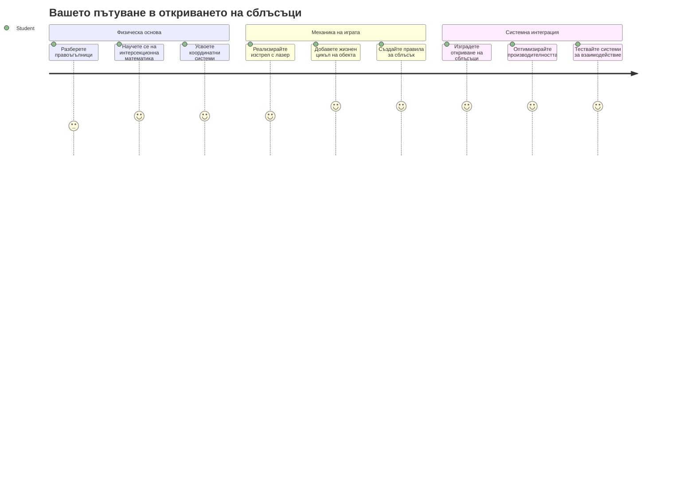
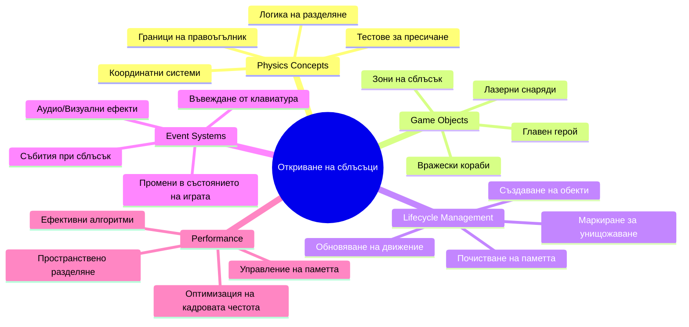
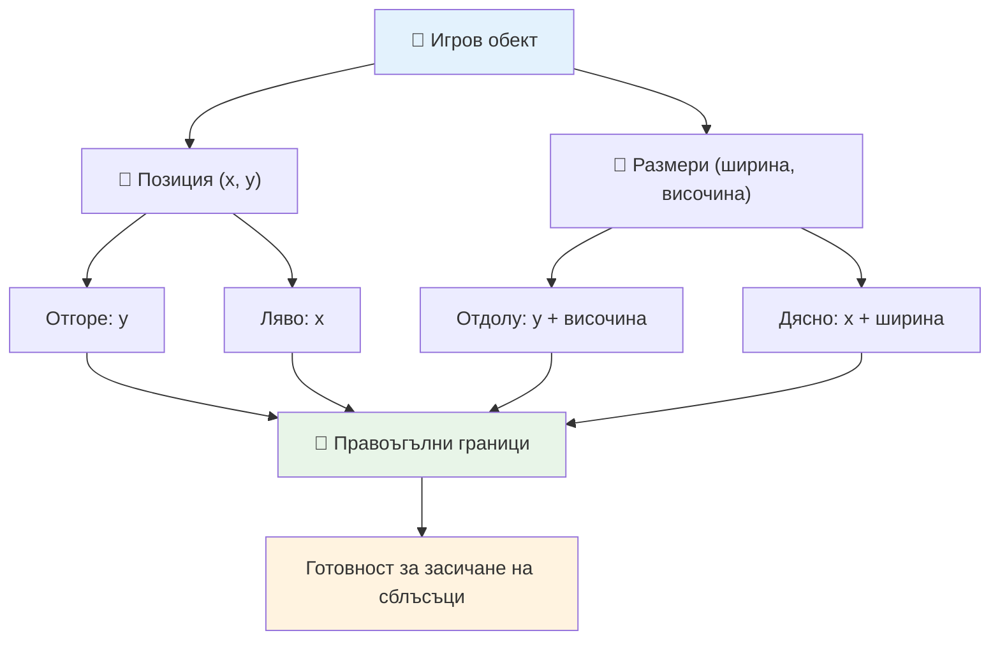
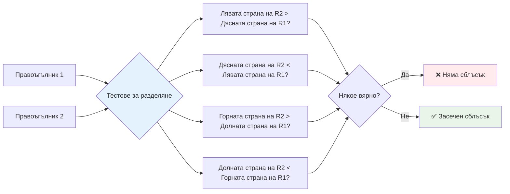
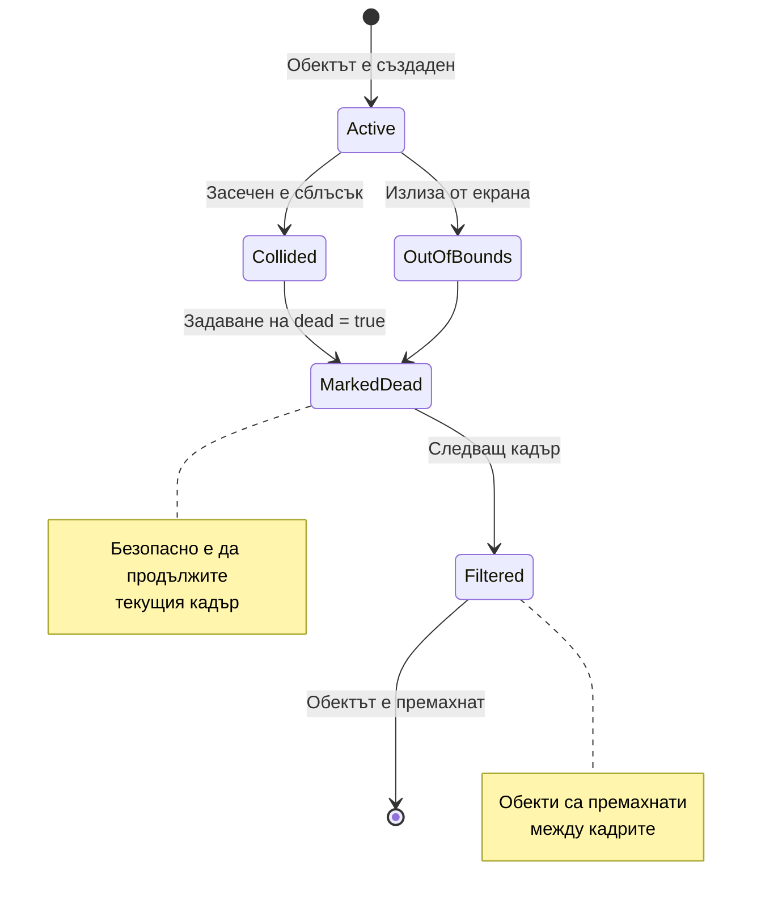
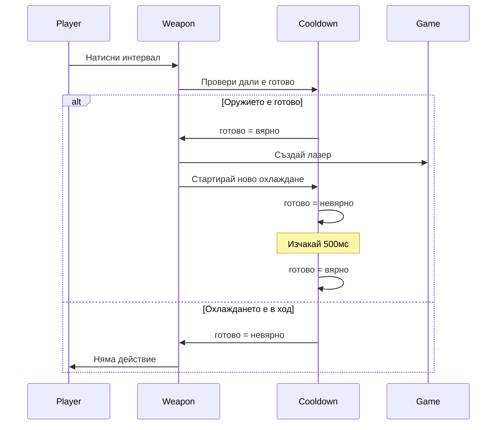
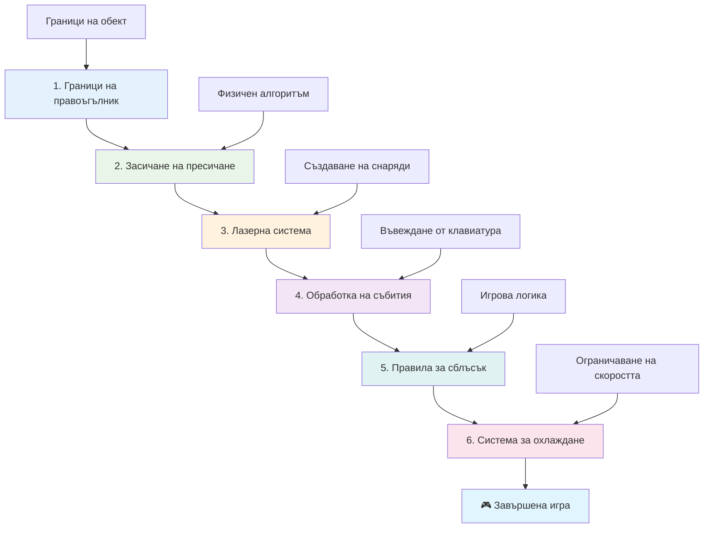
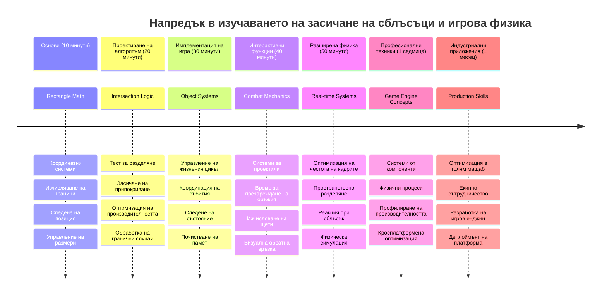

# Създаване на Космическа Игра Част 4: Добавяне на Лазер и Откриване на Сблъсъци


## Предна Контролна Викторина

[Предна контролна викторина](https://ff-quizzes.netlify.app/web/quiz/35)

Помислете за момента от Междузвездни войни, когато протонните торпеда на Люк удрят изпускателния отвор на Звездата на смъртта. Точно това откриване на сблъсък промени съдбата на галактиката! В игрите, откриването на сблъсъци работи по същия начин - то определя кога обектите взаимодействат и какво се случва след това.

В този урок ще добавите лазерно оръжие към вашата космическа игра и ще имплементирате откриване на сблъсъци. Точно както плановете на НАСА изчисляват траекториите на космическите кораби, за да избегнат отломки, така и вие ще научите как да откривате кога обектите в играта се пресичат. Ще разделим това на управляеми стъпки, които се изграждат една върху друга.

В края ще имате функционираща бойна система, където лазерите унищожават враговете, а сблъсъците задействат игрови събития. Същите принципи за откриване на сблъсъци се използват във всичко от физически симулации до интерактивни уеб интерфейси.


✅ Направете малко проучване за първата компютърна игра някога написвана. Каква беше нейната функционалност?

## Откриване на сблъсъци

Откриването на сблъсъци работи като датчиците за близост на лунния модул Apollo - постоянно проверява разстоянията и задейства аларми, когато обектите се доближат прекалено много. В игрите тази система определя кога обектите взаимодействат и какво трябва да се случи след това.

Подходът, който ще използваме, третира всеки игрови обект като правоъгълник, подобно на начина, по който системите за контрол на въздушното движение използват опростени геометрични форми за проследяване на самолети. Този правоъгълен метод може да изглежда прост, но е изчислително ефективен и работи добре в повечето игрови сценарии.

### Представяне с правоъгълник

Всеки игрови обект се нуждае от координатни граници, подобно на това как марсоходът Mars Pathfinder маркира своето място на марсианската повърхност. Ето как дефинираме тези гранични координати:


```javascript
rectFromGameObject() {
  return {
    top: this.y,
    left: this.x,
    bottom: this.y + this.height,
    right: this.x + this.width
  }
}
```

**Нека го разложим:**
- **Горна граница**: Това е просто къде започва вашият обект вертикално (неговата y позиция)
- **Лява граница**: Къде започва хоризонтално (неговата x позиция)
- **Долна граница**: Добавете височината към y позицията - сега знаете къде свършва!
- **Дясна граница**: Добавете ширината към x позицията - и имате пълните граници

### Алгоритъм за пресичане

Откриването на пресичане на правоъгълници използва логика, подобна на тази, с която космическият телескоп Хъбъл определя дали небесни обекти се припокриват в неговото поле на видимост. Алгоритъмът проверява за разделение:


```javascript
function intersectRect(r1, r2) {
  return !(r2.left > r1.right ||
    r2.right < r1.left ||
    r2.top > r1.bottom ||
    r2.bottom < r1.top);
}
```

**Тестът за разделение работи като радарни системи:**
- Дали правоъгълник 2 е изцяло вдясно от правоъгълник 1?
- Дали правоъгълник 2 е изцяло вляво от правоъгълник 1?
- Дали правоъгълник 2 е изцяло под правоъгълник 1?
- Дали правоъгълник 2 е изцяло над правоъгълник 1?

Ако нито едно от тези условия не е вярно, правоъгълниците трябва да се припокриват. Този подход отразява как радарните оператори определят дали два самолета са на безопасно разстояние.

## Управление на жизнения цикъл на обектите

Когато лазер удари враг, и двата обекта трябва да бъдат премахнати от играта. Обаче, изтриването на обекти в средата на цикъл може да предизвика сривове - урок научен трудно в ранните компютърни системи като Apollo Guidance Computer. Вместо това използваме подход "маркиране за изтриване", който безопасно премахва обекти между кадрите.


Ето как маркираме нещо за премахване:

```javascript
// Маркирай обекта за премахване
enemy.dead = true;
```

**Защо този подход работи:**
- Маркираме обекта като "мъртъв", но не го изтриваме веднага
- Това позволява текущият игрови кадър да завърши безопасно
- Няма сривове от опити за използване на нещо, което вече липсва!

След това филтрираме маркираните обекти преди следващия цикъл за изобразяване:

```javascript
gameObjects = gameObjects.filter(go => !go.dead);
```

**Какво прави това филтриране:**
- Създава нов списък само с "живите" обекти
- Премахва всичко, маркирано като мъртво
- Поддържа играта ви да работи гладко
- Предотвратява натрупване на памет от унищожени обекти

## Имплементиране на лазерна механика

Лазерните снаряди в игрите работят по същия принцип като фотонните торпеда в Star Trek - това са отделни обекти, които се движат по прави линии, докато не ударят нещо. Всяко натискане на space бар създава нов лазерен обект, който се движи по екрана.

За да направим това, трябва да координираме няколко различни компонента:

**Основни компоненти за имплементация:**
- **Създаване** на лазерни обекти, които се появяват от позицията на героя
- **Обработка** на клавиатурния вход за задействане на създаване на лазер
- **Управление** на движението и жизнения цикъл на лазера
- **Имплементиране** на визуално представяне за лазерните снаряди

## Контрол на скоростта на стрелба

Неограничената скорост на стрелба би претоварила игровия двигател и би направила геймплея твърде лесен. Реалните оръжейни системи имат подобни ограничения — дори футуристичните фазери на USS Enterprise трябваше да се презареждат между изстрели.

Ще имплементираме система за охлаждане, която предотвратява спамене с бързи изстрели, като същевременно запазва контролите отзивчиви:


```javascript
class Cooldown {
  constructor(time) {
    this.cool = false;
    setTimeout(() => {
      this.cool = true;
    }, time);
  }
}

class Weapon {
  constructor() {
    this.cooldown = null;
  }
  
  fire() {
    if (!this.cooldown || this.cooldown.cool) {
      // Създаване на лазерен снаряд
      this.cooldown = new Cooldown(500);
    } else {
      // Оръжието все още се охлажда
    }
  }
}
```

**Как работи охлаждането:**
- При създаване оръжието започва "гори" (не може да стреля веднага)
- След изтичане на време става "охладено" (готово за стрелба)
- Преди стрелба проверяваме: "Охладено ли е оръжието?"
- Това предотвратява спам, като същевременно запазва контролите отзивчиви

✅ Върнете се към урок 1 в серията за космическата игра, за да си припомните за охлаждането.

## Създаване на система за откриване на сблъсъци

Ще разширите съществуващия код на вашата космическа игра, за да създадете система за откриване на сблъсъци. Подобно на автоматизирания механизъм за избягване на сблъсъци на Международната космическа станция, вашата игра ще следи непрекъснато позициите на обектите и ще реагира на пресичания.

Започвайки от кода от предишния урок, ще добавите откриване на сблъсъци с конкретни правила, които управляват взаимодействията на обектите.

> 💡 **Професионален съвет**: Лазерният спрайт вече е включен във вашата папка с ресурси и е препратен в кода ви, готов за имплементация.

### Правила за сблъсъци за имплементиране

**Игрови механики, които да добавите:**
1. **Лазер удря враг**: Враговият обект се унищожава при удар от лазерен снаряд
2. **Лазер удря границата на екрана**: Лазерът се премахва при достигане на горната граница на екрана
3. **Сблъсък между враг и герой**: И двата обекта се унищожават при пресичане
4. **Враг достига дъното**: Условие за край на играта, когато враговете достигнат долната част на екрана

### 🔄 **Педагогическа Проверка**
**Основи на Откриването на Сблъсъци**: Преди имплементация се уверете, че разбирате:
- ✅ Как границите на правоъгълниците дефинират зоните на сблъсък
- ✅ Защо тестът за разделение е по-ефективен от изчислението на пресичането
- ✅ Значението на управлението на жизнения цикъл на обектите в игровите цикли
- ✅ Как системите, управляеми от събития, координират реакциите при сблъсъци

**Бърз Самотест**: Какво би се случило, ако изтриете обекти веднага вместо да ги маркирате?
*Отговор: Изтриването по средата на цикъла може да предизвика сривове или прескача обекти при итерация*

**Разбиране на Физиката**: Вече разбирате:
- **Координатни Системи**: Как позицията и размерите създават граници
- **Логика на Пресичане**: Математически принципи зад откриването на сблъсъци
- **Оптимизация на Работата**: Защо ефективните алгоритми са важни за системи в реално време
- **Управление на Паметта**: Безопасни модели на жизнен цикъл на обектите за стабилност

## Настройване на средата за разработка

Добри новини - вече сме подготвили повечето от основите за вас! Всички ваши игрови ресурси и базова структура чакат в поддиректорията `your-work`, готови за добавянето на страхотните функции за сблъсъци.

### Структура на проекта

```bash
-| assets
  -| enemyShip.png
  -| player.png
  -| laserRed.png
-| index.html
-| app.js
-| package.json
```

**Разбиране на структурата на файловете:**
- **Съдържа** всички спрайт изображения, нужни за игровите обекти
- **Включва** основния HTML документ и JavaScript приложението
- **Осигурява** конфигурация на пакета за локален сървър за разработка

### Стартиране на сървъра за разработка

Отидете до папката на проекта и стартирайте локалния сървър:

```bash
cd your-work
npm start
```

**Тази последователност от команди:**
- **Променя** директорията във вашата работна папка
- **Стартира** локален HTTP сървър на `http://localhost:5000`
- **Сервира** вашите игрови файлове за тест и разработка
- **Позволява** живо разработване с автоматично презареждане

Отворете браузъра и посетете `http://localhost:5000`, за да видите текущото състояние на играта с визуализирани герой и врагове на екрана.

### Имплементация стъпка по стъпка

Както систематичния подход на НАСА за програмиране на космическите апарати Voyager, ще имплементираме откриването на сблъсъци методично, изграждайки всяка част по етапи.


#### 1. Добавяне на правоъгълни граници за сблъсък

Първо, нека научим игровите обекти как да описват своите граници. Добавете този метод към класа `GameObject`:

```javascript
rectFromGameObject() {
    return {
      top: this.y,
      left: this.x,
      bottom: this.y + this.height,
      right: this.x + this.width,
    };
  }
```

**Този метод постига:**
- **Създава** правоъгълен обект с точни координати на границите
- **Изчислява** долната и дясната граница чрез позиция + размери
- **Връща** обект, готов за алгоритми за откриване на сблъсък
- **Осигурява** стандартизиран интерфейс за всички игрови обекти

#### 2. Имплементиране на откриване на пресичане

Сега нека създадем нашия детектор за сблъсъци - функция, която може да определи кога два правоъгълника се припокриват:

```javascript
function intersectRect(r1, r2) {
  return !(
    r2.left > r1.right ||
    r2.right < r1.left ||
    r2.top > r1.bottom ||
    r2.bottom < r1.top
  );
}
```

**Този алгоритъм работи чрез:**
- **Тества** четири условия за разделение между правоъгълници
- **Връща** `false`, ако някое условие за разделение е вярно
- **Индикира** сблъсък, когато разделение липсва
- **Използва** логика на отрицание за ефективно тестиране на пресичане

#### 3. Имплементиране на система за стрелба с лазер

Тук нещата стават вълнуващи! Нека настроим системата за стрелба с лазер.

##### Константи за съобщения

Първо, нека дефинираме някои типове съобщения, за да могат различните части на играта да комуникират помежду си:

```javascript
KEY_EVENT_SPACE: "KEY_EVENT_SPACE",
COLLISION_ENEMY_LASER: "COLLISION_ENEMY_LASER",
COLLISION_ENEMY_HERO: "COLLISION_ENEMY_HERO",
```

**Тези константи осигуряват:**
- **Стандартизиране** на имената на събития в приложението
- **Позволяват** последователна комуникация между игровите системи
- **Предотвратяват** грешки при регистриране на обработвачи на събития

##### Обработка на клавиатурен вход

Добавете детекция на клавиша space във вашия слушател на клавишни събития:

```javascript
} else if(evt.keyCode === 32) {
  eventEmitter.emit(Messages.KEY_EVENT_SPACE);
}
```

**Този обработчик:**
- **Детектира** натискането на клавиш space с keyCode 32
- **Излъчва** стандартизирано събитие
- **Позволява** отделена логика за стрелба

##### Регистрация на слушатели за събития

Регистрирайте поведението при стрелба в функцията `initGame()`:

```javascript
eventEmitter.on(Messages.KEY_EVENT_SPACE, () => {
 if (hero.canFire()) {
   hero.fire();
 }
});
```

**Този слушател на събития:**
- **Отговаря** на събития за клавиш space
- **Проверява** статуса на охлаждане преди стрелба
- **Задейства** създаване на лазер, когато е разрешено

Добавете обработка на сблъсъци за взаимодействия между лазери и врагове:

```javascript
eventEmitter.on(Messages.COLLISION_ENEMY_LASER, (_, { first, second }) => {
  first.dead = true;
  second.dead = true;
});
```

**Този обработчик на сблъсъци:**
- **Приема** данни за сблъсък с двата обекта
- **Маркира** и двата обекта за премахване
- **Осигурява** правилно почистване след сблъсъка

#### 4. Създаване на класа Laser

Имплементирайте лазерен снаряд, който се движи нагоре и управлява собствения си жизнен цикъл:

```javascript
class Laser extends GameObject {
  constructor(x, y) {
    super(x, y);
    this.width = 9;
    this.height = 33;
    this.type = 'Laser';
    this.img = laserImg;
    
    let id = setInterval(() => {
      if (this.y > 0) {
        this.y -= 15;
      } else {
        this.dead = true;
        clearInterval(id);
      }
    }, 100);
  }
}
```

**Тази имплементация на клас:**
- **Наследява** функционалност от GameObject
- **Задава** подходящи размери за лазерния спрайт
- **Създава** автоматично движение нагоре с `setInterval()`
- **Обработва** самоунищожение при достигане на горния край на екрана
- **Управлява** собственото си времево анимиране и почистване

#### 5. Имплементиране на система за откриване на сблъсъци

Създайте комплексна функция за откриване на сблъсъци:

```javascript
function updateGameObjects() {
  const enemies = gameObjects.filter(go => go.type === 'Enemy');
  const lasers = gameObjects.filter(go => go.type === "Laser");
  
  // Тествайте сблъсъците между лазера и врага
  lasers.forEach((laser) => {
    enemies.forEach((enemy) => {
      if (intersectRect(laser.rectFromGameObject(), enemy.rectFromGameObject())) {
        eventEmitter.emit(Messages.COLLISION_ENEMY_LASER, {
          first: laser,
          second: enemy,
        });
      }
    });
  });

  // Премахнете разрушените обекти
  gameObjects = gameObjects.filter(go => !go.dead);
}
```

**Тази система за сблъсъци:**
- **Филтрира** игрови обекти по тип за ефективно тестване
- **Тества** всеки лазер срещу всеки враг за пресичане
- **Излъчва** събития при засичане на сблъсък
- **Почиствa** унищожени обекти след обработка на сблъсъците

> ⚠️ **Важно**: Добавете `updateGameObjects()` във вашия главен игрови цикъл в `window.onload` за активиране на откриването на сблъсъци.

#### 6. Добавяне на система за охлаждане в класа Hero

Подобрете класа Hero с механика за стрелба и ограничаване на скоростта:

```javascript
class Hero extends GameObject {
  constructor(x, y) {
    super(x, y);
    this.width = 99;
    this.height = 75;
    this.type = "Hero";
    this.speed = { x: 0, y: 0 };
    this.cooldown = 0;
  }
  
  fire() {
    gameObjects.push(new Laser(this.x + 45, this.y - 10));
    this.cooldown = 500;

    let id = setInterval(() => {
      if (this.cooldown > 0) {
        this.cooldown -= 100;
      } else {
        clearInterval(id);
      }
    }, 200);
  }
  
  canFire() {
    return this.cooldown === 0;
  }
}
```

**Как раздразненото Hero работи:**
- **Инициализира** таймер за охлаждане на нула (готов за стрелба)
- **Създава** лазерни обекти, позиционирани над кораба на героя
- **Задава** период на охлаждане, за да предотврати бързи изстрели
- **Намалява** таймера чрез интервални ъпдейти
- **Осигурява** метод `canFire()` за проверка дали може да стреля

### 🔄 **Педагогическа Проверка**
**Пълно Разбиране на Системата**: Проверете натрупаните си знания за системата за сблъсъци:
- ✅ Как границите на правоъгълниците позволяват ефективно откриване на сблъсъци?
- ✅ Защо управлението на жизнения цикъл на обекти е критично за стабилността на играта?
- ✅ Как системата за охлаждане предотвратява проблеми с производителността?
- ✅ Каква роля играе архитектурата, управляемa от събития, при обработката на сблъсъци?

**Интеграция на Системата**: Вашата система за откриване на сблъсъци демонстрира:
- **Математическа Точност**: Алгоритми за пресичане на правоъгълници
- **Оптимизация на Работата**: Ефективни модели за тестване на сблъсъци
- **Управление на Паметта**: Безопасно създаване и унищожаване на обекти
- **Координация на Събития**: Отделена системна комуникация
- **Обработка в Реално Време**: Ъпдейти базирани на кадри

**Професионални Модели**: Имплементирали сте:
- **Разделение на Отговорностите**: Физика, рендериране и вход разделени
- **Обектно-Ориентиран Дизайн**: Наследяване и полиморфизъм
- **Управление на Състоянието**: Проследяване на жизнения цикъл на обекти и състоянието на играта
- **Оптимизация на Изпълнението**: Ефективни алгоритми за употреба в реално време

### Тестване на имплементацията

Вашата космическа игра вече разполага с пълна система за откриване на сблъсъци и бойна механика. 🚀 Тествайте новите възможности:
- **Навигирайте** с клавишите със стрелки за проверка на управлението на движението
- **Стреляйте с лазери** с space bar — забележете как системата за охлаждане предотвратява спам
- **Наблюдавайте сблъсъците**, когато лазерите удрят врагове и те се премахват
- **Проверете почистването** като унищожените обекти изчезват от играта

Успешно имплементирахте система за откриване на сблъсъци, използвайки същите математически принципи, които управляват навигацията на космически кораби и роботика.

### ⚡ **Какво можете да направите през следващите 5 минути**
- [ ] Отворете DevTools на браузъра и поставете прекъсвачи в функцията за откриване на сблъсъци
- [ ] Опитайте да промените скоростта на лазера или движението на врага, за да видите ефектите от сблъсъците
- [ ] Експериментирайте с различни стойности на охлаждане, за да тествате скоростта на стрелба
- [ ] Добавете `console.log` изрази за проследяване на събития с колизии в реално време

### 🎯 **Какво можете да постигнете този час**
- [ ] Попълване на теста след урока и разбиране на алгоритмите за засичане на колизии
- [ ] Добавяне на визуални ефекти като експлозии при възникване на колизии
- [ ] Имплементиране на различни видове снаряди с различни характеристики
- [ ] Създаване на бустъри, които временно усилват способностите на играча
- [ ] Добавяне на звукови ефекти, за да направите колизиите по-удовлетворяващи

### 📅 **Вашият седмичен план за физично програмиране**
- [ ] Завършване на цялата космическа игра с усъвършенствани системи за колизии
- [ ] Имплементиране на разширени форми за колизии извън правоъгълници (кръгове, полигони)
- [ ] Добавяне на частици за реалистични експлозивни ефекти
- [ ] Създаване на сложни поведения на враговете с избягване на колизии
- [ ] Оптимизиране на засичането на колизии за по-добра производителност при много обекти
- [ ] Добавяне на физическа симулация като инерция и реалистично движение

### 🌟 **Вашият месечен курс по майсторство на игра с физика**
- [ ] Създаване на игри с напреднали физични двигатели и реалистични симулации
- [ ] Изучаване на 3D засичане на колизии и алгоритми за пространствено разделяне
- [ ] Принос към отворени библиотеки за физика и игрови двигатели
- [ ] Майсторство в оптимизация на производителността за графично натоварващи приложения
- [ ] Създаване на образователно съдържание за игрова физика и засичане на колизии
- [ ] Изграждане на портфолио, демонстриращо напреднали умения по програмиране на физика

## 🎯 Времева линия за вашето майсторство в засичането на колизии


### 🛠️ Обобщение на вашия набор от инструменти за игрова физика

След завършване на този урок сте овладели:
- **Математика на колизии**: Алгоритми за пресичане на правоъгълници и координатни системи
- **Оптимизация на производителността**: Ефективно засичане на колизии за приложения в реално време
- **Управление на жизнения цикъл на обекти**: Безопасно създаване, обновяване и унищожаване на обекти
- **Архитектура, базирана на събития**: Отделени системи за реакция на колизии
- **Интеграция в игровия цикъл**: Физични обновявания на кадър и координация на рендера
- **Входни системи**: Отзивчиви контроли с ограничение на скоростта и обратна връзка
- **Управление на паметта**: Ефективно използване на обектни плувове и почистване

**Приложения в реалния свят**: Уменията за засичане на колизии могат директно да се прилагат в:
- **Интерактивни симулации**: Научно моделиране и образователни инструменти
- **Дизайн на потребителски интерфейс**: Влачене и пускане, засичане на докосвания
- **Визуализация на данни**: Интерактивни графики и кликващи елементи
- **Мобилна разработка**: Разпознаване на жестове и обработка на колизии
- **Роботика**: Планиране на път и избягване на препятствия
- **Компютърна графика**: Лъчево проследяване и пространствени алгоритми

**Професионални умения, придобити**: Сега можете да:
- **Проектирате** ефективни алгоритми за засичане на колизии в реално време
- **Имплементирате** физични системи, адаптиращи се според сложността на обектите
- **Отстранявате грешки** в сложни системи за взаимодействие чрез математически принципи
- **Оптимизирате** производителността за различен хардуер и браузъри
- **Архитектирате** поддържани игрови системи чрез утвърдени дизайнерски модели

**Овладени концепции в разработката на игри**:
- **Физическа симулация**: Засичане на колизии и реакция в реално време
- **Инженерство на производителността**: Оптимизирани алгоритми за интерактивни приложения
- **Системи със събития**: Разделена комуникация между компонентите на играта
- **Управление на обектите**: Ефективни шаблони за жизнения цикъл на динамично съдържание
- **Обработка на вход**: Отзивчиви контроли с адекватна обратна връзка

**Следващо ниво**: Готови сте да изследвате напреднали физични двигатели като Matter.js, да имплементирате 3D засичане на колизии или да създавате сложни системи с частици!

🌟 **Постижение отключено**: Изградихте цяла система за взаимодействия, базирана на физика с професионално качество в засичането на колизии!

## GitHub Copilot Agent Challenge 🚀

Използвайте режим Agent, за да изпълните следното предизвикателство:

**Описание:** Подобрете системата за засичане на колизии, като имплементирате бустъри, които се появяват случайно и осигуряват временно усилване при събиране от героя.

**Подсказка:** Създайте клас PowerUp, който наследява GameObject и имплементира засичане на колизии между героя и бустърите. Добавете поне два типа бустъри: един, който увеличава скоростта на стрелба (намалява време на презареждане), и друг, който създава временен щит. Включете логика за появяване на бустъри на случайни интервали и позиции.

---


## 🚀 Предизвикателство

Добавете експлозия! Разгледайте игровите ресурси в [the Space Art repo](../../../../6-space-game/solution/spaceArt/readme.txt) и опитайте да добавите експлозия, когато лазерът удари извънземен

## Тест след лекцията

[Post-lecture quiz](https://ff-quizzes.netlify.app/web/quiz/36)

## Ревю & самостоятелно изучаване

Експериментирайте с интервалите в играта досега. Какво се случва, когато ги промените? Прочетете повече за [JavaScript таймингови събития](https://www.freecodecamp.org/news/javascript-timing-events-settimeout-and-setinterval/).

## Задача

[Explore collisions](assignment.md)

---

<!-- CO-OP TRANSLATOR DISCLAIMER START -->
**Отказ от отговорност**:
Този документ е преведен с помощта на AI преводаческа услуга [Co-op Translator](https://github.com/Azure/co-op-translator). Въпреки че се стремим към точност, моля, имайте предвид, че автоматизираните преводи може да съдържат грешки или неточности. Оригиналният документ на родния му език трябва да се счита за авторитетен източник. За критична информация се препоръчва професионален човешки превод. Ние не носим отговорност за никакви недоразумения или неправилни тълкувания, произтичащи от използването на този превод.
<!-- CO-OP TRANSLATOR DISCLAIMER END -->