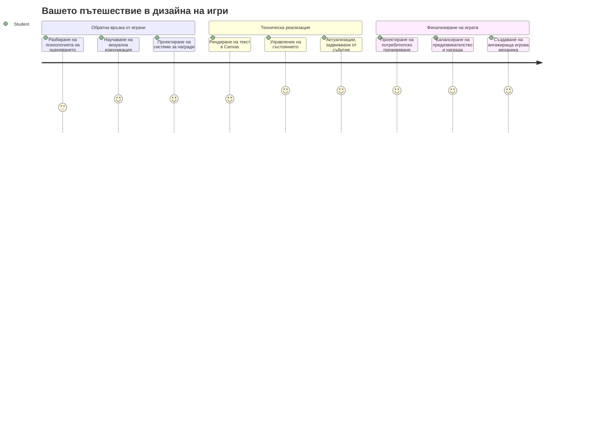
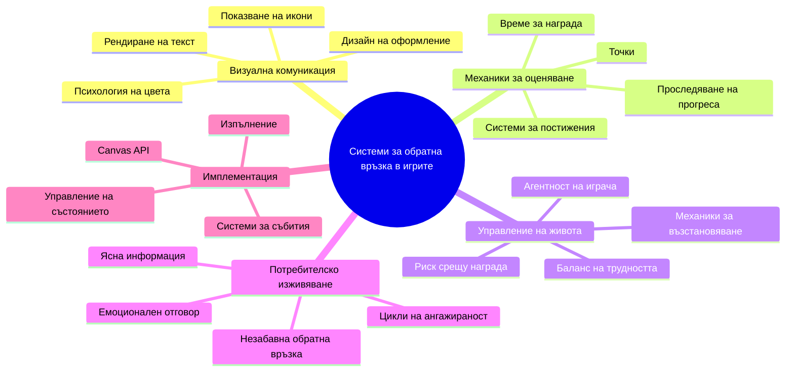
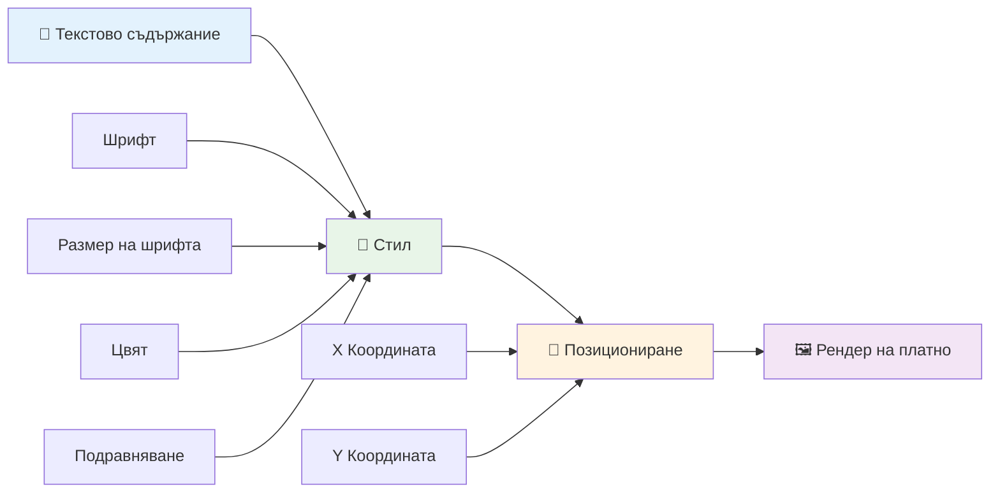
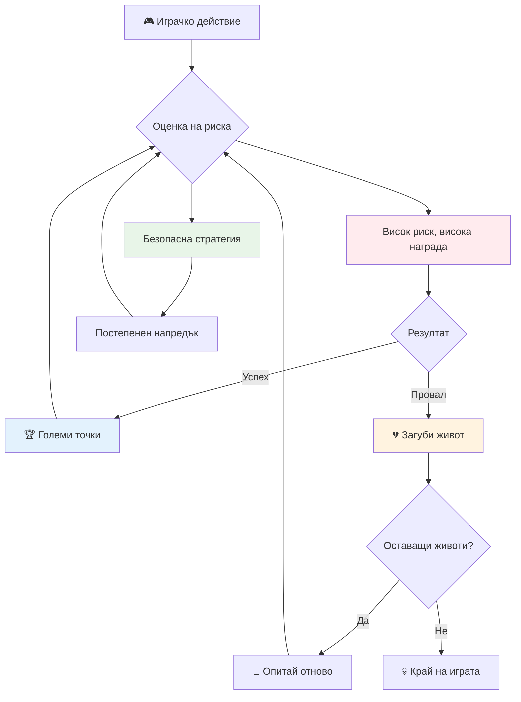
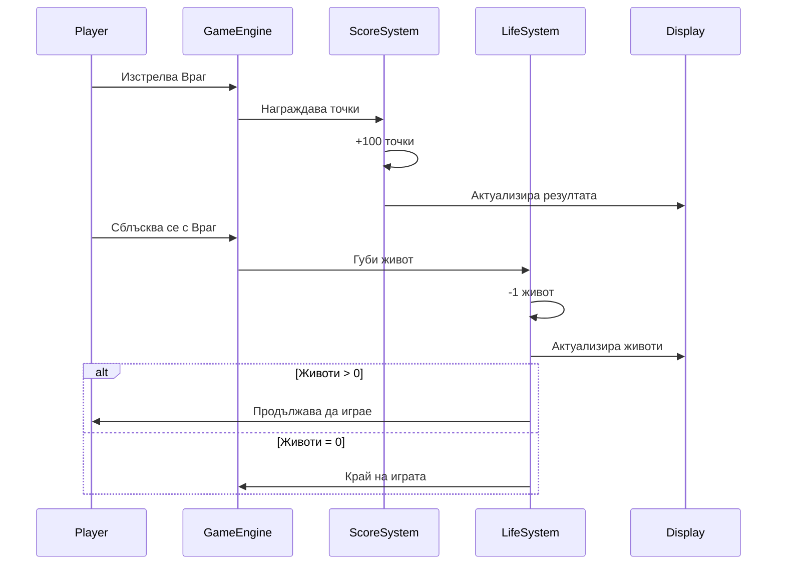
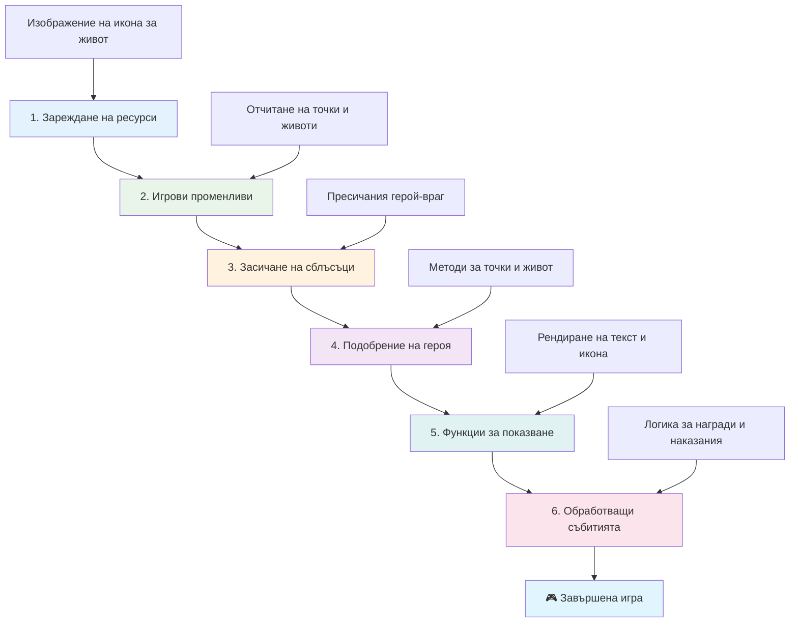
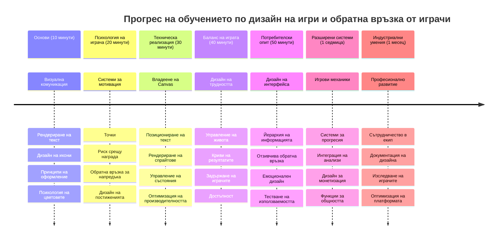

<!--
CO_OP_TRANSLATOR_METADATA:
{
  "original_hash": "2ed9145a16cf576faa2a973dff84d099",
  "translation_date": "2026-01-07T06:50:37+00:00",
  "source_file": "6-space-game/5-keeping-score/README.md",
  "language_code": "bg"
}
-->
# Изграждане на космическа игра Част 5: Точки и животи


## Куиз преди лекцията

[Куиз преди лекцията](https://ff-quizzes.netlify.app/web/quiz/37)

Готови ли сте да направите космическата си игра да се усеща като истинска игра? Нека добавим трупане на точки и управление на животи - основните механики, които превърнаха ранните аркадни игри като Space Invaders от прости демонстрации в пристрастяващо забавление. Тук вашата игра става наистина играема.


## Рисуване на текст на екрана - гласът на вашата игра

За да покажем вашия резултат, трябва да научим как да изобразяваме текст върху канваса. Методът `fillText()` е основният ви инструмент за това - същата техника, използвана в класическите аркадни игри за показване на точки и статусна информация.


Вие имате пълен контрол върху външния вид на текста:

```javascript
ctx.font = "30px Arial";
ctx.fillStyle = "red";
ctx.textAlign = "right";
ctx.fillText("show this on the screen", 0, 0);
```

✅ Потопете се по-дълбоко в [добавяне на текст към канвас](https://developer.mozilla.org/docs/Web/API/Canvas_API/Tutorial/Drawing_text) – може да се изненадате колко креативни може да станете с шрифтове и стилове!

## Животи - Повече от просто число

В дизайна на игри „животът“ представлява допустимата грешка на играча. Тази концепция датира още от машините за пинбол, където разполагаш с няколко топки за игра. В ранните видеоигри като Asteroids, животите дават право на играчите да поемат рискове и да се учат от грешките си.


Визуалното представяне е изключително важно - показването на икони на кораби вместо просто "Животи: 3" създава незабавно визуално разпознаване, подобно на това как ранните аркадни шкафове използваха икони, за да комуникират през езикови бариери.

## Създаване на системата за награди в играта ви

Сега ще реализираме основните системи за обратна връзка, които държат играчите ангажирани:


- **Система за точкуване**: Всеки унищожен вражески кораб дава 100 точки (кръглите числа са по-лесни за умствена аритметика от играчите). Резултатът се показва в долния ляв ъгъл.
- **Брояч животи**: Вашият герой започва с три живота - стандарт, установен от ранните аркадни игри за балансиране на предизвикателството с играбилността. Всяко сблъскване с враг отнема един живот. Ще показваме оставащите животи в долния десен ъгъл с икони на кораби .

## Да започваме да градим!

Първо настройте работната си среда. Отидете до файловете в подпапката `your-work`. Трябва да видите тези файлове:

```bash
-| assets
  -| enemyShip.png
  -| player.png
  -| laserRed.png
-| index.html
-| app.js
-| package.json
```

За да тествате играта, стартирайте сървъра за разработка от папката `your_work`:

```bash
cd your-work
npm start
```

Това стартира локален сървър на `http://localhost:5000`. Отворете този адрес в браузъра си, за да видите играта. Тествайте управлението с клавишите със стрелки и опитайте да стреляте по врагове, за да проверите дали всичко работи.


### Време за код!

1. **Вземете необходимите визуални активи**. Копирайте файла `life.png` от папката `solution/assets/` в `your-work` папката. След това добавете lifeImg във функцията window.onload:

    ```javascript
    lifeImg = await loadTexture("assets/life.png");
    ```

1. Не забравяйте да добавите `lifeImg` към списъка с активи:

    ```javascript
    let heroImg,
    ...
    lifeImg,
    ...
    eventEmitter = new EventEmitter();
    ```
  
2. **Настройте игровите променливи**. Добавете код за проследяване на общия резултат (стартиращ от 0) и останалите животи (стартиращи от 3). Ще показваме тези стойности на екрана, за да знаят играчите винаги къде се намират.

3. **Реализирайте откриване на сблъсъци**. Разширете функцията `updateGameObjects()`, за да засича сблъсъци между врагове и героя:

    ```javascript
    enemies.forEach(enemy => {
        const heroRect = hero.rectFromGameObject();
        if (intersectRect(heroRect, enemy.rectFromGameObject())) {
          eventEmitter.emit(Messages.COLLISION_ENEMY_HERO, { enemy });
        }
      })
    ```

4. **Добавете проследяване на животи и точки към героя**. 
   1. **Инициализирайте броячите**. Под `this.cooldown = 0` в класа `Hero` настройте живот и точки:

        ```javascript
        this.life = 3;
        this.points = 0;
        ```

   1. **Показвайте тези стойности на играча**. Създайте функции за рисуване на тези стойности на екрана:

        ```javascript
        function drawLife() {
          // TODO, 35, 27
          const START_POS = canvas.width - 180;
          for(let i=0; i < hero.life; i++ ) {
            ctx.drawImage(
              lifeImg, 
              START_POS + (45 * (i+1) ), 
              canvas.height - 37);
          }
        }
        
        function drawPoints() {
          ctx.font = "30px Arial";
          ctx.fillStyle = "red";
          ctx.textAlign = "left";
          drawText("Points: " + hero.points, 10, canvas.height-20);
        }
        
        function drawText(message, x, y) {
          ctx.fillText(message, x, y);
        }

        ```

   1. **Свържете всичко с игровия цикъл**. Добавете тези функции във функцията window.onload веднага след `updateGameObjects()`:

        ```javascript
        drawPoints();
        drawLife();
        ```

### 🔄 **Педагогическо сверяване**
**Разбиране на дизайн на играта**: Преди да реализирате последствия, уверете се, че разбирате:
- ✅ Как визуалната обратна връзка комуникира игровото състояние към играчите
- ✅ Защо последователното разположение на елементите от UI подобрява удобството
- ✅ Психологията зад стойностите на точките и управлението на животите
- ✅ Как рисуването на текст върху канваса се различава от HTML текст

**Бърз само-тест**: Защо аркадните игри обикновено използват кръгли числа за точките?
*Отговор: Кръглите числа са по-лесни за умствено пресмятане от играчите и създават удовлетворяващи психологически награди*

**Принципи на потребителския опит**: Вече прилагате:
- **Визуална йерархия**: Важна информация позиционирана на видно място
- **Незабавна обратна връзка**: Актуализации в реално време на действията на играча
- **Когнитивно натоварване**: Простичко и ясно представяне на информацията
- **Емоционален дизайн**: Икони и цветове, които създават връзка с играча

1. **Реализирайте последици и награди в играта**. Сега ще добавим системите за обратна връзка, които правят действията на играча значими:

   1. **Сблъсъците струват животи**. Всеки път, когато вашият герой се сблъска с враг, трябва да загуби живот.
   
      Добавете този метод в класа `Hero`:

        ```javascript
        decrementLife() {
          this.life--;
          if (this.life === 0) {
            this.dead = true;
          }
        }
        ```

   2. **Стрелбата по врагове носи точки**. Всяко успешно попадение дава 100 точки, осигурявайки незабавна положителна обратна връзка за точната стрелба.

      Разширете класа Hero с този метод за увеличаване на точките:
    
        ```javascript
          incrementPoints() {
            this.points += 100;
          }
        ```

        Сега свържете тези функции със събитията на сблъсък:

        ```javascript
        eventEmitter.on(Messages.COLLISION_ENEMY_LASER, (_, { first, second }) => {
           first.dead = true;
           second.dead = true;
           hero.incrementPoints();
        })

        eventEmitter.on(Messages.COLLISION_ENEMY_HERO, (_, { enemy }) => {
           enemy.dead = true;
           hero.decrementLife();
        });
        ```

✅ Любопитни сте за други игри, изградени с JavaScript и Canvas? Изследвайте – може да се изненадате какво е възможно!

След като приложите тези функции, тествайте играта си, за да видите как работи цялата система за обратна връзка. Трябва да видите икони за животите в долния десен ъгъл, резултата в долния ляв, и да наблюдавате как сблъсъците намаляват животи, докато успешните изстрели увеличават точките.

Вашата игра вече има съществените механики, които направиха ранните аркадни игри толкова увлекателни - ясни цели, незабавна обратна връзка и значими последици за действията на играча.

### 🔄 **Педагогическо сверяване**
**Пълна система за дизайн на игра**: Проверете овладяването си на системите за обратна връзка с играчите:
- ✅ Как механиките за точкуване създават мотивация и ангажираност на играча?
- ✅ Защо визуалната последователност е важна за дизайна на интерфейс?
- ✅ Как системата с животи балансира предизвикателството с задържането на играча?
- ✅ Каква роля играе незабавната обратна връзка за удовлетворяващ геймплей?

**Интеграция на системи**: Вашата система за обратна връзка демонстрира:
- **Дизайн на потребителския опит**: Ясна визуална комуникация и информационна йерархия
- **Архитектура, базирана на събития**: Отзивчиви актуализации за действията на играча
- **Управление на състоянието**: Проследяване и визуализация на динамични игрови данни
- **Майсторство на канваса**: Рендиране на текст и позициониране на спрайтове
- **Психология на играта**: Разбиране на мотивацията и ангажираността на играча

**Професионални модели**: Прилагате:
- **MVC архитектура**: Разделяне на игровата логика, данни и представяне
- **Наблюдателен модел**: Актуализации, задвижвани от събития, за промени в игровото състояние
- **Дизайн на компоненти**: Преустройстваеми функции за рендиране и логика
- **Оптимизация на производителността**: Ефикасно рендиране в игрови цикли

### ⚡ **Какво може да направите през следващите 5 минути**
- [ ] Експериментирайте с различни размери шрифтове и цветове за показване на резултата
- [ ] Опитайте да промените стойностите на точките и наблюдавайте как това влияе на усещането от играта
- [ ] Добавете console.log изявления, за да следите кога точките и животите се променят
- [ ] Тествайте гранични случаи като свършват животи или постигане на високи резултати

### 🎯 **Какво може да постигнете този час**
- [ ] Попълнете теста след урока и разберете психологията на дизайна на игрите
- [ ] Добавете звукови ефекти за трупане на точки и загуба на животи
- [ ] Реализирайте система за висок резултат чрез localStorage
- [ ] Създайте различни стойности за точки за различни видове врагове
- [ ] Добавете визуални ефекти като разтърсване на екрана при загуба на живот

### 📅 **Вашето седмично пътуване в дизайна на игри**
- [ ] Завършете цялата космическа игра с усъвършенствани системи за обратна връзка
- [ ] Реализирайте сложни системи за точкуване като множители за комбо
- [ ] Добавете постижения и отключващо се съдържание
- [ ] Създайте системи за прогрес и балансиране на трудността
- [ ] Проектирайте потребителски интерфейси за менюта и екрани за край на играта
- [ ] Изучете други игри, за да разберете механизмите за ангажиране

### 🌟 **Вашето месечно овладяване на разработката на игри**
- [ ] Построете пълни игри със сложни системи за прогрес
- [ ] Научете анализ на игри и измерване на поведение на играчите
- [ ] Приносете в отворени проекти за разработка на игри
- [ ] Овладейте напреднали модели на дизайн и монетизация в игрите
- [ ] Създавайте образователно съдържание за дизайн на игри и потребителски опит
- [ ] Създайте портфолио, показващо уменията ви в дизайн и разработка на игри

## 🎯 Вашият времеви график за овладяване на дизайна на игри


### 🛠️ Обзор на инструментите за дизайн на игри

След завършване на този урок вече сте овладели:
- **Психология на играча**: Разбиране на мотивацията, риск/награда и цикли на ангажираност
- **Визуална комуникация**: Ефективен дизайн на интерфейс с текст, икони и оформление
- **Системи за обратна връзка**: Отговор в реално време на действия и събития в играта
- **Управление на състоянието**: Ефикасно проследяване и показване на динамични данни
- **Рендиране на текст в канваса**: Професионално показване на текст със стилизиране и позициониране
- **Интеграция на събития**: Свързване на действията на потребителя със значими последици в играта
- **Баланс в играта**: Проектиране на криви на трудност и системи за прогрес на играча

**Приложения в реалния свят**: Вашите умения в дизайна на игри се прилагат директно в:
- **Дизайн на потребителски интерфейси**: Създаване на ангажиращи и лесни за използване интерфейси
- **Разработка на продукти**: Разбиране на мотивацията и циклите за обратна връзка на потребителите
- **Образователни технологии**: Геймификация и системи за ангажиране при учене
- **Визуализация на данни**: Правене на сложна информация достъпна и ангажираща
- **Разработка на мобилни приложения**: Механики за задържане и дизайн на потребителско изживяване
- **Маркетингови технологии**: Разбиране на поведението на потребителите и оптимизация на конверсията

**Професионални умения, придобити**: Вече можете:
- **Дизайн** на потребителски изживявания, които мотивират и ангажират
- **Прилагане** на системи за обратна връзка, които ефективно насочват поведението
- **Баланс** между предизвикателство и достъпност в интерактивни системи
- **Създаване** на визуална комуникация, работеща за различни групи потребители
- **Анализ** на поведението и итерации за подобрение на дизайна

**Овладени концепции в разработката на игри**:
- **Мотивация на играча**: Разбиране на това, което движи ангажираността и задържането
- **Визуален дизайн**: Създаване на ясни, атрактивни и функционални интерфейси
- **Интеграция на системи**: Свързване на множество игрови системи за цялостно преживяване
- **Оптимизация на производителността**: Ефикасно рендиране и управление на състоянието
- **Достъпност**: Проектиране за различни нива на умения и нужди на играчите

**Следващо ниво**: Готови сте да изследвате напреднали модели в дизайна на игри, да внедрявате аналитични системи или да изучавате монетизацията и задържането на играчи!

🌟 **Постижение отключено**: Изградихте пълна система за обратна връзка с играча, базирана на професионални принципи на гейм дизайна!

---

## GitHub Copilot Agent Challenge 🚀

Използвайте режим Agent, за да изпълните следното предизвикателство:

**Описание:** Подобрете системата за точкуване на космическата игра, като реализирате система за най-висок резултат с постоянно съхранение и бонус система за последователни убийства.

**Инструкция:** Създайте система за висок резултат, която запазва най-добрия резултат на играча в localStorage. Добавете бонус точки за поредни убийства на врагове (система за комбо) и реализирайте различни стойности за точки за различни типове врагове. Включете визуален индикатор при нов рекорд и показвайте текущия най-висок резултат на екрана на играта.


## 🚀 Предизвикателство

Вече имате функционална игра с точкови и животи. Помислете какви допълнителни функции биха подобрили изживяването на играча.

## Куиз след лекцията

[Куиз след лекцията](https://ff-quizzes.netlify.app/web/quiz/38)

## Преглед и самостоятелно обучение

Искате ли да изследвате повече? Разучете различни подходи към системите за точкуване и животи. Съществуват интересни игрови платформи като [PlayFab](https://playfab.com), които управляват точкуване, класации и прогрес на играчите. Как би повишило интегрирането на нещо такова нивото на вашата игра?

## Задача

[Изградете игра с точкуване](assignment.md)

---

<!-- CO-OP TRANSLATOR DISCLAIMER START -->
**Отказ от отговорност**:  
Този документ е преведен с помощта на AI преводаческа услуга [Co-op Translator](https://github.com/Azure/co-op-translator). Въпреки че се стараем за точност, моля, имайте предвид, че автоматизираните преводи могат да съдържат грешки или неточности. Оригиналният документ на неговия роден език трябва да се счита за авторитетен източник. За критична информация се препоръчва професионален човешки превод. Ние не носим отговорност за всякакви недоразумения или неправилни тълкувания, произтичащи от използването на този превод.
<!-- CO-OP TRANSLATOR DISCLAIMER END -->