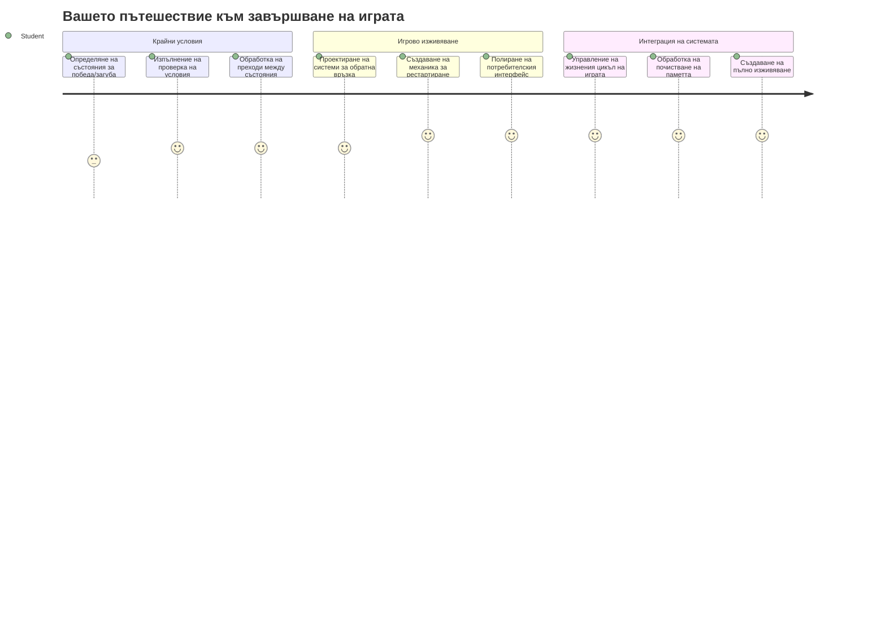
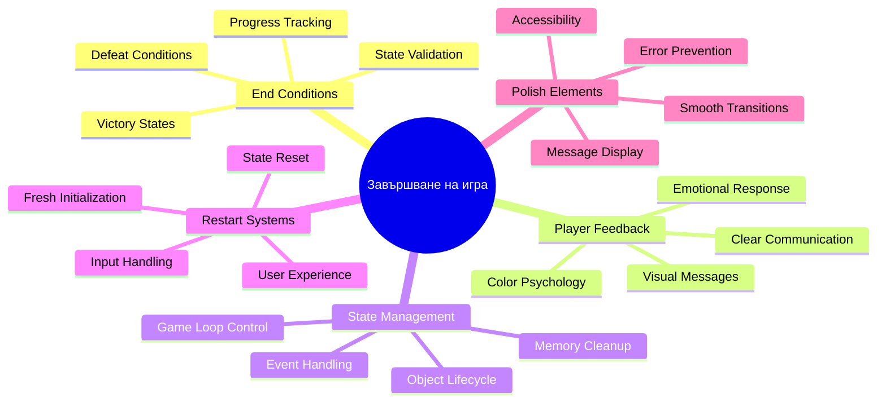
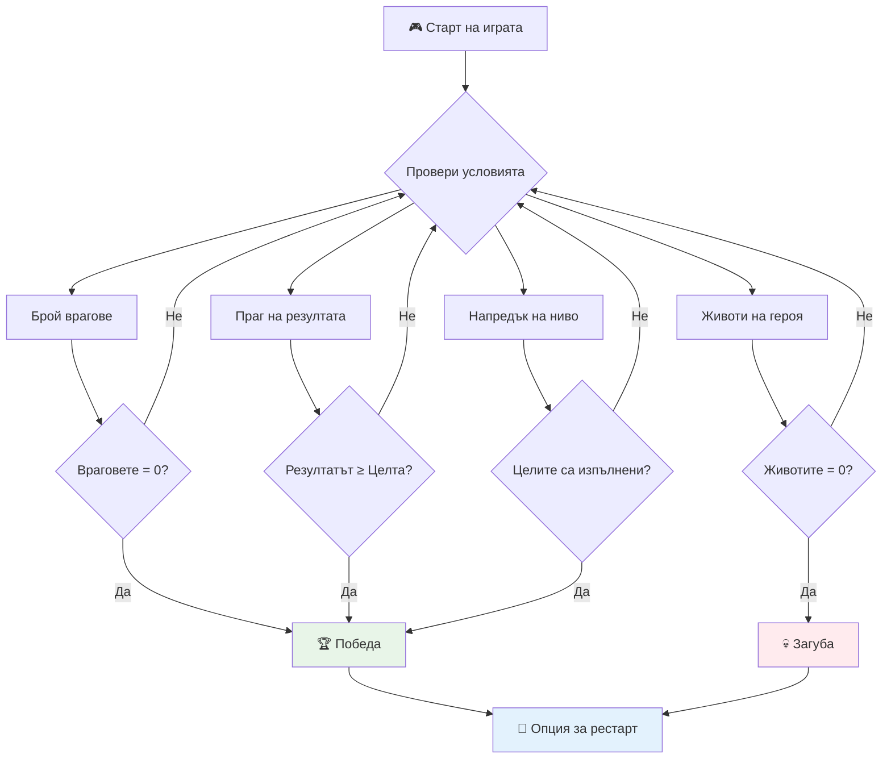
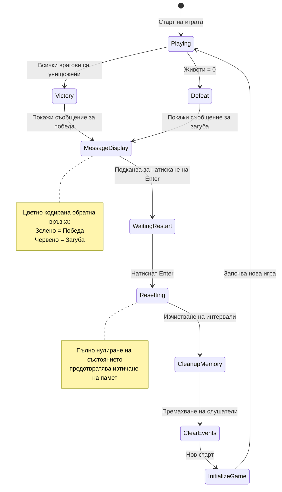
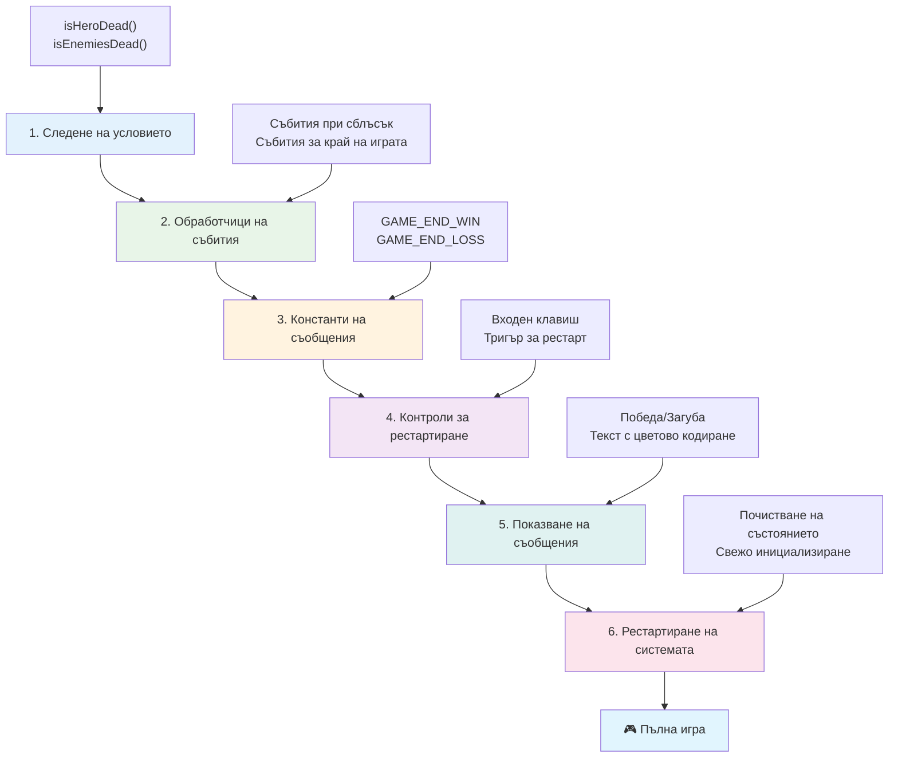
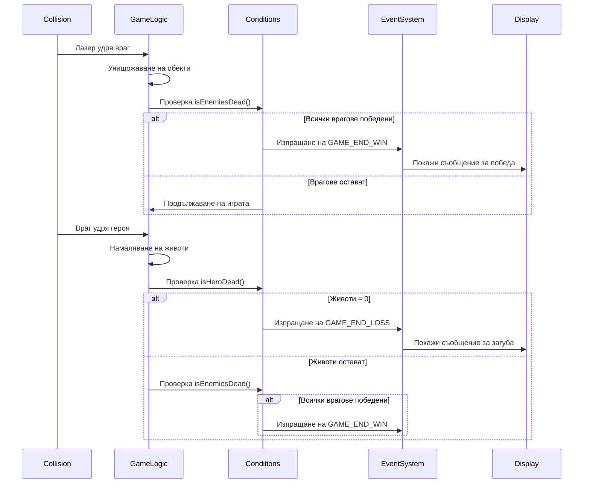
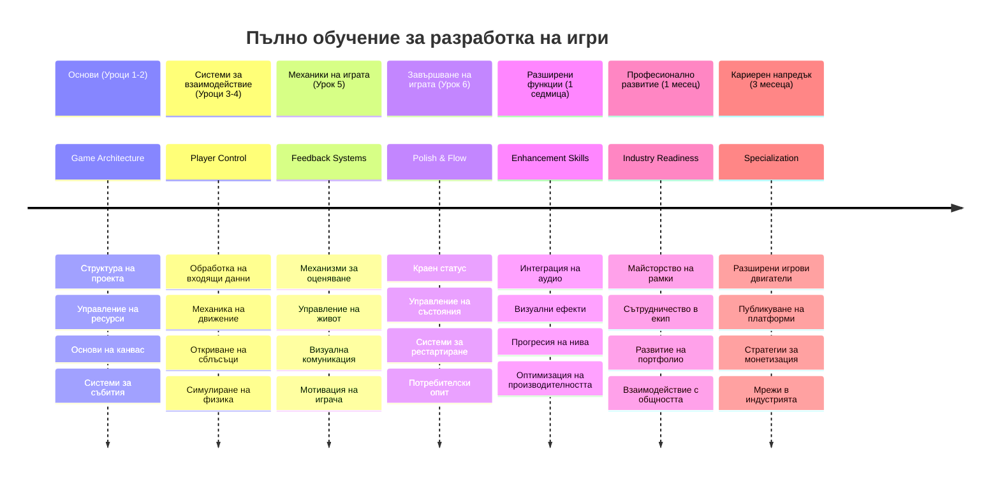

<!--
CO_OP_TRANSLATOR_METADATA:
{
  "original_hash": "a4b78043f4d64bf3ee24e0689b8b391d",
  "translation_date": "2026-01-07T06:48:51+00:00",
  "source_file": "6-space-game/6-end-condition/README.md",
  "language_code": "bg"
}
-->
# Създаване на космическа игра Част 6: Край и рестарт


Всяка страхотна игра се нуждае от ясни условия за край и гладък механизъм за рестартиране. Вие създадохте впечатляваща космическа игра с движение, бой и точки - сега е време да добавите последните елементи, които я правят завършена.

Вашата игра в момента работи безкрайно, като сондажите Voyager, които НАСА пусна през 1977 г. - все още пътуващи в космоса десетилетия по-късно. Докато това е добре за космически изследвания, игрите се нуждаят от дефинирани крайни точки, за да създадат удовлетворяващи преживявания.

Днес ще имплементираме правилни условия за победа/загуба и система за рестартиране. В края на този урок ще имате полирана игра, която играчите могат да завършат и да играят отново, точно като класическите аркадни игри, които определиха жанра.


## Куиз преди лекцията

[Куиз преди лекцията](https://ff-quizzes.netlify.app/web/quiz/39)

## Разбиране на условията за край на играта

Кога трябва да свърши играта ви? Този основен въпрос определя дизайна на игрите още от ранната аркадна ера. Pac-Man свършва, когато бъдете хванати от призраци или изчистите всички точки, докато Space Invaders свършва, когато извънземните достигнат дъното или бъдат унищожени всички.

Като създател на играта, вие определяте условията за победа и загуба. За нашата космическа игра ето доказани подходи, които създават завладяващ геймплей:


- **Унищожени са `N` вражески кораба**: Често се случва при разделяне на играта на нива да трябва да унищожите `N` вражески кораба, за да завършите едно ниво
- **Вашият кораб е унищожен**: Определено има игри, при които губите, ако корабът ви бъде унищожен. Друг често срещан подход е понятието за животи. Всеки път, когато корабът ви бъде унищожен, се губи един живот. След като всички животи са изчерпани, губите играта.
- **Събрани са `N` точки**: Друго често условие за край е събирането на точки. Как събирате точки зависи от вас, но обичайно точките се връзват с различни дейности като унищожаване на вражески кораб или събиране на предмети, които *падат* при унищожаване.
- **Завършване на ниво**: Това може да включва няколко условия като унищожаване на `X` вражески кораба, събиране на `Y` точки или пък събиране на конкретен артикул.

## Имплементиране на функция за рестарт на играта

Добре направените игри насърчават възможността за многократно играене чрез гладки механизми за рестартиране. Когато играчите завършат играта (или загубят), те често искат да опитат отново веднага — за да подобрят резултата си или изпълнението.


Tetris е отличен пример: когато блоковете достигнат върха, може веднага да започнете нова игра без да навигирате през сложни менюта. Ние ще създадем подобна система за рестарт, която изчиства състоянието на играта и връща играчите бързо в действие.

✅ **Рефлексия**: Помислете за игрите, които сте играли. При какви условия свършват и как ви подканват да рестартирате? Какво прави преживяването при рестарт гладко или разочароващо?

## Какво ще създадете

Ще имплементирате последните функции, които превръщат проекта ви в завършено игрово преживяване. Тези елементи отличават полирани игри от базови прототипи.

**Ето какво добавяме днес:**

1. **Условие за победа**: Унищожете всички врагове и получете подобаващо отбелязване (вие го заслужихте!)
2. **Условие за загуба**: Изчерпайте всички животи и се сбогувайте с екран за загуба
3. **Механизъм за рестартиране**: Натиснете Enter, за да влезете отново - защото една игра никога не е достатъчна
4. **Управление на състоянието**: Винаги чисто - няма останали врагове или странни бъгове от предишната игра

## Започваме

Нека подготвим вашата среда за разработка. Трябва да имате всички файлове на космическата си игра от предишните уроци.

**Вашият проект трябва да изглежда приблизително така:**

```bash
-| assets
  -| enemyShip.png
  -| player.png
  -| laserRed.png
  -| life.png
-| index.html
-| app.js
-| package.json
```

**Стартирайте вашия сървър за разработка:**

```bash
cd your-work
npm start
```

**Тази команда:**
- Стартира локален сървър на `http://localhost:5000`
- Сервира вашите файлове правилно
- Автоматично обновява страницата при направени промени

Отворете `http://localhost:5000` в браузъра и уверете се, че играта работи. Трябва да може да се движите, стреляте и взаимодействате с враговете. След като потвърдите, можем да продължим с имплементацията.

> 💡 **Полезен съвет**: За да избегнете предупреждения във Visual Studio Code, декларирайте `gameLoopId` в началото на файла като `let gameLoopId;` вместо да го обявявате във функцията `window.onload`. Това следва добрите практики за деклариране на променливи в съвременния JavaScript.


## Стъпки за имплементация

### Стъпка 1: Създаване на функции за следене на крайни условия

Имаме нужда от функции, които да следят кога играта трябва да свърши. Както сензори на Международната космическа станция постоянно наблюдават критични системи, тези функции непрекъснато ще проверяват състоянието на играта.

```javascript
function isHeroDead() {
  return hero.life <= 0;
}

function isEnemiesDead() {
  const enemies = gameObjects.filter((go) => go.type === "Enemy" && !go.dead);
  return enemies.length === 0;
}
```

**Ето какво се случва под капака:**
- **Проверява** дали нашият герой е без животи (айде!)
- **Брои** колко врагове са още живи и активни
- **Връща** `true`, когато бойното поле е чисто от врагове
- **Използва** проста логика true/false за по-лесен контрол
- **Филтрира** всички обекти в играта, за да намери оцелелите

### Стъпка 2: Актуализиране на обработващите събития според крайни условия

Сега ще свържем тези проверки с системата за събития на играта. Всеки път, когато настъпи сблъсък, играта ще преценява дали това предизвиква крайно условие. Това създава мигновена обратна връзка при критични моменти.


```javascript
eventEmitter.on(Messages.COLLISION_ENEMY_LASER, (_, { first, second }) => {
    first.dead = true;
    second.dead = true;
    hero.incrementPoints();

    if (isEnemiesDead()) {
      eventEmitter.emit(Messages.GAME_END_WIN);
    }
});

eventEmitter.on(Messages.COLLISION_ENEMY_HERO, (_, { enemy }) => {
    enemy.dead = true;
    hero.decrementLife();
    if (isHeroDead())  {
      eventEmitter.emit(Messages.GAME_END_LOSS);
      return; // загуба преди победата
    }
    if (isEnemiesDead()) {
      eventEmitter.emit(Messages.GAME_END_WIN);
    }
});

eventEmitter.on(Messages.GAME_END_WIN, () => {
    endGame(true);
});
  
eventEmitter.on(Messages.GAME_END_LOSS, () => {
  endGame(false);
});
```

**Какво става тук:**
- **Лъчът удря враг**: И двамата изчезват, вие получавате точки и проверяваме дали сте спечелили
- **Враг удря вас**: Губите живот и проверяваме дали все още сте жив
- **Умно подреждане**: Най-напред проверяваме загуба (никой не иска да печели и губи едновременно!)
- **Мигновена реакция**: Веднага щом нещо важно се случи, играта го знае

### Стъпка 3: Добавяне на нови константи за съобщения

Ще трябва да добавите нови типове съобщения към константния обект `Messages`. Тези константи помагат да се поддържа консистентност и да се избягват грешки при писане в системата за събития.

```javascript
GAME_END_LOSS: "GAME_END_LOSS",
GAME_END_WIN: "GAME_END_WIN",
```

**В горното добавихме:**
- **Константи** за крайни събития в играта за поддържане на последователност
- **Описателни имена**, които ясно показват целта на събитието
- **Следвахме** съществуващата конвенция за именуване на типове съобщения

### Стъпка 4: Имплементиране на контролите за рестарт

Сега ще добавите клавиатурни контроли, позволяващи на играчите да рестартират играта. Клавиш Enter е естествен избор, тъй като е широко свързан с потвърждаване на действия и започване на нови игри.

**Добавете разпознаване на клавиша Enter към съществуващия слушател за `keydown`:**

```javascript
else if(evt.key === "Enter") {
   eventEmitter.emit(Messages.KEY_EVENT_ENTER);
}
```

**Добавете новата константа за съобщение:**

```javascript
KEY_EVENT_ENTER: "KEY_EVENT_ENTER",
```

**Това, което трябва да знаете:**
- **Разширява** съществуващата система за обработка на клавиатурни събития
- **Използва** клавиша Enter като активатор за рестарт за интуитивно преживяване
- **Изпраща** персонализирано събитие, което други части от играта могат да слушат
- **Поддържа** същия модел като другите клавиатурни контроли

### Стъпка 5: Създаване на система за показване на съобщения

Играта ви трябва ясно да комуникира резултатите на играча. Ще създадем система за съобщения, която показва състоянията за победа и загуба с цветен текст, подобно на терминалните интерфейси на ранните компютърни системи, където зелено означава успех, а червено предупреждение.

**Създайте функцията `displayMessage()`:**

```javascript
function displayMessage(message, color = "red") {
  ctx.font = "30px Arial";
  ctx.fillStyle = color;
  ctx.textAlign = "center";
  ctx.fillText(message, canvas.width / 2, canvas.height / 2);
}
```

**Стъпка по стъпка, ето какво се случва:**
- **Настройва** размер на шрифта и семейство за ясен и четим текст
- **Прилага** параметър за цвят с "червено" по подразбиране за предупреждения
- **Центрира** текста по хоризонтала и вертикала на канваса
- **Използва** съвременни параметри по подразбиране в JavaScript за гъвкавост
- **Употребява** 2D контекста на канваса за директно рендиране на текста

**Създайте функцията `endGame()`:**

```javascript
function endGame(win) {
  clearInterval(gameLoopId);

  // Задайте забавяне, за да се уверите, че всички чакащи рендери са завършени
  setTimeout(() => {
    ctx.clearRect(0, 0, canvas.width, canvas.height);
    ctx.fillStyle = "black";
    ctx.fillRect(0, 0, canvas.width, canvas.height);
    if (win) {
      displayMessage(
        "Victory!!! Pew Pew... - Press [Enter] to start a new game Captain Pew Pew",
        "green"
      );
    } else {
      displayMessage(
        "You died !!! Press [Enter] to start a new game Captain Pew Pew"
      );
    }
  }, 200)  
}
```

**Какво прави тази функция:**
- **Замразява** всичко - няма повече движение на кораби или лазери
- **Прави** кратка пауза (200 ms), за да завърши последният кадър
- **Изчиства** екрана и го боядисва в черно за драматичен ефект
- **Показва** различни съобщения за победители и загубили
- **Кодира цвета** - зелено за добро, червено за... не толкова добро
- **Казва** на играчите как да рестартират

### 🔄 **Образователна проверка**
**Управление на състоянието на играта**: Преди да имплементирате функционалността за рестарт, уверете се, че разбирате:
- ✅ Как крайните условия създават ясни цели за геймплея
- ✅ Защо визуалната обратна връзка е съществена за разбирането на играча
- ✅ Важността на правилното почистване за предотвратяване на изтичане на памет
- ✅ Как архитектурата, базирана на събития, позволява чисти преходи в състоянието

**Бърз самотест**: Какво би се случило, ако не изчистите слушателите на събития при рестарт?
*Отговор: Изтичане на памет и дублирани обработващи, които причиняват непредвидимо поведение*

**Принципи на гейм дизайна**: Вие сега внедрявате:
- **Ясни цели**: Играчите знаят точно какво означава успех и провал
- **Мигновена обратна връзка**: Промяната в състоянието е комуникирана веднага
- **Контрол от страна на потребителя**: Играчите могат да рестартират, когато решат
- **Надеждност на системата**: Правилното почистване предотвратява бъгове и проблеми с производителността

### Стъпка 6: Имплементиране на функционалност за рестарт

Системата за рестарт трябва напълно да изчисти текущото състояние на играта и да инициализира нова сесия. Това гарантира, че играчите започват отначало без остатъчни данни от предишната игра.

**Създайте функцията `resetGame()`:**

```javascript
function resetGame() {
  if (gameLoopId) {
    clearInterval(gameLoopId);
    eventEmitter.clear();
    initGame();
    gameLoopId = setInterval(() => {
      ctx.clearRect(0, 0, canvas.width, canvas.height);
      ctx.fillStyle = "black";
      ctx.fillRect(0, 0, canvas.width, canvas.height);
      drawPoints();
      drawLife();
      updateGameObjects();
      drawGameObjects(ctx);
    }, 100);
  }
}
```

**Нека разберем всяка част:**
- **Проверява** дали в момента работи игрови цикъл преди рестарт
- **Изчиства** съществуващия цикъл, за да спре текущата игра
- **Премахва** всички слушатели на събития за предотвратяване на изтичане на памет
- **Инициализира** ново състояние на играта с пресни обекти и променливи
- **Стартира** нов игрови цикъл с всички основни функции
- **Поддържа** същия интервал от 100 ms за стабилна производителност

**Добавете обработчик за клавиша Enter във функцията `initGame()`:**

```javascript
eventEmitter.on(Messages.KEY_EVENT_ENTER, () => {
  resetGame();
});
```

**Добавете метода `clear()` към класа EventEmitter:**

```javascript
clear() {
  this.listeners = {};
}
```

**Основни моменти за запомняне:**
- **Свързва** натискането на Enter с функцията за рестарт на играта
- **Регистрира** слушателя по време на инициализация на играта
- **Предоставя** чист начин за премахване на всички слушатели при рестарт
- **Предотвратява** изтичане на памет чрез изчистване на обработващите събития между игрите
- **Рестартира** обекта с слушатели до празно състояние за ново начало

## Поздравления! 🎉

👽 💥 🚀 Вие успешно създадохте цяла игра от основата до край. Подобно на програмистите, създали първите видео игри през 70-те, превърнахте редове код в интерактивно преживяване със задължителна гейм механика и обратна връзка към потребителя. 🚀 💥 👽

**Постигнахте:**
- **Имплементирахте** пълни условия за победа и загуба с обратна връзка към играча
- **Създадохте** безпроблемна система за рестарт за непрекъснат геймплей
- **Дизайнирахте** ясна визуална комуникация за състоянията на играта
- **Управлявахте** сложни преходи на състоянието и почистването му
- **Събрахте** всички компоненти в една цялостна, играбилна игра

### 🔄 **Образователна проверка**
**Пълна система за разработка на игри**: Поздравете се за овладяването на целия цикъл на разработка:
- ✅ Как крайните условия създават удовлетворяващи преживявания за играчите?
- ✅ Защо правилното управление на състоянието е критично за стабилността на играта?
- ✅ Как визуалната обратна връзка подобрява разбирането на играча?
- ✅ Каква роля играе системата за рестарт в задържането на играчите?

**Майсторство на системата**: Вашата пълна игра демонстрира:
- **Разработка на игри с пълна технология**: От графики и входове до управление на състоянието
- **Професионална архитектура**: Система, базирана на събития със съответното почистване
- **Дизайн на потребителско изживяване**: Ясна обратна връзка и интуитивно управление
- **Оптимизация на производителността**: Ефикасно рендиране и управление на паметта
- **Полиране и завършеност**: Всички детайли, които правят играта да изглежда готова

**Умения за индустрията**: Вие имплементирахте:
- **Архитектура на игров цикъл**: Системи в реално време с постоянна производителност
- **Програмиране, базирано на събития**: Свързани системи с лесно разширение
- **Управление на състоянието**: Обработка на сложни данни и жизнен цикъл
- **Дизайн на интерфейс**: Ясна комуникация и отзивчиви контроли
- **Тестване и отстраняване на грешки**: Итеративна разработка и решаване на проблеми

### ⚡ **Какво можете да направите през следващите 5 минути**
- [ ] Играйте вашата завършена игра и тествайте всички условия за победа и загуба
- [ ] Експериментирайте с различни параметри на крайните условия
- [ ] Опитайте да добавите console.log изказвания за проследяване на състоянието на играта
- [ ] Споделете играта с приятели и съберете обратна връзка

### 🎯 **Какво можете да постигнете този час**
- [ ] Завършете куиза след урока и размишлявайте върху пътя си в разработката на игри
- [ ] Добавете звукови ефекти за състояния победа и загуба
- [ ] Имплементирайте допълнителни крайни условия като времеви ограничения или бонус цели
- [ ] Създайте различни нива на трудност с променлив брой врагове
- [ ] Полирайте визуалната презентация с по-добри шрифтове и цветове

### 📅 **Вашето седмично овладяване на разработка на игри**
- [ ] Завършете подобрената космическа игра с множество нива и прогресия
- [ ] Добавете разширени функции като усилватели, различни видове врагове и специално оръжие
- [ ] Създайте система за високи резултати с постоянно съхранение
- [ ] Дизайнирайте потребителски интерфейси за менюта, настройки и опции на играта
- [ ] Оптимизирайте производителността за различни устройства и браузъри
- [ ] Публикувайте играта онлайн и я споделете с общността
### 🌟 **Вашата месечна кариера в разработката на игри**
- [ ] Създайте няколко пълни игри, изследвайки различни жанрове и механики
- [ ] Научете се на усъвършенствани рамки за разработка на игри като Phaser или Three.js
- [ ] Допринасяйте за отворени проекти за разработка на игри
- [ ] Изучавайте принципите на гейм дизайна и психологията на играчите
- [ ] Създайте портфолио, което показва вашите умения в разработката на игри
- [ ] Свържете се с общността на разработчиците на игри и продължавайте да учите

## 🎯 Вашата пълна времева линия за овладяване на разработката на игри


### 🛠️ Обобщение на пълния ви набор от инструменти за разработка на игри

След като завършихте целия този космически игрови сериал, вече сте овладяли:
- **Архитектура на игрите**: Системи, базирани на събития, игрови цикли и управление на състояния
- **Графично програмиране**: Canvas API, рендиране на спрайтове и визуални ефекти
- **Системи за въвеждане**: Обработка на клавиатура, откриване на сблъсъци и отзивчиви контроли
- **Гейм дизайн**: Обратна връзка от играчите, системи за прогресия и механики за ангажиране
- **Оптимизация на производителността**: Ефективно рендиране, управление на паметта и контрол на кадрите в секунда
- **Потребителски опит**: Ясна комуникация, интуитивни контроли и детайли на полиране
- **Професионални модели**: Чист код, техники за отстраняване на грешки и организиране на проекти

**Приложения в реалния свят**: Вашите умения за разработка на игри се прилагат директно към:
- **Интерактивни уеб приложения**: Динамични интерфейси и системи в реално време
- **Визуализация на данни**: Анимирани графики и интерактивни визуализации
- **Образователни технологии**: Геймификация и ангажиращи учебни преживявания
- **Мобилна разработка**: Взаимодействия на базата на докосване и оптимизация на производителността
- **Симулативен софтуер**: Физически енджини и моделиране в реално време
- **Креативни индустрии**: Интерактивно изкуство, забавление и дигитални преживявания

**Професионални умения, придобити**: Сега можете да:
- **Архитектиране** на сложни интерактивни системи от нулата
- **Отстраняване на грешки** в приложения в реално време чрез систематични подходи
- **Оптимизиране** на производителността за плавно потребителско преживяване
- **Дизайн** на ангажиращи потребителски интерфейси и модели на взаимодействие
- **Сътрудничество** ефективно по технически проекти с правилна организация на кода

**Овладени концепции в разработката на игри**:
- **Системи в реално време**: Игрови цикли, управление на кадрите и производителност
- **Архитектура, базирана на събития**: Отделени системи и предаване на съобщения
- **Управление на състоянията**: Сложно обработване на данни и управление на жизнения цикъл
- **Програмиране на потребителския интерфейс**: Canvas графики и адаптивен дизайн
- **Теория на гейм дизайна**: Психология на играча и механики на ангажиране

**Следващо ниво**: Готови сте да изследвате усъвършенствани рамки за игри, 3D графики, мултиплейър системи или да преминете към професионална разработка на игри!

🌟 **Постижение отключено**: Завършихте пълно игрово пътешествие и създадохте професионално интерактивно преживяване от нулата!

**Добре дошли в общността на разработчиците на игри!** 🎮✨

## Предизвикателство за GitHub Copilot Agent 🚀

Използвайте режим Agent, за да изпълните следното предизвикателство:

**Описание:** Подобрете космическата игра, като въведете система за прогресия на нива с нарастваща трудност и бонус функции.

**Тема:** Създайте система за космическа игра с няколко нива, където всяко ниво има повече вражески кораби с увеличена скорост и здравина. Добавете множител на точките, който се увеличава с всяко ниво, и имплементирайте бонуси (като бърз огън или щит), които се появяват случайно при унищожаване на врагове. Включете бонус за завършване на ниво и показвайте текущото ниво на екрана заедно със съществуващия резултат и животи.

Научете повече за [agent mode](https://code.visualstudio.com/blogs/2025/02/24/introducing-copilot-agent-mode) тук.

## 🚀 Допълнително предизвикателство за подобрение

**Добавете звук към играта си**: Подобрете геймплея, като добавите звукови ефекти! Помислете за добавяне на аудио за:

- **Лазерни изстрели**, когато играчът стреля
- **Унищожаване на враг** при удари по кораби
- **Щети на героя**, когато играчът получава удари
- **Музика за победа**, когато играта е спечелена
- **Звук за загуба**, когато играта е загубена

**Пример за реализиране на аудио:**

```javascript
// Създаване на аудио обекти
const laserSound = new Audio('assets/laser.wav');
const explosionSound = new Audio('assets/explosion.wav');

// Възпроизвеждане на звуци по време на игрови събития
function playLaserSound() {
  laserSound.currentTime = 0; // Рестартиране в началото
  laserSound.play();
}
```

**Какво трябва да знаете:**
- **Създава** Audio обекти за различни звукови ефекти
- **Ресетва** `currentTime`, за да позволи бързи повторни звуци
- **Управлява** политики за автоматично пускане на звуци чрез задействане от потребителски действия
- **Контролира** звука и времето за по-добро игрово преживяване

> 💡 **Учебен ресурс**: Разгледайте този [audio sandbox](https://www.w3schools.com/jsref/tryit.asp?filename=tryjsref_audio_play), за да научите повече за имплементирането на аудио в JavaScript игри.

## Куиз след лекцията

[Куиз след лекцията](https://ff-quizzes.netlify.app/web/quiz/40)

## Преглед и самостоятелно обучение

Вашата задача е да създадете нова примерна игра, така че разгледайте някои от интересните игри, налични там, за да видите какъв тип игра бихте могли да направите.

## Задание

[Създайте примерна игра](assignment.md)

---

<!-- CO-OP TRANSLATOR DISCLAIMER START -->
**Отказ от отговорност**:
Този документ е преведен с помощта на AI преводаческа услуга [Co-op Translator](https://github.com/Azure/co-op-translator). Въпреки че се стремим към точност, моля, имайте предвид, че автоматичните преводи могат да съдържат грешки или неточности. Оригиналният документ на неговия оригинален език трябва да се счита за авторитетен източник. За критична информация се препоръчва професионален човешки превод. Не носим отговорност за каквито и да е недоразумения или неправилни тълкувания, произтичащи от използването на този превод.
<!-- CO-OP TRANSLATOR DISCLAIMER END -->