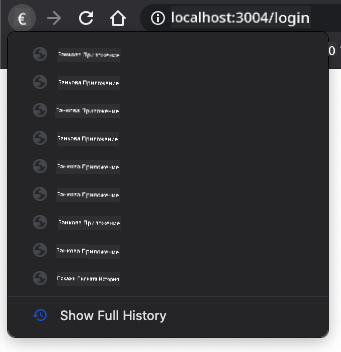

<!--
CO_OP_TRANSLATOR_METADATA:
{
  "original_hash": "8da1b5e2c63f749808858c53f37b8ce7",
  "translation_date": "2025-08-28T07:40:00+00:00",
  "source_file": "7-bank-project/1-template-route/README.md",
  "language_code": "bg"
}
-->
# Създаване на Банкова Приложение Част 1: HTML Шаблони и Роутове в Уеб Приложение

## Предварителен Тест

[Предварителен тест](https://ff-quizzes.netlify.app/web/quiz/41)

### Въведение

С появата на JavaScript в браузърите, уебсайтовете стават все по-интерактивни и сложни. Уеб технологиите вече често се използват за създаване на напълно функционални приложения, които работят директно в браузъра и които наричаме [уеб приложения](https://en.wikipedia.org/wiki/Web_application). Тъй като уеб приложенията са силно интерактивни, потребителите не искат да чакат пълно презареждане на страницата всеки път, когато се извършва действие. Затова JavaScript се използва за директно обновяване на HTML чрез DOM, за да се осигури по-гладко потребителско изживяване.

В този урок ще положим основите за създаване на банково уеб приложение, използвайки HTML шаблони за създаване на множество екрани, които могат да се показват и обновяват без необходимост от презареждане на цялата HTML страница.

### Предварителни изисквания

Ще ви е необходим локален уеб сървър, за да тествате уеб приложението, което ще създадем в този урок. Ако нямате такъв, можете да инсталирате [Node.js](https://nodejs.org) и да използвате командата `npx lite-server` от папката на вашия проект. Това ще създаде локален уеб сървър и ще отвори приложението ви в браузър.

### Подготовка

На вашия компютър създайте папка с име `bank` и файл с име `index.html` вътре в нея. Ще започнем с този HTML [шаблон](https://en.wikipedia.org/wiki/Boilerplate_code):

```html
<!DOCTYPE html>
<html lang="en">
  <head>
    <meta charset="UTF-8">
    <meta name="viewport" content="width=device-width, initial-scale=1.0">
    <title>Bank App</title>
  </head>
  <body>
    <!-- This is where you'll work -->
  </body>
</html>
```

---

## HTML шаблони

Ако искате да създадете множество екрани за уеб страница, едно решение би било да създадете отделен HTML файл за всеки екран, който искате да покажете. Въпреки това, това решение има някои неудобства:

- Трябва да презареждате целия HTML при смяна на екрана, което може да е бавно.
- Трудно е да се споделят данни между различните екрани.

Друг подход е да имате само един HTML файл и да дефинирате множество [HTML шаблони](https://developer.mozilla.org/docs/Web/HTML/Element/template), използвайки елемента `<template>`. Шаблонът е многократно използваем HTML блок, който не се показва от браузъра и трябва да бъде инстанциран по време на изпълнение с помощта на JavaScript.

### Задача

Ще създадем банково приложение с два екрана: страницата за вход и таблото за управление. Първо, нека добавим в тялото на HTML елемент за запазване на място, който ще използваме за инстанциране на различните екрани на нашето приложение:

```html
<div id="app">Loading...</div>
```

Даваме му `id`, за да го намираме по-лесно с JavaScript по-късно.

> Съвет: тъй като съдържанието на този елемент ще бъде заменено, можем да поставим съобщение за зареждане или индикатор, който ще се показва, докато приложението се зарежда.

След това нека добавим HTML шаблон за страницата за вход. Засега ще поставим само заглавие и секция, съдържаща връзка, която ще използваме за навигация.

```html
<template id="login">
  <h1>Bank App</h1>
  <section>
    <a href="/dashboard">Login</a>
  </section>
</template>
```

След това ще добавим друг HTML шаблон за страницата на таблото за управление. Тази страница ще съдържа различни секции:

- Заглавна част със заглавие и връзка за изход
- Текущото салдо на банковата сметка
- Списък с транзакции, показан в таблица

```html
<template id="dashboard">
  <header>
    <h1>Bank App</h1>
    <a href="/login">Logout</a>
  </header>
  <section>
    Balance: 100$
  </section>
  <section>
    <h2>Transactions</h2>
    <table>
      <thead>
        <tr>
          <th>Date</th>
          <th>Object</th>
          <th>Amount</th>
        </tr>
      </thead>
      <tbody></tbody>
    </table>
  </section>
</template>
```

> Съвет: когато създавате HTML шаблони, ако искате да видите как ще изглеждат, можете да коментирате линиите `<template>` и `</template>`, като ги обградите с `<!-- -->`.

✅ Защо мислите, че използваме атрибути `id` за шаблоните? Можем ли да използваме нещо друго, като например класове?

## Показване на шаблони с JavaScript

Ако опитате текущия HTML файл в браузър, ще видите, че той остава на екрана с надпис „Зареждане...“. Това е така, защото трябва да добавим JavaScript код, за да инстанцираме и покажем HTML шаблоните.

Инстанцирането на шаблон обикновено се извършва в 3 стъпки:

1. Извличане на елемента шаблон в DOM, например с [`document.getElementById`](https://developer.mozilla.org/docs/Web/API/Document/getElementById).
2. Клониране на елемента шаблон, използвайки [`cloneNode`](https://developer.mozilla.org/docs/Web/API/Node/cloneNode).
3. Прикачване към DOM под видим елемент, например с [`appendChild`](https://developer.mozilla.org/docs/Web/API/Node/appendChild).

✅ Защо трябва да клонираме шаблона, преди да го прикачим към DOM? Какво мислите, че ще се случи, ако пропуснем тази стъпка?

### Задача

Създайте нов файл с име `app.js` в папката на вашия проект и го импортирайте в секцията `<head>` на вашия HTML:

```html
<script src="app.js" defer></script>
```

Сега в `app.js` ще създадем нова функция `updateRoute`:

```js
function updateRoute(templateId) {
  const template = document.getElementById(templateId);
  const view = template.content.cloneNode(true);
  const app = document.getElementById('app');
  app.innerHTML = '';
  app.appendChild(view);
}
```

Това, което правим тук, са точно описаните по-горе 3 стъпки. Инстанцираме шаблона с `id` `templateId` и поставяме клонираното му съдържание в нашия елемент за запазване на място. Забележете, че трябва да използваме `cloneNode(true)`, за да копираме цялото поддърво на шаблона.

Сега извикайте тази функция с един от шаблоните и вижте резултата.

```js
updateRoute('login');
```

✅ Каква е целта на този код `app.innerHTML = '';`? Какво се случва без него?

## Създаване на роутове

Когато говорим за уеб приложение, наричаме *роутинг* намерението да се свържат **URL адреси** със специфични екрани, които трябва да бъдат показани. На уебсайт с множество HTML файлове това се прави автоматично, тъй като пътищата на файловете се отразяват в URL адреса. Например, с тези файлове във вашата проектна папка:

```
mywebsite/index.html
mywebsite/login.html
mywebsite/admin/index.html
```

Ако създадете уеб сървър с `mywebsite` като корен, картографирането на URL адресите ще бъде:

```
https://site.com            --> mywebsite/index.html
https://site.com/login.html --> mywebsite/login.html
https://site.com/admin/     --> mywebsite/admin/index.html
```

Въпреки това, за нашето уеб приложение използваме един HTML файл, съдържащ всички екрани, така че това поведение по подразбиране няма да ни помогне. Трябва да създадем тази карта ръчно и да актуализираме показания шаблон с помощта на JavaScript.

### Задача

Ще използваме прост обект, за да имплементираме [карта](https://en.wikipedia.org/wiki/Associative_array) между пътищата на URL адресите и нашите шаблони. Добавете този обект в началото на вашия `app.js` файл.

```js
const routes = {
  '/login': { templateId: 'login' },
  '/dashboard': { templateId: 'dashboard' },
};
```

Сега нека модифицираме малко функцията `updateRoute`. Вместо директно да подаваме `templateId` като аргумент, искаме първо да извлечем текущия URL адрес и след това да използваме нашата карта, за да получим съответстващата стойност на `templateId`. Можем да използваме [`window.location.pathname`](https://developer.mozilla.org/docs/Web/API/Location/pathname), за да получим само частта от пътя на URL адреса.

```js
function updateRoute() {
  const path = window.location.pathname;
  const route = routes[path];

  const template = document.getElementById(route.templateId);
  const view = template.content.cloneNode(true);
  const app = document.getElementById('app');
  app.innerHTML = '';
  app.appendChild(view);
}
```

Тук картографирахме декларираните от нас роутове към съответстващия шаблон. Можете да проверите дали работи правилно, като промените URL адреса ръчно в браузъра си.

✅ Какво се случва, ако въведете неизвестен път в URL адреса? Как бихме могли да решим този проблем?

## Добавяне на навигация

Следващата стъпка за нашето приложение е да добавим възможност за навигация между страниците, без да се налага ръчно да променяме URL адреса. Това включва две неща:

1. Актуализиране на текущия URL адрес
2. Актуализиране на показания шаблон въз основа на новия URL адрес

Вече се погрижихме за втората част с функцията `updateRoute`, така че трябва да разберем как да актуализираме текущия URL адрес.

Ще трябва да използваме JavaScript и по-специално [`history.pushState`](https://developer.mozilla.org/docs/Web/API/History/pushState), който позволява актуализиране на URL адреса и създаване на нов запис в историята на браузъра, без да се презарежда HTML.

> Забележка: Докато HTML елементът за връзка [`<a href>`](https://developer.mozilla.org/docs/Web/HTML/Element/a) може да се използва самостоятелно за създаване на хипервръзки към различни URL адреси, той ще накара браузъра да презареди HTML по подразбиране. Необходимо е да се предотврати това поведение, когато се обработва роутинг с персонализиран JavaScript, като се използва функцията `preventDefault()` върху събитието за кликване.

### Задача

Нека създадем нова функция, която можем да използваме за навигация в нашето приложение:

```js
function navigate(path) {
  window.history.pushState({}, path, path);
  updateRoute();
}
```

Този метод първо актуализира текущия URL адрес въз основа на дадения път, след което актуализира шаблона. Свойството `window.location.origin` връща корена на URL адреса, което ни позволява да реконструираме пълен URL адрес от даден път.

Сега, когато имаме тази функция, можем да се погрижим за проблема, който имаме, ако даден път не съвпада с някой от дефинираните роутове. Ще модифицираме функцията `updateRoute`, като добавим резервен вариант към един от съществуващите роутове, ако не можем да намерим съвпадение.

```js
function updateRoute() {
  const path = window.location.pathname;
  const route = routes[path];

  if (!route) {
    return navigate('/login');
  }

  ...
```

Ако не може да се намери роут, сега ще пренасочваме към страницата за вход.

Сега нека създадем функция, която да получава URL адреса, когато се кликне върху връзка, и да предотвратява стандартното поведение на браузъра за връзки:

```js
function onLinkClick(event) {
  event.preventDefault();
  navigate(event.target.href);
}
```

Нека завършим системата за навигация, като добавим връзки към нашите бутони за *Вход* и *Изход* в HTML.

```html
<a href="/dashboard" onclick="onLinkClick(event)">Login</a>
...
<a href="/login" onclick="onLinkClick(event)">Logout</a>
```

Обектът `event` по-горе улавя събитието `click` и го предава на нашата функция `onLinkClick`.

Използвайки атрибута [`onclick`](https://developer.mozilla.org/docs/Web/API/GlobalEventHandlers/onclick), свържете събитието `click` с JavaScript код, тук извикването на функцията `navigate()`.

Опитайте да кликнете върху тези връзки, сега трябва да можете да навигирате между различните екрани на вашето приложение.

✅ Методът `history.pushState` е част от стандарта HTML5 и е имплементиран във [всички модерни браузъри](https://caniuse.com/?search=pushState). Ако създавате уеб приложение за по-стари браузъри, има трик, който можете да използвате вместо този API: използвайки [хаш (`#`)](https://en.wikipedia.org/wiki/URI_fragment) преди пътя, можете да имплементирате роутинг, който работи с обикновена навигация чрез връзки и не презарежда страницата, тъй като целта му е да създава вътрешни връзки в рамките на страница.

## Обработка на бутоните за връщане и напред на браузъра

Използването на `history.pushState` създава нови записи в историята на навигацията на браузъра. Можете да проверите това, като задържите *бутона за връщане* на браузъра, трябва да се покаже нещо подобно:



Ако опитате да кликнете върху бутона за връщане няколко пъти, ще видите, че текущият URL адрес се променя и историята се актуализира, но същият шаблон продължава да се показва.

Това е така, защото приложението не знае, че трябва да извика `updateRoute()` всеки път, когато историята се промени. Ако погледнете документацията за [`history.pushState`](https://developer.mozilla.org/docs/Web/API/History/pushState), ще видите, че ако състоянието се промени - което означава, че сме преминали към различен URL адрес - се задейства събитието [`popstate`](https://developer.mozilla.org/docs/Web/API/Window/popstate_event). Ще използваме това, за да решим този проблем.

### Задача

За да се уверим, че показаният шаблон се актуализира, когато историята на браузъра се промени, ще прикачим нова функция, която извиква `updateRoute()`. Ще направим това в края на нашия файл `app.js`:

```js
window.onpopstate = () => updateRoute();
updateRoute();
```

> Забележка: използвахме [arrow функция](https://developer.mozilla.org/docs/Web/JavaScript/Reference/Functions/Arrow_functions) тук, за да декларираме нашия обработчик на събития `popstate` за краткост, но обикновена функция би работила по същия начин.

Ето видео за освежаване на знанията за arrow функции:

[](https://youtube.com/watch?v=OP6eEbOj2sc "Arrow Functions")

> 🎥 Кликнете върху изображението по-горе за видео за arrow функции.

Сега опитайте да използвате бутоните за връщане и напред на вашия браузър и проверете дали показаният роут се актуализира правилно този път.

---

## 🚀 Предизвикателство

Добавете нов шаблон и роут за трета страница, която показва кредитите за това приложение.

## Финален Тест

[Финален тест](https://ff-quizzes.netlify.app/web/quiz/42)

## Преглед и Самостоятелно Обучение

Роутингът е една от изненадващо сложните части на уеб разработката, особено когато уебът преминава от поведение с презареждане на страници към поведение на Single Page Application. Прочетете малко за [как услугата Azure Static Web App](https://docs.microsoft.com/azure/static-web-apps/routes/?WT.mc_id=academic-77807-sagibbon) обработва роутинг. Можете ли да обясните защо някои от решенията, описани в този документ, са необходими?

## Задание

[Подобрете роутинга](assignment.md)

---

**Отказ от отговорност**:  
Този документ е преведен с помощта на AI услуга за превод [Co-op Translator](https://github.com/Azure/co-op-translator). Въпреки че се стремим към точност, моля, имайте предвид, че автоматичните преводи може да съдържат грешки или неточности. Оригиналният документ на неговия изходен език трябва да се счита за авторитетен източник. За критична информация се препоръчва професионален превод от човек. Ние не носим отговорност за каквито и да било недоразумения или погрешни интерпретации, произтичащи от използването на този превод.