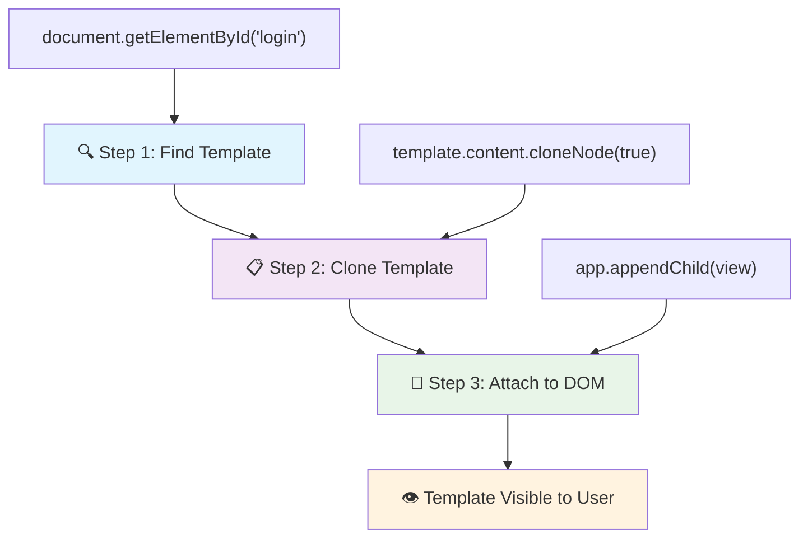
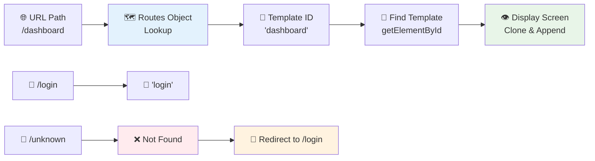
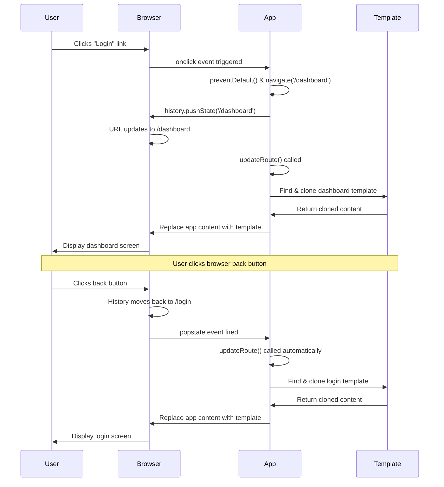

<!--
CO_OP_TRANSLATOR_METADATA:
{
  "original_hash": "5d259f6962464ad91e671083aa0398f4",
  "translation_date": "2025-10-24T22:48:21+00:00",
  "source_file": "7-bank-project/1-template-route/README.md",
  "language_code": "bg"
}
-->
# Създаване на банково приложение, част 1: HTML шаблони и маршрути в уеб приложение

Когато компютърът за управление на Apollo 11 навигираше към Луната през 1969 г., той трябваше да превключва между различни програми, без да рестартира цялата система. Съвременните уеб приложения работят по подобен начин – те променят това, което виждате, без да презареждат всичко отначало. Това създава гладко и отзивчиво изживяване, което потребителите очакват днес.

За разлика от традиционните уебсайтове, които презареждат цели страници при всяко взаимодействие, модерните уеб приложения актуализират само частите, които се нуждаят от промяна. Този подход, подобно на начина, по който контролният център превключва между различни дисплеи, като същевременно поддържа постоянна комуникация, създава плавното изживяване, което сме свикнали да очакваме.

Ето какво прави разликата толкова драматична:

| Традиционни многостранични приложения | Модерни едностранични приложения |
|---------------------------------------|----------------------------------|
| **Навигация** | Презареждане на цялата страница за всеки екран | Моментално превключване на съдържанието |
| **Производителност** | По-бавно поради изтегляне на цял HTML | По-бързо с частични актуализации |
| **Потребителско изживяване** | Рязко премигване на страниците | Плавни, подобни на приложение преходи |
| **Споделяне на данни** | Трудно между страниците | Лесно управление на състоянието |
| **Разработка** | Поддръжка на множество HTML файлове | Един HTML с динамични шаблони |

**Разбиране на еволюцията:**
- **Традиционните приложения** изискват заявки към сървъра за всяко действие на навигация
- **Модерните SPAs** се зареждат веднъж и актуализират съдържанието динамично с помощта на JavaScript
- **Очакванията на потребителите** вече предпочитат моментални, безпроблемни взаимодействия
- **Предимства в производителността** включват намалена честотна лента и по-бързи отговори

В този урок ще създадем банково приложение с множество екрани, които плавно преминават един в друг. Както учените използват модулни инструменти, които могат да бъдат преконфигурирани за различни експерименти, ние ще използваме HTML шаблони като многократно използваеми компоненти, които могат да бъдат показвани при нужда.

Ще работите с HTML шаблони (многократно използваеми чертежи за различни екрани), JavaScript маршрутизация (система, която превключва между екраните) и API за историята на браузъра (който поддържа бутона за връщане назад да работи както се очаква). Това са същите основни техники, използвани от рамки като React, Vue и Angular.

До края ще имате работещо банково приложение, което демонстрира професионални принципи на едностраничните приложения.

## Предварителен тест

[Предварителен тест](https://ff-quizzes.netlify.app/web/quiz/41)

### Какво ще ви е необходимо

Ще ни трябва локален уеб сървър, за да тестваме нашето банково приложение – не се притеснявайте, това е по-лесно, отколкото звучи! Ако все още нямате такъв, просто инсталирайте [Node.js](https://nodejs.org) и изпълнете `npx lite-server` от папката на вашия проект. Тази удобна команда стартира локален сървър и автоматично отваря вашето приложение в браузъра.

### Подготовка

На вашия компютър създайте папка с име `bank` с файл `index.html` вътре. Ще започнем с този HTML [шаблон](https://en.wikipedia.org/wiki/Boilerplate_code):

```html
<!DOCTYPE html>
<html lang="en">
  <head>
    <meta charset="UTF-8">
    <meta name="viewport" content="width=device-width, initial-scale=1.0">
    <title>Bank App</title>
  </head>
  <body>
    <!-- This is where you'll work -->
  </body>
</html>
```

**Ето какво предоставя този шаблон:**
- **Установява** структурата на HTML5 документа с правилна декларация DOCTYPE
- **Конфигурира** кодировката на символите като UTF-8 за поддръжка на международен текст
- **Активира** адаптивен дизайн с мета таг за изглед за мобилна съвместимост
- **Задава** описателно заглавие, което се появява в раздела на браузъра
- **Създава** чиста секция за тялото, където ще изградим нашето приложение

> 📁 **Преглед на структурата на проекта**
> 
> **До края на този урок вашият проект ще съдържа:**
> ```
> bank/
> ├── index.html      <!-- Main HTML with templates -->
> ├── app.js          <!-- Routing and navigation logic -->
> └── style.css       <!-- (Optional for future lessons) -->
> ```
> 
> **Отговорности на файловете:**
> - **index.html**: Съдържа всички шаблони и предоставя структурата на приложението
> - **app.js**: Управлява маршрутизацията, навигацията и управлението на шаблоните
> - **Шаблони**: Определят потребителския интерфейс за вход, табло и други екрани

---

## HTML шаблони

Шаблоните решават основен проблем в уеб разработката. Когато Гутенберг изобретил печатането с подвижни букви през 1440-те години, той осъзнал, че вместо да издълбава цели страници, може да създаде многократно използваеми блокове с букви и да ги подрежда според нуждите. HTML шаблоните работят на същия принцип – вместо да създавате отделни HTML файлове за всеки екран, дефинирате многократно използваеми структури, които могат да бъдат показвани при нужда.

Помислете за шаблоните като за чертежи на различни части от вашето приложение. Точно както архитект създава един чертеж и го използва многократно, вместо да прерисува идентични стаи, ние създаваме шаблони веднъж и ги използваме при нужда. Браузърът държи тези шаблони скрити, докато JavaScript не ги активира.

Ако искате да създадете множество екрани за уеб страница, едно решение би било да създадете един HTML файл за всеки екран, който искате да покажете. Въпреки това, това решение идва с някои неудобства:

- Трябва да презареждате целия HTML при смяна на екрана, което може да бъде бавно.
- Трудно е да споделяте данни между различните екрани.

Друг подход е да имате само един HTML файл и да дефинирате множество [HTML шаблони](https://developer.mozilla.org/docs/Web/HTML/Element/template), използвайки елемента `<template>`. Шаблонът е многократно използваем HTML блок, който не се показва от браузъра и трябва да бъде създаден по време на изпълнение с помощта на JavaScript.

### Да го изградим

Ще създадем банково приложение с два основни екрана: страница за вход и табло. Първо, нека добавим елемент за запълване към тялото на нашия HTML – това е мястото, където ще се появят всички наши различни екрани:

```html
<div id="app">Loading...</div>
```

**Разбиране на този елемент за запълване:**
- **Създава** контейнер с ID "app", където ще се показват всички екрани
- **Показва** съобщение за зареждане, докато JavaScript инициализира първия екран
- **Осигурява** един точка за монтиране на нашето динамично съдържание
- **Позволява** лесно насочване от JavaScript, използвайки `document.getElementById()`

> 💡 **Полезен съвет**: Тъй като съдържанието на този елемент ще бъде заменено, можем да поставим съобщение за зареждане или индикатор, който ще се показва, докато приложението се зарежда.

След това нека добавим HTML шаблон за страницата за вход. Засега ще поставим само заглавие и секция, съдържаща връзка, която ще използваме за навигация.

```html
<template id="login">
  <h1>Bank App</h1>
  <section>
    <a href="/dashboard">Login</a>
  </section>
</template>
```

**Разбивка на този шаблон за вход:**
- **Дефинира** шаблон с уникален идентификатор "login" за насочване от JavaScript
- **Включва** основно заглавие, което установява брандирането на приложението
- **Съдържа** семантичен елемент `<section>` за групиране на свързано съдържание
- **Осигурява** навигационна връзка, която ще насочва потребителите към таблото

След това ще добавим друг HTML шаблон за страницата на таблото. Тази страница ще съдържа различни секции:

- Заглавие със заглавие и връзка за изход
- Текущото салдо на банковата сметка
- Списък с транзакции, показан в таблица

```html
<template id="dashboard">
  <header>
    <h1>Bank App</h1>
    <a href="/login">Logout</a>
  </header>
  <section>
    Balance: 100$
  </section>
  <section>
    <h2>Transactions</h2>
    <table>
      <thead>
        <tr>
          <th>Date</th>
          <th>Object</th>
          <th>Amount</th>
        </tr>
      </thead>
      <tbody></tbody>
    </table>
  </section>
</template>
```

**Нека разберем всяка част от това табло:**
- **Структурира** страницата със семантичен елемент `<header>`, съдържащ навигация
- **Показва** заглавието на приложението последователно на всички екрани за брандиране
- **Осигурява** връзка за изход, която насочва обратно към екрана за вход
- **Показва** текущото салдо на сметката в специална секция
- **Организира** данните за транзакциите, използвайки правилно структурирана HTML таблица
- **Дефинира** заглавия на таблицата за колони Дата, Обект и Сума
- **Оставя** тялото на таблицата празно за динамично добавяне на съдържание по-късно

> 💡 **Полезен съвет**: Когато създавате HTML шаблони, ако искате да видите как ще изглеждат, можете да коментирате линиите `<template>` и `</template>`, като ги оградите с `<!-- -->`.

✅ Защо мислите, че използваме атрибути `id` върху шаблоните? Можем ли да използваме нещо друго, като класове?

## Оживяване на шаблоните с JavaScript

Сега трябва да направим нашите шаблони функционални. Точно както 3D принтер превръща цифров чертеж във физически обект, JavaScript взема нашите скрити шаблони и създава видими, интерактивни елементи, които потребителите могат да видят и използват.

Процесът следва три последователни стъпки, които формират основата на съвременната уеб разработка. След като разберете този модел, ще го разпознаете в много рамки и библиотеки.

Ако опитате текущия HTML файл в браузър, ще видите, че той остава на `Loading...`. Това е така, защото трябва да добавим малко JavaScript код, за да създадем и покажем HTML шаблоните.

Създаването на шаблон обикновено се извършва в 3 стъпки:

1. Извличане на елемента шаблон в DOM, например с [`document.getElementById`](https://developer.mozilla.org/docs/Web/API/Document/getElementById).
2. Клониране на елемента шаблон, използвайки [`cloneNode`](https://developer.mozilla.org/docs/Web/API/Node/cloneNode).
3. Прикачване към DOM под видим елемент, например с [`appendChild`](https://developer.mozilla.org/docs/Web/API/Node/appendChild).



**Визуална разбивка на процеса:**
- **Стъпка 1** намира скрития шаблон в структурата на DOM
- **Стъпка 2** създава работно копие, което може безопасно да се модифицира
- **Стъпка 3** вмъква копието в видимата област на страницата
- **Резултат** е функционален екран, с който потребителите могат да взаимодействат

✅ Защо трябва да клонираме шаблона, преди да го прикачим към DOM? Какво мислите, че би се случило, ако пропуснем тази стъпка?

### Задача

Създайте нов файл с име `app.js` в папката на вашия проект и го импортирайте в секцията `<head>` на вашия HTML:

```html
<script src="app.js" defer></script>
```

**Разбиране на този скрипт за импортиране:**
- **Свързва** JavaScript файла с нашия HTML документ
- **Използва** атрибута `defer`, за да гарантира, че скриптът се изпълнява след завършване на анализа на HTML
- **Осигурява** достъп до всички DOM елементи, тъй като те са напълно заредени преди изпълнението на скрипта
- **Следва** съвременни най-добри практики за зареждане на скриптове и производителност

Сега в `app.js` ще създадем нова функция `updateRoute`:

```js
function updateRoute(templateId) {
  const template = document.getElementById(templateId);
  const view = template.content.cloneNode(true);
  const app = document.getElementById('app');
  app.innerHTML = '';
  app.appendChild(view);
}
```

**Стъпка по стъпка, ето какво се случва:**
- **Намира** елемента шаблон, използвайки неговия уникален ID
- **Създава** дълбоко копие на съдържанието на шаблона, използвайки `cloneNode(true)`
- **Намира** контейнера на приложението, където съдържанието ще бъде показано
- **Изчиства** всяко съществуващо съдържание от контейнера на приложението
- **Вмъква** клонираното съдържание на шаблона във видимия DOM

Сега извикайте тази функция с един от шаблоните и вижте резултата.

```js
updateRoute('login');
```

**Какво постига това извикване на функцията:**
- **Активира** шаблона за вход, като предава неговия ID като параметър
- **Демонстрира** как програмно да се превключва между различни екрани на приложението
- **Показва** екрана за вход вместо съобщението "Loading..."

✅ Каква е целта на този код `app.innerHTML = '';`? Какво се случва без него?

## Създаване на маршрути

Маршрутизацията по същество е свързана с свързването на URL адреси с правилното съдържание. Помислете как ранните телефонни оператори използваха комутатори, за да свързват обаждания – те приемаха входяща заявка и я насочваха към правилната дестинация. Уеб маршрутизацията работи по подобен начин, като приема заявка за URL и определя кое съдържание да се покаже.

Традиционно уеб сървърите се справяха с това, като предоставяха различни HTML файлове за различни URL адреси. Тъй като изграждаме едностранично приложение, трябва сами да се справим с тази маршрутизация с помощта на JavaScript. Този подход ни дава повече контрол върху потребителското изживяване и производителността.



**Разбиране на потока на маршрутизацията:**
- **Промените в URL** предизвикват търсене в конфигурацията на маршрутите
- **Валидните маршрути** се свързват със специфични ID на шаблони за рендиране
- **Невалидните маршрути** предизвикват резервно поведение, за да се предотвратят грешки
- **Рендирането на шаблони** следва трите стъпки, които научихме по-рано

Когато говорим за уеб приложение, наричаме *Маршрутизация* намерението да се свържат **URL адреси** със специфични екрани, които трябва да бъдат показани. На уебсайт с множество HTML файлове това се прави автоматично, тъй като пътеките на файловете се отразяват в URL адреса. Например, с тези файлове във вашата проектна папка:

```
mywebsite/index.html
mywebsite/login.html
mywebsite/admin/index.html
```

Ако създадете уеб сървър с `mywebsite` като корен, картографирането на URL адресите ще бъде:

```
https://site.com            --> mywebsite/index.html
https://site.com/login.html --> mywebsite/login.html
https://site.com/admin/     --> mywebsite/admin/index.html
```

Въпреки това, за нашето уеб приложение използваме един HTML файл, съдържащ всички екрани, така че това стандартно поведение няма да ни помогне. Трябва да създадем тази карта ръчно и да актуализираме показания шаблон с помощ
✅ Какво се случва, ако въведете неизвестен път в URL? Как можем да решим това?

## Добавяне на навигация

С установеното маршрутизиране, потребителите се нуждаят от начин да се придвижват из приложението. Традиционните уебсайтове презареждат цели страници при кликване върху връзки, но ние искаме да актуализираме както URL адреса, така и съдържанието без презареждане на страницата. Това създава по-гладко изживяване, подобно на това как настолните приложения превключват между различни изгледи.

Трябва да координираме две неща: актуализиране на URL адреса на браузъра, за да могат потребителите да запазват страници и да споделят връзки, и показване на подходящото съдържание. Когато това е правилно реализирано, се създава безпроблемна навигация, която потребителите очакват от съвременните приложения.

> 🏗️ **Информация за архитектурата**: Компоненти на навигационната система
>
> **Какво изграждате:**
> - **🔄 Управление на URL**: Актуализира адресната лента на браузъра без презареждане на страницата
> - **📋 Система за шаблони**: Динамично сменя съдържанието според текущия маршрут  
> - **📚 Интеграция с историята**: Поддържа функционалността на бутоните за назад/напред в браузъра
> - **🛡️ Обработка на грешки**: Елегантни резервни варианти за невалидни или липсващи маршрути
>
> **Как компонентите работят заедно:**
> - **Слуша** събития за навигация (кликове, промени в историята)
> - **Актуализира** URL адреса чрез History API
> - **Рендира** подходящия шаблон за новия маршрут
> - **Поддържа** безпроблемно потребителско изживяване през цялото време

Следващата стъпка за нашето приложение е да добавим възможност за навигация между страниците, без да се налага ръчно да променяме URL адреса. Това предполага две неща:

  1. Актуализиране на текущия URL адрес
  2. Актуализиране на показания шаблон според новия URL адрес

Вече се погрижихме за втората част с функцията `updateRoute`, така че трябва да разберем как да актуализираме текущия URL адрес.

Ще трябва да използваме JavaScript и по-конкретно [`history.pushState`](https://developer.mozilla.org/docs/Web/API/History/pushState), който позволява актуализиране на URL адреса и създаване на нов запис в историята на браузъра, без да се презарежда HTML.

> ⚠️ **Важно уточнение**: Въпреки че HTML елементът за връзка [`<a href>`](https://developer.mozilla.org/docs/Web/HTML/Element/a) може да се използва самостоятелно за създаване на хипервръзки към различни URL адреси, той по подразбиране ще накара браузъра да презареди HTML. Необходимо е да се предотврати това поведение при обработка на маршрутизация с персонализиран JavaScript, като се използва функцията preventDefault() върху събитието за кликване.

### Задача

Нека създадем нова функция, която можем да използваме за навигация в нашето приложение:

```js
function navigate(path) {
  window.history.pushState({}, path, path);
  updateRoute();
}
```

**Разбиране на тази навигационна функция:**
- **Актуализира** URL адреса на браузъра към новия път с `history.pushState`
- **Добавя** нов запис в стека на историята на браузъра за правилна поддръжка на бутоните за назад/напред
- **Задейства** функцията `updateRoute()`, за да покаже съответния шаблон
- **Поддържа** изживяването на едностраничното приложение без презареждане на страницата

Този метод първо актуализира текущия URL адрес според дадения път, след което актуализира шаблона. Свойството `window.location.origin` връща корена на URL адреса, което ни позволява да реконструираме пълен URL адрес от даден път.

Сега, когато имаме тази функция, можем да се погрижим за проблема, който имаме, ако пътят не съответства на някой от дефинираните маршрути. Ще модифицираме функцията `updateRoute`, като добавим резервен вариант към един от съществуващите маршрути, ако не можем да намерим съвпадение.

```js
function updateRoute() {
  const path = window.location.pathname;
  const route = routes[path];

  if (!route) {
    return navigate('/login');
  }

  const template = document.getElementById(route.templateId);
  const view = template.content.cloneNode(true);
  const app = document.getElementById('app');
  app.innerHTML = '';
  app.appendChild(view);
}
```

**Основни точки за запомняне:**
- **Проверява** дали съществува маршрут за текущия път
- **Пренасочва** към страницата за вход, когато се достъпи невалиден маршрут
- **Осигурява** резервен механизъм, който предотвратява счупена навигация
- **Гарантира**, че потребителите винаги виждат валиден екран, дори при неправилни URL адреси

Ако не може да се намери маршрут, сега ще пренасочваме към страницата `login`.

Сега нека създадем функция, която да получава URL адреса, когато се кликне върху връзка, и да предотвратява стандартното поведение на браузъра при кликване върху връзка:

```js
function onLinkClick(event) {
  event.preventDefault();
  navigate(event.target.href);
}
```

**Разбивка на този обработчик на кликвания:**
- **Предотвратява** стандартното поведение на браузъра при кликване върху връзка с `preventDefault()`
- **Извлича** целевия URL адрес от елемента на кликнатата връзка
- **Извиква** нашата персонализирана функция за навигация вместо презареждане на страницата
- **Поддържа** гладкото изживяване на едностраничното приложение

```html
<a href="/dashboard" onclick="onLinkClick(event)">Login</a>
...
<a href="/login" onclick="onLinkClick(event)">Logout</a>
```

**Какво постига това свързване на onclick:**
- **Свързва** всяка връзка с нашата персонализирана навигационна система
- **Предава** събитието за кликване на нашата функция `onLinkClick` за обработка
- **Позволява** гладка навигация без презареждане на страницата
- **Поддържа** правилната структура на URL адреса, която потребителите могат да запазват или споделят

Атрибутът [`onclick`](https://developer.mozilla.org/docs/Web/API/GlobalEventHandlers/onclick) свързва събитието за кликване с JavaScript код, тук извикването на функцията `navigate()`.

Опитайте да кликнете върху тези връзки, вече трябва да можете да навигирате между различните екрани на вашето приложение.

✅ Методът `history.pushState` е част от стандарта HTML5 и е имплементиран във [всички съвременни браузъри](https://caniuse.com/?search=pushState). Ако изграждате уеб приложение за по-стари браузъри, има трик, който можете да използвате вместо този API: използвайки [хаш (`#`)](https://en.wikipedia.org/wiki/URI_fragment) преди пътя, можете да реализирате маршрутизация, която работи с обикновена навигация чрез анкери и не презарежда страницата, тъй като целта му е да създава вътрешни връзки в рамките на една страница.

## Осигуряване на работа на бутоните за назад и напред

Бутоните за назад и напред са основни за уеб браузването, подобно на това как контролерите на мисии на НАСА могат да преглеждат предишни състояния на системата по време на космически мисии. Потребителите очакват тези бутони да работят, и когато не го правят, това нарушава очакваното изживяване при браузване.

Нашето едностранично приложение се нуждае от допълнителна конфигурация, за да поддържа това. Браузърът поддържа стек на историята (който добавяме с `history.pushState`), но когато потребителите навигират през тази история, нашето приложение трябва да реагира, като съответно актуализира показаното съдържание.



**Основни точки на взаимодействие:**
- **Действията на потребителя** задействат навигация чрез кликове или бутони на браузъра
- **Приложението прихваща** кликове върху връзки, за да предотврати презареждане на страницата
- **History API** управлява промените в URL адресите и стека на историята на браузъра
- **Шаблоните** предоставят структурата на съдържанието за всеки екран
- **Слушателите на събития** гарантират, че приложението реагира на всички видове навигация

Използването на `history.pushState` създава нови записи в историята на навигацията на браузъра. Можете да проверите това, като задържите *бутона за назад* на вашия браузър, трябва да се появи нещо подобно:


Ако опитате да кликнете върху бутона за назад няколко пъти, ще видите, че текущият URL адрес се променя и историята се актуализира, но същият шаблон продължава да се показва.

Това е така, защото приложението не знае, че трябва да извика `updateRoute()` всеки път, когато историята се промени. Ако погледнете документацията за [`history.pushState`](https://developer.mozilla.org/docs/Web/API/History/pushState), можете да видите, че ако състоянието се промени - което означава, че сме преминали към различен URL адрес - събитието [`popstate`](https://developer.mozilla.org/docs/Web/API/Window/popstate_event) се задейства. Ще използваме това, за да решим проблема.

### Задача

За да се уверим, че показаният шаблон се актуализира, когато историята на браузъра се промени, ще прикачим нова функция, която извиква `updateRoute()`. Ще направим това в края на файла `app.js`:

```js
window.onpopstate = () => updateRoute();
updateRoute();
```

**Разбиране на тази интеграция с историята:**
- **Слуша** събития `popstate`, които се случват, когато потребителите навигират с бутоните на браузъра
- **Използва** стрелкова функция за кратък синтаксис на обработчика на събития
- **Автоматично извиква** `updateRoute()` всеки път, когато състоянието на историята се промени
- **Инициализира** приложението, като извиква `updateRoute()` при първото зареждане на страницата
- **Гарантира**, че правилният шаблон се показва независимо от начина, по който потребителите навигират

> 💡 **Съвет**: Използвахме [стрелкова функция](https://developer.mozilla.org/docs/Web/JavaScript/Reference/Functions/Arrow_functions), за да декларираме обработчика на събития `popstate` за краткост, но обикновена функция би работила по същия начин.

Ето видео за освежаване на знанията за стрелкови функции:

[](https://youtube.com/watch?v=OP6eEbOj2sc "Стрелкови функции")

> 🎥 Кликнете върху изображението по-горе за видео за стрелкови функции.

Сега опитайте да използвате бутоните за назад и напред на вашия браузър и проверете дали показаният маршрут е правилно актуализиран този път.

---

## Предизвикателство на GitHub Copilot Agent 🚀

Използвайте режима Agent, за да завършите следното предизвикателство:

**Описание:** Подобрете банковото приложение, като имплементирате обработка на грешки и шаблон за страница 404 за невалидни маршрути, подобрявайки потребителското изживяване при навигация към несъществуващи страници.

**Задача:** Създайте нов HTML шаблон с идентификатор "not-found", който показва удобна за потребителя страница за грешка 404 със стилове. След това модифицирайте логиката на маршрутизацията в JavaScript, за да показва този шаблон, когато потребителите навигират към невалидни URL адреси, и добавете бутон "Към началната страница", който да води обратно към страницата за вход.

Научете повече за [режим Agent](https://code.visualstudio.com/blogs/2025/02/24/introducing-copilot-agent-mode) тук.

## 🚀 Предизвикателство

Добавете нов шаблон и маршрут за трета страница, която показва кредитите за това приложение.

**Цели на предизвикателството:**
- **Създайте** нов HTML шаблон с подходяща структура на съдържанието
- **Добавете** новия маршрут към конфигурационния обект на маршрутите
- **Включете** навигационни връзки към и от страницата с кредитите
- **Тествайте** дали цялата навигация работи правилно с историята на браузъра

## Тест след лекцията

[Тест след лекцията](https://ff-quizzes.netlify.app/web/quiz/42)

## Преглед и самостоятелно обучение

Маршрутизацията е една от изненадващо сложните части на уеб разработката, особено когато уебът преминава от поведение с презареждане на страници към едностранични приложения. Прочетете малко за [как услугата Azure Static Web App](https://docs.microsoft.com/azure/static-web-apps/routes/?WT.mc_id=academic-77807-sagibbon) се справя с маршрутизацията. Можете ли да обясните защо някои от решенията, описани в този документ, са необходими?

**Допълнителни ресурси за обучение:**
- **Разгледайте** как популярни рамки като React Router и Vue Router имплементират маршрутизация от страна на клиента
- **Проучете** разликите между маршрутизацията, базирана на хаш, и маршрутизацията с History API
- **Научете** за рендирането от страна на сървъра (SSR) и как то влияе на стратегиите за маршрутизация
- **Разследвайте** как прогресивните уеб приложения (PWAs) се справят с маршрутизацията и навигацията

## Задача

[Подобрете маршрутизацията](assignment.md)

---

**Отказ от отговорност**:  
Този документ е преведен с помощта на AI услуга за превод [Co-op Translator](https://github.com/Azure/co-op-translator). Въпреки че се стремим към точност, моля, имайте предвид, че автоматизираните преводи може да съдържат грешки или неточности. Оригиналният документ на неговия роден език трябва да се счита за авторитетен източник. За критична информация се препоръчва професионален човешки превод. Не носим отговорност за недоразумения или погрешни интерпретации, произтичащи от използването на този превод.