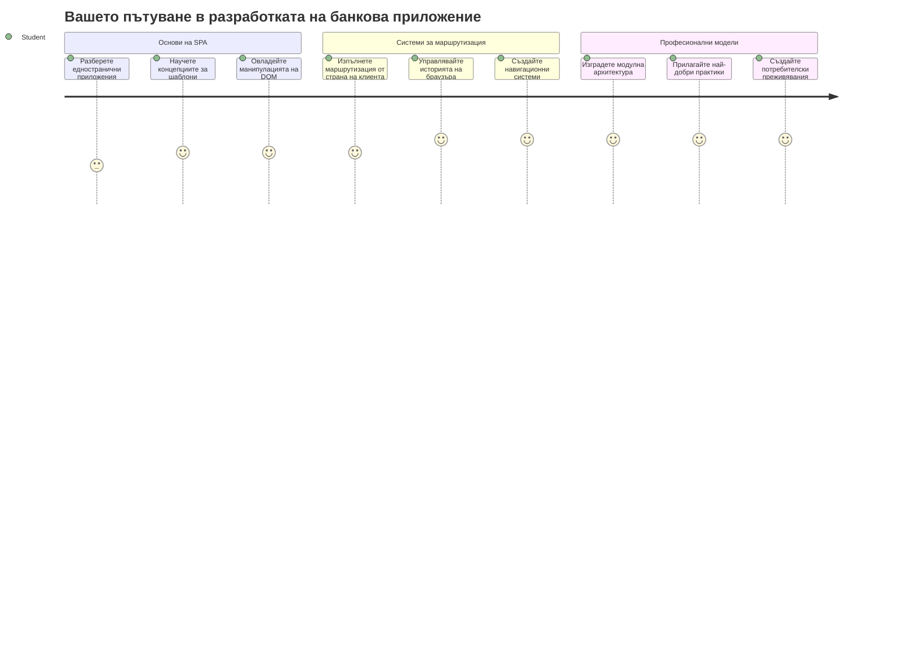
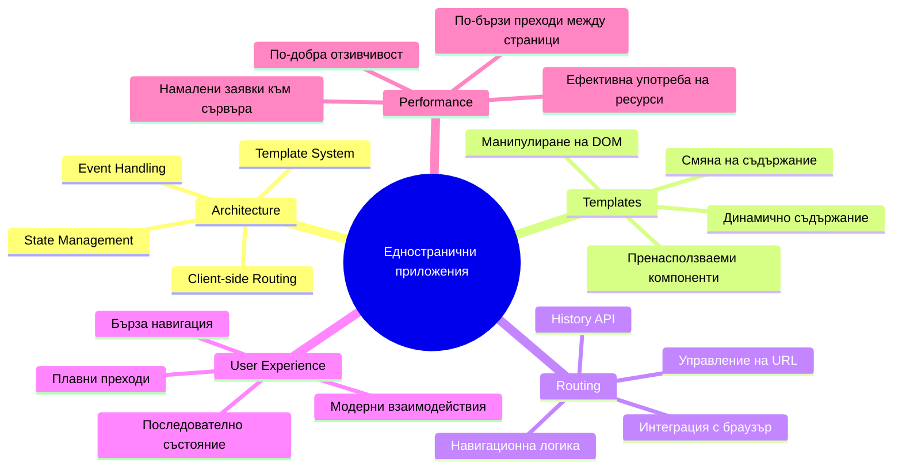
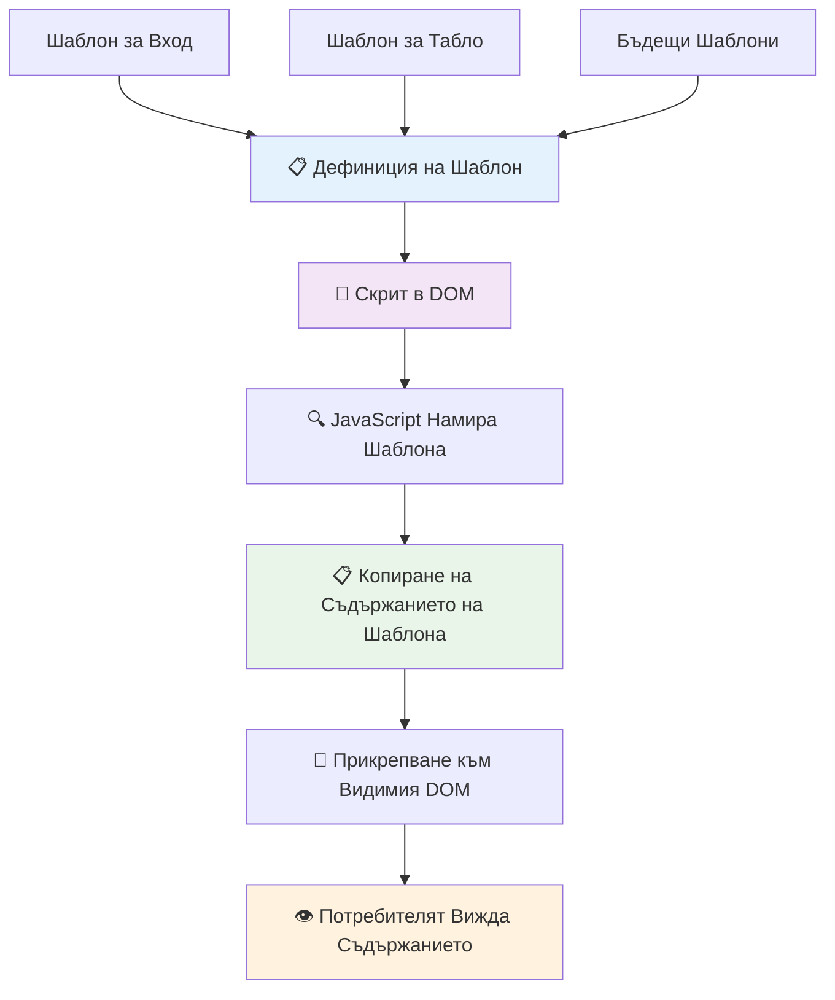
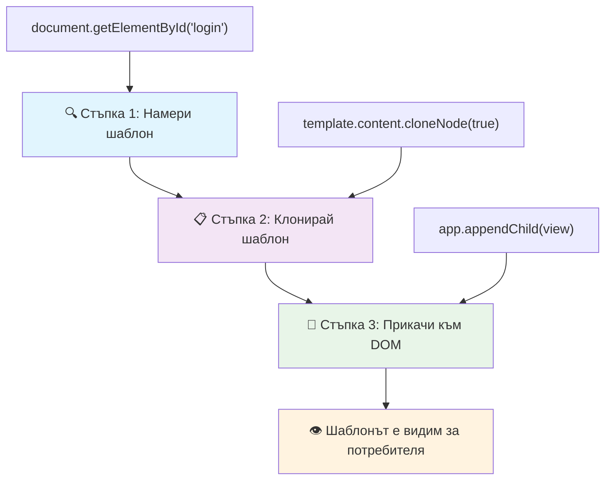
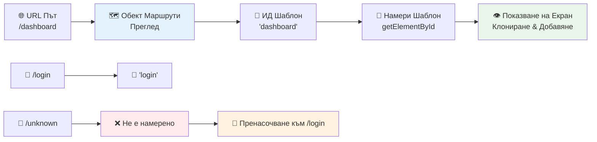
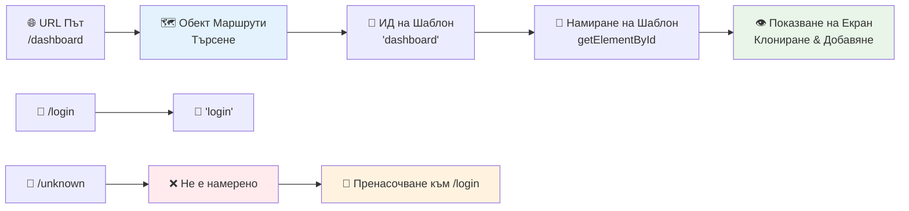
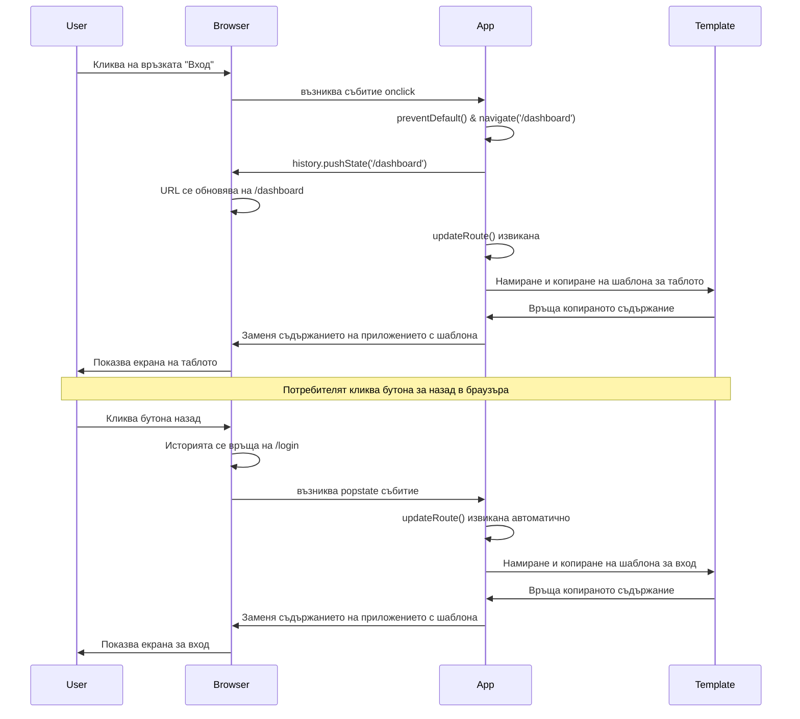
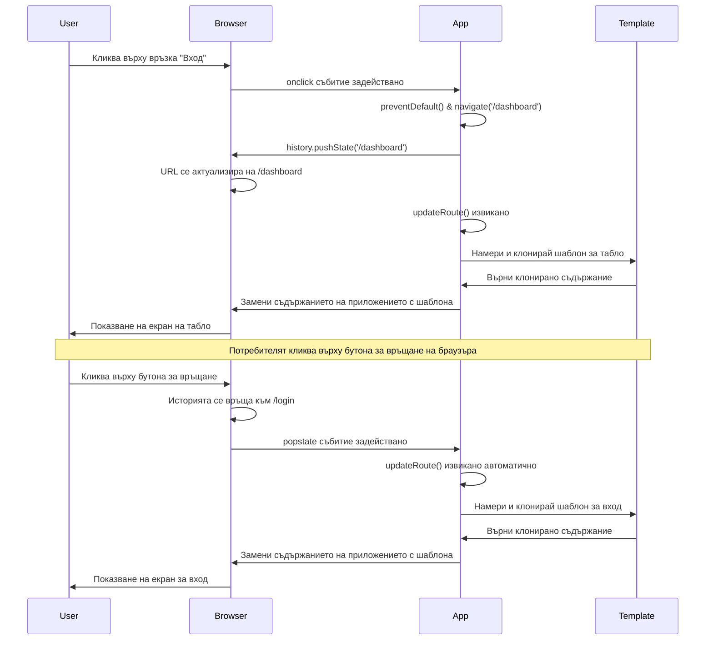
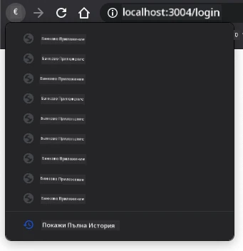
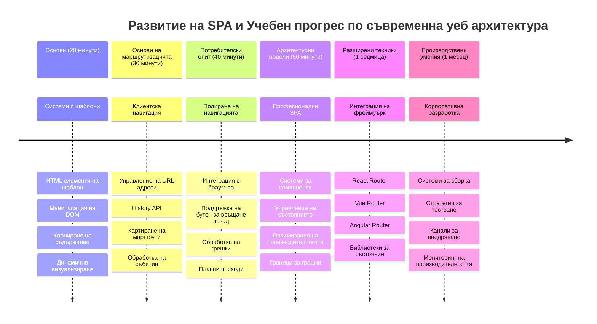

<!--
CO_OP_TRANSLATOR_METADATA:
{
  "original_hash": "351678bece18f07d9daa987a881fb062",
  "translation_date": "2026-01-07T07:04:53+00:00",
  "source_file": "7-bank-project/1-template-route/README.md",
  "language_code": "bg"
}
-->
# Създаване на банково приложение Част 1: HTML шаблони и маршрути в уеб приложение


Когато навигационният компютър на Apollo 11 стигна до Луната през 1969 г., той трябваше да превключва между различни програми без да рестартира цялата система. Модерните уеб приложения работят по подобен начин – те променят това, което виждате, без да презареждат всичко отначало. Това създава гладко и отзивчиво изживяване, което потребителите очакват днес.

За разлика от традиционните уебсайтове, които презареждат цели страници при всяко взаимодействие, модерните уеб приложения обновяват само необходимите части. Този подход, подобно на това как командният център превключва между различни дисплеи, като същевременно поддържа постоянна комуникация, създава плавно изживяване, към което сме свикнали.

Ето какво прави разликата толкова драстична:

| Традиционни многослойни приложения | Модерни едностранични приложения |
|----------------------------|-------------------------|
| **Навигация** | Пълно презареждане на страницата за всеки екран | Моментално превключване на съдържанието |
| **Производителност** | По-бавно заради пълно изтегляне на HTML | По-бързо с частични актуализации |
| **Потребителско изживяване** | Раздразнителни мигания на страницата | Гладки, като приложения, преходи |
| **Споделяне на данни** | Трудно между страниците | Лесно управление на състоянието |
| **Разработка** | Множество HTML файлове за поддръжка | Един HTML с динамични шаблони |

**Разбиране на еволюцията:**
- **Традиционните приложения** изискват заявка към сървъра за всяко навигационно действие
- **Модерните SPA** се зареждат веднъж и динамично обновяват съдържанието с JavaScript
- **Очакванията на потребителите** са за мигновени, безпроблемни взаимодействия
- **Предимствата в производителността** включват по-малка употреба на трафик и по-бързи отговори

В този урок ще създадем банково приложение с няколко екрана, които плавно се свързват. Подобно на начина, по който учените използват модулни инструменти, които могат да се пренастроят за различни експерименти, ще използваме HTML шаблони като многократно използваеми компоненти, които се показват при нужда.

Ще работите с HTML шаблони (многократно използваеми проектни планове за различни екрани), маршрутизация с JavaScript (системата, която превключва между екрани) и API за история на браузъра (който пази бутона назад да работи както се очаква). Това са същите основни техники, използвани от рамки като React, Vue и Angular.

На края ще имате работещо банково приложение, което демонстрира професионални принципи на едностранични приложения.


## Предварителен тест преди лекцията

[Предварителен тест преди лекцията](https://ff-quizzes.netlify.app/web/quiz/41)

### Какво ще ви трябва

Ще ни трябва локален уеб сървър за тестване на банковото ни приложение – не се притеснявайте, по-лесно е, отколкото звучи! Ако нямате такъв, просто инсталирайте [Node.js](https://nodejs.org) и стартирайте `npx lite-server` в папката на проекта си. Тази полезна команда ще стартира локален сървър и автоматично ще отвори приложението ви в браузъра.

### Подготовка

На компютъра си създайте папка на име `bank`, в която да има файл с името `index.html`. Ще започнем от този HTML [шаблон](https://en.wikipedia.org/wiki/Boilerplate_code):

```html
<!DOCTYPE html>
<html lang="en">
  <head>
    <meta charset="UTF-8">
    <meta name="viewport" content="width=device-width, initial-scale=1.0">
    <title>Bank App</title>
  </head>
  <body>
    <!-- This is where you'll work -->
  </body>
</html>
```

**Ето какво предоставя този шаблон:**
- **Установява** структурата на HTML5 документа с правилна декларация на DOCTYPE
- **Конфигурира** кодировката на символите като UTF-8 за международна поддръжка на текст
- **Активира** адаптивен дизайн с viewport мета таг за съвместимост с мобилни устройства
- **Задава** описателно заглавие, което се показва в таба на браузъра
- **Създава** чисто тяло, в което ще изграждаме приложението си

> 📁 **Преглед на структурата на проекта**
> 
> **Към края на този урок проектът ви ще съдържа:**
> ```
> bank/
> ├── index.html      <!-- Main HTML with templates -->
> ├── app.js          <!-- Routing and navigation logic -->
> └── style.css       <!-- (Optional for future lessons) -->
> ```
> 
> **Отговорности на файловете:**
> - **index.html**: Съдържа всички шаблони и осигурява структурата на приложението
> - **app.js**: Управлява маршрутизацията, навигацията и управлението на шаблоните
> - **Шаблони**: Дефинират UI за вход, табло и други екрани

---

## HTML Шаблони

Шаблоните разрешават фундаментален проблем в уеб разработката. Когато Гутенберг изобретил подвижния печат през 1440-те, той осъзнал, че вместо да изрязва цели страници, може да създава многократно използваеми буквени блокчета и да ги подрежда според нуждите. HTML шаблоните работят по същия принцип – вместо да създават отделни HTML файлове за всеки екран, дефинирате многократно използваеми структури, които могат да се показват при нужда.


Мислете за шаблоните като за планове за различни части от вашето приложение. Както архитектът създава един план и го използва многократно, вместо да чертае еднакви стаи наново, така и ние създаваме шаблон веднъж и го използваме при нужда. Браузърът държи тези шаблони скрити, докато JavaScript не ги активира.

Ако искате да създадете няколко екрана за уеб страница, едно решение е да направите по един HTML файл за всеки екран. Този подход обаче има неудобства:

- Трябва да презареждате целия HTML при смяна на екрана, което може да бъде бавно.
- Трудно е да се споделят данни между различните екрани.

Друго решение е да имате само един HTML файл и да дефинирате няколко [HTML шаблона](https://developer.mozilla.org/docs/Web/HTML/Element/template) чрез елемента `<template>`. Шаблонът е многократно използваем HTML блок, който браузърът не показва и който трябва да бъде „инстанциран“ по време на изпълнение с помощта на JavaScript.

### Нека го създадем

Ще направим банково приложение с два основни екрана: страница за вход и табло. Първо, нека добавим запълващ елемент в тялото на HTML – тук ще се появяват всички различни екрани:

```html
<div id="app">Loading...</div>
```

**Какво прави този плейсхолдър:**
- **Създава** контейнер с ID „app“, където ще се показват всички екрани
- **Показва** съобщение за зареждане, докато JavaScript инициализира първия екран
- **Осигурява** една точка на закрепване за динамичното съдържание
- **Позволява** лесно насочване от JavaScript чрез `document.getElementById()`

> 💡 **Профи съвет**: Тъй като съдържанието на този елемент ще се заменя, можем да сложим съобщение или индикатор за зареждане, което ще се показва докато приложението се зарежда.

След това нека добавим под него HTML шаблона за страницата за вход. За момента ще сложим само заглавие и секция със връзка, която ще ползваме за навигацията.

```html
<template id="login">
  <h1>Bank App</h1>
  <section>
    <a href="/dashboard">Login</a>
  </section>
</template>
```

**Какво съдържа този шаблон за вход:**
- **Дефинира** шаблон с уникален идентификатор „login“ за насочване с JavaScript
- **Включва** основно заглавие, което задава бранда на приложението
- **Съдържа** семантичен елемент `<section>` за групиране на свързано съдържание
- **Осигурява** навигационна връзка, която ще пренасочва потребителите към таблото

След това добавяме друг HTML шаблон за страницата с табло. Тази страница ще има различни секции:

- Заглавен блок с титул и връзка за изход
- Текущото салдо на банковата сметка
- Списък с транзакции, показан в таблица

```html
<template id="dashboard">
  <header>
    <h1>Bank App</h1>
    <a href="/login">Logout</a>
  </header>
  <section>
    Balance: 100$
  </section>
  <section>
    <h2>Transactions</h2>
    <table>
      <thead>
        <tr>
          <th>Date</th>
          <th>Object</th>
          <th>Amount</th>
        </tr>
      </thead>
      <tbody></tbody>
    </table>
  </section>
</template>
```

**Нека разберем всеки елемент на таблото:**
- **Структурира** страницата със семантичен елемент `<header>`, който съдържа навигация
- **Показва** заглавието на приложението за консистентност в различните екрани
- **Осигурява** връзка за изход, която пренасочва обратно към екрана за вход
- **Показва** текущото салдо в отделена секция
- **Организира** данните за транзакциите в правилно структурирана HTML таблица
- **Дефинира** заглавия на колоните Дата, Обект и Сума
- **Оставя** тялото на таблицата празно за динамично добавяне на съдържание по-късно

> 💡 **Профи съвет**: Когато създавате HTML шаблони, ако искате да видите как ще изглежда, можете да коментирате редовете `<template>` и `</template>`, като ги обградите с `<!-- -->`.

### 🔄 **Педагогическа проверка**
**Разбиране на системата с шаблони**: Преди да имплементирате JavaScript, уверете се, че разбирате:
- ✅ Какво различава шаблоните от обикновените HTML елементи
- ✅ Защо шаблоните остават скрити, докато не бъдат активирани от JavaScript
- ✅ Значението на семантичната HTML структура в шаблоните
- ✅ Как шаблоните позволяват многократна употреба на UI компоненти

**Бърз само тест**: Какво се случва, ако премахнете таговете `<template>` от вашия HTML?
*Отговор: Съдържанието става видимо веднага и губи функционалността на шаблон*

**Предимства на архитектурата**: Шаблоните осигуряват:
- **Многократна употреба**: Една дефиниция – множество инстанции
- **Производителност**: Без излишно парсване на HTML
- **Поддръжка**: Централизирана структура на UI
- **Гъвкавост**: Динамична смяна на съдържанието

✅ Защо според вас използваме `id` атрибути на шаблоните? Можем ли да използваме нещо друго, като класове?

## Оживяване на шаблоните с JavaScript

Сега трябва да направим шаблоните функционални. Както 3D принтерът приема цифров план и създава физически обект, така и JavaScript взема нашите скрити шаблони и създава видими, интерактивни елементи, които потребителите могат да виждат и използват.

Процесът следва три последователни стъпки, които са основата на модерната уеб разработка. Когато разберете този модел, ще го разпознавате в много рамки и библиотеки.

Ако отворите текущия си HTML файл в браузъра, ще видите, че остава на екрана `Loading...`. Това е защото трябва да добавим JavaScript код, който да инстанцира и покаже HTML шаблоните.

Инстанцирането на шаблон обикновено става в 3 стъпки:

1. Извличане на елемента шаблон в DOM, например чрез [`document.getElementById`](https://developer.mozilla.org/docs/Web/API/Document/getElementById).
2. Клониране на шаблонния елемент, използвайки [`cloneNode`](https://developer.mozilla.org/docs/Web/API/Node/cloneNode).
3. Прикрепяне към DOM под видим елемент, например чрез [`appendChild`](https://developer.mozilla.org/docs/Web/API/Node/appendChild).


**Визуално разграждане на процеса:**
- **Стъпка 1** намира скрития шаблон в DOM структурата
- **Стъпка 2** създава работно копие, което може да бъде безопасно променяно
- **Стъпка 3** вмъква копието във видимата област на страницата
- **Резултат** е функционален екран, с който потребителите могат да взаимодействат

✅ Защо трябва да клонираме шаблона преди да го прикачим към DOM? Какво смятате, че ще стане, ако пропуснем тази стъпка?

### Задача

Създайте нов файл на име `app.js` в папката на проекта и импортирайте този файл в секцията `<head>` на вашия HTML:

```html
<script src="app.js" defer></script>
```

**Разбиране на този импорт на скрипт:**
- **Свързва** JavaScript файла с нашия HTML документ
- **Използва** атрибута `defer` за да се увери, че скриптът се изпълнява след като HTML парсването приключи
- **Позволява** достъп до всички DOM елементи, понеже са напълно заредени преди изпълнението на скрипта
- **Следва** съвременни добри практики за зареждане на скриптове и производителност

Сега, в `app.js`, ще създадем нова функция `updateRoute`:

```js
function updateRoute(templateId) {
  const template = document.getElementById(templateId);
  const view = template.content.cloneNode(true);
  const app = document.getElementById('app');
  app.innerHTML = '';
  app.appendChild(view);
}
```
 
**Стъпка по стъпка, ето какво се случва:**
- **Намира** елемента шаблон чрез уникалния му ID
- **Създава** дълбоко копие на съдържанието на шаблона чрез `cloneNode(true)`
- **Намира** контейнера на приложението, където ще се показва съдържанието
- **Изчиства** всяко съществуващо съдържание от контейнера
- **Вмъква** клонираното съдържание на шаблона във видимия DOM

Сега извикайте тази функция с един от шаблоните и разгледайте резултата.

```js
updateRoute('login');
```

**Какво прави това извикване на функция:**
- **Активира** шаблона за вход, като предава неговото ID като параметър
- **Демонстрира** как програмно да се превключва между различни екрани на приложението
- **Показва** екрана за вход вместо съобщението „Loading...“

✅ Каква е целта на този код `app.innerHTML = '';`? Какво се случва без него?

## Създаване на маршрути

Маршрутизацията по същество свързва URL адреси с правилното съдържание. Помислете за това как ранните телефонни оператори използвали комутационни табла за свързване на повиквания – те приемали входящата заявка и я пренасочвали към правилната дестинация. Уеб маршрутизацията работи по подобен начин, като приема URL заявка и решава кое съдържание да покаже.


Традиционно, уеб сървърите обработват това, като обслужват различни HTML файлове за различни URL адреси. Тъй като изграждаме едностранично приложение, трябва да се справим с това сами чрез JavaScript. Този подход ни дава по-голям контрол върху потребителското изживяване и производителността.


**Разбиране на потока на маршрутизация:**
- **Промяна на URL** задейства проверка в конфигурацията ни за маршрути
- **Валидните маршрути** се свързват с конкретни ID-та на шаблони за рендиране
- **Невалидните маршрути** задействат резервно поведение, за да предотвратят повредени състояния
- **Рендирането на шаблон** следва трите стъпки, които научихме по-рано

Когато говорим за уеб приложение, наричаме *маршрутизация* намерението да свържем **URL адреси** с конкретни екрани, които трябва да се покажат. В уебсайт с множество HTML файлове това се случва автоматично, тъй като пътеките на файловете се отразяват в URL адреса. Например с тези файлове във вашата проектна папка:

```
mywebsite/index.html
mywebsite/login.html
mywebsite/admin/index.html
```

Ако създадете уеб сървър с `mywebsite` като корен, картографирането на URL адреси ще бъде:

```
https://site.com            --> mywebsite/index.html
https://site.com/login.html --> mywebsite/login.html
https://site.com/admin/     --> mywebsite/admin/index.html
```

Обаче за нашето уеб приложение използваме един HTML файл, съдържащ всички екрани, така че това поведение по подразбиране няма да е от полза. Трябва да създадем тази карта ръчно и да обновяваме показвания шаблон с JavaScript.

### Задача

Ще използваме прост обект за реализиране на [карта](https://en.wikipedia.org/wiki/Associative_array) между URL пътища и нашите шаблони. Добавете този обект в началото на файла `app.js`.

```js
const routes = {
  '/login': { templateId: 'login' },
  '/dashboard': { templateId: 'dashboard' },
};
```

**Разбиране на тази конфигурация за маршрути:**
- **Дефинира** картографиране между URL пътища и идентификатори на шаблони
- **Използва** синтаксис на обект, където ключовете са URL пътища, а стойностите съдържат информация за шаблона
- **Позволява** лесно търсене кой шаблон да бъде показан за даден URL
- **Осигурява** мащабируема структура за добавяне на нови маршрути в бъдеще
Сега нека модифицираме малко фунцкията `updateRoute`. Вместо да подаваме директно `templateId` като аргумент, искаме първо да го извлечем, като разгледаме текущия URL, а след това използваме нашата карта, за да получим съответстващата стойност на шаблонния ID. Можем да използваме [`window.location.pathname`](https://developer.mozilla.org/docs/Web/API/Location/pathname), за да вземем само пътя от URL.

```js
function updateRoute() {
  const path = window.location.pathname;
  const route = routes[path];

  const template = document.getElementById(route.templateId);
  const view = template.content.cloneNode(true);
  const app = document.getElementById('app');
  app.innerHTML = '';
  app.appendChild(view);
}
```

**Разбиване на това, което се случва тук:**
- **Извлича** текущия път от URL на браузъра, използвайки `window.location.pathname`
- **Търси** съответстващата конфигурация за маршрут в нашия обект routes
- **Извлича** ID на шаблона от конфигурацията на маршрута
- **Следва** същия процес за рендиране на шаблона както преди
- **Създава** динамична система, която реагира на промени в URL

Тук свързахме маршрутите, които обявихме, с съответния шаблон. Можете да тествате дали работи правилно, като ръчно промените URL в браузъра си.

✅ Какво се случва, ако въведете непознат път в URL? Как бихме могли да решим това?

## Добавяне на навигация

С установено маршрутизиране, потребителите се нуждаят от начин да навигират в приложението. Традиционните сайтове презареждат цели страници при клик върху връзки, но искаме да обновим както URL, така и съдържанието без презареждане на страницата. Това създава по-гладко преживяване, подобно на това как настолните приложения превключват между различни изгледи.

Трябва да координираме две неща: да обновим URL на браузъра, за да могат потребителите да маркират и споделят страници, и да покажем съответното съдържание. При правилна реализация това създава безпроблемна навигация, каквато потребителите очакват от модерните приложения.


### 🔄 **Педагогическа проверка**
**Архитектура на едностранични приложения:** Проверете разбирането си за цялата система:
- ✅ Как се различава маршрутизирането на клиентската страна от традиционното маршрутизиране на сървърната страна?
- ✅ Защо History API е съществен за правилната навигация в SPA?
- ✅ Как шаблоните позволяват динамично съдържание без презареждане на страницата?
- ✅ Каква роля играе обработката на събития при прихващане на навигация?

**Интеграция на системата:** Вашето SPA демонстрира:
- **Управление на шаблони:** Повторно използваеми UI компоненти с динамично съдържание
- **Клиентско маршрутизиране:** Управление на URL без заявки към сървъра
- **Архитектура, базирана на събития:** Отзивчива навигация и взаимодействия с потребителя
- **Интеграция с браузъра:** Поддръжка на историята и бутоните за назад/напред
- **Оптимизация на производителността:** Бързи преходи и намалено натоварване на сървъра

**Професионални модели:** Вие сте реализирали:
- **Разделяне на модел и изглед:** Шаблоните са отделени от логиката на приложението
- **Управление на състоянието:** Синхронизация на URL състоянието с показваното съдържание
- **Прогресивно подобрение:** JavaScript подобрява базовата HTML функционалност
- **Потребителски опит:** Гладка, подобна на приложение навигация без презареждане на страницата

> � **Информация за архитектурата:** Компоненти на навигационната система
>
> **Какво разработвате:**
> - **🔄 Управление на URL:** Обновява адресната лента на браузъра без презареждане на страницата
> - **📋 Система от шаблони:** Динамично променя съдържанието според текущия маршрут  
> - **📚 Интеграция с историята:** Запазва функционалността на бутоните назад/напред в браузъра
> - **🛡️ Обработка на грешки:** Гъвкави алтернативи при невалидни или липсващи маршрути
>
> **Как работят компонентите заедно:**
> - **Слуша** събития за навигация (кликвания, промени в историята)
> - **Обновява** URL с помощта на History API
> - **Рендира** подходящия шаблон за новия маршрут
> - **Поддържа** безпроблемно потребителско изживяване

Следващата стъпка за нашето приложение е да добавим възможност за навигация между страници без ръчна смяна на URL. Това означава две неща:

  1. Обновяване на текущия URL
  2. Обновяване на показвания шаблон според новия URL

Вече се погрижихме за втората част с функцията `updateRoute`, затова трябва да измислим как да обновим текущия URL.

Ще трябва да използваме JavaScript, а по-конкретно [`history.pushState`](https://developer.mozilla.org/docs/Web/API/History/pushState), която позволява да обновим URL и да създадем нов запис в историята на браузъра, без да презареждаме HTML.

> ⚠️ **Важно:** Докато HTML елементът [`<a href>`](https://developer.mozilla.org/docs/Web/HTML/Element/a) може да се използва самостоятелно за създаване на хипервръзки към различни URL, той по подразбиране кара браузъра да презареди HTML. Необходимо е да се предотврати това поведение при работа с маршрутизиране чрез собствен JavaScript, като се използва функцията preventDefault() на събитието click.

### Задача

Нека създадем нова функция, която можем да използваме за навигация в приложението ни:

```js
function navigate(path) {
  window.history.pushState({}, path, path);
  updateRoute();
}
```

**Разбиране на тази навигационна функция:**
- **Обновява** URL в браузъра с новия път, използвайки `history.pushState`
- **Добавя** нов запис в историята на браузъра за поддръжка на бутоните назад/напред
- **Задейства** функцията `updateRoute()`, за да покаже съответния шаблон
- **Поддържа** преживяването на едностранично приложение без презареждане на страницата

Този метод първо обновява текущия URL на база зададения път, след това обновява шаблона. Свойството `window.location.origin` връща корена на URL, позволявайки ни да реконструираме пълен URL от даден път.

Сега, след като имаме тази функция, можем да разрешим проблема, ако път не съвпада с нито един дефиниран маршрут. Ще модифицираме `updateRoute`, като добавим резервен маршрут към съществуващ такъв, ако не можем да намерим съвпадение.

```js
function updateRoute() {
  const path = window.location.pathname;
  const route = routes[path];

  if (!route) {
    return navigate('/login');
  }

  const template = document.getElementById(route.templateId);
  const view = template.content.cloneNode(true);
  const app = document.getElementById('app');
  app.innerHTML = '';
  app.appendChild(view);
}
```

**Ключови моменти за запомняне:**
- **Проверява** дали съществува маршрут за текущия път
- **Пренасочва** към страницата за вход при достъп до невалиден маршрут
- **Осигурява** резервен механизъм, който предотвратява счупена навигация
- **Гарантира**, че потребителите винаги виждат валиден екран, дори при грешни URL

Ако маршрута не съществува, сега ще пренасочим към страницата `login`.

Сега нека създадем функция, която получава URL при клик върху линк и предотвратява стандартното поведение на браузъра:

```js
function onLinkClick(event) {
  event.preventDefault();
  navigate(event.target.href);
}
```

**Разбиване на този обработчик при клик:**
- **Предотвратява** стандартното поведение на линковете с `preventDefault()`
- **Извлича** URL на дестинацията от елемента, върху който е кликнато
- **Извиква** нашата потребителска функция за навигация, вместо да презарежда страницата
- **Поддържа** гладкото потребителско изживяване на едностранично приложение

```html
<a href="/dashboard" onclick="onLinkClick(event)">Login</a>
...
<a href="/login" onclick="onLinkClick(event)">Logout</a>
```

**Какво постига това свързване на onclick:**
- **Свързва** всеки линк с нашата система за навигация
- **Предава** събитието click към нашата функция `onLinkClick` за обработка
- **Позволява** гладка навигация без презареждане на страницата
- **Поддържа** правилна URL структура, която потребителите могат да маркират или споделят

Атрибутът [`onclick`](https://developer.mozilla.org/docs/Web/API/GlobalEventHandlers/onclick) свързва събитието `click` с JavaScript код, тук извикването на функцията `navigate()`.

Опитайте да кликнете на тези линкове, сега трябва да можете да навигирате между различните екрани на приложението.

✅ Методът `history.pushState` е част от стандарта HTML5 и е имплементиран в [всички модерни браузъри](https://caniuse.com/?search=pushState). Ако разработвате уеб приложение за по-стари браузъри, има трик, който може да използвате като заместител на този API: използване на [hash (`#`)](https://en.wikipedia.org/wiki/URI_fragment) преди пътя, с което можете да имплементирате маршрутизиране, което работи с обикновени хипервръзки и не презарежда страницата, тъй като е било предназначено за създаване на вътрешни препратки в страницата.

## Правене на бутоните за назад и напред в браузъра да работят

Бутоните назад и напред са фундаментални за уеб разглеждането, подобно на това как контролерите на мисии на НАСА могат да преглеждат предишни състояния на системата по време на космически мисии. Потребителите очакват тези бутони да работят, и когато не работят, нарушава нормалното изживяване при браузване.

Нашето едностранично приложение се нуждае от допълнителна конфигурация, за да ги поддържа. Браузърът поддържа стек с история (в който вече добавяме записи с `history.pushState`), но когато потребителите навигират в тази история, нашето приложение трябва да реагира, като обнови показваното съдържание съответно.


**Ключови точки на взаимодействие:**
- **Потребителски действия** тригерират навигация чрез кликове или бутоните на браузъра
- **Приложението прихваща** кликвания на линкове, за да предотврати презареждане на страницата
- **History API** управлява промяна на URL и стека на историята
- **Шаблоните** осигуряват структурата на съдържанието за всеки екран
- **Слушатели на събития** гарантират, че приложението реагира на всички типове навигация

Използването на `history.pushState` създава нови записи в историята на браузъра. Можете да проверите това, като задържите *бутона за назад* на браузъра, той трябва да покаже нещо такова:



Ако опитате да кликнете няколко пъти върху бутона назад, ще видите, че текущият URL се променя и историята се обновява, но се показва все същият шаблон.

Това е защото приложението не знае, че трябва да извика `updateRoute()` всеки път, когато историята се промени. Ако погледнете [документацията за `history.pushState`](https://developer.mozilla.org/docs/Web/API/History/pushState), ще видите, че при промяна на състоянието – т.е. когато преминаваме към различен URL – се задейства събитие [`popstate`](https://developer.mozilla.org/docs/Web/API/Window/popstate_event). Ще използваме това, за да оправим проблема.

### Задача

За да се уверим, че показваният шаблон се обновява при промени в историята на браузъра, ще прикрепим нова функция, която извиква `updateRoute()`. Ще го направим в края на нашия файл `app.js`:

```js
window.onpopstate = () => updateRoute();
updateRoute();
```

**Разбиране на тази интеграция с историята:**
- **Слуша** за събития `popstate`, които се случват при навигация с бутоните на браузъра
- **Използва** стрелкова функция за по-кратък синтаксис при обработката
- **Извиква** автоматично `updateRoute()`, когато състоянието на историята се промени
- **Инициализира** приложението, като извиква `updateRoute()` при първоначално зареждане
- **Гарантира** правилното показване на шаблона независимо от начина на навигация на потребителите

> 💡 **Съвет:** Използвахме [стрелкова функция](https://developer.mozilla.org/docs/Web/JavaScript/Reference/Functions/Arrow_functions) тук за обработчика на `popstate` за краткост, но и обикновена функция би работила по същия начин.

Ето едно освежаващо видео за стрелковите функции:

[](https://youtube.com/watch?v=OP6eEbOj2sc "Стрелкови функции")

> 🎥 Кликнете на картинката за видео за стрелкови функции.

Сега опитайте да използвате бутоните назад и напред в браузъра си и проверете дали показваният маршрут се обновява правилно този път.

### ⚡ **Какво можете да направите в следващите 5 минути**
- [ ] Тествайте навигацията на вашето банково приложение с бутоните назад/напред
- [ ] Опитайте ръчно да въвеждате различни URL адреси в адресната лента за тестване на маршрути
- [ ] Отворете DevTools на браузъра и инспектирайте как шаблоните се клонират в DOM
- [ ] Експериментирайте с добавяне на console.log съобщения за проследяване на потока на маршрутизиране

### 🎯 **Какво можете да постигнете този час**
- [ ] Попълнете теста след урока и разберете концепциите на архитектурата на SPA
- [ ] Добавете CSS стилизиране, за да изглеждат вашите банкови шаблони професионално
- [ ] Реализирайте страницата за грешка 404 с правилна обработка на грешки
- [ ] Създайте предизвикателство за страница с "credits" с допълнителна маршрутизация
- [ ] Добавете състояния за зареждане и преходи между смени на шаблони

### 📅 **Вашето седмично пътешествие в разработката на SPA**
- [ ] Завършете цялото банково приложение с формуляри, управление на данни и съхранение
- [ ] Добавете разширени функции за маршрутизиране като параметри на маршрути и вложени маршрути
- [ ] Имплементирайте навигационни предпазители и маршрутизиране с автентикация
- [ ] Създайте повторно използваеми шаблонни компоненти и библиотека с компоненти
- [ ] Добавете анимации и преходи за по-гладко потребителско изживяване
- [ ] Разположете вашето SPA на хостинг платформа и конфигурирайте маршрутирането правилно

### 🌟 **Ваше месечно овладяване на Frontend архитектурата**
- [ ] Създавайте сложни SPA с модерни рамки като React, Vue или Angular
- [ ] Учете разширени модели и библиотеки за управление на състоянието
- [ ] Оптимизирайте билд инструменти и работни потоци за разработка на SPA
- [ ] Имплементирайте функции за прогресивни уеб приложения и офлайн работа
- [ ] Изучавайте техники за оптимизация на производителността за мащабни SPA
- [ ] Допринасяйте към SPA проекти с отворен код и споделяйте знанията си

## 🎯 Вашият график за овладяване на едностранични приложения


### 🛠️ Обобщение на инструмента за разработка на SPA

След завършване на този урок сте овладели:
- **Архитектура на шаблони:** Повторно използваеми HTML компоненти с динамично рендиране на съдържание
- **Клиентско маршрутизиране:** Управление на URL и навигация без презареждане на страницата
- **Интеграция с браузъра:** Използване на History API и поддръжка на бутоните назад/напред
- **Системи, базирани на събития:** Обработка на навигация и взаимодействия с потребителя
- **Манипулация на DOM:** Клониране на шаблони, смяна на съдържанието и управление на елементи
- **Обработка на грешки:** Гъвкави алтернативи при невалидни маршрути и липсващо съдържание
- **Модели за производителност:** Ефективно зареждане и рендиране на съдържание

**Приложения в реалния свят:** Вашите умения за разработка на SPA са приложими директно към:
- **Модерни уеб приложения:** Разработка с React, Vue, Angular и други рамки
- **Прогресивни уеб приложения:** Офлайн приложения с потребителско изживяване като на приложение
- **Корпоративни табла:** Сложни бизнес приложения с множество изгледи
- **Електронна търговия:** Каталози с продукти, пазарни колички и процедури за поръчка
- **Управление на съдържание:** Динамично създаване и редактиране на съдържание
- **Мобилна разработка:** Хибридни приложения с уеб технологии

**Професионални умения, които сте придобили:**

- **Проектирайте** едностранични приложения с правилно разделение на отговорностите  
- **Имплементирайте** клиентски системи за маршрутизация, които се мащабират с комплексността на приложението  
- **Отстранявайте грешки** в сложни навигационни потоци, използвайки инструменти за разработчици на браузъра  
- **Оптимизирайте** производителността на приложението чрез ефективно управление на шаблоните  
- **Дизайнирайте** потребителски изживявания, които се усещат като нативни и отзивчиви  

**Владеене на концепции за Frontend разработка**:  
- **Архитектура на компоненти**: Повторно използваеми UI шаблони и системи за шаблони  
- **Синхронизация на състоянието**: Управление на състоянието в URL и история на браузъра  
- **Събитиен програмиране**: Обработка на взаимодействия на потребителя и навигация  
- **Оптимизация на производителността**: Ефективна манипулация на DOM и зареждане на съдържание  
- **Дизайн на потребителско изживяване**: Плавни преходи и интуитивна навигация  

**Следващо ниво**: Готови сте да изследвате модерни frontend рамки, усъвършенствано управление на състоянието или да създавате сложни корпоративни приложения!  

🌟 **Постижение отключено**: Изградили сте професионална основа на едностранично приложение с модерни архитектурни модели за уеб!  

---

## GitHub Copilot Agent Challenge 🚀

Използвайте Agent режима, за да завършите следното предизвикателство:

**Описание:** Подобрете банковото приложение като имплементирате обработка на грешки и шаблон за 404 страница при невалидни маршрути, подобрявайки потребителското изживяване при навигация към несъществуващи страници.

**Задача:** Създайте нов HTML шаблон с id "not-found", който показва приятелска 404 страница с подходящ стил. След това модифицирайте логиката на маршрутизация в JavaScript, за да показва този шаблон при навигация към невалидни URL адреси и добавете бутон "Go Home", който връща към страницата за вход.

Научете повече за [agent mode](https://code.visualstudio.com/blogs/2025/02/24/introducing-copilot-agent-mode) тук.

## 🚀 Предизвикателство

Добавете нов шаблон и маршрут за трета страница, която показва кредитите за това приложение.

**Цели на предизвикателството:**  
- **Създайте** нов HTML шаблон с подходяща структура на съдържанието  
- **Добавете** новия маршрут към обекта с конфигурация на маршрутите  
- **Включете** навигационни връзки към и от страницата с кредити  
- **Проверете**, че цялата навигация работи правилно с историята на браузъра  

## Кратък тест след лекцията

[Кратък тест след лекцията](https://ff-quizzes.netlify.app/web/quiz/42)

## Преглед и самоподготовка

Маршрутизацията е една от изненадващо сложните части на уеб разработката, особено с преминаването от поведение на презареждане на страници към презареждане на страници в едностранични приложения. Прочетете малко за [как услугата Azure Static Web App](https://docs.microsoft.com/azure/static-web-apps/routes/?WT.mc_id=academic-77807-sagibbon) обработва маршрутизацията. Можете ли да обясните защо някои от решенията, описани в този документ, са необходими?

**Допълнителни ресурси за учене:**  
- **Изследвайте** как популярни рамки като React Router и Vue Router имплементират клиентска маршрутизация  
- **Проучете** разликите между маршрутизиране базирано на хеш и маршрутизиране чрез история на API  
- **Научете** за серверно рендиране (SSR) и как то влияе на стратегиите за маршрутизация  
- **Разгледайте** как Progressive Web Apps (PWAs) боравят с маршрутизация и навигация  

## Домашна задача

[Подобрете маршрутизацията](assignment.md)

---

<!-- CO-OP TRANSLATOR DISCLAIMER START -->
**Отказ от отговорност**:  
Този документ е преведен с помощта на AI преводаческа услуга [Co-op Translator](https://github.com/Azure/co-op-translator). Въпреки че се стремим към точност, моля, имайте предвид, че автоматизираните преводи могат да съдържат грешки или неточности. Оригиналният документ на неговия роден език трябва да се счита за авторитетен източник. За критична информация се препоръчва професионален човешки превод. Не носим отговорност за всякакви недоразумения или неправилни тълкувания, произтичащи от използването на този превод.
<!-- CO-OP TRANSLATOR DISCLAIMER END -->