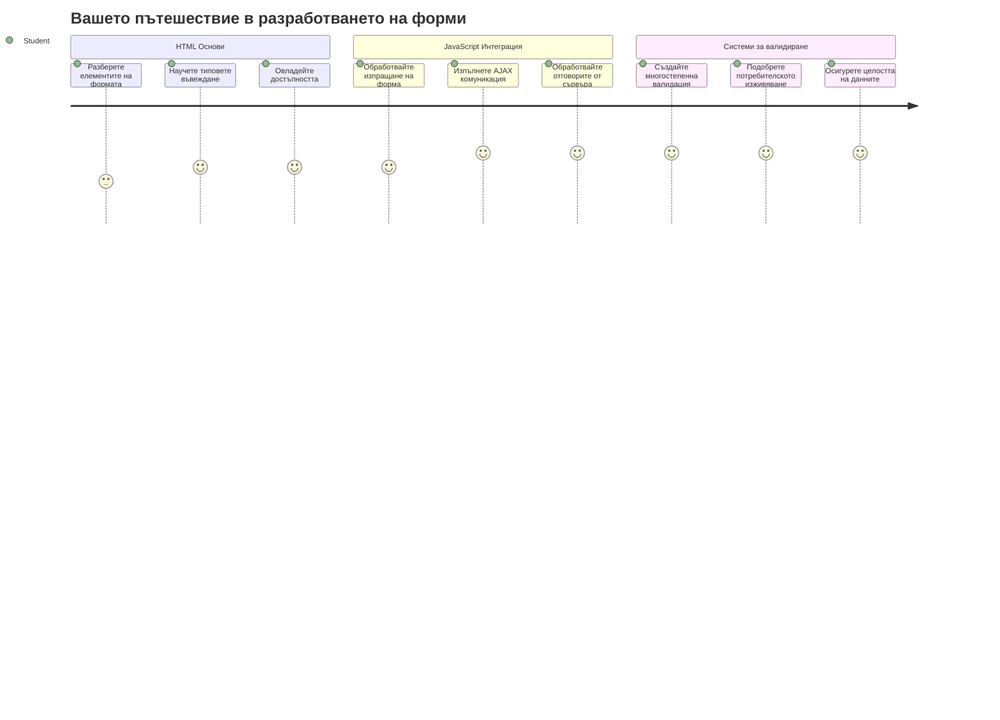
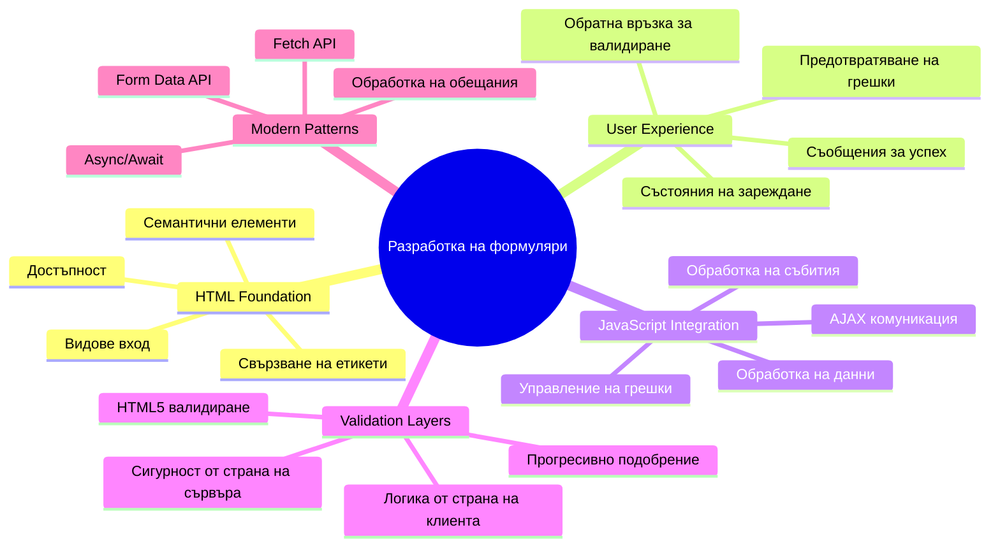
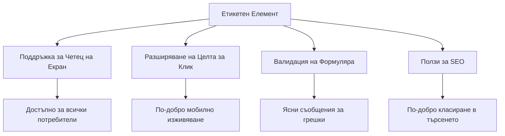
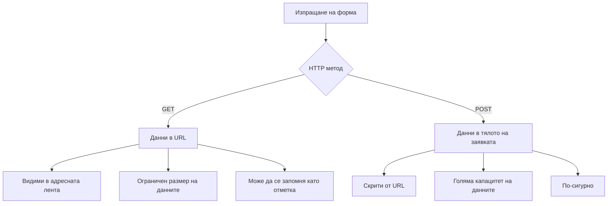
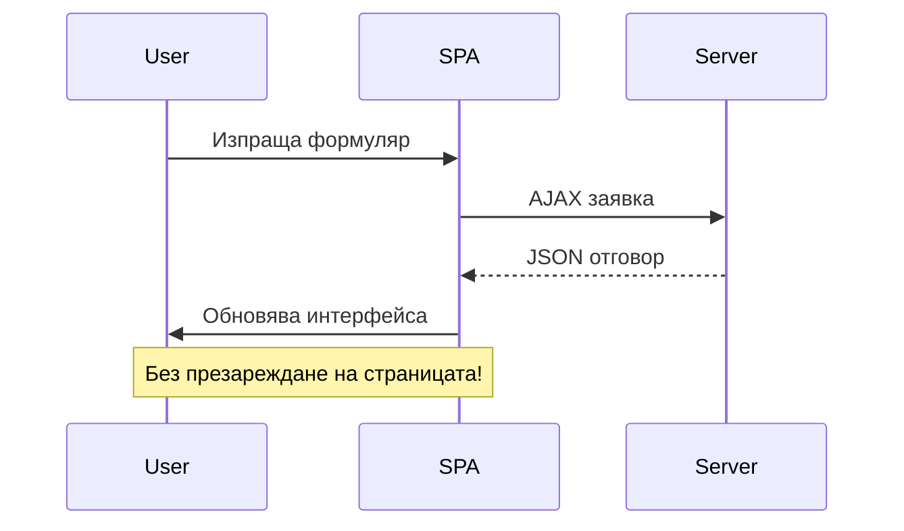
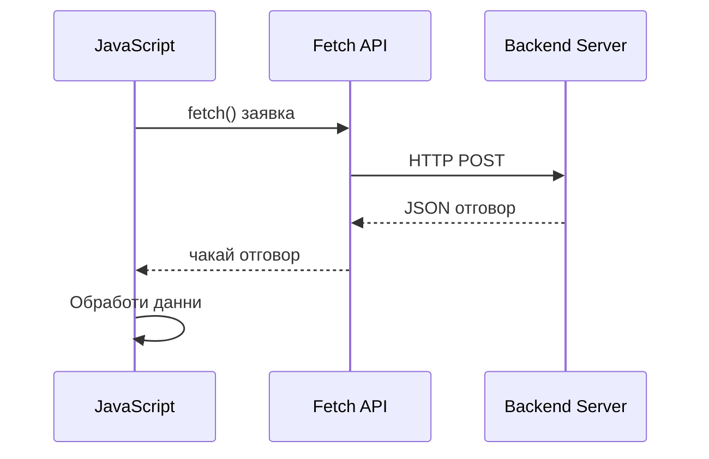
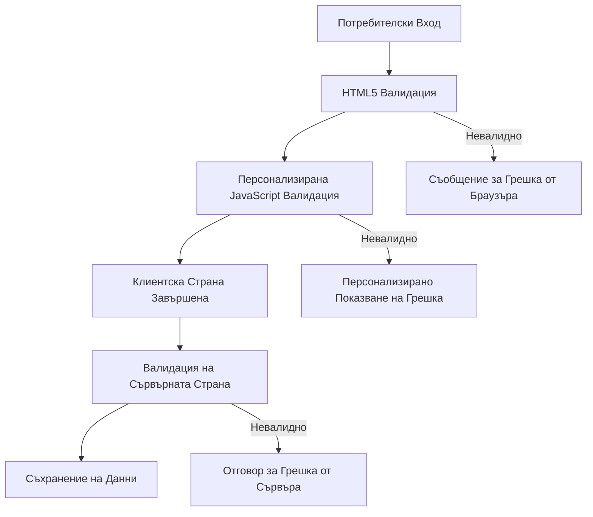
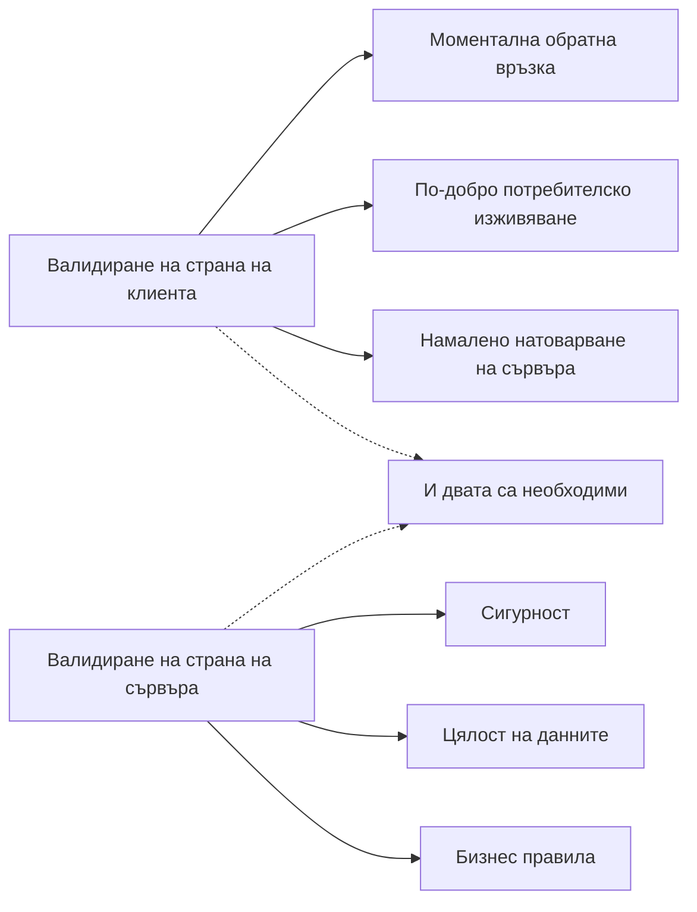
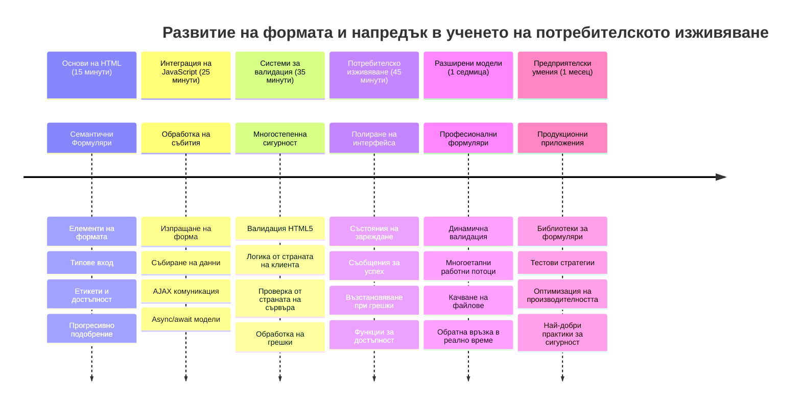

<!--
CO_OP_TRANSLATOR_METADATA:
{
  "original_hash": "7cbdbd132d39a2bb493e85bc2a9387cc",
  "translation_date": "2026-01-07T07:02:18+00:00",
  "source_file": "7-bank-project/2-forms/README.md",
  "language_code": "bg"
}
-->
# Изграждане на банково приложение Част 2: Изграждане на формуляр за вход и регистрация


## Предварителен тест

[Предварителен тест](https://ff-quizzes.netlify.app/web/quiz/43)

Винаги ли сте попълвали форма онлайн и тя е отхвърляла формата на имейла ви? Или пък сте загубвали цялата си информация, когато сте натиснали „Изпрати“? Всички сме срещали тези досадни преживявания.

Формите са мостът между вашите потребители и функционалността на приложението ви. Подобно на внимателните протоколи, които въздушните контролери използват, за да насочват самолетите безопасно до техните дестинации, добре проектираните форми предоставят ясна обратна връзка и предотвратяват скъпоструващи грешки. Лошо направените форми, от друга страна, могат да отблъснат потребителите по-бързо от недоразумение на оживено летище.

В този урок ще преобразуваме вашето статично банково приложение в интерактивно приложение. Ще научите как да изграждате форми, които валидират въвеждането на потребителя, комуникират със сървъри и предоставят полезна обратна връзка. Помислете за това като за изграждане на контролния интерфейс, който позволява на потребителите да навигират функциите на вашето приложение.

В края ще имате пълна система за вход и регистрация с валидация, която насочва потребителите към успех, а не към разочарование.


## Предварителни изисквания

Преди да започнем да изграждаме форми, нека се уверим, че всичко е правилно настроено. Този урок продължава от мястото, където спряхме в предишния, така че ако сте прескочили напред, може би искате да се върнете и първо да настроите основите.

### Необходими настройки

| Компонент | Статус | Описание |
|-----------|--------|-----------|
| [HTML шаблони](../1-template-route/README.md) | ✅ Задължително | Основна структура на банковото приложение |
| [Node.js](https://nodejs.org) | ✅ Задължително | JavaScript среда за сървъра |
| [Bank API Server](../api/README.md) | ✅ Задължително | Бекенд услуга за съхранение на данни |

> 💡 **Съвет за разработчици**: Ще стартирате два отделни сървъра едновременно – един за фронтенд банковото приложение и друг за бекенд API. Тази настройка отразява реалния свят, където фронтенд и бекенд услугите работят независимо.

### Конфигурация на сървъра

**Вашата среда за разработка ще включва:**
- **Фронтенд сървър**: Обслужва вашето банково приложение (обикновено порт `3000`)
- **Бекенд API сървър**: Обработва съхранението и извличането на данни (порт `5000`)
- **И двата сървъра** могат да работят едновременно без конфликти

**Тестване на връзката с API:**
```bash
curl http://localhost:5000/api
# Очакван отговор: "Bank API v1.0.0"
```

**Ако виждате версията на API, сте готови да продължите!**

---

## Разбиране на HTML формите и контролите

HTML формите са начинът, по който потребителите комуникират с вашето уеб приложение. Помислете за тях като за телеграфната система, която е свързвала далечни места през 19-ти век – това е комуникационният протокол между намерението на потребителя и отговора на приложението. Когато са проектирани обмислено, те хващат грешки, насочват формата на въвеждането и предоставят полезни предложения.

Съвременните форми са значително по-усъвършенствани от базовите текстови полета. HTML5 въведе специализирани типове входове, които автоматично обработват валидиране на имейл, форматиране на числа и избор на дати. Тези подобрения са от полза както за достъпността, така и за мобилното потребителско изживяване.

### Основни елементи на формите

**Строителните блокове, които всяка форма се нуждае:**

```html
<!-- Basic form structure -->
<form id="userForm" method="POST">
  <label for="username">Username</label>
  <input id="username" name="username" type="text" required>
  
  <button type="submit">Submit</button>
</form>
```

**Това е какво прави този код:**
- **Създава** контейнер за форма с уникален идентификатор
- **Определя** HTTP метода за подаване на данни
- **Свързва** етикети с входните полета за достъпност
- **Дефинира** бутон за изпращане на формата

### Модерни типове и атрибути на входовете

| Тип вход | Цел | Пример за използване |
|------------|---------|---------------|
| `text` | Общ текстов вход | `<input type="text" name="username">` |
| `email` | Валидиране на имейл | `<input type="email" name="email">` |
| `password` | Скрит текст | `<input type="password" name="password">` |
| `number` | Числов вход | `<input type="number" name="balance" min="0">` |
| `tel` | Телефонни номера | `<input type="tel" name="phone">` |

> 💡 **Предимствата на съвременния HTML5**: Използването на конкретни типове входове осигурява автоматична валидация, подходящи мобилни клавиатури и по-добра достъпност без допълнителен JavaScript!

### Типове бутони и поведение

```html
<!-- Different button behaviors -->
<button type="submit">Save Data</button>     <!-- Submits the form -->
<button type="reset">Clear Form</button>    <!-- Resets all fields -->
<button type="button">Custom Action</button> <!-- No default behavior -->
```

**Ето какво прави всеки тип бутон:**
- **Submit бутоните**: Стартират изпращането на формата и изпращат данните към указаната крайна точка
- **Reset бутоните**: Възстановяват всички полета във формата в първоначалното им състояние
- **Обикновените бутони**: Не предоставят стандартно поведение, изискват собствен JavaScript за функционалност

> ⚠️ **Важно**: Елементът `<input>` е самозатварящ се и не изисква затварящ таг. Модерната практика е да се пише `<input>` без наклонена черта.

### Изграждане на вашата форма за вход

Сега нека създадем практична форма за вход, която демонстрира модерни практики при HTML формите. Ще започнем с базова структура и постепенно ще я подобряваме с достъпност и валидация.

```html
<template id="login">
  <h1>Bank App</h1>
  <section>
    <h2>Login</h2>
    <form id="loginForm" novalidate>
      <div class="form-group">
        <label for="username">Username</label>
        <input id="username" name="user" type="text" required 
               autocomplete="username" placeholder="Enter your username">
      </div>
      <button type="submit">Login</button>
    </form>
  </section>
</template>
```

**Разбивка на случващото се тук:**
- **Структурира** формата с семантични HTML5 елементи
- **Групира** свързани елементи с `div` контейнери с подходящи класове
- **Свързва** етикети с входни полета чрез атрибутите `for` и `id`
- **Включва** модерни атрибути като `autocomplete` и `placeholder` за по-добро изживяване
- **Добавя** `novalidate`, за да обработва валидацията с JavaScript вместо с браузър по подразбиране

### Силата на подходящите етикети

**Защо етикетите са важни за съвременната уеб разработка:**


**Какво постигат правилните етикети:**
- **Позволяват** на екранните четци да обявяват полетата ясно
- **Разширяват** зоната за кликване (натискането на етикета фокусира входа)
- **Подобряват** мобилната използваемост с по-големи целеви области
- **Поддържат** валидацията с информативни съобщения за грешки
- **Подобряват** SEO чрез предоставяне на семантично значение на формите

> 🎯 **Цел за достъпност**: Всяко поле във формата трябва да има асоцииран етикет. Тази проста практика прави формите ви използваеми от всички, включително потребители с увреждания, и подобрява изживяването за всички.

### Създаване на формата за регистрация

Формата за регистрация изисква по-подробна информация за създаване на пълен потребителски акаунт. Нека я изградим с модерни HTML5 функции и подобрена достъпност.

```html
<hr/>
<h2>Register</h2>
<form id="registerForm" novalidate>
  <div class="form-group">
    <label for="user">Username</label>
    <input id="user" name="user" type="text" required 
           autocomplete="username" placeholder="Choose a username">
  </div>
  
  <div class="form-group">
    <label for="currency">Currency</label>
    <input id="currency" name="currency" type="text" value="$" 
           required maxlength="3" placeholder="USD, EUR, etc.">
  </div>
  
  <div class="form-group">
    <label for="description">Account Description</label>
    <input id="description" name="description" type="text" 
           maxlength="100" placeholder="Personal savings, checking, etc.">
  </div>
  
  <div class="form-group">
    <label for="balance">Starting Balance</label>
    <input id="balance" name="balance" type="number" value="0" 
           min="0" step="0.01" placeholder="0.00">
  </div>
  
  <button type="submit">Create Account</button>
</form>
```

**В горното сме:**
- **Организирали** всяко поле в `div` контейнери за по-добро оформление и стил
- **Добавили** подходящи атрибути `autocomplete` за поддръжка на автоматично попълване от браузъра
- **Включили** полезен текст на плейсхолдър за насочване на потребителя
- **Задавали** разумни стойности по подразбиране с атрибута `value`
- **Прилагали** атрибути за валидация като `required`, `maxlength` и `min`
- **Използвали** `type="number"` за полето на баланса с поддръжка на десетични стойности

### Изследване на типовете вход и поведение

**Съвременните типове вход предоставят разширени възможности:**

| Функция | Полза | Пример |
|---------|---------|----------|
| `type="number"` | Числова клавиатура на мобилни устройства | По-лесно въвеждане на баланс |
| `step="0.01"` | Контрол на десетичната прецизност | Позволява стотинки в валутата |
| `autocomplete` | Автоматично попълване от браузъра | По-бързо попълване на формата |
| `placeholder` | Контекстуални подсказки | Насочва очакванията на потребителя |

> 🎯 **Предизвикателство за достъпност**: Опитайте да навигирате формите, използвайки само клавиатурата! Използвайте `Tab` за придвижване между полетата, `Space` за отбелязване на чек-боксове и `Enter` за подаване. Това изживяване помага да разберете как потребителите на екранни четци взаимодействат с вашите форми.

### 🔄 **Педагогическа проверка**
**Разбиране на основите на формите**: Преди да приложите JavaScript, уверете се, че разбирате:
- ✅ Как семантичен HTML създава достъпни структури на формите
- ✅ Защо типове входове имат значение за мобилните клавиатури и валидацията
- ✅ Връзката между етикети и контролите на формата
- ✅ Как атрибутите на формата влияят на поведението по подразбиране на браузъра

**Бърз самотест**: Какво се случва, ако подадете форма без JavaScript обработка?
*Отговор: Браузърът извършва стандартното подаване, обикновено пренасочване към URL-то на действие*

**Ползите от HTML5 формите**: Модерните форми предлагат:
- **Вградена валидация**: Автоматична проверка на имейл и числов формат
- **Мобилна оптимизация**: Подходящи клавиатури за различни типове вход
- **Достъпност**: Поддръжка на екранни четци и клавиатурна навигация
- **Прогресивно подобрение**: Работи и когато JavaScript е изключен

## Разбиране на методите за подаване на формите

Когато някой попълни формата и натисне изпращане, тези данни трябва да отидат някъде – обикновено до сървър, който може да ги запази. Има няколко начина, по които това може да стане, и да знаете кой да използвате може да ви спести главоболия по-късно.

Нека разгледаме какво реално се случва, когато някой клика бутона за изпращане.

### Поведение на формата по подразбиране

Първо, нека наблюдаваме какво се случва с основно подаване на формата:

**Тествайте текущите си форми:**
1. Натиснете бутона *Register* във вашата форма
2. Наблюдавайте промените в адресната лента на браузъра
3. Забележете как страницата се презарежда и данните се появяват в URL адреса


### Сравнение на HTTP методите


**Разбиране на разликите:**

| Метод | Случай на използване | Местоположение на данните | Ниво на сигурност | Ограничение на размера |
|--------|----------|---------------|----------------|-------------|
| `GET` | Търсене, филтри | Параметри в URL | Ниско (видимо) | ~2000 знака |
| `POST` | Потребителски акаунти, чувствителни данни | Тяло на заявката | Високо (скрито) | Без практически лимит |

**Основни разлики:**
- **GET**: Добавя данните на формата към URL като параметри (подходящо за търсене)
- **POST**: Включва данните в тялото на заявката (необходимо за чувствителна информация)
- **Ограничения на GET**: Ограничен размер, видими данни, персистираща история в браузъра
- **Предимства на POST**: Голяма капацитет, поверителност, поддръжка на качване на файлове

> 💡 **Добра практика**: Използвайте `GET` за търсещи форми и филтри (извличане на данни), а `POST` за регистрация, вход и създаване на данни.

### Конфигуриране на подаване на формата

Нека конфигурираме формата за регистрация да комуникира правилно с бекенд API-то, използвайки метода POST:

```html
<form id="registerForm" action="//localhost:5000/api/accounts" 
      method="POST" novalidate>
```

**Това дава следното:**
- **Насочва** изпращането на формата към вашия API endpoint
- **Използва** POST метод за сигурна трансмисия на данни
- **Включва** `novalidate` за обработка с JavaScript вместо стандартна браузър валидация

### Тестване на подаването на формата

**Следвайте тези стъпки, за да тествате формата си:**
1. **Попълнете** формата за регистрация с вашата информация
2. **Натиснете** бутона „Create Account“
3. **Наблюдавайте** отговора от сървъра в браузъра си


**Какво трябва да виждате:**
- **Браузърът пренасочва** към URL адреса на API endpoint-а
- **JSON отговор** съдържащ данните на създадения акаунт
- **Потвърждение от сървъра** че акаунтът е създаден успешно

> 🧪 **Време за експерименти**: Опитайте да регистрирате отново с същото потребителско име. Какъв отговор получавате? Това ви помага да разберете как сървърът обработва дублирани данни и грешки.

### Разбиране на JSON отговорите

**Когато сървърът успешно обработи формата:**
```json
{
  "user": "john_doe",
  "currency": "$",
  "description": "Personal savings",
  "balance": 100,
  "id": "unique_account_id"
}
```

**Отговорът потвърждава:**
- **Създава** нов акаунт със зададените от вас данни
- **Присвоява** уникален идентификатор за бъдещо позоваване
- **Връща** цялата информация за акаунта за проверка
- **Показва** успешно съхранение в базата данни

## Модерно управление на формите с JavaScript

Традиционното подаване на формите причинява пълно презареждане на страницата, подобно на това как ранните космически мисии изискваха пълен рестарт на системата за корекции на курса. Този подход нарушава потребителското изживяване и губи състоянието на приложението.

JavaScript управлението на формите работи като системите за непрекъснато насочване, използвани от съвременните космически кораби – правят корекции в реално време, без да губят контекста на навигация. Можем да прихванем подаването на формата, да предоставим незабавна обратна връзка, да обработваме грешки грациозно и да актуализираме интерфейса според отговорите на сървъра, като същевременно запазваме позицията на потребителя в приложението.

### Защо да избягваме презареждането на страницата?


**Ползи от управлението на формите с JavaScript:**
- **Запазва** състоянието и контекста на приложението и потребителя
- **Осигурява** мигновена обратна връзка и индикатори за зареждане
- **Позволява** динамично обработване на грешки и валидация
- **Създава** плавно, подобно на приложение изживяване
- **Позволява** условна логика, базирана на отговори от сървъра

### Преминаване от традиционни към модерни форми

**Предизвикателства на традиционния подход:**
- **Пренасочва** потребителите далеч от вашето приложение
- **Губи** текущото състояние и контекст на приложението
- **Изисква** пълно презареждане при прости операции
- **Ограничава** контрола върху обратната връзка към потребителя

**Предимствата на съвременния JavaScript подход:**
- **Държи** потребителите вътре в приложението
- **Запазва** цялото състояние и данни на приложението
- **Позволява** валидация и обратна връзка в реално време
- **Поддържа** прогресивно подобрение и достъпност

### Имплементиране на JavaScript управление на формите

Нека заменим традиционното подаване на формата с модерен JavaScript обработчик на събития:

```html
<!-- Remove the action attribute and add event handling -->
<form id="registerForm" method="POST" novalidate>
```

**Добавете логиката за регистрация във файла ви `app.js`:**

```javascript
// Модерно обработване на формуляри, основано на събития
function register() {
  const registerForm = document.getElementById('registerForm');
  const formData = new FormData(registerForm);
  const data = Object.fromEntries(formData);
  const jsonData = JSON.stringify(data);
  
  console.log('Form data prepared:', data);
}

// Прикачи слушател на събития при зареждане на страницата
document.addEventListener('DOMContentLoaded', () => {
  const registerForm = document.getElementById('registerForm');
  registerForm.addEventListener('submit', (event) => {
    event.preventDefault(); // Предотврати изпращането на формуляра по подразбиране
    register();
  });
});
```

**Какво се случва тук:**
- **Спира** стандартното подаване на формата чрез `event.preventDefault()`
- **Извлича** елемента на формата с модерен избор в DOM
- **Извлича** данните от формата чрез мощния API `FormData`
- **Конвертира** FormData в прост обект с `Object.fromEntries()`
- **Сериализира** данните в JSON формат за комуникация със сървъра
- **Логва** обработените данни за отстраняване на грешки и проверка

### Разбиране на API-то FormData

**API-то FormData предоставя мощно управление на формите:**
```javascript
// Пример за това, което FormData записва
const formData = new FormData(registerForm);

// FormData автоматично улавя:
// {
//   "user": "john_doe",
//   "currency": "$",
//   "description": "Личен акаунт",
//   "balance": "100"
// }
```

**Предимства на FormData API:**
- **Пълно събиране**: Улавя всички елементи от формуляра, включително текст, файлове и сложни входове
- **Разпознаване на типове**: Автоматично обработва различни типове вход без нужда от персонализиран код
- **Ефективност**: Премахва ръчното събиране на полетата с единствено обаждане към API
- **Адаптивност**: Запазва функционалността при промени в структурата на формуляра

### Създаване на функция за комуникация със сървъра

Сега нека изградим стабилна функция за комуникация с вашия API сървър, използвайки модерни JavaScript модели:

```javascript
async function createAccount(account) {
  try {
    const response = await fetch('//localhost:5000/api/accounts', {
      method: 'POST',
      headers: { 
        'Content-Type': 'application/json',
        'Accept': 'application/json'
      },
      body: account
    });
    
    // Проверете дали отговорът е бил успешен
    if (!response.ok) {
      throw new Error(`HTTP error! status: ${response.status}`);
    }
    
    return await response.json();
  } catch (error) {
    console.error('Account creation failed:', error);
    return { error: error.message || 'Network error occurred' };
  }
}
```

**Разбиране на асинхронен JavaScript:**


**Какво постига тази модерна имплементация:**
- **Използва** `async/await` за четим асинхронен код
- **Включва** правилно обработване на грешки с блокове try/catch
- **Проверява** статус на отговора преди да обработи данните
- **Настройва** подходящи заглавки за JSON комуникация
- **Осигурява** подробни съобщения за грешки за дебъгване
- **Връща** консистентна структура на данните при успех и грешка

### Силата на модерния Fetch API

**Предимства на Fetch API спрямо по-старите методи:**

| Характеристика | Полза | Имплементация |
|---------|---------|----------------|
| Базирано на Promise | Чист асинхронен код | `await fetch()` |
| Персонализиране на заявката | Пълен контрол върху HTTP | Заглавки, методи, тяло |
| Обработка на отговор | Гъвкав парсинг на данни | `.json()`, `.text()`, `.blob()` |
| Обработка на грешки | Цялостно прихващане на грешки | Блокове try/catch |

> 🎥 **Научете повече**: [Async/Await Tutorial](https://youtube.com/watch?v=YwmlRkrxvkk) - Разбиране на асинхронните JavaScript модели за съвременна уеб разработка.

**Ключови понятия за комуникация със сървър:**
- **Асинхронни функции** позволяват пауза в изпълнението за изчакване на отговор от сървъра
- **Ключовата дума await** прави асинхронния код да се чете като синхронен
- **Fetch API** осигурява модерни HTTP заявки базирани на обещания
- **Обработка на грешки** гарантира, че вашето приложение реагира плавно при проблеми с мрежата

### Завършване на функцията за регистрация

Нека обединим всичко с напълно готова за продукция функция за регистрация:

```javascript
async function register() {
  const registerForm = document.getElementById('registerForm');
  const submitButton = registerForm.querySelector('button[type="submit"]');
  
  try {
    // Покажи състоянието на зареждане
    submitButton.disabled = true;
    submitButton.textContent = 'Creating Account...';
    
    // Обработи данните от формуляра
    const formData = new FormData(registerForm);
    const jsonData = JSON.stringify(Object.fromEntries(formData));
    
    // Изпрати към сървъра
    const result = await createAccount(jsonData);
    
    if (result.error) {
      console.error('Registration failed:', result.error);
      alert(`Registration failed: ${result.error}`);
      return;
    }
    
    console.log('Account created successfully!', result);
    alert(`Welcome, ${result.user}! Your account has been created.`);
    
    // Нулирай формуляра след успешна регистрация
    registerForm.reset();
    
  } catch (error) {
    console.error('Unexpected error:', error);
    alert('An unexpected error occurred. Please try again.');
  } finally {
    // Възстанови състоянието на бутона
    submitButton.disabled = false;
    submitButton.textContent = 'Create Account';
  }
}
```

**Тази разширена имплементация включва:**
- **Осигурява** визуална обратна връзка по време на подаване на формуляра
- **Деактивира** бутонът за изпращане, за да предотврати дублирани подавания
- **Обработва** както очаквани, така и неочаквани грешки плавно
- **Показва** потребителски приятелски съобщения за успех и грешки
- **Ресетва** формуляра след успешна регистрация
- **Възстановява** състоянието на интерфейса независимо от резултата

### Тестване на Вашата имплементация

**Отворете инструменти за разработчици на браузъра и тествайте регистрацията:**

1. **Отворете** конзолата на браузъра (F12 → раздел Console)
2. **Попълнете** регистрационната форма
3. **Натиснете** "Create Account"
4. **Проследете** съобщенията в конзолата и обратната връзка към потребителя


**Какво трябва да видите:**
- **Появява се състояние на зареждане** на бутонът за изпращане
- **Конзолните логове** показват подробна информация за процеса
- **Появява се съобщение за успех**, когато създаването на акаунт е успешно
- **Формулярът се ресетва** автоматично след успешно подаване

> 🔒 **Съображения за сигурност**: В момента данните се предават през HTTP, което не е сигурно за продукцията. В реални приложения винаги използвайте HTTPS за криптиране на данните. Научете повече за [HTTPS сигурността](https://en.wikipedia.org/wiki/HTTPS) и защо е важно за защитата на потребителските данни.

### 🔄 **Педагогическа проверка**
**Интеграция на модерен JavaScript**: Проверете своето разбиране за асинхронна обработка на формуляри:
- ✅ Как `event.preventDefault()` променя стандартното поведение на формуляра?
- ✅ Защо FormData API е по-ефективен от ръчното събиране на полетата?
- ✅ Как async/await подобряват четимостта на кода?
- ✅ Каква роля играе обработката на грешки в потребителското изживяване?

**Архитектура на системата**: Вашата обработка на формуляра демонстрира:
- **Събитийно ориентирано програмиране**: Формулярите реагират на действията на потребителите без презареждане на страницата
- **Асинхронна комуникация**: Заявките към сървъра не блокират интерфейса
- **Обработка на грешки**: Плавно деградиране при проблеми с мрежата
- **Управление на състоянието**: Обновяване на интерфейса според отговорите на сървъра
- **Прогресивно подобрение**: Базова функционалност, с подобрения чрез JavaScript

**Професионални шаблони**: Имплементирали сте:
- **Принцип на единичната отговорност**: Функциите имат ясни и фокусирани задачи
- **Граници за грешки**: Блокове try/catch предотвратяват срив на приложението
- **Обратна връзка към потребителя**: Състояния на зареждане и съобщения за успех/грешка
- **Трансформация на данни**: FormData към JSON за комуникация със сървъра

## Комплексна валидация на формуляри

Валидацията на формуляра предотвратява разочарованието от откриването на грешки едва след подаване. Подобно на многократните излишни системи в Международната космическа станция, ефективната валидация прилага няколко слоя проверки за сигурност.

Оптималният подход комбинира валидация в браузъра за незабавна обратна връзка, JavaScript валидация за подобрено потребителско изживяване и сървърна валидация за сигурност и интегритет на данните. Тази излишност осигурява както удовлетворение на потребителите, така и защита на системата.

### Разбиране на слоевете за валидация


**Многостепенна стратегия за валидация:**
- **HTML5 валидация**: Незабавни проверки в браузъра
- **JavaScript валидация**: Персонализирана логика и потребителско изживяване
- **Сървърна валидация**: Крайна сигурност и проверки за цялост на данните
- **Прогресивно подобрение**: Работи дори ако JavaScript е изключен

### HTML5 атрибути за валидация

**Модерни инструменти за валидация на ваше разположение:**

| Атрибут | Цел | Пример за употреба | Поведение в браузъра |
|-----------|---------|---------------|------------------|
| `required` | Задължителни полета | `<input required>` | Предотвратява празно подаване |
| `minlength`/`maxlength` | Ограничение на дължина на текст | `<input maxlength="20">` | Налага лимити на символи |
| `min`/`max` | Числови граници | `<input min="0" max="1000">` | Валидира границите на числата |
| `pattern` | Персонализирани regex правила | `<input pattern="[A-Za-z]+">` | Съвпада с определени формати |
| `type` | Валидация на тип данни | `<input type="email">` | Проверява специфични формати |

### CSS стилове за валидация

**Създайте визуална обратна връзка за състоянието на валидацията:**

```css
/* Valid input styling */
input:valid {
  border-color: #28a745;
  background-color: #f8fff9;
}

/* Invalid input styling */
input:invalid {
  border-color: #dc3545;
  background-color: #fff5f5;
}

/* Focus states for better accessibility */
input:focus:valid {
  box-shadow: 0 0 0 0.2rem rgba(40, 167, 69, 0.25);
}

input:focus:invalid {
  box-shadow: 0 0 0 0.2rem rgba(220, 53, 69, 0.25);
}
```

**Какво правят тези визуални сигнали:**
- **Зелени рамки**: Показват успешна валидация, като зелени светлини в командния център
- **Червени рамки**: Сигналират за грешки, изискващи внимание
- **Подчертаване на фокус**: Осигуряват ясен визуален контекст на текущия вход
- **Консистентен стил**: Създава предсказуем интерфейс, който потребителите могат да научат

> 💡 **Полезен съвет**: Използвайте CSS псевдокласовете `:valid` и `:invalid` за незабавна визуална обратна връзка докато потребителите пишат, създавайки отзивчив и полезен интерфейс.

### Имплементация на комплексна валидация

Нека подобрим вашия регистрационен формуляр с надеждна валидация, която предоставя отлично потребителско изживяване и качествени данни:

```html
<form id="registerForm" method="POST" novalidate>
  <div class="form-group">
    <label for="user">Username <span class="required">*</span></label>
    <input id="user" name="user" type="text" required 
           minlength="3" maxlength="20" 
           pattern="[a-zA-Z0-9_]+" 
           autocomplete="username"
           title="Username must be 3-20 characters, letters, numbers, and underscores only">
    <small class="form-text">Choose a unique username (3-20 characters)</small>
  </div>
  
  <div class="form-group">
    <label for="currency">Currency <span class="required">*</span></label>
    <input id="currency" name="currency" type="text" required 
           value="$" maxlength="3" 
           pattern="[A-Z$€£¥₹]+" 
           title="Enter a valid currency symbol or code">
    <small class="form-text">Currency symbol (e.g., $, €, £)</small>
  </div>
  
  <div class="form-group">
    <label for="description">Account Description</label>
    <input id="description" name="description" type="text" 
           maxlength="100" 
           placeholder="Personal savings, checking, etc.">
    <small class="form-text">Optional description (up to 100 characters)</small>
  </div>
  
  <div class="form-group">
    <label for="balance">Starting Balance</label>
    <input id="balance" name="balance" type="number" 
           value="0" min="0" step="0.01" 
           title="Enter a positive number for your starting balance">
    <small class="form-text">Initial account balance (minimum $0.00)</small>
  </div>
  
  <button type="submit">Create Account</button>
</form>
```

**Разбиране на разширената валидация:**
- **Комбинира** индикатори за задължителни полета с полезни описания
- **Включва** `pattern` атрибути за проверка на формата
- **Осигурява** `title` атрибути за достъпност и тултипове
- **Добавя** помощен текст за улесняване на въвеждането
- **Използва** семантична HTML структура за по-добра достъпност

### Разширени правила за валидация

**Какво постига всяко правило:**

| Поле | Правила за валидация | Полза за потребителя |
|-------|------------------|--------------|
| Username | `required`, `minlength="3"`, `maxlength="20"`, `pattern="[a-zA-Z0-9_]+"` | Гарантира валидни, уникални идентификатори |
| Currency | `required`, `maxlength="3"`, `pattern="[A-Z$€£¥₹]+"` | Приема често използвани символи за валута |
| Balance | `min="0"`, `step="0.01"`, `type="number"` | Предпазва от отрицателни баланси |
| Description | `maxlength="100"` | Ограничение на разумна дължина |

### Тест на поведението при валидация

**Опитайте тези сценарии за валидация:**
1. **Подайте** формуляра с празни задължителни полета
2. **Въведете** потребителско име по-късо от 3 символа
3. **Опитайте** специални символи в полето за потребителско име
4. **Въведете** отрицателна стойност в баланса


**Какво ще забележите:**
- **Браузърът показва** вградени съобщения за валидация
- **Стилове се променят** зареди състоянието `:valid` и `:invalid`
- **Подаването на формуляра** се блокира докато всички валидации не се преминат
- **Фокусът автоматично** се премества на първото грешно поле

### Валидация от страна на клиент и сървър


**Защо са необходими и двата слоя:**
- **Клиентска валидация**: Предоставя незабавна обратна връзка и подобрява UX
- **Сървърна валидация**: Осигурява сигурност и обработва сложни бизнес правила
- **Комбиниран подход**: Създава здрави, потребителски приятелски и сигурни приложения
- **Прогресивно подобрение**: Работи и без JavaScript

> 🛡️ **Напомняне за сигурност**: Никога не се доверявайте само на клиентска валидация! Злонамерени потребители могат да заобиколят проверките на клиента, затова сървърната валидация е задължителна за сигурност и цялост на данните.

### ⚡ **Какво може да направите през следващите 5 минути**
- [ ] Тествайте формуляра с невалидни данни, за да видите съобщения за валидация
- [ ] Опитайте да подадете формата с изключен JavaScript и вижте HTML5 валидацията
- [ ] Отворете DevTools на браузъра и инспектирайте данните, изпращани към сървъра
- [ ] Експериментирайте с различни типове вход, за да видите промяна в мобилната клавиатура

### 🎯 **Какво можете да постигнете през този час**
- [ ] Завършете викторината след урока и разберете концепциите за обработка на формуляри
- [ ] Имплементирайте комплексния предизвикателство за валидация с обратна връзка в реално време
- [ ] Добавете CSS стилове за професионално изглеждащи формуляри
- [ ] Създайте обработка на грешки за дублиращи се потребителски имена и сървърни грешки
- [ ] Добавете полета за потвърждаване на парола с валидиращо съвпадение

### 📅 **Вашето пътешествие за овладяване на формуляри в рамките на седмица**
- [ ] Завършете пълното банково приложение с усъвършенствани функции за формуляри
- [ ] Имплементирайте възможност за качване на файлове за профилни снимки или документи
- [ ] Добавете многостъпкови формуляри с индикатори за прогрес и управление на състоянието
- [ ] Създайте динамични формуляри, които се адаптират според избора на потребителя
- [ ] Имплементирайте автоматично запазване и възстановяване на формуляра за по-добро потребителско изживяване
- [ ] Добавете усъвършенствана валидация като проверка на имейл и форматиране на телефонни номера

### 🌟 **Вашето месечно овладяване на фронтенд разработка**
- [ ] Създайте сложни приложения с формуляри с условна логика и работни потоци
- [ ] Научете библиотеки и рамки за форми за бърза разработка
- [ ] Овладейте принципите за достъпност и инклузивен дизайн
- [ ] Имплементирайте интернационализация и локализация на глобални формуляри
- [ ] Създайте преизползваеми библиотеки за компоненти на формуляри и дизайн системи
- [ ] Допринасяйте към проекти с отворен код за формуляри и споделяйте добри практики

## 🎯 Времева линия за овладяване на разработка на форми


### 🛠️ Обобщение на вашия комплект инструменти за разработка на форми

След приключване на този урок сте овладяли:
- **HTML5 форми**: Семантична структура, типове вход и функции за достъпност
- **JavaScript обработка на форми**: Управление на събития, събиране на данни и AJAX комуникация
- **Архитектура на валидация**: Многостепенна валидация за сигурност и потребителско изживяване
- **Асинхронно програмиране**: Модерен fetch API и async/await модели
- **Управление на грешки**: Цялостна обработка на грешки и системи за обратна връзка към потребителя
- **Проектиране на потребителско изживяване**: Състояния на зареждане, съобщения за успех и възстановяване при грешки
- **Прогресивно подобрение**: Форми, които работят във всички браузъри и среди

**Приложения в реалния свят**: Вашите умения за форми се прилагат директно в:
- **E-commerce приложения**: Процеси за поръчка, регистрация на акаунти и плащания
- **Корпоративен софтуер**: Системи за въвеждане на данни, интерфейси за отчети и работни потоци
- **Системи за управление на съдържанието**: Платформи за публикуване, съдържание, генерирано от потребители, и административни интерфейси
- **Финансови приложения**: Банкови интерфейси, инвестиционни платформи и системи за трансакции
- **Здравни системи**: Пациентски портали, графици за срещи и медицински формуляри
- **Образователни платформи**: Регистрация за курсове, инструменти за оценка и управление на обучението

**Професионални умения, придобити:** Вече можете да:
- **Проектирате** достъпни форми, които работят за всички потребители, включително с увреждания
- **Имплементирате** сигурна валидация на форми, която предотвратява корупция на данни и уязвимости
- **Създавате** отзивчиви потребителски интерфейси, които предоставят ясна обратна връзка и насоки
- **Отстранявате** грешки в сложни взаимодействия с формуляри чрез инструменти за разработчици и анализ на мрежата
- **Оптимизирате** производителността на формуляри чрез ефективно обработване на данни и валидационни стратегии

**Овладени концепции във фронтенд разработка**:
- **Архитектура, ориентирана към събития**: Управление на потребителско взаимодействие и системи за реакции
- **Асинхронно програмиране**: Неконфликтна комуникация със сървъра и обработване на грешки
- **Валидация на данни**: Защита и проверки както на клиент, така и на сървър
- **Дизайн на потребителско изживяване**: Интуитивни интерфейси, които подпомагат успеха на потребителя
- **Достъпност**: Инклузивен дизайн за разнообразните нужди на потребителите

**Следващо ниво**: Вие сте готови да изследвате напреднали библиотеки за форми, да имплементирате сложни правила за валидация или да изградите корпоративни системи за събиране на данни!

🌟 **Постижение отключено**: Изградихте цялостна система за обработка на форми с професионална валидация, обработване на грешки и модели за потребителско изживяване!

---


---

## GitHub Copilot Agent Challenge 🚀

Използвайте режим Agent, за да завършите следното предизвикателство:

**Описание:** Подобрете регистрационната форма с комплексна клиентска валидация и обратна връзка към потребителя. Това предизвикателство ще ви помогне да упражните валидацията на формуляри, обработката на грешки и подобряването на потребителското изживяване с интерактивна обратна връзка.
**Подканващо съобщение:** Създайте пълна система за валидиране на формата за регистрация, която включва: 1) Обратна връзка за валидиране в реално време за всяко поле, докато потребителят въвежда, 2) Персонализирани съобщения за валидиране, които се появяват под всяко поле за въвеждане, 3) Поле за потвърждаване на паролата с валидиране за съвпадение, 4) Визуални индикатори (като зелени отметки за валидни полета и червени предупреждения за невалидни), 5) Бутон за изпращане, който се активира само когато всички валидации са успешни. Използвайте HTML5 атрибути за валидиране, CSS за стилизиране на състоянията на валидиране и JavaScript за интерактивното поведение.

Научете повече за [agent mode](https://code.visualstudio.com/blogs/2025/02/24/introducing-copilot-agent-mode) тук.

## 🚀 Предизвикателство

Покажете съобщение за грешка в HTML, ако потребителят вече съществува.

Ето един пример как може да изглежда финалната страница за вход след малко стилизиране:


## Квиз след лекцията

[Квиз след лекцията](https://ff-quizzes.netlify.app/web/quiz/44)

## Преглед и самостоятелно обучение

Разработчиците са станали много креативни по отношение на изграждането на формите, особено що се отнася до стратегиите за валидиране. Разгледайте различни потоци на формите, като разгледате [CodePen](https://codepen.com); можете ли да откриете интересни и вдъхновяващи форми?

## Задача

[Стил на вашето банково приложение](assignment.md)

---

<!-- CO-OP TRANSLATOR DISCLAIMER START -->
**Отказ от отговорност**:  
Този документ е преведен с помощта на AI преводаческа услуга [Co-op Translator](https://github.com/Azure/co-op-translator). Въпреки че се стремим към точност, имайте предвид, че автоматичните преводи може да съдържат грешки или неточности. Оригиналният документ на неговия оригинален език трябва да се счита за официален източник. За важна информация се препоръчва професионален човешки превод. Ние не носим отговорност за каквито и да е недоразумения или неправилни тълкувания, произтичащи от използването на този превод.
<!-- CO-OP TRANSLATOR DISCLAIMER END -->