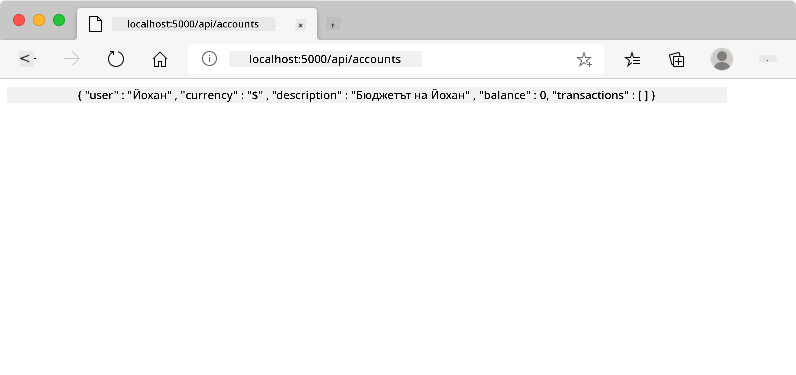
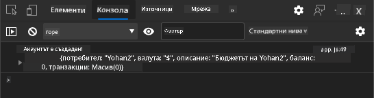
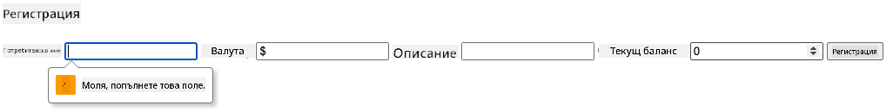
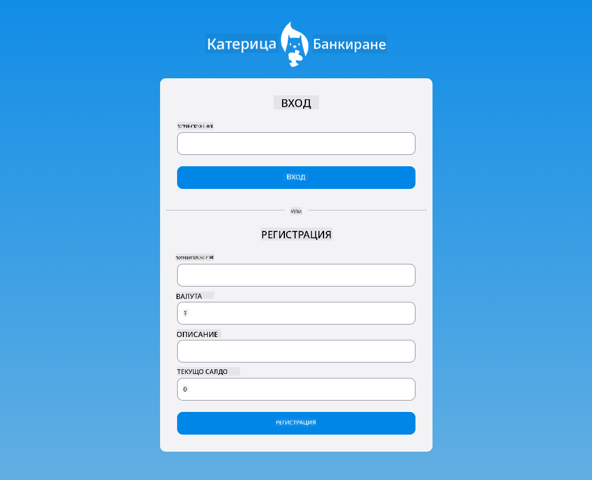

<!--
CO_OP_TRANSLATOR_METADATA:
{
  "original_hash": "b667b7d601e2ee19acb5aa9d102dc9f3",
  "translation_date": "2025-08-27T22:56:22+00:00",
  "source_file": "7-bank-project/2-forms/README.md",
  "language_code": "bg"
}
-->
# Създаване на Банкова Приложение Част 2: Създаване на Форма за Вход и Регистрация

## Предварителен Тест

[Предварителен тест](https://ashy-river-0debb7803.1.azurestaticapps.net/quiz/43)

### Въведение

В почти всички съвременни уеб приложения можете да създадете акаунт, за да имате свое собствено лично пространство. Тъй като множество потребители могат да имат достъп до уеб приложението едновременно, е необходим механизъм за съхранение на личните данни на всеки потребител отделно и за избор на информацията, която да се показва. Няма да разглеждаме как да управляваме [потребителската идентичност сигурно](https://en.wikipedia.org/wiki/Authentication), тъй като това е обширна тема сама по себе си, но ще се уверим, че всеки потребител може да създаде един (или повече) банкови акаунти в нашето приложение.

В тази част ще използваме HTML форми, за да добавим вход и регистрация към нашето уеб приложение. Ще видим как да изпращаме данни към сървърна API програмно и в крайна сметка как да дефинираме основни правила за валидиране на потребителски вход.

### Предпоставки

Трябва да сте завършили [HTML шаблони и маршрутизация](../1-template-route/README.md) на уеб приложението за този урок. Също така трябва да инсталирате [Node.js](https://nodejs.org) и [да стартирате сървърната API](../api/README.md) локално, за да можете да изпращате данни за създаване на акаунти.

**Обърнете внимание**
Ще имате два терминала, работещи едновременно, както е описано по-долу:
1. За основното банково приложение, което създадохме в урока [HTML шаблони и маршрутизация](../1-template-route/README.md)
2. За [сървърната API на Банковото Приложение](../api/README.md), която току-що настроихме.

Трябва да стартирате и двата сървъра, за да продължите с останалата част от урока. Те слушат на различни портове (порт `3000` и порт `5000`), така че всичко трябва да работи добре.

Можете да тествате дали сървърът работи правилно, като изпълните тази команда в терминал:

```sh
curl http://localhost:5000/api
# -> should return "Bank API v1.0.0" as a result
```

---

## Форма и контроли

Елементът `<form>` обхваща секция от HTML документ, където потребителят може да въвежда и изпраща данни чрез интерактивни контроли. Съществуват всякакви потребителски интерфейсни (UI) контроли, които могат да се използват в рамките на форма, като най-често срещаните са елементите `<input>` и `<button>`.

Има много различни [типове](https://developer.mozilla.org/docs/Web/HTML/Element/input) `<input>`, например за създаване на поле, където потребителят може да въведе своето потребителско име, можете да използвате:

```html
<input id="username" name="username" type="text">
```

Атрибутът `name` ще се използва като име на свойството, когато данните от формата бъдат изпратени. Атрибутът `id` се използва за асоцииране на `<label>` с контролата на формата.

> Разгледайте целия списък с [`<input>` типове](https://developer.mozilla.org/docs/Web/HTML/Element/input) и [други контроли на формата](https://developer.mozilla.org/docs/Learn/Forms/Other_form_controls), за да получите представа за всички вградени UI елементи, които можете да използвате при изграждането на вашия интерфейс.

✅ Забележете, че `<input>` е [празен елемент](https://developer.mozilla.org/docs/Glossary/Empty_element), на който не трябва да добавяте съответстващ затварящ таг. Можете обаче да използвате самозатварящата се нотация `<input/>`, но това не е задължително.

Елементът `<button>` в рамките на форма е малко специален. Ако не зададете неговия атрибут `type`, той автоматично ще изпрати данните от формата към сървъра, когато бъде натиснат. Ето възможните стойности за `type`:

- `submit`: По подразбиране в рамките на `<form>`, бутонът задейства действието за изпращане на формата.
- `reset`: Бутонът нулира всички контроли на формата до техните начални стойности.
- `button`: Не задава никакво поведение по подразбиране, когато бутонът бъде натиснат. Можете да му зададете персонализирани действия с помощта на JavaScript.

### Задача

Нека започнем с добавяне на форма към шаблона `login`. Ще ни трябва поле за *потребителско име* и бутон *Вход*.

```html
<template id="login">
  <h1>Bank App</h1>
  <section>
    <h2>Login</h2>
    <form id="loginForm">
      <label for="username">Username</label>
      <input id="username" name="user" type="text">
      <button>Login</button>
    </form>
  </section>
</template>
```

Ако погледнете по-отблизо, можете да забележите, че тук сме добавили и елемент `<label>`. Елементите `<label>` се използват за добавяне на име към UI контроли, като нашето поле за потребителско име. Етикетите са важни за четимостта на вашите форми, но също така идват с допълнителни предимства:

- Чрез асоцииране на етикет с контрола на формата, това помага на потребителите, използващи асистивни технологии (като екранен четец), да разберат какви данни се очаква да предоставят.
- Можете да кликнете върху етикета, за да поставите директно фокуса върху свързаното поле, което улеснява достъпа на устройства с тъчскрийн.

> [Достъпността](https://developer.mozilla.org/docs/Learn/Accessibility/What_is_accessibility) в уеб е много важна тема, която често се пренебрегва. Благодарение на [семантичните HTML елементи](https://developer.mozilla.org/docs/Learn/Accessibility/HTML) не е трудно да създадете достъпно съдържание, ако ги използвате правилно. Можете [да прочетете повече за достъпността](https://developer.mozilla.org/docs/Web/Accessibility), за да избегнете често срещани грешки и да станете отговорен разработчик.

Сега ще добавим втора форма за регистрация, точно под предишната:

```html
<hr/>
<h2>Register</h2>
<form id="registerForm">
  <label for="user">Username</label>
  <input id="user" name="user" type="text">
  <label for="currency">Currency</label>
  <input id="currency" name="currency" type="text" value="$">
  <label for="description">Description</label>
  <input id="description" name="description" type="text">
  <label for="balance">Current balance</label>
  <input id="balance" name="balance" type="number" value="0">
  <button>Register</button>
</form>
```

С помощта на атрибута `value` можем да дефинираме стойност по подразбиране за дадено поле.
Забележете също, че полето за `balance` има тип `number`. Изглежда ли различно от другите полета? Опитайте да взаимодействате с него.

✅ Можете ли да навигирате и взаимодействате с формите само с клавиатура? Как бихте направили това?

## Изпращане на данни към сървъра

Сега, когато имаме функционален интерфейс, следващата стъпка е да изпратим данните към сървъра. Нека направим бърз тест с текущия код: какво се случва, ако кликнете върху бутона *Вход* или *Регистрация*?

Забелязахте ли промяната в секцията с URL на браузъра?


По подразбиране действието на `<form>` е да изпрати формата към текущия URL на сървъра, използвайки [GET метода](https://www.w3.org/Protocols/rfc2616/rfc2616-sec9.html#sec9.3), като добавя данните от формата директно към URL. Този метод обаче има някои недостатъци:

- Изпратените данни са много ограничени по размер (около 2000 символа)
- Данните са директно видими в URL (не е подходящо за пароли)
- Не работи с качване на файлове

Затова можете да го промените, за да използва [POST метода](https://www.w3.org/Protocols/rfc2616/rfc2616-sec9.html#sec9.5), който изпраща данните от формата към сървъра в тялото на HTTP заявката, без предишните ограничения.

> Въпреки че POST е най-често използваният метод за изпращане на данни, [в някои специфични сценарии](https://www.w3.org/2001/tag/doc/whenToUseGet.html) е за предпочитане да се използва GET метод, например при имплементиране на поле за търсене.

### Задача

Добавете свойства `action` и `method` към формата за регистрация:

```html
<form id="registerForm" action="//localhost:5000/api/accounts" method="POST">
```

Сега опитайте да регистрирате нов акаунт с вашето име. След като кликнете върху бутона *Регистрация*, трябва да видите нещо подобно:



Ако всичко върви добре, сървърът трябва да отговори на вашата заявка с [JSON](https://www.json.org/json-en.html) отговор, съдържащ данните за създадения акаунт.

✅ Опитайте да се регистрирате отново със същото име. Какво се случва?

## Изпращане на данни без презареждане на страницата

Както вероятно забелязахте, има малък проблем с подхода, който току-що използвахме: при изпращане на формата, излизаме от нашето приложение и браузърът се пренасочва към URL на сървъра. Опитваме се да избегнем всички презареждания на страницата с нашето уеб приложение, тъй като създаваме [Едностранично приложение (SPA)](https://en.wikipedia.org/wiki/Single-page_application).

За да изпратим данните от формата към сървъра без да принуждаваме презареждане на страницата, трябва да използваме JavaScript код. Вместо да поставяме URL в свойството `action` на елемента `<form>`, можете да използвате произволен JavaScript код, предшестван от низа `javascript:`, за да изпълните персонализирано действие. Използването на това също означава, че ще трябва да имплементирате някои задачи, които преди това се изпълняваха автоматично от браузъра:

- Извличане на данните от формата
- Конвертиране и кодиране на данните в подходящ формат
- Създаване на HTTP заявка и изпращането й към сървъра

### Задача

Заменете `action` на формата за регистрация с:

```html
<form id="registerForm" action="javascript:register()">
```

Отворете `app.js` и добавете нова функция с име `register`:

```js
function register() {
  const registerForm = document.getElementById('registerForm');
  const formData = new FormData(registerForm);
  const data = Object.fromEntries(formData);
  const jsonData = JSON.stringify(data);
}
```

Тук извличаме елемента на формата с помощта на `getElementById()` и използваме помощника [`FormData`](https://developer.mozilla.org/docs/Web/API/FormData), за да извлечем стойностите от контролите на формата като набор от ключ/стойност двойки. След това конвертираме данните в обикновен обект с помощта на [`Object.fromEntries()`](https://developer.mozilla.org/docs/Web/JavaScript/Reference/Global_Objects/Object/fromEntries) и накрая сериализираме данните в [JSON](https://www.json.org/json-en.html), формат, който често се използва за обмен на данни в уеб.

Данните вече са готови за изпращане към сървъра. Създайте нова функция с име `createAccount`:

```js
async function createAccount(account) {
  try {
    const response = await fetch('//localhost:5000/api/accounts', {
      method: 'POST',
      headers: { 'Content-Type': 'application/json' },
      body: account
    });
    return await response.json();
  } catch (error) {
    return { error: error.message || 'Unknown error' };
  }
}
```

Какво прави тази функция? Първо, забележете ключовата дума `async` тук. Това означава, че функцията съдържа код, който ще се изпълнява [**асинхронно**](https://developer.mozilla.org/docs/Web/JavaScript/Reference/Statements/async_function). Когато се използва заедно с ключовата дума `await`, тя позволява изчакване за изпълнение на асинхронен код - като изчакване за отговор от сървъра тук - преди да продължи.

Ето кратко видео за използването на `async/await`:

[](https://youtube.com/watch?v=YwmlRkrxvkk "Async и Await за управление на обещания")

> 🎥 Кликнете върху изображението по-горе за видео за async/await.

Използваме API `fetch()`, за да изпратим JSON данни към сървъра. Този метод приема 2 параметъра:

- URL на сървъра, така че тук поставяме `//localhost:5000/api/accounts`.
- Настройките на заявката. Тук задаваме метода на `POST` и предоставяме `body` за заявката. Тъй като изпращаме JSON данни към сървъра, трябва също да зададем заглавката `Content-Type` на `application/json`, за да може сървърът да интерпретира съдържанието.

Тъй като сървърът ще отговори на заявката с JSON, можем да използваме `await response.json()`, за да анализираме JSON съдържанието и да върнем получения обект. Забележете, че този метод е асинхронен, така че използваме ключовата дума `await` тук, преди да върнем, за да се уверим, че всички грешки по време на анализа също са уловени.

Сега добавете малко код към функцията `register`, за да извикате `createAccount()`:

```js
const result = await createAccount(jsonData);
```

Тъй като използваме ключовата дума `await` тук, трябва да добавим ключовата дума `async` преди функцията register:

```js
async function register() {
```

Накрая, нека добавим някои логове, за да проверим резултата. Финалната функция трябва да изглежда така:

```js
async function register() {
  const registerForm = document.getElementById('registerForm');
  const formData = new FormData(registerForm);
  const jsonData = JSON.stringify(Object.fromEntries(formData));
  const result = await createAccount(jsonData);

  if (result.error) {
    return console.log('An error occurred:', result.error);
  }

  console.log('Account created!', result);
}
```

Това беше малко дълго, но стигнахме до целта! Ако отворите [инструментите за разработчици на браузъра](https://developer.mozilla.org/docs/Learn/Common_questions/What_are_browser_developer_tools) и опитате да регистрирате нов акаунт, не трябва да виждате никаква промяна на уеб страницата, но съобщение ще се появи в конзолата, потвърждавайки, че всичко работи.



✅ Смятате ли, че данните се изпращат към сървъра сигурно? Какво би станало, ако някой успее да прихване заявката? Можете да прочетете за [HTTPS](https://en.wikipedia.org/wiki/HTTPS), за да научите повече за сигурната комуникация на данни.

## Валидиране на данни

Ако опитате да регистрирате нов акаунт, без да зададете потребителско име, можете да видите, че сървърът връща грешка със статус код [400 (Bad Request)](https://developer.mozilla.org/docs/Web/HTTP/Status/400#:~:text=The%20HyperText%20Transfer%20Protocol%20(HTTP,%2C%20or%20deceptive%20request%20routing).).

Преди да изпращате данни към сървъра, е добра практика [да валидирате данните от формата](https://developer.mozilla.org/docs/Learn/Forms/Form_validation) предварително, когато е възможно, за да се уверите, че изпращате валидна заявка. HTML5 контролите на формите предоставят вградена валидирация чрез различни атрибути:

- `required`: полето трябва да бъде попълнено, иначе формата не може да бъде изпратена.
- `minlength` и `maxlength`: дефинират минималния и максималния брой символи в текстови полета.
- `min` и `max`: дефинират минималната и максималната стойност на числово поле.
- `type`: дефинира вида на очакваните данни, като `number`, `email`, `file` или [други вградени типове](https://developer.mozilla.org/docs/Web/HTML/Element/input). Този атрибут може също да промени визуалното представяне на контролата на формата.
- `pattern`: позволява дефиниране на [регулярен израз](https://developer.mozilla.org/docs/Web/JavaScript/Guide/Regular_Expressions), за да се провери дали въведените данни са валидни или не.
> Съвет: можете да персонализирате външния вид на вашите контролни елементи във формуляра в зависимост от това дали са валидни или не, като използвате CSS псевдокласовете `:valid` и `:invalid`.
### Задача

Има два задължителни полета за създаване на валиден нов акаунт: потребителско име и валута, като останалите полета са по избор. Актуализирайте HTML формата, като използвате както атрибута `required`, така и текст в етикета на полето, за да направите следното:

```html
<label for="user">Username (required)</label>
<input id="user" name="user" type="text" required>
...
<label for="currency">Currency (required)</label>
<input id="currency" name="currency" type="text" value="$" required>
```

Въпреки че тази конкретна сървърна имплементация не налага специфични ограничения за максималната дължина на полетата, винаги е добра практика да се задават разумни ограничения за всяко текстово поле, което потребителят попълва.

Добавете атрибут `maxlength` към текстовите полета:

```html
<input id="user" name="user" type="text" maxlength="20" required>
...
<input id="currency" name="currency" type="text" value="$" maxlength="5" required>
...
<input id="description" name="description" type="text" maxlength="100">
```

Сега, ако натиснете бутона *Регистрация* и някое поле не спазва зададените правила за валидиране, трябва да видите нещо подобно:



Валидацията, която се извършва *преди* изпращането на данни към сървъра, се нарича **клиентска валидация**. Но имайте предвид, че не винаги е възможно да се извършат всички проверки без изпращане на данни. Например, тук не можем да проверим дали вече съществува акаунт със същото потребителско име, без да изпратим заявка към сървъра. Допълнителната валидация, която се извършва на сървъра, се нарича **сървърна валидация**.

Обикновено и двете трябва да бъдат имплементирани, като клиентската валидация подобрява потребителското изживяване чрез предоставяне на незабавна обратна връзка, а сървърната валидация е от съществено значение, за да се гарантира, че данните, които обработвате, са надеждни и безопасни.

---

## 🚀 Предизвикателство

Покажете съобщение за грешка в HTML, ако потребителят вече съществува.

Ето пример за това как може да изглежда финалната страница за вход след малко стилизиране:



## Тест след лекцията

[Тест след лекцията](https://ashy-river-0debb7803.1.azurestaticapps.net/quiz/44)

## Преглед и самостоятелно обучение

Разработчиците са станали много креативни в усилията си за създаване на форми, особено по отношение на стратегии за валидация. Научете повече за различни подходи към формите, като разгледате [CodePen](https://codepen.com); можете ли да намерите интересни и вдъхновяващи форми?

## Задание

[Стилизирайте вашето банково приложение](assignment.md)

---

**Отказ от отговорност**:  
Този документ е преведен с помощта на AI услуга за превод [Co-op Translator](https://github.com/Azure/co-op-translator). Въпреки че се стремим към точност, моля, имайте предвид, че автоматизираните преводи може да съдържат грешки или неточности. Оригиналният документ на неговия роден език трябва да се счита за авторитетен източник. За критична информация се препоръчва професионален човешки превод. Не носим отговорност за недоразумения или погрешни интерпретации, произтичащи от използването на този превод.