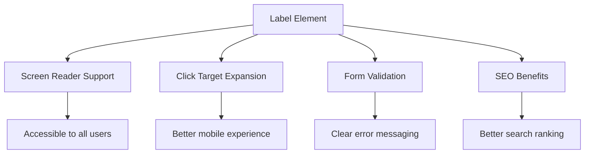
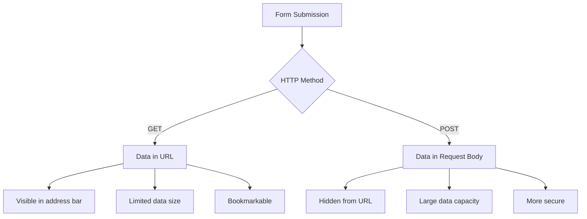
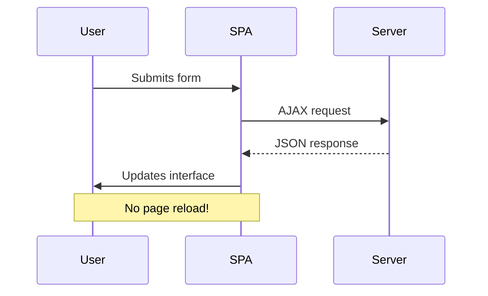
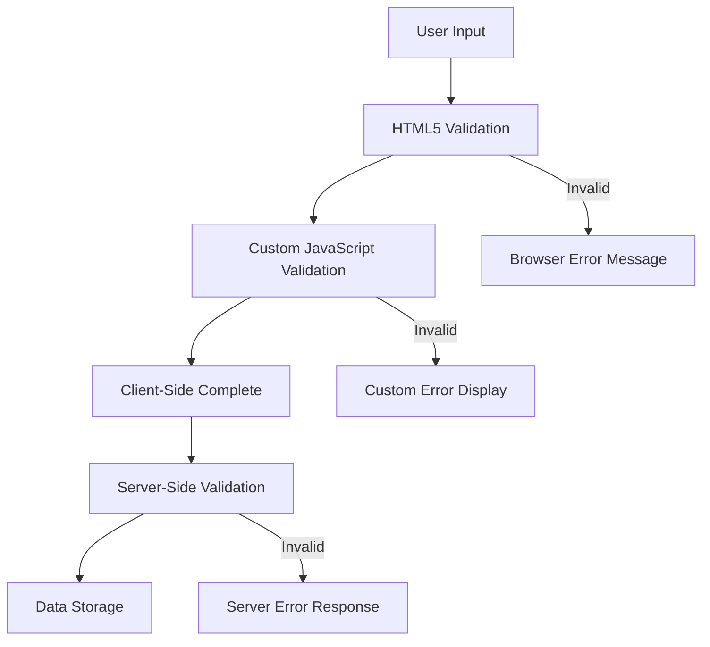
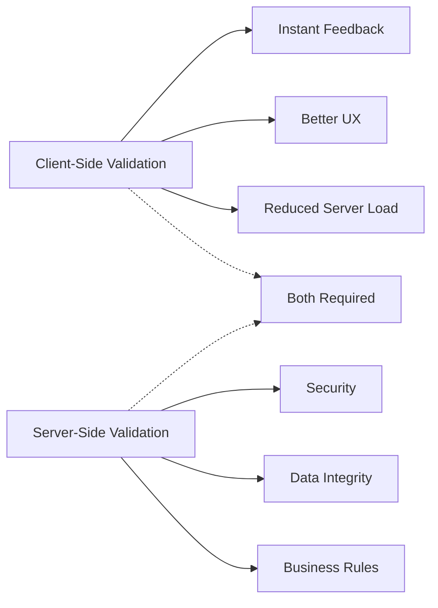

<!--
CO_OP_TRANSLATOR_METADATA:
{
  "original_hash": "b24f28fc46dd473aa9080f174182adde",
  "translation_date": "2025-10-24T22:50:05+00:00",
  "source_file": "7-bank-project/2-forms/README.md",
  "language_code": "bg"
}
-->
# Създаване на банково приложение, част 2: Създаване на форма за вход и регистрация

## Предварителен тест

[Предварителен тест](https://ff-quizzes.netlify.app/web/quiz/43)

Случвало ли ви се е да попълните онлайн форма и тя да отхвърли формата на вашия имейл? Или да загубите цялата информация, когато натиснете „Изпрати“? Всички сме се сблъсквали с тези разочароващи ситуации.

Формите са мостът между вашите потребители и функционалността на вашето приложение. Подобно на внимателните протоколи, които авиодиспечерите използват, за да насочват самолетите безопасно към техните дестинации, добре проектираните форми предоставят ясна обратна връзка и предотвратяват скъпи грешки. Лошо проектираните форми, от друга страна, могат да отблъснат потребителите по-бързо от недоразумение на натоварено летище.

В този урок ще трансформираме вашето статично банково приложение в интерактивно приложение. Ще научите как да създавате форми, които валидират потребителския вход, комуникират със сървъри и предоставят полезна обратна връзка. Помислете за това като за изграждане на контролен интерфейс, който позволява на потребителите да навигират функциите на вашето приложение.

До края ще имате пълна система за вход и регистрация с валидиране, която насочва потребителите към успех, вместо към разочарование.

## Предпоставки

Преди да започнем със създаването на форми, нека се уверим, че всичко е настроено правилно. Този урок продължава точно там, където спряхме в предишния, така че ако сте пропуснали напред, може да искате да се върнете и първо да настроите основите.

### Необходима настройка

| Компонент | Статус | Описание |
|-----------|--------|-------------|
| [HTML шаблони](../1-template-route/README.md) | ✅ Задължително | Основната структура на вашето банково приложение |
| [Node.js](https://nodejs.org) | ✅ Задължително | JavaScript среда за сървъра |
| [Bank API Server](../api/README.md) | ✅ Задължително | Бекенд услуга за съхранение на данни |

> 💡 **Съвет за разработка**: Ще стартирате два отделни сървъра едновременно – един за вашето фронтенд банково приложение и друг за бекенд API. Тази настройка отразява реалната разработка, където фронтенд и бекенд услуги работят независимо.

### Конфигурация на сървъра

**Вашата среда за разработка ще включва:**
- **Фронтенд сървър**: Обслужва вашето банково приложение (обикновено порт `3000`)
- **Бекенд API сървър**: Обработва съхранението и извличането на данни (порт `5000`)
- **И двата сървъра** могат да работят едновременно без конфликти

**Тестване на връзката с вашия API:**
```bash
curl http://localhost:5000/api
# Expected response: "Bank API v1.0.0"
```

**Ако видите отговор за версията на API, сте готови да продължите!**

---

## Разбиране на HTML форми и контроли

HTML формите са начинът, по който потребителите комуникират с вашето уеб приложение. Помислете за тях като за телеграфната система, която свързваше отдалечени места през 19-ти век – те са комуникационният протокол между намеренията на потребителя и отговора на приложението. Когато са проектирани внимателно, те улавят грешки, насочват форматирането на входа и предоставят полезни предложения.

Съвременните форми са значително по-усъвършенствани от основните текстови входове. HTML5 въведе специализирани типове вход, които автоматично обработват валидирането на имейли, форматирането на числа и избора на дати. Тези подобрения са от полза както за достъпността, така и за мобилното потребителско изживяване.

### Основни елементи на формата

**Строителни блокове, които всяка форма трябва да има:**

```html
<!-- Basic form structure -->
<form id="userForm" method="POST">
  <label for="username">Username</label>
  <input id="username" name="username" type="text" required>
  
  <button type="submit">Submit</button>
</form>
```

**Какво прави този код:**
- **Създава** контейнер за форма с уникален идентификатор
- **Определя** HTTP метода за подаване на данни
- **Свързва** етикети с входове за достъпност
- **Определя** бутон за изпращане за обработка на формата

### Съвременни типове вход и атрибути

| Тип вход | Цел | Пример за употреба |
|----------|-----|--------------------|
| `text` | Общ текстов вход | `<input type="text" name="username">` |
| `email` | Валидиране на имейл | `<input type="email" name="email">` |
| `password` | Скрит текстов вход | `<input type="password" name="password">` |
| `number` | Числов вход | `<input type="number" name="balance" min="0">` |
| `tel` | Телефонни номера | `<input type="tel" name="phone">` |

> 💡 **Предимство на съвременния HTML5**: Използването на специфични типове вход предоставя автоматично валидиране, подходящи мобилни клавиатури и по-добра поддръжка за достъпност без допълнителен JavaScript!

### Типове бутони и тяхното поведение

```html
<!-- Different button behaviors -->
<button type="submit">Save Data</button>     <!-- Submits the form -->
<button type="reset">Clear Form</button>    <!-- Resets all fields -->
<button type="button">Custom Action</button> <!-- No default behavior -->
```

**Какво прави всеки тип бутон:**
- **Бутон за изпращане**: Задейства подаването на формата и изпраща данни към посочената крайна точка
- **Бутон за нулиране**: Възстановява всички полета на формата до първоначалното им състояние
- **Обикновен бутон**: Не предоставя стандартно поведение, изисква персонализиран JavaScript за функционалност

> ⚠️ **Важно**: Елементът `<input>` е самозатварящ се и не изисква затварящ етикет. Съвременната най-добра практика е да пишете `<input>` без наклонена черта.

### Създаване на форма за вход

Сега нека създадем практическа форма за вход, която демонстрира съвременни HTML практики за форми. Ще започнем с основна структура и постепенно ще я подобрим с функции за достъпност и валидиране.

```html
<template id="login">
  <h1>Bank App</h1>
  <section>
    <h2>Login</h2>
    <form id="loginForm" novalidate>
      <div class="form-group">
        <label for="username">Username</label>
        <input id="username" name="user" type="text" required 
               autocomplete="username" placeholder="Enter your username">
      </div>
      <button type="submit">Login</button>
    </form>
  </section>
</template>
```

**Разбивка на случващото се тук:**
- **Структурира** формата със семантични HTML5 елементи
- **Групира** свързани елементи, използвайки `div` контейнери със значими класове
- **Свързва** етикети с входове, използвайки атрибутите `for` и `id`
- **Включва** съвременни атрибути като `autocomplete` и `placeholder` за по-добро потребителско изживяване
- **Добавя** `novalidate`, за да обработва валидирането с JavaScript вместо с браузър по подразбиране

### Силата на правилните етикети

**Защо етикетите са важни за съвременното уеб разработване:**



**Какво постигат правилните етикети:**
- **Позволяват** на екранните четци ясно да обявяват полетата на формата
- **Разширяват** зоната за кликване (кликването върху етикета фокусира входа)
- **Подобряват** използваемостта на мобилни устройства с по-големи целеви зони
- **Поддържат** валидирането на формата със значими съобщения за грешки
- **Подобряват** SEO, като предоставят семантично значение на елементите на формата

> 🎯 **Цел за достъпност**: Всеки вход на формата трябва да има свързан етикет. Тази проста практика прави вашите форми използваеми за всички, включително потребители с увреждания, и подобрява изживяването за всички потребители.

### Създаване на форма за регистрация

Формата за регистрация изисква по-подробна информация за създаване на пълен потребителски акаунт. Нека я изградим със съвременни HTML5 функции и подобрена достъпност.

```html
<hr/>
<h2>Register</h2>
<form id="registerForm" novalidate>
  <div class="form-group">
    <label for="user">Username</label>
    <input id="user" name="user" type="text" required 
           autocomplete="username" placeholder="Choose a username">
  </div>
  
  <div class="form-group">
    <label for="currency">Currency</label>
    <input id="currency" name="currency" type="text" value="$" 
           required maxlength="3" placeholder="USD, EUR, etc.">
  </div>
  
  <div class="form-group">
    <label for="description">Account Description</label>
    <input id="description" name="description" type="text" 
           maxlength="100" placeholder="Personal savings, checking, etc.">
  </div>
  
  <div class="form-group">
    <label for="balance">Starting Balance</label>
    <input id="balance" name="balance" type="number" value="0" 
           min="0" step="0.01" placeholder="0.00">
  </div>
  
  <button type="submit">Create Account</button>
</form>
```

**В горното сме:**
- **Организирали** всяко поле в контейнерни div елементи за по-добро стилизиране и оформление
- **Добавили** подходящи атрибути `autocomplete` за поддръжка на автоматично попълване от браузъра
- **Включили** полезен текст за подсказка, който да насочва потребителския вход
- **Задавали** разумни стойности по подразбиране, използвайки атрибута `value`
- **Приложили** атрибути за валидиране като `required`, `maxlength` и `min`
- **Използвали** `type="number"` за полето за баланс с поддръжка на десетични числа

### Изследване на типове вход и поведение

**Съвременните типове вход предоставят подобрена функционалност:**

| Функция | Полза | Пример |
|---------|-------|--------|
| `type="number"` | Числова клавиатура на мобилни устройства | По-лесно въвеждане на баланс |
| `step="0.01"` | Контрол на десетичната точност | Позволява въвеждане на стотинки в валута |
| `autocomplete` | Автоматично попълване от браузъра | По-бързо попълване на формата |
| `placeholder` | Контекстуални подсказки | Насочва очакванията на потребителя |

> 🎯 **Предизвикателство за достъпност**: Опитайте да навигирате формите, използвайки само клавиатурата! Използвайте `Tab`, за да преминавате между полетата, `Space`, за да маркирате квадратчета, и `Enter`, за да изпратите. Това преживяване ще ви помогне да разберете как потребителите на екранни четци взаимодействат с вашите форми.

## Разбиране на методите за подаване на форми

Когато някой попълни вашата форма и натисне „Изпрати“, тези данни трябва да отидат някъде – обикновено към сървър, който може да ги съхрани. Има няколко различни начина, по които това може да се случи, и знаейки кой да използвате, може да ви спести главоболия по-късно.

Нека разгледаме какво всъщност се случва, когато някой натисне бутона за изпращане.

### Поведение на формата по подразбиране

Първо, нека наблюдаваме какво се случва при основно подаване на форма:

**Тествайте текущите си форми:**
1. Натиснете бутона *Регистрация* във вашата форма
2. Наблюдавайте промените в адресната лента на вашия браузър
3. Забележете как страницата се презарежда и данните се появяват в URL


### Сравнение на HTTP методи



**Разбиране на разликите:**

| Метод | Случай на употреба | Местоположение на данните | Ниво на сигурност | Ограничение на размера |
|-------|--------------------|---------------------------|-------------------|-------------------------|
| `GET` | Търсене, филтри | Параметри в URL | Ниско (видимо) | ~2000 символа |
| `POST` | Потребителски акаунти, чувствителни данни | Тяло на заявката | Високо (скрито) | Няма практическо ограничение |

**Разбиране на основните разлики:**
- **GET**: Добавя данни от формата към URL като параметри на заявката (подходящо за операции по търсене)
- **POST**: Включва данни в тялото на заявката (необходимо за чувствителна информация)
- **Ограничения на GET**: Ограничения в размера, видими данни, постоянна история на браузъра
- **Предимства на POST**: Голям капацитет за данни, защита на личните данни, поддръжка за качване на файлове

> 💡 **Най-добра практика**: Използвайте `GET` за форми за търсене и филтри (извличане на данни), използвайте `POST` за регистрация на потребители, вход и създаване на данни.

### Конфигуриране на подаването на форма

Нека конфигурираме вашата форма за регистрация, за да комуникира правилно с бекенд API, използвайки метода POST:

```html
<form id="registerForm" action="//localhost:5000/api/accounts" 
      method="POST" novalidate>
```

**Какво прави тази конфигурация:**
- **Насочва** подаването на формата към вашата API крайна точка
- **Използва** метода POST за сигурно предаване на данни
- **Включва** `novalidate`, за да обработва валидирането с JavaScript

### Тестване на подаването на форма

**Следвайте тези стъпки, за да тествате вашата форма:**
1. **Попълнете** формата за регистрация с вашата информация
2. **Натиснете** бутона „Създаване на акаунт“
3. **Наблюдавайте** отговора на сървъра във вашия браузър


**Какво трябва да видите:**
- **Пренасочване на браузъра** към URL на API крайна точка
- **JSON отговор**, съдържащ данните за новосъздадения акаунт
- **Потвърждение от сървъра**, че акаунтът е успешно създаден

> 🧪 **Време за експеримент**: Опитайте да се регистрирате отново със същото потребителско име. Какъв отговор получавате? Това ще ви помогне да разберете как сървърът обработва дублирани данни и условия за грешки.

### Разбиране на JSON отговори

**Когато сървърът обработи вашата форма успешно:**
```json
{
  "user": "john_doe",
  "currency": "$",
  "description": "Personal savings",
  "balance": 100,
  "id": "unique_account_id"
}
```

**Този отговор потвърждава:**
- **Създава** нов акаунт с посочените от вас данни
- **Присвоява** уникален идентификатор за бъдеща справка
- **Връща** цялата информация за акаунта за проверка
- **Посочва** успешно съхранение в базата данни

## Съвременно обработване на форми с JavaScript

Традиционното подаване на форми причинява пълно презареждане на страницата, подобно на това как ранните космически мисии изискваха пълно нулиране на системата за корекции на курса. Този подход нарушава потребителското изживяване и губи състоянието на приложението.

Обработването на форми с JavaScript работи като системите за непрекъснато насочване, използвани от съвременните космически кораби – прави корекции в реално време, без да губи контекста на навигацията. Можем да прихванем подаването на форми, да предоставим незабавна обратна връзка, да обработим грешките плавно и да актуализираме интерфейса въз основа на отговорите на сървъра, като същевременно запазим позицията на потребителя в приложението.

### Защо да избягваме презареждането на страницата?



**Ползи от обработването на форми с JavaScript:**
- **Запазва** състоянието на приложението и контекста на потребителя
- **Предоставя** незабавна обратна връзка и индикатори за зареждане
- **Позволява** динамично обработване на грешки и валидиране
- **Създава** плавно, подобно на приложение потребителско изживяване
- **Позволява** условна логика въз основа на отговорите на сървъра

### Преход от традиционни към съвременни форми

**Предизвикателства на традиционния подход:**
- **
- **Осигурява** подробни съобщения за грешки за отстраняване на проблеми
- **Връща** последователна структура на данни за успешни и неуспешни случаи

### Силата на съвременния Fetch API

**Предимства на Fetch API пред по-старите методи:**

| Функция | Полза | Имплементация |
|---------|-------|---------------|
| Базиран на Promise | Чист асинхронен код | `await fetch()` |
| Персонализация на заявките | Пълен HTTP контрол | Headers, methods, body |
| Обработка на отговори | Гъвкаво парсване на данни | `.json()`, `.text()`, `.blob()` |
| Обработка на грешки | Изчерпателно улавяне на грешки | Try/catch блокове |

> 🎥 **Научете повече**: [Урок за Async/Await](https://youtube.com/watch?v=YwmlRkrxvkk) - Разбиране на асинхронните JavaScript модели за съвременно уеб разработване.

**Основни концепции за комуникация със сървъра:**
- **Асинхронни функции** позволяват пауза на изпълнението, за да се изчака отговор от сървъра
- **Ключовата дума await** прави асинхронния код да изглежда като синхронен
- **Fetch API** предоставя съвременни HTTP заявки, базирани на Promise
- **Обработка на грешки** гарантира, че приложението реагира адекватно на проблеми с мрежата

### Завършване на функцията за регистрация

Нека съберем всичко в една пълна, готова за производство функция за регистрация:

```javascript
async function register() {
  const registerForm = document.getElementById('registerForm');
  const submitButton = registerForm.querySelector('button[type="submit"]');
  
  try {
    // Show loading state
    submitButton.disabled = true;
    submitButton.textContent = 'Creating Account...';
    
    // Process form data
    const formData = new FormData(registerForm);
    const jsonData = JSON.stringify(Object.fromEntries(formData));
    
    // Send to server
    const result = await createAccount(jsonData);
    
    if (result.error) {
      console.error('Registration failed:', result.error);
      alert(`Registration failed: ${result.error}`);
      return;
    }
    
    console.log('Account created successfully!', result);
    alert(`Welcome, ${result.user}! Your account has been created.`);
    
    // Reset form after successful registration
    registerForm.reset();
    
  } catch (error) {
    console.error('Unexpected error:', error);
    alert('An unexpected error occurred. Please try again.');
  } finally {
    // Restore button state
    submitButton.disabled = false;
    submitButton.textContent = 'Create Account';
  }
}
```

**Тази подобрена имплементация включва:**
- **Осигурява** визуална обратна връзка по време на изпращане на формата
- **Деактивира** бутона за изпращане, за да предотврати дублирани изпращания
- **Обработва** както очаквани, така и неочаквани грешки
- **Показва** удобни за потребителя съобщения за успех и грешка
- **Нулира** формата след успешна регистрация
- **Възстановява** състоянието на интерфейса независимо от резултата

### Тестване на вашата имплементация

**Отворете инструментите за разработчици на браузъра и тествайте регистрацията:**

1. **Отворете** конзолата на браузъра (F12 → таб Console)
2. **Попълнете** формата за регистрация
3. **Кликнете** върху "Създай акаунт"
4. **Наблюдавайте** съобщенията в конзолата и обратната връзка към потребителя


**Какво трябва да видите:**
- **Състояние на зареждане** се появява на бутона за изпращане
- **Логове в конзолата** показват подробна информация за процеса
- **Съобщение за успех** се появява при успешно създаване на акаунт
- **Формата се нулира** автоматично след успешно изпращане

> 🔒 **Съображение за сигурност**: В момента данните се предават през HTTP, което не е безопасно за производство. В реални приложения винаги използвайте HTTPS за криптиране на предаването на данни. Научете повече за [HTTPS сигурност](https://en.wikipedia.org/wiki/HTTPS) и защо е важно за защита на потребителските данни.

## Комплексна валидация на формата

Валидацията на формата предотвратява неприятното изживяване от откриване на грешки едва след изпращане. Подобно на многобройните резервни системи на Международната космическа станция, ефективната валидация използва множество слоеве за безопасност.

Оптималният подход комбинира валидация на ниво браузър за незабавна обратна връзка, JavaScript валидация за подобрено потребителско изживяване и сървърна валидация за сигурност и интегритет на данните. Тази излишност гарантира както удовлетвореността на потребителя, така и защитата на системата.

### Разбиране на слоевете на валидация



**Стратегия за многослойна валидация:**
- **HTML5 валидация**: Незабавни проверки на ниво браузър
- **JavaScript валидация**: Персонализирана логика и потребителско изживяване
- **Сървърна валидация**: Финални проверки за сигурност и интегритет на данните
- **Прогресивно подобрение**: Работи дори ако JavaScript е деактивиран

### HTML5 атрибути за валидация

**Съвременни инструменти за валидация на ваше разположение:**

| Атрибут | Цел | Пример за използване | Поведение на браузъра |
|---------|-----|----------------------|-----------------------|
| `required` | Задължителни полета | `<input required>` | Предотвратява изпращане на празни полета |
| `minlength`/`maxlength` | Ограничения за дължина на текста | `<input maxlength="20">` | Налага ограничения за символи |
| `min`/`max` | Числови диапазони | `<input min="0" max="1000">` | Валидира граници на числа |
| `pattern` | Персонализирани regex правила | `<input pattern="[A-Za-z]+">` | Съответства на специфични формати |
| `type` | Валидация на тип данни | `<input type="email">` | Валидация за специфични формати |

### CSS стилизиране на валидацията

**Създайте визуална обратна връзка за състоянията на валидация:**

```css
/* Valid input styling */
input:valid {
  border-color: #28a745;
  background-color: #f8fff9;
}

/* Invalid input styling */
input:invalid {
  border-color: #dc3545;
  background-color: #fff5f5;
}

/* Focus states for better accessibility */
input:focus:valid {
  box-shadow: 0 0 0 0.2rem rgba(40, 167, 69, 0.25);
}

input:focus:invalid {
  box-shadow: 0 0 0 0.2rem rgba(220, 53, 69, 0.25);
}
```

**Какво постигат тези визуални подсказки:**
- **Зелени рамки**: Показват успешна валидация, подобно на зелени светлини в контролния център
- **Червени рамки**: Сигнализират за грешки във валидацията, които изискват внимание
- **Акценти при фокус**: Осигуряват ясна визуална ориентация за текущото местоположение на въвеждане
- **Последователно стилизиране**: Създава предсказуеми модели на интерфейса, които потребителите могат да научат

> 💡 **Полезен съвет**: Използвайте CSS псевдокласовете `:valid` и `:invalid`, за да предоставите незабавна визуална обратна връзка, докато потребителите въвеждат данни, създавайки отзивчив и полезен интерфейс.

### Имплементиране на комплексна валидация

Нека подобрим вашата форма за регистрация с надеждна валидация, която осигурява отлично потребителско изживяване и качество на данните:

```html
<form id="registerForm" method="POST" novalidate>
  <div class="form-group">
    <label for="user">Username <span class="required">*</span></label>
    <input id="user" name="user" type="text" required 
           minlength="3" maxlength="20" 
           pattern="[a-zA-Z0-9_]+" 
           autocomplete="username"
           title="Username must be 3-20 characters, letters, numbers, and underscores only">
    <small class="form-text">Choose a unique username (3-20 characters)</small>
  </div>
  
  <div class="form-group">
    <label for="currency">Currency <span class="required">*</span></label>
    <input id="currency" name="currency" type="text" required 
           value="$" maxlength="3" 
           pattern="[A-Z$€£¥₹]+" 
           title="Enter a valid currency symbol or code">
    <small class="form-text">Currency symbol (e.g., $, €, £)</small>
  </div>
  
  <div class="form-group">
    <label for="description">Account Description</label>
    <input id="description" name="description" type="text" 
           maxlength="100" 
           placeholder="Personal savings, checking, etc.">
    <small class="form-text">Optional description (up to 100 characters)</small>
  </div>
  
  <div class="form-group">
    <label for="balance">Starting Balance</label>
    <input id="balance" name="balance" type="number" 
           value="0" min="0" step="0.01" 
           title="Enter a positive number for your starting balance">
    <small class="form-text">Initial account balance (minimum $0.00)</small>
  </div>
  
  <button type="submit">Create Account</button>
</form>
```

**Разбиране на подобрената валидация:**
- **Комбинира** индикатори за задължителни полета с полезни описания
- **Включва** атрибути `pattern` за валидация на формати
- **Осигурява** атрибути `title` за достъпност и подсказки
- **Добавя** помощен текст за насочване на потребителите
- **Използва** семантична HTML структура за по-добра достъпност

### Разширени правила за валидация

**Какво постигат всяко правило за валидация:**

| Поле | Правила за валидация | Полза за потребителя |
|------|----------------------|----------------------|
| Потребителско име | `required`, `minlength="3"`, `maxlength="20"`, `pattern="[a-zA-Z0-9_]+"` | Осигурява валидни, уникални идентификатори |
| Валута | `required`, `maxlength="3"`, `pattern="[A-Z$€£¥₹]+"` | Приема често срещани символи за валута |
| Баланс | `min="0"`, `step="0.01"`, `type="number"` | Предотвратява отрицателни баланси |
| Описание | `maxlength="100"` | Разумни ограничения за дължина |

### Тестване на поведението на валидацията

**Опитайте тези сценарии за валидация:**
1. **Изпратете** формата с празни задължителни полета
2. **Въведете** потребителско име, по-кратко от 3 символа
3. **Опитайте** специални символи в полето за потребителско име
4. **Въведете** отрицателна сума за баланс


**Какво ще наблюдавате:**
- **Браузърът показва** съобщения за валидация
- **Стилизиране се променя** според състоянията `:valid` и `:invalid`
- **Изпращането на формата** се предотвратява, докато всички валидации не преминат
- **Фокусът автоматично** се премества към първото невалидно поле

### Клиентска срещу сървърна валидация



**Защо са необходими и двата слоя:**
- **Клиентска валидация**: Осигурява незабавна обратна връзка и подобрява потребителското изживяване
- **Сървърна валидация**: Гарантира сигурност и обработва сложни бизнес правила
- **Комбиниран подход**: Създава надеждни, удобни за потребителя и сигурни приложения
- **Прогресивно подобрение**: Работи дори когато JavaScript е деактивиран

> 🛡️ **Напомняне за сигурност**: Никога не се доверявайте само на клиентската валидация! Злонамерени потребители могат да я заобиколят, затова сървърната валидация е от съществено значение за сигурността и интегритета на данните.

---

---

## Предизвикателство с GitHub Copilot Agent 🚀

Използвайте режим Agent, за да завършите следното предизвикателство:

**Описание:** Подобрете формата за регистрация с комплексна клиентска валидация и обратна връзка към потребителя. Това предизвикателство ще ви помогне да упражните валидация на формата, обработка на грешки и подобряване на потребителското изживяване с интерактивна обратна връзка.

**Задача:** Създайте пълна система за валидация на формата за регистрация, която включва: 1) Обратна връзка в реално време за всяко поле, докато потребителят въвежда данни, 2) Персонализирани съобщения за валидация, които се появяват под всяко поле за въвеждане, 3) Поле за потвърждение на парола с валидация за съвпадение, 4) Визуални индикатори (като зелени отметки за валидни полета и червени предупреждения за невалидни), 5) Бутон за изпращане, който се активира само когато всички валидации преминат. Използвайте HTML5 атрибути за валидация, CSS за стилизиране на състоянията на валидация и JavaScript за интерактивно поведение.

Научете повече за [режим Agent](https://code.visualstudio.com/blogs/2025/02/24/introducing-copilot-agent-mode) тук.

## 🚀 Предизвикателство

Покажете съобщение за грешка в HTML, ако потребителят вече съществува.

Ето пример как може да изглежда финалната страница за вход след малко стилизиране:


## Тест след лекцията

[Тест след лекцията](https://ff-quizzes.netlify.app/web/quiz/44)

## Преглед и самостоятелно обучение

Разработчиците са станали много креативни в своите усилия за създаване на форми, особено по отношение на стратегиите за валидация. Научете за различни потоци на форми, като разгледате [CodePen](https://codepen.com); можете ли да намерите интересни и вдъхновяващи форми?

## Задача

[Стилизирайте вашето банково приложение](assignment.md)

---

**Отказ от отговорност**:  
Този документ е преведен с помощта на AI услуга за превод [Co-op Translator](https://github.com/Azure/co-op-translator). Въпреки че се стремим към точност, моля, имайте предвид, че автоматизираните преводи може да съдържат грешки или неточности. Оригиналният документ на неговия роден език трябва да се счита за авторитетен източник. За критична информация се препоръчва професионален човешки превод. Не носим отговорност за недоразумения или погрешни интерпретации, произтичащи от използването на този превод.