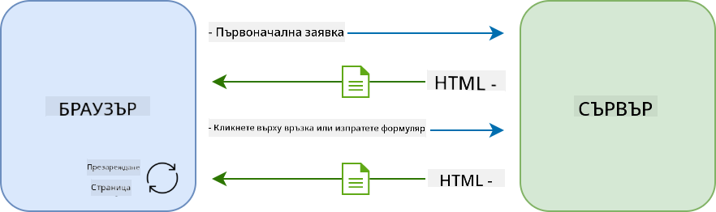
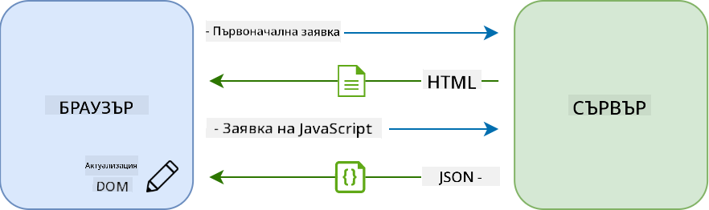
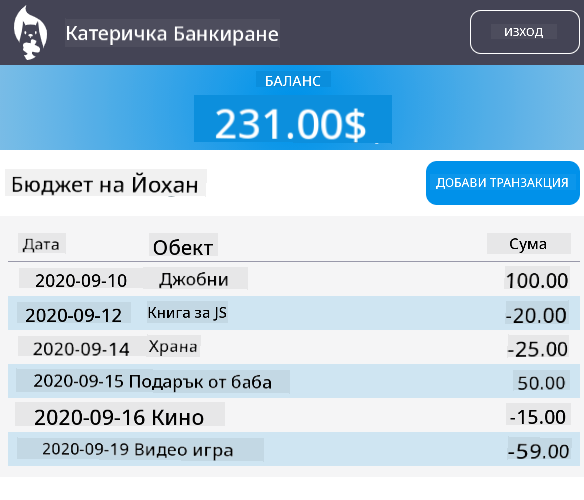

<!--
CO_OP_TRANSLATOR_METADATA:
{
  "original_hash": "f587e913e3f7c0b1c549a05dd74ee8e5",
  "translation_date": "2025-08-28T07:31:53+00:00",
  "source_file": "7-bank-project/3-data/README.md",
  "language_code": "bg"
}
-->
# Създаване на Банкова Приложение Част 3: Методи за Извличане и Използване на Данни

## Предварителен Тест

[Предварителен тест](https://ashy-river-0debb7803.1.azurestaticapps.net/quiz/45)

### Въведение

В основата на всяко уеб приложение стои *данните*. Данните могат да приемат различни форми, но основната им цел винаги е да предоставят информация на потребителя. С развитието на уеб приложенията, които стават все по-интерактивни и сложни, начинът, по който потребителят достъпва и взаимодейства с информацията, е ключова част от уеб разработката.

В този урок ще разгледаме как да извличаме данни от сървър асинхронно и как да използваме тези данни, за да показваме информация на уеб страница без презареждане на HTML.

### Предварителни изисквания

Трябва да сте създали [Формата за Вход и Регистрация](../2-forms/README.md) като част от уеб приложението за този урок. Също така трябва да инсталирате [Node.js](https://nodejs.org) и [да стартирате сървърния API](../api/README.md) локално, за да получите данни за акаунта.

Можете да тествате дали сървърът работи правилно, като изпълните следната команда в терминала:

```sh
curl http://localhost:5000/api
# -> should return "Bank API v1.0.0" as a result
```

---

## AJAX и извличане на данни

Традиционните уеб сайтове обновяват съдържанието, когато потребителят избере линк или изпрати данни чрез форма, като презареждат цялата HTML страница. Всеки път, когато трябва да се заредят нови данни, уеб сървърът връща изцяло нова HTML страница, която трябва да бъде обработена от браузъра, прекъсвайки текущото действие на потребителя и ограничавайки взаимодействията по време на презареждането. Този работен процес е известен като *Многостранично Приложение* или *MPA*.



С развитието на по-сложни и интерактивни уеб приложения се появи нова техника, наречена [AJAX (Асинхронен JavaScript и XML)](https://en.wikipedia.org/wiki/Ajax_(programming)). Тази техника позволява на уеб приложенията да изпращат и получават данни от сървър асинхронно с помощта на JavaScript, без да се налага презареждане на HTML страницата, което води до по-бързи актуализации и по-гладки взаимодействия с потребителя. Когато нови данни се получат от сървъра, текущата HTML страница може да бъде обновена с JavaScript чрез [DOM](https://developer.mozilla.org/docs/Web/API/Document_Object_Model) API. С времето този подход еволюира в това, което сега наричаме [*Едностранично Приложение* или *SPA*](https://en.wikipedia.org/wiki/Single-page_application).



Когато AJAX беше въведен за първи път, единственият наличен API за асинхронно извличане на данни беше [`XMLHttpRequest`](https://developer.mozilla.org/docs/Web/API/XMLHttpRequest/Using_XMLHttpRequest). Но съвременните браузъри вече поддържат по-удобния и мощен [`Fetch` API](https://developer.mozilla.org/docs/Web/API/Fetch_API), който използва обещания (promises) и е по-подходящ за работа с JSON данни.

> Въпреки че всички съвременни браузъри поддържат `Fetch API`, ако искате вашето уеб приложение да работи на стари браузъри, винаги е добра идея да проверите [таблицата за съвместимост на caniuse.com](https://caniuse.com/fetch).

### Задача

В [предишния урок](../2-forms/README.md) имплементирахме формата за регистрация, за да създадем акаунт. Сега ще добавим код за вход с вече съществуващ акаунт и извличане на неговите данни. Отворете файла `app.js` и добавете нова функция `login`:

```js
async function login() {
  const loginForm = document.getElementById('loginForm')
  const user = loginForm.user.value;
}
```

Тук започваме с извличане на елемента на формата чрез `getElementById()`, след което получаваме потребителското име от полето за вход с `loginForm.user.value`. Всеки контрол на формата може да бъде достъпен чрез неговото име (зададено в HTML чрез атрибута `name`) като свойство на формата.

По подобен начин на това, което направихме за регистрацията, ще създадем друга функция за изпълнение на заявка към сървъра, но този път за извличане на данни за акаунта:

```js
async function getAccount(user) {
  try {
    const response = await fetch('//localhost:5000/api/accounts/' + encodeURIComponent(user));
    return await response.json();
  } catch (error) {
    return { error: error.message || 'Unknown error' };
  }
}
```

Използваме `fetch` API, за да заявим данните асинхронно от сървъра, но този път не се нуждаем от допълнителни параметри освен URL адреса, тъй като само извличаме данни. По подразбиране `fetch` създава HTTP заявка от тип [`GET`](https://developer.mozilla.org/docs/Web/HTTP/Methods/GET), което е точно това, което ни трябва тук.

✅ `encodeURIComponent()` е функция, която кодира специални символи за URL. Какви проблеми бихме могли да имаме, ако не извикаме тази функция и използваме директно стойността на `user` в URL?

Сега нека актуализираме нашата функция `login`, за да използва `getAccount`:

```js
async function login() {
  const loginForm = document.getElementById('loginForm')
  const user = loginForm.user.value;
  const data = await getAccount(user);

  if (data.error) {
    return console.log('loginError', data.error);
  }

  account = data;
  navigate('/dashboard');
}
```

Първо, тъй като `getAccount` е асинхронна функция, трябва да я съчетаем с ключовата дума `await`, за да изчакаме резултата от сървъра. Както при всяка заявка към сървър, трябва да се справим и с грешки. Засега ще добавим само съобщение за грешка в конзолата и ще се върнем към това по-късно.

След това трябва да съхраним данните някъде, за да можем по-късно да ги използваме за показване на информацията на таблото. Тъй като променливата `account` все още не съществува, ще създадем глобална променлива за нея в началото на нашия файл:

```js
let account = null;
```

След като данните за потребителя са запазени в променлива, можем да преминем от страницата за *вход* към *таблото* с помощта на функцията `navigate()`, която вече имаме.

Накрая, трябва да извикаме нашата функция `login`, когато формата за вход е изпратена, като модифицираме HTML:

```html
<form id="loginForm" action="javascript:login()">
```

Тествайте дали всичко работи правилно, като регистрирате нов акаунт и опитате да влезете с него.

Преди да преминем към следващата част, можем също да завършим функцията `register`, като добавим това в края на функцията:

```js
account = result;
navigate('/dashboard');
```

✅ Знаете ли, че по подразбиране можете да извиквате сървърни API само от *същия домейн и порт*, от който разглеждате уеб страницата? Това е механизъм за сигурност, наложен от браузърите. Но изчакайте, нашето уеб приложение работи на `localhost:3000`, докато сървърният API работи на `localhost:5000`. Защо тогава работи? Чрез използване на техника, наречена [Споделяне на Ресурси между Различни Произходи (CORS)](https://developer.mozilla.org/docs/Web/HTTP/CORS), е възможно да се изпълняват HTTP заявки между различни произходи, ако сървърът добави специални заглавия към отговора, позволяващи изключения за конкретни домейни.

> Научете повече за API, като преминете този [урок](https://docs.microsoft.com/learn/modules/use-apis-discover-museum-art/?WT.mc_id=academic-77807-sagibbon)

## Актуализиране на HTML за показване на данни

Сега, когато разполагаме с данните за потребителя, трябва да актуализираме съществуващия HTML, за да ги покажем. Вече знаем как да извличаме елемент от DOM, например с `document.getElementById()`. След като имате базов елемент, ето някои API, които можете да използвате, за да го модифицирате или добавите дъщерни елементи към него:

- С помощта на свойството [`textContent`](https://developer.mozilla.org/docs/Web/API/Node/textContent) можете да промените текста на елемента. Имайте предвид, че промяната на тази стойност премахва всички дъщерни елементи (ако има такива) и ги заменя с предоставения текст. Това също е ефективен метод за премахване на всички дъщерни елементи на даден елемент, като му зададете празен низ `''`.

- С помощта на [`document.createElement()`](https://developer.mozilla.org/docs/Web/API/Document/createElement) заедно с метода [`append()`](https://developer.mozilla.org/docs/Web/API/ParentNode/append) можете да създавате и прикачвате един или повече нови дъщерни елементи.

✅ С помощта на свойството [`innerHTML`](https://developer.mozilla.org/docs/Web/API/Element/innerHTML) на елемент също е възможно да промените неговото HTML съдържание, но това трябва да се избягва, тъй като е уязвимо към [атаки чрез междусайтово скриптиране (XSS)](https://developer.mozilla.org/docs/Glossary/Cross-site_scripting).

### Задача

Преди да преминем към екрана на таблото, има още нещо, което трябва да направим на страницата за *вход*. В момента, ако се опитате да влезете с потребителско име, което не съществува, съобщение се показва в конзолата, но за обикновения потребител нищо не се променя и не е ясно какво се случва.

Нека добавим елемент за запазване на място във формата за вход, където можем да показваме съобщение за грешка, ако е необходимо. Добро място би било точно преди бутона за вход `<button>`:

```html
...
<div id="loginError"></div>
<button>Login</button>
...
```

Този `<div>` елемент е празен, което означава, че нищо няма да се показва на екрана, докато не добавим съдържание към него. Също така му даваме `id`, за да можем лесно да го извличаме с JavaScript.

Върнете се към файла `app.js` и създайте нова помощна функция `updateElement`:

```js
function updateElement(id, text) {
  const element = document.getElementById(id);
  element.textContent = text;
}
```

Тази функция е доста проста: като се дадат *id* на елемент и *текст*, тя ще актуализира текстовото съдържание на DOM елемента с даденото `id`. Нека използваме този метод вместо предишното съобщение за грешка във функцията `login`:

```js
if (data.error) {
  return updateElement('loginError', data.error);
}
```

Сега, ако се опитате да влезете с невалиден акаунт, трябва да видите нещо подобно:


Сега имаме текст за грешка, който се показва визуално, но ако го опитате със скрийн рийдър, ще забележите, че нищо не се обявява. За да може текст, който се добавя динамично към страница, да бъде обявен от скрийн рийдъри, ще трябва да използва нещо, наречено [Жива Област (Live Region)](https://developer.mozilla.org/docs/Web/Accessibility/ARIA/ARIA_Live_Regions). Тук ще използваме специфичен тип жива област, наречена предупреждение:

```html
<div id="loginError" role="alert"></div>
```

Имплементирайте същото поведение за грешките във функцията `register` (не забравяйте да актуализирате HTML).

## Показване на информация на таблото

С помощта на същите техники, които току-що разгледахме, ще се погрижим и за показването на информацията за акаунта на страницата на таблото.

Ето как изглежда обектът на акаунта, получен от сървъра:

```json
{
  "user": "test",
  "currency": "$",
  "description": "Test account",
  "balance": 75,
  "transactions": [
    { "id": "1", "date": "2020-10-01", "object": "Pocket money", "amount": 50 },
    { "id": "2", "date": "2020-10-03", "object": "Book", "amount": -10 },
    { "id": "3", "date": "2020-10-04", "object": "Sandwich", "amount": -5 }
  ],
}
```

> Забележка: за да улесните работата си, можете да използвате предварително създадения акаунт `test`, който вече е попълнен с данни.

### Задача

Нека започнем, като заменим секцията "Баланс" в HTML, за да добавим елементи за запазване на място:

```html
<section>
  Balance: <span id="balance"></span><span id="currency"></span>
</section>
```

Също така ще добавим нова секция точно под нея, за да показваме описанието на акаунта:

```html
<h2 id="description"></h2>
```

✅ Тъй като описанието на акаунта функционира като заглавие за съдържанието под него, то е маркирано семантично като заглавие. Научете повече за това как [структурата на заглавията](https://www.nomensa.com/blog/2017/how-structure-headings-web-accessibility) е важна за достъпността и направете критичен преглед на страницата, за да определите какво друго би могло да бъде заглавие.

След това ще създадем нова функция в `app.js`, за да попълним елементите за запазване на място:

```js
function updateDashboard() {
  if (!account) {
    return navigate('/login');
  }

  updateElement('description', account.description);
  updateElement('balance', account.balance.toFixed(2));
  updateElement('currency', account.currency);
}
```

Първо, проверяваме дали разполагаме с необходимите данни за акаунта, преди да продължим. След това използваме функцията `updateElement()`, която създадохме по-рано, за да актуализираме HTML.

> За да направим показването на баланса по-привлекателно, използваме метода [`toFixed(2)`](https://developer.mozilla.org/docs/Web/JavaScript/Reference/Global_Objects/Number/toFixed), за да принудим показването на стойността с 2 цифри след десетичната запетая.

Сега трябва да извикаме нашата функция `updateDashboard()` всеки път, когато таблото се зарежда. Ако вече сте завършили [заданието от урок 1](../1-template-route/assignment.md), това трябва да е лесно, в противен случай можете да използвате следната имплементация.

Добавете този код в края на функцията `updateRoute()`:

```js
if (typeof route.init === 'function') {
  route.init();
}
```

И актуализирайте дефиницията на маршрутите със:

```js
const routes = {
  '/login': { templateId: 'login' },
  '/dashboard': { templateId: 'dashboard', init: updateDashboard }
};
```

С тази промяна, всеки път, когато страницата на таблото се показва, се извиква функцията `updateDashboard()`. След вход трябва да можете да видите баланса на акаунта, валутата и описанието.

## Създаване на редове в таблица динамично с HTML шаблони

В [първия урок](../1-template-route/README.md) използвахме HTML шаблони заедно с метода [`appendChild()`](https://developer.mozilla.org/docs/Web/API/Node/appendChild), за да имплементираме навигацията в нашето приложение. Шаблоните могат да бъдат и по-малки и да се използват за динамично попълване на повтарящи се части от страница.

Ще използваме подобен подход, за да покажем списъка с транзакции в HTML таблица.

### Задача

Добавете нов шаблон в `<body>` на HTML:

```html
<template id="transaction">
  <tr>
    <td></td>
    <td></td>
    <td></td>
  </tr>
</template>
```

Този шаблон представлява един ред в таблицата с трите колони, които искаме да попълним: *дата*, *обект* и *сума* на транзакцията.

След това добавете този `id` атрибут към `<tbody>` елемента на таблицата в шаблона на таблото, за да го направите по-лесен за намиране с JavaScript:

```html
<tbody id="transactions"></tbody>
```

Нашият HTML е готов, нека преминем към JavaScript кода и създадем нова функция `createTransactionRow`:

```js
function createTransactionRow(transaction) {
  const template = document.getElementById('transaction');
  const transactionRow = template.content.cloneNode(true);
  const tr = transactionRow.querySelector('tr');
  tr.children[0].textContent = transaction.date;
  tr.children[1].textContent = transaction.object;
  tr.children[2].textContent = transaction.amount.toFixed(2);
  return transactionRow;
}
```

Тази функция прави точно това, което подсказва името ѝ: използвайки шаблона, който създадохме по-рано, тя създава нов ред в таблицата и попълва съдържанието му с данни за транзакцията. Ще използваме това в нашата функция `updateDashboard()`, за да попълним таблицата:

```js
const transactionsRows = document.createDocumentFragment();
for (const transaction of account.transactions) {
  const transactionRow = createTransactionRow(transaction);
  transactionsRows.appendChild(transactionRow);
}
updateElement('transactions', transactionsRows);
```

Тук използваме метода [`document.createDocumentFragment()`](https://developer.mozilla.org/docs/Web/API/Document/createDocumentFragment), който създава нов DOM фрагмент, върху който можем да работим, преди накрая да го прикачим към нашата HTML таблица.

Остава
Ако опитате да влезете с акаунта `test`, вече трябва да виждате списък с транзакции на таблото 🎉.

---

## 🚀 Предизвикателство

Работете заедно, за да направите страницата на таблото да изглежда като истинско банково приложение. Ако вече сте стилизирали приложението си, опитайте да използвате [медийни заявки](https://developer.mozilla.org/docs/Web/CSS/Media_Queries), за да създадете [отзивчив дизайн](https://developer.mozilla.org/docs/Web/Progressive_web_apps/Responsive/responsive_design_building_blocks), който работи добре както на настолни, така и на мобилни устройства.

Ето пример за стилизирана страница на таблото:



## Тест след лекцията

[Тест след лекцията](https://ashy-river-0debb7803.1.azurestaticapps.net/quiz/46)

## Задание

[Рефакторирайте и коментирайте кода си](assignment.md)

---

**Отказ от отговорност**:  
Този документ е преведен с помощта на AI услуга за превод [Co-op Translator](https://github.com/Azure/co-op-translator). Въпреки че се стремим към точност, моля, имайте предвид, че автоматичните преводи може да съдържат грешки или неточности. Оригиналният документ на неговия изходен език трябва да се счита за авторитетен източник. За критична информация се препоръчва професионален превод от човек. Ние не носим отговорност за каквито и да е недоразумения или погрешни интерпретации, произтичащи от използването на този превод.