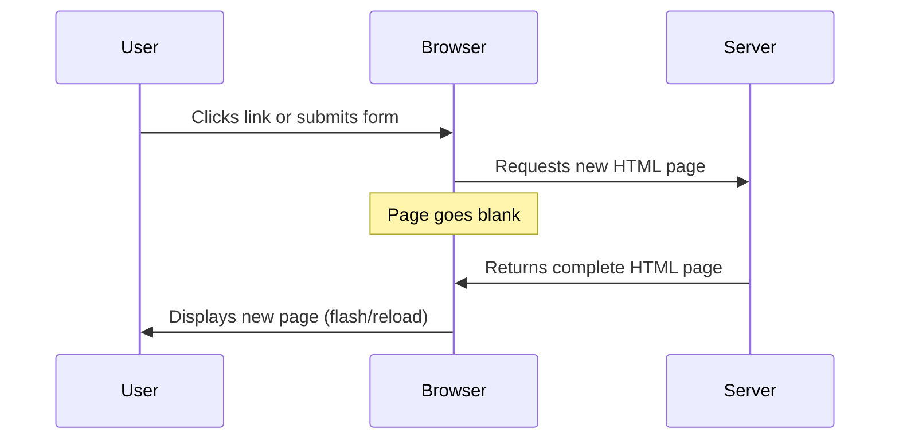
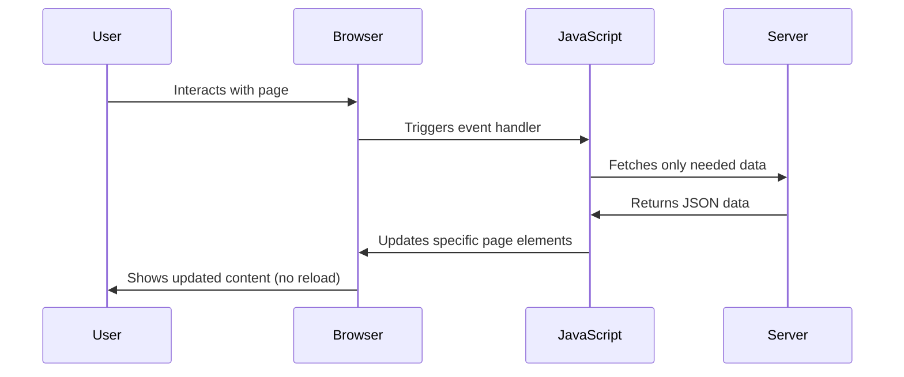
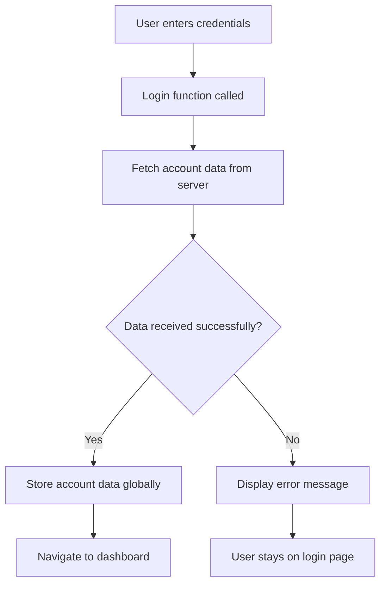
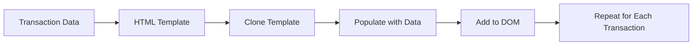

<!--
CO_OP_TRANSLATOR_METADATA:
{
  "original_hash": "2c1164912414820c8efd699b43f64954",
  "translation_date": "2025-10-24T22:46:17+00:00",
  "source_file": "7-bank-project/3-data/README.md",
  "language_code": "bg"
}
-->
# Създаване на банково приложение, част 3: Методи за извличане и използване на данни

Помислете за компютъра на кораба Enterprise в Star Trek - когато капитан Пикард поиска информация за състоянието на кораба, тя се появява мигновено, без интерфейсът да се затваря и да се изгражда отново. Точно този плавен поток от информация се стремим да създадем тук с динамично извличане на данни.

В момента вашето банково приложение е като печатен вестник - информативно, но статично. Ще го трансформираме в нещо подобно на контролния център на НАСА, където данните текат непрекъснато и се актуализират в реално време, без да прекъсват работния процес на потребителя.

Ще научите как да комуникирате със сървъри асинхронно, да обработвате данни, които пристигат в различни моменти, и да трансформирате сурова информация в нещо значимо за вашите потребители. Това е разликата между демонстрация и софтуер, готов за производство.

## Предварителен тест

[Предварителен тест](https://ff-quizzes.netlify.app/web/quiz/45)

### Предпоставки

Преди да се потопите в извличането на данни, уверете се, че разполагате със следните компоненти:

- **Предишен урок**: Завършете [Форма за вход и регистрация](../2-forms/README.md) - ще надграждаме върху тази основа
- **Локален сървър**: Инсталирайте [Node.js](https://nodejs.org) и [стартирайте API сървъра](../api/README.md), за да предоставите данни за акаунти
- **API връзка**: Тествайте връзката със сървъра с тази команда:

```bash
curl http://localhost:5000/api
# Expected response: "Bank API v1.0.0"
```

Този бърз тест гарантира, че всички компоненти комуникират правилно:
- Проверява дали Node.js работи правилно на вашата система
- Потвърждава, че вашият API сървър е активен и отговаря
- Валидира, че вашето приложение може да достигне до сървъра (като проверка на радиовръзка преди мисия)

---

## Разбиране на извличането на данни в съвременните уеб приложения

Начинът, по който уеб приложенията обработват данни, се е развил значително през последните две десетилетия. Разбирането на тази еволюция ще ви помогне да оцените защо съвременните техники като AJAX и Fetch API са толкова мощни и защо са станали основни инструменти за уеб разработчиците.

Нека разгледаме как работеха традиционните уебсайтове в сравнение с динамичните, отзивчиви приложения, които изграждаме днес.

### Традиционни многостранични приложения (MPA)

В ранните дни на уеб пространството всяко кликване беше като смяна на канали на стар телевизор - екранът се изключваше, след което бавно се настройваше към новото съдържание. Това беше реалността на ранните уеб приложения, където всяко взаимодействие означаваше пълно преизграждане на цялата страница от нулата.




**Защо този подход изглеждаше тромав:**
- Всяко кликване означаваше пълно преизграждане на цялата страница
- Потребителите бяха прекъсвани в мислите си от досадни мигания на страницата
- Вашата интернет връзка работеше извънредно, като изтегляше едни и същи заглавия и долни колонтитули многократно
- Приложенията се усещаха повече като прелистване на картотека, отколкото като използване на софтуер

### Съвременни едностранични приложения (SPA)

AJAX (Asynchronous JavaScript and XML) промени този парадигм изцяло. Подобно на модулния дизайн на Международната космическа станция, където астронавтите могат да заменят отделни компоненти, без да изграждат цялата структура отново, AJAX ни позволява да актуализираме конкретни части от уеб страница, без да презареждаме всичко. Въпреки че името споменава XML, днес най-често използваме JSON, но основният принцип остава: актуализирайте само това, което трябва да се промени.




**Защо SPA се усещат толкова по-добре:**
- Актуализират се само частите, които наистина са се променили (умно, нали?)
- Няма повече резки прекъсвания - потребителите остават в своя поток
- По-малко данни се предават по мрежата, което означава по-бързо зареждане
- Всичко се усеща бързо и отзивчиво, като приложенията на вашия телефон

### Еволюцията към съвременния Fetch API

Съвременните браузъри предоставят [`Fetch` API](https://developer.mozilla.org/docs/Web/API/Fetch_API), който заменя стария [`XMLHttpRequest`](https://developer.mozilla.org/docs/Web/API/XMLHttpRequest/Using_XMLHttpRequest). Подобно на разликата между работа с телеграф и използване на имейл, Fetch API използва promises за по-чист асинхронен код и обработва JSON естествено.

| Функция | XMLHttpRequest | Fetch API |
|---------|----------------|----------|
| **Синтаксис** | Сложен, базиран на callback | Чист, базиран на promises |
| **Обработка на JSON** | Изисква ръчно парсиране | Вграденият метод `.json()` |
| **Обработка на грешки** | Ограничена информация за грешки | Подробна информация за грешки |
| **Съвременна поддръжка** | Съвместимост с наследени системи | ES6+ promises и async/await |

> 💡 **Съвместимост с браузъри**: Добри новини - Fetch API работи във всички съвременни браузъри! Ако сте любопитни за конкретни версии, [caniuse.com](https://caniuse.com/fetch) има пълната история на съвместимостта.
> 
**Основното:**
- Работи отлично в Chrome, Firefox, Safari и Edge (на практика навсякъде, където са вашите потребители)
- Само Internet Explorer се нуждае от допълнителна помощ (и честно казано, време е да се сбогуваме с IE)
- Перфектно се вписва в елегантните async/await модели, които ще използваме по-късно

### Имплементиране на система за вход и извличане на данни

Сега нека имплементираме система за вход, която ще трансформира вашето банково приложение от статичен дисплей в функционално приложение. Подобно на протоколите за автентикация, използвани в сигурни военни съоръжения, ще проверим идентификационните данни на потребителя и след това ще предоставим достъп до специфичните му данни.

Ще изградим това постепенно, започвайки с основна автентикация и след това добавяйки възможности за извличане на данни.

#### Стъпка 1: Създаване на основа за функцията за вход

Отворете файла `app.js` и добавете нова функция `login`. Тя ще обработва процеса на автентикация на потребителя:

```javascript
async function login() {
  const loginForm = document.getElementById('loginForm');
  const user = loginForm.user.value;
}
```

**Нека разгледаме това подробно:**
- Ключовата дума `async`? Тя казва на JavaScript "хей, тази функция може да се наложи да изчака някои неща"
- Намираме нашата форма на страницата (нищо сложно, просто я намираме по нейния ID)
- След това извличаме каквото потребителят е въвел като потребителско име
- Ето един интересен трик: можете да достъпите всяко поле на формата чрез атрибута `name` - няма нужда от допълнителни извиквания на getElementById!

> 💡 **Модел за достъп до формата**: Всеки контрол на формата може да бъде достъпен чрез неговото име (зададено в HTML чрез атрибута `name`) като свойство на елемента на формата. Това предоставя чист и четим начин за извличане на данни от формата.

#### Стъпка 2: Създаване на функция за извличане на данни за акаунта

След това ще създадем специална функция за извличане на данни за акаунта от сървъра. Това следва същия модел като вашата функция за регистрация, но се фокусира върху извличането на данни:

```javascript
async function getAccount(user) {
  try {
    const response = await fetch('//localhost:5000/api/accounts/' + encodeURIComponent(user));
    return await response.json();
  } catch (error) {
    return { error: error.message || 'Unknown error' };
  }
}
```

**Ето какво постига този код:**
- **Използва** съвременния `fetch` API за асинхронно заявяване на данни
- **Конструира** URL за GET заявка с параметър за потребителско име
- **Прилага** `encodeURIComponent()`, за да обработва безопасно специални символи в URL адреси
- **Конвертира** отговора в JSON формат за лесна манипулация на данни
- **Обработва** грешки грациозно, като връща обект за грешка вместо да се срине

> ⚠️ **Бележка за сигурност**: Функцията `encodeURIComponent()` обработва специални символи в URL адреси. Подобно на системите за кодиране, използвани в морските комуникации, тя гарантира, че вашето съобщение пристига точно както е предвидено, предотвратявайки неправилно интерпретиране на символи като "#" или "&".
> 
**Защо това е важно:**
- Предотвратява специални символи да нарушат URL адресите
- Защитава срещу атаки чрез манипулация на URL адреси
- Гарантира, че вашият сървър получава предвидените данни
- Следва практики за сигурно програмиране

#### Разбиране на HTTP GET заявки

Ето нещо, което може да ви изненада: когато използвате `fetch` без допълнителни опции, той автоматично създава [`GET`](https://developer.mozilla.org/docs/Web/HTTP/Methods/GET) заявка. Това е идеално за това, което правим - питаме сървъра "хей, мога ли да видя данните за акаунта на този потребител?"

Помислете за GET заявките като учтиво искане за заемане на книга от библиотеката - искате да видите нещо, което вече съществува. POST заявките (които използвахме за регистрация) са повече като подаване на нова книга, която да бъде добавена към колекцията.

| GET заявка | POST заявка |
|-------------|-------------|
| **Цел** | Извличане на съществуващи данни | Изпращане на нови данни към сървъра |
| **Параметри** | В URL път/заявка | В тялото на заявката |
| **Кеширане** | Може да бъде кеширано от браузъри | Обикновено не се кешира |
| **Сигурност** | Видимо в URL/логове | Скрито в тялото на заявката |

#### Стъпка 3: Свързване на всичко

Сега за удовлетворяващата част - нека свържем вашата функция за извличане на акаунт с процеса на вход. Тук всичко се събира на едно място:

```javascript
async function login() {
  const loginForm = document.getElementById('loginForm');
  const user = loginForm.user.value;
  const data = await getAccount(user);

  if (data.error) {
    return console.log('loginError', data.error);
  }

  account = data;
  navigate('/dashboard');
}
```

Тази функция следва ясен ред:
- Извлича потребителското име от входа на формата
- Заявява данните за акаунта на потребителя от сървъра
- Обработва всякакви грешки, които възникват по време на процеса
- Съхранява данните за акаунта и навигира към таблото за управление при успех

> 🎯 **Модел Async/Await**: Тъй като `getAccount` е асинхронна функция, използваме ключовата дума `await`, за да спрем изпълнението, докато сървърът отговори. Това предотвратява продължаването на кода с неопределени данни.

#### Стъпка 4: Създаване на място за вашите данни

Вашето приложение се нуждае от място, където да запомни информацията за акаунта, след като бъде заредена. Помислете за това като за краткосрочната памет на вашето приложение - място, където да държите данните на текущия потребител под ръка. Добавете този ред в началото на вашия файл `app.js`:

```javascript
// This holds the current user's account data
let account = null;
```

**Защо ни е нужно това:**
- Държи данните за акаунта достъпни от всяка точка на вашето приложение
- Започването с `null` означава "никой не е влязъл още"
- Актуализира се, когато някой успешно влезе или се регистрира
- Действа като единствен източник на истина - няма объркване кой е влязъл

#### Стъпка 5: Свързване на вашата форма

Сега нека свържем вашата нова функция за вход към вашата HTML форма. Актуализирайте тагът на формата по следния начин:

```html
<form id="loginForm" action="javascript:login()">
  <!-- Your existing form inputs -->
</form>
```

**Какво прави тази малка промяна:**
- Спира формата да изпълнява стандартното си поведение "презареждане на цялата страница"
- Извиква вашата персонализирана JavaScript функция вместо това
- Поддържа всичко гладко и в стил на едностранично приложение
- Дава ви пълен контрол над това, което се случва, когато потребителите натиснат "Вход"

#### Стъпка 6: Подобряване на функцията за регистрация

За последователност, актуализирайте вашата функция `register`, за да съхранява данни за акаунта и да навигира към таблото за управление:

```javascript
// Add these lines at the end of your register function
account = result;
navigate('/dashboard');
```

**Това подобрение предоставя:**
- **Плавен** преход от регистрация към таблото за управление
- **Последователно** потребителско изживяване между потоците за вход и регистрация
- **Незабавен** достъп до данни за акаунта след успешна регистрация

#### Тестване на вашата имплементация



**Време е да го изпробвате:**
1. Създайте нов акаунт, за да се уверите, че всичко работи
2. Опитайте да влезете с тези същите идентификационни данни
3. Погледнете конзолата на браузъра си (F12), ако нещо изглежда странно
4. Уверете се, че стигате до таблото за управление след успешен вход

Ако нещо не работи, не се паникьосвайте! Повечето проблеми са лесни за поправяне, като например правописни грешки или забравяне да стартирате API сървъра.

#### Бърза дума за магията на Cross-Origin

Може би се чудите: "Как моето уеб приложение говори с този API сървър, когато те работят на различни портове?" Отличен въпрос! Това засяга нещо, с което всеки уеб разработчик се сблъсква рано или късно.

> 🔒 **Сигурност на Cross-Origin**: Браузърите налагат "политика за същия произход", за да предотвратят неоторизирана комуникация между различни домейни. Подобно на системата за проверка в Пентагона, те проверяват дали комуникацията е разрешена, преди да позволят прехвърляне на данни.
> 
**В нашата конфигурация:**
- Вашето уеб приложение работи на `localhost:3000` (сървър за разработка)
- Вашият API сървър работи на `localhost:5000` (бекенд сървър)
- API сървърът включва [CORS заглавия](https://developer.mozilla.org/docs/Web/HTTP/CORS), които изрично разрешават комуникация от вашето уеб приложение

Тази конфигурация отразява реалния свят на разработка, където фронтенд и бекенд приложения обикновено работят на отделни сървъри.

> 📚 **Научете повече**:
За по-сложно съдържание, комбинирайте [`document.createElement()`](https://developer.mozilla.org/docs/Web/API/Document/createElement) с метода [`append()`](https://developer.mozilla.org/docs/Web/API/ParentNode/append):

```javascript
// Safe way to create new elements
const transactionItem = document.createElement('div');
transactionItem.className = 'transaction-item';
transactionItem.textContent = `${transaction.date}: ${transaction.description}`;
container.append(transactionItem);
```

**Разбиране на този подход:**
- **Създава** нови DOM елементи програмно
- **Поддържа** пълен контрол върху атрибутите и съдържанието на елементите
- **Позволява** сложни, вложени структури на елементи
- **Осигурява** сигурност чрез разделяне на структурата от съдържанието

> ⚠️ **Съображения за сигурност**: Въпреки че [`innerHTML`](https://developer.mozilla.org/docs/Web/API/Element/innerHTML) често се среща в много уроци, той може да изпълнява вградени скриптове. Подобно на протоколите за сигурност в CERN, които предотвратяват неоторизирано изпълнение на код, използването на `textContent` и `createElement` предоставя по-безопасни алтернативи.
> 
**Рискове на innerHTML:**
- Изпълнява всякакви `<script>` тагове в потребителските данни
- Уязвим към атаки чрез инжектиране на код
- Създава потенциални уязвимости в сигурността
- По-безопасните алтернативи, които използваме, предоставят еквивалентна функционалност

### Правене на грешките по-достъпни за потребителите

В момента грешките при вход се появяват само в конзолата на браузъра, което е невидимо за потребителите. Подобно на разликата между вътрешната диагностика на пилот и системата за информация за пътниците, трябва да комуникираме важна информация чрез подходящия канал.

Реализирането на видими съобщения за грешки предоставя на потребителите незабавна обратна връзка за това какво се е объркало и как да продължат.

#### Стъпка 1: Добавете място за съобщения за грешки

Първо, нека създадем място за съобщенията за грешки във вашия HTML. Добавете това точно преди бутона за вход, за да го видят потребителите естествено:

```html
<!-- This is where error messages will appear -->
<div id="loginError" role="alert"></div>
<button>Login</button>
```

**Какво се случва тук:**
- Създаваме празен контейнер, който остава невидим, докато не е необходим
- Позициониран е там, където потребителите естествено гледат след натискане на "Вход"
- Този `role="alert"` е полезен за четци на екрана - той казва на помощните технологии "хей, това е важно!"
- Уникалният `id` предоставя лесна цел за нашия JavaScript

#### Стъпка 2: Създайте удобна помощна функция

Нека създадем малка помощна функция, която може да актуализира текста на всеки елемент. Това е една от онези функции "напиши веднъж, използвай навсякъде", които ще ви спестят време:

```javascript
function updateElement(id, text) {
  const element = document.getElementById(id);
  element.textContent = text;
}
```

**Ползи от функцията:**
- Прост интерфейс, изискващ само ID на елемента и текстово съдържание
- Безопасно намира и актуализира DOM елементи
- Повторяем модел, който намалява дублирането на код
- Поддържа последователно поведение при актуализация в приложението

#### Стъпка 3: Показване на грешки там, където потребителите могат да ги видят

Сега нека заменим скритото съобщение в конзолата с нещо, което потребителите наистина могат да видят. Актуализирайте вашата функция за вход:

```javascript
// Instead of just logging to console, show the user what's wrong
if (data.error) {
  return updateElement('loginError', data.error);
}
```

**Тази малка промяна прави голяма разлика:**
- Съобщенията за грешки се появяват точно там, където потребителите гледат
- Няма повече мистериозни тихи провали
- Потребителите получават незабавна, приложима обратна връзка
- Вашето приложение започва да изглежда професионално и внимателно

Сега, когато тествате с невалиден акаунт, ще видите полезно съобщение за грешка директно на страницата!


#### Стъпка 4: Бъдете включващи с достъпността

Ето нещо интересно за този `role="alert"`, който добавихме по-рано - той не е просто декорация! Този малък атрибут създава така наречения [Live Region](https://developer.mozilla.org/docs/Web/Accessibility/ARIA/ARIA_Live_Regions), който незабавно обявява промените на четците на екрана:

```html
<div id="loginError" role="alert"></div>
```

**Защо това е важно:**
- Потребителите на четци на екрана чуват съобщението за грешка веднага щом се появи
- Всеки получава същата важна информация, независимо как навигира
- Това е прост начин да направите приложението си достъпно за повече хора
- Показва, че се грижите за създаването на включващи преживявания

Малки детайли като този отличават добрите разработчици от страхотните!

#### Стъпка 5: Приложете същия модел към регистрацията

За последователност, приложете идентично обработване на грешки във вашата форма за регистрация:

1. **Добавете** елемент за показване на грешки към вашия HTML за регистрация:
```html
<div id="registerError" role="alert"></div>
```

2. **Актуализирайте** вашата функция за регистрация, за да използва същия модел за показване на грешки:
```javascript
if (data.error) {
  return updateElement('registerError', data.error);
}
```

**Ползи от последователното обработване на грешки:**
- **Осигурява** унифицирано потребителско изживяване във всички форми
- **Намалява** когнитивното натоварване чрез използване на познати модели
- **Опростява** поддръжката с повторяем код
- **Гарантира**, че стандартите за достъпност са спазени в цялото приложение

## Създаване на динамично табло за управление

Сега ще трансформираме вашето статично табло в динамичен интерфейс, който показва реални данни за акаунта. Подобно на разликата между печатен график на полети и живи табла за заминаване на летищата, преминаваме от статична информация към актуални, отзивчиви дисплеи.

Използвайки техниките за манипулация на DOM, които сте научили, ще създадем табло, което се актуализира автоматично с текущата информация за акаунта.

### Запознаване с вашите данни

Преди да започнем изграждането, нека надникнем какъв тип данни вашият сървър изпраща обратно. Когато някой успешно влезе, ето съкровището от информация, с което разполагате:

```json
{
  "user": "test",
  "currency": "$",
  "description": "Test account",
  "balance": 75,
  "transactions": [
    { "id": "1", "date": "2020-10-01", "object": "Pocket money", "amount": 50 },
    { "id": "2", "date": "2020-10-03", "object": "Book", "amount": -10 },
    { "id": "3", "date": "2020-10-04", "object": "Sandwich", "amount": -5 }
  ]
}
```

**Тази структура на данни предоставя:**
- **`user`**: Идеално за персонализиране на изживяването ("Добре дошли обратно, Сара!")
- **`currency`**: Уверява, че показваме правилно сумите в пари
- **`description`**: Приятелско име за акаунта
- **`balance`**: Важният текущ баланс
- **`transactions`**: Пълната история на транзакциите с всички детайли

Всичко, което ви е необходимо, за да изградите професионално изглеждащо банково табло!

> 💡 **Професионален съвет**: Искате ли да видите вашето табло в действие веднага? Използвайте потребителското име `test`, когато влизате - то е предварително заредено с примерни данни, за да видите как всичко работи, без да се налага първо да създавате транзакции.
> 
**Защо тестовият акаунт е полезен:**
- Вече е зареден с реалистични примерни данни
- Перфектен за виждане как се показват транзакциите
- Чудесен за тестване на функциите на таблото
- Спестява ви от необходимостта да създавате примерни данни ръчно

### Създаване на елементи за показване на таблото

Нека изградим интерфейса на вашето табло стъпка по стъпка, започвайки с информацията за обобщение на акаунта и след това преминавайки към по-сложни функции като списъци с транзакции.

#### Стъпка 1: Актуализирайте структурата на вашия HTML

Първо, заменете статичния раздел "Баланс" с динамични елементи за заместители, които вашият JavaScript може да попълни:

```html
<section>
  Balance: <span id="balance"></span><span id="currency"></span>
</section>
```

След това добавете раздел за описанието на акаунта. Тъй като това действа като заглавие за съдържанието на таблото, използвайте семантичен HTML:

```html
<h2 id="description"></h2>
```

**Разбиране на структурата на HTML:**
- **Използва** отделни елементи `<span>` за баланс и валута за индивидуален контрол
- **Прилага** уникални ID-та към всеки елемент за насочване от JavaScript
- **Следва** семантичен HTML, използвайки `<h2>` за описанието на акаунта
- **Създава** логическа йерархия за четци на екрана и SEO

> ✅ **Информация за достъпността**: Описанието на акаунта функционира като заглавие за съдържанието на таблото, затова е маркирано семантично като заглавие. Научете повече за това как [структурата на заглавията](https://www.nomensa.com/blog/2017/how-structure-headings-web-accessibility) влияе на достъпността. Можете ли да идентифицирате други елементи на вашата страница, които биха могли да се възползват от тагове за заглавия?

#### Стъпка 2: Създайте функция за актуализация на таблото

Сега създайте функция, която попълва вашето табло с реални данни за акаунта:

```javascript
function updateDashboard() {
  if (!account) {
    return navigate('/login');
  }

  updateElement('description', account.description);
  updateElement('balance', account.balance.toFixed(2));
  updateElement('currency', account.currency);
}
```

**Стъпка по стъпка, ето какво прави тази функция:**
- **Проверява**, че данните за акаунта съществуват, преди да продължи
- **Пренасочва** неавтентифицирани потребители обратно към страницата за вход
- **Актуализира** описанието на акаунта, използвайки повторяемата функция `updateElement`
- **Форматира** баланса, за да показва винаги две десетични места
- **Показва** подходящия символ на валутата

> 💰 **Форматиране на пари**: Този метод [`toFixed(2)`](https://developer.mozilla.org/docs/Web/JavaScript/Reference/Global_Objects/Number/toFixed) е спасител! Той гарантира, че вашият баланс винаги изглежда като реални пари - "75.00" вместо просто "75". Вашите потребители ще оценят да виждат познато форматиране на валутата.

#### Стъпка 3: Уверете се, че вашето табло се актуализира

За да гарантирате, че вашето табло се обновява с текущи данни всеки път, когато някой го посети, трябва да се свържете с вашата навигационна система. Ако сте завършили [заданието от урок 1](../1-template-route/assignment.md), това трябва да ви е познато. Ако не, не се притеснявайте - ето какво трябва да направите:

Добавете това в края на вашата функция `updateRoute()`:

```javascript
if (typeof route.init === 'function') {
  route.init();
}
```

След това актуализирайте вашите маршрути, за да включите инициализацията на таблото:

```javascript
const routes = {
  '/login': { templateId: 'login' },
  '/dashboard': { templateId: 'dashboard', init: updateDashboard }
};
```

**Какво прави тази умна настройка:**
- Проверява дали маршрутът има специален код за инициализация
- Автоматично изпълнява този код, когато маршрутът се зареди
- Гарантира, че вашето табло винаги показва свежи, текущи данни
- Поддържа логиката на маршрутизацията чиста и организирана

#### Тестване на вашето табло

След като приложите тези промени, тествайте вашето табло:

1. **Влезте** с тестов акаунт
2. **Проверете**, че сте пренасочени към таблото
3. **Уверете се**, че описанието на акаунта, балансът и валутата се показват правилно
4. **Опитайте да излезете и да влезете отново**, за да се уверите, че данните се обновяват правилно

Вашето табло вече трябва да показва динамична информация за акаунта, която се актуализира въз основа на данните на влезлия потребител!

## Създаване на интелигентни списъци с транзакции с шаблони

Вместо ръчно да създавате HTML за всяка транзакция, ще използваме шаблони, за да генерираме автоматично последователно форматиране. Подобно на стандартизираните компоненти, използвани в производството на космически кораби, шаблоните гарантират, че всеки ред на транзакция следва една и съща структура и външен вид.

Тази техника се мащабира ефективно от няколко транзакции до хиляди, като поддържа последователност в представянето и производителността.



### Стъпка 1: Създайте шаблон за транзакции

Първо, добавете повторяем шаблон за редове на транзакции в HTML `<body>`:

```html
<template id="transaction">
  <tr>
    <td></td>
    <td></td>
    <td></td>
  </tr>
</template>
```

**Разбиране на HTML шаблоните:**
- **Определя** структурата за един ред в таблицата
- **Остава** невидим, докато не бъде клониран и попълнен с JavaScript
- **Включва** три клетки за дата, описание и сума
- **Осигурява** повторяем модел за последователно форматиране

### Стъпка 2: Подгответе вашата таблица за динамично съдържание

След това добавете `id` към тялото на таблицата, за да може JavaScript лесно да го насочи:

```html
<tbody id="transactions"></tbody>
```

**Какво постига това:**
- **Създава** ясна цел за вмъкване на редове на транзакции
- **Разделя** структурата на таблицата от динамичното съдържание
- **Позволява** лесно изчистване и попълване на данни за транзакции

### Стъпка 3: Създайте фабрична функция за редове на транзакции

Сега създайте функция, която трансформира данните за транзакции в HTML елементи:

```javascript
function createTransactionRow(transaction) {
  const template = document.getElementById('transaction');
  const transactionRow = template.content.cloneNode(true);
  const tr = transactionRow.querySelector('tr');
  tr.children[0].textContent = transaction.date;
  tr.children[1].textContent = transaction.object;
  tr.children[2].textContent = transaction.amount.toFixed(2);
  return transactionRow;
}
```

**Разбивка на тази фабрична функция:**
- **Извлича** елемента на шаблона по неговия ID
- **Клонира** съдържанието на шаблона за безопасна манипулация
- **Избира** реда на таблицата в клонираното съдържание
- **Попълва** всяка клетка с данни за транзакции
- **Форматира** сумата, за да показва правилни десетични места
- **Връща** завършения ред, готов за вмъкване

### Стъпка 4: Ефективно генериране на множество редове на транзакции

Добавете този код към вашата функция `updateDashboard()`, за да покажете всички транзакции:

```javascript
const transactionsRows = document.createDocumentFragment();
for (const transaction of account.transactions) {
  const transactionRow = createTransactionRow(transaction);
  transactionsRows.appendChild(transactionRow);
}
updateElement('transactions', transactionsRows);
```

**Разбиране на този ефективен подход:**
- **Създава** документен фрагмент за групови операции с DOM
- **Итерация** през всички транзакции в данните за акаунта
- **Генерира** ред за всяка транзакция, използвайки фабричната функция
- **Събира** всички редове във фрагмента преди добавяне към DOM
- **Извършва** една актуализация на DOM вместо множество индивидуални вмъквания

> ⚡ **Оптимизация на производителността**: [`document.createDocumentFragment()`](https://developer.mozilla.org/docs/Web/API/Document/createDocumentFragment) работи като процеса на сглобяване в Boeing - компонентите се подготвят извън основната линия, след което се инсталират като завършена единица. Този подход за групиране минимизира повторното изобразяване на DOM чрез извършване на едно вмъкване вместо множество индивидуални операции
**Подканва:** Създайте функционалност за търсене в банковото приложение, която включва: 1) Форма за търсене с полета за въвеждане на диапазон от дати (от/до), минимална/максимална сума и ключови думи за описание на транзакции, 2) Функция `filterTransactions()`, която филтрира масива account.transactions въз основа на критериите за търсене, 3) Актуализирайте функцията `updateDashboard()`, за да показва филтрираните резултати, и 4) Добавете бутон "Изчисти филтрите", за да се възстанови изгледът. Използвайте съвременни методи на JavaScript като `filter()` и се погрижете за граничните случаи при празни критерии за търсене.

Научете повече за [режим агент](https://code.visualstudio.com/blogs/2025/02/24/introducing-copilot-agent-mode) тук.

## 🚀 Предизвикателство

Готови ли сте да издигнете банковото си приложение на следващо ниво? Нека го направим да изглежда и да се усеща като нещо, което наистина бихте искали да използвате. Ето някои идеи, които да ви вдъхновят:

**Направете го красиво**: Добавете CSS стилове, за да трансформирате функционалното табло в нещо визуално привлекателно. Помислете за чисти линии, добро разстояние и дори някои фини анимации.

**Направете го адаптивно**: Опитайте да използвате [медийни заявки](https://developer.mozilla.org/docs/Web/CSS/Media_Queries), за да създадете [адаптивен дизайн](https://developer.mozilla.org/docs/Web/Progressive_web_apps/Responsive/responsive_design_building_blocks), който работи отлично на телефони, таблети и настолни компютри. Вашите потребители ще ви благодарят!

**Добавете малко стил**: Помислете за цветово кодиране на транзакциите (зелено за приходи, червено за разходи), добавяне на икони или създаване на ефекти при задържане на мишката, които правят интерфейса интерактивен.

Ето как би могло да изглежда едно излъскано табло:


Не се чувствайте задължени да го копирате точно - използвайте го като вдъхновение и го направете по ваш вкус!

## Тест след лекцията

[Тест след лекцията](https://ff-quizzes.netlify.app/web/quiz/46)

## Задание

[Рефакторирайте и коментирайте кода си](assignment.md)

---

**Отказ от отговорност**:  
Този документ е преведен с помощта на AI услуга за превод [Co-op Translator](https://github.com/Azure/co-op-translator). Въпреки че се стремим към точност, моля, имайте предвид, че автоматизираните преводи може да съдържат грешки или неточности. Оригиналният документ на неговия роден език трябва да се счита за авторитетен източник. За критична информация се препоръчва професионален човешки превод. Не носим отговорност за недоразумения или погрешни интерпретации, произтичащи от използването на този превод.