<!--
CO_OP_TRANSLATOR_METADATA:
{
  "original_hash": "86ee5069f27ea3151389d8687c95fac9",
  "translation_date": "2026-01-07T07:07:27+00:00",
  "source_file": "7-bank-project/3-data/README.md",
  "language_code": "bg"
}
-->
# Създаване на Банково Приложение Част 3: Методи за Зареждане и Използване на Данни

Помислете за компютъра на Великата Звезда в Стар Трек – когато капитан Пикар пита за състоянието на кораба, информацията се появява мигновено, без цялото интерфейс да спира и изгражда отново себе си. Този безпроблемен поток от информация е точно това, което изграждаме тук с динамичното зареждане на данни.

В момента вашето банково приложение е като отпечатана вестникарска страница – информативно, но статично. Ще го превърнем в нещо по-скоро като контролния център на НАСА, където данните постоянно текат и се обновяват в реално време без да прекъсват работния процес на потребителя.

Ще научите как да комуникирате с сървърите асинхронно, как да обработвате данни, които пристигат в различно време, и как да превръщате суровата информация в нещо значимо за вашите потребители. Това е разликата между демонстрационен и готов за продукция софтуер.

## ⚡ Какво Можете да Направите за Следващите 5 Минути

**Бърз Старт за Заети Разработчици**

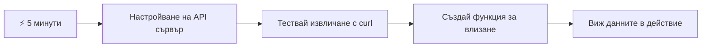
- **Минути 1-2**: Стартирайте вашия API сървър (`cd api && npm start`) и тествайте връзката
- **Минута 3**: Създайте базова функция `getAccount()` с fetch
- **Минута 4**: Свържете формата за вход с `action="javascript:login()"`
- **Минута 5**: Тествайте вход и вижте данните за акаунта в конзолата

**Бързи Тестови Команди**:
```bash
# Проверете дали API работи
curl http://localhost:5000/api

# Тест на извличане на данни за акаунт
curl http://localhost:5000/api/accounts/test
```

**Защо е важно това**: За 5 минути ще видите магията на асинхронното зареждане на данни, която захранва всяко съвременно уеб приложение. Това е основата, която прави приложенията чувствителни и живи.

## 🗺️ Вашето Пътуване в Света на Уеб Приложенията, Управлявани от Данни

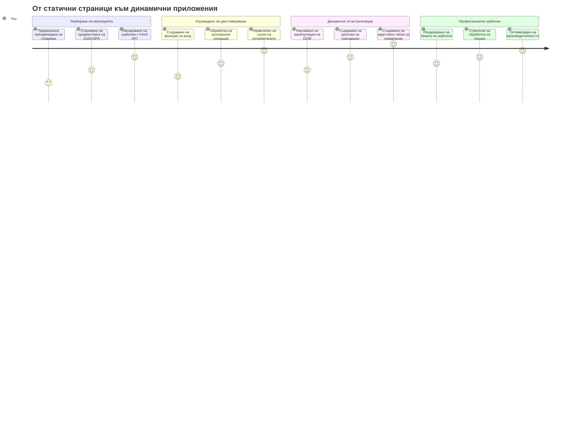
**Вашата цел**: До края на този урок ще разбирате как съвременните уеб приложения зареждат, обработват и показват данни динамично, създавайки безпроблемни потребителски преживявания, които очакваме от професионалния софтуер.

## Предварително Тестуване

[Предварителен тест](https://ff-quizzes.netlify.app/web/quiz/45)

### Предварителни Изисквания

Преди да започнете с извличането на данни, уверете се, че имате готови следните компоненти:

- **Предишен урок**: Завършете [Формата за вход и регистрация](../2-forms/README.md) - ще надградим върху тази основа
- **Локален сървър**: Инсталирайте [Node.js](https://nodejs.org) и [стартирайте API сървъра](../api/README.md), който ще подава данни за акаунти
- **API връзка**: Тествайте връзката с вашия сървър чрез тази команда:

```bash
curl http://localhost:5000/api
# Очакван отговор: "Bank API v1.0.0"
```

Тестът проверява дали всички компоненти комуникират правилно:
- Уверява, че Node.js работи коректно на вашата система
- Потвърждава, че API сървърът е активен и отговаря
- Валидация, че вашето приложение може да достъпи сървъра (като проверка на радио връзка преди мисия)

## 🧠 Преглед на Екосистемата за Управление на Данни

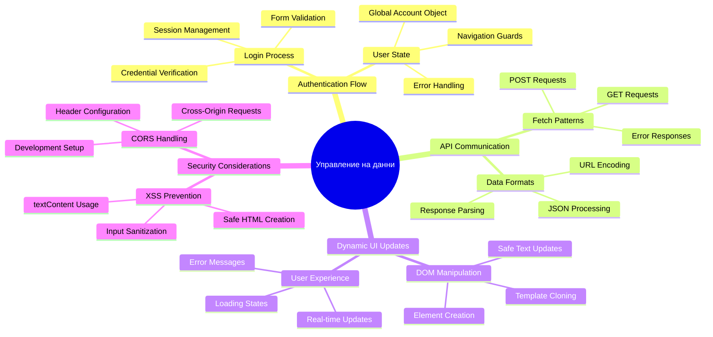
**Основен принцип**: Съвременните уеб приложения са системи за оркестрация на данни – координират между потребителски интерфейси, API сървъри и браузърните модели за сигурност, за да създадат безпроблемни, отзивчиви преживявания.

---

## Разбиране на Зареждането на Данни в Съвременните Уеб Приложения

Начинът, по който уеб приложенията обработват данни, се е развил драматично през последните два десетилетия. Разбирането на тази еволюция ще ви помогне да оцените защо съвременните техники като AJAX и Fetch API са толкова мощни и защо са станали незаменими инструменти за уеб разработчиците.

Нека разгледаме как са работили традиционните уебсайтове в сравнение с динамичните, отзивчиви приложения, които изграждаме днес.

### Традиционни Много-странични Приложения (MPA)

В ранните дни на уеб, всяко кликване беше като смяна на канал на стар телевизор – екранът изгасваше, след което бавно се показваше новото съдържание. Това беше реалността на първите уеб приложения, където всяко взаимодействие означаваше пълно изграждане на цялата страница отново.

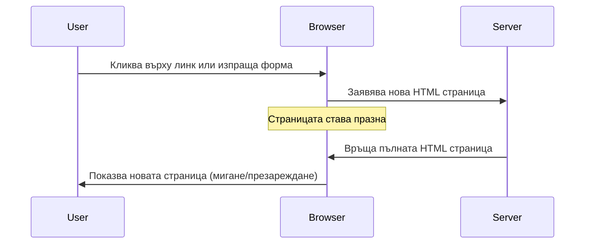


**Защо този подход беше тромав:**
- Всяко кликване означаваше изграждане на цялата страница отново
- Потребителите бяха прекъсвани в средата на мисълта от досадните премигвания на страницата
- Вашата интернет връзка работеше извънредно, изтегляйки повторно едни и същи заглавни и долни части
- Приложенията се усещаха повече като разглеждане на картотека, отколкото като софтуер

### Модерни Едностранични Приложения (SPA)

AJAX (Асинхронен JavaScript и XML) промени тази парадигма напълно. Като модулния дизайн на Международната космическа станция, където астронавтите могат да заменят отделни компоненти без да преструктурират цялата станция, AJAX ни позволява да обновяваме специфични части от уеб страница без да презареждаме всичко. Въпреки името с XML, днес главно използваме JSON, но основният принцип остава същият: обновявайте само това, което трябва да се промени.

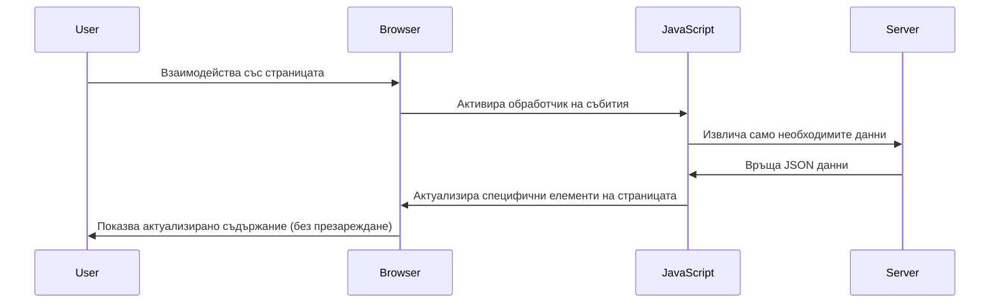


**Защо SPA приложенията се усещат толкова добре:**
- Обновяват се само частите, които наистина са се променили (умно, нали?)
- Няма повече резки прекъсвания – потребителите остават в потока си
- По-малко данни се предават, което ускорява зареждането
- Всичко е бързо и отзивчиво, като приложенията на телефона ви

### Еволюцията към Съвременния Fetch API

Съвременните браузъри предоставят [`Fetch` API](https://developer.mozilla.org/docs/Web/API/Fetch_API), която заменя по-старата [`XMLHttpRequest`](https://developer.mozilla.org/docs/Web/API/XMLHttpRequest/Using_XMLHttpRequest). Както разликата между телеграф и електронна поща, Fetch API използва обещания (promises) за по-чист асинхронен код и обработва JSON естествено.

| Функция | XMLHttpRequest | Fetch API |
|---------|----------------|----------|
| **Синтаксис** | Сложен на базата на callback | Чист, базиран на promises |
| **Обработка на JSON** | Изисква ръчно парсване | Вграден метод `.json()` |
| **Обработка на грешки** | Ограничена информация за грешки | Подробни данни за грешки |
| **Съвременна поддръжка** | За поддръжка на наследство | ES6+ promises и async/await |

> 💡 **Съвместимост на Браузъри**: Добри новини – Fetch API работи във всички съвременни браузъри! Ако се интересувате от конкретни версии, [caniuse.com](https://caniuse.com/fetch) има пълната съвместимост.
> 
**Крайният резултат:**
- Работи отлично в Chrome, Firefox, Safari и Edge (почти навсякъде, където са вашите потребители)
- Само Internet Explorer изисква допълнителна помощ (и честно казано, време е да го оставим)
- Перфектна основа за елегантните async/await шаблони, които ще използваме по-нататък

### Имплементиране на Вход за Потребител и Извличане на Данни

Сега нека имплементираме системата за вход, която превръща вашето банково приложение от статичен дисплей в функционално приложение. Както протоколите за автентикация в сигурни военни обекти, ще удостоверим потребителските данни и след това ще осигурим достъп до техните специфични данни.

Ще го изградим поетапно, започвайки с базова автентикация и след това добавяйки възможностите за зареждане на данни.

#### Стъпка 1: Създайте Основата на Функцията за Вход

Отворете файла си `app.js` и добавете нова функция `login`. Тя ще управлява процеса на удостоверяване на потребителя:

```javascript
async function login() {
  const loginForm = document.getElementById('loginForm');
  const user = loginForm.user.value;
}
```

**Нека разбием това:**
- Ключовата дума `async`? Казва на JavaScript "хей, тази функция може да трябва да изчака неща"
- Вземаме формата от страницата (нищо сложно, просто чрез ID)
- След това извличаме въведеното от потребителя потребителско име
- Ето една хитрост: можете да достъпвате всяко поле от формата чрез неговия атрибут `name` – без нужда от допълнителни getElementById повиквания!

> 💡 **Начин за достъп до формата**: Всеки контрол във формата може да се достъпи чрез името му (зададено в HTML с атрибута `name`) като свойство на формулярния елемент. Това осигурява чист и четлив начин за вземане на данни от формата.

#### Стъпка 2: Създайте Функцията за Зареждане на Данни за Акаунт

След това, ще създадем отделна функция за извличане на данни за акаунта от сървъра. Тя следва същия модел както функцията за регистрация, но е фокусирана върху взимането на данни:

```javascript
async function getAccount(user) {
  try {
    const response = await fetch('//localhost:5000/api/accounts/' + encodeURIComponent(user));
    return await response.json();
  } catch (error) {
    return { error: error.message || 'Unknown error' };
  }
}
```

**Ето какво постига този код:**
- **Използва** съвременния `fetch` API за асинхронно извличане на данни
- **Конструира** URL за GET заявка с параметър потребителско име
- **Прилага** `encodeURIComponent()`, за да обработи сигурно специални символи в URL
- **Превръща** отговора в JSON формат за лесна работа с данните
- **Обработва** грешки внимателно, като връща обект с грешка, вместо да прекъсва програмата

> ⚠️ **Бележка за сигурността**: Функцията `encodeURIComponent()` обработва специални символи в URL. Както кодирането в морските комуникации, тя гарантира че съобщението ви пристига точно както е замислено, предотвратявайки грешното тълкуване на символи като "#" или "&".
> 
**Защо е важно:**
- Предотвратява повреждане на URL от специални символи
- Защитава от атаки чрез манипулиране на URL
- Гарантира, че сървърът получава точните данни
- Следва добри практики за сигурен код

#### Разбиране на HTTP GET Заяви

Нещо, което може да ви изненада: когато използвате `fetch` без допълнителни опции, той автоматично създава [`GET`](https://developer.mozilla.org/docs/Web/HTTP/Methods/GET) заявка. Това е идеално за нашия случай – питаме сървъра "хей, мога ли да видя данните за този потребител?"

Помислете за GET заявките като учтивото искане да заемете книга от библиотеката – искате да видите нещо, което вече съществува. POST заявките (които използвахме за регистрация) са като подаване на нова книга за добавяне в колекцията.

| GET Заявка | POST Заявка |
|------------|-------------|
| **Цел** | Извличане на съществуващи данни | Изпращане на нови данни към сървъра |
| **Параметри** | В URL / в параметрите на заявката | В тялото на заявката |
| **Кеширане** | Може да бъде кеширана от браузъри | Обикновено не се кешира |
| **Сигурност** | Вижда се в URL/логове | Скрито в тялото на заявката |

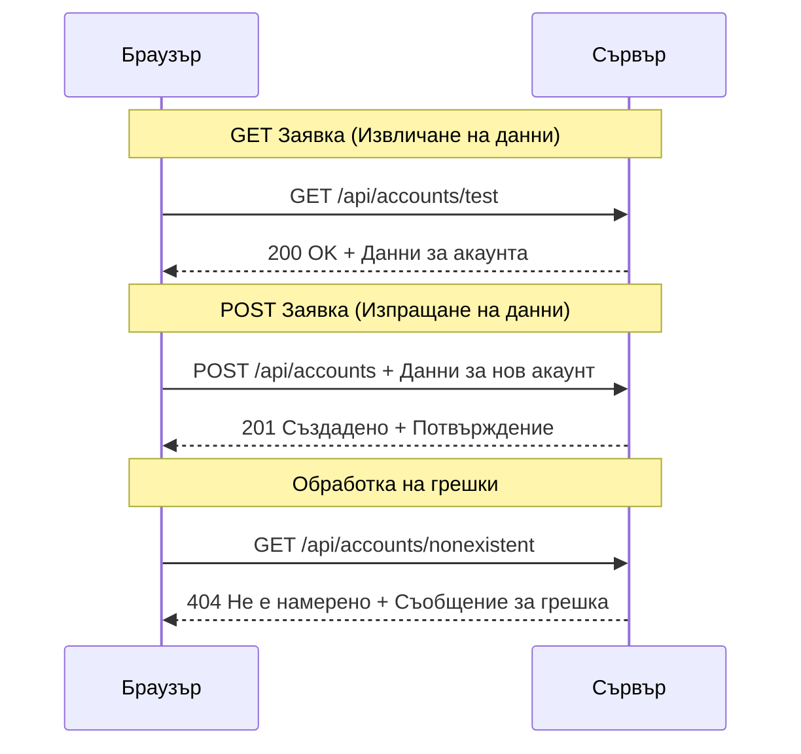
#### Стъпка 3: Свързване на Всичко

Сега за удовлетворяващата част – нека свържем функцията за извличане на акаунт с процеса на вход. Тук всичко се сглобява:

```javascript
async function login() {
  const loginForm = document.getElementById('loginForm');
  const user = loginForm.user.value;
  const data = await getAccount(user);

  if (data.error) {
    return console.log('loginError', data.error);
  }

  account = data;
  navigate('/dashboard');
}
```

Тази функция следва ясен ред:
- Извлича потребителското име от формата
- Изисква данните за акаунта от сървъра
- Обработва възникнали грешки по време на процеса
- Запаметява данните за акаунта и навигира към таблото при успех

> 🎯 **Шаблон Async/Await**: Тъй като `getAccount` е асинхронна функция, използваме ключовата дума `await`, за да спрем изпълнението докато сървърът отговори. Това предотвратява продължаване с неопределени данни.

#### Стъпка 4: Създаване на Място за Данните Ви

Вашето приложение трябва да има къде да съхранява информацията за акаунта след като е заредена. Помислете за това като краткотрайната памет на приложението – място за текущите данни на потребителя. Добавете този ред в началото на `app.js`:

```javascript
// Тук се съхраняват данните за акаунта на текущия потребител
let account = null;
```

**Защо имаме нужда от това:**
- Прави данните за акаунта достъпни от всяка част на вашето приложение
- Започването със `null` значи "никой не е влязъл още"
- Обновява се при успешен вход или регистрация
- Действа като единен източник на информация – няма объркване кой е влязъл

#### Стъпка 5: Свържете Формата Ви

Сега нека свържем новата ви функция за вход с HTML формата. Обновете таг формата така:

```html
<form id="loginForm" action="javascript:login()">
  <!-- Your existing form inputs -->
</form>
```

**Какво прави тази малка промяна:**
- Спира формата да прави стандартното "презареждане на цялата страница"
- Извиква вашата JavaScript функция вместо това
- Поддържа гладко поведение в стила на едностранично приложение
- Дава ви пълен контрол върху случващото се при натискане на "Вход"

#### Стъпка 6: Подобряване на Функцията за Регистрация

За консистентност, обновете функцията `register`, за да съхранява данни за акаунта и да навигира към таблото:

```javascript
// Добавете тези редове в края на вашата функция register
account = result;
navigate('/dashboard');
```

**Това подобрение дава:**
- **Плавен** преход от регистрация към табло
- **Консистентно** потребителско преживяване между вход и регистрация
- **Незабавен** достъп до данни след успешна регистрация

#### Тествайте Имплементацията си

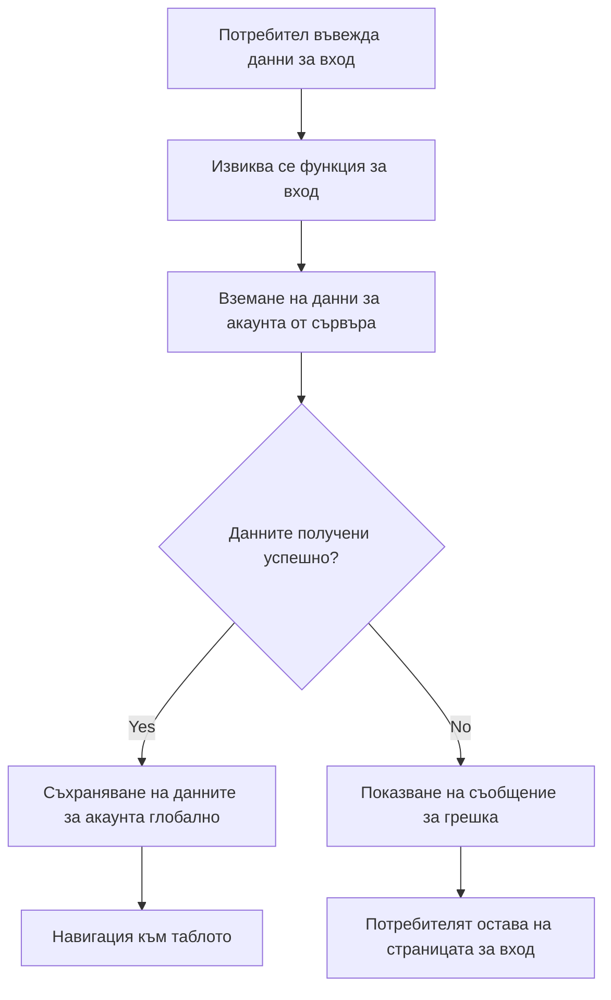
**Време да пробвате:**
1. Създайте нов акаунт, за да проверите, че всичко работи
2. Опитайте вход с тези същите данни
3. Погледнете конзолата на браузъра (F12), ако нещо изглежда нередно
4. Уверете се, че сте препратени към таблото след успешен вход

Ако нещо не работи, не се паникьосвайте! Повечето проблеми са дребни като правописни грешки или забравен стартиран API сървър.

#### Малко За Крос-домейн Магията

Може би се питате: "Как моето уеб приложение разговаря с този API сървър, когато работят на различни портове?" Отличен въпрос! Това е нещо, с което всеки уеб разработчик се сблъсква в един момент.

> 🔒 **Сигурност при Крос-домейн Връзки**: Браузърите прилагат "политика за един и същи произход", за да предотвратят неоторизирана комуникация между различни домейни. Както контролно-пропускателен пункт в Пентагона, те проверяват дали комуникацията е разрешена преди да позволят трансфер на данни.
> 
**В нашата конфигурация:**
- Вашето уеб приложение работи на `localhost:3000` (сървър за разработка)
- Вашият API сървър работи на `localhost:5000` (бекенд сървър)
- API сървърът включва [CORS заглавки](https://developer.mozilla.org/docs/Web/HTTP/CORS), които изрично разрешават комуникация от вашето уеб приложение

Тази конфигурация отразява реалния свят на разработката, където фронтенд и бекенд приложения обикновено работят на отделни сървъри.

> 📚 **Научете Повече**: Разгледайте по-задълбочено API-та и зареждането на данни с този подробен [учебен модул на Microsoft Learn за API](https://docs.microsoft.com/learn/modules/use-apis-discover-museum-art/?WT.mc_id=academic-77807-sagibbon).

## Правим Данните Живи в HTML

Сега ще направим заредените данни видими за потребителите чрез манипулиране на DOM. Както в процеса на проявяване на снимки в тъмна стая, превръщаме невидимите данни в нещо, което потребителите могат да видят и с което могат да взаимодействат.
Манипулирането на DOM е техниката, която превръща статичните уеб страници в динамични приложения, които обновяват съдържанието си въз основа на взаимодействия на потребителя и отговори от сървъра.

### Избор на правилния инструмент за задачата

Когато става въпрос за обновяване на HTML с JavaScript, имате няколко опции. Помислете за тях като различни инструменти в куфара с инструменти – всеки идеален за специфични задачи:

| Метод | За какво е страхотен | Кога да го използвате | Ниво на безопасност |
|--------|---------------------|----------------|--------------|
| `textContent` | Безопасно показване на данни от потребителя | Всеки път, когато показвате текст | ✅ Висока надеждност |
| `createElement()` + `append()` | Създаване на сложни оформления | Създаване на нови секции/списъци | ✅ Абсолютно сигурен |
| `innerHTML` | Задаване на HTML съдържание | ⚠️ Опитайте да го избягвате | ❌ Рисковано |

#### Безопасният начин за показване на текст: textContent

Свойството [`textContent`](https://developer.mozilla.org/docs/Web/API/Node/textContent) е вашият най-добър приятел при показване на потребителски данни. То е като охрана на вашата уеб страница – нищо вредно не преминава:

```javascript
// Безопасният и надежден начин за актуализиране на текст
const balanceElement = document.getElementById('balance');
balanceElement.textContent = account.balance;
```

**Предимства на textContent:**
- Третира всичко като обикновен текст (предотвратява изпълнение на скриптове)
- Автоматично изчиства съществуващото съдържание
- Ефикасен за прости текстови актуализации
- Осигурява вградена защита срещу злонамерено съдържание

#### Създаване на динамични HTML елементи

За по-сложно съдържание, съчетайте [`document.createElement()`](https://developer.mozilla.org/docs/Web/API/Document/createElement) с метода [`append()`](https://developer.mozilla.org/docs/Web/API/ParentNode/append):

```javascript
// Безопасен начин за създаване на нови елементи
const transactionItem = document.createElement('div');
transactionItem.className = 'transaction-item';
transactionItem.textContent = `${transaction.date}: ${transaction.description}`;
container.append(transactionItem);
```

**Какво прави този подход:**
- **Създава** нови DOM елементи програмно
- **Поддържа** пълен контрол върху атрибутите и съдържанието на елемента
- **Позволява** комплицирани, вложени структури от елементи
- **Запазва** сигурността чрез разделяне на структурата от съдържанието

> ⚠️ **Съображение за сигурността**: Въпреки че [`innerHTML`](https://developer.mozilla.org/docs/Web/API/Element/innerHTML) се използва в много уроци, той може да изпълнява вградени скриптове. Подобно на протоколите за сигурност в CERN, които предотвратяват неупълномощено изпълнение на код, използването на `textContent` и `createElement` предлага по-безопасни алтернативи.
> 
**Рискове при innerHTML:**
- Изпълнява всички `<script>` тагове в потребителските данни
- Уязвим към атаки чрез вмъкване на код
- Създава потенциални пробойни в сигурността
- По-безопасните алтернативи, които използваме, предоставят еквивалентна функционалност

### Правене на грешките удобни за потребителите

В момента грешките при влизане се показват само в конзолата на браузъра, която е невидима за потребителите. Подобно на разликата между вътрешната диагностика на пилота и информационната система за пътниците, ние трябва да комуникираме важната информация през подходящия канал.

Показването на видими съобщения за грешки дава на потребителите веднага обратна връзка за това какво се е объркало и как да продължат.

#### Стъпка 1: Добавете място за съобщения за грешки

Първо, нека осигурим място за съобщенията за грешки във вашия HTML. Добавете това точно преди бутона за влизане, така че потребителите да го видят естествено:

```html
<!-- This is where error messages will appear -->
<div id="loginError" role="alert"></div>
<button>Login</button>
```

**Какво се случва тук:**
- Създаваме празен контейнер, който остава невидим, докато не се наложи
- Позициониран е там, където потребителите естествено гледат след натискане на "Вход"
- Атрибутът `role="alert"` е хубава добавка за екранните четци – казва на помощните технологии „хей, това е важно!“
- Уникалният `id` дава лесна цел за JavaScript

#### Стъпка 2: Създайте полезна помощна функция

Нека направим малка функция за удобство, която може да обновява текста на който и да е елемент. Това е един от онези „напиши веднъж, използвай навсякъде“ методи, които ще ви спестят време:

```javascript
function updateElement(id, text) {
  const element = document.getElementById(id);
  element.textContent = text;
}
```

**Предимства на функцията:**
- Прост интерфейс, който изисква само ID на елемент и текстово съдържание
- Безопасно намира и обновява DOM елементи
- Повтарящ се шаблон, който намалява дублирането на код
- Поддържа последователно поведение при обновяване в приложението

#### Стъпка 3: Показвайте грешки, където потребителите могат да ги видят

Сега нека заменим скритото съобщение в конзолата с нещо, което потребителите реално могат да видят. Актуализирайте функцията за вход:

```javascript
// Вместо просто да записвате в конзолата, покажете на потребителя какъв е проблемът
if (data.error) {
  return updateElement('loginError', data.error);
}
```

**Тази малка промяна прави голяма разлика:**
- Съобщенията за грешки се появяват точно там, където потребителите гледат
- Няма повече мистериозни тихи неуспехи
- Потребителите получават незабавна, приложима обратна връзка
- Вашето приложение започва да изглежда професионално и обмислено

Сега, когато тествате с невалидна сметка, ще видите полезно съобщение за грешка директно на страницата!


#### Стъпка 4: Включване на достъпността

Ето нещо готино за този `role="alert"`, който добавихме по-рано – той не е само за украса! Този малък атрибут създава това, което се нарича [Live Region](https://developer.mozilla.org/docs/Web/Accessibility/ARIA/ARIA_Live_Regions), който веднага съобщава за промени на екранните четци:

```html
<div id="loginError" role="alert"></div>
```

**Защо това е важно:**
- Потребителите с екранни четци чуват съобщението за грешка веднага щом се появи
- Всеки получава същата важна информация, независимо как навигира
- Това е лесен начин да направите вашето приложение да работи за повече хора
- Показва, че се грижите за създаването на приобщаващи преживявания

Малки детайли като този отличават добрите разработчици от великите!

### 🎯 Педагогическа проверка: Патерни за удостоверяване

**Пауза и размисъл**: Току-що реализирахте пълен поток за удостоверяване. Това е фундаментален патерн в уеб разработката.

**Бърза самооценка**:
- Можете ли да обясните защо използваме async/await за API повиквания?
- Какво би се случило, ако забравихме функцията `encodeURIComponent()`?
- Как нашето обработване на грешки подобрява потребителското изживяване?

**Връзка с реалния свят**: Патерните, които научихте тук (асинхронно получаване на данни, обработка на грешки, обратна връзка към потребителя), се използват във всяко голямо уеб приложение от социалните медии до сайтовете за електронна търговия. Изграждате умения за продукция!

**Предизвикателен въпрос**: Как бихте модифицирали тази система за удостоверяване, за да обработва различни потребителски роли (клиент, администратор, касиер)? Помислете за структурата на данните и нужните UI промени.

#### Стъпка 5: Приложете същия патерн за регистрация

За последователност, реализирайте идентична обработка на грешки във формуляра си за регистрация:

1. **Добавете** елемент за показване на грешки във вашия HTML за регистрация:
```html
<div id="registerError" role="alert"></div>
```

2. **Актуализирайте** функцията за регистрация да използва същия патерн за показване на грешки:
```javascript
if (data.error) {
  return updateElement('registerError', data.error);
}
```

**Предимства на последователната обработка на грешки:**
- **Осигурява** унифицирано потребителско изживяване във всички форми
- **Намалява** когнитивното натоварване чрез познати модели
- **Опрощава** поддръжката с преизползваем код
- **Гарантира** спазване на стандартите за достъпност навсякъде в приложението

## Създаване на вашето динамично табло

Сега ще превърнем статичното ви табло в динамичен интерфейс, който показва реални данни за сметката. Подобно на разликата между отпечатано разписание на полети и живите информационни табла на летищата, преминаваме от статична информация към реално време и адаптивни дисплеи.

С използване на техниките за манипулиране на DOM, които научихте, ще създадем табло, което се обновява автоматично с актуална информация за сметката.

### Запознаване с вашите данни

Преди да започнем изграждането, нека да хвърлим поглед какви данни изпраща сървърът. Когато някой влезе успешно, ето какво съкровище от информация получавате да работите с него:

```json
{
  "user": "test",
  "currency": "$",
  "description": "Test account",
  "balance": 75,
  "transactions": [
    { "id": "1", "date": "2020-10-01", "object": "Pocket money", "amount": 50 },
    { "id": "2", "date": "2020-10-03", "object": "Book", "amount": -10 },
    { "id": "3", "date": "2020-10-04", "object": "Sandwich", "amount": -5 }
  ]
}
```

**Тази структура на данни предоставя:**
- **`user`**: Перфектно за персонализиране на изживяването („Добре дошла отново, Сара!“)
- **`currency`**: Гарантира, че паричните суми се показват правилно
- **`description`**: Приятелско име за сметката
- **`balance`**: Много важният текущ баланс
- **`transactions`**: Пълната история на транзакциите с всички детайли

Всичко, от което се нуждаете, за да изградите професионално изглеждащо банково табло!

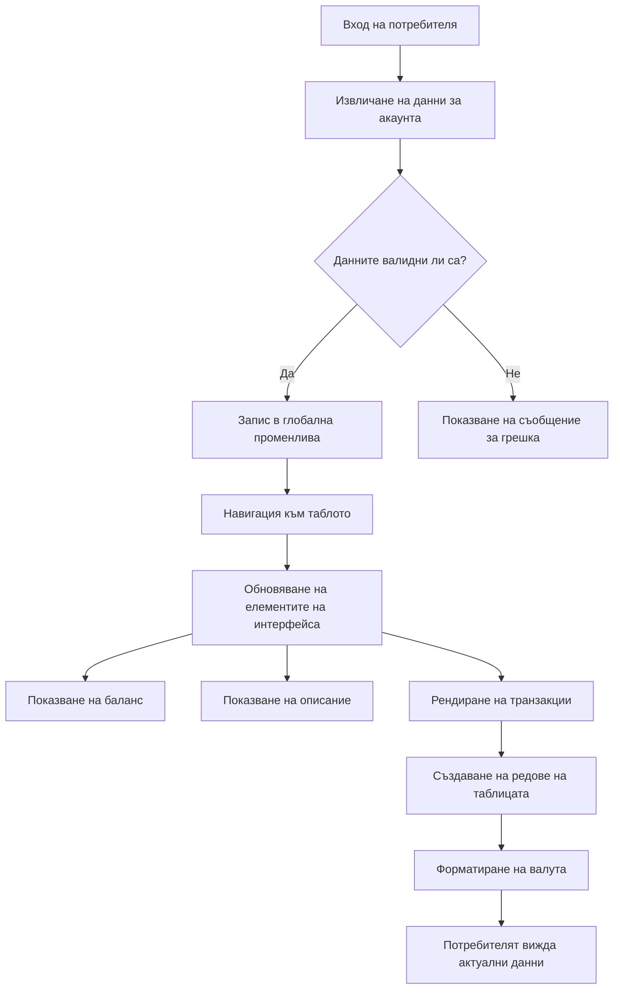
> 💡 **Практически съвет**: Искате ли да видите таблото си в действие веднага? Използвайте потребителско име `test` при влизане – то е предварително заредено с примерни данни, за да видите всичко работещо без да се налага да създавате транзакции първо.
> 
**Защо тестовата сметка е удобна:**
- Отива с реалистични примерни данни вече заредени
- Перфектна за наблюдение как се показват транзакциите
- Чудесна за тестване на функциите на таблото ви
- Спестява ви създаването на фалшиви данни ръчно

### Създаване на елементите за показване на таблото

Да изградим интерфейса на таблото ви стъпка по стъпка, започвайки с информацията за обобщение на сметката и след това надграждайки с по-сложни функции като списъци с транзакции.

#### Стъпка 1: Актуализирайте HTML структурата

Първо, заменете статичната секция „Баланс“ с динамични плейсхолдър елементи, които вашият JavaScript може да попълни:

```html
<section>
  Balance: <span id="balance"></span><span id="currency"></span>
</section>
```

След това добавете секция за описанието на сметката. Тъй като това действа като заглавие на съдържанието на таблото, използвайте семантичен HTML:

```html
<h2 id="description"></h2>
```

**Разбиране на HTML структурата:**
- **Използва** отделни `<span>` елементи за баланса и валутата за индивидуален контрол
- **Прилага** уникални ID-та за всеки елемент за целите на JavaScript
- **Следва** семантичен HTML, като използва `<h2>` за описанието на сметката
- **Създава** логическа йерархия за екранните четци и SEO

> ✅ **Поглед върху достъпността**: Описанието на сметката функционира като заглавие за съдържанието на таблото, затова е маркирано семантично като заглавие. Научете повече за това как [структурата на заглавията](https://www.nomensa.com/blog/2017/how-structure-headings-web-accessibility) влияе на достъпността. Можете ли да идентифицирате други елементи на вашата страница, които биха се възползвали от заглавни тагове?

#### Стъпка 2: Създайте функция за обновяване на таблото

Сега създайте функция, която попълва таблото ви с реални данни за сметката:

```javascript
function updateDashboard() {
  if (!account) {
    return navigate('/login');
  }

  updateElement('description', account.description);
  updateElement('balance', account.balance.toFixed(2));
  updateElement('currency', account.currency);
}
```

**Стъпка по стъпка какво прави функцията:**
- **Проверява**, че данните за сметката съществуват преди да продължи
- **Пренасочва** неавтентифицирани потребители обратно към страницата за вход
- **Обновява** описанието на сметката с помощта на преизползваемата функция `updateElement`
- **Форматира** баланса да показва винаги две десетични места
- **Показва** съответния символ на валутата

> 💰 **Форматиране на пари**: Методът [`toFixed(2)`](https://developer.mozilla.org/docs/Web/JavaScript/Reference/Global_Objects/Number/toFixed) е спасител! Той гарантира, че балансът ви винаги изглежда като реални пари – „75.00“ вместо просто „75“. Вашите потребители ще оценят познатото форматиране на валута.

#### Стъпка 3: Уверете се, че таблото ви се обновява

За да сте сигурни, че таблото се обновява с актуални данни всеки път, когато някой го посети, трябва да свържем това с навигационната ви система. Ако сте изпълнили [задачата от урок 1](../1-template-route/assignment.md), това трябва да ви е познато. Ако не, няма проблем – ето какво ви трябва:

Добавете това към края на функцията `updateRoute()`:

```javascript
if (typeof route.init === 'function') {
  route.init();
}
```

След това актуализирайте вашите маршрути, за да включват инициализацията на таблото:

```javascript
const routes = {
  '/login': { templateId: 'login' },
  '/dashboard': { templateId: 'dashboard', init: updateDashboard }
};
```

**Какво прави този интелигентен подход:**
- Проверява дали маршрутът има специален код за инициализация
- Изпълнява този код автоматично при зареждане на маршрута
- Гарантира, че таблото ви винаги показва свежи, актуални данни
- Държи логиката на маршрутизацията чиста и организирана

#### Тестване на таблото ви

След прилагане на тези промени, тествайте таблото си:

1. **Влезте** с тестова сметка
2. **Потвърдете**, че сте пренасочени към таблото
3. **Проверете**, че описанието на сметката, балансът и валутата се показват правилно
4. **Опитайте да излезете и да влезете отново**, за да се уверите, че данните се обновяват правилно

Вашето табло вече трябва да показва динамична информация за сметката, която се обновява според данните на влезлия потребител!

## Създаване на интелигентни списъци с транзакции с помощта на шаблони

Вместо да създавате ръчно HTML за всяка транзакция, ще използваме шаблони, за да генерираме еднородно форматиране автоматично. Подобно на стандартизираните компоненти, използвани в производството на космически кораби, шаблоните гарантират, че всеки ред с транзакция следва същата структура и изглед.

Тази техника се мащабира ефикасно от няколко транзакции до хиляди, като поддържа постоянна производителност и представяне.

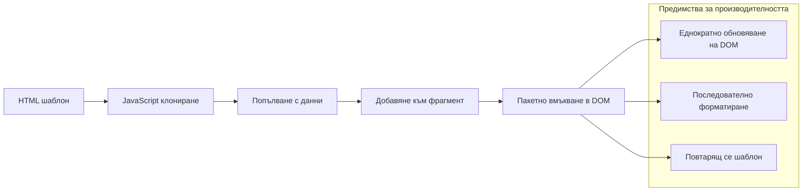
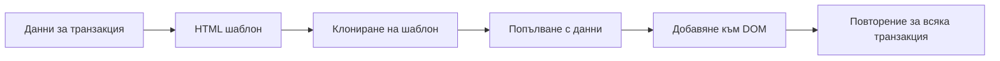
### Стъпка 1: Създайте шаблон за транзакция

Първо, добавете преизползваем шаблон за редове с транзакции във вашето HTML `<body>`:

```html
<template id="transaction">
  <tr>
    <td></td>
    <td></td>
    <td></td>
  </tr>
</template>
```

**Какво е HTML шаблон:**
- **Дефинира** структурата за един ред в таблица
- **Остава** невидим, докато не бъде клониран и попълнен с JavaScript
- **Включва** три клетки за дата, описание и сума
- **Предоставя** шаблон за последователно форматиране

### Стъпка 2: Подгответе таблицата за динамично съдържание

След това добавете `id` към тялото на таблицата, за да може JavaScript лесно да я насочва:

```html
<tbody id="transactions"></tbody>
```

**Какво прави това:**
- **Създава** ясна цел за вмъкване на редове с транзакции
- **Разделя** структурата на таблицата от динамичното съдържание
- **Позволява** лесно изчистване и презареждане на данните за транзакции

### Стъпка 3: Създайте фабрична функция за редовете с транзакции

Сега направете функция, която преобразува данни за транзакция в HTML елементи:

```javascript
function createTransactionRow(transaction) {
  const template = document.getElementById('transaction');
  const transactionRow = template.content.cloneNode(true);
  const tr = transactionRow.querySelector('tr');
  tr.children[0].textContent = transaction.date;
  tr.children[1].textContent = transaction.object;
  tr.children[2].textContent = transaction.amount.toFixed(2);
  return transactionRow;
}
```

**Разглеждане на фабричната функция:**
- **Взема** шаблона по неговия ID
- **Клонира** съдържанието на шаблона за безопасна манипулация
- **Избира** таблицата ред в клонираното съдържание
- **Попълва** всяка клетка с данни за транзакцията
- **Форматира** сумата с подходящи десетични места
- **Връща** готовия ред, готов за вмъкване

### Стъпка 4: Ефикасно генериране на множество редове с транзакции

Добавете този код към функцията `updateDashboard()`, за да покажете всички транзакции:

```javascript
const transactionsRows = document.createDocumentFragment();
for (const transaction of account.transactions) {
  const transactionRow = createTransactionRow(transaction);
  transactionsRows.appendChild(transactionRow);
}
updateElement('transactions', transactionsRows);
```

**Какво прави този ефикасен подход:**
- **Създава** document fragment за пакетиране на DOM операции
- **Обхожда** всички транзакции в данните за сметката
- **Генерира** ред за всяка транзакция с помощта на фабричната функция
- **Събира** всички редове в документа фрагмент преди добавяне в DOM
- **Извършва** едно обновяване на DOM вместо многократни отделни вмъквания
> ⚡ **Оптимизация на производителността**: [`document.createDocumentFragment()`](https://developer.mozilla.org/docs/Web/API/Document/createDocumentFragment) работи като процеса на сглобяване в Boeing - компонентите се подготвят извън основната линия, след което се монтират като цялостна единица. Този подход на групиране минимизира пренареждането на DOM като изпълнява една операция за вмъкване вместо множество отделни.

### Стъпка 5: Подобряване на функцията за обновяване за смесено съдържание

Вашата функция `updateElement()` в момента обработва само текстово съдържание. Обновете я да работи както с текст, така и с DOM възли:

```javascript
function updateElement(id, textOrNode) {
  const element = document.getElementById(id);
  element.textContent = ''; // Премахва всички деца
  element.append(textOrNode);
}
```

**Ключови подобрения в тази актуализация:**
- **Изчиства** съществуващото съдържание преди да добави ново
- **Приема** като параметри както текстови низове, така и DOM възли
- **Използва** метода [`append()`](https://developer.mozilla.org/docs/Web/API/ParentNode/append) за гъвкавост
- **Запазва** обратно съвместимост с досегашното използване само с текст

### Вземете вашето табло за пробно шофиране

Време за момента на истината! Нека видим вашето динамично табло в действие:

1. Влезте с акаунта `test` (има готов примерен набор от данни)
2. Навигирайте до вашето табло
3. Проверете дали редовете с транзакции се появяват с правилното форматиране
4. Уверете се, че датите, описанията и сумите изглеждат коректно

Ако всичко работи, ще видите напълно функционален списък с транзакции на таблото си! 🎉

**Какво сте постигнали:**
- Изградихте табло, което мащабира с всяко количество данни
- Създадохте повторно използваеми шаблони за последователно форматиране
- Реализирахте ефективни техники за манипулиране на DOM
- Разработихте функционалност, сравнима с производствени банкови приложения

Успешно превърнахте статична уеб страница в динамично уеб приложение.

### 🎯 Педагогическа проверка: Генериране на динамично съдържание

**Разбиране на архитектурата**: Имплементирахте сложен pipeline от данни към UI, който отразява модели, използвани във фреймуъркове като React, Vue и Angular.

**Ключови овладени концепции**:
- **Рендериране на база шаблони**: Създаване на многократно използваеми UI компоненти
- **Фрагменти от документи**: Оптимизация на производителността на DOM
- **Безопасна манипулация на DOM**: Предотвратяване на уязвимости в сигурността
- **Трансформация на данни**: Превръщане на сървърните данни в потребителски интерфейс

**Връзка с индустрията**: Тези техники са основата на съвременните фронтенд фреймуъркове. Виртуалният DOM на React, шаблонната система на Vue и компонентната архитектура на Angular всички използват тези основни концепции.

**Въпрос за размисъл**: Как бихте разширили тази система да обработва обновления в реално време (като автоматично появяващи се нови транзакции)? Помислете за WebSockets или Server-Sent Events.

---

## 📈 Вашата времева линия на овладяване на управлението на данни

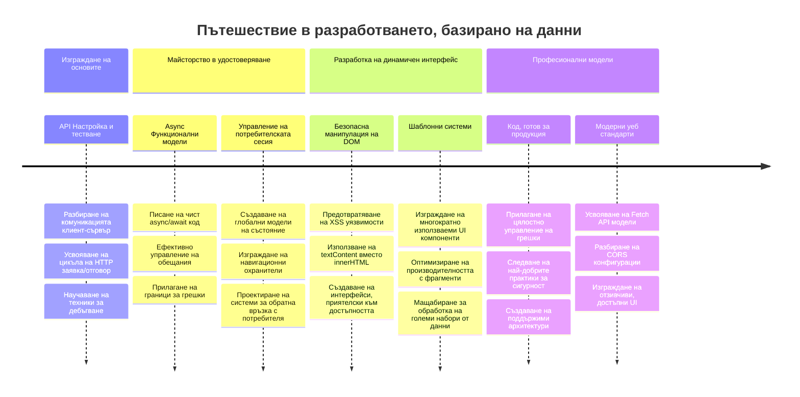
**🎓 Милestone на завършване**: Успешно сте изградили пълноценно уеб приложение, задвижвано от данни, използвайки модерни JavaScript модели. Тези умения се пренасят директно във фреймуъркове като React, Vue или Angular.

**🔄 Следващи нива на възможности**:
- Готови да изследвате фронтенд фреймуъркове, които се основават на тези концепции
- Подготвени да внедрите функционалности в реално време с WebSockets
- Оборудвани за създаване на Progressive Web Apps с офлайн възможности
- Зададена основа за научаване на напреднали модели за управление на състояние

## GitHub Copilot Agent Challenge 🚀

Използвайте режима Agent, за да завършите следното предизвикателство:

**Описание:** Разширете банковото приложение, като реализирате функция за търсене и филтриране на транзакции, която позволява на потребителите да намират конкретни транзакции по диапазон дати, сума или ключови думи в описанието.

**Подсказка:** Създайте функционалност за търсене в банковото приложение, която включва: 1) форма за търсене с входни полета за диапазон дати (от/до), минимална/максимална сума и ключови думи за описание на транзакцията, 2) функция `filterTransactions()`, която филтрира масива account.transactions според критериите за търсене, 3) обновете функцията `updateDashboard()`, за да показва филтрираните резултати, и 4) добавете бутон "Изчисти филтрите" за нулиране на изгледа. Използвайте съвременни JavaScript методи за масиви като `filter()` и се справяйте с краен случаи при празни критерии за търсене.

Научете повече за [agent mode](https://code.visualstudio.com/blogs/2025/02/24/introducing-copilot-agent-mode) тук.

## 🚀 Предизвикателство

Готови ли сте да издигнете вашето банково приложение на следващото ниво? Нека го направим красиво и приятно за използване. Ето някои идеи за да подтикнете креативността си:

**Направете го красиво**: Добавете CSS стилове, за да трансформирате функционалното си табло в нещо визуално привлекателно. Помислете за чисти линии, хубаво разстояние и дори някои фини анимации.

**Направете го адаптивно**: Опитайте да използвате [media queries](https://developer.mozilla.org/docs/Web/CSS/Media_Queries) за създаване на [адаптивен дизайн](https://developer.mozilla.org/docs/Web/Progressive_web_apps/Responsive/responsive_design_building_blocks), който работи отлично на телефони, таблети и десктопи. Вашите потребители ще ви благодарят!

**Добавете стил**: Обмислете цветово кодиране на транзакциите (зелено за приходи, червено за разходи), добавяне на икони или създаване на ефекти при задържане на мишката, които правят интерфейса по-интерактивен.

Ето как може да изглежда добре оформено табло:


Не се чувствайте длъжни да го копирате точно – използвайте го за вдъхновение и го направете свое!

## Тест след лекцията

[Post-lecture quiz](https://ff-quizzes.netlify.app/web/quiz/46)

## Задача

[Refactor and comment your code](assignment.md)

---

<!-- CO-OP TRANSLATOR DISCLAIMER START -->
**Отказ от отговорност**:  
Този документ е преведен с помощта на AI преводаческа услуга [Co-op Translator](https://github.com/Azure/co-op-translator). Въпреки че се стремим към точност, моля, имайте предвид, че автоматичните преводи могат да съдържат грешки или неточности. Оригиналният документ на неговия първичен език трябва да се счита за авторитетен източник. За критична информация се препоръчва професионален човешки превод. Не носим отговорност за никакви недоразумения или неправилни тълкувания, възникнали от използването на този превод.
<!-- CO-OP TRANSLATOR DISCLAIMER END -->