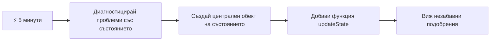
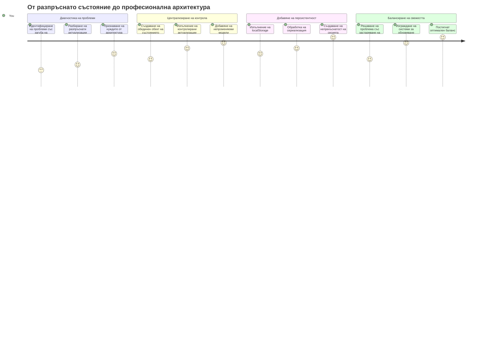
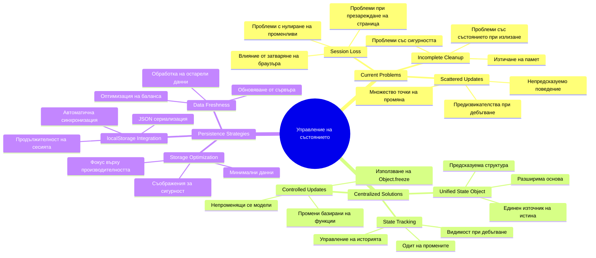
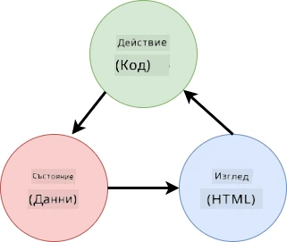
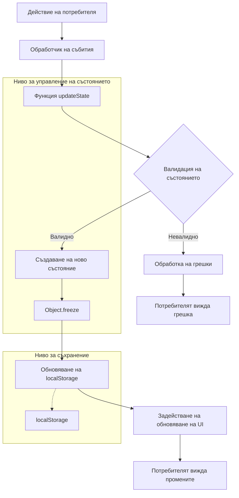
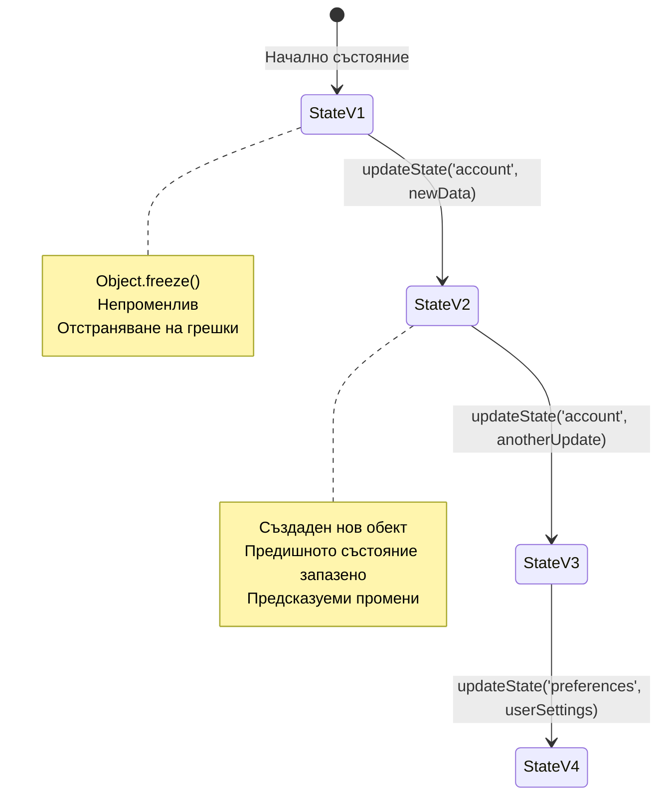
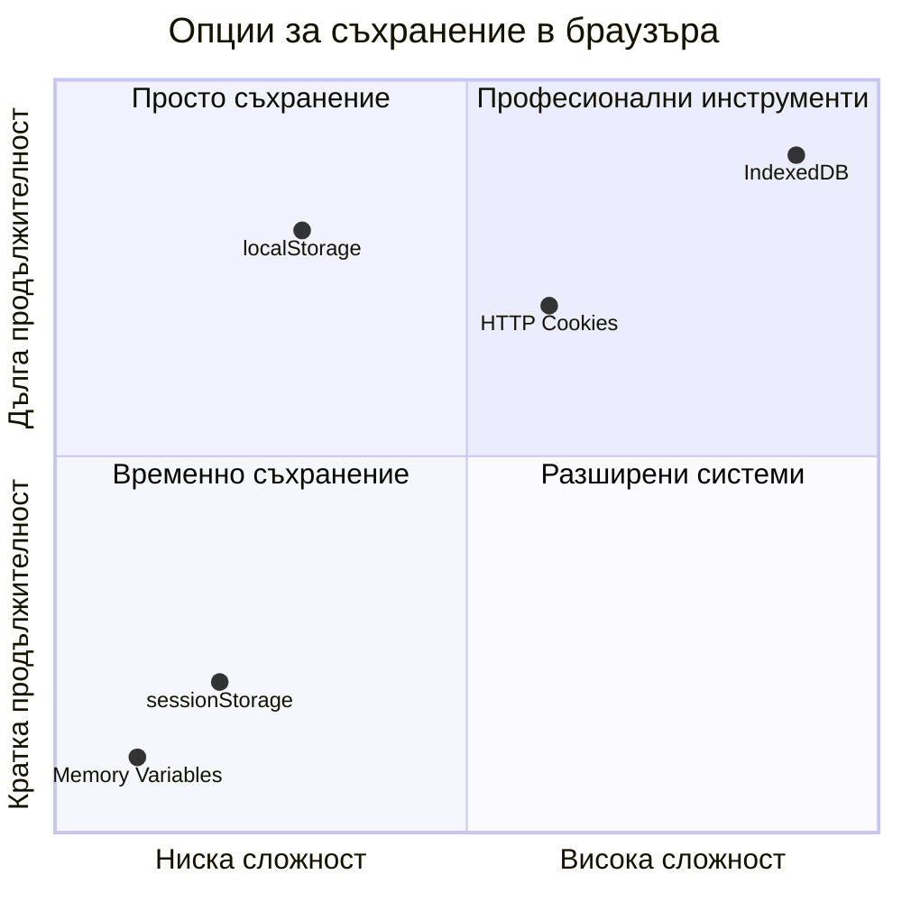
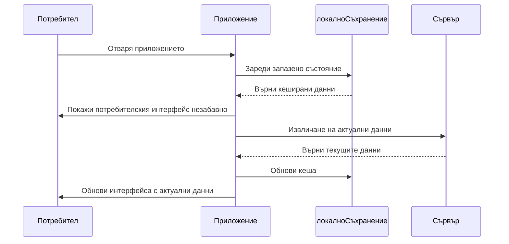
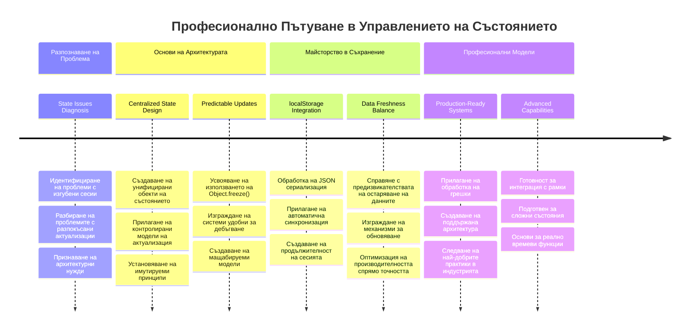
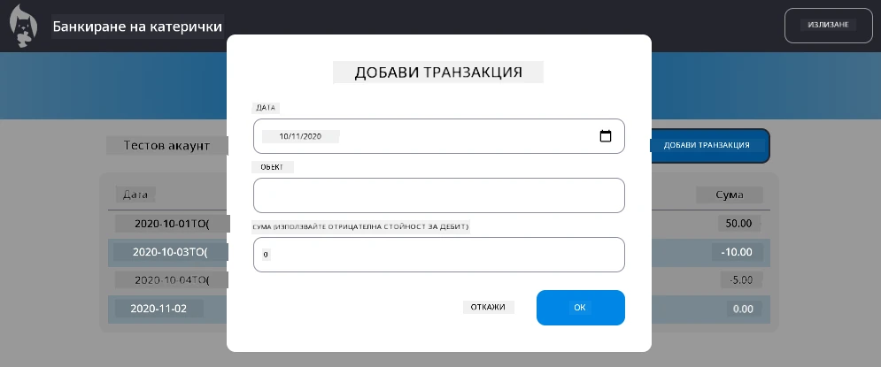

<!--
CO_OP_TRANSLATOR_METADATA:
{
  "original_hash": "b807b09df716dc48a2b750835bf8e933",
  "translation_date": "2026-01-07T07:10:17+00:00",
  "source_file": "7-bank-project/4-state-management/README.md",
  "language_code": "bg"
}
-->
# Изграждане на Банково Приложение Част 4: Концепции за Управление на Състоянието

## ⚡ Какво Можете да Направите през Следващите 5 Минути

**Бърз Старт за Заети Разработчици**


- **Минута 1**: Тествайте настоящия проблем със състоянието - влезте в профила, опреснете страницата, наблюдавайте излизането
- **Минута 2**: Заменете `let account = null` с `let state = { account: null }`
- **Минута 3**: Създайте проста функция `updateState()` за контролирани обновявания
- **Минута 4**: Обновете една функция да използва новия модел
- **Минута 5**: Тествайте подобрената предвидимост и възможности за отстраняване на грешки

**Бърз Диагностичен Тест**:
```javascript
// Преди: Разпръснато състояние
let account = null; // Загубено при презареждане!

// След: Централизирано състояние
let state = Object.freeze({ account: null }); // Контролирано и проследимо!
```

**Защо е важно това**: За 5 минути ще усетите преобразяването от хаотично управление на състоянието към предвидими, лесни за отстраняване на грешки модели. Това е основата, която прави сложните приложения поддържани.

## 🗺️ Вашето Обучително Пътуване Към Майсторството на Управлението на Състоянието


**Вашата крайна цел**: В края на този урок ще сте изградили професионална система за управление на състоянието, която обработва запазването, свежестта на данните и предвидими обновявания - същите модели, използвани в продукционни приложения.

## Предварителен Квиз преди Лекцията

[Предварителен квиз преди лекция](https://ff-quizzes.netlify.app/web/quiz/47)

## Въведение

Управлението на състоянието е като навигационната система на космическия апарат Voyager – когато всичко работи гладко, едва го забелязваме. Но когато нещо се обърка, това прави разликата между достигането до междузвездното пространство и лутането изгубен в космическата пустота. В уеб разработката състоянието представлява всичко, което приложението ви трябва да запомни: статус на влизане на потребителя, данни от формуляри, история на навигацията и временни интерфейсни състояния.

Докато вашето банково приложение се развива от прост формуляр за вход към по-усъвършенствано приложение, вероятно сте срещнали някои често срещани предизвикателства. Опреснявате страницата и потребителите неочаквано се излизат. Затваряте браузъра и целият напредък изчезва. Отстранявате проблем и трябва да търсите в множество функции, които променят едни и същи данни по различен начин.

Това не са признаци на лошо програмиране – това са естествените растежни болки, които възникват, когато приложенията достигнат определена сложност. Всеки разработчик среща тези предизвикателства, докато приложението му преминава от „доказателство на концепцията“ към „продукт, готов за производство“.

В този урок ще реализираме централизирана система за управление на състоянието, която преобразява вашето банково приложение в надеждно, професионално приложение. Ще научите как да управлявате потокa на данни предвидимо, да запазвате сесии на потребители по подходящ начин и да създавате гладко потребителско изживяване, което съвременните уеб приложения изискват.

## Предварителни Изисквания

Преди да се потопите в концепциите за управление на състоянието, ще трябва да сте настроили правилно вашата среда за разработка и да имате основата на банковото приложение на място. Този урок стъпва директно върху концепциите и кода от предишните части на тази серия.

Уверете се, че разполагате със следните компоненти преди да продължите:

**Изисквано Настройване:**
- Завършете [урока за извличане на данни](../3-data/README.md) – приложението ви трябва успешно да зарежда и показва данни за акаунта
- Инсталирайте [Node.js](https://nodejs.org) на вашата система за стартиране на бекенд API
- Стартирайте локално [server API](../api/README.md), за да обработва операции с данни за акаунта

**Тестване на Средата Ви:**

Проверете дали вашият API сървър работи правилно, като изпълните тази команда в терминала:

```sh
curl http://localhost:5000/api
# -> трябва да върне "Bank API v1.0.0" като резултат
```

**Какво прави тази команда:**
- **Изпраща** GET заявка към локалния ви API сървър
- **Тества** връзката и проверява дали сървърът отговаря
- **Връща** информация за версията на API, ако всичко работи коректно

## 🧠 Преглед на Архитектурата на Управление на Състоянието


**Основен Принцип**: Професионалното управление на състоянието балансира предвидимост, запазване и производителност, за да създаде надеждни потребителски изживявания, които се мащабират от прости взаимодействия до сложни работни процеси на приложение.

---

## Диагностициране на Настоящите Проблеми със Състоянието

Като Шерлок Холмс, разглеждащ местопрестъпление, трябва да разберем точно какво се случва в настоящата ни реализация, преди да можем да решим мистерията със изчезващите потребителски сесии.

Нека направим прост експеримент, който разкрива основните предизвикателства при управлението на състоянието:

**🧪 Изпробвайте този диагностичен тест:**
1. Влезте в банкното приложение и отидете на таблото за управление
2. Опреснявате страницата в браузъра
3. Наблюдавайте какво се случва със статуса ви на влизане

Ако бъдете пренасочени обратно към екрана за вход, сте открили класическия проблем със съхранението на състоянието. Това поведение се случва, защото текущата ни реализация запазва потребителските данни в JavaScript променливи, които се нулират при всяко презареждане на страницата.

**Проблеми с Настоящата Реализация:**

Простата променлива `account` от предишния ни [урок](../3-data/README.md) създава три значителни проблема, които влияят както на потребителския опит, така и на поддръжката на кода:

| Проблем | Техническа Причина | Влияние върху Потребителя |
|---------|---------|------------------------|
| **Загуба на Сесия** | При опресняване на страницата JavaScript променливите се изчистват | Потребителите трябва често да се удостоверяват наново |
| **Разпръснати Обновявания** | Множество функции пряко модифицират състоянието | Отстраняването на грешки става все по-трудно |
| **Непълно Изчистване** | Излизането не изчиства всички препратки към състоянието | Потенциални проблеми със сигурността и поверителността |

**Архитектурното Предизвикателство:**

Като дизайна на Титаник с отделни отсеци, който изглежда здрав, докато не се напълнят с вода няколко отсека едновременно, коригирането на тези проблеми поотделно няма да разреши основния архитектурен проблем. Нуждаем се от цялостно решение за управление на състоянието.

> 💡 **Какво всъщност се опитваме да постигнем тук?**

[Управлението на състоянието](https://en.wikipedia.org/wiki/State_management) е наистина за решаване на два основни въпроса:

1. **Къде са моите данни?**: Следене каква информация имаме и откъде идва тя
2. **Всички ли са на една и съща страница?**: Да сме сигурни, че това, което потребителите виждат, съответства на действителното състояние

**Нашата Игрова Стратегия:**

Вместо да се лутаме безцелно, ще създадем **централизирана система за управление на състоянието**. Представете си я като един наистина организиран човек, който отговаря за цялата важна информация:




**Разбиране на този поток на данни:**
- **Централизира** цялото приложение състояние на едно място
- **Пренасочва** всички промени в състоянието през контролирани функции
- **Осигурява** синхронизация на потребителския интерфейс с текущото състояние
- **Предоставя** ясен и предвидим модел за управление на данните

> 💡 **Професионален Възглед**: Този урок се фокусира върху основните концепции. За сложни приложения библиотеки като [Redux](https://redux.js.org) предлагат по-напреднали възможности за управление на състоянието. Разбирането на тези основни принципи ще ви помогне да овладеете всяка библиотека за управление на състоянието.

> ⚠️ **Разширена Тема**: Няма да покриваме автоматични UI обновявания, задействани от промени в състоянието, тъй като това включва концепции от [реактивното програмиране](https://en.wikipedia.org/wiki/Reactive_programming). Помислете за това като отлична следваща стъпка в обучението си!

### Задача: Централизиране на Структурата на Състоянието

Нека започнем да трансформираме разпръснатото управление на състоянието в централизирана система. Тази първа стъпка създава основата за всички подобрения, които ще последват.

**Стъпка 1: Създаване на Централен Обект за Състояние**

Заменете простото деклариране на `account`:

```js
let account = null;
```

Със структурирания обект за състоянието:

```js
let state = {
  account: null
};
```

**Ето защо тази промяна е важна:**
- **Централизира** всички данни на приложението на едно място
- **Подготвя** структурата за добавяне на още свойства на състоянието по-късно
- **Създава** ясна граница между състояние и други променливи
- **Установява** модел, който мащабира с растежа на приложението

**Стъпка 2: Обновяване на Шаблоните за Достъп до Състоянието**

Обновете функциите си да използват новата структура на състоянието:

**Във функциите `register()` и `login()`** заменете:  
```js
account = ...
```
  
с:  
```js
state.account = ...
```
  
**Във функцията `updateDashboard()`** добавете този ред в началото:  
```js
const account = state.account;
```
  
**Какво постигат тези актуализации:**
- **Запазват** съществуващата функционалност, като същевременно подобряват структурата
- **Подготвят** кода ви за по-усъвършенствано управление на състоянието
- **Създават** последователни модели за достъп до данните на състоянието
- **Установяват** основата за централизирани обновявания на състоянието

> 💡 **Забележка**: Това преструктуриране не решава веднага проблемите ни, но създава необходимата основа за мощните подобрения, които предстоят!

### 🎯 Педагогическа Проверка: Принципи на Централизацията

**Пауза и Размишление**: Току-що реализирахте основата на централизираното управление на състоянието. Това е ключово архитектурно решение.

**Бърза Самооценка**:
- Можете ли да обясните защо централизираното съхраняване на състоянието в един обект е по-добро от разпръснати променливи?
- Какво би се случило, ако забравите да обновите функцията да използва `state.account`?
- Как този модел подготвя кода ви за по-усъвършенствани функционалности?

**Реална Връзка**: Моделът за централизиране, който научихте, е основата на модерни рамки като Redux, Vuex и React Context. Вие изграждате същия архитектурен подход, използван в големи приложения.

**Въпрос за Размисъл**: Ако трябва да добавите потребителски предпочитания (тема, език) към приложението си, къде бихте ги добавили в структурата на състоянието? Как това би мащабирало?

## Реализиране на Контролирани Обновявания на Състоянието

След като сме централизирали състоянието, следващата стъпка е да установим контролирани механизми за промени на данните. Този подход осигурява предвидими промени и по-лесно отстраняване на грешки.

Основният принцип наподобява въздушния контрол на полетите: вместо да позволяваме на множество функции самостоятелно да променят състоянието, ще навигираме всички промени през една контролирана функция. Този модел дава ясен преглед кога и как се случват промените.

**Управление на имутируемото състояние:**

Ще третираме обекта `state` като [*имутируем*](https://en.wikipedia.org/wiki/Immutable_object), което означава, че никога не го променяме директно. Вместо това всяка промяна създава нов обект със състоянието с обновените данни.

Въпреки че този подход може първоначално да изглежда по-малко ефективен от директните модификации, той носи големи предимства при отстраняване на грешки, тестване и поддържане на предвидимостта на приложението.

**Предимства на имутируемото управление на състоянието:**

| Полза | Описание | Влияние |
|---------|-------------|--------|
| **Предвидимост** | Промените се случват само чрез контролирани функции | По-лесно отстраняване на грешки и тестване |
| **Проследяване на историята** | Всяка промяна създава нов обект | Позволява функции за отменяне/възстановяване |
| **Предотвратяване на странични ефекти** | Няма случайни промени | Предпазва от мистериозни грешки |
| **Оптимизация на производителността** | Лесно се засича кога състоянието е променено | Позволява ефективни UI обновявания |

**JavaScript имутируемост с `Object.freeze()`:**

JavaScript предоставя [`Object.freeze()`](https://developer.mozilla.org/docs/Web/JavaScript/Reference/Global_Objects/Object/freeze), за да предотврати модификации на обекти:

```js
const immutableState = Object.freeze({ account: userData });
// Всеки опит за промяна на immutableState ще хвърли грешка
```

**Разграждане на това, което се случва тук:**
- **Предотвратява** директно присвояване или изтриване на свойства
- **Хвърля** изключения при опити за модификация
- **Осигурява**, че промяната на състоянието трябва да минава през контролирани функции
- **Създава** ясен договор за начина, по който състоянието може да бъде обновявано

> 💡 **Задълбочаване**: Научете за разликата между *повърхностно* и *дълбоко* имутируеми обекти в [документацията на MDN](https://developer.mozilla.org/docs/Web/JavaScript/Reference/Global_Objects/Object/freeze#What_is_shallow_freeze). Разбирането на тази разлика е ключово за сложни структури на състоянието.


### Задача

Нека създадем нова функция `updateState()`:

```js
function updateState(property, newData) {
  state = Object.freeze({
    ...state,
    [property]: newData
  });
}
```

В тази функция създаваме нов обект със състоянието и копираме данни от предишното състояние с помощта на [*spread (`...`) оператора*](https://developer.mozilla.org/docs/Web/JavaScript/Reference/Operators/Spread_syntax#Spread_in_object_literals). След това заменяме конкретно свойство на обекта със състоянието с новите данни, използвайки [брадкети за именоване](https://developer.mozilla.org/docs/Web/JavaScript/Guide/Working_with_Objects#Objects_and_properties) `[property]` за присвояване. Накрая заключваме обекта, за да предотвратим модификации, като използваме `Object.freeze()`. Засега имаме само свойството `account` в състоянието, но с този подход можете да добавите колкото искате свойства.

Ще обновим и инициализацията на `state`, за да гарантираме, че началното състояние също е замразено:

```js
let state = Object.freeze({
  account: null
});
```

След това обновете функцията `register`, като замените присвояването `state.account = result;` с:

```js
updateState('account', result);
```

Направете същото в `login` функцията, като замените `state.account = data;` с:

```js
updateState('account', data);
```

Сега ще използваме възможността да отстраним проблема с невъзстановяването на данните за акаунта при натискане на *Изход*.

Създайте нова функция `logout()`:

```js
function logout() {
  updateState('account', null);
  navigate('/login');
}
```

В `updateDashboard()` заменете пренасочването `return navigate('/login');` с `return logout()`;

Опитайте да регистрирате нов акаунт, след това излезте и влезте отново, за да проверите, че всичко все още работи правилно.

> Съвет: можете да проследявате всички промени в състоянието, като добавите `console.log(state)` в края на `updateState()` и отворите конзолата в инструментите за разработчици на браузъра.

## Реализиране на Запазване на Данни

Проблемът със загубата на сесия, който установихме по-рано, изисква решение за запазване на данни, което поддържа състоянието на потребителя между сесиите на браузъра. Това превръща приложението ни от временен опит в надежден, професионален инструмент.

Помислете как атомните часовници поддържат прецизно време дори при прекъсвания на електрозахранването, като съхраняват критичното състояние в нестабилна памет. По същия начин уеб приложенията се нуждаят от постоянни механизми за съхранение, за да запазят важните потребителски данни между сесиите и презарежданията на страницата.

**Стратегически въпроси за запазването на данни:**

Преди да реализирате запазването, обмислете тези критични фактори:

| Въпрос | Контекст на Банковото Приложение | Влияние върху Решението |
|----------|--------------------|----------------|
| **Данните чувствителни ли са?** | Баланс по сметка, история на транзакции | Избирайте сигурни методи за съхранение |
| **Колко дълго трябва да се съхранява?** | Състояние на влизане спрямо временни UI предпочитания | Изберете подходяща продължителност на съхранение |
| **Сървърът нуждае ли се от това?** | Токени за удостоверяване спрямо UI настройки | Определете изискванията за споделяне |

**Опции за съхранение в браузъра:**

Съвременните браузъри предлагат няколко механизма за съхранение, всеки предназначен за различни случаи на употреба:

**Основни API за съхранение:**

1. **[`localStorage`](https://developer.mozilla.org/docs/Web/API/Window/localStorage)**: Постоянно [ключ/стойност съхранение](https://en.wikipedia.org/wiki/Key%E2%80%93value_database)
   - **Запазва** данните между сесиите на браузъра за неопределено време  
   - **Оцеляват** рестартирания на браузъра и компютъра
   - **Ограничен** до конкретния домейн на уебсайта
   - **Перфектен** за потребителски предпочитания и състояния на влизане

2. **[`sessionStorage`](https://developer.mozilla.org/docs/Web/API/Window/sessionStorage)**: Временно съхранение за сесията
   - **Функционира** идентично на localStorage по време на активни сесии
   - **Изчиства се** автоматично при затваряне на таба в браузъра
   - **Идеален** за временни данни, които не трябва да се запазват

3. **[HTTP бисквитки](https://developer.mozilla.org/docs/Web/HTTP/Cookies)**: Сървърно споделено съхранение
   - **Автоматично** се изпращат с всяка заявка към сървъра
   - **Перфектни** за [автентикационни](https://en.wikipedia.org/wiki/Authentication) токени
   - **Ограничени** по размер и могат да влияят на производителността

**Изискване за сериализация на данните:**

И `localStorage`, и `sessionStorage` съхраняват само [низове](https://developer.mozilla.org/docs/Web/JavaScript/Reference/Global_Objects/String):

```js
// Преобразуване на обекти в JSON низове за съхранение
const accountData = { user: 'john', balance: 150 };
localStorage.setItem('account', JSON.stringify(accountData));

// Парсиране на JSON низове обратно в обекти при извличане
const savedAccount = JSON.parse(localStorage.getItem('account'));
```

**Разбиране на сериализацията:**
- **Конвертира** JavaScript обекти в JSON низове чрез [`JSON.stringify()`](https://developer.mozilla.org/docs/Web/JavaScript/Reference/Global_Objects/JSON/stringify)
- **Възстановява** обекти от JSON чрез [`JSON.parse()`](https://developer.mozilla.org/docs/Web/JavaScript/Reference/Global_Objects/JSON/parse)
- **Обработва** автоматично сложни вложени обекти и масиви
- **Не работи** с функции, неопределени стойности и циклични препратки

> 💡 **Разширен вариант**: За сложни офлайн приложения с големи набори от данни, разгледайте [`IndexedDB` API](https://developer.mozilla.org/docs/Web/API/IndexedDB_API). Той предоставя пълна клиентска база данни, но изисква по-сложна имплементация.


### Задача: Имплементиране на постоянство в localStorage

Нека реализираме постоянно съхранение, така че потребителите да остават влезли, докато не се излязат изрично. Ще използваме `localStorage` за съхранение на данни за акаунта между сесиите в браузъра.

**Стъпка 1: Дефиниране на конфигурация за съхранение**

```js
const storageKey = 'savedAccount';
```

**Какво предоставя тази константа:**
- **Създава** последователен идентификатор за нашите съхранявани данни
- **Предотвратява** правописни грешки при препратки към ключа за съхранение
- **Прави** лесна смяната на ключа за съхранение при нужда
- **Следва** най-добрите практики за поддържам код

**Стъпка 2: Добавяне на автоматично запазване**

Добавете този ред в края на функцията `updateState()`:

```js
localStorage.setItem(storageKey, JSON.stringify(state.account));
```

**Какво се случва тук:**
- **Конвертира** обекта на акаунта в JSON низ за съхранение
- **Запазва** данните чрез нашия последователен ключ за съхранение
- **Изпълнява** се автоматично при всяка промяна на състоянието
- **Гарантира**, че съхранените данни винаги са синхронизирани с текущото състояние

> 💡 **Архитектурно предимство**: Тъй като централизираме всички обновления на състоянието чрез `updateState()`, добавянето на постоянство изискваше само един ред код. Това показва силата на добрите архитектурни решения!

**Стъпка 3: Възстановяване на състоянието при зареждане на приложението**

Създайте инициализираща функция за възстановяване на запазените данни:

```js
function init() {
  const savedAccount = localStorage.getItem(storageKey);
  if (savedAccount) {
    updateState('account', JSON.parse(savedAccount));
  }

  // Нашият предишен код за инициализация
  window.onpopstate = () => updateRoute();
  updateRoute();
}

init();
```

**Разбиране на процеса на инициализация:**
- **Взема** всички предварително запазени данни за акаунта от localStorage
- **Парсира** JSON низа обратно в JavaScript обект
- **Обновява** състоянието чрез нашата контролирана функция за обновяване
- **Възстановява** сесията на потребителя автоматично при зареждане на страницата
- **Изпълнява** се преди ъпдейти на маршрутите, за да осигури наличност на състоянието

**Стъпка 4: Оптимизиране на стандартния маршрут**

Обновете дефолтния маршрут, за да се възползва от постоянството:

В `updateRoute()`, заменете:
```js
// Замени: return navigate('/login');
return navigate('/dashboard');
```

**Защо тази промяна има смисъл:**
- **Използва** ефективно новата ни система за постоянство
- **Позволява** на таблото при нужда да прави проверки за удостоверяване
- **Пренасочва** към влизане автоматично, ако няма запазена сесия
- **Създава** по-гладко изживяване за потребителя

**Тестване на вашата имплементация:**

1. Влезте в банковото си приложение
2. Презаредете страницата в браузъра
3. Проверете дали оставате влезли и сте на таблото
4. Затворете и отворете отново браузъра
5. Върнете се в приложението и потвърдете, че все още сте влезли

🎉 **Постижение отключено**: Успешно сте имплементирали управление на постоянно състояние! Вашето приложение сега се държи като професионално уеб приложение.

### 🎯 Педагоически контролна точка: Архитектура на постоянството

**Разбиране на архитектурата**: Вие сте реализирали сложен слой на постоянство, който балансира изживяването на потребителя с управлението на сложността на данните.

**Основни усвоени концепции**:
- **JSON сериализация**: Преобразуване на сложни обекти в низове за съхранение
- **Автоматична синхронизация**: Промените в състоянието задействат постоянно съхранение
- **Възстановяване на сесията**: Приложенията могат да възстановят потребителския контекст след прекъсвания
- **Централизирано постоянство**: Една функция за обновяване управлява цялото съхранение

**Връзка с индустрията**: Този модел на постоянство е фундаментален за Progressive Web Apps (PWA), приложения с офлайн първи подход и съвременни мобилни уеб изживявания. Вие изграждате възможности на продукционно ниво.

**Въпрос за размисъл**: Как бихте модифицирали тази система, за да поддържа множество потребителски акаунти на едно устройство? Помислете за поверителността и сигурността.

## Балансиране на постоянството с актуалността на данните

Нашата система за постоянство успешно поддържа потребителските сесии, но въвежда ново предизвикателство: застаряване на данните. Когато множество потребители или приложения модифицират едни и същи данни на сървъра, локалната кеширана информация остарява.

Тази ситуация е подобна на викингски навигатори, които са разчитали едновременно на съхранени звездни карти и актуални астрономически наблюдения. Картите предоставяха постоянство, но навигаторите имаха нужда от свежи наблюдения, за да отчитат променящите се условия. По същия начин приложението ни се нуждае както от постоянно потребителско състояние, така и от актуални сървърни данни.

**🧪 Откриване на проблема със застаряването на данни:**

1. Влезте в таблото с акаунта `test`
2. Изпълнете следната команда в терминал, за да симулирате транзакция от друг източник:

```sh
curl --request POST \
     --header "Content-Type: application/json" \
     --data "{ \"date\": \"2020-07-24\", \"object\": \"Bought book\", \"amount\": -20 }" \
     http://localhost:5000/api/accounts/test/transactions
```

3. Презаредете страницата на таблото в браузъра
4. Наблюдавайте дали виждате новата транзакция

**Какво демонстрира този тест:**
- **Показва** как локалното съхранение може да стане „застаряло“ (неактуално)
- **Симулира** реални ситуации, при които данните се променят извън приложението
- **Разкрива** напрежението между постоянството и актуалността на данните

**Проблемът със застаряването на данните:**

| Проблем | Причина | Влияние върху потребителя |
|---------|--------|--------------------------|
| **Остарели данни** | localStorage никога не изтича автоматично | Потребителите виждат остаряла информация |
| **Промени на сървъра** | Други приложения/потребители модифицират същите данни | Несъответстващи изгледи на различни платформи |
| **Кеш спрямо реалност** | Локалният кеш не съвпада със състоянието на сървъра | Лошо потребителско изживяване и объркване |

**Стратегия за решение:**

Ще реализираме модел „презареждане при зареждане“, който балансира ползите на постоянството с нуждата от свежи данни. Този подход запазва гладкото потребителско изживяване като същевременно гарантира точност на данните.


### Задача: Имплементиране на система за обновяване на данни

Ще създадем система, която автоматично извлича свежи данни от сървъра, като същевременно поддържа предимствата на нашето управление на постоянно състояние.

**Стъпка 1: Създайте функция за обновяване на данните на акаунта**

```js
async function updateAccountData() {
  const account = state.account;
  if (!account) {
    return logout();
  }

  const data = await getAccount(account.user);
  if (data.error) {
    return logout();
  }

  updateState('account', data);
}
```

**Логика на тази функция:**
- **Проверява** дали потребителят е влязъл (съществува state.account)
- **Пренасочва** към излизане, ако няма валидна сесия
- **Извлича** свежи данни за акаунта от сървъра чрез съществуващата функция `getAccount()`
- **Обработва** грешки от сървъра като излизане при невалидни сесии
- **Обновява** състоянието със свежи данни чрез контролирания ни механизъм
- **Задейства** автоматичното съхранение в localStorage чрез `updateState()`

**Стъпка 2: Създайте обработчик за обновяване на таблото**

```js
async function refresh() {
  await updateAccountData();
  updateDashboard();
}
```

**Какво постига тази функция за обновяване:**
- **Координира** процеса на обновяване и ъпдейт на UI
- **Изчаква** зареждането на свежите данни преди обновяване на изгледа
- **Гарантира**, че таблото показва най-актуалната информация
- **Поддържа** ясно разделяне между управление на данни и UI ъпдейти

**Стъпка 3: Интегрирайте с маршрутната система**

Обновете конфигурацията на маршрутите, за да задействате обновяването автоматично:

```js
const routes = {
  '/login': { templateId: 'login' },
  '/dashboard': { templateId: 'dashboard', init: refresh }
};
```

**Как работи тази интеграция:**
- **Изпълнява** функцията за обновяване всеки път при зареждане на маршрута на таблото
- **Гарантира**, че винаги се показват свежи данни при навигация към таблото
- **Запазва** съществуващата структура на маршрутите, като добавя актуалност на данните
- **Осигурява** последователен модел за инициализация специфична за маршрут

**Тестване на вашата система за обновяване на данни:**

1. Влезте в банковото си приложение
2. Изпълнете командата curl от по-рано, за да създадете нова транзакция
3. Презаредете страницата на таблото или навигирайте далеч и обратно
4. Проверете, че новата транзакция се появява веднага

🎉 **Постигнат перфектен баланс**: Вашето приложение комбинира плавното изживяване на постоянното състояние с точността на свежите сървърни данни!

## 📈 Вашата времева линия на овладяване на управлението на състоянието


**🎓 Ключово постижение**: Успешно сте изградили пълна система за управление на състоянието, използвайки същите принципи, които движат Redux, Vuex и други професионални библиотеки. Тези модели се мащабират от прости приложения до корпоративни системи.

**🔄 Следващо ниво възможности**:
- Готови за овладяване на рамки за управление на състоянието (Redux, Zustand, Pinia)
- Подготвени за внедряване на реалновременни функции с WebSockets
- Оборудвани за изграждане на офлайн първи Progressive Web Apps
- Основи за напреднали модели като машини на състояния и наблюдатели

## Предизвикателство GitHub Copilot Agent 🚀

Използвайте режим Агент, за да завършите следното предизвикателство:

**Описание:** Имплементирайте пълно управление на състоянието с функции за отмяна и повторно изпълнение за банковото приложение. Това предизвикателство ще ви помогне да упражните усъвършенствани концепции за управление на състоянието, включително проследяване на история, иммутабилни обновявания и синхронизация с интерфейса.

**Подсказка:** Създайте разширена система за управление на състоянието, която включва: 1) Масив с история на състоянията, който следи всички предишни състояния, 2) Функции за undo и redo, които могат да връщат към предишни състояния, 3) Бутоните за undo/redo в UI на таблото, 4) Максимален лимит на историята от 10 състояния, за да се избегнат проблеми с паметта, и 5) Правилно изчистване на историята при излизане на потребителя. Уверете се, че undo/redo функционалността работи с промени в баланса по акаунта и се запазва при презареждания на браузъра.

Научете повече за [agent mode](https://code.visualstudio.com/blogs/2025/02/24/introducing-copilot-agent-mode) тук.

## 🚀 Предизвикателство: Оптимизация на съхранението

Вашата реализация вече ефективно управлява потребителски сесии, обновяване на данни и управление на състоянието. Въпреки това, обмислете дали настоящият подход оптимално балансира ефективността на съхранение с функционалността.

Подобно на шахматистите, които разпознават съществените фигури и излишните пешки, ефективното управление на състоянието изисква да се идентифицира кои данни трябва да бъдат постоянни и кои винаги да са свежи от сървъра.

**Анализ на оптимизацията:**

Оценете текущата си имплементация на localStorage и разгледайте тези стратегически въпроси:
- Коя е минималната информация, необходима за поддържане на потребителската автентикация?
- Кои данни се променят толкова често, че локалното кеширане дава малко полза?
- Как оптимизацията на съхранението може да подобри производителността, без да влошава потребителското изживяване?

Този тип архитектурен анализ отличава опитните разработчици, които разглеждат както функционалността, така и ефективността в решенията си.

**Стратегия за имплементация:**
- **Идентифицирайте** съществените данни, които трябва да се съхраняват (вероятно само идентификация на потребителя)
- **Модифицирайте** localStorage имплементацията, за да съхранява само критични данни за сесията
- **Осигурете** винаги зареждане на свежи данни от сървъра при посещение на таблото
- **Тествайте**, че оптимизираният ви подход запазва същото потребителско изживяване

**Разширено съображение:**
- **Сравнете** плюсовете и минусите на съхранение на пълни данни за акаунта спрямо само автентикационните токени
- **Документирайте** решенията и мотивите си за бъдещите членове на екипа

Това предизвикателство ще ви помогне да мислите като професионален разработчик, който отчита както изживяването на потребителя, така и ефективността на приложението. Отделете време да експериментирате с различни подходи!

## Квиз след лекцията

[Квиз след лекцията](https://ff-quizzes.netlify.app/web/quiz/48)

## Задача

[Имплементирайте диалог „Добавяне на транзакция“](assignment.md)

Ето примерен резултат след завършване на задачата:



---

<!-- CO-OP TRANSLATOR DISCLAIMER START -->
**Отказ от отговорност**:
Този документ е преведен с помощта на услуга за автоматичен превод [Co-op Translator](https://github.com/Azure/co-op-translator). Въпреки че се стремим към точност, моля, имайте предвид, че автоматичните преводи могат да съдържат грешки или неточности. Оригиналният документ на неговия роден език трябва да се счита за авторитетен източник. За критична информация е препоръчително професионално човешко превеждане. Ние не носим отговорност за каквито и да е недоразумения или неправилни тълкувания, произтичащи от използването на този превод.
<!-- CO-OP TRANSLATOR DISCLAIMER END -->