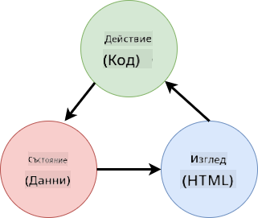

<!--
CO_OP_TRANSLATOR_METADATA:
{
  "original_hash": "4fa20c513e367e9cdd401bf49ae16e33",
  "translation_date": "2025-08-28T07:37:48+00:00",
  "source_file": "7-bank-project/4-state-management/README.md",
  "language_code": "bg"
}
-->
# Създаване на банково приложение, част 4: Концепции за управление на състоянието

## Предварителен тест

[Предварителен тест](https://ff-quizzes.netlify.app/web/quiz/47)

### Въведение

С разрастването на уеб приложението става предизвикателство да се следят всички потоци от данни. Кой код получава данните, коя страница ги използва, къде и кога трябва да бъдат актуализирани... лесно е да се стигне до объркан код, който е труден за поддръжка. Това е особено вярно, когато трябва да споделяте данни между различни страници на приложението, например данни за потребителя. Концепцията за *управление на състоянието* винаги е съществувала във всички видове програми, но с увеличаването на сложността на уеб приложенията тя вече е ключова точка, която трябва да се обмисли по време на разработката.

В тази последна част ще разгледаме приложението, което създадохме, за да преосмислим как се управлява състоянието, като позволим поддръжка на обновяване на браузъра по всяко време и запазване на данните между потребителските сесии.

### Предпоставки

Трябва да сте завършили [частта за извличане на данни](../3-data/README.md) от уеб приложението за този урок. Също така трябва да инсталирате [Node.js](https://nodejs.org) и [да стартирате API сървъра](../api/README.md) локално, за да можете да управлявате данните за акаунта.

Можете да тествате дали сървърът работи правилно, като изпълните тази команда в терминала:

```sh
curl http://localhost:5000/api
# -> should return "Bank API v1.0.0" as a result
```

---

## Преосмисляне на управлението на състоянието

В [предишния урок](../3-data/README.md) въведохме основна концепция за състояние в нашето приложение с глобалната променлива `account`, която съдържа банковите данни за текущо влезлия потребител. Въпреки това, текущата ни имплементация има някои недостатъци. Опитайте да обновите страницата, когато сте на таблото. Какво се случва?

Има три проблема с текущия код:

- Състоянието не се запазва, тъй като обновяването на браузъра ви връща обратно на страницата за вход.
- Има множество функции, които модифицират състоянието. С разрастването на приложението това може да затрудни проследяването на промените и лесно да се забрави актуализирането на някоя.
- Състоянието не се изчиства, така че когато кликнете върху *Изход*, данните за акаунта все още са там, въпреки че сте на страницата за вход.

Можем да актуализираме кода си, за да се справим с тези проблеми един по един, но това би създало повече дублиране на код и би направило приложението по-сложно и трудно за поддръжка. Или можем да спрем за няколко минути и да преосмислим стратегията си.

> Какви проблеми всъщност се опитваме да решим тук?

[Управлението на състоянието](https://en.wikipedia.org/wiki/State_management) е свързано с намирането на добър подход за решаване на тези два конкретни проблема:

- Как да направим потоците от данни в приложението разбираеми?
- Как да поддържаме данните за състоянието винаги синхронизирани с потребителския интерфейс (и обратно)?

След като се погрижите за тези проблеми, всички други проблеми, които може да имате, или ще бъдат вече решени, или ще станат по-лесни за решаване. Има много възможни подходи за решаване на тези проблеми, но ние ще използваме общо решение, което се състои в **централизиране на данните и начините за тяхната промяна**. Потокът от данни би изглеждал така:



> Тук няма да разглеждаме частта, в която данните автоматично задействат актуализацията на изгледа, тъй като тя е свързана с по-напреднали концепции на [Реактивното програмиране](https://en.wikipedia.org/wiki/Reactive_programming). Това е добра тема за последващо задълбочаване.

✅ Съществуват много библиотеки с различни подходи към управлението на състоянието, като [Redux](https://redux.js.org) е популярна опция. Разгледайте концепциите и моделите, които се използват, тъй като често това е добър начин да научите какви потенциални проблеми може да срещнете в големи уеб приложения и как те могат да бъдат решени.

### Задача

Ще започнем с малко рефакториране. Заменете декларацията на `account`:

```js
let account = null;
```

С:

```js
let state = {
  account: null
};
```

Идеята е да *централизираме* всички данни на приложението в един обект за състояние. Засега имаме само `account` в състоянието, така че това не променя много, но създава път за бъдещи промени.

Също така трябва да актуализираме функциите, които го използват. Във функциите `register()` и `login()` заменете `account = ...` с `state.account = ...`;

В началото на функцията `updateDashboard()` добавете този ред:

```js
const account = state.account;
```

Това рефакториране само по себе си не донесе много подобрения, но идеята беше да се положи основата за следващите промени.

## Проследяване на промените в данните

Сега, когато сме поставили обекта `state` за съхранение на нашите данни, следващата стъпка е да централизиране актуализациите. Целта е да се улесни проследяването на всякакви промени и кога те се случват.

За да избегнем промени в обекта `state`, също е добра практика да го считаме за [*неизменяем*](https://en.wikipedia.org/wiki/Immutable_object), което означава, че той изобщо не може да бъде модифициран. Това означава, че трябва да създадете нов обект за състояние, ако искате да промените нещо в него. По този начин изграждате защита срещу потенциално нежелани [странични ефекти](https://en.wikipedia.org/wiki/Side_effect_(computer_science)) и отваряте възможности за нови функции в приложението си, като например внедряване на undo/redo, като същевременно улеснявате дебъгването. Например, можете да регистрирате всяка промяна, направена в състоянието, и да запазите историята на промените, за да разберете източника на грешка.

В JavaScript можете да използвате [`Object.freeze()`](https://developer.mozilla.org/docs/Web/JavaScript/Reference/Global_Objects/Object/freeze), за да създадете неизменяема версия на обект. Ако се опитате да направите промени в неизменяем обект, ще бъде хвърлено изключение.

✅ Знаете ли разликата между *повърхностно* и *дълбоко* неизменяем обект? Можете да прочетете за това [тук](https://developer.mozilla.org/docs/Web/JavaScript/Reference/Global_Objects/Object/freeze#What_is_shallow_freeze).

### Задача

Нека създадем нова функция `updateState()`:

```js
function updateState(property, newData) {
  state = Object.freeze({
    ...state,
    [property]: newData
  });
}
```

В тази функция създаваме нов обект за състояние и копираме данни от предишното състояние, използвайки [*оператора за разпръскване (`...`)*](https://developer.mozilla.org/docs/Web/JavaScript/Reference/Operators/Spread_syntax#Spread_in_object_literals). След това презаписваме конкретно свойство на обекта за състояние с новите данни, използвайки [нотацията с квадратни скоби](https://developer.mozilla.org/docs/Web/JavaScript/Guide/Working_with_Objects#Objects_and_properties) `[property]` за присвояване. Накрая заключваме обекта, за да предотвратим модификации, използвайки `Object.freeze()`. Засега имаме само свойството `account`, съхранено в състоянието, но с този подход можете да добавите толкова свойства, колкото са ви необходими.

Също така ще актуализираме инициализацията на `state`, за да сме сигурни, че началното състояние също е заключено:

```js
let state = Object.freeze({
  account: null
});
```

След това актуализирайте функцията `register`, като замените присвояването `state.account = result;` с:

```js
updateState('account', result);
```

Направете същото с функцията `login`, като замените `state.account = data;` с:

```js
updateState('account', data);
```

Сега ще използваме възможността да поправим проблема с данните за акаунта, които не се изчистват, когато потребителят кликне върху *Изход*.

Създайте нова функция `logout()`:

```js
function logout() {
  updateState('account', null);
  navigate('/login');
}
```

В `updateDashboard()` заменете пренасочването `return navigate('/login');` с `return logout();`

Опитайте да регистрирате нов акаунт, да излезете и да влезете отново, за да проверите дали всичко все още работи правилно.

> Съвет: можете да разгледате всички промени в състоянието, като добавите `console.log(state)` в края на `updateState()` и отворите конзолата в инструментите за разработка на браузъра.

## Запазване на състоянието

Повечето уеб приложения трябва да запазват данни, за да могат да работят правилно. Всички критични данни обикновено се съхраняват в база данни и се достъпват чрез API на сървъра, като например данните за потребителския акаунт в нашия случай. Но понякога е интересно да се запазят някои данни в клиентското приложение, което работи в браузъра, за по-добро потребителско изживяване или за подобряване на производителността при зареждане.

Когато искате да запазите данни в браузъра, има няколко важни въпроса, които трябва да си зададете:

- *Данните чувствителни ли са?* Трябва да избягвате съхраняването на чувствителни данни в клиента, като например пароли на потребители.
- *За колко време трябва да запазите тези данни?* Планирате ли да достъпвате тези данни само за текущата сесия или искате те да се съхраняват завинаги?

Съществуват множество начини за съхранение на информация в уеб приложение, в зависимост от това, което искате да постигнете. Например, можете да използвате URL адресите, за да съхранявате заявка за търсене и да я направите споделима между потребителите. Можете също така да използвате [HTTP бисквитки](https://developer.mozilla.org/docs/Web/HTTP/Cookies), ако данните трябва да се споделят със сървъра, като например информация за [автентикация](https://en.wikipedia.org/wiki/Authentication).

Друга опция е да използвате един от многото API на браузъра за съхранение на данни. Два от тях са особено интересни:

- [`localStorage`](https://developer.mozilla.org/docs/Web/API/Window/localStorage): [Key/Value хранилище](https://en.wikipedia.org/wiki/Key%E2%80%93value_database), което позволява запазване на данни, специфични за текущия уеб сайт, между различни сесии. Данните, запазени в него, никога не изтичат.
- [`sessionStorage`](https://developer.mozilla.org/docs/Web/API/Window/sessionStorage): работи по същия начин като `localStorage`, с изключение на това, че данните, съхранени в него, се изчистват, когато сесията приключи (когато браузърът се затвори).

Имайте предвид, че и двата API позволяват съхранение само на [низове](https://developer.mozilla.org/docs/Web/JavaScript/Reference/Global_Objects/String). Ако искате да съхранявате сложни обекти, ще трябва да ги сериализирате във формат [JSON](https://developer.mozilla.org/docs/Web/JavaScript/Reference/Global_Objects/JSON), използвайки [`JSON.stringify()`](https://developer.mozilla.org/docs/Web/JavaScript/Reference/Global_Objects/JSON/stringify).

✅ Ако искате да създадете уеб приложение, което не работи със сървър, е възможно да създадете база данни на клиента, използвайки [`IndexedDB` API](https://developer.mozilla.org/docs/Web/API/IndexedDB_API). Това е запазено за напреднали случаи на употреба или ако трябва да съхранявате значително количество данни, тъй като е по-сложно за използване.

### Задача

Искаме нашите потребители да останат влезли, докато не кликнат изрично върху бутона *Изход*, така че ще използваме `localStorage`, за да съхраняваме данните за акаунта. Първо, нека дефинираме ключ, който ще използваме за съхранение на нашите данни.

```js
const storageKey = 'savedAccount';
```

След това добавете този ред в края на функцията `updateState()`:

```js
localStorage.setItem(storageKey, JSON.stringify(state.account));
```

С това данните за потребителския акаунт ще бъдат запазени и винаги актуални, тъй като преди това централизирахме всички актуализации на състоянието. Тук започваме да се възползваме от всички предишни рефакторирания 🙂.

Тъй като данните се запазват, трябва също така да се погрижим за тяхното възстановяване, когато приложението се зареди. Тъй като започваме да имаме повече код за инициализация, може би е добра идея да създадем нова функция `init`, която включва и предишния код в края на `app.js`:

```js
function init() {
  const savedAccount = localStorage.getItem(storageKey);
  if (savedAccount) {
    updateState('account', JSON.parse(savedAccount));
  }

  // Our previous initialization code
  window.onpopstate = () => updateRoute();
  updateRoute();
}

init();
```

Тук извличаме запазените данни и ако има такива, актуализираме състоянието съответно. Важно е да направим това *преди* актуализирането на маршрута, тъй като може да има код, който разчита на състоянието по време на актуализацията на страницата.

Също така можем да направим страницата *Табло* основната страница на нашето приложение, тъй като сега запазваме данните за акаунта. Ако не се намерят данни, таблото се грижи за пренасочването към страницата *Вход* така или иначе. В `updateRoute()` заменете резервния вариант `return navigate('/login');` с `return navigate('/dashboard');`.

Сега влезте в приложението и опитайте да обновите страницата. Трябва да останете на таблото. С тази актуализация сме се погрижили за всички първоначални проблеми...

## Обновяване на данните

...Но може би сме създали нов проблем. Опа!

Отидете на таблото, използвайки акаунта `test`, след това изпълнете тази команда в терминала, за да създадете нова транзакция:

```sh
curl --request POST \
     --header "Content-Type: application/json" \
     --data "{ \"date\": \"2020-07-24\", \"object\": \"Bought book\", \"amount\": -20 }" \
     http://localhost:5000/api/accounts/test/transactions
```

Опитайте да обновите страницата на таблото в браузъра сега. Какво се случва? Виждате ли новата транзакция?

Състоянието се запазва за неопределено време благодарение на `localStorage`, но това също означава, че то никога не се актуализира, докато не излезете от приложението и не влезете отново!

Една възможна стратегия за решаване на този проблем е да презареждаме данните за акаунта всеки път, когато таблото се зарежда, за да избегнем остарели данни.

### Задача

Създайте нова функция `updateAccountData`:

```js
async function updateAccountData() {
  const account = state.account;
  if (!account) {
    return logout();
  }

  const data = await getAccount(account.user);
  if (data.error) {
    return logout();
  }

  updateState('account', data);
}
```

Този метод проверява дали в момента сме влезли, след което презарежда данните за акаунта от сървъра.

Създайте друга функция, наречена `refresh`:

```js
async function refresh() {
  await updateAccountData();
  updateDashboard();
}
```

Тази функция актуализира данните за акаунта, след което се грижи за актуализирането на HTML на страницата на таблото. Това е, което трябва да извикаме, когато маршрутът на таблото се зареди. Актуализирайте дефиницията на маршрута с:

```js
const routes = {
  '/login': { templateId: 'login' },
  '/dashboard': { templateId: 'dashboard', init: refresh }
};
```

Опитайте да презаредите таблото с
[Тест след лекцията](https://ff-quizzes.netlify.app/web/quiz/48)

## Задача

[Реализирайте диалогов прозорец "Добавяне на транзакция"](assignment.md)

Ето примерен резултат след изпълнение на задачата:


---

**Отказ от отговорност**:  
Този документ е преведен с помощта на AI услуга за превод [Co-op Translator](https://github.com/Azure/co-op-translator). Въпреки че се стремим към точност, моля, имайте предвид, че автоматизираните преводи може да съдържат грешки или неточности. Оригиналният документ на неговия роден език трябва да се счита за авторитетен източник. За критична информация се препоръчва професионален човешки превод. Ние не носим отговорност за недоразумения или погрешни интерпретации, произтичащи от използването на този превод.