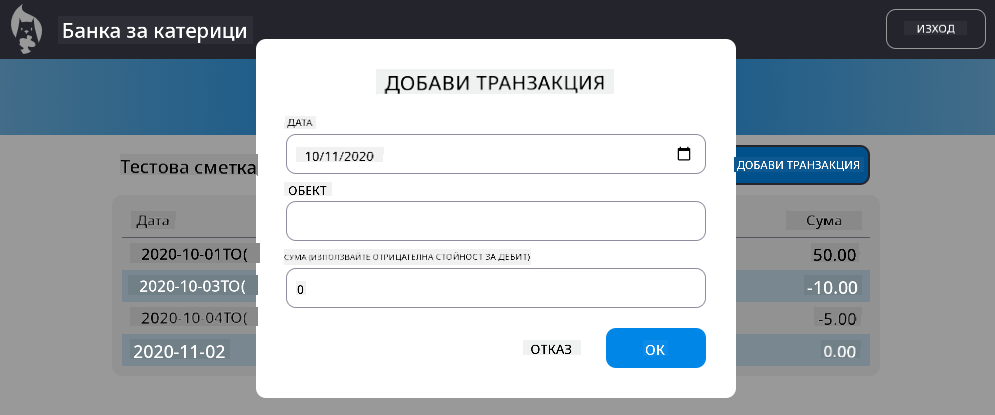

<!--
CO_OP_TRANSLATOR_METADATA:
{
  "original_hash": "f23a868536c07da991b1d4e773161e25",
  "translation_date": "2025-08-27T23:06:37+00:00",
  "source_file": "7-bank-project/4-state-management/assignment.md",
  "language_code": "bg"
}
-->
# Реализиране на диалог "Добавяне на транзакция"

## Инструкции

Нашето банково приложение все още липсва една важна функция: възможността за въвеждане на нови транзакции. 
Използвайки всичко, което сте научили в предишните четири урока, реализирайте диалог "Добавяне на транзакция":

- Добавете бутон "Добавяне на транзакция" на страницата на таблото.
- Или създайте нова страница с HTML шаблон, или използвайте JavaScript, за да покажете/скриете HTML на диалога, без да напускате страницата на таблото (можете да използвате свойството [`hidden`](https://developer.mozilla.org/docs/Web/HTML/Global_attributes/hidden) за това, или CSS класове).
- Уверете се, че обработвате [достъпността за клавиатура и екранни четци](https://developer.paciellogroup.com/blog/2018/06/the-current-state-of-modal-dialog-accessibility/) за диалога.
- Реализирайте HTML форма за получаване на входни данни.
- Създайте JSON данни от данните на формата и ги изпратете към API.
- Актуализирайте страницата на таблото с новите данни.

Прегледайте [спецификациите на сървърното API](../api/README.md), за да видите кое API трябва да извикате и какъв е очакваният JSON формат.

Ето примерен резултат след завършване на задачата:

## Критерии за оценка

| Критерий | Отлично                                                                                          | Задоволително                                                                                                         | Нуждае се от подобрение                     |
| -------- | ------------------------------------------------------------------------------------------------ | --------------------------------------------------------------------------------------------------------------------- | ------------------------------------------- |
|          | Добавянето на транзакция е реализирано напълно, следвайки всички най-добри практики от уроците.   | Добавянето на транзакция е реализирано, но не следва най-добрите практики от уроците или работи само частично.         | Добавянето на транзакция изобщо не работи.  |

---

**Отказ от отговорност**:  
Този документ е преведен с помощта на AI услуга за превод [Co-op Translator](https://github.com/Azure/co-op-translator). Въпреки че се стремим към точност, моля, имайте предвид, че автоматизираните преводи може да съдържат грешки или неточности. Оригиналният документ на неговия роден език трябва да се счита за авторитетен източник. За критична информация се препоръчва професионален човешки превод. Ние не носим отговорност за каквито и да е недоразумения или погрешни интерпретации, произтичащи от използването на този превод.