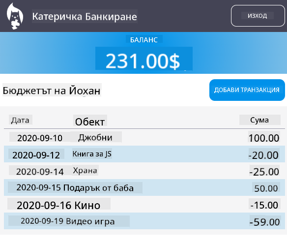

<!--
CO_OP_TRANSLATOR_METADATA:
{
  "original_hash": "830359535306594b448db6575ce5cdee",
  "translation_date": "2025-08-27T22:54:44+00:00",
  "source_file": "7-bank-project/README.md",
  "language_code": "bg"
}
-->
# :dollar: Създайте банка

В този проект ще научите как да създадете измислена банка. Тези уроци включват инструкции за това как да структурирате уеб приложение и да предоставите маршрути, да създавате форми, да управлявате състояние и да извличате данни от API, от който можете да получите данните на банката.

|  |  |
|--------------------------------|--------------------------------|

## Уроци

1. [HTML шаблони и маршрути в уеб приложение](1-template-route/README.md)
2. [Създаване на форма за вход и регистрация](2-forms/README.md)
3. [Методи за извличане и използване на данни](3-data/README.md)
4. [Концепции за управление на състоянието](4-state-management/README.md)

### Благодарности

Тези уроци са написани с :hearts: от [Йоан Ласорса](https://twitter.com/sinedied).

Ако искате да научите как да създадете [сървърния API](/7-bank-project/api/README.md), използван в тези уроци, можете да следвате [тази серия от видеа](https://aka.ms/NodeBeginner) (по-специално видеа от 17 до 21).

Можете също така да разгледате [този интерактивен урок в Learn](https://aka.ms/learn/express-api).

---

**Отказ от отговорност**:  
Този документ е преведен с помощта на AI услуга за превод [Co-op Translator](https://github.com/Azure/co-op-translator). Въпреки че се стремим към точност, моля, имайте предвид, че автоматизираните преводи може да съдържат грешки или неточности. Оригиналният документ на неговия роден език трябва да се счита за авторитетен източник. За критична информация се препоръчва професионален човешки превод. Ние не носим отговорност за каквито и да било недоразумения или погрешни интерпретации, произтичащи от използването на този превод.