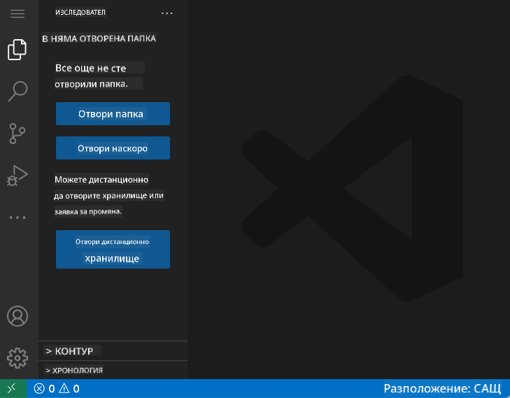
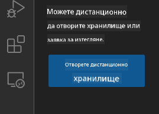
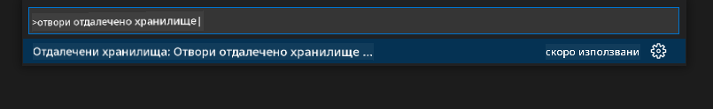
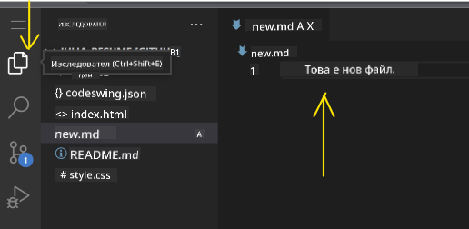
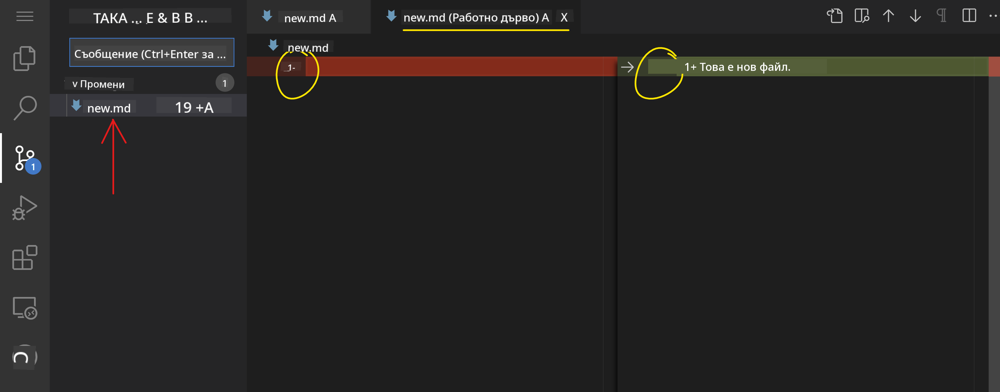
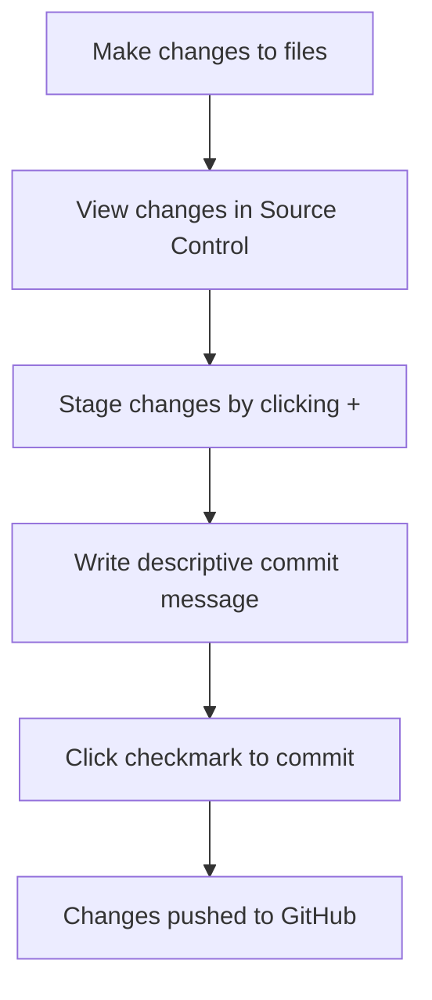
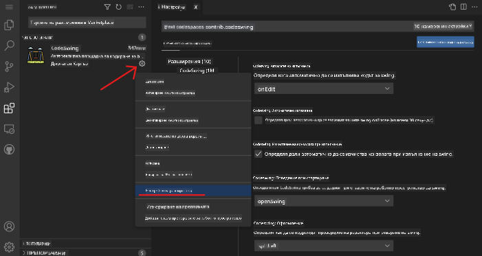

<!--
CO_OP_TRANSLATOR_METADATA:
{
  "original_hash": "cfd4a15974168ca426d50c67682ab9d4",
  "translation_date": "2025-10-24T22:25:40+00:00",
  "source_file": "8-code-editor/1-using-a-code-editor/README.md",
  "language_code": "bg"
}
-->
# Използване на редактор за код: Овладяване на VSCode.dev

Помните ли в *Матрицата*, когато Нео трябваше да се свърже с огромен компютърен терминал, за да влезе в дигиталния свят? Днешните инструменти за уеб разработка са точно обратното – невероятно мощни възможности, достъпни отвсякъде. VSCode.dev е редактор за код, базиран на браузър, който предоставя професионални инструменти за разработка на всяко устройство с интернет връзка.

Точно както печатната преса направи книгите достъпни за всички, а не само за монасите в манастирите, VSCode.dev демократизира програмирането. Можете да работите по проекти от библиотечен компютър, училищна лаборатория или където и да имате достъп до браузър. Без инсталации, без ограничения от типа "Трябва ми специфична настройка".

До края на този урок ще разберете как да навигирате в VSCode.dev, да отваряте GitHub хранилища директно в браузъра си и да използвате Git за контрол на версиите – умения, на които професионалните разработчици разчитат ежедневно.

## Какво ще научите

След като преминем през това заедно, ще можете:

- Да навигирате в VSCode.dev като в свой втори дом – да намирате всичко, което ви е нужно, без да се губите
- Да отваряте всяко GitHub хранилище в браузъра си и да започнете да го редактирате веднага (това е доста магично!)
- Да използвате Git, за да следите промените си и да запазвате напредъка си като професионалист
- Да подобрите редактора си с разширения, които правят програмирането по-бързо и забавно
- Да създавате и организирате файлове за проекти с увереност

## Какво ви е необходимо

Изискванията са прости:

- Безплатен [GitHub акаунт](https://github.com) (ще ви помогнем да го създадете, ако е необходимо)
- Основни познания за уеб браузъри
- Урокът "Основи на GitHub" предоставя полезна информация, въпреки че не е задължителен

> 💡 **Нов в GitHub?** Създаването на акаунт е безплатно и отнема само няколко минути. Точно както библиотечната карта ви дава достъп до книги по целия свят, GitHub акаунтът ви отваря врати към хранилища с код в интернет.

## Защо са важни редакторите за код, базирани на уеб

Преди интернет учените от различни университети не можеха лесно да споделят изследванията си. След това се появи ARPANET през 60-те години, свързвайки компютри на големи разстояния. Редакторите за код, базирани на уеб, следват същия принцип – правят мощни инструменти достъпни, независимо от вашето местоположение или устройство.

Редакторът за код служи като работно пространство за разработка, където пишете, редактирате и организирате файлове с код. За разлика от обикновените текстови редактори, професионалните редактори за код предоставят оцветяване на синтаксиса, откриване на грешки и функции за управление на проекти.

VSCode.dev предоставя тези възможности директно в браузъра ви:

**Предимства на редактирането в уеб:**

| Функция | Описание | Практическа полза |
|---------|-------------|----------|
| **Платформена независимост** | Работи на всяко устройство с браузър | Работете от различни компютри безпроблемно |
| **Без необходимост от инсталация** | Достъп чрез уеб URL | Избягвайте ограниченията за инсталиране на софтуер |
| **Автоматични актуализации** | Винаги работи с най-новата версия | Достъп до нови функции без ръчни актуализации |
| **Интеграция с хранилища** | Директна връзка с GitHub | Редактирайте код без управление на локални файлове |

**Практически последици:**
- Непрекъснатост на работата в различни среди
- Консистентен интерфейс, независимо от операционната система
- Незабавни възможности за сътрудничество
- Намалени изисквания за локално съхранение

## Разглеждане на VSCode.dev

Точно както лабораторията на Мария Кюри съдържаше сложно оборудване в сравнително простичко пространство, VSCode.dev съчетава професионални инструменти за разработка в интерфейс на браузър. Това уеб приложение предоставя същата основна функционалност като настолните редактори за код.

Започнете, като отворите [vscode.dev](https://vscode.dev) в браузъра си. Интерфейсът се зарежда без изтегляния или системни инсталации – директно приложение на принципите на облачните изчисления.

### Свързване на вашия GitHub акаунт

Точно както телефонът на Александър Греъм Бел свързва отдалечени места, свързването на вашия GitHub акаунт обединява VSCode.dev с вашите хранилища с код. Когато бъдете подканени да влезете с GitHub, препоръчително е да приемете тази връзка.

**Интеграцията с GitHub предоставя:**
- Директен достъп до вашите хранилища в редактора
- Синхронизирани настройки и разширения на различни устройства
- Оптимизиран процес на запазване в GitHub
- Персонализирана среда за разработка

### Запознаване с новото ви работно пространство

След като всичко се зареди, ще видите красиво подредено работно пространство, което е проектирано да ви помогне да се фокусирате върху най-важното – вашия код!

**Ето вашето ръководство за ориентация:**
- **Лента за активност** (тази лента отляво): Вашата основна навигация с Explorer 📁, Търсене 🔍, Контрол на източника 🌿, Разширения 🧩 и Настройки ⚙️
- **Странична лента** (панелът до нея): Променя се, за да ви показва релевантна информация според избраното
- **Зона за редактиране** (голямото пространство в средата): Тук се случва магията – вашата основна зона за програмиране

**Отделете момент да разгледате:**
- Кликнете върху иконите в лентата за активност и вижте какво прави всяка от тях
- Забележете как страничната лента се актуализира, за да показва различна информация – доста удобно, нали?
- Изгледът Explorer (📁) вероятно ще бъде мястото, където ще прекарвате най-много време, така че се запознайте с него

## Отваряне на GitHub хранилища

Преди интернет изследователите трябваше физически да пътуват до библиотеки, за да получат достъп до документи. GitHub хранилищата работят по подобен начин – те са колекции от код, съхранявани дистанционно. VSCode.dev елиминира традиционната стъпка за изтегляне на хранилища на локалната машина преди редактиране.

Тази възможност позволява незабавен достъп до всяко публично хранилище за преглед, редактиране или принос. Ето два метода за отваряне на хранилища:

### Метод 1: Лесният начин с кликване

Това е идеално, когато започвате от нулата във VSCode.dev и искате да отворите конкретно хранилище. Лесно и подходящо за начинаещи:

**Ето как да го направите:**

1. Отидете на [vscode.dev](https://vscode.dev), ако все още не сте там
2. Потърсете бутона "Open Remote Repository" на началния екран и го натиснете

   

3. Поставете URL адреса на всяко GitHub хранилище (опитайте този: `https://github.com/microsoft/Web-Dev-For-Beginners`)
4. Натиснете Enter и вижте магията!

**Професионален съвет - Пряк път с Command Palette:**

Искате ли да се почувствате като магьосник в програмирането? Опитайте този клавишен пряк път: Ctrl+Shift+P (или Cmd+Shift+P на Mac), за да отворите Command Palette:

**Command Palette е като търсачка за всичко, което можете да направите:**
- Напишете "open remote" и тя ще намери отварящия инструмент за хранилища за вас
- Запомня хранилищата, които сте отваряли наскоро (много удобно!)
- След като свикнете с нея, ще се чувствате като светкавичен програмист
- Това е като версията на VSCode.dev на "Хей, Сири, но за програмиране"

### Метод 2: Техника с модификация на URL

Точно както HTTP и HTTPS използват различни протоколи, но запазват една и съща структура на домейна, VSCode.dev използва модел на URL адрес, който отразява системата за адресиране на GitHub. Всеки URL адрес на GitHub хранилище може да бъде модифициран, за да се отвори директно във VSCode.dev.

**Модел за трансформация на URL:**

| Тип хранилище | URL на GitHub | URL на VSCode.dev |
|----------------|---------------------|----------------|
| **Публично хранилище** | `github.com/microsoft/Web-Dev-For-Beginners` | `vscode.dev/github/microsoft/Web-Dev-For-Beginners` |
| **Личен проект** | `github.com/your-username/my-project` | `vscode.dev/github/your-username/my-project` |
| **Всяко достъпно хранилище** | `github.com/their-username/awesome-repo` | `vscode.dev/github/their-username/awesome-repo` |

**Изпълнение:**
- Заменете `github.com` с `vscode.dev/github`
- Запазете всички останали компоненти на URL адреса непроменени
- Работи с всяко публично достъпно хранилище
- Осигурява незабавен достъп за редактиране

> 💡 **Съвет, който променя живота**: Запазете в отметките си версиите на VSCode.dev на любимите си хранилища. Аз имам отметки като "Редактиране на моето портфолио" и "Поправка на документация", които ме отвеждат директно в режим на редактиране!

**Кой метод да използвате?**
- **Интерфейсният начин**: Чудесен, когато изследвате или не можете да си спомните точните имена на хранилищата
- **Трикът с URL**: Перфектен за светкавичен достъп, когато знаете точно къде отивате

## Работа с файлове и проекти

Сега, когато сте отворили хранилище, нека започнем да създаваме! VSCode.dev ви предоставя всичко необходимо, за да създавате, редактирате и организирате файловете си с код. Мислете за него като за вашата дигитална работилница – всеки инструмент е точно там, където ви е нужен.

Нека се потопим в ежедневните задачи, които ще съставляват по-голямата част от вашия работен процес.

### Създаване на нови файлове

Точно както организирането на чертежи в офиса на архитект, създаването на файлове във VSCode.dev следва структуриран подход. Системата поддържа всички стандартни типове файлове за уеб разработка.

**Процес на създаване на файлове:**

1. Навигирайте до целевата папка в страничната лента Explorer
2. Задръжте курсора върху името на папката, за да се появи иконата "Нов файл" (📄+)
3. Въведете името на файла, включително подходящото разширение (`style.css`, `script.js`, `index.html`)
4. Натиснете Enter, за да създадете файла

**Конвенции за именуване:**
- Използвайте описателни имена, които показват предназначението на файла
- Включете разширения на файловете за правилно оцветяване на синтаксиса
- Следвайте последователни модели на именуване в проектите
- Използвайте малки букви и тирета вместо интервали

### Редактиране и запазване на файлове

Тук започва истинското забавление! Редакторът на VSCode.dev е пълен с полезни функции, които правят програмирането гладко и интуитивно. Това е като да имате наистина умен асистент за писане, но за код.

**Вашият работен процес за редактиране:**

1. Кликнете върху всеки файл в Explorer, за да го отворите в основната зона
2. Започнете да пишете и вижте как VSCode.dev ви помага с цветове, предложения и откриване на грешки
3. Запазете работата си с Ctrl+S (Windows/Linux) или Cmd+S (Mac) – въпреки че автоматичното запазване също работи!

**Готините неща, които се случват, докато програмирате:**
- Вашият код се оцветява красиво, за да е лесен за четене
- VSCode.dev предлага допълнения, докато пишете (като автокорекция, но много по-умна)
- Открива грешки и пропуски, преди дори да запазите
- Можете да имате отворени множество файлове в раздели, точно както в браузър
- Всичко се запазва автоматично във фонов режим

> ⚠️ **Бърз съвет**: Въпреки че автоматичното запазване ви пази, натискането на Ctrl+S или Cmd+S все още е добра практика. Това незабавно запазва всичко и активира някои допълнителни полезни функции като проверка за грешки.

### Контрол на версиите с Git

Точно както археолозите създават подробни записи на слоевете на разкопките, Git следи промените в кода ви с времето. Тази система запазва историята на проекта и ви позволява да се върнете към предишни версии, когато е необходимо. VSCode.dev включва интегрирана функционалност на Git.

**Интерфейс за контрол на източника:**

1. Достъпете панела Source Control чрез иконата 🌿 в лентата за активност
2. Променените файлове се появяват в секцията "Changes"
3. Цветното кодиране показва типовете промени: зелено за добавки, червено за изтривания

**Запазване на работата ви (процес на commit):**

**Ето вашия стъпка по стъпка процес:**
- Кликнете върху иконата "+" до файловете, които искате да запазите (това ги "стейджва")
- Проверете дали сте доволни от всички стейджнати промени
- Напишете кратка бележка, обясняваща какво сте направили (това е вашето "commit съобщение")
- Кликнете върху бутона с отметка, за да запазите всичко в GitHub
- Ако промените мнението си за нещо, иконата за отмяна ви позволява да изхвърлите промените

**Писане на добри commit съобщения (по-лесно е, отколкото си мислите!):**
- Просто опишете какво сте направили, като "Добавяне на контактна форма" или "Поправка на счупена навигация"
- Дръжте го кратко и ясно – мислете за дължина на туит, а не за есе
- Започнете с действия като "Добавяне", "Поправка", "Актуализация" или "Премахване"
- **Добри прим
- Всяко разширение показва оценки, брой изтегляния и реални отзиви от потребители
- Получавате екранни снимки и ясни описания за това какво прави всяко разширение
- Всичко е ясно обозначено с информация за съвместимост
- Предлагат се подобни разширения, за да можете да сравните опциите

### Инсталиране на разширения (Супер лесно е!)

Добавянето на нови функции към вашия редактор е толкова просто, колкото натискането на един бутон. Разширенията се инсталират за секунди и започват да работят веднага – без рестартиране, без чакане.

**Ето какво трябва да направите:**

1. Потърсете това, което искате (опитайте да потърсите "live server" или "prettier")
2. Кликнете върху това, което ви изглежда добре, за да видите повече подробности
3. Прочетете какво прави и проверете оценките
4. Натиснете синия бутон "Install" и сте готови!

**Какво се случва зад кулисите:**
- Разширението се изтегля и автоматично се настройва
- Новите функции се появяват веднага в интерфейса ви
- Всичко започва да работи незабавно (сериозно, толкова е бързо!)
- Ако сте влезли в профила си, разширението се синхронизира на всички ваши устройства

**Някои разширения, които бих препоръчал за начало:**
- **Live Server**: Вижте как вашият уебсайт се обновява в реално време, докато пишете код (това е магия!)
- **Prettier**: Автоматично прави вашия код чист и професионален
- **Auto Rename Tag**: Променете един HTML таг и неговият партньор също се обновява
- **Bracket Pair Colorizer**: Оцветява скобите, за да не се изгубите
- **GitLens**: Подобрява функциите на Git с много полезна информация

### Персонализиране на вашите разширения

Повечето разширения идват с настройки, които можете да промените, за да работят точно както ви харесва. Помислете за това като за настройване на седалката и огледалата в кола – всеки има своите предпочитания!

**Настройване на разширенията:**

1. Намерете инсталираното разширение в панела Extensions
2. Потърсете малката икона на зъбно колело (⚙️) до името му и кликнете върху нея
3. Изберете "Extension Settings" от падащото меню
4. Настройте нещата, докато се почувствате комфортно с вашия работен процес

**Често срещани неща, които може да искате да настроите:**
- Как се форматира вашият код (табове срещу интервали, дължина на реда и т.н.)
- Кои клавишни комбинации задействат различни действия
- С кои типове файлове трябва да работи разширението
- Включване или изключване на специфични функции, за да запазите нещата чисти

### Организиране на вашите разширения

Докато откривате повече интересни разширения, ще искате да поддържате колекцията си подредена и работеща гладко. VSCode.dev прави управлението на разширенията много лесно.

**Опции за управление на разширенията:**

| Какво можете да направите | Кога е полезно | Съвет |
|--------|---------|----------|
| **Деактивиране** | Тестване дали дадено разширение причинява проблеми | По-добро от деинсталиране, ако може да искате да го върнете |
| **Деинсталиране** | Пълно премахване на разширения, които не ви трябват | Поддържа вашата среда чиста и бърза |
| **Актуализиране** | Получаване на най-новите функции и поправки на грешки | Обикновено се случва автоматично, но си струва да проверите |

**Как аз обичам да управлявам разширенията:**
- На всеки няколко месеца преглеждам какво съм инсталирал и премахвам всичко, което не използвам
- Поддържам разширенията актуализирани, за да получавам най-новите подобрения и поправки на сигурността
- Ако нещо изглежда бавно, временно деактивирам разширения, за да видя дали някое от тях е причината
- Чета бележките за актуализация, когато разширенията получават големи обновления – понякога има страхотни нови функции!

> ⚠️ **Съвет за производителност**: Разширенията са страхотни, но твърде много от тях могат да забавят работата. Фокусирайте се върху тези, които наистина улесняват живота ви, и не се страхувайте да деинсталирате тези, които никога не използвате.

## Предизвикателство с GitHub Copilot Agent 🚀

Както структурираният подход на NASA за космически мисии, това предизвикателство включва систематично приложение на уменията от VSCode.dev в цялостен работен процес.

**Цел:** Демонстрирайте уменията си с VSCode.dev, като създадете цялостен работен процес за уеб разработка.

**Изисквания за проекта:** С помощта на режим Agent, изпълнете следните задачи:
1. Направете fork на съществуващо хранилище или създайте ново
2. Създайте функционална структура на проект с HTML, CSS и JavaScript файлове
3. Инсталирайте и конфигурирайте три разширения за подобряване на разработката
4. Практикувайте контрол на версиите с описателни съобщения за commit
5. Експериментирайте със създаване и модификация на feature branch
6. Документирайте процеса и наученото в README.md файл

Това упражнение обединява всички концепции на VSCode.dev в практичен работен процес, който може да бъде приложен към бъдещи проекти за разработка.

Научете повече за [режим Agent](https://code.visualstudio.com/blogs/2025/02/24/introducing-copilot-agent-mode) тук.

## Задача

Време е да изпробвате тези умения в реална практика! Имам проект, който ще ви позволи да упражните всичко, което разгледахме: [Създайте уебсайт за резюме с VSCode.dev](./assignment.md)

Тази задача ще ви преведе през процеса на създаване на професионален уебсайт за резюме изцяло в браузъра. Ще използвате всички функции на VSCode.dev, които разгледахме, и в края ще имате както страхотен уебсайт, така и солидна увереност в новия си работен процес.

## Продължавайте да изследвате и развивате уменията си

Вече имате солидна основа, но има още много интересни неща за откриване! Ето някои ресурси и идеи за усъвършенстване на вашите умения с VSCode.dev:

**Официални документи, които си струва да запазите:**
- [Документация за VSCode Web](https://code.visualstudio.com/docs/editor/vscode-web?WT.mc_id=academic-0000-alfredodeza) – Пълно ръководство за редактиране в браузър
- [GitHub Codespaces](https://docs.github.com/en/codespaces) – За когато искате още повече мощност в облака

**Интересни функции за експериментиране:**
- **Клавишни комбинации**: Научете комбинациите, които ще ви направят истински кодиращ нинджа
- **Настройки на работното пространство**: Настройте различни среди за различни типове проекти
- **Мулти-root работни пространства**: Работете върху няколко хранилища едновременно (много удобно!)
- **Интеграция на терминала**: Достъп до инструменти за команден ред директно в браузъра

**Идеи за практика:**
- Включете се в някои проекти с отворен код и допринасяйте, използвайки VSCode.dev – това е чудесен начин да се отблагодарите!
- Изпробвайте различни разширения, за да намерите идеалната си конфигурация
- Създайте шаблони за проекти за типовете сайтове, които най-често изграждате
- Практикувайте Git работни процеси като създаване на клонове и обединяване – тези умения са златни за екипни проекти

---

**Вие овладяхте разработката в браузър!** 🎉 Както изобретяването на преносими инструменти позволи на учените да провеждат изследвания в отдалечени места, VSCode.dev ви позволява професионално кодиране от всяко устройство с интернет връзка.

Тези умения отразяват текущите практики в индустрията – много професионални разработчици използват облачни среди за разработка заради тяхната гъвкавост и достъпност. Вие научихте работен процес, който може да се адаптира както за индивидуални проекти, така и за големи екипни сътрудничества.

Приложете тези техники към следващия си проект за разработка! 🚀

---

**Отказ от отговорност**:  
Този документ е преведен с помощта на AI услуга за превод [Co-op Translator](https://github.com/Azure/co-op-translator). Въпреки че се стремим към точност, моля, имайте предвид, че автоматизираните преводи може да съдържат грешки или неточности. Оригиналният документ на неговия роден език трябва да се счита за авторитетен източник. За критична информация се препоръчва професионален човешки превод. Не носим отговорност за недоразумения или погрешни интерпретации, произтичащи от използването на този превод.