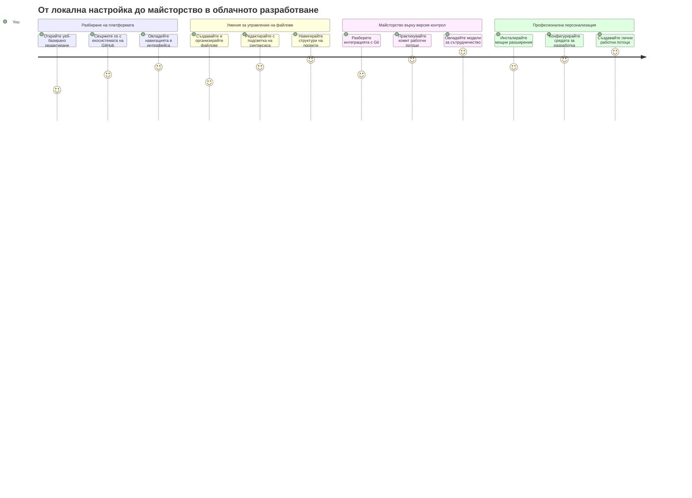
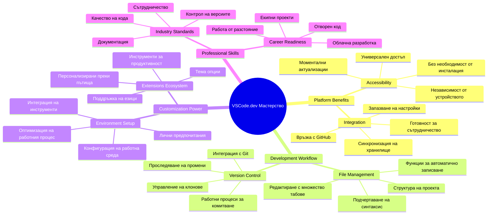
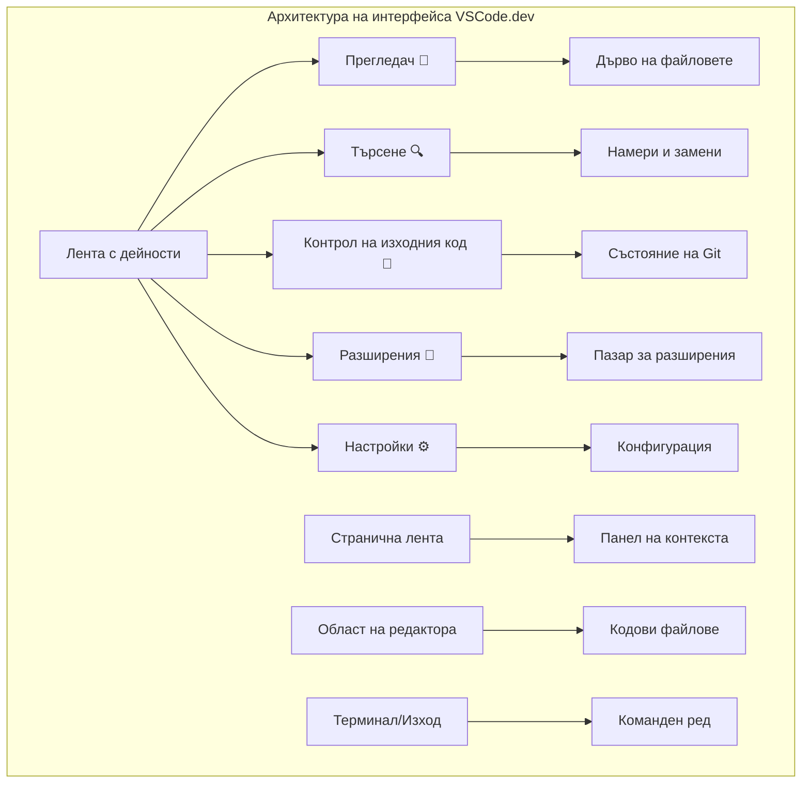
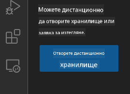
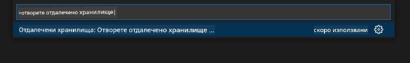
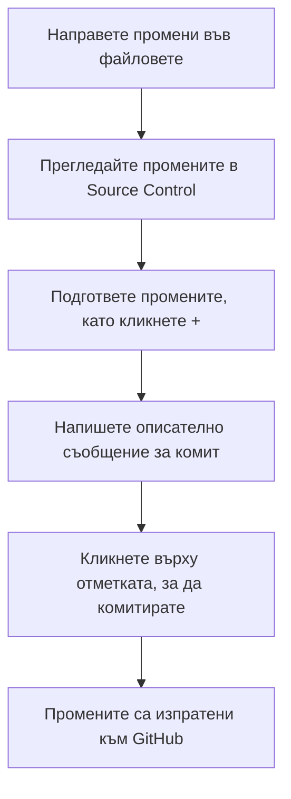
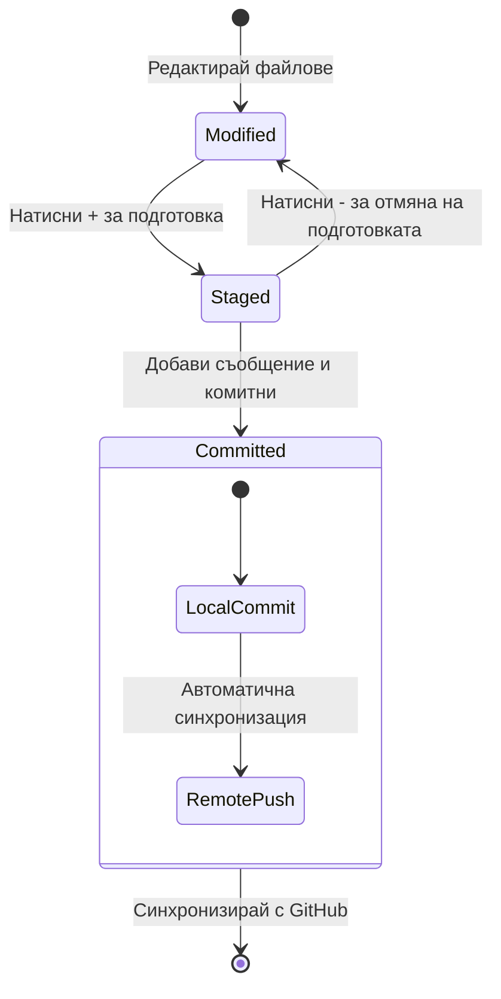
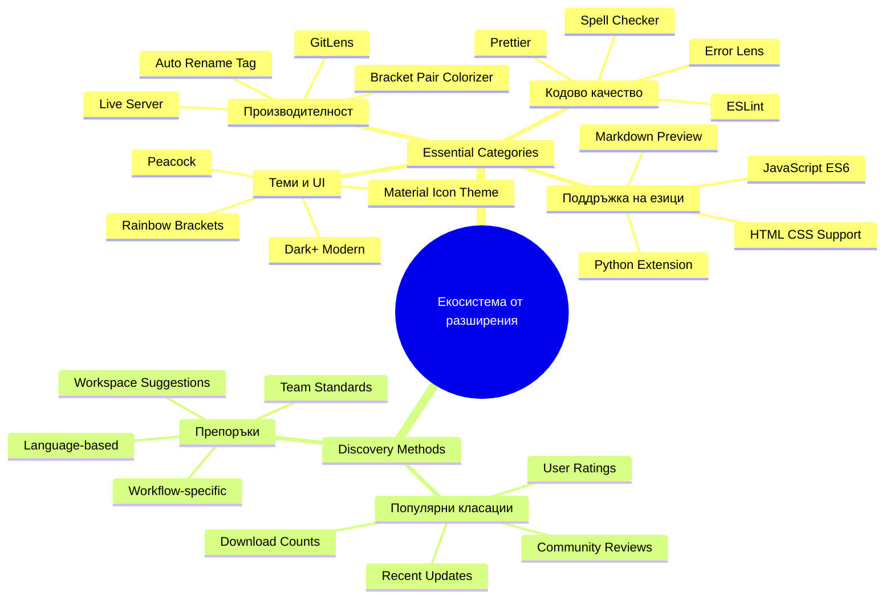
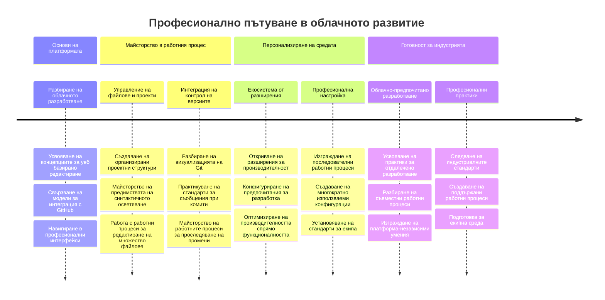

<!--
CO_OP_TRANSLATOR_METADATA:
{
  "original_hash": "a9a3bcc037a447e2d8994d99e871cd9f",
  "translation_date": "2026-01-07T06:42:36+00:00",
  "source_file": "8-code-editor/1-using-a-code-editor/README.md",
  "language_code": "bg"
}
-->
# Използване на редактор за код: Овладяване на VSCode.dev

Спомняте ли си в *Матрицата*, когато Нео трябваше да се свърже с огромен компютърен терминал, за да получи достъп до дигиталния свят? Днешните инструменти за уеб разработка са съвсем обратното – невероятно мощни възможности, достъпни отвсякъде. VSCode.dev е редактор за код в браузър, който предоставя професионални инструменти за разработка на всяко устройство с интернет връзка.

Точно както печатарската преса направи книгите достъпни за всички, а не само за монаси, VSCode.dev демократизира програмирането. Можете да работите върху проекти от компютър в библиотека, училищна лаборатория или навсякъде, където имате достъп до браузър. Без инсталации, без ограничения като „Имам нужда от моя конкретен набор“.

Към края на този урок ще разберете как да навигирате в VSCode.dev, да отваряте директно GitHub хранилища в браузъра си и да използвате Git за контрол на версиите – всички умения, на които професионалните разработчици разчитат ежедневно.

## ⚡ Какво Можете да Направите в Следващите 5 Минути

**Бърз старт за заети разработчици**


- **Минута 1**: Отидете на [vscode.dev](https://vscode.dev) – не е необходима инсталация
- **Минута 2**: Влезте с GitHub, за да свържете хранилищата си
- **Минута 3**: Опитайте трика с URL: променете `github.com` на `vscode.dev/github` в произволен URL на репо
- **Минута 4**: Създайте нов файл и гледайте как автоматично работи оцветяването на синтаксиса
- **Минута 5**: Направете промяна и я комитнете чрез панела на Source Control

**Бърз тестови URL**:
```
# Transform this:
github.com/microsoft/Web-Dev-For-Beginners

# Into this:
vscode.dev/github/microsoft/Web-Dev-For-Beginners
```

**Защо е важно**: За 5 минути ще усетите свободата на програмиране навсякъде с професионални инструменти. Това представлява бъдещето на разработката – достъпно, мощно и моментално.

## 🗺️ Вашето учебно пътуване през облачната разработка


**Вашата крайна цел**: Към края на този урок ще сте овладели професионална облачна среда за разработка, която работи от всяко устройство, позволявайки ви да програмирате със същите инструменти като разработчиците в големите технологични компании.

## Какво ще научите

След като преминем през урока, ще можете да:

- Навигирате VSCode.dev като у дома си – намирайте всичко нужно без да се губите
- Отваряте произволно GitHub хранилище в браузъра и да започнете редактиране незабавно (това е истинска магия!)
- Използвате Git, за да следите промените си и да запазвате напредъка като професионалист
- Ускорите работата си с разширения, които правят кодирането по-бързо и забавно
- Създавате и организирате файлове за проекти с увереност

## Какво ще ви трябва

Изискванията са ясни:

- Безплатен [GitHub акаунт](https://github.com) (ще ви преведем през създаването, ако е нужно)
- Основни умения с уеб браузъри
- Урокът GitHub Basics предлага полезен фон, но не е задължителен

> 💡 **Нов в GitHub?** Създаването на акаунт е безплатно и отнема минути. Както библиотечната карта дава достъп до книги по целия свят, така и GitHub акаунтът отваря врати към хранилища с код из целия интернет.

## 🧠 Преглед на екосистемата за облачна разработка


**Основен принцип**: Облачните среди за разработка представляват бъдещето на програмирането – предоставяне на професионални инструменти, които са достъпни, колаборативни и независими от платформа.

## Защо са важни редакторите за код в уеб

Преди интернет, учените в различни университети не можеха лесно да споделят изследвания. След това дойде ARPANET през 60-те години, свързващ компютри на разстояние. Уеб базираните редактори следват същия принцип – правят мощни инструменти достъпни независимо от физическото ви местоположение или устройство.

Редакторът за код е вашето работно пространство за разработка, където пишете, редактирате и организирате кодовите файлове. За разлика от обикновените текстови редактори, професионалните редактори осигуряват оцветяване на синтаксиса, откриване на грешки и управление на проекти.

VSCode.dev предоставя тези възможности в браузъра ви:

**Предимства на редактирането в уеб:**

| Функция | Описание | Практическа полза |
|---------|-------------|----------|
| **Независимост от платформа** | Работи на всяко устройство с браузър | Работете безпроблемно от различни компютри |
| **Без нужда от инсталация** | Достъп през уеб URL | Пропуснете ограниченията за инсталиране на софтуер |
| **Автоматични ъпдейти** | Винаги работи с най-новата версия | Достъп до нови функции без ръчни ъпдейти |
| **Интеграция с хранилища** | Директна връзка с GitHub | Редактирайте код без локално управление на файлове |

**Практически последици:**
- Продължаване на работа през различни среди
- Последователен интерфейс без значение от ОС
- Моментални възможности за колаборация
- Намалени локални изисквания за съхранение

## Разглеждане на VSCode.dev

Точно както лабораторията на Мари Кюри съдържаше сложна апаратура в сравнително простичко пространство, VSCode.dev събира професионални инструменти за разработка в браузърния интерфейс. Това уеб приложение предоставя същата основна функционалност като десктоп редакторите за код.

Започнете, като отворите [vscode.dev](https://vscode.dev) в браузъра си. Интерфейсът се зарежда без изтегляния или системни инсталации – директно приложение на принципите на облачните изчисления.

### Свързване на вашия GitHub акаунт

Точно както телефонът на Александър Греъм Бел свързваше отдалечени места, свързването на вашия GitHub акаунт свързва VSCode.dev с вашите хранилища с код. Когато бъдете подканени да влезете с GitHub, препоръчително е да приемете това свързване.

**Интеграцията с GitHub осигурява:**
- Директен достъп до хранилищата ви в редактора
- Синхронизирани настройки и разширения между устройствата
- Оптимизиран процес на запис в GitHub
- Персонализирана среда за разработка

### Запознаване с вашето ново работно пространство

След зареждането ще видите чисто и приветливо работно пространство, предназначено да ви държи фокусирани върху най-важното – вашия код!


**Ето обиколката на околността:**
- **Лента с активности** (ляво): Основната навигация с Explorer 📁, Търсене 🔍, Source Control 🌿, Разширения 🧩 и Настройки ⚙️
- **Страничен панел** (до нея): Променя се, за да ви покаже релевантна информация според избора ви
- **Редакторска зона** (голямото пространство в средата): Тук се случва магията – главната ви зона за кодиране

**Отделете момент и разгледайте:**
- Кликнете върху иконите в лентата с активности и вижте какво прави всяка от тях
- Забележете как страничният панел се обновява, за да покаже различна информация – доста яко, нали?
- Представата Explorer (📁) най-вероятно ще е мястото, където ще прекарвате повечето време, свикнете с него


## Отваряне на GitHub хранилища

Преди интернет, изследователите трябваше физически да пътуват до библиотеки, за да достъпят документи. GitHub хранилищата работят подобно – те са колекции от код, съхранявани отдалечено. VSCode.dev елиминира традиционната стъпка на изтегляне на хранилища на локалната ви машина преди редактиране.

Тази възможност дава незабавен достъп до всяко публично хранилище за преглед, редактиране или принос. Ето два начина за отваряне на хранилища:

### Метод 1: Начинът с посочване и кликване

Подходящ е, когато започвате пресен в VSCode.dev и искате да отворите конкретно хранилище. Ясен и приятелски за начинаещи:

**Ето как да го направите:**

1. Отидете на [vscode.dev](https://vscode.dev), ако още не сте там
2. Потърсете бутона "Open Remote Repository" на началния екран и натиснете

   

3. Поставете произволен URL на GitHub хранилище (опитайте този: `https://github.com/microsoft/Web-Dev-For-Beginners`)
4. Натиснете Enter и гледайте магията да се случи!

**Про съвет – клавишна комбинация за Command Palette:**

Искате да се почувствате като вълшебник в кодирането? Опитайте клавишната комбинация: Ctrl+Shift+P (или Cmd+Shift+P на Mac) да отворите Command Palette:



**Command Palette е като търсачка за всичко, което може да се направи:**
- Напишете "open remote" и ще ви намери функцията за отваряне на хранилища
- Запомня хранилищата, които сте отваряли наскоро (супер удобно!)
- След като свикнете, ще се чувствате, че кодирате със светкавична скорост
- Основно това е версията на VSCode.dev на „Хей Сири“, но за кодиране

### Метод 2: Техника за модификация на URL

Точно както HTTP и HTTPS използват различни протоколи, но запазват структурата на домейна, VSCode.dev използва URL модел, който отразява адресната система на GitHub. Всеки GitHub URL може да бъде променен за директно отваряне в VSCode.dev.

**Шаблон за трансформация на URL:**

| Тип хранилище | GitHub URL | VSCode.dev URL |
|----------------|---------------------|----------------|
| **Публично хранилище** | `github.com/microsoft/Web-Dev-For-Beginners` | `vscode.dev/github/microsoft/Web-Dev-For-Beginners` |
| **Личен проект** | `github.com/your-username/my-project` | `vscode.dev/github/your-username/my-project` |
| **Всяко достъпно хранилище** | `github.com/their-username/awesome-repo` | `vscode.dev/github/their-username/awesome-repo` |

**Изпълнение:**
- Заменете `github.com` с `vscode.dev/github`
- Запазете всички останали компоненти на URL без промяна
- Работи с всяко публично достъпно хранилище
- Предоставя незабавен достъп за редактиране

> 💡 **Променящ живота съвет**: Запазете в отметки VSCode.dev версиите на любимите си хранилища. Имам отметки като "Edit My Portfolio" и "Fix Documentation", които ме водят директно в режим на редактиране!

**Кой метод да използвате?**
- **Интерфейсният начин**: Страхотен, когато разглеждате или не помните точното име на хранилището
- **Трикът с URL**: Перфектен за светкавичен достъп, когато знаете точно къде отивате

### 🎯 Педагогическа проверка: Достъп до облачна разработка

**Пауза и размисъл**: Току-що научихте два метода за достъп до хранилища с код през уеб браузър. Това представлява фундаментална промяна в начина, по който работи разработката.

**Бърза самооценка**:
- Можете ли да обясните защо редактирането през уеб изключва традиционното „настройване на среда за разработка“?
- Какви предимства дава техниката за модификация на URL в сравнение с локално клониране чрез git?
- Как този подход променя начина, по който бихте допринасяли за проекти с отворен код?

**Връзка с реалния свят**: Големи компании като GitHub, GitLab и Replit изградиха своите платформи за разработка около тези принципи фокусирани върху облака. Вие учите същите работни процеси, използвани от професионални екипи по цял свят.

**Предизвикателен въпрос**: Как облачната разработка може да промени начина, по който се преподава програмирането в училищата? Помислете за изискванията към устройствата, управлението на софтуер и възможностите за сътрудничество.

## Работа с файлове и проекти

Сега, когато имате отворено хранилище, нека започнем с изграждане! VSCode.dev ви предоставя всичко необходимо, за да създавате, редактирате и организирате файловете си с код. Мислете за него като за вашата дигитална работилница – всички инструменти са точно там, където имате нужда.

Нека се потопим в ежедневните задачи, които ще формират основата на вашия работен процес при кодирането.

### Създаване на нови файлове

Подобно на организирането на чертежи в офиса на архитект, създаването на файлове във VSCode.dev следва структурирана логика. Системата поддържа всички стандартни файлови формати за уеб разработка.

**Процес на създаване на файл:**

1. Навигирайте до целевата папка в страничния панел Explorer
2. Задръжте курсора върху името на папката, за да се появи иконата „Нов файл“ (📄+)
3. Въведете името на файла, включително подходящото разширение (`style.css`, `script.js`, `index.html`)
4. Натиснете Enter, за да създадете файла


**Правила за именуване:**
- Използвайте описателни имена, които показват предназначението на файла
- Включвайте разширенията на файловете за правилно оцветяване на синтаксиса
- Следвайте последователни модели за именуване в проектите
- Ползвайте малки букви и тирета вместо интервали

### Редактиране и записване на файлове

Тук започва истинското забавление! Редакторът на VSCode.dev е натъпкан с полезни функции, които правят кодирането плавно и интуитивно. Като да имате много умен помощник по писане, но за код.

**Вашият работен процес за редактиране:**

1. Кликнете върху който и да е файл в Explorer, за да го отворите в основната зона
2. Започнете да пишете и гледайте как VSCode.dev ви помага с цветове, предложения и откриване на грешки
3. Запазвайте работата си с Ctrl+S (Windows/Linux) или Cmd+S (Mac) – въпреки че имате и автоматично записване!


**Готините неща, които се случват докато кодирате:**
- Вашият код се оцветява красиво, така че да е лесен за четене
- VSCode.dev предлага допълнения докато пишете (като автокорекция, но много по-умна)
- Хваща правописни и логически грешки още преди да запишете
- Можете да имате отворени множество файлове на табове, както в браузър
- Всичко се записва автоматично на заден план

> ⚠️ **Бърз съвет**: Макар и авто-записът да ви пази, свикнете да натискате Ctrl+S или Cmd+S редовно. Той веднага записва всичко и активира допълнителни полезни функции, като проверка за грешки.

### Контрол на версиите с Git

Подобно на това, как археолозите създават подробни записи на слоевете при разкопки, Git проследява промените във вашия код във времето. Тази система съхранява история на проекта и ви позволява да връщате по-стари версии при нужда. VSCode.dev включва интегрирана Git функционалност.

**Интерфейс за Source Control:**

1. Достъп до панела за Source Control чрез иконата 🌿 в лентата с активности
2. Променените файлове се появяват в секцията „Changes“
3. Цветовото кодиране показва видовете промени: зелен за добавки, червен за изтривания


**Записване на работата (процес на комит):**



**Вашият стъпка по стъпка процес:**
- Кликнете върху иконата "+" до файловете, които искате да запишете (това ги "етапира")
- Проверете два пъти дали сте доволни от всички готови за комит промени
- Напишете кратка бележка, обясняваща какво сте направили (това е вашето "commit съобщение")
- Кликнете върху бутона с отметка, за да запазите всичко в GitHub
- Ако промените мнението си за нещо, иконата за отмяна ви позволява да изхвърлите промените

**Писане на добри commit съобщения (по-лесно е, отколкото си мислите!):**
- Просто опишете какво сте направили, като "Добавяне на контактна форма" или "Поправка на счупена навигация"
- Дръжте го кратко и ясно – мислете за дължина като на туит, а не есе
- Започвайте с глаголи като "Добави", "Поправи", "Обнови" или "Премахни"
- **Добри примери**: "Добави адаптивно навигационно меню", "Поправи проблеми с мобилния изглед", "Обнови цветовете за по-добра достъпност"

> 💡 **Бърза навигационна подсказка**: Използвайте менюто хамбургер (☰) в горния ляв ъгъл, за да се върнете бързо към вашето GitHub хранилище и да видите направените комити онлайн. Това е като портал между вашата среда за редакция и дома на проекта ви в GitHub!

## Подобряване на функционалността с разширения

Точно както работилницата на майстор съдържа специализирани инструменти за различни задачи, VSCode.dev може да се персонализира с разширения, които добавят специфични възможности. Тези плъгини, разработени от общността, адресират често срещани нужди като форматиране на код, жив преглед и подобрена интеграция с Git.

Маркетплейсът за разширения съдържа хиляди безплатни инструменти, създадени от разработчици по целия свят. Всяко разширение решава конкретни предизвикателства в работния процес, позволявайки ви да изградите персонализирана развойна среда, съобразена с вашите конкретни потребности и предпочитания.


### Намерете перфектните си разширения

Маркетплейсът за разширения е много добре организиран, така че няма да се загубите, докато търсите това, което ви трябва. Той е проектиран да ви помогне да откриете както конкретни инструменти, така и интересни неща, за които дори не сте знаели!

**Как да отворите маркетплейса:**

1. Кликнете върху иконата Разширения (🧩) в лентата с дейности
2. Разгледайте или търсете нещо конкретно
3. Кликнете върху всичко, което ви се струва интересно, за да научите повече


**Какво ще видите там:**

| Раздел | Какво съдържа | Защо е полезно |
|----------|---------|----------|
| **Инсталирани** | Разширения, които вече сте добавили | Вашият личен набор от инструменти за кодиране |
| **Популярни** | Любими на масата | Това, на което повечето разработчици се доверяват |
| **Препоръчани** | Умни предложения за вашия проект | Полезните препоръки на VSCode.dev |

**Как разглеждането е лесно:**
- Всяко разширение показва рейтинги, брой изтегляния и реални отзиви от потребители
- Получавате скрийншоти и ясни описания на функциите му
- Всичко е ясно обозначено с информация за съвместимост
- Предлагат се подобни разширения, за да можете да сравните опции

### Инсталиране на разширения (Супер лесно е!)

Добавянето на нови възможности към редактора ви е толкова просто, колкото кликване на бутон. Разширенията се инсталират за секунди и започват работа веднага – без рестартиране и без чакане.

**Ето какво трябва да направите:**

1. Потърсете това, което искате (опитайте с "live server" или "prettier")
2. Кликнете върху разширение, което ви харесва, за да видите повече подробности
3. Прочетете какво прави и разгледайте рейтингите
4. Натиснете синия бутон "Install" и сте готови!


**Какво се случва зад кулисите:**
- Разширението се изтегля и настройва автоматично
- Новите функции веднага се появяват във вашия интерфейс
- Всичко започва да работи мигновено (наистина е толкова бързо!)
- Ако сте влезли в профила си, разширението се синхронизира на всички ваши устройства

**Някои разширения, които бих препоръчал да започнете с:**
- **Live Server**: Вижте вашия уебсайт да се обновява в реално време, докато кодирате (магично е!)
- **Prettier**: Прави кода чист и професионален автоматично
- **Auto Rename Tag**: Променете един HTML таг и неговият партньор се обновява автоматично
- **Bracket Pair Colorizer**: Цветово маркира скобите, за да не се губите никога
- **GitLens**: Подсилва вашите Git функции с много полезна информация

### Персонализиране на вашите разширения

Повечето разширения идват със настройки, които може да променяте, за да работят точно както ви харесва. Помислете за това като регулиране на седалката и огледалата в кола – всеки си има предпочитания!

**Как да нагласите настройките на разширение:**

1. Намерете инсталираното разширение в панела Разширения
2. Потърсете малката икона на зъбно колело (⚙️) до името му и кликнете върху нея
3. Изберете "Extension Settings" от менюто
4. Настройте нещата, докато се почувствате комфортно с вашия работен процес


**Често срещани неща, които може да коригирате:**
- Как се форматира вашият код (таби срещу интервали, дължина на реда и т.н.)
- Кои клавишни комбинации задействат различни действия
- С кои файлови типове разширението трябва да работи
- Включване или изключване на определени функции, за да е по-чисто

### Поддържайте разширенията си организирани

Докато откривате нови страхотни разширения, ще искате да поддържате колекцията си подредена и работеща гладко. VSCode.dev прави това много лесно за управление.

**Опции за управление на разширенията:**

| Какво можете да направите | Кога е полезно | Полезен съвет |
|--------|---------|----------|
| **Деактивиране** | Тествайте дали дадено разширение причинява проблеми | По-добре от деинсталиране, ако може да искате да го върнете |
| **Деинсталиране** | Премахване на ненужни разширения | Поддържа средата ви чиста и бърза |
| **Обновяване** | Получаване на нови функции и поправки | Обикновено се случва автоматично, но е добре да проверявате |

**Как аз обичам да управлявам разширения:**
- На всеки няколко месеца преглеждам инсталираните и махам тези, които не използвам
- Поддържам разширенията актуализирани, за да имам най-новите подобрения и поправки за сигурност
- Ако нещо забавя, временно деактивирам разширения, за да видя дали някое от тях е виновник
- Чета бележките за обновяване при големи ъпдейти – понякога има нови яки функции!

> ⚠️ **Съвет за производителността**: Разширенията са страхотни, но прекалено много могат да забавят нещата. Фокусирайте се върху тези, които истински улесняват живота ви, и не се страхувайте да махнете неизползваните.

### 🎯 Педагогическа проверка: Персонализиране на развойната среда

**Разбиране на архитектурата**: Научихте как да персонализирате професионална развойна среда чрез общностно създадени разширения. Това отразява начина, по който екипите в предприятия изграждат стандартизирани инструментални вериги.

**Основни усвоени концепции**:
- **Откриване на разширения**: Намиране на инструменти, които решават конкретни разработвачески задачи
- **Конфигуриране на средата**: Персонализиране на инструменти според лични или екипни предпочитания
- **Оптимизация на представянето**: Балансиране на функционалността с производителността на системата
- **Сътрудничество в общността**: Използване на инструменти, създадени от глобалната разработваческа общност

**Връзка с индустрията**: Екосистемите на разширения поддържат големи развойни платформи като VS Code, Chrome DevTools и модерни IDE. Разбирането как да оценявате, инсталирате и конфигурирате разширения е съществено за професионалните работни процеси.

**Въпрос за размисъл**: Как бихте подходили към настройването на стандартизирана развойна среда за екип от 10 разработчици? Обмислете консистентността, производителността и индивидуалните предпочитания.

## 📈 Вашата времева линия за овладяване на разработката в облак


**🎓 Етап на завършване**: Успешно сте овладели разработка в облак, използвайки същите инструменти и работни процеси, които професионалните разработчици в големи технологични компании използват. Тези умения представляват бъдещето на софтуерната разработка.

**🔄 Възможности за следващо ниво**:
- Готови сте да изследвате напреднали облачни платформи за разработка (Codespaces, GitPod)
- Подготвени сте да работите в разпределени развойни екипи
- Оборудвани сте да допринасяте за отворен софтуер по света
- Полагате основите за съвременни DevOps и практики за непрекъсната интеграция

## Предизвикателство GitHub Copilot Agent 🚀

Подобно на структурирания подход, който NASA използва за космически мисии, това предизвикателство включва систематично прилагане на уменията във VSCode.dev в пълен работен процес.

**Цел:** Демонстрирайте умения с VSCode.dev чрез изграждане на цялостен работен процес за уеб разработка.

**Изисквания за проекта:** С помощта на Agent режим, изпълнете следните задачи:
1. Форкнете съществуващо хранилище или създайте ново
2. Създайте функционална структура на проекта с HTML, CSS и JavaScript файлове
3. Инсталирайте и конфигурирайте три разширения, които подобряват разработката
4. Практикувайте контрол на версиите с описателни commit съобщения
5. Експериментирайте със създаване и модифициране на feature клонове
6. Документирайте процеса и наученото в README.md файл

Това упражнение обединява всички концепции на VSCode.dev в практичен работен процес, който можете да приложите към бъдещи проекти.

Научете повече за [agent mode](https://code.visualstudio.com/blogs/2025/02/24/introducing-copilot-agent-mode) тук.

## Задача

Време е да изпробвате тези умения на практика! Имам един проект, с който ще практикувате всичко, което разгледахме: [Създайте уебсайт с автобиография, използвайки VSCode.dev](./assignment.md)

Тази задача ще ви преведе през създаване на професионален уебсайт с автобиография изцяло в браузъра. Ще използвате всички функции на VSCode.dev, които разгледахме, и накрая ще имате както страхотен сайт, така и увереност в новия си работен процес.

## Продължавайте да изследвате и развивате уменията си

Вече имате солидна основа, но има още много интересни неща за откриване! Ето няколко ресурса и идеи за повишаване на вашите VSCode.dev умения:

**Официална документация, която си заслужава да добавите в отметки:**
- [VSCode Web Documentation](https://code.visualstudio.com/docs/editor/vscode-web?WT.mc_id=academic-0000-alfredodeza) – Пълно ръководство за редактиране в браузър
- [GitHub Codespaces](https://docs.github.com/en/codespaces) – За когато искате още повече сила в облака

**Яки функции за експериментиране:**
- **Клавишни комбинации**: Научете бутоните, които ще ви направят програмиращ нинджа
- **Настройки на работната среда**: Конфигурирайте различни среди за различни типове проекти
- **Мултирут работни пространства**: Работете с няколко репозитория едновременно (много удобно!)
- **Интеграция с терминала**: Достъп до командния ред директно в браузъра

**Идеи за практика:**
- Включете се в проекти с отворен код и допринасяйте, използвайки VSCode.dev – страхотен начин да дадете обратно!
- Изпробвайте различни разширения, за да намерите перфектните за вас
- Създайте шаблони за проекти за видовете сайтове, които правите най-често
- Практикувайте Git работни процеси като branching и merging – тези умения са злато в екипни проекти

---

**Вие овладяхте разработката в браузър!** 🎉 Както изобретяването на преносими инструменти позволи на учените да изследват отдалечени места, така и VSCode.dev ви дава възможност за професионално кодиране от всяко устройство с интернет връзка.

Тези умения отразяват настоящите индустриални практики – много професионални разработчици използват облачни среди заради гъвкавостта и достъпността им. Вие научихте работен процес, който може да се мащабира както за индивидуални проекти, така и за големи екипи.

Прилагайте тези техники в следващия си проект! 🚀

---

<!-- CO-OP TRANSLATOR DISCLAIMER START -->
**Отказ от отговорност**:  
Този документ е преведен с помощта на AI преводаческа услуга [Co-op Translator](https://github.com/Azure/co-op-translator). Въпреки че се стремим към точност, моля, имайте предвид, че автоматизираните преводи може да съдържат грешки или неточности. Оригиналният документ на оригиналния език трябва да се счита за авторитетен източник. За критична информация се препоръчва професионален човешки превод. Не носим отговорност за каквито и да е недоразумения или неправилни тълкувания, възникнали от използването на този превод.
<!-- CO-OP TRANSLATOR DISCLAIMER END -->