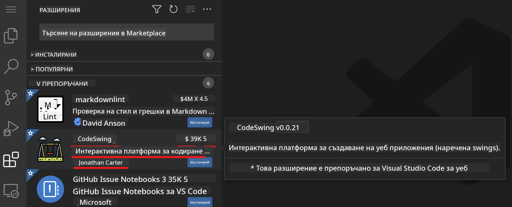
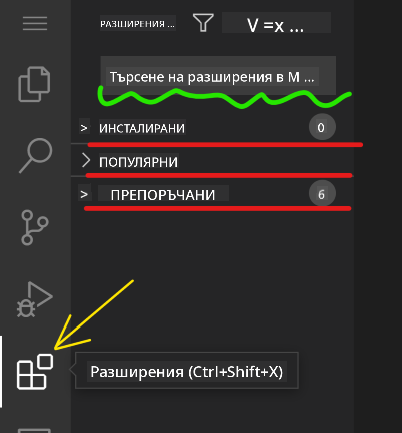

<!--
CO_OP_TRANSLATOR_METADATA:
{
  "original_hash": "1ba61d96a11309a2a6ea507496dcf7e5",
  "translation_date": "2025-08-29T11:56:33+00:00",
  "source_file": "8-code-editor/1-using-a-code-editor/README.md",
  "language_code": "bg"
}
-->
# Използване на редактор за код

Този урок обхваща основите на използването на [VSCode.dev](https://vscode.dev), уеб-базиран редактор за код, за да можете да правите промени в кода си и да допринасяте към проект, без да инсталирате нищо на компютъра си.

## Цели на обучението

В този урок ще научите как да:

- Използвате редактор за код в проект с код
- Следите промените с помощта на система за контрол на версиите
- Персонализирате редактора за разработка

### Предварителни изисквания

Преди да започнете, ще трябва да си създадете акаунт в [GitHub](https://github.com). Отидете на [GitHub](https://github.com/) и създайте акаунт, ако все още нямате такъв.

### Въведение

Редакторът за код е основен инструмент за писане на програми и сътрудничество по съществуващи проекти с код. След като разберете основите на редактора и как да използвате неговите функции, ще можете да ги прилагате при писане на код.

## Първи стъпки с VSCode.dev

[VSCode.dev](https://vscode.dev) е редактор за код в уеб пространството. Не е необходимо да инсталирате нищо, за да го използвате – просто го отворете като всеки друг уебсайт. За да започнете с редактора, отворете следния линк: [https://vscode.dev](https://vscode.dev). Ако не сте влезли в [GitHub](https://github.com/), следвайте инструкциите, за да влезете или да създадете нов акаунт и след това влезте.

След като се зареди, интерфейсът трябва да изглежда подобно на това изображение:


Има три основни секции, започвайки от най-ляво и движейки се надясно:

1. _Лента за активност_, която включва няколко икони, като лупа 🔎, зъбно колело ⚙️ и други.
2. Разширена лента за активност, която по подразбиране показва _Explorer_ и се нарича _странична лента_.
3. И накрая, зоната за код вдясно.

Кликнете върху всяка от иконите, за да видите различно меню. След като приключите, кликнете върху _Explorer_, за да се върнете там, откъдето започнахте.

Когато започнете да създавате код или да променяте съществуващ код, това ще се случва в най-голямата зона вдясно. Ще използвате тази зона и за визуализиране на съществуващ код, което ще направите след малко.

## Отваряне на GitHub хранилище

Първото нещо, което трябва да направите, е да отворите GitHub хранилище. Има няколко начина за отваряне на хранилище. В тази секция ще видите два различни начина, по които можете да отворите хранилище и да започнете работа по промените.

### 1. Чрез редактора

Използвайте самия редактор, за да отворите отдалечено хранилище. Ако отидете на [VSCode.dev](https://vscode.dev), ще видите бутон _"Open Remote Repository"_:


Можете също да използвате командния палет. Командният палет е поле за въвеждане, където можете да напишете всяка дума, която е част от команда или действие, за да намерите правилната команда за изпълнение. Използвайте менюто в горния ляв ъгъл, след това изберете _View_, и след това изберете _Command Palette_, или използвайте следната клавишна комбинация: Ctrl-Shift-P (на MacOS това е Command-Shift-P).


След като менюто се отвори, напишете _open remote repository_ и изберете първата опция. Ще се покажат няколко хранилища, на които сте част или които сте отваряли наскоро. Можете също да използвате пълен GitHub URL, за да изберете едно. Използвайте следния URL и го поставете в полето:

```
https://github.com/microsoft/Web-Dev-For-Beginners
```

✅ Ако всичко е успешно, ще видите всички файлове от това хранилище, заредени в текстовия редактор.

### 2. Използване на URL

Можете също да използвате директно URL, за да заредите хранилище. Например, пълният URL за текущото хранилище е [https://github.com/microsoft/Web-Dev-For-Beginners](https://github.com/microsoft/Web-Dev-For-Beginners), но можете да замените домейна на GitHub с `VSCode.dev/github` и директно да заредите хранилището. Полученият URL ще бъде [https://vscode.dev/github/microsoft/Web-Dev-For-Beginners](https://vscode.dev/github/microsoft/Web-Dev-For-Beginners).

## Редактиране на файлове

След като сте отворили хранилището в браузъра/vscode.dev, следващата стъпка е да направите актуализации или промени в проекта.

### 1. Създаване на нов файл

Можете да създадете файл в съществуваща папка или в основната директория/папка. За да създадете нов файл, отворете местоположението/директорията, където искате да запазите файла, и изберете иконата _'New file ...'_ в лентата за активност _(вляво)_, дайте му име и натиснете Enter.


### 2. Редактиране и запазване на файл в хранилището

Използването на vscode.dev е полезно, когато искате бързо да актуализирате проекта си, без да зареждате софтуер локално.  
За да актуализирате кода си, кликнете върху иконата 'Explorer', също разположена в лентата за активност, за да видите файловете и папките в хранилището.  
Изберете файл, за да го отворите в зоната за код, направете промените си и запазете.


След като приключите с актуализациите на проекта си, изберете иконата _`source control`_, която съдържа всички нови промени, които сте направили в хранилището.

За да видите промените, които сте направили в проекта си, изберете файла(ите) в папката `Changes` в разширената лента за активност. Това ще отвори 'Working Tree', за да видите визуално промените, които сте направили във файла. Червеното показва премахване от проекта, докато зеленото означава добавяне.


Ако сте доволни от направените промени, задръжте курсора върху папката `Changes` и кликнете върху бутона `+`, за да подготвите промените. Подготвянето означава, че подготвяте промените си за комитване в GitHub.

Ако обаче не сте доволни от някои промени и искате да ги отхвърлите, задръжте курсора върху папката `Changes` и изберете иконата `undo`.

След това въведете `commit message` _(описание на промените, които сте направили в проекта)_, кликнете върху иконата `check`, за да комитнете и изпратите промените.

След като приключите с работата по проекта си, изберете иконата `hamburger menu` в горния ляв ъгъл, за да се върнете към хранилището на github.com.


## Използване на разширения

Инсталирането на разширения във VSCode ви позволява да добавяте нови функции и опции за персонализиране на средата за разработка, за да подобрите работния си процес. Тези разширения също така ви помагат да добавите поддръжка за множество програмни езици и често са или общи разширения, или базирани на езици.

За да разгледате списъка с всички налични разширения, кликнете върху иконата _`Extensions`_ в лентата за активност и започнете да въвеждате името на разширението в текстовото поле с надпис _'Search Extensions in Marketplace'_.
Ще видите списък с разширения, всяко от които съдържа **името на разширението, името на издателя, едно изречение описание, броя на изтеглянията** и **оценка със звезди**.



Можете също да видите всички предварително инсталирани разширения, като разширите папката _`Installed`_, популярни разширения, използвани от повечето разработчици, в папката _`Popular`_ и препоръчани разширения за вас, базирани на наскоро отворените ви файлове или от потребители в същото работно пространство, в папката _`Recommended`_.



### 1. Инсталиране на разширения

За да инсталирате разширение, въведете името му в полето за търсене и кликнете върху него, за да видите допълнителна информация за разширението в зоната за код, след като се появи в разширената лента за активност.

Можете или да кликнете върху _синия бутон за инсталиране_ в разширената лента за активност, за да го инсталирате, или да използвате бутона за инсталиране, който се появява в зоната за код, след като изберете разширението, за да заредите допълнителна информация.


### 2. Персонализиране на разширения

След като инсталирате разширението, може да се наложи да модифицирате поведението му и да го персонализирате според предпочитанията си. За да направите това, изберете иконата Extensions, и този път вашето разширение ще се появи в папката _Installed_, кликнете върху _**Gear icon**_ и навигирайте до _Extensions Setting_.


### 3. Управление на разширения

След като инсталирате и използвате разширението, vscode.dev предлага опции за управление на разширението според различни нужди. Например, можете да изберете да:

- **Деактивирате:** _(Можете временно да деактивирате разширение, когато вече не ви е необходимо, но не искате да го деинсталирате напълно)_

    Изберете инсталираното разширение в разширената лента за активност > кликнете върху Gear icon > изберете 'Disable' или 'Disable (Workspace)' **ИЛИ** Отворете разширението в зоната за код и кликнете върху синия бутон Disable.

- **Деинсталирате:** Изберете инсталираното разширение в разширената лента за активност > кликнете върху Gear icon > изберете 'Uninstall' **ИЛИ** Отворете разширението в зоната за код и кликнете върху синия бутон Uninstall.

---

## Задача

[Създайте уебсайт за автобиография, използвайки vscode.dev](https://github.com/microsoft/Web-Dev-For-Beginners/blob/main/8-code-editor/1-using-a-code-editor/assignment.md)

## Преглед и самостоятелно обучение

Прочетете повече за [VSCode.dev](https://code.visualstudio.com/docs/editor/vscode-web?WT.mc_id=academic-0000-alfredodeza) и някои от другите му функции.

---

**Отказ от отговорност**:  
Този документ е преведен с помощта на AI услуга за превод [Co-op Translator](https://github.com/Azure/co-op-translator). Въпреки че се стремим към точност, моля, имайте предвид, че автоматизираните преводи може да съдържат грешки или неточности. Оригиналният документ на неговия изходен език трябва да се счита за авторитетен източник. За критична информация се препоръчва професионален човешки превод. Не носим отговорност за каквито и да е недоразумения или погрешни интерпретации, произтичащи от използването на този превод.