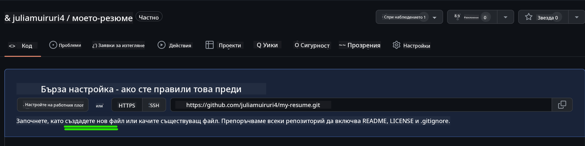
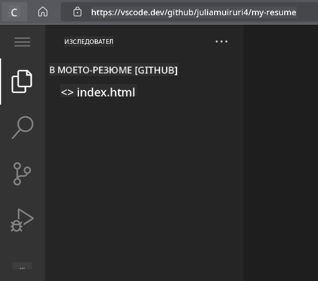
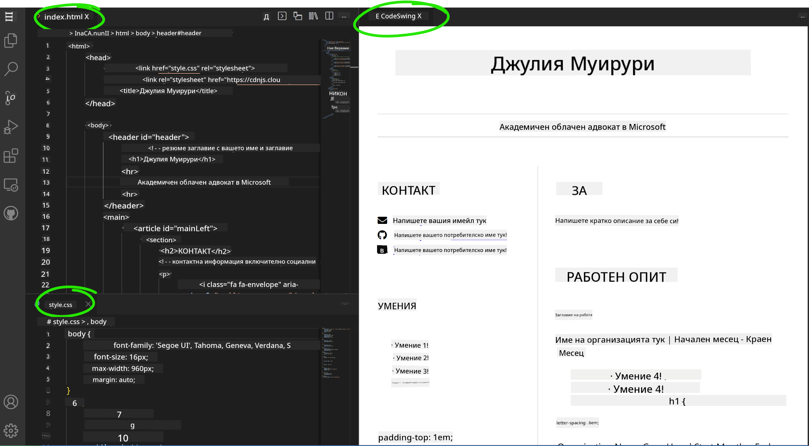

<!--
CO_OP_TRANSLATOR_METADATA:
{
  "original_hash": "2fcb983b8dbadadb1bc2e97f8c12dac5",
  "translation_date": "2025-08-28T08:20:10+00:00",
  "source_file": "8-code-editor/1-using-a-code-editor/assignment.md",
  "language_code": "bg"
}
-->
# Създайте уебсайт за автобиография с помощта на vscode.dev

_Колко готино би било, ако рекрутер поиска вашата автобиография и вие му изпратите линк?_ 😎

## Цели

След това задание ще научите как да:

- Създадете уебсайт, който да представя вашата автобиография

### Предварителни изисквания

1. Акаунт в GitHub. Посетете [GitHub](https://github.com/) и създайте акаунт, ако все още нямате такъв.

## Стъпки

**Стъпка 1:** Създайте ново GitHub хранилище и му дайте име `my-resume`.

**Стъпка 2:** Създайте файл `index.html` във вашето хранилище. Ще добавим поне един файл директно в github.com, защото не можете да отворите празно хранилище във vscode.dev.

Кликнете върху линка `creating a new file`, въведете името `index.html` и изберете бутона `Commit new file`.



**Стъпка 3:** Отворете [VSCode.dev](https://vscode.dev) и изберете бутона `Open Remote Repository`.

Копирайте URL адреса на хранилището, което току-що създадохте за вашия уебсайт с автобиография, и го поставете в полето за въвеждане:

_Заменете `your-username` с вашето потребителско име в GitHub._

```
https://github.com/your-username/my-resume
```

✅ Ако всичко е успешно, ще видите вашия проект и файла index.html, отворени в текстовия редактор в браузъра.



**Стъпка 4:** Отворете файла `index.html`, поставете кода по-долу в кода си и запазете.

<details>
    <summary><b>HTML код, отговорен за съдържанието на вашия уебсайт с автобиография.</b></summary>
    
        <html>

            <head>
                <link href="style.css" rel="stylesheet">
                <link rel="stylesheet" href="https://cdnjs.cloudflare.com/ajax/libs/font-awesome/5.15.4/css/all.min.css">
                <title>Вашето име тук!</title>
            </head>
            <body>
                <header id="header">
                    <!-- заглавие на автобиографията с вашето име и длъжност -->
                    <h1>Вашето име тук!</h1>
                    <hr>
                    Вашата роля!
                    <hr>
                </header>
                <main>
                    <article id="mainLeft">
                        <section>
                            <h2>КОНТАКТИ</h2>
                            <!-- информация за контакт, включително социални мрежи -->
                            <p>
                                <i class="fa fa-envelope" aria-hidden="true"></i>
                                <a href="mailto:username@domain.top-level domain">Напишете вашия имейл тук</a>
                            </p>
                            <p>
                                <i class="fab fa-github" aria-hidden="true"></i>
                                <a href="github.com/yourGitHubUsername">Напишете вашето потребителско име тук!</a>
                            </p>
                            <p>
                                <i class="fab fa-linkedin" aria-hidden="true"></i>
                                <a href="linkedin.com/yourLinkedInUsername">Напишете вашето потребителско име тук!</a>
                            </p>
                        </section>
                        <section>
                            <h2>УМЕНИЯ</h2>
                            <!-- вашите умения -->
                            <ul>
                                <li>Умение 1!</li>
                                <li>Умение 2!</li>
                                <li>Умение 3!</li>
                                <li>Умение 4!</li>
                            </ul>
                        </section>
                        <section>
                            <h2>ОБРАЗОВАНИЕ</h2>
                            <!-- вашето образование -->
                            <h3>Напишете вашата специалност тук!</h3>
                            <p>
                                Напишете вашето учебно заведение тук!
                            </p>
                            <p>
                                Начална - Крайна дата
                            </p>
                        </section>            
                    </article>
                    <article id="mainRight">
                        <section>
                            <h2>ЗА МЕН</h2>
                            <!-- информация за вас -->
                            <p>Напишете кратко описание за себе си!</p>
                        </section>
                        <section>
                            <h2>ПРОФЕСИОНАЛЕН ОПИТ</h2>
                            <!-- вашият професионален опит -->
                            <h3>Длъжност</h3>
                            <p>
                                Име на организацията | Начален месец – Краен месец
                            </p>
                            <ul>
                                    <li>Задача 1 - Опишете какво сте правили!</li>
                                    <li>Задача 2 - Опишете какво сте правили!</li>
                                    <li>Опишете резултатите/влиянието от вашия принос</li>
                                    
                            </ul>
                            <h3>Длъжност 2</h3>
                            <p>
                                Име на организацията | Начален месец – Краен месец
                            </p>
                            <ul>
                                    <li>Задача 1 - Опишете какво сте правили!</li>
                                    <li>Задача 2 - Опишете какво сте правили!</li>
                                    <li>Опишете резултатите/влиянието от вашия принос</li>
                                    
                            </ul>
                        </section>
                    </article>
                </main>
            </body>
        </html>
</details>

Добавете детайлите на вашата автобиография, като замените _текста за попълване_ в HTML кода.

**Стъпка 5:** Задръжте курсора върху папката My-Resume, кликнете върху иконата `New File ...` и създайте 2 нови файла във вашия проект: `style.css` и `codeswing.json`.

**Стъпка 6:** Отворете файла `style.css`, поставете кода по-долу и запазете.

<details>
        <summary><b>CSS код за форматиране на оформлението на сайта.</b></summary>
            
            body {
                font-family: 'Segoe UI', Tahoma, Geneva, Verdana, sans-serif;
                font-size: 16px;
                max-width: 960px;
                margin: auto;
            }
            h1 {
                font-size: 3em;
                letter-spacing: .6em;
                padding-top: 1em;
                padding-bottom: 1em;
            }

            h2 {
                font-size: 1.5em;
                padding-bottom: 1em;
            }

            h3 {
                font-size: 1em;
                padding-bottom: 1ем;
            }
            main { 
                display: grid;
                grid-template-columns: 40% 60%;
                margin-top: 3em;
            }
            header {
                text-align: center;
                margin: auto 2em;
            }

            section {
                margin: auto 1em 4em 2em;
            }

            i {
                margin-right: .5em;
            }

            p {
                margin: .2em auto
            }

            hr {
                border: none;
                background-color: lightgray;
                height: 1px;
            }

            h1, h2, h3 {
                font-weight: 100;
                margin-bottom: 0;
            }
            #mainLeft {
                border-right: 1px solid lightgray;
            }
            
</details>

**Стъпка 6:** Отворете файла `codeswing.json`, поставете кода по-долу и запазете.

    {
    "scripts": [],
    "styles": []
    }

**Стъпка 7:** Инсталирайте разширението `Codeswing`, за да визуализирате уебсайта с автобиография в кода.

Кликнете върху иконата _`Extensions`_ в лентата с инструменти и въведете Codeswing. Или кликнете върху _синия бутон за инсталиране_ в разширената лента с инструменти, за да инсталирате, или използвайте бутона за инсталиране, който се появява в кода, след като изберете разширението, за да заредите допълнителна информация. Веднага след инсталирането на разширението, наблюдавайте промените във вашия проект 😃.


Това е, което ще видите на екрана си след инсталирането на разширението.



Ако сте доволни от направените промени, задръжте курсора върху папката `Changes` и кликнете върху бутона `+`, за да добавите промените.

Въведете съобщение за комит _(Описание на промените, които сте направили в проекта)_ и комитнете промените, като кликнете върху `check`. След като приключите с работата по проекта, изберете иконата на менюто в горния ляв ъгъл, за да се върнете към хранилището в GitHub.

Поздравления 🎉 Току-що създадохте вашия уебсайт за автобиография с помощта на vscode.dev само за няколко стъпки.

## 🚀 Предизвикателство

Отворете отдалечено хранилище, за което имате разрешение да правите промени, и актуализирайте някои файлове. След това опитайте да създадете нов клон с вашите промени и направете Pull Request.

## Преглед и самостоятелно обучение

Прочетете повече за [VSCode.dev](https://code.visualstudio.com/docs/editor/vscode-web?WT.mc_id=academic-0000-alfredodeza) и някои от другите му функции.

---

**Отказ от отговорност**:  
Този документ е преведен с помощта на AI услуга за превод [Co-op Translator](https://github.com/Azure/co-op-translator). Въпреки че се стремим към точност, моля, имайте предвид, че автоматичните преводи може да съдържат грешки или неточности. Оригиналният документ на неговия изходен език трябва да се счита за авторитетен източник. За критична информация се препоръчва професионален превод от човек. Не носим отговорност за каквито и да е недоразумения или погрешни интерпретации, произтичащи от използването на този превод.