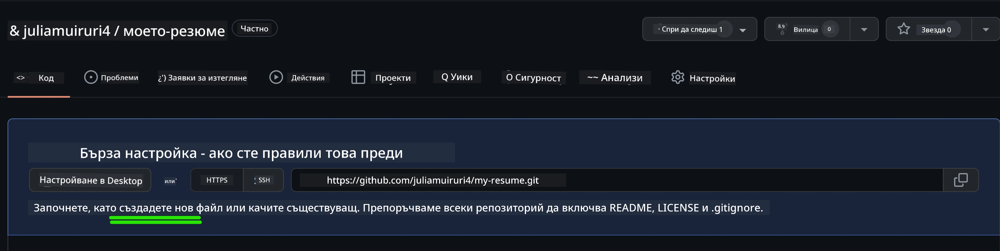
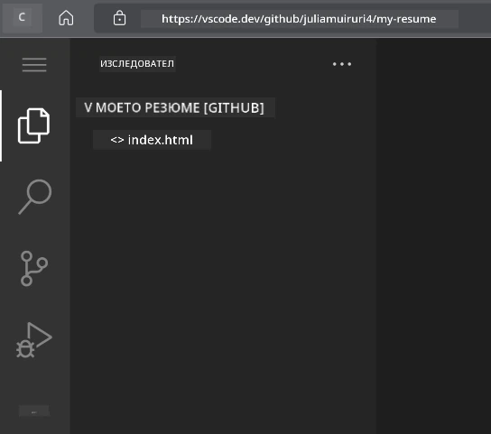
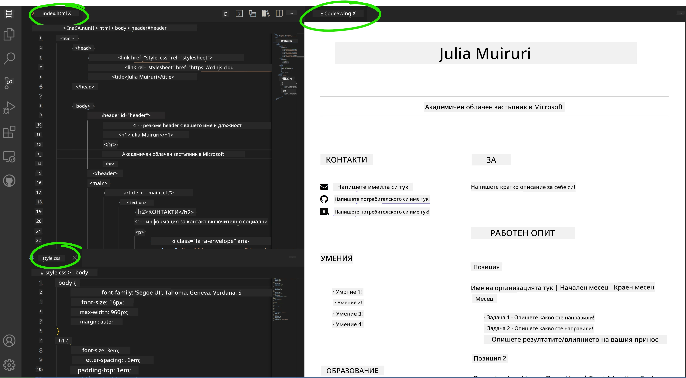

# Създаване на уебсайт за автобиография с VSCode.dev

Подобрете перспективите си за кариера, като създадете професионален уебсайт за автобиография, който представя вашите умения и опит в интерактивен, модерен формат. Вместо да изпращате традиционни PDF файлове, си представете как предоставяте на работодателите стилен, адаптивен уебсайт, който демонстрира както вашите квалификации, така и способностите ви за уеб разработка.

Това практическо задание ще ви позволи да приложите всички свои умения с VSCode.dev, докато създавате нещо наистина полезно за вашата кариера. Ще преминете през целия процес на уеб разработка – от създаването на хранилище до публикуването – всичко това в браузъра ви.

След завършване на проекта ще имате професионално онлайн присъствие, което лесно може да бъде споделено с потенциални работодатели, актуализирано с развитието на вашите умения и персонализирано според вашия личен стил. Това е точно такъв практически проект, който демонстрира реални умения за уеб разработка.

## Цели на обучението

След завършване на това задание ще можете:

- **Да създавате** и управлявате цялостен проект за уеб разработка с VSCode.dev
- **Да структурирате** професионален уебсайт, използвайки семантични HTML елементи
- **Да оформяте** адаптивни дизайни с модерни техники на CSS
- **Да внедрявате** интерактивни функции, използвайки основни уеб технологии
- **Да публикувате** уебсайт на живо, достъпен чрез споделяем URL адрес
- **Да демонстрирате** най-добрите практики за контрол на версиите по време на процеса на разработка

## Предварителни изисквания

Преди да започнете това задание, уверете се, че имате:

- Акаунт в GitHub (създайте такъв на [github.com](https://github.com/), ако е необходимо)
- Завършен урок за VSCode.dev, обхващащ навигация в интерфейса и основни операции
- Основно разбиране за структурата на HTML и концепциите за стилизиране с CSS

## Настройка на проекта и създаване на хранилище

Нека започнем с изграждането на основата на вашия проект. Този процес отразява реалните работни потоци за разработка, където проектите започват с правилна инициализация на хранилището и планиране на структурата.

### Стъпка 1: Създайте хранилище в GitHub

Създаването на специално хранилище гарантира, че вашият проект е правилно организиран и контролиран от самото начало.

1. **Отидете** на [GitHub.com](https://github.com) и влезте в акаунта си
2. **Кликнете** върху зеления бутон "New" или иконата "+" в горния десен ъгъл
3. **Назовете** вашето хранилище `my-resume` (или изберете персонализирано име като `ivan-ivanov-resume`)
4. **Добавете** кратко описание: "Професионален уебсайт за автобиография, създаден с HTML и CSS"
5. **Изберете** "Public", за да направите автобиографията си достъпна за потенциални работодатели
6. **Отбележете** "Add a README file", за да създадете първоначално описание на проекта
7. **Кликнете** "Create repository", за да завършите настройката

> 💡 **Съвет за именуване на хранилището**: Използвайте описателни, професионални имена, които ясно показват целта на проекта. Това помага при споделяне с работодатели или по време на прегледи на портфолио.

### Стъпка 2: Инициализирайте структурата на проекта

Тъй като VSCode.dev изисква поне един файл, за да отвори хранилище, ще създадем основния HTML файл директно в GitHub, преди да преминем към уеб редактора.

1. **Кликнете** върху връзката "creating a new file" в новото си хранилище
2. **Въведете** `index.html` като име на файла
3. **Добавете** тази начална HTML структура:

```html
<!DOCTYPE html>
<html lang="en">
<head>
    <meta charset="UTF-8">
    <meta name="viewport" content="width=device-width, initial-scale=1.0">
    <title>Your Name - Professional Resume</title>
</head>
<body>
    <h1>Your Name</h1>
    <p>Professional Resume Website</p>
</body>
</html>
```

4. **Напишете** съобщение за комит: "Добавяне на начална HTML структура"
5. **Кликнете** "Commit new file", за да запазите промените



**Ето какво постигате с тази начална настройка:**
- **Създавате** правилна HTML5 структура на документа със семантични елементи
- **Включвате** мета таг за съвместимост с адаптивен дизайн
- **Задавате** описателно заглавие на страницата, което се появява в разделите на браузъра
- **Създавате** основа за професионална организация на съдържанието

## Работа с VSCode.dev

След като основата на вашето хранилище е създадена, нека преминем към VSCode.dev за основната работа по разработката. Този уеб-базиран редактор предоставя всички необходими инструменти за професионална уеб разработка.

### Стъпка 3: Отворете проекта си в VSCode.dev

1. **Отидете** на [vscode.dev](https://vscode.dev) в нов раздел на браузъра
2. **Кликнете** "Open Remote Repository" на началния екран
3. **Копирайте** URL адреса на вашето хранилище от GitHub и го поставете в полето за въвеждане

   Формат: `https://github.com/your-username/my-resume`
   
   *Заменете `your-username` с вашето действително потребителско име в GitHub*

4. **Натиснете** Enter, за да заредите проекта си

✅ **Индикатор за успех**: Трябва да видите файловете на проекта си в страничната лента Explorer и `index.html`, достъпен за редактиране в основната област на редактора.



**Какво ще видите в интерфейса:**
- **Странична лента Explorer**: **Показва** файловете и структурата на папките на вашето хранилище
- **Област на редактора**: **Показва** съдържанието на избраните файлове за редактиране
- **Лента с дейности**: **Осигурява** достъп до функции като Source Control и Extensions
- **Лента за състояние**: **Показва** информация за връзката и текущия клон

### Стъпка 4: Създайте съдържанието на автобиографията си

Заменете съдържанието на шаблона в `index.html` с подробна структура на автобиографията. Този HTML ще бъде основата за професионалното представяне на вашите квалификации.

<details>
<summary><b>Пълна HTML структура на автобиографията</b></summary>

```html
<!DOCTYPE html>
<html lang="en">
<head>
    <meta charset="UTF-8">
    <meta name="viewport" content="width=device-width, initial-scale=1.0">
    <link href="style.css" rel="stylesheet">
    <link rel="stylesheet" href="https://cdnjs.cloudflare.com/ajax/libs/font-awesome/5.15.4/css/all.min.css">
    <title>Your Name - Professional Resume</title>
</head>
<body>
    <header id="header">
        <h1>Your Full Name</h1>
        <hr>
        <p class="role">Your Professional Title</p>
        <hr>
    </header>
    
    <main>
        <article id="mainLeft">
            <section>
                <h2>CONTACT</h2>
                <p>
                    <i class="fa fa-envelope" aria-hidden="true"></i>
                    <a href="mailto:your.email@domain.com">your.email@domain.com</a>
                </p>
                <p>
                    <i class="fab fa-github" aria-hidden="true"></i>
                    <a href="https://github.com/your-username">github.com/your-username</a>
                </p>
                <p>
                    <i class="fab fa-linkedin" aria-hidden="true"></i>
                    <a href="https://linkedin.com/in/your-profile">linkedin.com/in/your-profile</a>
                </p>
            </section>
            
            <section>
                <h2>SKILLS</h2>
                <ul>
                    <li>HTML5 & CSS3</li>
                    <li>JavaScript (ES6+)</li>
                    <li>Responsive Web Design</li>
                    <li>Version Control (Git)</li>
                    <li>Problem Solving</li>
                </ul>
            </section>
            
            <section>
                <h2>EDUCATION</h2>
                <h3>Your Degree or Certification</h3>
                <p>Institution Name</p>
                <p>Start Date - End Date</p>
            </section>
        </article>
        
        <article id="mainRight">
            <section>
                <h2>ABOUT</h2>
                <p>Write a compelling summary that highlights your passion for web development, key achievements, and career goals. This section should give employers insight into your personality and professional approach.</p>
            </section>
            
            <section>
                <h2>WORK EXPERIENCE</h2>
                <div class="job">
                    <h3>Job Title</h3>
                    <p class="company">Company Name | Start Date – End Date</p>
                    <ul>
                        <li>Describe a key accomplishment or responsibility</li>
                        <li>Highlight specific skills or technologies used</li>
                        <li>Quantify impact where possible (e.g., "Improved efficiency by 25%")</li>
                    </ul>
                </div>
                
                <div class="job">
                    <h3>Previous Job Title</h3>
                    <p class="company">Previous Company | Start Date – End Date</p>
                    <ul>
                        <li>Focus on transferable skills and achievements</li>
                        <li>Demonstrate growth and learning progression</li>
                        <li>Include any leadership or collaboration experiences</li>
                    </ul>
                </div>
            </section>
            
            <section>
                <h2>PROJECTS</h2>
                <div class="project">
                    <h3>Project Name</h3>
                    <p>Brief description of what the project accomplishes and technologies used.</p>
                    <a href="#" target="_blank">View Project</a>
                </div>
            </section>
        </article>
    </main>
</body>
</html>
```
</details>

**Насоки за персонализация:**
- **Заменете** целия текст на шаблона с вашата действителна информация
- **Коригирайте** секциите според нивото на вашия опит и фокуса на кариерата
- **Добавете** или премахнете секции, ако е необходимо (например Сертификати, Доброволческа работа, Езици)
- **Включете** връзки към вашите реални профили и проекти

### Стъпка 5: Създайте допълнителни файлове

Професионалните уебсайтове изискват организирани файлови структури. Създайте CSS стиловия файл и конфигурационните файлове, необходими за завършен проект.

1. **Задръжте курсора** върху името на папката на проекта в страничната лента Explorer
2. **Кликнете** върху иконата "New File" (📄+), която се появява
3. **Създайте** тези файлове един по един:
   - `style.css` (за стилизиране и оформление)
   - `codeswing.json` (за конфигурация на разширението за предварителен преглед)

**Създаване на CSS файл (`style.css`):**

<details>
<summary><b>Професионално стилизиране с CSS</b></summary>

```css
/* Modern Resume Styling */
body {
    font-family: 'Segoe UI', Tahoma, Geneva, Verdana, sans-serif;
    font-size: 16px;
    line-height: 1.6;
    max-width: 960px;
    margin: 0 auto;
    padding: 20px;
    color: #333;
    background-color: #f9f9f9;
}

/* Header Styling */
header {
    text-align: center;
    margin-bottom: 3em;
    padding: 2em;
    background: linear-gradient(135deg, #667eea 0%, #764ba2 100%);
    color: white;
    border-radius: 10px;
    box-shadow: 0 4px 6px rgba(0, 0, 0, 0.1);
}

h1 {
    font-size: 3em;
    letter-spacing: 0.1em;
    margin-bottom: 0.2em;
    font-weight: 300;
}

.role {
    font-size: 1.3em;
    font-weight: 300;
    margin: 1em 0;
}

/* Main Content Layout */
main {
    display: grid;
    grid-template-columns: 35% 65%;
    gap: 3em;
    margin-top: 3em;
    background: white;
    padding: 2em;
    border-radius: 10px;
    box-shadow: 0 2px 10px rgba(0, 0, 0, 0.1);
}

/* Typography */
h2 {
    font-size: 1.4em;
    font-weight: 600;
    margin-bottom: 1em;
    color: #667eea;
    border-bottom: 2px solid #667eea;
    padding-bottom: 0.3em;
}

h3 {
    font-size: 1.1em;
    font-weight: 600;
    margin-bottom: 0.5em;
    color: #444;
}

/* Section Styling */
section {
    margin-bottom: 2.5em;
}

#mainLeft {
    border-right: 1px solid #e0e0e0;
    padding-right: 2em;
}

/* Contact Links */
section a {
    color: #667eea;
    text-decoration: none;
    transition: color 0.3s ease;
}

section a:hover {
    color: #764ba2;
    text-decoration: underline;
}

/* Icons */
i {
    margin-right: 0.8em;
    width: 20px;
    text-align: center;
    color: #667eea;
}

/* Lists */
ul {
    list-style: none;
    padding-left: 0;
}

li {
    margin: 0.5em 0;
    padding: 0.3em 0;
    position: relative;
}

li:before {
    content: "▸";
    color: #667eea;
    margin-right: 0.5em;
}

/* Work Experience */
.job, .project {
    margin-bottom: 2em;
    padding-bottom: 1.5em;
    border-bottom: 1px solid #f0f0f0;
}

.company {
    font-style: italic;
    color: #666;
    margin-bottom: 0.5em;
}

/* Responsive Design */
@media (max-width: 768px) {
    main {
        grid-template-columns: 1fr;
        gap: 2em;
    }
    
    #mainLeft {
        border-right: none;
        border-bottom: 1px solid #e0e0e0;
        padding-right: 0;
        padding-bottom: 2em;
    }
    
    h1 {
        font-size: 2.2em;
    }
    
    body {
        padding: 10px;
    }
}

/* Print Styles */
@media print {
    body {
        background: white;
        color: black;
        font-size: 12pt;
    }
    
    header {
        background: none;
        color: black;
        box-shadow: none;
    }
    
    main {
        box-shadow: none;
    }
}
```
</details>

**Създаване на конфигурационен файл (`codeswing.json`):**

```json
{
    "scripts": [],
    "styles": []
}
```

**Разбиране на функциите на CSS:**
- **Използва** CSS Grid за адаптивна, професионална структура на оформлението
- **Внедрява** модерни цветови схеми с градиентни заглавия
- **Включва** ефекти при задържане и плавни преходи за интерактивност
- **Осигурява** адаптивен дизайн, който работи на всички размери устройства
- **Добавя** стилове, подходящи за печат, за генериране на PDF

### Стъпка 6: Инсталиране и конфигуриране на разширения

Разширенията подобряват вашето преживяване при разработка, като предоставят възможности за предварителен преглед на живо и инструменти за подобряване на работния процес. Разширението CodeSwing е особено полезно за проекти за уеб разработка.

**Инсталиране на разширението CodeSwing:**

1. **Кликнете** върху иконата Extensions (🧩) в лентата с дейности
2. **Търсете** "CodeSwing" в полето за търсене на пазара
3. **Изберете** разширението CodeSwing от резултатите от търсенето
4. **Кликнете** върху синия бутон "Install"


**Какво предоставя CodeSwing:**
- **Позволява** предварителен преглед на вашия уебсайт на живо, докато го редактирате
- **Показва** промените в реално време без ръчно обновяване
- **Поддържа** множество типове файлове, включително HTML, CSS и JavaScript
- **Осигурява** интегрирано преживяване за разработка

**Незабавни резултати след инсталацията:**
След като CodeSwing е инсталиран, ще видите предварителен преглед на живо на вашия уебсайт за автобиография, който се появява в редактора. Това ви позволява да видите точно как изглежда вашият сайт, докато правите промени.



**Разбиране на подобрения интерфейс:**
- **Разделен изглед**: **Показва** вашия код от едната страна и предварителния преглед от другата
- **Актуализации в реално време**: **Отразява** промените незабавно, докато пишете
- **Интерактивен преглед**: **Позволява** тестване на връзки и взаимодействия
- **Симулация на мобилни устройства**: **Осигурява** тестване на адаптивния дизайн

### Стъпка 7: Контрол на версиите и публикуване

След като вашият уебсайт за автобиография е завършен, използвайте Git, за да запазите работата си и да я направите достъпна онлайн.

**Запазване на промените:**

1. **Кликнете** върху иконата Source Control (🌿) в лентата с дейности
2. **Прегледайте** всички файлове, които сте създали и модифицирали в секцията "Changes"
3. **Добавете** промените, като кликнете върху иконата "+" до всеки файл
4. **Напишете** описателно съобщение за комит, например:
   - "Добавяне на пълен уебсайт за автобиография с адаптивен дизайн"
   - "Внедряване на професионално стилизиране и структура на съдържанието"
5. **Кликнете** върху отметката (✓), за да запазите и качите промените

**Примери за ефективни съобщения за комит:**
- "Добавяне на професионално съдържание и стилизиране на автобиографията"
- "Внедряване на адаптивен дизайн за съвместимост с мобилни устройства"
- "Актуализиране на контактната информация и връзките към проектите"

> 💡 **Професионален съвет**: Добри съобщения за комит помагат за проследяване на развитието на проекта и демонстрират внимание към детайлите – качества, които работодателите ценят.

**Достъп до публикувания сайт:**
След като запазите промените, можете да се върнете към хранилището си в GitHub, използвайки менюто с хамбургер (☰) в горния ляв ъгъл. Вашият уебсайт за автобиография вече е под контрол на версиите и готов за публикуване или споделяне.

## Резултати и следващи стъпки

**Поздравления! 🎉** Успешно създадохте професионален уебсайт за автобиография с VSCode.dev. Вашият проект демонстрира:
**Демонстрирани технически умения:**
- **Управление на хранилище**: Създаване и организиране на цялостна структура на проекта
- **Уеб разработка**: Създаване на адаптивен уебсайт с модерни HTML5 и CSS3
- **Контрол на версиите**: Внедряване на правилен Git работен процес със смислени комити
- **Професионално използване на инструменти**: Ефективно използване на интерфейса и системата за разширения на VSCode.dev

**Постигнати професионални резултати:**
- **Онлайн присъствие**: Споделяем URL адрес, който представя вашите квалификации
- **Модерен формат**: Интерактивна алтернатива на традиционните PDF автобиографии
- **Демонстрация на умения**: Конкретни доказателства за вашите способности за уеб разработка
- **Лесни актуализации**: Основа, която можете непрекъснато да подобрявате и персонализирате

### Опции за публикуване

За да направите автобиографията си достъпна за работодатели, обмислете тези хостинг опции:

**GitHub Pages (Препоръчително):**
1. Отидете в настройките на вашето хранилище в GitHub
2. Превъртете до секцията "Pages"
3. Изберете "Deploy from a branch" и изберете "main"
4. Вашият сайт ще бъде достъпен на `https://your-username.github.io/my-resume`

**Алтернативни платформи:**
- **Netlify**: Автоматично публикуване с персонализирани домейни
- **Vercel**: Бързо публикуване с модерни хостинг функции
- **GitHub Codespaces**: Среда за разработка с вграден преглед

### Предложения за подобрения

Продължете да развивате уменията си, като добавите тези функции:

**Технически подобрения:**
- **Интерактивност с JavaScript**: Добавете плавно скролиране или интерактивни елементи
- **Превключване на тъмна/светла тема**: Внедрете смяна на темата според предпочитанията на потребителя
- **Форма за контакт**: Позволете директна комуникация с потенциални работодатели
- **SEO оптимизация**: Добавете мета тагове и структурирани данни за по-добра видимост в търсачките

**Подобрения в съдържанието:**
- **Портфолио с проекти**: Включете връзки към хранилища в GitHub и демонстрации на живо
- **Визуализация на уменията**: Създайте ленти за напредък или системи за оценка на уменията
- **Секция с препоръки**: Включете препоръки от колеги или преподаватели
- **Интеграция на блог**: Добавете секция за блог, за да покажете вашето обучение

## Предизвикателство
- **Достъпност**: Научете насоките на WCAG за създаване на уеб дизайн, достъпен за всички
- **Производителност**: Разгледайте инструменти като Lighthouse за оптимизация
- **SEO**: Разберете основите на оптимизацията за търсачки

**Професионално развитие:**
- **Създаване на портфолио**: Създайте допълнителни проекти, за да покажете разнообразни умения
- **Отворен код**: Допринасяйте към съществуващи проекти, за да натрупате опит в сътрудничеството
- **Нетворкинг**: Споделете уебсайта си с автобиографията в общности за разработчици за обратна връзка
- **Непрекъснато учене**: Бъдете в крак с тенденциите и технологиите в уеб разработката

---

**Вашите следващи стъпки:** Споделете уебсайта си с автобиографията с приятели, семейство или ментори за обратна връзка. Използвайте техните предложения, за да направите промени и подобрения в дизайна си. Не забравяйте, че този проект не е просто автобиография – той е демонстрация на вашето развитие като уеб разработчик!

---

**Отказ от отговорност**:  
Този документ е преведен с помощта на AI услуга за превод [Co-op Translator](https://github.com/Azure/co-op-translator). Въпреки че се стремим към точност, моля, имайте предвид, че автоматизираните преводи може да съдържат грешки или неточности. Оригиналният документ на неговия роден език трябва да се счита за авторитетен източник. За критична информация се препоръчва професионален човешки превод. Ние не носим отговорност за каквито и да било недоразумения или погрешни интерпретации, произтичащи от използването на този превод.