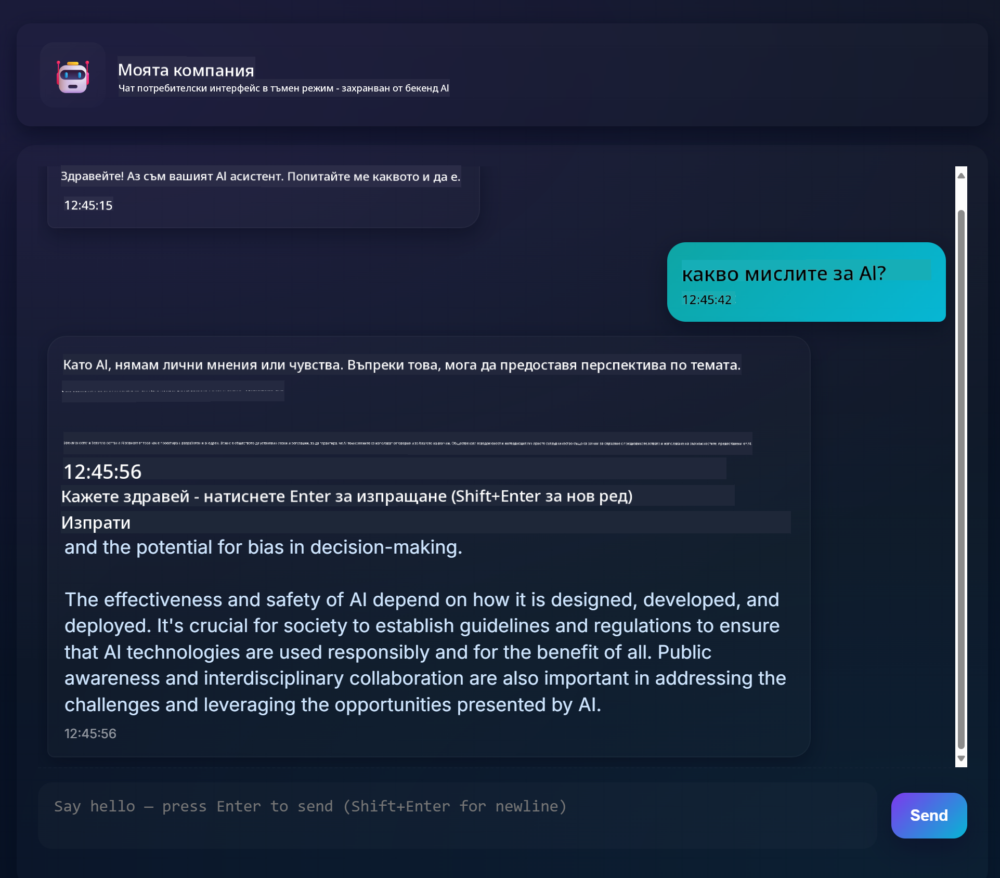
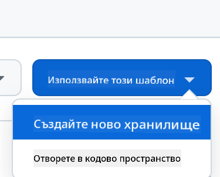

<!--
CO_OP_TRANSLATOR_METADATA:
{
  "original_hash": "11cf36165c243947b6cd85b88cf6faa6",
  "translation_date": "2025-09-01T17:02:06+00:00",
  "source_file": "9-chat-project/README.md",
  "language_code": "bg"
}
-->
# Чат проект

Този чат проект показва как да създадете Чат Асистент, използвайки GitHub Models.

Ето как изглежда завършеният проект:



Малко контекст: създаването на чат асистенти с помощта на генеративен AI е чудесен начин да започнете да учите за AI. В този урок ще научите как да интегрирате генеративен AI в уеб приложение. Да започваме.

## Свързване с генеративен AI

За бекенда използваме GitHub Models. Това е страхотна услуга, която ви позволява да използвате AI безплатно. Отидете в неговия playground и вземете кода, който съответства на избрания от вас език за бекенд. Ето как изглежда [GitHub Models Playground](https://github.com/marketplace/models/azure-openai/gpt-4o-mini/playground).


Както казахме, изберете таба "Code" и вашата предпочитана среда за изпълнение.


### Използване на Python

В този случай избираме Python, което означава, че ще използваме този код:

```python
"""Run this model in Python

> pip install openai
"""
import os
from openai import OpenAI

# To authenticate with the model you will need to generate a personal access token (PAT) in your GitHub settings. 
# Create your PAT token by following instructions here: https://docs.github.com/en/authentication/keeping-your-account-and-data-secure/managing-your-personal-access-tokens
client = OpenAI(
    base_url="https://models.github.ai/inference",
    api_key=os.environ["GITHUB_TOKEN"],
)

response = client.chat.completions.create(
    messages=[
        {
            "role": "system",
            "content": "",
        },
        {
            "role": "user",
            "content": "What is the capital of France?",
        }
    ],
    model="openai/gpt-4o-mini",
    temperature=1,
    max_tokens=4096,
    top_p=1
)

print(response.choices[0].message.content)
```

Нека почистим този код малко, за да бъде по-удобен за повторна употреба:

```python
def call_llm(prompt: str, system_message: str):
    response = client.chat.completions.create(
        messages=[
            {
                "role": "system",
                "content": system_message,
            },
            {
                "role": "user",
                "content": prompt,
            }
        ],
        model="openai/gpt-4o-mini",
        temperature=1,
        max_tokens=4096,
        top_p=1
    )

    return response.choices[0].message.content
```

С тази функция `call_llm` можем да подаваме prompt и системен prompt, а функцията ще връща резултата.

### Персонализиране на AI Асистента

Ако искате да персонализирате AI асистента, можете да зададете как да се държи, като попълните системния prompt по следния начин:

```python
call_llm("Tell me about you", "You're Albert Einstein, you only know of things in the time you were alive")
```

## Излагане чрез Web API

Чудесно, завършихме AI частта, нека видим как можем да я интегрираме в Web API. За Web API избираме Flask, но всяка уеб рамка би свършила работа. Нека видим кода за това:

### Използване на Python

```python
# api.py
from flask import Flask, request, jsonify
from llm import call_llm
from flask_cors import CORS

app = Flask(__name__)
CORS(app)   # *   example.com

@app.route("/", methods=["GET"])
def index():
    return "Welcome to this API. Call POST /hello with 'message': 'my message' as JSON payload"


@app.route("/hello", methods=["POST"])
def hello():
    # get message from request body  { "message": "do this taks for me" }
    data = request.get_json()
    message = data.get("message", "")

    response = call_llm(message, "You are a helpful assistant.")
    return jsonify({
        "response": response
    })

if __name__ == "__main__":
    app.run(host="0.0.0.0", port=5000)
```

Тук създаваме Flask API и дефинираме основен маршрут "/" и "/chat". Последният е предназначен за използване от фронтенда, за да предава въпроси към него.

За да интегрираме *llm.py*, ето какво трябва да направим:

- Импортирайте функцията `call_llm`:

   ```python
   from llm import call_llm
   from flask import Flask, request
   ```

- Извикайте я от маршрута "/chat":

   ```python
   @app.route("/hello", methods=["POST"])
   def hello():
      # get message from request body  { "message": "do this taks for me" }
      data = request.get_json()
      message = data.get("message", "")

      response = call_llm(message, "You are a helpful assistant.")
      return jsonify({
         "response": response
      })
   ```

   Тук анализираме входящата заявка, за да извлечем свойството `message` от JSON тялото. След това извикваме LLM с този код:

   ```python
   response = call_llm(message, "You are a helpful assistant")

   # return the response as JSON
   return jsonify({
      "response": response 
   })
   ```

Чудесно, сега сме готови.

## Конфигуриране на Cors

Трябва да отбележим, че настройваме нещо като CORS (споделяне на ресурси между различни източници). Това означава, че тъй като бекендът и фронтендът ще работят на различни портове, трябва да позволим на фронтенда да се свързва с бекенда.

### Използване на Python

Има част от кода в *api.py*, която настройва това:

```python
from flask_cors import CORS

app = Flask(__name__)
CORS(app)   # *   example.com
```

В момента е настроено да позволява "*" (всички източници), което е малко несигурно. Трябва да го ограничим, когато преминем към продукция.

## Стартиране на проекта

За да стартирате проекта, първо трябва да стартирате бекенда, а след това фронтенда.

### Използване на Python

Добре, имаме *llm.py* и *api.py*. Как можем да ги накараме да работят заедно? Има две неща, които трябва да направим:

- Инсталирайте зависимостите:

   ```sh
   cd backend
   python -m venv venv
   source ./venv/bin/activate

   pip install openai flask flask-cors openai
   ```

- Стартирайте API-то:

   ```sh
   python api.py
   ```

   Ако сте в Codespaces, трябва да отидете в "Ports" в долната част на редактора, да кликнете с десния бутон върху него, да изберете "Port Visibility" и да изберете "Public".

### Работа върху фронтенд

Сега, когато имаме работещо API, нека създадем фронтенд за него. Ще започнем с минимален фронтенд, който ще подобряваме стъпка по стъпка. В папка *frontend* създайте следното:

```text
backend/
frontend/
index.html
app.js
styles.css
```

Нека започнем с **index.html**:

```html
<html>
    <head>
        <link rel="stylesheet" href="styles.css">
    </head>
    <body>
      <form>
        <textarea id="messages"></textarea>
        <input id="input" type="text" />
        <button type="submit" id="sendBtn">Send</button>  
      </form>  
      <script src="app.js" />
    </body>
</html>    
```

Горният код е абсолютният минимум, необходим за поддръжка на чат прозорец. Състои се от текстово поле, където ще се показват съобщенията, поле за въвеждане на съобщения и бутон за изпращане на съобщението към бекенда. Нека разгледаме JavaScript в *app.js*.

**app.js**

```js
// app.js

(function(){
  // 1. set up elements  
  const messages = document.getElementById("messages");
  const form = document.getElementById("form");
  const input = document.getElementById("input");

  const BASE_URL = "change this";
  const API_ENDPOINT = `${BASE_URL}/hello`;

  // 2. create a function that talks to our backend
  async function callApi(text) {
    const response = await fetch(API_ENDPOINT, {
      method: "POST",
      headers: { "Content-Type": "application/json" },
      body: JSON.stringify({ message: text })
    });
    let json = await response.json();
    return json.response;
  }

  // 3. add response to our textarea
  function appendMessage(text, role) {
    const el = document.createElement("div");
    el.className = `message ${role}`;
    el.innerHTML = text;
    messages.appendChild(el);
  }

  // 4. listen to submit events
  form.addEventListener("submit", async(e) => {
    e.preventDefault();
   // someone clicked the button in the form
   
   // get input
   const text = input.value.trim();

   appendMessage(text, "user")

   // reset it
   input.value = '';

   const reply = await callApi(text);

   // add to messages
   appendMessage(reply, "assistant");

  })
})();
```

Нека разгледаме кода по секции:

- 1) Тук получаваме референции към всички елементи, които ще използваме по-късно в кода.
- 2) В тази секция създаваме функция, която използва вградения метод `fetch`, за да извика нашия бекенд.
- 3) `appendMessage` помага да добавяме отговори, както и съобщенията, които въвеждате като потребител.
- 4) Тук слушаме събитието за изпращане, четем полето за въвеждане, поставяме съобщението на потребителя в текстовото поле, извикваме API-то и показваме отговора в текстовото поле.

Нека разгледаме стилизирането. Тук можете да бъдете креативни и да го направите както искате, но ето някои предложения:

**styles.css**

```
.message {
    background: #222;
    box-shadow: 0 0 0 10px orange;
    padding: 10px:
    margin: 5px;
}

.message.user {
    background: blue;
}

.message.assistant {
    background: grey;
} 
```

С тези три класа ще стилизирате съобщенията различно в зависимост от това дали идват от асистента или от вас като потребител. Ако искате вдъхновение, разгледайте папката `solution/frontend/styles.css`.

### Промяна на Base Url

Има едно нещо, което не зададохме, и това е `BASE_URL`. Това не е известно, докато бекендът ви не бъде стартиран. За да го зададете:

- Ако стартирате API локално, трябва да бъде нещо като `http://localhost:5000`.
- Ако го стартирате в Codespaces, трябва да изглежда нещо като "[name]app.github.dev".

## Задача

Създайте своя собствена папка *project* със съдържание, както е описано по-горе:

```text
project/
  frontend/
    index.html
    app.js
    styles.css
  backend/
    ...
```

Копирайте съдържанието от инструкциите по-горе, но не се колебайте да го персонализирате според вашите предпочитания.

## Решение

[Решение](./solution/README.md)

## Бонус

Опитайте да промените личността на AI асистента.

### За Python

Когато извиквате `call_llm` в *api.py*, можете да промените втория аргумент на каквото искате, например:

```python
call_llm(message, "You are Captain Picard")
```

### Фронтенд

Променете също CSS и текста според вашите предпочитания, като направите промени в *index.html* и *styles.css*.

## Обобщение

Чудесно, научихте как от нулата да създадете личен асистент, използвайки AI. Направихме това с помощта на GitHub Models, бекенд на Python и фронтенд с HTML, CSS и JavaScript.

## Настройка с Codespaces

- Навигирайте до: [Web Dev For Beginners repo](https://github.com/microsoft/Web-Dev-For-Beginners)
- Създайте от шаблон (уверете се, че сте влезли в GitHub) в горния десен ъгъл:

    

- След като сте в своето хранилище, създайте Codespace:

    

    Това ще стартира среда, с която можете да работите.

---

**Отказ от отговорност**:  
Този документ е преведен с помощта на AI услуга за превод [Co-op Translator](https://github.com/Azure/co-op-translator). Въпреки че се стремим към точност, моля, имайте предвид, че автоматизираните преводи може да съдържат грешки или неточности. Оригиналният документ на неговия роден език трябва да се счита за авторитетен източник. За критична информация се препоръчва професионален човешки превод. Ние не носим отговорност за недоразумения или погрешни интерпретации, произтичащи от използването на този превод.