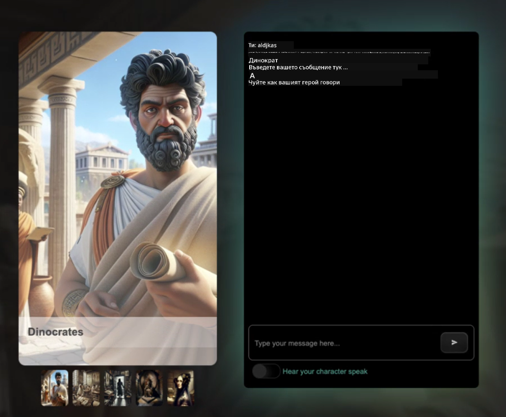

<!--
CO_OP_TRANSLATOR_METADATA:
{
  "original_hash": "efa251c5fc089367f0a81c572874afca",
  "translation_date": "2025-08-28T07:26:56+00:00",
  "source_file": "README.md",
  "language_code": "bg"
}
-->
[](https://github.com/microsoft/Web-Dev-For-Beginners/blob/master/LICENSE)  
[](https://GitHub.com/microsoft/Web-Dev-For-Beginners/graphs/contributors/)  
[](https://GitHub.com/microsoft/Web-Dev-For-Beginners/issues/)  
[](https://GitHub.com/microsoft/Web-Dev-For-Beginners/pulls/)  
[](http://makeapullrequest.com)  

[](https://GitHub.com/microsoft/Web-Dev-For-Beginners/watchers/)  
[](https://GitHub.com/microsoft/Web-Dev-For-Beginners/network/)  
[](https://GitHub.com/microsoft/Web-Dev-For-Beginners/stargazers/)  

[](https://discord.gg/zxKYvhSnVp?WT.mc_id=academic-000002-leestott)  

[](https://open.vscode.dev/microsoft/Web-Dev-For-Beginners)  

[](https://discord.com/invite/ByRwuEEgH4)  

Следвайте тези стъпки, за да започнете да използвате тези ресурси:  
1. **Направете Fork на хранилището**: Кликнете [](https://GitHub.com/microsoft/Web-Dev-For-Beginners/fork)  
2. **Клонирайте хранилището**:   `git clone https://github.com/microsoft/Web-Dev-For-Beginners.git`  
3. [**Присъединете се към Azure AI Foundry Discord и се срещнете с експерти и други разработчици**](https://discord.com/invite/ByRwuEEgH4)  

# Уеб разработка за начинаещи - учебна програма  

Научете основите на уеб разработката с нашия 12-седмичен курс, създаден от Microsoft Cloud Advocates. Всяка от 24-те лекции разглежда JavaScript, CSS и HTML чрез практически проекти като терариуми, разширения за браузъри и космически игри. Участвайте в тестове, дискусии и практически задачи. Подобрете уменията си и оптимизирайте запазването на знания с нашата ефективна проектно-базирана методология. Започнете своето кодиращо пътешествие още днес!  

#### 🧑‍🎓 _Студент ли сте?_  

Посетете [**страницата Student Hub**](https://docs.microsoft.com/learn/student-hub/?WT.mc_id=academic-77807-sagibbon), където ще намерите ресурси за начинаещи, студентски пакети и дори начини да получите безплатен ваучер за сертификат. Това е страницата, която трябва да запазите и проверявате периодично, тъй като съдържанието се обновява ежемесечно.  

### 📣 Съобщение - _Нова учебна програма_ за Генеративен AI за JavaScript току-що беше пусната  

Не пропускайте нашата нова учебна програма за Генеративен AI!  

Посетете [https://aka.ms/genai-js-course](https://aka.ms/genai-js-course), за да започнете!  

  

- Уроци, обхващащи всичко от основите до RAG.  
- Взаимодействие с исторически личности чрез GenAI и нашето придружаващо приложение.  
- Забавен и ангажиращ разказ, ще пътувате във времето!  

  

Всеки урок включва задача за изпълнение, проверка на знанията и предизвикателство, които ще ви насочат към изучаване на теми като:  
- Създаване на заявки и инженеринг на заявки  
- Генериране на текстови и визуални приложения  
- Приложения за търсене  

Посетете [https://aka.ms/genai-js-course](https://aka.ms/genai-js-course), за да започнете!  

## 🌱 Започнете  

> **Учители**, ние [включихме някои предложения](for-teachers.md) за това как да използвате тази учебна програма. Ще се радваме на вашата обратна връзка [в нашия форум за дискусии](https://github.com/microsoft/Web-Dev-For-Beginners/discussions/categories/teacher-corner)!  

**[Ученици](https://aka.ms/student-page/?WT.mc_id=academic-77807-sagibbon)**, за всеки урок започнете с предварителен тест и продължете с четене на учебния материал, изпълнение на различните дейности и проверете разбирането си с тест след лекцията.  

За да подобрите учебния си опит, свържете се с вашите връстници, за да работите заедно по проектите! Дискусиите са насърчени в нашия [форум за дискусии](https://github.com/microsoft/Web-Dev-For-Beginners/discussions), където нашият екип от модератори ще бъде на разположение да отговори на вашите въпроси.  

За да продължите образованието си, силно препоръчваме да разгледате [Microsoft Learn](https://learn.microsoft.com/users/wirelesslife/collections/p1ddcy5jwy0jkm?WT.mc_id=academic-77807-sagibbon) за допълнителни учебни материали.  

### 📋 Настройка на вашата среда  

Тази учебна програма има готова за използване среда за разработка! Когато започнете, можете да изберете да изпълните учебната програма в [Codespace](https://github.com/features/codespaces/) (_среда, базирана на браузър, без нужда от инсталации_), или локално на вашия компютър, използвайки текстов редактор като [Visual Studio Code](https://code.visualstudio.com/?WT.mc_id=academic-77807-sagibbon).  

#### Създайте вашето хранилище  
За да запазите лесно работата си, препоръчваме да създадете свое собствено копие на това хранилище. Можете да направите това, като кликнете върху бутона **Use this template** в горната част на страницата. Това ще създаде ново хранилище във вашия GitHub акаунт с копие на учебната програма.  

Следвайте тези стъпки:  
1. **Направете Fork на хранилището**: Кликнете върху бутона "Fork" в горния десен ъгъл на тази страница.  
2. **Клонирайте хранилището**:   `git clone https://github.com/microsoft/Web-Dev-For-Beginners.git`  

#### Изпълнение на учебната програма в Codespace  

В копието на хранилището, което създадохте, кликнете върху бутона **Code** и изберете **Open with Codespaces**. Това ще създаде нов Codespace, в който да работите.  

[!Codespace](../..)./images/createcodespace.png)  

#### Изпълнение на учебната програма локално на вашия компютър  

За да изпълните тази учебна програма локално на вашия компютър, ще ви е необходим текстов редактор, браузър и инструмент за команден ред. Нашият първи урок, [Въведение в програмните езици и инструменти](../../1-getting-started-lessons/1-intro-to-programming-languages), ще ви преведе през различни опции за всеки от тези инструменти, за да изберете това, което работи най-добре за вас.  

Нашата препоръка е да използвате [Visual Studio Code](https://code.visualstudio.com/?WT.mc_id=academic-77807-sagibbon) като ваш редактор, който също има вграден [Терминал](https://code.visualstudio.com/docs/terminal/basics/?WT.mc_id=academic-77807-sagibbon). Можете да изтеглите Visual Studio Code [тук](https://code.visualstudio.com/?WT.mc_id=academic-77807-sagibbon).  

1. Клонирайте вашето хранилище на вашия компютър. Можете да направите това, като кликнете върху бутона **Code** и копирате URL адреса:  

    [!CodeSpace](./images/createcodespace.png)  

    След това отворете [Терминал](https://code.visualstudio.com/docs/terminal/basics/?WT.mc_id=academic-77807-sagibbon) в [Visual Studio Code](https://code.visualstudio.com/?WT.mc_id=academic-77807-sagibbon) и изпълнете следната команда, заменяйки `<your-repository-url>` с URL адреса, който току-що копирахте:  

    ```bash 
    git clone <your-repository-url>
    ```  

2. Отворете папката във Visual Studio Code. Можете да направите това, като кликнете **File** > **Open Folder** и изберете папката, която току-що клонирахте.  

>  Препоръчани разширения за Visual Studio Code:  
>  
> * [Live Server](https://marketplace.visualstudio.com/items?itemName=ritwickdey.LiveServer&WT.mc_id=academic-77807-sagibbon) - за преглед на HTML страници във Visual Studio Code  
> * [Copilot](https://marketplace.visualstudio.com/items?itemName=GitHub.copilot&WT.mc_id=academic-77807-sagibbon) - за да ви помогне да пишете код по-бързо  

## 📂 Всеки урок включва:  

- опционална скица  
- опционално допълнително видео  
- предварителен тест  
- писмен урок  
- за проектно-базирани уроци, ръководства стъпка по стъпка за изграждане на проекта  
- проверки на знанията  
- предизвикателство  
- допълнително четене  
- задача  
- [тест след урока](https://ff-quizzes.netlify.app/)  

> **Бележка относно тестовете**: Всички тестове са в папката Quiz-app, общо 48 теста с по три въпроса всеки. Те са достъпни [тук](https://ff-quizzes.netlify.app/) и приложението за тестове може да се изпълнява локално или да се разположи в Azure; следвайте инструкциите в папката `quiz-app`.  

## 🗃️ Уроци  

|     |                       Име на проекта                       |                            Преподавани концепции                             | Цели на обучението                                                                                                                 |                                                         Свързан урок                                                          |         Автор          |  
| :-: | :------------------------------------------------------: | :--------------------------------------------------------------------: | ----------------------------------------------------------------------------------------------------------------------------------- | :----------------------------------------------------------------------------------------------------------------------------: | :---------------------: |  
| 01  |                     Започваме                      |           Въведение в програмирането и инструментите на професията           | Научете основите на повечето програмни езици и за софтуера, който помага на професионалните разработчици да вършат работата си | [Въведение в програмните езици и инструментите на професията](./1-getting-started-lessons/1-intro-to-programming-languages/README.md) |         Jasmine         |  
| 02  |                     Започваме                      |             Основи на GitHub, включително работа в екип             | Как да използвате GitHub във вашия проект, как да си сътрудничите с други върху кодова база                                                    |                            [Въведение в GitHub](./1-getting-started-lessons/2-github-basics/README.md)                             |          Floor          |  
| 03  |                     Започваме                      |                             Достъпност                              | Научете основите на уеб достъпността                                                                                               |                       [Основи на достъпността](./1-getting-started-lessons/3-accessibility/README.md)                       |       Christopher       |  
| 04  |                        Основи на JS                         |                         Типове данни в JavaScript                          | Основите на типовете данни в JavaScript                                                                                                 |                                       [Типове данни](./2-js-basics/1-data-types/README.md)                                        |         Jasmine         |  
| 05  |                        Основи на JS                         |                         Функции и методи                          | Научете за функциите и методите за управление на логическия поток на приложението                                                             |                              [Функции и методи](./2-js-basics/2-functions-methods/README.md)                               | Jasmine и Christopher |  
| 06  |                        Основи на JS                         |                        Вземане на решения с JS                        | Научете как да създавате условия в кода си, използвайки методи за вземане на решения                                                           |                                 [Вземане на решения](./2-js-basics/3-making-decisions/README.md)                                  |         Jasmine         |  
| 07  |                        Основи на JS                         |                            Масиви и цикли                            | Работа с данни, използвайки масиви и цикли в JavaScript                                                                                 |                                   [Масиви и цикли](./2-js-basics/4-arrays-loops/README.md)                                    |         Jasmine         |  
| 08  |       [Терариум](./3-terrarium/solution/README.md)       |                            HTML на практика                            | Създайте HTML за онлайн терариум, фокусирайки се върху изграждането на оформление                                                         |                                 [Въведение в HTML](./3-terrarium/1-intro-to-html/README.md)                                 |           Jen           |  
| 09  |       [Терариум](./3-terrarium/solution/README.md)       |                            CSS на практика                             | Създайте CSS за стилизиране на онлайн терариум, фокусирайки се върху основите на CSS, включително правене на страницата отзивчива                     |                                  [Въведение в CSS](./3-terrarium/2-intro-to-css/README.md)                                  |           Jen           |  
| 10  |            [Терариум](./3-terrarium/solution/README.md)            |                 JavaScript затваряния, манипулация на DOM                  | Създайте JavaScript, за да направите терариума функционален като интерфейс за влачене/пускане, съсредоточавайки се върху затваряния и манипулация на DOM             |                  [JavaScript затваряния, манипулация на DOM](./3-terrarium/3-intro-to-DOM-and-closures/README.md)                   |           Джен           |
| 11  |          [Игра за писане](./4-typing-game/solution/README.md)          |                          Създаване на игра за писане                           | Научете как да използвате събития от клавиатурата, за да управлявате логиката на вашето JavaScript приложение                                                          |                                [Програмиране, базирано на събития](./4-typing-game/typing-game/README.md)                                |       Кристофър       |
| 12  | [Еко браузърно разширение](./5-browser-extension/solution/README.md) |                         Работа с браузъри                          | Научете как работят браузърите, тяхната история и как да създадете първите елементи на браузърно разширение                               |                               [За браузърите](./5-browser-extension/1-about-browsers/README.md)                                |           Джен           |
| 13  | [Еко браузърно разширение](./5-browser-extension/solution/README.md) | Създаване на форма, извикване на API и съхраняване на променливи в локално хранилище | Създайте JavaScript елементите на вашето браузърно разширение, за да извикате API, използвайки променливи, съхранени в локално хранилище                      |                [API, форми и локално хранилище](./5-browser-extension/2-forms-browsers-local-storage/README.md)                 |           Джен           |
| 14  | [Еко браузърно разширение](./5-browser-extension/solution/README.md) |          Фонови процеси в браузъра, уеб производителност          | Използвайте фоновите процеси на браузъра, за да управлявате иконата на разширението; научете за уеб производителността и някои оптимизации   |             [Фонови задачи и производителност](./5-browser-extension/3-background-tasks-and-performance/README.md)              |           Джен           |
| 15  |           [Космическа игра](./6-space-game/solution/README.md)           |             По-напреднало разработване на игри с JavaScript             | Научете за наследяване, използвайки както класове, така и композиция, както и модела Pub/Sub, като подготовка за създаване на игра              |                      [Въведение в напреднало разработване на игри](./6-space-game/1-introduction/README.md)                       |          Крис          |
| 16  |           [Космическа игра](./6-space-game/solution/README.md)           |                           Рисуване върху canvas                            | Научете за Canvas API, използван за рисуване на елементи на екрана                                                                       |                                [Рисуване върху canvas](./6-space-game/2-drawing-to-canvas/README.md)                                |          Крис          |
| 17  |           [Космическа игра](./6-space-game/solution/README.md)           |                   Придвижване на елементи по екрана                    | Открийте как елементите могат да се движат, използвайки декартови координати и Canvas API                                            |                           [Придвижване на елементи](./6-space-game/3-moving-elements-around/README.md)                           |          Крис          |
| 18  |           [Космическа игра](./6-space-game/solution/README.md)           |                          Откриване на сблъсъци                           | Направете елементите да се сблъскват и реагират един на друг, използвайки натискания на клавиши, и осигурете функция за охлаждане за производителност на играта    |                              [Откриване на сблъсъци](./6-space-game/4-collision-detection/README.md)                              |          Крис          |
| 19  |           [Космическа игра](./6-space-game/solution/README.md)           |                             Поддържане на резултат                              | Извършвайте математически изчисления въз основа на състоянието и производителността на играта                                                                |                                    [Поддържане на резултат](./6-space-game/5-keeping-score/README.md)                                    |          Крис          |
| 20  |           [Космическа игра](./6-space-game/solution/README.md)           |                     Завършване и рестартиране на играта                     | Научете за завършване и рестартиране на играта, включително почистване на ресурси и нулиране на стойности на променливи                              |                                [Условие за край](./6-space-game/6-end-condition/README.md)                                 |          Крис          |
| 21  |         [Банкова апликация](./7-bank-project/solution/README.md)          |                 HTML шаблони и маршрути в уеб приложение                 | Научете как да създадете структурата на многостраничен уебсайт, използвайки маршрутизация и HTML шаблони                             |                            [HTML шаблони и маршрути](./7-bank-project/1-template-route/README.md)                             |          Йохан          |
| 22  |         [Банкова апликация](./7-bank-project/solution/README.md)          |                  Създаване на форма за вход и регистрация                   | Научете за създаване на форми и обработка на процедури за валидация                                                                          |                                           [Форми](./7-bank-project/2-forms/README.md)                                           |          Йохан          |
| 23  |         [Банкова апликация](./7-bank-project/solution/README.md)          |                   Методи за извличане и използване на данни                   | Как данните се движат в и извън вашето приложение, как да ги извличате, съхранявате и изтривате                                                 |                                            [Данни](./7-bank-project/3-data/README.md)                                            |          Йохан          |
| 24  |         [Банкова апликация](./7-bank-project/solution/README.md)          |                      Концепции за управление на състояние                      | Научете как вашето приложение запазва състояние и как да го управлявате програмно                                                              |                                [Управление на състояние](./7-bank-project/4-state-management/README.md)                                |          Йохан          |


## 🏫 Педагогика

Нашата учебна програма е проектирана с две ключови педагогически принципа:
* обучение, базирано на проекти
* чести тестове

Програмата учи основите на JavaScript, HTML и CSS, както и най-новите инструменти и техники, използвани от съвременните уеб разработчици. Студентите ще имат възможност да придобият практически опит, като създадат игра за писане, виртуален терариум, екологично браузърно разширение, игра в стил космически нашественици и банкова апликация за бизнеси. До края на серията студентите ще са придобили солидно разбиране за уеб разработката.

> 🎓 Можете да вземете първите няколко урока от тази учебна програма като [Учебен път](https://docs.microsoft.com/learn/paths/web-development-101/?WT.mc_id=academic-77807-sagibbon) в Microsoft Learn!

Чрез осигуряване на съдържание, което се съгласува с проекти, процесът става по-ангажиращ за студентите, а задържането на концепции се увеличава. Също така написахме няколко начални урока по основи на JavaScript за въвеждане на концепции, съчетани с видео от "[Серия за начинаещи: JavaScript](https://channel9.msdn.com/Series/Beginners-Series-to-JavaScript/?WT.mc_id=academic-77807-sagibbon)" колекция от видео уроци, някои от чиито автори допринесоха за тази учебна програма.

Освен това, тест с нисък риск преди час задава намерението на студента към изучаване на тема, докато втори тест след час осигурява по-нататъшно задържане. Тази учебна програма е проектирана да бъде гъвкава и забавна и може да бъде взета изцяло или частично. Проектите започват малки и стават все по-сложни до края на 12-седмичния цикъл.

Докато умишлено избягвахме въвеждането на JavaScript рамки, за да се концентрираме върху основните умения, необходими на уеб разработчик преди приемането на рамка, добра следваща стъпка след завършване на тази учебна програма би било изучаването на Node.js чрез друга колекция от видеа: "[Серия за начинаещи: Node.js](https://channel9.msdn.com/Series/Beginners-Series-to-Nodejs/?WT.mc_id=academic-77807-sagibbon)".

> Посетете нашите [Правила за поведение](CODE_OF_CONDUCT.md) и [Насоки за принос](CONTRIBUTING.md). Очакваме вашата конструктивна обратна връзка!


## 🧭 Офлайн достъп

Можете да стартирате тази документация офлайн, използвайки [Docsify](https://docsify.js.org/#/). Форкнете това хранилище, [инсталирайте Docsify](https://docsify.js.org/#/quickstart) на вашата локална машина и след това в основната папка на това хранилище въведете `docsify serve`. Уебсайтът ще бъде достъпен на порт 3000 на вашия localhost: `localhost:3000`.

## 📘 PDF

PDF с всички уроци може да бъде намерен [тук](https://microsoft.github.io/Web-Dev-For-Beginners/pdf/readme.pdf).


## 🎒 Други курсове

Нашият екип създава и други курсове! Разгледайте:

- [Генеративен AI за начинаещи](https://aka.ms/genai-beginners)
- [Генеративен AI за начинаещи .NET](https://github.com/microsoft/Generative-AI-for-beginners-dotnet)
- [Генеративен AI с JavaScript](https://github.com/microsoft/generative-ai-with-javascript)
- [Генеративен AI с Java](https://github.com/microsoft/Generative-AI-for-beginners-java)
- [AI за начинаещи](https://aka.ms/ai-beginners)
- [Наука за данни за начинаещи](https://aka.ms/datascience-beginners)
- [Машинно обучение за начинаещи](https://aka.ms/ml-beginners)
- [Киберсигурност за начинаещи](https://github.com/microsoft/Security-101)
- [Уеб разработка за начинаещи](https://aka.ms/webdev-beginners)
- [IoT за начинаещи](https://aka.ms/iot-beginners)
- [XR разработка за начинаещи](https://github.com/microsoft/xr-development-for-beginners)
- [Майсторство на GitHub Copilot за агентно използване](https://github.com/microsoft/Mastering-GitHub-Copilot-for-Paired-Programming)
- [Майсторство на GitHub Copilot за C#/.NET разработчици](https://github.com/microsoft/mastering-github-copilot-for-dotnet-csharp-developers)
- [Избери своето приключение с Copilot](https://github.com/microsoft/CopilotAdventures)

## Лиценз

Това хранилище е лицензирано под MIT лиценза. Вижте файла [LICENSE](../../LICENSE) за повече информация.

---

**Отказ от отговорност**:  
Този документ е преведен с помощта на AI услуга за превод [Co-op Translator](https://github.com/Azure/co-op-translator). Въпреки че се стремим към точност, моля, имайте предвид, че автоматизираните преводи може да съдържат грешки или неточности. Оригиналният документ на неговия роден език трябва да се счита за авторитетен източник. За критична информация се препоръчва професионален човешки превод. Ние не носим отговорност за недоразумения или погрешни интерпретации, произтичащи от използването на този превод.