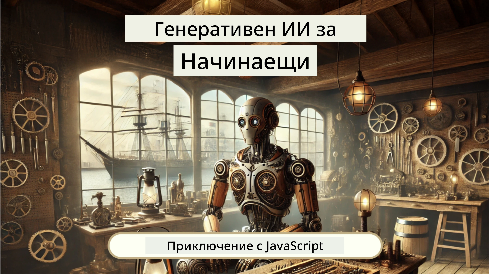
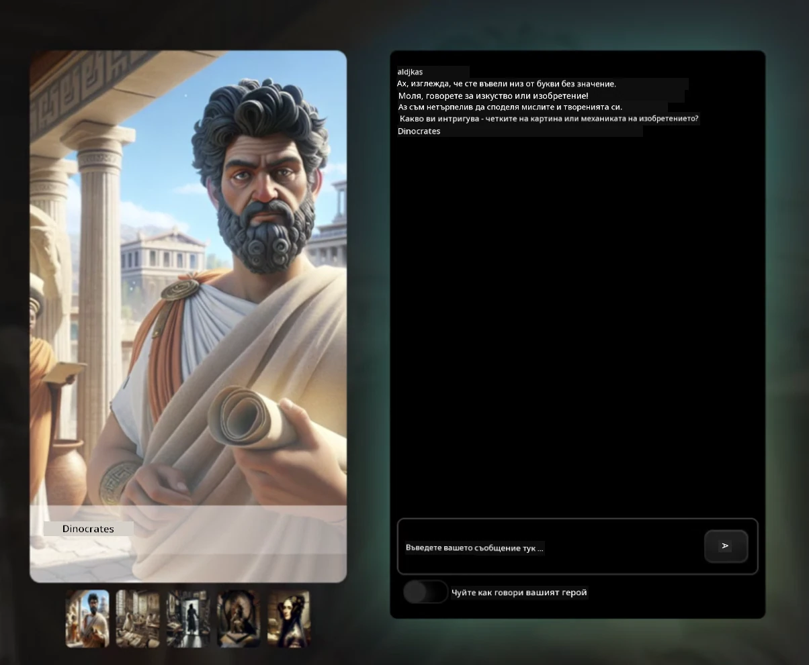
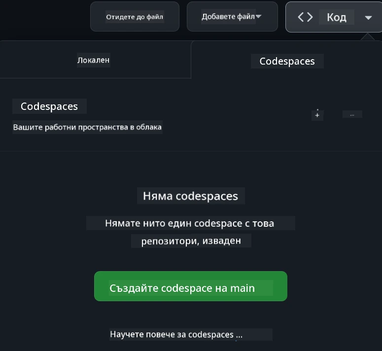

<!--
CO_OP_TRANSLATOR_METADATA:
{
  "original_hash": "fea3a0fceb8ad86fd640c09cf63a2aac",
  "translation_date": "2026-01-07T06:24:27+00:00",
  "source_file": "README.md",
  "language_code": "bg"
}
-->
# Уеб разработка за начинаещи - Учебна програма

Научете основите на уеб разработката с нашия 12-седмичен изчерпателен курс, предоставен от Microsoft Cloud Advocates. Във всеки от 24-те урока се потапяте в JavaScript, CSS и HTML чрез практическа работа по проекти като терариуми, разширения за браузъри и космически игри. Включете се с викторини, дискусии и практически задачи. Подобрете уменията си и оптимизирайте усвояването на знания с нашата ефективна проектно-базирана педагогика. Започнете своето кодиращо пътешествие още днес!

Присъединете се към Discord общността Azure AI Foundry

Следвайте тези стъпки, за да започнете да използвате тези ресурси:
1. **Създайте форк на хранилището**: Кликнете [](https://GitHub.com/microsoft/Web-Dev-For-Beginners/fork)
2. **Клонирайте хранилището**:   `git clone https://github.com/microsoft/Web-Dev-For-Beginners.git`
3. [**Присъединете се към Azure AI Foundry Discord и срещнете експерти и сътрудници-разработчици**](https://discord.com/invite/ByRwuEEgH4)

### 🌐 Многоезична поддръжка

#### Поддържа се чрез GitHub Action (автоматизирано и винаги актуално)

> **Предпочитате да клонирате локално?**

> Това хранилище включва над 50 езикови превода, което значително увеличава размера за изтегляне. За да клонирате без преводи, използвайте sparse checkout:
> ```bash
> git clone --filter=blob:none --sparse https://github.com/microsoft/Web-Dev-For-Beginners.git
> cd Web-Dev-For-Beginners
> git sparse-checkout set --no-cone '/*' '!translations' '!translated_images'
> ```
> Това ви предоставя всичко необходимо за завършване на курса с много по-бързо изтегляне.

**Ако желаете да се добавят допълнителни езици за превод, те са изброени [тук](https://github.com/Azure/co-op-translator/blob/main/getting_started/supported-languages.md)**

#### 🧑‍🎓 _Студент ли сте?_

Посетете [страницата Student Hub](https://docs.microsoft.com/learn/student-hub/?WT.mc_id=academic-77807-sagibbon), където ще намерите ресурси за начинаещи, студентски пакети и дори възможности за получаване на безплатен сертификат. Това е страницата, която трябва да добавите в отметки и да проверявате от време на време, тъй като съдържанието се променя месечно.

### 📣 Обявление - Нови предизвикателства в GitHub Copilot Agent режим за завършване!

Добавено е ново предизвикателство, търсете "GitHub Copilot Agent Challenge 🚀" в повечето глави. Това е ново предизвикателство за вас да го завършите, използвайки GitHub Copilot и режим Agent. Ако не сте използвали режима Agent досега, той е способeн не само да генерира текст, но и да създава и редактира файлове, изпълнява команди и още.

### 📣 Обявление - _Нов проект за изграждане с генеративен AI_

Току-що добавен нов проект AI Асистент, разгледайте го [тук](./9-chat-project/README.md)

### 📣 Обявление - _Нова учебна програма_ за генеративен AI за JavaScript току-що беше пусната

Не пропускайте нашата нова учебна програма за генеративен AI!

Посетете [https://aka.ms/genai-js-course](https://aka.ms/genai-js-course), за да започнете!



- Уроци, обхващащи всичко от основите до RAG.
- Взаимодействайте с исторически личности чрез GenAI и нашето придружаващо приложение.
- Забавен и завладяващ разказ, ще пътешествате във времето!



Всеки урок включва задача за изпълнение, проверка на знанията и предизвикателство, които ще ви упътят в изучаването на теми като:
- Подканяне и инженерство на подкани
- Генериране на приложения за текст и изображения
- Търсещи приложения

Посетете [https://aka.ms/genai-js-course](../../[https:/aka.ms/genai-js-course), за да започнете!


## 🌱 Започване

> **Учители**, ние сме [включили някои предложения](for-teachers.md) как да използвате тази учебна програма. Ще се радваме на вашата обратна връзка [в нашия форум за дискусии](https://github.com/microsoft/Web-Dev-For-Beginners/discussions/categories/teacher-corner)!

**[Учещи](https://aka.ms/student-page/?WT.mc_id=academic-77807-sagibbon)**, за всеки урок започнете с викторина преди лекцията и после преминете през учебния материал, завършвайки с различните активности и проверете разбирането си с викторина след лекцията.

За да подобрите учебния си опит, свържете се с колегите си за работа по проектите заедно! Насърчават се дискусии в нашия [форум за дискусии](https://github.com/microsoft/Web-Dev-For-Beginners/discussions), където нашият екип от модератори ще бъде на разположение да отговаря на вашите въпроси.

За допълнително обучение силно препоръчваме да разгледате [Microsoft Learn](https://learn.microsoft.com/users/wirelesslife/collections/p1ddcy5jwy0jkm?WT.mc_id=academic-77807-sagibbon) за допълнителни учебни материали.

### 📋 Настройка на средата

Тази учебна програма разполага с готова за използване развойна среда! Когато започвате, можете да изберете да стартирате учебната програма в [Codespace](https://github.com/features/codespaces/) (_среда базирана на браузър, без нужда от инсталации_) или локално на компютъра си с помощта на текстов редактор като [Visual Studio Code](https://code.visualstudio.com/?WT.mc_id=academic-77807-sagibbon).

#### Създайте свое хранилище
За да запазвате лесно своята работа, препоръчително е да създадете свое копие на това хранилище. Можете да го направите, като кликнете бутона **Use this template** в горната част на страницата. Това ще създаде ново хранилище във вашия GitHub акаунт с копие на учебната програма.

Следвайте тези стъпки:
1. **Създайте форк на хранилището**: Кликнете бутона "Fork" в горния десен ъгъл на тази страница.
2. **Клонирайте хранилището**:   `git clone https://github.com/microsoft/Web-Dev-For-Beginners.git`

#### Стартиране на учебната програма в Codespace

В своето копие на хранилището кликнете бутона **Code** и изберете **Open with Codespaces**. Това ще създаде нов Codespace, в който да работите.



#### Стартиране на учебната програма локално на компютъра

За да стартирате тази учебна програма локално на компютъра си, ще ви е нужен текстов редактор, браузър и инструмент за команден ред. Първият ни урок, [Въведение в програмните езици и инструментите](../../1-getting-started-lessons/1-intro-to-programming-languages), ще ви преведе през различни опции за всеки от тези инструменти, за да изберете най-подходящото за вас.

Нашата препоръка е да използвате [Visual Studio Code](https://code.visualstudio.com/?WT.mc_id=academic-77807-sagibbon) като редактор, който има и вграден [терминал](https://code.visualstudio.com/docs/terminal/basics/?WT.mc_id=academic-77807-sagibbon). Можете да свалите Visual Studio Code [тук](https://code.visualstudio.com/?WT.mc_id=academic-77807-sagibbon).

1. Клонирайте хранилището си на компютъра. Това става, като кликнете на бутона **Code** и копирате URL адреса:

    [CodeSpace](./images/createcodespace.png)
След това отворете [Terminal](https://code.visualstudio.com/docs/terminal/basics/?WT.mc_id=academic-77807-sagibbon) в [Visual Studio Code](https://code.visualstudio.com/?WT.mc_id=academic-77807-sagibbon) и изпълнете следната команда, като замените `<your-repository-url>` с URL адреса, който току-що копирахте:

    ```bash 
    git clone <your-repository-url>
    ```

2. Отворете папката във Visual Studio Code. Можете да направите това, като кликнете върху **File** > **Open Folder** и изберете папката, която току-що клонирахте.


> Препоръчани разширения за Visual Studio Code:
>
> * [Live Server](https://marketplace.visualstudio.com/items?itemName=ritwickdey.LiveServer&WT.mc_id=academic-77807-sagibbon) - за преглед на HTML страници във Visual Studio Code
> * [Copilot](https://marketplace.visualstudio.com/items?itemName=GitHub.copilot&WT.mc_id=academic-77807-sagibbon) - за по-бързо писане на код

## 📂 Всеки урок включва:

- по избор скицник
- допълнително видео по избор
- предварителен топлинен квиз преди урока
- писмен урок
- за уроци, базирани на проекти, стъпка по стъпка ръководства как да се изгради проектът
- проверки на знанията
- предизвикателство
- допълнително четиво
- задание
- [квиз след урока](https://ff-quizzes.netlify.app/web/)

> **Бележка за квизовете**: Всички квизове са в папката Quiz-app, общо 48 квиза с по три въпроса всеки. Те са достъпни [тук](https://ff-quizzes.netlify.app/web/), приложението за квизове може да се пуска локално или да се публикува в Azure; следвайте инструкциите в папката `quiz-app`.

## 🗃️ Уроци

|     |                       Име на проекта                       |                           Преподавани концепции                            | Цели на обучението                                                                                                                  |                                                         Свързан урок                                                          |         Автор          |
| :-: | :--------------------------------------------------------: | :------------------------------------------------------------------------: | ---------------------------------------------------------------------------------------------------------------------------------- | :----------------------------------------------------------------------------------------------------------------------------: | :---------------------: |
| 01  |                      Първи стъпки                         |          Въведение в програмирането и инструментите на занаята            | Изучаване на основните принципи, които стоят зад повечето програмни езици и за софтуера, който помага на професионалните разработчици да вършат работата си | [Въведение в програмните езици и инструментите на занаята](./1-getting-started-lessons/1-intro-to-programming-languages/README.md) |         Jasmine         |
| 02  |                      Първи стъпки                         |              Основи на GitHub, включително работа в екип                  | Как да използвате GitHub във вашия проект, как да си сътрудничите с други върху кодова база                                      |                            [Въведение в GitHub](./1-getting-started-lessons/2-github-basics/README.md)                             |          Floor          |
| 03  |                      Първи стъпки                         |                            Достъпност                                      | Научете основите на уеб достъпността                                                                                              |                       [Основи на достъпността](./1-getting-started-lessons/3-accessibility/README.md)                            |       Christopher       |
| 04  |                         JS Основи                          |                      Типове данни в JavaScript                             | Основите на типовете данни в JavaScript                                                                                            |                                       [Типове данни](./2-js-basics/1-data-types/README.md)                                        |         Jasmine         |
| 05  |                         JS Основи                          |                        Функции и методи                                   | Научете за функциите и методите за управление на потока логика на приложение                                                     |                              [Функции и методи](./2-js-basics/2-functions-methods/README.md)                                      | Jasmine и Christopher   |
| 06  |                         JS Основи                          |                         Вземане на решения с JS                           | Научете как да създавате условия в кода си, използвайки методи за вземане на решения                                               |                            [Вземане на решения](./2-js-basics/3-making-decisions/README.md)                                     |         Jasmine         |
| 07  |                         JS Основи                          |                            Масиви и цикли                                 | Работа с данни чрез масиви и цикли в JavaScript                                                                                     |                                [Масиви и цикли](./2-js-basics/4-arrays-loops/README.md)                                         |         Jasmine         |
| 08  |           [Terrarium](./3-terrarium/solution/README.md)           |                            HTML на практика                               | Създайте HTML за онлайн терариум, съсредоточавайки се върху изграждането на оформление                                               |                              [Въведение в HTML](./3-terrarium/1-intro-to-html/README.md)                                         |           Jen           |
| 09  |           [Terrarium](./3-terrarium/solution/README.md)           |                            CSS на практика                                | Създайте CSS за стилизиране на онлайн терариума, като се фокусирате върху основите на CSS, включително направата на адаптивна страница |                              [Въведение в CSS](./3-terrarium/2-intro-to-css/README.md)                                           |           Jen           |
| 10  |            [Terrarium](./3-terrarium/solution/README.md)            |                 JavaScript Closures, манипулиране на DOM                 | Създайте JavaScript, който да направи терариума функционален като интерфейс за плъзгане и пускане, съсредоточавайки се върху closing функции и манипулация на DOM |                  [JavaScript Closures, манипулация на DOM](./3-terrarium/3-intro-to-DOM-and-closures/README.md)                |           Jen           |
| 11  |          [Typing Game](./4-typing-game/solution/README.md)          |                          Създаване на игра за писане                      | Научете как да използвате събития на клавиатурата за управление на логиката на вашето JavaScript приложение                        |                                  [Събитийно-ориентирано програмиране](./4-typing-game/typing-game/README.md)                  |       Christopher       |
| 12  | [Green Browser Extension](./5-browser-extension/solution/README.md) |                         Работа с браузъри                                | Научете как работят браузърите, тяхната история и как да изградите първите елементи на разширение за браузър                       |                              [За браузърите](./5-browser-extension/1-about-browsers/README.md)                                |           Jen           |
| 13  | [Green Browser Extension](./5-browser-extension/solution/README.md) | Създаване на форма, извикване на API и съхраняване на променливи в локалното хранилище | Създайте JavaScript елементите на вашето браузърно разширение за извикване на API с използване на променливи, съхранявани в локалното хранилище |                [APIs, формуляри и локално хранилище](./5-browser-extension/2-forms-browsers-local-storage/README.md)           |           Jen           |
| 14  | [Green Browser Extension](./5-browser-extension/solution/README.md) |          Фонови процеси в браузъра, уеб производителност                  | Използвайте фоновите процеси в браузъра, за да управлявате иконата на разширението; научете за уеб производителност и някои оптимизации |             [Фонови задачи и производителност](./5-browser-extension/3-background-tasks-and-performance/README.md)            |           Jen           |
| 15  |           [Space Game](./6-space-game/solution/README.md)           |           По-напреднало разработване на игри с JavaScript                | Научете за наследяването чрез класове и композиция и патърна Pub/Sub, като подготовка за създаване на игра                        |                      [Въведение в напреднала разработка на игри](./6-space-game/1-introduction/README.md)                      |          Chris          |
| 16  |           [Space Game](./6-space-game/solution/README.md)           |                          Рисуване върху канвас                            | Научете за API-то на Canvas, използвано за рисуване на елементи на екрана                                                           |                                  [Рисуване върху Canvas](./6-space-game/2-drawing-to-canvas/README.md)                       |          Chris          |
| 17  |           [Space Game](./6-space-game/solution/README.md)           |                     Преместване на елементи на екрана                     | Разберете как елементите могат да придобият движение, използвайки картезиеви координати и Canvas API                               |                          [Преместване на елементи](./6-space-game/3-moving-elements-around/README.md)                         |          Chris          |
| 18  |           [Space Game](./6-space-game/solution/README.md)           |                       Откриване на сблъсъци                              | Направете елементите да се сблъскват и реагират един на друг с помощта на натискания на клавиши и осигурете cooldown функция за осигуряване на производителността на играта |                             [Откриване на сблъсъци](./6-space-game/4-collision-detection/README.md)                             |          Chris          |
| 19  |           [Space Game](./6-space-game/solution/README.md)           |                           Водене на резултат                              | Извършвайте математически изчисления въз основа на статуса и представянето на играта                                                |                                   [Водене на резултат](./6-space-game/5-keeping-score/README.md)                               |          Chris          |
| 20  |           [Space Game](./6-space-game/solution/README.md)           |                        Край и рестарт на играта                           | Научете как да приключите и рестартирате играта, включително изчистване на ресурси и нулиране на стойностите на променливи          |                                [Условие за край](./6-space-game/6-end-condition/README.md)                                     |          Chris          |
| 21  |         [Banking App](./7-bank-project/solution/README.md)          |                   HTML шаблони и маршрути в уеб приложение                 | Научете как да създадете структурата на многостраничен уебсайт с използване на маршрутизация и HTML шаблони                      |                             [HTML шаблони и маршрути](./7-bank-project/1-template-route/README.md)                              |          Yohan          |
| 22  |         [Banking App](./7-bank-project/solution/README.md)          |                     Създаване на форма за влизане и регистрация           | Научете как да създавате форми и да обработвате валидиращи процедури                                                              |                                            [Форми](./7-bank-project/2-forms/README.md)                                       |          Yohan          |
| 23  |         [Banking App](./7-bank-project/solution/README.md)          |                   Методи за извличане и използване на данни              | Как данните влизат и излизат от вашето приложение, как да ги извличате, съхранявате и изтривате                                     |                                            [Данни](./7-bank-project/3-data/README.md)                                       |          Yohan          |
| 24  |         [Banking App](./7-bank-project/solution/README.md)          |                      Концепции за управление на състоянието               | Научете как вашето приложение задържа състояние и как да го управлявате програмно                                                 |                                   [Управление на състоянието](./7-bank-project/4-state-management/README.md)                    |          Yohan          |
| 25 | [Browser/VScode Code](../../8-code-editor) | Работа с VScode | Научете как да използвате редактор на код | [Използване на VScode Code Editor](./8-code-editor/1-using-a-code-editor/README.md) | Chris |
| 26 | [AI Assistants](./9-chat-project/README.md) | Работа с AI | Научете как да изградите собствен AI асистент | [Проект AI асистент](./9-chat-project/README.md) | Chris |

## 🏫 Педагогика

Нашата учебна програма е създадена с две ключови педагогически принципи:
* обучение, базирано на проекти
* чести квизове

Програмата учи основите на JavaScript, HTML и CSS, както и последните инструменти и техники, използвани от уеб разработчиците днес. Студентите ще имат възможност да придобият практически опит, като изграждат игра за писане, виртуален терариум, екологично разширение за браузър, игра в стил space-invaders и банково приложение за бизнеси. В края на поредицата студентите ще притежават солидно разбиране на уеб разработката.

> 🎓 Можете да преминете първите няколко урока от тази учебна програма като [Learn Path](https://docs.microsoft.com/learn/paths/web-development-101/?WT.mc_id=academic-77807-sagibbon) в Microsoft Learn!

Като осигуряваме съдържанието да е свързано с проекти, процесът става по-ангажиращ за студентите и задържането на концепциите се увеличава. Също така написахме няколко стартови урока по основите на JavaScript, за да въведем концепции, съчетани с видео от колекцията "[Набор за начинаещи към: JavaScript](https://channel9.msdn.com/Series/Beginners-Series-to-JavaScript/?WT.mc_id=academic-77807-sagibbon)", чиито някои автори допринесоха за тази учебна програма.

Освен това, нискорисков квиз преди час задава нагласата на студента към изучаването на тема, докато втори квиз след часа осигурява допълнително задържане. Тази учебна програма е създадена да бъде гъвкава и забавна и може да се преминава изцяло или частично. Проектите започват малки и стават все по-сложни към края на 12-седмичния цикъл.

Въпреки че целенасочено избягваме въвеждането на JavaScript рамки, за да се съсредоточим върху основните умения, необходими за уеб разработчик, преди да приемем рамка, добър следващ ход за завършване на тази учебна програма е изучаването на Node.js чрез друга колекция видеа: "[Набор за начинаещи към: Node.js](https://channel9.msdn.com/Series/Beginners-Series-to-Nodejs/?WT.mc_id=academic-77807-sagibbon)".

> Посетете нашия [Етичен кодекс](CODE_OF_CONDUCT.md) и насоките за [сътрудничество](CONTRIBUTING.md). Ние приветстваме вашата конструктивна обратна връзка!

## 🧭 Достъп офлайн

Можете да използвате тази документация офлайн чрез [Docsify](https://docsify.js.org/#/). Форкнете това хранилище, [инсталирайте Docsify](https://docsify.js.org/#/quickstart) на локалния си компютър и след това в кореновата папка на това хранилище изпишете `docsify serve`. Уебсайтът ще бъде достъпен на порт 3000 на вашия локален хост: `localhost:3000`.

## 📘 PDF

PDF с всички уроци може да бъде намерен [тук](https://microsoft.github.io/Web-Dev-For-Beginners/pdf/readme.pdf).


## 🎒 Други курсове
Нашият екип произвежда и други курсове! Разгледайте:

<!-- CO-OP TRANSLATOR OTHER COURSES START -->
### LangChain
[](https://aka.ms/langchain4j-for-beginners)
[](https://aka.ms/langchainjs-for-beginners?WT.mc_id=m365-94501-dwahlin)

---

### Azure / Edge / MCP / Агенти
[](https://github.com/microsoft/AZD-for-beginners?WT.mc_id=academic-105485-koreyst)
[](https://github.com/microsoft/edgeai-for-beginners?WT.mc_id=academic-105485-koreyst)
[](https://github.com/microsoft/mcp-for-beginners?WT.mc_id=academic-105485-koreyst)
[](https://github.com/microsoft/ai-agents-for-beginners?WT.mc_id=academic-105485-koreyst)

---
 
### Серия за Генеративен AI
[](https://github.com/microsoft/generative-ai-for-beginners?WT.mc_id=academic-105485-koreyst)
[-9333EA?style=for-the-badge&labelColor=E5E7EB&color=9333EA)](https://github.com/microsoft/Generative-AI-for-beginners-dotnet?WT.mc_id=academic-105485-koreyst)
[-C084FC?style=for-the-badge&labelColor=E5E7EB&color=C084FC)](https://github.com/microsoft/generative-ai-for-beginners-java?WT.mc_id=academic-105485-koreyst)
[-E879F9?style=for-the-badge&labelColor=E5E7EB&color=E879F9)](https://github.com/microsoft/generative-ai-with-javascript?WT.mc_id=academic-105485-koreyst)

---
 
### Основно обучение
[](https://aka.ms/ml-beginners?WT.mc_id=academic-105485-koreyst)
[](https://aka.ms/datascience-beginners?WT.mc_id=academic-105485-koreyst)
[](https://aka.ms/ai-beginners?WT.mc_id=academic-105485-koreyst)
[](https://github.com/microsoft/Security-101?WT.mc_id=academic-96948-sayoung)
[](https://aka.ms/webdev-beginners?WT.mc_id=academic-105485-koreyst)
[](https://aka.ms/iot-beginners?WT.mc_id=academic-105485-koreyst)
[](https://github.com/microsoft/xr-development-for-beginners?WT.mc_id=academic-105485-koreyst)

---
 
### Серия Copilot
[](https://aka.ms/GitHubCopilotAI?WT.mc_id=academic-105485-koreyst)
[](https://github.com/microsoft/mastering-github-copilot-for-dotnet-csharp-developers?WT.mc_id=academic-105485-koreyst)
[](https://github.com/microsoft/CopilotAdventures?WT.mc_id=academic-105485-koreyst)
<!-- CO-OP TRANSLATOR OTHER COURSES END -->

## Получаване на помощ

Ако се затруднявате или имате въпроси относно създаването на AI приложения. Присъединете се към други ученици и опитни разработчици в дискусии за MCP. Това е подкрепяща общност, където въпросите са добре дошли и знанията се споделят свободно.

[](https://discord.gg/nTYy5BXMWG)

Ако имате отзиви за продукта или срещнете грешки по време на разработка посетете:

[](https://aka.ms/foundry/forum)

## Лиценз

Това хранилище е лицензирано под лиценза MIT. Вижте файла [LICENSE](../../LICENSE) за повече информация.

---

<!-- CO-OP TRANSLATOR DISCLAIMER START -->
**Отказ от отговорност**:
Този документ е преведен с помощта на AI преводаческа услуга [Co-op Translator](https://github.com/Azure/co-op-translator). Въпреки че се стремим към точност, моля, имайте предвид, че автоматизираните преводи могат да съдържат грешки или неточности. Оригиналният документ на неговия език трябва да се счита за официален източник. За критична информация се препоръчва професионален човек преводач. Ние не носим отговорност за никакви недоразумения или погрешни тълкувания, произтичащи от използването на този превод.
<!-- CO-OP TRANSLATOR DISCLAIMER END -->