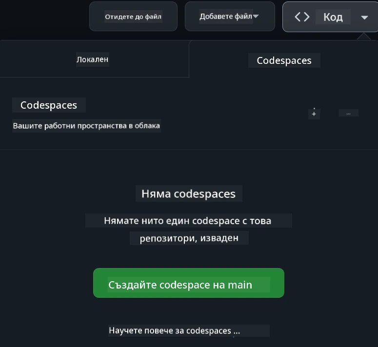

# Уеб разработка за начинаещи - учебна програма

Научете основите на уеб разработката с нашия 12-седмичен всеобхватен курс от Microsoft Cloud Advocates. Всеки от 24-те урока разглежда JavaScript, CSS и HTML чрез практически проекти като терариуми, разширения за браузър и космически игри. Включете се с викторини, дискусии и практически задачи. Подобрете уменията си и оптимизирайте усвояването на знания с нашата ефективна педагогика, базирана на проекти. Започнете своето пътешествие в кодирането още днес!

Присъединете се към общността Azure AI Foundry в Discord

Следвайте тези стъпки, за да започнете да използвате тези ресурси:
1. **Форкнете хранилището**: Кликнете [](https://GitHub.com/microsoft/Web-Dev-For-Beginners/fork)
2. **Клонирайте хранилището**:   `git clone https://github.com/microsoft/Web-Dev-For-Beginners.git`
3. [**Присъединете се към Azure AI Foundry Discord и срещнете експерти и други разработчици**](https://discord.com/invite/ByRwuEEgH4)

### 🌐 Поддръжка на множество езици

#### Поддържа се чрез GitHub Action (автоматизирано и винаги актуално)

> **Предпочитате да клонирате локално?**
>
> Това хранилище включва над 50 езикови превода, което значително увеличава размера на изтегляне. За да клонирате без преводите, използвайте sparse checkout:
>
> **Bash / macOS / Linux:**
> ```bash
> git clone --filter=blob:none --sparse https://github.com/microsoft/Web-Dev-For-Beginners.git
> cd Web-Dev-For-Beginners
> git sparse-checkout set --no-cone '/*' '!translations' '!translated_images'
> ```
>
> **CMD (Windows):**
> ```cmd
> git clone --filter=blob:none --sparse https://github.com/microsoft/Web-Dev-For-Beginners.git
> cd Web-Dev-For-Beginners
> git sparse-checkout set --no-cone "/*" "!translations" "!translated_images"
> ```
>
> Това ви осигурява всичко необходимо за завършване на курса с много по-бързо изтегляне.

**Ако желаете поддръжка на допълнителни езици за превод, те са посочени [тук](https://github.com/Azure/co-op-translator/blob/main/getting_started/supported-languages.md)**

#### 🧑‍🎓 _Студент ли сте?_

Посетете [**страницата Студентски център**](https://docs.microsoft.com/learn/student-hub/?WT.mc_id=academic-77807-sagibbon), където ще намерите източници за начинаещи, студентски пакети и дори възможности за получаване на безплатен ваучер за сертификат. Това е страницата, която си струва да запазите и проверявате периодично, тъй като съдържанието се обновява месечно.

### 📣 Обява - Нови предизвикателства в GitHub Copilot Agent режим!

Добавено е ново предизвикателство, потърсете "GitHub Copilot Agent Challenge 🚀" в повечето глави. Това е ново предизвикателство, което да завършите, използвайки GitHub Copilot и Agent режим. Ако не сте използвали досега Agent режим, той може не само да генерира текст, но и да създава и редактира файлове, да изпълнява команди и още.

### 📣 Обява - _Нов проект за разработка с използване на генеративен AI_ 

Току-що добавен нов проект AI Асистент, разгледайте го [тук](./9-chat-project/README.md)

### 📣 Обява - _Нова учебна програма_ за генеративен AI за JavaScript току-що излезе

Не пропускайте новия ни курс за генеративен AI!

Посетете [https://aka.ms/genai-js-course](https://aka.ms/genai-js-course), за да започнете!

- Уроци, обхващащи всичко от основите до RAG.
- Взаимодействайте с исторически персонажи чрез GenAI и нашето спомагателно приложение.
- Забавен и ангажиращ разказ, пътуване във времето!

Във всеки урок има задача за изпълнение, проверка на знанията и предизвикателство, които ви насочват към изучаване на теми като:
- Създаване на команди и инженерство на подкани
- Генериране на текст и изображения за приложения
- Приложения за търсене

Посетете [https://aka.ms/genai-js-course](https://aka.ms/genai-js-course), за да започнете!


## 🌱 Как да започнете

> **Учители**, включили сме някои предложения [тук](for-teachers.md) за използване на тази учебна програма. Ще се радваме на обратна връзка [в нашия форум за обсъждания](https://github.com/microsoft/Web-Dev-For-Beginners/discussions/categories/teacher-corner)!

**[Обучаващи се](https://aka.ms/student-page/?WT.mc_id=academic-77807-sagibbon)**, за всеки урок започнете с тест преди лекцията и продължете с четене на учебния материал, изпълнение на различни дейности и проверете разбирането си чрез тест след лекцията.

За по-добро изживяване в ученето, свържете се с вашите връстници за съвместна работа по проектите! Обсъжданията са насърчавани в нашия [форум за обсъждания](https://github.com/microsoft/Web-Dev-For-Beginners/discussions), където нашият екип от модератори е на разположение да отговори на вашите въпроси.

За да задълбочите обучението си, силно препоръчваме да изследвате [Microsoft Learn](https://learn.microsoft.com/users/wirelesslife/collections/p1ddcy5jwy0jkm?WT.mc_id=academic-77807-sagibbon) за допълнителни учебни материали.

### 📋 Настройване на вашата среда

Тази учебна програма включва готова развойна среда! Когато започвате можете да изберете да използвате курса в [Codespace](https://github.com/features/codespaces/) (_браузър-базирана среда без нужда от инсталации_), или локално на компютъра си с текстов редактор, като например [Visual Studio Code](https://code.visualstudio.com/?WT.mc_id=academic-77807-sagibbon).

#### Създайте свое хранилище
За да запазвате лесно работата си, е препоръчително да създадете собствено копие на това хранилище. Можете да го направите, като кликнете на бутона **Use this template** в горната част на страницата. Това ще създаде ново хранилище в профила ви в GitHub с копие на учебната програма.

Следвайте тези стъпки:
1. **Форкнете хранилището**: Кликнете бутона "Fork" в горния десен ъгъл на тази страница.
2. **Клонирайте хранилището**:   `git clone https://github.com/microsoft/Web-Dev-For-Beginners.git`

#### Използване на учебната програма в Codespace

В създаденото от вас копие на хранилището, кликнете бутона **Code** и изберете **Open with Codespaces**. Това ще създаде нов Codespace, в който можете да работите.



#### Използване на учебната програма локално на вашия компютър

За да стартирате учебната програма локално, ще ви трябва текстов редактор, браузър и команден терминал. Нашият първи урок, [Въведение в програмните езици и инструментите](../../1-getting-started-lessons/1-intro-to-programming-languages), ще ви преведе през различни опции за всеки от тези инструменти, за да изберете най-подходящите за вас.

Нашата препоръка е да използвате [Visual Studio Code](https://code.visualstudio.com/?WT.mc_id=academic-77807-sagibbon) като редактор, който включва и интегриран [Терминал](https://code.visualstudio.com/docs/terminal/basics/?WT.mc_id=academic-77807-sagibbon). Можете да изтеглите Visual Studio Code [тук](https://code.visualstudio.com/?WT.mc_id=academic-77807-sagibbon).
1. Клонирайте хранилището си на компютъра. Можете да го направите като кликнете върху бутона **Code** и копирате URL адреса:

    [CodeSpace](./images/createcodespace.png)

    След това отворете [Terminal](https://code.visualstudio.com/docs/terminal/basics/?WT.mc_id=academic-77807-sagibbon) в [Visual Studio Code](https://code.visualstudio.com/?WT.mc_id=academic-77807-sagibbon) и изпълнете следната команда, като замените `<your-repository-url>` с току-що копирания URL адрес:

    ```bash 
    git clone <your-repository-url>
    ```

2. Отворете папката във Visual Studio Code. Можете да го направите като кликнете върху **File** > **Open Folder** и изберете папката, която току-що клонирахте.


>  Препоръчителни разширения за Visual Studio Code:
>
> * [Live Server](https://marketplace.visualstudio.com/items?itemName=ritwickdey.LiveServer&WT.mc_id=academic-77807-sagibbon) - за преглед на HTML страници в Visual Studio Code
> * [Copilot](https://marketplace.visualstudio.com/items?itemName=GitHub.copilot&WT.mc_id=academic-77807-sagibbon) - за бързо писане на код

## 📂 Всяко занятие включва:

- по избор скица
- по избор допълнително видео
- въпросник за загряване преди занятието
- писмен урок
- за занятия на база проект, стъпка по стъпка инструкции за изграждане на проекта
- проверки на знанията
- предизвикателство
- допълнително четиво
- задача
- [въпросник след занятието](https://ff-quizzes.netlify.app/web/)

> **Бележка за въпросниците**: Всички въпросници са в папката Quiz-app, общо 48 с по три въпроса. Те са достъпни [тук](https://ff-quizzes.netlify.app/web/), приложението за въпросниците може да се изпълни локално или да се публикува в Azure; следвайте инструкциите в папката `quiz-app`.

## 🗃️ Занятия

|     |                       Име на проекта                       |                            Преподавани концепции                             | Учебни цели                                                                                                                 |                                                         Свързан урок                                                          |         Автор          |
| :-: | :--------------------------------------------------------: | :--------------------------------------------------------------------------: | ---------------------------------------------------------------------------------------------------------------------------- | :----------------------------------------------------------------------------------------------------------------------------: | :---------------------: |
| 01  |                     Започване                              |           Въведение в програмирането и инструментите на професията           | Научете основите на повечето програмни езици и софтуер, който помага на професионалните разработчици да вършат работата си | [Въведение в програмните езици и инструментите](./1-getting-started-lessons/1-intro-to-programming-languages/README.md)       |         Jasmine         |
| 02  |                     Започване                              |             Основи на GitHub, включително работа в екип                     | Как да използвате GitHub в своя проект, как да сътрудничите по код                                                          |                            [Въведение в GitHub](./1-getting-started-lessons/2-github-basics/README.md)                             |          Floor          |
| 03  |                     Започване                              |                             Достъпност                                      | Научете основите на уеб достъпността                                                                                          |                       [Основи на достъпността](./1-getting-started-lessons/3-accessibility/README.md)                            |       Christopher       |
| 04  |                        Основи на JS                        |                         Типове данни в JavaScript                          | Основи на типовете данни в JavaScript                                                                                         |                                       [Типове данни](./2-js-basics/1-data-types/README.md)                                        |         Jasmine         |
| 05  |                        Основи на JS                        |                         Функции и методи                                  | Научете за функциите и методите за управление на логиката на приложението                                                   |                              [Функции и методи](./2-js-basics/2-functions-methods/README.md)                                     | Jasmine и Christopher   |
| 06  |                        Основи на JS                        |                        Вземане на решения с JS                            | Научете как да създавате условия във вашия код с методи за вземане на решения                                                |                                 [Вземане на решения](./2-js-basics/3-making-decisions/README.md)                                |         Jasmine         |
| 07  |                        Основи на JS                        |                            Масиви и цикли                                | Работа с данни чрез масиви и цикли в JavaScript                                                                              |                                   [Масиви и цикли](./2-js-basics/4-arrays-loops/README.md)                                   |         Jasmine         |
| 08  |       [Терариум](./3-terrarium/solution/README.md)         |                            Практическо HTML                               | Създайте HTML за онлайн терариум, съсредоточавайки се върху изграждането на оформлението                                     |                                 [Въведение в HTML](./3-terrarium/1-intro-to-html/README.md)                                    |           Jen           |
| 09  |       [Терариум](./3-terrarium/solution/README.md)         |                            Практическо CSS                                | Създайте CSS за стилизиране на онлайн терариума, фокусирайки се върху основите на CSS, включително правене на страницата отзивчива |                                  [Въведение в CSS](./3-terrarium/2-intro-to-css/README.md)                                    |           Jen           |
| 10  |            [Терариум](./3-terrarium/solution/README.md)               |         JavaScript Closures, манипулация на DOM                            | Създайте JavaScript, за да направите терариума с интерфейс за влачене и пускане, съсредоточени върху closures и манипулация на DOM     |                  [JavaScript Closures, манипулация на DOM](./3-terrarium/3-intro-to-DOM-and-closures/README.md)               |           Jen           |
| 11  |          [Игра за писане](./4-typing-game/solution/README.md)          |                           Създаване на игра за писане                     | Научете как да използвате клавиатурни събития за управление на логиката в JavaScript приложението ви                         |                                [Програмиране, базирано на събития](./4-typing-game/typing-game/README.md)                      |       Christopher       |
| 12  | [Разширение за браузър](./5-browser-extension/solution/README.md)     |                         Работа с браузъри                                | Научете как работят браузърите, тяхната история и как да създадете първите елементи на разширение за браузър                   |                               [Относно браузърите](./5-browser-extension/1-about-browsers/README.md)                            |           Jen           |
| 13  | [Разширение за браузър](./5-browser-extension/solution/README.md)     | Изграждане на форма, извикване на API и съхраняване на променливи локално  | Създайте JavaScript елементи на разширението си за браузър, за да извиквате API с променливи, съхранени локално                |                [APIs, Форми и Локално съхранение](./5-browser-extension/2-forms-browsers-local-storage/README.md)               |           Jen           |
| 14  | [Разширение за браузър](./5-browser-extension/solution/README.md)     |          Фонови процеси в браузъра, уеб производителност                | Използвайте фоновите процеси на браузъра за управление на иконата на разширението; научете за уеб производителността и оптимизации |               [Фонови задачи и производителност](./5-browser-extension/3-background-tasks-and-performance/README.md)            |           Jen           |
| 15  |           [Космическа игра](./6-space-game/solution/README.md)         |             По-напреднало игрово развитие с JavaScript                   | Научете за наследяване с класове и композиция и за дизайна Pub/Sub, в подготовка за изграждане на игра                         |                      [Въведение в напреднало игрово развитие](./6-space-game/1-introduction/README.md)                         |          Chris          |
| 16  |           [Космическа игра](./6-space-game/solution/README.md)         |                           Рисуване върху канвас                           | Научете за Canvas API, използван за рисуване на елементи на екрана                                                            |                                [Рисуване върху Canvas](./6-space-game/2-drawing-to-canvas/README.md)                           |          Chris          |
| 17  |           [Космическа игра](./6-space-game/solution/README.md)         |                   Преместване на елементи по екрана                       | Открийте как елементите придобиват движение чрез декартови координати и Canvas API                                              |                           [Преместване на елементи](./6-space-game/3-moving-elements-around/README.md)                          |          Chris          |
| 18  |           [Космическа игра](./6-space-game/solution/README.md)         |                          Откриване на сблъсъци                           | Направете елементите да се сблъскват и реагират един на друг чрез натискане на клавиши и предоставете cooldown функция         |                              [Откриване на сблъсъци](./6-space-game/4-collision-detection/README.md)                           |          Chris          |
| 19  |           [Космическа игра](./6-space-game/solution/README.md)         |                             Отчитане на резултата                         | Извършвайте математически изчисления въз основа на състоянието и изпълнението на играта                                         |                                    [Отчитане на резултата](./6-space-game/5-keeping-score/README.md)                             |          Chris          |
| 20  |           [Космическа игра](./6-space-game/solution/README.md)         |                   Приключване и рестартиране на играта                   | Научете за приключването и рестартирането на играта, включително почистване на ресурси и нулиране на променливи                 |                                [Условия за приключване](./6-space-game/6-end-condition/README.md)                                |          Chris          |
| 21  |         [Банково приложение](./7-bank-project/solution/README.md)      |                 HTML шаблони и маршрути в уеб приложение                 | Научете как да създавате структурата на многостраничен уебсайт чрез маршрутизация и HTML шаблони                               |                            [HTML шаблони и маршрути](./7-bank-project/1-template-route/README.md)                               |          Yohan          |
| 22  |         [Банково приложение](./7-bank-project/solution/README.md)      |                  Създаване на форма за влизане и регистрация             | Научете за създаване на формуляри и обработка на валидиращи процедури                                                          |                                           [Формуляри](./7-bank-project/2-forms/README.md)                                    |          Yohan          |
| 23  |         [Банково приложение](./7-bank-project/solution/README.md)      |                   Методи за извличане и използване на данни              | Как данните влизат и излизат от приложението ви, как да ги извличате, съхранявате и изхвърляте                                  |                                            [Данни](./7-bank-project/3-data/README.md)                                        |          Yohan          |
| 24  |         [Банково приложение](./7-bank-project/solution/README.md)      |                       Концепции за управление на състоянието             | Научете как приложението ви задържа състояние и как да го управлявате програмно                                                |                                [Управление на състоянието](./7-bank-project/4-state-management/README.md)                       |          Yohan          |
| 25 | [Код за браузър/VSCode](../../8-code-editor) | Работа с VScode | Научете как да използвате редактор на код | [Използване на редактор код в VScode](./8-code-editor/1-using-a-code-editor/README.md) | Chris |
| 26 | [AI асистенти](./9-chat-project/README.md) | Работа с AI | Научете как да изградите собствен AI асистент | [Проект AI асистент](./9-chat-project/README.md) | Chris |

## 🏫 Педагогика

Нашата учебна програма е създадена с два ключови педагогически принципа на ум:
* обучение, базирано на проекти
* чести тестове

Програмата учи основите на JavaScript, HTML и CSS, както и най-новите инструменти и техники, използвани от съвременните уеб разработчици. Студентите ще имат възможност да развият практически умения, като изградят игра за писане, виртуален терариум, екологичен браузър разширение, космическа инвазивна игра и банково приложение за бизнеси. В края на серията студентите ще имат солидно разбиране за уеб разработка.

> 🎓 Можете да вземете първите няколко урока от тази програма като [Учебен път](https://docs.microsoft.com/learn/paths/web-development-101/?WT.mc_id=academic-77807-sagibbon) в Microsoft Learn!

Чрез осигуряване на съдържание, свързано с проекти, процесът става по-ангажиращ за студентите и запомнянето на концепциите се увеличава. Ние също така написахме няколко начални урока по основите на JavaScript за въведение на концепциите, с видео от колекцията "[Начинаещи по JavaScript](https://channel9.msdn.com/Series/Beginners-Series-to-JavaScript/?WT.mc_id=academic-77807-sagibbon)", част от чийто автори допринесоха за тази учебна програма.

Освен това, тест с ниска трудност преди занятието насочва вниманието на студента към изучаване на темата, докато втори тест след занятието гарантира по-добро усвояване. Тази учебна програма е проектирана да бъде гъвкава и забавна и може да се следва изцяло или частично. Проектите започват малки и стават все по-сложни до края на 12-седмичния цикъл.

Въпреки, че умишлено избегнахме въвеждането на JavaScript рамки, за да се концентрираме върху основните умения, нужни на един уеб разработчик преди преминаването към рамка, добър следващ ход след завършване на тази учебна програма би бил да научите за Node.js чрез друга колекция от видеа: "[Начинаещи по Node.js](https://channel9.msdn.com/Series/Beginners-Series-to-Nodejs/?WT.mc_id=academic-77807-sagibbon)".

> Посетете нашите указания за [Етичен кодекс](CODE_OF_CONDUCT.md) и [Принос](CONTRIBUTING.md). Очакваме вашите конструктивни отзиви!


## 🧭 Достъп офлайн

Можете да използвате тази документация офлайн с помощта на [Docsify](https://docsify.js.org/#/). Форкнете това хранилище, [инсталирайте Docsify](https://docsify.js.org/#/quickstart) на локалната си машина и след това в главната папка на това хранилище напишете `docsify serve`. Уебсайтът ще се обслужва на порт 3000 на вашия localhost: `localhost:3000`.

## 📘 PDF
PDF с всички уроци може да се намери [тук](https://microsoft.github.io/Web-Dev-For-Beginners/pdf/readme.pdf).


## 🎒 Други Курсове

Нашият екип произвежда и други курсове! Разгледайте:

<!-- CO-OP TRANSLATOR OTHER COURSES START -->
### LangChain
[](https://aka.ms/langchain4j-for-beginners)
[](https://aka.ms/langchainjs-for-beginners?WT.mc_id=m365-94501-dwahlin)
[](https://github.com/microsoft/langchain-for-beginners?WT.mc_id=m365-94501-dwahlin)
---

### Azure / Edge / MCP / Агенти
[](https://github.com/microsoft/AZD-for-beginners?WT.mc_id=academic-105485-koreyst)
[](https://github.com/microsoft/edgeai-for-beginners?WT.mc_id=academic-105485-koreyst)
[](https://github.com/microsoft/mcp-for-beginners?WT.mc_id=academic-105485-koreyst)
[](https://github.com/microsoft/ai-agents-for-beginners?WT.mc_id=academic-105485-koreyst)

---
 
### Серия за Генеративен AI
[](https://github.com/microsoft/generative-ai-for-beginners?WT.mc_id=academic-105485-koreyst)
[-9333EA?style=for-the-badge&labelColor=E5E7EB&color=9333EA)](https://github.com/microsoft/Generative-AI-for-beginners-dotnet?WT.mc_id=academic-105485-koreyst)
[-C084FC?style=for-the-badge&labelColor=E5E7EB&color=C084FC)](https://github.com/microsoft/generative-ai-for-beginners-java?WT.mc_id=academic-105485-koreyst)
[-E879F9?style=for-the-badge&labelColor=E5E7EB&color=E879F9)](https://github.com/microsoft/generative-ai-with-javascript?WT.mc_id=academic-105485-koreyst)

---
 
### Основно Обучение
[](https://aka.ms/ml-beginners?WT.mc_id=academic-105485-koreyst)
[](https://aka.ms/datascience-beginners?WT.mc_id=academic-105485-koreyst)
[](https://aka.ms/ai-beginners?WT.mc_id=academic-105485-koreyst)
[](https://github.com/microsoft/Security-101?WT.mc_id=academic-96948-sayoung)
[](https://aka.ms/webdev-beginners?WT.mc_id=academic-105485-koreyst)
[](https://aka.ms/iot-beginners?WT.mc_id=academic-105485-koreyst)
[](https://github.com/microsoft/xr-development-for-beginners?WT.mc_id=academic-105485-koreyst)

---
 
### Серия Copilot
[](https://aka.ms/GitHubCopilotAI?WT.mc_id=academic-105485-koreyst)
[](https://github.com/microsoft/mastering-github-copilot-for-dotnet-csharp-developers?WT.mc_id=academic-105485-koreyst)
[](https://github.com/microsoft/CopilotAdventures?WT.mc_id=academic-105485-koreyst)
<!-- CO-OP TRANSLATOR OTHER COURSES END -->

## Как да получите помощ

Ако се затрудните или имате въпроси относно изграждането на AI приложения, присъединете се към други учащи и опитни разработчици в дискусии за MCP. Това е подкрепяща общност, където въпросите са добре дошли и знанието се споделя свободно.

[](https://discord.gg/nTYy5BXMWG)

Ако имате обратна връзка за продукта или срещнете грешки по време на разработка, посетете:

[](https://aka.ms/foundry/forum)

## Лиценз

Този репозиторий е лицензиран под лиценза MIT. Вижте файла [LICENSE](../../LICENSE) за повече информация.

---

<!-- CO-OP TRANSLATOR DISCLAIMER START -->
**Отказ от отговорност**:  
Този документ е преведен с помощта на AI преводаческа услуга [Co-op Translator](https://github.com/Azure/co-op-translator). Въпреки че се стремим към точност, моля, имайте предвид, че автоматичните преводи могат да съдържат грешки или неточности. Оригиналният документ на неговия роден език трябва да се счита за авторитетен източник. За критична информация се препоръчва професионален човешки превод. Не носим отговорност за каквито и да е недоразумения или неправилни тълкувания, произтичащи от използването на този превод.
<!-- CO-OP TRANSLATOR DISCLAIMER END -->