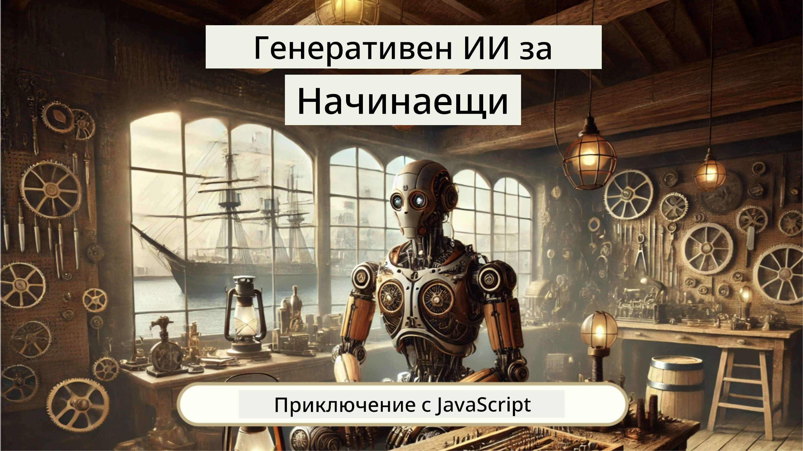
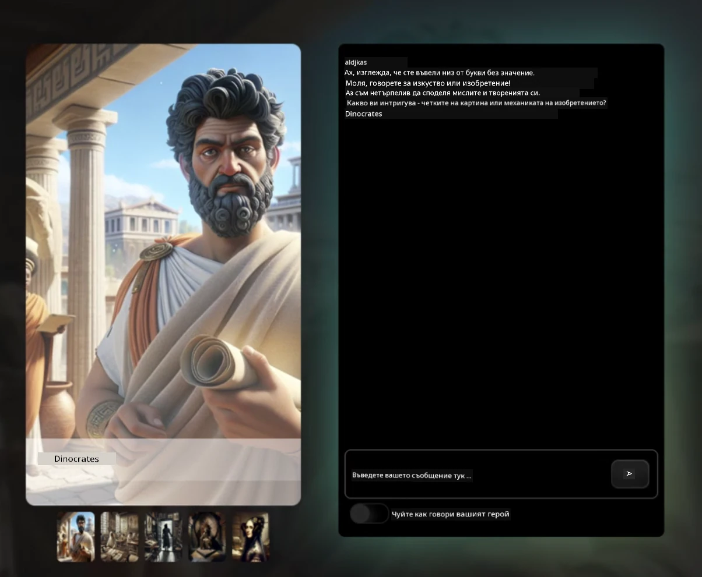
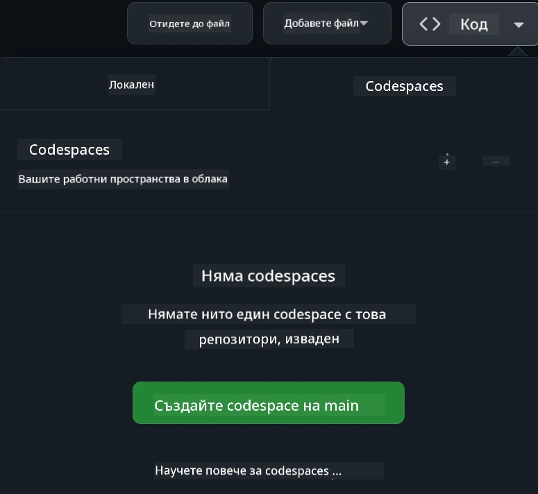

[](https://github.com/microsoft/Web-Dev-For-Beginners/blob/master/LICENSE)
[](https://GitHub.com/microsoft/Web-Dev-For-Beginners/graphs/contributors/)
[](https://GitHub.com/microsoft/Web-Dev-For-Beginners/issues/)
[](https://GitHub.com/microsoft/Web-Dev-For-Beginners/pulls/)
[](http://makeapullrequest.com) 

[](https://GitHub.com/microsoft/Web-Dev-For-Beginners/watchers/)
[](https://GitHub.com/microsoft/Web-Dev-For-Beginners/network/)
[](https://GitHub.com/microsoft/Web-Dev-For-Beginners/stargazers/)

[](https://discord.gg/nTYy5BXMWG)

# Уеб разработка за начинаещи - Учебна програма

Научете основите на уеб разработката с нашия 12-седмичен обстоен курс от Microsoft Cloud Advocates. Във всеки от 24-те урока ще навлезете в JavaScript, CSS и HTML чрез практически проекти като терариуми, разширения за браузъри и космически игри. Включете се в тестове, дискусии и практически задачи. Развийте уменията си и оптимизирайте усвояването на знания с ефективна педагогика, базирана на проекти. Започнете своето програмиране още днес!

Присъединете се към Azure AI Foundry Discord и се срещнете с експерти и други разработчици.

[](https://discord.gg/nTYy5BXMWG)

Следвайте тези стъпки, за да започнете да използвате тези ресурси:
1. **Направете Fork на репозитория**: Кликнете [](https://GitHub.com/microsoft/Web-Dev-For-Beginners/fork)
2. **Клонирайте репозитория**:   `git clone https://github.com/microsoft/Web-Dev-For-Beginners.git`
3. [**Присъединете се към Azure AI Foundry Discord и се срещнете с експерти и други разработчици**](https://discord.com/invite/ByRwuEEgH4)

### 🌐 Поддръжка на множество езици

#### Поддържа се чрез GitHub Action (Автоматично и винаги актуално)

<!-- CO-OP TRANSLATOR LANGUAGES TABLE START -->
[Arabic](../ar/README.md) | [Bengali](../bn/README.md) | [Bulgarian](./README.md) | [Burmese (Myanmar)](../my/README.md) | [Chinese (Simplified)](../zh-CN/README.md) | [Chinese (Traditional, Hong Kong)](../zh-HK/README.md) | [Chinese (Traditional, Macau)](../zh-MO/README.md) | [Chinese (Traditional, Taiwan)](../zh-TW/README.md) | [Croatian](../hr/README.md) | [Czech](../cs/README.md) | [Danish](../da/README.md) | [Dutch](../nl/README.md) | [Estonian](../et/README.md) | [Finnish](../fi/README.md) | [French](../fr/README.md) | [German](../de/README.md) | [Greek](../el/README.md) | [Hebrew](../he/README.md) | [Hindi](../hi/README.md) | [Hungarian](../hu/README.md) | [Indonesian](../id/README.md) | [Italian](../it/README.md) | [Japanese](../ja/README.md) | [Kannada](../kn/README.md) | [Khmer](../km/README.md) | [Korean](../ko/README.md) | [Lithuanian](../lt/README.md) | [Malay](../ms/README.md) | [Malayalam](../ml/README.md) | [Marathi](../mr/README.md) | [Nepali](../ne/README.md) | [Nigerian Pidgin](../pcm/README.md) | [Norwegian](../no/README.md) | [Persian (Farsi)](../fa/README.md) | [Polish](../pl/README.md) | [Portuguese (Brazil)](../pt-BR/README.md) | [Portuguese (Portugal)](../pt-PT/README.md) | [Punjabi (Gurmukhi)](../pa/README.md) | [Romanian](../ro/README.md) | [Russian](../ru/README.md) | [Serbian (Cyrillic)](../sr/README.md) | [Slovak](../sk/README.md) | [Slovenian](../sl/README.md) | [Spanish](../es/README.md) | [Swahili](../sw/README.md) | [Swedish](../sv/README.md) | [Tagalog (Filipino)](../tl/README.md) | [Tamil](../ta/README.md) | [Telugu](../te/README.md) | [Thai](../th/README.md) | [Turkish](../tr/README.md) | [Ukrainian](../uk/README.md) | [Urdu](../ur/README.md) | [Vietnamese](../vi/README.md)

> **Предпочитате да клонирате локално?**
>
> Този репозиторий включва над 50 езикови превода, което значително увеличава размера на изтегляне. За да клонирате без преводи, използвайте sparse checkout:
>
> **Bash / macOS / Linux:**
> ```bash
> git clone --filter=blob:none --sparse https://github.com/microsoft/Web-Dev-For-Beginners.git
> cd Web-Dev-For-Beginners
> git sparse-checkout set --no-cone '/*' '!translations' '!translated_images'
> ```
>
> **CMD (Windows):**
> ```cmd
> git clone --filter=blob:none --sparse https://github.com/microsoft/Web-Dev-For-Beginners.git
> cd Web-Dev-For-Beginners
> git sparse-checkout set --no-cone "/*" "!translations" "!translated_images"
> ```
>
> Това ви осигурява всичко необходимо за завършване на курса с много по-бързо теглене.
<!-- CO-OP TRANSLATOR LANGUAGES TABLE END -->

**Ако желаете допълнителни преводи, поддържаните езици са изброени тук. [тук](https://github.com/Azure/co-op-translator/blob/main/getting_started/supported-languages.md)**

[](https://open.vscode.dev/microsoft/Web-Dev-For-Beginners)

#### 🧑‍🎓 _Студент ли сте?_

Посетете [**страницата на Студентския център**](https://docs.microsoft.com/learn/student-hub/?WT.mc_id=academic-77807-sagibbon), където ще намерите материали за начинаещи, студентски пакети и дори начини да получите безплатен сертификатен ваучер. Това е страницата, която трябва да добавите в отметките си и да проверявате от време на време, тъй като месечно сменяме съдържанието.

### 📣 Обявление - Нови предизвикателства с GitHub Copilot Agent mode!

Добавено е ново предизвикателство, търсете "GitHub Copilot Agent Challenge 🚀" в повечето глави. Това е ново предизвикателство за вас да го завършите с помощта на GitHub Copilot и Agent mode. Ако досега не сте използвали Agent mode, той не само генерира текст, но може и да създава и редактира файлове, да изпълнява команди и още.

### 📣 Обявление - _Нов проект за изграждане с помощта на Генеративен ИИ_ 

Току-що беше добавен нов проект AI Асистент, разгледайте го [проект](./9-chat-project/README.md)

### 📣 Обявление - _Нова учебна програма_ по Генеративен ИИ за JavaScript току-що бе публикувана

Не пропускайте нашата нова учебна програма по Генеративен ИИ!

Посетете [https://aka.ms/genai-js-course](https://aka.ms/genai-js-course), за да започнете!



- Уроци, обхващащи всичко от основите до RAG.
- Взаимодействайте с исторически личности с GenAI и нашето спомагателно приложение.
- Забавно и ангажиращо повествование, ще пътувате във времето!




Всеки урок включва задача за завършване, проверка на знанията и предизвикателство, което да ви насочи при изучаване на теми като:
- Подканяне и проектиране на подканване
- Генериране на текстови и образни приложения
- Търсещи приложения

Посетете [https://aka.ms/genai-js-course](https://aka.ms/genai-js-course), за да започнете!


## 🌱 Започване

> **Учители**, включили сме някои предложения [тук](for-teachers.md) за това как да използвате тази учебна програма. Ще се радваме на вашата обратна връзка [в нашия дискусионен форум](https://github.com/microsoft/Web-Dev-For-Beginners/discussions/categories/teacher-corner)!

**[Обучаващи се](https://aka.ms/student-page/?WT.mc_id=academic-77807-sagibbon)**, за всеки урок започнете с предварителен тест и продължете с прочитане на лекционните материали, изпълнение на различните дейности и проверете разбирането си с последващ тест.

За да подобрите учебното си преживяване, свържете се с вашите връстници, за да работите по проектите заедно! Дискусиите са насърчавани в нашия [дискусионен форум](https://github.com/microsoft/Web-Dev-For-Beginners/discussions), където нашият екип от модератори ще бъде на разположение да отговори на вашите въпроси.

За да разширите образованието си, силно препоръчваме да разгледате [Microsoft Learn](https://learn.microsoft.com/users/wirelesslife/collections/p1ddcy5jwy0jkm?WT.mc_id=academic-77807-sagibbon) за допълнителни учебни материали.

### 📋 Настройване на средата

Тази учебна програма има готова среда за разработка! Когато започвате, можете да изберете да изпълнявате учебната програма в [Codespace](https://github.com/features/codespaces/) (_среда базирана на браузър, без нужда от инсталации_), или локално на вашия компютър, използвайки текстов редактор като [Visual Studio Code](https://code.visualstudio.com/?WT.mc_id=academic-77807-sagibbon).

#### Създайте своя репозиторий
За да съхранявате лесно работата си, препоръчително е да създадете своя собствена копие на този репозиторий. Можете да направите това, като кликнете върху бутона **Use this template** в горната част на страницата. Това ще създаде нов репозиторий във вашия GitHub акаунт с копие на учебната програма.

Следвайте тези стъпки:
1. **Направете Fork на репозитория**: Кликнете бутона "Fork" в горния десен ъгъл на тази страница.
2. **Клонирайте репозитория**:   `git clone https://github.com/microsoft/Web-Dev-For-Beginners.git`

#### Стартиране на учебната програма в Codespace

В създаденото от вас копие на този репозиторий, кликнете бутона **Code** и изберете **Open with Codespaces**. Това ще създаде нов Codespace за работа.



#### Стартиране на учебната програма локално на вашия компютър

За да изпълнявате тази учебна програма локално на вашия компютър, ще ви е необходим текстов редактор, браузър и инструмент за команден ред. Нашият първи урок, [Въведение в програмните езици и търговските инструменти](../../1-getting-started-lessons/1-intro-to-programming-languages), ще ви преведе през различни възможности за всеки от тези инструменти, от които може да изберете най-подходящото за вас.

Нашата препоръка е да използвате [Visual Studio Code](https://code.visualstudio.com/?WT.mc_id=academic-77807-sagibbon) като ваш редактор, който разполага и с вграден [Terminal](https://code.visualstudio.com/docs/terminal/basics/?WT.mc_id=academic-77807-sagibbon). Можете да изтеглите Visual Studio Code [тук](https://code.visualstudio.com/?WT.mc_id=academic-77807-sagibbon).
1. Клонирайте вашето хранилище на компютъра си. Можете да направите това, като кликнете върху бутона **Code** и копирате URL адреса:

    [CodeSpace](./images/createcodespace.png)

    След това отворете [Терминал](https://code.visualstudio.com/docs/terminal/basics/?WT.mc_id=academic-77807-sagibbon) във [Visual Studio Code](https://code.visualstudio.com/?WT.mc_id=academic-77807-sagibbon) и изпълнете следната команда, като замените `<your-repository-url>` с току-що копирания URL адрес:

    ```bash 
    git clone <your-repository-url>
    ```

2. Отворете папката във Visual Studio Code. Можете да направите това, като кликнете върху **File** > **Open Folder** и изберете папката, която току-що сте клонирали.


>  Препоръчителни разширения за Visual Studio Code:
>
> * [Live Server](https://marketplace.visualstudio.com/items?itemName=ritwickdey.LiveServer&WT.mc_id=academic-77807-sagibbon) - за предварителен преглед на HTML страници в Visual Studio Code
> * [Copilot](https://marketplace.visualstudio.com/items?itemName=GitHub.copilot&WT.mc_id=academic-77807-sagibbon) - за да ви помогне да пишете код по-бързо

## 📂 Всеки урок включва:

- по желание скицник
- по желание допълнително видео
- предварителен топлинен тест преди урока
- писмен урок
- за уроци, базирани на проекти, стъпка по стъпка ръководства за изграждане на проекта
- проверки на знанията
- предизвикателство
- допълнително четиво
- задача
- [тест след урока](https://ff-quizzes.netlify.app/web/)

> **Забележка за тестовете**: Всички тестове се намират в папката Quiz-app, общо 48 теста с по три въпроса всеки. Те са налични [тук](https://ff-quizzes.netlify.app/web/), приложението за тестове може да се стартира локално или да се разположи в Azure; следвайте инструкциите в папката `quiz-app`.

## 🗃️ Уроци

|     |                       Име на проекта                       |                            Концепции, които се преподават                             | Учебни цели                                                                                                                 |                                                         Свързан урок                                                          |         Автор          |
| :-: | :--------------------------------------------------------: | :----------------------------------------------------------------------------------: | ---------------------------------------------------------------------------------------------------------------------------- | :----------------------------------------------------------------------------------------------------------------------------: | :---------------------: |
| 01  |                     Първи стъпки                          |           Въведение в програмирането и инструментите на занаятчията                 | Научете основите зад повечето програмни езици и за софтуера, който помага на професионалните разработчици да вършат работата си | [Въведение в програмен език и инструменти](./1-getting-started-lessons/1-intro-to-programming-languages/README.md)           |         Jasmine         |
| 02  |                     Първи стъпки                          |             Основи на GitHub, включително работа с екип                             | Как да използвате GitHub в проекта си, как да си сътрудничите с други върху кодова база                                     |                            [Въведение в GitHub](./1-getting-started-lessons/2-github-basics/README.md)                      |          Floor          |
| 03  |                     Първи стъпки                          |                             Достъпност                                             | Научете основите на уеб достъпността                                                                                            |                       [Основи на достъпността](./1-getting-started-lessons/3-accessibility/README.md)                        |       Christopher       |
| 04  |                        Основи на JS                        |                         Типове данни в JavaScript                                 | Основите на типовете данни в JavaScript                                                                                         |                                       [Типове данни](./2-js-basics/1-data-types/README.md)                                        |         Jasmine         |
| 05  |                        Основи на JS                        |                         Функции и методи                                          | Научете за функции и методи за управление на потока на логиката в приложението                                                |                              [Функции и методи](./2-js-basics/2-functions-methods/README.md)                               | Jasmine and Christopher |
| 06  |                        Основи на JS                        |                        Вземане на решения с JS                                   | Научете как да създавате условия в кода си, използвайки методи за вземане на решения                                           |                                 [Вземане на решения](./2-js-basics/3-making-decisions/README.md)                                  |         Jasmine         |
| 07  |                        Основи на JS                        |                            Масиви и цикли                                         | Работа с данни, използвайки масиви и цикли в JavaScript                                                                        |                                   [Масиви и цикли](./2-js-basics/4-arrays-loops/README.md)                                    |         Jasmine         |
| 08  |       [Терариум](./3-terrarium/solution/README.md)        |                            HTML на практика                                       | Създайте HTML за онлайн терариум с фокус върху изграждането на оформление                                                      |                                 [Въведение в HTML](./3-terrarium/1-intro-to-html/README.md)                                 |           Jen           |
| 09  |       [Терариум](./3-terrarium/solution/README.md)        |                            CSS на практика                                        | Създайте CSS за стилизиране на онлайн терариума, като се фокусирате върху основите на CSS и отзивчивия дизайн                  |                                  [Въведение в CSS](./3-terrarium/2-intro-to-css/README.md)                                  |           Jen           |
| 10  |            [Терариум](./3-terrarium/solution/README.md)   |                 JavaScript Closures, манипулация с DOM                            | Създайте JavaScript, който прави терариума функционален като интерфейс с влачене и пускане, с акцент върху closures и DOM      |                  [Closures на JavaScript, манипулация с DOM](./3-terrarium/3-intro-to-DOM-and-closures/README.md)           |           Jen           |
| 11  |          [Игра за писане](./4-typing-game/solution/README.md) |                          Създаване на игра за писане                             | Научете как да използвате събития от клавиатурата, за да управлявате логиката на вашето JavaScript приложение                 |                                [Събитийно ориентирано програмиране](./4-typing-game/typing-game/README.md)                   |       Christopher       |
| 12  | [Green Browser Extension](./5-browser-extension/solution/README.md) |                         Работа с браузъри                                       | Научете как работят браузърите, тяхната история и как да създадете първите елементи на разширение за браузър                    |                               [За браузърите](./5-browser-extension/1-about-browsers/README.md)                               |           Jen           |
| 13  | [Green Browser Extension](./5-browser-extension/solution/README.md) | Създаване на форма, извикване на API и съхраняване на променливи в local storage | Създайте JavaScript елементите на разширението за браузъра, за да извиквате API, използвайки променливи в local storage          |                [API, форми и local storage](./5-browser-extension/2-forms-browsers-local-storage/README.md)                  |           Jen           |
| 14  | [Green Browser Extension](./5-browser-extension/solution/README.md) |        Фонови процеси в браузъра, уеб производителност                        | Използвайте фоновите процеси на браузъра за управление на иконата на разширението; научете за уеб производителността и оптимизации |             [Фонови задачи и производителност](./5-browser-extension/3-background-tasks-and-performance/README.md)           |           Jen           |
| 15  |           [Space Game](./6-space-game/solution/README.md)   |             По-напреднало разработване на игри с JavaScript                   | Научете за наследяването чрез класове и композиция и за шаблона Pub/Sub в подготовка за създаване на игра                     |                      [Въведение в напреднало разработване на игри](./6-space-game/1-introduction/README.md)                   |          Chris          |
| 16  |           [Space Game](./6-space-game/solution/README.md)   |                           Рисуване на канвас                                   | Научете за Canvas API, използван за рисуване на елементи на екран                                                               |                                [Рисуване на канвас](./6-space-game/2-drawing-to-canvas/README.md)                              |          Chris          |
| 17  |           [Space Game](./6-space-game/solution/README.md)   |                   Преместване на елементи по екрана                            | Открийте как елементите могат да добият движение, използвайки картезиански координати и Canvas API                            |                           [Преместване на елементи](./6-space-game/3-moving-elements-around/README.md)                        |          Chris          |
| 18  |           [Space Game](./6-space-game/solution/README.md)   |                          Засичане на сблъсъци                                 | Нека елементите се сблъскват и реагират един на друг, използвайки натискане на клавиши, и добавете функция за охлаждане, за да се осигури производителност на играта |                              [Засичане на сблъсъци](./6-space-game/4-collision-detection/README.md)                         |          Chris          |
| 19  |           [Space Game](./6-space-game/solution/README.md)   |                             Записване на резултати                            | Извършвайте изчисления въз основа на състоянието и представянето в играта                                                      |                                    [Записване на резултати](./6-space-game/5-keeping-score/README.md)                          |          Chris          |
| 20  |           [Space Game](./6-space-game/solution/README.md)   |                     Приключване и рестартиране на играта                      | Научете за приключване и рестартиране на играта, включително почистване на ресурси и нулиране на стойности на променливи        |                                [Условие за приключване](./6-space-game/6-end-condition/README.md)                            |          Chris          |
| 21  |         [Банково приложение](./7-bank-project/solution/README.md) |                 HTML шаблони и маршрути в уеб приложение                      | Научете как да създадете скелет на мултистранична уебсайт архитектура с помощта на маршрутизиране и HTML шаблони               |                            [HTML шаблони и маршрути](./7-bank-project/1-template-route/README.md)                             |          Yohan          |
| 22  |         [Банково приложение](./7-bank-project/solution/README.md) |                  Създаване на форма за вход и регистрация                   | Научете за създаването на форми и обработката на валидация                                                                    |                                           [Форми](./7-bank-project/2-forms/README.md)                                      |          Yohan          |
| 23  |         [Банково приложение](./7-bank-project/solution/README.md) |                   Методи за извличане и използване на данни                   | Как данните влизат и излизат от вашето приложение, как да ги извличате, съхранявате и изтривате                               |                                            [Данни](./7-bank-project/3-data/README.md)                                       |          Yohan          |
| 24  |         [Банково приложение](./7-bank-project/solution/README.md) |                      Концепции за управление на състоянието                   | Научете как вашето приложение задържа състояние и как да го управлявате програмно                                             |                                [Управление на състоянието](./7-bank-project/4-state-management/README.md)                      |          Yohan          |
| 25 | [Browser/VScode Code](../../8-code-editor) | Работа с VScode | Научете как да използвате редактор на код | [Използване на редактор VScode](./8-code-editor/1-using-a-code-editor/README.md) | Chris |
| 26 | [AI Assistants](./9-chat-project/README.md) | Работа с изкуствен интелект | Научете как да изградите собствен AI асистент | [Проект AI асистент](./9-chat-project/README.md) | Chris |

## 🏫 Педагогика

Нашата учебна програма е проектирана с два ключови педагогически принципа:
* обучение, базирано на проекти
* чести тестове

Програмата учи основите на JavaScript, HTML и CSS, както и най-новите инструменти и техники, използвани от съвременните уеб разработчици. Студентите ще имат възможност да придобият практически опит чрез създаване на игра за писане, виртуален терариум, екологично разширение за браузър, игра в стил космически нашественик и банково приложение за бизнеси. След края на поредицата студентите ще са получили солидно разбиране за уеб разработката.

> 🎓 Можете да вземете първите няколко урока от тази учебна програма като [Учебен Път](https://docs.microsoft.com/learn/paths/web-development-101/?WT.mc_id=academic-77807-sagibbon) в Microsoft Learn!

Като се осигури съответствие между съдържанието и проектите, процесът става по-ангажиращ за студентите и задържането на концепциите ще се увеличи. Ние също така написахме няколко стартови урока по основи на JavaScript, за да въведем концепциите, съчетани с видео от колекцията "[Beginners Series to: JavaScript](https://channel9.msdn.com/Series/Beginners-Series-to-JavaScript/?WT.mc_id=academic-77807-sagibbon)", чиито някои автори допринесоха за тази учебна програма.

Освен това, тест с ниска натовареност преди урока настройва намерението на студента към изучаване на тема, а втори тест след урока осигурява по-нататъшно задържане. Тази учебна програма е проектирана да бъде гъвкава и забавна и може да се вземе изцяло или частично. Проектите започват малки и постепенно стават по-сложни до края на 12-седмичния цикъл.

Докато съзнателно сме избягвали въвеждане на JavaScript рамки, за да се съсредоточим върху основните умения, необходими като уеб разработчик преди приемането на рамка, добър следващ ход след завършване на тази учебна програма би бил изучаването на Node.js чрез друга колекция видеа: "[Beginner Series to: Node.js](https://channel9.msdn.com/Series/Beginners-Series-to-Nodejs/?WT.mc_id=academic-77807-sagibbon)".

> Посетете нашия [Кодекс на поведение](CODE_OF_CONDUCT.md) и [Ръководството за принос](CONTRIBUTING.md). Очакваме вашата конструктивна обратна връзка!


## 🧭 Достъп офлайн

Можете да използвате тази документация офлайн, като използвате [Docsify](https://docsify.js.org/#/). Форкирайте това репо, [инсталирайте Docsify](https://docsify.js.org/#/quickstart) на локалния си компютър и след това в кореновата папка на това репо въведете `docsify serve`. Уебсайтът ще бъде обслужван на порт 3000 на вашия локален хост: `localhost:3000`.

## 📘 PDF
PDF с всички уроци може да бъде намерен [тук](https://microsoft.github.io/Web-Dev-For-Beginners/pdf/readme.pdf).


## 🎒 Други курсове

Екипът ни създава и други курсове! Разгледайте:

<!-- CO-OP TRANSLATOR OTHER COURSES START -->
### LangChain
[](https://aka.ms/langchain4j-for-beginners)
[](https://aka.ms/langchainjs-for-beginners?WT.mc_id=m365-94501-dwahlin)
[](https://github.com/microsoft/langchain-for-beginners?WT.mc_id=m365-94501-dwahlin)
---

### Azure / Edge / MCP / Agenti
[](https://github.com/microsoft/AZD-for-beginners?WT.mc_id=academic-105485-koreyst)
[](https://github.com/microsoft/edgeai-for-beginners?WT.mc_id=academic-105485-koreyst)
[](https://github.com/microsoft/mcp-for-beginners?WT.mc_id=academic-105485-koreyst)
[](https://github.com/microsoft/ai-agents-for-beginners?WT.mc_id=academic-105485-koreyst)

---
 
### Серия за генеративен ИИ
[](https://github.com/microsoft/generative-ai-for-beginners?WT.mc_id=academic-105485-koreyst)
[-9333EA?style=for-the-badge&labelColor=E5E7EB&color=9333EA)](https://github.com/microsoft/Generative-AI-for-beginners-dotnet?WT.mc_id=academic-105485-koreyst)
[-C084FC?style=for-the-badge&labelColor=E5E7EB&color=C084FC)](https://github.com/microsoft/generative-ai-for-beginners-java?WT.mc_id=academic-105485-koreyst)
[-E879F9?style=for-the-badge&labelColor=E5E7EB&color=E879F9)](https://github.com/microsoft/generative-ai-with-javascript?WT.mc_id=academic-105485-koreyst)

---
 
### Основно обучение
[](https://aka.ms/ml-beginners?WT.mc_id=academic-105485-koreyst)
[](https://aka.ms/datascience-beginners?WT.mc_id=academic-105485-koreyst)
[](https://aka.ms/ai-beginners?WT.mc_id=academic-105485-koreyst)
[](https://github.com/microsoft/Security-101?WT.mc_id=academic-96948-sayoung)
[](https://aka.ms/webdev-beginners?WT.mc_id=academic-105485-koreyst)
[](https://aka.ms/iot-beginners?WT.mc_id=academic-105485-koreyst)
[](https://github.com/microsoft/xr-development-for-beginners?WT.mc_id=academic-105485-koreyst)

---
 
### Серия Copilot
[](https://aka.ms/GitHubCopilotAI?WT.mc_id=academic-105485-koreyst)
[](https://github.com/microsoft/mastering-github-copilot-for-dotnet-csharp-developers?WT.mc_id=academic-105485-koreyst)
[](https://github.com/microsoft/CopilotAdventures?WT.mc_id=academic-105485-koreyst)
<!-- CO-OP TRANSLATOR OTHER COURSES END -->

## Получаване на помощ

Ако зациклите или имате въпроси относно създаването на AI приложения. Присъединете се към съмишленици и опитни разработчици в дискусии за MCP. Това е подкрепяща общност, където въпросите са добре дошли и знанията се споделят свободно.

[](https://discord.gg/nTYy5BXMWG)

Ако имате обратна връзка за продукта или грешки по време на разработка посетете:

[](https://aka.ms/foundry/forum)

## Лиценз

Това хранилище е лицензирано под лиценз MIT. Вижте файла [LICENSE](../../LICENSE) за повече информация.

---

<!-- CO-OP TRANSLATOR DISCLAIMER START -->
**Отказ от отговорност**:  
Този документ е преведен с помощта на AI преводаческа услуга [Co-op Translator](https://github.com/Azure/co-op-translator). Въпреки че се стремим към точност, моля, имайте предвид, че автоматизираните преводи могат да съдържат грешки или неточности. Оригиналният документ на неговия роден език трябва да се счита за авторитетен източник. За критична информация се препоръчва професионален превод от човешки преводач. Ние не носим отговорност за каквито и да е недоразумения или неправилни тълкувания, възникнали от използването на този превод.
<!-- CO-OP TRANSLATOR DISCLAIMER END -->