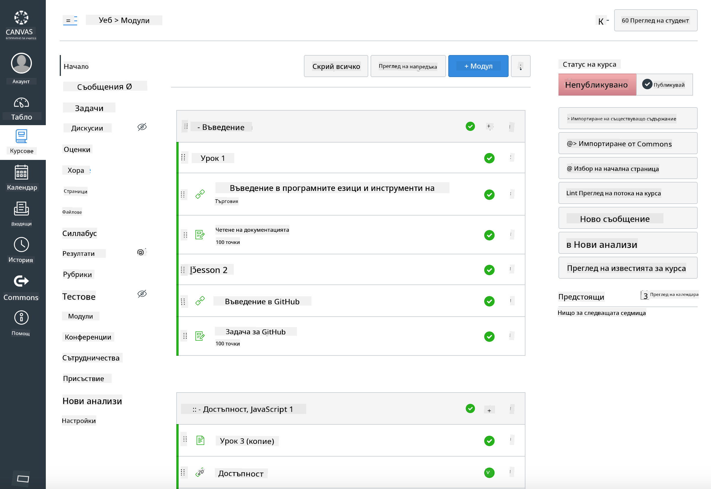

<!--
CO_OP_TRANSLATOR_METADATA:
{
  "original_hash": "75cb51f7ca9ea0b097ef4a1287e9290c",
  "translation_date": "2025-08-27T21:57:07+00:00",
  "source_file": "for-teachers.md",
  "language_code": "bg"
}
-->
## За преподаватели

Искате ли да използвате тази учебна програма във вашата класна стая? Чувствайте се свободни да го направите!

Всъщност можете да я използвате директно в GitHub, като използвате GitHub Classroom.

За да го направите, клонирайте този репозиторий. Ще трябва да създадете отделен репозиторий за всяка лекция, така че ще трябва да извлечете всяка папка в отделен репозиторий. По този начин [GitHub Classroom](https://classroom.github.com/classrooms) може да обработва всяка лекция поотделно.

Тези [пълни инструкции](https://github.blog/2020-03-18-set-up-your-digital-classroom-with-github-classroom/) ще ви дадат представа как да настроите вашата класна стая.

## Използване в Moodle, Canvas или Blackboard

Тази учебна програма работи добре в тези системи за управление на обучението! Използвайте [файла за качване в Moodle](../../../../../../../teaching-files/webdev-moodle.mbz) за пълното съдържание или опитайте [файла Common Cartridge](../../../../../../../teaching-files/webdev-common-cartridge.imscc), който съдържа част от съдържанието. Moodle Cloud не поддържа пълни експорти на Common Cartridge, така че е за предпочитане да използвате файла за изтегляне на Moodle, който може да бъде качен в Canvas. Моля, уведомете ни как можем да подобрим този процес.

> Учебната програма в класна стая на Moodle

> Учебната програма в Canvas

## Използване на репозитория в текущия му вид

Ако искате да използвате този репозиторий в настоящия му вид, без да използвате GitHub Classroom, това също е възможно. Ще трябва да комуникирате с вашите ученици коя лекция да разгледате заедно.

В онлайн формат (Zoom, Teams или друг) можете да създадете групи за дискусии за тестовете и да наставлявате учениците, за да ги подготвите за учене. След това поканете учениците да участват в тестовете и да изпратят своите отговори като 'issues' в определено време. Можете да направите същото с заданията, ако искате учениците да работят съвместно и открито.

Ако предпочитате по-приватен формат, помолете учениците си да клонират учебната програма, лекция по лекция, в свои собствени GitHub репозитории като частни репозитории и да ви дадат достъп. След това те могат да завършат тестовете и заданията насаме и да ги изпратят до вас чрез 'issues' в репозитория на вашата класна стая.

Има много начини да направите това работещо в онлайн класна стая. Моля, уведомете ни какво работи най-добре за вас!

## Моля, споделете вашите мисли!

Искаме да направим тази учебна програма полезна за вас и вашите ученици. Свържете се с нас в [Учителския ъгъл](https://github.com/microsoft/Web-Dev-For-Beginners/discussions/categories/teacher-corner) и отворете [**ново issue**](https://github.com/microsoft/Web-Dev-For-Beginners/issues/new/choose) за всякакви заявки, проблеми и обратна връзка.

---

**Отказ от отговорност**:  
Този документ е преведен с помощта на AI услуга за превод [Co-op Translator](https://github.com/Azure/co-op-translator). Въпреки че се стремим към точност, моля, имайте предвид, че автоматизираните преводи може да съдържат грешки или неточности. Оригиналният документ на неговия роден език трябва да се счита за авторитетен източник. За критична информация се препоръчва професионален човешки превод. Ние не носим отговорност за недоразумения или погрешни интерпретации, произтичащи от използването на този превод.