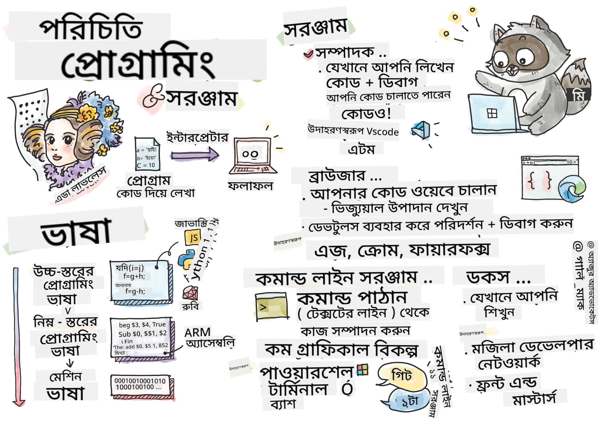

<!--
CO_OP_TRANSLATOR_METADATA:
{
  "original_hash": "2581528206a2a01c3a0b9c88e039b7bc",
  "translation_date": "2025-10-03T09:13:53+00:00",
  "source_file": "1-getting-started-lessons/1-intro-to-programming-languages/README.md",
  "language_code": "bn"
}
-->
# প্রোগ্রামিং ভাষা এবং প্রয়োজনীয় সরঞ্জামগুলোর পরিচিতি

এই পাঠে প্রোগ্রামিং ভাষার মৌলিক বিষয়গুলো আলোচনা করা হয়েছে। এখানে আলোচিত বিষয়গুলো আধুনিক প্রোগ্রামিং ভাষাগুলোর জন্য প্রযোজ্য। 'Tools of the Trade' অংশে, আপনি এমন কিছু দরকারী সফটওয়্যার সম্পর্কে জানবেন যা একজন ডেভেলপার হিসেবে আপনার কাজে আসবে।


> স্কেচনোট: [Tomomi Imura](https://twitter.com/girlie_mac)

## প্রাক-পাঠ কুইজ
[প্রাক-পাঠ কুইজ](https://forms.office.com/r/dru4TE0U9n?origin=lprLink)

## পরিচিতি

এই পাঠে আমরা আলোচনা করব:

- প্রোগ্রামিং কী?
- প্রোগ্রামিং ভাষার প্রকারভেদ
- একটি প্রোগ্রামের মৌলিক উপাদান
- পেশাদার ডেভেলপারদের জন্য দরকারী সফটওয়্যার এবং সরঞ্জাম

> আপনি এই পাঠটি [Microsoft Learn](https://docs.microsoft.com/learn/modules/web-development-101/introduction-programming/?WT.mc_id=academic-77807-sagibbon) এ নিতে পারেন!

## প্রোগ্রামিং কী?

প্রোগ্রামিং (যা কোডিং নামেও পরিচিত) হলো একটি ডিভাইস যেমন কম্পিউটার বা মোবাইল ডিভাইসের জন্য নির্দেশনা লেখার প্রক্রিয়া। আমরা এই নির্দেশনাগুলো একটি প্রোগ্রামিং ভাষার মাধ্যমে লিখি, যা ডিভাইস দ্বারা ব্যাখ্যা করা হয়। এই নির্দেশনার সেটগুলো বিভিন্ন নামে পরিচিত হতে পারে, যেমন *প্রোগ্রাম*, *কম্পিউটার প্রোগ্রাম*, *অ্যাপ্লিকেশন (অ্যাপ)*, এবং *এক্সিকিউটেবল*।

একটি *প্রোগ্রাম* হলো যেকোনো কিছু যা কোড দিয়ে লেখা হয়েছে; ওয়েবসাইট, গেমস, এবং ফোন অ্যাপগুলো প্রোগ্রাম। যদিও কোড না লিখেও প্রোগ্রাম তৈরি করা সম্ভব, তবে এর অন্তর্নিহিত লজিক ডিভাইস দ্বারা ব্যাখ্যা করা হয় এবং সেই লজিক সম্ভবত কোড দিয়ে লেখা। একটি প্রোগ্রাম যখন *চালানো* বা *এক্সিকিউট* করা হয়, তখন এটি নির্দেশনাগুলো সম্পাদন করে। আপনি যে ডিভাইস দিয়ে এই পাঠটি পড়ছেন, সেটি একটি প্রোগ্রাম চালাচ্ছে যা এটি আপনার স্ক্রিনে দেখাচ্ছে।

✅ একটু গবেষণা করুন: কাকে বিশ্বের প্রথম কম্পিউটার প্রোগ্রামার হিসেবে বিবেচনা করা হয়?

## প্রোগ্রামিং ভাষা

প্রোগ্রামিং ভাষা ডেভেলপারদের একটি ডিভাইসের জন্য নির্দেশনা লেখার সুযোগ দেয়। ডিভাইস কেবল বাইনারি (১ এবং ০) বুঝতে পারে, এবং *অধিকাংশ* ডেভেলপারের জন্য এটি খুবই অকার্যকর যোগাযোগের মাধ্যম। প্রোগ্রামিং ভাষা হলো মানুষের এবং কম্পিউটারের মধ্যে যোগাযোগের মাধ্যম।

প্রোগ্রামিং ভাষাগুলো বিভিন্ন ফরম্যাটে আসে এবং বিভিন্ন উদ্দেশ্যে ব্যবহৃত হয়। উদাহরণস্বরূপ, জাভাস্ক্রিপ্ট প্রধানত ওয়েব অ্যাপ্লিকেশনের জন্য ব্যবহৃত হয়, যেখানে ব্যাশ প্রধানত অপারেটিং সিস্টেমের জন্য ব্যবহৃত হয়।

*লো লেভেল ভাষা* সাধারণত *হাই লেভেল ভাষার* তুলনায় ডিভাইসের জন্য নির্দেশনা ব্যাখ্যা করতে কম ধাপ নেয়। তবে, হাই লেভেল ভাষাগুলো জনপ্রিয় কারণ সেগুলো সহজে পড়া যায় এবং সেগুলোর জন্য ভালো সাপোর্ট পাওয়া যায়। জাভাস্ক্রিপ্ট একটি হাই লেভেল ভাষা হিসেবে বিবেচিত।

নিচের কোডটি জাভাস্ক্রিপ্ট (একটি হাই লেভেল ভাষা) এবং এআরএম অ্যাসেম্বলি কোড (একটি লো লেভেল ভাষা) এর মধ্যে পার্থক্য দেখায়।

```javascript
let number = 10
let n1 = 0, n2 = 1, nextTerm;

for (let i = 1; i <= number; i++) {
    console.log(n1);
    nextTerm = n1 + n2;
    n1 = n2;
    n2 = nextTerm;
}
```

```c
 area ascen,code,readonly
 entry
 code32
 adr r0,thumb+1
 bx r0
 code16
thumb
 mov r0,#00
 sub r0,r0,#01
 mov r1,#01
 mov r4,#10
 ldr r2,=0x40000000
back add r0,r1
 str r0,[r2]
 add r2,#04
 mov r3,r0
 mov r0,r1
 mov r1,r3
 sub r4,#01
 cmp r4,#00
 bne back
 end
```

বিশ্বাস করুন বা না করুন, *দুটোই একই কাজ করছে*: ১০ পর্যন্ত একটি ফিবোনাচ্চি সিকোয়েন্স প্রিন্ট করছে।

✅ ফিবোনাচ্চি সিকোয়েন্স [সংজ্ঞায়িত](https://en.wikipedia.org/wiki/Fibonacci_number) হয় এমন একটি সংখ্যার সেট হিসেবে, যেখানে প্রতিটি সংখ্যা তার পূর্ববর্তী দুটি সংখ্যার যোগফল। ফিবোনাচ্চি সিকোয়েন্স অনুযায়ী প্রথম ১০টি সংখ্যা হলো ০, ১, ১, ২, ৩, ৫, ৮, ১৩, ২১ এবং ৩৪।

## একটি প্রোগ্রামের উপাদান

একটি প্রোগ্রামের একক নির্দেশনাকে *স্টেটমেন্ট* বলা হয় এবং সাধারণত একটি চিহ্ন বা লাইন স্পেসিং দিয়ে নির্দেশ করা হয় যেখানে নির্দেশনা শেষ হয় বা *টার্মিনেট* হয়। একটি প্রোগ্রাম কীভাবে শেষ হয় তা প্রতিটি ভাষার জন্য আলাদা।

প্রোগ্রামের স্টেটমেন্টগুলো ব্যবহারকারী বা অন্য কোনো উৎস থেকে প্রাপ্ত ডেটার উপর নির্ভর করতে পারে নির্দেশনা সম্পাদনের জন্য। ডেটা প্রোগ্রামের আচরণ পরিবর্তন করতে পারে, তাই প্রোগ্রামিং ভাষাগুলো ডেটা সাময়িকভাবে সংরক্ষণ করার একটি উপায় নিয়ে আসে যাতে এটি পরে ব্যবহার করা যায়। এগুলোকে বলা হয় *ভ্যারিয়েবল*। ভ্যারিয়েবল হলো এমন স্টেটমেন্ট যা একটি ডিভাইসকে তার মেমোরিতে ডেটা সংরক্ষণ করতে নির্দেশ দেয়। অ্যালজেব্রার ভ্যারিয়েবলের মতো, প্রোগ্রামের ভ্যারিয়েবলগুলোর একটি অনন্য নাম থাকে এবং তাদের মান সময়ের সাথে পরিবর্তিত হতে পারে।

কিছু স্টেটমেন্ট হয়তো ডিভাইস দ্বারা সম্পাদিত হবে না। এটি সাধারণত ডেভেলপারের পরিকল্পনা অনুযায়ী হয় অথবা কোনো অপ্রত্যাশিত ত্রুটি ঘটলে হয়। একটি অ্যাপ্লিকেশনের উপর এই ধরনের নিয়ন্ত্রণ এটিকে আরও শক্তিশালী এবং রক্ষণাবেক্ষণযোগ্য করে তোলে। সাধারণত, এই নিয়ন্ত্রণের পরিবর্তন ঘটে যখন নির্দিষ্ট শর্ত পূরণ হয়। আধুনিক প্রোগ্রামিংয়ে একটি সাধারণ স্টেটমেন্ট যা প্রোগ্রামের কার্যক্রম নিয়ন্ত্রণ করতে ব্যবহৃত হয় তা হলো `if..else` স্টেটমেন্ট।

✅ এই ধরনের স্টেটমেন্ট সম্পর্কে আপনি পরবর্তী পাঠে আরও শিখবেন।

## প্রয়োজনীয় সরঞ্জাম

[](https://youtube.com/watch?v=69WJeXGBdxg "Tools of the Trade")

> 🎥 উপরের ছবিতে ক্লিক করে টুলিং সম্পর্কিত একটি ভিডিও দেখুন

এই অংশে, আপনি এমন কিছু সফটওয়্যার সম্পর্কে জানবেন যা আপনার পেশাদার ডেভেলপমেন্ট যাত্রা শুরু করার সময় খুবই উপকারী হতে পারে।

একটি **ডেভেলপমেন্ট এনভায়রনমেন্ট** হলো এমন একটি সরঞ্জাম এবং বৈশিষ্ট্যের সেট যা একজন ডেভেলপার প্রায়ই সফটওয়্যার লেখার সময় ব্যবহার করেন। এই সরঞ্জামগুলোর কিছু ডেভেলপারের নির্দিষ্ট প্রয়োজন অনুযায়ী কাস্টমাইজ করা হয়েছে এবং সময়ের সাথে পরিবর্তিত হতে পারে যদি ডেভেলপার কাজের অগ্রাধিকার পরিবর্তন করেন, ব্যক্তিগত প্রকল্পে কাজ করেন, অথবা ভিন্ন প্রোগ্রামিং ভাষা ব্যবহার করেন। ডেভেলপমেন্ট এনভায়রনমেন্টগুলো ডেভেলপারদের মতোই অনন্য।

### এডিটর

সফটওয়্যার ডেভেলপমেন্টের জন্য সবচেয়ে গুরুত্বপূর্ণ সরঞ্জামগুলোর একটি হলো এডিটর। এডিটর হলো যেখানে আপনি আপনার কোড লেখেন এবং কখনও কখনও যেখানে আপনি আপনার কোড চালান।

ডেভেলপাররা এডিটরের উপর নির্ভর করেন আরও কিছু কারণে:

- *ডিবাগিং* কোডের ত্রুটি এবং ভুলগুলো খুঁজে বের করতে সাহায্য করে, লাইন বাই লাইন। কিছু এডিটরে ডিবাগিং ক্ষমতা থাকে; এগুলো নির্দিষ্ট প্রোগ্রামিং ভাষার জন্য কাস্টমাইজ এবং যোগ করা যায়।
- *সিনট্যাক্স হাইলাইটিং* কোডে রঙ এবং টেক্সট ফরম্যাটিং যোগ করে, যা পড়া সহজ করে তোলে। বেশিরভাগ এডিটরে কাস্টমাইজড সিনট্যাক্স হাইলাইটিংয়ের সুবিধা থাকে।
- *এক্সটেনশন এবং ইন্টিগ্রেশন* হলো ডেভেলপারদের জন্য বিশেষায়িত সরঞ্জাম, যা ডেভেলপারদের দ্বারা তৈরি। এগুলো বেস এডিটরে অন্তর্ভুক্ত ছিল না। উদাহরণস্বরূপ, অনেক ডেভেলপার তাদের কোড ডকুমেন্ট করেন এটি কীভাবে কাজ করে তা ব্যাখ্যা করার জন্য। তারা ডকুমেন্টেশনে টাইপো খুঁজে বের করতে একটি স্পেল চেক এক্সটেনশন ইনস্টল করতে পারেন। বেশিরভাগ এক্সটেনশন নির্দিষ্ট এডিটরের জন্য তৈরি এবং বেশিরভাগ এডিটরে উপলব্ধ এক্সটেনশন খুঁজে বের করার একটি উপায় থাকে।
- *কাস্টমাইজেশন* ডেভেলপারদের তাদের প্রয়োজন অনুযায়ী একটি অনন্য ডেভেলপমেন্ট এনভায়রনমেন্ট তৈরি করতে সক্ষম করে। বেশিরভাগ এডিটর অত্যন্ত কাস্টমাইজযোগ্য এবং ডেভেলপারদের কাস্টম এক্সটেনশন তৈরি করার অনুমতি দেয়।

#### জনপ্রিয় এডিটর এবং ওয়েব ডেভেলপমেন্ট এক্সটেনশন

- [Visual Studio Code](https://code.visualstudio.com/?WT.mc_id=academic-77807-sagibbon)
  - [Code Spell Checker](https://marketplace.visualstudio.com/items?itemName=streetsidesoftware.code-spell-checker)
  - [Live Share](https://marketplace.visualstudio.com/items?itemName=MS-vsliveshare.vsliveshare)
  - [Prettier - Code formatter](https://marketplace.visualstudio.com/items?itemName=esbenp.prettier-vscode)
- [Atom](https://atom.io/)
  - [spell-check](https://atom.io/packages/spell-check)
  - [teletype](https://atom.io/packages/teletype)
  - [atom-beautify](https://atom.io/packages/atom-beautify)
  
- [Sublimetext](https://www.sublimetext.com/)
  - [emmet](https://emmet.io/)
  - [SublimeLinter](http://www.sublimelinter.com/en/stable/)

### ব্রাউজার

আরেকটি গুরুত্বপূর্ণ সরঞ্জাম হলো ব্রাউজার। ওয়েব ডেভেলপাররা তাদের কোড ওয়েবে কীভাবে কাজ করে তা দেখার জন্য ব্রাউজারের উপর নির্ভর করেন। এটি এডিটরে লেখা ওয়েব পৃষ্ঠার ভিজ্যুয়াল উপাদানগুলো প্রদর্শন করতেও ব্যবহৃত হয়, যেমন HTML।

অনেক ব্রাউজারে *ডেভেলপার টুলস* (DevTools) থাকে যা ডেভেলপারদের তাদের অ্যাপ্লিকেশন সম্পর্কে গুরুত্বপূর্ণ তথ্য সংগ্রহ এবং ধারণ করতে সাহায্য করে। উদাহরণস্বরূপ: যদি একটি ওয়েব পৃষ্ঠায় ত্রুটি থাকে, কখন সেগুলো ঘটেছে তা জানা কখনও কখনও সহায়ক হতে পারে। ব্রাউজারের ডেভটুলস এই তথ্য সংগ্রহ করার জন্য কনফিগার করা যেতে পারে।

#### জনপ্রিয় ব্রাউজার এবং ডেভটুলস

- [Edge](https://docs.microsoft.com/microsoft-edge/devtools-guide-chromium/?WT.mc_id=academic-77807-sagibbon)
- [Chrome](https://developers.google.com/web/tools/chrome-devtools/)
- [Firefox](https://developer.mozilla.org/docs/Tools)

### কমান্ড লাইন টুলস

কিছু ডেভেলপার তাদের দৈনন্দিন কাজের জন্য কম গ্রাফিকাল ভিউ পছন্দ করেন এবং কমান্ড লাইনের উপর নির্ভর করেন। কোড লেখার জন্য প্রচুর টাইপিং প্রয়োজন এবং কিছু ডেভেলপার তাদের কীবোর্ডের ফ্লো ব্যাহত করতে চান না। তারা ডেস্কটপ উইন্ডোর মধ্যে স্যুইচ করতে, বিভিন্ন ফাইলে কাজ করতে, এবং টুল ব্যবহার করতে কীবোর্ড শর্টকাট ব্যবহার করেন। বেশিরভাগ কাজ মাউস দিয়ে সম্পন্ন করা যায়, তবে কমান্ড লাইনের একটি সুবিধা হলো অনেক কাজ মাউস এবং কীবোর্ডের মধ্যে স্যুইচ না করেই সম্পন্ন করা যায়। কমান্ড লাইন কনফিগারযোগ্য এবং আপনি একটি কাস্টম কনফিগারেশন সংরক্ষণ করতে, পরে এটি পরিবর্তন করতে, এবং এটি অন্য ডেভেলপমেন্ট মেশিনে আমদানি করতে পারেন। যেহেতু ডেভেলপমেন্ট এনভায়রনমেন্টগুলো প্রতিটি ডেভেলপারের জন্য অনন্য, কিছু ডেভেলপার কমান্ড লাইন ব্যবহার এড়িয়ে চলেন, কিছু সম্পূর্ণরূপে এর উপর নির্ভর করেন, এবং কিছু উভয়ের মিশ্রণ পছন্দ করেন।

### জনপ্রিয় কমান্ড লাইন অপশন

কমান্ড লাইনের অপশনগুলো আপনার ব্যবহৃত অপারেটিং সিস্টেমের উপর নির্ভর করে ভিন্ন হতে পারে।

*💻 = অপারেটিং সিস্টেমে পূর্বেই ইনস্টল করা থাকে।*

#### Windows

- [Powershell](https://docs.microsoft.com/powershell/scripting/overview?view=powershell-7/?WT.mc_id=academic-77807-sagibbon) 💻
- [Command Line](https://docs.microsoft.com/windows-server/administration/windows-commands/windows-commands/?WT.mc_id=academic-77807-sagibbon) (CMD নামেও পরিচিত) 💻
- [Windows Terminal](https://docs.microsoft.com/windows/terminal/?WT.mc_id=academic-77807-sagibbon)
- [mintty](https://mintty.github.io/)
  
#### MacOS

- [Terminal](https://support.apple.com/guide/terminal/open-or-quit-terminal-apd5265185d-f365-44cb-8b09-71a064a42125/mac) 💻
- [iTerm](https://iterm2.com/)
- [Powershell](https://docs.microsoft.com/powershell/scripting/install/installing-powershell-core-on-macos?view=powershell-7/?WT.mc_id=academic-77807-sagibbon)

#### Linux

- [Bash](https://www.gnu.org/software/bash/manual/html_node/index.html) 💻
- [KDE Konsole](https://docs.kde.org/trunk5/en/konsole/konsole/index.html)
- [Powershell](https://docs.microsoft.com/powershell/scripting/install/installing-powershell-core-on-linux?view=powershell-7/?WT.mc_id=academic-77807-sagibbon)

#### জনপ্রিয় কমান্ড লাইন টুলস

- [Git](https://git-scm.com/) (💻 বেশিরভাগ অপারেটিং সিস্টেমে)
- [NPM](https://www.npmjs.com/)
- [Yarn](https://classic.yarnpkg.com/en/docs/cli/)

### ডকুমেন্টেশন

যখন একজন ডেভেলপার নতুন কিছু শিখতে চান, তারা সাধারণত ডকুমেন্টেশনের দিকে ঝোঁকেন এটি কীভাবে ব্যবহার করতে হয় তা শিখতে। ডেভেলপাররা প্রায়ই ডকুমেন্টেশনের উপর নির্ভর করেন টুল এবং ভাষাগুলো সঠিকভাবে ব্যবহার করার জন্য এবং এটি কীভাবে কাজ করে তার গভীর জ্ঞান অর্জনের জন্য।

#### ওয়েব ডেভেলপমেন্টের জনপ্রিয় ডকুমেন্টেশন

- [Mozilla Developer Network (MDN)](https://developer.mozilla.org/docs/Web), Mozilla থেকে, যারা [Firefox](https://www.mozilla.org/firefox/) ব্রাউজার প্রকাশ করে
- [Frontend Masters](https://frontendmasters.com/learn/)
- [Web.dev](https://web.dev), Google থেকে, যারা [Chrome](https://www.google.com/chrome/) প্রকাশ করে
- [Microsoft's own developer docs](https://docs.microsoft.com/microsoft-edge/#microsoft-edge-for-developers), [Microsoft Edge](https://www.microsoft.com/edge) এর জন্য
- [W3 Schools](https://www.w3schools.com/where_to_start.asp)

✅ একটু গবেষণা করুন: এখন যেহেতু আপনি একজন ওয়েব ডেভেলপারের পরিবেশের মৌলিক বিষয়গুলো জানেন, এটি একজন ওয়েব ডিজাইনারের পরিবেশের সাথে তুলনা করুন।

---

## 🚀 চ্যালেঞ্জ

কিছু প্রোগ্রামিং ভাষার তুলনা করুন। জাভাস্ক্রিপ্ট বনাম জাভার কিছু অনন্য বৈশিষ্ট্য কী? কোবল বনাম গো এর ক্ষেত্রে কীভাবে?

## পোস্ট-লেকচার কুইজ
[পোস্ট-লেকচার কুইজ](https://ff-quizzes.netlify.app/web/)

## পুনরায় পর্যালোচনা এবং স্ব-অধ্যয়ন

প্রোগ্রামারের জন্য উপলব্ধ বিভিন্ন ভাষা সম্পর্কে একটু অধ্যয়ন করুন। একটি ভাষায় একটি লাইন লিখুন, এবং তারপর এটি অন্য দুটি ভাষায় পুনরায় লিখুন। আপনি কী শিখলেন?

## অ্যাসাইনমেন্ট

[ডকুমেন্টেশন পড়া](assignment.md)

> নোট: আপনার অ্যাসাইনমেন্টের জন্য টুল নির্বাচন করার সময়, উপরে তালিকাভুক্ত এডিটর, ব্রাউজার, বা কমান্ড লাইন টুলস নির্বাচন করবেন না।

---

**অস্বীকৃতি**:  
এই নথিটি AI অনুবাদ পরিষেবা [Co-op Translator](https://github.com/Azure/co-op-translator) ব্যবহার করে অনুবাদ করা হয়েছে। আমরা যথাসাধ্য সঠিকতার জন্য চেষ্টা করি, তবে অনুগ্রহ করে মনে রাখবেন যে স্বয়ংক্রিয় অনুবাদে ত্রুটি বা অসঙ্গতি থাকতে পারে। এর মূল ভাষায় থাকা নথিটিকে প্রামাণিক উৎস হিসেবে বিবেচনা করা উচিত। গুরুত্বপূর্ণ তথ্যের জন্য, পেশাদার মানব অনুবাদ সুপারিশ করা হয়। এই অনুবাদ ব্যবহারের ফলে কোনো ভুল বোঝাবুঝি বা ভুল ব্যাখ্যা হলে আমরা দায়বদ্ধ থাকব না।