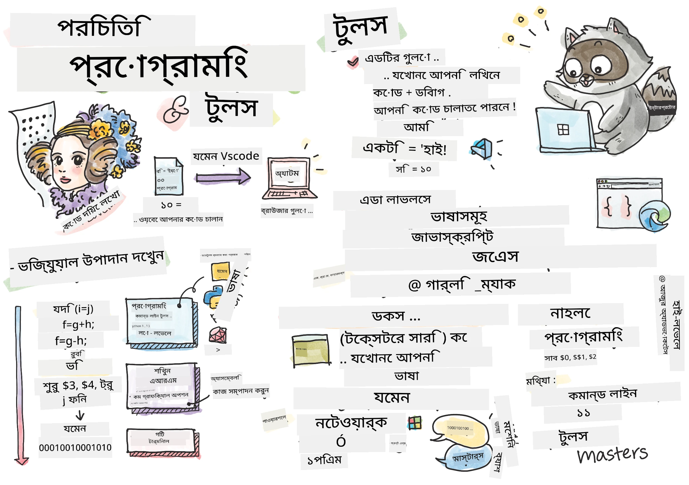
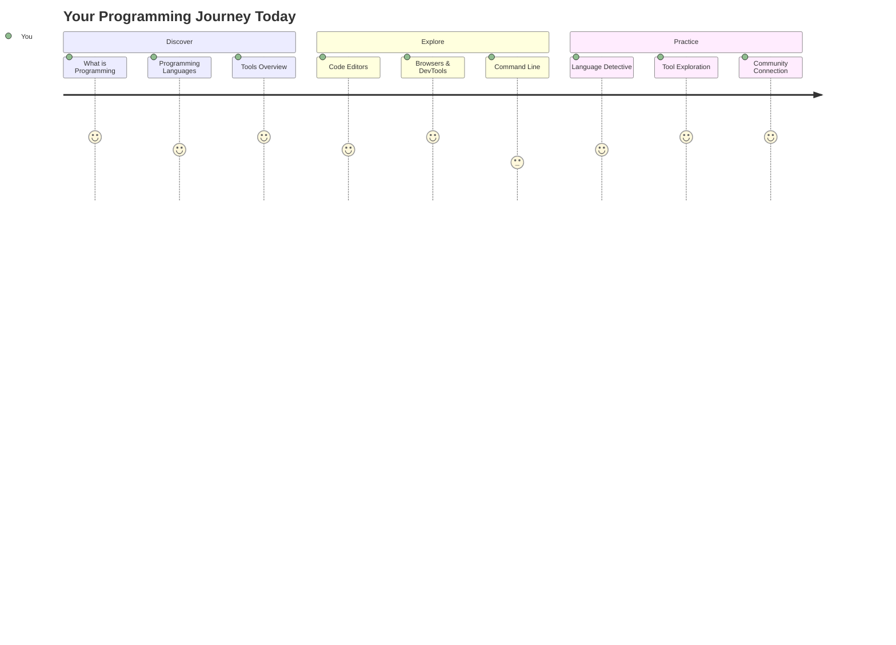
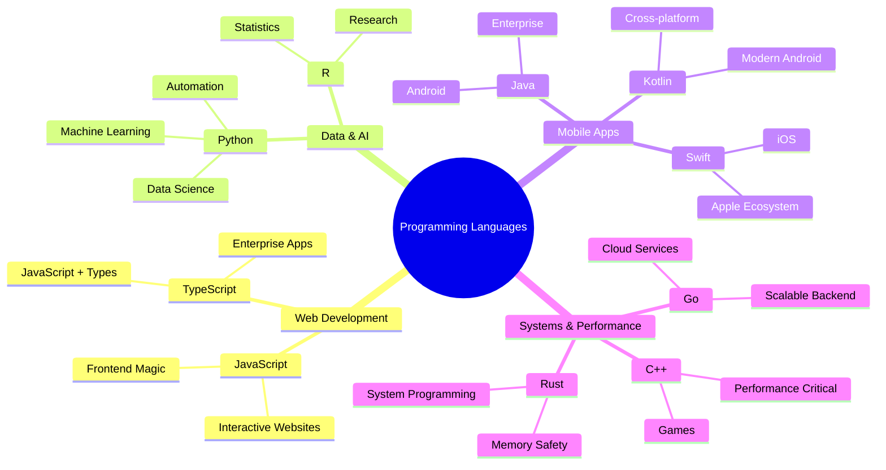
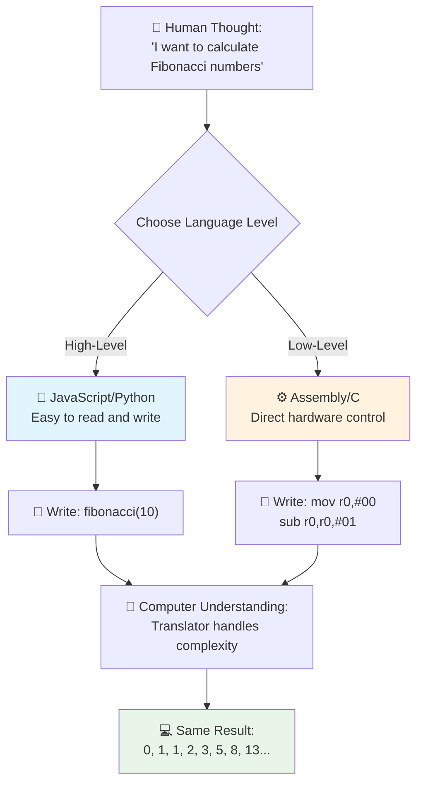
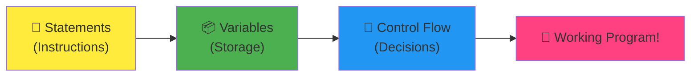
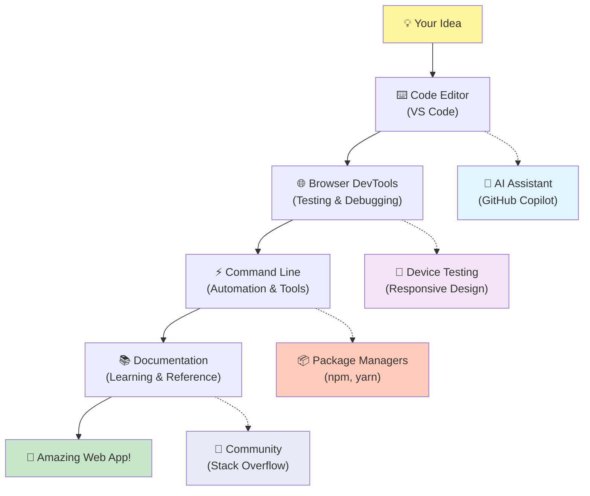
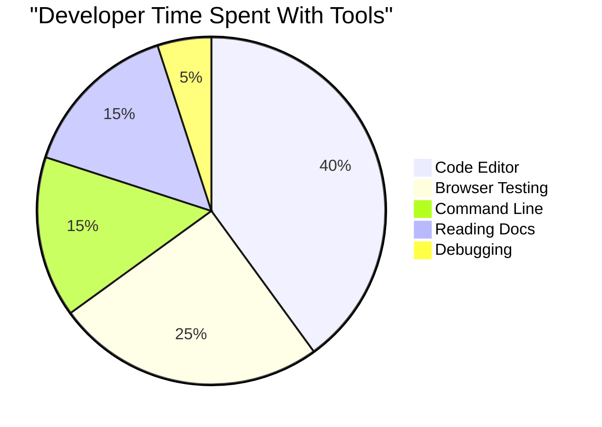
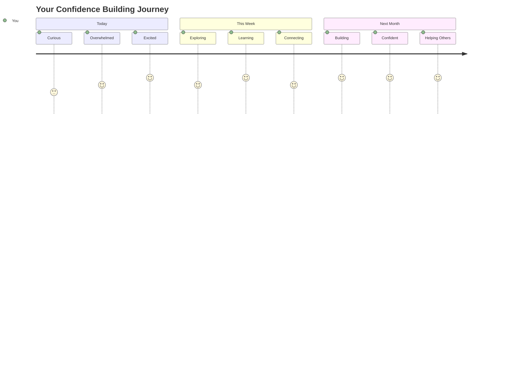

<!--
CO_OP_TRANSLATOR_METADATA:
{
  "original_hash": "d45ddcc54eb9232a76d08328b09d792e",
  "translation_date": "2025-11-03T22:28:30+00:00",
  "source_file": "1-getting-started-lessons/1-intro-to-programming-languages/README.md",
  "language_code": "bn"
}
-->
# প্রোগ্রামিং ভাষা এবং আধুনিক ডেভেলপার টুলসের পরিচিতি

হ্যালো, ভবিষ্যৎ ডেভেলপার! 👋 আমি কি তোমাকে এমন কিছু বলতে পারি যা আমাকে প্রতিদিনই শিহরিত করে? তুমি শিখতে যাচ্ছ যে প্রোগ্রামিং শুধুমাত্র কম্পিউটার নিয়ে নয় – এটি এমন এক ক্ষমতা যা তোমার সবচেয়ে বন্য ধারণাগুলোকে বাস্তবে রূপ দিতে পারে!

তুমি কি সেই মুহূর্তটি জানো যখন তুমি তোমার প্রিয় অ্যাপ ব্যবহার করছ এবং সবকিছু একদম নিখুঁতভাবে কাজ করছে? যখন তুমি একটি বোতামে চাপ দাও এবং কিছু একেবারে জাদুকরী ঘটে যা তোমাকে "ওয়াও, তারা এটা কীভাবে করল?" বলতে বাধ্য করে। ঠিক এমন কেউ – সম্ভবত রাত ২টায় তাদের প্রিয় কফি শপে তৃতীয় এসপ্রেসো পান করতে করতে – সেই কোড লিখেছে যা সেই জাদু তৈরি করেছে। এবং যা তোমার মনকে উড়িয়ে দেবে তা হলো: এই পাঠের শেষে, তুমি শুধু বুঝতে পারবে না তারা কীভাবে এটি করেছে, বরং তুমি নিজেই এটি চেষ্টা করতে উদগ্রীব হয়ে উঠবে!

শোনো, যদি প্রোগ্রামিং এখন তোমার কাছে ভয়ঙ্কর মনে হয়, আমি পুরোপুরি বুঝতে পারি। যখন আমি প্রথম শুরু করেছিলাম, আমি সত্যিই ভেবেছিলাম যে তোমাকে কোনো গণিতের জিনিয়াস হতে হবে বা পাঁচ বছর বয়স থেকেই কোডিং করতে হবে। কিন্তু যা আমার দৃষ্টিভঙ্গি পুরোপুরি বদলে দিয়েছিল তা হলো: প্রোগ্রামিং নতুন ভাষায় কথোপকথন শেখার মতো। তুমি "হ্যালো" এবং "ধন্যবাদ" দিয়ে শুরু করো, তারপর কফি অর্ডার করতে শেখো, এবং কিছুদিনের মধ্যে তুমি গভীর দার্শনিক আলোচনা করতে পারো! তবে এই ক্ষেত্রে, তুমি কম্পিউটারের সাথে কথোপকথন করছ, এবং সত্যি বলতে? তারা সবচেয়ে ধৈর্যশীল কথোপকথন সঙ্গী – তারা কখনো তোমার ভুলের বিচার করে না এবং তারা সবসময় আবার চেষ্টা করতে প্রস্তুত!

আজ, আমরা সেই অসাধারণ টুলগুলো অন্বেষণ করব যা আধুনিক ওয়েব ডেভেলপমেন্টকে শুধু সম্ভবই করে না, বরং একেবারে নেশাসক্ত করে তোলে। আমি বলছি ঠিক সেই এডিটর, ব্রাউজার এবং ওয়ার্কফ্লো যা Netflix, Spotify এবং তোমার প্রিয় ইন্ডি অ্যাপ স্টুডিওর ডেভেলপাররা প্রতিদিন ব্যবহার করে। এবং যা তোমাকে আনন্দে নাচতে বাধ্য করবে তা হলো: এই পেশাদার-গ্রেড, ইন্ডাস্ট্রি-স্ট্যান্ডার্ড টুলগুলোর বেশিরভাগই সম্পূর্ণ বিনামূল্যে!


> স্কেচনোট: [Tomomi Imura](https://twitter.com/girlie_mac)



## দেখা যাক তুমি আগে থেকেই কী জানো!

মজার অংশে যাওয়ার আগে, আমি জানতে চাই – তুমি এই প্রোগ্রামিং জগত সম্পর্কে আগে থেকেই কী জানো? এবং শুনো, যদি তুমি এই প্রশ্নগুলো দেখে ভাবো "আমি সত্যিই এর কিছুই জানি না," তাহলে সেটি শুধু ঠিকই নয়, বরং একদম পারফেক্ট! এর মানে তুমি ঠিক সঠিক জায়গায় আছ। এই কুইজটিকে একটি ওয়ার্কআউটের আগে স্ট্রেচিংয়ের মতো ভাবো – আমরা শুধু মস্তিষ্কের পেশিগুলো গরম করছি!

[পূর্ব-পাঠ কুইজ নাও](https://forms.office.com/r/dru4TE0U9n?origin=lprLink)

## আমরা যে অভিযানে যাচ্ছি একসাথে

ঠিক আছে, আমি সত্যিই উত্তেজনায় লাফাচ্ছি আজ আমরা যা অন্বেষণ করতে যাচ্ছি তা নিয়ে! সত্যি বলতে, আমি তোমার মুখ দেখতে চাই যখন কিছু ধারণা তোমার মাথায় ক্লিক করবে। এখানে আমাদের অবিশ্বাস্য যাত্রা:

- **প্রোগ্রামিং আসলে কী (এবং কেন এটি সবচেয়ে কুল জিনিস!)** – আমরা আবিষ্কার করব কীভাবে কোড আসলে অদৃশ্য জাদু যা তোমার চারপাশের সবকিছু চালিত করে, সেই অ্যালার্ম থেকে যা জানে এটি সোমবার সকাল, সেই অ্যালগরিদম পর্যন্ত যা তোমার Netflix রিকমেন্ডেশন নিখুঁতভাবে সাজায়।
- **প্রোগ্রামিং ভাষা এবং তাদের অসাধারণ ব্যক্তিত্ব** – কল্পনা করো একটি পার্টিতে ঢুকেছ যেখানে প্রত্যেকের সম্পূর্ণ ভিন্ন ক্ষমতা এবং সমস্যার সমাধানের পদ্ধতি আছে। প্রোগ্রামিং ভাষার জগত ঠিক এরকম, এবং তাদের সাথে পরিচিত হতে তোমার ভালো লাগবে!
- **ডিজিটাল জাদু ঘটানোর মৌলিক নির্মাণ ব্লকগুলো** – এগুলোকে চূড়ান্ত সৃজনশীল LEGO সেট হিসেবে ভাবো। একবার তুমি বুঝতে পারবে কীভাবে এই অংশগুলো একসাথে ফিট করে, তুমি বুঝতে পারবে তুমি যা কল্পনা করো তা তৈরি করতে পারো।
- **পেশাদার টুল যা তোমাকে মনে করাবে যেন তোমাকে একটি জাদুকরের ছড়ি দেওয়া হয়েছে** – আমি এখানে নাটকীয় হচ্ছি না – এই টুলগুলো সত্যিই তোমাকে মনে করাবে যেন তোমার সুপারপাওয়ার আছে, এবং সবচেয়ে ভালো অংশ? এগুলোই প্রোরা ব্যবহার করে!

> 💡 **মজার বিষয়**: আজ সবকিছু মনে রাখার চেষ্টা করো না! এখন আমি শুধু চাই তুমি সম্ভাবনার প্রতি উত্তেজনা অনুভব করো। আমরা একসাথে অনুশীলন করার সময় বিস্তারিত বিষয়গুলো স্বাভাবিকভাবেই মনে থাকবে – আসল শেখা এভাবেই হয়!

> তুমি এই পাঠটি [Microsoft Learn](https://docs.microsoft.com/learn/modules/web-development-101/introduction-programming/?WT.mc_id=academic-77807-sagibbon) এ নিতে পারো!

## তাহলে প্রোগ্রামিং আসলে কী?

ঠিক আছে, চলো মিলিয়ন-ডলার প্রশ্নটি মোকাবিলা করি: প্রোগ্রামিং আসলে কী?

আমি তোমাকে একটি গল্প বলব যা আমার চিন্তাভাবনা পুরোপুরি বদলে দিয়েছে। গত সপ্তাহে, আমি আমার মাকে আমাদের নতুন স্মার্ট টিভি রিমোট ব্যবহার করতে বোঝানোর চেষ্টা করছিলাম। আমি নিজেকে বলতে শুনলাম, "লাল বোতামটি চাপো, তবে বড় লাল বোতামটি নয়, ছোট লাল বোতামটি বাম দিকে... না, তোমার অন্য বাম... ঠিক আছে, এখন এটি দুই সেকেন্ড ধরে রাখো, এক সেকেন্ড নয়, তিন সেকেন্ডও নয়..." পরিচিত শোনাচ্ছে? 😅

এটাই প্রোগ্রামিং! এটি অত্যন্ত বিস্তারিত, ধাপে ধাপে নির্দেশনা দেওয়ার শিল্প, এমন কিছুতে যা খুব শক্তিশালী কিন্তু সবকিছু নিখুঁতভাবে ব্যাখ্যা করা প্রয়োজন। তবে মাকে বোঝানোর পরিবর্তে (যিনি "কোন লাল বোতাম?!" জিজ্ঞাসা করতে পারেন), তুমি একটি কম্পিউটারকে বোঝাচ্ছ (যা ঠিক তাই করে যা তুমি বলো, যদিও তুমি যা বলেছ তা হয়তো তুমি যা বোঝাতে চেয়েছ তা নয়)।

যা আমার মনকে উড়িয়ে দিয়েছিল তা হলো: কম্পিউটার আসলে তাদের মূলে বেশ সহজ। তারা মাত্র দুটি জিনিস বোঝে – ১ এবং ০, যা মূলত "হ্যাঁ" এবং "না" বা "চালু" এবং "বন্ধ।" এটাই! কিন্তু এখানেই জাদু শুরু হয় – আমাদের ১ এবং ০-এ কথা বলতে হয় না যেন আমরা The Matrix-এ আছি। এখানেই **প্রোগ্রামিং ভাষা** আমাদের উদ্ধার করে। এগুলো এমন এক সেরা অনুবাদক যা তোমার সাধারণ মানবিক চিন্তাভাবনাকে কম্পিউটার ভাষায় রূপান্তর করে।

এবং যা আমাকে প্রতিদিন সকালে সত্যিই শিহরিত করে তা হলো: তোমার জীবনের প্রতিটি ডিজিটাল জিনিস শুরু হয়েছিল তোমার মতো কারো দ্বারা, সম্ভবত তাদের পায়জামা পরে কফি হাতে ল্যাপটপে কোড টাইপ করতে করতে। সেই Instagram ফিল্টার যা তোমাকে নিখুঁত দেখায়? কেউ সেটি কোড করেছে। সেই রিকমেন্ডেশন যা তোমাকে তোমার নতুন প্রিয় গানের দিকে নিয়ে গেছে? একজন ডেভেলপার সেই অ্যালগরিদম তৈরি করেছে। সেই অ্যাপ যা তোমাকে বন্ধুদের সাথে ডিনারের বিল ভাগ করতে সাহায্য করে? হ্যাঁ, কেউ ভেবেছিল "এটি বিরক্তিকর, আমি বাজি ধরে বলতে পারি এটি ঠিক করতে পারি" এবং তারপর... তারা করেছে!

যখন তুমি প্রোগ্রামিং শিখবে, তুমি শুধু একটি নতুন দক্ষতা অর্জন করবে না – তুমি সমস্যার সমাধানকারী এই অবিশ্বাস্য সম্প্রদায়ের অংশ হয়ে উঠবে যারা তাদের দিন কাটায় ভাবতে, "যদি আমি এমন কিছু তৈরি করতে পারি যা কারো দিনকে একটু ভালো করে তোলে?" সত্যি বলতে, এর চেয়ে কুল আর কিছু হতে পারে?

✅ **মজার তথ্য অনুসন্ধান**: যখন তোমার হাতে একটু সময় থাকবে তখন একটি মজার বিষয় খুঁজে বের করো – তুমি কি জানো কে ছিলেন বিশ্বের প্রথম কম্পিউটার প্রোগ্রামার? আমি একটি ইঙ্গিত দেব: এটি হয়তো তোমার প্রত্যাশিত কেউ নয়! এই ব্যক্তির গল্পটি একেবারে চমকপ্রদ এবং দেখায় যে প্রোগ্রামিং সবসময় সৃজনশীল সমস্যার সমাধান এবং বক্সের বাইরে চিন্তা করার বিষয় ছিল।

### 🧠 **চেক-ইন সময়: তুমি কেমন অনুভব করছ?**

**একটু সময় নিয়ে ভাবো:**
- "কম্পিউটারকে নির্দেশনা দেওয়া" ধারণাটি কি এখন তোমার কাছে পরিষ্কার?
- তুমি কি এমন কোনো দৈনন্দিন কাজের কথা ভাবতে পারো যা তুমি প্রোগ্রামিং দিয়ে স্বয়ংক্রিয় করতে চাও?
- এই পুরো প্রোগ্রামিং বিষয়টি নিয়ে তোমার মনে কী প্রশ্ন উঠছে?

> **মনে রাখো**: যদি কিছু ধারণা এখনো অস্পষ্ট মনে হয় তবে এটি একেবারে স্বাভাবিক। প্রোগ্রামিং শেখা নতুন ভাষা শেখার মতো – তোমার মস্তিষ্কের সেই নিউরাল পথগুলো তৈরি হতে সময় লাগে। তুমি দারুণ করছ!

## প্রোগ্রামিং ভাষা বিভিন্ন ধরণের জাদুর মতো

ঠিক আছে, এটি অদ্ভুত শোনাতে পারে, কিন্তু আমার সাথে থাকো – প্রোগ্রামিং ভাষা অনেকটা বিভিন্ন ধরণের সঙ্গীতের মতো। ভাবো: তোমার কাছে জ্যাজ আছে, যা মসৃণ এবং স্বতঃস্ফূর্ত, রক যা শক্তিশালী এবং সরল, ক্লাসিকাল যা মার্জিত এবং গঠনমূলক, এবং হিপ-হপ যা সৃজনশীল এবং অভিব্যক্তিপূর্ণ। প্রতিটি শৈলীর নিজস্ব পরিবেশ, নিজস্ব উত্সাহী ভক্তদের সম্প্রদায় আছে, এবং প্রতিটি ভিন্ন মেজাজ এবং উপলক্ষের জন্য উপযুক্ত।

প্রোগ্রামিং ভাষাগুলো ঠিক একইভাবে কাজ করে! তুমি একটি মজার মোবাইল গেম তৈরি করতে যে ভাষা ব্যবহার করবে, তা দিয়ে বিশাল পরিমাণ জলবায়ু তথ্য বিশ্লেষণ করতে পারবে না, যেমন তুমি যোগব্যায়ামের ক্লাসে ডেথ মেটাল বাজাবে না (ঠিক আছে, বেশিরভাগ যোগব্যায়ামের ক্লাসে!)।

তবে যা আমাকে প্রতিবারই অবাক করে তা হলো: এই ভাষাগুলো এমন এক ধৈর্যশীল, উজ্জ্বল অনুবাদক থাকার মতো যা তোমার পাশে বসে আছে। তুমি তোমার চিন্তাভাবনাগুলো এমনভাবে প্রকাশ করতে পারো যা তোমার মানব মস্তিষ্কের জন্য স্বাভাবিক মনে হয়, এবং তারা সেই জটিল কাজগুলো করে যা কম্পিউটার আসলে বোঝে। এটি এমন একজন বন্ধুর মতো যে "মানব সৃজনশীলতা" এবং "কম্পিউটার লজিক" উভয় ভাষায় পুরোপুরি দক্ষ – এবং তারা কখনো ক্লান্ত হয় না, কখনো কফি বিরতি নেয় না, এবং কখনো একই প্রশ্ন দুবার জিজ্ঞাসা করার জন্য তোমাকে বিচার করে না!

### জনপ্রিয় প্রোগ্রামিং ভাষা এবং তাদের ব্যবহার



| ভাষা | সেরা ব্যবহার | কেন এটি জনপ্রিয় |
|------|--------------|------------------|
| **জাভাস্ক্রিপ্ট** | ওয়েব ডেভেলপমেন্ট, ইউজার ইন্টারফেস | ব্রাউজারে চলে এবং ইন্টারঅ্যাকটিভ ওয়েবসাইট চালিত করে |
| **পাইথন** | ডেটা সায়েন্স, অটোমেশন, AI | পড়তে এবং শিখতে সহজ, শক্তিশালী লাইব্রেরি |
| **জাভা** | এন্টারপ্রাইজ অ্যাপ্লিকেশন, অ্যান্ড্রয়েড অ্যাপ | প্ল্যাটফর্ম-স্বাধীন, বড় সিস্টেমের জন্য শক্তিশালী |
| **C#** | উইন্ডোজ অ্যাপ্লিকেশন, গেম ডেভেলপমেন্ট | শক্তিশালী মাইক্রোসফট ইকোসিস্টেম সাপোর্ট |
| **Go** | ক্লাউড সার্ভিস, ব্যাকএন্ড সিস্টেম | দ্রুত, সহজ, আধুনিক কম্পিউটিংয়ের জন্য ডিজাইন করা |

### উচ্চ-স্তরের বনাম নিম্ন-স্তরের ভাষা

ঠিক আছে, এটি ছিল সেই ধারণা যা আমাকে প্রথমে বিভ্রান্ত করেছিল, তাই আমি সেই উপমা শেয়ার করতে যাচ্ছি যা অবশেষে আমার জন্য এটি পরিষ্কার করেছিল – এবং আমি সত্যিই আশা করি এটি তোমার জন্যও সাহায্য করবে!

কল্পনা করো তুমি এমন একটি দেশে গিয়েছ যেখানে তুমি ভাষা জানো না, এবং তোমার খুব জরুরি প্রয়োজন কাছের বাথরুম খুঁজে বের করার (আমরা সবাই এই পরিস্থিতিতে পড়েছি, তাই না? 😅):

- **নিম্ন-স্তরের প্রোগ্রামিং** হলো স্থানীয় ভাষা এত ভালোভাবে শেখা যে তুমি রাস্তার কোণে ফল বিক্রি করা বৃদ্ধার সাথে কথা বলতে পারো সাংস্কৃতিক রেফারেন্স, স্থানীয় স্ল্যাং এবং ভিতরের রসিকতা ব্যবহার করে যা শুধুমাত্র কেউ বুঝবে যে সেখানে বড় হয়েছে। খুবই চিত্তাকর্ষক এবং অত্যন্ত কার্যকর... যদি তুমি সাবলীল হও! কিন্তু যখন তুমি শুধু বাথরুম খুঁজতে চাও তখন এটি বেশ চাপের।

- **উচ্চ-স্তরের প্রোগ্রামিং** হলো সেই অসাধারণ স্থানীয় বন্ধুর মতো যে তোমাকে বুঝে। তুমি "আমি সত্যিই একটি বাথরুম খুঁজতে চাই" সাধারণ ইংরেজিতে বলতে পারো, এবং তারা সমস্ত সাংস্কৃতিক অনুবাদ পরিচালনা করে এবং তোমার অ-স্থানীয় মস্তিষ্কের জন্য অর্থবহভাবে দিকনির্দেশনা দেয়।

প্রোগ্রামিংয়ের ক্ষেত্রে:
- **নিম্ন-স্তরের ভাষা** (যেমন Assembly বা C) তোমাকে কম্পিউটারের আসল হার্ডওয়্যারের সাথে অত্যন্ত বিস্তারিত কথোপকথন করতে দেয়, কিন্তু তোমাকে একটি মেশিনের মতো চিন্তা করতে হয়, যা... ঠিক আছে, এটি একটি বড় মানসিক পরিবর্তন!
- **উচ্চ-স্তরের ভাষা** (যেমন JavaScript, Python, বা C#) তোমাকে একজন মানুষের মতো চিন্তা করতে দেয় যখন তারা সমস্ত মেশিন-স্পিক পরিচালনা করে। এছাড়া, তাদের এমন অবিশ্বাস্যভাবে স্বাগত জানানো সম্প্রদায় আছে যারা নতুন হওয়ার অভিজ্ঞতা মনে রাখে এবং সত্যিই সাহায্য করতে চায়!

তুমি অনুমান করতে পারো আমি কোনটি দিয়ে শুরু করার পরামর্শ দেব? 😉 উচ্চ-স্তরের ভাষা হলো এমন প্রশিক্ষণ চাকা যা তুমি কখনো খুলতে চাইবে না কারণ তারা পুরো অভিজ্ঞতাকে অনেক বেশি উপভোগ্য করে তোলে!



### কেন উচ্চ-স্তরের ভাষা এত বেশি বন্ধুত্বপূর্ণ তা আমি তোমাকে দেখাই

ঠিক আছে, আমি তোমাকে এমন কিছু দেখাতে যাচ্ছি যা পুরোপুরি প্রদর্শন করে কেন আমি উচ্চ-স্তরের ভাষার প্রেমে পড়েছি, কিন্তু প্রথমে – আমি তোমার কাছ থেকে একটি প্রতিশ্রুতি চাই। যখন তুমি প্রথম কোড উদাহরণটি দেখবে, আতঙ্কিত হয়ো না! এটি ভয়ঙ্কর দেখানোর জন্যই তৈরি করা হয়েছে। এটাই আমি বোঝাতে চাইছি!

আমরা একই কাজ দুটি সম্পূর্ণ ভিন্ন শৈলীতে লেখা দেখব। দুটিই তৈরি করে যাকে বলা হয় Fibonacci সিকোয়েন্স – এটি একটি সুন্দর গাণিতিক প্যাটার্ন যেখানে প্রতিটি সংখ্যা আগের দুটি সংখ্যার যোগফল: ০, ১, ১, ২, ৩, ৫, ৮, ১৩... (মজার তথ্য: তুমি এই প্যাটার্ন প্রকৃতির সর্বত্র খুঁজে পাবে – সূর্যমুখীর বীজের ঘূর্ণন, পাইনকোনের প্যাটার্ন, এমনকি গ্যালাক্সি গঠনের পদ্ধতিতে!)

তফাৎ দেখতে প্রস্তুত? চলো যাই!

**উচ্চ-স্তরের ভাষা (JavaScript) – মানব-বান্ধব:**

```javascript
// Step 1: Basic Fibonacci setup
const fibonacciCount = 10;
let current = 0;
let next = 1;

console.log('Fibonacci sequence:');
```

**এই কোডটি যা করে:**
- **ঘোষণা করে** একটি কনস্ট্যান্ট যা নির্ধারণ করে আমরা কত Fibonacci সংখ্যা তৈরি করতে চাই
- **প্রাথমিকভাবে সেট করে** দুটি ভ্যারিয়েবল যা সিকোয়েন্সের বর্তমান এবং পরবর্তী সংখ্যাগুলো ট্র্যাক করে
- **শুরু করে** Fibonacci প্যাটার্ন নির্ধারণকারী প্রাথমিক মান (০ এবং ১)
- **প্রদর্শন করে** একটি হেডার বার্তা যা আমাদের আউটপুট চিহ্নিত করে

```javascript
// Step 2: Generate the sequence with a loop
for (let i = 0; i < fibonacciCount; i++) {
  console.log(`Position ${i + 1}: ${current}`);
  
  // Calculate next number in sequence
  const sum = current + next;
  current = next;
  next = sum;
}
```

**এখানে যা ঘটে তা ভেঙে দেখা:**
- **লুপ করে** সিকোয়েন্সের প্রতিটি অবস্থান একটি `for` লুপ ব্যবহার করে
- **প্রদর্শন করে** প্রতিটি সংখ্যা তার অবস্থানসহ টেমপ্লেট লিটারাল ফরম্যাটিং ব্যবহার করে
- **গণনা করে** পরবর্তী Fibonacci সংখ্যা বর্তমান এবং পরবর্তী মান যোগ করে
- **আপডেট করে** আমাদের ট্র্যাকিং ভ্যারিয়েবলগুলো পরবর্তী ইটারেশনে যাওয়ার জন্য

```javascript
// Step 3: Modern functional approach
const generateFibonacci = (count) => {
  const sequence = [0, 1];
  
  for (let i = 2; i < count; i++) {
    sequence[i] = sequence[i - 1] + sequence[i - 2];
  }
  
  return sequence;
};

// Usage example
const fibSequence = generateFibonacci(10);
console.log(fibSequence);
```

**উপরের কোডে
- **মন্তব্য**: উচ্চ-স্তরের প্রোগ্রামিং ভাষা ব্যাখ্যামূলক মন্তব্যকে উৎসাহিত করে যা কোডকে স্বয়ং-দলিলীকরণ করে তোলে।
- **গঠন**: জাভাস্ক্রিপ্টের যৌক্তিক প্রবাহ মানুষের সমস্যাগুলি ধাপে ধাপে চিন্তা করার পদ্ধতির সাথে মিলে যায়।
- **রক্ষণাবেক্ষণ**: বিভিন্ন প্রয়োজনের জন্য জাভাস্ক্রিপ্ট সংস্করণ আপডেট করা সহজ এবং পরিষ্কার।

✅ **ফিবোনাচি সিকোয়েন্স সম্পর্কে**: এই অসাধারণ সুন্দর সংখ্যার প্যাটার্ন (যেখানে প্রতিটি সংখ্যা আগের দুটি সংখ্যার যোগফল: ০, ১, ১, ২, ৩, ৫, ৮...) প্রকৃতিতে প্রায় *প্রতিটি জায়গায়* দেখা যায়! আপনি এটি সূর্যমুখীর ঘূর্ণনে, পাইনকোনের প্যাটার্নে, নটিলাস শেলের বাঁকানো আকৃতিতে, এমনকি গাছের শাখাগুলির বৃদ্ধির পদ্ধতিতেও দেখতে পাবেন। এটা সত্যিই অবিশ্বাস্য যে গণিত এবং কোড আমাদের প্রকৃতির সৌন্দর্য তৈরির প্যাটার্নগুলি বুঝতে এবং পুনরায় তৈরি করতে সাহায্য করতে পারে!

## সেই ভিত্তি যা জাদু তৈরি করে

ঠিক আছে, এখন আপনি প্রোগ্রামিং ভাষাগুলি কীভাবে কাজ করে তা দেখেছেন, আসুন সেই মৌলিক অংশগুলি ভেঙে দেখি যা প্রায় প্রতিটি প্রোগ্রামের ভিত্তি। এগুলিকে আপনার প্রিয় রেসিপির প্রয়োজনীয় উপাদান হিসাবে ভাবুন – একবার আপনি বুঝতে পারবেন প্রতিটি কী করে, আপনি প্রায় যেকোনো ভাষায় কোড পড়তে এবং লিখতে পারবেন!

এটি প্রোগ্রামিংয়ের ব্যাকরণ শেখার মতো। মনে আছে স্কুলে যখন আপনি নাম, ক্রিয়া এবং বাক্য গঠনের নিয়ম শিখেছিলেন? প্রোগ্রামিংয়ের নিজস্ব ব্যাকরণ রয়েছে, এবং সত্যি বলতে, এটি ইংরেজি ব্যাকরণের চেয়ে অনেক বেশি যৌক্তিক এবং ক্ষমাশীল! 😄

### স্টেটমেন্ট: ধাপে ধাপে নির্দেশনা

চলুন **স্টেটমেন্ট** দিয়ে শুরু করি – এগুলি আপনার কম্পিউটারের সাথে কথোপকথনের পৃথক বাক্যের মতো। প্রতিটি স্টেটমেন্ট কম্পিউটারকে একটি নির্দিষ্ট কাজ করতে বলে, ঠিক যেমন নির্দেশ দেওয়া: "এখানে বাঁ দিকে ঘুরুন," "লাল আলোতে থামুন," "ওই জায়গায় পার্ক করুন।"

স্টেটমেন্টের ব্যাপারে আমি যা পছন্দ করি তা হল এগুলি সাধারণত কতটা পড়ার যোগ্য। এটি দেখুন:

```javascript
// Basic statements that perform single actions
const userName = "Alex";                    
console.log("Hello, world!");              
const sum = 5 + 3;                         
```

**এই কোডটি যা করে:**
- **ঘোষণা** করে একটি কনস্ট্যান্ট ভেরিয়েবল ব্যবহারকারীর নাম সংরক্ষণ করতে
- **প্রদর্শন** করে একটি অভিবাদন বার্তা কনসোল আউটপুটে
- **গণনা** করে এবং একটি গাণিতিক অপারেশনের ফলাফল সংরক্ষণ করে

```javascript
// Statements that interact with web pages
document.title = "My Awesome Website";      
document.body.style.backgroundColor = "lightblue";
```

**ধাপে ধাপে যা ঘটছে:**
- **পরিবর্তন** করে ব্রাউজার ট্যাবে প্রদর্শিত ওয়েবপেজের শিরোনাম
- **পরিবর্তন** করে পুরো পৃষ্ঠার ব্যাকগ্রাউন্ড রঙ

### ভেরিয়েবল: আপনার প্রোগ্রামের মেমোরি সিস্টেম

ঠিক আছে, **ভেরিয়েবল** সত্যিই আমার শেখানোর প্রিয় ধারণাগুলির মধ্যে একটি কারণ এগুলি এমন জিনিসের মতো যা আপনি প্রতিদিন ব্যবহার করেন!

আপনার ফোনের কন্টাক্ট লিস্টের কথা ভাবুন। আপনি সবার ফোন নম্বর মুখস্থ করেন না – বরং "মা," "সেরা বন্ধু," বা "পিজ্জা প্লেস যা রাত ২টা পর্যন্ত ডেলিভারি দেয়" সংরক্ষণ করেন এবং আপনার ফোন আসল নম্বরগুলি মনে রাখে। ভেরিয়েবল ঠিক একইভাবে কাজ করে! এগুলি লেবেলযুক্ত কন্টেইনারের মতো যেখানে আপনার প্রোগ্রাম তথ্য সংরক্ষণ করতে পারে এবং পরে একটি অর্থপূর্ণ নাম ব্যবহার করে তা পুনরুদ্ধার করতে পারে।

এখানে যা সত্যিই চমৎকার: আপনার প্রোগ্রাম চলার সময় ভেরিয়েবল পরিবর্তিত হতে পারে (তাই নাম "ভেরিয়েবল" – দেখুন তারা কী করেছে?)। যেমন আপনি হয়তো সেই পিজ্জা প্লেসের কন্টাক্ট আপডেট করবেন যখন আপনি আরও ভালো কোনো জায়গা খুঁজে পাবেন, তেমনি ভেরিয়েবলও নতুন তথ্য শিখলে বা পরিস্থিতি পরিবর্তিত হলে আপডেট হতে পারে!

আমি আপনাকে দেখাই এটি কতটা সুন্দর এবং সহজ হতে পারে:

```javascript
// Step 1: Creating basic variables
const siteName = "Weather Dashboard";        
let currentWeather = "sunny";               
let temperature = 75;                       
let isRaining = false;                      
```

**এই ধারণাগুলি বোঝা:**
- **সংরক্ষণ** করুন অপরিবর্তনীয় মান `const` ভেরিয়েবলে (যেমন সাইটের নাম)
- **ব্যবহার** করুন `let` মানগুলির জন্য যা আপনার প্রোগ্রামে পরিবর্তিত হতে পারে
- **অ্যাসাইন** করুন বিভিন্ন ডেটা টাইপ: স্ট্রিং (টেক্সট), সংখ্যা এবং বুলিয়ান (সত্য/মিথ্যা)
- **নির্বাচন** করুন বর্ণনামূলক নাম যা প্রতিটি ভেরিয়েবল কী ধারণ করে তা ব্যাখ্যা করে

```javascript
// Step 2: Working with objects to group related data
const weatherData = {                       
  location: "San Francisco",
  humidity: 65,
  windSpeed: 12
};
```

**উপরের কোডে আমরা:**
- **তৈরি** করেছি একটি অবজেক্ট যা সম্পর্কিত আবহাওয়ার তথ্য একত্রিত করে
- **সংগঠিত** করেছি একাধিক তথ্য এক ভেরিয়েবল নামের অধীনে
- **ব্যবহার** করেছি কী-ভ্যালু পেয়ার প্রতিটি তথ্য স্পষ্টভাবে লেবেল করতে

```javascript
// Step 3: Using and updating variables
console.log(`${siteName}: Today is ${currentWeather} and ${temperature}°F`);
console.log(`Wind speed: ${weatherData.windSpeed} mph`);

// Updating changeable variables
currentWeather = "cloudy";                  
temperature = 68;                          
```

**প্রতিটি অংশ বুঝি:**
- **প্রদর্শন** করি তথ্য টেমপ্লেট লিটারাল ব্যবহার করে `${}` সিনট্যাক্সে
- **অ্যাক্সেস** করি অবজেক্ট প্রপার্টি ডট নোটেশন (`weatherData.windSpeed`) ব্যবহার করে
- **আপডেট** করি `let` দিয়ে ঘোষিত ভেরিয়েবল পরিবর্তিত পরিস্থিতি প্রতিফলিত করতে
- **সংযুক্ত** করি একাধিক ভেরিয়েবল অর্থপূর্ণ বার্তা তৈরি করতে

```javascript
// Step 4: Modern destructuring for cleaner code
const { location, humidity } = weatherData; 
console.log(`${location} humidity: ${humidity}%`);
```

**আপনার যা জানা দরকার:**
- **এক্সট্র্যাক্ট** করি নির্দিষ্ট প্রপার্টি অবজেক্ট থেকে ডেস্ট্রাকচারিং অ্যাসাইনমেন্ট ব্যবহার করে
- **তৈরি** করি নতুন ভেরিয়েবল যা অবজেক্ট কী-এর মতো নাম ধারণ করে
- **সরলীকরণ** করি কোড পুনরাবৃত্তি ডট নোটেশন এড়িয়ে

### কন্ট্রোল ফ্লো: আপনার প্রোগ্রামকে চিন্তা করতে শেখানো

ঠিক আছে, এখানেই প্রোগ্রামিং সত্যিই অবিশ্বাস্য হয়ে ওঠে! **কন্ট্রোল ফ্লো** মূলত আপনার প্রোগ্রামকে স্মার্ট সিদ্ধান্ত নিতে শেখানো, ঠিক যেমন আপনি প্রতিদিন করেন।

ভাবুন: আজ সকালে আপনি সম্ভবত এমন কিছু ভেবেছেন, "যদি বৃষ্টি হয়, আমি ছাতা নিয়ে যাব। যদি ঠান্ডা লাগে, আমি জ্যাকেট পরব। যদি দেরি হয়, আমি নাশতা বাদ দিয়ে পথে কফি কিনব।" আপনার মস্তিষ্ক স্বাভাবিকভাবে এই if-then যুক্তি প্রতিদিন অসংখ্যবার অনুসরণ করে!

এটি প্রোগ্রামগুলিকে বুদ্ধিমান এবং জীবন্ত মনে করে তোলে, শুধু কিছু বিরক্তিকর, পূর্বনির্ধারিত স্ক্রিপ্ট অনুসরণ করার পরিবর্তে। তারা আসলে একটি পরিস্থিতি দেখতে পারে, কী ঘটছে তা মূল্যায়ন করতে পারে এবং উপযুক্তভাবে প্রতিক্রিয়া জানাতে পারে। এটি আপনার প্রোগ্রামকে একটি মস্তিষ্ক দেওয়ার মতো যা মানিয়ে নিতে এবং সিদ্ধান্ত নিতে পারে!

দেখতে চান এটি কীভাবে সুন্দরভাবে কাজ করে? আমি আপনাকে দেখাই:

```javascript
// Step 1: Basic conditional logic
const userAge = 17;

if (userAge >= 18) {
  console.log("You can vote!");
} else {
  const yearsToWait = 18 - userAge;
  console.log(`You'll be able to vote in ${yearsToWait} year(s).`);
}
```

**এই কোডটি যা করে:**
- **পরীক্ষা** করে ব্যবহারকারীর বয়স ভোট দেওয়ার যোগ্যতা পূরণ করে কিনা
- **সম্পাদন** করে বিভিন্ন কোড ব্লক শর্তের ফলাফলের উপর ভিত্তি করে
- **গণনা** করে এবং প্রদর্শন করে ভোট দেওয়ার যোগ্যতা অর্জনের জন্য কত সময় বাকি
- **প্রদান** করে প্রতিটি পরিস্থিতির জন্য নির্দিষ্ট, সহায়ক প্রতিক্রিয়া

```javascript
// Step 2: Multiple conditions with logical operators
const userAge = 17;
const hasPermission = true;

if (userAge >= 18 && hasPermission) {
  console.log("Access granted: You can enter the venue.");
} else if (userAge >= 16) {
  console.log("You need parent permission to enter.");
} else {
  console.log("Sorry, you must be at least 16 years old.");
}
```

**এখানে যা ঘটছে তা বিশ্লেষণ:**
- **সংযুক্ত** করি একাধিক শর্ত `&&` (এবং) অপারেটর ব্যবহার করে
- **তৈরি** করি শর্তগুলির একটি শ্রেণিবিন্যাস `else if` ব্যবহার করে একাধিক পরিস্থিতির জন্য
- **হ্যান্ডেল** করি সমস্ত সম্ভাব্য কেস একটি চূড়ান্ত `else` স্টেটমেন্ট দিয়ে
- **প্রদান** করি স্পষ্ট, কার্যকর প্রতিক্রিয়া প্রতিটি ভিন্ন পরিস্থিতির জন্য

```javascript
// Step 3: Concise conditional with ternary operator
const votingStatus = userAge >= 18 ? "Can vote" : "Cannot vote yet";
console.log(`Status: ${votingStatus}`);
```

**আপনার মনে রাখা উচিত:**
- **ব্যবহার** করুন টার্নারি অপারেটর (`? :`) সহজ দুই-বিকল্প শর্তের জন্য
- **লিখুন** শর্ত প্রথমে, তারপরে `?`, তারপর সত্য ফলাফল, তারপর `:`, তারপর মিথ্যা ফলাফল
- **প্রয়োগ** করুন এই প্যাটার্ন যখন শর্তের উপর ভিত্তি করে মান অ্যাসাইন করতে হবে

```javascript
// Step 4: Handling multiple specific cases
const dayOfWeek = "Tuesday";

switch (dayOfWeek) {
  case "Monday":
  case "Tuesday":
  case "Wednesday":
  case "Thursday":
  case "Friday":
    console.log("It's a weekday - time to work!");
    break;
  case "Saturday":
  case "Sunday":
    console.log("It's the weekend - time to relax!");
    break;
  default:
    console.log("Invalid day of the week");
}
```

**এই কোডটি যা অর্জন করে:**
- **মিল** করে ভেরিয়েবল মান একাধিক নির্দিষ্ট কেসের সাথে
- **গ্রুপ** করে অনুরূপ কেস একসাথে (সপ্তাহের দিন বনাম সপ্তাহান্ত)
- **সম্পাদন** করে উপযুক্ত কোড ব্লক যখন একটি মিল পাওয়া যায়
- **অন্তর্ভুক্ত** করে একটি `default` কেস অপ্রত্যাশিত মানগুলি হ্যান্ডেল করতে
- **ব্যবহার** করে `break` স্টেটমেন্ট পরবর্তী কেসে কোড চালিয়ে যাওয়া বন্ধ করতে

> 💡 **বাস্তব জীবনের উদাহরণ**: কন্ট্রোল ফ্লোকে ভাবুন বিশ্বের সবচেয়ে ধৈর্যশীল জিপিএসের মতো যা আপনাকে নির্দেশনা দেয়। এটি বলতে পারে "যদি মেইন স্ট্রিটে ট্রাফিক থাকে, তাহলে হাইওয়ে নিন। যদি হাইওয়েতে নির্মাণ কাজ চলতে থাকে, তাহলে সুন্দর রাস্তা ধরুন।" প্রোগ্রামগুলি ঠিক একই ধরনের শর্তযুক্ত যুক্তি ব্যবহার করে বিভিন্ন পরিস্থিতিতে বুদ্ধিমত্তার সাথে প্রতিক্রিয়া জানাতে এবং ব্যবহারকারীদের সর্বোত্তম অভিজ্ঞতা দিতে।

### 🎯 **ধারণা যাচাই: ভিত্তি আয়ত্ত করা**

**চলুন দেখি আপনি মৌলিক বিষয়গুলি নিয়ে কেমন করছেন:**
- আপনি কি নিজের ভাষায় একটি ভেরিয়েবল এবং একটি স্টেটমেন্টের মধ্যে পার্থক্য ব্যাখ্যা করতে পারেন?
- এমন একটি বাস্তব জীবনের পরিস্থিতি ভাবুন যেখানে আপনি একটি if-then সিদ্ধান্ত ব্যবহার করবেন (যেমন আমাদের ভোট দেওয়ার উদাহরণ)
- প্রোগ্রামিং যুক্তি সম্পর্কে এমন একটি বিষয় কী যা আপনাকে অবাক করেছে?

**দ্রুত আত্মবিশ্বাস বাড়ানোর টিপস:**


✅ **পরবর্তী কী আসছে**: আমরা এই অসাধারণ যাত্রায় একসাথে এই ধারণাগুলির গভীরে আরও মজা করতে যাচ্ছি! এখন, শুধু সমস্ত আশ্চর্যজনক সম্ভাবনার জন্য উত্তেজনা অনুভব করার উপর মনোযোগ দিন। নির্দিষ্ট দক্ষতা এবং কৌশলগুলি স্বাভাবিকভাবেই অনুশীলনের সাথে লেগে থাকবে – আমি প্রতিশ্রুতি দিচ্ছি এটি আপনার প্রত্যাশার চেয়ে অনেক বেশি মজার হবে!

## কাজের সরঞ্জাম

ঠিক আছে, এটি এমন একটি বিষয় যা আমাকে এতটাই উত্তেজিত করে তোলে যে আমি নিজেকে সামলাতে পারি না! 🚀 আমরা সেই অসাধারণ সরঞ্জামগুলি সম্পর্কে কথা বলতে যাচ্ছি যা আপনাকে মনে করাবে যে আপনি একটি ডিজিটাল স্পেসশিপের চাবি পেয়েছেন।

আপনি জানেন একজন শেফের সেই নিখুঁতভাবে ভারসাম্যপূর্ণ ছুরি থাকে যা তাদের হাতের এক্সটেনশনের মতো অনুভূত হয়? অথবা একজন সংগীতশিল্পীর সেই একটি গিটার থাকে যা তারা স্পর্শ করলেই গান গায়? ঠিক তেমনি, ডেভেলপারদেরও আমাদের নিজস্ব এই জাদুকরী সরঞ্জাম রয়েছে, এবং এখানে যা আপনাকে অবাক করবে – এর বেশিরভাগই সম্পূর্ণ বিনামূল্যে!

আমি আপনাকে এগুলি শেয়ার করার জন্য এতটাই উত্তেজিত যে আমি প্রায় চেয়ারে লাফিয়ে উঠছি কারণ এগুলি আমাদের সফটওয়্যার তৈরির পদ্ধতিকে সম্পূর্ণভাবে বিপ্লব করেছে। আমরা কথা বলছি AI-চালিত কোডিং সহকারী যারা আপনার কোড লিখতে সাহায্য করতে পারে (আমি মজা করছি না!), ক্লাউড পরিবেশ যেখানে আপনি যেকোনো জায়গা থেকে Wi-Fi সহ পুরো অ্যাপ্লিকেশন তৈরি করতে পারেন, এবং ডিবাগিং সরঞ্জামগুলি এতটাই উন্নত যে তারা আপনার প্রোগ্রামের জন্য এক্স-রে ভিশনের মতো।

এবং এখানে এমন একটি অংশ রয়েছে যা এখনও আমাকে শিহরিত করে: এগুলি "শুরু করার সরঞ্জাম" নয় যা আপনি পরে ছেড়ে দেবেন। এগুলি ঠিক একই পেশাদার-গ্রেডের সরঞ্জাম যা গুগল, নেটফ্লিক্স এবং আপনার প্রিয় ইন্ডি অ্যাপ স্টুডিওর ডেভেলপাররা এই মুহূর্তে ব্যবহার করছে। এগুলি ব্যবহার করে আপনি সত্যিই একজন পেশাদারের মতো অনুভব করবেন!



### কোড এডিটর এবং IDE: আপনার নতুন ডিজিটাল সঙ্গী

চলুন কোড এডিটর সম্পর্কে কথা বলি – এগুলি সত্যিই আপনার নতুন প্রিয় জায়গা হতে চলেছে! এগুলিকে আপনার ব্যক্তিগত কোডিং অভয়ারণ্য হিসাবে ভাবুন যেখানে আপনি আপনার ডিজিটাল সৃষ্টিগুলি তৈরি এবং নিখুঁত করতে বেশিরভাগ সময় ব্যয় করবেন।

কিন্তু এখানে যা একেবারে জাদুকরী তা হল আধুনিক এডিটরগুলি শুধুমাত্র ফ্যান্সি টেক্সট এডিটর নয়। এগুলি এমন একটি উজ্জ্বল, সহায়ক কোডিং পরামর্শদাতা থাকার মতো যা ২৪/৭ আপনার পাশে বসে থাকে। তারা আপনার টাইপো ধরবে আপনি লক্ষ্য করার আগেই, এমন উন্নতির পরামর্শ দেবে যা আপনাকে একজন প্রতিভা মনে করাবে, আপনাকে সাহায্য করবে প্রতিটি কোডের অংশ কী করে তা বুঝতে, এবং কিছু এমনকি আপনার টাইপ করার আগে আপনার চিন্তা অনুমান করতে পারে এবং আপনার চিন্তা শেষ করতে সাহায্য করবে!

আমি যখন প্রথম অটো-কমপ্লিশন আবিষ্কার করেছিলাম তখন আমি সত্যিই মনে করেছিলাম যে আমি ভবিষ্যতে বাস করছি। আপনি কিছু টাইপ করা শুরু করেন, এবং আপনার এডিটর বলে, "আরে, আপনি কি এই ফাংশনটি ভাবছেন যা ঠিক আপনার প্রয়োজন?" এটি একটি মনের পাঠক থাকার মতো আপনার কোডিং সঙ্গী!

**এই এডিটরগুলি এত অসাধারণ কী করে তোলে?**

আধুনিক কোড এডিটরগুলি আপনার উৎপাদনশীলতা বাড়ানোর জন্য চমকপ্রদ বৈশিষ্ট্যগুলির একটি অ্যারে অফার করে:

| বৈশিষ্ট্য | এটি কী করে | এটি কেন সাহায্য করে |
|---------|--------------|--------------|
| **সিনট্যাক্স হাইলাইটিং** | আপনার কোডের বিভিন্ন অংশ রঙিন করে | কোড পড়া সহজ করে এবং ভুলগুলি খুঁজে পেতে সাহায্য করে |
| **অটো-কমপ্লিশন** | টাইপ করার সময় কোডের পরামর্শ দেয় | কোডিং দ্রুত করে এবং টাইপো কমায় |
| **ডিবাগিং টুলস** | আপনাকে ভুল খুঁজে এবং ঠিক করতে সাহায্য করে | সমস্যার সমাধানে সময় বাঁচায় |
| **এক্সটেনশন** | বিশেষায়িত বৈশিষ্ট্য যোগ করে | আপনার এডিটরকে যেকোনো প্রযুক্তির জন্য কাস্টমাইজ করুন |
| **AI সহকারী** | কোড এবং ব্যাখ্যা পরামর্শ দেয় | শেখা এবং উৎপাদনশীলতা ত্বরান্বিত করে |

> 🎥 **ভিডিও রিসোর্স**: এই সরঞ্জামগুলি কার্যকরভাবে দেখতে চান? এই [Tools of the Trade ভিডিও](https://youtube.com/watch?v=69WJeXGBdxg) দেখুন একটি বিস্তৃত ওভারভিউর জন্য।

#### ওয়েব ডেভেলপমেন্টের জন্য সুপারিশকৃত এডিটর

**[Visual Studio Code](https://code.visualstudio.com/?WT.mc_id=academic-77807-sagibbon)** (বিনামূল্যে)
- ওয়েব ডেভেলপারদের মধ্যে সবচেয়ে জনপ্রিয়
- চমৎকার এক্সটেনশন ইকোসিস্টেম
- বিল্ট-ইন টার্মিনাল এবং Git ইন্টিগ্রেশন
- **অবশ্যই থাকা এক্সটেনশন**:
  - [GitHub Copilot](https://marketplace.visualstudio.com/items?itemName=GitHub.copilot) - AI-চালিত কোড পরামর্শ
  - [Live Share](https://marketplace.visualstudio.com/items?itemName=MS-vsliveshare.vsliveshare) - রিয়েল-টাইম সহযোগিতা
  - [Prettier](https://marketplace.visualstudio.com/items?itemName=esbenp.prettier-vscode) - স্বয়ংক্রিয় কোড ফরম্যাটিং
  - [Code Spell Checker](https://marketplace.visualstudio.com/items?itemName=streetsidesoftware.code-spell-checker) - কোডে টাইপো ধরুন

**[JetBrains WebStorm](https://www.jetbrains.com/webstorm/)** (পেইড, শিক্ষার্থীদের জন্য বিনামূল্যে)
- উন্নত ডিবাগিং এবং টেস্টিং টুলস
- বুদ্ধিমান কোড কমপ্লিশন
- বিল্ট-ইন ভার্সন কন্ট্রোল

**ক্লাউড-ভিত্তিক IDEs** (বিভিন্ন মূল্য
যখন প্রথমবার কেউ আমাকে ব্রাউজার ডেভটুলস দেখিয়েছিল, আমি প্রায় তিন ঘণ্টা শুধু ক্লিক করেই কাটিয়েছি এবং বলেছি, "অপেক্ষা করুন, এটা কি এটাও করতে পারে?!" আপনি বাস্তব সময়ে যেকোনো ওয়েবসাইট সম্পাদনা করতে পারেন, ঠিক কত দ্রুত সবকিছু লোড হয় তা দেখতে পারেন, বিভিন্ন ডিভাইসে আপনার সাইট কেমন দেখায় তা পরীক্ষা করতে পারেন, এবং এমনকি একজন পেশাদারের মতো জাভাস্ক্রিপ্ট ডিবাগ করতে পারেন। এটা একেবারে অবিশ্বাস্য!

**ব্রাউজার কেন আপনার গোপন অস্ত্র:**

যখন আপনি একটি ওয়েবসাইট বা ওয়েব অ্যাপ্লিকেশন তৈরি করেন, তখন আপনাকে দেখতে হবে এটি বাস্তব জগতে কেমন দেখায় এবং কাজ করে। ব্রাউজার শুধু আপনার কাজ প্রদর্শন করে না, বরং পারফরম্যান্স, অ্যাক্সেসিবিলিটি এবং সম্ভাব্য সমস্যাগুলির বিষয়ে বিস্তারিত প্রতিক্রিয়া প্রদান করে।

#### ব্রাউজার ডেভেলপার টুলস (ডেভটুলস)

আধুনিক ব্রাউজারগুলিতে বিস্তৃত ডেভেলপমেন্ট স্যুট অন্তর্ভুক্ত রয়েছে:

| টুলের বিভাগ | এটি কী করে | উদাহরণ ব্যবহার |
|-------------|------------|----------------|
| **এলিমেন্ট ইন্সপেক্টর** | HTML/CSS বাস্তব সময়ে দেখুন এবং সম্পাদনা করুন | স্টাইলিং সামঞ্জস্য করুন এবং তাৎক্ষণিক ফলাফল দেখুন |
| **কনসোল** | ত্রুটি বার্তা দেখুন এবং জাভাস্ক্রিপ্ট পরীক্ষা করুন | সমস্যা ডিবাগ করুন এবং কোড নিয়ে পরীক্ষা করুন |
| **নেটওয়ার্ক মনিটর** | রিসোর্স লোড কেমন হচ্ছে তা ট্র্যাক করুন | পারফরম্যান্স এবং লোডিং টাইম অপ্টিমাইজ করুন |
| **অ্যাক্সেসিবিলিটি চেকার** | অন্তর্ভুক্তিমূলক ডিজাইন পরীক্ষা করুন | নিশ্চিত করুন যে আপনার সাইট সব ব্যবহারকারীর জন্য কাজ করে |
| **ডিভাইস সিমুলেটর** | বিভিন্ন স্ক্রিন সাইজে প্রিভিউ দেখুন | একাধিক ডিভাইস ছাড়াই রেসপন্সিভ ডিজাইন পরীক্ষা করুন |

#### ডেভেলপমেন্টের জন্য সুপারিশকৃত ব্রাউজার

- **[Chrome](https://developers.google.com/web/tools/chrome-devtools/)** - শিল্প-মান DevTools সহ বিস্তৃত ডকুমেন্টেশন
- **[Firefox](https://developer.mozilla.org/docs/Tools)** - চমৎকার CSS Grid এবং অ্যাক্সেসিবিলিটি টুলস
- **[Edge](https://docs.microsoft.com/microsoft-edge/devtools-guide-chromium/?WT.mc_id=academic-77807-sagibbon)** - Chromium ভিত্তিক, Microsoft's ডেভেলপার রিসোর্স সহ

> ⚠️ **গুরুত্বপূর্ণ পরীক্ষার টিপস**: আপনার ওয়েবসাইটগুলি সবসময় একাধিক ব্রাউজারে পরীক্ষা করুন! Chrome-এ যা পুরোপুরি কাজ করে তা Safari বা Firefox-এ ভিন্ন দেখাতে পারে। পেশাদার ডেভেলপাররা সমস্ত প্রধান ব্রাউজারে পরীক্ষা করেন যাতে ব্যবহারকারীর অভিজ্ঞতা সঙ্গতিপূর্ণ হয়।

### কমান্ড লাইন টুলস: ডেভেলপার সুপারপাওয়ারসের গেটওয়ে

ঠিক আছে, এখানে কমান্ড লাইন সম্পর্কে সম্পূর্ণ সৎ মুহূর্তের কথা বলি, কারণ আমি চাই আপনি এটা এমন কারো কাছ থেকে শুনুন যে সত্যিই এটা বোঝে। যখন আমি প্রথম এটি দেখেছিলাম – শুধু এই ভয়ঙ্কর কালো স্ক্রিনটি যা টেক্সট ব্লিঙ্ক করছিল – আমি সত্যিই ভেবেছিলাম, "না, একদম না! এটা তো ১৯৮০ এর দশকের কোনো হ্যাকার মুভির মতো দেখাচ্ছে, এবং আমি অবশ্যই এর জন্য যথেষ্ট স্মার্ট নই!" 😅

কিন্তু আমি যা চাইতাম কেউ আমাকে তখন বলুক, এবং যা আমি এখন আপনাকে বলছি: কমান্ড লাইন ভীতিকর নয় – এটি আসলে আপনার কম্পিউটারের সাথে সরাসরি কথোপকথনের মতো। এটা এমন, যেমন আপনি একটি ফ্যান্সি অ্যাপ দিয়ে খাবার অর্ডার করছেন যেখানে ছবি এবং মেনু রয়েছে (যা সুন্দর এবং সহজ) বনাম আপনার প্রিয় স্থানীয় রেস্টুরেন্টে হাঁটছেন যেখানে শেফ ঠিক জানেন আপনি কী পছন্দ করেন এবং আপনি শুধু বলছেন "আমাকে কিছু অসাধারণ দিয়ে চমকে দিন।"

কমান্ড লাইন এমন জায়গা যেখানে ডেভেলপাররা যায় যেন তারা সম্পূর্ণ জাদুকর। আপনি কয়েকটি জাদুকরী শব্দ টাইপ করেন (ঠিক আছে, তারা শুধু কমান্ড, কিন্তু তারা জাদুকরী মনে হয়!), এন্টার চাপুন, এবং বুম – আপনি পুরো প্রকল্পের কাঠামো তৈরি করেছেন, বিশ্বজুড়ে শক্তিশালী টুল ইনস্টল করেছেন, অথবা আপনার অ্যাপ ইন্টারনেটে প্রকাশ করেছেন যাতে লক্ষ লক্ষ মানুষ এটি দেখতে পারে। একবার আপনি সেই ক্ষমতার স্বাদ পেয়ে গেলে, এটি সত্যিই বেশ নেশাজনক!

**কমান্ড লাইন কেন আপনার প্রিয় টুল হয়ে উঠবে:**

গ্রাফিকাল ইন্টারফেস অনেক কাজের জন্য দুর্দান্ত, তবে কমান্ড লাইন অটোমেশন, নির্ভুলতা এবং গতিতে শ্রেষ্ঠ। অনেক ডেভেলপমেন্ট টুল মূলত কমান্ড লাইন ইন্টারফেসের মাধ্যমে কাজ করে, এবং সেগুলি দক্ষতার সাথে ব্যবহার করা শিখলে আপনার উৎপাদনশীলতা নাটকীয়ভাবে উন্নত হতে পারে।

```bash
# Step 1: Create and navigate to project directory
mkdir my-awesome-website
cd my-awesome-website
```

**এই কোডটি কী করে:**
- **নতুন ডিরেক্টরি তৈরি করুন** "my-awesome-website" নামে আপনার প্রকল্পের জন্য
- **নেভিগেট করুন** নতুন তৈরি ডিরেক্টরিতে কাজ শুরু করতে

```bash
# Step 2: Initialize project with package.json
npm init -y

# Install modern development tools
npm install --save-dev vite prettier eslint
npm install --save-dev @eslint/js
```

**ধাপে ধাপে যা ঘটছে:**
- **নোড.জেএস প্রকল্প ইনিশিয়ালাইজ করুন** ডিফল্ট সেটিংস সহ `npm init -y` ব্যবহার করে
- **Vite ইনস্টল করুন** দ্রুত ডেভেলপমেন্ট এবং প্রোডাকশন বিল্ডের জন্য একটি আধুনিক বিল্ড টুল হিসেবে
- **Prettier যোগ করুন** স্বয়ংক্রিয় কোড ফরম্যাটিংয়ের জন্য এবং ESLint কোডের গুণমান পরীক্ষা করার জন্য
- **`--save-dev` ফ্ল্যাগ ব্যবহার করুন** এগুলিকে শুধুমাত্র ডেভেলপমেন্ট-সম্পর্কিত ডিপেনডেন্সি হিসেবে চিহ্নিত করতে

```bash
# Step 3: Create project structure and files
mkdir src assets
echo '<!DOCTYPE html><html><head><title>My Site</title></head><body><h1>Hello World</h1></body></html>' > index.html

# Start development server
npx vite
```

**উপরের কোডে আমরা:**
- **প্রকল্প সংগঠিত করেছি** সোর্স কোড এবং অ্যাসেটের জন্য আলাদা ফোল্ডার তৈরি করে
- **একটি বেসিক HTML ফাইল তৈরি করেছি** সঠিক ডকুমেন্ট স্ট্রাকচারের সাথে
- **Vite ডেভেলপমেন্ট সার্ভার শুরু করেছি** লাইভ রিলোডিং এবং হট মডিউল রিপ্লেসমেন্টের জন্য

#### ওয়েব ডেভেলপমেন্টের জন্য প্রয়োজনীয় কমান্ড লাইন টুলস

| টুল | উদ্দেশ্য | কেন এটি দরকার |
|-----|----------|----------------|
| **[Git](https://git-scm.com/)** | ভার্সন কন্ট্রোল | পরিবর্তন ট্র্যাক করুন, অন্যদের সাথে সহযোগিতা করুন, আপনার কাজ ব্যাকআপ করুন |
| **[Node.js & npm](https://nodejs.org/)** | জাভাস্ক্রিপ্ট রানটাইম এবং প্যাকেজ ম্যানেজমেন্ট | ব্রাউজারের বাইরে জাভাস্ক্রিপ্ট চালান, আধুনিক ডেভেলপমেন্ট টুল ইনস্টল করুন |
| **[Vite](https://vitejs.dev/)** | বিল্ড টুল এবং ডেভ সার্ভার | হট মডিউল রিপ্লেসমেন্ট সহ দ্রুত ডেভেলপমেন্ট |
| **[ESLint](https://eslint.org/)** | কোডের গুণমান | আপনার জাভাস্ক্রিপ্টে সমস্যা স্বয়ংক্রিয়ভাবে খুঁজে বের করুন এবং ঠিক করুন |
| **[Prettier](https://prettier.io/)** | কোড ফরম্যাটিং | আপনার কোডকে ধারাবাহিকভাবে ফরম্যাট এবং পাঠযোগ্য রাখুন |

#### প্ল্যাটফর্ম-নির্দিষ্ট অপশন

**Windows:**
- **[Windows Terminal](https://docs.microsoft.com/windows/terminal/?WT.mc_id=academic-77807-sagibbon)** - আধুনিক, ফিচার-সমৃদ্ধ টার্মিনাল
- **[PowerShell](https://docs.microsoft.com/powershell/?WT.mc_id=academic-77807-sagibbon)** 💻 - শক্তিশালী স্ক্রিপ্টিং পরিবেশ
- **[Command Prompt](https://docs.microsoft.com/windows-server/administration/windows-commands/?WT.mc_id=academic-77807-sagibbon)** 💻 - ঐতিহ্যবাহী Windows কমান্ড লাইন

**macOS:**
- **[Terminal](https://support.apple.com/guide/terminal/)** 💻 - বিল্ট-ইন টার্মিনাল অ্যাপ্লিকেশন
- **[iTerm2](https://iterm2.com/)** - উন্নত টার্মিনাল উন্নত বৈশিষ্ট্য সহ

**Linux:**
- **[Bash](https://www.gnu.org/software/bash/)** 💻 - স্ট্যান্ডার্ড Linux শেল
- **[KDE Konsole](https://docs.kde.org/trunk5/en/konsole/konsole/index.html)** - উন্নত টার্মিনাল এমুলেটর

> 💻 = অপারেটিং সিস্টেমে প্রি-ইনস্টল করা

> 🎯 **শেখার পথ**: `cd` (ডিরেক্টরি পরিবর্তন), `ls` বা `dir` (ফাইল তালিকা), এবং `mkdir` (ফোল্ডার তৈরি) এর মতো মৌলিক কমান্ড দিয়ে শুরু করুন। `npm install`, `git status`, এবং `code .` (বর্তমান ডিরেক্টরি VS Code-এ খুলুন) এর মতো আধুনিক ওয়ার্কফ্লো কমান্ড দিয়ে অনুশীলন করুন। আপনি যত বেশি স্বাচ্ছন্দ্য বোধ করবেন, ততই আপনি আরও উন্নত কমান্ড এবং অটোমেশন কৌশলগুলি শিখবেন।

### ডকুমেন্টেশন: আপনার সর্বদা-উপলব্ধ শেখার মেন্টর

ঠিক আছে, আমি একটি ছোট গোপন কথা শেয়ার করতে চাই যা আপনাকে একজন শিক্ষানবিশ হিসেবে আরও ভালো অনুভব করতে সাহায্য করবে: এমনকি সবচেয়ে অভিজ্ঞ ডেভেলপাররাও তাদের সময়ের একটি বড় অংশ ডকুমেন্টেশন পড়তে ব্যয় করেন। এবং এটি এই কারণে নয় যে তারা জানে না তারা কী করছে – এটি আসলে জ্ঞানের একটি চিহ্ন!

ডকুমেন্টেশনকে এমন বিশ্বের সবচেয়ে ধৈর্যশীল, জ্ঞানী শিক্ষকদের অ্যাক্সেস করার মতো মনে করুন যারা ২৪/৭ উপলব্ধ। রাত ২টায় কোনো সমস্যায় আটকে গেছেন? ডকুমেন্টেশন সেখানে একটি উষ্ণ ভার্চুয়াল আলিঙ্গন এবং ঠিক আপনার প্রয়োজনীয় উত্তর নিয়ে। সবাই যে নতুন বৈশিষ্ট্যটি নিয়ে কথা বলছে তা সম্পর্কে জানতে চান? ডকুমেন্টেশন আপনার পাশে রয়েছে ধাপে ধাপে উদাহরণ সহ। কিছু কেন কাজ করে তা বোঝার চেষ্টা করছেন? আপনি অনুমান করেছেন – ডকুমেন্টেশন এটি ব্যাখ্যা করতে প্রস্তুত এমনভাবে যা অবশেষে এটিকে ক্লিক করে তোলে!

এখানে এমন কিছু আছে যা আমার দৃষ্টিভঙ্গি সম্পূর্ণরূপে পরিবর্তন করেছে: ওয়েব ডেভেলপমেন্ট বিশ্বটি অবিশ্বাস্যভাবে দ্রুত চলে, এবং কেউ (আমি বলতে চাই, একেবারে কেউই!) সবকিছু মনে রাখে না। আমি ১৫+ বছরের অভিজ্ঞতা সম্পন্ন সিনিয়র ডেভেলপারদের দেখেছি মৌলিক সিনট্যাক্স খুঁজে বের করতে, এবং আপনি জানেন কি? এটি লজ্জাজনক নয় – এটি বুদ্ধিমানের কাজ! এটি নিখুঁত স্মৃতি থাকার বিষয়ে নয়; এটি দ্রুত নির্ভরযোগ্য উত্তরগুলি কোথায় খুঁজে পাওয়া যায় তা জানার এবং সেগুলি কীভাবে প্রয়োগ করতে হয় তা বোঝার বিষয়ে।

**এখানে আসল জাদু ঘটে:**

পেশাদার ডেভেলপাররা তাদের সময়ের একটি উল্লেখযোগ্য অংশ ডকুমেন্টেশন পড়তে ব্যয় করেন – কারণ তারা জানে যে ওয়েব ডেভেলপমেন্টের ল্যান্ডস্কেপ এত দ্রুত বিকশিত হয় যে বর্তমান থাকতে হলে ক্রমাগত শেখার প্রয়োজন। চমৎকার ডকুমেন্টেশন আপনাকে শুধু *কীভাবে* কিছু ব্যবহার করতে হয় তা বুঝতে সাহায্য করে না, বরং *কেন* এবং *কখন* এটি ব্যবহার করতে হয় তাও বুঝতে সাহায্য করে।

#### প্রয়োজনীয় ডকুমেন্টেশন রিসোর্স

**[Mozilla Developer Network (MDN)](https://developer.mozilla.org/docs/Web)**
- ওয়েব প্রযুক্তি ডকুমেন্টেশনের জন্য সেরা মান
- HTML, CSS, এবং জাভাস্ক্রিপ্টের জন্য বিস্তৃত গাইড
- ব্রাউজার সামঞ্জস্যতার তথ্য অন্তর্ভুক্ত
- ব্যবহারিক উদাহরণ এবং ইন্টারঅ্যাকটিভ ডেমো বৈশিষ্ট্যযুক্ত

**[Web.dev](https://web.dev)** (গুগলের দ্বারা)
- আধুনিক ওয়েব ডেভেলপমেন্টের সেরা অনুশীলন
- পারফরম্যান্স অপ্টিমাইজেশন গাইড
- অ্যাক্সেসিবিলিটি এবং অন্তর্ভুক্তিমূলক ডিজাইনের নীতিমালা
- বাস্তব প্রকল্পের কেস স্টাডি

**[Microsoft Developer Documentation](https://docs.microsoft.com/microsoft-edge/#microsoft-edge-for-developers)**
- Edge ব্রাউজার ডেভেলপমেন্ট রিসোর্স
- প্রগ্রেসিভ ওয়েব অ্যাপ গাইড
- ক্রস-প্ল্যাটফর্ম ডেভেলপমেন্ট ইনসাইট

**[Frontend Masters Learning Paths](https://frontendmasters.com/learn/)**
- গঠনমূলক শেখার পাঠ্যক্রম
- শিল্প বিশেষজ্ঞদের ভিডিও কোর্স
- হাতে-কলমে কোডিং অনুশীলন

> 📚 **অধ্যয়নের কৌশল**: ডকুমেন্টেশন মুখস্থ করার চেষ্টা করবেন না – বরং এটি দক্ষতার সাথে নেভিগেট করতে শিখুন। প্রায়ই ব্যবহৃত রেফারেন্সগুলি বুকমার্ক করুন এবং নির্দিষ্ট তথ্য দ্রুত খুঁজে পেতে অনুসন্ধান ফাংশনগুলি ব্যবহার করার অনুশীলন করুন।

### 🔧 **টুল মাস্টারি চেক: আপনার সাথে কী অনুরণিত হয়?**

**এক মুহূর্ত সময় নিয়ে ভাবুন:**
- কোন টুলটি আপনি প্রথমে চেষ্টা করতে সবচেয়ে বেশি আগ্রহী? (এখানে ভুল উত্তর নেই!)
- কমান্ড লাইন কি এখনও ভীতিকর মনে হয়, নাকি আপনি এটি সম্পর্কে কৌতূহলী?
- আপনি কি আপনার প্রিয় ওয়েবসাইটগুলির পর্দার পিছনে উঁকি দিতে ব্রাউজার ডেভটুলস ব্যবহার করার কথা ভাবতে পারেন?



> **মজার তথ্য**: বেশিরভাগ ডেভেলপার তাদের সময়ের প্রায় ৪০% তাদের কোড এডিটরে ব্যয় করেন, তবে লক্ষ্য করুন যে কতটা সময় পরীক্ষার, শেখার এবং সমস্যা সমাধানের জন্য যায়। প্রোগ্রামিং শুধু কোড লেখার বিষয়ে নয় – এটি অভিজ্ঞতা তৈরি করার বিষয়ে!

✅ **চিন্তার খোরাক**: এখানে একটি আকর্ষণীয় বিষয় নিয়ে ভাবুন – ওয়েবসাইট তৈরি করার (ডেভেলপমেন্ট) টুলগুলি কীভাবে ওয়েবসাইটের চেহারা ডিজাইন করার (ডিজাইন) টুলগুলির থেকে আলাদা হতে পারে? এটি এমন, যেমন একজন স্থপতি একটি সুন্দর বাড়ি ডিজাইন করছেন এবং ঠিকাদার এটি তৈরি করছেন। উভয়ই গুরুত্বপূর্ণ, তবে তাদের আলাদা টুলবক্স দরকার! এই ধরনের চিন্তাভাবনা সত্যিই আপনাকে ওয়েবসাইটগুলি কীভাবে জীবন্ত হয়ে ওঠে তার বড় চিত্রটি দেখতে সাহায্য করবে।

## GitHub Copilot Agent Challenge 🚀

Agent মোড ব্যবহার করে নিম্নলিখিত চ্যালেঞ্জটি সম্পূর্ণ করুন:

**বর্ণনা:** একটি আধুনিক কোড এডিটর বা IDE-এর বৈশিষ্ট্যগুলি অন্বেষণ করুন এবং দেখান কীভাবে এটি একজন ওয়েব ডেভেলপারের কাজের প্রবাহ উন্নত করতে পারে।

**প্রম্পট:** একটি কোড এডিটর বা IDE (যেমন Visual Studio Code, WebStorm, বা একটি ক্লাউড-ভিত্তিক IDE) নির্বাচন করুন। তিনটি বৈশিষ্ট্য বা এক্সটেনশন তালিকাভুক্ত করুন যা আপনাকে কোড লিখতে, ডিবাগ করতে বা আরও দক্ষতার সাথে রক্ষণাবেক্ষণ করতে সাহায্য করে। প্রতিটির জন্য, এটি কীভাবে আপনার কাজের প্রবাহে উপকার করে তার একটি সংক্ষিপ্ত ব্যাখ্যা দিন।

---

## 🚀 চ্যালেঞ্জ

**ঠিক আছে, গোয়েন্দা, আপনার প্রথম কেসের জন্য প্রস্তুত?**

এখন যেহেতু আপনার এই অসাধারণ ভিত্তি রয়েছে, আমার কাছে একটি অ্যাডভেঞ্চার রয়েছে যা আপনাকে দেখাবে প্রোগ্রামিং জগতটি কতটা বৈচিত্র্যময় এবং আকর্ষণীয়। এবং শুনুন – এটি এখনও কোড লেখার বিষয়ে নয়, তাই এখানে কোনো চাপ নেই! নিজেকে একজন প্রোগ্রামিং ভাষার গোয়েন্দা মনে করুন আপনার প্রথম উত্তেজনাপূর্ণ কেসে!

**আপনার মিশন, যদি আপনি এটি গ্রহণ করতে চান:**
1. **একজন ভাষা অনুসন্ধানকারী হয়ে উঠুন**: সম্পূর্ণ ভিন্ন জগতের তিনটি প্রোগ্রামিং ভাষা বেছে নিন – হয়তো একটি যা ওয়েবসাইট তৈরি করে, একটি যা মোবাইল অ্যাপ তৈরি করে, এবং একটি যা বিজ্ঞানীদের জন্য ডেটা বিশ্লেষণ করে। প্রতিটি ভাষায় লেখা একই সাধারণ কাজের উদাহরণ খুঁজুন। আমি প্রতিশ্রুতি দিচ্ছি আপনি অবাক হবেন যে তারা একই কাজ করতে কতটা ভিন্ন দেখাতে পারে
## পর্যালোচনা ও স্ব-অধ্যয়ন

**সময় নিয়ে অন্বেষণ করুন এবং মজা করুন!**

আজ আপনি অনেক কিছু শিখেছেন, এবং এটি নিয়ে গর্বিত হওয়া উচিত! এখন মজার অংশ শুরু – সেই বিষয়গুলো অন্বেষণ করা যা আপনার কৌতূহল জাগিয়েছে। মনে রাখবেন, এটি কোনো হোমওয়ার্ক নয় – এটি একটি অভিযান!

**যে বিষয়গুলো আপনাকে উত্তেজিত করে তার গভীরে যান:**

**প্রোগ্রামিং ভাষার সাথে হাতে-কলমে কাজ করুন:**
- ২-৩টি ভাষার অফিসিয়াল ওয়েবসাইটে যান যা আপনার আগ্রহ জাগিয়েছে। প্রতিটি ভাষার নিজস্ব ব্যক্তিত্ব এবং গল্প রয়েছে!
- [CodePen](https://codepen.io/), [JSFiddle](https://jsfiddle.net/), বা [Replit](https://replit.com/) এর মতো অনলাইন কোডিং প্ল্যাটফর্মে চেষ্টা করুন। পরীক্ষা করতে ভয় পাবেন না – কিছুই ভাঙবে না!
- আপনার প্রিয় ভাষার উৎপত্তি সম্পর্কে পড়ুন। সত্যি বলতে, কিছু ভাষার গল্প খুবই আকর্ষণীয় এবং এটি আপনাকে বুঝতে সাহায্য করবে কেন ভাষাগুলো এভাবে কাজ করে।

**আপনার নতুন টুলগুলোর সাথে পরিচিত হন:**
- Visual Studio Code ডাউনলোড করুন যদি এখনও না করে থাকেন – এটি বিনামূল্যে এবং আপনি এটি পছন্দ করবেন!
- Extensions মার্কেটপ্লেসে কয়েক মিনিট সময় কাটান। এটি আপনার কোড এডিটরের জন্য একটি অ্যাপ স্টোরের মতো!
- আপনার ব্রাউজারের Developer Tools খুলুন এবং ক্লিক করুন। সবকিছু বুঝতে না পারলেও চিন্তা করবেন না – শুধু পরিচিত হওয়ার চেষ্টা করুন।

**কমিউনিটিতে যোগ দিন:**
- [Dev.to](https://dev.to/), [Stack Overflow](https://stackoverflow.com/), বা [GitHub](https://github.com/) এ কিছু ডেভেলপার কমিউনিটি অনুসরণ করুন। প্রোগ্রামিং কমিউনিটি নতুনদের জন্য অত্যন্ত স্বাগতপূর্ণ!
- YouTube-এ কিছু নতুনদের জন্য বানানো কোডিং ভিডিও দেখুন। অনেক চমৎকার ক্রিয়েটর আছেন যারা নতুনদের জন্য সহজ করে বোঝান।
- স্থানীয় মিটআপ বা অনলাইন কমিউনিটিতে যোগ দেওয়ার কথা ভাবুন। বিশ্বাস করুন, ডেভেলপাররা নতুনদের সাহায্য করতে ভালোবাসে!

> 🎯 **শুনুন, আমি যা চাই তা মনে রাখুন**: আপনাকে রাতারাতি কোডিং উইজার্ড হয়ে উঠতে হবে না! এখন আপনি এই অসাধারণ নতুন জগতের সাথে পরিচিত হচ্ছেন যা আপনি শীঘ্রই অংশ হতে চলেছেন। সময় নিন, যাত্রাটি উপভোগ করুন, এবং মনে রাখুন – আপনি যেসব ডেভেলপারকে প্রশংসা করেন তারা একসময় ঠিক আপনার মতোই ছিলেন, উত্তেজিত এবং হয়তো কিছুটা বিভ্রান্ত। এটি সম্পূর্ণ স্বাভাবিক, এবং এর মানে আপনি সঠিক পথে আছেন।

## অ্যাসাইনমেন্ট

[Reading the Docs](assignment.md)

> 💡 **আপনার অ্যাসাইনমেন্টের জন্য একটি ছোট্ট ইঙ্গিত**: আমি সত্যিই চাই আপনি এমন কিছু টুল অন্বেষণ করুন যা আমরা এখনও আলোচনা করিনি! আমরা ইতিমধ্যে আলোচনা করা এডিটর, ব্রাউজার, এবং কমান্ড লাইন টুলগুলো বাদ দিন – সেখানে অসাধারণ ডেভেলপমেন্ট টুলের একটি বিশাল জগৎ রয়েছে যা আবিষ্কারের অপেক্ষায় রয়েছে। এমন টুল খুঁজুন যা সক্রিয়ভাবে রক্ষণাবেক্ষণ করা হয় এবং যেখানে প্রাণবন্ত, সহায়ক কমিউনিটি রয়েছে (এগুলো সাধারণত সেরা টিউটোরিয়াল এবং সহায়ক মানুষদের নিয়ে থাকে যখন আপনি আটকে যান এবং সাহায্যের প্রয়োজন হয়)।

---

## 🚀 আপনার প্রোগ্রামিং যাত্রার টাইমলাইন

### ⚡ **পরবর্তী ৫ মিনিটে আপনি যা করতে পারেন**
- [ ] ২-৩টি প্রোগ্রামিং ভাষার ওয়েবসাইট বুকমার্ক করুন যা আপনার আগ্রহ জাগিয়েছে
- [ ] Visual Studio Code ডাউনলোড করুন যদি এখনও না করে থাকেন
- [ ] আপনার ব্রাউজারের DevTools (F12) খুলুন এবং যেকোনো ওয়েবসাইটে ক্লিক করুন
- [ ] একটি প্রোগ্রামিং কমিউনিটিতে যোগ দিন (Dev.to, Reddit r/webdev, বা Stack Overflow)

### ⏰ **এই ঘণ্টায় আপনি যা অর্জন করতে পারেন**
- [ ] লেসন-পরবর্তী কুইজ সম্পন্ন করুন এবং আপনার উত্তরগুলো নিয়ে চিন্তা করুন
- [ ] GitHub Copilot এক্সটেনশন দিয়ে VS Code সেটআপ করুন
- [ ] অনলাইনে ২টি ভিন্ন প্রোগ্রামিং ভাষায় "Hello World" উদাহরণ চেষ্টা করুন
- [ ] YouTube-এ "Day in the Life of a Developer" ভিডিও দেখুন
- [ ] আপনার প্রোগ্রামিং ভাষার গোয়েন্দাগিরি শুরু করুন (চ্যালেঞ্জ থেকে)

### 📅 **আপনার সপ্তাহব্যাপী অভিযান**
- [ ] অ্যাসাইনমেন্ট সম্পন্ন করুন এবং ৩টি নতুন ডেভেলপমেন্ট টুল অন্বেষণ করুন
- [ ] সোশ্যাল মিডিয়ায় ৫ জন ডেভেলপার বা প্রোগ্রামিং অ্যাকাউন্ট অনুসরণ করুন
- [ ] CodePen বা Replit-এ কিছু ছোট্ট তৈরি করার চেষ্টা করুন (এমনকি "Hello, [আপনার নাম]!" হলেও!)
- [ ] কারো কোডিং যাত্রা নিয়ে একটি ডেভেলপার ব্লগ পোস্ট পড়ুন
- [ ] একটি ভার্চুয়াল মিটআপে যোগ দিন বা একটি প্রোগ্রামিং টক দেখুন
- [ ] অনলাইন টিউটোরিয়াল দিয়ে আপনার পছন্দের ভাষা শেখা শুরু করুন

### 🗓️ **আপনার মাসব্যাপী রূপান্তর**
- [ ] আপনার প্রথম ছোট প্রকল্প তৈরি করুন (এমনকি একটি সাধারণ ওয়েবপেজ হলেও!)
- [ ] একটি ওপেন-সোর্স প্রকল্পে অবদান রাখুন (ডকুমেন্টেশন সংশোধন দিয়ে শুরু করুন)
- [ ] এমন কাউকে মেন্টর করুন যে তার প্রোগ্রামিং যাত্রা শুরু করেছে
- [ ] আপনার ডেভেলপার পোর্টফোলিও ওয়েবসাইট তৈরি করুন
- [ ] স্থানীয় ডেভেলপার কমিউনিটি বা স্টাডি গ্রুপের সাথে সংযুক্ত হন
- [ ] আপনার পরবর্তী শেখার মাইলস্টোন পরিকল্পনা শুরু করুন

### 🎯 **চূড়ান্ত প্রতিফলন চেক-ইন**

**আগে আপনি এগিয়ে যান, একটি মুহূর্ত নিয়ে উদযাপন করুন:**
- প্রোগ্রামিং সম্পর্কে আজ আপনাকে উত্তেজিত করেছে এমন একটি বিষয় কী?
- কোন টুল বা ধারণা আপনি প্রথমে অন্বেষণ করতে চান?
- এই প্রোগ্রামিং যাত্রা শুরু করার ব্যাপারে আপনি কেমন অনুভব করছেন?
- একজন ডেভেলপারকে আপনি এখন কী প্রশ্ন করতে চান?



> 🌟 **মনে রাখবেন**: প্রতিটি বিশেষজ্ঞ একসময় একজন শিক্ষার্থী ছিলেন। প্রতিটি সিনিয়র ডেভেলপার একসময় ঠিক আপনার মতোই অনুভব করেছিলেন – উত্তেজিত, হয়তো কিছুটা বিভ্রান্ত, এবং অবশ্যই সম্ভাবনার প্রতি কৌতূহলী। আপনি অসাধারণ সঙ্গতে আছেন, এবং এই যাত্রা অবিশ্বাস্য হতে চলেছে। প্রোগ্রামিংয়ের চমৎকার জগতে আপনাকে স্বাগতম! 🎉

---

**অস্বীকৃতি**:  
এই নথিটি AI অনুবাদ পরিষেবা [Co-op Translator](https://github.com/Azure/co-op-translator) ব্যবহার করে অনুবাদ করা হয়েছে। আমরা যথাসাধ্য সঠিকতার জন্য চেষ্টা করি, তবে অনুগ্রহ করে মনে রাখবেন যে স্বয়ংক্রিয় অনুবাদে ত্রুটি বা অসঙ্গতি থাকতে পারে। এর মূল ভাষায় থাকা নথিটিকে প্রামাণিক উৎস হিসেবে বিবেচনা করা উচিত। গুরুত্বপূর্ণ তথ্যের জন্য, পেশাদার মানব অনুবাদ সুপারিশ করা হয়। এই অনুবাদ ব্যবহারের ফলে কোনো ভুল বোঝাবুঝি বা ভুল ব্যাখ্যার জন্য আমরা দায়ী থাকব না।