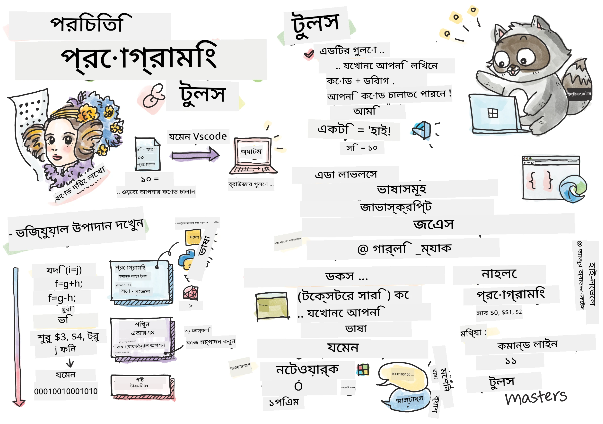
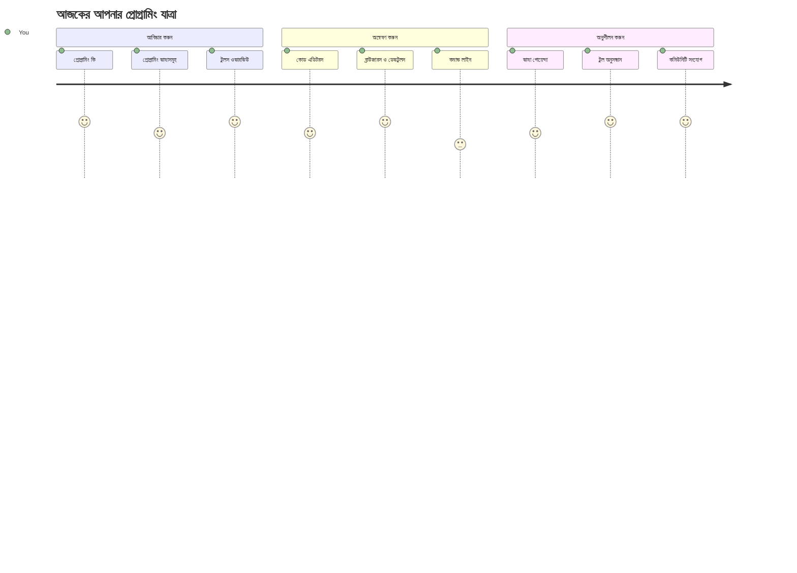
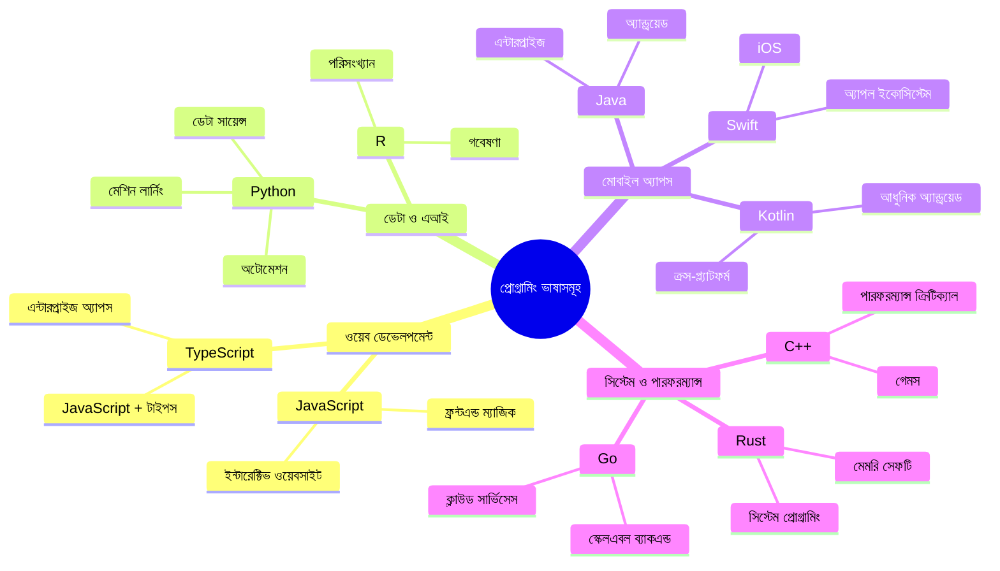
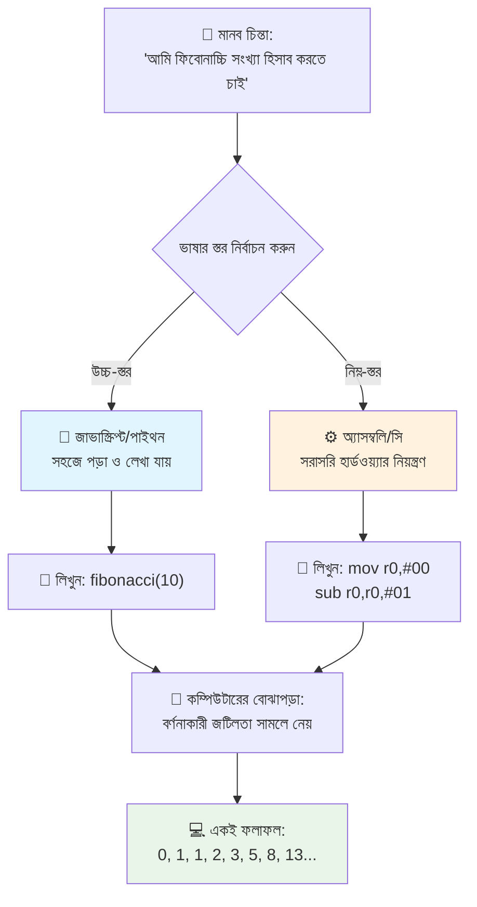
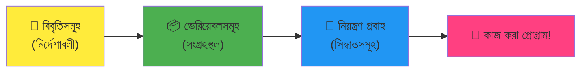
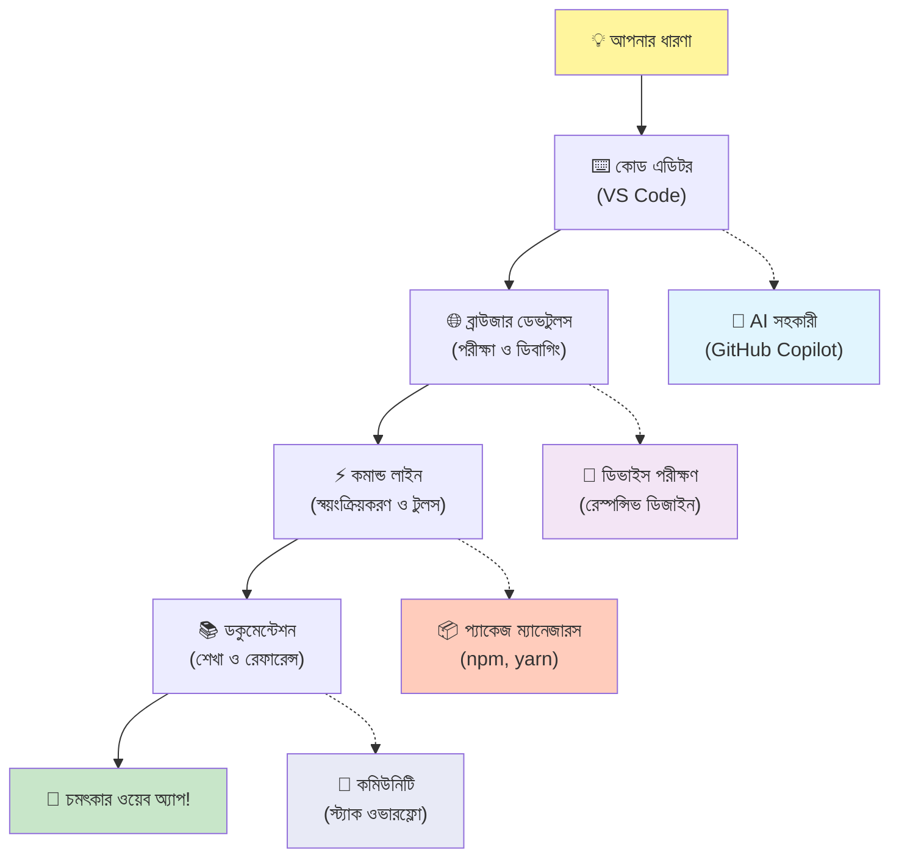
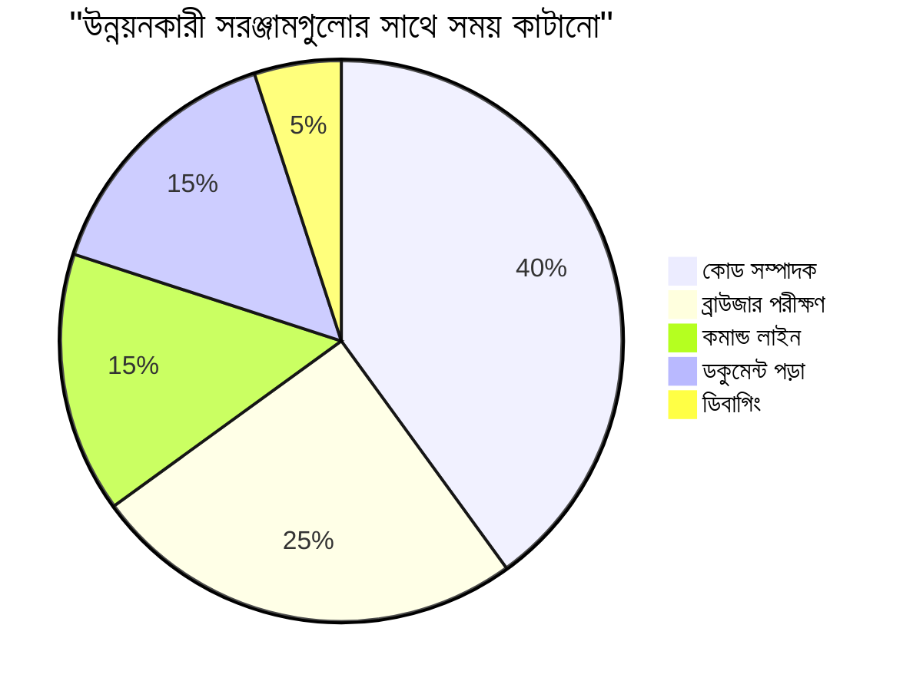
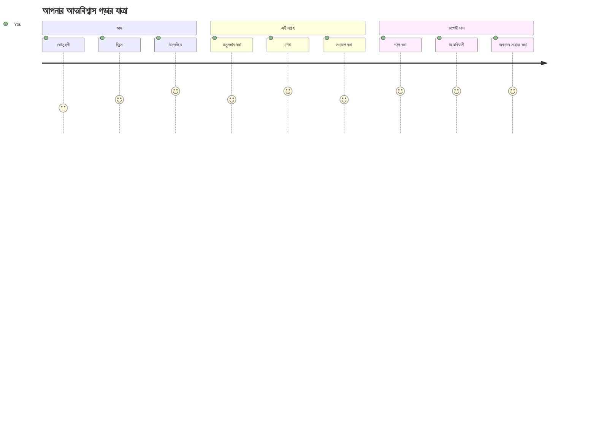

# প্রোগ্রামিং ভাষাসমূহ এবং আধুনিক ডেভেলপার সরঞ্জামগুলোর পরিচিতি

হেই সেখানে, ভবিষ্যত ডেভেলপার! 👋 আমি কি তোমাকে এমন কিছু বলতে পারি যা প্রতিদিন আমাকে উত্তেজিত করে? তুমি আবিষ্কার করতে যাচ্ছ যে প্রোগ্রামিং শুধুমাত্র কম্পিউটার নিয়ে নয় – এটা তোমার বন্যতম ধারণাগুলো জীবন্ত করার জন্য আসল উপশক্তি পাওয়ার ব্যাপার!

তুমি জান কি সেই মুহূর্ত যখন তুমি তোমার প্রিয় অ্যাপ ব্যবহার করছ এবং সবকিছু নিখুঁতভাবে কাজ করছে? যখন তুমি একটি বোতামে ট্যাপ করো এবং এমন কিছু ম্যাজিক ঘটে যা তোমায় ভাবতে বাধ্য করে "বাহ, তারা এটা কীভাবে করলো?" ঠিক তখনই তোমার মতো কেউ – সম্ভবত রাত ২টায় প্রিয় ক্যাফেতে তাদের তৃতীয় এসপ্রেসোর সাথে বসে – সেই ম্যাজিকটা তৈরি করার কোড লিখেছে। আর যা তোমার মন ফাঁপিয়ে দেবে তা হলো: এই পাঠের শেষে তুমি শুধু বুঝবে কীভাবে তারা তা করলো না, বরং নিজে চেষ্টা করতে মরিয়া হয়ে উঠবে!

দেখ, আমি পুরোপুরি বুঝতে পারি যদি তোমার কাছে প্রোগ্রামিং এখন ভয়ংকর মনে হয়। আমি যখন শুরু করি, সত্যি বলছি আমি ভাবতাম তোমাকে কোডিং করতে হলে ম্যাথের গুণী হতে হবে বা পাচ বছর বয়স থেকে কোড করতে হবে। কিন্তু আমার ভাবনাটা সম্পূর্ণ বদলে গেছে: প্রোগ্রামিং ঠিক নতুন ভাষায় আলাপ করতে শেখার মত। তুমি শুরু করো "হ্যালো" এবং "ধন্যবাদ" দিয়ে, তারপর কফি অর্ডার করো, আর সেটাই শোনার আগেই গভীর দার্শনিক আলোচনা শুরু হয়ে যায়! তবে এখানে, তুমি কম্পিউটারের সাথে কথা বলছ, এবং সত্যি বলছি? তারা সবচেয়ে ধৈর্যশীল আলাপচারী – তারা কখনো তোমার ভুল বিচার করে না এবং সবসময় আবার চেষ্টা করতে উত্তেজিত থাকে!

আজ আমরা এক্সপ্লোর করব অসাধারণ সরঞ্জামগুলো যা আধুনিক ওয়েব ডেভেলপমেন্টকে শুধুমাত্র সম্ভব করে না, বরং গুরুতর আসক্ত করা যায়। আমি বলতে চাই একই সম্পাদক, ব্রাউজার, এবং ওয়ার্কফ্লো যা Netflix, Spotify, এবং তোমার প্রিয় ইন্ডি অ্যাপ স্টুডিও ব্যবহার করে প্রতিদিন। আর যা তোমাকে নাচাতে বাধ্য করবে: এই অধিকাংশ পেশাদার মানের, ইন্ডাস্ট্রি-স্ট্যান্ডার্ড সরঞ্জামগুলো পুরোপুরি বিনামূল্যে!


> স্কেচনোট: [Tomomi Imura](https://twitter.com/girlie_mac)


```mermaid
journey
    title আজকের আপনার প্রোগ্রামিং যাত্রা
    section আবিষ্কার করুন
      প্রোগ্রামিং কি: 5: You
      প্রোগ্রামিং ভাষাসমূহ: 4: You
      টুলস ওভারভিউ: 5: You
    section অন্বেষণ করুন
      কোড এডিটরস: 4: You
      ব্রাউজারস ও ডেভটুলস: 5: You
      কমান্ড লাইন: 3: You
    section অনুশীলন করুন
      ভাষা গোয়েন্দা: 4: You
      টুল অনুসন্ধান: 5: You
      কমিউনিটি সংযোগ: 5: You
```
## দেখা যাক তুমি কি কি জানো!

সুন্দর বিষয়গুলোতে লাফানোর আগে, আমি কৌতূহলী – তুমি প্রোগ্রামিং সম্পর্কে কি জানো? আর শোনো, যদি তুমি এই প্রশ্নগুলো দেখে ভাবো "আমার একদম কোনো ধারণা নেই," সেটা কেবল ঠিকই নয়, এটা পারফেক্ট! এর মানে তুমি একদম সঠিক স্থানে আছো। ভাবো এই কুইজটা ওয়ার্ম-আপ হিসেবে – আমরা মস্তিষ্কের পেশি গরম করছি!

[পাঠের আগে কুইজ নাও](https://ff-quizzes.netlify.app/web/)


## আমরা যে অ্যাডভেঞ্চারে যাচ্ছি

ঠিক আছে, আমি সত্যিই উত্তেজিত আজ যা আমরা অন্বেষণ করব! সত্যিই, আমি চাই দেখতে পারতাম তোমার মুখ যখন কিছু ধারণা ক্লিক করবে। আমরা যে অসাধারণ যাত্রা একসাথে করব:

- **প্রোগ্রামিং আসলে কী (এবং কেন এটি সবচেয়ে কুল ব্যাপার!)** – আমরা আবিষ্কার করব কোড কীভাবে নিঃদৃশ্য ম্যাজিক যা তোমার চারপাশের সবকিছু চালায়, সেই এলার্ম থেকে যা সোমবার সকাল বুঝে নেয়, থেকে শুরু করে Netflix এর সুপারিশ এলগরিদম পর্যন্ত
- **প্রোগ্রামিং ভাষাসমূহ এবং তাদের চমৎকার ব্যক্তিত্ব** – কল্পনা করো তুমি এমন পার্টিতে যাচ্ছ যেখানে প্রতিটি ব্যক্তির আলাদা আলাদা সুপারপাওয়ার এবং সমস্যা সমাধানের ভিন্ন পন্থা আছে। প্রোগ্রামিং ভাষার জগতটা ঠিক তেমনই, আর তুমি তাদের সাথে পরিচিত হতে ভালোবাসবে!
- **মৌলিক নির্মাণ ব্লক যা ডিজিটাল ম্যাজিক করে** – এগুলোকে ভাবো চূড়ান্ত সৃজনশীল LEGO সেট হিসেবে। তুমি যখন বুঝবে কীভাবে এই টুকরোগুলো একসাথে মেলে, তখন হঠাৎ বুঝবে তুমি তোমার কল্পনার যেকোনো কিছু তৈরি করতে পারো
- **পেশাদার সরঞ্জাম যা তোমাকে উইজার্ডের ছড়ি পেয়ে যেরকম অনুভব করাবে** – আমি নাটকীয় হচ্ছি না – এই সরঞ্জামগুলো সত্যিই তোমাকে সুপারপাওয়ার দেবে, আর সবচেয়ে ভালো অংশ? এগুলোই প্রোফেশনালরা ব্যবহার করে!

> 💡 **টিপ:** আজ সব কিছু মুখস্থ করার চেষ্টা করো না! এখন আমি চাই তুমি সম্ভাবনার জন্য সেই আগুন অনুভব করো। বিস্তারিত স্বাভাবিকভাবেই মস্তিষ্কে জায়গা পাবে যখন আমরা একসাথে চর্চা করব – এভাবেই আসল শেখা হয়!

> তুমি পাঠটি [Microsoft Learn](https://learn.microsoft.com/en-us/learn/modules/web-development-101/introduction-programming/?WT.mc_id=academic-77807-sagibbon) থেকেও নিতে পারো!

## তো প্রোগ্রামিং *কি* আসলে?

ঠিক আছে, এই কোটি ডলারের প্রশ্নের উত্তর দিই: প্রোগ্রামিং আসলে কি?

আমি তোমাকে একটা গল্প বলব যা সম্পূর্ণভাবে আমার ভাবনাচিন্তা বদলে দিয়েছে। গত সপ্তাহে আমি আমার মাকে বোঝাতে চাচ্ছিলাম কিভাবে আমাদের নতুন স্মার্ট টিভির রিমোট ব্যবহার করতে হয়। আমি নিজেকে ধরলাম বলতে বলতে "লাল বোতাম চাপো, কিন্তু বড় লাল বোতামটা নয়, বামদিকের ছোট লাল বোতাম... না, তোমার অন্য বাম হাত... ঠিক আছে, এখন দুই সেকেন্ড ধরে ধরো, এক নয়, তিন নয়..." পরিচিত শোনাচ্ছে কি? 😅

এটাই প্রোগ্রামিং! এটা এমন বিস্তৃত, ধাপে ধাপে নির্দেশনা দেওয়ার শিল্প যা কিছু খুব শক্তিশালী কিন্তু সম্পূর্ণ নিখুঁতভাবে সবকিছু ঠিকঠাক বলতে হয়। মা কে বোঝানোর বদলে (যিনি জিজ্ঞেস করতে পারেন “কোন লাল বোতাম?!”), তুমি কম্পিউটারকে বোঝাচ্ছ যা ঠিক তোমার দেয়া কথা অনুযায়ী কাজ করে, যদিও হয়তো তুমি যা বলেছো সেটাই তুমি নেই চেয়েছিলে।

আমার মন ঘোরালো যখন প্রথম শিখলাম: কম্পিউটার আসলে তাদের মূল স্তরে বেশ সহজ। তারা শুধু দুইটি জিনিস বুঝতে পারে – ১ এবং ০, যেটা মূলত "হ্যাঁ" এবং "না" বা "অন" এবং "অফ"। এটাই! কিন্তু এখানে ম্যাজিক আসে – আমাদের ১ আর ০ তে কথা বলতে হয় না বরং **প্রোগ্রামিং ভাষা** আসে সাহায্যে। তারা যেন বিশ্বের সেরা দোভাষী, যারা তোমার নিখুঁত স্বাভাবিক মানুষের চিন্তাকে কম্পিউটার ভাষায় রূপান্তর করে।

আর যা আজ সকালেও আমাকে রোমাঞ্চিত করে: তোমার জীবনের সমস্ত ডিজিটাল শুরু হয় কারো কাছ থেকে যিনি তোমার মতো কেউ, সম্ভবত পাজামা পরে কফির কাপ হাতে ল্যাপটপে কোড লিখছিল। সেই ইনস্টাগ্রাম ফিল্টার যা তোমাকে পরিপূর্ণ দেখায়? কেউ কোড করেছে। সেই সুপারিশ যা তোমাকে তোমার নতুন প্রিয় গানটার কাছে নিয়ে গেছে? একজন ডেভেলপার সেই এলগরিদম তৈরি করেছে। এক অ্যাপ যা তোমাকে বন্ধুদের সাথে ডিনার বিল ভাগ করতে সাহায্য করে? হ্যাঁ, কেউ ভাবলো "এটা বিরক্তিকর, আমি এটা ঠিক করতে পারি" এবং তারপর... ঠিক করল!

তুমি যখন প্রোগ্রামিং শিখবে, তুমি শুধু নতুন একটি দক্ষতা গ্রহণ করছ না – তুমি অসাধারণ সমস্যাসমাধানকারী সম্প্রদায়ের অংশ হচ্ছ যা প্রতিদিন ভাবছে, "কী পাওয়া যেত যদি আমি এমন কিছু বানাই যা কারো দিনটা একটু উন্নত করে?" সত্যি বলছি, এর চাইতে ভালো আর কিছু হয় না!

✅ **মজার তথ্য অনুসন্ধান:** যখন তোমার কাছে অবসর থাকবে, তখন এই প্রশ্নটা খুঁজে দেখো – বিশ্বে প্রথম কম্পিউটার প্রোগ্রামার কে ছিল? আমি একটু ইঙ্গিত দেব: সেটা হয়তো তুমি ভাবছো না! এই ব্যক্তির গল্প পুরোপুরি আকর্ষণীয় এবং দেখায় প্রোগ্রামিং সবসময় সৃজনশীল সমস্যা সমাধান এবং দৃষ্টিকোণ থেকে ভিন্ন ভাবে চিন্তা করার বিষয়।

### 🧠 **চেক-ইন: কেমন লাগছে?**

**একটু সময় নিয়ে ভাবো:**
- "কম্পিউটারকে নির্দেশ দেওয়া" ভাবনাটা কি এখন বুঝতে পারছ?
- কোন দৈনন্দিন কাজ তুমি প্রোগ্রামিং দিয়ে স্বয়ংক্রিয় করতে চাও?
- এই পুরো প্রোগ্রামিং বিষয়ে কি প্রশ্ন তোমার মাথায় ঘুরছে?

> **মনে রেখো:** কিছু ধারণা এখন ধূসর মনে হলে তা স্বাভাবিক। প্রোগ্রামিং শেখা হচ্ছে নতুন ভাষা শেখার মতো – মস্তিষ্কে নতুন পথ তৈরি করতে সময় লাগে। তুমি ভালই করছ!

## প্রোগ্রামিং ভাষা হলো বিভিন্ন ধরনের ম্যাজিকের স্বাদ

ঠিক আছে, এটা অদ্ভুত শোনাতে পারে, কিন্তু মনোযোগ দাও – প্রোগ্রামিং ভাষাগুলো হয়তো বিভিন্ন ধরনের সঙ্গীতের মত। ভাবো: তোমার কাছে জাজ আছে, যা মসৃণ এবং প্রাঞ্জল, রক যা শক্তিশালী এবং সরল, ক্লাসিক্যাল যা মার্জিত এবং কাঠামোগত, আর হিপ-হপ যা সৃজনশীল এবং প্রকাশমূলক। প্রতিটি শৈলীর নিজস্ব আবহ, তার নিজস্ব স্বপ্নিল ভক্ত সম্প্রদায়, এবং প্রতিটির জন্য সঠিক সময় ও মনোভাব আলাদা।

প্রোগ্রামিং ভাষাগুলোও একদম এমনই কাজ করে! তুমি একই ভাষা ব্যবহার করবে না মজাদার একটি মোবাইল গেম বানানোর জন্য যেটা বিশাল পরিমাণ জলবায়ু ডেটা বিশ্লেষণ করার জন্য ব্যবহার করো, যেমন তুমি কোনো যোগ ক্লাসে ডেথ মেটাল বাজাবে না (তবে বেশিরভাগ যোগ ক্লাসে! 😄)।

কিন্তু যা আমাকে প্রতিবার অবাক করে দেয় তা হলো: এই ভাষাগুলো হলো পৃথিবীর সবচেয়ে ধৈর্যশীল, প্রতিভাবান দোভাষী যিনি ঠিক তোমার পাশেই বসে আছেন। তুমি তোমার ভাবনাগুলো এমনভাবে প্রকাশ করতে পারো যা তোমার মানুষের মস্তিষ্কের জন্য স্বাভাবিক, আর তারা সেই ভাবনাগুলো ১ এবং ০ তে অনুবাদ করে যা কম্পিউটার বুঝে। এটা যেন একজন বন্ধু যার দুটো ভাষাতেই পারদর্শী – "মানব সৃজনশীলতা" এবং "কম্পিউটার লজিক" – এবং সে কখনো ক্লান্ত হয় না, কখনো কফির বিরতি নিতে চায় না, আর যেই প্রশ্ন দ্বিতীয়বার করো তাকে রাগ করে না!

### জনপ্রিয় প্রোগ্রামিং ভাষা এবং তাদের ব্যবহার


```mermaid
mindmap
  root((প্রোগ্রামিং ভাষাসমূহ))
    ওয়েব ডেভেলপমেন্ট
      JavaScript
        ফ্রন্টএন্ড ম্যাজিক
        ইন্টারেক্টিভ ওয়েবসাইট
      TypeScript
        JavaScript + টাইপস
        এন্টারপ্রাইজ অ্যাপস
    ডেটা ও এআই
      Python
        ডেটা সায়েন্স
        মেশিন লার্নিং
        অটোমেশন
      R
        পরিসংখ্যান
        গবেষণা
    মোবাইল অ্যাপস
      Java
        অ্যান্ড্রয়েড
        এন্টারপ্রাইজ
      Swift
        iOS
        অ্যাপল ইকোসিস্টেম
      Kotlin
        আধুনিক অ্যান্ড্রয়েড
        ক্রস-প্ল্যাটফর্ম
    সিস্টেম ও পারফরম্যান্স
      C++
        গেমস
        পারফরম্যান্স ক্রিটিক্যাল
      Rust
        মেমরি সেফটি
        সিস্টেম প্রোগ্রামিং
      Go
        ক্লাউড সার্ভিসেস
        স্কেলএবল ব্যাকএন্ড
```
| ভাষা | সেরার জন্য | কেন জনপ্রিয় |
|----------|----------|------------------|
| **JavaScript** | ওয়েব ডেভেলপমেন্ট, ব্যবহারকারীর ইন্টারফেস | ব্রাউজারে চলে এবং ইন্টারেক্টিভ ওয়েবসাইট চালায় |
| **Python** | ডেটা সায়েন্স, অটোমেশন, AI | পড়া ও শেখা সহজ, শক্তিশালী লাইব্রেরি রয়েছে |
| **Java** | এন্টারপ্রাইজ অ্যাপ্লিকেশন, অ্যান্ড্রয়েড অ্যাপ | প্ল্যাটফর্ম-স্বাধীন, বড় সিস্টেমের জন্য মজবুত |
| **C#** | উইন্ডোজ অ্যাপ্লিকেশন, গেম ডেভেলপমেন্ট | শক্তিশালী মাইক্রোসফট ইকোসিস্টেম সমর্থন |
| **Go** | ক্লাউড সার্ভিস, ব্যাকএন্ড সিস্টেম | দ্রুত, সরল, আধুনিক কম্পিউটিংয়ের জন্য ডিজাইন করা |

### উচ্চ-স্তরের বনাম নিম্ন-স্তরের ভাষা

ঠিক আছে, সত্যি বলতে শুরুতে এই ধারণাই আমার মাথা ঘুরিয়ে দিয়েছিল, তাই আমি এমন একটি উপমা শেয়ার করতে যাচ্ছি যা অবশেষে আমাকে বুঝিয়েছে – আশা করি তোমাকেও সাহায্য করবে!

ভাবো তুমি এমন দেশে গেছ যেখানকার ভাষা তুমি বলতে পারো না, আর খুব জরুরি ভাবে কাছে বাথরুম খুঁজে বের করতে হবে (আমরা সবাই এমন পরিস্থিতিতে পড়েছি, তাই না? 😅):

- **নিম্ন-স্তরের প্রোগ্ৰামিং** হলো স্থানীয় উপভাষা এতটাই ভালো শেখা যাতে তুমি সেবাজার Fruit বিক্রেতা দাদী’কে স্থানীয় সাংস্কৃতিক রেফারেন্স, উপভাষা এবং ভিতরের রসিকতা দিয়ে বঝাতে পারো। সুপার ইম্প্রেসিভ এবং খুব দক্ষ... যদি তুমি দেওয়ানি হয়ে গেছ! কিন্তু যখন শুধু বাথরুম খুঁজছ, তখন সেটা বেশি চাপের।

- **উচ্চ-স্তরের প্রোগ্ৰামিং** হলো সেই অসাধারণ স্থানীয় বন্ধুর মত যিনি তোমাকে বুঝে বুঝে। তুমি সহজ ইংরেজিতে বলতে পারো "আমাকে বাথরুম খুঁজে পেতে হবে," এবং সে সমস্ত সাংস্কৃতিক অনুবাদ করে তোমাকে খুব সহজ ভাবে ঠিকঠাক নির্দেশনা দেয় যা তোমার বিদেশী মাথায় সহজবোধ্য।

প্রোগ্রামিংয়ের ভাষায়:
- **নিম্ন-স্তরের ভাষা** (যেমন Assembly বা C) তোমাকে কম্পিউটারের হার্ডওয়্যারের সাথে গভীরতায় কথা বলার সুযোগ দেয়, কিন্তু তোমাকে মেশিনের মত ভাবতে হয়, যা আদতে... হ্যাঁ, এটা প্রচন্ড মানসিক পরিবর্তন!
- **উচ্চ-স্তরের ভাষা** (যেমন JavaScript, Python, বা C#) তোমায় মানুষের মত ভাবতে দেয় যখন তারা পিছনে মেশিনভাষা সব কাজ পরিচালনা করে। আর তাদের কমিউনিটিগুলো অসাধারণ বন্ধুবৎসল যারা বুঝে নতুনদের কেমন লাগে এবং সত্যিই সাহায্য করতে চায়!

দেখো আমি কোনগুলো দিয়ে শুরু করার পরামর্শ দেব? 😉 উচ্চ-স্তরের ভাষাগুলো হলো সেই প্রশিক্ষণ চাকা যা তুমি কখনো খুলতে চাও না কারণ তারা পুরো অভিজ্ঞতাটাই অনেক বেশি সুখকর করে তোলে!


```mermaid
flowchart TB
    A["👤 মানব চিন্তা:<br/>'আমি ফিবোনাচ্চি সংখ্যা হিসাব করতে চাই'"] --> B{ভাষার স্তর নির্বাচন করুন}
    
    B -->|উচ্চ-স্তর| C["🌟 জাভাস্ক্রিপ্ট/পাইথন<br/>সহজে পড়া ও লেখা যায়"]
    B -->|নিম্ন-স্তর| D["⚙️ অ্যাসম্বলি/সি<br/>সরাসরি হার্ডওয়্যার নিয়ন্ত্রণ"]
    
    C --> E["📝 লিখুন: fibonacci(10)"]
    D --> F["📝 লিখুন: mov r0,#00<br/>sub r0,r0,#01"]
    
    E --> G["🤖 কম্পিউটারের বোঝাপড়া:<br/>বর্ণনাকারী জটিলতা সামলে নেয়"]
    F --> G
    
    G --> H["💻 একই ফলাফল:<br/>0, 1, 1, 2, 3, 5, 8, 13..."]
    
    style C fill:#e1f5fe
    style D fill:#fff3e0
    style H fill:#e8f5e8
```
### দেখাই কেন উচ্চ-স্তরের ভাষাগুলো অনেক বেশি বন্ধুত্বপূর্ণ

ঠিক আছে, আমি তোমাকে এমন একটি উদাহরণ দেখাতে যাচ্ছি যা আমার কেন উচ্চ-স্তরের ভাষাকে ভালোবাসি তা কেমন তা বুঝিয়ে দেয়, তবে আগে – একটাই অনুরোধ আছে। প্রথম কোডটা দেখলে ভয় পাওনা! এটা ভয়ঙ্কর দেখানো হয়েছে, ঠিক তেমনই হওয়া উচিত!

আমরা একই কাজ দুই ভিন্ন ধাঁচে দেখব। দুটোর কাজ হলো যে নাম দেওয়া হয় ফিবোনাচ্চি সিকোয়েন্স তৈরি করা – এটা এক অসাধারণ গণিতীয় প্যাটার্ন যেখানে প্রতিটি সংখ্যা আগের দুইটির যোগফল: 0, 1, 1, 2, 3, 5, 8, 13... (মজা করে বলছি, এই প্যাটার্ন তুমি প্রকৃতিতে সর্বত্র পাবে – সূর্যমুখী বীজের সপিরাল, পাইনকন প্যাটার্ন, এমনকি গ্যালাক্সি গঠনেও!)

দেখতে তৈরি? চল শুরু করি!

**উচ্চ-স্তরের ভাষা (JavaScript) – মানুষের জন্য সহজ:**

```javascript
// ধাপ ১: মৌলিক ফিবোনাচ্চি সেটআপ
const fibonacciCount = 10;
let current = 0;
let next = 1;

console.log('Fibonacci sequence:');
```

**এই কোডটি যা করে:**
- **ঘোষণা** একটি ধ্রুবক মান যেখানে কতগুলো ফিবোনাচ্চি সংখ্যা তৈরি করতে হবে নির্ধারণ করে
- **শুরু** দুইটি ভেরিয়েবল যেগুলো সিকোয়েন্সের বর্তমান এবং পরবর্তী সংখ্যার ট্র্যাক রাখে
- **সেটআপ** শুরু মানগুলো (0 এবং 1) যেগুলো ফিবোনাচ্চি প্যাটার্ন নির্ধারণ করে
- **দেখানো** একটি হেডার মেসেজ আউটপুট সম্পর্কিত

```javascript
// ধাপ ২: একটি লুপ দিয়ে ক্রম তৈরি করুন
for (let i = 0; i < fibonacciCount; i++) {
  console.log(`Position ${i + 1}: ${current}`);
  
  // ক্রমের পরবর্তী সংখ্যা গণনা করুন
  const sum = current + next;
  current = next;
  next = sum;
}
```

**এখানে যা ঘটছে ব্রেকডাউন:**
- **লুপ** প্রতিটি অবস্থানে `for` লুপ ব্যবহার করে
- **প্রদর্শন** প্রতিটি সংখ্যা এবং তার অবস্থান টেমপ্লেট লিটারাল ফরম্যাটে
- **হিসাব** পরবর্তী ফিবোনাচ্চি সংখ্যা যোগ করে যা বর্তমান এবং পরবর্তী মান গুলো নিয়ে তৈরি হয়
- **আপডেট** আমাদের ট্র্যাকিং ভেরিয়েবলগুলো পরবর্তী ধাপে নিয়ে যেতে

```javascript
// ধাপ ৩: আধুনিক কার্যকরী পদ্ধতি
const generateFibonacci = (count) => {
  const sequence = [0, 1];
  
  for (let i = 2; i < count; i++) {
    sequence[i] = sequence[i - 1] + sequence[i - 2];
  }
  
  return sequence;
};

// ব্যবহারের উদাহরণ
const fibSequence = generateFibonacci(10);
console.log(fibSequence);
```

**উপরের কোডে আমরা:**
- **তৈরি করেছি** একটি পুনঃব্যবহারযোগ্য ফাংশন আধুনিক অ্যারো ফাংশন সিনট্যাক্স ব্যবহার করে
- **নির্মাণ করেছি** একটি অ্যারে সম্পূর্ণ সিকোয়েন্সের জন্য যা একযোগে দেখানোর থেকে ভালো
- **ব্যবহার করেছি** অ্যারে ইনডেক্সিং প্রতিটি নতুন সংখ্যা আগের মান থেকে হিসাব করার জন্য
- **রিটার্ন করেছি** সম্পূর্ণ সিকোয়েন্স প্রোগ্রামের অন্য অংশে ব্যবহার করার জন্য

**নিম্ন-স্তরের ভাষা (ARM Assembly) – কম্পিউটারের জন্য উপযোগী:**

```assembly
 area ascen,code,readonly
 entry
 code32
 adr r0,thumb+1
 bx r0
 code16
thumb
 mov r0,#00
 sub r0,r0,#01
 mov r1,#01
 mov r4,#10
 ldr r2,=0x40000000
back add r0,r1
 str r0,[r2]
 add r2,#04
 mov r3,r0
 mov r0,r1
 mov r1,r3
 sub r4,#01
 cmp r4,#00
 bne back
 end
```

দ্রষ্টব্য: JavaScript সংস্করণ প্রায় ইংরেজি নির্দেশনার মতো পড়ে, যেখানে Assembly সংস্করণ রহস্যময় কমান্ড ব্যবহার করে যা সরাসরি কম্পিউটারের প্রসেসর নিয়ন্ত্রণ করে। উভয়ই এক্কেবারে একই কাজ করে কিন্তু উচ্চ-স্তরের ভাষা মানুষের জন্য বোঝা, লেখা ও রক্ষণাবেক্ষণে অনেক সহজ।

**মূল পার্থক্য যা দেখতে পাবে:**
- **পঠনযোগ্যতা**: জাভাস্ক্রিপ্ট ব্যবহার করে বর্ণনামূলক নাম যেমন `fibonacciCount`, যেখানে অ্যাসেম্বলি ব্যবহার করে রহস্যময় লেবেল যেমন `r0`, `r1`  
- **টীকা**: উচ্চ স্তরের ভাষাগুলো ব্যাখ্যামূলক টীকা উৎসাহিত করে যা কোডকে স্বয়ংদস্তাবেজী করে তোলে  
- **গঠন**: জাভাস্ক্রিপ্টের যৌক্তিক প্রবাহ মানুষের মত ধাপে ধাপে সমস্যার চিন্তা করার সঙ্গে মেলে  
- **রক্ষণাবেক্ষণ**: ভিন্ন চাহিদার জন্য জাভাস্ক্রিপ্ট সংস্করণ আপডেট করা সহজ এবং পরিষ্কার  

✅ **ফিবোনাকি সিকোয়েন্স সম্পর্কে**: এই একেবারে চমৎকার সংখ্যার ধারা (যেখানে প্রতিটি সংখ্যা তার আগের দুইটির যোগফল: ০, ১, ১, ২, ৩, ৫, ৮…) প্রকৃতিতে প্রকৃতপক্ষে *সবখানে* দেখা যায়! আপনি এটি দেখতে পাবেন সূর্যমুখী ফুলের সাপের মতো স্পাইরাল, পাইনকোন প্যাটার্ন, নটিলাস শেলের বক্ররেখায়, এমনকি গাছের ডালের বৃদ্ধিতেও। গণিত এবং কোড কতদূর আমাদের সাহায্য করতে পারে প্রকৃতির সৌন্দর্য তৈরিতে ব্যবহৃত প্যাটার্নগুলো বুঝতে এবং পুনর্নির্মাণ করতে — এটা সত্যিই চিন্তাশীল!  


## যেসব ভিত্তি গঠন করে জাদু ঘটে

ঠিক আছে, এখন আপনি প্রোগ্রামিং ভাষাগুলো কাজ করে দেখতে পেয়েছেন, চলুন প্রতিটি প্রোগ্রামের মূল উপাদানগুলো বিশ্লেষণ করি। এগুলোকে ভাবুন আপনার প্রিয় রেসিপির অপরিহার্য উপাদান হিসেবে – একবার আপনি বুঝে গেলে প্রতিটি উপাদান কী করে, আপনি প্রায় যেকোনো ভাষায় কোড পড়তে এবং লিখতে পারবেন!

এটি প্রোগ্রামিংয়ের ব্যাকরণ শিখনের মতো কিছুটা। মনে আছে স্কুলে যখন আপনি নাম, ক্রিয়া, এবং বাক্য গঠনের নিয়ম শিখেছিলেন? প্রোগ্রামিংয়ের নিজস্ব ব্যাকরণ আছে এবং সৎভাবে বলতে কী, এটা ইংরেজি ব্যাকরণের তুলনায় অনেক বেশি যৌক্তিক এবং দয়ালু! 😄

### বিবৃতি: ধাপে ধাপে নির্দেশনা

চলুন শুরু করি **বিবৃতি** দিয়ে – এগুলো আপনার কম্পিউটারের সাথে কথোপকথনের পৃথক বাক্যের মতো। প্রতিটি বিবৃতি কম্পিউটারকে একটি নির্দিষ্ট কাজ করতে বলে, যেন নির্দেশনা দেয়: "এখানে বামদিকে ঘুরো", "লাল বর্ণের আলোতে থামো", "এই স্পটে পার্ক করো।"

বিবৃতিগুলো কতটা পড়তে সুবিধাজনক সে ব্যাপারে আমি খুব পছন্দ করি। এটা দেখুন:

```javascript
// মৌলিক বিবৃতিগুলো যা একক ক্রিয়া সম্পাদন করে
const userName = "Alex";                    
console.log("Hello, world!");              
const sum = 5 + 3;                         
```
  
**এই কোড কী করে:**  
- একটি ধ্রুবক ভেরিয়েবল ঘোষণা করে একজন ব্যবহারকারীর নাম সংরক্ষণ করতে  
- কনসোলে একটি শুভেচ্ছা বার্তা প্রদর্শন করে  
- একটি গাণিতিক ক্রিয়ার ফলাফল হিসাব করে সংরক্ষণ করে  

```javascript
// এমন বিবৃতিগুলি যা ওয়েব পৃষ্ঠাগুলির সাথে যোগাযোগ করে
document.title = "My Awesome Website";      
document.body.style.backgroundColor = "lightblue";
```
  
**ধাপে ধাপে যা ঘটছে:**  
- ব্রাউজারের ট্যাবের শিরোনাম পরিবর্তন করে  
- পুরো পৃষ্ঠার পটভূমির রঙ পরিবর্তন করে  

### ভেরিয়েবল: আপনার প্রোগ্রামের স্মৃতি ব্যবস্থা

ঠিক আছে, **ভেরিয়েবল** আসলে আমার সবচেয়ে প্রিয় ধারণাগুলোর একটি কারণ এগুলো প্রতিদিন আপনি যেগুলো ব্যবহার করেন তার মতোই!

আপনার ফোনের কন্টাক্ট লিস্টের কথা ভাবুন এক মুহূর্ত। আপনি সবার ফোন নম্বর মুখস্থ করেন না – পরিবর্তে, আপনি "মা", "সেরা বন্ধু", অথবা "রাত ২টা পর্যন্ত পিজ্জা ডেলিভারির দোকান" সংরক্ষণ করেন এবং আপনার ফোন ওই সংখ্যাগুলো মনে রাখে। ভেরিয়েবলগুলোও ঠিক একই কাজ করে! এগুলো লেবেলযুক্ত ধারক যেখানে আপনার প্রোগ্রাম তথ্য সংরক্ষণ করতে পারে এবং পরে একটি বোধ্য নাম দিয়ে তা পুনরুদ্ধার করতে পারে।

এখানে সবচেয়ে চমৎকার বিষয় হলো: ভেরিয়েবলগুলি আপনার প্রোগ্রামের চলাকালীন পরিবর্তন হতে পারে (তাই নামটা "ভেরিয়েবল" – দেখতে পাচ্ছেন?). যেমন আপনি যদি আরও ভাল কোনো পিজ্জার দোকান আবিষ্কার করেন আপনি সেই কন্টাক্টটা আপডেট করবেন, ঠিক তেমনই প্রোগ্রাম নতুন তথ্য শিখলেই বা পরিস্থিতি বদলালেই ভেরিয়েবল আপডেট করা যায়!

আমি দেখাই এটা কতটা সুন্দর এবং সোজা হতে পারে:

```javascript
// ধাপ ১: মৌলিক ভেরিয়েবল তৈরি করা
const siteName = "Weather Dashboard";        
let currentWeather = "sunny";               
let temperature = 75;                       
let isRaining = false;                      
```
  
**এই ধারণাগুলো বোঝার জন্য:**  
- অপরিবর্তনীয় মান `const` ভেরিয়েবল এ সংরক্ষণ করা (যেমন সাইটের নাম)  
- `let` ব্যবহার করা এমন মানের জন্য যা পুরো প্রোগ্রামে পরিবর্তন হতে পারে  
- বিভিন্ন ডেটা টাইপ নির্ধারণ করা: স্ট্রিং (পাঠ্য), সংখ্যা, এবং বুলিয়ান (সত্য/মিথ্যা)  
- বর্ণনামূলক নাম নির্বাচন করা যা বোঝায় প্রতিটি ভেরিয়েবল কী ধারণ করে  

```javascript
// পদক্ষেপ ২: সম্পর্কিত ডেটা গুচ্ছিত করার জন্য অবজেক্টের সাথে কাজ করা
const weatherData = {                       
  location: "San Francisco",
  humidity: 65,
  windSpeed: 12
};
```
  
**উপরের উদাহরণে আমরা:**  
- সম্পর্কিত আবহাওয়ার তথ্য একটি অবজেক্টে সংযুক্ত করেছি  
- একাধিক তথ্য একই ভেরিয়েবল নামের নিচে সাজিয়েছি  
- কী-ভ্যালু জোড়া ব্যবহার করে প্রতিটি তথ্য স্পষ্টভাবে লেবেল করেছি  

```javascript
// ধাপ ৩: চলকগুলি ব্যবহার এবং আপডেট করা
console.log(`${siteName}: Today is ${currentWeather} and ${temperature}°F`);
console.log(`Wind speed: ${weatherData.windSpeed} mph`);

// পরিবর্তনযোগ্য চলকগুলি আপডেট করা
currentWeather = "cloudy";                  
temperature = 68;                          
```
  
**প্রত্যেক অংশ বুঝি:**  
- `${}` সিনট্যাক্স দিয়ে টেমপ্লেট লিটারেল ব্যবহার করে তথ্য প্রদর্শন করা  
- ডট নোটেশন (`weatherData.windSpeed`) দিয়ে অবজেক্টের প্রপার্টিতে অ্যাক্সেস করা  
- `let` দিয়ে ঘোষিত ভেরিয়েবলগুলো আপডেট করে পরিবর্তনশীল পরিস্থিতি প্রতিফলিত করা  
- অর্থবহ বার্তা তৈরিতে একাধিক ভেরিয়েবল মিলিয়ে ব্যবহার করা  

```javascript
// ধাপ ৪: পরিষ্কার কোডের জন্য আধুনিক ডেস্ট্রাকচারিং
const { location, humidity } = weatherData; 
console.log(`${location} humidity: ${humidity}%`);
```
  
**আপনাকে যা জানতে হবে:**  
- অবজেক্ট থেকে নির্দিষ্ট প্রপার্টি নিষ্কাশন করতে ডেস্ট্রাকচারিং অ্যাসাইনমেন্ট ব্যবহার করা  
- একই নামে নতুন ভেরিয়েবল তৈরি করা যা অবজেক্টের কী-এর সমান  
- বারংবার ডট নোটেশন ব্যবহার এড়িয়ে কোডটি সহজ করা  

### নিয়ন্ত্রণ প্রবাহ: আপনার প্রোগ্রামকে চিন্তা শেখানো

ঠিক আছে, এখানে প্রোগ্রামিং একদম অবিশ্বাস্য হয়ে ওঠে! **নিয়ন্ত্রণ প্রবাহ** আসলে আপনার প্রোগ্রামকে বুদ্ধিদীপ্ত সিদ্ধান্ত নিতে শেখানো, ঠিক যেমন আপনি প্রতিদিন করেন অবচেতনভাবেই।

কল্পনা করুন: আজ সকালেই আপনি হয়তো এমন কিছু করেছেন "যদি বৃষ্টি হয়, তবে ছাতা নিয়ে যাব। যদি ঠাণ্ডা হয়, তাহলে জ্যাকেট পরব। যদি দেরি হয়, তবে ব্রেকফাস্ট বাদ দিয়ে রাস্তার পাশে কফি নেব।" আপনার মস্তিষ্ক স্বাভাবিকভাবেই এই if-then লজিকটি দিনে কয়েকবার অনুসরণ করে!

এটাই প্রোগ্রামগুলোকে বুদ্ধিমান এবং জীবন্ত বোধ করায়, শুধু একঘেয়েমি এবং পূর্বানুমেয় স্ক্রিপ্ট অনুসরণ করে না। তারা বাস্তব পরিস্থিতি দেখতে পারে, মূল্যায়ন করতে পারে কী ঘটছে, এবং যথাযথ প্রতিক্রিয়া জানাতে পারে। এটি আপনার প্রোগ্রামকে এমন একটি মস্তিষ্ক দেয় যা অভিযোজন করতে এবং সিদ্ধান্ত নিতে পারে!

দেখতে চান এটা কত সুন্দর কাজ করে? আমি দেখাই:

```javascript
// ধাপ ১: মৌলিক শর্তসাপেক্ষ যুক্তি
const userAge = 17;

if (userAge >= 18) {
  console.log("You can vote!");
} else {
  const yearsToWait = 18 - userAge;
  console.log(`You'll be able to vote in ${yearsToWait} year(s).`);
}
```
  
**এই কোড কী করে:**  
- ব্যবহারকারীর বয়স ভোটদানের যোগ্যতার জন্য পরীক্ষা করে  
- শর্তের ফলাফলের উপর ভিত্তি করে ভিন্ন কোড ব্লক কার্যকর করে  
- ১৮ এর নিচে থাকলে ভোটারের যোগ্য হওয়ার সময় কতদূর, তা হিসাব ও প্রদর্শন করে  
- প্রতিটি পরিস্থিতির জন্য নির্দিষ্ট এবং সহায়ক প্রতিক্রিয়া প্রদান করে  

```javascript
// ধাপ ২: যৌক্তিক অপারেটরস সহ একাধিক শর্ত
const userAge = 17;
const hasPermission = true;

if (userAge >= 18 && hasPermission) {
  console.log("Access granted: You can enter the venue.");
} else if (userAge >= 16) {
  console.log("You need parent permission to enter.");
} else {
  console.log("Sorry, you must be at least 16 years old.");
}
```
  
**এখানে যা ঘটে তার বিশ্লেষণ:**  
- `&&` (এবং) অপারেটর দিয়ে একাধিক শর্ত মিলিয়ে ব্যবহার করা  
- একাধিক পরিস্থিতির জন্য `else if` এর মাধ্যমে শর্তের হায়ারার্কি তৈরি করা  
- সব সম্ভব পরিস্থিতি শেষ পর্যন্ত `else` বিবৃতিতে হ্যান্ডেল করা  
- প্রতিটি আলাদা পরিস্থিতির জন্য পরিষ্কার এবং প্রক্রিয়াযোগ্য প্রতিক্রিয়া প্রদান করা  

```javascript
// ধাপ ৩: টার্নারি অপারেটরসহ সংক্ষিপ্ত শর্তীয় বিবৃতি
const votingStatus = userAge >= 18 ? "Can vote" : "Cannot vote yet";
console.log(`Status: ${votingStatus}`);
```
  
**আপনাকে যা মনে রাখা দরকার:**  
- সহজ দুই-চয়ন শর্তের জন্য টার্নারি অপারেটর (`? :`) ব্যবহার করা  
- প্রথমে শর্ত লিখুন, তারপর `?`, সত্য ফলাফল, তারপর `:`, মিথ্যা ফলাফল লিখুন  
- এই প্যাটার্ন প্রয়োগ করুন যখন শর্তের ভিত্তিতে মান বরাদ্দ করতে হয়  

```javascript
// ধাপ ৪: একাধিক নির্দিষ্ট ক্ষেত্রে পরিচালনা করা
const dayOfWeek = "Tuesday";

switch (dayOfWeek) {
  case "Monday":
  case "Tuesday":
  case "Wednesday":
  case "Thursday":
  case "Friday":
    console.log("It's a weekday - time to work!");
    break;
  case "Saturday":
  case "Sunday":
    console.log("It's the weekend - time to relax!");
    break;
  default:
    console.log("Invalid day of the week");
}
```
  
**এই কোড নিম্নলিখিত accomplish করে:**  
- ভেরিয়েবল মান একাধিক নির্দিষ্ট কেসের বিরুদ্ধে মিলিয়ে দেখে  
- মিলসংক্রান্ত কেসগুলো (সপ্তাহের দিন বনাম ছুটির দিন) একত্রিত করে  
- মিল পাওয়া গেলে যথাযথ কোড ব্লক কার্যকর করে  
- অপ্রত্যাশিত মানের জন্য `default` কেস অন্তর্ভুক্ত করে  
- পরবর্তী কেসে যাওয়া বন্ধ করতে `break` স্টেটমেন্ট ব্যবহার করে  

> 💡 **বাস্তব জীবনের তুলনা**: নিয়ন্ত্রণ প্রবাহ ভাবুন এমন এক ধৈর্যশীল GPS-এর মতো যা আপনার পথে পথনির্দেশ দেয়। বলতে পারে "যদি মেইন স্ট্রিটে ট্রাফিক থাকে, তবে হাইওয়ে নাও। যদি হাইওয়ে নির্মাণ বাধাগ্রস্ত করে, তবে দৃশ্যমান পথ নাও।" প্রোগ্রামগুলো এক রকমের শর্তাধীন লজিক ব্যবহার করে বুদ্ধিমানভাবে ভিন্ন পরিস্থিতিতে সাড়া দেয় এবং ব্যবহারকারীদের সর্বোত্তম অভিজ্ঞতা প্রদান করে।

### 🎯 **ধারণা যাচাই: ভিত্তি দক্ষতা**

**চলুন দেখি আপনি মৌলিক বিষয়গুলো কতটা বুঝেছেন:**  
- আপনার ভাষায় ভেরিয়েবল এবং বিবৃতির মধ্যে পার্থক্য বর্ণনা করতে পারেন?  
- বাস্তব জীবনের এমন একটি পরিস্থিতি ভাবুন যেখানে if-then সিদ্ধান্ত ব্যবহার করবেন (যেমন ভোটদানের উদাহরণ)  
- প্রোগ্রামিং লজিকের কোনটি আপনাকে সবচেয়ে বিস্মিত করেছে?  

**দ্রুত আত্মবিশ্বাস বাড়ানোর জন্য:**  

```mermaid
flowchart LR
    A["📝 বিবৃতিসমূহ<br/>(নির্দেশাবলী)"] --> B["📦 ভেরিয়েবলসমূহ<br/>(সংগ্রহস্থল)"] --> C["🔀 নিয়ন্ত্রণ প্রবাহ<br/>(সিদ্ধান্তসমূহ)"] --> D["🎉 কাজ করা প্রোগ্রাম!"]
    
    style A fill:#ffeb3b
    style B fill:#4caf50
    style C fill:#2196f3
    style D fill:#ff4081
```  
✅ **পরবর্তী যে বিষয় আসছে:** আমরা এগুলো আরও গভীরে ডুব দেব এই অসাধারণ যাত্রায়! এখন শুধু পুরো দুনিয়ার অসাধারণ সম্ভাবনার প্রতি উৎসাহ অনুভব করুন। বিশেষ দক্ষতা এবং কৌশল স্বাভাবিকভাবেই আয়ত্ত হবে আমাদের একসঙ্গে অনুশীলন করার মাধ্যমে – আমি প্রতিশ্রুতি দিচ্ছি এটা আপনার প্রত্যাশার চেয়ে অনেক বেশি মজার হবে!

## যন্ত্রপাতি

ঠিক আছে, এখানে আমি এত উত্তেজিত হই যে নিজেকে সামলাতে পারি না! 🚀 আমরা এখন কথা বলব সেই অবিশ্বাস্য যন্ত্রপাতিগুলো সম্পর্কে যা আপনাকে ডিজিটাল স্পেসশিপের চাবি হাতে পেয়ে গিয়েছেন এমন অনুভূতি দিবে।

আপনি জানেন কিভাবে একজন শেফের কাছে রয়েছে নিখুঁত ভারসাম্যপূর্ণ ছুরি যা হাতের অংশের মতো লাগে? অথবা কিভাবে একজন সঙ্গীতশিল্পীর কাছে একটা গিটার থাকে যা স্পর্শ করলেই গান শুরু করে? ঠিক তেমনই, ডেভেলপারদের রয়েছে এই যাদুকরি যন্ত্রপাতির নিজেদের সংস্করণ, আর এখানে যা আপনাকে চমকে দেবে – এদের অধিকাংশ সম্পূর্ণ ফ্রি!

আমি আসলে চেয়েও উদ্দীপিত যখন ভাবি এগুলো আপনার সাথে শেয়ার করার কথা কারণ এগুলো পুরোপুরি সফটওয়্যার নির্মাণের ধরনই বদলে দিয়েছে। আমরা কথা বলছি AI-চালিত কোডিং সহায়ক যারা আপনার কোড লিখতেও সাহায্য করবে (আমি মজা করছি না!), ক্লাউড পরিবেশ যেখানে আপনি যেকোনো জায়গা থেকে Wi-Fi দিয়ে পুরো অ্যাপ্লিকেশন তৈরি করতে পারবেন, এবং এমন ডিবাগিং টুলস যেগুলো এত উন্নত যে আপনার প্রোগ্রামের জন্য এক্স-রে ভিশনের মত!

এখানে যা এখনও আমাকে শিহরিত করে: এগুলো "নতুনদের টুল" নয় যা আপনি দ্রুত ছেড়ে দিবেন না। এগুলোই গুগল, নেটফ্লিক্স, এবং আপনার প্রিয় ইন্ডি অ্যাপ স্টুডিওর প্রোফেশনাল-গ্রেড টুলস, যা এই মুহূর্তেই ব্যবহার করা হচ্ছে। আপনি এগুলো ব্যবহার করে নিজেকে একদম প্রো মনে করবেন!


```mermaid
graph TD
    A["💡 আপনার ধারণা"] --> B["⌨️ কোড এডিটর<br/>(VS Code)"] 
    B --> C["🌐 ব্রাউজার ডেভটুলস<br/>(পরীক্ষা ও ডিবাগিং)"]
    C --> D["⚡ কমান্ড লাইন<br/>(স্বয়ংক্রিয়করণ ও টুলস)"]
    D --> E["📚 ডকুমেন্টেশন<br/>(শেখা ও রেফারেন্স)"]
    E --> F["🚀 চমৎকার ওয়েব অ্যাপ!"]
    
    B -.-> G["🤖 AI সহকারী<br/>(GitHub Copilot)"]
    C -.-> H["📱 ডিভাইস পরীক্ষণ<br/>(রেস্পন্সিভ ডিজাইন)"]
    D -.-> I["📦 প্যাকেজ ম্যানেজারস<br/>(npm, yarn)"]
    E -.-> J["👥 কমিউনিটি<br/>(স্ট্যাক ওভারফ্লো)"]
    
    style A fill:#fff59d
    style F fill:#c8e6c9
    style G fill:#e1f5fe
    style H fill:#f3e5f5
    style I fill:#ffccbc
    style J fill:#e8eaf6
```  
### কোড এডিটর এবং IDE: আপনার নতুন ডিজিটাল সেরা বন্ধু

চলুন কথা বলি কোড এডিটর নিয়ে – এগুলো আস্তে আস্তে আপনার নতুন প্রিয় স্থান হয়ে উঠবে! ভাবুন এগুলো আপনার ব্যক্তিগত কোডিং আশ্রয়স্থল যেখানে আপনি আপনার ডিজিটাল সৃষ্টিকে সবচেয়ে বেশি সময় তৈরি এবং পরিপূর্ণ করবেন।

কিন্তু আধুনিক এডিটরগুলোর সবচেয়ে জাদুকরী বিষয় হলো: তারা শুধুমাত্র ফ্যান্সি টেক্সট এডিটর নয়। তারা এমন এক অসাধারণ, সহায়ক কোডিং মেন্টর আপনার পাশে ২৪/৭ বসে থাকে। তারা আপনার টাইপো ধরবে আগেই যখন আপনি নিজেও লক্ষ্য করবেন না, উন্নতির পরামর্শ দিবে যেগুলো আপনাকে জ্ঞানী দেখাবে, প্রতিটি কোডের অংশ কী করে সেটা বোঝাতে সাহায্য করবে, এবং এমনকি কিছু এডিটর অনুমান করতে পারে আপনি কী টাইপ করতে যাচ্ছেন এবং আপনার চিন্তাগুলো সম্পন্ন করার প্রস্তাব করবে!

আমি যখন প্রথম অটো-কমপ্লিশন জানলাম তখন আমি সত্যিই মনে করেছিলাম আমি ভবিষ্যতে বাস করছি। আপনি কিছু টাইপ করা শুরু করলে, আপনার এডিটর বলে, "হে, আপনি কি সেই ফাংশনের কথা ভাবছিলেন যা ঠিক আপনার দরকারি কাজ করে?" এটা মনে হয় আপনার একটি মাইন্ড রিডার বন্ধু আছে কোডিং করার জন্য!

**কেন এই এডিটরগুলো এত আশ্চর্যজনক?**  

আধুনিক কোড এডিটর একদম চমৎকার বৈশিষ্ট্যের সমাহার অফার করে যা আপনার উত্পাদনশীলতা বাড়ায়:

| বৈশিষ্ট্য | এটি কী করে | কেন এটি সাহায্য করে |  
|---------|--------------|--------------|  
| **সিনট্যাক্স হাইলাইটিং** | আপনার কোডের বিভিন্ন অংশকে রঙ দেয় | কোড পড়তে সহজ করে এবং ভুল দ্রুত খুঁজে পেতে সাহায্য করে |  
| **অটো-কমপ্লিশন** | টাইপ করার সময় কোড প্রস্তাব করে | কোডিং দ্রুততর করে এবং টাইপোগ্রাফিক ভুল কমায় |  
| **ডিবাগিং টুল** | ভুল খুঁজে বের করে ঠিক করতে সাহায্য করে | সমস্যা সমাধানে অনেক সময় বাঁচায় |  
| **এক্সটেনশন** | বিশেষায়িত বৈশিষ্ট্য যোগ করে | যেকোনো প্রযুক্তির জন্য এডিটর কাস্টমাইজ করা যায় |  
| **AI সহকারী** | কোড এবং ব্যাখ্যা প্রস্তাব করে | শেখার গতি এবং উত্পাদনশীলতা বাড়ায় |  

> 🎥 **ভিডিও রিসোর্স**: এই টুলগুলো প্রবাহে দেখতে চান? এই [Tools of the Trade video](https://youtube.com/watch?v=69WJeXGBdxg) দেখুন বিস্তারিত ওভারভিউর জন্য।  

#### ওয়েব ডেভেলপমেন্টের জন্য প্রস্তাবিত এডিটর  

**[Visual Studio Code](https://code.visualstudio.com/?WT.mc_id=academic-77807-sagibbon)** (ফ্রি)  
- ওয়েব ডেভেলপারদের মধ্যে সবচেয়ে জনপ্রিয়  
- চমৎকার এক্সটেনশন ইকোসিস্টেম  
- বিল্ট-ইন টার্মিনাল এবং গিট ইন্টিগ্রেশন  
- **অত্যাবশ্যক এক্সটেনশন**:  
  - [GitHub Copilot](https://marketplace.visualstudio.com/items?itemName=GitHub.copilot) - AI-চালিত কোড প্রস্তাবনা  
  - [Live Share](https://marketplace.visualstudio.com/items?itemName=MS-vsliveshare.vsliveshare) - রিয়েল-টাইম সহযোগিতা  
  - [Prettier](https://marketplace.visualstudio.com/items?itemName=esbenp.prettier-vscode) - স্বয়ংক্রিয় কোড ফরম্যাটিং  
  - [Code Spell Checker](https://marketplace.visualstudio.com/items?itemName=streetsidesoftware.code-spell-checker) - কোডে টাইপো ধরার জন্য  

**[JetBrains WebStorm](https://www.jetbrains.com/webstorm/)** (পেইড, শিক্ষার্থীদের জন্য ফ্রি)  
- উন্নত ডিবাগিং এবং টেস্টিং টুল  
- বুদ্ধিমান কোড কমপ্লিশন  
- বিল্ট-ইন ভার্সন কন্ট্রোল  

**ক্লাউড-ভিত্তিক IDEs** (বিভিন্ন মূল্য)  
- [GitHub Codespaces](https://github.com/features/codespaces) - ব্রাউজারে সম্পূর্ণ VS Code  
- [Replit](https://replit.com/) - শেখা এবং কোড শেয়ার করার জন্য দুর্দান্ত  
- [StackBlitz](https://stackblitz.com/) - তৎক্ষণাৎ, ফুল-স্ট্যাক ওয়েব ডেভেলপমেন্ট  

> 💡 **শুরু করার টিপ:** Visual Studio Code দিয়ে শুরু করুন – এটা ফ্রি, শিল্পে ব্যাপক ব্যবহৃত, এবং অনেক বড় কমিউনিটি সাহায্যকারী টিউটোরিয়াল এবং এক্সটেনশন তৈরি করে।


### ওয়েব ব্রাউজার: আপনার গোপন উন্নয়নাগার

ঠিক আছে, প্রস্তুত হোন মনের সম্পূর্ণ বিস্ময়ের জন্য! আপনি জানেন কিভাবে সোশ্যাল মিডিয়া ব্রাউজ করতে এবং ভিডিও দেখতে ব্রাউজার ব্যবহার করেন? আসলে তারা এই অবিশ্বাস্য গোপন ডেভেলপার ল্যাবরেটরি সারা সময় লুকিয়ে রেখেছে, শুধু আপনার আবিষ্কারের অপেক্ষায়!

প্রতি বার যখন আপনি একটি ওয়েবপেইজে রাইট-ক্লিক করে "Inspect Element" নির্বাচন করবেন, আপনি একটি গোপন ডেভেলপার টুলসের পৃথিবী খুলবেন যা সত্যিই কিছু দামি সফটওয়্যার থেকে শক্তিশালী। এটা ঠিক যেমন আপনার পুরনো রান্নাঘরে লুকানো রয়েছে পেশাদার শেফের গোপন ল্যাবরেটরি!
যখন প্রথমবার কেউ আমাকে ব্রাউজার DevTools দেখিয়েছিল, তখন আমি প্রায় তিন ঘণ্টা শুধু ক্লিক করে বেড়াতাম আর বলতাম "ওহ, এটা ও করতে পারে?!" আপনি বাস্তব সময়ে যেকোনো ওয়েবসাইট সম্পাদনা করতে পারেন, ঠিক কত দ্রুত সবকিছু লোড হচ্ছে তা দেখতে পারেন, আপনার সাইটটি বিভিন্ন ডিভাইসে কেমন দেখায় তা পরীক্ষা করতে পারেন, এবং এমনকি JavaScript ত্রুটি খুঁজে বের করতে পারেন পেশাদারদের মতো। এটা সত্যিই অবিশ্বাস্য!

**ব্রাউজারগুলি আপনার গোপন অস্ত্র কেন:**

যখন আপনি একটি ওয়েবসাইট বা ওয়েব অ্যাপ্লিকেশন তৈরি করেন, তখন আপনাকে দেখতে হয় এটি বাস্তব জগতে কেমন দেখায় এবং আচরণ করে। ব্রাউজারগুলি শুধু আপনার কাজ প্রদর্শন করে না বরং পারফরম্যান্স, অ্যাক্সেসিবিলিটি এবং সম্ভাব্য সমস্যাগুলি সম্পর্কে বিস্তারিত প্রতিক্রিয়া দেয়।

#### ব্রাউজার ডেভেলপার টুলস (DevTools)

আধুনিক ব্রাউজারগুলিতে ব্যাপক ডেভেলপমেন্ট স্যুট থাকে:

| টুল ক্যাটাগরি | এটা কি করে | উদাহরণ ব্যবহার |
|---------------|--------------|------------------|
| **এলিমেন্ট ইন্সপেক্টর** | বাস্তব সময়ে HTML/CSS দেখা এবং সম্পাদনা | স্টাইলিং সামঞ্জস্য করে সরাসরি ফলাফল দেখা |
| **কনসোল** | ত্রুটি বার্তা দেখা এবং JavaScript পরীক্ষা | সমস্যা ডিবাগ করা এবং কোডের সাথে পরীক্ষা করা |
| **নেটওয়ার্ক মনিটর** | রিসোর্স লোড কিভাবে হচ্ছে তা ট্র্যাক করা | পারফরম্যান্স ও লোডিং সময় অপ্টিমাইজ করা |
| **অ্যাক্সেসিবিলিটি চেকার** | অন্তর্ভুক্তিমূলক ডিজাইন টেস্ট করা | নিশ্চিত করা আপনার সাইট সকল ব্যবহারকারীর জন্য কাজ করে |
| **ডিভাইস সিমুলেটর** | ভিন্ন স্ক্রিন সাইজে প্রিভিউ | একাধিক ডিভাইস ছাড়া রেসপন্সিভ ডিজাইন পরীক্ষা করা |

#### ডেভেলপমেন্টের জন্য সুপারিশকৃত ব্রাউজার

- **[Chrome](https://developers.google.com/web/tools/chrome-devtools/)** - ব্যাপক ডকুমেন্টেশন সহ ইন্ডাস্ট্রি-স্ট্যান্ডার্ড DevTools
- **[Firefox](https://developer.mozilla.org/docs/Tools)** - চমৎকার CSS Grid এবং অ্যাক্সেসিবিলিটি টুলস
- **[Edge](https://docs.microsoft.com/microsoft-edge/devtools-guide-chromium/?WT.mc_id=academic-77807-sagibbon)** - Microsoft এর ডেভেলপার রিসোর্স সহ Chromium ভিত্তিক

> ⚠️ **গুরুত্বপূর্ণ পরীক্ষা টিপস**: সর্বদা আপনার ওয়েবসাইটগুলি একাধিক ব্রাউজারে পরীক্ষা করুন! যা Chrome এ একেবারে ঠিক কাজ করে, তা Safari বা Firefox এ ভিন্ন দেখাতে পারে। পেশাদার ডেভেলপাররা সব প্রধান ব্রাউজারে পরীক্ষা করে ব্যবহারকারীর অভিজ্ঞতা ধারাবাহিক রাখতে।

### কমান্ড লাইন টুলস: আপনার ডেভেলপার সুপারপাওয়ারসের প্রবেশদ্বার

ঠিক আছে, কমান্ড লাইনের ব্যাপারে একটা সম্পূর্ণ সৎ কথা বলি, কারণ আমি চাই আপনি এটা সত্যিই বুঝতে পারেন। যখন প্রথমবার আমি এটি দেখেছিলাম — শুধু এই ভয়ঙ্কর কালো স্ক্রিনে ঝিকিমিকি করা টেক্সট — আমি সত্যিই ভাবেছিলাম, "না, মোটেও নয়! এটা যেন ১৯৮০-এর দশকের হ্যাকারের মুভির কিছু, আর আমি একদম স্মার্ট নই এর জন্য!" 😅

কিন্তু আমি তখন কারও কাছ থেকে শুনতে চাইতাম এবং এখন আপনাকে বলছি: কমান্ড লাইন ভয়ঙ্কর নয় — এটা আসলে আপনার কম্পিউটারের সাথে সরাসরি কথা বলার মতো। ভাবুন এটা এমন, যেমন আপনি একটি সুদৃশ্য ছবিসম্পন্ন মেনু সহ অ্যাপ থেকে খাবার অর্ডার করছেন (যেটা সবুজ এবং সহজ) বনাম আপনার প্রিয় স্থানীয় রেস্টুরেন্টে গিয়ে যেখানে শেফ জানেন আপনি কী পছন্দ করেন এবং আপনি শুধু বললেই "অবিশ্বাস্য কিছু দিয়ে আমাকে সারপ্রাইজ করুন।"

কমান্ড লাইনই সেই জায়গা যেখানে ডেভেলপাররা যেমন একটি বিশুদ্ধ জাদুকরের মতো অনুভব করে। আপনি কয়েকটি মনে হয় যাদুকরী শব্দ টাইপ করেন (ঠিক আছে, এগুলো কেবল কমান্ড, কিন্তু মনে হয় জাদুকরী!), এন্টার চাপুন, এবং বুম — আপনি পুরো প্রকল্প কাঠামো তৈরি করেছেন, বিশ্বের বিভিন্ন স্থান থেকে শক্তিশালী টুলস ইনস্টল করেছেন, বা আপনার অ্যাপ ইন্টারনেটে প্রকাশ করেছেন যা কোটি কোটি মানুষ দেখতে পারবে। একবার সেই ক্ষমতার স্বাদ পেলে, এটা সত্যিই আসক্তিকর!

**কেন কমান্ড লাইন হবে আপনার প্রিয় টুল:**

গ্রাফিক্যাল ইন্টারফেস অনেক কাজের জন্য অনেক ভালো, কিন্তু কমান্ড লাইন স্বয়ংক্রিয়তা, নিখুঁততা এবং গতি তে শ্রেষ্ঠ। অনেক ডেভেলপমেন্ট টুলস প্রধানত কমান্ড লাইন ইন্টারফেস থেকে কাজ করে, আর দক্ষতা ধরে শিখলে আপনার উৎপাদনশীলতা নাটকীয়ভাবে বাড়বে।

```bash
# ধাপ ১: প্রজেক্ট ডিরেক্টরি তৈরি করুন এবং সেখানে যান
mkdir my-awesome-website
cd my-awesome-website
```

**এই কোডটি কি করে:**
- **নতুন ডাইরেক্টরি তৈরি করে** নাম "my-awesome-website" আপনার প্রকল্পের জন্য
- **নতুন তৈরি ডাইরেক্টরিতে পরিবর্তন করে** কাজ করতে শুরু করার জন্য

```bash
# ধাপ ২: package.json দিয়ে প্রকল্প initialization করুন
npm init -y

# আধুনিক উন্নয়ন সরঞ্জাম ইনস্টল করুন
npm install --save-dev vite prettier eslint
npm install --save-dev @eslint/js
```

**ধাপে ধাপে এগুলো হচ্ছে:**
- `npm init -y` দিয়ে ডিফল্ট সেটিংস সহ নতুন Node.js প্রজেক্ট শুরু করা
- দ্রুত ডেভেলপমেন্ট এবং প্রোডাকশন বিল্ডের জন্য Vite ইনস্টল করা
- স্বয়ংক্রিয় কোড ফরম্যাটিংয়ের জন্য Prettier এবং কোড মান চেকের জন্য ESLint যুক্ত করা
- `--save-dev` ফ্ল্যাগ দিয়ে এগুলোকে ডেভেলপমেন্ট-শুধুমাত্র ডিপেন্ডেন্সি হিসেবে চিহ্নিত করা

```bash
# ধাপ ৩: প্রকল্পের কাঠামো এবং ফাইল তৈরি করুন
mkdir src assets
echo '<!DOCTYPE html><html><head><title>My Site</title></head><body><h1>Hello World</h1></body></html>' > index.html

# ডেভেলপমেন্ট সার্ভার শুরু করুন
npx vite
```

**উপরের কোডে আমরা:**
- আলাদা ফোল্ডার তৈরি করে সোর্স কোড এবং অ্যাসেটগুলোর সংগঠন করেছি
- সঠিক ডকুমেন্ট স্ট্রাকচার সহ একটি বেসিক HTML ফাইল তৈরি করেছি
- লাইভ রিলোড এবং হট মডিউল রিপ্লেসমেন্টের জন্য Vite ডেভেলপমেন্ট সার্ভার শুরু করেছি

#### ওয়েব ডেভেলপমেন্টের জন্য অপরিহার্য কমান্ড লাইন টুলস

| টুল | উদ্দেশ্য | কেন আপনার দরকার |
|------|---------|-----------------|
| **[Git](https://git-scm.com/)** | ভার্সন কন্ট্রোল | পরিবর্তন ট্র্যাক করা, অন্যদের সাথে সহযোগিতা, ব্যাকআপ |
| **[Node.js & npm](https://nodejs.org/)** | JavaScript রানটাইম ও প্যাকেজ ম্যানেজমেন্ট | ব্রাউজারের বাইরে JavaScript চালানো, আধুনিক ডেভেলপমেন্ট টুলস ইনস্টল করা |
| **[Vite](https://vitejs.dev/)** | বিল্ড টুল ও ডেভ সার্ভার | অত্যন্ত দ্রুত ডেভেলপমেন্ট ও হট মডিউল রিপ্লেসমেন্ট |
| **[ESLint](https://eslint.org/)** | কোড মান | স্বয়ংক্রিয়ভাবে JavaScript এর সমস্যা খুঁজে বের করা এবং ঠিক করা |
| **[Prettier](https://prettier.io/)** | কোড ফরম্যাটিং | কোডকে ধারাবাহিক ও পাঠযোগ্য ফরম্যাটে রাখা |

#### প্ল্যাটফর্ম-নির্দিষ্ট বিকল্পসমূহ

**Windows:**
- **[Windows Terminal](https://docs.microsoft.com/windows/terminal/?WT.mc_id=academic-77807-sagibbon)** - আধুনিক, বৈশিষ্ট্যপূর্ণ টার্মিনাল
- **[PowerShell](https://docs.microsoft.com/powershell/?WT.mc_id=academic-77807-sagibbon)** 💻 - শক্তিশালী স্ক্রিপ্টিং পরিবেশ
- **[Command Prompt](https://learn.microsoft.com/windows-server/administration/windows-commands/windows-commands)** 💻 - প্রচলিত Windows কমান্ড লাইন

**macOS:**
- **[Terminal](https://support.apple.com/guide/terminal/)** 💻 - বিল্ট-ইন টার্মিনাল অ্যাপ্লিকেশন
- **[iTerm2](https://iterm2.com/)** - উন্নত বৈশিষ্ট্য সহ টার্মিনাল

**Linux:**
- **[Bash](https://www.gnu.org/software/bash/)** 💻 - স্ট্যান্ডার্ড লিনাক্স শেল
- **[KDE Konsole](https://docs.kde.org/trunk5/en/konsole/konsole/index.html)** - উন্নত টার্মিনাল ইমুলেটর

> 💻 = অপারেটিং সিস্টেমে আগে থেকেই ইনস্টলকৃত

> 🎯 **শিখন পথ**: প্রাথমিক কমান্ড যেমন `cd` (ডাইরেক্টরি পরিবর্তন), `ls` বা `dir` (ফাইল তালিকা), এবং `mkdir` (ফোল্ডার তৈরি) দিয়ে শুরু করুন। আধুনিক ওয়ার্কফ্লো কমান্ড যেমন `npm install`, `git status`, এবং `code .` (বর্তমান ডিরেক্টরি VS Code এ খুলুন) নিয়ে প্র্যাকটিস করুন। আরামদায়ক হলে পরবর্তী উন্নত কমান্ড এবং স্বয়ংক্রিয়রণ শিখুন।

### ডকুমেন্টেশন: আপনার সর্বদা প্রাপ্য শেখার মেন্টর

ঠিক আছে, আমি একটা ছোটো গোপন কথা শেয়ার করি যা আপনাকে বলতে সাহায্য করবে আপনি একজন নতুন হলেও ভালো বোধ করবেন: সবচেয়ে অভিজ্ঞ ডেভেলপাররাও তাদের সময়ের একটি বড় অংশ ডকুমেন্টেশন পড়ে কেটে দেন। এবং সেটা তাদের অজ্ঞতার কারনে নয় — আসলে এটা তাদের জ্ঞানের প্রমাণ!

ডকুমেন্টেশনকে ভাবুন বিশ্বের সবচেয়ে ধৈর্যশীল, জ্ঞানসম্পন্ন শিক্ষকগণের ২৪/৭ উপলব্ধ থাকার মতো। রাত ২টায় কোনো সমস্যায় আটকা পড়েছেন? ডকুমেন্টেশন আপনাকে আরামদায়ক ভার্চুয়াল আলিঙ্গন দিয়ে সঠিক উত্তর দেয়। নতুন ও আকর্ষণীয় ফিচার শিখতে চান যেটা সবাই আলোচনা করছে? ডকুমেন্টেশন আছে ধাপে ধাপে উদাহরণ নিয়ে। বুঝতে চান কেন কিছু কাজ করে যেভাবে করে? ডকুমেন্টেশন তা এমনভাবে বোঝায় যা শেষমেশ ক্লিক করিয়ে দেয়!

আমার দৃষ্টিভঙ্গি পুরোপুরি বদলে দেয় এমন একটি বিষয় হলো: ওয়েব ডেভেলপমেন্ট বিশ্ব খুব দ্রুত এগিয়ে চলে, আর কেউই সবকিছু মুখস্থ রাখে না (অর্থাৎ একদম কেউই!). আমি দেখেছি ১৫+ বছরের সিনিয়র ডেভেলপাররা বেসিক সিন্ট্যাক্স খুঁজে দেখেন, আর জানেন কি? সেটা লজ্জার কিছু নয় — সেটা বুদ্ধিমানের কথা! এটা পুরোপুরি স্মৃতিশক্তির বিষয় না, বরং বিশ্বাসযোগ্য উত্তর দ্রুত খুঁজে পাওয়ার দক্ষতা এবং প্রয়োগ বুঝার বিষয়।

**এখানেই আসল জাদু ঘটে:**

পেশাদার ডেভেলপাররা ডকুমেন্টেশন পড়তে অনেক সময় ব্যয় করেন — কারণ ওয়েব ডেভেলপমেন্টের পরিবেশ এত দ্রুত পরিবর্তিত হয় যে আপডেটেড থাকা মানে ক্রমাগত শেখার প্রয়োজন। ভালো ডকুমেন্টেশন আপনাকে বুঝতে সাহায্য করে শুধু *কেন* এবং *কখন* একটি টুল ব্যবহার করবেন, শুধু *কিভাবে* নয়।

#### অপরিহার্য ডকুমেন্টেশন রিসোর্সসমূহ

**[Mozilla Developer Network (MDN)](https://developer.mozilla.org/docs/Web)**
- ওয়েব প্রযুক্তির জন্য স্বর্ণ মানদণ্ড
- HTML, CSS, এবং JavaScript এর জন্য বিস্তৃত গাইডগুলো
- ব্রাউজার সামঞ্জস্যতা তথ্য অন্তর্ভুক্ত
- ব্যবহারিক উদাহরণ এবং ইন্টারেক্টিভ ডেমো

**[Web.dev](https://web.dev)** (গুগলের)
- আধুনিক ওয়েব ডেভেলপমেন্টের সেরা পদ্ধতি
- কর্মক্ষমতা অপ্টিমাইজেশন গাইড
- অ্যাক্সেসিবিলিটি এবং অন্তর্ভুক্তিমূলক ডিজাইন নীতি
- বাস্তব প্রকল্প থেকে কেস স্টাডি

**[Microsoft Developer Documentation](https://docs.microsoft.com/microsoft-edge/#microsoft-edge-for-developers)**
- Edge ব্রাউজার ডেভেলপমেন্ট রিসোর্স
- প্রগ্রেসিভ ওয়েব অ্যাপ গাইড
- ক্রস-প্ল্যাটফর্ম ডেভেলপমেন্ট ইনসাইট

**[Frontend Masters Learning Paths](https://frontendmasters.com/learn/)**
- গঠনমূলক শেখার কারিকুলাম
- শিল্প বিশেষজ্ঞদের ভিডিও কোর্স
- হাতে কলমে কোডিং অনুশীলন

> 📚 **অধ্যয়ন কৌশল**: ডকুমেন্টেশন মুখস্ত করার চেষ্টা করবেন না – বরং দক্ষতার সাথে এটি নেভিগেট করতে শিখুন। প্রায়শই ব্যবহৃত রেফারেন্স বুকমার্ক করুন এবং দ্রুত নির্দিষ্ট তথ্য খুঁজে পেতে সার্চ ফাংশন ব্যবহার অনুশীলন করুন।

### 🔧 **টুল মাস্টারি চেক: আপনার সাথে কী বেশি সামঞ্জস্যপূর্ণ?**

**এক মিনিট ভাবুন:**
- কোন টুলটি প্রথমে চেষ্টা করতে সবচেয়ে উত্তেজনাপূর্ণ মনে হয়? (সঠিক বা ভুল উত্তর নেই!)
- কমান্ড লাইন এখনও কি ভয়ানক মনে হয়, না আপনি আগ্রহী হয়েছেন?
- ব্রাউজার DevTools ব্যবহার করে আপনার প্রিয় ওয়েবসাইটের পর্দার পেছনের জিনিসগুলো দেখতে কল্পনা করতে পারেন?


```mermaid
pie title "উন্নয়নকারী সরঞ্জামগুলোর সাথে সময় কাটানো"
    "কোড সম্পাদক" : 40
    "ব্রাউজার পরীক্ষণ" : 25
    "কমান্ড লাইন" : 15
    "ডকুমেন্ট পড়া" : 15
    "ডিবাগিং" : 5
```
> **মজার তথ্য**: অধিকাংশ ডেভেলপার তাদের সময়ের প্রায় ৪০% কোড এডিটরে কাটান, কিন্তু লক্ষ্য করুন কত সময় যায় পরীক্ষা, শেখা, ও সমস্যা সমাধানে। প্রোগ্রামিং শুধু কোড লেখার নাম নয় — এটা অভিজ্ঞতা নির্মাণ!

✅ **ভেবেচিন্তে দেখুন**: ওয়েবসাইট তৈরি (ডেভেলপমেন্ট) এর টুলস আর দেখানোর (ডিজাইন) টুলস কিভাবে আলাদা হতে পারে? এটা অনেকটা একজন স্থপতির সঙ্গে তুলনা করার মতো যে সুন্দর একটি বাড়ি ডিজাইন করেন এবং ঠিকাদার যে সেটা বাস্তবে গড়ে তোলেন। দুটোই গুরুত্বপূর্ণ, কিন্তু আলাদা যন্ত্রপত্র দরকার! এই চিন্তা আপনাকে ওয়েবসাইট কীভাবে জীবন্ত হয় তা বড় ছবি দেখতে সাহায্য করবে।

## GitHub Copilot Agent চ্যালেঞ্জ 🚀

Agent মোড ব্যবহার করে নিম্নলিখিত চ্যালেঞ্জটি সম্পন্ন করুন:

**বর্ণনা:** আধুনিক কোড এডিটার বা IDE এর ফিচারসমূহ অনুধাবন করুন এবং দেখান কিভাবে এগুলো আপনার ওয়েব ডেভেলপমেন্ট কর্মপরিচালনা উন্নত করে।

**প্রম্পট:** একটি কোড এডিটার বা IDE (যেমন Visual Studio Code, WebStorm, বা ক্লাউড-ভিত্তিক IDE) নির্বাচন করুন। তিনটি ফিচার বা এক্সটেনশন তালিকাভুক্ত করুন যা কোড লেখতে, ডিবাগ করতে বা রক্ষা করতে সাহায্য করে। প্রতিটির জন্য সংক্ষিপ্ত ব্যাখ্যা দিন কিভাবে এটি আপনার কর্মপ্রবাহে উপকার করে।

---

## 🚀 চ্যালেঞ্জ

**ঠিক আছে, গোয়েন্দা, তোমার প্রথম কেসের জন্য প্রস্তুত?**

এখন যখন তোমার এই দুর্দান্ত ভিত্তি তৈরি হয়েছে, আমি তোমার জন্য এমন একটি অভিযান এনেছি যা দেখাবে প্রোগ্রামিং বিশ্বের কতটা বিভিন্ন এবং চমকপ্রদ। এবং শোনো – এটা এখনো কোড লেখা নিয়ে নয়, তাই চাপ নেই! নিজেকে ভাবো প্রোগ্রামিং ভাষার গোয়েন্দা হিসেবে তোমার প্রথম উত্তেজনাপূর্ণ কেসে!

**তোমার মিশন, যদি গ্রহণ করো:**
১. **একজন ভাষা অনুসন্ধানকারী হও:** সম্পূর্ণ ভিন্ন বিশ্ব থেকে তিনটি প্রোগ্রামিং ভাষা বেছে নাও – হয়ত একটি ওয়েবসাইট তৈরি করে, একটি মোবাইল অ্যাপ তৈরি করে, আর একটি বিজ্ঞানীদের জন্য ডেটা বিশ্লেষণ করে। একই সরল কাজ প্রতি ভাষায় কীভাবে লেখা হয় তার উদাহরণ খুঁজে দেখো। আমি নিশ্চিত তুমি অবাক হবে কতটা ভিন্ন তারা দেখায় একই কাজ করার সময়!

২. **তাদের উৎপত্তির গল্প আড়ান:** প্রতিটি ভাষা কে বিশেষ করে তোলে? একটা মজার সত্য– প্রতিটি প্রোগ্রামিং ভাষা তৈরি করা হয়েছে যখন কেউ ভাবেছিল, "এই সমস্যা সমাধানে আরো ভাল উপায় থাকতে হবে।" তুমি কি বুঝতে পারো সেই সমস্যাগুলো কী ছিল? কিছু গল্প সত্যিই আকর্ষণীয়!

৩. **কমিউনিটিগুলোকে জানো:** প্রতিটি ভাষার কমিউনিটি কতটা স্বাগত জানায় এবং উত্সাহী তা পরীক্ষা করো। কিছু কমিউনিটি কোটি কোটি ডেভেলপারগণ জ্ঞান ভাগাভাগি করে এবং সাহায্য করে, অন্যগুলো ছোট কিন্তু অত্যন্ত বন্ধুত্বপূর্ণ এবং সমর্থনশীল। তুমি এই বিভিন্ন ব্যক্তিত্ব দেখতে ভালো লাগবে!

৪. **নিজের অনুভূতির পেছনে যাও:** কোন ভাষাটি এখন সবচেয়ে সহজলভ্য মনে হয়? "সঠিক" পছন্দ করার জন্য চাপ দিবেন না – শুধু নিজের অন্তর শোনো! সত্যিই কোনো ভুল উত্তর নেই, এবং তুমি সবসময় অন্য ভাষাও পরে অন্বেষণ করতে পারো।

**বোনাস গোয়েন্দা কাজ:** দেখতে পারো কোন প্রধান ওয়েবসাইট বা অ্যাপ কোন ভাষা দিয়ে তৈরি? আমি গ্যারান্টি দিচ্ছি তুমি ঘাবড়িয়ে যাবে জানতে কিভাবে Instagram, Netflix, বা তুমি যে মোবাইল গেম খেলছো তা তৈরি হয়েছে!

> 💡 **মনে রাখবে**: আজকে কোনো ভাষায় বিশেষজ্ঞ হওয়ার চেষ্টা করো না। তুমি শুধু এক এলাকাটা চিনে নিচ্ছো কোথায় তোমার অফিস বসাতে চাও তা সিদ্ধান্ত নেওয়ার আগে। সময় নাও, মজা করো, আর তোমার উদ্দীপনা তোমাকে পরিচালিত করুক!

## যা শিখেছো তা উদযাপন করি!

বাহ, আজকে তুমি অসাধারণ অনেক তথ্য শিখেছো! আমি সৎভাবে উত্তেজিত তোমার এই দুর্দান্ত যাত্রার কতটা ধরা পড়েছে দেখতে। আর মনে রাখবে – এটা কোনো পরীক্ষা যেখানে সবকিছু নিখুঁত করতে হবে না। এটা তোমার শেখার যাত্রার এক উৎসব!

[পোস্ট-লেসন কুইজ নাও](https://ff-quizzes.netlify.app/web/)

## পর্যালোচনা ও স্বশিক্ষা

**তোমার সময় নিয়ে এক্সপ্লোর করো এবং মজা করো!**
আপনি আজ অনেক ক্ষেত্র স IGN  অর্জন করেছেন, এবং এটা নিয়ে গর্ব করার মতো বিষয়! এখন মজা শুরু হচ্ছে – সেই বিষয়গুলো আবিষ্কার করা যা আপনার কৌতূহল জাগিয়েছে। মনে রাখবেন, এটা কোনও হোমওয়ার্ক নয় – এটা একটি আকর্ষণীয় অভিযাত্রা!

**যা আপনার উত্তেজনা জাগায় তার মধ্যে গভীরতর ডুব দিন:**

**প্রোগ্রামিং ভাষাগুলোর সঙ্গে নিজেকে পরিচিত করুন:**
- ২-৩টি ভাষার অফিসিয়াল ওয়েবসাইট ভিজিট করুন যেগুলো আপনার মনোযোগ আকর্ষণ করেছে। প্রত্যেকটির নিজস্ব চরিত্র ও গল্প আছে!
- অনলাইন কোডিং প্লেগ্রাউন্ডের মত কিছু ব্যবহার করে দেখুন যেমন [CodePen](https://codepen.io/), [JSFiddle](https://jsfiddle.net/), অথবা [Replit](https://replit.com/)। পরীক্ষা-নিরীক্ষা করতে ভয় পাবেন না – কিছু ভাঙার সম্ভাবনা নেই!
- আপনার পছন্দের ভাষাটি কীভাবে সৃষ্টি হয়েছিল সে সম্পর্কে পড়ুন। সত্যি বলতে, এই সংক্রান্ত অনেক গল্পই আকর্ষণীয় এবং আপনি বুঝতে পারবেন কেন ভাষাগুলি সেই রকম কাজ করে।

**আপনার নতুন টুলগুলোর সঙ্গে আরামদায়ক হন:**
- Visual Studio Code ডাউনলোড করুন যদি এখনও না করে থাকেন – এটা বিনামূল্যের এবং আপনি এটা পছন্দ করবেন!
- কিছু সময় নিয়ে Extensions বাজার ঘুরে দেখুন। এটা আপনার কোড এডিটরের জন্য একটি অ্যাপ স্টোরের মতো!
- আপনার ব্রাউজারের Developer Tools খুলে রাখুন এবং ক্লিক করে দেখুন। সবকিছু বুঝতে হবে না – কেবল সেখানে যা আছে তা সাথে পরিচিত হোন।

**কমিউনিটিতে যুক্ত হন:**
- কিছু ডেভেলপার কমিউনিটি অনুসরণ করুন যেমন [Dev.to](https://dev.to/), [Stack Overflow](https://stackoverflow.com/), অথবা [GitHub](https://github.com/)। প্রোগ্রামিং কমিউনিটি নতুনদের জন্য অত্যন্ত আন্তরিক!
- YouTube-এ কিছু শুরু করার জন্য উপযোগী কোডিং ভিডিও দেখতে পারেন। অনেক ভালো নির্মাতা আছেন যারা শুরুতে কী হয় সেটা মনে রাখেন।
- স্থানীয় মিটআপ অথবা অনলাইন কমিউনিটিতে যোগদানের কথা ভাবুন। বিশ্বাস করুন, ডেভেলপাররা নতুনদের সাহায্য করতে ভালোবাসেন!

> 🎯 **শুনুন, আমি আপনাকে যা মনে রাখতে চাই**: রাতারাতি কোডিং উইজার্ড হওয়া প্রত্যাশা করবেন না! এখুনি, আপনি শুধু সেই বিস্ময়কর নতুন পৃথিবীর সঙ্গে পরিচিত হচ্ছেন যার অংশ হতে যাচ্ছেন। সময় নিয়ে এগিয়ে যান, অভিযাত্রার আনন্দ নিন, এবং মনে রাখবেন – আপনি যেসব ডেভেলপারকে শ্রদ্ধা করেন, তারাও একদিন ঠিক আপনার জায়গায় বসে ছিল, উত্তেজিত এবং হয়তো একটু উদ্বিগ্ন। এটা সম্পূর্ণ স্বাভাবিক, এবং এর মানে আপনি সঠিক পথে আছেন!


## এসাইনমেন্ট

[Reading the Docs](assignment.md)

> 💡 **আপনার এসাইনমেন্টের জন্য একটি ছোট প্রেরণা**: আমি সত্যিই চাই আপনি এমন কিছু টুল অন্বেষণ করুন যা আমরা এখনও আলোচনা করিনি! আমরা যেসব এডিটর, ব্রাউজার, এবং কমান্ড লাইন টুল আলোচনা করেছি সেগুলো বাদ দিন – সেখানে উত্তম উন্নয়ন টুলের এক বিশাল অবিশ্বাস্য বিশ্ব আছে, যা খুঁজে পাওয়া অপেক্ষা করছে। এমনগুলো খুঁজুন যা সক্রিয়ভাবে রক্ষণাবেক্ষণ করা হয় এবং উজ্জ্বল, সহায়ক কমিউনিটি রয়েছে (এগুলো সাধারণত সেরা টিউটোরিয়াল এবং সবচেয়ে সহায়ক মানুষদের জন্য বিখ্যাত, যখন আপনি আটকেন এবং সাহায্য চান)।

---

## 🚀 আপনার প্রোগ্রামিং যাত্রার টাইমলাইন

### ⚡ **অগামী ৫ মিনিটে যা করতে পারবেন**
- [ ] আপনার মনোযোগ আকর্ষণ করা ২-৩টি প্রোগ্রামিং ভাষার ওয়েবসাইট বুকমার্ক করুন
- [ ] যদি না করে থাকেন, Visual Studio Code ডাউনলোড করুন
- [ ] আপনার ব্রাউজারের DevTools (F12) খুলে যেকোনো ওয়েবসাইটে ক্লিক করে দেখুন
- [ ] একটি প্রোগ্রামিং কমিউনিটির সদস্য হন (Dev.to, Reddit r/webdev, অথবা Stack Overflow)

### ⏰ **এই ঘন্টায় যা করে ফেলতে পারেন**
- [ ] পোস্ট-লেসন কুইজ সম্পন্ন করুন এবং আপনার উত্তরগুলোর উপরে চিন্তা করুন
- [ ] VS Code-এ GitHub Copilot এক্সটেনশন সেট আপ করুন
- [ ] অনলাইনে ২টি ভিন্ন প্রোগ্রামিং ভাষায় "হ্যালো ওয়ার্ল্ড" উদাহরণ চেষ্টা করুন
- [ ] ইউটিউবে "দ্য ডে ইন দ্য লাইফ অফ আ ডেভেলপার" ভিডিও দেখুন
- [ ] আপনার প্রোগ্রামিং ভাষা ডিটেকটিভ কাজ শুরু করুন (চ্যালেঞ্জ থেকে)

### 📅 **আপনার এক সপ্তাহব্যাপী অভিযান**
- [ ] এসাইনমেন্ট সম্পন্ন করুন এবং ৩টি নতুন ডেভেলপমেন্ট টুল অন্বেষণ করুন
- [ ] ৫ জন ডেভেলপার বা প্রোগ্রামিং অ্যাকাউন্ট সোশ্যাল মিডিয়ায় অনুসরণ করুন
- [ ] CodePen বা Replit এ কিছু ছোটখাটো তৈরি করার চেষ্টা করুন (স্রেফ "Hello, [Your Name]!" ও হতে পারে)
- [ ] একজন ডেভেলাপারের ব্লগ পোস্ট পড়ুন তার কোডিং যাত্রা সম্পর্কে
- [ ] একটি ভার্চুয়াল মিটআপে যোগ দিন অথবা একটি প্রোগ্রামিং আলোচনা ভিডিও দেখুন
- [ ] আপনার নির্বাচিত ভাষা অনলাইন টিউটোরিয়াল থেকে শেখা শুরু করুন

### 🗓️ **আপনার এক মাসব্যাপী রূপান্তর**
- [ ] আপনার প্রথম ছোট প্রকল্প তৈরি করুন (সরল একটি ওয়েবপেজও চলবে!)
- [ ] একটি ওপেন সোর্স প্রকল্পে অবদান রাখুন (প্রথমে ডকুমেন্টেশন সংশোধন থেকে শুরু করুন)
- [ ] যিনি নতুন প্রোগ্রামিং শুরু করছেন তাদের একজন মেন্টর হিসাবে সাহায্য করুন
- [ ] নিজের ডেভেলপার পোর্টফোলিও ওয়েবসাইট তৈরি করুন
- [ ] স্থানীয় ডেভেলপার কমিউনিটি বা স্টাডি গ্রুপের সঙ্গে যুক্ত হোন
- [ ] আপনার পরবর্তী শেখার মাইলস্টোনের পরিকল্পনা শুরু করুন

### 🎯 **চূড়ান্ত প্রতিফলন যাচাই**

**অগ্রসর হওয়ার আগে, কিছু সময় নিয়ে উদযাপন করুন:**
- আজ প্রোগ্রামিং সম্পর্কে একটি জিনিস কী যা আপনাকে উত্তেজিত করেছে?
- কোন টুল বা ধারণাটি প্রথমে অনুসন্ধান করতে চান?
- এই প্রোগ্রামিং যাত্রা শুরু করার ব্যাপারে আপনার অনুভূতিটি কেমন?
- এখনই একজন ডেভেলাপারের কাছে কোন একটি প্রশ্ন করতে চাইবেন?


```mermaid
journey
    title আপনার আত্মবিশ্বাস গড়ার যাত্রা
    section আজ
      কৌতূহলী: 3: You
      বিব্রত: 4: You
      উত্তেজিত: 5: You
    section এই সপ্তাহ
      অনুসন্ধান করা: 4: You
      শেখা: 5: You
      সংযোগ করা: 4: You
    section আগামী মাস
      গঠন করা: 5: You
      আত্মবিশ্বাসী: 5: You
      অন্যদের সাহায্য করা: 5: You
```
> 🌟 **মনে রাখবেন**: প্রতিটি বিশেষজ্ঞ একসময় একজন শিক্ষানবিস ছিলেন। প্রতিটি সিনিয়র ডেভেলপার একসময় ঠিক আপনার মত অনুভব করেছেন – উত্তেজিত, হয়তো একটু বিভ্রান্ত, এবং নিশ্চিতভাবে সম্ভবনাগুলো নিয়ে উৎসাহী। আপনি চমৎকার মানুষের মধ্যেই আছেন, এবং এই যাত্রা অসাধারণ হতে চলেছে। প্রোগ্রামিংয়ের অসাধারণ জগতে স্বাগতম! 🎉

---

<!-- CO-OP TRANSLATOR DISCLAIMER START -->
**অনুগ্রহ করে খেয়াল করুন**:  
এই নথিটি AI অনুবাদ সেবা [Co-op Translator](https://github.com/Azure/co-op-translator) ব্যবহার করে অনূদিত হয়েছে। আমরা সঠিকতার জন্য চেষ্টা করলেও, স্বয়ংক্রিয় অনুবাদে ত্রুটি বা অসঙ্গতি থাকতে পারে। মূল নথিটি তার নিজস্ব ভাষায় প্রামাণিক উৎস হিসেবে গণ্য করা উচিত। গুরুত্বপূর্ণ তথ্যের জন্য পেশাদার মানুষের অনুবাদ গ্রহণ করা সুপারিশ করা হয়। এই অনুবাদের ব্যবহারে কোনো ভুল বোঝাবুঝি বা ব্যাখ্যার জন্য আমরা দায়ী নই।
<!-- CO-OP TRANSLATOR DISCLAIMER END -->