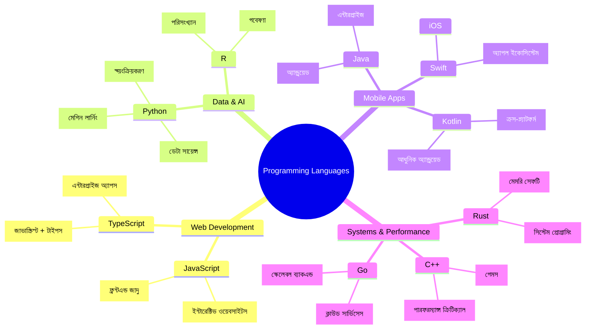
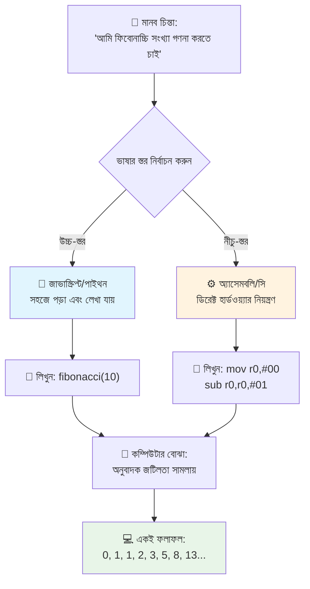
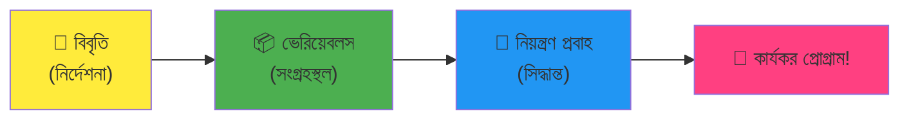
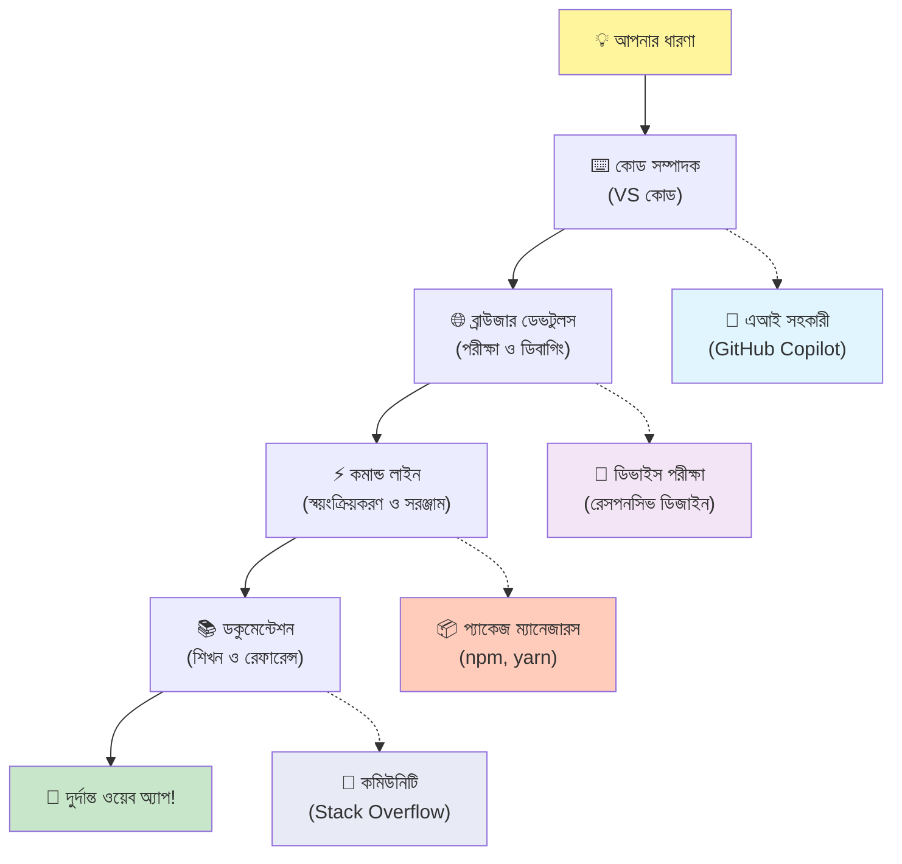
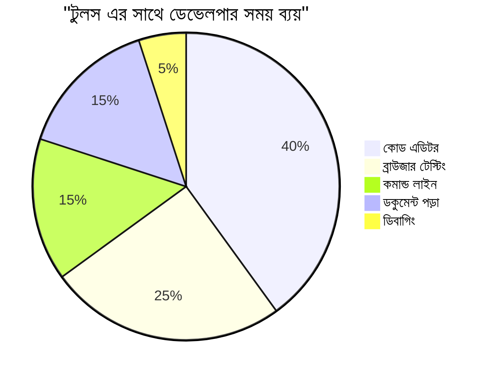

# প্রোগ্রামিং ভাষাসমূহ ও আধুনিক ডেভেলপার সরঞ্জামগুলোর পরিচিতি

হ্যালো, ভবিষ্যতের ডেভেলপার! 👋 আমি কি তোমাকে এমন কিছু বলতে পারি যা প্রতিদিন আমাকে রোমাঞ্চিত করে? তুমি শীঘ্রই আবিষ্কার করবে যে প্রোগ্রামিং শুধুমাত্র কম্পিউটার সংক্রান্ত নয় – এটি তোমার সবচেয়ে অবিশ্বাস্য ধারণাগুলো জীবন্ত করার জন্য সত্যিকারের অতিপ্রাকৃত ক্ষমতা পাওয়ার ব্যাপার!

তুমি কি সেই মুহূর্তটি জানো, যখন তুমি তোমার প্রিয় অ্যাপ ব্যবহার করছ, আর সবকিছু নিখুঁতভাবে কাজ করছে? যখন তুমি একটা বাটনে ট্যাপ করো এবং কিছু অবিশ্বাস্য ঘটনা ঘটে যা তোমাকে বলায় "আরে, ওরা এটা কীভাবে করল?" ঠিক সেইটাই—তোমার মতোই কেউ, সম্ভবত রাত ২টায় তাদের প্রিয় কফি শপে বসে তৃতীয় এস্প্রেসো পান করে, সেই জাদু তৈরি কোড লিখেছিল। আর এখানে যা তোমার মস্তিষ্ক ঘুরিয়ে দেবে: এই পাঠ শেষ হওয়ার আগে তুমি শুধু বুঝতে পারবে কিভাবে তারা এটা করেছিল তাই নয়, তোমাও নিজে যেন চেষ্টা করার জন্য উদ্বুদ্ধ হয়ে উঠবে!

দেখো, আমি পুরোপুরি বুঝতে পারি যদি এখনই প্রোগ্রামিং তোমাকে একটু কঠিন মনে হয়। যখন আমি শুরু করছিলাম, আমি সত্যি ভাবতাম তোমাকে হতে হবে কেউ গণিতের মাস্টার বা পাঁচ বছর বয়স থেকেই কোডিং করে আসা। কিন্তু যা আমার দৃষ্টিভঙ্গি পুরো বদলে দিয়েছিল তা হলো: প্রোগ্রামিং ঠিক যেমন নতুন একটি ভাষায় কথোপকথন শেখার মতো। তুমি শুরু করো "হ্যালো" এবং "ধন্যবাদ" দিয়ে, তারপর কফি অর্ডার করার মতো কথা বলতে শিখো, আর হঠাৎ করে গভীর দার্শনিক আলোচনা করো! তবে এখানে, তুমি কম্পিউটারদের সঙ্গে কথোপকথন করছ, এবং সত্যিই? তারা সবচেয়ে ধৈর্যশীল কথোপকথন সঙ্গী—তারা তোমার ভুলের বিচার করে না এবং সব সময় আবার চেষ্টা করতে উৎসাহী!

আজ, আমরা অন্বেষণ করব অসাধারণ সরঞ্জামগুলি যা আধুনিক ওয়েব ডেভেলপমেন্টকে শুধু সম্ভব করেই না, বরং অতিবার আসক্তিকর করে তোলে। আমি কথা বলছ আজীবনের একই সম্পাদক, ব্রাউজার এবং ওয়ার্কফ্লো নিয়ে যা Netflix, Spotify এবং তোমার প্রিয় ইন্ডি অ্যাপ স্টুডিও প্রতিদিন ব্যবহার করে। আর এখানে যা তোমাকে উল্লসিত করবে: এই পেশাদার মানসম্পন্ন, শিল্প-মানের সরঞ্জামগুলোর বেশিরভাগ সম্পূর্ণ ফ্রি!


> স্কেচনোট [Tomomi Imura](https://twitter.com/girlie_mac) দ্বারা


```mermaid
journey
    title আজকের আপনার প্রোগ্রামিং যাত্রা
    section আবিষ্কার করুন
      প্রোগ্রামিং কি: 5: You
      প্রোগ্রামিং ভাষাসমূহ: 4: You
      সরঞ্জাম পর্যালোচনা: 5: You
    section অনুসন্ধান করুন
      কোড সম্পাদকগণ: 4: You
      ব্রাউজার এবং ডেভটুলস: 5: You
      কমান্ড লাইন: 3: You
    section অনুশীলন
      ভাষা গোয়েন্দা: 4: You
      সরঞ্জাম অনুসন্ধান: 5: You
      সম্প্রদায়ের সংযোগ: 5: You
```
## চল, দেখি তুমি ইতিমধ্যেই কী জানো!

মজা শুরু করার আগে, আমি জানতে আগ্রহী—তুমি এখনো প্রোগ্রামিং জগত সম্পর্কে কী জানো? আর শোনো, যদি তুমি এই প্রশ্নগুলো দেখে ভাবো "আমার একদমই ধারনা নেই," সেটা একদম ঠিক আছে, বরং এটা নিখুঁত! এর মানে তুমি একেবারে সঠিক জায়গায় রয়েছো। এই কুইজটাকে এক ধরণের ওয়ার্ম-আপ ভাবো – আমরা স্মৃতিশক্তির পেশী গরম করছি!

[পূর্ব-পাঠের কুইজ নাও](https://ff-quizzes.netlify.app/web/)


## আমরা আজ যে অভিযানে যাচ্ছি

ঠিক আছে, আজ আমরা যা অন্বেষণ করবো তা নিয়ে আমি সত্যিই উচ্ছ্বসিত! সত্যি বলতে, আমি তোমার মুখটা দেখতে চাই যখন এই ধারণাগুলোর কোনটা তোমার জন্য স্পষ্ট হয়ে ওঠবে। এখানে আমাদের অবিশ্বাস্য যাত্রা:

- **প্রোগ্রামিং আসলে কী (এবং কেন এটা সবচেয়ে দারুণ জিনিস!)** – আমরা আবিষ্কার করবো কিভাবে কোড হল অদৃশ্য জাদু যা তোমার চারপাশের সবকিছু চালায়, সেই অ্যালার্ম থেকে যা সোমবার সকাল বুঝে নেয়ো, সেই অ্যালগরিদম পর্যন্ত যা নিখুঁতভাবে তোমার Netflix সুপারিশ করে
- **প্রোগ্রামিং ভাষাসমূহ এবং তাদের অসাধারণ বৈশিষ্ট্য** – কল্পনা করো এমন একটি পার্টিতে গিয়ে যেখানে প্রত্যেকে সম্পূর্ণ ভিন্ন অতিপ্রাকৃত ক্ষমতা এবং সমস্যা সমাধানের পন্থা নিয়ে আছে। প্রোগ্রামিং ভাষার জগৎ ঠিক এমনটাই, এবং তুমি তাদের সাথে পরিচিত হতে ভালোবাসবে!
- **মৌলিক নির্মাণ ব্লক যা ডিজিটাল জাদু ঘটায়** – এগুলোকে ভাবো একটি চূড়ান্ত স্রষ্টামূলক LEGO সেট হিসেবে। একবার কিভাবে এই টুকরোগুলো একসাথে কাজ করে বুঝলে, তুমি অফুরন্ত কিছুই তৈরি করতে পারবে তোমার কল্পনার নাম অনুসারে
- **পেশাদার সরঞ্জাম যা তোমাকে মনে করাবে তোমার কাছে যাদুর ছড়ি এসেছে** – আমি নাটকীয়তা করছি না — এই সরঞ্জামগুলো সত্যিই তোমাকে অতিপ্রাকৃত অধিকার পাওয়ার মত অনুভূতি দেবে, আর সবচেয়ে ভাল কথা? এগুলোই প্রফেশনালরা ব্যবহার করে!

> 💡 **মর্ম কথা:** আজকে সবকিছু মুখস্থ করার চেষ্টা করো না! এখন শুধু এটা অনুভব করো যে কি সম্ভব তা নিয়ে তোমার মধ্যে আগ্রহ তৈরি হচ্ছে। বিস্তারিতগুলো স্বাভাবিকভাবেই চর্চার মাধ্যমে মজবুত হবে – এরাই তো আসল শেখার পথ!

> তোমরা এই পাঠটি [Microsoft Learn](https://learn.microsoft.com/en-us/learn/modules/web-development-101/introduction-programming/?WT.mc_id=academic-77807-sagibbon) এ নিতে পারো!

## তাহলে প্রোগ্রামিং আসলে *কি*?

ঠিক আছে, আসুন আমরা সেরা প্রশ্নের উত্তর দিই: প্রোগ্রামিং আসলে কী?

আমি তোমাকে এমন একটা গল্প বলব যা আমার পুরো চিন্তা বদলে দিয়েছিল। গত সপ্তাহে, আমি আমার মাকে বোঝানোর চেষ্টা করছিলাম কিভাবে আমাদের নতুন স্মার্ট টিভির রিমোট ব্যবহার করতে হয়। আমি নিজেকে বলছিলাম, "লাল বাটন চাপবে, কিন্তু বড় লাল বাটন নয়, বাম দিকের ছোট লাল বাটনে... না, তোমার অন্য বাম... ঠিক আছে, এখন দুই সেকেন্ড ধরে ধরো, এক নয়, তিন নয়..." মনে হচ্ছে পরিচিত? 😅

এটাই প্রোগ্রামিং! এটা একটা শিল্প যেখানে খুব বিস্তারিত, ধাপে ধাপে নির্দেশ দেওয়া হয় এমন একটি শক্তিশালী সিস্টেমকে যেটাকে সবকিছু নিখুঁতভাবে স্পেল আউট করতে হয়। তবে এখানে মাকে (যিনি জিজ্ঞাসা করতে পারেন "কোন লাল বাটন?") নয়, বরং কম্পিউটারকে বোঝানো হয় (যে ঠিক তোমার কথামতো কাজ করে, যদিও তুমি ঠিক যেমনটি বলেছিলে তা বুঝতে পারো না)।

যা আমাকে প্রথম শিখার সময় বিস্মিত করেছিল তা হলো: কম্পিউটারগুলি আসলেই মূলে খুবই সরল। তারা মাত্র দুইটি জিনিস বোঝে—১ এবং ০, যা হল "হ্যাঁ" এবং "না" বা "চালু" এবং "বন্ধ"। তাই! কিন্তু এখানেই জাদু শুরু হয়—আমাদের ১ এবং ০ তে কথা বলতে হবে না আরও বুঝি না! তখনই **প্রোগ্রামিং ভাষাসমূহ** আসেন সাহায্যে। তারা যেন বিশ্বের সেরা অনুবাদক, যারা তোমার স্বাভাবিক মানব চিন্তাভাবনাকে কম্পিউটারের ভাষায় অনুবাদ করে দেয়।

আর প্রতিদিন সকালে যখন আমি উঠি তখন যা এখনো আমাকে রোমাঞ্চিত করে: তোমার জীবনের সমস্ত ডিজিটাল কিছুই শুরু হয়েছিল ঠিক তোমার মতো কারো হাত থেকে, সম্ভবত প্যাজামায় মোড়ানো, কফির কাপ হাতে নিয়ে ল্যাপটপে কোড টাইপ করতে করতে। সেই Instagram ফিল্টার যা তোমাকে পরফেক্ট দেখায়? কেউ সেটি কোড করেছিল। প্রস্তাবনা যা তোমাকে তোমার নতুন প্রিয় গানের দিকে নিয়ে গিয়েছিল? একজন ডেভেলপার সেই অ্যালগরিদম তৈরি করেছিল। সেই অ্যাপ যা তোমাকে তোমার বন্ধুদের সাথে ডিনার বিল ভাগ করতে সাহায্য করে? হ্যাঁ, কেউ ভাবল "এটা বিরক্তিকর, আমি এটা ঠিক করতে পারি" আর তারপর করেই ফেলল!

যখন তুমি প্রোগ্রামিং শিখবে, তুমি শুধু একটি নতুন দক্ষতা অর্জন করছ না—তুমি এমন একটি অসাধারণ সমস্যার সমাধানকারী সম্প্রদায়ের অংশ হয়ে উঠছো যারা প্রতিদিন ভাবছে, "কী হয়, যদি আমি এমন কিছু তৈরি করি যা কারো দিন একটু ভালো করে তোলে?" সত্যি বলছি, এর থেকে আর কিছু দারুণ হতে পারে?

✅ **মজার তথ্য খোঁজা:** যখন ফাঁকা সময় পাবে, এটা অনুসন্ধান করো—বিশ্বের প্রথম কম্পিউটার প্রোগ্রামার কে ছিলেন বলে তুমি ভাবো? আমি তোমায় একটি ইঙ্গিত দেবো: হয়তো তুমি যা ভাবছো তা নাও হতে পারে! এই ব্যক্তির গল্প বেশ মজাদার এবং দেখায় প্রোগ্রামিং সবসময় ছিল সৃজনশীল সমস্যা সমাধান এবং সাধারণ ধারা থেকে বেরিয়ে চিন্তার ব্যাপার।

### 🧠 **চেক-ইন সময়: কেমন লাগছে?**

**একটু ভাবো:**
- "কম্পিউটারকে নির্দেশ দেওয়ার" ধারণাটা কি এখন তোমার কাছে স্পষ্ট?
- এমন কোন কাজ আছে যা তুমি প্রোগ্রামিং দিয়ে স্বয়ংক্রিয় করতে চাও?
- প্রোগ্রামিং নিয়ে এখন তোমার মাথায় কি প্রশ্ন জাগছে?

> **মনে রেখো:** কিছু ধারণা যদি এখন পরিচ্ছন্ন না মনে হয় তাতে চিন্তা করার কিছু নেই। প্রোগ্রামিং শেখা হল নতুন একটি ভাষা শেখার মতো—তোমার মস্তিষ্ককে নতুন রাস্তাগুলো তৈরি করতে সময় লাগে। তুমি অসাধারণ করছ!

## প্রোগ্রামিং ভাষাসমূহ হলো বিভিন্ন ধরণের জাদুর স্বাদ

ঠিক আছে, এটা অদ্ভুত শোনাতে পারে, কিন্তু আমার সাথে থাকো—প্রোগ্রামিং ভাষাগুলো অনেকটা বিভিন্ন ধরনের সঙ্গীতের মতো। ভাবো: তোমার কাছে আছে জাজ, যা মসৃণ ও ইমপ্রোভাইজেশনভিত্তিক, রক যা শক্তিশালী ও সরল, ক্লাসিক্যাল যা উজ্জ্বল ও গঠিত এবং হিপ-হপ যা সৃজনশীল ও প্রকাশ্য। প্রতিটি ধারার নিজস্ব ভেজ, পরিপাটি ফ্যানের সম্প্রদায় এবং প্রতিটি আলাদা মেজাজ ও উপলক্ষে যথার্থ।

প্রোগ্রামিং ভাষাসমূহ একই রকম কাজ করে! তুমি এমন এক ভাষা ব্যবহার করবে না যা খেলাধূলার একটি মোবাইল গেম বানাতে যা বিশাল পরিমাণ জলবায়ু তথ্য বিশ্লেষণ করার জন্য দরকার, যেমন তুমি যোগ ক্লাসে ডেথ মেটাল প্লে করবে না (ঠিক আছে, বেশিরভাগ যোগ ক্লাসে না! 😄)।

কিন্তু যা আমাকে প্রতি বার মুগ্ধ করে ভাবলে: এই ভাষাগুলো হল একদম সবচেয়ে ধৈর্যশীল, মেধাবী দোভাষী তোমার পাশে বসে আছে। তুমি তোমার ভাবনা এমনভাবে প্রকাশ করতে পারো যা তোমার মানব মস্তিষ্কের জন্য স্বাভাবিক, আর তারা সমস্ত জটিল কাজ করে ১ ও ০ তে অনুবাদ করার যা কম্পিউটার বুঝে। এটা এমন একটি বন্ধুর মত, যিনি "মানব সৃজনশীলতা" এবং "কম্পিউটার যুক্তি" উভয় ভাষাতেই নিখুঁত পারদর্শী—তারা কখনো ক্লান্ত হয় না, কখনো কফি বিরতি দরকার হয় না, এবং তোমার একই প্রশ্ন বারবার করার জন্য কখনো বিচার করে না!

### জনপ্রিয় প্রোগ্রামিং ভাষা এবং তাদের ব্যবহার


```mermaid
mindmap
  root((Programming Languages))
    Web Development
      JavaScript
        Frontend Magic [ফ্রন্টএন্ড জাদু]
        Interactive Websites [ইন্টারেক্টিভ ওয়েবসাইটস]
      TypeScript
        JavaScript + Types [জাভাস্ক্রিপ্ট + টাইপস]
        Enterprise Apps [এন্টারপ্রাইজ অ্যাপস]
    Data & AI
      Python
        Data Science [ডেটা সায়েন্স]
        Machine Learning [মেশিন লার্নিং]
        Automation [স্বয়ংক্রিয়করণ]
      R
        Statistics [পরিসংখ্যান]
        Research [গবেষণা]
    Mobile Apps
      Java
        Android [অ্যান্ড্রয়েড]
        Enterprise [এন্টারপ্রাইজ]
      Swift
        iOS
        Apple Ecosystem [অ্যাপল ইকোসিস্টেম]
      Kotlin
        Modern Android [আধুনিক অ্যান্ড্রয়েড]
        Cross-platform [ক্রস-প্ল্যাটফর্ম]
    Systems & Performance
      C++
        Games [গেমস]
        Performance Critical [পারফরম্যান্স ক্রিটিক্যাল]
      Rust
        Memory Safety [মেমরি সেফটি]
        System Programming [সিস্টেম প্রোগ্রামিং]
      Go
        Cloud Services [ক্লাউড সার্ভিসেস]
        Scalable Backend [স্কেলেবল ব্যাকএন্ড]
```
| ভাষা | সেরা ব্যবহার | কেন জনপ্রিয় |
|----------|----------|------------------|
| **JavaScript** | ওয়েব ডেভেলপমেন্ট, ব্যবহারকারী ইন্টারফেস | ব্রাউজারে চলে এবং ইন্টারঅ্যাকটিভ ওয়েবসাইট চালায় |
| **Python** | ডেটা সায়েন্স, অটোমেশন, এআই | পড়তে ও শেখতে সহজ, শক্তিশালী লাইব্রেরি |
| **Java** | এন্টারপ্রাইজ অ্যাপ্লিকেশন, অ্যান্ড্রয়েড অ্যাপ | প্ল্যাটফর্ম-স্বাধীন, বড় সিস্টেমের জন্য মজবুত |
| **C#** | উইন্ডোজ অ্যাপ্লিকেশন, গেম ডেভেলপমেন্ট | শক্তিশালী মাইক্রোসফট ইকোসিস্টেম সমর্থন |
| **Go** | ক্লাউড সার্ভিস, ব্যাক-এন্ড সিস্টেম | দ্রুত, সহজ, আধুনিক কম্পিউটিংয়ের জন্য ডিজাইন করা |

### উচ্চ-স্তরের বনাম নিম্ন-স্তরের ভাষা

ঠিক আছে, এটা আসলেই এমন একটি ধারণা যা আমার মস্তিষ্ক ভেঙে দিয়েছিল যখন আমি প্রথম শিখছিলাম, তাই আমি সেই রূপকটি শেয়ার করব যা আমাকে শেষ পর্যন্ত বুঝতে সাহায্য করেছিল—আশা করি এটা তোমার জন্যও সাহায্য করবে!

ধরো তুমি এমন একটি দেশে যাচ্ছো যেখানে তুমি ভাষা বলতে পারো না, আর অবিলম্বে তোমার কাছে সবচেয়ে কাছের বাথরুম খুঁজে বের করতে হবে (আমরা সবাই সেখানে গিয়েছি, তাই না? 😅):

- **নিম্ন-স্তরের প্রোগ্রামিং** এমন যেন তুমি স্থানীয় উপভাষাটি এতটাই ভালো শিখেছ যে তুমি সেই বুড়ি ঠাকুরমা সঙ্গে ফল বিক্রেতার সাথে বহু স্থানীয় রেফারেন্স, স্থানীয় ভাষা ও অভ্যন্তরীণ রসিকতা ব্যবহার করে আড্ডা মারতে পারো যা শুধু স্থানীয় মানুষই বুঝতে পারে। খুবই প্রভাবশালী ও কার্যকর... যদি তুমি সত্যিই সাবলীল হও! কিন্তু যখন তুমি শুধু বাথরুম খুঁজছ তখন সেটা বেশ জটিল।

- **উচ্চ-স্তরের প্রোগ্রামিং** হল সেই অসাধারন স্থানীয় বন্ধু যিনি তোমাকে বুঝে; তুমি সহজ ইংরেজিতে বলতে পারো "আমার বাথরুম খুঁজতে হবে," আর তারা সমস্ত সাংস্কৃতিক অনুবাদ করে এমন একটি পথ নির্দেশনা দেয় যা তোমার অজানা মস্তিষ্কেও একদম পরিষ্কার হয়।

প্রোগ্রামিংয়ের ভাষায়:
- **নিম্ন-স্তরের ভাষা** (যেমন এসেম্বলি বা সি) তোমাকে কম্পিউটারের আসল হার্ডওয়ারের সঙ্গে খুব বিস্তারিত কথোপকথন করতে দেয়, কিন্তু তোমাকে মেশিনের মত চিন্তা করতে হবে, যা বলতে গেলে একটি বড় মানসিক পরিবর্তন!
- **উচ্চ-স্তরের ভাষা** (যেমন JavaScript, Python, অথবা C#) তোমাকে মানবের মত চিন্তা করতে দেয় এবং তারা পেছনে সব মেশিন-ভাষার কাজ করে দেয়। সাথে সাথে, এগুলোর এমন অসাধারণ মৈত্রীপূর্ণ সম্প্রদায় আছে যেটা তোমাকে মনে করিয়ে দেয় তারা যখন নতুন ছিল তখন তারা কেমন ছিল এবং তারা তোমাকে সাহায্য করতে চায়!

তুমি ভাবছ কোথা থেকে শুরু করো? 😉 উচ্চ-স্তরের ভাষাগুলো হলো এমন প্রশিক্ষণ চাকা যা তুমি কখনই খুলে ফেলতে চাও না কারণ তারা পুরো অভিজ্ঞতাটাকে আরো উপভোগ্য করে তোলে!


```mermaid
flowchart TB
    A["👤 মানব চিন্তা:<br/>'আমি ফিবোনাচ্চি সংখ্যা গণনা করতে চাই'"] --> B{ভাষার স্তর নির্বাচন করুন}
    
    B -->|উচ্চ-স্তর| C["🌟 জাভাস্ক্রিপ্ট/পাইথন<br/>সহজে পড়া এবং লেখা যায়"]
    B -->|নীচু-স্তর| D["⚙️ অ্যাসেমবলি/সি<br/>ডিরেক্ট হার্ডওয়্যার নিয়ন্ত্রণ"]
    
    C --> E["📝 লিখুন: fibonacci(10)"]
    D --> F["📝 লিখুন: mov r0,#00<br/>sub r0,r0,#01"]
    
    E --> G["🤖 কম্পিউটার বোঝা:<br/>অনুবাদক জটিলতা সামলায়"]
    F --> G
    
    G --> H["💻 একই ফলাফল:<br/>0, 1, 1, 2, 3, 5, 8, 13..."]
    
    style C fill:#e1f5fe
    style D fill:#fff3e0
    style H fill:#e8f5e8
```
### কেন উচ্চ-স্তরের ভাষাগুলো এত বন্ধুতা পূর্ণ, আমি দেখাবো

ঠিক আছে, আমি তোমাকে কিছু দেখাতে যাচ্ছি যা দেখায় কেন আমি উচ্চ-স্তরের ভাষাগুলো ভালোবাসি, কিন্তু আগে—তুমি আমাকে একটা প্রতিশ্রুতি দাও। প্রথম কোড উদাহরণ দেখলে ভয় পেও না! এটা যথাযথরূপে একটু জটিল দেখাতে হবে। এজন্যই আমি এটা ধরিয়ে দিতে চাচ্ছি!

আমরা একই কাজ দুইটি সম্পূর্ণ ভিন্ন স্টাইলেই করব। দুইটাই ফিবোনাচ্চি সিকোয়েন্স তৈরি করবে – এটি একটি সুন্দর গণিত প্যাটার্ন যেখানে প্রতিটি সংখ্যা তার আগের দুটির যোগফল: ০, ১, ১, ২, ৩, ৫, ৮, ১৩... (মজার কথা: তুমি এই প্যাটার্ন প্রকৃতিতে সর্বত্র পাবে—সূর্যমুখীর বীজের সর্পিল, পাইনকন নিদর্শন, এমনকি গ্যালাক্সির গঠনেও!)

দেখতে প্রস্তুত? চলো যাই!

**উচ্চ-স্তরের ভাষা (JavaScript) – মানুষের জন্য সহজ:**

```javascript
// ধাপ ১: মৌলিক ফিবোনাচ্চি সেটআপ
const fibonacciCount = 10;
let current = 0;
let next = 1;

console.log('Fibonacci sequence:');
```

**এই কোডটি যা করে তা হলো:**
- **একটি ধ্রুবক ঘোষণা** করে আমাদের কত সংখ্যক ফিবোনাচ্চি সংখ্যা দরকার তা নির্ধারণ করে
- **দুটি ভেরিয়েবল শুরু** করে যা সিকোয়েন্সের বর্তমান ও পরবর্তী সংখ্যা ট্র্যাক করে
- **শুরুতে মান সেট** করে (০ ও ১) যেগুলো ফিবোনাচ্চি প্যাটার্ন সংজ্ঞায়িত করে
- **একটি শিরোনাম বার্তা প্রদর্শিত করে** আমাদের আউটপুটের পরিচয় হিসাবে

```javascript
// ধাপ ২: একটি লুপ দিয়ে সিকোয়েন্স তৈরি করুন
for (let i = 0; i < fibonacciCount; i++) {
  console.log(`Position ${i + 1}: ${current}`);
  
  // সিকোয়েন্সে পরবর্তী সংখ্যা গণনা করুন
  const sum = current + next;
  current = next;
  next = sum;
}
```

**দেখো এখানে কী হচ্ছে:**
- **`for` লুপের মাধ্যমে** সিকোয়েন্সের প্রতিটি অবস্থানে ঘুরে
- **প্রতিটি সংখ্যা তার অবস্থানসহ** টেমপ্লেট লিটারাল ফর্ম্যাটিং দিয়ে দেখায়
- **পরবর্তী ফিবোনাচ্চি সংখ্যা হিসেব করে** বর্তমান ও পরবর্তী মান যোগ করে
- **আমাদের ট্র্যাকিং ভেরিয়েবল আপডেট করে** পরবর্তী ধাপে যাওয়ার জন্য

```javascript
// ধাপ ৩: আধুনিক কার্যকরী পদ্ধতি
const generateFibonacci = (count) => {
  const sequence = [0, 1];
  
  for (let i = 2; i < count; i++) {
    sequence[i] = sequence[i - 1] + sequence[i - 2];
  }
  
  return sequence;
};

// ব্যবহারের উদাহরণ
const fibSequence = generateFibonacci(10);
console.log(fibSequence);
```

**উপরের কোডে আমরা:**
- **মডার্ন অ্যারো ফাংশন সিনট্যাক্স দিয়ে** একটি পুনঃব্যবহারযোগ্য ফাংশন তৈরি করেছি
- **একটি অ্যারে তৈরি করেছি** পুরো সিকোয়েন্স সংরক্ষণ করার জন্য, একে একে প্রদর্শনের পরিবর্তে
- **অ্যারে ইনডেক্স ব্যবহার করেছি** প্রতিটি নতুন সংখ্যা পূর্বের মান থেকে হিসাব করার জন্য
- **সম্পূর্ণ সিকোয়েন্স রিটার্ন করেছি** যাতে প্রোগ্রামের অন্যান্য অংশেও ব্যবহারযোগ্য হয়

**নিম্ন-স্তরের ভাষা (ARM Assembly) – কম্পিউটারের জন্য বন্ধুত্বপূর্ণ:**

```assembly
 area ascen,code,readonly
 entry
 code32
 adr r0,thumb+1
 bx r0
 code16
thumb
 mov r0,#00
 sub r0,r0,#01
 mov r1,#01
 mov r4,#10
 ldr r2,=0x40000000
back add r0,r1
 str r0,[r2]
 add r2,#04
 mov r3,r0
 mov r0,r1
 mov r1,r3
 sub r4,#01
 cmp r4,#00
 bne back
 end
```

দেখবে কিভাবে JavaScript সংস্করণটি ইংরেজি নির্দেশনার মতো পড়ে, যখন Assembly সংস্করণটি রহস্যময় কমান্ড ব্যবহার করে সরাসরি কম্পিউটারের প্রসেসর নিয়ন্ত্রণ করে। দুটোই একই কাজ সম্পন্ন করে, কিন্তু উচ্চ-স্তরের ভাষাটি মানুষের জন্য অনেক সহজ বোঝা, লেখা এবং রক্ষণাবেক্ষণের।

**মুখ্য পার্থক্য যা তুমি লক্ষ্য করবে:**
- **পঠনযোগ্যতা**: JavaScript বর্ণনামূলক নাম যেমন `fibonacciCount` ব্যবহার করে, যেখানে Assembly রহস্যময় লেবেল যেমন `r0`, `r1` ব্যবহার করে  
- **মন্তব্য**: উচ্চ-স্তরের ভাষাগুলো ব্যাখ্যামূলক মন্তব্যকে উৎসাহিত করে যা কোডকে স্ব-মূল্যায়নযোগ্য করে তোলে  
- **গঠন**: JavaScript এর যৌক্তিক প্রবাহ মানুষের সমস্যাগুলো ধাপে ধাপে চিন্তার সাথে মিলে যায়  
- **রক্ষণাবেক্ষণ**: বিভিন্ন চাহিদার জন্য JavaScript সংস্করণ আপডেট করা সরল এবং স্পষ্ট  

✅ **ফিবনাচ্চি ধারাবাহিক সম্পর্কে**: এই অত্যন্ত মনোরম সংখ্যার প্যাটার্ন (যেখানে প্রতিটি সংখ্যা তার পূর্বের দুই সংখ্যার যোগফল: 0, 1, 1, 2, 3, 5, 8...) প্রকৃতিতে *সর্বত্রই* দেখা যায়! আপনি এটি সূর্যমুখী ফুলের স্পাইরাল, পাইনকোনের প্যাটার্ন, নটিলাস শেল কিভাবে বাঁক নেয় এবং এমনকি গাছের শাখাগুলোর বৃদ্ধিতেও খুঁজে পাবেন। এটি অত্যন্ত বিস্ময়কর কিভাবে গণিত এবং কোড আমাদের প্রাকৃতিক সুন্দরতা তৈরি করতে ব্যবহৃত প্যাটার্নগুলো বোঝাতে এবং পুনরায় তৈরি করতে সহায়তা করে!  


## যেসব মৌলিক উপাদান ম্যাজিক তৈরি করে

ঠিক আছে, এখন যেহেতু আপনি প্রোগ্রামিং ভাষাগুলো কর্মরত অবস্থায় দেখেছেন, চলুন সেই মৌলিক উপাদানগুলো ভাঙা যাক যা লিখিত প্রতিটি প্রোগ্রামের ভিত্তি তৈরি করে। এগুলোকে ভাবুন আপনার প্রিয় রেসিপির অপরিহার্য উপাদান হিসেবে – একবার আপনি প্রতিটির কাজ বুঝে গেলে, আপনি প্রায় যেকোনো ভাষায় কোড পড়তে এবং লিখতে সক্ষম হবেন!

এটি প্রোগ্রামিং ব্যাকরণ শিখার মতো। স্কুলে আপনি যখন noun, verb এবং বাক্য গঠনের নিয়ম শিখেছিলেন মনে আছে? প্রোগ্রামিং এরও নিজের ব্যাকরণ আছে, এবং সত্যি বলতে তা ইংরেজি ব্যাকরণ থেকে অনেক বেশি যৌক্তিক এবং সহিষ্ণু! 😄

### বাক্য: ধাপে ধাপে নির্দেশনা

আসুন শুরু করি **বাক্য** দিয়ে – এগুলো হলো আপনার কম্পিউটারের সাথে কথোপকথনের একক বাক্য। প্রতিটি বাক্য কম্পিউটারকে একটি নির্দিষ্ট কাজ করতে বলে, ঠিক যেমন দিকনির্দেশ দেয়া: "এখানে বামদিকে ঘুরুন," "লাল আলোয় থেমে যান," "ওখানে গাড়ি দাঁড় করান।"

বাক্যগুলো সাধারণত পড়তে কতটা সহজ তা আমি খুবই পছন্দ করি। দেখে নিন:

```javascript
// মৌলিক বিবৃতি যা একক ক্রিয়া সম্পাদন করে
const userName = "Alex";                    
console.log("Hello, world!");              
const sum = 5 + 3;                         
```
  
**এই কোডটি যা করে:**  
- একটি ধ্রুবক ভেরিয়েবল ঘোষণা করে যা ব্যবহারকারীর নাম সংরক্ষণ করে  
- কনসোলে স্বাগতম বার্তা প্রদর্শন করে  
- একটি গাণিতিক অপারেশনের ফলাফল গণনা করে সংরক্ষণ করে  

```javascript
// যে বিবৃতিগুলি ওয়েব পৃষ্ঠাগুলির সাথে যোগাযোগ করে
document.title = "My Awesome Website";      
document.body.style.backgroundColor = "lightblue";
```
  
**ধাপে ধাপে, যা হচ্ছে:**  
- ব্রাউজার ট্যাবে প্রদর্শিত ওয়েবপেজের শিরোনাম পরিবর্তন করে  
- পুরো পৃষ্ঠা বডির ব্যাকগ্রাউন্ড রঙ পরিবর্তন করে  

### ভেরিয়েবল: আপনার প্রোগ্রামের মেমোরি সিস্টেম

ঠিক আছে, **ভেরিয়েবল** সত্যি বলতে আমার সবচেয়ে প্রিয় ধারণাগুলোর একটি কারণ এগুলো প্রতিদিন আপনি যা ব্যবহার করেন তার মতোই!

আপনার ফোনের কন্টাক্ট তালিকা ভাবুন একটু। আপনি প্রত্যেকের ফোন নম্বর মুখস্থ করেন না – পরিবর্তে “মা,” “সেরা বন্ধু,” অথবা “পিজ্জা ডেলিভারি যা রাত ২টা পর্যন্ত” সংরক্ষণ করেন এবং আপনার ফোন সত্যিকার নম্বরগুলো মনে রাখে। ভেরিয়েবলগুলো একই রকম! এগুলো লেবেলযুক্ত পাত্রের মতো যেখানে আপনার প্রোগ্রাম তথ্য সংরক্ষণ করে এবং পরে বোঝান যায় এমন নাম ব্যবহার করে ফেরত আনে।

একটি অসাধারণ জিনিস হলো: আপনার প্রোগ্রাম চলাকালীন ভেরিয়েবল পরিবর্তিত হতে পারে (এজন্যে নামটা “variable” – দেখুন কী সুন্দর)। যেমন আপনি পিজ্জা ডেলিভারি লিস্ট আপডেট করতে পারেন যখন আরও ভাল কিছু খুঁজে পান, ভেরিয়েবলগুলোও প্রোগ্রাম শিখতে থাকলে বা পরিস্থিতি পরিবর্তিত হলে আপডেট হতে পারে!

চলুন দেখাই কিভাবে এটা সুন্দর ও সহজ:

```javascript
// ধাপ ১: মৌলিক ভেরিয়েবল তৈরি করা
const siteName = "Weather Dashboard";        
let currentWeather = "sunny";               
let temperature = 75;                       
let isRaining = false;                      
```
  
**এই ধারণাগুলো বোঝা:**  
- ধ্রুবক মান `const` এ সংরক্ষণ করুন (যেমন সাইটের নাম)  
- এমন মানের জন্য `let` ব্যবহার করুন যা প্রোগ্রামের মধ্যে পরিবর্তিত হতে পারে  
- বিভিন্ন ডাটা টাইপ বরাদ্দ করুন: স্ট্রিং (টেক্সট), সংখ্যা, বুলিয়ান (সত্য/মিথ্যা)  
- বর্ণনামূলক নাম দিন যা প্রতিটি ভেরিয়েবলের বিষয় বুঝায়  

```javascript
// ধাপ ২: সংশ্লিষ্ট ডেটা গ্রুপ করার জন্য অবজেক্ট নিয়ে কাজ করা
const weatherData = {                       
  location: "San Francisco",
  humidity: 65,
  windSpeed: 12
};
```
  
**উপরের কোডে আমরা:**  
- সম্পর্কিত আবহাওয়ার তথ্য একত্রিত করতে একটি অবজেক্ট তৈরি করেছি  
- একাধিক তথ্য একটি ভেরিয়েবল নামের অধীনে সংগঠিত করেছি  
- প্রতিটি তথ্য স্পষ্ট করার জন্য কী-ভ্যালু জোড়া ব্যবহার করেছি  

```javascript
// ধাপ ৩: পরিবর্তনশীল ব্যবহার এবং আপডেট করা
console.log(`${siteName}: Today is ${currentWeather} and ${temperature}°F`);
console.log(`Wind speed: ${weatherData.windSpeed} mph`);

// পরিবর্তনশীল পরিবর্তনশীল আপডেট করা
currentWeather = "cloudy";                  
temperature = 68;                          
```
  
**প্রত্যেক অংশ বোঝা যাক:**  
- `${}` সিনট্যাক্স ব্যবহার করে টেমপ্লেট লিটারাল দিয়ে তথ্য প্রদর্শন  
- অবজেক্টের প্রপার্টি ডট নোটেশন (`weatherData.windSpeed`) দিয়ে অ্যাক্সেস করা  
- `let` দিয়ে ঘোষিত ভেরিয়েবলগুলো আপডেট করা যাতে পরিবর্তনশীল অবস্থা প্রতিফলিত হয়  
- অর্থবহ বার্তা তৈরির জন্য একাধিক ভেরিয়েবল একত্রিত করা  

```javascript
// ধাপ ৪: পরিষ্কার কোডের জন্য আধুনিক ডেসট্রাকচারিং
const { location, humidity } = weatherData; 
console.log(`${location} humidity: ${humidity}%`);
```
  
**আপনাকে যা জানতে হবে:**  
- ডেসট্রাকচারিং অ্যাসাইনমেন্ট ব্যবহার করে অবজেক্ট থেকে নির্দিষ্ট প্রপার্টি বের করা  
- অবজেক্ট কী এর সাথে একই নামের নতুন ভেরিয়েবল তৈরি করা  
- ডট নোটেশন বারবার ব্যবহার থেকে কোড সরল করা  

### কন্ট্রোল ফ্লো: আপনার প্রোগ্রামকে চিন্তা শেখানো

ঠিক আছে, এটা সেই জায়গা যেখানে প্রোগ্রামিং সত্যিই অবিশ্বাস্য হয়ে ওঠে! **কন্ট্রোল ফ্লো** হলো আপনার প্রোগ্রামকে বুদ্ধিমত্তার সাথে সিদ্ধান্ত নিতে শেখানো, ঠিক যেমন আপনি প্রতিদিন বিনা চিন্তায় করেন।

ভাবুন: আজ সকালে হয়তো আপনি এমন কিছু করেন “যদি বৃষ্টি হয়, আমি ছাতা নেব। যদি ঠান্ডা হয়, জ্যাকেট পড়ব। দেরি হলে নাস্তা বাদ দিয়ে পথে কফি নেব।” আপনার মস্তিষ্ক স্বাভাবিকভাবেই এই if-then লজিক দশোবার অনুসরণ করে প্রতিদিন!

এটাই প্রোগ্রামগুলোকে বুদ্ধিমান এবং জীবন্ত করে তোলে, শুধু একটি একঘেয়েমি স্ক্রিপ্ট অনুসরণ করার বদলে। তারা একটি পরিস্থিতি দেখতে পারে, মূল্যায়ন করতে পারে এবং যথোপযুক্ত প্রতিক্রিয়া দিতে পারে। এটা আপনার প্রোগ্রামকে এমন মস্তিষ্ক দেওয়ার মত যা মানিয়ে নিতে এবং সিদ্ধান্ত নিতে পারে!

দেখতে চান এটা কতটা সুন্দর কাজ করে? দেখুন:

```javascript
// ধাপ ১: মৌলিক শর্তাধীন লজিক
const userAge = 17;

if (userAge >= 18) {
  console.log("You can vote!");
} else {
  const yearsToWait = 18 - userAge;
  console.log(`You'll be able to vote in ${yearsToWait} year(s).`);
}
```
  
**এই কোড যা করে:**  
- ব্যবহারকারীর বয়স ভোটাধিকারের যোগ্যতা মেযা করে  
- শর্ত অনুসারে বিভিন্ন কোড ব্লক চালায়  
- যদি ১৮ এর নিচে হয় ভোটাধিকারের যোগ্য হওয়ার অবশিষ্ট সময় হিসাব করে দেখায়  
- প্রতিটি পরিস্থিতির জন্য নির্দিষ্ট, সহায়ক ফিডব্যাক দেয়  

```javascript
// ধাপ ২: লজিক্যাল অপারেটর সহ একাধিক শর্ত্‌গুলি
const userAge = 17;
const hasPermission = true;

if (userAge >= 18 && hasPermission) {
  console.log("Access granted: You can enter the venue.");
} else if (userAge >= 16) {
  console.log("You need parent permission to enter.");
} else {
  console.log("Sorry, you must be at least 16 years old.");
}
```
  
**এখানে যা ঘটছে:**  
- `&&` (এবং) অপারেটর ব্যবহার করে একাধিক শর্ত যুক্ত করা  
- একাধিক পরিস্থিতির জন্য `else if` ব্যবহার করে শর্তের সজ্জা তৈরি করা  
- সর্বশেষে `else` ব্যবহার করে সব সম্ভাব্য ক্ষেত্র পরিচালনা করা  
- প্রতিটি ভিন্ন পরিস্থিতির জন্য স্পষ্ট এবং কার্যকর ফিডব্যাক প্রদান করা  

```javascript
// ধাপ ৩: টার্নারি অপারেটর দিয়ে সংক্ষিপ্ত শর্তীয় বিবৃতি
const votingStatus = userAge >= 18 ? "Can vote" : "Cannot vote yet";
console.log(`Status: ${votingStatus}`);
```
  
**মনে রাখার জন্য:**  
- সহজ দুই-অপশন শর্তের জন্য টার্নারি অপারেটর (`? :`) ব্যবহার করুন  
- প্রথমে শর্ত লিখুন, তারপর `?`, তারপর সত্য ফলাফল, তারপর `:`, তারপর মিথ্যা ফলাফল  
- যখন শর্ত অনুসারে মান বরাদ্দ করতে হয় এই প্যাটার্ন ব্যবহার করুন  

```javascript
// ধাপ ৪: একাধিক নির্দিষ্ট ক্ষেত্রে পরিচালনা করা
const dayOfWeek = "Tuesday";

switch (dayOfWeek) {
  case "Monday":
  case "Tuesday":
  case "Wednesday":
  case "Thursday":
  case "Friday":
    console.log("It's a weekday - time to work!");
    break;
  case "Saturday":
  case "Sunday":
    console.log("It's the weekend - time to relax!");
    break;
  default:
    console.log("Invalid day of the week");
}
```
  
**এই কোড যা করে:**  
- ভেরিয়েবল মান একাধিক নির্দিষ্ট কেসের সাথে মেলে কিনা পরীক্ষা করে  
- সমমনোনীত কেসগুলো একত্রিত করে (সাপ্তাহিক দিনের জন্য এবং উইকএন্ডের জন্য)  
- মিলে গেলে উপযুক্ত কোড ব্লক চালায়  
- অপ্রত্যাশিত মানের জন্য একটি `default` কেস অন্তর্ভুক্ত করে  
- পরবর্তী কেসে যাওয়া আটকাতে `break` স্টেটমেন্ট ব্যবহার করে  

> 💡 **বাস্তব জীবনের উপমা**: কন্ট্রোল ফ্লোকে ভাবুন সবচেয়ে ধৈর্যশীল GPS এর দিকনির্দেশনার মতো। এটি বলতে পারে “যদি মেইন স্ট্রিটে ট্রাফিক থাকে, তাহলে হাইওয়ে নাও। যদি হাইওয়ে নির্মাণে বন্ধ থাকে, তাহলে দৃশ্যমান রুট নাও।” প্রোগ্রামগুলো এই একই ধরণের শর্তাদি লজিক ব্যবহার করে বুদ্ধিমত্তার সাথে বিভিন্ন পরিস্থিতিতে সাড়া দেয় এবং সবসময় ব্যবহারকারীদের জন্য সেরা অভিজ্ঞতা দেয়।

### 🎯 **ধারণা যাচাই: মৌলিক উপাদান দক্ষতা**

**চলুন দেখি আপনি মৌলিক বিষয়গুলো কতটা বুঝতে পেরেছেন:**  
- আপনি কি নিজের ভাষায় ভেরিয়েবল এবং বাক্যের পার্থক্য ব্যাখ্যা করতে পারেন?  
- একটি বাস্তব জীবনের উদাহরণ ভাবুন যেখানে if-then সিদ্ধান্ত ব্যবহার করবেন (যেমন আমাদের ভোটাধিকারের উদাহরণ)  
- প্রোগ্রামিং যুক্তির কোন একটি বিষয় যা আপনাকে অবাক করেছে?  

**দ্রুত আত্মবিশ্বাস বৃদ্ধিকারক:**  

```mermaid
flowchart LR
    A["📝 বিবৃতি<br/>(নির্দেশনা)"] --> B["📦 ভেরিয়েবলস<br/>(সংগ্রহস্থল)"] --> C["🔀 নিয়ন্ত্রণ প্রবাহ<br/>(সিদ্ধান্ত)"] --> D["🎉 কার্যকর প্রোগ্রাম!"]
    
    style A fill:#ffeb3b
    style B fill:#4caf50
    style C fill:#2196f3
    style D fill:#ff4081
```  
✅ **পরবর্তী পর্যায়ে যা আসছে**: আমরা এই ধারণাগুলো আরও গভীরভাবে অন্বেষণ করে প্রচুর মজা করব! এখনই শুধু এই উত্তেজনা অনুভব করুন আপনার সামনে থাকা অসাধারণ সম্ভাবনাগুলোর জন্য। নির্দিষ্ট দক্ষতা ও কৌশলগুলো আমাদের একসাথে অনুশীলনে স্বাভাবিকভাবেই বসবে – আমি গ্যারান্টি দিচ্ছি এটি আপনি যেকোনো বিষয়ের তুলনায় অনেক বেশি মজার হবে!

## বাণিজ্যের সরঞ্জাম

ঠিক আছে, এটিই এমন একটা জায়গা যেখানে আমি এত উত্তেজিত হই যে নিজেকে ধরে রাখতে পারি না! 🚀 আমরা সেই অবিশ্বাস্য সরঞ্জামগুলো নিয়ে কথা বলব যা আপনাকে ডিজিটাল মহাকাশযানের চাবি হাতে পেয়েছেন এমন অনুভূতি দেবে।

আপনি জানেন কিভাবে একজন শেফের সেই নিখুঁত ভারসাম্যপূর্ণ ছুরি থাকে যা তাদের হাতের বিস্তার মনে হয়? অথবা একজন সঙ্গীতশিল্পীর সেই গিটার যা স্পর্শ করলেই গান গায়? ঠিক তেমনই, ডেভেলপারদেরও এমন ম্যাজিক্যাল সরঞ্জাম আছে, এবং এখানে এমন কিছু আছে যা আপনার বুদ্ধি ধামাকা করে দেবে – অধিকাংশই সম্পূর্ণ ফ্রি!

আমি আসলে চেয়ারে লাফাচ্ছি এইগুলো আপনার সাথে ভাগ করে নিতে because এর ফলে সফটওয়্যার তৈরি করার পদ্ধতি সম্পূর্ণ পরিপুর্ণ পরিবর্তিত হয়েছে। আমরা কথা বলছি AI চালিত কোডিং সহকারী নিয়ে, যারা আপনার কোড লেখায় সাহায্য করে (আমি চুটিয়ে বলছি না!), ক্লাউড এনভায়রনমেন্টের যেখানে আপনি Wi-Fi সহ যেকোনো জায়গা থেকে পুরো অ্যাপ্লিকেশন তৈরি করতে পারেন, এবং এমন ডিবাগিং সরঞ্জাম যা আপনার প্রোগ্রামের জন্য X-ray দৃষ্টি দেয়।

এবং এখানে এমন একটি অংশ আছে যা এখনও আমাকে কেঁপে দেয়: এগুলো "শিখনার্থীদের সরঞ্জাম" নয় যা আপনি তাড়াতাড়ি বড় হয়ে ফেলবেন না। এগুলোই একই পেশাদার মানের সরঞ্জাম যা গুগল, নেটফ্লিক্স এবং আপনার প্রিয় ইন্ডি অ্যাপ স্টুডিওর ডেভেলপাররা এ মুহূর্তে ব্যবহার করছে। এগুলো ব্যবহার করে আপনি নিজেকে একজন পেশাদারই মনে করবেন!


```mermaid
graph TD
    A["💡 আপনার ধারণা"] --> B["⌨️ কোড সম্পাদক<br/>(VS কোড)"] 
    B --> C["🌐 ব্রাউজার ডেভটুলস<br/>(পরীক্ষা ও ডিবাগিং)"]
    C --> D["⚡ কমান্ড লাইন<br/>(স্বয়ংক্রিয়করণ ও সরঞ্জাম)"]
    D --> E["📚 ডকুমেন্টেশন<br/>(শিখন ও রেফারেন্স)"]
    E --> F["🚀 দুর্দান্ত ওয়েব অ্যাপ!"]
    
    B -.-> G["🤖 এআই সহকারী<br/>(GitHub Copilot)"]
    C -.-> H["📱 ডিভাইস পরীক্ষা<br/>(রেসপনসিভ ডিজাইন)"]
    D -.-> I["📦 প্যাকেজ ম্যানেজারস<br/>(npm, yarn)"]
    E -.-> J["👥 কমিউনিটি<br/>(Stack Overflow)"]
    
    style A fill:#fff59d
    style F fill:#c8e6c9
    style G fill:#e1f5fe
    style H fill:#f3e5f5
    style I fill:#ffccbc
    style J fill:#e8eaf6
```  
### কোড এডিটর এবং IDE: আপনার নতুন ডিজিটাল সর্বশেষ সঙ্গী

আসুন কথা বলি কোড এডিটর নিয়ে – এগুলো শীঘ্রই আপনার প্রিয় স্থান হয়ে উঠবে! এগুলো এমন একটি ব্যক্তিগত কোডিং আশ্রম, যেখানে আপনি আপনার অধিকাংশ সময় কাটিয়ে ডিজিটাল সৃজনশীলতা গড়ে তুলবেন এবং নিখুঁত করবেন।

কিন্তু আধুনিক এডিটরগুলোর ব্যাপারে যা জাদুকরী তা হলো: এরা শুধু ফ্যান্সি টেক্সট এডিটর নয়। এরা অধিকন্তু সবচেয়ে মেধাবী, সহায়ক কোডিং মেন্টর যারা ২৪/৭ আপনার পাশে বসে থাকে। তারা টাইপ করার আগেই ভুল ধরিয়ে দেয়, উন্নতির পরামর্শ দেয় যা আপনাকে জিনিয়াস করে তোলে, কোডের প্রতিটি অংশের কাজ বুঝতে সাহায্য করে, এবং অনেকে এমনকি আপনি যা টাইপ করতে যাচ্ছেন সেটা পূর্বাভাস দিয়ে শেষ করার প্রস্তাব দেয়!

আমি মনে করি যখন প্রথমবার অটো-কাম্পলিশন আবিষ্কার করেছিলাম – সত্যিই মনে হচ্ছিল আমি ভবিষ্যতে বসবাস করছি। আপনি কিছু টাইপ শুরু করলে, আপনার এডিটর বলে, "এই, আপনি কি এই ফাংশনের কথা ভাবছিলেন যেটা ঠিক আপনার দরকার অনুযায়ী কাজ করে?" এটা ঠিক যেন আপনার কোডিং বন্ধু একজন মাইন্ড রিডার!

**এই এডিটরগুলো কেন এত অসাধারণ?**

আধুনিক কোড এডিটর অনেক ফিচারের বিস্ময়কর সংগ্রহ অফার করে যা আপনার উৎপাদনশীলতা বাড়ায়:

| ফিচার | যা করে | সাহায্যের কারণ |
|---------|--------------|--------------|
| **সিনট্যাক্স হাইলাইটিং** | আপনার কোডের বিভিন্ন অংশ রঙিন করে | কোড পড়া সহজ করে এবং ভুল ধরতে সাহায্য করে |
| **অটো-কাম্পলিশন** | টাইপ করার সময় কোড প্রস্তাব করে | কোডিং দ্রুত হয় এবং টাইপিং ভুল কমে যায় |
| **ডিবাগিং টুলস** | ভুল খুঁজে বের করা এবং ঠিক করতে সাহায্য করে | সমস্যা সমাধানে ঘন্টা বাঁচায় |
| **এক্সটেনশনস** | বিশেষায়িত ফিচার যুক্ত করে | আপনার এডিটরকে যেকোনো প্রযুক্তির জন্য কাস্টমাইজ করে |
| **AI সহকারী** | কোড এবং ব্যাখ্যা প্রস্তাব করে | শেখা এবং উৎপাদনশীলতা দ্রুততর করে |

> 🎥 **ভিডিও রিসোর্স**: এই সরঞ্জামগুলো কর্মরত দেখতে চান? দেখুন এই [Tools of the Trade ভিডিও](https://youtube.com/watch?v=69WJeXGBdxg) ব্যাপক পর্যালোচনার জন্য।

#### ওয়েব ডেভেলপমেন্টের জন্য সুপারিশকৃত এডিটর

**[Visual Studio Code](https://code.visualstudio.com/?WT.mc_id=academic-77807-sagibbon)** (ফ্রি)  
- ওয়েব ডেভেলপারদের মধ্যে সবচেয়ে জনপ্রিয়  
- চমৎকার এক্সটেনশন ইকোসিস্টেম  
- বিল্ট-ইন টার্মিনাল এবং Git ইন্টিগ্রেশন  
- **অত্যাবশ্যক এক্সটেনশনস**:  
  - [GitHub Copilot](https://marketplace.visualstudio.com/items?itemName=GitHub.copilot) - AI চালিত কোড প্রস্তাব  
  - [Live Share](https://marketplace.visualstudio.com/items?itemName=MS-vsliveshare.vsliveshare) - রিয়েল-টাইম সহযোগিতা  
  - [Prettier](https://marketplace.visualstudio.com/items?itemName=esbenp.prettier-vscode) - স্বয়ংক্রিয় কোড ফরম্যাটিং  
  - [Code Spell Checker](https://marketplace.visualstudio.com/items?itemName=streetsidesoftware.code-spell-checker) - আপনার কোডে টাইপো ধরার জন্য  

**[JetBrains WebStorm](https://www.jetbrains.com/webstorm/)** (পেইড, ছাত্রদের জন্য ফ্রি)  
- উন্নত ডিবাগিং এবং টেস্টিং টুলস  
- বুদ্ধিমান কোড সম্পূরক  
- বিল্ট-ইন সংস্করণ নিয়ন্ত্রণ  

**ক্লাউড-ভিত্তিক IDEs** (বিভিন্ন মূল্য)  
- [GitHub Codespaces](https://github.com/features/codespaces) - আপনার ব্রাউজারে পূর্ণ VS Code  
- [Replit](https://replit.com/) - শেখা এবং কোড শেয়ার করার জন্য চমৎকার  
- [StackBlitz](https://stackblitz.com/) - তাৎক্ষণিক, পূর্ণ-স্ট্যাক ওয়েব ডেভেলপমেন্ট  

> 💡 **শুরুর টিপ**: Visual Studio Code দিয়ে শুরু করুন – এটি ফ্রি, শিল্পে ব্যাপক ব্যবহৃত, এবং একটি বিশাল কমিউনিটি সহায়ক টিউটোরিয়াল এবং এক্সটেনশন তৈরি করে।

### ওয়েব ব্রাউজার: আপনার গোপন উন্নয়ন ল্যাবরেটরি

ঠিক আছে, প্রস্তুত হন পুরোপুরি অবাক হতে! আপনি জানেন কিভাবে সোশ্যাল মিডিয়া স্ক্রোল করা এবং ভিডিও দেখা জন্য ব্রাউজার ব্যবহার করেছেন? আসলে তারা এই পুরো সময়টা অবিশ্বাস্য গোপন ডেভেলপার ল্যাবরেটরি লুকিয়ে রেখেছিল, শুধু আপনার আবিষ্কারের জন্য অপেক্ষা করছিল!

প্রতিবার যখন আপনি একটি ওয়েবপেজে রাইট-ক্লিক করে "Inspect Element" নির্বাচন করেন, আপনি এমন একটি গোপন বিশ্বের দরজা খুলছেন যা সত্যি বলতে আমার আগে শত শত ডলার খরচ করে কেনা সফটওয়্যারের থেকেও অনেক বেশি শক্তিশালী। এটা ঠিক যেন আপনার সাধারণ রান্নাঘরের একটি সিক্রেট প্যানেলের পেছনে একজন পেশাদার শেফের গবেষণাগৃহ লুকিয়ে ছিল!
প্রথমবার কেউ আমাকে ব্রাউজার DevTools দেখিয়েছিল, আমি প্রায় তিন ঘন্টা কেবল ক্লিক করতে করতে এবং বলছিলাম "রুসি, এটা এটাও করতে পারে?!" আপনি আদৌ যেকোনো ওয়েবসাইট রিয়েল-টাইমে সম্পাদনা করতে পারেন, ঠিক কেমন দ্রুত সবকিছু লোড হচ্ছে তা দেখতে পারেন, বিভিন্ন ডিভাইসে আপনার সাইট কেমন দেখায় পরীক্ষা করতে পারেন, এমনকি জাভাস্ক্রিপ্ট ডিবাগ করতে পারেন পাশাঠ মতো। এটা পুরোপুরি চমকপ্রদ!

**এটাই কারণ ব্রাউজারগুলি আপনার গোপন অস্ত্র:**

যখন আপনি একটি ওয়েবসাইট বা ওয়েব অ্যাপ তৈরি করেন, আপনাকে দেখতে হয় এটা বাস্তব জগতে কেমন দেখায় এবং কিভাবে কাজ করে। ব্রাউজার শুধু আপনার কাজ প্রদর্শন করে না, বরং কার্যক্ষমতা, প্রবেশগম্যতা, এবং সম্ভাব্য সমস্যাগুলি সম্পর্কে বিস্তারিত প্রতিক্রিয়াও দেয়।

#### ব্রাউজার ডেভেলপার সরঞ্জাম (DevTools)

আধুনিক ব্রাউজারগুলি বিস্তৃত ডেভেলপমেন্ট স্যুট অন্তর্ভুক্ত করে:

| টুল ক্যাটাগরি | এটি কী করে | উদাহরণ ব্যবহারিক |
|---------------|--------------|------------------|
| **এলিমেন্ট ইন্সপেক্টর** | রিয়েল-টাইমে HTML/CSS দেখা এবং সম্পাদনা করা | স্টাইলিং সামঞ্জস্য করে তাৎক্ষণিক ফলাফল দেখা |
| **কন্সোলে** | ত্রুটি বার্তা দেখা ও জাভাস্ক্রিপ্ট টেস্ট করা | সমস্যা ডিবাগ করা এবং কোড নিয়ে পরীক্ষা-নিরীক্ষা করা |
| **নেটওয়ার্ক মনিটর** | রিসোর্স কিভাবে লোড হচ্ছে তা ট্র্যাক করা | কার্যক্ষমতা ও লোডিং সময় উন্নত করা |
| **অ্যাক্সেসিবিলিটি চেকার** | অন্তর্ভুক্ত ডিজাইনের জন্য টেস্ট করা | নিশ্চিত করা আপনার সাইট সব ব্যবহারকারীর জন্য কাজ করে |
| **ডিভাইস সিমুলেটর** | বিভিন্ন স্ক্রিন সাইজে প্রিভিউ | একাধিক ডিভাইস ছাড়াই রেসপনসিভ ডিজাইন পরীক্ষা করা |

#### বিকাশের জন্য সুপারিশকৃত ব্রাউজার

- **[Chrome](https://developers.google.com/web/tools/chrome-devtools/)** - শিল্প মানের DevTools বিস্তৃত ডকুমেন্টেশন সহ
- **[Firefox](https://developer.mozilla.org/docs/Tools)** - চমৎকার CSS গ্রিড এবং অ্যাক্সেসিবিলিটি টুলস
- **[Edge](https://docs.microsoft.com/microsoft-edge/devtools-guide-chromium/?WT.mc_id=academic-77807-sagibbon)** - ক্রোমিয়ামে ভিত্তি করে মাইক্রোসফটের ডেভেলপার রিসোর্সস সহ

> ⚠️ **গুরুত্বপূর্ণ টেস্টিং টিপ**: সর্বদা আপনার ওয়েবসাইটগুলি একাধিক ব্রাউজারে পরীক্ষা করুন! যা ক্রোমে নিখুঁত কাজ করে তা সাফারি বা ফায়ারফক্সে ভিন্ন দেখাতে পারে। পেশাদার ডেভেলপাররা সব প্রধান ব্রাউজারে পরীক্ষা করে নিশ্চিত হন ব্যবহারকারীর অভিজ্ঞতা সঙ্গতিপূর্ণ থাকে।


### কমান্ড লাইন টুলস: আপনার ডেভেলপার স্সুপারপাওয়ারের প্রবেশদ্বার

আচ্ছা, কমান্ড লাইন সম্পর্কে সম্পূর্ণ সৎ মুহূর্ত নেওয়া যাক, কারণ আমি চাই আপনি এটা এমন একজন থেকে শুনুন যিনি সত্যিই এটা বোঝেন। যখন আমি প্রথম এটাকে দেখেছিলাম – কেবল এই ভয়ঙ্কর কালো স্ক্রীন যা টিপটিপ করে লেখা দেখাচ্ছিল – আমি সত্যিই ভাবছিলাম, “না, একদম না! এটা যেন ১৯৮০-এর দশকের হ্যাকার সিনেমার কিছু, আর আমি নিশ্চিত এটা করার জন্য যথেষ্ট বুদ্ধিমান নই!” 😅

কিন্তু এখানেই আমি চাই কেউ আমাকে তখন বলত, আর আমি এখন আপনাকে বলছি: কমান্ড লাইন ভয়ঙ্কর নয় – এটা আসলে আপনার কম্পিউটারের সাথে সরাসরি কথোপকথনের মতো। ভাবুন এটা যেমন একটি ফ্যান্সি অ্যাপ থেকে ছবি আর মেনু সহ খাবার অর্ডার করার মতো (যা ভালো এবং সহজ), তার তুলনায় আপনার প্রিয় স্থানীয় রেস্টুরেন্টে হাঁটার মতো, যেখানে শেফ ঠিক জানে আপনি কি পছন্দ করেন এবং আপনি শুধু বললেই “দয়াকরে মুগ্ধকর কিছু সারপ্রাইজ দিন” সঙ্গে অসাধারণ কিছু রান্না করতে পারে।

কমান্ড লাইন হলো সেই জায়গা যেখানে ডেভেলপাররা পুরোপুরি যাদুকর হিসাবে অনুভব করে। আপনি কয়েকটি দেখতে জাদুকরী শব্দ টাইপ করেন (ঠিক আছে, এগুলো কমান্ড মাত্র, কিন্তু জাদুকরী মনে হয়!), এন্টার চাপেন, আর হঠাৎ – আপনি পুরো প্রকল্পের গঠন তৈরি করেছেন, শক্তিশালী সরঞ্জাম বিশ্বের বিভিন্ন স্থান থেকে ইন্সটল করেছেন, বা আপনার অ্যাপ ইন্টারনেটে মাইলিয়ন মানুষের দেখার জন্য ডিপ্লয় করেছেন। একবার আপনি এই ক্ষমতার স্বাদ পেয়ে গেলে, সত্যিই এটি আসক্তিকর হয়ে যায়!

**কেন কমান্ড লাইন আপনার প্রিয় সরঞ্জাম হবে:**

যদিও গ্রাফিক্যাল ইন্টারফেস অনেক কাজের জন্য দুর্দান্ত, কমান্ড লাইন স্বয়ংক্রিয়তা, নিখুঁততা এবং গতি নিয়ে ছাড়িয়ে যায়। অনেক ডেভেলপমেন্ট টুলস প্রধানত কমান্ড লাইন ইন্টারফেস ব্যবহার করে কাজ করে, এবং দক্ষতার সঙ্গে এগুলো ব্যবহার শেখা আপনার উৎপাদনশীলতা নাটকীয়ভাবে বাড়াতে পারে।

```bash
# ধাপ ১: প্রকল্প ডিরেক্টরি তৈরি করুন এবং সেখানে যান
mkdir my-awesome-website
cd my-awesome-website
```

**এই কোডটি কী করে:**
- **নতুন ডিরেক্টরি তৈরি করে** যার নাম "my-awesome-website" আপনার প্রকল্পের জন্য
- **নতুন তৈরি ডিরেক্টরিতে প্রবেশ করে** কাজ শুরু করার জন্য

```bash
# ধাপ ২: package.json দিয়ে প্রকল্প শুরু করুন
npm init -y

# আধুনিক উন্নয়ন সরঞ্জাম ইনস্টল করুন
npm install --save-dev vite prettier eslint
npm install --save-dev @eslint/js
```

**ক্রমানুসারে, যা ঘটছে তা হলো:**
- `npm init -y` ব্যবহার করে ডিফল্ট সেটিংস সহ নতুন Node.js প্রকল্প আরম্ভ করা
- দ্রুত উন্নয়ন ও প্রোডাকশন বিল্ডের জন্য আধুনিক বিল্ড টুল Vite ইন্সটল করা
- স্বয়ংক্রিয় কোড ফরম্যাটিং এর জন্য Prettier এবং কোড গুণগত মান পরীক্ষা করার জন্য ESLint যোগ করা
- `--save-dev` ফ্ল্যাগ ব্যবহার করে এগুলোকে শুধুমাত্র ডেভেলপমেন্ট নির্ভরশীল হিসেবে চিহ্নিত করা

```bash
# ধাপ ৩: প্রকল্পের কাঠামো এবং ফাইল তৈরি করুন
mkdir src assets
echo '<!DOCTYPE html><html><head><title>My Site</title></head><body><h1>Hello World</h1></body></html>' > index.html

# ডেভেলপমেন্ট সার্ভার শুরু করুন
npx vite
```

**উপরোক্ত ক্ষেত্রে, আমরা:**
- আলাদা সোর্স কোড ও এসেট ফোল্ডার তৈরি করে প্রকল্প সংগঠিত করেছি
- সঠিক ডকুমেন্ট স্ট্রাকচার সহ একটি বেসিক HTML ফাইল তৈরি করেছি
- লাইভ রিলোড এবং হট মডিউল রিপ্লেসমেন্টের জন্য Vite ডেভেলপমেন্ট সার্ভার শুরু করেছি

#### ওয়েব উন্নয়নের জন্য অপরিহার্য কমান্ড লাইন টুলস

| টুল | উদ্দেশ্য | কেন দরকার |
|------|---------|-----------------|
| **[Git](https://git-scm.com/)** | ভার্সন কন্ট্রোল | পরিবর্তন ট্র্যাক করা, সাথে কাজ করা, ব্যাকআপ রাখা |
| **[Node.js & npm](https://nodejs.org/)** | জাভাস্ক্রিপ্ট রানটাইম ও প্যাকেজ ম্যানেজমেন্ট | ব্রাউজারের বাইরে জাভাস্ক্রিপ্ট চালানো, আধুনিক ডেভেলপমেন্ট টুল ইনস্টল করা |
| **[Vite](https://vitejs.dev/)** | বিল্ড টুল ও ডেভ সার্ভার | অত্যন্ত দ্রুত উন্নয়ন হট মডিউল রিপ্লেসমেন্ট সহ |
| **[ESLint](https://eslint.org/)** | কোড গুণমান | স্বয়ংক্রিয়ভাবে জাভাস্ক্রিপ্ট কোডের সমস্যা খুঁজে বের করা ও ঠিক করা |
| **[Prettier](https://prettier.io/)** | কোড ফরম্যাটিং | আপনার কোড নিয়মিত ফরম্যাটেড ও পাঠযোগ্য রাখা |

#### প্ল্যাটফর্ম-নির্দিষ্ট অপশন

**Windows:**
- **[Windows Terminal](https://docs.microsoft.com/windows/terminal/?WT.mc_id=academic-77807-sagibbon)** – আধুনিক, বৈশিষ্ট্যসম্পন্ন টার্মিনাল
- **[PowerShell](https://docs.microsoft.com/powershell/?WT.mc_id=academic-77807-sagibbon)** 💻 – শক্তিশালী স্ক্রিপ্টিং পরিবেশ
- **[Command Prompt](https://docs.microsoft.com/windows-server/administration/windows-commands/?WT.mc_id=academic-77807-sagibbon)** 💻 – ঐতিহ্যবাহী উইন্ডোজ কমান্ড লাইন

**macOS:**
- **[Terminal](https://support.apple.com/guide/terminal/)** 💻 – বিল্ট-ইন টার্মিনাল অ্যাপ্লিকেশন
- **[iTerm2](https://iterm2.com/)** – উন্নত বৈশিষ্ট্যসহ টার্মিনাল

**Linux:**
- **[Bash](https://www.gnu.org/software/bash/)** 💻 – স্ট্যান্ডার্ড লিনাক্স শেল
- **[KDE Konsole](https://docs.kde.org/trunk5/en/konsole/konsole/index.html)** – উন্নত টার্মিনাল এমুলেটর

> 💻 = অপারেটিং সিস্টেমে প্রি-ইনস্টল করা

> 🎯 **শেখার পথ**: মৌলিক কমান্ড যেমন `cd` (ডিরেক্টরি পরিবর্তন), `ls` বা `dir` (ফাইল তালিকা), এবং `mkdir` (ফোল্ডার তৈরি) দিয়ে শুরু করুন। আধুনিক ওয়ার্কফ্লো কমান্ড যেমন `npm install`, `git status`, এবং `code .` (বর্তমান ডিরেক্টরিতে VS Code খুলে) দিয়ে অনুশীলন করুন। আরামদায়ক হওয়ার সাথে সাথেই আপনি স্বাভাবিকভাবেই আরও উন্নত কমান্ড এবং স্বয়ংক্রিয়করণ কৌশল শিখবেন।


### ডকুমেন্টেশন: আপনার সর্বদা উপলব্ধ শেখার উপদেশক

আচ্ছা, আমি একটি ছোট গোপন কথা শেয়ার করব যা আপনাকে শুরুতে অনেক ভালো লাগবে: সবচেয়ে অভিজ্ঞ ডেভেলপাররাও তাদের সময়ের একটা বিশাল অংশ ডকুমেন্টেশন পড়তে ব্যয় করেন। এবং এটা এই কারণে নয় যে তারা জানেন না কী করছেন – বরং এটা প্রজ্ঞার পরিচয়!

ডকুমেন্টেশন ভাবুন বিশ্বজুড়ে সবচেয়ে ধৈর্যশীল, জ্ঞানশালী শিক্ষকদের প্রবেশাধিকার হিসেবে যারা ২৪/৭ উপলব্ধ। দুপুর ২টায় কোনো সমস্যায় আটকা? ডকুমেন্টেশন আপনাকে একটি উষ্ণ ভার্চুয়াল আলিঙ্গন ও সঠিক উত্তর সরবরাহ করে। কেউ নতুন কোনো শীতল ফিচার সম্পর্কে জানতে চায় যা সবাই আলোচনা করছে? ডকুমেন্টেশন আপনার পিঠ দেয় পর্যায়ক্রমিক উদাহরণ দিয়ে। কেন কিছু নিয়ে কাজ করে সে রীতিটি বুঝতে চান? অনুমান করুন – ডকুমেন্টেশন বুঝিয়ে দিতে প্রস্তুত যাতে আপনি অবশেষে তা বুঝতে পারেন!

এটা এমন কিছু যা আমার দৃষ্টিভঙ্গি পুরোপুরি বদলে দিয়েছিল: ওয়েব ডেভেলপমেন্ট জগতটি দ্রুত এগিয়ে চলে, এবং কেউই (আমি বলছি একদম কেউই নয়!) সবকিছু মুখস্থ রাখে না। আমি ১৫+ বছরের অভিজ্ঞতা সম্পন্ন সিনিয়র ডেভেলপারদের মৌলিক সিনট্যাক্স খুঁজে দেখার ঘটনা দেখেছি, এবং জানেন কি? এটা লজ্জাজনক নয় – এটা বুদ্ধিমানের কাজ! নিখুঁত স্মৃতির ব্যাপারে নয়; বরং এটি দ্রুত নির্ভরযোগ্য উত্তর খুঁজে পেতে এবং প্রয়োগ করার কৌশল জানা।

**এখানেই আসল জাদু ঘটে:**

পেশাদার ডেভেলপাররা বড় অংশ ডকুমেন্টেশন পড়েন – এটা তাদের অজ্ঞতা নয়, বরং ওয়েব ডেভেলপমেন্ট দ্রুত পরিবর্তনশীল হওয়ার কারণে তারা সর্বদা নতুন কিছু শিখতে থাকে। অসাধারণ ডকুমেন্টেশন শুধু শেখায় *কিভাবে* কিছু ব্যবহার করবেন না, বরং *কেন* এবং *কবে* ব্যবহার করবেন।

#### অপরিহার্য ডকুমেন্টেশন রিসোর্সেস

**[Mozilla Developer Network (MDN)](https://developer.mozilla.org/docs/Web)**
- ওয়েব প্রযুক্তির স্বর্ণ মানের ডকুমেন্টেশন
- HTML, CSS, এবং জাভাস্ক্রিপ্টের বিস্তৃত গাইড
- ব্রাউজার সামঞ্জস্যতা তথ্য অন্তর্ভুক্ত
- ব্যবহারিক উদাহরণ এবং ইন্টারেক্টিভ ডেমো

**[Web.dev](https://web.dev)** (গুগল দ্বারা)
- আধুনিক ওয়েব উন্নয়নের সেরা অনুশীলন
- কার্যক্ষমতা অপ্টিমাইজেশন গাইড
- প্রবেশগম্যতা ও অন্তর্ভুক্ত ডিজাইন নীতি
- বাস্তব প্রকল্প থেকে কেস স্টাডি

**[Microsoft Developer Documentation](https://docs.microsoft.com/microsoft-edge/#microsoft-edge-for-developers)**
- Edge ব্রাউজার উন্নয়ন রিসোর্স
- প্রোগ্রেসিভ ওয়েব অ্যাপ গাইড
- ক্রস-প্ল্যাটফর্ম ডেভেলপমেন্ট অন্তর্দৃষ্টি

**[Frontend Masters Learning Paths](https://frontendmasters.com/learn/)**
- কাঠামোবদ্ধ শেখার পাঠ্যক্রম
- শিল্প বিশেষজ্ঞদের ভিডিও কোর্স
- হাতে-কলমে কোডিং অনুশীলন

> 📚 **অধ্যয়ন কৌশল**: ডকুমেন্টেশন মুখস্থ করার চেষ্টা করবেন না – বরং কিভাবে দক্ষতার সঙ্গে চালনা করবেন তা শিখুন। প্রায়শই ব্যবহৃত রেফারেন্স বুকমার্ক করুন এবং নির্দিষ্ট তথ্য দ্রুত খুঁজে পেতে সার্চ ফাংশন ব্যবহৃতার চর্চা করুন।

### 🔧 **টুল দক্ষতা যাচাই: আপনার সাথে কী অনুরণিত হয়?**

**একটু সময় নিয়ে ভাবুন:**
- কোন টুল প্রথমে চেষ্টা করতে সবচেয়ে আগ্রহী? (ভুল উত্তর নেই!)
- কমান্ড লাইন কি এখনও ভয়ানক মনে হয়, নাকি আপনি এতে কৌতূহলী?
- আপনি কি ব্রাউজার DevTools ব্যবহার করে আপনার প্রিয় ওয়েবসাইটগুলোর পেছনের পর্দা দেখতে কল্পনা করতে পারেন?


```mermaid
pie title "টুলস এর সাথে ডেভেলপার সময় ব্যয়"
    "কোড এডিটর" : 40
    "ব্রাউজার টেস্টিং" : 25
    "কমান্ড লাইন" : 15
    "ডকুমেন্ট পড়া" : 15
    "ডিবাগিং" : 5
```
> **মজার অন্তর্দৃষ্টি**: অধিকাংশ ডেভেলপার তার সময়ের প্রায় ৪০% কোড সম্পাদকেই ব্যয় করে, কিন্তু লক্ষ করুন কত সময় যায় পরীক্ষা, শেখা, এবং সমস্যা সমাধানে। প্রোগ্রামিং কেবল কোড লেখা নয় – এটা অভিজ্ঞতা তৈরি!

✅ **চিন্তার জন্য খাবার**: এখানে ভাবার জন্য কিছু মজার বিষয় – আপনি কী ভাবে ভাবেন, ওয়েবসাইট তৈরি করার টুল (ডেভেলপমেন্ট) এবং ডিজাইন সংক্রান্ত টুলগুলোর মধ্যে পার্থক্য কী? এটা ঠিক যেমন একজন স্থপতি সুন্দর বাড়ি ডিজাইন করেন আর ঠিকাদার সেই বাড়ি বাস্তবায়ন করেন। দুটোই গুরুত্বপূর্ণ, কিন্তু তাদের আলাদা আলাদা সরঞ্জাম বাক্স লাগে! এই ধরনের চিন্তা আপনাকে ওয়েবসাইট তৈরি হওয়ার বড় দিকগুলো দেখতে সাহায্য করবে।

## GitHub Copilot Agent চ্যালেঞ্জ 🚀

Agent মোড ব্যবহার করে নিম্নলিখিত চ্যালেঞ্জ সম্পন্ন করুন:

**বর্ণনা:** আধুনিক কোড সম্পাদক বা IDE এর বৈশিষ্ট্যগুলি অন্বেষণ করুন এবং দেখান কিভাবে এটি একজন ওয়েব ডেভেলপার হিসেবে আপনার ওয়ার্কফ্লো উন্নত করতে পারে।

**প্রম্পট:** একটি কোড সম্পাদক অথবা IDE নির্বাচন করুন (যেমন Visual Studio Code, WebStorm, বা ক্লাউড-ভিত্তিক IDE)। এমন তিনটি বৈশিষ্ট্য বা এক্সটেনশন তালিকাভুক্ত করুন যা কোড লেখা, ডিবাগ করা, বা রক্ষণাবেক্ষণে সাহায্য করে। প্রতিটির জন্য সংক্ষিপ্ত ব্যাখ্যা দিন কিভাবে এটি আপনার কাজের গতি বৃদ্ধি করে।

---

## 🚀 চ্যালেঞ্জ

**ঠিক আছে ডিটেকটিভ, আপনার প্রথম মামলার জন্য প্রস্তুত?**

এখন যেহেতু আপনার এই চমৎকার ভিত্তি গড়ে উঠেছে, আমি এক অভিযান দিচ্ছি যা আপনাকে দেখাবে কতটা বৈচিত্র্যময় ও আকর্ষণীয় প্রোগ্রামিং জগৎ আসলেই। আর শুনুন – এটা এখনও কোড লেখার ব্যাপার নয়, তাই চাপ নেই! নিজেকে ভাবুন প্রথম উত্তেজনাপূর্ণ মামলায় প্রোগ্রামিং ভাষার গোয়েন্দা হিসেবে!

**আপনার মিশন, যদি আপনি গ্রহণ করতে চান:**
1. **ভাষার অনুসন্ধানী হন**: পুরোপুরি ভিন্ন তিনটি প্রোগ্রামিং ভাষা বাছুন – হয়তো একটি ওয়েবসাইট তৈরি করে, একটি মোবাইল অ্যাপ তৈরি করে, আরেকটি বিজ্ঞানীদের জন্য ডেটা বিশ্লেষণ করে। প্রতিটি ভাষায় একই সহজ কাজের উদাহরণ খুঁজে বের করুন। আমি আশ্বস্ত করছি, আপনি মুগ্ধ হবেন কীভাবে একেবারে ভিন্ন দেখতে হলেও একটিও কাজ একই রকম করে!

2. **তাদের উত্স গল্প খুঁজে বের করুন**: প্রতিটি ভাষাকে বিশেষ করে তোলে কী? একটি মজার ঘটনা – প্রতিটি প্রোগ্রামিং ভাষা তৈরি হয়েছিল কারো মনে "আমি ভাবছি, এই নির্দিষ্ট সমস্যা সমাধানের একটা ভালো উপায় হওয়া উচিত" বলে। আপনি কি সেই সমস্যাগুলো বের করতে পারবেন? কিছু গল্প সত্যিই অসাধারণ!

3. **কমিউনিটি চিনুন**: দেখুন প্রতিটি ভাষার কমিউনিটি কতটা বন্ধুত্বপূর্ণ ও উদ্দীপনাপূর্ণ। কিছু কমিউনিটিতে লাখ লাখ ডেভেলপার জ্ঞ্যান শেয়ার এবং সাহায্য করে, অন্যগুলি ছোট কিন্তু অতি-সংহত এবং সহায়ক। আপনি দেখতে পাবেন কিভাবে বিভিন্ন ব্যক্তিত্ব এই কমিউনিটিগুলোকে প্রাণবন্ত করে তোলে!

4. **নিজের অনুভূতি অনুসরণ করুন**: কোন ভাষাটি এখন সবচেয়ে গ্রহণযোগ্য মনে হচ্ছে? “সঠিক” নির্বাচন নিয়ে চিন্তা করবেন না – শুধু আপনার অন্তর জিজ্ঞাসা শুনুন! এখানে ভুল উত্তর নেই, এবং পরে আপনি অন্য ভাষাগুলোও অন্বেষণ করতে পারেন।

**বোনাস গোয়েন্দা কাজ**: দেখতে পারেন কোন প্রধান ওয়েবসাইট বা অ্যাপ কোন ভাষা দিয়ে তৈরি। আমি নিশ্চিত আপনি অবাক হবেন কীভাবে Instagram, Netflix, বা আপনি যে মোবাইল গেমটি খেলতে থামাতে পারেন না, সেগুলো কী দিয়ে চালানো হয়!

> 💡 **মনে রাখবেন**: আজকে আপনি কোন ভাষায় বিশেষজ্ঞ হতে চাইছেন না। আপনি শুধু আশেপাশের এলাকা চিন্তা করছেন যেখান থেকে আপনি ব্যবসা শুরু করবেন। ধীরে ধীরে, মজা করুন, এবং আপনার কৌতূহলকে পথপ্রদর্শক করুন!

## চলুন উদযাপন করি আপনি যা আবিষ্কার করেছেন!

ওহ মাই, আজ আপনি অসাধারণ অনেক তথ্য গ্রহণ করেছেন! আমি সত্যিই উন্মুখ দেখতে যে এই চমৎকার যাত্রার কতটুকু আপনার মনে গেঁথে গেছে। এবং মনে রাখবেন – এটা কোনো পরীক্ষা নয় যে আপনাকে সবকিছু নিখুঁত করতে হবে। এটা একটা উদযাপন আপনার শেখা সব দুর্দান্ত বিষয়ের!

[পোস্ট-লেসন কুইজ দিন](https://ff-quizzes.netlify.app/web/)

## পর্যালোচনা ও স্ব-অধ্যয়ন

**সময় নিয়ে অন্বেষণ করুন এবং উপভোগ করুন!**
আপনি আজ অনেক কিছু শিখেছেন, এবং এটা নিয়ে গর্ব করার মত বিষয়! এখন মজার সময় এসেছে – সেই বিষয়গুলো অন্বেষণ করার যেগুলো আপনার কৌতূহল উসকে দিয়েছে। মনে রাখবেন, এটা কোনো হোমওয়ার্ক নয় – এটা এক ধরনের অভিযান!

**আপনাকে কি উত্তেজিত করে তা আরও গভীরভাবে জানুন:**

**প্রোগ্রামিং ভাষাগুলোর সাথে হাতেকলমে পরিচিত হোন:**
- ২-৩টি ভাষার অফিসিয়াল ওয়েবসাইট দেখুন যেগুলো আপনার নজর কেড়েছে। প্রত্যেকটির আলাদা আলাদা ব্যক্তিত্ব এবং গল্প আছে!
- [CodePen](https://codepen.io/), [JSFiddle](https://jsfiddle.net/), অথবা [Replit](https://replit.com/) এর মত কিছু অনলাইন কোডিং প্লেগ্রাউন্ডে চেষ্টা করুন। ভয় পাবেন না পরিক্ষা করতে – আপনি কিছু ভাঙতে পারবেন না!
- আপনার পছন্দের ভাষা কিভাবে তৈরি হলো সে সম্পর্কে পড়ুন। সত্যি বলছি, এই ভাষাগুলোর উৎপত্তি গল্পগুলো আকর্ষণীয় এবং এগুলো আপনাকে বুঝতে সাহায্য করবে কেন ভাষাগুলো এমন কাজ করে যেভাবে করে।

**আপনার নতুন টুলগুলোর সাথে স্বাচ্ছন্দ্য বোধ করুন:**
- যদি এখনও ডাউনলোড না করে থাকেন, তবে Visual Studio Code ডাউনলোড করুন – এটা বিনামূল্যে এবং আপনি এটি পছন্দ করবেন!
- কয়েক মিনিট নিন Extension মার্কেটপ্লেস দেখতে। এটি আপনার কোড এডিটরের জন্য একটি অ্যাপ স্টোরের মত!
- আপনার ব্রাউজারের Developer Tools খুলুন এবং শুধু ক্লিক করে দেখুন। সবকিছু বুঝতে হবে না – শুধু যা আছে তা নিয়ে পরিচিত হন।

**কমিউনিটিতে যোগ দিন:**
- [Dev.to](https://dev.to/), [Stack Overflow](https://stackoverflow.com/), অথবা [GitHub](https://github.com/) এর মত ডেভেলপার কমিউনিটিগুলো অনুসরণ করুন। প্রোগ্রামিং কমিউনিটি নতুনদের অনেক আন্তরিক!
- YouTube এ কিছু শিখনযোগ্য কোডিং ভিডিও দেখুন। অনেক চমৎকার নির্মাতা আছেন যারা জানেন নতুন শুরু করার অনুভূতি কেমন।
- স্থানীয় মিটআপ বা অনলাইন কমিউনিটিতে যোগ দেওয়ার কথা ভাবুন। বিশ্বাস করুন, ডেভেলপাররা নতুনদের সাহায্য করতে ভালোবাসে!

> 🎯 **সাবধান, আমি যা বলব মনে রাখবেন**: আপনি রাতারাতি কোডিং জাদুকর হয়ে যাবেন এমন প্রত্যাশা নেই! এখন আপনি শুধু এই আশ্চর্য নতুন জগতের সাথে পরিচিত হচ্ছেন যার অংশ হতে যাচ্ছেন। সময় নিন, যাত্রা উপভোগ করুন, এবং মনে রাখবেন – আপনি যে প্রতিটি ডেভেলপারকে শ্রদ্ধা করেন তারা একসময় ঠিক আপনার মতোই বসে ছিলেন, উত্তেজিত ও হয়তো কিছুটা নগণ্য বোধ করছিলেন। এটা সম্পূর্ণ স্বাভাবিক, এবং এর মানে আপনি সঠিক পথে আছেন!


## অ্যাসাইনমেন্ট

[Reading the Docs](assignment.md)

> 💡 **আপনার অ্যাসাইনমেন্টের জন্য একটি ছোট টিপস**: আমি সত্যিই দেখতে চাই আপনি কিছু নতুন টুল অন্বেষণ করছেন যেগুলো আমরা এখনও আলোচনা করিনি! যেই এডিটর, ব্রাউজার এবং কমান্ড লাইন টুলগুলো আমরা শিখেছি সেগুলো বাদ দিন – এই বিশাল অসাধারণ ডেভেলপমেন্ট টুলসের জগত আছে অপেক্ষা করছে আবিষ্কারের জন্য। এমন গুলো খুঁজুন যেগুলো নিয়মিত আপডেট হয় এবং সুন্দর, সাহায্যকারী কমিউনিটি আছে (এই গুলোই সাধারণত সেরা টিউটোরিয়াল এবং সর্বাধিক সমর্থন পায় যখন আপনি আটকে যান এবং সাহায্যের প্রয়োজন হয়)।

---

## 🚀 আপনার প্রোগ্রামিং যাত্রার টাইমলাইন

### ⚡ **পরবর্তী ৫ মিনিটে আপনি যা করতে পারেন**
- [ ] ২-৩টি প্রোগ্রামিং ভাষার ওয়েবসাইট বুকমার্ক করুন যেগুলো নজর কেড়েছে
- [ ] যদি এখনও না করে থাকেন Visual Studio Code ডাউনলোড করুন
- [ ] আপনার ব্রাউজারের DevTools (F12) খুলে যেকোনো ওয়েবসাইটে ক্লিক করে দেখুন
- [ ] একটি প্রোগ্রামিং কমিউনিটিতে যোগদান করুন (Dev.to, Reddit r/webdev, অথবা Stack Overflow)

### ⏰ **এই ঘণ্টায় আপনি যা অর্জন করতে পারেন**
- [ ] পোস্ট-লেসন কুইজ সম্পন্ন করুন এবং আপনার উত্তর নিয়ে প্রতিফলন করুন
- [ ] VS Code এ GitHub Copilot এক্সটেনশন সেটআপ করুন
- [ ] ২টি ভিন্ন প্রোগ্রামিং ভাষায় অনলাইনে "হ্যালো ওয়ার্ল্ড" উদাহরণ চেষ্টা করুন
- [ ] YouTube এ "একজন ডেভেলাপারের জীবনের এক দিন" ভিডিও দেখুন
- [ ] আপনার প্রোগ্রামিং ভাষার গোয়েন্দা কাজ শুরু করুন (চ্যালেঞ্জ থেকে)

### 📅 **আপনার সপ্তাহব্যাপী অভিযান**
- [ ] অ্যাসাইনমেন্ট সম্পন্ন করুন এবং ৩টি নতুন ডেভেলপমেন্ট টুল পড়ুন
- [ ] ৫ জন ডেভেলপার বা প্রোগ্রামিং অ্যাকাউন্ট সোশ্যাল মিডিয়ায় অনুসরণ করুন
- [ ] CodePen অথবা Replit এ কিছু ছোট্ট কিছু তৈরি করে দেখুন (যেমন "Hello, [Your Name]!")
- [ ] কারো কোডিং যাত্রা সম্পর্কে একটি ডেভেলপার ব্লগ পোস্ট পড়ুন
- [ ] একটি ভার্চুয়াল মিটআপে যোগ দিন বা প্রোগ্রামিং টক দেখুন
- [ ] অনলাইন টিউটোরিয়াল দিয়ে আপনার পছন্দের ভাষা শেখা শুরু করুন

### 🗓️ **আপনার মাসব্যাপী রূপান্তর**
- [ ] আপনার প্রথম ছোট প্রকল্প তৈরি করুন (এমনকি একটি সাধারণ ওয়েবপেজও চলে!)
- [ ] একটি ওপেন-সোর্স প্রকল্পে অবদান রাখুন (ডকুমেন্টেশন থেকে শুরু করুন)
- [ ] যাঁরা নতুন শুরু করেছেন তাদের মেন্টর হন
- [ ] আপনার ডেভেলপার পোর্টফোলিওয়েবসাইট তৈরি করুন
- [ ] স্থানীয় ডেভেলপার কমিউনিটি বা স্টাডি গ্রুপের সাথে সংযোগ করুন
- [ ] আপনার পরবর্তী শেখার মাইলস্টোন প্ল্যান করা শুরু করুন

### 🎯 **চূড়ান্ত প্রতিফলন পরীক্ষা**

**আগে এগিয়ে যাওয়ার আগে এক মুহূর্ত উদযাপন করুন:**
- আজ কোডিং সম্পর্কে কোন বিষয়টি আপনার সবচেয়ে বেশি উত্তেজিত করেছে?
- কোন টুল বা ধারণা আপনি প্রথমে অন্বেষণ করতে চান?
- এই প্রোগ্রামিং যাত্রা শুরু করতে কেমন অনুভব করছেন?
- এখনই কোন প্রশ্ন আপনি একটি ডেভেলপারকে জিজ্ঞাসা করতে চান?


```mermaid
journey
    title আপনার আত্মবিশ্বাস গড়ার যাত্রা
    section আজ
      উৎসাহী: 3: You
      অতিপ্রশস্ত: 4: You
      উন্মুখ: 5: You
    section এই সপ্তাহে
      অনুসন্ধান করা: 4: You
      শেখা: 5: You
      সংযোগ করা: 4: You
    section পরবর্তী মাস
      নির্মাণ করা: 5: You
      আত্মবিশ্বাসী: 5: You
      অন্যদের সাহায্য করা: 5: You
```
> 🌟 **মনে রাখবেন**: প্রত্যেক বিশেষজ্ঞ একজন নবীন ছিলেন। প্রত্যেক সিনিয়র ডেভেলপার ঠিক আপনার মতো অনুভব করতেন – উত্তেজিত, হয়তো একটু হতবাক, এবং নিশ্চয়ই আগ্রহী কী সম্ভব। আপনি অসাধারণ কোম্পানিতে আছেন, এবং এই যাত্রা অসাধারণ হবে। প্রোগ্রামিংয়ের আশ্চর্যজনক জগতে স্বাগতম! 🎉

---

<!-- CO-OP TRANSLATOR DISCLAIMER START -->
**অস্বীকৃতি**:  
এই নথিটি AI অনুবাদ সেবা [Co-op Translator](https://github.com/Azure/co-op-translator) ব্যবহার করে অনূদিত হয়েছে। আমরা যথাসম্ভব সঠিকতার চেষ্টা করি, তবে স্বয়ংক্রিয় অনুবাদে ভুল বা অসম্পূর্ণতা থাকতে পারে তা ভালো করে বুঝে নেয়া উচিত। মূল নথিটি তার নিজস্ব ভাষায় কর্তৃপক্ষপূর্ণ উৎস হিসেবে বিবেচনা করা উচিত। গুরুত্বপূর্ণ তথ্যের জন্য পেশাদার মানব অনুবাদ গ্রহণ করা উত্তম। এই অনুবাদের ব্যবহারে সৃষ্টি হওয়া কোনো ভুল বোঝাবুঝি বা ভুল ব্যাখ্যার জন্য আমরা দায়ী নই।
<!-- CO-OP TRANSLATOR DISCLAIMER END -->