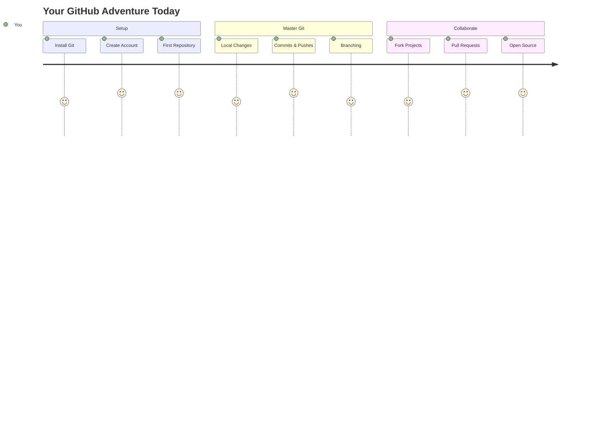
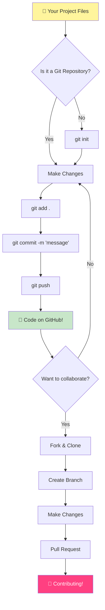
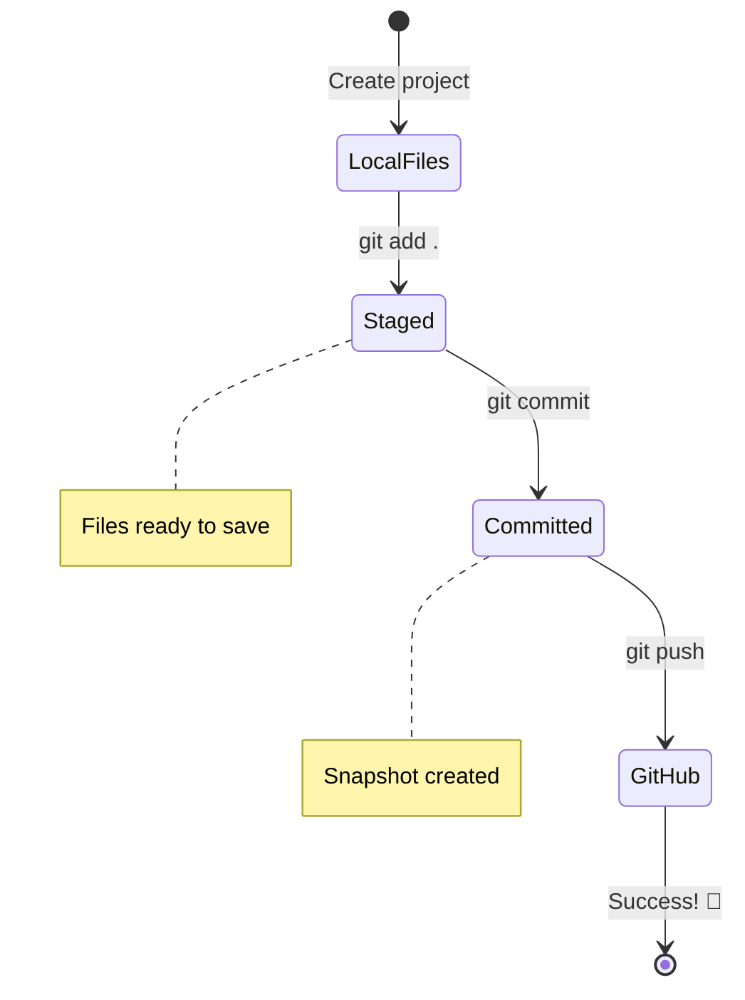
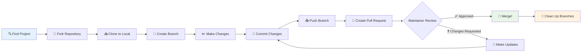
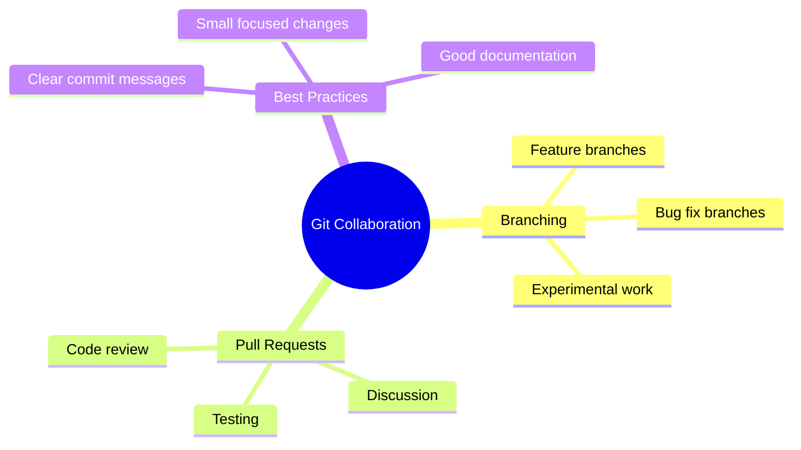
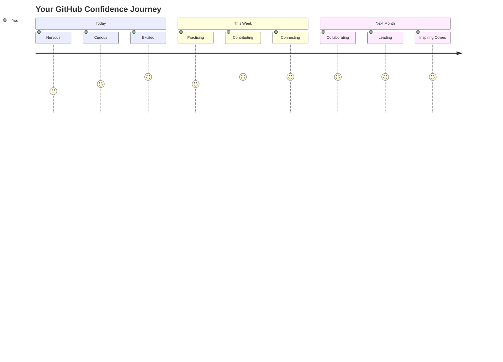

<!--
CO_OP_TRANSLATOR_METADATA:
{
  "original_hash": "0fe3ff66299b447f1c8cb34dcbf0c5ef",
  "translation_date": "2025-11-03T22:34:48+00:00",
  "source_file": "1-getting-started-lessons/2-github-basics/README.md",
  "language_code": "bn"
}
-->
# গিটহাব পরিচিতি

হ্যালো, ভবিষ্যৎ ডেভেলপার! 👋 বিশ্বজুড়ে লক্ষ লক্ষ কোডারের সাথে যোগ দিতে প্রস্তুত? আমি সত্যিই উত্তেজিত আপনাকে গিটহাবের সাথে পরিচয় করিয়ে দিতে – এটি প্রোগ্রামারদের জন্য একটি সোশ্যাল মিডিয়া প্ল্যাটফর্মের মতো, তবে এখানে লাঞ্চের ছবি শেয়ার করার পরিবর্তে আমরা কোড শেয়ার করি এবং একসাথে অসাধারণ জিনিস তৈরি করি!

যেটা আমাকে অবাক করে দেয় তা হলো: আপনার ফোনের প্রতিটি অ্যাপ, আপনি যে ওয়েবসাইটগুলোতে যান, এবং বেশিরভাগ টুল যা আপনি ব্যবহার করতে শিখবেন, সেগুলোই গিটহাবের মতো প্ল্যাটফর্মে ডেভেলপারদের দল দ্বারা তৈরি হয়েছে। আপনার প্রিয় মিউজিক অ্যাপ? আপনার মতো কেউ এতে অবদান রেখেছে। সেই গেম যা আপনি ছাড়তে পারছেন না? হ্যাঁ, সম্ভবত গিটহাব সহযোগিতার মাধ্যমে তৈরি। আর এখন আপনি সেই অসাধারণ কমিউনিটির অংশ হতে শিখতে যাচ্ছেন!

আমি জানি প্রথমে এটি অনেক বেশি মনে হতে পারে – আমি নিজেও প্রথমবার গিটহাব পেজের দিকে তাকিয়ে ভেবেছিলাম "এটা সব কী অর্থ বোঝায়?" কিন্তু বিষয়টি হলো: প্রতিটি ডেভেলপার ঠিক আপনার মতোই এখান থেকে শুরু করেছে। এই পাঠের শেষে, আপনার নিজস্ব গিটহাব রিপোজিটরি থাকবে (এটি আপনার ব্যক্তিগত প্রকল্প প্রদর্শনী যা ক্লাউডে থাকবে), এবং আপনি শিখবেন কীভাবে আপনার কাজ সংরক্ষণ করবেন, অন্যদের সাথে শেয়ার করবেন, এবং এমন প্রকল্পে অবদান রাখবেন যা লক্ষ লক্ষ মানুষ ব্যবহার করে।

আমরা একসাথে এই যাত্রা শুরু করব, ধাপে ধাপে। কোনো তাড়াহুড়ো নয়, কোনো চাপ নয় – শুধু আপনি, আমি, এবং কিছু সত্যিই চমৎকার টুল যা আপনার নতুন সেরা বন্ধু হতে চলেছে!


> স্কেচনোট [Tomomi Imura](https://twitter.com/girlie_mac) দ্বারা



## প্রাক-লেকচার কুইজ
[প্রাক-লেকচার কুইজ](https://ff-quizzes.netlify.app)

## পরিচিতি

আমরা উত্তেজনাপূর্ণ বিষয়গুলোতে যাওয়ার আগে, আসুন আপনার কম্পিউটারকে কিছু গিটহাব ম্যাজিকের জন্য প্রস্তুত করি! এটি একটি মাস্টারপিস তৈরি করার আগে আপনার শিল্প সরঞ্জামগুলি সংগঠিত করার মতো – সঠিক সরঞ্জাম প্রস্তুত থাকলে সবকিছু আরও মসৃণ এবং অনেক বেশি মজাদার হয়।

আমি ব্যক্তিগতভাবে প্রতিটি সেটআপ ধাপের মাধ্যমে আপনাকে নিয়ে যাব, এবং আমি প্রতিশ্রুতি দিচ্ছি এটি প্রথমে যতটা ভীতিকর মনে হতে পারে ততটা নয়। যদি কিছু প্রথমে বোঝা না যায়, সেটি সম্পূর্ণ স্বাভাবিক! আমি আমার প্রথম ডেভেলপমেন্ট এনভায়রনমেন্ট সেটআপ করার সময় মনে করেছিলাম যেন প্রাচীন হায়ারোগ্লিফিক্স পড়ার চেষ্টা করছি। প্রতিটি ডেভেলপার ঠিক আপনার মতোই এখান থেকে শুরু করেছে, ভাবছে তারা সঠিকভাবে করছে কিনা। স্পয়লার: আপনি যদি এখানে শিখছেন, তবে আপনি ইতিমধ্যেই সঠিকভাবে করছেন! 🌟

এই পাঠে আমরা আলোচনা করব:

- আপনার মেশিনে আপনি যে কাজ করেন তা ট্র্যাক করা
- অন্যদের সাথে প্রকল্পে কাজ করা
- ওপেন সোর্স সফটওয়্যারে অবদান রাখার উপায়

### প্রয়োজনীয়তা

আসুন আপনার কম্পিউটারকে কিছু গিটহাব ম্যাজিকের জন্য প্রস্তুত করি! চিন্তা করবেন না – এই সেটআপটি আপনাকে একবার করতে হবে, এবং তারপর আপনি আপনার পুরো কোডিং যাত্রার জন্য প্রস্তুত থাকবেন।

ঠিক আছে, আসুন ভিত্তি দিয়ে শুরু করি! প্রথমে, আমাদের দেখতে হবে গিট ইতিমধ্যেই আপনার কম্পিউটারে আছে কিনা। গিট মূলত একটি সুপার-স্মার্ট সহকারী যা আপনার কোডে আপনি যে প্রতিটি পরিবর্তন করেন তা মনে রাখে – প্রতি দুই সেকেন্ডে আতঙ্কিত হয়ে Ctrl+S চাপার চেয়ে অনেক ভালো (আমরা সবাই সেখানে ছিলাম!)।

এই ম্যাজিক কমান্ডটি আপনার টার্মিনালে টাইপ করে দেখুন গিট ইতিমধ্যেই ইনস্টল আছে কিনা:
`git --version`

যদি গিট এখনও না থাকে, চিন্তা করবেন না! শুধু [গিট ডাউনলোড করুন](https://git-scm.com/downloads) এবং এটি নিয়ে নিন। একবার আপনি এটি ইনস্টল করে নিলে, আমাদের গিটের সাথে আপনার পরিচয় করিয়ে দিতে হবে:

> 💡 **প্রথমবারের সেটআপ**: এই কমান্ডগুলো গিটকে বলে আপনি কে। এই তথ্যটি আপনি যে প্রতিটি কমিট করেন তার সাথে সংযুক্ত থাকবে, তাই এমন একটি নাম এবং ইমেইল বেছে নিন যা আপনি প্রকাশ্যে শেয়ার করতে স্বাচ্ছন্দ্য বোধ করেন।

```bash
git config --global user.name "your-name"
git config --global user.email "your-email"
```

গিট ইতিমধ্যেই কনফিগার করা আছে কিনা তা পরীক্ষা করতে আপনি টাইপ করতে পারেন:
```bash
git config --list
```

আপনার একটি গিটহাব অ্যাকাউন্ট, একটি কোড এডিটর (যেমন Visual Studio Code), এবং আপনার টার্মিনাল (বা: কমান্ড প্রম্পট) খুলতে হবে।

[github.com](https://github.com/) এ যান এবং যদি আপনার অ্যাকাউন্ট না থাকে তবে একটি অ্যাকাউন্ট তৈরি করুন, অথবা লগ ইন করুন এবং আপনার প্রোফাইল পূরণ করুন।

💡 **আধুনিক টিপ**: [SSH keys](https://docs.github.com/en/authentication/connecting-to-github-with-ssh) সেটআপ করার কথা বিবেচনা করুন অথবা [GitHub CLI](https://cli.github.com/) ব্যবহার করুন যাতে পাসওয়ার্ড ছাড়াই সহজে প্রমাণীকরণ করা যায়।

✅ গিটহাব বিশ্বের একমাত্র কোড রিপোজিটরি নয়; আরও অনেক আছে, তবে গিটহাব সবচেয়ে পরিচিত।

### প্রস্তুতি

আপনার স্থানীয় মেশিনে (ল্যাপটপ বা পিসি) একটি কোড প্রকল্পের জন্য একটি ফোল্ডার এবং গিটহাবে একটি পাবলিক রিপোজিটরি প্রয়োজন হবে, যা অন্যদের প্রকল্পে অবদান রাখার উদাহরণ হিসেবে কাজ করবে।

### আপনার কোড নিরাপদ রাখা

আসুন নিরাপত্তা সম্পর্কে একটু কথা বলি – তবে চিন্তা করবেন না, আমরা আপনাকে ভীতিকর কিছু দিয়ে অভিভূত করব না! এই নিরাপত্তা অনুশীলনগুলো আপনার গাড়ি বা বাড়ি লক করার মতো। এগুলো সহজ অভ্যাস যা স্বাভাবিক হয়ে যায় এবং আপনার কঠোর পরিশ্রমকে সুরক্ষিত রাখে।

আমরা আপনাকে শুরু থেকেই গিটহাবের সাথে কাজ করার আধুনিক, নিরাপদ উপায়গুলো দেখাব। এভাবে, আপনি ভালো অভ্যাস তৈরি করবেন যা আপনার পুরো কোডিং ক্যারিয়ারে আপনাকে সাহায্য করবে।

গিটহাবের সাথে কাজ করার সময়, নিরাপত্তার সেরা অনুশীলনগুলো অনুসরণ করা গুরুত্বপূর্ণ:

| নিরাপত্তার ক্ষেত্র | সেরা অনুশীলন | কেন এটি গুরুত্বপূর্ণ |
|--------------------|--------------|-----------------------|
| **প্রমাণীকরণ** | SSH keys বা Personal Access Tokens ব্যবহার করুন | পাসওয়ার্ড কম নিরাপদ এবং ধীরে ধীরে বাদ দেওয়া হচ্ছে |
| **টু-ফ্যাক্টর প্রমাণীকরণ** | আপনার গিটহাব অ্যাকাউন্টে 2FA চালু করুন | অ্যাকাউন্ট সুরক্ষার জন্য একটি অতিরিক্ত স্তর যোগ করে |
| **রিপোজিটরি নিরাপত্তা** | সংবেদনশীল তথ্য কখনোই কমিট করবেন না | API keys এবং পাসওয়ার্ড কখনোই পাবলিক রিপোজিটরিতে থাকা উচিত নয় |
| **ডিপেনডেন্সি ম্যানেজমেন্ট** | Dependabot চালু করুন আপডেটের জন্য | আপনার ডিপেনডেন্সিগুলো নিরাপদ এবং আপ-টু-ডেট রাখে |

> ⚠️ **গুরুত্বপূর্ণ নিরাপত্তা স্মরণ**: কখনোই API keys, পাসওয়ার্ড, বা অন্যান্য সংবেদনশীল তথ্য কোনো রিপোজিটরিতে কমিট করবেন না। সংবেদনশীল তথ্য সুরক্ষিত রাখতে environment variables এবং `.gitignore` ফাইল ব্যবহার করুন।

**আধুনিক প্রমাণীকরণ সেটআপ:**

```bash
# Generate SSH key (modern ed25519 algorithm)
ssh-keygen -t ed25519 -C "your_email@example.com"

# Set up Git to use SSH
git remote set-url origin git@github.com:username/repository.git
```

> 💡 **প্রো টিপ**: SSH keys বারবার পাসওয়ার্ড প্রবেশ করার প্রয়োজনীয়তা দূর করে এবং ঐতিহ্যবাহী প্রমাণীকরণ পদ্ধতির চেয়ে বেশি নিরাপদ।

---

## আপনার কোড পেশাদারের মতো পরিচালনা করা

ঠিক আছে, এখন জিনিসগুলো সত্যিই উত্তেজনাপূর্ণ হতে চলেছে! 🎉 আমরা শিখতে যাচ্ছি কীভাবে পেশাদারদের মতো আপনার কোড ট্র্যাক এবং পরিচালনা করবেন, এবং সত্যি বলতে, এটি শেখানো আমার প্রিয় বিষয়গুলোর একটি কারণ এটি একটি বড় পরিবর্তনকারী।

এটি কল্পনা করুন: আপনি একটি অসাধারণ গল্প লিখছেন, এবং আপনি প্রতিটি খসড়া, প্রতিটি চমৎকার সম্পাদনা, এবং প্রতিটি "ওয়েট, এটি জিনিয়াস!" মুহূর্তের ট্র্যাক রাখতে চান। গিট আপনার কোডের জন্য ঠিক সেটাই করে! এটি এমন একটি সময়-ভ্রমণকারী নোটবুকের মতো যা সবকিছু মনে রাখে – প্রতিটি কীস্ট্রোক, প্রতিটি পরিবর্তন, প্রতিটি "ওপস, এটি সবকিছু ভেঙে দিয়েছে" মুহূর্ত যা আপনি তাৎক্ষণিকভাবে পূর্বাবস্থায় ফিরিয়ে আনতে পারেন।

আমি স্বীকার করছি – এটি প্রথমে অপ্রতিরোধ্য মনে হতে পারে। যখন আমি শুরু করেছিলাম, আমি ভেবেছিলাম "আমি কেন আমার ফাইলগুলো সাধারণভাবে সংরক্ষণ করতে পারি না?" কিন্তু আমাকে বিশ্বাস করুন: একবার গিট আপনার জন্য ক্লিক করলে (এবং এটি করবে!), আপনার একটি আলোকিত মুহূর্ত হবে যেখানে আপনি ভাববেন "আমি কীভাবে আমার জীবনযাত্রা গিট ছাড়া চালিয়ে গিয়েছিলাম?" এটি এমন যেন আপনি উড়তে পারেন আবিষ্কার করা, যখন আপনি সব সময় হাঁটছিলেন!

ধরা যাক আপনার কাছে একটি লোকাল ফোল্ডার আছে যেখানে কিছু কোড প্রকল্প রয়েছে এবং আপনি গিট ব্যবহার করে আপনার অগ্রগতি ট্র্যাক করতে চান - এটি একটি ভার্সন কন্ট্রোল সিস্টেম। কিছু লোক গিট ব্যবহার করার সাথে ভবিষ্যৎ নিজেকে একটি প্রেমপত্র লেখার তুলনা করে। আপনার কমিট মেসেজগুলো কয়েক দিন বা সপ্তাহ বা মাস পরে পড়লে আপনি মনে করতে পারবেন কেন আপনি একটি সিদ্ধান্ত নিয়েছিলেন, বা একটি পরিবর্তন "রোলব্যাক" করতে পারবেন - অর্থাৎ, যখন আপনি ভালো "কমিট মেসেজ" লিখবেন।



### কাজ: আপনার প্রথম রিপোজিটরি তৈরি করুন!

> 🎯 **আপনার মিশন (এবং আমি আপনার জন্য খুবই উত্তেজিত!)**: আমরা একসাথে আপনার প্রথম গিটহাব রিপোজিটরি তৈরি করতে যাচ্ছি! এখানে শেষ করার সময়, আপনার কোড যেখানে থাকবে ইন্টারনেটে আপনার নিজস্ব ছোট্ট কোণ থাকবে, এবং আপনি আপনার প্রথম "কমিট" করবেন (এটি ডেভেলপারদের ভাষায় একটি খুব স্মার্ট উপায়ে আপনার কাজ সংরক্ষণ করার জন্য)।  
>
> এটি সত্যিই একটি বিশেষ মুহূর্ত – আপনি বিশ্বব্যাপী ডেভেলপারদের কমিউনিটিতে আনুষ্ঠানিকভাবে যোগ দিতে যাচ্ছেন! আমি এখনও আমার প্রথম রিপো তৈরি করার উত্তেজনা মনে করি এবং ভাবি "ওয়াও, আমি সত্যিই এটি করছি!"

আসুন একসাথে এই অ্যাডভেঞ্চারটি শুরু করি, ধাপে ধাপে। প্রতিটি অংশে সময় নিন – তাড়াহুড়ো করার জন্য কোনো পুরস্কার নেই, এবং আমি প্রতিশ্রুতি দিচ্ছি প্রতিটি ধাপই অর্থপূর্ণ হবে। মনে রাখবেন, আপনি যে কোডিং সুপারস্টারকে প্রশংসা করেন তিনি এক সময় ঠিক আপনার মতোই ছিলেন, তার প্রথম রিপোজিটরি তৈরি করতে যাচ্ছিলেন। কতটা চমৎকার, তাই না?

> ভিডিওটি দেখুন
> 
> [](https://www.youtube.com/watch?v=9R31OUPpxU4)

**আসুন একসাথে এটি করি:**

1. **গিটহাবে আপনার রিপোজিটরি তৈরি করুন**। GitHub.com এ যান এবং সেই উজ্জ্বল সবুজ **New** বোতাম (অথবা উপরের ডান কোণে **+** চিহ্ন) খুঁজুন। এটি ক্লিক করুন এবং **New repository** নির্বাচন করুন।

   এখানে কী করতে হবে:
   1. আপনার রিপোজিটরিকে একটি নাম দিন – এটি আপনার জন্য অর্থবহ কিছু করুন!
   1. চাইলে একটি বিবরণ যোগ করুন (এটি অন্যদের আপনার প্রকল্পটি কী সম্পর্কে বুঝতে সাহায্য করে)
   1. এটি পাবলিক (সবাই এটি দেখতে পারে) বা প্রাইভেট (শুধুমাত্র আপনার জন্য) করতে চান কিনা তা সিদ্ধান্ত নিন
   1. আমি একটি README ফাইল যোগ করার জন্য বাক্সটি চেক করার পরামর্শ দিচ্ছি – এটি আপনার প্রকল্পের সামনের পৃষ্ঠা
   1. **Create repository** ক্লিক করুন এবং উদযাপন করুন – আপনি আপনার প্রথম রিপো তৈরি করেছেন! 🎉

2. **আপনার প্রকল্প ফোল্ডারে যান**। এখন আসুন আপনার টার্মিনাল খুলুন (চিন্তা করবেন না, এটি দেখতে যতটা ভীতিকর মনে হয় ততটা নয়!)। আমাদের আপনার কম্পিউটারকে বলতে হবে আপনার প্রকল্প ফাইলগুলো কোথায়। এই কমান্ডটি টাইপ করুন:

   ```bash
   cd [name of your folder]
   ```

   **আমরা এখানে কী করছি:**
   - আমরা মূলত বলছি "হে কম্পিউটার, আমাকে আমার প্রকল্প ফোল্ডারে নিয়ে যাও"
   - এটি আপনার ডেস্কটপে একটি নির্দিষ্ট ফোল্ডার খোলার মতো, তবে আমরা এটি টেক্সট কমান্ড দিয়ে করছি
   - `[name of your folder]` এর জায়গায় আপনার প্রকল্প ফোল্ডারের প্রকৃত নাম দিন

3. **আপনার ফোল্ডারকে একটি গিট রিপোজিটরিতে পরিণত করুন**। এখানেই ম্যাজিক ঘটে! টাইপ করুন:

   ```bash
   git init
   ```

   **এখানে কী ঘটেছে (খুবই চমৎ
**আমরা যা করলাম:**
- আপনার স্থানীয় প্রকল্প এবং আপনার GitHub রিপোজিটরির মধ্যে একটি সংযোগ তৈরি করেছি
- "Origin" আপনার GitHub রিপোজিটরির একটি ডাকনাম – এটি ঠিক আপনার ফোনে একটি কন্টাক্ট যোগ করার মতো
- এখন আপনার স্থানীয় Git জানে কোথায় আপনার কোড পাঠাতে হবে যখন আপনি এটি শেয়ার করতে প্রস্তুত

💡 **সহজ উপায়**: যদি আপনার কাছে GitHub CLI ইনস্টল করা থাকে, তাহলে এটি একটি কমান্ডে করা সম্ভব:
   ```bash
   gh repo create my-repo --public --push --source=.
   ```

8. **আপনার কোড GitHub-এ পাঠান** (বড় মুহূর্ত!):

   ```bash
   git push -u origin main
   ```

**🚀 এটাই! আপনি আপনার কোড GitHub-এ আপলোড করছেন!**

**কি ঘটছে:**
- আপনার কম্পিউটার থেকে GitHub-এ আপনার কমিটগুলো যাচ্ছে
- `-u` ফ্ল্যাগ একটি স্থায়ী সংযোগ সেট আপ করে যাতে ভবিষ্যতে পুশ করা সহজ হয়
- "main" আপনার প্রধান ব্রাঞ্চের নাম (যেমন প্রধান ফোল্ডার)
- এর পরে, ভবিষ্যতে আপলোডের জন্য আপনি শুধু `git push` টাইপ করতে পারেন!

💡 **দ্রুত নোট**: যদি আপনার ব্রাঞ্চের নাম অন্য কিছু হয় (যেমন "master"), তাহলে সেই নাম ব্যবহার করুন। আপনি `git branch --show-current` দিয়ে চেক করতে পারেন।

9. **আপনার নতুন দৈনিক কোডিং রিদম** (এটাই আসক্তি তৈরি করে!):

এখন থেকে, যখনই আপনি আপনার প্রকল্পে পরিবর্তন করবেন, আপনার কাছে এই সহজ তিন-ধাপের প্রক্রিয়া থাকবে:

   ```bash
   git add .
   git commit -m "describe what you changed"
   git push
   ```

**এটি আপনার কোডিং হার্টবিট হয়ে যায়:**
- আপনার কোডে কিছু চমৎকার পরিবর্তন করুন ✨
- `git add` দিয়ে সেগুলো স্টেজ করুন ("Git, এই পরিবর্তনগুলো লক্ষ্য করো!")
- `git commit` এবং একটি বর্ণনামূলক বার্তা দিয়ে সেগুলো সংরক্ষণ করুন (ভবিষ্যতের আপনি আপনাকে ধন্যবাদ জানাবে!)
- `git push` দিয়ে সেগুলো বিশ্বে শেয়ার করুন 🚀
- পুনরাবৃত্তি করুন – সত্যিই, এটি শ্বাস নেওয়ার মতো স্বাভাবিক হয়ে যায়!

আমি এই ওয়ার্কফ্লোটি পছন্দ করি কারণ এটি ভিডিও গেমে একাধিক সেভ পয়েন্ট থাকার মতো। এমন একটি পরিবর্তন করেছেন যা আপনি পছন্দ করেন? কমিট করুন! কিছু ঝুঁকিপূর্ণ চেষ্টা করতে চান? সমস্যা নেই – যদি কিছু ভুল হয়, আপনি সর্বদা আপনার শেষ কমিটে ফিরে যেতে পারেন!

> 💡 **টিপ**: আপনি `.gitignore` ফাইল গ্রহণ করতে চাইতে পারেন যাতে আপনি ট্র্যাক করতে না চাওয়া ফাইলগুলো GitHub-এ না দেখায় - যেমন সেই নোট ফাইল যা আপনি একই ফোল্ডারে সংরক্ষণ করেন কিন্তু একটি পাবলিক রিপোজিটরিতে থাকার কোনো স্থান নেই। আপনি [.gitignore templates](https://github.com/github/gitignore) এ টেমপ্লেট খুঁজে পেতে পারেন বা [gitignore.io](https://www.toptal.com/developers/gitignore) ব্যবহার করে একটি তৈরি করতে পারেন।

### 🧠 **প্রথম রিপোজিটরি চেক-ইন: কেমন লাগলো?**

**এক মুহূর্ত উদযাপন এবং চিন্তা করুন:**
- প্রথমবার আপনার কোড GitHub-এ দেখতে কেমন লাগলো?
- কোন ধাপটি সবচেয়ে বিভ্রান্তিকর ছিল এবং কোনটি আশ্চর্যজনকভাবে সহজ ছিল?
- আপনি কি আপনার নিজের ভাষায় `git add`, `git commit`, এবং `git push` এর পার্থক্য ব্যাখ্যা করতে পারেন?



> **মনে রাখুন**: অভিজ্ঞ ডেভেলপাররাও কখনও কখনও সঠিক কমান্ড ভুলে যায়। এই ওয়ার্কফ্লোটি মাংসপেশীর স্মৃতিতে পরিণত হতে সময় লাগে - আপনি দারুণ করছেন!

#### আধুনিক Git ওয়ার্কফ্লো

এই আধুনিক অভ্যাসগুলো গ্রহণ করার কথা বিবেচনা করুন:

- **Conventional Commits**: `feat:`, `fix:`, `docs:` ইত্যাদি মতো একটি স্ট্যান্ডার্ড কমিট বার্তা ফরম্যাট ব্যবহার করুন। আরও জানুন [conventionalcommits.org](https://www.conventionalcommits.org/) এ।
- **Atomic commits**: প্রতিটি কমিট একটি একক যৌক্তিক পরিবর্তন উপস্থাপন করে।
- **Frequent commits**: বড়, বিরল কমিটের পরিবর্তে বর্ণনামূলক বার্তাসহ প্রায়ই কমিট করুন।

#### কমিট বার্তা

একটি চমৎকার Git কমিট বিষয়বস্তু এই বাক্যটি সম্পূর্ণ করে:
যদি প্রয়োগ করা হয়, এই কমিট <আপনার বিষয়বস্তু এখানে> করবে।

বিষয়ের জন্য আদেশমূলক, বর্তমান কাল ব্যবহার করুন: "change" না "changed" বা "changes"। 
বিষয়ের মতো, শরীরেও (ঐচ্ছিক) আদেশমূলক, বর্তমান কাল ব্যবহার করুন। শরীরটি পরিবর্তনের প্রেরণা অন্তর্ভুক্ত করা উচিত এবং এটি পূর্ববর্তী আচরণের সাথে তুলনা করা উচিত। আপনি `কেন` ব্যাখ্যা করছেন, `কিভাবে` নয়।

✅ কয়েক মিনিট সময় নিয়ে GitHub-এ ঘুরে দেখুন। আপনি কি একটি সত্যিই চমৎকার কমিট বার্তা খুঁজে পেতে পারেন? আপনি কি একটি খুব সংক্ষিপ্ত বার্তা খুঁজে পেতে পারেন? কমিট বার্তায় কোন তথ্য সবচেয়ে গুরুত্বপূর্ণ এবং উপযোগী বলে মনে হয়?

## অন্যদের সাথে কাজ করা (মজার অংশ!)

আপনার টুপি ধরে রাখুন কারণ এটি GitHub-কে একেবারে জাদুকরী করে তোলে! 🪄 আপনি আপনার নিজের কোড পরিচালনা করতে দক্ষ হয়ে উঠেছেন, কিন্তু এখন আমরা আমার একেবারে প্রিয় অংশে ডুব দিচ্ছি – সারা বিশ্বের আশ্চর্যজনক লোকদের সাথে সহযোগিতা করা।

এটি কল্পনা করুন: আপনি আগামীকাল ঘুম থেকে উঠলেন এবং দেখলেন যে টোকিওর কেউ আপনার কোড উন্নত করেছে যখন আপনি ঘুমাচ্ছিলেন। তারপর বার্লিনের কেউ একটি বাগ ঠিক করলো যা আপনি আটকে ছিলেন। দুপুরের মধ্যে, সাও পাওলোর একজন ডেভেলপার একটি বৈশিষ্ট্য যোগ করেছে যা আপনি কখনও ভাবেননি। এটি বিজ্ঞান কল্পকাহিনী নয় – এটি শুধুমাত্র GitHub মহাবিশ্বে একটি সাধারণ মঙ্গলবার!

যা আমাকে সত্যিই উত্তেজিত করে তা হল আপনি যে সহযোগিতা দক্ষতাগুলো শিখতে যাচ্ছেন? এগুলোই EXACT একই ওয়ার্কফ্লো যা Google, Microsoft এবং আপনার প্রিয় স্টার্টআপের দলগুলো প্রতিদিন ব্যবহার করে। আপনি শুধু একটি দুর্দান্ত টুল শিখছেন না – আপনি সেই গোপন ভাষা শিখছেন যা পুরো সফটওয়্যার বিশ্বকে একসাথে কাজ করতে সক্ষম করে।

সত্যিই, যখন আপনি প্রথমবার আপনার প্রথম পুল রিকোয়েস্ট মার্জ করার রাশ অনুভব করবেন, তখন আপনি বুঝতে পারবেন কেন ডেভেলপাররা ওপেন সোর্স নিয়ে এত আবেগপ্রবণ হয়ে ওঠে। এটি বিশ্বের সবচেয়ে বড়, সবচেয়ে সৃজনশীল দল প্রকল্পের অংশ হওয়ার মতো!

> ভিডিও দেখুন
>
> [](https://www.youtube.com/watch?v=bFCM-PC3cu8)

GitHub-এ জিনিসগুলো রাখার প্রধান কারণ ছিল অন্য ডেভেলপারদের সাথে সহযোগিতা করা সম্ভব করা।



আপনার রিপোজিটরিতে, `Insights > Community`-এ নেভিগেট করুন এবং দেখুন আপনার প্রকল্পটি সুপারিশকৃত কমিউনিটি স্ট্যান্ডার্ডের সাথে কেমন তুলনা করে।

আপনার রিপোজিটরিকে পেশাদার এবং স্বাগতপূর্ণ দেখাতে চান? আপনার রিপোজিটরিতে যান এবং `Insights > Community`-এ ক্লিক করুন। এই চমৎকার বৈশিষ্ট্যটি দেখায় আপনার প্রকল্পটি GitHub কমিউনিটি "ভালো রিপোজিটরি অভ্যাস" হিসেবে যা বিবেচনা করে তার সাথে কেমন তুলনা করে।

> 🎯 **আপনার প্রকল্পকে উজ্জ্বল করুন**: একটি ভালোভাবে সংগঠিত রিপোজিটরি এবং ভালো ডকুমেন্টেশন একটি পরিষ্কার, স্বাগতপূর্ণ দোকানের মতো। এটি মানুষকে বলে যে আপনি আপনার কাজের যত্ন নেন এবং অন্যদের অবদান রাখতে উৎসাহিত করে!

**একটি রিপোজিটরিকে অসাধারণ করে তোলে:**

| কি যোগ করবেন | কেন এটি গুরুত্বপূর্ণ | এটি আপনার জন্য কি করে |
|-------------|-------------------|---------------------|
| **Description** | প্রথম ইমপ্রেশন গুরুত্বপূর্ণ! | মানুষ তৎক্ষণাৎ জানে আপনার প্রকল্পটি কি করে |
| **README** | আপনার প্রকল্পের সামনের পৃষ্ঠা | নতুন দর্শকদের জন্য একটি বন্ধুত্বপূর্ণ ট্যুর গাইডের মতো |
| **Contributing Guidelines** | দেখায় আপনি সাহায্যকে স্বাগত জানাচ্ছেন | মানুষ জানে ঠিক কিভাবে তারা আপনাকে সাহায্য করতে পারে |
| **Code of Conduct** | একটি বন্ধুত্বপূর্ণ পরিবেশ তৈরি করে | সবাই অংশগ্রহণ করতে স্বাগত বোধ করে |
| **License** | আইনি স্পষ্টতা | অন্যরা জানে কিভাবে তারা আপনার কোড ব্যবহার করতে পারে |
| **Security Policy** | দেখায় আপনি দায়িত্বশীল | পেশাদার অভ্যাস প্রদর্শন করে |

> 💡 **প্রো টিপ**: GitHub এই ফাইলগুলোর জন্য টেমপ্লেট প্রদান করে। একটি নতুন রিপোজিটরি তৈরি করার সময়, এই ফাইলগুলো স্বয়ংক্রিয়ভাবে তৈরি করতে বক্সগুলো চেক করুন।

**আধুনিক GitHub বৈশিষ্ট্যগুলো অন্বেষণ করুন:**

🤖 **অটোমেশন এবং CI/CD:**
- **GitHub Actions** স্বয়ংক্রিয় টেস্টিং এবং ডিপ্লয়মেন্টের জন্য
- **Dependabot** স্বয়ংক্রিয় ডিপেনডেন্সি আপডেটের জন্য

💬 **কমিউনিটি এবং প্রকল্প ব্যবস্থাপনা:**
- **GitHub Discussions** সমস্যা ছাড়িয়ে কমিউনিটি কথোপকথনের জন্য
- **GitHub Projects** কানবান-স্টাইল প্রকল্প ব্যবস্থাপনার জন্য
- **Branch protection rules** কোডের গুণমানের মান বজায় রাখতে

এই সমস্ত রিসোর্স নতুন টিম সদস্যদের অনবোর্ডিংয়ে উপকার করবে। এবং এগুলো সাধারণত সেই ধরনের জিনিস যা নতুন কন্ট্রিবিউটররা আপনার কোড দেখার আগে দেখে, এটি খুঁজে বের করতে যে আপনার প্রকল্পটি তাদের সময় ব্যয় করার জন্য সঠিক জায়গা কিনা।

✅ README ফাইলগুলো, যদিও প্রস্তুত করতে সময় লাগে, প্রায়ই ব্যস্ত মেইনটেইনারদের দ্বারা অবহেলিত হয়। আপনি কি একটি বিশেষভাবে বর্ণনামূলক উদাহরণ খুঁজে পেতে পারেন? নোট: কিছু [ভালো README তৈরি করতে সাহায্যকারী টুল](https://www.makeareadme.com/) রয়েছে যা আপনি চেষ্টা করতে পারেন।

### টাস্ক: কিছু কোড মার্জ করুন

কন্ট্রিবিউটিং ডকস মানুষকে প্রকল্পে অবদান রাখতে সাহায্য করে। এটি ব্যাখ্যা করে আপনি কোন ধরনের অবদান খুঁজছেন এবং প্রক্রিয়াটি কিভাবে কাজ করে। কন্ট্রিবিউটরদের আপনার GitHub রিপোজিটরিতে অবদান রাখতে সক্ষম হতে একটি সিরিজ ধাপের মধ্য দিয়ে যেতে হবে:

1. **আপনার রিপোজিটরি ফর্ক করা**। আপনি সম্ভবত চাইবেন মানুষ আপনার প্রকল্পটি _fork_ করুক। ফর্ক করা মানে তাদের GitHub প্রোফাইলে আপনার রিপোজিটরির একটি প্রতিলিপি তৈরি করা।
1. **ক্লোন**। সেখান থেকে তারা প্রকল্পটি তাদের স্থানীয় মেশিনে ক্লোন করবে।
1. **একটি ব্রাঞ্চ তৈরি করুন**। আপনি চাইবেন তারা তাদের কাজের জন্য একটি _branch_ তৈরি করুক।
1. **তাদের পরিবর্তন একটি এলাকায় কেন্দ্রীভূত করুন**। কন্ট্রিবিউটরদের একবারে একটি জিনিসে তাদের অবদান কেন্দ্রীভূত করতে বলুন - এভাবে তাদের কাজ _merge_ করার সম্ভাবনা বেশি। কল্পনা করুন তারা একটি বাগ ঠিক করে, একটি নতুন বৈশিষ্ট্য যোগ করে, এবং কয়েকটি টেস্ট আপডেট করে - যদি আপনি ৩টির মধ্যে ২টি বা ১টি পরিবর্তন বাস্তবায়ন করতে চান বা পারেন?

✅ এমন একটি পরিস্থিতি কল্পনা করুন যেখানে ব্রাঞ্চগুলো ভালো কোড লিখতে এবং শিপ করতে বিশেষভাবে গুরুত্বপূর্ণ। আপনি কোন ব্যবহার কেসগুলো ভাবতে পারেন?

> নোট, আপনি যে পরিবর্তন দেখতে চান তা হোন এবং আপনার নিজের কাজের জন্য ব্রাঞ্চ তৈরি করুন। আপনি যে কমিটগুলো করবেন তা আপনি বর্তমানে যে ব্রাঞ্চে "চেক আউট" করেছেন তাতে করা হবে। `git status` ব্যবহার করে দেখুন কোন ব্রাঞ্চটি সেটি।

চলুন একটি কন্ট্রিবিউটর ওয়ার্কফ্লো দেখে নিই। ধরে নিন কন্ট্রিবিউটর ইতিমধ্যে রিপোজিটরি _forked_ এবং _cloned_ করেছে, তাই তাদের স্থানীয় মেশিনে কাজ করার জন্য একটি Git রিপো প্রস্তুত রয়েছে:

1. **একটি ব্রাঞ্চ তৈরি করুন**। `git branch` কমান্ড ব্যবহার করে একটি ব্রাঞ্চ তৈরি করুন যা তারা অবদান রাখতে চায় এমন পরিবর্তনগুলো ধারণ করবে:

   ```bash
   git branch [branch-name]
   ```

> 💡 **আধুনিক পদ্ধতি**: আপনি একটি কমান্ডে নতুন ব্রাঞ্চ তৈরি এবং স্যুইচ করতে পারেন:
   ```bash
   git switch -c [branch-name]
   ```

1. **কাজের ব্রাঞ্চে স্যুইচ করুন**। নির্দিষ্ট ব্রাঞ্চে স্যুইচ করুন এবং `git switch` দিয়ে কাজের ডিরেক্টরি আপডেট করুন:

   ```bash
   git switch [branch-name]
   ```

> 💡 **আধুনিক নোট**: ব্রাঞ্চ পরিবর্তন করার সময় `git switch` হল `git checkout` এর আধুনিক প্রতিস্থাপন। এটি আরও পরিষ্কার এবং শিক্ষানবিশদের জন্য নিরাপদ।

1. **কাজ করুন**। এই পর্যায়ে আপনি আপনার পরিবর্তনগুলো যোগ করতে চান। Git-কে এটি সম্পর্কে জানাতে ভুলবেন না নিম্নলিখিত কমান্ডগুলো দিয়ে:

   ```bash
   git add .
   git commit -m "my changes"
   ```

> ⚠️ **কমিট বার্তার গুণমান**: নিশ্চিত করুন যে আপনি আপনার কমিটকে একটি ভালো নাম দেন, আপনার এবং আপনি যে রিপোজিটরির মেইনটেইনারকে সাহায্য করছেন তার জন্য। আপনি কি পরিবর্তন করেছেন তা নির্দিষ্ট করুন!

1. **আপনার কাজ `main` ব্রাঞ্চের সাথে একত্রিত করুন**। এক পর্যায়ে আপনি কাজ শেষ করেছেন এবং আপনি আপনার কাজ `main` ব্রাঞ্চের সাথে একত্রিত করতে চান। এদিকে `main` ব্রাঞ্চ পরিবর্তিত হতে পারে, তাই নিশ্চিত করুন যে আপনি প্রথমে এটি সর্বশেষে আপডেট করেছেন নিম্নলিখিত কমান্ডগুলো দিয়ে:

   ```bash
   git switch main
   git pull
   ```

এই পর্যায়ে আপনি নিশ্চিত করতে চান যে কোনো _conflicts_, যেখানে Git সহজে পরিবর্তনগুলো _combine_ করতে পারে না, আপনার কাজের ব্রাঞ্চে ঘটে। তাই নিম্নলিখিত কমান্ডগুলো চালান:

   ```bash
   git switch [branch_name]
   git merge main
   ```

`git merge main` কমান্ডটি `main` থেকে আপনার ব্রাঞ্চে সমস্ত পরিবর্তন নিয়ে আসবে। আশা করি আপনি শুধু চালিয়ে যেতে পারবেন। যদি না পারেন, তাহলে VS Code আপনাকে দেখাবে কোথায় Git _confused_ এবং আপনি প্রভাবিত ফাইলগুলো পরিবর্তন করবেন যাতে কোন বিষয়বস্তু সবচেয়ে সঠিক তা বলা যায়।

💡 **আধুনিক বিকল্প**: একটি পরিষ্কার ইতিহাসের জন্য `git rebase` ব্যবহার করার কথা বিবেচনা করুন:
   ```bash
   git rebase main
   ```
 এটি আপনার কমিটগুলোকে সর্বশেষ main ব্রাঞ্চের উপরে পুনরায় চালায়, একটি রৈখিক ইতিহাস তৈরি করে।

1. **আপনার কাজ GitHub-এ পাঠান**। আপনার কাজ GitHub-এ পাঠানো মানে দুটি জিনিস। আপনার ব্রাঞ্চটি আপনার রিপোতে পুশ করা এবং তারপর একটি PR, Pull Request খুলুন।

   ```bash
   git push --set-upstream origin [branch-name]
   ```

উপরের কমান্ডটি আপনার forked রিপোতে ব্রাঞ্চ তৈরি করে।

### 🤝 **সহযোগিতা দক্ষতা পরীক্ষা: অন্যদের সাথে কাজ করতে প্রস্তুত?**

**চলুন দেখি আপনি সহযোগিতা সম্পর্কে কেমন অনুভব করছেন:**
- ফর্কিং এবং পুল রিকোয়েস্টের ধারণা এখন কি আপনার কাছে পরিষ্কার?
- ব্রাঞ্চ নিয়ে কাজ করার বিষয়ে কোন একটি জিনিস আপনি আরও অনুশীলন করতে চান?
- অন্য কারো প্রকল্পে অবদান রাখতে আপনি কতটা স্বাচ্ছন্দ্যবোধ করছেন?



> **আত্মবিশ্বাস বাড়ানোর জন্য**: আপনি যে প্রতিটি ডেভেলপারকে প্রশংসা করেন তিনি একবার তার প্রথম পুল রিকোয়েস্ট নিয়ে নার্ভাস ছিলেন। GitHub কমিউনিটি নতুনদের জন্য অত্যন্ত স্বাগতপূর্ণ!

1. **একটি PR খুলুন**। পরবর্তী, আপনি একটি PR খুলতে চান। আপনি এটি GitHub-এ forked রিপোতে নেভিগেট করে করেন। আপনি GitHub-এ একটি ইঙ্গিত দেখতে পাবেন যেখানে এটি জিজ্ঞাসা করে আপনি কি একটি নতুন PR তৈরি করতে চান, আপনি এটি ক্লিক করেন এবং আপনাকে একটি ইন্টারফেসে নিয়ে যাওয়া হয় যেখানে আপনি কমিট বার্তা শিরোনাম পরিবর্তন করতে পারেন, এটিকে আরও উপযুক্ত বর্ণনা দিতে পারেন। এখন আপনি যে রিপোজিটরিটি fork করেছেন তার মেইনটেইনার এই PRটি দেখবেন এবং _আঙ্গুল ক্রস করে_ তারা এটি প্রশংসা করবে এবং আপনার PRটি _merge_ করবে। আপনি এখন একজন কন্ট্রিবিউটর, বাহ :)

💡 **আধুনিক টিপ**: আপনি GitHub CLI ব্যবহার করে PR তৈরি করতে পারেন:
   ```bash
   gh pr create --title "Your PR title" --body "Description of changes"
   ```

🔧 **PR-এর জন্য সেরা অনুশীলন**:
- "Fixes #123" এর মতো কীওয়ার্ড ব্যবহার করে সম্পর্কিত সমস্যাগুলোর লিঙ্ক দিন
- UI পরিবর্তনের জন্য স্ক্রিনশট যোগ করুন
- নির্দিষ্ট রিভিউয়ারদের অনুরোধ করুন
- কাজ চলমান থাকলে ড্রাফট PR ব্যবহার করুন
- রিভিউ অনুরোধ করার আগে নিশ্চিত করুন যে সমস্ত CI চেক পাস হয়েছে
1. **পরিষ্কার করুন**। একটি PR সফলভাবে মার্জ করার পর এটি পরিষ্কার করা ভালো অভ্যাস হিসেবে বিবেচিত হয়। আপনাকে আপনার স্থানীয় শাখা এবং GitHub-এ পুশ করা শাখা উভয়ই পরিষ্কার করতে হবে। প্রথমে নিচের কমান্ড দিয়ে স্থানীয়ভাবে এটি মুছে ফেলুন:

   ```bash
   git branch -d [branch-name]
   ```

   এরপর আপনার fork করা রিপোজিটরির GitHub পেজে যান এবং আপনি যে রিমোট শাখা পুশ করেছেন সেটি সরিয়ে ফেলুন।

`Pull request` শব্দটি কিছুটা অদ্ভুত শোনাতে পারে কারণ আপনি প্রকল্পে আপনার পরিবর্তনগুলি পুশ করতে চান। তবে প্রকল্পের মালিক বা মূল দলকে প্রকল্পের "মেইন" শাখার সাথে এটি মার্জ করার আগে আপনার পরিবর্তনগুলি বিবেচনা করতে হবে, তাই আপনি প্রকৃতপক্ষে একটি পরিবর্তনের সিদ্ধান্তের জন্য অনুরোধ করছেন।

একটি pull request হলো এমন একটি জায়গা যেখানে আপনি একটি শাখায় প্রবর্তিত পার্থক্যগুলি পর্যালোচনা, মন্তব্য, একীভূত টেস্ট এবং আরও অনেক কিছু নিয়ে আলোচনা করতে পারেন। একটি ভালো pull request প্রায় একই নিয়ম অনুসরণ করে যা একটি commit বার্তার ক্ষেত্রে প্রযোজ্য। আপনি ইস্যু ট্র্যাকার-এ একটি ইস্যুর রেফারেন্স যোগ করতে পারেন, উদাহরণস্বরূপ যখন আপনার কাজ একটি ইস্যু সমাধান করে। এটি `#` এবং আপনার ইস্যুর নম্বর ব্যবহার করে করা হয়। উদাহরণস্বরূপ `#97`।

🤞আশা করি সব চেক পাস করবে এবং প্রকল্পের মালিক(রা) আপনার পরিবর্তনগুলি প্রকল্পে মার্জ করবে🤞

আপনার বর্তমান স্থানীয় কাজের শাখাকে GitHub-এর সংশ্লিষ্ট রিমোট শাখার সমস্ত নতুন commit দিয়ে আপডেট করুন:

`git pull`

## ওপেন সোর্সে অবদান রাখা (আপনার প্রভাব তৈরি করার সুযোগ!)

আপনি এমন কিছু করার জন্য প্রস্তুত যা আপনার মনকে পুরোপুরি বিস্মিত করবে? 🤯 আসুন ওপেন সোর্স প্রকল্পে অবদান রাখার কথা বলি – এবং আমি এটি আপনার সাথে শেয়ার করার কথা ভাবলেই শিহরিত হই!

এটি এমন কিছু অসাধারণ কিছুর অংশ হওয়ার আপনার সুযোগ। কল্পনা করুন এমন টুল উন্নত করা যা প্রতিদিন লক্ষ লক্ষ ডেভেলপার ব্যবহার করেন, অথবা এমন একটি অ্যাপে বাগ ঠিক করা যা আপনার বন্ধুরা পছন্দ করে। এটি শুধুমাত্র একটি স্বপ্ন নয় – এটি ওপেন সোর্স অবদান রাখার মূল বিষয়!

এটি ভাবলেই আমার রোমাঞ্চিত লাগে: আপনি যে প্রতিটি টুল শিখছেন – আপনার কোড এডিটর, আমরা যে ফ্রেমওয়ার্কগুলি অন্বেষণ করব, এমনকি আপনি যে ব্রাউজারে এটি পড়ছেন – এটি শুরু হয়েছিল এমন একজনের মাধ্যমে যিনি ঠিক আপনার মতো তাদের প্রথম অবদান রেখেছিলেন। সেই অসাধারণ ডেভেলপার যিনি আপনার প্রিয় VS Code এক্সটেনশন তৈরি করেছেন? তারা একবার একজন শিক্ষানবিশ ছিলেন, "create pull request" ক্লিক করার সময় তাদের হাত কাঁপছিল, ঠিক যেমন আপনি করতে যাচ্ছেন।

এবং সবচেয়ে সুন্দর অংশটি হলো: ওপেন সোর্স কমিউনিটি ইন্টারনেটের সবচেয়ে বড় গ্রুপ হাগের মতো। বেশিরভাগ প্রকল্প নতুনদের জন্য সক্রিয়ভাবে খুঁজে এবং "good first issue" ট্যাগযুক্ত ইস্যু থাকে বিশেষভাবে আপনার মতো লোকদের জন্য! মেইনটেইনাররা নতুন অবদানকারীদের দেখলে সত্যিই উত্তেজিত হন কারণ তারা তাদের নিজস্ব প্রথম পদক্ষেপগুলি মনে করেন।

```mermaid
flowchart TD
    A[🔍 Explore GitHub] --> B[🏷️ Find "good first issue"]
    B --> C[📖 Read Contributing Guidelines]
    C --> D[🍴 Fork Repository]
    D --> E[💻 Set Up Local Environment]
    E --> F[🌿 Create Feature Branch]
    F --> G[✨ Make Your Contribution]
    G --> H[🧪 Test Your Changes]
    H --> I[📝 Write Clear Commit]
    I --> J[📤 Push & Create PR]
    J --> K[💬 Engage with Feedback]
    K --> L[🎉 Merged! You're a Contributor!]
    L --> M[🌟 Find Next Issue]
    
    style A fill:#e1f5fe
    style L fill:#c8e6c9
    style M fill:#fff59d
```

আপনি এখানে শুধু কোড শিখছেন না – আপনি একটি বৈশ্বিক নির্মাতাদের পরিবারের অংশ হতে প্রস্তুতি নিচ্ছেন যারা প্রতিদিন জেগে ওঠে এবং ভাবে "আমরা কীভাবে ডিজিটাল বিশ্বকে একটু ভালো করতে পারি?" ক্লাবে স্বাগতম! 🌟

প্রথমে, GitHub-এ একটি রিপোজিটরি (বা **repo**) খুঁজুন যা আপনার আগ্রহের এবং যেখানে আপনি একটি পরিবর্তন করতে চান। আপনি এর বিষয়বস্তু আপনার মেশিনে কপি করতে চাইবেন।

✅ 'শিক্ষানবিশ-বান্ধব' রিপোজ খুঁজে পাওয়ার একটি ভালো উপায় হলো [ট্যাগ 'good-first-issue' দ্বারা অনুসন্ধান করা](https://github.blog/2020-01-22-browse-good-first-issues-to-start-contributing-to-open-source/)।


কোড কপি করার বিভিন্ন উপায় রয়েছে। একটি উপায় হলো রিপোজিটরির বিষয়বস্তু "ক্লোন" করা, HTTPS, SSH, বা GitHub CLI (Command Line Interface) ব্যবহার করে।

আপনার টার্মিনাল খুলুন এবং রিপোজিটরি ক্লোন করুন এইভাবে:
```bash
# Using HTTPS
git clone https://github.com/ProjectURL

# Using SSH (requires SSH key setup)
git clone git@github.com:username/repository.git

# Using GitHub CLI
gh repo clone username/repository
```

প্রকল্পে কাজ করতে, সঠিক ফোল্ডারে যান:
`cd ProjectURL`

আপনি পুরো প্রকল্পটি এইভাবে খুলতে পারেন:
- **[GitHub Codespaces](https://github.com/features/codespaces)** - GitHub-এর ক্লাউড ডেভেলপমেন্ট এনভায়রনমেন্ট যা ব্রাউজারে VS Code সহ আসে
- **[GitHub Desktop](https://desktop.github.com/)** - Git অপারেশনের জন্য একটি GUI অ্যাপ্লিকেশন  
- **[GitHub.dev](https://github.dev)** - যেকোনো GitHub রিপোতে `.` কী চাপুন এবং ব্রাউজারে VS Code খুলুন
- **VS Code** GitHub Pull Requests এক্সটেনশন সহ

অবশেষে, আপনি কোডটি একটি জিপ ফোল্ডারে ডাউনলোড করতে পারেন।

### GitHub সম্পর্কে আরও কিছু আকর্ষণীয় বিষয়

আপনি GitHub-এ যেকোনো পাবলিক রিপোজিটরিকে স্টার, ওয়াচ এবং/অথবা "fork" করতে পারেন। আপনি আপনার স্টার করা রিপোজিটরিগুলি উপরের ডানদিকে ড্রপ-ডাউন মেনুতে খুঁজে পেতে পারেন। এটি বুকমার্ক করার মতো, তবে কোডের জন্য।

প্রকল্পগুলির একটি ইস্যু ট্র্যাকার থাকে, বেশিরভাগ ক্ষেত্রে GitHub-এ "Issues" ট্যাবে থাকে যদি অন্যথায় নির্দেশিত না হয়, যেখানে লোকেরা প্রকল্প সম্পর্কিত সমস্যাগুলি নিয়ে আলোচনা করে। এবং Pull Requests ট্যাবটি এমন জায়গা যেখানে লোকেরা চলমান পরিবর্তনগুলি নিয়ে আলোচনা এবং পর্যালোচনা করে।

প্রকল্পগুলিতে ফোরাম, মেইলিং লিস্ট বা Slack, Discord বা IRC-এর মতো চ্যাট চ্যানেলে আলোচনা থাকতে পারে।

🔧 **আধুনিক GitHub বৈশিষ্ট্যসমূহ**:
- **GitHub Discussions** - কমিউনিটি কথোপকথনের জন্য বিল্ট-ইন ফোরাম
- **GitHub Sponsors** - মেইনটেইনারদের আর্থিকভাবে সমর্থন করুন  
- **Security tab** - দুর্বলতা রিপোর্ট এবং নিরাপত্তা পরামর্শ
- **Actions tab** - স্বয়ংক্রিয় ওয়ার্কফ্লো এবং CI/CD পাইপলাইন দেখুন
- **Insights tab** - অবদানকারী, কমিট এবং প্রকল্পের স্বাস্থ্য সম্পর্কে বিশ্লেষণ
- **Projects tab** - GitHub-এর বিল্ট-ইন প্রকল্প ব্যবস্থাপনা টুল

✅ আপনার নতুন GitHub রিপো ঘুরে দেখুন এবং কয়েকটি জিনিস চেষ্টা করুন, যেমন সেটিংস সম্পাদনা করা, আপনার রিপোতে তথ্য যোগ করা, একটি প্রকল্প তৈরি করা (যেমন একটি কানবান বোর্ড), এবং অটোমেশনের জন্য GitHub Actions সেট আপ করা। এখানে অনেক কিছু করার আছে!

---

## 🚀 চ্যালেঞ্জ 

ঠিক আছে, আপনার নতুন GitHub দক্ষতাগুলি পরীক্ষা করার সময় এসেছে! 🚀 এখানে একটি চ্যালেঞ্জ রয়েছে যা সবকিছু সবচেয়ে সন্তোষজনক উপায়ে ক্লিক করবে:

একজন বন্ধু (বা সেই পরিবারের সদস্য যিনি সবসময় জিজ্ঞাসা করেন আপনি এই "কম্পিউটার জিনিস" নিয়ে কী করছেন) নিয়ে একটি সহযোগী কোডিং অ্যাডভেঞ্চারে যান! এখানেই আসল জাদু ঘটে – একটি প্রকল্প তৈরি করুন, তাদের এটি fork করতে দিন, কিছু শাখা তৈরি করুন, এবং আপনি যে পেশাদার হয়ে উঠছেন তাদের মতো পরিবর্তনগুলি মার্জ করুন।

আমি মিথ্যা বলব না – আপনি সম্ভবত কোনো এক সময় হাসবেন (বিশেষত যখন আপনি দুজন একই লাইন পরিবর্তন করার চেষ্টা করবেন), হয়তো বিভ্রান্তিতে মাথা চুলকাবেন, তবে আপনি অবশ্যই সেই আশ্চর্যজনক "আহা!" মুহূর্তগুলি পাবেন যা সমস্ত শেখাকে মূল্যবান করে তোলে। এছাড়াও, অন্য কারো সাথে সেই প্রথম সফল মার্জ শেয়ার করার মধ্যে কিছু বিশেষ রয়েছে – এটি আপনার কতদূর এসেছেন তার একটি ছোট উদযাপনের মতো!

আপনার এখনও কোনো কোডিং সঙ্গী নেই? কোনো চিন্তা নেই! GitHub কমিউনিটি অত্যন্ত স্বাগতপূর্ণ লোকদের দ্বারা পূর্ণ যারা নতুন হওয়ার অভিজ্ঞতা মনে রাখে। "good first issue" লেবেলযুক্ত রিপোজিটরি খুঁজুন – তারা মূলত বলছে "হে শিক্ষানবিশরা, আমাদের সাথে শিখুন!" এটি কতটা চমৎকার?

## পোস্ট-লেকচার কুইজ
[পোস্ট-লেকচার কুইজ](https://ff-quizzes.netlify.app/web/en/)

## পর্যালোচনা এবং শিখতে থাকুন

উফ! 🎉 দেখুন আপনি – আপনি GitHub-এর বেসিকগুলি একটি চ্যাম্পিয়নের মতো জয় করেছেন! যদি আপনার মস্তিষ্ক এখন একটু পূর্ণ মনে হয়, তবে এটি সম্পূর্ণ স্বাভাবিক এবং সত্যিই একটি ভালো লক্ষণ। আপনি এমন টুল শিখেছেন যা আমি শুরু করার সময় বুঝতে সপ্তাহ লেগেছিল।

Git এবং GitHub অত্যন্ত শক্তিশালী (গুরুত্বপূর্ণভাবে শক্তিশালী), এবং আমি যে সমস্ত ডেভেলপারকে চিনি – এমনকি যারা এখন জাদুকরের মতো মনে হয় – তাদের এটি সবকিছু বুঝতে এবং অভ্যস্ত হতে অনুশীলন করতে এবং কিছুটা হোঁচট খেতে হয়েছিল। আপনি এই পাঠটি সম্পন্ন করেছেন তা সত্যিই গুরুত্বপূর্ণ টুলগুলির দক্ষতা অর্জনের পথে আপনার ইতিমধ্যেই এগিয়ে যাওয়ার ইঙ্গিত দেয়।

এখানে কিছু চমৎকার রিসোর্স রয়েছে যা আপনাকে অনুশীলন করতে এবং আরও অসাধারণ হতে সাহায্য করবে:

- [ওপেন সোর্স সফটওয়্যারে অবদান রাখার গাইড](https://opensource.guide/how-to-contribute/#how-to-submit-a-contribution) – পার্থক্য তৈরি করার জন্য আপনার রোডম্যাপ
- [Git চিটশিট](https://training.github.com/downloads/github-git-cheat-sheet/) – দ্রুত রেফারেন্সের জন্য এটি হাতের কাছে রাখুন!

এবং মনে রাখবেন: অনুশীলন উন্নতি করে, নিখুঁততা নয়! আপনি যত বেশি Git এবং GitHub ব্যবহার করবেন, এটি তত বেশি স্বাভাবিক হয়ে উঠবে। GitHub কিছু আশ্চর্যজনক ইন্টারঅ্যাকটিভ কোর্স তৈরি করেছে যা আপনাকে একটি নিরাপদ পরিবেশে অনুশীলন করতে দেয়:

- [GitHub পরিচিতি](https://github.com/skills/introduction-to-github)
- [Markdown ব্যবহার করে যোগাযোগ করুন](https://github.com/skills/communicate-using-markdown)  
- [GitHub Pages](https://github.com/skills/github-pages)
- [মার্জ কনফ্লিক্ট ম্যানেজ করা](https://github.com/skills/resolve-merge-conflicts)

**অ্যাডভেঞ্চারাস অনুভব করছেন? এই আধুনিক টুলগুলি দেখুন:**
- [GitHub CLI ডকুমেন্টেশন](https://cli.github.com/manual/) – যখন আপনি কমান্ড-লাইন জাদুকর হতে চান
- [GitHub Codespaces ডকুমেন্টেশন](https://docs.github.com/en/codespaces) – ক্লাউডে কোড করুন!
- [GitHub Actions ডকুমেন্টেশন](https://docs.github.com/en/actions) – সবকিছু অটোমেট করুন
- [Git সেরা অনুশীলন](https://www.atlassian.com/git/tutorials/comparing-workflows) – আপনার ওয়ার্কফ্লো গেম উন্নত করুন 

## GitHub Copilot Agent Challenge 🚀

Agent মোড ব্যবহার করে নিম্নলিখিত চ্যালেঞ্জ সম্পন্ন করুন:

**বর্ণনা:** একটি সহযোগী ওয়েব ডেভেলপমেন্ট প্রকল্প তৈরি করুন যা এই পাঠে শেখা সম্পূর্ণ GitHub ওয়ার্কফ্লো প্রদর্শন করে। এই চ্যালেঞ্জটি আপনাকে রিপোজিটরি তৈরি, সহযোগিতা বৈশিষ্ট্য এবং আধুনিক Git ওয়ার্কফ্লো বাস্তব জীবনের পরিস্থিতিতে অনুশীলন করতে সাহায্য করবে।

**প্রম্পট:** একটি নতুন পাবলিক GitHub রিপোজিটরি তৈরি করুন একটি সহজ "Web Development Resources" প্রকল্পের জন্য। রিপোজিটরিতে একটি ভালোভাবে গঠিত README.md ফাইল অন্তর্ভুক্ত করুন যা HTML, CSS, JavaScript ইত্যাদি বিভাগ অনুযায়ী দরকারী ওয়েব ডেভেলপমেন্ট টুল এবং রিসোর্স তালিকাভুক্ত করে। রিপোজিটরিটি সঠিক কমিউনিটি স্ট্যান্ডার্ড সহ সেট আপ করুন, যার মধ্যে একটি লাইসেন্স, অবদান রাখার নির্দেশিকা এবং একটি আচরণবিধি অন্তর্ভুক্ত থাকবে। অন্তত দুটি ফিচার শাখা তৈরি করুন: একটি CSS রিসোর্স যোগ করার জন্য এবং অন্যটি JavaScript রিসোর্স যোগ করার জন্য। প্রতিটি শাখায় বর্ণনামূলক commit বার্তা সহ commit করুন, তারপর পরিবর্তনগুলি মূল শাখায় মার্জ করার জন্য pull request তৈরি করুন। Issues, Discussions এবং একটি মৌলিক GitHub Actions ওয়ার্কফ্লো সেট আপ করুন স্বয়ংক্রিয় চেকের জন্য।

## অ্যাসাইনমেন্ট 

আপনার মিশন, যদি আপনি এটি গ্রহণ করতে চান: GitHub Skills-এ [GitHub পরিচিতি](https://github.com/skills/introduction-to-github) কোর্স সম্পন্ন করুন। এই ইন্টারঅ্যাকটিভ কোর্সটি আপনাকে একটি নিরাপদ, নির্দেশিত পরিবেশে আপনি যা শিখেছেন তা অনুশীলন করতে দেবে। এছাড়াও, আপনি এটি শেষ করলে একটি দুর্দান্ত ব্যাজ পাবেন! 🏅

**আরও চ্যালেঞ্জের জন্য প্রস্তুত?**
- আপনার GitHub অ্যাকাউন্টের জন্য SSH প্রমাণীকরণ সেট আপ করুন (আর পাসওয়ার্ড নয়!)
- আপনার দৈনন্দিন Git অপারেশনের জন্য GitHub CLI ব্যবহার করে দেখুন
- একটি GitHub Actions ওয়ার্কফ্লো সহ একটি রিপোজিটরি তৈরি করুন
- এই রিপোজিটরিটিকে একটি ক্লাউড-ভিত্তিক এডিটরে খুলে GitHub Codespaces অন্বেষণ করুন

---

## 🚀 আপনার GitHub দক্ষতার টাইমলাইন

### ⚡ **আপনি পরবর্তী ৫ মিনিটে যা করতে পারেন**
- [ ] এই রিপোজিটরিটিকে এবং আপনার আগ্রহের ৩টি অন্যান্য প্রকল্পকে স্টার দিন
- [ ] আপনার GitHub অ্যাকাউন্টে দুই-ফ্যাক্টর প্রমাণীকরণ সেট আপ করুন
- [ ] আপনার প্রথম রিপোজিটরির জন্য একটি সহজ README তৈরি করুন
- [ ] ৫ জন ডেভেলপারকে অনুসরণ করুন যাদের কাজ আপনাকে অনুপ্রাণিত করে

### 🎯 **আপনি এই ঘণ্টায় যা অর্জন করতে পারেন**
- [ ] পোস্ট-লেসন কুইজ সম্পন্ন করুন এবং আপনার GitHub যাত্রা নিয়ে চিন্তা করুন
- [ ] SSH কী সেট আপ করুন পাসওয়ার্ড-মুক্ত GitHub প্রমাণীকরণের জন্য
- [ ] একটি দুর্দান্ত commit বার্তা সহ আপনার প্রথম অর্থপূর্ণ commit তৈরি করুন
- [ ] GitHub-এর "Explore" ট্যাব অন্বেষণ করুন এবং ট্রেন্ডিং প্রকল্পগুলি আবিষ্কার করুন
- [ ] একটি রিপোজিটরি fork করুন এবং একটি ছোট পরিবর্তন করুন

### 📅 **আপনার সপ্তাহব্যাপী GitHub অ্যাডভেঞ্চার**
- [ ] GitHub Skills কোর্স সম্পন্ন করুন (GitHub পরিচিতি, Markdown)
- [ ] একটি ওপেন সোর্স প্রকল্পে আপনার প্রথম pull request তৈরি করুন
- [ ] আপনার কাজ প্রদর্শনের জন্য একটি GitHub Pages সাইট সেট আপ করুন
- [ ] আপনি আগ্রহী প্রকল্পগুলিতে GitHub Discussions-এ যোগ দিন
- [ ] সঠিক কমিউনিটি স্ট্যান্ডার্ড সহ একটি রিপোজিটরি তৈরি করুন (README, License, ইত্যাদি)
- [ ] ক্লাউড-ভিত্তিক ডেভেলপমেন্টের জন্য GitHub Codespaces চেষ্টা করুন

### 🌟 **আপনার মাসব্যাপী রূপান্তর**
- [ ] ৩টি ভিন্ন ওপেন সোর্স প্রকল্পে অবদান রাখুন
- [ ] GitHub-এ নতুন কাউকে পরামর্শ দিন (অগ্রসর করুন!)
- [ ] GitHub Actions দিয়ে স্বয়ংক্রিয় ওয়ার্কফ্লো সেট আপ করুন
- [ ] আপনার GitHub অবদান প্রদর্শন করে একটি পোর্টফোলিও তৈরি করুন
- [ ] Hacktoberfest বা অনুরূপ কমিউনিটি ইভেন্টে অংশগ্রহণ করুন
- [ ] অন্যরা অবদান রাখে এমন আপনার নিজস্ব প্রকল্পের মেইনটেইনার হয়ে উঠুন

### 🎓 **GitHub দক্ষতার চূড়ান্ত চেক-ইন**

**আপনার কতদূর এসেছেন তা উদযাপন করুন:**
- GitHub ব্যবহার করার বিষয়ে আপনার প্রিয় জিনিসটি কী?
- কোন সহযোগিতা বৈশিষ্ট্যটি আপনাকে সবচেয়ে বেশি উত্তেজিত করে?
- ওপেন সোর্সে অবদান রাখার বিষয়ে আপনি কতটা আত্মবিশ্বাসী বোধ করছেন?
- আপনি কোন প্রথম প্রকল্পে অবদান রাখতে চান?



> 🌍 **গ্লোবাল ডেভেলপার কমিউনিটিতে স্বাগতম!** এখন আপনার কাছে বিশ্বের লক্ষ লক্ষ ডেভেলপারের সাথে সহযোগিতা করার টুল রয়েছে। আপনার প্রথম অবদানটি ছোট মনে হতে পারে, তবে মনে রাখবেন - প্রতিটি বড় ওপেন সোর্স প্রকল্প কেউ তাদের প্রথম commit করার মাধ্যমে শুরু করেছিল। প্রশ্নটি হলো আপনি প্রভাব ফেলবেন কিনা তা নয়, বরং কোন আশ্চর্যজনক প্রকল্পটি প্রথমে আপনার অনন্য দৃষ্টিভঙ্গি থেকে উপকৃত হবে! 🚀

মনে রাখবেন: প্রত

---

**অস্বীকৃতি**:  
এই নথিটি AI অনুবাদ পরিষেবা [Co-op Translator](https://github.com/Azure/co-op-translator) ব্যবহার করে অনুবাদ করা হয়েছে। আমরা যথাসাধ্য সঠিকতার জন্য চেষ্টা করি, তবে অনুগ্রহ করে মনে রাখবেন যে স্বয়ংক্রিয় অনুবাদে ত্রুটি বা অসঙ্গতি থাকতে পারে। মূল ভাষায় থাকা নথিটিকে প্রামাণিক উৎস হিসেবে বিবেচনা করা উচিত। গুরুত্বপূর্ণ তথ্যের জন্য, পেশাদার মানব অনুবাদ সুপারিশ করা হয়। এই অনুবাদ ব্যবহারের ফলে কোনো ভুল বোঝাবুঝি বা ভুল ব্যাখ্যার জন্য আমরা দায়ী থাকব না।