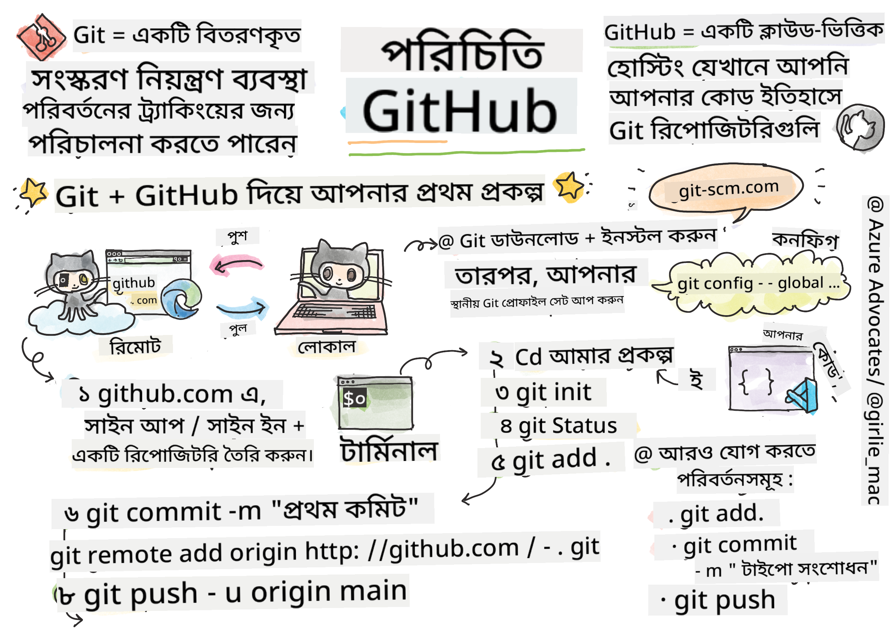
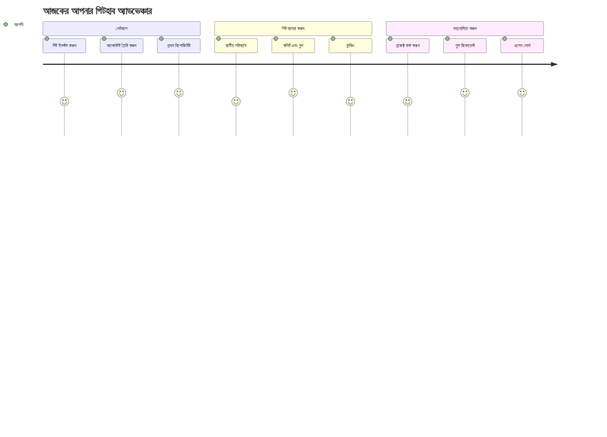
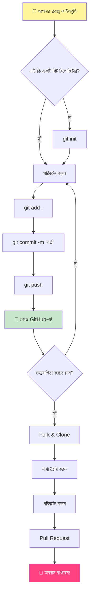
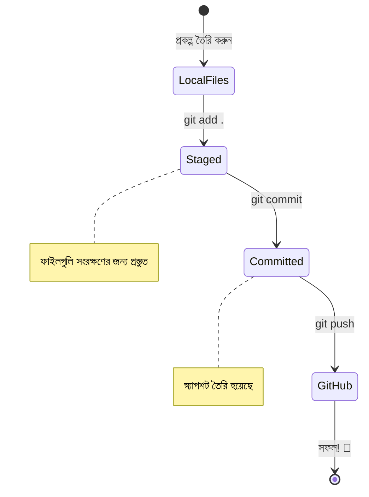
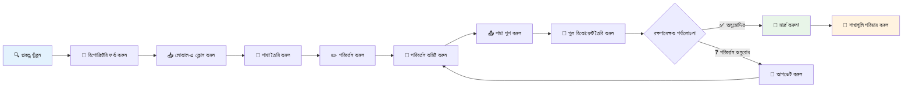
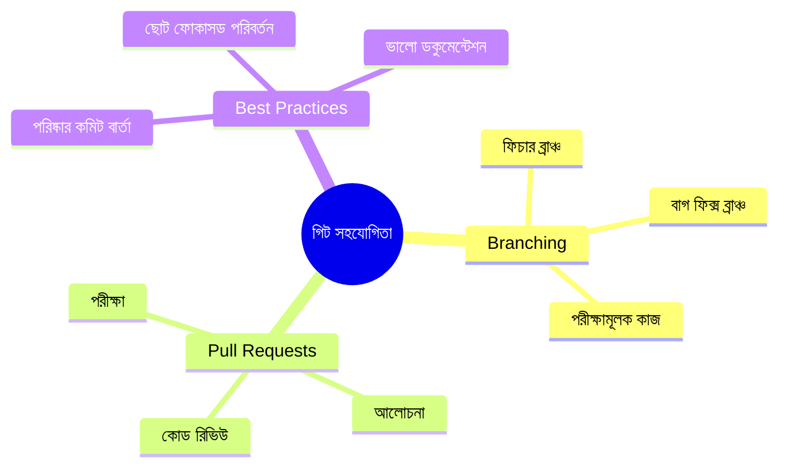
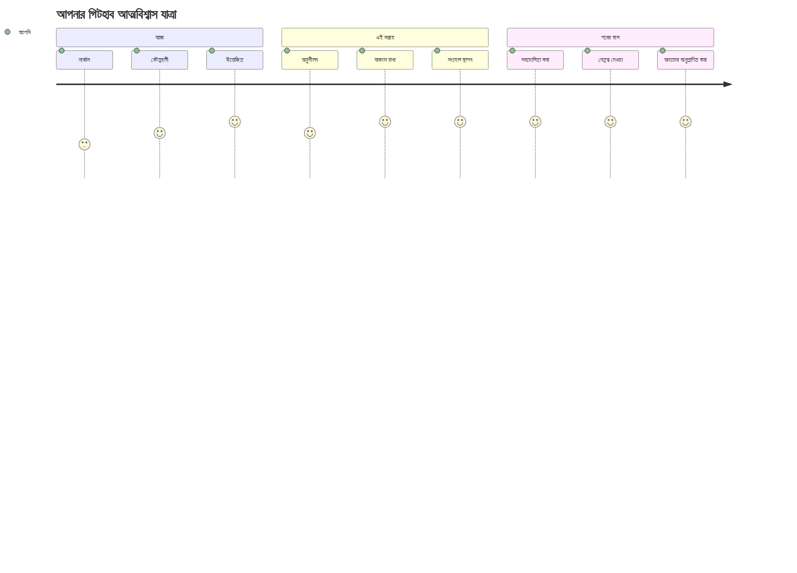

<!--
CO_OP_TRANSLATOR_METADATA:
{
  "original_hash": "5c383cc2cc23bb164b06417d1c107a44",
  "translation_date": "2025-11-25T17:24:41+00:00",
  "source_file": "1-getting-started-lessons/2-github-basics/README.md",
  "language_code": "bn"
}
-->
# গিটহাব পরিচিতি

হ্যালো, ভবিষ্যৎ ডেভেলপার! 👋 সারা বিশ্বের কোটি কোটি কোডারের সাথে যোগ দিতে প্রস্তুত? আমি সত্যিই উত্তেজিত তোমাকে গিটহাবের সাথে পরিচয় করিয়ে দিতে – এটি প্রোগ্রামারদের জন্য সোশ্যাল মিডিয়া প্ল্যাটফর্মের মতো, তবে এখানে লাঞ্চের ছবি শেয়ার করার বদলে আমরা কোড শেয়ার করি এবং একসাথে অসাধারণ কিছু তৈরি করি!

যেটা আমাকে অবাক করে দেয় তা হলো: তোমার ফোনের প্রতিটি অ্যাপ, তুমি যে ওয়েবসাইটগুলো ভিজিট করো, এবং বেশিরভাগ টুল যা তুমি ব্যবহার করতে শিখবে, সেগুলো ডেভেলপারদের দল দ্বারা তৈরি হয়েছে যারা গিটহাবের মতো প্ল্যাটফর্মে একসাথে কাজ করেছে। তোমার প্রিয় মিউজিক অ্যাপ? তোমার মতো কেউ সেটিতে অবদান রেখেছে। যে গেমটি তুমি ছাড়তে পারছ না? হ্যাঁ, সম্ভবত গিটহাব সহযোগিতার মাধ্যমে তৈরি। আর এখন তুমি সেই অসাধারণ কমিউনিটির অংশ হতে শিখতে যাচ্ছ!

আমি জানি প্রথমে এটি একটু বেশি মনে হতে পারে – আমি নিজেও প্রথমবার গিটহাব পেজের দিকে তাকিয়ে ভেবেছিলাম, "এগুলো সব কী মানে?" কিন্তু ব্যাপারটা হলো: প্রতিটি ডেভেলপার ঠিক এখান থেকেই শুরু করেছে যেখানে তুমি এখন আছ। এই পাঠের শেষে, তোমার নিজের একটি গিটহাব রিপোজিটরি থাকবে (এটি মেঘে তোমার ব্যক্তিগত প্রকল্প প্রদর্শনী হিসেবে ভাবো), এবং তুমি শিখবে কীভাবে তোমার কাজ সংরক্ষণ করতে হয়, অন্যদের সাথে শেয়ার করতে হয়, এবং এমনকি এমন প্রকল্পে অবদান রাখতে হয় যা লক্ষ লক্ষ মানুষ ব্যবহার করে।

আমরা একসাথে এই যাত্রা শুরু করব, এক ধাপে এক ধাপে। কোনো তাড়াহুড়ো নেই, কোনো চাপ নেই – শুধু তুমি, আমি, এবং কিছু দারুণ টুল যা তোমার নতুন সেরা বন্ধু হতে চলেছে!


> স্কেচনোট করেছেন [Tomomi Imura](https://twitter.com/girlie_mac)


## প্রাক-লেকচার কুইজ
[প্রাক-লেকচার কুইজ](https://ff-quizzes.netlify.app)

## পরিচিতি

আমরা উত্তেজনাপূর্ণ বিষয়গুলোতে যাওয়ার আগে, আসো তোমার কম্পিউটারকে কিছু গিটহাব ম্যাজিকের জন্য প্রস্তুত করি! এটি ঠিক যেন একটি মাস্টারপিস তৈরি করার আগে তোমার আর্ট সরঞ্জামগুলো সাজানোর মতো – সঠিক টুলগুলো প্রস্তুত থাকলে সবকিছু অনেক মসৃণ এবং আরও মজাদার হয়।

আমি ব্যক্তিগতভাবে প্রতিটি সেটআপ ধাপ তোমাকে দেখাব, এবং আমি প্রতিশ্রুতি দিচ্ছি এটি প্রথমে যতটা ভীতিকর মনে হতে পারে ততটা নয়। যদি কিছু প্রথমে বোঝা না যায়, সেটি একদম স্বাভাবিক! আমি মনে করি আমার প্রথম ডেভেলপমেন্ট এনভায়রনমেন্ট সেটআপ করার সময় নিজেকে প্রাচীন হায়ারোগ্লিফিক্স পড়ার চেষ্টা করার মতো অনুভব করেছিলাম। প্রতিটি ডেভেলপার ঠিক এখানেই ছিল যেখানে তুমি এখন আছ, ভাবছে তারা ঠিক করছে কিনা। স্পয়লার: যদি তুমি এখানে শিখছ, তুমি ইতিমধ্যেই ঠিক করছ! 🌟

এই পাঠে আমরা শিখব:

- তোমার মেশিনে করা কাজ ট্র্যাক করা
- অন্যদের সাথে প্রকল্পে কাজ করা
- ওপেন সোর্স সফটওয়্যারে অবদান রাখা

### প্রয়োজনীয়তা

তোমার কম্পিউটারকে কিছু গিটহাব ম্যাজিকের জন্য প্রস্তুত করি! চিন্তা করো না – এই সেটআপটি কেবল একবার করতে হবে, এবং তারপর পুরো কোডিং যাত্রার জন্য তুমি প্রস্তুত থাকবে।

ঠিক আছে, আসো ভিত্তি দিয়ে শুরু করি! প্রথমে, আমাদের দেখতে হবে গিট ইতিমধ্যেই তোমার কম্পিউটারে আছে কিনা। গিট হলো এমন একটি সুপার-স্মার্ট অ্যাসিস্ট্যান্টের মতো যা তোমার কোডে করা প্রতিটি পরিবর্তন মনে রাখে – প্রতি দুই সেকেন্ডে Ctrl+S চাপার চেয়ে অনেক ভালো (আমরা সবাই সেখানে ছিলাম!)।

এই ম্যাজিক কমান্ডটি তোমার টার্মিনালে টাইপ করে দেখি গিট ইতিমধ্যেই ইনস্টল করা আছে কিনা:
`git --version`

যদি গিট এখনও না থাকে, চিন্তা করো না! শুধু [গিট ডাউনলোড](https://git-scm.com/downloads) পেজে যাও এবং এটি ডাউনলোড করো। একবার এটি ইনস্টল হয়ে গেলে, আমাদের গিটের সাথে তোমার পরিচয় করিয়ে দিতে হবে:

> 💡 **প্রথমবারের সেটআপ**: এই কমান্ডগুলো গিটকে জানায় তুমি কে। এই তথ্য প্রতিটি কমিটের সাথে সংযুক্ত থাকবে, তাই এমন একটি নাম এবং ইমেইল বেছে নাও যা তুমি প্রকাশ্যে শেয়ার করতে স্বাচ্ছন্দ্যবোধ করো।

```bash
git config --global user.name "your-name"
git config --global user.email "your-email"
```

গিট ইতিমধ্যেই কনফিগার করা আছে কিনা তা পরীক্ষা করতে তুমি টাইপ করতে পারো:
```bash
git config --list
```

তোমার একটি গিটহাব অ্যাকাউন্ট, একটি কোড এডিটর (যেমন Visual Studio Code), এবং তোমার টার্মিনাল (অথবা: কমান্ড প্রম্পট) খুলতে হবে।

[github.com](https://github.com/) এ নেভিগেট করো এবং যদি এখনও না থাকে তবে একটি অ্যাকাউন্ট তৈরি করো, অথবা লগ ইন করে তোমার প্রোফাইল পূরণ করো।

💡 **আধুনিক টিপ**: পাসওয়ার্ড ছাড়াই সহজতর অথেনটিকেশনের জন্য [SSH কী](https://docs.github.com/en/authentication/connecting-to-github-with-ssh) সেটআপ করা বা [GitHub CLI](https://cli.github.com/) ব্যবহার করার কথা বিবেচনা করো।

✅ গিটহাব একমাত্র কোড রিপোজিটরি নয়; আরও অনেক আছে, তবে গিটহাব সবচেয়ে পরিচিত।

### প্রস্তুতি

তোমার লোকাল মেশিনে (ল্যাপটপ বা পিসি) একটি কোড প্রকল্পের ফোল্ডার এবং গিটহাবে একটি পাবলিক রিপোজিটরি প্রয়োজন হবে, যা অন্যদের প্রকল্পে অবদান রাখার উদাহরণ হিসেবে কাজ করবে।

### তোমার কোড নিরাপদ রাখা

আসো নিরাপত্তা নিয়ে একটু কথা বলি – তবে চিন্তা করো না, আমরা তোমাকে ভীতিকর কিছু দিয়ে অভিভূত করব না! এই নিরাপত্তা অভ্যাসগুলোকে তোমার গাড়ি বা বাড়ি লক করার মতো ভাবো। এগুলো সহজ অভ্যাস যা স্বাভাবিক হয়ে যায় এবং তোমার কঠোর পরিশ্রমকে সুরক্ষিত রাখে।

আমরা শুরু থেকেই গিটহাবের সাথে কাজ করার আধুনিক, নিরাপদ উপায়গুলো দেখাব। এভাবে, তুমি এমন ভালো অভ্যাস তৈরি করবে যা তোমার কোডিং ক্যারিয়ার জুড়ে তোমাকে সাহায্য করবে।

গিটহাবের সাথে কাজ করার সময়, নিরাপত্তার সেরা অভ্যাসগুলো অনুসরণ করা গুরুত্বপূর্ণ:

| নিরাপত্তার ক্ষেত্র | সেরা অভ্যাস | কেন এটি গুরুত্বপূর্ণ |
|--------------------|-------------|-----------------------|
| **অথেনটিকেশন** | SSH কী বা পার্সোনাল অ্যাক্সেস টোকেন ব্যবহার করো | পাসওয়ার্ড কম নিরাপদ এবং ধীরে ধীরে বাদ দেওয়া হচ্ছে |
| **টু-ফ্যাক্টর অথেনটিকেশন** | তোমার গিটহাব অ্যাকাউন্টে 2FA চালু করো | অ্যাকাউন্ট সুরক্ষার জন্য একটি অতিরিক্ত স্তর যোগ করে |
| **রিপোজিটরি নিরাপত্তা** | সংবেদনশীল তথ্য কখনোই কমিট করো না | API কী এবং পাসওয়ার্ড কখনোই পাবলিক রিপোতে থাকা উচিত নয় |
| **ডিপেনডেন্সি ম্যানেজমেন্ট** | আপডেটের জন্য Dependabot চালু করো | তোমার ডিপেনডেন্সিগুলো সুরক্ষিত এবং আপডেট রাখে |

> ⚠️ **গুরুত্বপূর্ণ নিরাপত্তা স্মরণ**: কখনোই API কী, পাসওয়ার্ড, বা অন্যান্য সংবেদনশীল তথ্য কোনো রিপোজিটরিতে কমিট করো না। সংবেদনশীল ডেটা সুরক্ষিত রাখতে এনভায়রনমেন্ট ভেরিয়েবল এবং `.gitignore` ফাইল ব্যবহার করো।

**আধুনিক অথেনটিকেশন সেটআপ:**

```bash
# SSH কী তৈরি করুন (আধুনিক ed25519 অ্যালগরিদম)
ssh-keygen -t ed25519 -C "your_email@example.com"

# SSH ব্যবহার করার জন্য Git সেট আপ করুন
git remote set-url origin git@github.com:username/repository.git
```

> 💡 **প্রো টিপ**: SSH কী বারবার পাসওয়ার্ড প্রবেশ করার প্রয়োজনীয়তা দূর করে এবং ঐতিহ্যবাহী অথেনটিকেশন পদ্ধতির চেয়ে বেশি সুরক্ষিত।

---

## তোমার কোড প্রফেশনালের মতো ম্যানেজ করা

ঠিক আছে, এখনই জিনিসগুলো সত্যিই উত্তেজনাপূর্ণ হতে চলেছে! 🎉 আমরা শিখতে যাচ্ছি কীভাবে প্রফেশনালদের মতো তোমার কোড ট্র্যাক এবং ম্যানেজ করতে হয়, এবং সত্যি বলতে, এটি শেখানো আমার প্রিয় বিষয়গুলোর একটি কারণ এটি সত্যিই একটি গেম-চেঞ্জার।

ভাবো: তুমি একটি অসাধারণ গল্প লিখছ, এবং তুমি প্রতিটি খসড়া, প্রতিটি উজ্জ্বল সম্পাদনা, এবং প্রতিটি "ওয়াও, এটি অসাধারণ!" মুহূর্ত ট্র্যাক করতে চাও। গিট ঠিক সেটাই করে তোমার কোডের জন্য! এটি এমন একটি টাইম-ট্রাভেলিং নোটবুকের মতো যা সবকিছু মনে রাখে – প্রতিটি কীস্ট্রোক, প্রতিটি পরিবর্তন, প্রতিটি "ওহ, এটি সবকিছু ভেঙে দিয়েছে" মুহূর্ত যা তুমি সঙ্গে সঙ্গে পূর্বাবস্থায় ফিরিয়ে আনতে পারো।

আমি স্বীকার করছি – এটি প্রথমে অপ্রতিরোধ্য মনে হতে পারে। যখন আমি শুরু করেছিলাম, আমি ভেবেছিলাম "আমি কেন আমার ফাইলগুলো সাধারণভাবে সংরক্ষণ করতে পারি না?" কিন্তু আমাকে বিশ্বাস করো: একবার গিট তোমার জন্য ক্লিক করলে (এবং এটি করবে!), তোমার একটি লাইটবাল্ব মুহূর্ত হবে যেখানে তুমি ভাববে "আমি কীভাবে আগে এটি ছাড়া কোড করতাম?" এটি ঠিক যেন তুমি উড়তে পারো তা আবিষ্কার করছ, যখন তুমি সারা জীবন হেঁটে বেড়াচ্ছিলে!

ধরা যাক তোমার লোকাল ফোল্ডারে কিছু কোড প্রকল্প আছে এবং তুমি গিট ব্যবহার করে তোমার অগ্রগতি ট্র্যাক করতে চাও - এটি একটি ভার্সন কন্ট্রোল সিস্টেম। কিছু লোক গিট ব্যবহার করাকে ভবিষ্যতের নিজের জন্য একটি প্রেমপত্র লেখার সাথে তুলনা করে। কয়েক দিন, সপ্তাহ বা মাস পরে তোমার কমিট মেসেজগুলো পড়ে তুমি মনে করতে পারবে কেন তুমি একটি সিদ্ধান্ত নিয়েছিলে, বা একটি পরিবর্তন "রোলব্যাক" করতে পারবে – অর্থাৎ, যখন তুমি ভালো "কমিট মেসেজ" লিখবে।


### কাজ: তোমার প্রথম রিপোজিটরি তৈরি করো!

> 🎯 **তোমার মিশন (এবং আমি তোমার জন্য খুবই উত্তেজিত!)**: আমরা একসাথে তোমার প্রথম গিটহাব রিপোজিটরি তৈরি করতে যাচ্ছি! এখানে কাজ শেষ হওয়ার পরে, তোমার কোড যেখানে থাকবে ইন্টারনেটে তোমার নিজস্ব একটি ছোট কোণা থাকবে, এবং তুমি তোমার প্রথম "কমিট" করবে (এটি ডেভেলপারদের ভাষায় খুব স্মার্ট উপায়ে তোমার কাজ সংরক্ষণ করার অর্থ)। 
>
> এটি সত্যিই একটি বিশেষ মুহূর্ত – তুমি আনুষ্ঠানিকভাবে ডেভেলপারদের বৈশ্বিক কমিউনিটিতে যোগ দিতে যাচ্ছ! আমি এখনও আমার প্রথম রিপো তৈরি করার উত্তেজনা মনে করি এবং ভেবেছিলাম "ওয়াও, আমি সত্যিই এটি করছি!"

আসো এই অ্যাডভেঞ্চার একসাথে করি, ধাপে ধাপে। প্রতিটি অংশে সময় নাও – তাড়াহুড়োর জন্য কোনো পুরস্কার নেই, এবং আমি প্রতিশ্রুতি দিচ্ছি প্রতিটি ধাপ অর্থবহ হবে। মনে রেখো, প্রতিটি কোডিং সুপারস্টার যাকে তুমি প্রশংসা করো, একসময় ঠিক এখানেই বসে ছিল, তাদের প্রথম রিপোজিটরি তৈরি করতে যাচ্ছিল। কতটা দারুণ, তাই না?

> ভিডিও দেখো
> 
> [](https://www.youtube.com/watch?v=9R31OUPpxU4)

**চলো একসাথে করি:**

1. **গিটহাবে তোমার রিপোজিটরি তৈরি করো**। GitHub.com এ যাও এবং সেই উজ্জ্বল সবুজ **New** বোতামটি (অথবা উপরের ডান কোণে **+** চিহ্ন) খুঁজে বের করো। এটি ক্লিক করো এবং **New repository** নির্বাচন করো।

   এখানে কী করতে হবে:
   1. তোমার রিপোজিটরিকে একটি নাম দাও – এটি তোমার জন্য অর্থবহ কিছু হওয়া উচিত!
   1. চাইলে একটি বিবরণ যোগ করো (এটি অন্যদের বুঝতে সাহায্য করে তোমার প্রকল্পটি কী সম্পর্কে)
   1. এটি পাবলিক (সবাই দেখতে পারবে) বা প্রাইভেট (শুধু তোমার জন্য) করতে চাও কিনা তা নির্ধারণ করো
   1. আমি একটি README ফাইল যোগ করার বাক্সটি চেক করার পরামর্শ দিচ্ছি – এটি তোমার প্রকল্পের সামনের পৃষ্ঠা হিসেবে কাজ করে
   1. **Create repository** ক্লিক করো এবং উদযাপন করো – তুমি তোমার প্রথম রিপো তৈরি করেছ! 🎉

2. **তোমার প্রকল্প ফোল্ডারে নেভিগেট করো**। এখন আসো তোমার টার্মিনাল খুলে ফেলি (চিন্তা করো না, এটি দেখতে যতটা ভীতিকর মনে হয় ততটা নয়!)। আমাদের তোমার কম্পিউটারকে বলতে হবে তোমার প্রকল্প ফাইলগুলো কোথায়। এই কমান্ডটি টাইপ করো:

   ```bash
   cd [name of your folder]
   ```

   **আমরা এখানে কী করছি:**
   - আমরা মূলত বলছি "হে কম্পিউটার, আমাকে আমার প্রকল্প ফোল্ডারে নিয়ে চলো"
   - এটি তোমার ডেস্কটপে একটি নির্দিষ্ট ফোল্ডার খোলার মতো, তবে আমরা এটি টেক্সট কমান্ড দিয়ে করছি
   - `[name of your folder]` এর জায়গায় তোমার প্রকল্প ফোল্ডারের প্রকৃত নাম বসাও

3. **তোমার ফোল্ডারকে একটি গিট রিপোজিটরিতে রূপান্তর করো**। এখানেই ম্যাজিক ঘটে! টাইপ করো:

   ```bash
   git init
   ```

   **এখানে কী হলো (দারুণ ব্যাপার!):**
   - গিট তোমার প্রকল্পে একটি লুকানো `.git` ফোল্ডার তৈরি করেছে – তুমি এটি দেখতে পাবে না, তবে এটি সেখানে আছে!
   - তোমার সাধারণ ফোল্ডার এখন একটি "রিপোজিটরি" যা তোমার করা প্রতিটি পরিবর্তন ট্র্যাক করতে পারে
   - এটি ঠিক যেন তোমার ফোল্ডারকে সুপারপাওয়ার দেওয়া হয়েছে যা সবকিছু মনে রাখে

4. **কী ঘটছে তা পরীক্ষা করো**। আসো দেখি গিট তোমার প্রকল্প সম্পর্কে এখন কী ভাবছে:

   ```bash
   git status
   ```

   **গিট তোমাকে যা বলছে তা বোঝা:**
   
   তুমি এমন কিছু দেখতে পারো যা এরকম দেখায়:

   ```output
   Changes not staged for commit:
   (use "git add <file>..." to update what will be committed)
   (use "git restore <file>..." to discard changes in working directory)

        modified:   file.txt
        modified:   file2.txt
   ```

   **ভয় পেও না! এর মানে হলো:**
   - **লাল** রঙের ফাইলগুলো হলো এমন ফাইল যেগুলোতে পরিবর্তন হয়েছে কিন্তু এখনও সংরক্ষণের জন্য প্রস্তুত নয়
   - **সবুজ** রঙের ফাইলগুলো (যখন তুমি দেখবে) সংরক্ষণের জন্য প্রস্তুত
   - গিট সহায়ক হয়ে তোমাকে ঠিক কী করতে হবে তা বলছে

   > 💡 **প্রো টিপ**: `git status` কমান্ড তোমার সেরা বন্ধু! যখনই তুমি বিভ্রান্ত হবে, এটি ব্যবহার করো। এটি ঠিক যেন গিটকে জিজ্ঞাসা করা "হে, এখন কী অবস্থা?"

5. **তোমার ফাইলগুলো সংরক্ষণের জন্য প্রস্তুত করো** (এটি "স্টেজিং" নামে পরিচিত):

   ```bash
   git add .
   ```

   **আমরা যা করলাম:**
   - আমরা গিটকে বললাম "হে, আমি আমার পরবর্তী সংরক্ষণে আমার সব ফাইল অন্তর্ভুক্ত করতে চাই"
   - `.` হলো "এই ফোল্ডারের সবকিছু" বলার মতো
   - এখন তোমার ফাইলগুলো "স্টেজড" এবং পরবর্তী ধাপের জন্য প্রস্তুত

   **আরও বেছে নিতে চাও?** তুমি নির্দিষ্ট ফাইলগুলো যোগ করতে পারো:

   ```bash
   git add [file or folder name]
   ```

   **তুমি কেন এটি করতে চাও?**
   - কখনো কখনো তুমি সম্পর্কিত পরিবর্তনগুলো একসাথে সংরক্ষণ করতে চাও
   - এটি তোমার কাজকে যৌক্তিক অংশে সংগঠিত করতে সাহায্য করে
   - এটি বোঝা সহজ করে তোলে কী পরিবর্তন হয়েছে এবং কখন

   **মত পরিবর্তন করেছ?** চিন্তা করো না! তুমি ফাইলগুলোকে এইভাবে আনস্টেজ করতে পারো:

   ```bash
   # সবকিছু আনস্টেজ করুন
   git reset
   
   # শুধুমাত্র একটি ফাইল আনস্টেজ করুন
   git reset [file name]
   ```

   চিন্তা করো না – এটি তোমার কাজ মুছে দেয় না, এটি কেবল ফাইলগুলোকে "সংরক্ষণের জন্য প্রস্তুত" তালিকা থেকে সরিয়ে দেয়।

6. **তোমার কাজ স্থায়ীভাবে সংরক্ষণ করো** (তোমার প্রথম কমিট তৈরি করো!):

   ```bash
   git commit -m "first commit"
   ```

   **🎉 অভিনন্দন! তুমি তোমার প্রথম কমিট করেছ!**
   
   **এখানে কী হলো:**
   - গিট এই মুহূর্তে তোমার স্টেজড ফাইলগুলোর একটি "স্ন্যাপশট" নিয়েছে
   - তোমার কমিট মেস
   - আমরা আপনার স্থানীয় প্রকল্প এবং আপনার GitHub রিপোজিটরির মধ্যে একটি সংযোগ তৈরি করেছি
   - "Origin" হল আপনার GitHub রিপোজিটরির একটি ডাকনাম – এটি ঠিক আপনার ফোনে একটি কন্টাক্ট যোগ করার মতো
   - এখন আপনার স্থানীয় Git জানে কখন এবং কোথায় আপনার কোড পাঠাতে হবে যখন আপনি এটি শেয়ার করতে প্রস্তুত

   💡 **সহজ উপায়**: যদি আপনার কাছে GitHub CLI ইনস্টল করা থাকে, তাহলে এটি একটি কমান্ডেই করা সম্ভব:
   ```bash
   gh repo create my-repo --public --push --source=.
   ```

8. **আপনার কোড GitHub-এ পাঠান** (বড় মুহূর্ত!):

   ```bash
   git push -u origin main
   ```

   **🚀 এটাই! আপনি আপনার কোড GitHub-এ আপলোড করছেন!**
   
   **কি ঘটছে:**
   - আপনার কমিটগুলো আপনার কম্পিউটার থেকে GitHub-এ যাচ্ছে
   - `-u` ফ্ল্যাগ একটি স্থায়ী সংযোগ সেট আপ করে যাতে ভবিষ্যতে পুশ করা সহজ হয়
   - "main" হল আপনার প্রধান ব্রাঞ্চের নাম (যেমন প্রধান ফোল্ডার)
   - এর পরে, ভবিষ্যতে আপলোডের জন্য আপনি শুধু `git push` টাইপ করতে পারেন!

   💡 **দ্রুত নোট**: যদি আপনার ব্রাঞ্চের নাম অন্য কিছু হয় (যেমন "master"), তাহলে সেই নাম ব্যবহার করুন। আপনি `git branch --show-current` দিয়ে চেক করতে পারেন।

9. **আপনার নতুন দৈনিক কোডিং রুটিন** (এটাই আসক্তিকর হয়ে উঠবে!):

   এখন থেকে, যখনই আপনি আপনার প্রকল্পে পরিবর্তন করবেন, আপনার জন্য এই সহজ তিন ধাপের নাচ:

   ```bash
   git add .
   git commit -m "describe what you changed"
   git push
   ```

   **এটাই আপনার কোডিং হৃদস্পন্দন হয়ে উঠবে:**
   - আপনার কোডে কিছু অসাধারণ পরিবর্তন করুন ✨
   - `git add` দিয়ে সেগুলো স্টেজ করুন ("Git, এই পরিবর্তনগুলো খেয়াল করো!")
   - `git commit` এবং একটি বর্ণনামূলক বার্তা দিয়ে সেগুলো সংরক্ষণ করুন (ভবিষ্যতের আপনি আপনাকে ধন্যবাদ জানাবে!)
   - `git push` দিয়ে সেগুলো বিশ্বব্যাপী শেয়ার করুন 🚀
   - বারবার করুন – সত্যি, এটি শ্বাস নেওয়ার মতো স্বাভাবিক হয়ে যাবে!

   আমি এই ওয়ার্কফ্লো ভালোবাসি কারণ এটি ভিডিও গেমে একাধিক সেভ পয়েন্ট থাকার মতো। এমন একটি পরিবর্তন করেছেন যা আপনি পছন্দ করেন? কমিট করুন! কিছু ঝুঁকিপূর্ণ চেষ্টা করতে চান? সমস্যা নেই – যদি কিছু ভুল হয়, আপনি সর্বদা আপনার শেষ কমিটে ফিরে যেতে পারেন!

   > 💡 **টিপ**: আপনি একটি `.gitignore` ফাইল গ্রহণ করতে চাইতে পারেন যাতে এমন ফাইলগুলো GitHub-এ না আসে যা আপনি ট্র্যাক করতে চান না - যেমন সেই নোট ফাইল যা আপনি একই ফোল্ডারে সংরক্ষণ করেন কিন্তু একটি পাবলিক রিপোজিটরিতে থাকার কোনো জায়গা নেই। `.gitignore` ফাইলের টেমপ্লেট আপনি [.gitignore templates](https://github.com/github/gitignore) এ খুঁজে পেতে পারেন বা [gitignore.io](https://www.toptal.com/developers/gitignore) ব্যবহার করে একটি তৈরি করতে পারেন।

### 🧠 **প্রথম রিপোজিটরি চেক-ইন: কেমন লাগল?**

**একটু সময় নিয়ে উদযাপন করুন এবং ভাবুন:**
- আপনার কোড প্রথমবার GitHub-এ দেখতে কেমন লাগল?
- কোন ধাপটি সবচেয়ে বিভ্রান্তিকর লাগল, এবং কোনটি আশ্চর্যজনকভাবে সহজ লাগল?
- আপনি কি নিজের ভাষায় `git add`, `git commit`, এবং `git push` এর পার্থক্য ব্যাখ্যা করতে পারবেন?


> **মনে রাখবেন**: এমনকি অভিজ্ঞ ডেভেলপাররাও কখনো কখনো সঠিক কমান্ড ভুলে যান। এই ওয়ার্কফ্লোটি মাংসপেশির স্মৃতিতে পরিণত হতে সময় লাগে - আপনি দারুণ করছেন!

#### আধুনিক Git ওয়ার্কফ্লো

এই আধুনিক পদ্ধতিগুলো গ্রহণ করার কথা বিবেচনা করুন:

- **Conventional Commits**: `feat:`, `fix:`, `docs:` ইত্যাদির মতো একটি মানক কমিট বার্তা ফরম্যাট ব্যবহার করুন। আরও জানুন [conventionalcommits.org](https://www.conventionalcommits.org/) এ।
- **Atomic commits**: প্রতিটি কমিট একটি একক যৌক্তিক পরিবর্তন উপস্থাপন করে।
- **Frequent commits**: বড়, অনিয়মিত কমিটের পরিবর্তে বর্ণনামূলক বার্তাসহ ঘন ঘন কমিট করুন।

#### কমিট বার্তা

একটি দুর্দান্ত Git কমিটের বিষয়বস্তু এই বাক্যটি সম্পূর্ণ করে:
যদি প্রয়োগ করা হয়, এই কমিটটি <আপনার বিষয়বস্তু এখানে> করবে।

বিষয়ের জন্য আদেশমূলক, বর্তমান কাল ব্যবহার করুন: "change" নয় "changed" বা "changes"। 
বিষয়ের মতো, শরীরেও (ঐচ্ছিক) আদেশমূলক, বর্তমান কাল ব্যবহার করুন। শরীরটি পরিবর্তনের প্রেরণা অন্তর্ভুক্ত করবে এবং এটি পূর্ববর্তী আচরণের সাথে তুলনা করবে। আপনি `কেন` ব্যাখ্যা করছেন, `কিভাবে` নয়।

✅ কয়েক মিনিট সময় নিয়ে GitHub-এ ঘুরে দেখুন। আপনি কি একটি সত্যিই দুর্দান্ত কমিট বার্তা খুঁজে পেতে পারেন? আপনি কি একটি খুব সংক্ষিপ্ত বার্তা খুঁজে পেতে পারেন? কমিট বার্তায় কোন তথ্য সবচেয়ে গুরুত্বপূর্ণ এবং উপকারী বলে মনে হয়?

## অন্যদের সাথে কাজ করা (মজার অংশ!)

আপনার টুপি ধরে রাখুন কারণ এখানেই GitHub একেবারে জাদুকরী হয়ে ওঠে! 🪄 আপনি আপনার নিজের কোড পরিচালনা করা শিখেছেন, কিন্তু এখন আমরা আমার একেবারে প্রিয় অংশে ডুব দিচ্ছি – সারা বিশ্বের অসাধারণ মানুষের সাথে সহযোগিতা করা।

এটি কল্পনা করুন: আপনি আগামীকাল ঘুম থেকে উঠে দেখলেন টোকিওর কেউ আপনার কোড উন্নত করেছে। তারপর বার্লিনের কেউ একটি বাগ ঠিক করেছে যা আপনি আটকে ছিলেন। দুপুরের মধ্যে, সাও পাওলোর একজন ডেভেলপার একটি ফিচার যোগ করেছেন যা আপনি কখনো ভাবেননি। এটি বিজ্ঞান কল্পকাহিনী নয় – এটি GitHub মহাবিশ্বে একটি সাধারণ মঙ্গলবার!

আমাকে সত্যিই উত্তেজিত করে যে আপনি যে সহযোগিতার দক্ষতাগুলো শিখতে যাচ্ছেন? এগুলোই সেই সঠিক ওয়ার্কফ্লোগুলো যা Google, Microsoft এবং আপনার প্রিয় স্টার্টআপগুলো প্রতিদিন ব্যবহার করে। আপনি শুধু একটি দুর্দান্ত টুল শিখছেন না – আপনি সেই গোপন ভাষা শিখছেন যা পুরো সফটওয়্যার বিশ্বকে একসাথে কাজ করতে সাহায্য করে।

সত্যি বলতে, যখন কেউ আপনার প্রথম পুল রিকোয়েস্ট মার্জ করে তখন যে রোমাঞ্চ অনুভব করবেন, তখন বুঝতে পারবেন কেন ডেভেলপাররা ওপেন সোর্স নিয়ে এত আবেগপ্রবণ। এটি বিশ্বের সবচেয়ে বড়, সবচেয়ে সৃজনশীল দলীয় প্রকল্পের অংশ হওয়ার মতো!

> ভিডিও দেখুন
>
> [](https://www.youtube.com/watch?v=bFCM-PC3cu8)

GitHub-এ জিনিসগুলো রাখার প্রধান কারণ ছিল অন্য ডেভেলপারদের সাথে সহযোগিতা করা সম্ভব করা।


আপনার রিপোজিটরিতে, `Insights > Community`-এ যান এবং দেখুন আপনার প্রকল্পটি প্রস্তাবিত কমিউনিটি স্ট্যান্ডার্ডগুলোর সাথে কেমন তুলনা করে।

আপনার রিপোজিটরিকে পেশাদার এবং স্বাগতপূর্ণ দেখাতে চান? আপনার রিপোজিটরিতে যান এবং `Insights > Community`-এ ক্লিক করুন। এই চমৎকার ফিচারটি দেখায় আপনার প্রকল্পটি GitHub কমিউনিটির "ভালো রিপোজিটরি প্র্যাকটিস" হিসেবে বিবেচিত মানগুলোর সাথে কেমন তুলনা করে।

> 🎯 **আপনার প্রকল্পকে উজ্জ্বল করুন**: একটি ভালোভাবে সংগঠিত রিপোজিটরি এবং ভালো ডকুমেন্টেশন একটি পরিষ্কার, স্বাগতপূর্ণ দোকানের মতো। এটি মানুষকে বলে যে আপনি আপনার কাজের যত্ন নেন এবং অন্যদের এতে অবদান রাখতে উৎসাহিত করে!

**একটি রিপোজিটরিকে অসাধারণ করে তোলে:**

| কি যোগ করবেন | কেন এটি গুরুত্বপূর্ণ | এটি আপনার জন্য কি করে |
|-------------|-------------------|---------------------|
| **বর্ণনা** | প্রথম ইমপ্রেশন গুরুত্বপূর্ণ! | মানুষ সঙ্গে সঙ্গে জানে আপনার প্রকল্পটি কি করে |
| **README** | আপনার প্রকল্পের সামনের পৃষ্ঠা | নতুন দর্শকদের জন্য একটি বন্ধুত্বপূর্ণ গাইড |
| **অবদান নির্দেশিকা** | দেখায় আপনি সাহায্য স্বাগত জানাচ্ছেন | মানুষ জানে কিভাবে তারা আপনাকে সাহায্য করতে পারে |
| **আচরণবিধি** | একটি বন্ধুত্বপূর্ণ স্থান তৈরি করে | সবাই অংশগ্রহণ করতে স্বাগত বোধ করে |
| **লাইসেন্স** | আইনি স্পষ্টতা | অন্যরা জানে কিভাবে তারা আপনার কোড ব্যবহার করতে পারে |
| **নিরাপত্তা নীতি** | দেখায় আপনি দায়িত্বশীল | পেশাদার অনুশীলন প্রদর্শন করে |

> 💡 **প্রো টিপ**: GitHub এই ফাইলগুলোর জন্য টেমপ্লেট প্রদান করে। একটি নতুন রিপোজিটরি তৈরি করার সময়, এই ফাইলগুলো স্বয়ংক্রিয়ভাবে তৈরি করতে বক্সগুলো চেক করুন।

**আধুনিক GitHub ফিচারগুলো অন্বেষণ করুন:**

🤖 **স্বয়ংক্রিয়তা & CI/CD:**
- **GitHub Actions** স্বয়ংক্রিয় টেস্টিং এবং ডিপ্লয়মেন্টের জন্য
- **Dependabot** স্বয়ংক্রিয় ডিপেনডেন্সি আপডেটের জন্য

💬 **কমিউনিটি & প্রকল্প ব্যবস্থাপনা:**
- **GitHub Discussions** সমস্যা ছাড়াও কমিউনিটি কথোপকথনের জন্য
- **GitHub Projects** কানবান-স্টাইল প্রকল্প ব্যবস্থাপনার জন্য
- **Branch protection rules** কোডের মান বজায় রাখতে

এই সমস্ত রিসোর্স নতুন টিম সদস্যদের অনবোর্ডিংয়ে উপকার করবে। এবং এগুলোই সাধারণত নতুন অবদানকারীরা আপনার কোড দেখার আগে দেখে, যাতে তারা বুঝতে পারে আপনার প্রকল্প তাদের সময় ব্যয় করার জন্য সঠিক জায়গা কিনা।

✅ README ফাইলগুলো, যদিও প্রস্তুত করতে সময় লাগে, ব্যস্ত মেইনটেইনারদের দ্বারা প্রায়ই অবহেলিত হয়। আপনি কি একটি বিশেষভাবে বর্ণনামূলক উদাহরণ খুঁজে পেতে পারেন? নোট: কিছু [ভালো README তৈরি করার টুল](https://www.makeareadme.com/) আছে যা আপনি চেষ্টা করতে পারেন।

### কাজ: কিছু কোড মার্জ করুন

অবদান নির্দেশিকা মানুষকে প্রকল্পে অবদান রাখতে সাহায্য করে। এটি ব্যাখ্যা করে আপনি কোন ধরনের অবদান খুঁজছেন এবং প্রক্রিয়াটি কিভাবে কাজ করে। অবদানকারীদের আপনার GitHub রিপোজিটরিতে অবদান রাখতে একটি ধাপের সিরিজের মধ্য দিয়ে যেতে হবে:

1. **আপনার রিপোজিটরি ফর্ক করা**। আপনি সম্ভবত মানুষকে আপনার প্রকল্প _ফর্ক_ করতে চাইবেন। ফর্ক করা মানে তাদের GitHub প্রোফাইলে আপনার রিপোজিটরির একটি প্রতিলিপি তৈরি করা।
1. **ক্লোন**। সেখান থেকে তারা প্রকল্পটি তাদের স্থানীয় মেশিনে ক্লোন করবে।
1. **একটি ব্রাঞ্চ তৈরি করুন**। আপনি তাদের তাদের কাজের জন্য একটি _ব্রাঞ্চ_ তৈরি করতে বলতে চাইবেন।
1. **তাদের পরিবর্তন একটি নির্দিষ্ট এলাকায় ফোকাস করুন**। অবদানকারীদের একবারে একটি জিনিসে তাদের অবদান কেন্দ্রীভূত করতে বলুন - এভাবে তাদের কাজ _মার্জ_ করার সম্ভাবনা বেশি। কল্পনা করুন তারা একটি বাগ ঠিক করে, একটি নতুন ফিচার যোগ করে, এবং কয়েকটি টেস্ট আপডেট করে - যদি আপনি ৩টির মধ্যে ২টি বা ১টি পরিবর্তন বাস্তবায়ন করতে চান বা পারেন?

✅ এমন একটি পরিস্থিতি কল্পনা করুন যেখানে ব্রাঞ্চগুলো ভালো কোড লেখার এবং শিপ করার জন্য বিশেষভাবে গুরুত্বপূর্ণ। আপনি কি ব্যবহার কেস কল্পনা করতে পারেন?

> নোট, আপনি যে পরিবর্তন দেখতে চান তা নিজেই হোন, এবং আপনার নিজের কাজের জন্য ব্রাঞ্চ তৈরি করুন। আপনি যে কোনো কমিট করবেন তা সেই ব্রাঞ্চে করা হবে যেখানে আপনি বর্তমানে "চেক আউট" করেছেন। `git status` ব্যবহার করে দেখুন কোন ব্রাঞ্চে আছেন।

চলুন একটি অবদানকারীর ওয়ার্কফ্লো দেখে নিই। ধরে নিন অবদানকারী ইতিমধ্যে রিপোজিটরি _ফর্ক_ এবং _ক্লোন_ করেছেন যাতে তাদের স্থানীয় মেশিনে একটি Git রিপো কাজ করার জন্য প্রস্তুত থাকে:

1. **একটি ব্রাঞ্চ তৈরি করুন**। `git branch` কমান্ড ব্যবহার করে একটি ব্রাঞ্চ তৈরি করুন যা তারা অবদান রাখতে চায় এমন পরিবর্তনগুলো ধারণ করবে:

   ```bash
   git branch [branch-name]
   ```

   > 💡 **আধুনিক পদ্ধতি**: আপনি এক কমান্ডে নতুন ব্রাঞ্চ তৈরি এবং স্যুইচ করতে পারেন:
   ```bash
   git switch -c [branch-name]
   ```

1. **কাজের ব্রাঞ্চে স্যুইচ করুন**। নির্দিষ্ট ব্রাঞ্চে স্যুইচ করুন এবং `git switch` দিয়ে ওয়ার্কিং ডিরেক্টরি আপডেট করুন:

   ```bash
   git switch [branch-name]
   ```

   > 💡 **আধুনিক নোট**: ব্রাঞ্চ পরিবর্তনের সময় `git switch` হল `git checkout` এর আধুনিক বিকল্প। এটি স্পষ্ট এবং শিক্ষানবিসদের জন্য নিরাপদ।

1. **কাজ করুন**। এই পর্যায়ে আপনি আপনার পরিবর্তন যোগ করতে চান। Git-কে এটি সম্পর্কে জানাতে ভুলবেন না নিম্নলিখিত কমান্ডগুলো দিয়ে:

   ```bash
   git add .
   git commit -m "my changes"
   ```

   > ⚠️ **কমিট বার্তার গুণমান**: নিশ্চিত করুন যে আপনি আপনার কমিটকে একটি ভালো নাম দিয়েছেন, আপনার এবং যেই রিপোতে আপনি সাহায্য করছেন তার মেইনটেইনারের জন্য। আপনি কি পরিবর্তন করেছেন তা নির্দিষ্ট করুন!

1. **আপনার কাজ `main` ব্রাঞ্চের সাথে একত্রিত করুন**। কোনো এক পর্যায়ে আপনি কাজ শেষ করেছেন এবং আপনি আপনার কাজ `main` ব্রাঞ্চের সাথে একত্রিত করতে চান। এদিকে `main` ব্রাঞ্চ পরিবর্তিত হতে পারে, তাই নিশ্চিত করুন যে আপনি প্রথমে এটি সর্বশেষে আপডেট করেছেন নিম্নলিখিত কমান্ডগুলো দিয়ে:

   ```bash
   git switch main
   git pull
   ```

   এই পর্যায়ে আপনি নিশ্চিত করতে চান যে কোনো _কনফ্লিক্ট_, যেখানে Git সহজে পরিবর্তনগুলো _একত্রিত_ করতে পারে না, আপনার কাজের ব্রাঞ্চে ঘটে। তাই নিম্নলিখিত কমান্ডগুলো চালান:

   ```bash
   git switch [branch_name]
   git merge main
   ```

   `git merge main` কমান্ডটি `main` থেকে সমস্ত পরিবর্তন আপনার ব্রাঞ্চে নিয়ে আসবে। আশা করি আপনি সহজেই চালিয়ে যেতে পারবেন। যদি না পারেন, VS Code আপনাকে দেখাবে যেখানে Git _বিভ্রান্ত_ এবং আপনি সংশ্লিষ্ট ফাইলগুলো পরিবর্তন করে সঠিক কন্টেন্টটি উল্লেখ করবেন।

   💡 **আধুনিক বিকল্প**: একটি পরিষ্কার ইতিহাসের জন্য `git rebase` ব্যবহার করার কথা বিবেচনা করুন:
   ```bash
   git rebase main
   ```
   এটি আপনার কমিটগুলোকে সর্বশেষ main ব্রাঞ্চের উপরে পুনরায় চালায়, একটি লিনিয়ার ইতিহাস তৈরি করে।

1. **আপনার কাজ GitHub-এ পাঠান**। আপনার কাজ GitHub-এ পাঠানো মানে দুটি জিনিস। আপনার ব্রাঞ্চটি আপনার রিপোতে পুশ করা এবং তারপর একটি PR, Pull Request খোলা।

   ```bash
   git push --set-upstream origin [branch-name]
   ```

   উপরের কমান্ডটি আপনার ফর্ক করা রিপোতে ব্রাঞ্চ তৈরি করে।

### 🤝 **সহযোগিতা দক্ষতা পরীক্ষা: অন্যদের সাথে কাজ করতে প্রস্তুত?**

**দেখি আপনি সহযোগিতা সম্পর্কে কেমন অনুভব করছেন:**
- ফর্কিং এবং পুল রিকোয়েস্টের ধারণা কি এখন আপনার কাছে পরিষ্কার?
- ব্রাঞ্চ নিয়ে কাজ করার কোন একটি বিষয় আপনি আরও অনুশীলন করতে চান?
- অন্য কারো প্রকল্পে অবদান রাখতে আপনি কতটা স্বাচ্ছন্দ্য বোধ করছেন?


> **আত্মবিশ্বাস বৃদ্ধিকারক**: আপনি যেই ডেভেলপারকে প্রশংসা করেন, তিনিও একসময় তার প্রথম পুল রিকোয়েস্ট নিয়ে নার্ভাস ছিলেন। GitHub কমিউনিটি নতুনদের জন্য অত্যন্ত স্বাগতপূর্ণ!

1. **একটি PR খুলুন**। পরবর্তীতে, আপনি একটি PR খুলতে চান। আপনি এটি GitHub-এ ফর্ক করা রিপোতে নেভিগেট করে করবেন। GitHub-এ আপনি একটি ইঙ্গিত দেখতে পাবেন যেখানে এটি জিজ্ঞাসা করে আপনি একটি নতুন PR তৈরি করতে চান কিনা, আপনি এটি ক্লিক করবেন এবং একটি ইন্টারফেসে নিয়ে যাওয়া হবে যেখানে আপনি কমিট বার্তার শিরোনাম পরিবর্তন করতে পারবেন, একটি আরও উপযুক্ত বিবরণ দিতে পারবেন। এখন আপনি যে রিপোটি ফর্ক করেছেন তার মেইনটেইনার এটি দেখবেন এবং _আঙ্গুল ক্রস_ তারা আপনার PR প্রশংসা করবেন এবং _মার্জ_ করবেন। আপনি এখন একজন অবদানকারী, ইয়াহ :)

   💡 **আধুনিক টিপ**: আপনি GitHub CLI ব্যবহার করেও PR তৈরি করতে পারেন:
   ```bash
   gh pr create --title "Your PR title" --body "Description of changes"
   ```

   🔧 **PR-এর জন্য সেরা অনুশীলন**:
   - "Fixes #123" এর মতো কীওয়ার্ড ব্যবহার করে সংশ্লিষ্ট সমস্যাগুলোর সাথে লিঙ্ক করুন
   - UI পরিবর্তনের জন্য স্ক্রিনশট যোগ করুন
   - নির্দিষ্ট রিভিউয়ারদের অনুরোধ করুন
   - কাজ চলমান থাকলে ড্রাফট PR ব্যবহার করুন
   - রিভিউ অনুরোধ করার আগে নিশ্চিত করুন যে সমস্ত CI চেক পাস করেছে
1. **পরিষ্কার করা**। একটি PR সফলভাবে মার্জ করার পর এটি পরিষ্কার করা ভালো অভ্যাস হিসেবে বিবেচিত হয়। আপনাকে আপনার স্থানীয় ব্রাঞ্চ এবং GitHub-এ পুশ করা ব্রাঞ্চ উভয়ই পরিষ্কার করতে হবে। প্রথমে নিচের কমান্ডটি ব্যবহার করে এটি স্থানীয়ভাবে মুছে ফেলুন:

   ```bash
   git branch -d [branch-name]
   ```

   এরপর আপনার ফর্ক করা রিপোর GitHub পেজে যান এবং আপনি যে রিমোট ব্রাঞ্চটি পুশ করেছিলেন সেটি সরিয়ে ফেলুন।

`Pull request` শব্দটি একটু মজার শোনাতে পারে কারণ প্রকৃতপক্ষে আপনি আপনার পরিবর্তনগুলো প্রকল্পে পুশ করতে চান। কিন্তু মেইনটেইনার (প্রকল্পের মালিক) বা মূল টিমকে আপনার পরিবর্তনগুলো বিবেচনা করতে হবে এটি প্রকল্পের "মেইন" ব্রাঞ্চে মার্জ করার আগে, তাই আপনি মূলত মেইনটেইনারের কাছ থেকে একটি পরিবর্তনের সিদ্ধান্তের অনুরোধ করছেন।

একটি pull request হলো এমন একটি জায়গা যেখানে একটি ব্রাঞ্চে প্রবর্তিত পার্থক্যগুলো পর্যালোচনা, মন্তব্য, ইন্টিগ্রেটেড টেস্ট এবং আরও অনেক কিছু নিয়ে আলোচনা করা হয়। একটি ভালো pull request প্রায় একই নিয়ম অনুসরণ করে যা একটি কমিট মেসেজ করে। আপনি একটি ইস্যু ট্র্যাকার-এ একটি ইস্যুর রেফারেন্স যোগ করতে পারেন, উদাহরণস্বরূপ যখন আপনার কাজ একটি ইস্যু সমাধান করে। এটি `#` এবং আপনার ইস্যুর নম্বর ব্যবহার করে করা হয়। উদাহরণস্বরূপ `#97`।

🤞আশা করি সব চেক পাস করবে এবং প্রকল্পের মালিক(রা) আপনার পরিবর্তনগুলো প্রকল্পে মার্জ করবে🤞

আপনার বর্তমান স্থানীয় ওয়ার্কিং ব্রাঞ্চটি GitHub-এ সংশ্লিষ্ট রিমোট ব্রাঞ্চ থেকে সমস্ত নতুন কমিট দিয়ে আপডেট করুন:

`git pull`

## ওপেন সোর্সে অবদান রাখা (আপনার প্রভাব তৈরির সুযোগ!)

আপনি কি এমন কিছু করার জন্য প্রস্তুত যা আপনার মনকে পুরোপুরি উড়িয়ে দেবে? 🤯 চলুন ওপেন সোর্স প্রকল্পে অবদান রাখার কথা বলি – এবং আমি এটি আপনার সাথে শেয়ার করার কথা ভাবলেই শিহরিত হই!

এটি এমন কিছুতে অংশ নেওয়ার আপনার সুযোগ যা সত্যিই অসাধারণ। কল্পনা করুন এমন টুল উন্নত করা যা প্রতিদিন লক্ষ লক্ষ ডেভেলপার ব্যবহার করেন, অথবা এমন একটি অ্যাপে বাগ ঠিক করা যা আপনার বন্ধুরা পছন্দ করে। এটি শুধুমাত্র একটি স্বপ্ন নয় – এটাই ওপেন সোর্স অবদানের মূল বিষয়!

এটি ভাবলেই আমার গায়ে কাঁটা দেয়: প্রতিটি টুল যা আপনি শিখছেন – আপনার কোড এডিটর, আমরা যে ফ্রেমওয়ার্কগুলো অন্বেষণ করব, এমনকি ব্রাউজার যেখানে আপনি এটি পড়ছেন – এটি এমন কারো দ্বারা শুরু হয়েছিল যিনি ঠিক আপনার মতো তাদের প্রথম অবদান রেখেছিলেন। সেই উজ্জ্বল ডেভেলপার যিনি আপনার প্রিয় VS Code এক্সটেনশন তৈরি করেছেন? একসময় তারা একজন শিক্ষানবিস ছিলেন, "create pull request" ক্লিক করার সময় তাদের হাত কাঁপছিল, যেমনটি আপনি করতে যাচ্ছেন।

এবং সবচেয়ে সুন্দর অংশটি হলো: ওপেন সোর্স কমিউনিটি ইন্টারনেটের সবচেয়ে বড় গ্রুপ হাগের মতো। বেশিরভাগ প্রকল্প নতুনদের জন্য সক্রিয়ভাবে খুঁজে এবং "good first issue" ট্যাগযুক্ত ইস্যু থাকে বিশেষভাবে আপনার মতো লোকদের জন্য! মেইনটেইনাররা সত্যিই উত্তেজিত হন যখন তারা নতুন অবদানকারীদের দেখেন কারণ তারা তাদের নিজস্ব প্রথম পদক্ষেপগুলো মনে করেন।

```mermaid
flowchart TD
    A[🔍 গিটহাব অন্বেষণ করুন] --> B[🏷️ "গুড ফার্স্ট ইস্যু" খুঁজুন]
    B --> C[📖 কন্ট্রিবিউটিং গাইডলাইন পড়ুন]
    C --> D[🍴 রিপোজিটরি ফর্ক করুন]
    D --> E[💻 লোকাল এনভায়রনমেন্ট সেট আপ করুন]
    E --> F[🌿 ফিচার ব্রাঞ্চ তৈরি করুন]
    F --> G[✨ আপনার কন্ট্রিবিউশন করুন]
    G --> H[🧪 আপনার পরিবর্তন পরীক্ষা করুন]
    H --> I[📝 পরিষ্কার কমিট লিখুন]
    I --> J[📤 পুশ করুন এবং পিআর তৈরি করুন]
    J --> K[💬 ফিডব্যাকের সাথে যুক্ত হন]
    K --> L[🎉 মার্জ হয়েছে! আপনি একজন কন্ট্রিবিউটর!]
    L --> M[🌟 পরবর্তী ইস্যু খুঁজুন]
    
    style A fill:#e1f5fe
    style L fill:#c8e6c9
    style M fill:#fff59d
```
আপনি এখানে শুধু কোড শিখছেন না – আপনি এমন একটি বৈশ্বিক পরিবারের অংশ হতে প্রস্তুতি নিচ্ছেন যারা প্রতিদিন জেগে ওঠে এই চিন্তা নিয়ে "কিভাবে আমরা ডিজিটাল বিশ্বকে একটু ভালো করতে পারি?" ক্লাবে স্বাগতম! 🌟

প্রথমে, চলুন GitHub-এ একটি রিপোজিটরি (বা **repo**) খুঁজে বের করি যা আপনার আগ্রহের এবং যেখানে আপনি একটি পরিবর্তন অবদান রাখতে চান। আপনি এর বিষয়বস্তু আপনার মেশিনে কপি করতে চাইবেন।

✅ 'শিক্ষানবিস-বান্ধব' রিপো খুঁজে পাওয়ার একটি ভালো উপায় হলো [ট্যাগ 'good-first-issue' দ্বারা অনুসন্ধান করা](https://github.blog/2020-01-22-browse-good-first-issues-to-start-contributing-to-open-source/)।


কোড কপি করার বিভিন্ন উপায় রয়েছে। একটি উপায় হলো রিপোজিটরির বিষয়বস্তু "ক্লোন" করা, HTTPS, SSH, অথবা GitHub CLI (কমান্ড লাইন ইন্টারফেস) ব্যবহার করে।

আপনার টার্মিনাল খুলুন এবং রিপোজিটরিটি ক্লোন করুন:
```bash
# HTTPS ব্যবহার করা হচ্ছে
git clone https://github.com/ProjectURL

# SSH ব্যবহার করা হচ্ছে (SSH কী সেটআপ প্রয়োজন)
git clone git@github.com:username/repository.git

# GitHub CLI ব্যবহার করা হচ্ছে
gh repo clone username/repository
```

প্রকল্পে কাজ করতে, সঠিক ফোল্ডারে যান:
`cd ProjectURL`

আপনি পুরো প্রকল্পটি খুলতে পারেন:
- **[GitHub Codespaces](https://github.com/features/codespaces)** - GitHub-এর ক্লাউড ডেভেলপমেন্ট এনভায়রনমেন্ট যা ব্রাউজারে VS Code সহ
- **[GitHub Desktop](https://desktop.github.com/)** - Git অপারেশনের জন্য একটি GUI অ্যাপ্লিকেশন  
- **[GitHub.dev](https://github.dev)** - যেকোনো GitHub রিপোতে `.` কী চাপুন এবং ব্রাউজারে VS Code খুলুন
- **VS Code** GitHub Pull Requests এক্সটেনশন সহ

অবশেষে, আপনি কোডটি একটি জিপ ফোল্ডারে ডাউনলোড করতে পারেন।

### GitHub সম্পর্কে আরও কিছু আকর্ষণীয় বিষয়

আপনি GitHub-এ যেকোনো পাবলিক রিপোজিটরিকে স্টার, ওয়াচ এবং/অথবা "ফর্ক" করতে পারেন। আপনি আপনার স্টার করা রিপোজিটরিগুলো উপরের ডানদিকের ড্রপ-ডাউন মেনুতে খুঁজে পাবেন। এটি বুকমার্ক করার মতো, তবে কোডের জন্য।

প্রকল্পগুলোর একটি ইস্যু ট্র্যাকার থাকে, বেশিরভাগই GitHub-এ "Issues" ট্যাবে থাকে যদি না অন্যথা উল্লেখ করা হয়, যেখানে প্রকল্প সম্পর্কিত বিষয়গুলো নিয়ে আলোচনা করা হয়। এবং Pull Requests ট্যাব হলো যেখানে চলমান পরিবর্তনগুলো নিয়ে আলোচনা এবং পর্যালোচনা করা হয়।

প্রকল্পগুলোতে ফোরাম, মেইলিং লিস্ট, বা Slack, Discord বা IRC-এর মতো চ্যাট চ্যানেলে আলোচনা থাকতে পারে।

🔧 **আধুনিক GitHub বৈশিষ্ট্যসমূহ**:
- **GitHub Discussions** - কমিউনিটি কথোপকথনের জন্য বিল্ট-ইন ফোরাম
- **GitHub Sponsors** - মেইনটেইনারদের আর্থিকভাবে সমর্থন করুন  
- **Security tab** - দুর্বলতা রিপোর্ট এবং নিরাপত্তা পরামর্শ
- **Actions tab** - স্বয়ংক্রিয় ওয়ার্কফ্লো এবং CI/CD পাইপলাইন দেখুন
- **Insights tab** - অবদানকারী, কমিট এবং প্রকল্পের স্বাস্থ্য সম্পর্কে বিশ্লেষণ
- **Projects tab** - GitHub-এর বিল্ট-ইন প্রকল্প ব্যবস্থাপনা টুল

✅ আপনার নতুন GitHub রিপো ঘুরে দেখুন এবং কয়েকটি জিনিস চেষ্টা করুন, যেমন সেটিংস সম্পাদনা করা, আপনার রিপোতে তথ্য যোগ করা, একটি প্রকল্প তৈরি করা (যেমন একটি কানবান বোর্ড), এবং অটোমেশনের জন্য GitHub Actions সেট আপ করা। অনেক কিছু করার আছে!

---

## 🚀 চ্যালেঞ্জ

ঠিক আছে, আপনার নতুন GitHub সুপারপাওয়ারগুলো পরীক্ষা করার সময় এসেছে! 🚀 এখানে একটি চ্যালেঞ্জ যা সবকিছু সবচেয়ে সন্তোষজনক উপায়ে ক্লিক করবে:

একজন বন্ধুকে (অথবা সেই পরিবারের সদস্যকে যিনি সবসময় জিজ্ঞাসা করেন আপনি এই "কম্পিউটার জিনিস" নিয়ে কী করছেন) নিয়ে একটি সহযোগী কোডিং অ্যাডভেঞ্চারে যান! এখানেই আসল জাদু ঘটে – একটি প্রকল্প তৈরি করুন, তাদের এটি ফর্ক করতে দিন, কিছু ব্রাঞ্চ তৈরি করুন, এবং পেশাদারদের মতো পরিবর্তনগুলো মার্জ করুন।

আমি মিথ্যা বলব না – আপনি সম্ভবত কোনো এক সময় হাসবেন (বিশেষত যখন আপনি দুজন একই লাইন পরিবর্তন করার চেষ্টা করবেন), হয়তো বিভ্রান্তিতে মাথা চুলকাবেন, কিন্তু আপনি অবশ্যই সেই অসাধারণ "আহা!" মুহূর্তগুলো পাবেন যা সমস্ত শেখাকে সার্থক করে তোলে। এছাড়াও, কারো সাথে সেই প্রথম সফল মার্জ শেয়ার করার মধ্যে কিছু বিশেষ আছে – এটি আপনার কতদূর এসেছেন তার একটি ছোট উদযাপনের মতো!

আপনার যদি এখনও কোনো কোডিং সঙ্গী না থাকে? কোনো সমস্যা নেই! GitHub কমিউনিটি অত্যন্ত স্বাগতপূর্ণ লোকদের সাথে পূর্ণ যারা নতুন হওয়ার অভিজ্ঞতা মনে রাখে। "good first issue" লেবেলযুক্ত রিপোজিটরিগুলো খুঁজুন – তারা মূলত বলছে "হে শিক্ষানবিসরা, আমাদের সাথে শিখুন!" এটি কতটা চমৎকার?

## পোস্ট-লেকচার কুইজ
[পোস্ট-লেকচার কুইজ](https://ff-quizzes.netlify.app/web/en/)

## পুনরালোচনা & শিখতে থাকুন

উফ! 🎉 দেখুন আপনি – আপনি GitHub বেসিকস জয় করেছেন একজন চ্যাম্পিয়নের মতো! যদি আপনার মস্তিষ্ক এখন একটু পূর্ণ মনে হয়, এটি সম্পূর্ণ স্বাভাবিক এবং সত্যিই একটি ভালো লক্ষণ। আপনি এমন টুল শিখেছেন যা আমাকে শুরুতে স্বাচ্ছন্দ্য বোধ করতে কয়েক সপ্তাহ লেগেছিল।

Git এবং GitHub অবিশ্বাস্যভাবে শক্তিশালী (গুরুতরভাবে শক্তিশালী), এবং আমি যে প্রতিটি ডেভেলপারকে চিনি – এমনকি যারা এখন উইজার্ডের মতো মনে হয় – তাদের এটি সব ক্লিক করার আগে অনুশীলন এবং কিছুটা ঘুরে বেড়াতে হয়েছিল। আপনি এই পাঠটি শেষ করেছেন এর অর্থ হলো আপনি ইতিমধ্যেই একজন ডেভেলপারের টুলকিটের সবচেয়ে গুরুত্বপূর্ণ টুলগুলোর কিছু আয়ত্ত করার পথে রয়েছেন।

এখানে কিছু চমৎকার রিসোর্স রয়েছে যা আপনাকে অনুশীলন করতে এবং আরও দুর্দান্ত হতে সাহায্য করবে:

- [ওপেন সোর্স সফটওয়্যারে অবদান রাখার গাইড](https://opensource.guide/how-to-contribute/#how-to-submit-a-contribution) – পার্থক্য তৈরির জন্য আপনার রোডম্যাপ
- [Git চিটশিট](https://training.github.com/downloads/github-git-cheat-sheet/) – দ্রুত রেফারেন্সের জন্য এটি হাতের কাছে রাখুন!

এবং মনে রাখবেন: অনুশীলন উন্নতি করে, নিখুঁততা নয়! যত বেশি আপনি Git এবং GitHub ব্যবহার করবেন, এটি তত বেশি স্বাভাবিক হয়ে উঠবে। GitHub কিছু চমৎকার ইন্টারঅ্যাকটিভ কোর্স তৈরি করেছে যা আপনাকে একটি নিরাপদ পরিবেশে অনুশীলন করতে দেয়:

- [GitHub পরিচিতি](https://github.com/skills/introduction-to-github)
- [Markdown ব্যবহার করে যোগাযোগ করুন](https://github.com/skills/communicate-using-markdown)  
- [GitHub পেজ](https://github.com/skills/github-pages)
- [মার্জ কনফ্লিক্ট ম্যানেজ করা](https://github.com/skills/resolve-merge-conflicts)

**অ্যাডভেঞ্চারাস অনুভব করছেন? এই আধুনিক টুলগুলো দেখুন:**
- [GitHub CLI ডকুমেন্টেশন](https://cli.github.com/manual/) – যখন আপনি কমান্ড-লাইন উইজার্ডের মতো অনুভব করতে চান
- [GitHub Codespaces ডকুমেন্টেশন](https://docs.github.com/en/codespaces) – ক্লাউডে কোড করুন!
- [GitHub Actions ডকুমেন্টেশন](https://docs.github.com/en/actions) – সবকিছু অটোমেট করুন
- [Git সেরা অনুশীলন](https://www.atlassian.com/git/tutorials/comparing-workflows) – আপনার ওয়ার্কফ্লো গেম উন্নত করুন 

## GitHub Copilot এজেন্ট চ্যালেঞ্জ 🚀

এজেন্ট মোড ব্যবহার করে নিম্নলিখিত চ্যালেঞ্জটি সম্পূর্ণ করুন:

**বর্ণনা:** একটি সহযোগী ওয়েব ডেভেলপমেন্ট প্রকল্প তৈরি করুন যা আপনি এই পাঠে শিখেছেন সম্পূর্ণ GitHub ওয়ার্কফ্লো প্রদর্শন করে। এই চ্যালেঞ্জটি আপনাকে প্রকৃত বাস্তব পরিস্থিতিতে রিপোজিটরি তৈরি, সহযোগিতা বৈশিষ্ট্য এবং আধুনিক Git ওয়ার্কফ্লো অনুশীলন করতে সাহায্য করবে।

**প্রম্পট:** একটি নতুন পাবলিক GitHub রিপোজিটরি তৈরি করুন একটি সহজ "ওয়েব ডেভেলপমেন্ট রিসোর্স" প্রকল্পের জন্য। রিপোজিটরিতে একটি ভালোভাবে গঠিত README.md ফাইল অন্তর্ভুক্ত করুন যা দরকারী ওয়েব ডেভেলপমেন্ট টুল এবং রিসোর্স তালিকাভুক্ত করে, বিভাগ অনুযায়ী সংগঠিত (HTML, CSS, JavaScript, ইত্যাদি)। রিপোজিটরিটি সঠিক কমিউনিটি স্ট্যান্ডার্ড সহ সেট আপ করুন যার মধ্যে একটি লাইসেন্স, অবদান রাখার নির্দেশিকা, এবং একটি আচরণবিধি অন্তর্ভুক্ত। অন্তত দুটি ফিচার ব্রাঞ্চ তৈরি করুন: একটি CSS রিসোর্স যোগ করার জন্য এবং অন্যটি JavaScript রিসোর্স যোগ করার জন্য। প্রতিটি ব্রাঞ্চে বর্ণনামূলক কমিট মেসেজ সহ কমিট করুন, তারপর পরিবর্তনগুলো মেইনে মার্জ করার জন্য pull request তৈরি করুন। Issues, Discussions-এর মতো GitHub বৈশিষ্ট্যগুলো সক্রিয় করুন এবং স্বয়ংক্রিয় চেকের জন্য একটি মৌলিক GitHub Actions ওয়ার্কফ্লো সেট আপ করুন।

## অ্যাসাইনমেন্ট

আপনার মিশন, যদি আপনি এটি গ্রহণ করতে চান: GitHub Skills-এ [GitHub পরিচিতি](https://github.com/skills/introduction-to-github) কোর্সটি সম্পূর্ণ করুন। এই ইন্টারঅ্যাকটিভ কোর্সটি আপনাকে একটি নিরাপদ, নির্দেশিত পরিবেশে আপনি যা শিখেছেন তা অনুশীলন করতে দেবে। এছাড়াও, আপনি শেষ করলে একটি দুর্দান্ত ব্যাজ পাবেন! 🏅

**আরও চ্যালেঞ্জের জন্য প্রস্তুত?**
- আপনার GitHub অ্যাকাউন্টের জন্য SSH প্রমাণীকরণ সেট আপ করুন (আর পাসওয়ার্ড নয়!)
- আপনার দৈনন্দিন Git অপারেশনের জন্য GitHub CLI ব্যবহার করার চেষ্টা করুন
- একটি GitHub Actions ওয়ার্কফ্লো সহ একটি রিপোজিটরি তৈরি করুন
- এই রিপোজিটরিটিকে একটি ক্লাউড-ভিত্তিক এডিটরে খুলে GitHub Codespaces অন্বেষণ করুন

---

## 🚀 আপনার GitHub মাস্টারি টাইমলাইন

### ⚡ **পরবর্তী ৫ মিনিটে আপনি যা করতে পারেন**
- [ ] এই রিপোজিটরিটিকে এবং আপনার আগ্রহের ৩টি অন্যান্য প্রকল্পকে স্টার দিন
- [ ] আপনার GitHub অ্যাকাউন্টে টু-ফ্যাক্টর প্রমাণীকরণ সেট আপ করুন
- [ ] আপনার প্রথম রিপোজিটরির জন্য একটি সাধারণ README তৈরি করুন
- [ ] ৫ জন ডেভেলপারকে অনুসরণ করুন যাদের কাজ আপনাকে অনুপ্রাণিত করে

### 🎯 **এই ঘন্টায় আপনি যা অর্জন করতে পারেন**
- [ ] পোস্ট-লেসন কুইজ সম্পূর্ণ করুন এবং আপনার GitHub যাত্রা নিয়ে চিন্তা করুন
- [ ] পাসওয়ার্ড-মুক্ত GitHub প্রমাণীকরণের জন্য SSH কী সেট আপ করুন
- [ ] একটি দুর্দান্ত কমিট মেসেজ সহ আপনার প্রথম অর্থপূর্ণ কমিট তৈরি করুন
- [ ] GitHub-এর "Explore" ট্যাব অন্বেষণ করুন এবং ট্রেন্ডিং প্রকল্প আবিষ্কার করুন
- [ ] একটি রিপোজিটরি ফর্ক করার অনুশীলন করুন এবং একটি ছোট পরিবর্তন করুন

### 📅 **আপনার সপ্তাহব্যাপী GitHub অ্যাডভেঞ্চার**
- [ ] GitHub Skills কোর্সগুলো সম্পূর্ণ করুন (GitHub পরিচিতি, Markdown)
- [ ] একটি ওপেন সোর্স প্রকল্পে আপনার প্রথম pull request করুন
- [ ] আপনার কাজ প্রদর্শনের জন্য একটি GitHub Pages সাইট সেট আপ করুন
- [ ] আপনি আগ্রহী প্রকল্পগুলোর GitHub Discussions-এ যোগ দিন
- [ ] সঠিক কমিউনিটি স্ট্যান্ডার্ড সহ একটি রিপোজিটরি তৈরি করুন (README, লাইসেন্স, ইত্যাদি)
- [ ] ক্লাউড-ভিত্তিক ডেভেলপমেন্টের জন্য GitHub Codespaces চেষ্টা করুন

### 🌟 **আপনার মাসব্যাপী রূপান্তর**
- [ ] ৩টি ভিন্ন ওপেন সোর্স প্রকল্পে অবদান রাখুন
- [ ] নতুনদের GitHub শেখাতে সাহায্য করুন (এটি এগিয়ে দিন!)
- [ ] GitHub Actions দিয়ে স্বয়ংক্রিয় ওয়ার্কফ্লো সেট আপ করুন
- [ ] আপনার GitHub অবদান প্রদর্শনের জন্য একটি পোর্টফোলিও তৈরি করুন
- [ ] Hacktoberfest বা অনুরূপ কমিউনিটি ইভেন্টে অংশ নিন
- [ ] অন্যরা অবদান রাখে এমন আপনার নিজস্ব প্রকল্পের মেইনটেইনার হয়ে উঠুন

### 🎓 **GitHub মাস্টারি চূড়ান্ত চেক-ইন**

**আপনার কতদূর এসেছেন তা উদযাপন করুন:**
- GitHub ব্যবহার করার আপনার প্রিয় বিষয়টি কী?
- কোন সহযোগিতা বৈশিষ্ট্যটি আপনাকে সবচেয়ে উত্তেজিত করে?
- ওপেন সোর্সে অবদান রাখার বিষয়ে আপনি কতটা আত্মবিশ্বাসী বোধ করছেন?
- আপনি কোন প্রথম প্রকল্পে অবদান রাখতে চান?


> 🌍 **গ্লোবাল ডেভেলপার কমিউনিটিতে স্বাগতম!** এখন আপনার কাছে এমন টুল রয়েছে যা আপনাকে বিশ্বব্যাপ

---

<!-- CO-OP TRANSLATOR DISCLAIMER START -->
**অস্বীকৃতি**:  
এই নথিটি AI অনুবাদ পরিষেবা [Co-op Translator](https://github.com/Azure/co-op-translator) ব্যবহার করে অনুবাদ করা হয়েছে। আমরা যথাসাধ্য সঠিক অনুবাদের চেষ্টা করি, তবে অনুগ্রহ করে মনে রাখবেন যে স্বয়ংক্রিয় অনুবাদে ত্রুটি বা অসঙ্গতি থাকতে পারে। নথিটির মূল ভাষায় থাকা সংস্করণটিকে প্রামাণিক উৎস হিসেবে বিবেচনা করা উচিত। গুরুত্বপূর্ণ তথ্যের জন্য, পেশাদার মানব অনুবাদ সুপারিশ করা হয়। এই অনুবাদ ব্যবহারের ফলে সৃষ্ট কোনো ভুল বোঝাবুঝি বা ভুল ব্যাখ্যার জন্য আমরা দায়ী নই।
<!-- CO-OP TRANSLATOR DISCLAIMER END -->