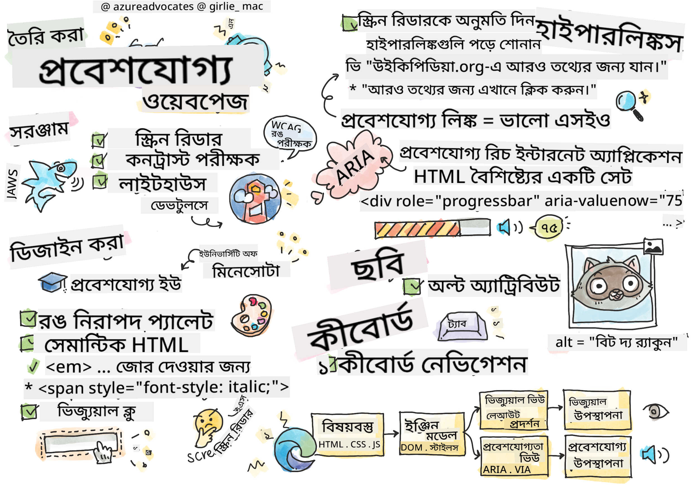

<!--
CO_OP_TRANSLATOR_METADATA:
{
  "original_hash": "e4cd5b1faed4adab5acf720f82798003",
  "translation_date": "2025-08-25T22:57:22+00:00",
  "source_file": "1-getting-started-lessons/3-accessibility/README.md",
  "language_code": "bn"
}
-->
# অ্যাক্সেসযোগ্য ওয়েবপেজ তৈরি করা


> স্কেচনোট: [Tomomi Imura](https://twitter.com/girlie_mac)

## লেকচারের আগে কুইজ
[লেকচারের আগে কুইজ](https://ff-quizzes.netlify.app/web/quiz/5)

> ওয়েবের শক্তি এর সার্বজনীনতায়। প্রতিবন্ধকতা নির্বিশেষে সবার জন্য অ্যাক্সেস নিশ্চিত করাই এর একটি গুরুত্বপূর্ণ দিক।
>
> \- স্যার টিমোথি বার্নার্স-লি, W3C ডিরেক্টর এবং ওয়ার্ল্ড ওয়াইড ওয়েবের উদ্ভাবক

এই উক্তিটি অ্যাক্সেসযোগ্য ওয়েবসাইট তৈরির গুরুত্বকে নিখুঁতভাবে তুলে ধরে। এমন একটি অ্যাপ্লিকেশন যা সবাই ব্যবহার করতে পারে না, তা প্রকৃতপক্ষে বর্জনমূলক। ওয়েব ডেভেলপার হিসেবে আমাদের সবসময় অ্যাক্সেসিবিলিটিকে মাথায় রাখতে হবে। শুরু থেকেই এই বিষয়ে মনোযোগ দিলে আপনি নিশ্চিত করতে পারবেন যে, আপনার তৈরি পৃষ্ঠাগুলি সবাই ব্যবহার করতে পারবে। এই পাঠে, আপনি শিখবেন কীভাবে অ্যাক্সেসযোগ্য ওয়েব অ্যাসেট তৈরি করবেন এবং কোন কোন টুল আপনাকে এই কাজে সাহায্য করতে পারে।

> আপনি এই পাঠটি [Microsoft Learn](https://docs.microsoft.com/learn/modules/web-development-101/accessibility/?WT.mc_id=academic-77807-sagibbon) এ নিতে পারেন!

## ব্যবহারের জন্য টুলস

### স্ক্রিন রিডার

অ্যাক্সেসিবিলিটির সবচেয়ে পরিচিত টুলগুলোর একটি হলো স্ক্রিন রিডার।

[স্ক্রিন রিডার](https://en.wikipedia.org/wiki/Screen_reader) সাধারণত দৃষ্টিহীন বা দৃষ্টি প্রতিবন্ধী ব্যক্তিরা ব্যবহার করেন। আমরা যেমন ব্রাউজার ব্যবহার করে তথ্য উপস্থাপন নিশ্চিত করি, তেমনি স্ক্রিন রিডারেও সঠিকভাবে তথ্য উপস্থাপন নিশ্চিত করতে হবে।

স্ক্রিন রিডার সাধারণত একটি পৃষ্ঠার উপরের দিক থেকে নিচ পর্যন্ত শব্দ করে পড়ে। যদি আপনার পৃষ্ঠাটি শুধুমাত্র টেক্সট দিয়ে তৈরি হয়, তবে এটি ব্রাউজারের মতোই তথ্য উপস্থাপন করবে। তবে ওয়েব পৃষ্ঠাগুলি সাধারণত শুধুমাত্র টেক্সট নয়; এতে লিঙ্ক, গ্রাফিক্স, রঙ এবং অন্যান্য ভিজ্যুয়াল উপাদান থাকে। স্ক্রিন রিডার সঠিকভাবে এই তথ্য পড়তে পারে তা নিশ্চিত করতে হবে।

প্রতিটি ওয়েব ডেভেলপারের স্ক্রিন রিডার সম্পর্কে ধারণা থাকা উচিত। এটি আপনার ব্যবহারকারীদের একটি গুরুত্বপূর্ণ টুল। যেমন আপনি ব্রাউজারের কার্যপ্রণালী জানেন, তেমনি স্ক্রিন রিডারের কার্যপ্রণালীও জানা উচিত। সৌভাগ্যবশত, বেশিরভাগ অপারেটিং সিস্টেমে স্ক্রিন রিডার বিল্ট-ইন থাকে।

কিছু ব্রাউজারেও বিল্ট-ইন টুল এবং এক্সটেনশন থাকে যা টেক্সট পড়ে শোনাতে পারে বা কিছু মৌলিক নেভিগেশন ফিচার সরবরাহ করতে পারে, যেমন [এই অ্যাক্সেসিবিলিটি-কেন্দ্রিক Edge ব্রাউজার টুলস](https://support.microsoft.com/help/4000734/microsoft-edge-accessibility-features)। তবে এগুলো স্ক্রিন রিডার টেস্টিং টুল নয় এবং সেগুলোর সাথে গুলিয়ে ফেলা উচিত নয়।

✅ একটি স্ক্রিন রিডার এবং ব্রাউজার টেক্সট রিডার ব্যবহার করে দেখুন। Windows-এ [Narrator](https://support.microsoft.com/windows/complete-guide-to-narrator-e4397a0d-ef4f-b386-d8ae-c172f109bdb1/?WT.mc_id=academic-77807-sagibbon) ডিফল্টভাবে অন্তর্ভুক্ত থাকে, এবং [JAWS](https://webaim.org/articles/jaws/) এবং [NVDA](https://www.nvaccess.org/about-nvda/) ইনস্টল করা যায়। macOS এবং iOS-এ [VoiceOver](https://support.apple.com/guide/voiceover/welcome/10) ডিফল্টভাবে অন্তর্ভুক্ত থাকে।

### জুম

দৃষ্টি প্রতিবন্ধী ব্যক্তিরা সাধারণত আরেকটি টুল ব্যবহার করেন, যা হলো জুম। সবচেয়ে সাধারণ জুম হলো স্ট্যাটিক জুম, যা `Control + প্লাস চিহ্ন (+)` ব্যবহার করে বা স্ক্রিন রেজোলিউশন কমিয়ে নিয়ন্ত্রণ করা হয়। এই ধরনের জুম পুরো পৃষ্ঠাটিকে পুনরায় আকার দেয়, তাই [রেসপন্সিভ ডিজাইন](https://developer.mozilla.org/docs/Learn/CSS/CSS_layout/Responsive_Design) ব্যবহার করা গুরুত্বপূর্ণ যাতে বড় জুম লেভেলে ভালো ব্যবহারকারীর অভিজ্ঞতা নিশ্চিত হয়।

আরেক ধরনের জুম হলো বিশেষায়িত সফটওয়্যার ব্যবহার করে স্ক্রিনের একটি নির্দিষ্ট অংশ বড় করা এবং প্যান করা, অনেকটা একটি বাস্তব ম্যাগনিফাইং গ্লাসের মতো। Windows-এ [Magnifier](https://support.microsoft.com/windows/use-magnifier-to-make-things-on-the-screen-easier-to-see-414948ba-8b1c-d3bd-8615-0e5e32204198) বিল্ট-ইন থাকে, এবং [ZoomText](https://www.freedomscientific.com/training/zoomtext/getting-started/) একটি তৃতীয় পক্ষের ম্যাগনিফিকেশন সফটওয়্যার যা আরও বেশি ফিচার এবং বড় ব্যবহারকারী বেস সরবরাহ করে। macOS এবং iOS-এ [Zoom](https://www.apple.com/accessibility/mac/vision/) নামে একটি বিল্ট-ইন ম্যাগনিফিকেশন সফটওয়্যার রয়েছে।

### কনট্রাস্ট চেকার

ওয়েবসাইটের রঙ এমনভাবে নির্বাচন করতে হবে যাতে রঙ-অন্ধ ব্যবহারকারী বা যারা কম কনট্রাস্ট রঙ দেখতে অসুবিধা অনুভব করেন, তাদের প্রয়োজন মেটানো যায়।

✅ একটি ওয়েবসাইট পরীক্ষা করুন যা আপনি পছন্দ করেন এবং ব্রাউজার এক্সটেনশন ব্যবহার করে রঙের ব্যবহার বিশ্লেষণ করুন, যেমন [WCAG-এর কালার চেকার](https://microsoftedge.microsoft.com/addons/detail/wcag-color-contrast-check/idahaggnlnekelhgplklhfpchbfdmkjp?hl=en-US&WT.mc_id=academic-77807-sagibbon)। আপনি কী শিখলেন?

### লাইটহাউস

আপনার ব্রাউজারের ডেভেলপার টুল এলাকায় লাইটহাউস টুল পাওয়া যাবে। এই টুলটি একটি ওয়েবসাইটের অ্যাক্সেসিবিলিটি (এবং অন্যান্য বিশ্লেষণ) সম্পর্কে প্রাথমিক ধারণা পেতে গুরুত্বপূর্ণ। যদিও শুধুমাত্র লাইটহাউসের উপর নির্ভর করা উচিত নয়, ১০০% স্কোর একটি ভালো সূচনা পয়েন্ট।

✅ আপনার ব্রাউজারের ডেভেলপার টুল প্যানেলে লাইটহাউস খুঁজুন এবং যেকোনো সাইটে একটি বিশ্লেষণ চালান। আপনি কী আবিষ্কার করলেন?

## অ্যাক্সেসিবিলিটির জন্য ডিজাইন করা

অ্যাক্সেসিবিলিটি একটি তুলনামূলকভাবে বড় বিষয়। আপনাকে সাহায্য করার জন্য অনেক রিসোর্স উপলব্ধ রয়েছে।

- [Accessible U - University of Minnesota](https://accessibility.umn.edu/your-role/web-developers)

যদিও আমরা অ্যাক্সেসযোগ্য সাইট তৈরির প্রতিটি দিক কভার করতে পারব না, নিচে কিছু মূল নীতিমালা দেওয়া হলো যা আপনি বাস্তবায়ন করতে চাইবেন। শুরু থেকেই একটি অ্যাক্সেসযোগ্য পৃষ্ঠা ডিজাইন করা **সবসময়** সহজতর হয়, তুলনায় একটি বিদ্যমান পৃষ্ঠাকে অ্যাক্সেসযোগ্য করার চেয়ে।

## ভালো প্রদর্শন নীতিমালা

### রঙ নিরাপদ প্যালেট

মানুষ পৃথিবীকে বিভিন্নভাবে দেখে, এবং এর মধ্যে রঙও অন্তর্ভুক্ত। আপনার সাইটের জন্য একটি রঙ স্কিম নির্বাচন করার সময় নিশ্চিত করুন এটি সবার জন্য অ্যাক্সেসযোগ্য। একটি চমৎকার [রঙ প্যালেট তৈরির টুল হলো Color Safe](http://colorsafe.co/)।

✅ এমন একটি ওয়েবসাইট চিহ্নিত করুন যেখানে রঙ ব্যবহারে বড় সমস্যা রয়েছে। কেন?

### সঠিক HTML ব্যবহার করুন

CSS এবং JavaScript ব্যবহার করে যেকোনো উপাদানকে যেকোনো ধরনের কন্ট্রোলে রূপান্তর করা সম্ভব। `<span>` ব্যবহার করে একটি `<button>` তৈরি করা যেতে পারে, এবং `<b>` ব্যবহার করে একটি হাইপারলিঙ্ক তৈরি করা যেতে পারে। যদিও এটি স্টাইলিংয়ের জন্য সহজ মনে হতে পারে, এটি স্ক্রিন রিডারের জন্য কোনো তথ্য প্রদান করে না। পৃষ্ঠায় কন্ট্রোল তৈরি করার সময় সঠিক HTML ব্যবহার করুন। যদি আপনি একটি হাইপারলিঙ্ক চান, `<a>` ব্যবহার করুন। সঠিক কন্ট্রোলের জন্য সঠিক HTML ব্যবহার করাকে বলা হয় সেমান্টিক HTML ব্যবহার করা।

✅ যেকোনো ওয়েবসাইটে যান এবং দেখুন ডিজাইনার এবং ডেভেলপাররা HTML সঠিকভাবে ব্যবহার করছেন কিনা। আপনি কি এমন কোনো বোতাম খুঁজে পেয়েছেন যা একটি লিঙ্ক হওয়া উচিত? টিপ: ব্রাউজারে 'View Page Source' নির্বাচন করতে ডান ক্লিক করুন এবং আন্ডারলাইন কোড দেখুন।

### একটি বর্ণনামূলক শিরোনাম হায়ারার্কি তৈরি করুন

স্ক্রিন রিডার ব্যবহারকারীরা [শিরোনামের উপর ব্যাপকভাবে নির্ভর করেন](https://webaim.org/projects/screenreadersurvey8/#finding) তথ্য খুঁজে পেতে এবং একটি পৃষ্ঠার মধ্য দিয়ে নেভিগেট করতে। বর্ণনামূলক শিরোনাম কন্টেন্ট লেখা এবং সেমান্টিক শিরোনাম ট্যাগ ব্যবহার করা একটি সহজে নেভিগেটযোগ্য সাইট তৈরির জন্য গুরুত্বপূর্ণ।

### ভালো ভিজ্যুয়াল ক্লু ব্যবহার করুন

CSS একটি পৃষ্ঠার যেকোনো উপাদানের চেহারা সম্পূর্ণ নিয়ন্ত্রণ করতে দেয়। আপনি একটি টেক্সট বক্স তৈরি করতে পারেন যার কোনো আউটলাইন নেই বা একটি হাইপারলিঙ্ক তৈরি করতে পারেন যার কোনো আন্ডারলাইন নেই। দুর্ভাগ্যবশত, এই ক্লুগুলি সরিয়ে ফেলা তাদের জন্য চ্যালেঞ্জিং করে তুলতে পারে যারা এগুলোর উপর নির্ভর করেন।

## লিঙ্ক টেক্সটের গুরুত্ব

হাইপারলিঙ্ক ওয়েব নেভিগেশনের মূল উপাদান। সুতরাং, একটি স্ক্রিন রিডার সঠিকভাবে লিঙ্ক পড়তে পারে তা নিশ্চিত করা সবার জন্য আপনার সাইট নেভিগেট করা সহজ করে তোলে।

### স্ক্রিন রিডার এবং লিঙ্ক

আপনি যেমনটি আশা করবেন, স্ক্রিন রিডার লিঙ্ক টেক্সটকে পৃষ্ঠার অন্য যেকোনো টেক্সটের মতোই পড়ে। এই বিষয়টি মাথায় রেখে, নিচের প্রদর্শিত টেক্সটটি গ্রহণযোগ্য মনে হতে পারে।

> ছোট পেঙ্গুইন, যাকে কখনও কখনও পরী পেঙ্গুইনও বলা হয়, এটি বিশ্বের সবচেয়ে ছোট পেঙ্গুইন। [এখানে ক্লিক করুন](https://en.wikipedia.org/wiki/Little_penguin) আরও তথ্যের জন্য।

> ছোট পেঙ্গুইন, যাকে কখনও কখনও পরী পেঙ্গুইনও বলা হয়, এটি বিশ্বের সবচেয়ে ছোট পেঙ্গুইন। আরও তথ্যের জন্য https://en.wikipedia.org/wiki/Little_penguin দেখুন।

> **NOTE** আপনি যা পড়তে যাচ্ছেন, মনে রাখবেন আপনি **কখনওই** উপরের মতো লিঙ্ক তৈরি করবেন না।

মনে রাখবেন, স্ক্রিন রিডার ব্রাউজারের থেকে আলাদা একটি ইন্টারফেস এবং এর বৈশিষ্ট্যও আলাদা।

### URL ব্যবহার করার সমস্যা

স্ক্রিন রিডার টেক্সট পড়ে। যদি টেক্সটে একটি URL থাকে, স্ক্রিন রিডার সেটি পড়বে। সাধারণত, URL কোনো অর্থপূর্ণ তথ্য প্রদান করে না এবং বিরক্তিকর শোনাতে পারে। আপনি যদি কখনও আপনার ফোনে একটি টেক্সট মেসেজের URL শব্দ করে পড়তে শুনে থাকেন, তবে আপনি এটি অনুভব করেছেন।

### "এখানে ক্লিক করুন" ব্যবহার করার সমস্যা

স্ক্রিন রিডার শুধুমাত্র পৃষ্ঠার হাইপারলিঙ্ক পড়ার ক্ষমতা রাখে, অনেকটা একজন দৃষ্টিশক্তিসম্পন্ন ব্যক্তি পৃষ্ঠার লিঙ্ক স্ক্যান করার মতো। যদি লিঙ্ক টেক্সট সবসময় "এখানে ক্লিক করুন" হয়, ব্যবহারকারী শুধুমাত্র "এখানে ক্লিক করুন, এখানে ক্লিক করুন, এখানে ক্লিক করুন, ..." শুনবে। সব লিঙ্ক এখন একে অপরের থেকে আলাদা করা অসম্ভব হয়ে যাবে।

### ভালো লিঙ্ক টেক্সট

ভালো লিঙ্ক টেক্সট সংক্ষেপে বর্ণনা করে যে লিঙ্কের অপর প্রান্তে কী আছে। উপরের উদাহরণে ছোট পেঙ্গুইন সম্পর্কে কথা বলা হয়েছে, লিঙ্কটি প্রজাতি সম্পর্কে উইকিপিডিয়া পৃষ্ঠায় নিয়ে যায়। *ছোট পেঙ্গুইন* শব্দগুচ্ছটি নিখুঁত লিঙ্ক টেক্সট হবে কারণ এটি স্পষ্ট করে যে কেউ যদি লিঙ্কে ক্লিক করে তবে তারা কী শিখবে - ছোট পেঙ্গুইন।

> [ছোট পেঙ্গুইন](https://en.wikipedia.org/wiki/Little_penguin), যাকে কখনও কখনও পরী পেঙ্গুইনও বলা হয়, এটি বিশ্বের সবচেয়ে ছোট পেঙ্গুইন।

✅ কয়েক মিনিট ওয়েবে ঘুরে এমন পৃষ্ঠাগুলি খুঁজুন যেখানে অস্পষ্ট লিঙ্কিং কৌশল ব্যবহার করা হয়েছে। সেগুলোর তুলনা ভালোভাবে লিঙ্ক করা সাইটগুলোর সাথে করুন। আপনি কী শিখলেন?

#### সার্চ ইঞ্জিন নোট

আপনার সাইট সবার জন্য অ্যাক্সেসযোগ্য নিশ্চিত করার জন্য, আপনি সার্চ ইঞ্জিনগুলোকেও আপনার সাইট নেভিগেট করতে সাহায্য করবেন। সার্চ ইঞ্জিন লিঙ্ক টেক্সট ব্যবহার করে পৃষ্ঠার বিষয়বস্তু শিখে। সুতরাং ভালো লিঙ্ক টেক্সট ব্যবহার করা সবার জন্য উপকারী!

### ARIA

নিম্নলিখিত পৃষ্ঠাটি কল্পনা করুন:

| পণ্য         | বিবরণ             | অর্ডার        |
| ------------ | ----------------- | ------------ |
| উইজেট        | [বিবরণ](../../../../1-getting-started-lessons/3-accessibility/')      | [অর্ডার](../../../../1-getting-started-lessons/3-accessibility/') |
| সুপার উইজেট | [বিবরণ](../../../../1-getting-started-lessons/3-accessibility/')      | [অর্ডার](../../../../1-getting-started-lessons/3-accessibility/') |

এই উদাহরণে, বিবরণ এবং অর্ডার টেক্সট পুনরাবৃত্তি করা ব্রাউজার ব্যবহারকারীদের জন্য অর্থবহ। তবে, স্ক্রিন রিডার ব্যবহারকারী শুধুমাত্র *বিবরণ* এবং *অর্ডার* শব্দগুলি বারবার শুনবে, কোনো প্রসঙ্গ ছাড়াই।

এই ধরনের পরিস্থিতি সমর্থন করার জন্য, HTML-এ [Accessible Rich Internet Applications (ARIA)](https://developer.mozilla.org/docs/Web/Accessibility/ARIA) নামে একটি অ্যাট্রিবিউট সেট রয়েছে। এই অ্যাট্রিবিউটগুলি স্ক্রিন রিডারগুলিকে অতিরিক্ত তথ্য প্রদান করতে দেয়।

> **NOTE**: HTML-এর অনেক দিকের মতো, ব্রাউজার এবং স্ক্রিন রিডার সমর্থন পরিবর্তিত হতে পারে। তবে, বেশিরভাগ প্রধান ক্লায়েন্ট ARIA অ্যাট্রিবিউট সমর্থন করে।

আপনি `aria-label` ব্যবহার করে লিঙ্কটি বর্ণনা করতে পারেন যখন পৃষ্ঠার ফরম্যাট এটি অনুমতি দেয় না। উইজেটের জন্য বিবরণ সেট করা যেতে পারে

``` html
<a href="#" aria-label="Widget description">description</a>
```

✅ সাধারণত, উপরে বর্ণিত সেমান্টিক মার্কআপ ব্যবহার করা ARIA ব্যবহারের চেয়ে বেশি গুরুত্বপূর্ণ, তবে কখনও কখনও বিভিন্ন HTML উইজেটের জন্য সেমান্টিক সমতুল্য থাকে না। একটি ভালো উদাহরণ হলো একটি ট্রি। ট্রির জন্য কোনো HTML সমতুল্য নেই, তাই আপনি এই উপাদানের জন্য জেনেরিক `<div>`-কে একটি সঠিক ভূমিকা এবং ARIA মান দিয়ে চিহ্নিত করেন। [MDN-এর ARIA ডকুমেন্টেশন](https://developer.mozilla.org/docs/Web/Accessibility/ARIA) আরও দরকারী তথ্য সরবরাহ করে।

```html
<h2 id="tree-label">File Viewer</h2>
<div role="tree" aria-labelledby="tree-label">
  <div role="treeitem" aria-expanded="false" tabindex="0">Uploads</div>
</div>
```

## ছবি

এটি বলার অপেক্ষা রাখে না যে স্ক্রিন রিডার স্বয়ংক্রিয়ভাবে একটি ছবিতে কী আছে তা পড়তে পারে না। ছবিগুলিকে অ্যাক্সেসযোগ্য করা খুব বেশি কাজের প্রয়োজন হয় না - এটি `alt` অ্যাট্রিবিউটের জন্যই। সমস্ত অর্থবহ ছবিতে তাদের বর্ণনা করার জন্য একটি `alt` থাকা উচিত।  
যেসব ছবি শুধুমাত্র অলঙ্কারমূলক, তাদের `alt` অ্যাট্রিবিউট একটি খালি স্ট্রিং দিয়ে সেট করা উচিত: `alt=""`। এটি স্ক্রিন রিডারকে অলঙ্কারমূলক ছবিগুলি অপ্রয়োজনীয়ভাবে ঘোষণা করা থেকে বিরত রাখে।

✅ আপনি যেমনটি আশা করবেন, সার্চ ইঞ্জিনও ছবিতে কী আছে তা বুঝতে পারে না। তারা `alt` টেক্সট ব্যবহার করে। সুতরাং আবারও, আপনার পৃষ্ঠাকে অ্যাক্সেসযোগ্য করা অতিরিক্ত সুবিধা প্রদান করে!

## কীবোর্ড

কিছু ব্যবহারকারী মাউস বা ট্র্যাকপ্যাড ব্যবহার করতে অক্ষম, পরিবর্তে কীবোর্ড ইন্টারঅ্যাকশনের উপর নির্ভর করেন একটি উপাদান থেকে অন্য উপাদানে যেতে। আপনার ওয়েবসাইটটি এমনভাবে উপস্থাপন করা গুরুত্বপূর্ণ যাতে কীবোর্ড ব্যবহারকারী একটি ডকুমেন্টের নিচে নেভিগেট করার সময় প্রতিটি ইন্টারঅ্যাকটিভ উপাদানে অ্যাক্সেস করতে পারেন। আপনি যদি সেমান্টিক মার্কআপ ব্যবহার করে আপনার ওয়েব পৃষ্ঠাগুলি তৈরি করেন এবং CSS ব্যবহার করে তাদের ভিজ্যুয়াল লেআউট স্টাইল করেন, তবে আপনার সাইটটি কীবোর্ড-নেভিগেটেবল হওয়া উচিত, তবে এটি ম্যানুয়ালি পরীক্ষা করা গুরুত্বপূর্ণ। [কীবোর্ড ন
অনেক সরকার অ্যাক্সেসিবিলিটি সংক্রান্ত আইনের প্রয়োজনীয়তা নিয়ে বিধি-নিষেধ আরোপ করেছে। আপনার দেশের অ্যাক্সেসিবিলিটি আইন সম্পর্কে জানুন। কী অন্তর্ভুক্ত এবং কী অন্তর্ভুক্ত নয়? একটি উদাহরণ হলো [এই সরকারি ওয়েবসাইট](https://accessibility.blog.gov.uk/)।

## অ্যাসাইনমেন্ট
 
[একটি অ-অ্যাক্সেসযোগ্য ওয়েবসাইট বিশ্লেষণ করুন](assignment.md)

ক্রেডিট: [Turtle Ipsum](https://github.com/Instrument/semantic-html-sample) by Instrument

**অস্বীকৃতি**:  
এই নথিটি AI অনুবাদ পরিষেবা [Co-op Translator](https://github.com/Azure/co-op-translator) ব্যবহার করে অনুবাদ করা হয়েছে। আমরা যথাসম্ভব সঠিকতার জন্য চেষ্টা করি, তবে অনুগ্রহ করে মনে রাখবেন যে স্বয়ংক্রিয় অনুবাদে ত্রুটি বা অসঙ্গতি থাকতে পারে। এর মূল ভাষায় থাকা নথিটিকে প্রামাণিক উৎস হিসেবে বিবেচনা করা উচিত। গুরুত্বপূর্ণ তথ্যের জন্য, পেশাদার মানব অনুবাদ সুপারিশ করা হয়। এই অনুবাদ ব্যবহারের ফলে কোনো ভুল বোঝাবুঝি বা ভুল ব্যাখ্যা হলে আমরা তার জন্য দায়ী থাকব না।