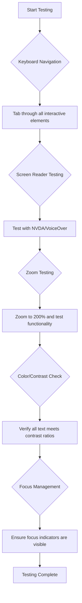
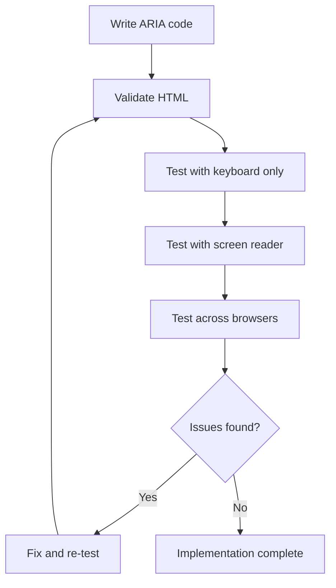

<!--
CO_OP_TRANSLATOR_METADATA:
{
  "original_hash": "90b19cde5b79b29e91babd3138cd8035",
  "translation_date": "2025-10-22T21:34:48+00:00",
  "source_file": "1-getting-started-lessons/3-accessibility/README.md",
  "language_code": "bn"
}
-->
# অ্যাক্সেসযোগ্য ওয়েবপেজ তৈরি করা


> স্কেচনোট করেছেন [Tomomi Imura](https://twitter.com/girlie_mac)

## প্রাক-লেকচার কুইজ
[প্রাক-লেকচার কুইজ](https://ff-quizzes.netlify.app/web/)

> ওয়েবের শক্তি এর সার্বজনীনতায়। প্রতিবন্ধকতা নির্বিশেষে সবার জন্য অ্যাক্সেস একটি গুরুত্বপূর্ণ দিক।
>
> \- স্যার টিমোথি বার্নার্স-লি, W3C পরিচালক এবং ওয়ার্ল্ড ওয়াইড ওয়েবের উদ্ভাবক

এটি শুনে আপনি অবাক হতে পারেন: যখন আপনি অ্যাক্সেসযোগ্য ওয়েবসাইট তৈরি করেন, তখন আপনি শুধু প্রতিবন্ধী ব্যক্তিদের সাহায্য করছেন না—আপনি আসলে সবার জন্য ওয়েবকে আরও ভালো করছেন!

আপনি কি কখনও রাস্তার কোণে কার্ব কাট লক্ষ্য করেছেন? এগুলি মূলত হুইলচেয়ারের জন্য ডিজাইন করা হয়েছিল, তবে এখন এগুলি স্ট্রোলার ব্যবহারকারী, ডেলিভারি কর্মী, লাগেজ নিয়ে ভ্রমণকারী এবং সাইকেল চালকদেরও সাহায্য করে। ঠিক এভাবেই অ্যাক্সেসযোগ্য ওয়েব ডিজাইন কাজ করে—যে সমাধানগুলি একটি গোষ্ঠীকে সাহায্য করে তা প্রায়শই সবার জন্য উপকারী হয়ে ওঠে। বেশ চমৎকার, তাই না?

এই পাঠে, আমরা কীভাবে এমন ওয়েবসাইট তৈরি করতে পারি যা সত্যিই সবার জন্য কাজ করে, তা অন্বেষণ করব, যেভাবেই তারা ওয়েব ব্রাউজ করুক না কেন। আপনি ওয়েব স্ট্যান্ডার্ডে ইতিমধ্যেই অন্তর্ভুক্ত ব্যবহারিক কৌশলগুলি আবিষ্কার করবেন, পরীক্ষার সরঞ্জামগুলির সাথে হাতে-কলমে কাজ করবেন এবং দেখবেন কীভাবে অ্যাক্সেসিবিলিটি আপনার সাইটগুলিকে সমস্ত ব্যবহারকারীর জন্য আরও ব্যবহারযোগ্য করে তোলে।

এই পাঠের শেষে, আপনি অ্যাক্সেসিবিলিটিকে আপনার ডেভেলপমেন্ট ওয়ার্কফ্লোর একটি স্বাভাবিক অংশে পরিণত করার আত্মবিশ্বাস অর্জন করবেন। চিন্তাশীল ডিজাইন পছন্দগুলি কীভাবে বিলিয়ন ব্যবহারকারীদের জন্য ওয়েব খুলে দিতে পারে তা অন্বেষণ করতে প্রস্তুত? চলুন শুরু করি!

> আপনি এই পাঠটি [Microsoft Learn](https://docs.microsoft.com/learn/modules/web-development-101/accessibility/?WT.mc_id=academic-77807-sagibbon) এ নিতে পারেন!

## সহায়ক প্রযুক্তি বোঝা

কোডিং শুরু করার আগে, আসুন এক মুহূর্ত সময় নিয়ে বুঝি কীভাবে বিভিন্ন ক্ষমতার মানুষরা আসলে ওয়েব অভিজ্ঞতা অর্জন করেন। এটি শুধুমাত্র তত্ত্ব নয়—এই বাস্তব-জগতের নেভিগেশন প্যাটার্নগুলি বোঝা আপনাকে আরও ভালো ডেভেলপার করে তুলবে!

সহায়ক প্রযুক্তিগুলি চমৎকার সরঞ্জাম যা প্রতিবন্ধী ব্যক্তিদের ওয়েবসাইটের সাথে এমনভাবে যোগাযোগ করতে সাহায্য করে যা আপনাকে অবাক করতে পারে। একবার আপনি এই প্রযুক্তিগুলি কীভাবে কাজ করে তা বুঝতে পারলে, অ্যাক্সেসযোগ্য ওয়েব অভিজ্ঞতা তৈরি করা অনেক বেশি স্বজ্ঞাত হয়ে ওঠে। এটি এমন যেন আপনি আপনার কোডটি অন্য কারও চোখ দিয়ে দেখতে শিখছেন।

### স্ক্রিন রিডার

[স্ক্রিন রিডার](https://en.wikipedia.org/wiki/Screen_reader) অত্যন্ত উন্নত প্রযুক্তি যা ডিজিটাল টেক্সটকে বক্তৃতা বা ব্রেইল আউটপুটে রূপান্তর করে। যদিও এগুলি মূলত দৃষ্টিহীন ব্যক্তিদের দ্বারা ব্যবহৃত হয়, তবে এগুলি ডিসলেক্সিয়ার মতো শেখার অক্ষমতা সম্পন্ন ব্যবহারকারীদের জন্যও অত্যন্ত সহায়ক।

আমি স্ক্রিন রিডারকে এমন একজন স্মার্ট বর্ণনাকারী হিসেবে ভাবতে পছন্দ করি যে আপনাকে একটি বই পড়ে শোনাচ্ছে। এটি একটি যুক্তিসঙ্গত ক্রমে বিষয়বস্তু জোরে পড়ে, "বাটন" বা "লিঙ্ক" এর মতো ইন্টারেক্টিভ উপাদান ঘোষণা করে এবং একটি পৃষ্ঠার চারপাশে লাফানোর জন্য কীবোর্ড শর্টকাট প্রদান করে। তবে বিষয়টি হল—স্ক্রিন রিডার শুধুমাত্র তাদের জাদু কাজ করতে পারে যদি আমরা সঠিক কাঠামো এবং অর্থপূর্ণ বিষয়বস্তু দিয়ে ওয়েবসাইট তৈরি করি। এখানেই আপনি একজন ডেভেলপার হিসেবে গুরুত্বপূর্ণ ভূমিকা পালন করেন!

**প্ল্যাটফর্ম জুড়ে জনপ্রিয় স্ক্রিন রিডার:**
- **Windows**: [NVDA](https://www.nvaccess.org/about-nvda/) (বিনামূল্যে এবং সবচেয়ে জনপ্রিয়), [JAWS](https://webaim.org/articles/jaws/), [Narrator](https://support.microsoft.com/windows/complete-guide-to-narrator-e4397a0d-ef4f-b386-d8ae-c172f109bdb1/?WT.mc_id=academic-77807-sagibbon) (বিল্ট-ইন)
- **macOS/iOS**: [VoiceOver](https://support.apple.com/guide/voiceover/welcome/10) (বিল্ট-ইন এবং খুব সক্ষম)
- **Android**: [TalkBack](https://support.google.com/accessibility/android/answer/6283677) (বিল্ট-ইন)
- **Linux**: [Orca](https://wiki.gnome.org/Projects/Orca) (বিনামূল্যে এবং ওপেন-সোর্স)

**স্ক্রিন রিডার কীভাবে ওয়েব বিষয়বস্তু নেভিগেট করে:**

স্ক্রিন রিডার দক্ষ ব্যবহারকারীদের জন্য ব্রাউজিংকে কার্যকর করার জন্য একাধিক নেভিগেশন পদ্ধতি প্রদান করে:
- **ক্রমিক পড়া**: বই অনুসরণ করার মতো উপরে থেকে নিচে বিষয়বস্তু পড়ে
- **ল্যান্ডমার্ক নেভিগেশন**: পৃষ্ঠার বিভাগগুলির মধ্যে লাফানো (হেডার, ন্যাভ, মেইন, ফুটার)
- **হেডিং নেভিগেশন**: হেডিংগুলির মধ্যে লাফিয়ে পৃষ্ঠার কাঠামো বোঝা
- **লিঙ্ক তালিকা**: দ্রুত অ্যাক্সেসের জন্য সমস্ত লিঙ্কের একটি তালিকা তৈরি করা
- **ফর্ম কন্ট্রোল**: ইনপুট ক্ষেত্র এবং বাটনের মধ্যে সরাসরি নেভিগেট করা

> 💡 **এটি শুনে আমি অবাক হয়েছিলাম**: ৬৮% স্ক্রিন রিডার ব্যবহারকারী প্রধানত হেডিং দ্বারা নেভিগেট করেন ([WebAIM Survey](https://webaim.org/projects/screenreadersurvey9/#finding))। এর মানে আপনার হেডিং কাঠামো ব্যবহারকারীদের জন্য একটি রোডম্যাপের মতো—যখন আপনি এটি সঠিকভাবে করেন, আপনি আক্ষরিক অর্থে লোকেদের আপনার বিষয়বস্তুতে দ্রুত পথ খুঁজে পেতে সাহায্য করছেন!

### আপনার পরীক্ষার ওয়ার্কফ্লো তৈরি করা

এখানে কিছু ভালো খবর—কার্যকর অ্যাক্সেসিবিলিটি টেস্টিংকে অপ্রতিরোধ্য হতে হবে না! আপনি স্বয়ংক্রিয় সরঞ্জামগুলিকে (এগুলি স্পষ্ট সমস্যাগুলি ধরতে দুর্দান্ত) কিছু হাতে-কলমে পরীক্ষার সাথে একত্রিত করতে চাইবেন। এখানে একটি পদ্ধতিগত পদ্ধতি রয়েছে যা আমি পেয়েছি যা সবচেয়ে বেশি সমস্যাগুলি ধরতে পারে এবং আপনার পুরো দিন নষ্ট না করে:

**প্রয়োজনীয় ম্যানুয়াল টেস্টিং ওয়ার্কফ্লো:**



**ধাপে ধাপে টেস্টিং চেকলিস্ট:**
1. **কীবোর্ড নেভিগেশন**: শুধুমাত্র Tab, Shift+Tab, Enter, Space এবং Arrow কী ব্যবহার করুন
2. **স্ক্রিন রিডার টেস্টিং**: NVDA, VoiceOver বা Narrator চালু করুন এবং চোখ বন্ধ করে নেভিগেট করুন
3. **জুম টেস্টিং**: ২০০% এবং ৪০০% জুম লেভেলে পরীক্ষা করুন
4. **কালার কনট্রাস্ট যাচাই**: সমস্ত টেক্সট এবং UI উপাদান পরীক্ষা করুন
5. **ফোকাস ইন্ডিকেটর টেস্টিং**: নিশ্চিত করুন যে সমস্ত ইন্টারেক্টিভ উপাদানগুলির দৃশ্যমান ফোকাস স্টেট রয়েছে

✅ **Lighthouse দিয়ে শুরু করুন**: আপনার ব্রাউজারের DevTools খুলুন, একটি Lighthouse অ্যাক্সেসিবিলিটি অডিট চালান, তারপর ফলাফলগুলি ব্যবহার করে আপনার ম্যানুয়াল টেস্টিং ফোকাস এলাকাগুলি নির্ধারণ করুন।

### জুম এবং ম্যাগনিফিকেশন টুল

আপনি কি কখনও আপনার ফোনে টেক্সট খুব ছোট হলে জুম করার চেষ্টা করেছেন, অথবা উজ্জ্বল রোদে আপনার ল্যাপটপ স্ক্রিনে চোখ কুঁচকে দেখেছেন? অনেক ব্যবহারকারী প্রতিদিন বিষয়বস্তু পড়ার জন্য ম্যাগনিফিকেশন টুলের উপর নির্ভর করেন। এর মধ্যে রয়েছে কম দৃষ্টিশক্তি সম্পন্ন ব্যক্তি, বয়স্ক ব্যক্তি এবং যে কেউ কখনও বাইরে ওয়েবসাইট পড়ার চেষ্টা করেছেন।

আধুনিক জুম প্রযুক্তি শুধুমাত্র জিনিসগুলিকে বড় করার চেয়ে বেশি উন্নত হয়েছে। এই সরঞ্জামগুলি কীভাবে কাজ করে তা বোঝা আপনাকে এমন প্রতিক্রিয়াশীল ডিজাইন তৈরি করতে সাহায্য করবে যা যেকোনো ম্যাগনিফিকেশন লেভেলে কার্যকর এবং আকর্ষণীয় থাকে।

**আধুনিক ব্রাউজার জুম ক্ষমতা:**
- **পৃষ্ঠার জুম**: সমস্ত বিষয়বস্তু অনুপাতে স্কেল করে (টেক্সট, ছবি, লেআউট) - এটি পছন্দনীয় পদ্ধতি
- **শুধুমাত্র টেক্সট জুম**: মূল লেআউট বজায় রেখে ফন্টের আকার বৃদ্ধি করে
- **পিঞ্চ-টু-জুম**: অস্থায়ী ম্যাগনিফিকেশনের জন্য মোবাইল জেসচার সাপোর্ট
- **ব্রাউজার সাপোর্ট**: সমস্ত আধুনিক ব্রাউজার কার্যকারিতা ভেঙে না দিয়ে ৫০০% পর্যন্ত জুম সমর্থন করে

**বিশেষায়িত ম্যাগনিফিকেশন সফটওয়্যার:**
- **Windows**: [Magnifier](https://support.microsoft.com/windows/use-magnifier-to-make-things-on-the-screen-easier-to-see-414948ba-8b1c-d3bd-8615-0e5e32204198) (বিল্ট-ইন), [ZoomText](https://www.freedomscientific.com/training/zoomtext/getting-started/)
- **macOS/iOS**: [Zoom](https://www.apple.com/accessibility/mac/vision/) (বিল্ট-ইন উন্নত বৈশিষ্ট্য সহ)

> ⚠️ **ডিজাইন বিবেচনা**: WCAG প্রয়োজন যে বিষয়বস্তু ২০০% জুম করা হলে কার্যকর থাকে। এই স্তরে, অনুভূমিক স্ক্রোলিং ন্যূনতম হওয়া উচিত এবং সমস্ত ইন্টারেক্টিভ উপাদান অ্যাক্সেসযোগ্য থাকা উচিত।

✅ **আপনার প্রতিক্রিয়াশীল ডিজাইন পরীক্ষা করুন**: আপনার ব্রাউজারকে ২০০% এবং ৪০০% জুম করুন। আপনার লেআউট কি সুন্দরভাবে মানিয়ে নিচ্ছে? আপনি কি অতিরিক্ত স্ক্রোলিং ছাড়াই সমস্ত কার্যকারিতা অ্যাক্সেস করতে পারেন?

## আধুনিক অ্যাক্সেসিবিলিটি টেস্টিং টুল

এখন যেহেতু আপনি বুঝতে পেরেছেন যে মানুষ কীভাবে সহায়ক প্রযুক্তি ব্যবহার করে ওয়েব নেভিগেট করে, আসুন সেই সরঞ্জামগুলি অন্বেষণ করি যা আপনাকে অ্যাক্সেসযোগ্য ওয়েবসাইট তৈরি এবং পরীক্ষা করতে সাহায্য করে।

এটি এভাবে ভাবুন: স্বয়ংক্রিয় সরঞ্জামগুলি স্পষ্ট সমস্যাগুলি ধরতে দুর্দান্ত (যেমন, অনুপস্থিত alt টেক্সট), যখন হাতে-কলমে পরীক্ষা আপনাকে নিশ্চিত করতে সাহায্য করে যে আপনার সাইট বাস্তব জগতে ব্যবহার করার জন্য ভালো অনুভূত হয়। একসাথে, তারা আপনাকে আত্মবিশ্বাস দেয় যে আপনার সাইটগুলি সবার জন্য কাজ করে।

### কালার কনট্রাস্ট টেস্টিং

এখানে কিছু ভালো খবর: কালার কনট্রাস্ট সবচেয়ে সাধারণ অ্যাক্সেসিবিলিটি সমস্যাগুলির মধ্যে একটি, তবে এটি ঠিক করাও সবচেয়ে সহজ। ভালো কনট্রাস্ট সবার জন্য উপকারী—দৃষ্টিশক্তি কম থাকা ব্যবহারকারীদের থেকে শুরু করে যারা সৈকতে তাদের ফোন পড়ার চেষ্টা করছেন।

**WCAG কনট্রাস্ট প্রয়োজনীয়তা:**

| টেক্সটের ধরন | WCAG AA (ন্যূনতম) | WCAG AAA (উন্নত) |
|--------------|--------------------|------------------|
| **সাধারণ টেক্সট** (১৮pt এর নিচে) | ৪.৫:১ কনট্রাস্ট অনুপাত | ৭:১ কনট্রাস্ট অনুপাত |
| **বড় টেক্সট** (১৮pt+ বা ১৪pt+ বোল্ড) | ৩:১ কনট্রাস্ট অনুপাত | ৪.৫:১ কনট্রাস্ট অনুপাত |
| **UI উপাদান** (বাটন, ফর্ম বর্ডার) | ৩:১ কনট্রাস্ট অনুপাত | ৩:১ কনট্রাস্ট অনুপাত |

**প্রয়োজনীয় টেস্টিং টুল:**
- [Colour Contrast Analyser](https://www.tpgi.com/color-contrast-checker/) - কালার পিকারের সাথে ডেস্কটপ অ্যাপ
- [WebAIM Contrast Checker](https://webaim.org/resources/contrastchecker/) - তাত্ক্ষণিক প্রতিক্রিয়া সহ ওয়েব-ভিত্তিক
- [Stark](https://www.getstark.co/) - Figma, Sketch, Adobe XD এর জন্য ডিজাইন টুল প্লাগইন
- [Accessible Colors](https://accessible-colors.com/) - অ্যাক্সেসযোগ্য কালার প্যালেট খুঁজুন

✅ **উন্নত কালার প্যালেট তৈরি করুন**: আপনার ব্র্যান্ড কালার দিয়ে শুরু করুন এবং অ্যাক্সেসযোগ্য বৈচিত্র্য তৈরি করতে কনট্রাস্ট চেকার ব্যবহার করুন। এগুলিকে আপনার ডিজাইন সিস্টেমের অ্যাক্সেসযোগ্য কালার টোকেন হিসাবে নথিভুক্ত করুন।

### ব্যাপক অ্যাক্সেসিবিলিটি অডিটিং

সবচেয়ে কার্যকর অ্যাক্সেসিবিলিটি টেস্টিং একাধিক পদ্ধতির সমন্বয় করে। কোনো একক টুল সবকিছু ধরতে পারে না, তাই বিভিন্ন পদ্ধতির সাথে একটি টেস্টিং রুটিন তৈরি করা নিশ্চিত করে যে আপনি সম্পূর্ণ কভারেজ পাচ্ছেন।

**ব্রাউজার-ভিত্তিক টেস্টিং (DevTools-এ অন্তর্ভুক্ত):**
- **Chrome/Edge**: Lighthouse অ্যাক্সেসিবিলিটি অডিট + অ্যাক্সেসিবিলিটি প্যানেল
- **Firefox**: বিস্তারিত ট্রি ভিউ সহ অ্যাক্সেসিবিলিটি ইনস্পেক্টর
- **Safari**: Web Inspector-এর অডিট ট্যাব VoiceOver সিমুলেশন সহ

**পেশাদার টেস্টিং এক্সটেনশন:**
- [axe DevTools](https://www.deque.com/axe/devtools/) - শিল্প-মানক স্বয়ংক্রিয় টেস্টিং
- [WAVE](https://wave.webaim.org/extension/) - ত্রুটি হাইলাইটিং সহ ভিজ্যুয়াল প্রতিক্রিয়া
- [Accessibility Insights](https://accessibilityinsights.io/) - Microsoft's ব্যাপক টেস্টিং স্যুট

**কমান্ড-লাইন এবং CI/CD ইন্টিগ্রেশন:**
- [axe-core](https://github.com/dequelabs/axe-core) - স্বয়ংক্রিয় টেস্টিংয়ের জন্য জাভাস্ক্রিপ্ট লাইব্রেরি
- [Pa11y](https://pa11y.org/) - কমান্ড-লাইন অ্যাক্সেসিবিলিটি টেস্টিং টুল
- [Lighthouse CI](https://github.com/GoogleChrome/lighthouse-ci) - স্বয়ংক্রিয় অ্যাক্সেসিবিলিটি স্কোরিং

> 🎯 **টেস্টিং লক্ষ্য**: আপনার Lighthouse অ্যাক্সেসিবিলিটি স্কোর ৯৫+ রাখার চেষ্টা করুন। মনে রাখবেন, স্বয়ংক্রিয় টুলগুলি শুধুমাত্র ৩০-৪০% অ্যাক্সেসিবিলিটি সমস্যাগুলি ধরতে পারে—ম্যানুয়াল টেস্টিং এখনও অপরিহার্য!

## শুরু থেকেই অ্যাক্সেসিবিলিটি তৈরি করা

অ্যাক্সেসিবিলিটি সাফল্যের চাবিকাঠি হল প্রথম দিন থেকেই এটি আপনার ভিত্তিতে অন্তর্ভুক্ত করা। আমি জানি এটি "পরে অ্যাক্সেসিবিলিটি যোগ করব" ভাবা প্রলুব্ধকর, কিন্তু এটি একটি বাড়ি তৈরি করার পরে একটি র‍্যাম্প যোগ করার চেষ্টা করার মতো। সম্ভব? হ্যাঁ। সহজ? মোটেও না।

অ্যাক্সেসিবিলিটিকে একটি বাড়ি পরিকল্পনার মতো ভাবুন—আপনার প্রাথমিক স্থাপত্য পরিকল্পনায় হুইলচেয়ার অ্যাক্সেসিবিলিটি অন্তর্ভুক্ত করা অনেক সহজ, পরে সবকিছু পুনর্গঠন করার চেয়ে।

### POUR নীতিমালা: আপনার অ্যাক্সেসিবিলিটি ভিত্তি

ওয়েব বিষয়বস্তু অ্যাক্সেসিবিলিটি নির্দেশিকা (WCAG) চারটি মৌলিক নীতির উপর ভিত্তি করে তৈরি করা হয়েছে যা POUR নামে পরিচিত। চিন্তা করবেন না—এগুলি কঠোর একাডেমিক ধারণা নয়! এগুলি আসলে এমন ব্যবহারিক নির্দেশিকা যা সবার জন্য কাজ করে এমন বিষয়বস্তু তৈরি করতে সাহায্য করে।

একবার আপনি POUR-এর ধারণা বুঝতে পারলে, অ্যাক্সেসিবিলিটি সিদ্ধান্ত নেওয়া অনেক বেশি স্বজ্ঞাত হয়ে ওঠে। এটি এমন একটি মানসিক চেকলিস্টের মতো যা আপনার ডিজাইন পছন্দগুলিকে নির্দেশ করে। আসুন এটি বিশ্লেষণ করি:

**
রঙ যোগাযোগের জন্য শক্তিশালী, তবে এটি কখনোই গুরুত্বপূর্ণ তথ্য প্রকাশের একমাত্র উপায় হওয়া উচিত নয়। রঙের বাইরে ডিজাইন করা আরও শক্তিশালী, অন্তর্ভুক্তিমূলক অভিজ্ঞতা তৈরি করে যা বিভিন্ন পরিস্থিতিতে কার্যকর হয়।

**রঙের দৃষ্টিভঙ্গির পার্থক্যের জন্য ডিজাইন করুন:**

প্রায় ৮% পুরুষ এবং ০.৫% নারী কোনো না কোনো ধরনের রঙের দৃষ্টিভঙ্গির পার্থক্য (প্রায়ই "রঙ অন্ধত্ব" বলা হয়) নিয়ে থাকেন। সবচেয়ে সাধারণ ধরণগুলো হলো:
- **Deuteranopia**: লাল এবং সবুজ পার্থক্য করতে অসুবিধা
- **Protanopia**: লালকে আরও ম্লান দেখায়
- **Tritanopia**: নীল এবং হলুদ পার্থক্য করতে অসুবিধা (বিরল)

**অন্তর্ভুক্তিমূলক রঙের কৌশল:**

```css
/* ❌ Bad: Using only color to indicate status */
.error { color: red; }
.success { color: green; }

/* ✅ Good: Color plus icons and context */
.error {
  color: #d32f2f;
  border-left: 4px solid #d32f2f;
}
.error::before {
  content: "⚠️";
  margin-right: 8px;
}

.success {
  color: #2e7d32;
  border-left: 4px solid #2e7d32;
}
.success::before {
  content: "✅";
  margin-right: 8px;
}
```

**মৌলিক কনট্রাস্ট প্রয়োজনীয়তার বাইরে:**
- রঙের পছন্দগুলো রঙ অন্ধত্ব সিমুলেটর দিয়ে পরীক্ষা করুন
- রঙ কোডিংয়ের পাশাপাশি প্যাটার্ন, টেক্সচার বা আকৃতি ব্যবহার করুন
- ইন্টারঅ্যাকটিভ স্টেটগুলো রঙ ছাড়াই পার্থক্যযোগ্য রাখুন
- আপনার ডিজাইনটি উচ্চ কনট্রাস্ট মোডে কেমন দেখায় তা বিবেচনা করুন

✅ **আপনার রঙের অ্যাক্সেসিবিলিটি পরীক্ষা করুন**: [Coblis](https://www.color-blindness.com/coblis-color-blindness-simulator/) এর মতো টুল ব্যবহার করে দেখুন আপনার সাইট বিভিন্ন রঙের দৃষ্টিভঙ্গি সহ ব্যবহারকারীদের কাছে কেমন দেখায়।

### ফোকাস ইন্ডিকেটর এবং ইন্টারঅ্যাকশন ডিজাইন

ফোকাস ইন্ডিকেটর হলো ডিজিটাল কার্সরের সমতুল্য—এটি কীবোর্ড ব্যবহারকারীদের পৃষ্ঠায় কোথায় অবস্থান করছেন তা দেখায়। ভালোভাবে ডিজাইন করা ফোকাস ইন্ডিকেটর সবার জন্য অভিজ্ঞতা উন্নত করে, ইন্টারঅ্যাকশনগুলোকে স্পষ্ট এবং পূর্বানুমানযোগ্য করে তোলে।

**আধুনিক ফোকাস ইন্ডিকেটরের সেরা অনুশীলন:**

```css
/* Enhanced focus styles that work across browsers */
button:focus-visible {
  outline: 2px solid #0066cc;
  outline-offset: 2px;
  box-shadow: 0 0 0 4px rgba(0, 102, 204, 0.25);
}

/* Remove focus outline for mouse users, preserve for keyboard users */
button:focus:not(:focus-visible) {
  outline: none;
}

/* Focus-within for complex components */
.card:focus-within {
  box-shadow: 0 0 0 3px rgba(74, 144, 164, 0.5);
  border-color: #4A90A4;
}

/* Ensure focus indicators meet contrast requirements */
.custom-focus:focus-visible {
  outline: 3px solid #ffffff;
  outline-offset: 2px;
  box-shadow: 0 0 0 6px #000000;
}
```

**ফোকাস ইন্ডিকেটরের প্রয়োজনীয়তা:**
- **দৃশ্যমানতা**: আশেপাশের উপাদানগুলোর সাথে কমপক্ষে ৩:১ কনট্রাস্ট রেশিও থাকতে হবে
- **প্রস্থ**: পুরো উপাদানের চারপাশে ন্যূনতম ২px পুরুত্ব থাকতে হবে
- **স্থিতিশীলতা**: ফোকাস অন্যত্র না সরানো পর্যন্ত দৃশ্যমান থাকতে হবে
- **পার্থক্য**: অন্যান্য UI স্টেট থেকে দৃশ্যত আলাদা হতে হবে

> 💡 **ডিজাইন টিপ**: চমৎকার ফোকাস ইন্ডিকেটর প্রায়ই আউটলাইন, বক্স-শ্যাডো এবং রঙ পরিবর্তনের সংমিশ্রণ ব্যবহার করে বিভিন্ন ব্যাকগ্রাউন্ড এবং প্রসঙ্গে দৃশ্যমানতা নিশ্চিত করে।

✅ **ফোকাস ইন্ডিকেটর অডিট করুন**: আপনার ওয়েবসাইটে ট্যাব করে দেখুন কোন উপাদানগুলোতে স্পষ্ট ফোকাস ইন্ডিকেটর রয়েছে। কোনোটি কি দেখতে কঠিন বা সম্পূর্ণ অনুপস্থিত?

### সেমান্টিক HTML: অ্যাক্সেসিবিলিটির ভিত্তি

সেমান্টিক HTML হলো আপনার ওয়েবসাইটের জন্য সহায়ক প্রযুক্তিগুলোর জন্য একটি GPS সিস্টেমের মতো। আপনি যখন সঠিক HTML উপাদানগুলো তাদের নির্ধারিত উদ্দেশ্যে ব্যবহার করেন, তখন আপনি স্ক্রিন রিডার, কীবোর্ড এবং অন্যান্য টুলগুলোর জন্য একটি বিস্তারিত রোডম্যাপ প্রদান করেন যা ব্যবহারকারীদের কার্যকরভাবে নেভিগেট করতে সাহায্য করে।

এটি একটি উদাহরণ যা আমাকে সত্যিই বোঝাতে সাহায্য করেছে: সেমান্টিক HTML হলো একটি ভালোভাবে সংগঠিত লাইব্রেরি যেখানে স্পষ্ট বিভাগ এবং সহায়ক চিহ্ন রয়েছে বনাম একটি গুদাম যেখানে বইগুলো এলোমেলোভাবে ছড়িয়ে রয়েছে। উভয় জায়গায় একই বই রয়েছে, তবে কোনটিতে আপনি কিছু খুঁজে পেতে চাইবেন? ঠিক তাই!

**অ্যাক্সেসিবল পৃষ্ঠার কাঠামোর নির্মাণ ব্লক:**

```html
<!-- Landmark elements provide page navigation structure -->
<header>
  <h1>Your Site Name</h1>
  <nav aria-label="Main navigation">
    <ul>
      <li><a href="/home">Home</a></li>
      <li><a href="/about">About</a></li>
      <li><a href="/services">Services</a></li>
    </ul>
  </nav>
</header>

<main>
  <article>
    <header>
      <h1>Article Title</h1>
      <p>Published on <time datetime="2024-10-14">October 14, 2024</time></p>
    </header>
    
    <section>
      <h2>First Section</h2>
      <p>Content that relates to this section...</p>
    </section>
    
    <section>
      <h2>Second Section</h2>
      <p>More related content...</p>
    </section>
  </article>
  
  <aside>
    <h2>Related Links</h2>
    <nav aria-label="Related articles">
      <ul>
        <li><a href="/related-1">First related article</a></li>
        <li><a href="/related-2">Second related article</a></li>
      </ul>
    </nav>
  </aside>
</main>

<footer>
  <p>&copy; 2024 Your Site Name. All rights reserved.</p>
  <nav aria-label="Footer links">
    <ul>
      <li><a href="/privacy">Privacy Policy</a></li>
      <li><a href="/contact">Contact Us</a></li>
    </ul>
  </nav>
</footer>
```

**কেন সেমান্টিক HTML অ্যাক্সেসিবিলিটি রূপান্তর করে:**

| সেমান্টিক উপাদান | উদ্দেশ্য | স্ক্রিন রিডার সুবিধা |
|------------------|---------|----------------------|
| `<header>` | পৃষ্ঠা বা বিভাগ শিরোনাম | "Banner landmark" - শীর্ষে দ্রুত নেভিগেশন |
| `<nav>` | নেভিগেশন লিঙ্ক | "Navigation landmark" - নেভ সেকশনগুলোর তালিকা |
| `<main>` | প্রধান পৃষ্ঠার বিষয়বস্তু | "Main landmark" - সরাসরি বিষয়বস্তুতে যান |
| `<article>` | স্বতন্ত্র বিষয়বস্তু | আর্টিকেলের সীমানা ঘোষণা করে |
| `<section>` | থিমযুক্ত বিষয়বস্তু গ্রুপ | বিষয়বস্তু কাঠামো প্রদান করে |
| `<aside>` | সম্পর্কিত সাইডবার বিষয়বস্তু | "Complementary landmark" |
| `<footer>` | পৃষ্ঠা বা বিভাগ ফুটার | "Contentinfo landmark" |

**সেমান্টিক HTML দিয়ে স্ক্রিন রিডারের সুপারপাওয়ার:**
- **ল্যান্ডমার্ক নেভিগেশন**: প্রধান পৃষ্ঠার বিভাগগুলোর মধ্যে দ্রুত লাফ দিন
- **হেডিং আউটলাইন**: আপনার হেডিং কাঠামো থেকে বিষয়বস্তু সূচি তৈরি করুন
- **উপাদান তালিকা**: সমস্ত লিঙ্ক, বোতাম বা ফর্ম কন্ট্রোলের তালিকা তৈরি করুন
- **প্রসঙ্গ সচেতনতা**: বিষয়বস্তু বিভাগের মধ্যে সম্পর্ক বুঝুন

> 🎯 **দ্রুত পরীক্ষা**: ল্যান্ডমার্ক শর্টকাট (NVDA/JAWS-এ D ল্যান্ডমার্কের জন্য, H হেডিংয়ের জন্য, K লিঙ্কের জন্য) ব্যবহার করে স্ক্রিন রিডার দিয়ে আপনার সাইট নেভিগেট করার চেষ্টা করুন। নেভিগেশন কি অর্থবহ মনে হয়?

✅ **আপনার সেমান্টিক কাঠামো অডিট করুন**: আপনার ব্রাউজারের DevTools-এ অ্যাক্সেসিবিলিটি প্যানেল ব্যবহার করে অ্যাক্সেসিবিলিটি ট্রি দেখুন এবং নিশ্চিত করুন যে আপনার মার্কআপ একটি যৌক্তিক কাঠামো তৈরি করে।

### হেডিং হায়ারার্কি: একটি যৌক্তিক বিষয়বস্তু আউটলাইন তৈরি করা

অ্যাক্সেসিবল বিষয়বস্তুর জন্য হেডিং অত্যন্ত গুরুত্বপূর্ণ—এটি সবকিছু একসাথে ধরে রাখার মেরুদণ্ডের মতো। স্ক্রিন রিডার ব্যবহারকারীরা আপনার বিষয়বস্তু বুঝতে এবং নেভিগেট করতে হেডিংয়ের উপর ব্যাপকভাবে নির্ভর করেন। এটি আপনার পৃষ্ঠার জন্য একটি বিষয়বস্তু সূচি প্রদান করার মতো।

**হেডিংয়ের জন্য সোনালী নিয়ম:**
কখনোই স্তর এড়িয়ে যাবেন না। সর্বদা `<h1>` থেকে `<h2>` থেকে `<h3>` পর্যন্ত যৌক্তিকভাবে অগ্রসর হন। স্কুলে আউটলাইন তৈরি করার কথা মনে আছে? এটি ঠিক একই নীতি—আপনি "I. প্রধান পয়েন্ট" থেকে সরাসরি "C. সাব-সাব-পয়েন্ট" এ যাবেন না যদি "A. সাব-পয়েন্ট" এর মধ্যে না থাকে, তাই না?

**পারফেক্ট হেডিং কাঠামোর উদাহরণ:**

```html
<!-- ✅ Excellent: Logical, hierarchical progression -->
<main>
  <h1>Complete Guide to Web Accessibility</h1>
  
  <section>
    <h2>Understanding Screen Readers</h2>
    <p>Introduction to screen reader technology...</p>
    
    <h3>Popular Screen Reader Software</h3>
    <p>NVDA, JAWS, and VoiceOver comparison...</p>
    
    <h3>Testing with Screen Readers</h3>
    <p>Step-by-step testing instructions...</p>
  </section>
  
  <section>
    <h2>Color and Contrast Guidelines</h2>
    <p>Designing with sufficient contrast...</p>
    
    <h3>WCAG Contrast Requirements</h3>
    <p>Understanding the different contrast levels...</p>
    
    <h3>Testing Tools and Techniques</h3>
    <p>Tools for verifying contrast ratios...</p>
  </section>
</main>
```

```html
<!-- ❌ Problematic: Skipping levels, inconsistent structure -->
<h1>Page Title</h1>
<h3>Subsection</h3> <!-- Skipped h2 -->
<h2>This should come before h3</h2>
<h1>Another main heading?</h1> <!-- Multiple h1s -->
```

**হেডিংয়ের সেরা অনুশীলন:**
- **প্রতি পৃষ্ঠায় একটি `<h1>`**: সাধারণত আপনার প্রধান পৃষ্ঠার শিরোনাম বা প্রাথমিক বিষয়বস্তু শিরোনাম
- **যৌক্তিক অগ্রগতি**: কখনোই স্তর এড়িয়ে যাবেন না (h1 → h2 → h3, h1 → h3 নয়)
- **বর্ণনামূলক বিষয়বস্তু**: হেডিংগুলোকে এমন অর্থপূর্ণ করুন যা প্রসঙ্গ ছাড়াই পড়া যায়
- **CSS দিয়ে ভিজ্যুয়াল স্টাইলিং**: চেহারার জন্য CSS ব্যবহার করুন, কাঠামোর জন্য HTML স্তর

**স্ক্রিন রিডার নেভিগেশন পরিসংখ্যান:**
- ৬৮% স্ক্রিন রিডার ব্যবহারকারী হেডিং দ্বারা নেভিগেট করেন ([WebAIM Survey](https://webaim.org/projects/screenreadersurvey9/#finding))
- ব্যবহারকারীরা একটি যৌক্তিক হেডিং আউটলাইন আশা করেন
- হেডিংগুলো পৃষ্ঠার কাঠামো বুঝতে দ্রুততম উপায় প্রদান করে

> 💡 **প্রো টিপ**: "HeadingsMap" এর মতো ব্রাউজার এক্সটেনশন ব্যবহার করে আপনার হেডিং কাঠামো ভিজ্যুয়ালাইজ করুন। এটি একটি ভালোভাবে সংগঠিত বিষয়বস্তু সূচির মতো পড়া উচিত।

✅ **আপনার হেডিং কাঠামো পরীক্ষা করুন**: স্ক্রিন রিডারের হেডিং নেভিগেশন (NVDA-তে H কী) ব্যবহার করে আপনার হেডিংগুলোতে লাফ দিন। প্রগতি কি আপনার বিষয়বস্তুর গল্পটি যৌক্তিকভাবে বলে?

### উন্নত ভিজ্যুয়াল অ্যাক্সেসিবিলিটি কৌশল

কনট্রাস্ট এবং রঙের মৌলিক বিষয়গুলোর বাইরে, এমন উন্নত কৌশল রয়েছে যা সত্যিকার অর্থে অন্তর্ভুক্তিমূলক ভিজ্যুয়াল অভিজ্ঞতা তৈরি করতে সাহায্য করে। এই পদ্ধতিগুলো নিশ্চিত করে যে আপনার বিষয়বস্তু বিভিন্ন দেখার শর্ত এবং সহায়ক প্রযুক্তির মধ্যে কাজ করে।

**অপরিহার্য ভিজ্যুয়াল যোগাযোগ কৌশল:**

- **মাল্টি-মোডাল ফিডব্যাক**: ভিজ্যুয়াল, টেক্সট এবং কখনো কখনো অডিও সংকেতের সংমিশ্রণ করুন
- **প্রগ্রেসিভ ডিসক্লোজার**: তথ্যকে হজমযোগ্য অংশে উপস্থাপন করুন
- **সামঞ্জস্যপূর্ণ ইন্টারঅ্যাকশন প্যাটার্ন**: পরিচিত UI কনভেনশন ব্যবহার করুন
- **রেসপন্সিভ টাইপোগ্রাফি**: ডিভাইস জুড়ে টেক্সট যথাযথভাবে স্কেল করুন
- **লোডিং এবং ত্রুটি স্টেট**: সমস্ত ব্যবহারকারীর ক্রিয়ার জন্য স্পষ্ট ফিডব্যাক প্রদান করুন

**CSS ইউটিলিটি উন্নত অ্যাক্সেসিবিলিটির জন্য:**

```css
/* Screen reader only text - visually hidden but accessible */
.sr-only {
  position: absolute;
  width: 1px;
  height: 1px;
  padding: 0;
  margin: -1px;
  overflow: hidden;
  clip: rect(0, 0, 0, 0);
  white-space: nowrap;
  border: 0;
}

/* Skip link for keyboard navigation */
.skip-link {
  position: absolute;
  top: -40px;
  left: 6px;
  background: #000000;
  color: #ffffff;
  padding: 8px 16px;
  text-decoration: none;
  border-radius: 4px;
  font-weight: bold;
  transition: top 0.3s ease;
  z-index: 1000;
}

.skip-link:focus {
  top: 6px;
}

/* Reduced motion respect */
@media (prefers-reduced-motion: reduce) {
  .skip-link {
    transition: none;
  }
  
  * {
    animation-duration: 0.01ms !important;
    animation-iteration-count: 1 !important;
    transition-duration: 0.01ms !important;
  }
}

/* High contrast mode support */
@media (prefers-contrast: high) {
  .button {
    border: 2px solid;
  }
}
```

> 🎯 **অ্যাক্সেসিবিলিটি প্যাটার্ন**: "স্কিপ লিঙ্ক" কীবোর্ড ব্যবহারকারীদের জন্য অপরিহার্য। এটি আপনার পৃষ্ঠার প্রথম ফোকাসযোগ্য উপাদান হওয়া উচিত এবং সরাসরি প্রধান বিষয়বস্তু এলাকায় লাফ দিতে সক্ষম হওয়া উচিত।

✅ **স্কিপ নেভিগেশন বাস্তবায়ন করুন**: আপনার পৃষ্ঠাগুলোতে স্কিপ লিঙ্ক যোগ করুন এবং পৃষ্ঠা লোড হওয়ার সাথে সাথে Tab চাপ দিয়ে সেগুলো পরীক্ষা করুন। সেগুলো উপস্থিত হওয়া উচিত এবং আপনাকে প্রধান বিষয়বস্তুতে লাফ দিতে সক্ষম করা উচিত।
5. **সহজভাবে শুরু করুন**: জটিল ARIA বাস্তবায়নে ত্রুটি হওয়ার সম্ভাবনা বেশি

**🔍 পরীক্ষার কার্যপ্রবাহ:**



**🚫 সাধারণ ARIA ভুলগুলো এড়িয়ে চলুন:**

- **বিরোধপূর্ণ তথ্য**: HTML এর অর্থবোধকতা বিরোধী করবেন না
- **অতিরিক্ত লেবেলিং**: অতিরিক্ত ARIA তথ্য ব্যবহারকারীদের বিভ্রান্ত করে
- **স্থির ARIA**: বিষয়বস্তু পরিবর্তনের সময় ARIA অবস্থাগুলি আপডেট করতে ভুলবেন না
- **অপরীক্ষিত বাস্তবায়ন**: ARIA যা তত্ত্বে কাজ করে কিন্তু বাস্তবে ব্যর্থ হয়
- **কীবোর্ড সমর্থনের অভাব**: ARIA ভূমিকা কিন্তু সংশ্লিষ্ট কীবোর্ড ইন্টারঅ্যাকশন ছাড়া

> 💡 **পরীক্ষার সম্পদ**: [accessibility-checker](https://www.npmjs.com/package/accessibility-checker) এর মতো সরঞ্জাম ব্যবহার করুন স্বয়ংক্রিয় ARIA যাচাইয়ের জন্য, তবে সম্পূর্ণ অভিজ্ঞতার জন্য বাস্তব স্ক্রিন রিডার দিয়ে পরীক্ষা করুন।

✅ **বিশেষজ্ঞদের কাছ থেকে শিখুন**: [ARIA Authoring Practices Guide](https://w3c.github.io/aria-practices/) অধ্যয়ন করুন জটিল ইন্টারেক্টিভ উইজেটের জন্য পরীক্ষিত প্যাটার্ন এবং বাস্তবায়ন।

## ছবি এবং মিডিয়া অ্যাক্সেসযোগ্য করা

ভিজ্যুয়াল এবং অডিও বিষয়বস্তু আধুনিক ওয়েব অভিজ্ঞতার অপরিহার্য অংশ, তবে সেগুলি যদি চিন্তাশীলভাবে বাস্তবায়িত না হয় তবে বাধা সৃষ্টি করতে পারে। লক্ষ্য হল নিশ্চিত করা যে আপনার মিডিয়ার তথ্য এবং আবেগপ্রবণ প্রভাব প্রতিটি ব্যবহারকারীর কাছে পৌঁছায়। একবার আপনি এটি আয়ত্ত করলে, এটি স্বাভাবিক হয়ে যায়।

বিভিন্ন ধরনের মিডিয়ার জন্য বিভিন্ন অ্যাক্সেসযোগ্যতার পদ্ধতি প্রয়োজন। এটি রান্নার মতো—আপনি একটি নরম মাছকে কখনোই একটি শক্ত স্টেকের মতো আচরণ করবেন না। এই পার্থক্যগুলি বোঝা আপনাকে প্রতিটি পরিস্থিতির জন্য সঠিক সমাধান বেছে নিতে সাহায্য করে।

### কৌশলগত ছবি অ্যাক্সেসযোগ্যতা

আপনার ওয়েবসাইটের প্রতিটি ছবির একটি উদ্দেশ্য রয়েছে। সেই উদ্দেশ্যটি বোঝা আপনাকে আরও ভাল বিকল্প পাঠ্য লিখতে এবং আরও অন্তর্ভুক্তিমূলক অভিজ্ঞতা তৈরি করতে সাহায্য করে।

**ছবির চারটি ধরন এবং তাদের বিকল্প পাঠ্যের কৌশল:**

**তথ্যবহুল ছবি** - গুরুত্বপূর্ণ তথ্য প্রদান করে:
```html

```

**সাজসজ্জার ছবি** - শুধুমাত্র ভিজ্যুয়াল, কোনো তথ্যমূলক মূল্য নেই:
```html

```

**কার্যকরী ছবি** - বোতাম বা নিয়ন্ত্রণ হিসাবে কাজ করে:
```html
<button>
  
</button>
```

**জটিল ছবি** - চার্ট, ডায়াগ্রাম, ইনফোগ্রাফিক:
```html

<div id="chart-description">
  <p>Detailed description: Sales data shows a steady increase across all quarters...</p>
</div>
```

### ভিডিও এবং অডিও অ্যাক্সেসযোগ্যতা

**ভিডিওর প্রয়োজনীয়তা:**
- **ক্যাপশন**: কথিত বিষয়বস্তু এবং শব্দ প্রভাবের টেক্সট সংস্করণ
- **অডিও বিবরণ**: অন্ধ ব্যবহারকারীদের জন্য ভিজ্যুয়াল উপাদানের বর্ণনা
- **ট্রান্সক্রিপ্ট**: সমস্ত অডিও এবং ভিজ্যুয়াল বিষয়বস্তুর পূর্ণ টেক্সট সংস্করণ

```html
<video controls>
  <source src="video.mp4" type="video/mp4">
  <track kind="captions" src="captions.vtt" srclang="en" label="English">
  <track kind="descriptions" src="descriptions.vtt" srclang="en" label="Audio descriptions">
</video>
```

**অডিওর প্রয়োজনীয়তা:**
- **ট্রান্সক্রিপ্ট**: সমস্ত কথিত বিষয়বস্তুর টেক্সট সংস্করণ
- **ভিজ্যুয়াল সূচক**: শুধুমাত্র অডিও বিষয়বস্তুর জন্য, ভিজ্যুয়াল সংকেত প্রদান করুন

### আধুনিক ছবি কৌশল

**সাজসজ্জার ছবির জন্য CSS ব্যবহার:**
```css
.hero-section {
  background-image: url('decorative-hero.jpg');
  /* Decorative images in CSS don't need alt text */
}
```

**অ্যাক্সেসযোগ্যতার সাথে প্রতিক্রিয়াশীল ছবি:**
```html
<picture>
  <source media="(min-width: 800px)" srcset="large-chart.png">
  <source media="(min-width: 400px)" srcset="medium-chart.png">
  
</picture>
```

✅ **ছবি অ্যাক্সেসযোগ্যতা পরীক্ষা করুন**: স্ক্রিন রিডার ব্যবহার করে ছবিসহ একটি পৃষ্ঠা নেভিগেট করুন। বিষয়বস্তু বুঝতে আপনার কাছে পর্যাপ্ত তথ্য আছে কি?

## কীবোর্ড নেভিগেশন এবং ফোকাস ব্যবস্থাপনা

অনেক ব্যবহারকারী সম্পূর্ণরূপে তাদের কীবোর্ড দিয়ে ওয়েব নেভিগেট করেন। এর মধ্যে রয়েছে মোটর প্রতিবন্ধী ব্যক্তিরা, পাওয়ার ব্যবহারকারীরা যারা কীবোর্ডকে মাউসের চেয়ে দ্রুত মনে করেন এবং যাদের মাউস কাজ করা বন্ধ করেছে। নিশ্চিত করা যে আপনার সাইটটি কীবোর্ড ইনপুটের সাথে ভালভাবে কাজ করে তা অপরিহার্য এবং প্রায়শই এটি সবার জন্য আপনার সাইটকে আরও দক্ষ করে তোলে।

### প্রয়োজনীয় কীবোর্ড নেভিগেশন প্যাটার্ন

**স্ট্যান্ডার্ড কীবোর্ড ইন্টারঅ্যাকশন:**
- **Tab**: ইন্টারেক্টিভ উপাদানগুলির মাধ্যমে ফোকাস এগিয়ে নিয়ে যান
- **Shift + Tab**: ফোকাস পিছনে নিয়ে যান
- **Enter**: বোতাম এবং লিঙ্ক সক্রিয় করুন
- **Space**: বোতাম সক্রিয় করুন, চেকবক্স চেক করুন
- **Arrow keys**: উপাদান গোষ্ঠীর মধ্যে নেভিগেট করুন (রেডিও বোতাম, মেনু)
- **Escape**: মডাল, ড্রপডাউন বন্ধ করুন বা অপারেশন বাতিল করুন

### ফোকাস ব্যবস্থাপনার সেরা অনুশীলন

**দৃশ্যমান ফোকাস সূচক:**
```css
/* Ensure focus is always visible */
button:focus-visible {
  outline: 2px solid #4A90A4;
  outline-offset: 2px;
}

/* Custom focus styles for different components */
.card:focus-within {
  box-shadow: 0 0 0 3px rgba(74, 144, 164, 0.5);
}
```

**দ্রুত নেভিগেশনের জন্য স্কিপ লিঙ্ক:**
```html
<a href="#main-content" class="skip-link">Skip to main content</a>
<a href="#navigation" class="skip-link">Skip to navigation</a>

<nav id="navigation">
  <!-- navigation content -->
</nav>
<main id="main-content">
  <!-- main content -->
</main>
```

**সঠিক ট্যাব অর্ডার:**
```html
<!-- Use semantic HTML for natural tab order -->
<form>
  <label for="name">Name:</label>
  <input type="text" id="name" tabindex="0">
  
  <label for="email">Email:</label>
  <input type="email" id="email" tabindex="0">
  
  <button type="submit" tabindex="0">Submit</button>
</form>
```

### মডালে ফোকাস আটকে রাখা

যখন মডাল ডায়ালগ খোলা হয়, ফোকাস মডালের মধ্যে আটকে রাখা উচিত:

```javascript
// Modern focus trap implementation
function trapFocus(element) {
  const focusableElements = element.querySelectorAll(
    'button, [href], input, select, textarea, [tabindex]:not([tabindex="-1"])'
  );
  
  const firstElement = focusableElements[0];
  const lastElement = focusableElements[focusableElements.length - 1];

  element.addEventListener('keydown', (e) => {
    if (e.key === 'Tab') {
      if (e.shiftKey && document.activeElement === firstElement) {
        e.preventDefault();
        lastElement.focus();
      } else if (!e.shiftKey && document.activeElement === lastElement) {
        e.preventDefault();
        firstElement.focus();
      }
    }
    
    if (e.key === 'Escape') {
      closeModal();
    }
  });
  
  // Focus first element when modal opens
  firstElement.focus();
}
```

✅ **কীবোর্ড নেভিগেশন পরীক্ষা করুন**: শুধুমাত্র Tab কী ব্যবহার করে আপনার ওয়েবসাইট নেভিগেট করার চেষ্টা করুন। আপনি কি সমস্ত ইন্টারেক্টিভ উপাদানে পৌঁছাতে পারছেন? ফোকাস অর্ডার কি যৌক্তিক? ফোকাস সূচকগুলি কি স্পষ্টভাবে দৃশ্যমান?

## ফর্ম অ্যাক্সেসযোগ্যতা

ফর্মগুলি ব্যবহারকারীর ইন্টারঅ্যাকশনের জন্য গুরুত্বপূর্ণ এবং অ্যাক্সেসযোগ্যতার জন্য বিশেষ মনোযোগ প্রয়োজন।

### লেবেল এবং ফর্ম নিয়ন্ত্রণের সংযোগ

**প্রতিটি ফর্ম নিয়ন্ত্রণের একটি লেবেল প্রয়োজন:**
```html
<!-- Explicit labeling (preferred) -->
<label for="username">Username:</label>
<input type="text" id="username" name="username" required>

<!-- Implicit labeling -->
<label>
  Password:
  <input type="password" name="password" required>
</label>

<!-- Using aria-label when visual label isn't desired -->
<input type="search" aria-label="Search products" placeholder="Search...">
```

### ত্রুটি পরিচালনা এবং যাচাইকরণ

**অ্যাক্সেসযোগ্য ত্রুটি বার্তা:**
```html
<label for="email">Email Address:</label>
<input type="email" id="email" name="email" 
       aria-describedby="email-error" 
       aria-invalid="true" required>
<div id="email-error" role="alert">
  Please enter a valid email address
</div>
```

**ফর্ম যাচাইকরণের সেরা অনুশীলন:**
- `aria-invalid` ব্যবহার করুন অকার্যকর ক্ষেত্রগুলি নির্দেশ করতে
- পরিষ্কার, নির্দিষ্ট ত্রুটি বার্তা প্রদান করুন
- গুরুত্বপূর্ণ ত্রুটি ঘোষণা করার জন্য `role="alert"` ব্যবহার করুন
- ত্রুটি তাৎক্ষণিকভাবে এবং ফর্ম জমা দেওয়ার সময় দেখান

### ফিল্ডসেট এবং গ্রুপিং

**সম্পর্কিত ফর্ম নিয়ন্ত্রণগুলি গ্রুপ করুন:**
```html
<fieldset>
  <legend>Shipping Address</legend>
  <label for="street">Street Address:</label>
  <input type="text" id="street" name="street">
  
  <label for="city">City:</label>
  <input type="text" id="city" name="city">
</fieldset>

<fieldset>
  <legend>Preferred Contact Method</legend>
  <input type="radio" id="contact-email" name="contact" value="email">
  <label for="contact-email">Email</label>
  
  <input type="radio" id="contact-phone" name="contact" value="phone">
  <label for="contact-phone">Phone</label>
</fieldset>
```

## আপনার অ্যাক্সেসযোগ্যতার যাত্রা: মূল বিষয়গুলো

অভিনন্দন! আপনি সত্যিই অন্তর্ভুক্তিমূলক ওয়েব অভিজ্ঞতা তৈরি করার জন্য মৌলিক জ্ঞান অর্জন করেছেন। এটি বেশ উত্তেজনাপূর্ণ বিষয়! ওয়েব অ্যাক্সেসযোগ্যতা শুধুমাত্র সম্মতি বাক্স চেক করার বিষয়ে নয়—এটি মানুষের বিভিন্ন উপায়ে ডিজিটাল বিষয়বস্তুর সাথে ইন্টারঅ্যাক্ট করার বিষয়টি স্বীকৃতি দেওয়া এবং সেই চমৎকার জটিলতার জন্য ডিজাইন করার বিষয়ে।

আপনি এখন বিকাশকারীদের একটি ক্রমবর্ধমান সম্প্রদায়ের অংশ যারা বুঝতে পেরেছেন যে দুর্দান্ত ডিজাইন সবার জন্য কাজ করে। ক্লাবে আপনাকে স্বাগতম!

**🎯 আপনার অ্যাক্সেসযোগ্যতার সরঞ্জাম কিট এখন অন্তর্ভুক্ত:**

| মূল নীতি | বাস্তবায়ন | প্রভাব |
|----------|------------|---------|
| **অর্থবোধক HTML ভিত্তি** | সঠিক HTML উপাদানগুলি তাদের উদ্দেশ্য অনুযায়ী ব্যবহার করুন | স্ক্রিন রিডার দক্ষতার সাথে নেভিগেট করতে পারে, কীবোর্ড স্বয়ংক্রিয়ভাবে কাজ করে |
| **অন্তর্ভুক্তিমূলক ভিজ্যুয়াল ডিজাইন** | যথেষ্ট কনট্রাস্ট, অর্থবহ রঙ ব্যবহার, দৃশ্যমান ফোকাস সূচক | যে কোনো আলো অবস্থায় সবার জন্য পরিষ্কার |
| **বর্ণনামূলক বিষয়বস্তু** | অর্থবহ লিঙ্ক টেক্সট, বিকল্প টেক্সট, শিরোনাম | ব্যবহারকারীরা ভিজ্যুয়াল প্রসঙ্গ ছাড়াই বিষয়বস্তু বুঝতে পারে |
| **কীবোর্ড অ্যাক্সেসযোগ্যতা** | ট্যাব অর্ডার, কীবোর্ড শর্টকাট, ফোকাস ব্যবস্থাপনা | মোটর অ্যাক্সেসযোগ্যতা এবং পাওয়ার ব্যবহারকারীর দক্ষতা |
| **ARIA উন্নতি** | অর্থবোধক ব্যবহারে অর্থবোধক ফাঁক পূরণ করুন | জটিল অ্যাপ্লিকেশনগুলি সহায়ক প্রযুক্তির সাথে কাজ করে |
| **সমগ্র পরীক্ষণ** | স্বয়ংক্রিয় সরঞ্জাম + ম্যানুয়াল যাচাইকরণ + বাস্তব ব্যবহারকারীর পরীক্ষণ | সমস্যাগুলি ব্যবহারকারীদের প্রভাবিত করার আগে ধরুন |

**🚀 আপনার পরবর্তী পদক্ষেপ:**

1. **আপনার কার্যপ্রবাহে অ্যাক্সেসযোগ্যতা তৈরি করুন**: পরীক্ষণকে আপনার উন্নয়ন প্রক্রিয়ার একটি স্বাভাবিক অংশ করুন
2. **বাস্তব ব্যবহারকারীদের কাছ থেকে শিখুন**: সহায়ক প্রযুক্তি ব্যবহারকারী ব্যক্তিদের কাছ থেকে প্রতিক্রিয়া চাওয়া
3. **বর্তমান থাকুন**: নতুন প্রযুক্তি এবং মানদণ্ডের সাথে অ্যাক্সেসযোগ্যতার কৌশলগুলি বিকশিত হয়
4. **অন্তর্ভুক্তির জন্য প্রচার করুন**: আপনার জ্ঞান শেয়ার করুন এবং অ্যাক্সেসযোগ্যতাকে একটি দলগত অগ্রাধিকার করুন

> 💡 **মনে রাখবেন**: অ্যাক্সেসযোগ্যতার সীমাবদ্ধতা প্রায়ই উদ্ভাবনী, মার্জিত সমাধানগুলির দিকে নিয়ে যায় যা সবার জন্য উপকারী। কার্ব কাট, ক্যাপশন এবং ভয়েস কন্ট্রোল সবই অ্যাক্সেসযোগ্যতার বৈশিষ্ট্য হিসাবে শুরু হয়েছিল এবং মূলধারার উন্নতিতে পরিণত হয়েছে।

**ব্যবসায়িক কারণটি স্পষ্ট**: অ্যাক্সেসযোগ্য ওয়েবসাইটগুলি আরও বেশি ব্যবহারকারীর কাছে পৌঁছায়, সার্চ ইঞ্জিনে ভাল র‌্যাঙ্ক করে, রক্ষণাবেক্ষণের খরচ কম থাকে এবং আইনি ঝুঁকি এড়ায়। কিন্তু সত্যি বলতে? অ্যাক্সেসযোগ্যতার যত্ন নেওয়ার আসল কারণ আরও গভীর। অ্যাক্সেসযোগ্য ওয়েবসাইটগুলি ওয়েবের সেরা মূল্যবোধকে মূর্ত করে—উন্মুক্ততা, অন্তর্ভুক্তি এবং ধারণা যে প্রত্যেকেরই তথ্যের সমান অ্যাক্সেস পাওয়ার অধিকার রয়েছে।

আপনি এখন ভবিষ্যতের অন্তর্ভুক্তিমূলক ওয়েব তৈরি করতে সজ্জিত। আপনি যে প্রতিটি অ্যাক্সেসযোগ্য সাইট তৈরি করেন তা ইন্টারনেটকে সবার জন্য আরও স্বাগত জানায়। এটি ভাবলে সত্যিই চমৎকার!

## অতিরিক্ত সম্পদ

এই গুরুত্বপূর্ণ সম্পদগুলির সাথে আপনার অ্যাক্সেসযোগ্যতা শেখার যাত্রা চালিয়ে যান:

**📚 অফিসিয়াল মান এবং নির্দেশিকা:**
- [WCAG 2.1 Guidelines](https://www.w3.org/WAI/WCAG21/quickref/) - দ্রুত রেফারেন্স সহ অফিসিয়াল অ্যাক্সেসযোগ্যতার মান
- [ARIA Authoring Practices Guide](https://w3c.github.io/aria-practices/) - ইন্টারেক্টিভ উইজেটের জন্য ব্যাপক প্যাটার্ন
- [WebAIM Guidelines](https://webaim.org/) - ব্যবহারিক, শিক্ষানবিস-বান্ধব অ্যাক্সেসযোগ্যতার নির্দেশিকা

**🛠️ সরঞ্জাম এবং পরীক্ষার সম্পদ:**
- [axe DevTools](https://www.deque.com/axe/devtools/) - শিল্প-মান অ্যাক্সেসযোগ্যতা পরীক্ষণ
- [A11y Project Checklist](https://www.a11yproject.com/checklist/) - ধাপে ধাপে অ্যাক্সেসযোগ্যতা যাচাইকরণ
- [Accessibility Insights](https://accessibilityinsights.io/) - মাইক্রোসফটের ব্যাপক পরীক্ষার স্যুট
- [Color Oracle](https://colororacle.org/) - ডিজাইন পরীক্ষার জন্য রঙ অন্ধত্ব সিমুলেটর

**🎓 শেখা এবং সম্প্রদায়:**
- [WebAIM Screen Reader Survey](https://webaim.org/projects/screenreadersurvey9/) - বাস্তব ব্যবহারকারীর পছন্দ এবং আচরণ
- [Inclusive Components](https://inclusive-components.design/) - আধুনিক অ্যাক্সেসযোগ্য উপাদান প্যাটার্ন
- [A11y Coffee](https://a11y.coffee/) - দ্রুত অ্যাক্সেসযোগ্যতার টিপস এবং অন্তর্দৃষ্টি
- [Web Accessibility Initiative (WAI)](https://www.w3.org/WAI/) - W3C এর ব্যাপক অ্যাক্সেসযোগ্যতার সম্পদ

**🎥 হাতে-কলমে শেখা:**
- [Accessibility Developer Guide](https://www.accessibility-developer-guide.com/) - ব্যবহারিক বাস্তবায়ন নির্দেশিকা
- [Deque University](https://dequeuniversity.com/) - পেশাদার অ্যাক্সেসযোগ্যতা প্রশিক্ষণ কোর্স

## GitHub Copilot Agent Challenge 🚀

Agent মোড ব্যবহার করে নিম্নলিখিত চ্যালেঞ্জটি সম্পূর্ণ করুন:

**বর্ণনা:** একটি অ্যাক্সেসযোগ্য মডাল ডায়ালগ কম্পোনেন্ট তৈরি করুন যা সঠিক ফোকাস ব্যবস্থাপনা, ARIA অ্যাট্রিবিউট এবং কীবোর্ড নেভিগেশন প্যাটার্ন প্রদর্শন করে।

**প্রম্পট:** HTML, CSS এবং JavaScript সহ একটি সম্পূর্ণ মডাল ডায়ালগ কম্পোনেন্ট তৈরি করুন যা অন্তর্ভুক্ত করে: সঠিক ফোকাস আটকে রাখা, ESC কী দিয়ে বন্ধ করা, বাইরের ক্লিক দিয়ে বন্ধ করা, স্ক্রিন রিডারের জন্য ARIA অ্যাট্রিবিউট এবং দৃশ্যমান ফোকাস সূচক। মডালে একটি ফর্ম অন্তর্ভুক্ত করুন যাতে সঠিক লেবেল এবং ত্রুটি পরিচালনা থাকে। নিশ্চিত করুন যে কম্পোনেন্টটি WCAG 2.1 AA মান পূরণ করে।

## 🚀 চ্যালেঞ্জ

এই HTML নিন এবং আপনি যে কৌশলগুলি শিখেছেন তা বিবেচনা করে এটিকে যতটা সম্ভব অ্যাক্সেসযোগ্য করে পুনর্লিখন করুন।

```html
<!DOCTYPE html>
<html lang="en">
  <head>
    <meta charset="UTF-8">
    <meta name="viewport" content="width=device-width, initial-scale=1.0">
    <title>Turtle Ipsum - The World's Premier Turtle Fan Club</title>
    <link href='../assets/style.css' rel='stylesheet' type='text/css'>
  </head>
  <body>
    <header class="site-header">
      <h1 class="site-title">Turtle Ipsum</h1>
      <p class="site-subtitle">The World's Premier Turtle Fan Club</p>
    </header>
    
    <nav class="main-nav" aria-label="Main navigation">
      <h2 class="nav-header">Resources</h2>
      <ul class="nav-list">
        <li><a href="https://www.youtube.com/watch?v=CMNry4PE93Y">"I like turtles" video</a></li>
        <li><a href="https://en.wikipedia.org/wiki/Turtle">Basic turtle information</a></li>
        <li><a href="https://en.wikipedia.org/wiki/Turtles_(chocolate)">Chocolate turtles candy</a></li>
      </ul>
    </nav>
    
    <main class="main-content">
      <article>
        <h1>Welcome to Turtle Ipsum</h1>
        <p class="intro">
          <a href="/about">Learn more about our turtle community</a> and discover fascinating facts about these amazing creatures.
        </p>
        <p class="article-text">
          Turtle ipsum dolor sit amet, consectetur adipiscing elit, sed do eiusmod tempor incididunt ut labore et dolore magna aliqua. Ut enim ad minim veniam, quis nostrud exercitation ullamco laboris nisi ut aliquip ex ea commodo consequat. Duis aute irure dolor in reprehenderit in voluptate velit esse cillum dolore eu fugiat nulla pariatur. Excepteur sint occaecat cupidatat non proident, sunt in culpa qui officia deserunt mollit anim id est laborum.
        </p>
      </article>
    </main>
    
    <footer class="footer">
      <section class="newsletter-signup">
        <h2>Stay Updated</h2>
        <button type="button" onclick="showNewsletterForm()">Sign up for turtle news</button>
      </section>
      
      <nav class="footer-nav" aria-label="Footer navigation">
        <h2>Site Pages</h2>
        <ul>
          <li><a href="../">Home</a></li>
          <li><a href="../semantic">Semantic HTML example</a></li>
        </ul>
      </nav>
      
      <p class="footer-copyright">&copy; 2024 Instrument. All rights reserved.</p>
    </footer>
  </body>
</html>
```

**কী উন্নতি করা হয়েছে:**
- সঠিক অর্থবোধক HTML গঠন যোগ করা হয়েছে
- শিরোনামের শ্রেণিবিন্যাস ঠিক করা হয়েছে (একক h1, যৌক্তিক অগ্রগতি)
- "click here" এর পরিবর্তে অর্থবহ লিঙ্ক টেক্সট যোগ করা হয়েছে
- নেভিগেশনের জন্য সঠিক ARIA লেবেল অন্তর্ভুক্ত করা হয়েছে
- lang অ্যাট্রিবিউট এবং সঠিক মেটা ট্যাগ যোগ করা হয়েছে
- ইন্টারেক্টিভ উপাদানগুলির জন্য button উপাদান ব্যবহার করা হয়েছে
- সঠিক ল্যান্ডমার্ক সহ ফুটার বিষয়বস্তু গঠন করা হয়েছে

## পোস্ট-লেকচার কুইজ
[পোস্ট-লেকচার কুইজ](https://ff-quizzes.netlify.app/web/en/)

## পর্যালোচনা এবং স্ব-অধ্যয়ন

অনেক সরকার অ্যাক্সেসযোগ্যতার প্রয়োজনীয়তার বিষয়ে আইন করেছে। আপনার নিজ দেশের অ্যাক্সেসযোগ্যতার আইন সম্পর্কে পড়ুন। কী অন্তর্ভুক্ত এবং কী অন্তর্ভুক্ত নয়? একটি উদাহরণ হল [এই সরকারি ওয়েবসাইট](https://accessibility.blog.gov.uk/)।

## অ্যাসাইনমেন্ট
 
[একটি অ-অ্যাক্সেসযোগ্য ওয়েবসাইট বিশ্লেষণ করুন](assignment.md)

ক্রেডিট: [Turtle Ipsum](https://github.com/Instrument/semantic-html-sample) Instrument দ্বারা

---

**অস্বীকৃতি**:  
এই নথিটি AI অনুবাদ পরিষেবা [Co-op Translator](https://github.com/Azure/co-op-translator) ব্যবহার করে অনুবাদ করা হয়েছে। আমরা যথাসাধ্য সঠিকতার জন্য চেষ্টা করি, তবে অনুগ্রহ করে মনে রাখবেন যে স্বয়ংক্রিয় অনুবাদে ত্রুটি বা অসঙ্গতি থাকতে পারে। মূল ভাষায় থাকা নথিটিকে প্রামাণিক উৎস হিসেবে বিবেচনা করা উচিত। গুরুত্বপূর্ণ তথ্যের জন্য, পেশাদার মানব অনুবাদ সুপারিশ করা হয়। এই অনুবাদ ব্যবহারের ফলে কোনো ভুল বোঝাবুঝি বা ভুল ব্যাখ্যার জন্য আমরা দায়ী থাকব না।