<!--
CO_OP_TRANSLATOR_METADATA:
{
  "original_hash": "7f2c48e04754724123ea100a822765e5",
  "translation_date": "2025-11-03T22:31:56+00:00",
  "source_file": "1-getting-started-lessons/3-accessibility/README.md",
  "language_code": "bn"
}
-->
# অ্যাক্সেসযোগ্য ওয়েবপেজ তৈরি করা


> স্কেচনোট করেছেন [Tomomi Imura](https://twitter.com/girlie_mac)

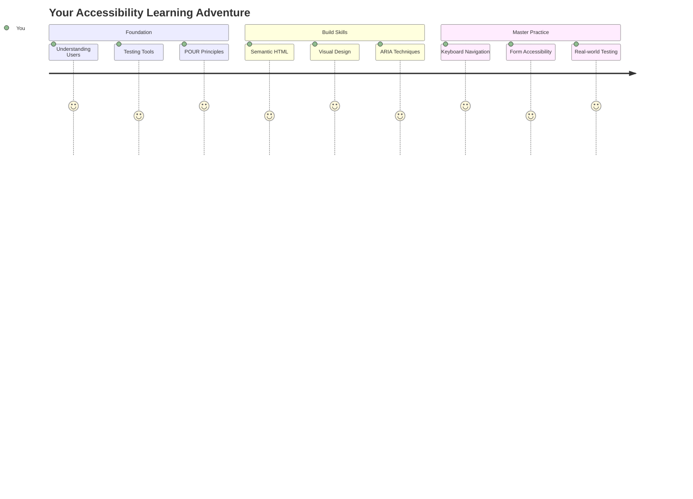

## প্রি-লেকচার কুইজ
[প্রি-লেকচার কুইজ](https://ff-quizzes.netlify.app/web/)

> ওয়েবের শক্তি এর সার্বজনীনতায়। প্রতিবন্ধকতা নির্বিশেষে সবার জন্য অ্যাক্সেস একটি গুরুত্বপূর্ণ দিক।
>
> \- স্যার টিমোথি বার্নার্স-লি, W3C ডিরেক্টর এবং ওয়ার্ল্ড ওয়াইড ওয়েবের আবিষ্কারক

এটা শুনে আপনি অবাক হতে পারেন: যখন আপনি অ্যাক্সেসযোগ্য ওয়েবসাইট তৈরি করেন, তখন আপনি শুধু প্রতিবন্ধী ব্যক্তিদের সাহায্য করছেন না—আপনি আসলে সবার জন্য ওয়েবকে আরও ভালো করছেন!

আপনি কি কখনও রাস্তার কোণে থাকা কার্ব কাট লক্ষ্য করেছেন? এগুলো মূলত হুইলচেয়ারের জন্য ডিজাইন করা হয়েছিল, কিন্তু এখন এগুলো স্ট্রোলার ব্যবহারকারী, ডেলিভারি কর্মী, ট্রাভেলারদের রোলিং লাগেজ এবং সাইক্লিস্টদেরও সাহায্য করে। ঠিক এভাবেই অ্যাক্সেসযোগ্য ওয়েব ডিজাইন কাজ করে—একটি গ্রুপের জন্য তৈরি সমাধান প্রায়ই সবার জন্য উপকারী হয়ে ওঠে। বেশ চমৎকার, তাই না?

এই পাঠে, আমরা কীভাবে এমন ওয়েবসাইট তৈরি করা যায় যা সত্যিই সবার জন্য কাজ করে, তা অন্বেষণ করব। আপনি ওয়েব স্ট্যান্ডার্ডে ইতিমধ্যে অন্তর্ভুক্ত ব্যবহারিক কৌশলগুলি আবিষ্কার করবেন, টেস্টিং টুলগুলির সাথে হাতে-কলমে কাজ করবেন এবং দেখবেন কীভাবে অ্যাক্সেসিবিলিটি আপনার সাইটগুলিকে সব ব্যবহারকারীর জন্য আরও ব্যবহারযোগ্য করে তোলে।

এই পাঠ শেষে, আপনি আপনার ডেভেলপমেন্ট ওয়ার্কফ্লোতে অ্যাক্সেসিবিলিটিকে স্বাভাবিকভাবে অন্তর্ভুক্ত করার আত্মবিশ্বাস অর্জন করবেন। চিন্তাশীল ডিজাইন পছন্দগুলি কীভাবে কোটি কোটি ব্যবহারকারীর জন্য ওয়েব খুলে দিতে পারে তা অন্বেষণ করতে প্রস্তুত? চলুন শুরু করি!

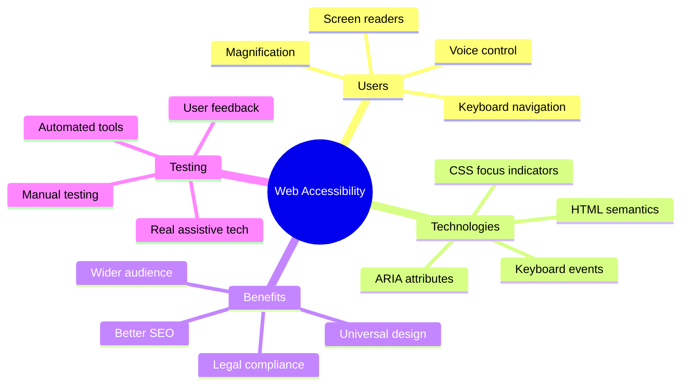

> আপনি এই পাঠটি [Microsoft Learn](https://docs.microsoft.com/learn/modules/web-development-101/accessibility/?WT.mc_id=academic-77807-sagibbon) এ নিতে পারেন!

## সহায়ক প্রযুক্তি বোঝা

কোডিং শুরু করার আগে, আসুন এক মুহূর্ত সময় নিয়ে বুঝি কীভাবে বিভিন্ন ক্ষমতার মানুষরা বাস্তবে ওয়েব অভিজ্ঞতা অর্জন করেন। এটি শুধু তত্ত্ব নয়—এই বাস্তব-জগতের নেভিগেশন প্যাটার্নগুলি বোঝা আপনাকে আরও ভালো ডেভেলপার করে তুলবে!

সহায়ক প্রযুক্তিগুলি বেশ চমৎকার সরঞ্জাম যা প্রতিবন্ধী ব্যক্তিদের ওয়েবসাইটের সাথে এমনভাবে যোগাযোগ করতে সাহায্য করে যা আপনাকে অবাক করতে পারে। একবার আপনি এই প্রযুক্তিগুলি কীভাবে কাজ করে তা বুঝতে পারলে, অ্যাক্সেসযোগ্য ওয়েব অভিজ্ঞতা তৈরি করা অনেক বেশি স্বাভাবিক হয়ে ওঠে। এটি এমন যেন আপনি আপনার কোডকে অন্য কারও চোখ দিয়ে দেখতে শিখছেন।

### স্ক্রিন রিডার

[স্ক্রিন রিডার](https://en.wikipedia.org/wiki/Screen_reader) হল বেশ উন্নত প্রযুক্তি যা ডিজিটাল টেক্সটকে বক্তৃতা বা ব্রেইল আউটপুটে রূপান্তর করে। যদিও এগুলি মূলত দৃষ্টিহীন ব্যক্তিদের দ্বারা ব্যবহৃত হয়, তবে এগুলি ডিসলেক্সিয়ার মতো শেখার প্রতিবন্ধকতা থাকা ব্যবহারকারীদের জন্যও অত্যন্ত সহায়ক।

আমি স্ক্রিন রিডারকে এমন একজন স্মার্ট বর্ণনাকারী হিসেবে ভাবতে পছন্দ করি যে আপনাকে একটি বই পড়ে শোনাচ্ছে। এটি একটি যুক্তিসঙ্গত ক্রমে বিষয়বস্তু জোরে পড়ে, "বাটন" বা "লিঙ্ক" এর মতো ইন্টারঅ্যাকটিভ উপাদান ঘোষণা করে এবং একটি পৃষ্ঠায় ঘোরার জন্য কীবোর্ড শর্টকাট প্রদান করে। কিন্তু বিষয়টি হল—স্ক্রিন রিডার শুধুমাত্র তখনই তাদের কাজ করতে পারে যদি আমরা সঠিক কাঠামো এবং অর্থপূর্ণ বিষয়বস্তু দিয়ে ওয়েবসাইট তৈরি করি। এখানেই আপনি একজন ডেভেলপার হিসেবে ভূমিকা রাখেন!

**প্ল্যাটফর্ম জুড়ে জনপ্রিয় স্ক্রিন রিডার:**
- **Windows**: [NVDA](https://www.nvaccess.org/about-nvda/) (বিনামূল্যে এবং সবচেয়ে জনপ্রিয়), [JAWS](https://webaim.org/articles/jaws/), [Narrator](https://support.microsoft.com/windows/complete-guide-to-narrator-e4397a0d-ef4f-b386-d8ae-c172f109bdb1/?WT.mc_id=academic-77807-sagibbon) (বিল্ট-ইন)
- **macOS/iOS**: [VoiceOver](https://support.apple.com/guide/voiceover/welcome/10) (বিল্ট-ইন এবং খুব সক্ষম)
- **Android**: [TalkBack](https://support.google.com/accessibility/android/answer/6283677) (বিল্ট-ইন)
- **Linux**: [Orca](https://wiki.gnome.org/Projects/Orca) (বিনামূল্যে এবং ওপেন-সোর্স)

**স্ক্রিন রিডার কীভাবে ওয়েব বিষয়বস্তু নেভিগেট করে:**

স্ক্রিন রিডার দক্ষ ব্যবহারকারীদের জন্য ব্রাউজিংকে কার্যকরী করে তুলতে একাধিক নেভিগেশন পদ্ধতি প্রদান করে:
- **ক্রমিক পড়া**: বিষয়বস্তু উপরে থেকে নিচে পড়ে, বইয়ের মতো
- **ল্যান্ডমার্ক নেভিগেশন**: পৃষ্ঠার বিভাগগুলির মধ্যে লাফানো (হেডার, ন্যাভ, মেইন, ফুটার)
- **হেডিং নেভিগেশন**: হেডিংগুলির মধ্যে লাফিয়ে পৃষ্ঠার কাঠামো বোঝা
- **লিঙ্ক তালিকা**: দ্রুত অ্যাক্সেসের জন্য সমস্ত লিঙ্কের একটি তালিকা তৈরি করা
- **ফর্ম কন্ট্রোল**: ইনপুট ক্ষেত্র এবং বাটনের মধ্যে সরাসরি নেভিগেট করা

> 💡 **এটি আমাকে অবাক করেছে**: 68% স্ক্রিন রিডার ব্যবহারকারী প্রধানত হেডিং দ্বারা নেভিগেট করেন ([WebAIM Survey](https://webaim.org/projects/screenreadersurvey9/#finding))। এর মানে আপনার হেডিং কাঠামো ব্যবহারকারীদের জন্য একটি রোডম্যাপের মতো—যখন আপনি এটি সঠিকভাবে করেন, আপনি সত্যিই মানুষকে আপনার বিষয়বস্তু দ্রুত খুঁজে পেতে সাহায্য করছেন!

### আপনার টেস্টিং ওয়ার্কফ্লো তৈরি করা

এখানে একটি ভালো খবর—কার্যকর অ্যাক্সেসিবিলিটি টেস্টিংকে অপ্রতিরোধ্য হতে হবে না! আপনি স্বয়ংক্রিয় টুলগুলিকে (এগুলি স্পষ্ট সমস্যাগুলি ধরতে দুর্দান্ত) কিছু হাতে-কলমে টেস্টিংয়ের সাথে একত্রিত করতে চাইবেন। এখানে একটি পদ্ধতিগত পদ্ধতি রয়েছে যা আমি পেয়েছি সবচেয়ে বেশি সমস্যা ধরে, আপনার পুরো দিন নষ্ট না করেই:

**প্রয়োজনীয় ম্যানুয়াল টেস্টিং ওয়ার্কফ্লো:**

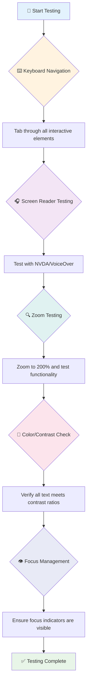

**ধাপে ধাপে টেস্টিং চেকলিস্ট:**
1. **কীবোর্ড নেভিগেশন**: শুধুমাত্র Tab, Shift+Tab, Enter, Space এবং Arrow কী ব্যবহার করুন
2. **স্ক্রিন রিডার টেস্টিং**: NVDA, VoiceOver বা Narrator চালু করুন এবং চোখ বন্ধ করে নেভিগেট করুন
3. **জুম টেস্টিং**: 200% এবং 400% জুম লেভেলে পরীক্ষা করুন
4. **কালার কনট্রাস্ট যাচাই**: সমস্ত টেক্সট এবং UI উপাদান পরীক্ষা করুন
5. **ফোকাস ইন্ডিকেটর টেস্টিং**: নিশ্চিত করুন যে সমস্ত ইন্টারঅ্যাকটিভ উপাদান দৃশ্যমান ফোকাস স্টেট রয়েছে

✅ **Lighthouse দিয়ে শুরু করুন**: আপনার ব্রাউজারের DevTools খুলুন, একটি Lighthouse অ্যাক্সেসিবিলিটি অডিট চালান, তারপর আপনার ম্যানুয়াল টেস্টিং ফোকাস এলাকাগুলিকে গাইড করতে ফলাফলগুলি ব্যবহার করুন।

### জুম এবং ম্যাগনিফিকেশন টুল

আপনি কি কখনও আপনার ফোনে টেক্সট ছোট হলে জুম করতে পিঞ্চ করেন, বা উজ্জ্বল সূর্যের আলোতে আপনার ল্যাপটপ স্ক্রিনে চোখ কুঁচকান? অনেক ব্যবহারকারী প্রতিদিন বিষয়বস্তু পড়ার যোগ্য করতে ম্যাগনিফিকেশন টুলের উপর নির্ভর করেন। এর মধ্যে রয়েছে কম দৃষ্টিশক্তি সম্পন্ন ব্যক্তি, বয়স্ক প্রাপ্তবয়স্ক এবং যে কেউ কখনও বাইরে একটি ওয়েবসাইট পড়ার চেষ্টা করেছেন।

আধুনিক জুম প্রযুক্তি শুধু জিনিস বড় করার চেয়ে বেশি উন্নত হয়েছে। এই টুলগুলি কীভাবে কাজ করে তা বোঝা আপনাকে প্রতিক্রিয়াশীল ডিজাইন তৈরি করতে সাহায্য করবে যা যেকোনো ম্যাগনিফিকেশন লেভেলে কার্যকরী এবং আকর্ষণীয় থাকে।

**আধুনিক ব্রাউজার জুম সক্ষমতা:**
- **পৃষ্ঠার জুম**: সমস্ত বিষয়বস্তু অনুপাতিকভাবে স্কেল করে (টেক্সট, ইমেজ, লেআউট) - এটি পছন্দনীয় পদ্ধতি
- **শুধুমাত্র টেক্সট জুম**: মূল লেআউট বজায় রেখে ফন্ট সাইজ বাড়ায়
- **পিঞ্চ-টু-জুম**: অস্থায়ী ম্যাগনিফিকেশনের জন্য মোবাইল জেসচার সাপোর্ট
- **ব্রাউজার সাপোর্ট**: সমস্ত আধুনিক ব্রাউজার কার্যকারিতা ভেঙে না দিয়ে 500% পর্যন্ত জুম সাপোর্ট করে

**বিশেষায়িত ম্যাগনিফিকেশন সফটওয়্যার:**
- **Windows**: [Magnifier](https://support.microsoft.com/windows/use-magnifier-to-make-things-on-the-screen-easier-to-see-414948ba-8b1c-d3bd-8615-0e5e32204198) (বিল্ট-ইন), [ZoomText](https://www.freedomscientific.com/training/zoomtext/getting-started/)
- **macOS/iOS**: [Zoom](https://www.apple.com/accessibility/mac/vision/) (বিল্ট-ইন উন্নত বৈশিষ্ট্য সহ)

> ⚠️ **ডিজাইন বিবেচনা**: WCAG প্রয়োজন যে বিষয়বস্তু 200% জুম করা হলে কার্যকরী থাকে। এই স্তরে, অনুভূমিক স্ক্রলিং ন্যূনতম হওয়া উচিত এবং সমস্ত ইন্টারঅ্যাকটিভ উপাদান অ্যাক্সেসযোগ্য থাকা উচিত।

✅ **আপনার প্রতিক্রিয়াশীল ডিজাইন পরীক্ষা করুন**: আপনার ব্রাউজারকে 200% এবং 400% জুম করুন। আপনার লেআউট কি সুন্দরভাবে মানিয়ে যায়? আপনি কি অতিরিক্ত স্ক্রলিং ছাড়াই সমস্ত কার্যকারিতা অ্যাক্সেস করতে পারেন?

## আধুনিক অ্যাক্সেসিবিলিটি টেস্টিং টুল

এখন আপনি বুঝতে পেরেছেন কীভাবে মানুষ সহায়ক প্রযুক্তি ব্যবহার করে ওয়েব নেভিগেট করে, আসুন সেই টুলগুলি অন্বেষণ করি যা আপনাকে অ্যাক্সেসযোগ্য ওয়েবসাইট তৈরি এবং পরীক্ষা করতে সাহায্য করে।

এটি এমনভাবে ভাবুন: স্বয়ংক্রিয় টুলগুলি স্পষ্ট সমস্যাগুলি ধরতে দুর্দান্ত (যেমন মিসিং alt টেক্সট), যখন হাতে-কলমে টেস্টিং আপনাকে নিশ্চিত করতে সাহায্য করে যে আপনার সাইট বাস্তব জগতে ব্যবহার করতে ভালো লাগে। একসাথে, তারা আপনাকে আত্মবিশ্বাস দেয় যে আপনার সাইটগুলি সবার জন্য কাজ করে।

### কালার কনট্রাস্ট টেস্টিং

এখানে একটি ভালো খবর: কালার কনট্রাস্ট সবচেয়ে সাধারণ অ্যাক্সেসিবিলিটি সমস্যাগুলির মধ্যে একটি, তবে এটি ঠিক করাও সবচেয়ে সহজ। ভালো কনট্রাস্ট সবার জন্য উপকারী—দৃষ্টিশক্তি প্রতিবন্ধী ব্যবহারকারীদের থেকে শুরু করে যারা সৈকতে তাদের ফোন পড়ার চেষ্টা করছেন।

**WCAG কনট্রাস্ট প্রয়োজনীয়তা:**

| টেক্সট টাইপ | WCAG AA (ন্যূনতম) | WCAG AAA (উন্নত) |
|-----------|-------------------|---------------------|
| **সাধারণ টেক্সট** (১৮pt এর নিচে) | 4.5:1 কনট্রাস্ট রেশিও | 7:1 কনট্রাস্ট রেশিও |
| **বড় টেক্সট** (১৮pt+ বা ১৪pt+ বোল্ড) | 3:1 কনট্রাস্ট রেশিও | 4.5:1 কনট্রাস্ট রেশিও |
| **UI উপাদান** (বাটন, ফর্ম বর্ডার) | 3:1 কনট্রাস্ট রেশিও | 3:1 কনট্রাস্ট রেশিও |

**প্রয়োজনীয় টেস্টিং টুল:**
- [Colour Contrast Analyser](https://www.tpgi.com/color-contrast-checker/) - কালার পিকার সহ ডেস্কটপ অ্যাপ
- [WebAIM Contrast Checker](https://webaim.org/resources/contrastchecker/) - ওয়েব-ভিত্তিক তাৎক্ষণিক প্রতিক্রিয়া সহ
- [Stark](https://www.getstark.co/) - Figma, Sketch, Adobe XD এর জন্য ডিজাইন টুল প্লাগইন
- [Accessible Colors](https://accessible-colors.com/) - অ্যাক্সেসযোগ্য কালার প্যালেট খুঁজুন

✅ **উন্নত কালার প্যালেট তৈরি করুন**: আপনার ব্র্যান্ড কালার দিয়ে শুরু করুন এবং অ্যাক্সেসযোগ্য বৈচ
- **বিভিন্ন ব্রাউজার, ডিভাইস এবং সহায়ক সরঞ্জামগুলিতে পরীক্ষা করুন**
- **কন্টেন্ট এমনভাবে গঠন করুন যাতে উন্নত বৈশিষ্ট্যগুলি সমর্থন না করলেও তা সঠিকভাবে কাজ করে**

### 🎯 **POUR নীতিমালা পরীক্ষা: এটি মনে রাখুন**

**মৌলিক বিষয়গুলোর উপর দ্রুত চিন্তাভাবনা:**
- এমন একটি ওয়েবসাইট বৈশিষ্ট্যের কথা ভাবুন যা প্রতিটি POUR নীতিমালায় ব্যর্থ হয়?
- কোন নীতিমালা আপনার কাছে একজন ডেভেলপার হিসেবে সবচেয়ে স্বাভাবিক মনে হয়?
- কীভাবে এই নীতিমালাগুলি শুধুমাত্র প্রতিবন্ধী ব্যবহারকারীদের জন্য নয়, বরং সবার জন্য ডিজাইন উন্নত করতে পারে?

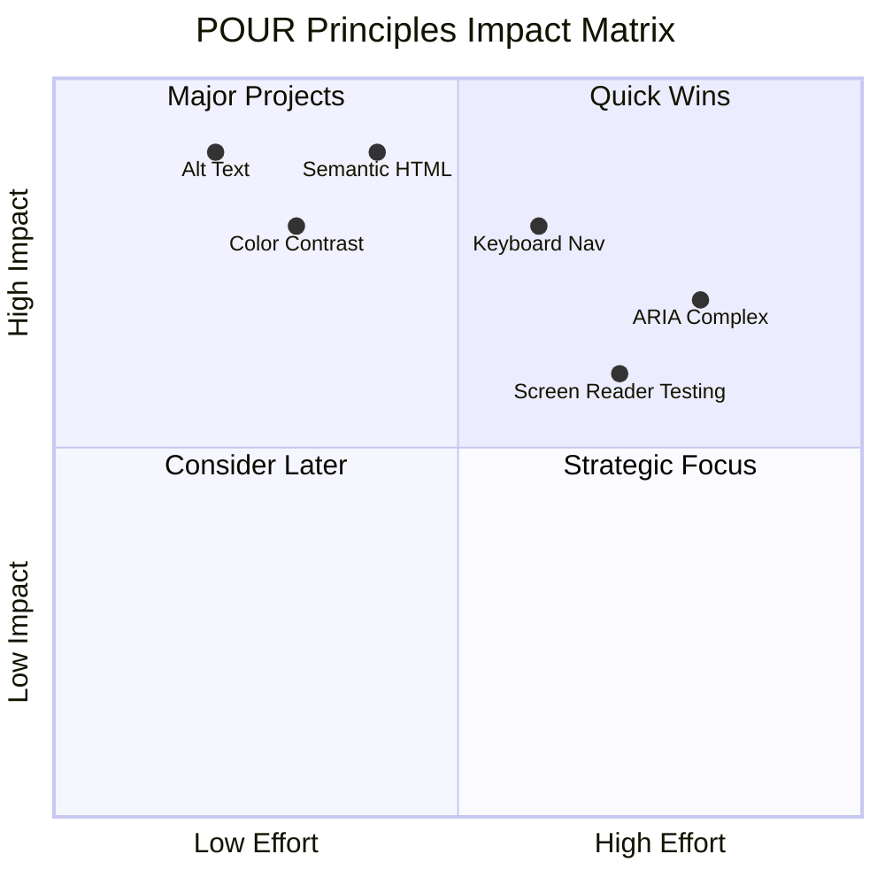

> **মনে রাখুন**: উচ্চ-প্রভাব, কম-প্রচেষ্টা উন্নতির সাথে শুরু করুন। সেমান্টিক HTML এবং alt টেক্সট আপনাকে সবচেয়ে কম প্রচেষ্টায় সর্বাধিক অ্যাক্সেসিবিলিটি উন্নতি প্রদান করে!

## অ্যাক্সেসযোগ্য ভিজ্যুয়াল ডিজাইন তৈরি করা

ভালো ভিজ্যুয়াল ডিজাইন এবং অ্যাক্সেসিবিলিটি একসাথে চলে। যখন আপনি অ্যাক্সেসিবিলিটির কথা মাথায় রেখে ডিজাইন করেন, তখন আপনি দেখতে পাবেন যে এই সীমাবদ্ধতাগুলি পরিষ্কার, আরও সুন্দর সমাধান তৈরি করে যা সকল ব্যবহারকারীর জন্য উপকারী।

চলুন আমরা কীভাবে সবার জন্য কাজ করে এমন ভিজ্যুয়াল ডিজাইন তৈরি করতে পারি তা অন্বেষণ করি, তাদের ভিজ্যুয়াল ক্ষমতা বা আপনার কন্টেন্ট দেখার শর্ত যাই হোক না কেন।

### রঙ এবং ভিজ্যুয়াল অ্যাক্সেসিবিলিটি কৌশল

রঙ যোগাযোগের জন্য শক্তিশালী, তবে এটি কখনোই গুরুত্বপূর্ণ তথ্য প্রকাশের একমাত্র উপায় হওয়া উচিত নয়। রঙের বাইরে ডিজাইন করা আরও শক্তিশালী, অন্তর্ভুক্তিমূলক অভিজ্ঞতা তৈরি করে যা আরও বেশি পরিস্থিতিতে কাজ করে।

**রঙের ভিশন পার্থক্যের জন্য ডিজাইন করুন:**

প্রায় ৮% পুরুষ এবং ০.৫% নারী কিছু ধরনের রঙের ভিশন পার্থক্য (প্রায়ই "রঙের অন্ধত্ব" বলা হয়) নিয়ে থাকে। সবচেয়ে সাধারণ প্রকারগুলি হল:
- **Deuteranopia**: লাল এবং সবুজ পার্থক্য করতে অসুবিধা
- **Protanopia**: লাল আরও ম্লান দেখায়
- **Tritanopia**: নীল এবং হলুদ পার্থক্য করতে অসুবিধা (বিরল)

**অন্তর্ভুক্তিমূলক রঙের কৌশল:**

```css
/* ❌ Bad: Using only color to indicate status */
.error { color: red; }
.success { color: green; }

/* ✅ Good: Color plus icons and context */
.error {
  color: #d32f2f;
  border-left: 4px solid #d32f2f;
}
.error::before {
  content: "⚠️";
  margin-right: 8px;
}

.success {
  color: #2e7d32;
  border-left: 4px solid #2e7d32;
}
.success::before {
  content: "✅";
  margin-right: 8px;
}
```

**মৌলিক কনট্রাস্ট প্রয়োজনীয়তার বাইরে:**
- রঙের পছন্দগুলি রঙের অন্ধত্ব সিমুলেটর দিয়ে পরীক্ষা করুন
- রঙ কোডিংয়ের পাশাপাশি প্যাটার্ন, টেক্সচার বা আকৃতি ব্যবহার করুন
- ইন্টারঅ্যাকটিভ স্টেটগুলি রঙ ছাড়াই পার্থক্যযোগ্য রাখুন
- উচ্চ কনট্রাস্ট মোডে আপনার ডিজাইন কেমন দেখায় তা বিবেচনা করুন

✅ **আপনার রঙের অ্যাক্সেসিবিলিটি পরীক্ষা করুন**: [Coblis](https://www.color-blindness.com/coblis-color-blindness-simulator/) এর মতো টুল ব্যবহার করে দেখুন আপনার সাইট বিভিন্ন রঙের ভিশন পার্থক্য সহ ব্যবহারকারীদের কাছে কেমন দেখায়।

### ফোকাস ইন্ডিকেটর এবং ইন্টারঅ্যাকশন ডিজাইন

ফোকাস ইন্ডিকেটর হল ডিজিটাল কার্সারের সমতুল্য—এটি কীবোর্ড ব্যবহারকারীদের পৃষ্ঠায় কোথায় আছে তা দেখায়। ভালোভাবে ডিজাইন করা ফোকাস ইন্ডিকেটর সবার জন্য অভিজ্ঞতা উন্নত করে, ইন্টারঅ্যাকশনগুলোকে পরিষ্কার এবং পূর্বানুমানযোগ্য করে তোলে।

**আধুনিক ফোকাস ইন্ডিকেটর সেরা অনুশীলন:**

```css
/* Enhanced focus styles that work across browsers */
button:focus-visible {
  outline: 2px solid #0066cc;
  outline-offset: 2px;
  box-shadow: 0 0 0 4px rgba(0, 102, 204, 0.25);
}

/* Remove focus outline for mouse users, preserve for keyboard users */
button:focus:not(:focus-visible) {
  outline: none;
}

/* Focus-within for complex components */
.card:focus-within {
  box-shadow: 0 0 0 3px rgba(74, 144, 164, 0.5);
  border-color: #4A90A4;
}

/* Ensure focus indicators meet contrast requirements */
.custom-focus:focus-visible {
  outline: 3px solid #ffffff;
  outline-offset: 2px;
  box-shadow: 0 0 0 6px #000000;
}
```

**ফোকাস ইন্ডিকেটরের প্রয়োজনীয়তা:**
- **দৃশ্যমানতা**: আশেপাশের উপাদানগুলির সাথে কমপক্ষে ৩:১ কনট্রাস্ট রেশিও থাকতে হবে
- **প্রস্থ**: পুরো উপাদানের চারপাশে কমপক্ষে ২px পুরুত্ব থাকতে হবে
- **স্থিতিশীলতা**: ফোকাস অন্য কোথাও না যাওয়া পর্যন্ত দৃশ্যমান থাকা উচিত
- **পার্থক্য**: অন্যান্য UI স্টেট থেকে দৃশ্যত আলাদা হতে হবে

> 💡 **ডিজাইন টিপ**: দুর্দান্ত ফোকাস ইন্ডিকেটর সাধারণত আউটলাইন, বক্স-শ্যাডো এবং রঙ পরিবর্তনের সংমিশ্রণ ব্যবহার করে বিভিন্ন ব্যাকগ্রাউন্ড এবং প্রসঙ্গে দৃশ্যমানতা নিশ্চিত করে।

✅ **ফোকাস ইন্ডিকেটর অডিট করুন**: আপনার ওয়েবসাইটে ট্যাব করে দেখুন কোন উপাদানগুলির পরিষ্কার ফোকাস ইন্ডিকেটর আছে। কোনটি দেখতে কঠিন বা সম্পূর্ণ অনুপস্থিত কিনা তা লক্ষ্য করুন।

### সেমান্টিক HTML: অ্যাক্সেসিবিলিটির ভিত্তি

সেমান্টিক HTML হল আপনার ওয়েবসাইটের জন্য সহায়ক প্রযুক্তিগুলির একটি GPS সিস্টেম দেওয়ার মতো। যখন আপনি সঠিক HTML উপাদানগুলি তাদের উদ্দেশ্য অনুযায়ী ব্যবহার করেন, তখন আপনি স্ক্রিন রিডার, কীবোর্ড এবং অন্যান্য সরঞ্জামগুলিকে একটি বিস্তারিত রোডম্যাপ প্রদান করেন যা ব্যবহারকারীদের কার্যকরভাবে নেভিগেট করতে সাহায্য করে।

এটি একটি উদাহরণ যা আমার কাছে সত্যিই স্পষ্ট ছিল: সেমান্টিক HTML হল একটি ভালোভাবে সংগঠিত লাইব্রেরি যেখানে স্পষ্ট বিভাগ এবং সহায়ক চিহ্ন রয়েছে বনাম একটি গুদাম যেখানে বইগুলি এলোমেলোভাবে ছড়িয়ে আছে। উভয় জায়গায় একই বই আছে, কিন্তু কোনটিতে আপনি কিছু খুঁজে পেতে চাইবেন? ঠিক তাই!

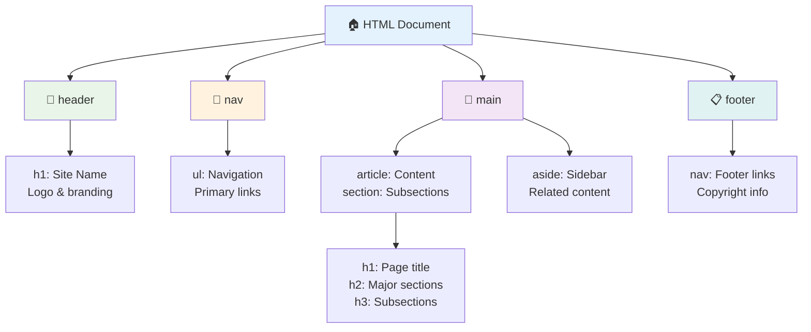

**অ্যাক্সেসযোগ্য পৃষ্ঠার গঠন তৈরির ভিত্তি:**

```html
<!-- Landmark elements provide page navigation structure -->
<header>
  <h1>Your Site Name</h1>
  <nav aria-label="Main navigation">
    <ul>
      <li><a href="/home">Home</a></li>
      <li><a href="/about">About</a></li>
      <li><a href="/services">Services</a></li>
    </ul>
  </nav>
</header>

<main>
  <article>
    <header>
      <h1>Article Title</h1>
      <p>Published on <time datetime="2024-10-14">October 14, 2024</time></p>
    </header>
    
    <section>
      <h2>First Section</h2>
      <p>Content that relates to this section...</p>
    </section>
    
    <section>
      <h2>Second Section</h2>
      <p>More related content...</p>
    </section>
  </article>
  
  <aside>
    <h2>Related Links</h2>
    <nav aria-label="Related articles">
      <ul>
        <li><a href="/related-1">First related article</a></li>
        <li><a href="/related-2">Second related article</a></li>
      </ul>
    </nav>
  </aside>
</main>

<footer>
  <p>&copy; 2024 Your Site Name. All rights reserved.</p>
  <nav aria-label="Footer links">
    <ul>
      <li><a href="/privacy">Privacy Policy</a></li>
      <li><a href="/contact">Contact Us</a></li>
    </ul>
  </nav>
</footer>
```

**কেন সেমান্টিক HTML অ্যাক্সেসিবিলিটি রূপান্তর করে:**

| সেমান্টিক উপাদান | উদ্দেশ্য | স্ক্রিন রিডার সুবিধা |
|------------------|---------|----------------------|
| `<header>` | পৃষ্ঠা বা বিভাগ শিরোনাম | "Banner landmark" - শীর্ষে দ্রুত নেভিগেশন |
| `<nav>` | নেভিগেশন লিঙ্ক | "Navigation landmark" - নেভ সেকশনগুলির তালিকা |
| `<main>` | প্রধান পৃষ্ঠার কন্টেন্ট | "Main landmark" - সরাসরি কন্টেন্টে স্কিপ |
| `<article>` | স্বতন্ত্র কন্টেন্ট | আর্টিকেল সীমা ঘোষণা করে |
| `<section>` | থিমযুক্ত কন্টেন্ট গ্রুপ | কন্টেন্ট গঠন প্রদান করে |
| `<aside>` | সম্পর্কিত সাইডবার কন্টেন্ট | "Complementary landmark" |
| `<footer>` | পৃষ্ঠা বা বিভাগ ফুটার | "Contentinfo landmark" |

**স্ক্রিন রিডার সুপারপাওয়ার সেমান্টিক HTML দিয়ে:**
- **ল্যান্ডমার্ক নেভিগেশন**: প্রধান পৃষ্ঠার সেকশনগুলির মধ্যে দ্রুত নেভিগেশন
- **হেডিং আউটলাইন**: আপনার হেডিং গঠন থেকে একটি টেবিল অফ কন্টেন্ট তৈরি করে
- **উপাদান তালিকা**: সমস্ত লিঙ্ক, বাটন বা ফর্ম কন্ট্রোলের তালিকা তৈরি করে
- **প্রসঙ্গ সচেতনতা**: কন্টেন্ট সেকশনগুলির মধ্যে সম্পর্ক বুঝতে পারে

> 🎯 **দ্রুত পরীক্ষা**: ল্যান্ডমার্ক শর্টকাট (NVDA/JAWS-এ D ল্যান্ডমার্কের জন্য, H হেডিংয়ের জন্য, K লিঙ্কের জন্য) ব্যবহার করে স্ক্রিন রিডার দিয়ে আপনার সাইট নেভিগেট করার চেষ্টা করুন। নেভিগেশনটি কি অর্থপূর্ণ?

### 🏗️ **সেমান্টিক HTML দক্ষতা পরীক্ষা: শক্ত ভিত্তি তৈরি করা**

**আপনার সেমান্টিক বোঝার মূল্যায়ন করি:**
- HTML দেখে আপনি কি একটি ওয়েবপৃষ্ঠার ল্যান্ডমার্ক চিহ্নিত করতে পারেন?
- আপনি কীভাবে `<section>` এবং `<div>` এর পার্থক্য একজন বন্ধুকে ব্যাখ্যা করবেন?
- স্ক্রিন রিডার ব্যবহারকারী নেভিগেশন সমস্যার রিপোর্ট করলে আপনি প্রথমে কী পরীক্ষা করবেন?

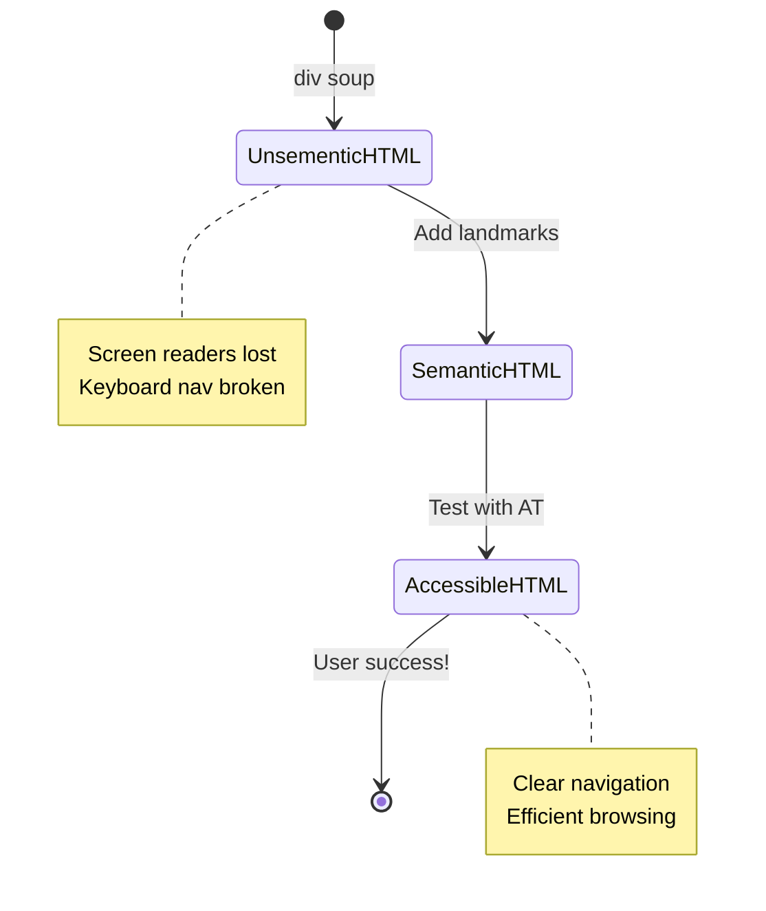

> **প্রো অন্তর্দৃষ্টি**: ভালো সেমান্টিক HTML স্বয়ংক্রিয়ভাবে প্রায় ৭০% অ্যাক্সেসিবিলিটি সমস্যার সমাধান করে। এই ভিত্তি দক্ষ করুন এবং আপনি সঠিক পথে আছেন!

✅ **আপনার সেমান্টিক গঠন অডিট করুন**: আপনার ব্রাউজারের DevTools এর অ্যাক্সেসিবিলিটি প্যানেল ব্যবহার করে অ্যাক্সেসিবিলিটি ট্রি দেখুন এবং নিশ্চিত করুন যে আপনার মার্কআপ একটি যৌক্তিক গঠন তৈরি করে।

### হেডিং হায়ারার্কি: একটি যৌক্তিক কন্টেন্ট আউটলাইন তৈরি করা

হেডিংগুলি অ্যাক্সেসযোগ্য কন্টেন্টের জন্য অত্যন্ত গুরুত্বপূর্ণ—এগুলি সবকিছু একসাথে ধরে রাখার মেরুদণ্ডের মতো। স্ক্রিন রিডার ব্যবহারকারীরা আপনার কন্টেন্ট বুঝতে এবং নেভিগেট করতে হেডিংগুলির উপর ব্যাপকভাবে নির্ভর করে। এটি আপনার পৃষ্ঠার জন্য একটি টেবিল অফ কন্টেন্ট প্রদান করার মতো।

**হেডিংগুলির জন্য সোনার নিয়ম:**
কখনোই স্তরগুলি এড়িয়ে যাবেন না। সবসময় `<h1>` থেকে `<h2>` থেকে `<h3>` পর্যন্ত যৌক্তিকভাবে অগ্রসর হন। স্কুলে আউটলাইন তৈরি করার কথা মনে আছে? এটি ঠিক একই নীতি—আপনি "I. প্রধান পয়েন্ট" থেকে সরাসরি "C. সাব-সাব-পয়েন্ট" এ যেতে চাইবেন না যদি "A. সাব-পয়েন্ট" না থাকে, তাই না?

**পারফেক্ট হেডিং গঠন উদাহরণ:**

```html
<!-- ✅ Excellent: Logical, hierarchical progression -->
<main>
  <h1>Complete Guide to Web Accessibility</h1>
  
  <section>
    <h2>Understanding Screen Readers</h2>
    <p>Introduction to screen reader technology...</p>
    
    <h3>Popular Screen Reader Software</h3>
    <p>NVDA, JAWS, and VoiceOver comparison...</p>
    
    <h3>Testing with Screen Readers</h3>
    <p>Step-by-step testing instructions...</p>
  </section>
  
  <section>
    <h2>Color and Contrast Guidelines</h2>
    <p>Designing with sufficient contrast...</p>
    
    <h3>WCAG Contrast Requirements</h3>
    <p>Understanding the different contrast levels...</p>
    
    <h3>Testing Tools and Techniques</h3>
    <p>Tools for verifying contrast ratios...</p>
  </section>
</main>
```

```html
<!-- ❌ Problematic: Skipping levels, inconsistent structure -->
<h1>Page Title</h1>
<h3>Subsection</h3> <!-- Skipped h2 -->
<h2>This should come before h3</h2>
<h1>Another main heading?</h1> <!-- Multiple h1s -->
```

**হেডিং সেরা অনুশীলন:**
- **প্রতি পৃষ্ঠায় একটি `<h1>`**: সাধারণত আপনার প্রধান পৃষ্ঠার শিরোনাম বা প্রাথমিক কন্টেন্ট হেডিং
- **যৌক্তিক অগ্রগতি**: কখনোই স্তর এড়িয়ে যাবেন না (h1 → h2 → h3, h1 → h3 নয়)
- **বর্ণনামূলক কন্টেন্ট**: হেডিংগুলোকে প্রসঙ্গের বাইরে পড়লে অর্থপূর্ণ করুন
- **CSS দিয়ে ভিজ্যুয়াল স্টাইলিং**: চেহারার জন্য CSS ব্যবহার করুন, গঠনের জন্য HTML স্তর

**স্ক্রিন রিডার নেভিগেশন পরিসংখ্যান:**
- ৬৮% স্ক্রিন রিডার ব্যবহারকারী হেডিং দিয়ে নেভিগেট করেন ([WebAIM Survey](https://webaim.org/projects/screenreadersurvey9/#finding))
- ব্যবহারকারীরা একটি যৌক্তিক হেডিং আউটলাইন আশা করেন
- হেডিংগুলি পৃষ্ঠার গঠন দ্রুত বুঝতে সাহায্য করে

> 💡 **প্রো টিপ**: "HeadingsMap" এর মতো ব্রাউজার এক্সটেনশন ব্যবহার করে আপনার হেডিং গঠন ভিজ্যুয়ালাইজ করুন। এটি একটি ভালোভাবে সংগঠিত টেবিল অফ কন্টেন্টের মতো পড়া উচিত।

✅ **আপনার হেডিং গঠন পরীক্ষা করুন**: স্ক্রিন রিডারের হেডিং নেভিগেশন (NVDA-তে H কী) ব্যবহার করে আপনার হেডিংগুলির মধ্য দিয়ে যান। গঠনের অগ্রগতি কি আপনার কন্টেন্টের গল্পটি যৌক্তিকভাবে বলে?

### উন্নত ভিজ্যুয়াল অ্যাক্সেসিবিলিটি কৌশল

কনট্রাস্ট এবং রঙের মৌলিক বিষয়গুলির বাইরে, এমন উন্নত কৌশল রয়েছে যা সত্যিই অন্তর্ভুক্তিমূলক ভিজ্যুয়াল অভিজ্ঞতা তৈরি করতে সাহায্য করে। এই পদ্ধতিগুলি নিশ্চিত করে যে আপনার কন্টেন্ট বিভিন্ন দেখার শর্ত এবং সহায়ক প্রযুক্তিগুলির মধ্যে কাজ করে।

**অপরিহার্য ভিজ্যুয়াল যোগাযোগ কৌশল:**

- **মাল্টি-মোডাল ফিডব্যাক**: ভিজ্যুয়াল, টেক্সট এবং কখনো কখনো অডিও সংকেত একত্রিত করুন
- **প্রগ্রেসিভ ডিসক্লোজার**: তথ্যকে হজমযোগ্য অংশে উপস্থাপন করুন
- **সঙ্গতিপূর্ণ ইন্টারঅ্যাকশন প্যাটার্ন**: পরিচিত UI কনভেনশন ব্যবহার করুন
- **রেসপন্সিভ টাইপোগ্রাফি**: ডিভাইস জুড়ে টেক্সট যথাযথভাবে স্কেল করুন
- **লোডিং এবং ত্রুটি স্টেট**: সমস্ত ব্যবহারকারীর ক্রিয়ার জন্য পরিষ্কার ফিডব্যাক প্রদান করুন

**CSS ইউটিলিটিজ উন্নত অ্যাক্সেসিবিলিটির জন্য:**

```css
/* Screen reader only text - visually hidden but accessible */
.sr-only {
  position: absolute;
  width: 1px;
  height: 1px;
  padding: 0;
  margin: -1px;
  overflow: hidden;
  clip: rect(0, 0, 0, 0);
  white-space: nowrap;
  border: 0;
}

/* Skip link for keyboard navigation */
.skip-link {
  position: absolute;
  top: -40px;
  left: 6px;
  background: #000000;
  color: #ffffff;
  padding: 8px 16px;
  text-decoration: none;
  border-radius: 4px;
  font-weight: bold;
  transition: top 0.3s ease;
  z-index: 1000;
}

.skip-link:focus {
  top: 6px;
}

/* Reduced motion respect */
@media (prefers-reduced-motion: reduce) {
  .skip-link {
    transition: none;
  }
  
  * {
    animation-duration: 0.01ms !important;
    animation-iteration-count: 1 !important;
    transition-duration: 0.01ms !important;
  }
}

/* High contrast mode support */
@media (prefers-contrast: high) {
  .button {
    border: 2px solid;
  }
}
```

> 🎯 **অ্যাক্সেসিবিলিটি প্যাটার্ন**: "স্কিপ লিঙ্ক" কীবোর্ড ব্যবহারকারীদের জন্য অপরিহ
**ARIA-এর পাঁচটি বিভাগ:**

1. **রোলস**: এই উপাদানটি কী? (`button`, `tab`, `dialog`)
2. **প্রপার্টিজ**: এর বৈশিষ্ট্য কী? (`aria-required`, `aria-haspopup`)
3. **স্টেটস**: এর বর্তমান অবস্থা কী? (`aria-expanded`, `aria-checked`)
4. **ল্যান্ডমার্কস**: পৃষ্ঠার কাঠামোতে এটি কোথায়? (`banner`, `navigation`, `main`)
5. **লাইভ রিজিয়নস**: পরিবর্তনগুলি কীভাবে ঘোষণা করা উচিত? (`aria-live`, `aria-atomic`)

### আধুনিক ওয়েব অ্যাপের জন্য গুরুত্বপূর্ণ ARIA প্যাটার্ন

এই প্যাটার্নগুলো ইন্টারেক্টিভ ওয়েব অ্যাপ্লিকেশনের সাধারণ অ্যাক্সেসিবিলিটি সমস্যাগুলি সমাধান করে:

**উপাদানগুলির নামকরণ এবং বর্ণনা:**

```html
<!-- aria-label: Provides accessible name when visible text isn't sufficient -->
<button aria-label="Close newsletter subscription dialog">×</button>

<!-- aria-labelledby: References existing text as the accessible name -->
<section aria-labelledby="news-heading">
  <h2 id="news-heading">Latest News</h2>
  <!-- news content -->
</section>

<!-- aria-describedby: Links to additional descriptive text -->
<input type="password" 
       aria-describedby="pwd-requirements pwd-strength"
       required>
<div id="pwd-requirements">
  Password must contain at least 8 characters, including uppercase, lowercase, and numbers.
</div>
<div id="pwd-strength" aria-live="polite">
  <!-- Dynamic password strength indicator -->
</div>
```

**ডাইনামিক কন্টেন্টের জন্য লাইভ রিজিয়নস:**

```html
<!-- Polite announcements (don't interrupt current speech) -->
<div aria-live="polite" id="status-updates">
  <!-- Status messages appear here -->
</div>

<!-- Assertive announcements (interrupt and announce immediately) -->
<div aria-live="assertive" id="urgent-alerts">
  <!-- Error messages and critical alerts -->
</div>

<!-- Loading states with live regions -->
<button id="submit-btn" aria-describedby="loading-status">
  Submit Application
</button>
<div id="loading-status" aria-live="polite" aria-atomic="true">
  <!-- "Processing your application..." appears here -->
</div>
```

**ইন্টারেক্টিভ উইজেট উদাহরণ (অ্যাকর্ডিয়ন):**

```html
<div class="accordion">
  <h3>
    <button aria-expanded="false" 
            aria-controls="panel-1" 
            id="accordion-trigger-1"
            class="accordion-trigger">
      Accessibility Guidelines
    </button>
  </h3>
  <div id="panel-1" 
       role="region"
       aria-labelledby="accordion-trigger-1" 
       hidden>
    <p>WCAG 2.1 provides comprehensive guidelines...</p>
  </div>
</div>
```

```javascript
// JavaScript to manage accordion state
function toggleAccordion(trigger) {
  const panel = document.getElementById(trigger.getAttribute('aria-controls'));
  const isExpanded = trigger.getAttribute('aria-expanded') === 'true';
  
  // Toggle states
  trigger.setAttribute('aria-expanded', !isExpanded);
  panel.hidden = isExpanded;
  
  // Announce change to screen readers
  const status = document.getElementById('status-updates');
  status.textContent = isExpanded ? 'Section collapsed' : 'Section expanded';
}
```

### ARIA বাস্তবায়নের সেরা পদ্ধতি

ARIA শক্তিশালী হলেও এটি সাবধানে বাস্তবায়ন করা প্রয়োজন। এই নির্দেশিকা অনুসরণ করলে আপনার ARIA অ্যাক্সেসিবিলিটি উন্নত করবে এবং বাধা সৃষ্টি করবে না:

**🛡️ মূল নীতিমালা:**

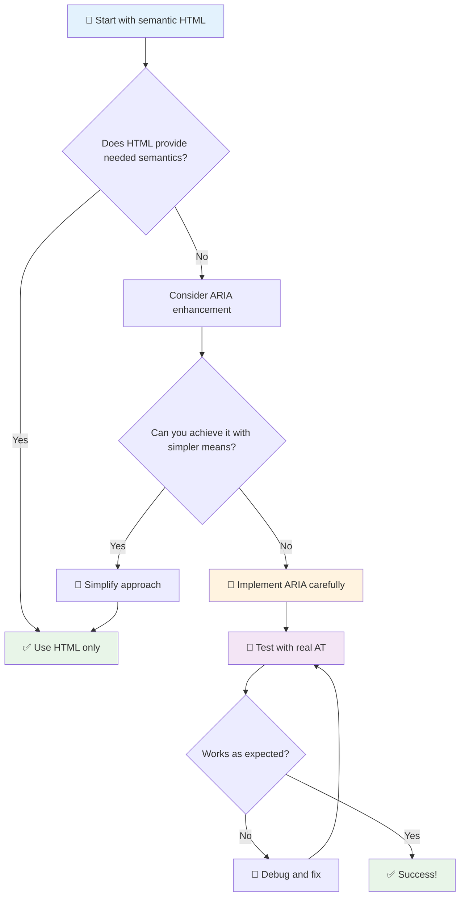

1. **প্রথমে সেমান্টিক HTML**: `<button>` কে `<div role="button">` এর চেয়ে সবসময় অগ্রাধিকার দিন
2. **সেমান্টিকস নষ্ট করবেন না**: বিদ্যমান HTML অর্থকে কখনও ওভাররাইড করবেন না (যেমন `<h1 role="button">` এড়িয়ে চলুন)
3. **কীবোর্ড অ্যাক্সেসিবিলিটি বজায় রাখুন**: সমস্ত ইন্টারেক্টিভ ARIA উপাদান সম্পূর্ণ কীবোর্ড অ্যাক্সেসযোগ্য হতে হবে
4. **বাস্তব ব্যবহারকারীদের সাথে পরীক্ষা করুন**: সহায়ক প্রযুক্তির মধ্যে ARIA সমর্থন উল্লেখযোগ্যভাবে পরিবর্তিত হয়
5. **সরলভাবে শুরু করুন**: জটিল ARIA বাস্তবায়ন ত্রুটিপূর্ণ হওয়ার সম্ভাবনা বেশি

**🔍 পরীক্ষার কর্মপ্রবাহ:**

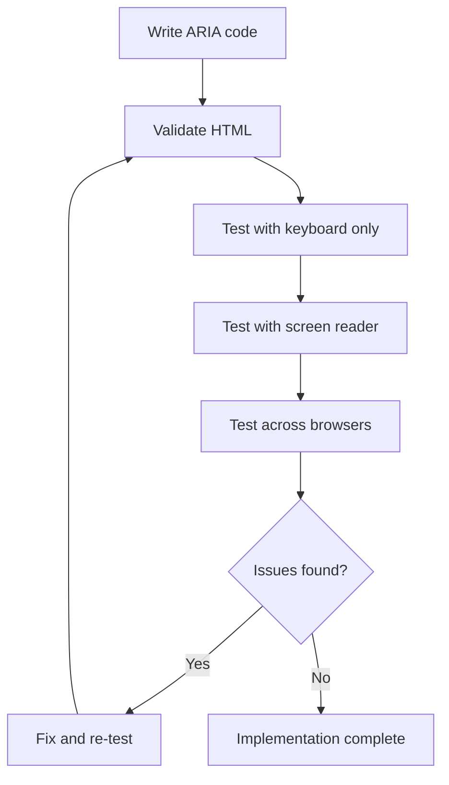

**🚫 সাধারণ ARIA ভুল এড়াতে:**

- **বিরোধপূর্ণ তথ্য**: HTML সেমান্টিকসের সাথে বিরোধ করবেন না
- **অতিরিক্ত লেবেলিং**: খুব বেশি ARIA তথ্য ব্যবহারকারীদের বিভ্রান্ত করে
- **স্ট্যাটিক ARIA**: কন্টেন্ট পরিবর্তনের সময় ARIA স্টেটস আপডেট করতে ভুলবেন না
- **অপরীক্ষিত বাস্তবায়ন**: তত্ত্বে কাজ করে এমন ARIA কিন্তু বাস্তবে ব্যর্থ
- **কীবোর্ড সমর্থনের অভাব**: ARIA রোলসের সাথে সংশ্লিষ্ট কীবোর্ড ইন্টারঅ্যাকশন না থাকা

> 💡 **পরীক্ষার সম্পদ**: [accessibility-checker](https://www.npmjs.com/package/accessibility-checker) এর মতো টুল ব্যবহার করে স্বয়ংক্রিয় ARIA যাচাইকরণ করুন, তবে সম্পূর্ণ অভিজ্ঞতার জন্য বাস্তব স্ক্রিন রিডার দিয়ে পরীক্ষা করুন।

### 🎭 **ARIA দক্ষতা পরীক্ষা: জটিল ইন্টারঅ্যাকশনগুলির জন্য প্রস্তুত?**

**আপনার ARIA আত্মবিশ্বাস পরিমাপ করুন:**
- কখন আপনি সেমান্টিক HTML এর পরিবর্তে ARIA বেছে নেবেন? (ইঙ্গিত: প্রায় কখনও নয়!)
- আপনি কি ব্যাখ্যা করতে পারেন কেন `<div role="button">` সাধারণত `<button>` এর চেয়ে খারাপ?
- ARIA পরীক্ষার বিষয়ে মনে রাখার সবচেয়ে গুরুত্বপূর্ণ বিষয় কী?

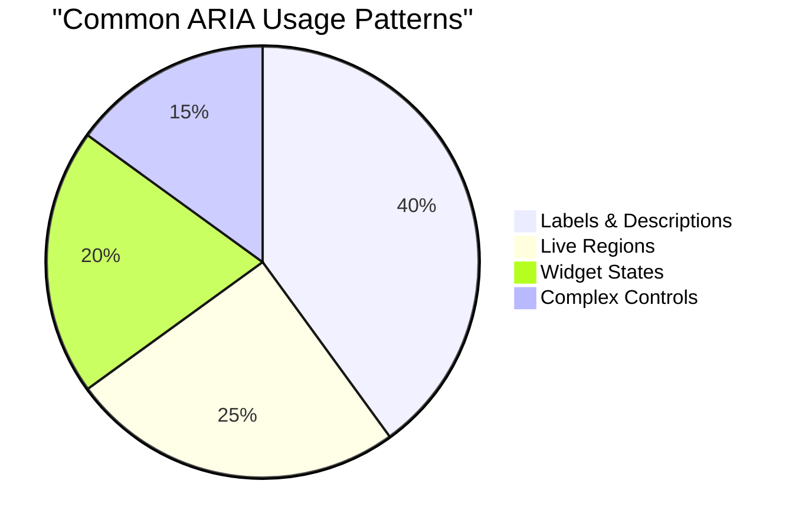

> **মূল অন্তর্দৃষ্টি**: বেশিরভাগ ARIA ব্যবহার উপাদানগুলিকে লেবেলিং এবং বর্ণনা করার জন্য। জটিল উইজেট প্যাটার্নগুলি আপনি যতটা ভাবেন তার চেয়ে অনেক কম সাধারণ!

✅ **বিশেষজ্ঞদের কাছ থেকে শিখুন**: [ARIA Authoring Practices Guide](https://w3c.github.io/aria-practices/) অধ্যয়ন করুন জটিল ইন্টারেক্টিভ উইজেটগুলির জন্য পরীক্ষিত প্যাটার্ন এবং বাস্তবায়ন।

## ছবি এবং মিডিয়া অ্যাক্সেসযোগ্য করা

ভিজ্যুয়াল এবং অডিও কন্টেন্ট আধুনিক ওয়েব অভিজ্ঞতার গুরুত্বপূর্ণ অংশ, তবে সেগুলি চিন্তাশীলভাবে বাস্তবায়িত না হলে বাধা তৈরি করতে পারে। লক্ষ্য হল আপনার মিডিয়ার তথ্য এবং আবেগগত প্রভাব প্রতিটি ব্যবহারকারীর কাছে পৌঁছানো নিশ্চিত করা। একবার আপনি এটি আয়ত্ত করলে, এটি স্বাভাবিক হয়ে যায়।

বিভিন্ন ধরণের মিডিয়ার জন্য বিভিন্ন অ্যাক্সেসিবিলিটি পদ্ধতির প্রয়োজন। এটি রান্নার মতো—আপনি একটি সূক্ষ্ম মাছকে শক্ত স্টেকের মতো আচরণ করবেন না। এই পার্থক্যগুলি বোঝা আপনাকে প্রতিটি পরিস্থিতির জন্য সঠিক সমাধান বেছে নিতে সাহায্য করে।

### কৌশলগত ছবি অ্যাক্সেসিবিলিটি

আপনার ওয়েবসাইটের প্রতিটি ছবির একটি উদ্দেশ্য রয়েছে। সেই উদ্দেশ্যটি বোঝা আপনাকে আরও ভাল বিকল্প পাঠ্য লিখতে এবং আরও অন্তর্ভুক্তিমূলক অভিজ্ঞতা তৈরি করতে সাহায্য করে।

**ছবির চারটি ধরণ এবং তাদের বিকল্প পাঠ্য কৌশল:**

**তথ্যপূর্ণ ছবি** - গুরুত্বপূর্ণ তথ্য প্রদান করে:
```html

```

**ডেকোরেটিভ ছবি** - শুধুমাত্র ভিজ্যুয়াল, কোনো তথ্যমূলক মূল্য নেই:
```html

```

**ফাংশনাল ছবি** - বোতাম বা নিয়ন্ত্রণ হিসাবে কাজ করে:
```html
<button>
  
</button>
```

**জটিল ছবি** - চার্ট, ডায়াগ্রাম, ইনফোগ্রাফিক:
```html

<div id="chart-description">
  <p>Detailed description: Sales data shows a steady increase across all quarters...</p>
</div>
```

### ভিডিও এবং অডিও অ্যাক্সেসিবিলিটি

**ভিডিওর প্রয়োজনীয়তা:**
- **ক্যাপশন**: কথিত বিষয়বস্তু এবং শব্দ প্রভাবের টেক্সট সংস্করণ
- **অডিও বিবরণ**: অন্ধ ব্যবহারকারীদের জন্য ভিজ্যুয়াল উপাদানের বর্ণনা
- **ট্রান্সক্রিপ্ট**: সমস্ত অডিও এবং ভিজ্যুয়াল বিষয়বস্তুর পূর্ণ টেক্সট সংস্করণ

```html
<video controls>
  <source src="video.mp4" type="video/mp4">
  <track kind="captions" src="captions.vtt" srclang="en" label="English">
  <track kind="descriptions" src="descriptions.vtt" srclang="en" label="Audio descriptions">
</video>
```

**অডিওর প্রয়োজনীয়তা:**
- **ট্রান্সক্রিপ্ট**: সমস্ত কথিত বিষয়বস্তুর টেক্সট সংস্করণ
- **ভিজ্যুয়াল সূচক**: শুধুমাত্র অডিও বিষয়বস্তুর জন্য, ভিজ্যুয়াল সংকেত প্রদান করুন

### আধুনিক ছবি কৌশল

**ডেকোরেটিভ ছবির জন্য CSS ব্যবহার:**
```css
.hero-section {
  background-image: url('decorative-hero.jpg');
  /* Decorative images in CSS don't need alt text */
}
```

**অ্যাক্সেসিবিলিটি সহ রেসপন্সিভ ছবি:**
```html
<picture>
  <source media="(min-width: 800px)" srcset="large-chart.png">
  <source media="(min-width: 400px)" srcset="medium-chart.png">
  
</picture>
```

✅ **ছবি অ্যাক্সেসিবিলিটি পরীক্ষা করুন**: স্ক্রিন রিডার ব্যবহার করে ছবিসহ একটি পৃষ্ঠায় নেভিগেট করুন। আপনি কি বিষয়বস্তু বুঝতে পর্যাপ্ত তথ্য পাচ্ছেন?

## কীবোর্ড নেভিগেশন এবং ফোকাস ব্যবস্থাপনা

অনেক ব্যবহারকারী সম্পূর্ণরূপে তাদের কীবোর্ড ব্যবহার করে ওয়েব ব্রাউজ করেন। এর মধ্যে রয়েছে মোটর প্রতিবন্ধী ব্যক্তিরা, পাওয়ার ব্যবহারকারীরা যারা কীবোর্ডকে মাউসের চেয়ে দ্রুত মনে করেন এবং যাদের মাউস কাজ করা বন্ধ করেছে। নিশ্চিত করুন যে আপনার সাইটটি কীবোর্ড ইনপুটের সাথে ভালভাবে কাজ করে এবং এটি প্রায়শই সবার জন্য আপনার সাইটকে আরও দক্ষ করে তোলে।

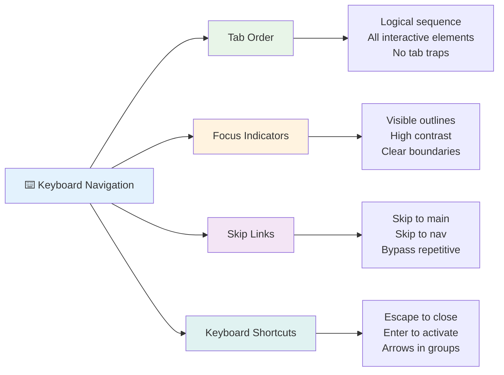

### গুরুত্বপূর্ণ কীবোর্ড নেভিগেশন প্যাটার্ন

**স্ট্যান্ডার্ড কীবোর্ড ইন্টারঅ্যাকশন:**
- **Tab**: ইন্টারেক্টিভ উপাদানগুলির মাধ্যমে ফোকাস এগিয়ে নিয়ে যান
- **Shift + Tab**: ফোকাস পিছনে নিয়ে যান
- **Enter**: বোতাম এবং লিঙ্ক সক্রিয় করুন
- **Space**: বোতাম সক্রিয় করুন, চেকবক্স চেক করুন
- **Arrow keys**: উপাদান গোষ্ঠীর মধ্যে নেভিগেট করুন (রেডিও বোতাম, মেনু)
- **Escape**: মডাল, ড্রপডাউন বন্ধ করুন বা অপারেশন বাতিল করুন

### ফোকাস ব্যবস্থাপনার সেরা পদ্ধতি

**দৃশ্যমান ফোকাস সূচক:**
```css
/* Ensure focus is always visible */
button:focus-visible {
  outline: 2px solid #4A90A4;
  outline-offset: 2px;
}

/* Custom focus styles for different components */
.card:focus-within {
  box-shadow: 0 0 0 3px rgba(74, 144, 164, 0.5);
}
```

**দ্রুত নেভিগেশনের জন্য স্কিপ লিঙ্ক:**
```html
<a href="#main-content" class="skip-link">Skip to main content</a>
<a href="#navigation" class="skip-link">Skip to navigation</a>

<nav id="navigation">
  <!-- navigation content -->
</nav>
<main id="main-content">
  <!-- main content -->
</main>
```

**সঠিক ট্যাব অর্ডার:**
```html
<!-- Use semantic HTML for natural tab order -->
<form>
  <label for="name">Name:</label>
  <input type="text" id="name" tabindex="0">
  
  <label for="email">Email:</label>
  <input type="email" id="email" tabindex="0">
  
  <button type="submit" tabindex="0">Submit</button>
</form>
```

### মডালে ফোকাস ট্র্যাপিং

মডাল ডায়ালগ খোলার সময়, ফোকাস মডালের মধ্যে সীমাবদ্ধ থাকা উচিত:

```javascript
// Modern focus trap implementation
function trapFocus(element) {
  const focusableElements = element.querySelectorAll(
    'button, [href], input, select, textarea, [tabindex]:not([tabindex="-1"])'
  );
  
  const firstElement = focusableElements[0];
  const lastElement = focusableElements[focusableElements.length - 1];

  element.addEventListener('keydown', (e) => {
    if (e.key === 'Tab') {
      if (e.shiftKey && document.activeElement === firstElement) {
        e.preventDefault();
        lastElement.focus();
      } else if (!e.shiftKey && document.activeElement === lastElement) {
        e.preventDefault();
        firstElement.focus();
      }
    }
    
    if (e.key === 'Escape') {
      closeModal();
    }
  });
  
  // Focus first element when modal opens
  firstElement.focus();
}
```

✅ **কীবোর্ড নেভিগেশন পরীক্ষা করুন**: শুধুমাত্র Tab কী ব্যবহার করে আপনার ওয়েবসাইটে নেভিগেট করার চেষ্টা করুন। আপনি কি সমস্ত ইন্টারেক্টিভ উপাদানে পৌঁছাতে পারছেন? ফোকাস অর্ডার কি যৌক্তিক? ফোকাস সূচকগুলি কি স্পষ্টভাবে দৃশ্যমান?

## ফর্ম অ্যাক্সেসিবিলিটি

ফর্মগুলি ব্যবহারকারীর ইন্টারঅ্যাকশনের জন্য গুরুত্বপূর্ণ এবং অ্যাক্সেসিবিলিটির জন্য বিশেষ মনোযোগ প্রয়োজন।

### লেবেল এবং ফর্ম নিয়ন্ত্রণের সংযোগ

**প্রতিটি ফর্ম নিয়ন্ত্রণের একটি লেবেল প্রয়োজন:**
```html
<!-- Explicit labeling (preferred) -->
<label for="username">Username:</label>
<input type="text" id="username" name="username" required>

<!-- Implicit labeling -->
<label>
  Password:
  <input type="password" name="password" required>
</label>

<!-- Using aria-label when visual label isn't desired -->
<input type="search" aria-label="Search products" placeholder="Search...">
```

### ত্রুটি পরিচালনা এবং যাচাইকরণ

**অ্যাক্সেসযোগ্য ত্রুটি বার্তা:**
```html
<label for="email">Email Address:</label>
<input type="email" id="email" name="email" 
       aria-describedby="email-error" 
       aria-invalid="true" required>
<div id="email-error" role="alert">
  Please enter a valid email address
</div>
```

**ফর্ম যাচাইকরণের সেরা পদ্ধতি:**
- `aria-invalid` ব্যবহার করে অবৈধ ক্ষেত্রগুলি নির্দেশ করুন
- পরিষ্কার, নির্দিষ্ট ত্রুটি বার্তা প্রদান করুন
- গুরুত্বপূর্ণ ত্রুটি ঘোষণা করার জন্য `role="alert"` ব্যবহার করুন
- ত্রুটি তাৎক্ষণিকভাবে এবং ফর্ম জমা দেওয়ার সময় দেখান

### ফিল্ডসেট এবং গ্রুপিং

**সম্পর্কিত ফর্ম নিয়ন্ত্রণগুলি গ্রুপ করুন:**
```html
<fieldset>
  <legend>Shipping Address</legend>
  <label for="street">Street Address:</label>
  <input type="text" id="street" name="street">
  
  <label for="city">City:</label>
  <input type="text" id="city" name="city">
</fieldset>

<fieldset>
  <legend>Preferred Contact Method</legend>
  <input type="radio" id="contact-email" name="contact" value="email">
  <label for="contact-email">Email</label>
  
  <input type="radio" id="contact-phone" name="contact" value="phone">
  <label for="contact-phone">Phone</label>
</fieldset>
```

## আপনার অ্যাক্সেসিবিলিটি যাত্রা: মূল বিষয়গুলো

অভিনন্দন! আপনি এখন সত্যিকার অর্থে অন্তর্ভুক্তিমূলক ওয়েব অভিজ্ঞতা তৈরি করার জন্য মৌলিক জ্ঞান অর্জন করেছেন। এটি বেশ উত্তেজনাপূর্ণ বিষয়! ওয়েব অ্যাক্সেসিবিলিটি শুধুমাত্র সম্মতি চেক করার বিষয় নয়—এটি মানুষের বিভিন্ন উপায়ে ডিজিটাল বিষয়বস্তুর সাথে যোগাযোগ করার বিষয়টি স্বীকৃতি দেওয়া এবং সেই চমৎকার জটিলতার জন্য ডিজাইন করার বিষয়।

আপনি এখন এমন একটি ক্রমবর্ধমান ডেভেলপার সম্প্রদায়ের অংশ যারা বুঝতে পেরেছেন যে দুর্দান্ত ডিজাইন সবার জন্য কাজ করে। ক্লাবে আপনাকে স্বাগতম!

**🎯 আপনার অ্যাক্সেসিবিলিটি টুলকিট এখন অন্তর্ভুক্ত:**

| মূল নীতিমালা | বাস্তবায়ন | প্রভাব |
|----------------|----------------|---------|
| **সেমান্টিক HTML ভিত্তি** | HTML উপাদানগুলি তাদের উদ্দেশ্য অনুযায়ী ব্যবহার করুন | স্ক্রিন রিডার দক্ষতার সাথে নেভিগেট করতে পারে, কীবোর্ড স্বয়ংক্রিয়ভাবে কাজ করে |
| **অন্তর্ভুক্তিমূলক ভিজ্যুয়াল ডিজাইন** | যথেষ্ট কনট্রাস্ট, অর্থপূর্ণ রঙ ব্যবহার, দৃশ্যমান ফোকাস সূচক | যে কোনো আলোতে সবার জন্য পরিষ্কার |
| **বর্ণনামূলক বিষয়বস্তু** | অর্থপূর্ণ লিঙ্ক টেক্সট, alt টেক্সট, শিরোনাম | ব্যবহারকারীরা ভিজ্যুয়াল প্রসঙ্গ ছাড়াই বিষয়বস্তু বুঝতে পারে |
| **কীবোর্ড অ্যাক্সেসিবিলিটি** | ট্যাব অর্ডার, কীবোর্ড শর্টকাট, ফোকাস ব্যবস্থাপনা | মোটর অ্যাক্সেসিবিলিটি এবং পাওয়ার ব্যবহারকারীর দক্ষতা |
| **ARIA উন্নতি** | সেমান্টিক ফাঁক পূরণের জন্য কৌশলগত ব্যবহার | জটিল অ্যাপ্লিকেশন সহায়ক প্রযুক্তির সাথে কাজ করে |
| **সম্পূর্ণ পরীক্ষা** | স্বয়ংক্রিয় টুল + ম্যানুয়াল যাচাইকরণ + বাস্তব ব্যবহারকারীর পরীক্ষা | সমস্যাগুলি ব্যবহারকারীদের প্রভাবিত করার আগে ধরুন |

**🚀 আপনার পরবর্তী পদক্ষেপ:**

1. **আপনার কর্মপ্রবাহে অ্যাক্সেসিবিলিটি তৈরি করুন**: পরীক্ষাকে আপনার উন্নয়ন প্রক্রিয়ার একটি স্বাভাবিক অংশ করুন
2. **বাস্তব ব্যবহারকারীদের কাছ থেকে শিখুন**: সহায়ক প্রযুক্তি ব্যবহারকারী ব্যক্তিদের কাছ থেকে প্রতিক্রিয়া সংগ্রহ করুন
3. **আপডেট থাকুন**: নতুন প্রযুক্তি এবং মানদণ্ডের সাথে অ্যাক্সেসিবিলিটি কৌশলগুলি বিকশিত হয়
4. **অন্তর্ভুক্তির জন্য প্রচার করুন**: আপনার জ্ঞান শেয়ার করুন এবং অ্যাক্সেসিবিলিটিকে একটি দলগত অগ্রাধিকার করুন

> 💡 **মনে রাখবেন**: অ্যাক্সেসিবিলিটি সীমাবদ্ধতা প্রায়ই উদ্ভাবনী, মার্জিত সমাধানগুলির দিকে নিয়ে যায় যা সবার জন্য উপকারী। কার্ব কাট, ক্যাপশন এবং ভয়েস কন্ট্রোল সবই অ্যাক্সেসিবিলিটি বৈশিষ্ট্য হিসাবে শুরু হয়েছিল এবং মূলধারার উন্নতিতে পরিণত হয়েছে।

**ব্যবসায়িক ক্ষেত্রে স্পষ্ট**: অ্যাক্সেসিবল ওয়েবসাইটগুলি আরও বেশি ব্যবহারকারীকে পৌঁছায়, সার্চ ইঞ্জিনে ভাল র‌্যাঙ্ক করে, রক্ষণাবেক্ষণের খরচ কম থাকে এবং আইনি ঝুঁকি এড়ায়। তবে সত্যি বলতে? অ্যাক্সেসিবিলিটির যত্ন নেওয়ার আসল কারণ আরও গভীর। অ্যাক্সেসিবল ওয়েবসাইটগুলি ওয়েবের সেরা মূল্যবোধকে প্রতিফলিত করে—উন্মুক্ততা, অন্তর্ভুক্তি এবং তথ্যের সমান অ্যাক্সেসের ধারণা।

আপনি এখন ভবিষ্যতের অন্তর্ভুক্তিমূলক ওয়েব তৈরি করতে সজ্জিত। আপনি যে প্রতিটি অ্যাক্সেসিবল সাইট তৈরি করেন তা ইন্টারনেটকে সবার জন্য আরও স্বাগত জানায়। এটি ভাবলে সত্যিই আশ্চর্যজনক!

## অতিরিক্ত সম্পদ

এই গুরুত্বপূর্ণ সম্পদগুলির সাথে আপনার অ্যাক্সেসিবিলিটি শেখার যাত্রা চালিয়ে যান:

**📚 অফিসিয়াল মান এবং নির্দেশিকা:**
- [WCAG 2.1 Guidelines](https://www.w3.org/WAI/WCAG21/quickref/) - দ্রুত রেফারেন্স সহ অফিসিয়াল অ্যাক্সেসিবিলিটি মান
- [ARIA Authoring Practices Guide](https://w3c.github.io/aria-practices/) - ইন্টারেক্টিভ উইজেটগুলির জন্য ব্যাপক প্যাটার্ন
- [WebAIM Guidelines](https://webaim.org/) - ব্যবহারিক, শিক্ষানবিস-বান্ধব অ্যাক্সেসিবিলিটি নির্দেশিকা

**🛠️ টুল এবং পরীক্ষার সম্পদ:**
- [axe DevTools](https://www.deque.com/axe/devtools/) - শিল্প-মান অ্যাক্সেসিবিলিটি পরীক্ষা
- [A11y Project Checklist](https://www.a11yproject.com/checklist/) - ধাপে ধাপে অ্যাক্সেসিবিলিটি যাচাইকরণ
- [Accessibility Insights](https://accessibilityinsights.io/) - মাইক্রোসফটের ব্যাপক পরীক্ষার স্যুট
- [Color Oracle](https://colororacle.org/) - ডিজাইন পরীক্ষার জন্য রঙ অন্ধত্ব সিমুলেটর

**🎓 শেখা এবং সম্প্রদায়:**
- [WebAIM Screen Reader Survey](https://webaim.org/projects/screenreadersurvey9/) - বাস্তব ব্যবহারকারীর পছন্দ এবং আচরণ
- [Inclusive Components](https://inclusive-components.design/) - আধুনিক অ্যাক্সেসিবল কম্পোনেন্ট প্যাটার্ন
- [A11y Coffee](https://a11y.coffee/) - দ্রুত অ্যাক্সেসিবিলিটি টিপস এবং অন্তর্দৃষ্টি
- [Web Accessibility Initiative (WAI)](https://www.w3.org/WAI/) - W3C এর ব্যাপক অ্যাক্সেসিবিলিটি সম্পদ

**🎥 হাতে-কলমে শেখা:**
- [Accessibility Developer Guide](https://www.accessibility-developer-guide.com/) - ব্যবহারিক বাস্তবায়ন নির্দেশিকা
- [Deque University](https://dequeuniversity.com/) - পেশাদার অ্যাক্সেসিবিলিটি প্রশিক্ষণ কোর্স

## GitHub Copilot Agent Challenge 🚀

Agent মোড ব্যবহার করে নিম্নলিখিত চ্যালেঞ্জটি সম্পূর্ণ করুন:

**বর্ণনা:** একটি অ্যাক্সেসিবল মডাল ডায়ালগ কম্পোনেন্ট তৈরি করুন যা সঠিক ফোকাস ব্যবস্থাপনা, ARIA অ্যাট্রিবিউট এবং কীবোর্ড নেভিগেশন প্যাটার্ন প্রদর্শন করে।

**প্রম্পট:** HTML, CSS এবং JavaScript সহ একটি সম্পূর্ণ মডাল ডায়ালগ কম্পোনেন্ট তৈরি করুন যা অন্তর্ভুক্ত করে: সঠিক ফোকাস ট্র্যাপিং, ESC কী দিয়ে বন্ধ করা, বাইরে ক্লিক করে বন্ধ করা, স্ক্রিন রিডারের জন্য ARIA অ্যাট্রিবিউট এবং দৃশ্যমান ফোকাস সূচক। মডালে একটি ফর্ম অন্তর্ভুক্ত করুন যাতে সঠিক লেবেল এবং ত্রুটি পরিচালনা থাকে। নিশ্চিত করুন যে কম্পোনেন্টটি WCAG 2.
- [ ] ৫টি জটিল ওয়েবসাইটে কীবোর্ড নেভিগেশন অনুশীলন করুন  
- [ ] সঠিক লেবেল, ত্রুটি পরিচালনা এবং ARIA সহ একটি সাধারণ ফর্ম তৈরি করুন  
- [ ] একটি অ্যাক্সেসিবিলিটি কমিউনিটিতে যোগ দিন (A11y Slack, WebAIM ফোরাম)  
- [ ] প্রতিবন্ধী ব্যবহারকারীদের ওয়েবসাইট নেভিগেট করার ভিডিও দেখুন (YouTube-এ চমৎকার উদাহরণ রয়েছে)  

### 🌟 **আপনার মাসব্যাপী পরিবর্তন**  
- [ ] আপনার ডেভেলপমেন্ট ওয়ার্কফ্লোতে অ্যাক্সেসিবিলিটি টেস্টিং অন্তর্ভুক্ত করুন  
- [ ] অ্যাক্সেসিবিলিটি সমস্যাগুলি সমাধান করে একটি ওপেন সোর্স প্রকল্পে অবদান রাখুন  
- [ ] সহায়ক প্রযুক্তি ব্যবহারকারী কারও সাথে ব্যবহারযোগ্যতা পরীক্ষা পরিচালনা করুন  
- [ ] আপনার টিমের জন্য একটি অ্যাক্সেসিবল কম্পোনেন্ট লাইব্রেরি তৈরি করুন  
- [ ] আপনার কর্মক্ষেত্র বা কমিউনিটিতে অ্যাক্সেসিবিলিটির পক্ষে প্রচারণা চালান  
- [ ] অ্যাক্সেসিবিলিটি ধারণাগুলিতে নতুন কাউকে পরামর্শ দিন  

### 🏆 **চূড়ান্ত অ্যাক্সেসিবিলিটি চ্যাম্পিয়ন চেক-ইন**  

**আপনার অ্যাক্সেসিবিলিটি যাত্রা উদযাপন করুন:**  
- ওয়েব ব্যবহারের ক্ষেত্রে মানুষের অভ্যাস সম্পর্কে সবচেয়ে আশ্চর্যজনক বিষয়টি কী শিখেছেন?  
- কোন অ্যাক্সেসিবিলিটি নীতিটি আপনার ডেভেলপমেন্ট স্টাইলের সাথে সবচেয়ে বেশি সামঞ্জস্যপূর্ণ?  
- অ্যাক্সেসিবিলিটি সম্পর্কে শেখার ফলে ডিজাইনের প্রতি আপনার দৃষ্টিভঙ্গি কীভাবে পরিবর্তিত হয়েছে?  
- বাস্তব প্রকল্পে প্রথম কোন অ্যাক্সেসিবিলিটি উন্নতি করতে চান?  

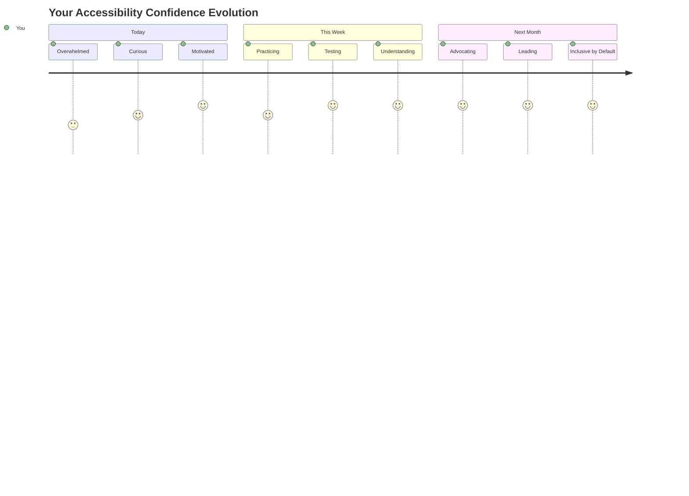
  
> 🌍 **আপনি এখন একজন অ্যাক্সেসিবিলিটি চ্যাম্পিয়ন!** আপনি বুঝতে পেরেছেন যে চমৎকার ওয়েব অভিজ্ঞতা সবার জন্য কাজ করে, তারা যেভাবেই ওয়েব অ্যাক্সেস করুক না কেন। আপনি যে প্রতিটি অ্যাক্সেসিবল ফিচার তৈরি করেন তা ইন্টারনেটকে আরও অন্তর্ভুক্তিমূলক করে তোলে। ওয়েব এমন ডেভেলপারদের প্রয়োজন যারা অ্যাক্সেসিবিলিটিকে সীমাবদ্ধতা নয়, বরং সবার জন্য আরও ভালো অভিজ্ঞতা তৈরির সুযোগ হিসেবে দেখেন। আন্দোলনে আপনাকে স্বাগতম! 🎉  

---

**অস্বীকৃতি**:  
এই নথিটি AI অনুবাদ পরিষেবা [Co-op Translator](https://github.com/Azure/co-op-translator) ব্যবহার করে অনুবাদ করা হয়েছে। আমরা যথাসাধ্য সঠিকতার জন্য চেষ্টা করি, তবে অনুগ্রহ করে মনে রাখবেন যে স্বয়ংক্রিয় অনুবাদে ত্রুটি বা অসঙ্গতি থাকতে পারে। মূল ভাষায় থাকা নথিটিকে প্রামাণিক উৎস হিসেবে বিবেচনা করা উচিত। গুরুত্বপূর্ণ তথ্যের জন্য, পেশাদার মানব অনুবাদ সুপারিশ করা হয়। এই অনুবাদ ব্যবহারের ফলে কোনো ভুল বোঝাবুঝি বা ভুল ব্যাখ্যা হলে আমরা দায়বদ্ধ থাকব না।