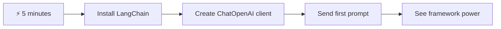
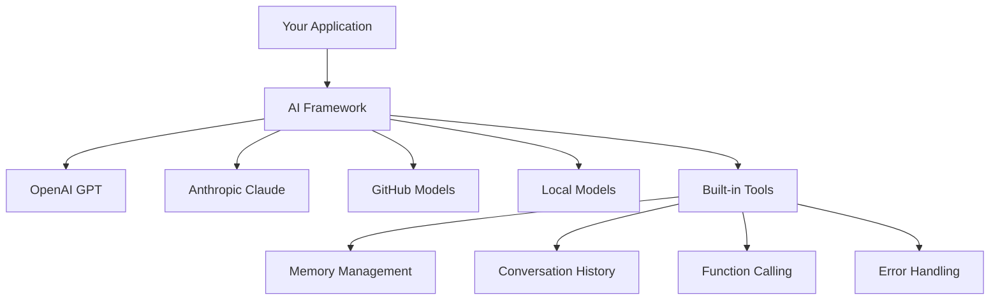
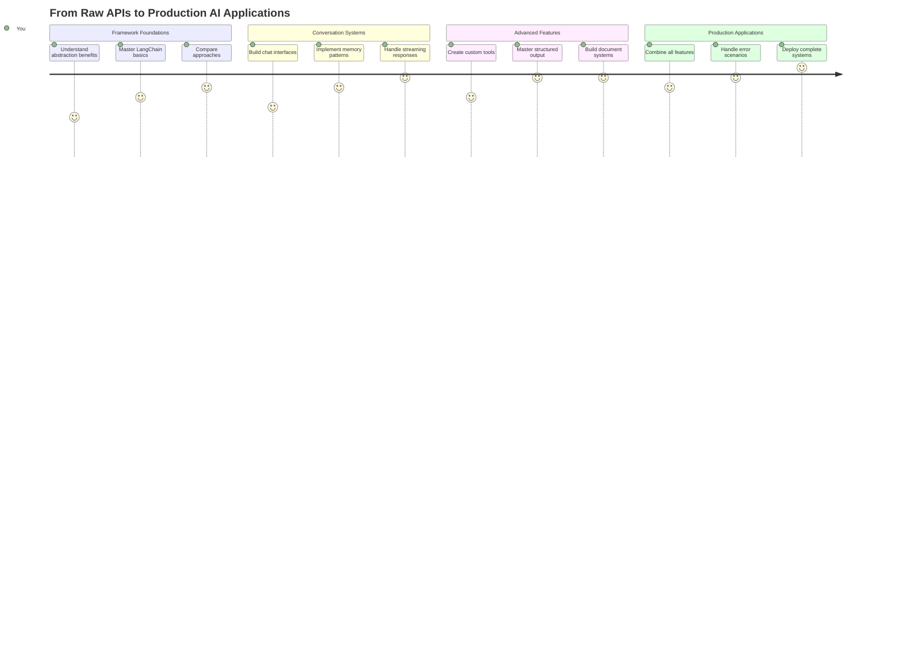
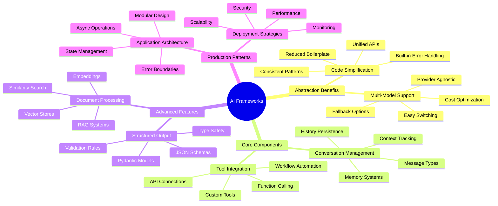
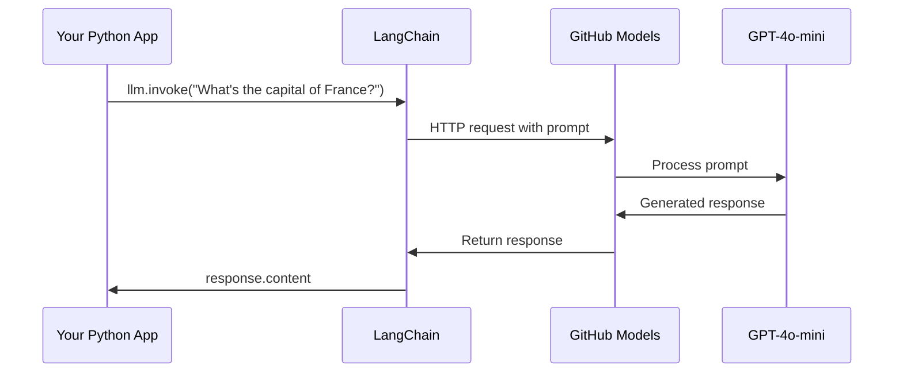
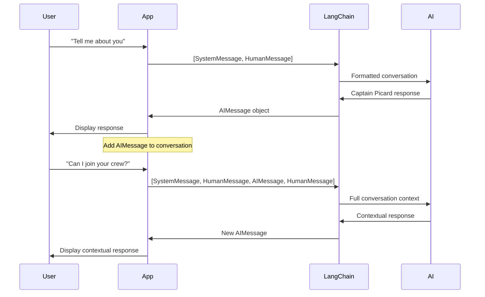
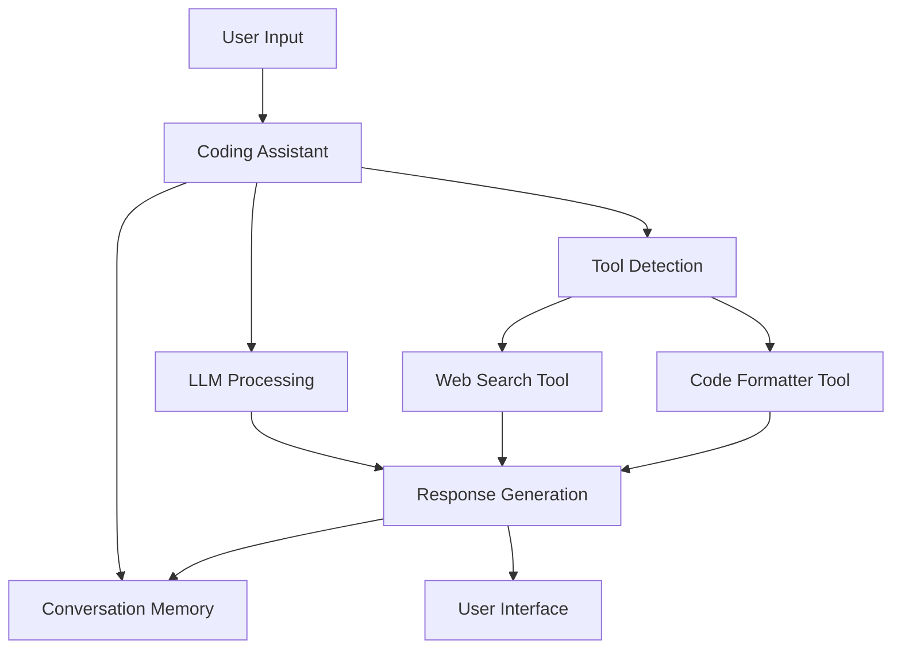
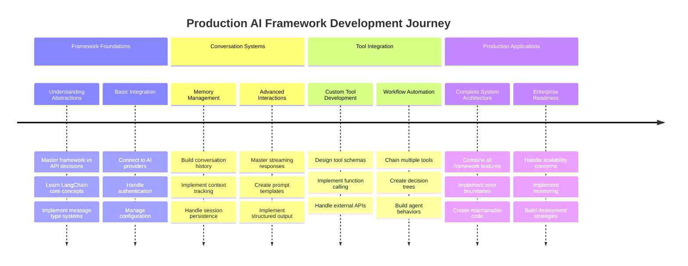
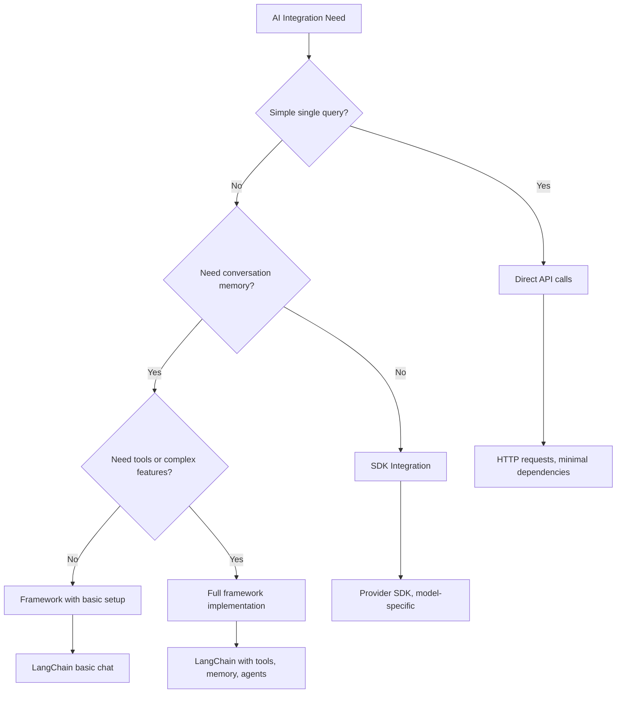

# AI ফ্রেমওয়ার্ক

কখনও কি অনুভব করেছেন যে শূন্য থেকে AI অ্যাপ্লিকেশন তৈরি করতে গিয়ে আপনি বিভ্রান্ত হয়ে পড়েছেন? আপনি একা নন! AI ফ্রেমওয়ার্কগুলি AI ডেভেলপমেন্টের জন্য সুইস আর্মি নাইফের মতো - এগুলি শক্তিশালী টুল যা বুদ্ধিমান অ্যাপ্লিকেশন তৈরি করার সময় আপনার সময় এবং ঝামেলা বাঁচাতে পারে। AI ফ্রেমওয়ার্ককে একটি সুসংগঠিত লাইব্রেরি হিসেবে ভাবুন: এটি পূর্বনির্মিত উপাদান, মানক API এবং স্মার্ট অ্যাবস্ট্রাকশন সরবরাহ করে যাতে আপনি সমস্যার সমাধানে মনোযোগ দিতে পারেন, বাস্তবায়নের বিশদ নিয়ে লড়াই না করে।

এই পাঠে, আমরা দেখব কীভাবে LangChain-এর মতো ফ্রেমওয়ার্কগুলি জটিল AI ইন্টিগ্রেশন কাজকে পরিষ্কার, পাঠযোগ্য কোডে রূপান্তরিত করতে পারে। আপনি বাস্তব-জীবনের চ্যালেঞ্জ মোকাবেলা করার উপায় আবিষ্কার করবেন যেমন কথোপকথন ট্র্যাক রাখা, টুল কলিং বাস্তবায়ন করা এবং একক ইন্টারফেসের মাধ্যমে বিভিন্ন AI মডেল পরিচালনা করা।

পাঠ শেষে, আপনি জানবেন কখন ফ্রেমওয়ার্ক ব্যবহার করবেন কাঁচা API কলের পরিবর্তে, কীভাবে তাদের অ্যাবস্ট্রাকশন কার্যকরভাবে ব্যবহার করবেন এবং কীভাবে বাস্তব-জীবনের ব্যবহারের জন্য প্রস্তুত AI অ্যাপ্লিকেশন তৈরি করবেন। চলুন দেখি AI ফ্রেমওয়ার্ক আপনার প্রকল্পগুলির জন্য কী করতে পারে।

## ⚡ পরবর্তী ৫ মিনিটে আপনি কী করতে পারেন

**ব্যস্ত ডেভেলপারদের জন্য দ্রুত শুরু পথ**



- **মিনিট ১**: LangChain ইনস্টল করুন: `pip install langchain langchain-openai`
- **মিনিট ২**: আপনার GitHub টোকেন সেট আপ করুন এবং ChatOpenAI ক্লায়েন্ট ইমপোর্ট করুন
- **মিনিট ৩**: সিস্টেম এবং মানব বার্তাগুলির সাথে একটি সাধারণ কথোপকথন তৈরি করুন
- **মিনিট ৪**: একটি সাধারণ টুল যোগ করুন (যেমন একটি যোগ ফাংশন) এবং AI টুল কলিং দেখুন
- **মিনিট ৫**: কাঁচা API কল এবং ফ্রেমওয়ার্ক অ্যাবস্ট্রাকশনের মধ্যে পার্থক্য অনুভব করুন

**দ্রুত পরীক্ষার কোড**:
```python
from langchain_openai import ChatOpenAI
from langchain_core.messages import SystemMessage, HumanMessage

llm = ChatOpenAI(
    api_key=os.environ["GITHUB_TOKEN"],
    base_url="https://models.github.ai/inference",
    model="openai/gpt-4o-mini"
)

response = llm.invoke([
    SystemMessage(content="You are a helpful coding assistant"),
    HumanMessage(content="Explain Python functions briefly")
])
print(response.content)
```

**কেন এটি গুরুত্বপূর্ণ**: ৫ মিনিটে, আপনি অভিজ্ঞতা করবেন কীভাবে AI ফ্রেমওয়ার্কগুলি জটিল AI ইন্টিগ্রেশনকে সহজ পদ্ধতিতে রূপান্তরিত করে। এটি সেই ভিত্তি যা প্রোডাকশন AI অ্যাপ্লিকেশনগুলিকে চালিত করে।

## কেন ফ্রেমওয়ার্ক বেছে নেবেন?

তাহলে আপনি AI অ্যাপ তৈরি করতে প্রস্তুত - দারুণ! কিন্তু এখানে বিষয় হল: আপনি কয়েকটি ভিন্ন পথ নিতে পারেন, এবং প্রতিটি পথের নিজস্ব সুবিধা এবং অসুবিধা রয়েছে। এটি হাঁটা, বাইক চালানো বা গাড়ি চালানোর মধ্যে বেছে নেওয়ার মতো - এগুলি সবই আপনাকে গন্তব্যে পৌঁছে দেবে, তবে অভিজ্ঞতা (এবং প্রচেষ্টা) সম্পূর্ণ ভিন্ন হবে।

চলুন আপনার প্রকল্পে AI ইন্টিগ্রেট করার তিনটি প্রধান উপায় বিশ্লেষণ করি:

| পদ্ধতি | সুবিধা | সেরা ব্যবহার | বিবেচনা |
|----------|------------|----------|--------------|
| **ডিরেক্ট HTTP অনুরোধ** | পূর্ণ নিয়ন্ত্রণ, কোনো নির্ভরতা নেই | সহজ প্রশ্ন, মৌলিক বিষয় শেখা | বেশি বিস্তারিত কোড, ম্যানুয়াল ত্রুটি পরিচালনা |
| **SDK ইন্টিগ্রেশন** | কম বয়লারপ্লেট, মডেল-নির্দিষ্ট অপ্টিমাইজেশন | একক-মডেল অ্যাপ্লিকেশন | নির্দিষ্ট প্রদানকারীদের মধ্যে সীমাবদ্ধ |
| **AI ফ্রেমওয়ার্ক** | একীভূত API, বিল্ট-ইন অ্যাবস্ট্রাকশন | মাল্টি-মডেল অ্যাপ, জটিল ওয়ার্কফ্লো | শেখার বাঁধা, সম্ভাব্য অতিরিক্ত অ্যাবস্ট্রাকশন |

### বাস্তবে ফ্রেমওয়ার্কের সুবিধা



**কেন ফ্রেমওয়ার্ক গুরুত্বপূর্ণ:**
- **একীভূত করে** একাধিক AI প্রদানকারীকে এক ইন্টারফেসের অধীনে
- **স্বয়ংক্রিয়ভাবে পরিচালনা করে** কথোপকথনের স্মৃতি
- **সরবরাহ করে** সাধারণ কাজের জন্য প্রস্তুত টুল যেমন এম্বেডিং এবং ফাংশন কলিং
- **পরিচালনা করে** ত্রুটি পরিচালনা এবং পুনরায় চেষ্টা করার যুক্তি
- **রূপান্তরিত করে** জটিল ওয়ার্কফ্লোকে পাঠযোগ্য পদ্ধতিতে

> 💡 **প্রো টিপ**: বিভিন্ন AI মডেলের মধ্যে স্যুইচ করার সময় বা এজেন্ট, মেমরি বা টুল কলিংয়ের মতো জটিল বৈশিষ্ট্য তৈরি করার সময় ফ্রেমওয়ার্ক ব্যবহার করুন। মৌলিক বিষয়গুলি শেখার সময় বা সহজ, ফোকাসড অ্যাপ্লিকেশন তৈরি করার সময় সরাসরি API ব্যবহার করুন।

**সারমর্ম**: এটি একটি দক্ষ কারিগরের বিশেষায়িত টুল এবং একটি সম্পূর্ণ কর্মশালার মধ্যে বেছে নেওয়ার মতো। এটি কাজের সাথে টুলের মিল করার বিষয়ে। জটিল, বৈশিষ্ট্য-সমৃদ্ধ অ্যাপ্লিকেশনের জন্য ফ্রেমওয়ার্কগুলি চমৎকার, যখন সরাসরি API সহজ কেসগুলির জন্য ভাল কাজ করে।

## 🗺️ AI ফ্রেমওয়ার্ক দক্ষতার মাধ্যমে আপনার শেখার যাত্রা



**আপনার যাত্রার গন্তব্য**: পাঠ শেষে, আপনি AI ফ্রেমওয়ার্ক ডেভেলপমেন্টে দক্ষ হয়ে উঠবেন এবং উন্নত, প্রোডাকশন-রেডি AI অ্যাপ্লিকেশন তৈরি করতে সক্ষম হবেন যা বাণিজ্যিক AI অ্যাসিস্ট্যান্টদের প্রতিদ্বন্দ্বিতা করে।

## পরিচিতি

এই পাঠে আমরা শিখব:

- একটি সাধারণ AI ফ্রেমওয়ার্ক ব্যবহার করা।
- সাধারণ সমস্যাগুলি সমাধান করা যেমন চ্যাট কথোপকথন, টুল ব্যবহার, মেমরি এবং প্রসঙ্গ।
- এটি ব্যবহার করে AI অ্যাপ তৈরি করা।

## 🧠 AI ফ্রেমওয়ার্ক ডেভেলপমেন্ট ইকোসিস্টেম



**মূল নীতি**: AI ফ্রেমওয়ার্কগুলি জটিলতাকে অ্যাবস্ট্রাক্ট করে এবং কথোপকথন পরিচালনা, টুল ইন্টিগ্রেশন এবং ডকুমেন্ট প্রসেসিংয়ের জন্য শক্তিশালী অ্যাবস্ট্রাকশন প্রদান করে, যা ডেভেলপারদের পরিষ্কার, রক্ষণযোগ্য কোড সহ উন্নত AI অ্যাপ্লিকেশন তৈরি করতে সক্ষম করে।

## আপনার প্রথম AI প্রম্পট

চলুন মৌলিক বিষয়গুলি দিয়ে শুরু করি এবং একটি AI অ্যাপ্লিকেশন তৈরি করি যা একটি প্রশ্ন পাঠায় এবং একটি উত্তর পায়। আর্কিমিডিস তার স্নানে স্থানচ্যুতির নীতি আবিষ্কার করার মতো, কখনও কখনও সবচেয়ে সহজ পর্যবেক্ষণগুলি সবচেয়ে শক্তিশালী অন্তর্দৃষ্টি দেয় - এবং ফ্রেমওয়ার্কগুলি এই অন্তর্দৃষ্টিগুলি অ্যাক্সেসযোগ্য করে তোলে।

### GitHub মডেলগুলির সাথে LangChain সেট আপ করা

আমরা LangChain ব্যবহার করব GitHub মডেলগুলির সাথে সংযোগ করতে, যা বেশ চমৎকার কারণ এটি আপনাকে বিভিন্ন AI মডেলের বিনামূল্যে অ্যাক্সেস দেয়। সেরা অংশ? শুরু করতে আপনার শুধুমাত্র কয়েকটি সহজ কনফিগারেশন প্যারামিটার দরকার:

```python
from langchain_openai import ChatOpenAI
import os

llm = ChatOpenAI(
    api_key=os.environ["GITHUB_TOKEN"],
    base_url="https://models.github.ai/inference",
    model="openai/gpt-4o-mini",
)

# Send a simple prompt
response = llm.invoke("What's the capital of France?")
print(response.content)
```

**এখানে কী ঘটছে তা বিশ্লেষণ করা:**
- **LangChain ক্লায়েন্ট তৈরি করে** `ChatOpenAI` ক্লাস ব্যবহার করে - এটি আপনার AI-এর গেটওয়ে!
- **GitHub মডেলগুলির সাথে সংযোগ কনফিগার করে** আপনার প্রমাণীকরণ টোকেন দিয়ে
- **নির্দিষ্ট করে** কোন AI মডেল ব্যবহার করতে হবে (`gpt-4o-mini`) - এটি আপনার AI সহকারী বেছে নেওয়ার মতো
- **আপনার প্রশ্ন পাঠায়** `invoke()` পদ্ধতি ব্যবহার করে - এখানেই ম্যাজিক ঘটে
- **প্রতিক্রিয়া বের করে এবং প্রদর্শন করে** - এবং voilà, আপনি AI-এর সাথে কথা বলছেন!

> 🔧 **সেটআপ নোট**: যদি আপনি GitHub Codespaces ব্যবহার করেন, আপনি ভাগ্যবান - `GITHUB_TOKEN` ইতিমধ্যেই সেট আপ করা আছে! স্থানীয়ভাবে কাজ করছেন? চিন্তা করবেন না, আপনাকে সঠিক অনুমতি সহ একটি ব্যক্তিগত অ্যাক্সেস টোকেন তৈরি করতে হবে।

**প্রত্যাশিত আউটপুট**:
```text
The capital of France is Paris.
```



## কথোপকথনমূলক AI তৈরি করা

প্রথম উদাহরণটি মৌলিক বিষয়গুলি প্রদর্শন করে, তবে এটি শুধুমাত্র একটি একক বিনিময় - আপনি একটি প্রশ্ন করেন, একটি উত্তর পান, এবং এটিই। বাস্তব অ্যাপ্লিকেশনে, আপনি চান আপনার AI আপনার আলোচনার বিষয়গুলি মনে রাখুক, যেমন ওয়াটসন এবং হোমস তাদের তদন্তমূলক কথোপকথন সময়ের সাথে তৈরি করেছিল।

এখানেই LangChain বিশেষভাবে কার্যকর। এটি বিভিন্ন বার্তার ধরন সরবরাহ করে যা কথোপকথন গঠন করতে সাহায্য করে এবং আপনাকে আপনার AI-কে একটি ব্যক্তিত্ব দিতে দেয়। আপনি এমন চ্যাট অভিজ্ঞতা তৈরি করবেন যা প্রসঙ্গ এবং চরিত্র বজায় রাখে।

### বার্তার ধরন বোঝা

এই বার্তার ধরনগুলিকে কথোপকথনে অংশগ্রহণকারীরা যে "টুপি" পরে তার মতো ভাবুন। LangChain বিভিন্ন বার্তা ক্লাস ব্যবহার করে কে কী বলছে তা ট্র্যাক করে:

| বার্তার ধরন | উদ্দেশ্য | উদাহরণ ব্যবহার |
|--------------|---------|------------------|
| `SystemMessage` | AI-এর ব্যক্তিত্ব এবং আচরণ সংজ্ঞায়িত করে | "আপনি একজন সহায়ক কোডিং সহকারী" |
| `HumanMessage` | ব্যবহারকারীর ইনপুট উপস্থাপন করে | "ফাংশন কীভাবে কাজ করে তা ব্যাখ্যা করুন" |
| `AIMessage` | AI প্রতিক্রিয়া সংরক্ষণ করে | কথোপকথনে পূর্ববর্তী AI প্রতিক্রিয়া |

### আপনার প্রথম কথোপকথন তৈরি করা

চলুন একটি কথোপকথন তৈরি করি যেখানে আমাদের AI একটি নির্দিষ্ট ভূমিকা গ্রহণ করে। আমরা এটিকে ক্যাপ্টেন পিকার্ডের চরিত্রে উপস্থাপন করব - একজন কূটনৈতিক প্রজ্ঞা এবং নেতৃত্বের জন্য পরিচিত চরিত্র:

```python
messages = [
    SystemMessage(content="You are Captain Picard of the Starship Enterprise"),
    HumanMessage(content="Tell me about you"),
]
```

**এই কথোপকথন সেটআপ বিশ্লেষণ করা:**
- **AI-এর ভূমিকা এবং ব্যক্তিত্ব প্রতিষ্ঠা করে** `SystemMessage` এর মাধ্যমে
- **প্রাথমিক ব্যবহারকারীর প্রশ্ন প্রদান করে** `HumanMessage` এর মাধ্যমে
- **মাল্টি-টার্ন কথোপকথনের জন্য একটি ভিত্তি তৈরি করে**

এই উদাহরণের সম্পূর্ণ কোডটি দেখতে এরকম:

```python
from langchain_core.messages import HumanMessage, SystemMessage
from langchain_openai import ChatOpenAI
import os

llm = ChatOpenAI(
    api_key=os.environ["GITHUB_TOKEN"],
    base_url="https://models.github.ai/inference",
    model="openai/gpt-4o-mini",
)

messages = [
    SystemMessage(content="You are Captain Picard of the Starship Enterprise"),
    HumanMessage(content="Tell me about you"),
]


# works
response  = llm.invoke(messages)
print(response.content)
```

আপনি একটি ফলাফল দেখতে পাবেন যা এরকম:

```text
I am Captain Jean-Luc Picard, the commanding officer of the USS Enterprise (NCC-1701-D), a starship in the United Federation of Planets. My primary mission is to explore new worlds, seek out new life and new civilizations, and boldly go where no one has gone before. 

I believe in the importance of diplomacy, reason, and the pursuit of knowledge. My crew is diverse and skilled, and we often face challenges that test our resolve, ethics, and ingenuity. Throughout my career, I have encountered numerous species, grappled with complex moral dilemmas, and have consistently sought peaceful solutions to conflicts.

I hold the ideals of the Federation close to my heart, believing in the importance of cooperation, understanding, and respect for all sentient beings. My experiences have shaped my leadership style, and I strive to be a thoughtful and just captain. How may I assist you further?
```

কথোপকথনের ধারাবাহিকতা বজায় রাখতে (প্রতিবার প্রসঙ্গ পুনরায় সেট করার পরিবর্তে), আপনাকে আপনার বার্তা তালিকায় প্রতিক্রিয়া যোগ করতে হবে। প্রজন্মের পর প্রজন্মের গল্প সংরক্ষণের মৌখিক ঐতিহ্যের মতো, এই পদ্ধতি স্থায়ী স্মৃতি তৈরি করে:

```python
from langchain_core.messages import HumanMessage, SystemMessage
from langchain_openai import ChatOpenAI
import os

llm = ChatOpenAI(
    api_key=os.environ["GITHUB_TOKEN"],
    base_url="https://models.github.ai/inference",
    model="openai/gpt-4o-mini",
)

messages = [
    SystemMessage(content="You are Captain Picard of the Starship Enterprise"),
    HumanMessage(content="Tell me about you"),
]


# works
response  = llm.invoke(messages)

print(response.content)

print("---- Next ----")

messages.append(response)
messages.append(HumanMessage(content="Now that I know about you, I'm Chris, can I be in your crew?"))

response  = llm.invoke(messages)

print(response.content)

```

খুব চমৎকার, তাই না? এখানে যা ঘটছে তা হল আমরা LLM-কে দুবার কল করছি - প্রথমে আমাদের প্রাথমিক দুটি বার্তা দিয়ে, কিন্তু তারপর আবার পুরো কথোপকথনের ইতিহাস দিয়ে। এটি AI-এর মতো মনে হচ্ছে যে এটি আমাদের চ্যাটটি আসলে অনুসরণ করছে!

যখন আপনি এই কোডটি চালান, আপনি একটি দ্বিতীয় প্রতিক্রিয়া পাবেন যা এরকম শোনাবে:

```text
Welcome aboard, Chris! It's always a pleasure to meet those who share a passion for exploration and discovery. While I cannot formally offer you a position on the Enterprise right now, I encourage you to pursue your aspirations. We are always in need of talented individuals with diverse skills and backgrounds. 

If you are interested in space exploration, consider education and training in the sciences, engineering, or diplomacy. The values of curiosity, resilience, and teamwork are crucial in Starfleet. Should you ever find yourself on a starship, remember to uphold the principles of the Federation: peace, understanding, and respect for all beings. Your journey can lead you to remarkable adventures, whether in the stars or on the ground. Engage!
```



আমি এটিকে একটি সম্ভাবনা হিসেবে নেব ;)

## স্ট্রিমিং প্রতিক্রিয়া

কখনও লক্ষ্য করেছেন কীভাবে ChatGPT তার প্রতিক্রিয়াগুলি রিয়েল-টাইমে "টাইপ" করে? এটি স্ট্রিমিংয়ের কাজ। দক্ষ ক্যালিগ্রাফার কাজ দেখার মতো - চরিত্রগুলি স্ট্রোক বাই স্ট্রোক উপস্থিত হয়, তাৎক্ষণিকভাবে উপস্থাপিত হওয়ার পরিবর্তে - স্ট্রিমিং ইন্টারঅ্যাকশনকে আরও প্রাকৃতিক করে তোলে এবং তাৎক্ষণিক প্রতিক্রিয়া প্রদান করে।

### LangChain দিয়ে স্ট্রিমিং বাস্তবায়ন

```python
from langchain_openai import ChatOpenAI
import os

llm = ChatOpenAI(
    api_key=os.environ["GITHUB_TOKEN"],
    base_url="https://models.github.ai/inference",
    model="openai/gpt-4o-mini",
    streaming=True
)

# Stream the response
for chunk in llm.stream("Write a short story about a robot learning to code"):
    print(chunk.content, end="", flush=True)
```

**কেন স্ট্রিমিং চমৎকার:**
- **কন্টেন্ট দেখায়** এটি তৈরি হওয়ার সময় - আর অস্বস্তিকর অপেক্ষা নয়!
- **ব্যবহারকারীদের অনুভব করায়** যেন কিছু ঘটছে
- **দ্রুত অনুভূত হয়**, যদিও এটি প্রযুক্তিগতভাবে নয়
- **ব্যবহারকারীদের পড়া শুরু করতে দেয়** যখন AI এখনও "ভাবছে"

> 💡 **ব্যবহারকারীর অভিজ্ঞতা টিপ**: স্ট্রিমিং সত্যিই উজ্জ্বল হয় যখন আপনি কোড ব্যাখ্যা, সৃজনশীল লেখা বা বিস্তারিত টিউটোরিয়ালের মতো দীর্ঘ প্রতিক্রিয়াগুলি নিয়ে কাজ করছেন। আপনার ব্যবহারকারীরা একটি খালি স্ক্রিনের দিকে তাকানোর পরিবর্তে অগ্রগতি দেখতে পছন্দ করবেন!

### 🎯 শিক্ষামূলক চেক-ইন: ফ্রেমওয়ার্ক অ্যাবস্ট্রাকশন সুবিধা

**থামুন এবং চিন্তা করুন**: আপনি মাত্রই AI ফ্রেমওয়ার্ক অ্যাবস্ট্রাকশনের শক্তি অনুভব করেছেন। আগের পাঠ থেকে কাঁচা API কলের সাথে আপনি যা শিখেছেন তার তুলনা করুন।

**দ্রুত স্ব-মূল্যায়ন**:
- আপনি কি ব্যাখ্যা করতে পারেন কীভাবে LangChain ম্যানুয়াল বার্তা ট্র্যাকিংয়ের তুলনায় কথোপকথন পরিচালনা সহজ করে?
- `invoke()` এবং `stream()` পদ্ধতির মধ্যে পার্থক্য কী, এবং আপনি কখন কোনটি ব্যবহার করবেন?
- ফ্রেমওয়ার্কের বার্তা টাইপ সিস্টেম কীভাবে কোড সংগঠন উন্নত করে?

**বাস্তব-জীবনের সংযোগ**: আপনি যে অ্যাবস্ট্রাকশন প্যাটার্নগুলি শিখেছেন (বার্তা টাইপ, স্ট্রিমিং ইন্টারফেস, কথোপকথনের স্মৃতি) প্রতিটি প্রধান AI অ্যাপ্লিকেশনে ব্যবহৃত হয় - ChatGPT-এর ইন্টারফেস থেকে GitHub Copilot-এর কোড সহায়তা পর্যন্ত। আপনি পেশাদার AI ডেভেলপমেন্ট টিম দ্বারা ব্যবহৃত একই আর্কিটেকচারাল প্যাটার্ন আয়ত্ত করছেন।

**চ্যালেঞ্জ প্রশ্ন**: আপনি কীভাবে একটি ফ্রেমওয়ার্ক অ্যাবস্ট্রাকশন ডিজাইন করবেন যা বিভিন্ন AI মডেল প্রদানকারী (OpenAI, Anthropic, Google) একক ইন্টারফেসের মাধ্যমে পরিচালনা করে? সুবিধা এবং অসুবিধাগুলি বিবেচনা করুন।

## প্রম্পট টেমপ্লেট

প্রম্পট টেমপ্লেটগুলি ক্লাসিকাল বক্তৃতায় ব্যবহৃত রেটোরিকাল কাঠামোর মতো কাজ করে - ভাবুন কীভাবে সিসেরো তার বক্তৃতার প্যাটার্নগুলি বিভিন্ন শ্রোতার জন্য মানিয়ে নিতেন, একই সময়ে একই প্ররোচনামূলক কাঠামো বজায় রেখে। এগুলি আপনাকে পুনরায় ব্যবহারযোগ্য প্রম্পট তৈরি করতে দেয় যেখানে আপনি বিভিন্ন তথ্যের অংশগুলি পরিবর্তন করতে পারেন, সবকিছু নতুন করে লেখার প্রয়োজন ছাড়াই। একবার আপনি টেমপ্লেট সেট আপ করলে, আপনি শুধু ভেরিয়েবলগুলিতে প্রয়োজনীয় মানগুলি পূরণ করেন।

### পুনরায় ব্যবহারযোগ্য প্রম্পট তৈরি করা

```python
from langchain_core.prompts import ChatPromptTemplate

# Define a template for code explanations
template = ChatPromptTemplate.from_messages([
    ("system", "You are an expert programming instructor. Explain concepts clearly with examples."),
    ("human", "Explain {concept} in {language} with a practical example for {skill_level} developers")
])

# Use the template with different values
questions = [
    {"concept": "functions", "language": "JavaScript", "skill_level": "beginner"},
    {"concept": "classes", "language": "Python", "skill_level": "intermediate"},
    {"concept": "async/await", "language": "JavaScript", "skill_level": "advanced"}
]

for question in questions:
    prompt = template.format_messages(**question)
    response = llm.invoke(prompt)
    print(f"Topic: {question['concept']}\n{response.content}\n---\n")
```

**কেন আপনি টেমপ্লেট ব্যবহার করতে ভালোবাসবেন:**
- **আপনার প্রম্পটকে** আপনার পুরো অ্যাপ জুড়ে সামঞ্জস্যপূর্ণ রাখে
- **আর কোনো** বিশৃঙ্খল স্ট্রিং সংযোজন নয় - শুধু পরিষ্কার, সহজ ভেরিয়েবল
- **আপনার AI** পূর্বানুমানযোগ্য আচরণ করে কারণ কাঠামো একই থাকে
- **আপডেটগুলি** সহজ - একবার টেমপ্লেট পরিবর্তন করুন, এবং এটি সর্বত্র ঠিক হয়ে যায়

## গঠিত আউটপুট

AI প্রতিক্রিয়াগুলি যা অসংগঠিত টেক্সট হিসাবে ফিরে আসে তা পার্স করার চেষ্টা করে কখনও হতাশ হয়েছেন? গঠিত আউটপুট আপনার AI-কে সেই পদ্ধতিগত পদ্ধতি অনুসরণ করতে শেখানোর মতো যা লিনিয়াস জীববৈজ্ঞানিক শ্রেণীবিন্যাসের জন্য ব্যবহার করেছিলেন - সংগঠিত, পূর্বানুমানযোগ্য এবং কাজ করার জন্য সহজ। আপনি JSON, নির্দিষ্ট ডেটা কাঠামো বা আপনার প্রয়োজনীয় যেকোনো ফর্ম্যাট অনুরোধ করতে পারেন।

### আউটপুট স্কিমা সংজ্ঞায়িত করা

```python
from langchain_core.prompts import ChatPromptTemplate
from langchain_core.output_parsers import JsonOutputParser
from pydantic import BaseModel, Field

class CodeReview(BaseModel):
    score: int = Field(description="Code quality score from 1-10")
    strengths: list[str] = Field(description="List of code strengths")
    improvements: list[str] = Field(description="List of suggested improvements")
    overall_feedback: str = Field(description="Summary feedback")

# Set up the parser
parser = JsonOutputParser(pydantic_object=CodeReview)

# Create prompt with format instructions
prompt = ChatPromptTemplate.from_messages([
    ("system", "You are a code reviewer. {format_instructions}"),
    ("human", "Review this code: {code}")
])

# Format the prompt with instructions
chain = prompt | llm | parser

# Get structured response
code_sample = """
def calculate_average(numbers):
    return sum(numbers) / len(numbers)
"""

result = chain.invoke({
    "code": code_sample,
    "format_instructions": parser.get_format_instructions()
})

print(f"Score: {result['score']}")
print(f"Strengths: {', '.join(result['strengths'])}")
```

**কেন গঠিত আউটপুট একটি গেম-চেঞ্জার:**
- **আর কোনো** অনুমান নয় যে আপনি কী ফর্ম্যাট ফিরে পাবেন - এটি প্রতিবার সামঞ্জস্যপূর্ণ
- **আপনার ডেটাবেস এবং API-তে** অতিরিক্ত কাজ ছাড়াই সরাসরি প্লাগ করে
- **অদ্ভুত AI প্রতিক্রিয়াগুলি ধরতে পারে** যা আপনার অ্যাপ ভাঙার আগে
- **আপনার কোডকে** পরিষ্কার করে কারণ আপনি জানেন ঠিক কী নিয়ে কাজ করছেন

## টুল কলিং

এখন আমরা সবচেয়ে শক্তিশালী বৈশিষ্ট্যগুলির একটিতে পৌঁছেছি: টুল। এটি হল কীভাবে আপনি আপনার
সংখ্যা যোগ করার মাধ্যমে ধারণাটি বোঝানো যায়, তবে বাস্তব টুলগুলি সাধারণত আরও জটিল কার্যক্রম সম্পাদন করে, যেমন ওয়েব API কল করা। চলুন আমাদের উদাহরণটি প্রসারিত করি যেখানে AI ইন্টারনেট থেকে কন্টেন্ট সংগ্রহ করবে - ঠিক যেমন টেলিগ্রাফ অপারেটররা একসময় দূরবর্তী স্থানের সংযোগ স্থাপন করত:

```python
class joke(TypedDict):
    """Tell a joke."""

    # Annotations must have the type and can optionally include a default value and description (in that order).
    category: Annotated[str, ..., "The joke category"]

def get_joke(category: str) -> str:
    response = requests.get(f"https://api.chucknorris.io/jokes/random?category={category}", headers={"Accept": "application/json"})
    if response.status_code == 200:
        return response.json().get("value", f"Here's a {category} joke!")
    return f"Here's a {category} joke!"

functions = {
    "add": lambda a, b: a + b,
    "joke": lambda category: get_joke(category)
}

query = "Tell me a joke about animals"

# the rest of the code is the same
```

এখন যদি আপনি এই কোডটি চালান, তাহলে আপনি একটি প্রতিক্রিয়া পাবেন যা কিছুটা এরকম হবে:

```text
TOOL CALL:  Chuck Norris once rode a nine foot grizzly bear through an automatic car wash, instead of taking a shower.
CONTENT:  
```

```mermaid
flowchart TD
    A[User Query: "Tell me a joke about animals"] --> B[LangChain Analysis]
    B --> C{Tool Available?}
    C -->|Yes| D[Select joke tool]
    C -->|No| E[Generate direct response]
    
    D --> F[Extract Parameters]
    F --> G[Call joke(category="animals")]
    G --> H[API Request to chucknorris.io]
    H --> I[Return joke content]
    I --> J[Display to user]
    
    E --> K[AI-generated response]
    K --> J
    
    subgraph "Tool Definition Layer"
        L[TypedDict Schema]
        M[Function Implementation]
        N[Parameter Validation]
    end
    
    D --> L
    F --> N
    G --> M
```

এখানে সম্পূর্ণ কোডটি দেওয়া হলো:

```python
from langchain_openai import ChatOpenAI
import requests
import os
from typing_extensions import Annotated, TypedDict

class add(TypedDict):
    """Add two integers."""

    # Annotations must have the type and can optionally include a default value and description (in that order).
    a: Annotated[int, ..., "First integer"]
    b: Annotated[int, ..., "Second integer"]

class joke(TypedDict):
    """Tell a joke."""

    # Annotations must have the type and can optionally include a default value and description (in that order).
    category: Annotated[str, ..., "The joke category"]

tools = [add, joke]

def get_joke(category: str) -> str:
    response = requests.get(f"https://api.chucknorris.io/jokes/random?category={category}", headers={"Accept": "application/json"})
    if response.status_code == 200:
        return response.json().get("value", f"Here's a {category} joke!")
    return f"Here's a {category} joke!"

functions = {
    "add": lambda a, b: a + b,
    "joke": lambda category: get_joke(category)
}

llm = ChatOpenAI(
    api_key=os.environ["GITHUB_TOKEN"],
    base_url="https://models.github.ai/inference",
    model="openai/gpt-4o-mini",
)

llm_with_tools = llm.bind_tools(tools)

query = "Tell me a joke about animals"

res = llm_with_tools.invoke(query)
if(res.tool_calls):
    for tool in res.tool_calls:
        # print("TOOL CALL: ", tool)
        print("TOOL CALL: ", functions[tool["name"]](../../../10-ai-framework-project/**tool["args"]))
print("CONTENT: ",res.content)
```

## এমবেডিং এবং ডকুমেন্ট প্রসেসিং

এমবেডিং আধুনিক AI-এর অন্যতম চমৎকার সমাধান। কল্পনা করুন, আপনি যদি কোনো টেক্সটকে এমন সংখ্যাসূচক কোঅর্ডিনেটে রূপান্তর করতে পারেন যা তার অর্থকে ধারণ করে। এমবেডিং ঠিক সেটাই করে - এটি টেক্সটকে বহু-মাত্রিক স্থানে পয়েন্টে রূপান্তরিত করে যেখানে একই ধারণাগুলি একসাথে গুচ্ছিত হয়। এটি এমন একটি কোঅর্ডিনেট সিস্টেমের মতো, যা ধারণাগুলির জন্য তৈরি, ঠিক যেমন মেন্ডেলেভ পারমাণবিক বৈশিষ্ট্য দ্বারা পর্যায় সারণি সংগঠিত করেছিলেন।

### এমবেডিং তৈরি এবং ব্যবহার

```python
from langchain_openai import OpenAIEmbeddings
from langchain_community.vectorstores import FAISS
from langchain_community.document_loaders import TextLoader
from langchain.text_splitter import CharacterTextSplitter

# Initialize embeddings
embeddings = OpenAIEmbeddings(
    api_key=os.environ["GITHUB_TOKEN"],
    base_url="https://models.github.ai/inference",
    model="text-embedding-3-small"
)

# Load and split documents
loader = TextLoader("documentation.txt")
documents = loader.load()

text_splitter = CharacterTextSplitter(chunk_size=1000, chunk_overlap=0)
texts = text_splitter.split_documents(documents)

# Create vector store
vectorstore = FAISS.from_documents(texts, embeddings)

# Perform similarity search
query = "How do I handle user authentication?"
similar_docs = vectorstore.similarity_search(query, k=3)

for doc in similar_docs:
    print(f"Relevant content: {doc.page_content[:200]}...")
```

### বিভিন্ন ফরম্যাটের জন্য ডকুমেন্ট লোডার

```python
from langchain_community.document_loaders import (
    PyPDFLoader,
    CSVLoader,
    JSONLoader,
    WebBaseLoader
)

# Load different document types
pdf_loader = PyPDFLoader("manual.pdf")
csv_loader = CSVLoader("data.csv")
json_loader = JSONLoader("config.json")
web_loader = WebBaseLoader("https://example.com/docs")

# Process all documents
all_documents = []
for loader in [pdf_loader, csv_loader, json_loader, web_loader]:
    docs = loader.load()
    all_documents.extend(docs)
```

**এমবেডিং দিয়ে আপনি যা করতে পারেন:**
- **তৈরি করুন** এমন সার্চ যা আপনার অর্থ বুঝতে পারে, শুধুমাত্র কীওয়ার্ড মিলানোর চেয়ে বেশি
- **গঠন করুন** AI যা আপনার ডকুমেন্ট সম্পর্কে প্রশ্নের উত্তর দিতে পারে
- **প্রস্তাব দিন** এমন সুপারিশ ব্যবস্থা যা সত্যিই প্রাসঙ্গিক কন্টেন্ট প্রদান করে
- **স্বয়ংক্রিয়ভাবে** আপনার কন্টেন্ট সংগঠিত এবং শ্রেণীবদ্ধ করুন

```mermaid
flowchart LR
    A[Documents] --> B[Text Splitter]
    B --> C[Create Embeddings]
    C --> D[Vector Store]
    
    E[User Query] --> F[Query Embedding]
    F --> G[Similarity Search]
    G --> D
    D --> H[Relevant Documents]
    H --> I[AI Response]
    
    subgraph "Vector Space"
        J[Document A: [0.1, 0.8, 0.3...]]
        K[Document B: [0.2, 0.7, 0.4...]]
        L[Query: [0.15, 0.75, 0.35...]]
    end
    
    C --> J
    C --> K
    F --> L
    G --> J
    G --> K
```

## একটি সম্পূর্ণ AI অ্যাপ্লিকেশন তৈরি করা

এখন আমরা যা শিখেছি তা একটি ব্যাপক অ্যাপ্লিকেশনে সংহত করব - একটি কোডিং সহকারী যা প্রশ্নের উত্তর দিতে পারে, টুল ব্যবহার করতে পারে এবং কথোপকথনের স্মৃতি ধরে রাখতে পারে। যেমন মুদ্রণ যন্ত্র বিদ্যমান প্রযুক্তিগুলিকে (মুভেবল টাইপ, কালি, কাগজ এবং চাপ) একত্রিত করে কিছু রূপান্তরিত করেছিল, আমরা আমাদের AI উপাদানগুলিকে কিছু ব্যবহারিক এবং কার্যকরী কিছুতে একত্রিত করব।

### সম্পূর্ণ অ্যাপ্লিকেশনের উদাহরণ

```python
from langchain_openai import ChatOpenAI, OpenAIEmbeddings
from langchain_core.prompts import ChatPromptTemplate
from langchain_core.messages import HumanMessage, SystemMessage, AIMessage
from langchain_community.vectorstores import FAISS
from typing_extensions import Annotated, TypedDict
import os
import requests

class CodingAssistant:
    def __init__(self):
        self.llm = ChatOpenAI(
            api_key=os.environ["GITHUB_TOKEN"],
            base_url="https://models.github.ai/inference",
            model="openai/gpt-4o-mini"
        )
        
        self.conversation_history = [
            SystemMessage(content="""You are an expert coding assistant. 
            Help users learn programming concepts, debug code, and write better software.
            Use tools when needed and maintain a helpful, encouraging tone.""")
        ]
        
        # Define tools
        self.setup_tools()
    
    def setup_tools(self):
        class web_search(TypedDict):
            """Search for programming documentation or examples."""
            query: Annotated[str, "Search query for programming help"]
        
        class code_formatter(TypedDict):
            """Format and validate code snippets."""
            code: Annotated[str, "Code to format"]
            language: Annotated[str, "Programming language"]
        
        self.tools = [web_search, code_formatter]
        self.llm_with_tools = self.llm.bind_tools(self.tools)
    
    def chat(self, user_input: str):
        # Add user message to conversation
        self.conversation_history.append(HumanMessage(content=user_input))
        
        # Get AI response
        response = self.llm_with_tools.invoke(self.conversation_history)
        
        # Handle tool calls if any
        if response.tool_calls:
            for tool_call in response.tool_calls:
                tool_result = self.execute_tool(tool_call)
                print(f"🔧 Tool used: {tool_call['name']}")
                print(f"📊 Result: {tool_result}")
        
        # Add AI response to conversation
        self.conversation_history.append(response)
        
        return response.content
    
    def execute_tool(self, tool_call):
        tool_name = tool_call['name']
        args = tool_call['args']
        
        if tool_name == 'web_search':
            return f"Found documentation for: {args['query']}"
        elif tool_name == 'code_formatter':
            return f"Formatted {args['language']} code: {args['code'][:50]}..."
        
        return "Tool execution completed"

# Usage example
assistant = CodingAssistant()

print("🤖 Coding Assistant Ready! Type 'quit' to exit.\n")

while True:
    user_input = input("You: ")
    if user_input.lower() == 'quit':
        break
    
    response = assistant.chat(user_input)
    print(f"🤖 Assistant: {response}\n")
```

**অ্যাপ্লিকেশন আর্কিটেকচার:**



**আমরা যে মূল বৈশিষ্ট্যগুলি বাস্তবায়ন করেছি:**
- **স্মরণ করে** আপনার পুরো কথোপকথন প্রসঙ্গ ধারাবাহিকতার জন্য
- **কর্ম সম্পাদন করে** টুল কলিংয়ের মাধ্যমে, শুধুমাত্র কথোপকথন নয়
- **অনুসরণ করে** পূর্বাভাসযোগ্য ইন্টারঅ্যাকশন প্যাটার্ন
- **পরিচালনা করে** ত্রুটি হ্যান্ডলিং এবং জটিল ওয়ার্কফ্লো স্বয়ংক্রিয়ভাবে

### 🎯 শিক্ষামূলক চেক-ইন: প্রোডাকশন AI আর্কিটেকচার

**আর্কিটেকচার বোঝা**: আপনি একটি সম্পূর্ণ AI অ্যাপ্লিকেশন তৈরি করেছেন যা কথোপকথন পরিচালনা, টুল কলিং এবং কাঠামোগত ওয়ার্কফ্লো একত্রিত করে। এটি প্রোডাকশন-লেভেল AI অ্যাপ্লিকেশন ডেভেলপমেন্টের প্রতিনিধিত্ব করে।

**মূল ধারণাগুলি আয়ত্ত করেছেন**:
- **ক্লাস-ভিত্তিক আর্কিটেকচার**: সংগঠিত, রক্ষণাবেক্ষণযোগ্য AI অ্যাপ্লিকেশন কাঠামো
- **টুল ইন্টিগ্রেশন**: কথোপকথনের বাইরেও কাস্টম কার্যকারিতা
- **মেমরি ম্যানেজমেন্ট**: স্থায়ী কথোপকথন প্রসঙ্গ
- **ত্রুটি হ্যান্ডলিং**: শক্তিশালী অ্যাপ্লিকেশন আচরণ

**শিল্প সংযোগ**: আপনি যে আর্কিটেকচার প্যাটার্নগুলি বাস্তবায়ন করেছেন (কথোপকথন ক্লাস, টুল সিস্টেম, মেমরি ম্যানেজমেন্ট) সেগুলি Slack-এর AI সহকারী, GitHub Copilot এবং Microsoft Copilot-এর মতো এন্টারপ্রাইজ AI অ্যাপ্লিকেশনে ব্যবহৃত একই প্যাটার্ন। আপনি পেশাদার-গ্রেড আর্কিটেকচারাল চিন্তাভাবনা দিয়ে তৈরি করছেন।

**প্রতিফলন প্রশ্ন**: আপনি কীভাবে এই অ্যাপ্লিকেশনটি একাধিক ব্যবহারকারী, স্থায়ী স্টোরেজ বা বাহ্যিক ডাটাবেসের সাথে ইন্টিগ্রেশন পরিচালনা করতে প্রসারিত করবেন? স্কেলেবিলিটি এবং স্টেট ম্যানেজমেন্ট চ্যালেঞ্জগুলি বিবেচনা করুন।

## অ্যাসাইনমেন্ট: আপনার নিজস্ব AI-চালিত স্টাডি সহকারী তৈরি করুন

**উদ্দেশ্য**: একটি AI অ্যাপ্লিকেশন তৈরি করুন যা শিক্ষার্থীদের প্রোগ্রামিং ধারণা শেখার জন্য ব্যাখ্যা, কোড উদাহরণ এবং ইন্টারঅ্যাকটিভ কুইজ প্রদান করে।

### প্রয়োজনীয়তা

**কোর বৈশিষ্ট্য (প্রয়োজনীয়):**
1. **কথোপকথন ইন্টারফেস**: একটি চ্যাট সিস্টেম বাস্তবায়ন করুন যা একাধিক প্রশ্নের মধ্যে প্রসঙ্গ ধরে রাখে
2. **শিক্ষামূলক টুল**: শেখার জন্য অন্তত দুটি টুল তৈরি করুন:
   - কোড ব্যাখ্যা টুল
   - ধারণা কুইজ জেনারেটর
3. **ব্যক্তিগতকৃত শেখা**: বিভিন্ন দক্ষতার স্তরের জন্য প্রতিক্রিয়া মানিয়ে নিতে সিস্টেম বার্তা ব্যবহার করুন
4. **প্রতিক্রিয়া বিন্যাস**: কুইজ প্রশ্নের জন্য কাঠামোগত আউটপুট বাস্তবায়ন করুন

### বাস্তবায়ন ধাপ

**ধাপ ১: আপনার পরিবেশ সেটআপ করুন**
```bash
pip install langchain langchain-openai
```

**ধাপ ২: মৌলিক চ্যাট কার্যকারিতা**
- একটি `StudyAssistant` ক্লাস তৈরি করুন
- কথোপকথনের স্মৃতি বাস্তবায়ন করুন
- শিক্ষামূলক সহায়তার জন্য ব্যক্তিত্ব কনফিগারেশন যোগ করুন

**ধাপ ৩: শিক্ষামূলক টুল যোগ করুন**
- **কোড ব্যাখ্যাকারী**: কোডকে বোধগম্য অংশে বিভক্ত করে
- **কুইজ জেনারেটর**: প্রোগ্রামিং ধারণা সম্পর্কে প্রশ্ন তৈরি করে
- **প্রগতি ট্র্যাকার**: আচ্ছাদিত বিষয়গুলির ট্র্যাক রাখে

**ধাপ ৪: উন্নত বৈশিষ্ট্য (ঐচ্ছিক)**
- আরও ভাল ব্যবহারকারীর অভিজ্ঞতার জন্য স্ট্রিমিং প্রতিক্রিয়া বাস্তবায়ন করুন
- কোর্স উপকরণ অন্তর্ভুক্ত করতে ডকুমেন্ট লোডিং যোগ করুন
- সাদৃশ্য-ভিত্তিক কন্টেন্ট পুনরুদ্ধারের জন্য এমবেডিং তৈরি করুন

### মূল্যায়ন মানদণ্ড

| বৈশিষ্ট্য | চমৎকার (৪) | ভালো (৩) | সন্তোষজনক (২) | উন্নতির প্রয়োজন (১) |
|-----------|-------------|-----------|----------------|-----------------------|
| **কথোপকথন প্রবাহ** | প্রাকৃতিক, প্রসঙ্গ-সচেতন প্রতিক্রিয়া | ভালো প্রসঙ্গ ধরে রাখা | মৌলিক কথোপকথন | বিনিময়ের মধ্যে কোনো স্মৃতি নেই |
| **টুল ইন্টিগ্রেশন** | একাধিক কার্যকরী টুল নির্বিঘ্নে কাজ করছে | ২+ টুল সঠিকভাবে বাস্তবায়িত | ১-২ মৌলিক টুল | টুল কার্যকর নয় |
| **কোডের গুণমান** | পরিষ্কার, ভালোভাবে ডকুমেন্টেড, ত্রুটি হ্যান্ডলিং | ভালো কাঠামো, কিছু ডকুমেন্টেশন | মৌলিক কার্যকারিতা কাজ করে | খারাপ কাঠামো, কোনো ত্রুটি হ্যান্ডলিং নেই |
| **শিক্ষামূলক মূল্য** | শেখার জন্য সত্যিই সহায়ক, অভিযোজিত | ভালো শেখার সহায়তা | মৌলিক ব্যাখ্যা | সীমিত শিক্ষামূলক সুবিধা |

### নমুনা কোড কাঠামো

```python
class StudyAssistant:
    def __init__(self, skill_level="beginner"):
        # Initialize LLM, tools, and conversation memory
        pass
    
    def explain_code(self, code, language):
        # Tool: Explain how code works
        pass
    
    def generate_quiz(self, topic, difficulty):
        # Tool: Create practice questions
        pass
    
    def chat(self, user_input):
        # Main conversation interface
        pass

# Example usage
assistant = StudyAssistant(skill_level="intermediate")
response = assistant.chat("Explain how Python functions work")
```

**বোনাস চ্যালেঞ্জ:**
- ভয়েস ইনপুট/আউটপুট ক্ষমতা যোগ করুন
- Streamlit বা Flask ব্যবহার করে একটি ওয়েব ইন্টারফেস বাস্তবায়ন করুন
- এমবেডিং ব্যবহার করে কোর্স উপকরণ থেকে একটি জ্ঞানভিত্তিক ডাটাবেস তৈরি করুন
- প্রগতি ট্র্যাকিং এবং ব্যক্তিগতকৃত শেখার পথ যোগ করুন

## 📈 আপনার AI ফ্রেমওয়ার্ক ডেভেলপমেন্ট দক্ষতার টাইমলাইন



**🎓 স্নাতক মাইলফলক**: আপনি LangChain ব্যবহার করে আধুনিক AI অ্যাপ্লিকেশনগুলিকে শক্তিশালী করার জন্য একই টুল এবং প্যাটার্ন ব্যবহার করে AI ফ্রেমওয়ার্ক ডেভেলপমেন্টে দক্ষতা অর্জন করেছেন। এই দক্ষতাগুলি AI অ্যাপ্লিকেশন ডেভেলপমেন্টের সর্বশেষ সীমান্তকে উপস্থাপন করে এবং এন্টারপ্রাইজ-গ্রেড বুদ্ধিমান সিস্টেম তৈরি করার জন্য আপনাকে প্রস্তুত করে।

**🔄 পরবর্তী স্তরের সক্ষমতা**:
- উন্নত AI আর্কিটেকচার (এজেন্ট, মাল্টি-এজেন্ট সিস্টেম) অন্বেষণ করতে প্রস্তুত
- RAG সিস্টেম তৈরি করতে প্রস্তুত যা ভেক্টর ডাটাবেস ব্যবহার করে
- মাল্টি-মোডাল AI অ্যাপ্লিকেশন তৈরি করতে সজ্জিত
- AI অ্যাপ্লিকেশন স্কেলিং এবং অপ্টিমাইজেশনের জন্য ভিত্তি স্থাপন

## সারসংক্ষেপ

🎉 আপনি এখন AI ফ্রেমওয়ার্ক ডেভেলপমেন্টের মৌলিক বিষয়গুলি আয়ত্ত করেছেন এবং LangChain ব্যবহার করে উন্নত AI অ্যাপ্লিকেশন তৈরি করতে শিখেছেন। একটি ব্যাপক শিক্ষানবিশতা সম্পন্ন করার মতো, আপনি দক্ষতার একটি উল্লেখযোগ্য টুলকিট অর্জন করেছেন। চলুন দেখে নেওয়া যাক আপনি কী অর্জন করেছেন।

### আপনি যা শিখেছেন

**কোর ফ্রেমওয়ার্ক ধারণা:**
- **ফ্রেমওয়ার্ক সুবিধা**: সরাসরি API কলের চেয়ে কখন ফ্রেমওয়ার্ক বেছে নেওয়া উচিত তা বোঝা
- **LangChain মৌলিক বিষয়**: AI মডেল সংযোগ সেটআপ এবং কনফিগার করা
- **বার্তার ধরন**: কাঠামোগত কথোপকথনের জন্য `SystemMessage`, `HumanMessage`, এবং `AIMessage` ব্যবহার

**উন্নত বৈশিষ্ট্য:**
- **টুল কলিং**: উন্নত AI ক্ষমতার জন্য কাস্টম টুল তৈরি এবং সংহত করা
- **কথোপকথন মেমরি**: একাধিক কথোপকথনের পালা জুড়ে প্রসঙ্গ ধরে রাখা
- **স্ট্রিমিং প্রতিক্রিয়া**: রিয়েল-টাইম প্রতিক্রিয়া ডেলিভারি বাস্তবায়ন
- **প্রম্পট টেমপ্লেট**: পুনরায় ব্যবহারযোগ্য, গতিশীল প্রম্পট তৈরি করা
- **কাঠামোগত আউটপুট**: ধারাবাহিক, পার্সযোগ্য AI প্রতিক্রিয়া নিশ্চিত করা
- **এমবেডিং**: সেমান্টিক সার্চ এবং ডকুমেন্ট প্রসেসিং ক্ষমতা তৈরি করা

**ব্যবহারিক অ্যাপ্লিকেশন:**
- **সম্পূর্ণ অ্যাপ তৈরি করা**: একাধিক বৈশিষ্ট্য একত্রিত করে প্রোডাকশন-রেডি অ্যাপ্লিকেশন তৈরি করা
- **ত্রুটি হ্যান্ডলিং**: শক্তিশালী ত্রুটি ব্যবস্থাপনা এবং যাচাইকরণ বাস্তবায়ন
- **টুল ইন্টিগ্রেশন**: AI ক্ষমতা প্রসারিত করতে কাস্টম টুল তৈরি করা

### মূল বিষয়গুলো

> 🎯 **মনে রাখুন**: LangChain-এর মতো AI ফ্রেমওয়ার্কগুলি মূলত আপনার জটিলতা লুকানোর, বৈশিষ্ট্য-সমৃদ্ধ সেরা বন্ধু। যখন আপনার কথোপকথন মেমরি, টুল কলিং বা একাধিক AI মডেলের সাথে কাজ করার প্রয়োজন হয় তখন এগুলি নিখুঁত।

**AI ইন্টিগ্রেশনের জন্য সিদ্ধান্ত ফ্রেমওয়ার্ক:**



### এখান থেকে আপনি কোথায় যাবেন?

**এখনই তৈরি শুরু করুন:**
- এই ধারণাগুলি নিয়ে কিছু তৈরি করুন যা আপনাকে উত্তেজিত করে!
- LangChain-এর মাধ্যমে বিভিন্ন AI মডেলের সাথে খেলুন - এটি AI মডেলের একটি খেলার মাঠের মতো
- এমন টুল তৈরি করুন যা আপনার কাজ বা প্রকল্পে আপনার মুখোমুখি হওয়া প্রকৃত সমস্যাগুলি সমাধান করে

**পরবর্তী স্তরের জন্য প্রস্তুত?**
- **AI এজেন্ট**: AI সিস্টেম তৈরি করুন যা নিজেরাই জটিল কাজ পরিকল্পনা এবং সম্পাদন করতে পারে
- **RAG (Retrieval-Augmented Generation)**: আপনার নিজস্ব জ্ঞানভিত্তিক ডাটাবেসের সাথে AI একত্রিত করুন সুপার-পাওয়ারড অ্যাপ্লিকেশনের জন্য
- **মাল্টি-মোডাল AI**: টেক্সট, ইমেজ এবং অডিও একসাথে কাজ করুন - সম্ভাবনাগুলি অসীম!
- **প্রোডাকশন ডেপ্লয়মেন্ট**: আপনার AI অ্যাপ্লিকেশনগুলি স্কেল এবং বাস্তব জগতে পর্যবেক্ষণ করতে শিখুন

**কমিউনিটিতে যোগ দিন:**
- LangChain কমিউনিটি সর্বশেষ আপডেট থাকার এবং সেরা অনুশীলন শেখার জন্য দুর্দান্ত
- GitHub মডেলগুলি আপনাকে কাটিং-এজ AI ক্ষমতা অ্যাক্সেস দেয় - পরীক্ষার জন্য নিখুঁত
- বিভিন্ন ব্যবহার ক্ষেত্রে অনুশীলন চালিয়ে যান - প্রতিটি প্রকল্প আপনাকে নতুন কিছু শেখাবে

আপনার কাছে এখন এমন বুদ্ধিমান, কথোপকথনমূলক অ্যাপ্লিকেশন তৈরি করার জ্ঞান রয়েছে যা মানুষকে প্রকৃত সমস্যার সমাধানে সহায়তা করতে পারে। যেমন রেনেসাঁর কারিগররা শিল্পী দৃষ্টিভঙ্গি এবং প্রযুক্তিগত দক্ষতাকে একত্রিত করেছিল, তেমনি আপনি এখন AI ক্ষমতাগুলিকে ব্যবহারিক অ্যাপ্লিকেশনের সাথে একত্রিত করতে পারেন। প্রশ্ন হলো: আপনি কী তৈরি করবেন? 🚀

## GitHub Copilot Agent Challenge 🚀

Agent মোড ব্যবহার করে নিম্নলিখিত চ্যালেঞ্জ সম্পন্ন করুন:

**বর্ণনা:** একটি উন্নত AI-চালিত কোড রিভিউ সহকারী তৈরি করুন যা টুল কলিং, কাঠামোগত আউটপুট এবং কথোপকথন মেমরি সহ LangChain-এর একাধিক বৈশিষ্ট্য একত্রিত করে কোড জমা দেওয়ার উপর ব্যাপক প্রতিক্রিয়া প্রদান করে।

**প্রম্পট:** একটি CodeReviewAssistant ক্লাস তৈরি করুন যা বাস্তবায়ন করে:
1. কোড জটিলতা বিশ্লেষণ এবং উন্নতির পরামর্শ দেওয়ার জন্য একটি টুল
2. সেরা অনুশীলনের সাথে কোড যাচাই করার জন্য একটি টুল
3. Pydantic মডেল ব্যবহার করে কাঠামোগত আউটপুট ধারাবাহিক রিভিউ ফরম্যাটের জন্য
4. রিভিউ সেশনের ট্র্যাক রাখতে কথোপকথন মেমরি
5. একটি প্রধান চ্যাট ইন্টারফেস যা কোড জমা পরিচালনা করতে পারে এবং বিস্তারিত, কার্যকর প্রতিক্রিয়া প্রদান করতে পারে

সহকারীটি একাধিক প্রোগ্রামিং ভাষায় কোড রিভিউ করতে সক্ষম হওয়া উচিত, একটি সেশনে একাধিক কোড জমার মধ্যে প্রসঙ্গ ধরে রাখতে সক্ষম হওয়া উচিত এবং সারাংশ স্কোর এবং বিস্তারিত উন্নতির পরামর্শ উভয়ই প্রদান করতে সক্ষম হওয়া উচিত।

আরও জানুন [agent mode](https://code.visualstudio.com/blogs/2025/02/24/introducing-copilot-agent-mode) এখানে।

---

**অস্বীকৃতি**:  
এই নথিটি AI অনুবাদ পরিষেবা [Co-op Translator](https://github.com/Azure/co-op-translator) ব্যবহার করে অনুবাদ করা হয়েছে। আমরা যথাসাধ্য সঠিকতার জন্য চেষ্টা করি, তবে অনুগ্রহ করে মনে রাখবেন যে স্বয়ংক্রিয় অনুবাদে ত্রুটি বা অসঙ্গতি থাকতে পারে। মূল ভাষায় থাকা নথিটিকে প্রামাণিক উৎস হিসেবে বিবেচনা করা উচিত। গুরুত্বপূর্ণ তথ্যের জন্য, পেশাদার মানব অনুবাদ সুপারিশ করা হয়। এই অনুবাদ ব্যবহারের ফলে কোনো ভুল বোঝাবুঝি বা ভুল ব্যাখ্যা হলে আমরা দায়বদ্ধ থাকব না।