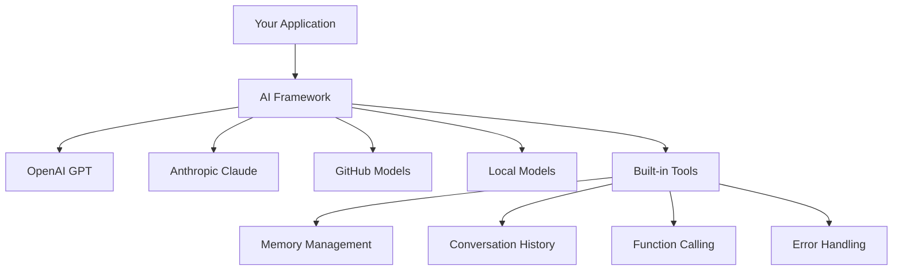
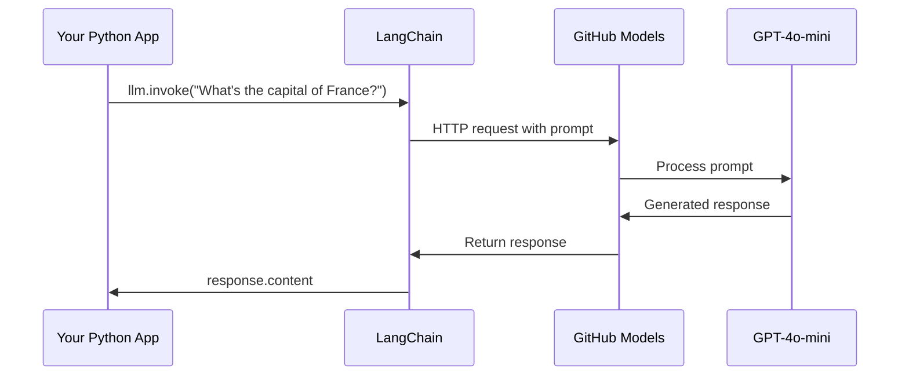
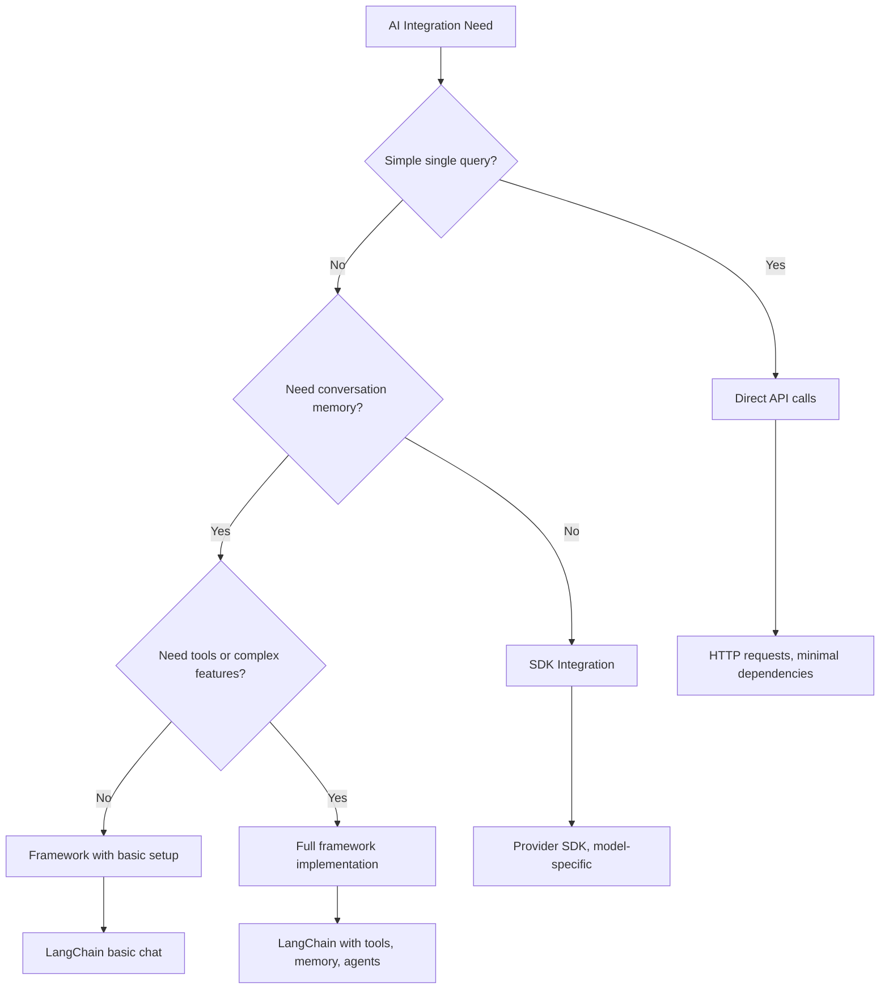

<!--
CO_OP_TRANSLATOR_METADATA:
{
  "original_hash": "e2c4ae5688e34b4b8b09d52aec56c79e",
  "translation_date": "2025-10-22T21:40:12+00:00",
  "source_file": "10-ai-framework-project/README.md",
  "language_code": "bn"
}
-->
# এআই ফ্রেমওয়ার্ক

কখনও কি মনে হয়েছে যে শূন্য থেকে এআই অ্যাপ্লিকেশন তৈরি করতে গিয়ে আপনি বিভ্রান্ত হয়ে পড়েছেন? আপনি একা নন! এআই ফ্রেমওয়ার্ক হলো এআই ডেভেলপমেন্টের জন্য একটি সুইস আর্মি নাইফের মতো - এটি শক্তিশালী একটি টুল যা বুদ্ধিমান অ্যাপ্লিকেশন তৈরি করার সময় আপনার সময় এবং ঝামেলা বাঁচাতে পারে। একটি এআই ফ্রেমওয়ার্ককে একটি সুসংগঠিত লাইব্রেরি হিসেবে ভাবুন: এটি পূর্বনির্মিত উপাদান, মানক API এবং স্মার্ট অ্যাবস্ট্রাকশন সরবরাহ করে যাতে আপনি সমস্যার সমাধানে মনোনিবেশ করতে পারেন, বাস্তবায়নের বিশদ নিয়ে লড়াই না করে।

এই পাঠে, আমরা LangChain-এর মতো ফ্রেমওয়ার্ক কীভাবে জটিল এআই ইন্টিগ্রেশন কাজগুলোকে পরিষ্কার, পাঠযোগ্য কোডে রূপান্তরিত করতে পারে তা অন্বেষণ করব। আপনি বাস্তব-জীবনের চ্যালেঞ্জ মোকাবেলা করার উপায় আবিষ্কার করবেন যেমন কথোপকথনের ট্র্যাক রাখা, টুল কলিং বাস্তবায়ন করা এবং একক ইন্টারফেসের মাধ্যমে বিভিন্ন এআই মডেল পরিচালনা করা।

পাঠ শেষে, আপনি জানবেন কখন ফ্রেমওয়ার্ক ব্যবহার করবেন কাঁচা API কলের পরিবর্তে, কীভাবে তাদের অ্যাবস্ট্রাকশন কার্যকরভাবে ব্যবহার করবেন এবং কীভাবে বাস্তব-জীবনের ব্যবহারের জন্য প্রস্তুত এআই অ্যাপ্লিকেশন তৈরি করবেন। চলুন দেখি এআই ফ্রেমওয়ার্ক আপনার প্রকল্পগুলোর জন্য কী করতে পারে।

## কেন ফ্রেমওয়ার্ক বেছে নেবেন?

তাহলে আপনি এআই অ্যাপ তৈরি করতে প্রস্তুত - দারুণ! কিন্তু এখানে একটি বিষয় আছে: আপনি কয়েকটি ভিন্ন পথ নিতে পারেন, এবং প্রতিটি পথের নিজস্ব সুবিধা এবং অসুবিধা রয়েছে। এটি অনেকটা হাঁটা, সাইকেল চালানো বা গাড়ি চালানোর মধ্যে বেছে নেওয়ার মতো - এগুলো সবই আপনাকে গন্তব্যে পৌঁছে দেবে, কিন্তু অভিজ্ঞতা (এবং প্রচেষ্টা) সম্পূর্ণ ভিন্ন হবে।

চলুন এআই আপনার প্রকল্পে সংযুক্ত করার তিনটি প্রধান উপায় বিশ্লেষণ করি:

| পদ্ধতি | সুবিধা | সেরা জন্য | বিবেচনা |
|----------|------------|----------|--------------|
| **ডাইরেক্ট HTTP রিকোয়েস্ট** | পূর্ণ নিয়ন্ত্রণ, কোনো ডিপেন্ডেন্সি নেই | সহজ প্রশ্ন, মৌলিক বিষয় শেখা | বেশি কোড, ম্যানুয়াল ত্রুটি পরিচালনা |
| **SDK ইন্টিগ্রেশন** | কম বয়লারপ্লেট, মডেল-নির্দিষ্ট অপ্টিমাইজেশন | একক-মডেল অ্যাপ্লিকেশন | নির্দিষ্ট প্রদানকারীদের সীমাবদ্ধ |
| **এআই ফ্রেমওয়ার্ক** | ইউনিফাইড API, বিল্ট-ইন অ্যাবস্ট্রাকশন | মাল্টি-মডেল অ্যাপ, জটিল ওয়ার্কফ্লো | শেখার বাঁধা, সম্ভাব্য অতিরিক্ত অ্যাবস্ট্রাকশন |

### বাস্তবে ফ্রেমওয়ার্কের সুবিধা



**কেন ফ্রেমওয়ার্ক গুরুত্বপূর্ণ:**
- **একীভূত করে** একাধিক এআই প্রদানকারীকে এক ইন্টারফেসে
- **স্বয়ংক্রিয়ভাবে পরিচালনা করে** কথোপকথনের মেমোরি
- **সরবরাহ করে** সাধারণ কাজের জন্য প্রস্তুত টুল যেমন এমবেডিং এবং ফাংশন কলিং
- **পরিচালনা করে** ত্রুটি হ্যান্ডলিং এবং রিট্রাই লজিক
- **জটিল ওয়ার্কফ্লোকে** পাঠযোগ্য মেথড কলসে রূপান্তরিত করে

> 💡 **প্রো টিপ**: বিভিন্ন এআই মডেলের মধ্যে স্যুইচ করার সময় বা এজেন্ট, মেমোরি, বা টুল কলিংয়ের মতো জটিল বৈশিষ্ট্য তৈরি করার সময় ফ্রেমওয়ার্ক ব্যবহার করুন। মৌলিক বিষয় শেখার সময় বা সহজ, ফোকাসড অ্যাপ্লিকেশন তৈরি করার সময় সরাসরি API ব্যবহার করুন।

**সারমর্ম**: এটি অনেকটা দক্ষ কারিগরের বিশেষায়িত টুল এবং একটি সম্পূর্ণ ওয়ার্কশপের মধ্যে বেছে নেওয়ার মতো। জটিল, বৈশিষ্ট্য-সমৃদ্ধ অ্যাপ্লিকেশনের জন্য ফ্রেমওয়ার্ক চমৎকার, যখন সরাসরি API সহজ ব্যবহার ক্ষেত্রে ভালো কাজ করে।

## পরিচিতি

এই পাঠে আমরা শিখব:

- একটি সাধারণ এআই ফ্রেমওয়ার্ক ব্যবহার করা।
- সাধারণ সমস্যাগুলো সমাধান করা যেমন চ্যাট কথোপকথন, টুল ব্যবহার, মেমোরি এবং প্রসঙ্গ।
- এটি ব্যবহার করে এআই অ্যাপ তৈরি করা।

## আপনার প্রথম এআই প্রম্পট

চলুন মৌলিক বিষয়গুলো দিয়ে শুরু করি, একটি এআই অ্যাপ্লিকেশন তৈরি করে যা একটি প্রশ্ন পাঠায় এবং একটি উত্তর ফিরে পায়। আর্কিমিডিস তার স্নানের সময় স্থানচ্যুতির নীতি আবিষ্কার করার মতো, কখনও কখনও সবচেয়ে সহজ পর্যবেক্ষণ সবচেয়ে শক্তিশালী অন্তর্দৃষ্টি নিয়ে আসে - এবং ফ্রেমওয়ার্কগুলো এই অন্তর্দৃষ্টি সহজলভ্য করে তোলে।

### LangChain সেটআপ করা GitHub মডেলের সাথে

আমরা LangChain ব্যবহার করব GitHub মডেলের সাথে সংযোগ করতে, যা বেশ চমৎকার কারণ এটি আপনাকে বিভিন্ন এআই মডেলের বিনামূল্যে অ্যাক্সেস দেয়। সেরা অংশ? শুরু করতে আপনার কেবল কয়েকটি সহজ কনফিগারেশন প্যারামিটার দরকার:

```python
from langchain_openai import ChatOpenAI
import os

llm = ChatOpenAI(
    api_key=os.environ["GITHUB_TOKEN"],
    base_url="https://models.github.ai/inference",
    model="openai/gpt-4o-mini",
)

# Send a simple prompt
response = llm.invoke("What's the capital of France?")
print(response.content)
```

**এখানে কী ঘটছে তা বিশ্লেষণ করা যাক:**
- **LangChain ক্লায়েন্ট তৈরি করে** `ChatOpenAI` ক্লাস ব্যবহার করে - এটি আপনার এআই-এর গেটওয়ে!
- **GitHub মডেলের সাথে সংযোগ কনফিগার করে** আপনার অথরাইজেশন টোকেন ব্যবহার করে
- **নির্ধারণ করে** কোন এআই মডেল ব্যবহার করা হবে (`gpt-4o-mini`) - এটি আপনার এআই সহকারী নির্বাচন করার মতো
- **আপনার প্রশ্ন পাঠায়** `invoke()` মেথড ব্যবহার করে - এখানেই ম্যাজিক ঘটে
- **উত্তর বের করে এবং প্রদর্শন করে** - এবং দেখুন, আপনি এআই-এর সাথে কথা বলছেন!

> 🔧 **সেটআপ নোট**: যদি আপনি GitHub Codespaces ব্যবহার করেন, তাহলে আপনি ভাগ্যবান - `GITHUB_TOKEN` ইতিমধ্যেই সেটআপ করা আছে! লোকালভাবে কাজ করছেন? চিন্তা করবেন না, আপনাকে কেবল সঠিক অনুমতি সহ একটি পার্সোনাল অ্যাক্সেস টোকেন তৈরি করতে হবে।

**প্রত্যাশিত আউটপুট:**
```text
The capital of France is Paris.
```



## কথোপকথনমূলক এআই তৈরি করা

প্রথম উদাহরণটি মৌলিক বিষয়গুলো প্রদর্শন করে, কিন্তু এটি কেবল একটি একক বিনিময় - আপনি একটি প্রশ্ন করেন, একটি উত্তর পান, এবং এটাই। বাস্তব অ্যাপ্লিকেশনে, আপনি চান আপনার এআই আপনার আলোচনার বিষয়বস্তু মনে রাখুক, যেমন ওয়াটসন এবং হোমস তাদের তদন্তমূলক কথোপকথন সময়ের সাথে তৈরি করেছিল।

এখানেই LangChain বিশেষভাবে কার্যকর। এটি বিভিন্ন মেসেজ টাইপ সরবরাহ করে যা কথোপকথন গঠন করতে সাহায্য করে এবং আপনার এআইকে একটি ব্যক্তিত্ব দিতে দেয়। আপনি এমন চ্যাট অভিজ্ঞতা তৈরি করবেন যা প্রসঙ্গ এবং চরিত্র বজায় রাখে।

### মেসেজ টাইপ বোঝা

এই মেসেজ টাইপগুলোকে কথোপকথনে অংশগ্রহণকারীদের বিভিন্ন "টুপি" হিসেবে ভাবুন। LangChain বিভিন্ন মেসেজ ক্লাস ব্যবহার করে কে কী বলছে তা ট্র্যাক করে:

| মেসেজ টাইপ | উদ্দেশ্য | উদাহরণ ব্যবহার |
|--------------|---------|------------------|
| `SystemMessage` | এআই-এর ব্যক্তিত্ব এবং আচরণ সংজ্ঞায়িত করে | "আপনি একজন সহায়ক কোডিং সহকারী" |
| `HumanMessage` | ব্যবহারকারীর ইনপুট উপস্থাপন করে | "ফাংশন কীভাবে কাজ করে তা ব্যাখ্যা করুন" |
| `AIMessage` | এআই-এর প্রতিক্রিয়া সংরক্ষণ করে | কথোপকথনে পূর্ববর্তী এআই প্রতিক্রিয়া |

### আপনার প্রথম কথোপকথন তৈরি করা

চলুন একটি কথোপকথন তৈরি করি যেখানে আমাদের এআই একটি নির্দিষ্ট ভূমিকা গ্রহণ করে। আমরা এটিকে ক্যাপ্টেন পিকার্ডের চরিত্রে রূপান্তরিত করব - একজন কূটনৈতিক প্রজ্ঞা এবং নেতৃত্বের জন্য পরিচিত চরিত্র:

```python
messages = [
    SystemMessage(content="You are Captain Picard of the Starship Enterprise"),
    HumanMessage(content="Tell me about you"),
]
```

**এই কথোপকথন সেটআপ বিশ্লেষণ করা:**
- **স্থাপন করে** এআই-এর ভূমিকা এবং ব্যক্তিত্ব `SystemMessage` এর মাধ্যমে
- **প্রদান করে** প্রাথমিক ব্যবহারকারীর প্রশ্ন `HumanMessage` এর মাধ্যমে
- **মাল্টি-টার্ন কথোপকথনের জন্য ভিত্তি তৈরি করে**

এই উদাহরণের সম্পূর্ণ কোডটি দেখতে এরকম:

```python
from langchain_core.messages import HumanMessage, SystemMessage
from langchain_openai import ChatOpenAI
import os

llm = ChatOpenAI(
    api_key=os.environ["GITHUB_TOKEN"],
    base_url="https://models.github.ai/inference",
    model="openai/gpt-4o-mini",
)

messages = [
    SystemMessage(content="You are Captain Picard of the Starship Enterprise"),
    HumanMessage(content="Tell me about you"),
]


# works
response  = llm.invoke(messages)
print(response.content)
```

আপনি একটি আউটপুট দেখতে পাবেন যা এরকম:

```text
I am Captain Jean-Luc Picard, the commanding officer of the USS Enterprise (NCC-1701-D), a starship in the United Federation of Planets. My primary mission is to explore new worlds, seek out new life and new civilizations, and boldly go where no one has gone before. 

I believe in the importance of diplomacy, reason, and the pursuit of knowledge. My crew is diverse and skilled, and we often face challenges that test our resolve, ethics, and ingenuity. Throughout my career, I have encountered numerous species, grappled with complex moral dilemmas, and have consistently sought peaceful solutions to conflicts.

I hold the ideals of the Federation close to my heart, believing in the importance of cooperation, understanding, and respect for all sentient beings. My experiences have shaped my leadership style, and I strive to be a thoughtful and just captain. How may I assist you further?
```

কথোপকথনের ধারাবাহিকতা বজায় রাখতে (প্রতিবার প্রসঙ্গ রিসেট করার পরিবর্তে), আপনাকে আপনার মেসেজ তালিকায় প্রতিক্রিয়া যোগ করতে হবে। অনেকটা মৌখিক ঐতিহ্যের মতো যা প্রজন্মের পর প্রজন্ম ধরে গল্প সংরক্ষণ করেছে, এই পদ্ধতি দীর্ঘস্থায়ী মেমোরি তৈরি করে:

```python
from langchain_core.messages import HumanMessage, SystemMessage
from langchain_openai import ChatOpenAI
import os

llm = ChatOpenAI(
    api_key=os.environ["GITHUB_TOKEN"],
    base_url="https://models.github.ai/inference",
    model="openai/gpt-4o-mini",
)

messages = [
    SystemMessage(content="You are Captain Picard of the Starship Enterprise"),
    HumanMessage(content="Tell me about you"),
]


# works
response  = llm.invoke(messages)

print(response.content)

print("---- Next ----")

messages.append(response)
messages.append(HumanMessage(content="Now that I know about you, I'm Chris, can I be in your crew?"))

response  = llm.invoke(messages)

print(response.content)

```

দারুণ, তাই না? এখানে যা ঘটছে তা হলো আমরা LLM-কে দুইবার কল করছি - প্রথমে আমাদের প্রাথমিক দুটি মেসেজ দিয়ে, তারপর আবার পুরো কথোপকথনের ইতিহাস দিয়ে। এটি অনেকটা এআই যেন আমাদের চ্যাটটি আসলেই অনুসরণ করছে!

যখন আপনি এই কোডটি চালান, আপনি একটি দ্বিতীয় প্রতিক্রিয়া পাবেন যা এরকম শোনাবে:

```text
Welcome aboard, Chris! It's always a pleasure to meet those who share a passion for exploration and discovery. While I cannot formally offer you a position on the Enterprise right now, I encourage you to pursue your aspirations. We are always in need of talented individuals with diverse skills and backgrounds. 

If you are interested in space exploration, consider education and training in the sciences, engineering, or diplomacy. The values of curiosity, resilience, and teamwork are crucial in Starfleet. Should you ever find yourself on a starship, remember to uphold the principles of the Federation: peace, understanding, and respect for all beings. Your journey can lead you to remarkable adventures, whether in the stars or on the ground. Engage!
```

আমি এটাকে "সম্ভবত" ধরে নিচ্ছি ;)

## স্ট্রিমিং প্রতিক্রিয়া

কখনও লক্ষ্য করেছেন কীভাবে ChatGPT তার প্রতিক্রিয়াগুলো রিয়েল-টাইমে "টাইপ" করে? এটি স্ট্রিমিংয়ের কাজ। দক্ষ ক্যালিগ্রাফার কাজ করার মতো - চরিত্রগুলো স্ট্রোক বাই স্ট্রোক প্রদর্শিত হয়, তাৎক্ষণিকভাবে নয় - স্ট্রিমিং ইন্টারঅ্যাকশনকে আরও প্রাকৃতিক করে তোলে এবং তাৎক্ষণিক প্রতিক্রিয়া প্রদান করে।

### LangChain দিয়ে স্ট্রিমিং বাস্তবায়ন

```python
from langchain_openai import ChatOpenAI
import os

llm = ChatOpenAI(
    api_key=os.environ["GITHUB_TOKEN"],
    base_url="https://models.github.ai/inference",
    model="openai/gpt-4o-mini",
    streaming=True
)

# Stream the response
for chunk in llm.stream("Write a short story about a robot learning to code"):
    print(chunk.content, end="", flush=True)
```

**কেন স্ট্রিমিং চমৎকার:**
- **কন্টেন্ট দেখায়** যখন এটি তৈরি হচ্ছে - আর অস্বস্তিকর অপেক্ষা নয়!
- **ব্যবহারকারীদের অনুভব করায়** যেন কিছু ঘটছে
- **দ্রুত মনে হয়**, যদিও এটি প্রযুক্তিগতভাবে নয়
- **ব্যবহারকারীদের পড়া শুরু করতে দেয়** যখন এআই এখনও "চিন্তা করছে"

> 💡 **ব্যবহারকারীর অভিজ্ঞতা টিপ**: স্ট্রিমিং সত্যিই উজ্জ্বল হয় যখন আপনি কোড ব্যাখ্যা, সৃজনশীল লেখা, বা বিস্তারিত টিউটোরিয়ালের মতো দীর্ঘ প্রতিক্রিয়ার সাথে কাজ করছেন। আপনার ব্যবহারকারীরা একটি খালি স্ক্রিনের দিকে তাকানোর পরিবর্তে অগ্রগতি দেখতে পছন্দ করবে!

## প্রম্পট টেমপ্লেট

প্রম্পট টেমপ্লেটগুলো অনেকটা ক্লাসিকাল বক্তৃতায় ব্যবহৃত রেটোরিকাল স্ট্রাকচারের মতো কাজ করে - ভাবুন কিভাবে সিসেরো তার বক্তৃতার প্যাটার্নগুলো বিভিন্ন শ্রোতার জন্য মানিয়ে নিতেন, একই সময়ে একই প্ররোচনামূলক কাঠামো বজায় রেখে। এগুলো আপনাকে পুনরায় ব্যবহারযোগ্য প্রম্পট তৈরি করতে দেয় যেখানে আপনি সমস্ত কিছু নতুন করে লেখার পরিবর্তে বিভিন্ন তথ্যের অংশ পরিবর্তন করতে পারেন। একবার আপনি টেমপ্লেট সেট আপ করলে, আপনি কেবল ভেরিয়েবলগুলোতে প্রয়োজনীয় মান পূরণ করবেন।

### পুনরায় ব্যবহারযোগ্য প্রম্পট তৈরি করা

```python
from langchain_core.prompts import ChatPromptTemplate

# Define a template for code explanations
template = ChatPromptTemplate.from_messages([
    ("system", "You are an expert programming instructor. Explain concepts clearly with examples."),
    ("human", "Explain {concept} in {language} with a practical example for {skill_level} developers")
])

# Use the template with different values
questions = [
    {"concept": "functions", "language": "JavaScript", "skill_level": "beginner"},
    {"concept": "classes", "language": "Python", "skill_level": "intermediate"},
    {"concept": "async/await", "language": "JavaScript", "skill_level": "advanced"}
]

for question in questions:
    prompt = template.format_messages(**question)
    response = llm.invoke(prompt)
    print(f"Topic: {question['concept']}\n{response.content}\n---\n")
```

**কেন আপনি টেমপ্লেট ব্যবহার করতে ভালোবাসবেন:**
- **আপনার প্রম্পটগুলোকে** আপনার পুরো অ্যাপ জুড়ে সামঞ্জস্যপূর্ণ রাখে
- **আর কোনো** বিশৃঙ্খল স্ট্রিং সংযোজন নয় - শুধু পরিষ্কার, সহজ ভেরিয়েবল
- **আপনার এআই** পূর্বানুমানযোগ্য আচরণ করে কারণ কাঠামো একই থাকে
- **আপডেটগুলো** সহজ - একবার টেমপ্লেট পরিবর্তন করুন, এবং এটি সর্বত্র ঠিক হয়ে যাবে

## সংগঠিত আউটপুট

কখনও কি এআই প্রতিক্রিয়াগুলোকে বিশৃঙ্খল টেক্সট হিসেবে পার্স করার চেষ্টা করে হতাশ হয়েছেন? সংগ
3. **ব্যক্তিগতকৃত শিক্ষা**: সিস্টেম বার্তা ব্যবহার করে বিভিন্ন দক্ষতার স্তরের জন্য উত্তরগুলি মানিয়ে নিন  
4. **উত্তর বিন্যাস**: কুইজ প্রশ্নের জন্য গঠনমূলক আউটপুট প্রয়োগ করুন  

### বাস্তবায়নের ধাপ  

**ধাপ ১: আপনার পরিবেশ সেটআপ করুন**  
```bash
pip install langchain langchain-openai
```
  
**ধাপ ২: মৌলিক চ্যাট কার্যকারিতা**  
- একটি `StudyAssistant` ক্লাস তৈরি করুন  
- কথোপকথনের স্মৃতি বাস্তবায়ন করুন  
- শিক্ষামূলক সহায়তার জন্য ব্যক্তিত্ব কনফিগারেশন যোগ করুন  

**ধাপ ৩: শিক্ষামূলক সরঞ্জাম যোগ করুন**  
- **কোড বিশ্লেষক**: কোডকে সহজবোধ্য অংশে বিভক্ত করে  
- **কুইজ জেনারেটর**: প্রোগ্রামিং ধারণা নিয়ে প্রশ্ন তৈরি করে  
- **প্রগ্রেস ট্র্যাকার**: কাভার করা বিষয়গুলির ট্র্যাক রাখে  

**ধাপ ৪: উন্নত বৈশিষ্ট্য (ঐচ্ছিক)**  
- আরও ভালো ব্যবহারকারীর অভিজ্ঞতার জন্য স্ট্রিমিং উত্তর বাস্তবায়ন করুন  
- কোর্স সামগ্রী অন্তর্ভুক্ত করতে ডকুমেন্ট লোডিং যোগ করুন  
- সামঞ্জস্য-ভিত্তিক বিষয়বস্তু পুনরুদ্ধারের জন্য এম্বেডিং তৈরি করুন  

### মূল্যায়নের মানদণ্ড  

| বৈশিষ্ট্য | চমৎকার (৪) | ভালো (৩) | সন্তোষজনক (২) | উন্নতির প্রয়োজন (১) |  
|----------|-------------|-----------|----------------|----------------------|  
| **কথোপকথনের প্রবাহ** | প্রাকৃতিক, প্রসঙ্গ-সচেতন উত্তর | ভালো প্রসঙ্গ ধরে রাখা | মৌলিক কথোপকথন | বিনিময়ের মধ্যে কোনো স্মৃতি নেই |  
| **সরঞ্জাম সংহতকরণ** | একাধিক কার্যকরী সরঞ্জাম নির্বিঘ্নে কাজ করছে | ২+ সরঞ্জাম সঠিকভাবে বাস্তবায়িত | ১-২ মৌলিক সরঞ্জাম | সরঞ্জাম কার্যকর নয় |  
| **কোডের গুণমান** | পরিষ্কার, ভালোভাবে ডকুমেন্টেড, ত্রুটি পরিচালনা | ভালো গঠন, কিছু ডকুমেন্টেশন | মৌলিক কার্যকারিতা কাজ করে | খারাপ গঠন, কোনো ত্রুটি পরিচালনা নেই |  
| **শিক্ষামূলক মূল্য** | শেখার জন্য সত্যিই সহায়ক, মানিয়ে নেওয়া | ভালো শিক্ষামূলক সহায়তা | মৌলিক ব্যাখ্যা | সীমিত শিক্ষামূলক সুবিধা |  

### নমুনা কোড গঠন  

```python
class StudyAssistant:
    def __init__(self, skill_level="beginner"):
        # Initialize LLM, tools, and conversation memory
        pass
    
    def explain_code(self, code, language):
        # Tool: Explain how code works
        pass
    
    def generate_quiz(self, topic, difficulty):
        # Tool: Create practice questions
        pass
    
    def chat(self, user_input):
        # Main conversation interface
        pass

# Example usage
assistant = StudyAssistant(skill_level="intermediate")
response = assistant.chat("Explain how Python functions work")
```
  
**বোনাস চ্যালেঞ্জ:**  
- ভয়েস ইনপুট/আউটপুট ক্ষমতা যোগ করুন  
- Streamlit বা Flask ব্যবহার করে একটি ওয়েব ইন্টারফেস বাস্তবায়ন করুন  
- এম্বেডিং ব্যবহার করে কোর্স সামগ্রী থেকে একটি জ্ঞানভিত্তি তৈরি করুন  
- অগ্রগতি ট্র্যাকিং এবং ব্যক্তিগতকৃত শিক্ষার পথ যোগ করুন  

## সারসংক্ষেপ  

🎉 আপনি এখন AI ফ্রেমওয়ার্ক ডেভেলপমেন্টের মৌলিক বিষয়গুলি আয়ত্ত করেছেন এবং LangChain ব্যবহার করে উন্নত AI অ্যাপ্লিকেশন তৈরি করতে শিখেছেন। একটি ব্যাপক শিক্ষানবিশতা সম্পন্ন করার মতো, আপনি দক্ষতার একটি উল্লেখযোগ্য সরঞ্জাম সংগ্রহ করেছেন। আসুন দেখে নেওয়া যাক আপনি কী অর্জন করেছেন।  

### আপনি যা শিখেছেন  

**কোর ফ্রেমওয়ার্ক ধারণা:**  
- **ফ্রেমওয়ার্কের সুবিধা**: সরাসরি API কলের পরিবর্তে ফ্রেমওয়ার্ক বেছে নেওয়ার সময় বুঝতে পারা  
- **LangChain মৌলিক বিষয়**: AI মডেল সংযোগ সেটআপ এবং কনফিগার করা  
- **বার্তার ধরন**: `SystemMessage`, `HumanMessage`, এবং `AIMessage` ব্যবহার করে গঠিত কথোপকথন  

**উন্নত বৈশিষ্ট্য:**  
- **সরঞ্জাম কলিং**: উন্নত AI ক্ষমতার জন্য কাস্টম সরঞ্জাম তৈরি এবং সংহতকরণ  
- **কথোপকথনের স্মৃতি**: একাধিক কথোপকথনের পালায় প্রসঙ্গ ধরে রাখা  
- **স্ট্রিমিং উত্তর**: রিয়েল-টাইম উত্তর ডেলিভারি বাস্তবায়ন  
- **প্রম্পট টেমপ্লেট**: পুনরায় ব্যবহারযোগ্য, গতিশীল প্রম্পট তৈরি করা  
- **গঠিত আউটপুট**: ধারাবাহিক, পার্সযোগ্য AI উত্তর নিশ্চিত করা  
- **এম্বেডিং**: সেমান্টিক সার্চ এবং ডকুমেন্ট প্রসেসিং ক্ষমতা তৈরি করা  

**ব্যবহারিক প্রয়োগ:**  
- **সম্পূর্ণ অ্যাপ তৈরি**: একাধিক বৈশিষ্ট্য একত্রিত করে প্রোডাকশন-রেডি অ্যাপ্লিকেশন তৈরি করা  
- **ত্রুটি পরিচালনা**: শক্তিশালী ত্রুটি ব্যবস্থাপনা এবং যাচাইকরণ বাস্তবায়ন  
- **সরঞ্জাম সংহতকরণ**: AI ক্ষমতা প্রসারিত করার জন্য কাস্টম সরঞ্জাম তৈরি করা  

### মূল বিষয়গুলো  

> 🎯 **মনে রাখবেন**: LangChain-এর মতো AI ফ্রেমওয়ার্কগুলি মূলত আপনার জটিলতা লুকানোর, বৈশিষ্ট্য-প্যাকড সেরা বন্ধু। কথোপকথনের স্মৃতি, সরঞ্জাম কলিং, বা একাধিক AI মডেলের সাথে কাজ করার সময় এগুলি নিখুঁত।  

**AI সংহতকরণের জন্য সিদ্ধান্ত ফ্রেমওয়ার্ক:**  


  
### এখান থেকে কোথায় যাবেন?  

**এখনই তৈরি করা শুরু করুন:**  
- এই ধারণাগুলি নিয়ে এমন কিছু তৈরি করুন যা আপনাকে উত্তেজিত করে!  
- LangChain-এর মাধ্যমে বিভিন্ন AI মডেলের সাথে খেলুন - এটি AI মডেলের একটি খেলার মাঠের মতো  
- এমন সরঞ্জাম তৈরি করুন যা আপনার কাজ বা প্রকল্পে প্রকৃত সমস্যার সমাধান করে  

**পরবর্তী স্তরের জন্য প্রস্তুত?**  
- **AI এজেন্ট**: এমন AI সিস্টেম তৈরি করুন যা নিজেরাই জটিল কাজ পরিকল্পনা এবং সম্পাদন করতে পারে  
- **RAG (Retrieval-Augmented Generation)**: AI-এর সাথে আপনার নিজস্ব জ্ঞানভিত্তি একত্রিত করুন সুপার-পাওয়ারড অ্যাপ্লিকেশনের জন্য  
- **মাল্টি-মোডাল AI**: টেক্সট, ইমেজ এবং অডিও একসাথে ব্যবহার করুন - সম্ভাবনাগুলি অসীম!  
- **প্রোডাকশন ডিপ্লয়মেন্ট**: আপনার AI অ্যাপ্লিকেশনগুলি স্কেল এবং বাস্তব জগতে পর্যবেক্ষণ করতে শিখুন  

**কমিউনিটিতে যোগ দিন:**  
- LangChain কমিউনিটি সেরা অনুশীলন শিখতে এবং আপডেট থাকার জন্য দুর্দান্ত  
- GitHub মডেলগুলি আপনাকে কাটিং-এজ AI ক্ষমতা অ্যাক্সেস দেয় - পরীক্ষা করার জন্য নিখুঁত  
- বিভিন্ন ব্যবহার ক্ষেত্রে অনুশীলন চালিয়ে যান - প্রতিটি প্রকল্প আপনাকে নতুন কিছু শেখাবে  

আপনার কাছে এখন বুদ্ধিমান, কথোপকথনমূলক অ্যাপ্লিকেশন তৈরি করার জ্ঞান রয়েছে যা মানুষকে প্রকৃত সমস্যার সমাধানে সাহায্য করতে পারে। রেনেসাঁ যুগের কারিগরদের মতো যারা শিল্পী দৃষ্টিভঙ্গি এবং প্রযুক্তিগত দক্ষতা একত্রিত করতেন, আপনি এখন AI ক্ষমতাগুলিকে ব্যবহারিক প্রয়োগের সাথে একত্রিত করতে পারেন। প্রশ্ন হল: আপনি কী তৈরি করবেন? 🚀  

## GitHub Copilot Agent Challenge 🚀  

Agent মোড ব্যবহার করে নিম্নলিখিত চ্যালেঞ্জ সম্পন্ন করুন:  

**বর্ণনা:** একটি উন্নত AI-চালিত কোড রিভিউ সহকারী তৈরি করুন যা টুল কলিং, গঠিত আউটপুট এবং কথোপকথনের স্মৃতি সহ একাধিক LangChain বৈশিষ্ট্য একত্রিত করে কোড জমা দেওয়ার ব্যাপারে ব্যাপক প্রতিক্রিয়া প্রদান করে।  

**প্রম্পট:** একটি CodeReviewAssistant ক্লাস তৈরি করুন যা বাস্তবায়ন করে:  
1. কোডের জটিলতা বিশ্লেষণ এবং উন্নতির পরামর্শ দেওয়ার জন্য একটি সরঞ্জাম  
2. সেরা অনুশীলনের বিরুদ্ধে কোড পরীক্ষা করার জন্য একটি সরঞ্জাম  
3. ধারাবাহিক রিভিউ ফরম্যাটের জন্য Pydantic মডেল ব্যবহার করে গঠিত আউটপুট  
4. রিভিউ সেশনের ট্র্যাক রাখতে কথোপকথনের স্মৃতি  
5. একটি প্রধান চ্যাট ইন্টারফেস যা কোড জমা পরিচালনা করতে পারে এবং বিস্তারিত, কার্যকরী প্রতিক্রিয়া প্রদান করতে পারে  

সহকারীটি একাধিক প্রোগ্রামিং ভাষায় কোড রিভিউ করতে সক্ষম হওয়া উচিত, একটি সেশনে একাধিক কোড জমার মধ্যে প্রসঙ্গ ধরে রাখতে সক্ষম হওয়া উচিত এবং সারসংক্ষেপ স্কোর এবং বিস্তারিত উন্নতির পরামর্শ উভয়ই প্রদান করতে সক্ষম হওয়া উচিত।  

আরও জানুন [agent mode](https://code.visualstudio.com/blogs/2025/02/24/introducing-copilot-agent-mode) এখানে।  

---

**অস্বীকৃতি**:  
এই নথিটি AI অনুবাদ পরিষেবা [Co-op Translator](https://github.com/Azure/co-op-translator) ব্যবহার করে অনুবাদ করা হয়েছে। আমরা যথাসাধ্য সঠিকতার জন্য চেষ্টা করি, তবে অনুগ্রহ করে মনে রাখবেন যে স্বয়ংক্রিয় অনুবাদে ত্রুটি বা অসঙ্গতি থাকতে পারে। মূল ভাষায় থাকা নথিটিকে প্রামাণিক উৎস হিসেবে বিবেচনা করা উচিত। গুরুত্বপূর্ণ তথ্যের জন্য, পেশাদার মানব অনুবাদ সুপারিশ করা হয়। এই অনুবাদ ব্যবহারের ফলে কোনো ভুল বোঝাবুঝি বা ভুল ব্যাখ্যার জন্য আমরা দায়ী থাকব না।